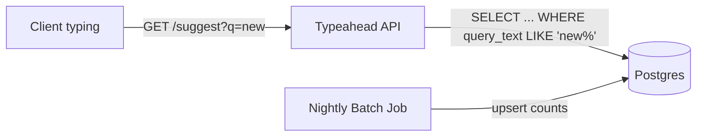
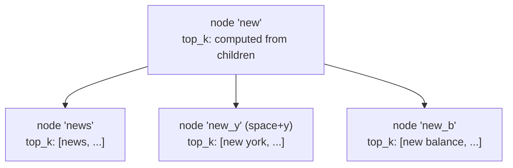
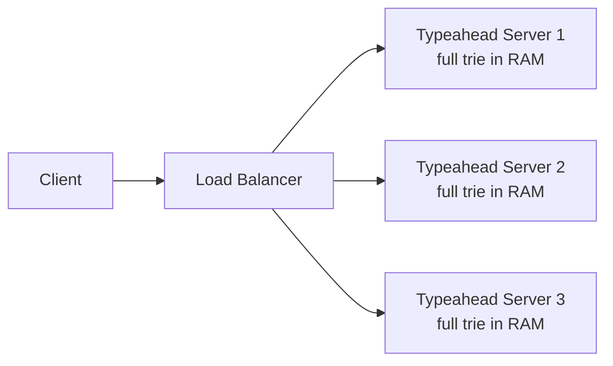
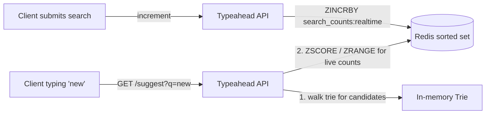
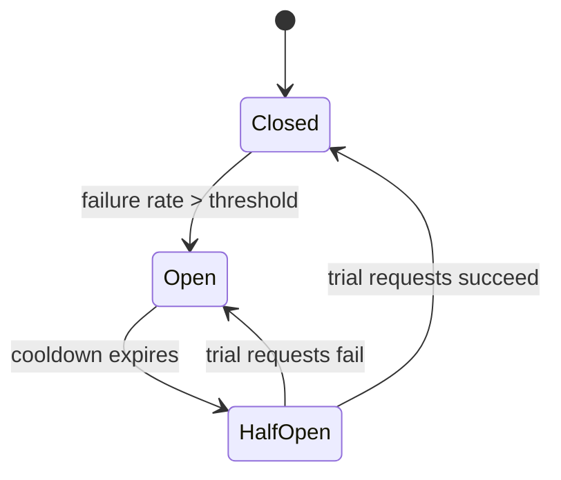
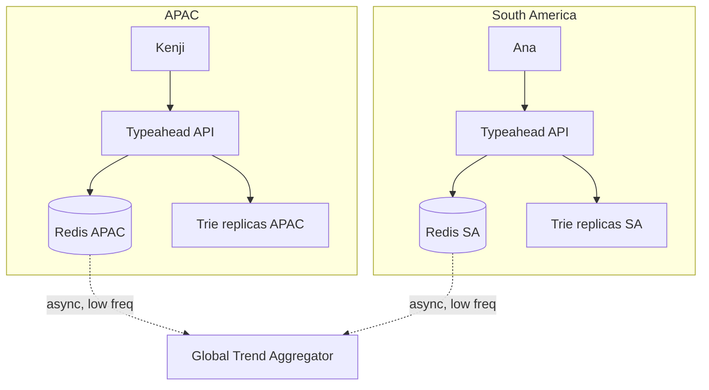
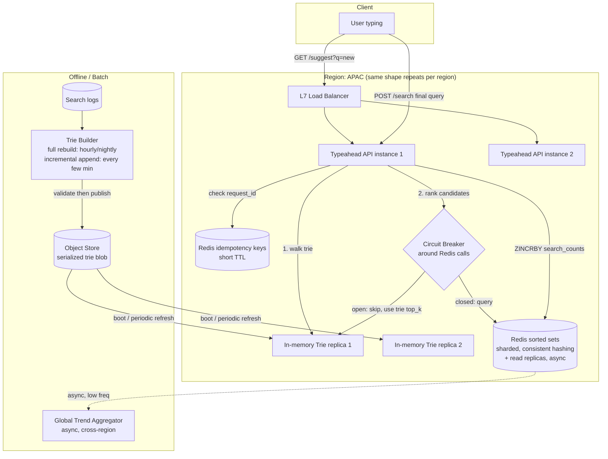
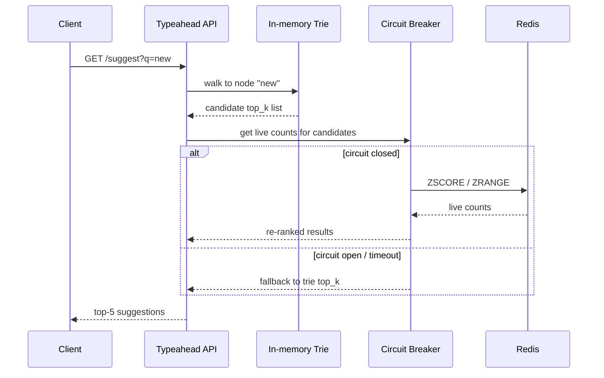
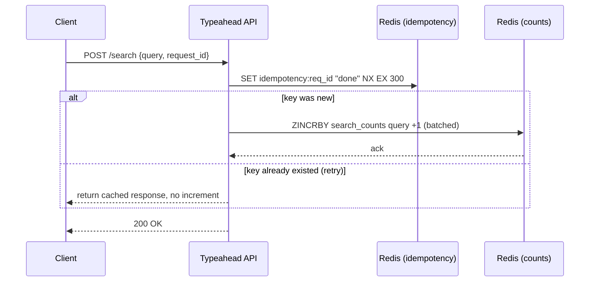

# Typeahead Suggestion System

## The Hook

It's the mid-2000s, and Google's search box is still a dumb text field. You type "weath," hit enter, wait for a full page load, and only then find out you meant "weather forecast."

Someone at Google notices something: people are slow typists, but they're fast *readers*. If the system can guess the rest of the query after just a few keystrokes, users save real time — and Google gets to see (and shape) intent before the search even fires.

The catch: this has to happen *while you're still typing*. Every keystroke fires a new request, and the response has to feel instant — not "fast for a database query," but genuinely instant, like the system already knew what you wanted.

That's the whole game. Not "can we find matching strings" — any `LIKE '%weath%'` query can do that badly. It's "can we find them in single-digit milliseconds, at massive fan-out, ranked by what's actually popular."

---

## Scope Constraint

Here's what I think actually drives the interesting design decisions. Confirm or push back before we start.

**P0 — Core requirements:**

1. **Prefix-based retrieval.** Given a partial string ("weath"), return the top-k most relevant completions ("weather," "weather forecast," "weather nyc"). This is the basic contract of the system.
2. **Low latency at every keystroke.** Sub-100ms end-to-end, ideally sub-50ms, because this fires on *every character typed*, not once per search. This is the requirement that shapes almost every architectural choice we'll make — it rules out naive "query the DB per request" approaches immediately.
3. **Ranking by popularity/relevance**, not just alphabetical match. "New york" should beat "new zealand grocery stores" for the prefix "new y" — but really, popularity has to inform ranking for any prefix where multiple real completions exist.
4. **Freshness at scale.** Trending queries (a breaking news event, a new meme) need to surface within a reasonable window — not instantly, but not stuck with yesterday's popularity counts either. This is what turns the system from "a static sorted-string lookup" into a genuinely hard distributed systems problem.

**The crux:** requirement #2 (latency) combined with #4 (freshness) is where we'll spend most of our time. A system that's fast but frozen (rebuild the whole index nightly) is easy. A system that's fresh but slow (recompute rankings live per request) is easy. Fast *and* fresh, at scale, is the hard part — that tension is basically the entire design.

**What I'm cutting (P2, no major architectural impact):**

- **Spell correction / fuzzy matching** ("wether" → "weather"). Real product feature, but it's a bolt-on (usually a separate edit-distance service or index) that doesn't change the core prefix-serving architecture.
- **Personalization** (ranking differently per user based on their history). Interesting, but it's an overlay on top of the base ranking system, not a structural change to how we store/serve prefixes.
- **Multi-language / query segmentation** (handling CJK languages, which don't tokenize on whitespace). A real production concern, but a tokenization detail, not a distributed-systems one.
- **Rich autocomplete UI concerns** (images in suggestions, categorized results). Pure frontend/product surface.

Does this scoped list look right to you, or is there something you'd want pulled in — e.g., do you want personalization included since it's a common follow-up question, even if we just cover it lightly at the end?

---

# Day 0: The Naive Approach

## The Scenario

Meet **Raj**, engineer number one on this project. He's got a table of past search queries and how often each one was searched. His job: when someone types "new," show them the top completions.

The obviously-correct, obviously-simple thing to do is store queries in a database and query them with a prefix match at request time.

```sql
CREATE TABLE search_queries (
    query_text VARCHAR(255) PRIMARY KEY,
    search_count BIGINT NOT NULL
);
```

**Who writes to this table:** a nightly batch job that scans yesterday's search logs, counts occurrences of each query string, and upserts the counts.

**Who reads from it:** the typeahead API, on every keystroke.

The read query, when someone types "new":

```sql
SELECT query_text, search_count
FROM search_queries
WHERE query_text LIKE 'new%'
ORDER BY search_count DESC
LIMIT 5;
```

This lives in a single **Postgres** instance. One box, one table, one query pattern. Nothing distributed yet.

## Why This Is a Reasonable Starting Point

This isn't a strawman. It's genuinely correct: the results are always consistent with whatever's in the table, there's no staleness within a request, and it's trivial to reason about. If your traffic is small — an internal admin tool's search box, say — this is honestly fine, and you'd be over-engineering to do anything fancier.

The guarantee Day 0 gives you, that later iterations will deliberately trade away, is **strong consistency with zero moving parts**. One table, one source of truth, no cache to go stale, no replica to lag. Every later iteration we do is going to sacrifice some of that simplicity to buy speed or freshness.



## Where It Breaks

Two separate problems, and it's worth seeing them as distinct failures rather than one vague "it's slow."

**Problem 1: the query itself is fundamentally the wrong shape.**

`LIKE 'new%'` *looks* like it should use an index, and on some databases with the right index type it can — but even in the best case, a B-tree index on `query_text` is doing string comparisons down the tree for every request. Now put this at the traffic this feature actually gets: a keystroke fires a request. Someone typing "weather forecast nyc" fires **19 separate queries** — one per character — in the time it takes them to type one search.

At Google-scale query volume, that's not thousands of queries a second. It's tens of millions.

**Problem 2: even if the query were instant, one Postgres box cannot hold that fan-out.**

One database server, however well-indexed, has a ceiling on concurrent connections and query throughput. Typeahead isn't a "occasionally hit the DB" workload — it's a "hit the DB continuously, for every user, for every character" workload. Raj's single Postgres instance falls over long before we even get to the interesting distributed-systems questions.

**Concretely:** imagine a trending search event — say a major sports upset — hits at 8pm. Everyone starts typing the team name at once. Each keystroke is a fresh `LIKE` query against the same hot rows in the same single database. The box that was fine for typical traffic now has thousands of concurrent prefix scans stacked on it, and latency for *every* user, not just the ones searching the trending term, degrades.

---

**Next up:** we fix the query-shape problem first — trading the relational `LIKE` scan for a data structure that's actually built for prefix lookups. That's the natural first evolution, before we even touch the "too many requests hitting one box" problem.

Got it, or want to dig into anything on Day 0 first?

---

# Iteration 1: Fixing the Query Shape — the Trie

## The Scenario

Raj's next move: stop asking a general-purpose relational engine to do a job it's not built for, and reach for a data structure whose entire reason to exist is prefix lookups.

Before landing on the answer, it's worth walking through what a reasonable engineer tries first — because "just use a trie" sounds obvious in hindsight, but it's not the first thing most people reach for.

### Attempt 1: Sorted array + binary search

Idea: keep all query strings sorted alphabetically in memory. To find completions of "new," binary-search for the first string ≥ "new", then walk forward until strings stop starting with "new".

This looks reasonable — binary search is O(log n), way better than a table scan. It works, for a while.

**Where it breaks:** every single insert or update (a query's count changes, or a brand-new query shows up) means re-sorting or shifting a huge array. This structure is *read*-optimized but the popularity counts backing it change constantly. You'd be rebuilding a multi-million-entry sorted array continuously. It also doesn't help you rank — you still have to scan the whole matching range and sort by count separately.

### Attempt 2: Inverted index (like a search engine)

Idea: borrow from full-text search — build an index mapping each possible prefix to a list of matching queries, the way Elasticsearch maps tokens to documents.

This looks reasonable because it's a proven, battle-tested piece of infrastructure — why reinvent it?

**Where it breaks:** an inverted index is built for *token* matching ("does this document contain the word 'weather'"), not *character-by-character prefix growth*. To support prefix search this way, you'd need to index every prefix of every string — "n", "ne", "new", "new ", "new y"... — as a separate key. For a query string of length 20, that's 20 index entries for one string. It technically works, but it's paying a huge storage and indexing-time cost to simulate something a different structure gives you for free.

### Attempt 3: The Trie

Idea: a tree where each node is a single character, and a path from root to node spells out a prefix. All queries starting with "new" live under the same subtree, rooted at n → e → w.

This is the one that actually fits the access pattern natively, instead of bolting it on:

```
        root
         |
         n
         |
         e
         |
         w  (marks: "new" is a complete query, count=50000)
        / \
       s   y
       |   |
       "news"     " "
                   |
                  "york" (marks: "new york", count=800000)
```

Walking to a node *is* the prefix lookup — no scan, no separate index structure. Cost to find the subtree for "new" is O(length of "new"), not O(number of stored queries).

**The maitre d' analogy:** think of a trie like a hotel concierge desk organized by name, letter by letter, in physical pigeonholes. You don't scan every guest's mail to find "Newman" — you go to the "N" shelf, then the "Ne" drawer, then pull out everything left. The organization *is* the search.

## What Each Node Actually Stores

```json
{
  "children": { "e": <node>, "o": <node>, ... },
  "is_end_of_query": false,
  "query_text": null,
  "count": null
}
```

Only nodes marking a complete query (`is_end_of_query: true`) carry `query_text` and `count`. Internal nodes are pure routing.

**Who builds this structure:** an offline **Trie Builder** job — same batch process from Day 0, but instead of upserting rows into Postgres, it constructs the trie in memory and serializes it.

**Who reads it:** the Typeahead API, walking the trie character by character as the user types.

**Where it lives:** in-memory, on the serving box — not Postgres anymore. This is the first real technology-class decision: we're moving from a disk-backed relational store to an **in-memory tree structure**, because the access pattern (walk a path, then read a small subtree) is latency-critical and the data is small enough to fit in RAM for now. A relational engine pays disk I/O and query-planning overhead for something that should be a handful of pointer dereferences.

## Comparison So Far

| Approach | Prefix lookup cost | Handles frequent updates | Ranking support |
|---|---|---|---|
| `LIKE` scan (Day 0) | O(n) scan | Easy (just UPDATE) | Needs separate ORDER BY |
| Sorted array | O(log n) find, O(n) rebuild | Bad — full rebuild | Needs separate sort |
| Inverted index | O(1) lookup, O(query length) storage blowup | Moderate | Needs separate sort |
| **Trie** | **O(prefix length)** | Moderate (see next) | Built-in if we store top-k at each node |

## What We Gained / What We Gave Up

**Gained:** prefix lookup that's O(prefix length) instead of O(data size) — genuinely fast, and the query shape now matches the problem shape.

**Gave up:** we haven't actually solved ranking yet. Right now, finding the "new" subtree tells us *which* queries match — it doesn't hand us the *top 5 by popularity* without walking the entire subtree and sorting. If "new york," "new york times," "new york weather," and 40,000 other "new ___" queries all live under that node, sorting on every request is its own expensive operation.

We also haven't touched the "this only lives on one box" problem from Day 0 — that's still fully unsolved.

**Rejected alternative:** we could've kept Postgres but added a `GIN` trigram index to speed up the `LIKE` query. Rejected because it optimizes the same fundamentally wrong query shape — it lowers the constant factor but doesn't change that we're asking a disk-backed relational engine to do millions of tiny lookups a second, and it does nothing for the ranking problem either.

## Likely Follow-Up Questions

**"Why not a hash map from prefix string to results, instead of a trie?"**
You could precompute every prefix → top-k mapping as flat key-value pairs. It's actually a valid alternative (we'll revisit this as "precomputed cache" later) — but built naively, it means redundant storage across every prefix length and awkward incremental updates when a count changes, since one query's count change touches every prefix-length entry for that string. A trie shares structure between prefixes naturally.

**"What happens if two users search prefixes that hit the same trie node concurrently?"**
Reads are naturally safe if the trie is treated as read-only during serving — concurrent reads don't contend. The interesting question is what happens when the Trie Builder needs to *update* it, which we haven't addressed yet — that's coming.

---

**Next up:** we solve ranking — how do we get the top-k at each node without sorting a huge subtree on every request? That's the first half of the actual crux (fast serving). Then we'll tackle the second half: how does this trie stay fresh without a full nightly rebuild.

Got it, or want to dig into the trie construction first?

---

# Iteration 2: Solving Ranking — Precomputed Top-K per Node

## The Scenario

Say the trie is built. Someone types "new" and we land on that subtree instantly. But under it sit tens of thousands of completions — "new york," "new balance shoes," "new zealand time," and on and on.

**Priya**, another engineer on the team, tries the obvious thing first.

### Attempt 1: Sort the subtree at request time

Idea: walk every node under "new," collect all complete queries, sort by count, take the top 5.

This looks reasonable — it's correct, and it's simple to reason about.

**Where it breaks:** the subtree under a short, common prefix like "new" can have tens of thousands of leaf nodes. Sorting that on *every keystroke*, for *every user*, is exactly the kind of per-request heavy computation we set out to eliminate in Iteration 1. We fixed the *lookup*, but we're still paying an expensive cost once we get there. For a popular single-letter prefix like "a" or "s," this subtree could be enormous — this doesn't degrade gracefully, it falls over precisely on the most common prefixes.

### Attempt 2: Cache the sorted result per prefix, computed lazily on first request

Idea: first user to type "new" pays the sort cost; cache the result; everyone after gets it free until the cache expires.

This looks reasonable — classic cache-aside pattern.

**Where it breaks:** it doesn't help the *first* request for any given prefix, and worse, it doesn't help *rare* prefixes at all — a long-tail prefix like "new hamp" might get one request an hour, so it's essentially always a cache miss, always paying full cost. It also doesn't fix the fundamental issue: you're still occasionally doing a full subtree sort, just less often.

### Attempt 3: Precompute top-k at build time, store it at the node

Idea: instead of computing top-5 at *request* time, compute it once at *build* time, and store the answer directly on the node.

```json
{
  "children": { "e": <node>, "o": <node>, ... },
  "is_end_of_query": false,
  "query_text": null,
  "count": null,
  "top_k": [
    {"query_text": "new york", "count": 800000},
    {"query_text": "new york times", "count": 450000},
    {"query_text": "new balance", "count": 300000},
    {"query_text": "news", "count": 290000},
    {"query_text": "new zealand", "count": 150000}
  ]
}
```

Now serving "new" is: walk to the node (O(prefix length)), read `top_k` (O(1), it's just a list of 5). No sorting, no subtree walk, at request time — ever.

**Why this works and the others didn't:** we moved the expensive work from request time (happens millions of times a second) to build time (happens once, offline, and can take as long as it needs). This is the same trade every caching/precomputation strategy makes — pay once, amortize across all reads.

## How Top-K Gets Computed

This is a **bottom-up aggregation** during the trie build:

1. For each leaf (a complete query), its own `top_k` is just itself.
2. For each internal node, `top_k` = merge the `top_k` lists of all children, then take the overall top 5 by count.

Because each child already hands up only its own top 5, an internal node with 26 children only ever has to merge and re-sort 26 × 5 = 130 candidates — not the full subtree. This is the trick that makes it cheap even for nodes with huge subtrees underneath.



## Who Writes, Who Reads

| | Component | Action |
|---|---|---|
| Writes | Trie Builder (offline, batch) | Computes `top_k` bottom-up during trie construction |
| Reads | Typeahead API (online, per-request) | Walks to node, returns `top_k` directly |

Same **in-memory trie** from Iteration 1 as the storage location — we haven't introduced a new store here, just enriched the existing node structure.

## What We Gained / What We Gave Up

**Gained:** O(1) ranking lookup once we're at the right node. Request-time cost is now purely dominated by the O(prefix length) tree walk — genuinely fast, genuinely bounded regardless of subtree size.

**Gave up:** the trie is no longer trivially updatable. In Iteration 1, updating one query's count meant touching one leaf. Now, updating one leaf's count potentially means recomputing `top_k` for *every ancestor node* up to the root, because a count change could bump that query into or out of some ancestor's top-5. This is the seed of the freshness problem we scoped as requirement #4 — we're about to feel that pain directly.

**Rejected alternative:** store the full sorted list of *all* descendants at each node, not just top-5. Rejected — that's massively more memory (duplicating data at every level of the tree) for no benefit, since we only ever display top-5 to a user anyway.

## Likely Follow-Up Question

**"Why top 5 specifically, and does that number matter architecturally?"**
The exact k (5, 10) is a product choice, not an architectural one — the mechanism (bottom-up merge of children's top-k) works identically regardless of k. What *does* matter architecturally: k should stay small (single digits), because the per-node merge cost is O(children × k log(children × k)), and this runs at every internal node during every rebuild.

---

**Next up:** this trie still lives on one box, and it's fully static between rebuilds. We tackle serving-at-scale (multiple servers) first, since that's the more contained problem — then freshness, which is the harder one, gets its own dedicated stretch given what we just saw about `top_k` propagation.

Got it, or want to linger on the top-k merge mechanics?

---

# Iteration 3: Serving at Scale — Replicating the Trie

## The Scenario

The trie now answers any prefix query in microseconds — as long as you're the one box holding it in memory. But Iteration 0 already told us: typeahead traffic is a tidal wave of tiny requests, every keystroke, from every user, all the time. One server, however fast its in-memory lookups are, has a ceiling on how many TCP connections and requests per second it can physically handle.

This is a *different* problem from the ones we've solved so far. Iterations 1 and 2 fixed the **cost per request**. This one is about **how many requests one box can absorb**, full stop — even at near-zero cost per request, there's a throughput ceiling.

## Attempt 1: Vertical scaling — just get a bigger box

Idea: the trie fits in RAM easily; if traffic grows, buy a server with more cores and more network bandwidth.

This looks reasonable as a first move — it's true that this buys real headroom.

**Where it breaks:** there's a hard ceiling. Even the biggest single machine has a fixed number of NICs, a fixed number of cores, a fixed max concurrent-connection count. And there's no failover — if that one box goes down, autocomplete is down for everyone, everywhere, simultaneously. For a feature this latency-sensitive and this global, a single point of failure is a non-starter regardless of how big the box is.

## Attempt 2: Horizontal scaling — replicate the trie across many servers

Idea: since the trie is read-mostly at serving time (it only changes during rebuilds, which we haven't tackled yet), just copy the *entire* trie onto N identical servers. Put a load balancer in front. Any server can answer any prefix query, because every server has the whole tree.

This is the one that fits, because the read access pattern is embarrassingly parallel — one user's "new" lookup has zero dependency on another user's "wea" lookup. There's no shared mutable state at request time to coordinate.



**Why full replication, not sharding the trie itself:** you might think to shard the trie — server 1 owns "a"–"m", server 2 owns "n"–"z". This works too, and real systems do sometimes do this once the trie is too big for one box's RAM. But it adds a routing hop (the load balancer or a routing layer needs to know which shard owns which prefix) for something that, at this size, doesn't need it. Full replication is simpler and avoids that hop entirely — worth doing until the trie's memory footprint genuinely forces sharding.

## Load Balancing Choice

**Algorithm:** since every server holds an identical, complete copy of the trie, *any* server can serve *any* request equally well. There's no need for consistent hashing or session affinity here — this isn't like sharding a database where routing to the wrong node fails. Plain **round-robin** (or least-connections, to account for servers momentarily under more load) is enough.

**L4 vs L7:** this should be an **L7 (application-layer)** load balancer, not L4, because we want health checks that verify the *application* is actually serving valid trie responses — not just that the TCP port is open. A box with a corrupted or half-loaded trie could accept TCP connections fine while returning garbage.

**Health checks:** a lightweight `GET /health` endpoint that checks (a) the process is up, and (b) the trie has finished loading into memory (important — see below). A box that's still loading its trie should fail health checks and receive no traffic until ready.

## What's New State Here

No new queue, cache, or store yet — this iteration is purely about **how many copies of the existing trie exist and how traffic reaches them**. One thing worth naming explicitly though: each server needs to load the serialized trie from somewhere on startup.

**Where the serialized trie lives between builds:** an object store (S3-equivalent) — the Trie Builder writes the finished trie there, and each serving box pulls it down on boot or refresh. Object storage fits here because the access pattern is "write one large immutable blob, read it in full, occasionally" — not the small-record random access relational or key-value stores are built for.

| | Component | Action |
|---|---|---|
| Writes | Trie Builder | Serializes finished trie, uploads to object store as one blob |
| Reads | Each Typeahead Server (on boot / refresh) | Downloads blob, deserializes into in-memory trie |

## What We Gained / What We Gave Up

**Gained:** horizontal scalability (add more boxes as traffic grows) and fault tolerance (one box dying doesn't take down the service — the load balancer just stops routing to it).

**Gave up:** memory cost multiplies by N — we're now storing N full copies of the trie instead of one. For now that's a fine trade since the trie is small; it becomes a real constraint later if the dataset grows enormous, which is a reason we might eventually shard rather than replicate.

**Rejected alternative:** shard the trie by prefix range across servers now, instead of replicating. Rejected for now — adds a routing layer and cross-shard complexity (a prefix near a shard boundary, or wanting global top-k across shards) for a problem we don't have yet at this data size. Worth revisiting if the trie's memory footprint becomes the bottleneck rather than request throughput.

## Likely Follow-Up Questions

**"What if a server's trie copy is out of date compared to others?"**
Right now — since we haven't solved freshness yet — all copies are identical because they all loaded the same static blob. Once rebuilds happen periodically, different servers could pull the new blob at slightly different times, so for a brief window some servers serve the old trie and some serve the new one. That's an acceptable, bounded inconsistency for this use case — nobody notices if suggestion rankings update a few seconds apart across servers, unlike, say, a bank balance.

**"Why not just use a CDN in front of this instead of a load balancer + server fleet?"**
Worth flagging now since caching comes up soon: a CDN caches *responses*, which works great for identical requests from many users, but typeahead has enormous request-space cardinality — every prefix a user could type is potentially a different cache key, and personalization (even though we scoped it out) would break CDN caching entirely. A CDN can still help for the *most* common short prefixes, which we'll get to in the caching iteration.

---

**Next up:** freshness — the trie is now fast and horizontally scaled, but it's frozen between rebuilds, and Iteration 2 showed us that even a single count update can ripple all the way up to the root. This is the real crux of the whole system: how do we keep rankings current (trending topics, breaking news) without paying a full rebuild every time or blowing up write cost.

Got it, or want to dig into load balancer specifics first?

---

# Iteration 4: The Freshness Problem — Keeping the Trie Current

## The Scenario

It's Tuesday night. A major earthquake hits. Within minutes, "earthquake" goes from a query nobody's typing to one of the most-searched terms on the internet.

Right now, our trie only updates when the Trie Builder does a full offline rebuild — walk every log, recount everything, rebuild the whole structure bottom-up, `top_k` and all, then push a new blob to object storage. If that job runs nightly, "earthquake" won't show up as a suggestion until tomorrow. That's not a minor product gap — it's the exact requirement (#4, freshness) we flagged at scoping as the hard one.

## Attempt 1: Just run the rebuild more often

Idea: instead of nightly, run the full Trie Builder job every 5 minutes.

This looks reasonable — it's the same mechanism we already have, just on a tighter schedule.

**Where it breaks:** a full rebuild means re-scanning *all* historical search logs and recomputing `top_k` for *every* node in the entire trie, from the leaves up — not just the nodes affected by tonight's earthquake searches. Iteration 2 showed us this bottom-up merge is cheap *per node*, but "every node in a trie covering the entire internet's search vocabulary" is still a massive batch job. Running that every 5 minutes means it might not even finish before the next run starts, and it's doing a huge amount of wasted work re-deriving counts for "weather," "youtube," and millions of other queries that didn't change at all tonight.

## Attempt 2: Update counts in place, live, on every search

Idea: skip batch entirely — every time someone searches "earthquake," increment its count directly in the live, in-memory trie that's actively serving traffic, and propagate the change up to ancestor `top_k` lists immediately.

This looks reasonable — it's the most "real-time" version of the idea, no batch delay at all.

**Where it breaks, concretely:** two things.

First, Iteration 2's lesson bites hard here — updating one leaf's count can require recomputing `top_k` for every ancestor up to the root. "Earthquake" sits under "e" → "ea" → "ear"... that's a shallow chain, fine. But now imagine this happening for *every search, from every user, on every server* — millions of times a second — each one potentially triggering cascading recomputation up a chain of nodes. We'd be doing expensive write-path work on the exact hot path we spent three iterations making read-fast.

Second, and worse: we replicated the trie across N servers in Iteration 3 specifically so any server can answer any request independently. If updates happen live and locally on whichever server handles a given search, the tries on different servers instantly diverge — server 1 knows about 40 "earthquake" searches, server 2 knows about 25, and they never reconcile. There's no mechanism here for the copies to agree.

## Attempt 3: Separate the hot, changing signal from the cold, structural trie

The real insight: **query popularity changes constantly, but the *set* of valid completions for a prefix changes slowly.** "New york," "new balance," and "new zealand" have been valid completions of "new" for years. What changes minute-to-minute is *how popular each one is right now*.

So split the problem in two:

- **The trie structure** (which strings exist as completions, what the tree shape is) — rebuilt periodically, same mechanism as before, but now it only has to track *approximately* which queries exist, not their exact live counts.
- **A separate, fast-updating counter store** — tracks real-time search counts per query string, updated on every search, completely decoupled from the trie's tree structure.

Serving a request becomes two steps: walk the trie to find candidate completions for "new" (structural, rarely changes), then look up *current* counts for those candidates from the fast counter store to rank them (changes constantly).

This is the same pull-vs-push intuition as a **newsstand vs. a subscription**: instead of pushing every single sale event into a fully reorganized shelf display (Attempt 2), you keep the shelf layout mostly stable (Attempt 1's slow rebuild) and just check a running tally of what's selling right now when you decide what to feature up front.

## Where the Real-Time Counts Live

This calls for a **key-value / in-memory store** — specifically, something like **Redis**, using a **sorted set** — because the access pattern is "increment a counter for a query string, and read back the highest counts among a small candidate set," which is exactly what a sorted set is built for: O(log n) increment, O(log n + k) range-read of the top-k.

```
ZINCRBY search_counts:realtime 1 "earthquake"
```

Compare that to trying to do the same thing inside a relational table — you'd be doing a row-level `UPDATE ... SET count = count + 1` under contention from millions of concurrent writers, with no native "give me sorted top-k" operation. A sorted set gives you both the increment *and* the ranked read as first-class operations.

**Who writes to it:** every Typeahead API request, when a user's search actually completes (not every keystroke — the *final* submitted query), fires an increment.

**Who reads from it:** the Typeahead API, when ranking candidates pulled from the structural trie.

**Where it lives:** a small Redis cluster, separate from both Postgres (log storage, unchanged) and the in-memory trie replicas on each serving box.



This changes the read flow from Iterations 1–3. It used to be: walk trie, return `top_k` directly. Now it's: walk trie to get a *candidate set* (still using precomputed `top_k` as a reasonable candidate list, not the full subtree), then re-rank that small candidate set against live Redis counts before returning results.

## What We Gained / What We Gave Up

**Gained:** real-time freshness (an earthquake spikes in the ranking within seconds, since Redis increments are cheap and immediate) without touching the expensive trie-rebuild machinery on every write.

**Gave up:** two sources of truth now instead of one. The trie's baked-in `top_k` (structural, slightly stale) and Redis's live counts (fresh, but only meaningful for queries the trie already knows about) have to be reconciled at read time, which is extra logic we didn't need before. We've also introduced a genuinely new failure mode: what if Redis is slow or down? (Coming in the failure-handling iteration — short version: fall back to the trie's baked-in `top_k` alone.)

**Rejected alternative (Attempt 2, restated formally):** live in-place trie mutation. Rejected because it couples an expensive, cascading recomputation to the hottest possible write path, and gives replicated servers no way to converge on the same view.

**Rejected alternative:** stream every search event into Kafka and have the *trie itself* consume the stream to update counts incrementally, node by node, instead of using Redis. This is closer to a legitimate real system design (and we'll actually lean on Kafka shortly, for a different piece), but rejected as the *ranking* store specifically — Redis's sorted set gives us the increment-and-rank-read operation natively in one structure, whereas incremental trie mutation still runs into the ancestor-cascade problem from Attempt 2, just triggered by a stream instead of directly by users.

## Likely Follow-Up Questions

**"What if a query becomes newly popular but doesn't exist in the trie at all yet — a brand new word or name?"**
This is the real gap in this design so far: Redis can track a count for any string, even one the trie's structure doesn't know about, but if trie-walking is how we find *candidates* in the first place, a completion that's absent from the trie structurally will never surface, no matter how high its Redis count climbs. This is exactly why the trie still needs *periodic* rebuilds — not for freshness of counts, but for freshness of the *candidate set* itself. We'll tighten this rebuild cadence next.

**"Doesn't this Redis sorted set need to be sharded/scaled too, same as everything else?"**
Yes — and it deserves its own real treatment rather than a one-liner, since sharding a hot counter store has different hotspot characteristics than sharding the trie did. That's worth its own message.

---

**Next up:** we go deep on the Redis layer itself — how it's sharded, whether it needs replication, and how we tighten the trie-rebuild cadence so new queries don't take a full day to become visible as candidates. This is the NFR half of the freshness story.

Got it, or want to sit with the two-source-of-truth split first?

---

# Iteration 4 (cont.): Sharding and Replicating the Redis Layer

## Sharding the Counter Store

Redis sorted sets are fast, but "a small Redis cluster" was hand-waved last message. At real scale — millions of distinct queries, tens of millions of increments a second globally — one Redis node can't hold this, so this needs sharding. Let's actually pick a key.

**Candidate 1: shard by `hash(query_text)`.**
Every distinct query string hashes to a shard, spread roughly evenly since a good hash function doesn't care about string content. This optimizes for **even distribution across arbitrary queries** — no shard ends up systematically holding more distinct keys than another.

What it breaks: it does nothing for a single query that's *extremely* hot. "Earthquake" hashes to exactly one shard, and every increment for "earthquake" — potentially tens of thousands per second during the event — lands on that one shard, regardless of how many total shards exist. This is a **hot key**, not a hot shard: the problem isn't uneven key distribution, it's one key getting disproportionate traffic.

**Candidate 2: shard by prefix (first 1-2 characters of the query).**
This looks appealing because it mirrors the trie's own structure — you'd think co-locating "new york" and "new balance" counts might help somehow.

What it breaks: it doesn't actually help anything (ranking still needs individual key lookups, not range scans, so locality buys nothing here), and it actively creates hotspots, because query volume isn't evenly distributed across starting letters — far more English queries start with "s" or "c" than "x" or "q." Rejected.

**Candidate 3: shard by region.**
Doesn't fit at all — "earthquake" trending is a single global signal. Sharding it by region would fragment one query's count across multiple shards and make "what's the true global count" a scatter-gather operation on every read. Rejected for this counter store (we'll actually want something region-aware later, for multi-region — different problem).

**Winner: hash-based sharding, plus a specific fix for the hot-key case it doesn't solve.**

The fix for a single overwhelmingly hot key isn't better sharding — no partitioning scheme fixes "one key, disproportionate traffic," since by definition that traffic must land somewhere. The fix is **reducing how often we hit Redis at all for that key**: each Typeahead API instance batches increments locally in memory for a short window (say, 100ms) and flushes a single aggregated `ZINCRBY search_counts:realtime "earthquake" 47` instead of 47 separate round trips. This is a local counter in front of a shared counter — trades a small, bounded staleness (up to 100ms) for a large reduction in write volume against the hot key.

**Resharding cost:** this uses **consistent hashing**, not range-based sharding, specifically because the key space (query strings) has no natural ordering we care about preserving — unlike, say, sharding a timeline by user ID range. Consistent hashing means adding or removing a shard only remaps keys near that shard's boundary on the hash ring, not the entire keyspace. This is the same trade we'd flag in any hash-partitioned store: bounded blast radius on resharding, at the cost of not being able to do efficient range scans (which we don't need here anyway, since lookups are always by exact query string).

## Replication

**Does this need read replicas?** Yes, and it's a clear yes once you look at the actual read:write ratio here. Every *submitted* search is one write (an increment). Every *keystroke* during typing is a read (rank candidates against current counts) — and a single search session generates many keystrokes per submission. Reads outnumber writes by roughly the average query length in characters. This is a heavily read-skewed workload, which is exactly the case replicas are for.

**Sync or async?** Async. The consequence of losing the last write on failover here is "a count is off by a handful for a few seconds" — not a correctness problem for anyone, since these are popularity rankings, not financial balances. Paying synchronous replication's write-latency cost to protect against that is the wrong trade. This is a case where the "what does staleness cost" question has a genuinely low answer, so we take the cheaper option.

**Consistency model:** eventual consistency, and it's fine specifically *because* of what this data represents. If Bob's "earthquake" search takes an extra 200ms to reflect in Carol's suggestions on the other side of the world, nobody's experience is meaningfully degraded. Contrast with something like read-your-writes mattering for, say, your own posted tweet appearing in your own timeline — that's a different system with a different staleness tolerance. Here, staleness measured in low seconds is invisible to users.

## Tightening the Trie Rebuild Cadence

One loose end from last message: new queries (never-before-seen strings) can't surface until the trie's *structure* knows about them, no matter how high their Redis count climbs.

Fix: instead of one expensive full rebuild, run a **lightweight incremental append job** frequently (every few minutes) that only inserts brand-new query strings crossing a minimum count threshold into the existing trie as new leaf nodes — cheap, since it's not recomputing the whole tree, just grafting a few new paths and updating `top_k` up their specific ancestor chain. The **full rebuild** (recompute `top_k` everywhere, prune dead queries, rebalance) still runs on a slower cadence (hourly or nightly), since that's the expensive operation from Attempt 1 in the previous message.

## Likely Follow-Up Questions

**"What if the hot-key batching window means a request just misses a big spike — does ranking look stale for those 100ms?"**
Briefly, yes, bounded by the batch window — but that's a deliberate, tunable trade (smaller window = fresher but more Redis load), not an oversight. Worth naming this trade-off explicitly if asked.

**"Why not just skip Redis and use Kafka + stream processing (like a Flink job) to maintain live counts instead?"**
This is a legitimate real-world alternative — some systems do exactly this. The reason Redis is the simpler starting answer here: a sorted set gives increment-and-ranked-read as one primitive with no separate compute layer, whereas a streaming job adds a processing framework and state store of its own for a problem a purpose-built data structure already solves directly.

---

**Next up:** failure handling — what happens when Redis is slow or down, when a trie-serving box crashes mid-request, and how we make the "final search increment" write idempotent so retries don't double-count.

Got it, or want to dig into the hot-key batching trade-off further first?

---

# Iteration 5: Failure Handling

## The Scenario

Everything we've built assumes the happy path: Redis answers fast, the trie is loaded, the network behaves. Real systems don't get that luxury. Let's walk through the specific failure modes this design has actually introduced, one at a time — not a generic checklist, but the ones *our* architecture created.

## Failure 1: Redis Is Slow or Down

Recall the read path from Iteration 4: walk the trie for candidates, then hit Redis for live counts to re-rank them. If Redis is slow, every single keystroke request now blocks on it — and a typeahead feature that's slow is worse than useless, since the whole point was sub-100ms responses.

**Timeout, not indefinite wait.** The Typeahead API sets an aggressive timeout on the Redis call — something like 10-20ms, since the entire request budget is ~50-100ms and Redis should normally answer in low single-digit milliseconds. If it doesn't respond within that window, don't wait longer.

**Fallback: serve the trie's baked-in `top_k` alone.** This is exactly why we kept `top_k` on the trie nodes even after introducing Redis in Iteration 4, rather than ripping it out — it's a ready-made degraded-mode answer. Suggestions become slightly stale (missing the last few minutes of trending shifts) but the feature keeps working. This beats returning an error or a blank suggestion box, since stale-but-present results are far less noticeable to a user than autocomplete silently disappearing.

**Circuit breaker around the Redis call**, not just a per-request timeout. If Redis is genuinely down (not just one slow request, but a sustained failure), a plain timeout still means every request pays the full 10-20ms wait before falling back. A circuit breaker tracks the failure rate; once it crosses a threshold, it trips **open** and requests skip the Redis call entirely for a cooldown window, going straight to the trie fallback. Periodically it goes **half-open** — lets a trickle of requests through to test whether Redis has recovered — and closes again if they succeed.



## Failure 2: A Typeahead Server Crashes Mid-Deploy or Mid-Load

Iteration 3 already gave us the structural answer here — the load balancer's health check excludes any box that hasn't finished loading its trie into memory, and stops routing to any box that stops responding. Worth being explicit about *why* this is enough and doesn't need more: since every server holds an identical, stateless copy of the trie (no server owns unique data), losing one server just means slightly less capacity until it's replaced — never data loss, never a class of requests that can't be served. This is the payoff of the replication choice from Iteration 3.

## Failure 3: Double-Counting on Retry

This is a new failure mode Iteration 4 introduced. When a client submits a final search, the API fires `ZINCRBY search_counts:realtime <query> 1`. If that request times out from the client's perspective but actually succeeded server-side, a naive client retry sends a second increment — now "earthquake" is overcounted by one for that user's single search.

At Google-scale traffic this specific case (one duplicate increment) is genuinely negligible for a popularity *ranking* signal — being off by one in a count of hundreds of thousands changes nothing. But it's worth naming the fix pattern anyway, since "how do you make this idempotent" is a near-guaranteed interview follow-up:

**Idempotency key.** The client generates a request ID (a UUID) once per search submission, and includes it on every retry of that same submission. The API checks a short-lived idempotency store (a Redis key, `idempotency:<request_id>`, with a short TTL — a few minutes) before applying the increment. First time seeing that request ID: apply the increment, mark the key as seen. Retry with the same ID: skip the increment, return the cached response.

```
SET idempotency:req-abc123 "done" NX EX 300
```

The `NX` (only set if not exists) makes the check-and-mark atomic — no race where two concurrent retries both pass the check before either marks it done.

## Failure 4: A Trie Rebuild Produces a Bad Blob

What if the Trie Builder job has a bug and produces a corrupted or empty trie? Iteration 3's boxes would happily load it and start serving garbage — or worse, empty suggestions — to everyone.

**Fix:** the Trie Builder validates its own output before publishing — sanity checks like "total node count is within expected range of the last good build" and "root node has children" — before it swaps the "latest" pointer in object storage to point at the new blob. If validation fails, the last known-good blob stays live, and the bad build alerts on-call instead of silently going to production. This is the same "never let one bad deploy take down the fleet" instinct as a canary release, applied to data instead of code.

## Retries with Backoff and Jitter

Worth naming explicitly since it applies across several of the calls above (Redis calls, object store fetches on boot): retries should use **exponential backoff with jitter**, not fixed-interval retries. Fixed-interval retries from many clients synchronize into retry storms — if Redis has a brief blip and every one of 10,000 servers retries at exactly the same fixed delay, they all hammer it again simultaneously, potentially causing the exact outage they were retrying to recover from. Jitter (randomizing the delay slightly) spreads retries out in time instead.

## Likely Follow-Up Questions

**"Why not just always retry Redis instead of falling back to the trie?"**
Because the entire point of this feature is a strict latency budget. A retry, even a fast one, spends more of that budget than falling back immediately to data we already have in memory. Falling back and serving *slightly* stale results beats a *correct but late* result for this specific use case — this wouldn't be the right call for, say, a payment system.

**"What's the blast radius if the idempotency Redis key store itself is down?"**
Worth being honest about: if that specific Redis path is unavailable, we have to choose between failing the write (safe, but breaks the feature) or applying the increment without the idempotency check (risks rare double-counts). Given how low-stakes a duplicate increment is here, the pragmatic choice is to skip the check and apply the write — this is a case where the failure mode we're protecting against is cheap enough to just accept it under a secondary outage.

---

**Next up:** multi-region — how this whole system deploys globally, whether "earthquake" trending in Japan should affect what a user in Brazil sees, and how writes are owned across regions.

Got it, or want to dig into the circuit breaker thresholds first?

---

# Iteration 6: Multi-Region

## The Scenario

**Kenji** in Tokyo and **Ana** in São Paulo are both typing into the same global search product right now. An earthquake just hit off the coast of Japan. Kenji's searches for "earthquake" are spiking hard, locally. Should Ana, in Brazil, suddenly see "earthquake" climbing in her suggestions for an unrelated prefix she types?

Almost certainly not — and that observation is what actually drives the multi-region design here, more than "latency to far-away users" alone (though that matters too).

## Write Ownership: Regional, Not Global

The first hard decision multi-region forces: when Kenji's search increments "earthquake" in Redis, which region's Redis does that write land in?

**This system's trending signal is inherently regional, not a single global truth.** That's actually good news — it means we don't need a single global writer with cross-region coordination for every increment, the way a bank balance would. Instead:

**Each region runs its own independent Redis cluster and its own independent trie**, scoped to that region's own search traffic. Kenji's "earthquake" searches increment counts in the **APAC** Redis cluster only. Ana's counts in **South America** are entirely separate. A user's request is served entirely by their nearest region's Typeahead API, Redis cluster, and trie replica set — no cross-region call in the hot path at all.

This is a **per-shard single-writer** model, where the "shard" is the region itself — each region owns writes for its own traffic, permanently, by construction. No two regions ever write the same logical counter.

## Why This Avoids Conflict Resolution Entirely

Compare this to a system where the same logical record can be written from two regions — say, a user's profile edited from two devices in different countries. That needs real conflict resolution: last-write-wins, vector clocks, something.

Here, there's no such collision *by construction*. "Earthquake" counted in APAC and "earthquake" counted in South America aren't the same counter being fought over — they're two genuinely separate regional signals that happen to share a query string. There's nothing to reconcile because nothing is shared.

The one place this needs a conscious choice: **does "global trending" exist as a product concept at all**, on top of regional trends? If yes, that's a separate, deliberately async aggregation — each region periodically ships its top counts to a lightweight global aggregator (think: a batch or streaming job reading from each region's counts, not a synchronous cross-region write), which produces a "globally trending" view with acceptable staleness of minutes. This never blocks or slows down the regional hot path, and it's a strict addition, not a modification, to what we've built.



## The Trie Structure Across Regions

Worth being explicit: the *structural* trie (which query strings exist as valid completions) is close to universal — "new york" is a valid completion regardless of who's asking. The **counts** baked into each region's `top_k` and Redis, however, should reasonably reflect *that region's* usage, not a blended global average — a Portuguese-language query trending in Brazil shouldn't be diluted by the fact that almost nobody in Japan searches it.

So: the Trie Builder can still run as one global job producing one structural trie (cheap to do once, since the *set* of valid strings barely differs by region), but the `top_k` counts baked in at build time, and definitely the live Redis layer, stay regional.

## Data Sovereignty

Not a major constraint for this system specifically — search query text and aggregate counts are typically not classified as regulated personal data the way, say, a user's home address or health records would be. Flagging it explicitly rather than skipping it: if this product operated somewhere with stricter rules (e.g., needing to prove EU user search data never leaves EU infrastructure), the regional-write architecture we already have is naturally compatible with that requirement — it's a nice side effect of a decision we made for latency and correctness reasons, not an extra thing we'd need to bolt on.

## Real-World Parallel

This is close to how **DynamoDB Global Tables** or any region-sharded system handles writes when the data is naturally partitionable by region — each region is authoritative for its own slice, and cross-region sync is asynchronous and best-effort rather than synchronous and blocking.

## What We Gained / What We Gave Up

**Gained:** no cross-region latency in the hot path (Kenji never waits on São Paulo's Redis), no conflict resolution machinery needed, and regional trends stay meaningfully regional instead of getting averaged into noise.

**Gave up:** a genuinely global trending view (if the product wants one) is now eventually-consistent and minutes-stale by construction, since it's built by aggregating regions asynchronously rather than from one shared source of truth.

**Rejected alternative:** a single global Redis cluster with regional read replicas. Rejected because writes would still need to land somewhere authoritative — either one region becomes the global write bottleneck (defeating the purpose of multi-region), or you're back to needing conflict resolution across write-anywhere replicas, which this system's traffic shape doesn't actually require.

## Likely Follow-Up Question

**"What happens to a user who's traveling — say, Kenji lands in São Paulo mid-trip?"**
Their client's next request routes to the nearest region (São Paulo) by normal latency-based routing, and they'll see Brazil's regional trends, not Japan's — which is actually the correct behavior for a "what's trending near you" feature, not a bug. If the product wanted "trending in my home region regardless of physical location," that would need explicit region-pinning per user, which is a product decision layered on top, not a change to this mechanism.

---

**Next up:** we've now covered every major mechanism. Time to pull it together — full architecture recap, every end-to-end path restated cleanly, a "why not X" cheat sheet, and then your choice of drilling deeper or a mock interview pressure-test.

Got it, or want to sit with the regional-vs-global trending split first?

---

# Final Recap: Typeahead Suggestion System

## Full Architecture



## End-to-End Paths

### 1. Typeahead read path (every keystroke)

1. Client sends `GET /suggest?q=new` to nearest region's load balancer.
2. Load balancer round-robins to a healthy Typeahead API instance.
3. API walks the in-memory trie to the "new" node — O(prefix length).
4. API takes the node's precomputed `top_k` candidate list.
5. API calls Redis (through the circuit breaker) for current live counts on those candidates.
   - **Circuit closed, Redis healthy:** re-rank candidates by live count, return top-5.
   - **Circuit open / timeout:** skip Redis, return the trie's baked-in `top_k` as-is.
6. Response returned to client, target sub-100ms.



### 2. Search submission / write path

1. Client submits final query with a client-generated `request_id`.
2. API checks `idempotency:<request_id>` in Redis with `SET ... NX EX 300`.
3. If new: apply `ZINCRBY search_counts:realtime <query> 1` (batched locally up to ~100ms for hot keys), mark idempotency key done.
4. If duplicate: skip the increment, return cached response.



### 3. Trie build / freshness path

1. **Incremental append** (every few minutes): scan recent logs for brand-new query strings crossing a minimum threshold, graft them into the existing trie as new leaves, recompute `top_k` only up their ancestor chain.
2. **Full rebuild** (hourly/nightly): recompute the entire trie's structure and `top_k` bottom-up from scratch, prune dead queries.
3. Trie Builder validates the new blob (node count sanity, root has children) before publishing.
4. Valid blob is uploaded to object storage, "latest" pointer swapped.
5. Each Typeahead API instance pulls the new blob on its refresh cycle and swaps it into memory.

### 4. Global trending aggregation path (optional product feature)

1. Each region's Redis periodically ships top counts to a Global Trend Aggregator.
2. Aggregator merges regional signals into a "globally trending" view, minutes-stale, entirely async — never blocks any region's hot path.

---

## Why-Not-X Arsenal

| Alternative | Why not |
|---|---|
| `LIKE '%prefix%'` on a relational DB | Wrong query shape — O(n) scan per keystroke, can't sustain per-character request volume. |
| Sorted array of all queries | Read-fast, but every insert/count-change forces a rebuild; no built-in ranking. |
| Inverted index (indexing every prefix as a token) | Storage blowup — O(string length) index entries per query; built for token match, not prefix growth. |
| Sort the trie subtree at request time | Correct but expensive on every request, worst exactly on the most common short prefixes. |
| Live in-place trie mutation on every search | Couples expensive cascading `top_k` recomputation to the hottest write path; replicated servers never converge. |
| Shard the trie by prefix range instead of replicating it | Adds a routing hop and cross-shard top-k merging for a dataset size that doesn't need it yet. |
| Single global Redis cluster with regional replicas | Writes still need one authoritative home — either a global bottleneck or conflict resolution the traffic shape doesn't require. |
| CDN in front of the whole feature | Request-space cardinality is enormous (every prefix is a different key); doesn't fit non-personalized, but very long-tail, keys well. |
| Kafka + stream processing instead of Redis for live counts | Legitimate alternative, but adds a processing framework for something a sorted set already does natively in one primitive. |
| Rebuild the full trie every few minutes instead of splitting structure from counts | Wastes enormous compute re-deriving unchanged nodes; doesn't scale down to real-time freshness. |

---

## What's Next

Want to go deeper on any single piece — the trie's `top_k` merge mechanics, the hot-key batching trade-off, circuit breaker tuning, whatever's still fuzzy — or should I run a mock Q&A and pressure-test you on the whole design like an actual interviewer would?

---

# Addendum: Client-Side Debouncing & Content Safety

Two gaps from the recap, worth closing before we call this done.

## Client-Side Debouncing

We designed the server-side read path in detail but skipped what happens *before* the request even leaves the browser.

**The problem:** if a user types "weather" at normal speed, firing a request on every keystroke means 7 requests in under a second. Network timing isn't guaranteed — the response for "weat" (4 chars) could arrive *after* the response for "weath" (5 chars) if the earlier request happened to get delayed. Render that late response and the user sees suggestions for a prefix they've already typed past.

**Fix 1 — debounce.** The client waits until typing pauses for a short window (~100-150ms) before firing a request, rather than firing on every keystroke. This also cuts raw request volume against everything we built server-side.

**Fix 2 — sequence numbers.** Each request carries an incrementing sequence number. When a response arrives, the client only renders it if its sequence number is higher than the last one rendered. A late response for an earlier, shorter prefix gets silently dropped.

This is pure client-side logic — no new server component, no new store. Worth naming explicitly because "what about out-of-order responses" is a plausible follow-up once you've described sub-100ms serving.

## Content Safety — the Blocklist

Separately: we built ranking (trie `top_k` + Redis live counts) but never addressed that *popular ≠ suggestable*. A query can have a high count and still be something the product should never surface — harmful, illegal, or reputationally damaging content.

This uses the same two-tier pattern we already established for freshness in Iteration 4 — a slow structural layer plus a fast overlay:

**Tier 1 — build-time filtering.** The Trie Builder never inserts known-blocked queries when constructing the trie. Cheapest option: filtering happens once, offline, and the read path never sees blocked content at all. Downside: a newly-blocked query (say, a legal takedown request) waits for the next rebuild cycle to disappear.

**Tier 2 — serve-time filtering.** Each Typeahead API instance holds a small in-memory hash set of blocked query strings, refreshed independently of trie rebuilds — on a much tighter cadence (seconds, not hours), since a hash set is trivial to reload compared to the trie. Before returning results, the API filters candidates against this set — O(1) per candidate, negligible cost added to the existing ranking step from Iteration 4.

```json
// blocklist refresh payload, pulled by each API instance
{ "version": "2026-08-24T10:15:00Z", "blocked_queries": ["...", "..."] }
```

**Who writes:** an offline moderation pipeline (automated classifiers + human review) — out of scope for us to design in depth, but it produces the blocklist file.
**Who reads:** every Typeahead API instance, on a short polling interval, independent of the trie's own refresh cycle.
**Where it lives:** same object store as the trie blob, different key/prefix — no new storage technology needed.

One consequence worth naming: if tier-2 filtering removes a candidate, the API needs a slightly larger candidate pool to backfill from — pulling top-8 or top-10 from the trie instead of exactly top-5, so a filtered result doesn't leave the user with only 3 suggestions. Cheap to do since we already store more than 5 at each node if we choose to.

---

Both additions are pure delta on top of the existing design — no architecture changes, no new failure modes beyond what tier-2's own refresh cadence introduces (and that's the same "stale until next poll" story we've told for everything else).

Ready for the mock interview whenever you want to start.

---
