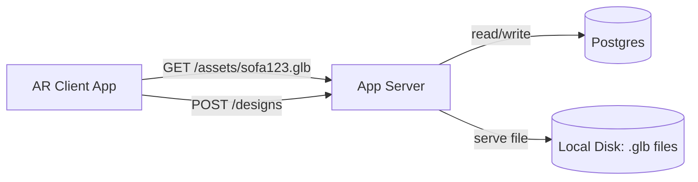
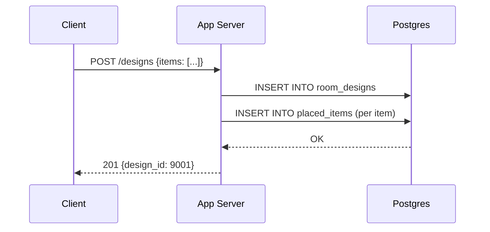
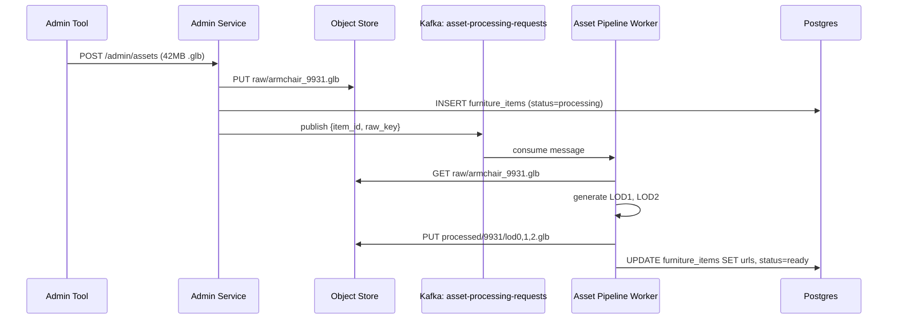
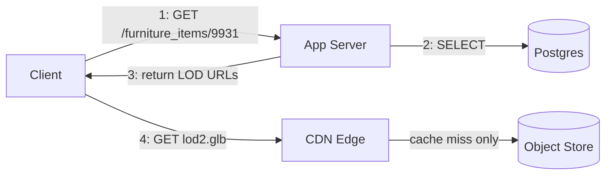
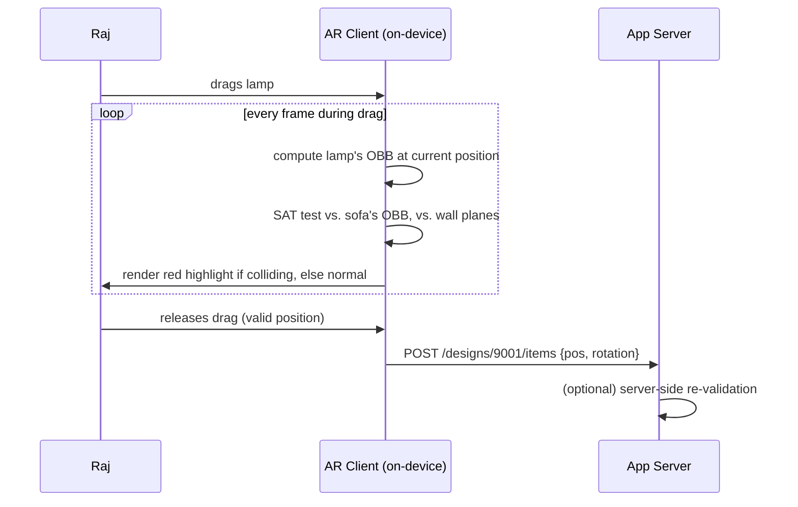
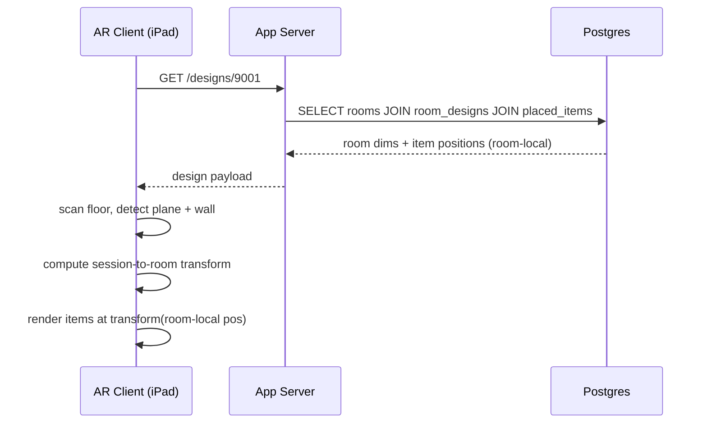
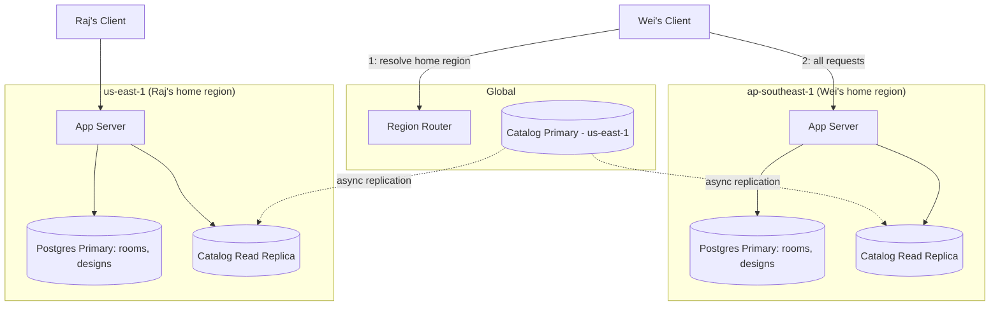
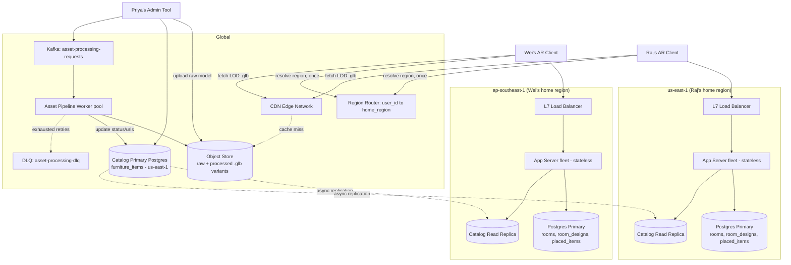
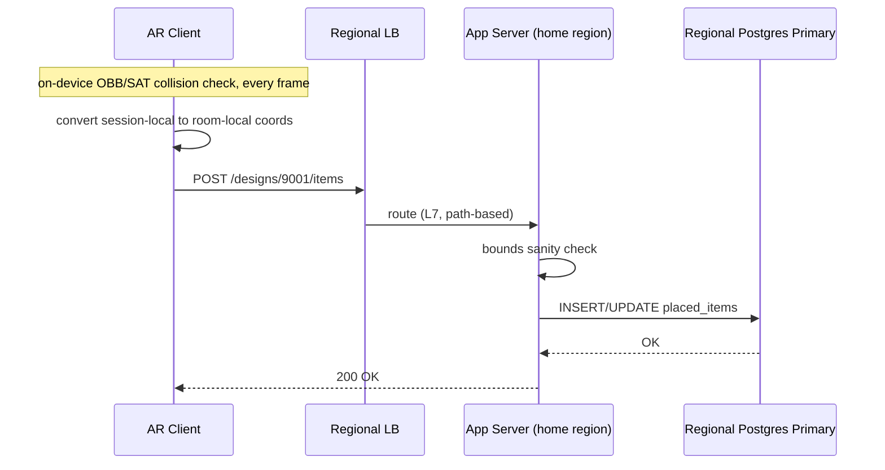
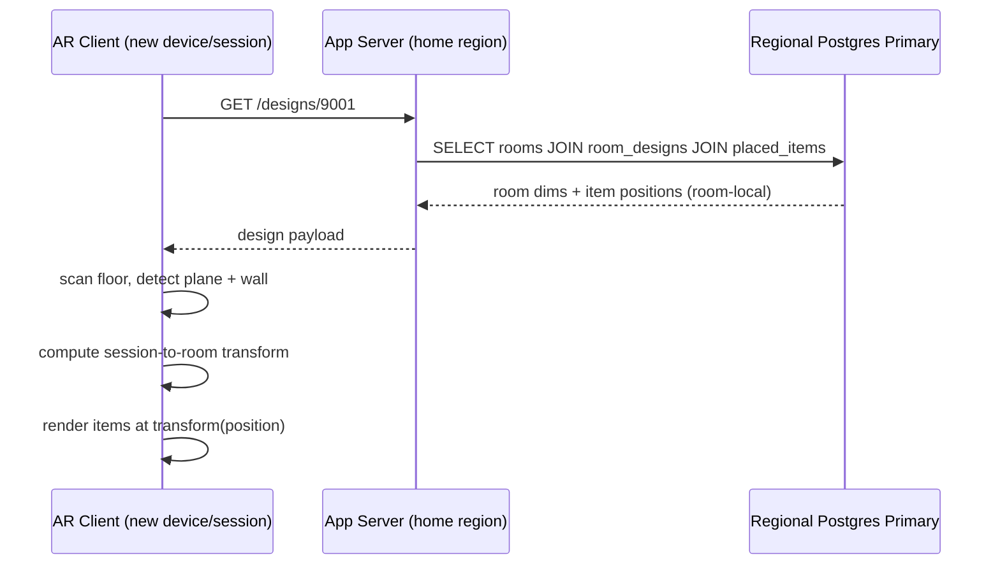

# 3D Virtual Furniture Placement System

## The Hook

It's 2017, and IKEA just shipped an app called IKEA Place. The pitch is simple: point your phone at your empty living room corner, and see if that €400 sofa actually fits — before you drive to the store, load it into a car, and discover it's six inches too deep for the space next to your bookshelf.

Furniture has one of the highest online return rates of any e-commerce category, and "it looked different in person" or "it didn't fit" are the two most common reasons. The problem isn't *showing* a 3D model of a couch — that's a solved rendering problem. The problem is showing it **convincingly placed in a specific person's specific room**, fast enough that they don't give up, and persistently enough that they can walk away and come back to the same layout later.

That's the system we're building.

---

## Step 1 — Clarifying Questions to Ask the Interviewer

**On the core interaction model**

1. **Is this AR-based (phone camera + live scan of the user's real room) or a virtual room builder (user picks a template room and drags furniture into it)?**
   This is the single biggest fork in the whole design. AR means we're consuming device SLAM/ARKit/ARCore output and dealing with a live camera feed. A virtual builder means we're doing pure 3D scene composition with no camera or real-world tracking involved — a much simpler client, but a different value prop.

2. **Do we need to reconstruct the user's actual room geometry (walls, floor, doorways) via LiDAR/photogrammetry, or is a flat-floor-plane assumption good enough?**
   Real room reconstruction lets us catch "this sofa doesn't fit through your doorway" — but it means we're now in the 3D scanning and mesh-processing business, not just placement. A flat-plane assumption is dramatically simpler and might be all a v1 needs.

**On collaboration and persistence**

3. **Is a "room design" single-user, or do two people need to see the same session live (a couple furniture-shopping together, each moving items and seeing the other's changes in real time)?**
   Single-user means "save/load a document." Live collaboration means we need a sync protocol (OT/CRDT-style) for concurrent edits to object positions — a completely different problem, closer to the collaborative-doc system than a simple CRUD app.

4. **Does a design need to sync across devices — start browsing in-store on a phone, finish the layout at home on a tablet?**
   If yes, "where an item sits" becomes state that has to be durably persisted and fetched, not just kept in client memory for the session.

**On rendering fidelity and where it happens**

5. **Does rendering need to be photorealistic (accurate lighting, shadows, materials — good enough to use in marketing), or is a real-time rasterized preview acceptable?**
   Photorealistic rendering at that quality is typically too expensive for a mobile GPU in real time — it pushes us toward server-side/cloud rendering with results streamed back, which adds latency and infra cost. Real-time rasterization keeps everything on-device and instant, at a fidelity cost.

**On the catalog itself**

6. **Is the furniture catalog from one retailer at thousands-of-SKUs scale (all models produced by an internal 3D asset team to a consistent spec), or an open marketplace where any seller can upload their own model?**
   One retailer means we control asset quality, poly count, and format end to end. Open marketplace means we need an ingestion/validation/optimization pipeline, because we can't trust an arbitrary uploaded model's size or format.

**On physical correctness**

7. **Does the system need to enforce physical plausibility — an item can't clip through a wall, two items can't overlap, a couch must fit through the doorway it was placed behind — or is this purely a visual approximation the user eyeballs themselves?**
   Enforcing this means real collision detection and spatial queries against room geometry. Skipping it means placement is just "set a transform matrix," full stop — much cheaper.

**On sharing**

8. **Can a finished design be shared as a link that renders for someone who doesn't have the app installed?**
   That implies a web-viewable rendering path independent of the native AR client — effectively a second rendering surface to support.

Take your time on these — my architecture will look very different depending on 1, 2, 5, and 7 in particular, since those four determine whether we're building a "3D scene graph CRUD app" or something closer to a lightweight AR/graphics engine with a backend bolted on.

---

Since you said "next," I'll lock in reasonable defaults for the 8 questions and move forward — flag anything you'd rather change.

**Defaults assumed:**

| # | Question | Default |
|---|---|---|
| 1 | AR vs virtual builder | **AR** — phone camera, live placement (the IKEA Place model) |
| 2 | Room reconstruction | **Flat floor-plane assumption**, not full LiDAR mesh scanning |
| 3 | Live multi-user collab | **No** — single-user editing (we've already built the hard version of this in your CRDT/Docs session) |
| 4 | Cross-device sync | **Yes** — start on phone, continue on tablet |
| 5 | Rendering fidelity | **Real-time on-device rasterization**, not cloud photorealistic rendering |
| 6 | Catalog source | **Single retailer**, thousands of SKUs, internally produced 3D assets |
| 7 | Physical plausibility | **Yes** — no clipping through walls, no object overlap |
| 8 | Shareable links | **Yes** — a design can be viewed via a web link without the app |

---

## Step 2 — Scoped Requirements

**P0 — AR placement with real-time on-device rendering.**
A user opens the camera, sees their room with a detected floor plane, and drags furniture into it with live, smooth rendering. No architectural complexity here beyond "the client is a real-time rendering engine" — most of the interesting work is elsewhere, but it sets the latency budget everything else has to respect.

**P0 — 3D asset catalog and delivery pipeline.** ⭐ **This is the crux.**
Thousands of SKUs, each needing multiple representations (a full-detail model for close-up, a low-poly version for distant/many-object scenes, possibly different formats per platform). These need to be stored, versioned, transformed, and delivered to a phone in well under a second without melting the user's mobile data plan or the device's GPU. This is the CDN/transcoding-pipeline problem, structurally similar to how video streaming systems handle multiple bitrates — except the asset type is 3D geometry, not video frames.

**P0 — Physical plausibility enforcement.**
An armchair can't be placed halfway through a wall. Two items can't occupy the same floor space. This needs real spatial collision queries against the (flat-plane) room geometry, computed fast enough to feel instant as the user drags an item around.

**P1 — Cross-device design persistence and sync.**
A "room design" — which items, at which positions/rotations, in which room — needs to be saved server-side and re-fetched on a different device, not just kept in client memory for the session.

**P1 — Shareable web-viewable render.**
A finished design gets a URL that renders (a static or lightly-interactive view of) the room for someone without the app installed — a second rendering surface, distinct from the native AR client.

**Explicitly cut:**
- ❌ Live multi-user collaborative editing — no new distributed-systems ground versus what CRDTs already covered for you.
- ❌ Full LiDAR/photogrammetry room-mesh reconstruction — a computer-vision problem, not a backend/systems one.
- ❌ Open marketplace / third-party model uploads — no architectural impact for a single-retailer catalog.
- ❌ Cloud-rendered photorealistic marketing stills — nice-to-have quality bump, not core.

Confirm this scope (or tell me what to swap), and I'll start Day 0.

---

# Day 0 — The Simplest Thing That Could Work

## The scenario

Priya works at the furniture retailer. She has 200 sofa and table models, each exported as a single `.glb` (glTF binary) file from the design team's Blender pipeline.

Raj is a customer. He opens the app, points his phone at his living room, and taps "Add to Room" on a couch product page.

For Day 0, here's the dumbest thing that actually works end to end.

## The architecture

One app server. One Postgres database. Raw `.glb` files sitting in a single directory on that same server's disk, served over plain HTTP.



When Raj taps "Add to Room," the client already has the room's floor plane from the phone's own AR session — that's on-device, not our backend's problem yet. The client just needs the actual 3D model, and somewhere to save "I put this couch at this position."

## The schema — first time, full definition

```sql
CREATE TABLE furniture_items (
    item_id       BIGINT PRIMARY KEY,
    name          TEXT NOT NULL,
    asset_url     TEXT NOT NULL,     -- e.g. /assets/sofa123.glb
    category      TEXT NOT NULL,     -- 'sofa', 'table', etc.
    width_cm      INT NOT NULL,
    depth_cm      INT NOT NULL,
    height_cm     INT NOT NULL
);

CREATE TABLE room_designs (
    design_id     BIGINT PRIMARY KEY,
    user_id       BIGINT NOT NULL,
    room_name     TEXT,
    created_at    TIMESTAMP DEFAULT now(),
    updated_at    TIMESTAMP DEFAULT now()
);

CREATE TABLE placed_items (
    placement_id  BIGINT PRIMARY KEY,
    design_id     BIGINT NOT NULL REFERENCES room_designs(design_id),
    item_id       BIGINT NOT NULL REFERENCES furniture_items(item_id),
    pos_x         FLOAT NOT NULL,    -- meters, relative to room origin
    pos_y         FLOAT NOT NULL,
    pos_z         FLOAT NOT NULL,
    rotation_deg  FLOAT NOT NULL
);
```

**Who writes to `furniture_items`:** an internal admin tool, whenever Priya's team ships a new model. Rare, low-volume.

**Who writes to `room_designs` and `placed_items`:** the App Server, whenever Raj saves his layout (`POST /designs`).

**Who reads them:** the App Server, when Raj's phone loads a saved design (`GET /designs/{id}`), or when the client needs the catalog to show Raj what he can add (`GET /furniture_items`).

**Where this lives:** a single Postgres instance. Relational is the obvious choice here — the data is small, highly structured, and the relationships (a design has many placed items, each pointing at one catalog item) are exactly what foreign keys and joins are built for. There's no access pattern yet that would justify anything more exotic.

## The write flow — placing and saving a couch

1. Raj drags the couch in AR. The client tracks position/rotation entirely locally — no network call per drag, this is pure on-device rendering.
2. Raj taps "Save." Client sends:
   ```
   POST /designs
   {
     "user_id": 501,
     "room_name": "Living Room",
     "items": [
       { "item_id": 123, "pos_x": 1.2, "pos_y": 0, "pos_z": 3.4, "rotation_deg": 90 }
     ]
   }
   ```
3. **App Server** inserts one row into `room_designs`, then one row per item into `placed_items`, in a single transaction.
4. Server returns the new `design_id` to the client.



## Why this is a reasonable starting point, not a strawman

This gives us **exact correctness with zero complexity**: one database, one transaction, no risk of a half-saved design, no risk of stale data between two copies of anything. Every later iteration is going to deliberately trade away some piece of this simplicity — to serve more users, more assets, or more devices — and it's worth being honest that Day 0 genuinely doesn't need any of that yet. Priya's catalog is tiny. Raj is one guy saving one couch.

## Interviewer follow-ups

**"Why not use a NoSQL/document store for room designs from the start, since it's basically a JSON blob of items?"**
Because at this scale there's no access pattern that document storage helps with, and we lose cheap referential integrity — a `placed_items` row pointing at a deleted `furniture_items` row is a bug we get for free with a foreign key, and have to write application code to prevent otherwise.

**"What happens if the server crashes mid-save?"**
The `INSERT`s for a design happen in one transaction, so Postgres guarantees it's all-or-nothing — Raj either has his full saved design or none of it, never a couch with no coordinates.

## Recap

| Concept | The Insight |
|---|---|
| Client-side AR rendering | Dragging a couch is a local, on-device operation — no network round-trip per frame |
| Single Postgres instance | Small catalog + structured relationships = relational is the obvious fit, no exotic store needed yet |
| Transactional save | Wrapping a design's inserts in one transaction rules out "half-saved" designs by construction |

**Interview arc:** *"Day 0 for a furniture placement system is just a thin server over Postgres — AR tracking and rendering are already solved on-device, so the backend's only job is storing 'which catalog item, at what position, in which room,' and a single transaction keeps that atomic from the start."*

---

Next up: Priya's catalog grows from 200 models to 50,000, some of them sculpted at full production detail — and Raj's phone tries to load a 40MB armchair model over hotel WiFi and chokes. That's where the asset delivery crux begins.

---

# Break It — The Catalog Grows Up

## The scenario

Eighteen months later, Priya's company has acquired two smaller furniture brands. The catalog is now 50,000 SKUs. The design team, no longer just Priya, has also gotten fancier — some new sofa models are sculpted with high-poly detail, complete with fabric weave normal maps, because they look great in the hero product photos.

One of those models, a tufted leather armchair, exports as a 42MB `.glb` file.

Raj is now in a hotel room on business travel, on hotel WiFi, trying to see if that armchair would work in his home office. He taps "Add to Room." The app fetches `armchair_9931.glb` — all 42MB of it — over a connection that's giving him maybe 2 Mbps. That's close to three minutes before the model even starts rendering. Raj gives up and closes the app before it loads.

Meanwhile, back at Day 0's single server, that same file is also being requested by dozens of other users trying that same popular chair, straight off local disk, saturating that one machine's disk I/O and network bandwidth every time it's requested — there's no caching layer sitting in front of it at all.

## What's actually broken here

Two distinct problems are tangled together, and it's worth naming both:

**Problem 1 — one-size-fits-all asset delivery.** We're serving the same 42MB "hero shot" model to a phone trying to do live AR rendering, where the GPU budget and the network budget are both much tighter than what that asset was designed for.

**Problem 2 — no distribution layer.** Every request for a popular item hits the same origin server and disk, every time, regardless of how many people already fetched that exact same file five minutes ago.

## Naive attempt 1 — "just compress the .glb harder"

> **Engineer A:** "Run every model through Draco compression before upload. Problem solved, same file, way smaller."
> **Engineer B:** "Draco shrinks geometry, sure — but it doesn't touch the texture resolution, and normal maps are often the bigger chunk of the file. And you still need the geometry decompressed and the full-res texture in memory to render it, even if the download was smaller."

This looked reasonable because compression is free performance, no design trade-off needed. It breaks because a smaller file transferred is not the same as a smaller GPU memory footprint or a lower triangle count — a 40MB file that decompresses to the same 200,000-triangle mesh still chokes on-device rendering the moment three or four of those are in view at once (which does happen — think a full virtual living room, not just one couch).

## Naive attempt 2 — "just cache the files on a CDN"

Putting a CDN in front of the origin server is obviously part of the real answer, and it does fully solve Problem 2 — Raj's chair, once cached at an edge node near him, is fast for the next thousand people who request it too. But a CDN alone doesn't touch Problem 1: it will very efficiently deliver that same 42MB file to Raj's hotel WiFi at edge speed instead of origin speed, and it'll still be 42MB. Caching the wrong asset faster isn't the fix.

## The real answer: multi-resolution asset variants + CDN together

This is structurally the same problem video streaming already solved: nobody streams the same 4K bitrate to a phone on 3G and a TV on fiber. YouTube and Netflix pre-encode multiple resolutions of the same video and let the client pick based on its actual bandwidth and screen. We do the same thing, except the "bitrates" are **levels of detail (LOD)** for a 3D mesh, not video resolutions.

So for every uploaded source model, an offline pipeline produces several derived variants:

- **LOD0 (full detail)** — for the shareable web-view render, where the model might be the only thing on screen and quality matters most.
- **LOD1 (mid-poly, compressed textures)** — the default for AR placement, one or two items in view.
- **LOD2 (low-poly, small texture atlas)** — used when many items are in view at once, or bandwidth is detected as poor.

These variants sit behind a CDN, so once one variant of one model is fetched by anyone, it's cached at the edge for everyone near that edge node.

## New store: the asset transformation pipeline and its outputs

**Where it lives:** the source `.glb` uploads move from local disk to an **object store** (S3-class blob storage). This is the first new storage *technology*, not just a new table, so it's worth justifying: furniture models are large, immutable-once-published binary blobs with no query pattern beyond "fetch by key" — exactly the access pattern object stores are built for for cheap at scale, versus a relational DB, which would be a poor, expensive place to store 42MB binary blobs.

**Schema addition** — `furniture_items` gets asset URLs per LOD instead of one:

```sql
-- delta from Day 0's furniture_items table
ALTER TABLE furniture_items DROP COLUMN asset_url;
ALTER TABLE furniture_items ADD COLUMN asset_lod0_url TEXT NOT NULL;
ALTER TABLE furniture_items ADD COLUMN asset_lod1_url TEXT NOT NULL;
ALTER TABLE furniture_items ADD COLUMN asset_lod2_url TEXT NOT NULL;
ALTER TABLE furniture_items ADD COLUMN status TEXT NOT NULL DEFAULT 'processing';
-- 'processing' | 'ready' | 'failed'
```

**Who writes to this table:** the **Asset Pipeline Worker**, after it finishes generating all three LOD variants for a newly uploaded model, and uploads each to the object store.

**Who reads it:** the **App Server**, when serving the catalog to a client — and the client itself decides which URL to request based on its own bandwidth/rendering-load signal.

## The upload and processing flow

1. Priya's admin tool calls:
   ```
   POST /admin/assets
   { "name": "Tufted Leather Armchair", "source_file": <42MB .glb> }
   ```
2. **Admin Service** uploads the raw source file straight to the object store, at key `raw/armchair_9931.glb`, and inserts a `furniture_items` row with `status = 'processing'`.
3. **Admin Service** publishes an event to a Kafka topic, `asset-processing-requests`:
   ```json
   { "item_id": 9931, "raw_key": "raw/armchair_9931.glb" }
   ```
4. **Asset Pipeline Worker** (a pool of workers consuming that topic) picks up the message, downloads the raw file, and generates LOD1 and LOD2 variants (mesh simplification + texture downscaling), keeping the original as LOD0.
5. Worker uploads all three variants to the object store under `processed/9931/lod{0,1,2}.glb`.
6. Worker updates the `furniture_items` row: sets the three `asset_lod*_url` columns and flips `status` to `'ready'`.



This is deliberately async — a 42MB mesh simplification job can take real wall-clock time, and Priya's admin tool shouldn't sit there blocked waiting on it. `status = 'processing'` lets the admin UI show "still processing" until the row flips to `ready`.

## The read flow — Raj fetches the right variant

1. Client requests the catalog for browsing, or a specific item on "Add to Room":
   ```
   GET /furniture_items/9931
   ```
2. **App Server** reads the row from Postgres, returns all three LOD URLs plus a client hint (e.g., item's real-world dimensions, for the plausibility checks we're not doing yet).
3. **Client** picks a variant based on its own bandwidth probe and how many other items are already rendered in the current AR scene, then fetches directly:
   ```
   GET https://cdn.example.com/processed/9931/lod2.glb
   ```
4. **CDN edge node** serves it from cache if a nearby user already requested that exact key; otherwise fetches once from the object store origin and caches it for next time.



## Trade-offs

✅ Raj's hotel WiFi now fetches a few-MB LOD2 file instead of 42MB — the thing that actually broke is fixed.
✅ Popular items get CDN-cached, so origin load stops scaling with request volume.
✅ Asset processing is decoupled from the upload request — Priya's admin tool isn't blocked on a slow transform job.

⚠️ We've introduced a genuinely new failure mode: an item can be stuck in `status = 'processing'` forever if a worker crashes mid-job, with nothing currently watching for that. (We'll want a dead-letter queue and retry policy — flagging it now, addressing it properly once failure handling is its own iteration.)
⚠️ Three variants instead of one triples storage cost and triples the surface area for "did this asset actually get regenerated correctly" bugs.
⚠️ The client now has to make a bandwidth/LOD decision itself, which is new client-side complexity that didn't exist in Day 0.

❌ **Rejected: transform the asset synchronously in the upload request.** This blocks Priya's admin tool for however long mesh simplification takes, and ties the availability of asset uploads to the availability and speed of the transform code — a bad coupling for something that should be a fire-and-forget background job.

❌ **Rejected: let the client always fetch LOD0 and downsample on-device.** This pushes the compute cost onto the weakest link — the phone's CPU/GPU during a live AR session — instead of doing it once, offline, on server hardware, for every future request.

## Interviewer follow-ups

**"Why three fixed LOD tiers instead of continuously adaptive detail, like video's adaptive bitrate?"**
Video ABR works because a video player can seamlessly switch bitrate mid-stream without the viewer noticing much. A 3D model swapping detail level mid-AR-session would visibly "pop" as geometry changes shape under the user's eyes — three coarse tiers, chosen once at load time, keeps that pop rare and predictable instead of constant.

**"What if the pipeline worker crashes halfway through generating LOD2?"**
The `furniture_items` row stays at `status = 'processing'` — Raj's client should treat that as "not orderable/placeable yet" rather than falling back to a broken URL, and this is exactly the gap we flagged to fix with retries and a DLQ once we get to failure handling as its own topic.

## Recap

| Concept | The Insight |
|---|---|
| LOD (Level of Detail) | Same idea as video's adaptive bitrate, applied to mesh/texture complexity instead of resolution |
| Async pipeline via Kafka | Decouples "upload finishes" from "processing finishes" — the admin tool isn't blocked on a slow job |
| Object store for source assets | Large immutable binary blobs with fetch-by-key access don't belong in a relational DB |
| CDN + LOD together | A CDN alone just serves the wrong-sized file faster; you need both fixes together |

**Interview arc:** *"A single 42MB hero-quality model chokes a phone on hotel WiFi, so instead of shipping one asset per item, an async pipeline pre-generates multiple LOD variants — like video's adaptive bitrate but for mesh complexity — and puts them behind a CDN so popular items don't even hit origin twice."*

---

Next up: even with the right-sized model loading fast, Raj still needs to know his sofa doesn't clip through the wall behind it — that's the physical plausibility crux, and it's a genuinely different kind of hard problem from asset delivery.

---

# Evolve It — Physical Plausibility

## The scenario

Raj has his AR session open. He's already placed a sofa against the back wall. Now he drags a floor lamp toward the corner behind it.

With nothing checking geometry, the lamp's 3D model happily slides halfway *into* the wall — the rendering pipeline doesn't care, it'll happily draw two overlapping meshes with zero complaint. Then Raj drags a bookshelf toward where the sofa already sits, and the two models interpenetrate completely, sofa cushions poking through bookshelf panels. It looks broken, and worse, it defeats the entire point of the product: Raj can no longer trust that "it fits in the preview" means "it fits in real life."

## Naive attempt 1 — bounding spheres

> **Engineer A:** "Give every item a bounding sphere — radius from its largest dimension — and block the drag if two spheres overlap."
> **Engineer B:** "A sofa is 2 meters long and 0.9 meters deep. Its bounding sphere has a 1-meter radius in every direction, including sideways where there's nothing there. You'll block placing a side table right next to it, a foot away, because the spheres 'overlap' even though the actual meshes don't."

This looked reasonable because sphere-overlap is a single subtraction-and-compare — cheap, and correct for actually round objects. It breaks the moment furniture isn't round, which is always, because it wildly overestimates the space every non-round item occupies and makes normal, valid layouts get rejected.

## Naive attempt 2 — axis-aligned bounding boxes (AABB)

Boxes are a much better fit for furniture than spheres — a sofa's real footprint is basically a rectangle. Check whether two axis-aligned boxes overlap on all three axes, and you get a tight, cheap collision test.

This works great right up until Raj *rotates* the bookshelf 30 degrees to angle it into a corner. An AABB is defined by min/max X, Y, Z — it doesn't rotate with the object. So the axis-aligned box drawn around a rotated bookshelf is now bigger than the bookshelf itself, padded out to cover the rotated corners. That padding either creates the same false-overlap problem as bounding spheres, or, if the box is left too tight, real overlaps get missed on the diagonal.

## The real answer: oriented bounding boxes (OBB) + wall-plane checks

The fix is to give each item's bounding box the object's *own* rotation, not the world's axes — an **oriented bounding box**. Testing whether two OBBs overlap is a well-known geometric test (the Separating Axis Theorem: two convex shapes don't overlap if you can find any axis where their projections don't overlap). It costs more CPU than an AABB check, but for a handful of furniture items in a room, that cost is trivial.

For wall-clipping specifically, this needs one more piece: ARKit and ARCore both already detect **vertical planes** (walls) using the same feature-point tracking that finds the floor — this doesn't require the full LiDAR mesh reconstruction we scoped out. So a wall is just another plane, and "does this item clip the wall" is the same OBB-vs-plane test, once for each detected wall plane near the item.

**This entire check runs on-device, every frame, during the drag** — not on our backend. Collision feedback needs to feel instant as Raj's finger moves the lamp; a network round-trip per frame would make dragging feel laggy and broken. The backend's only involvement is storing the *final* validated position once Raj lets go.



## Should the server re-validate, or trust the client?

Worth being explicit here rather than skating past it: a client-side check that a user's own device can be tricked into skipping isn't a security boundary, just a UX one. For this system, that's fine — nobody gains anything by spoofing "my sofa clips through my own wall" in their own saved design, so **we trust the client's validation and don't re-run full OBB checks server-side**. The server does keep one cheap sanity check: reject a placement whose coordinates fall outside the room's known floor-plane bounds entirely, as a guard against corrupted client state, but that's a bounds check, not a full collision re-run.

## What if the room has many items — does OBB-vs-OBB pairwise checking scale?

For a typical living room with, say, 15–20 placed items, checking the dragged item against all the others is at most ~20 SAT tests per frame — negligible on a modern phone GPU/CPU. This *would* become a real problem in a hypothetical "virtual showroom" with hundreds of items in one scene, where you'd want a spatial index (a grid or quadtree over the floor plane) to only test the dragged item against nearby neighbors instead of everyone. That's a real technique, but it's solving a scale problem this system doesn't actually have — home rooms don't hold hundreds of furniture pieces — so it stays a footnote, not something we build.

## Trade-offs

✅ Rotated furniture is now handled correctly — the bookshelf angled into a corner gets an accurate, tight collision boundary.
✅ Wall clipping is caught using plane detection the AR SDK already gives us for free, no new scanning technology required.
✅ Collision feedback is instant, because it never leaves the device.

⚠️ OBB-vs-OBB is genuinely more CPU work than AABB, though at living-room item counts this is not measurable in practice.
⚠️ Trusting client-side validation means a modified/hacked client *could* save an impossible layout — accepted here because there's no incentive to cheat against yourself.
⚠️ OBBs still approximate furniture as boxes — an L-shaped sectional's true footprint isn't a rectangle, so there's residual approximation error we're accepting rather than doing full mesh-level collision (which would be far more expensive for marginal accuracy gain).

❌ **Rejected: full triangle-mesh collision detection** (checking actual model geometry, not a bounding volume). This is what physics engines in AAA games do, but it's substantially more expensive per check and massive overkill for "does this couch roughly fit here" — the accuracy furniture placement needs is bounding-volume-level, not physics-simulation-level.

## Interviewer follow-ups

**"Why not run collision detection on the server, so the logic exists in one place instead of duplicated client-side per platform?"**
Because collision feedback has to happen every frame during a drag gesture, and a network round-trip per frame (even at good latency) introduces visible lag that breaks the "feels instant" requirement — this has to live where the rendering already lives, on-device.

**"What happens when the phone's plane detection is bad — say a glass coffee table it can't see — and lets an item collide with something invisible to the AR session?"**
That's a computer-vision/SLAM accuracy limitation, not a collision-math one — our OBB/SAT logic is only as good as the plane and object data the AR SDK hands it. We scoped full room-mesh reconstruction out for exactly this class of edge case; it's a known, accepted gap for this design, not something the collision system itself can fix.

## Recap

| Concept | The Insight |
|---|---|
| Bounding sphere | Overestimates non-round objects' footprint — rejects valid nearby placements |
| AABB | Doesn't rotate with the object — over- or under-estimates a rotated item's true footprint |
| OBB + SAT | Bounding box that rotates with the object; the standard "is this convex shape overlapping that one" test |
| Wall planes | ARKit/ARCore already detect vertical planes without full mesh scanning — reuse that for wall-clip checks |
| Client-side only | Instant feedback requires zero network round-trip during an active drag |

**Interview arc:** *"Naive collision checks use axis-aligned boxes or spheres, which either overestimate a rotated item's footprint or ignore rotation entirely — an oriented bounding box with a Separating Axis Theorem test handles rotation correctly, runs entirely on-device for instant feedback, and reuses the AR SDK's existing wall-plane detection instead of requiring full room-mesh reconstruction."*

---

Next up: Raj starts his layout on his phone in the store, then wants to pull it up on his iPad at home to keep tweaking it — that's where cross-device sync and the "what does a saved design actually need to carry" question comes in.

---

# Evolve It — Cross-Device Sync

## The scenario

Raj is in the furniture showroom on his phone. He scans the showroom floor (a generic flat area, not his actual living room), places a sofa and a coffee table, and saves the design.

That evening, he wants to see how it actually looks in his real living room, on his iPad, which has a bigger screen. He opens the app on the iPad and loads "Living Room" — and immediately there's a problem worth naming honestly: **the sofa's saved position was `pos_x=1.2, pos_z=3.4`, relative to the showroom floor's AR session origin.** His actual living room has a completely different origin point, set fresh the moment the iPad's AR session starts scanning it. Those coordinates are meaningless in the new room.

This is a subtlety Day 0's schema quietly got wrong: we stored a position as if "room space" were a single universal coordinate system, when in AR, every fresh session invents its own.

## Naive attempt 1 — just store the coordinates and hope the room is scanned the same way

This is what we're already doing, and it's the thing that just broke. Worth stating plainly why it looked fine at first: within a *single, continuous AR session*, the origin never moves, so Day 0's flat `pos_x/y/z` worked perfectly for "place a couch and immediately save it." The bug only shows up the moment a design is *reopened in a new session* — which is exactly the cross-device (and even same-device-next-day) use case we're now scoping in.

## Naive attempt 2 — re-scan the room and manually re-align every time

> **Engineer A:** "Just have the user tap the same physical corner of the room each time they reload a design, and use that as a manual anchor to re-align the saved coordinates."
> **Engineer B:** "That works exactly once, for the one room this was designed in. It breaks completely for the showroom-to-living-room case, since there's no shared physical point between two different rooms at all."

This looked reasonable for the "same room, different day" case, but it doesn't even address the actual failure Raj hit — a different room entirely — and it pushes real manual effort onto the user every single time they reopen a design, which defeats the "just come back and keep tweaking" experience we're trying to support.

## The real answer: store positions relative to the room's floor plane, not the AR session's origin

The fix is to stop treating "AR session origin" and "room" as the same thing. A **room** is a stable concept — Raj's actual living room floor doesn't move. An **AR session origin** is an ephemeral artifact of *when the phone started tracking* — it resets every time.

So instead of storing furniture positions relative to session origin, we store them relative to a **room's own local coordinate frame**, anchored to a fixed reference the AR SDK can reliably re-detect: the primary floor plane, oriented against the room's longest detected wall. Every time a device starts a new AR session in that same physical room, the client re-detects the floor plane and that same wall, and re-derives the session-to-room transform — a single 4x4 transform matrix — before rendering any saved item. From then on, all the saved furniture coordinates (which never changed) render in the right place.

This does mean a *design* is now meaningfully tied to *one physical room*, not portable across arbitrary spaces — which is actually correct: Raj's showroom design and his living-room design are legitimately different rooms, and should be different `room` records, not the same design "moved."

## New concept, no new store: the `rooms` table

```sql
CREATE TABLE rooms (
    room_id       BIGINT PRIMARY KEY,
    user_id       BIGINT NOT NULL,
    room_name     TEXT,             -- 'Living Room', 'Showroom Visit'
    floor_width_m FLOAT,            -- approx, from the scan, for bounds checks
    floor_depth_m FLOAT,
    created_at    TIMESTAMP DEFAULT now()
);
```

```sql
-- delta: room_designs now points at a room, not standing alone
ALTER TABLE room_designs ADD COLUMN room_id BIGINT NOT NULL REFERENCES rooms(room_id);
```

`placed_items.pos_x/y/z/rotation_deg` are unchanged in shape — what changed is only what coordinate frame they're *relative to* (room-local, not session-local). No new storage technology here, just Postgres again, so no new technology justification needed.

**Who writes to `rooms`:** the App Server, the first time a user scans a new physical space and starts a design in it.
**Who reads `rooms`:** the App Server, when a client requests a design and needs to hand back the room's known floor dimensions (used both for rendering and for the plausibility bounds-check from the last iteration).

## The read flow, updated — loading a design in a fresh session

1. iPad opens the app, Raj taps "Living Room" design.
   ```
   GET /designs/9001
   ```
2. **App Server** joins `room_designs` → `rooms` → `placed_items`, returns room metadata plus all placed items with their room-local coordinates.
3. **AR Client** starts a new AR session, scans the floor, and detects the primary floor plane and orienting wall — this is unchanged AR SDK behavior, not new work.
4. **Client** computes the session-to-room transform by matching the detected floor plane's real-world dimensions against `floor_width_m`/`floor_depth_m` from the response, then applies that transform to every saved item's room-local coordinates before rendering.



The write flow (saving) is otherwise unchanged from Day 0 — the only difference is the client now converts its live session-local drag position into room-local coordinates using the *inverse* of that same transform, right before the `POST`.

## Trade-offs

✅ A design now reliably re-renders in the correct place across any number of future sessions and devices, because coordinates are anchored to something physically stable (the room), not something ephemeral (a session).
✅ No manual re-alignment burden on the user — the transform is computed automatically from re-detected plane geometry.
✅ Cleanly separates two ideas that Day 0 accidentally conflated: "a room" (a physical space) and "a design" (one arrangement of items in that space) — which also sets up naturally for a future "try two different layouts in the same room" feature, without us having scoped that in.

⚠️ The re-alignment depends on the AR SDK re-detecting a similar-enough floor plane and wall each time — if Raj moves a couch that was previously used as part of the orienting reference, or scans from a very different angle, the transform could be computed with some error, and saved items might render slightly offset from where they were left. This is a real, accepted limitation of plane-based re-anchoring, not something we're solving with the room-mesh reconstruction we scoped out.
⚠️ A design is now bound to a specific room record, so "start a layout in the showroom, finish it at home" isn't actually the same design continuing — it's two separate room+design pairs, which is a UX decision worth surfacing explicitly rather than a bug (matches how the requirement was actually phrased: sync a design across *devices*, not migrate it across *physical rooms*).

❌ **Rejected: store absolute GPS/world coordinates for each item.** GPS accuracy indoors is on the order of several meters — hopelessly coarse next to the centimeter-level precision furniture placement needs, and doesn't help at all with orientation (which way is the couch facing) even if position were accurate.

## Interviewer follow-ups

**"What if the user's phone's plane detection is slightly different each session — doesn't the transform drift over time?"**
There's no accumulation across sessions, because each session computes its transform fresh from the current scan, independent of any previous session's transform — so error doesn't compound release over release, though a single session's error can still cause a one-time visible offset, as noted above.

**"Why re-detect the floor plane every time instead of persisting some kind of visual anchor/fingerprint of the room, like ARKit's world maps?"**
That's a legitimate stronger version of this idea — ARKit and ARCore both support persisted world anchors that let a device recognize "I've been in this exact spot before" more precisely than plane-matching alone. It's a real improvement path, but it adds meaningful complexity (storing and matching visual feature maps, handling anchor staleness as lighting/furniture actually changes in the room) for accuracy gains beyond what this system's core requirement — "come back and see roughly the same layout" — actually demands.

## Recap

| Concept | The Insight |
|---|---|
| Session origin vs. room | An AR session's origin resets every time; a physical room doesn't — conflating them is what breaks reload |
| Room-local coordinates | Storing positions relative to a stable, re-detectable reference (the floor plane) survives across sessions and devices |
| Session-to-room transform | Computed fresh each time from re-detected geometry, not persisted or accumulated |
| `rooms` as its own entity | Separates "a physical space" from "one arrangement of items in it" — a design is now scoped to a room |

**Interview arc:** *"Storing furniture positions relative to the AR session's own origin works fine within one session but breaks the moment you reopen the design later, since every new session invents a fresh origin — the fix is anchoring coordinates to the room's floor plane instead, which the AR SDK can reliably re-detect and re-align to on every load."*

---

Next up: with a `rooms` table growing across all of Priya's customers and Raj's saved designs piling up, this is a natural point to ask whether any of this needs sharding yet — or whether that would be solving a scale problem the system doesn't actually have.

---

# Evolve It — Do We Actually Need to Shard?

## The scenario, in numbers

Priya's business has grown into a genuine national retailer. Let's ground this in real numbers before deciding anything architecturally, because that's the entire point of this iteration — checking whether "add sharding" is a real requirement here or just a reflex.

Say there are **10 million registered users**, each with roughly 3 saved rooms on average, and roughly 5 items placed per room. That's:

- `rooms`: ~30 million rows
- `placed_items`: ~150 million rows
- `furniture_items`: ~50,000 rows (barely moved — Priya's catalog grows slowly)

On the write side: maybe 1 million users are active on a given day, and each saves or edits a design a couple of times. That's roughly 2 million writes/day, which averages out to **about 23 writes/sec** — bursty around evenings and weekends, but nowhere near continuous heavy load.

On the read side: browsing the catalog is the dominant read pattern — a user scrolling through sofas looks at far more items than they ever place. Say each active session views 30 catalog items: 30 million reads/day, **about 350 reads/sec** on average.

## The question this actually answers

A single well-tuned Postgres primary, on reasonably sized hardware, comfortably handles tens of thousands of simple indexed reads and writes per second. **350 reads/sec and 23 writes/sec isn't a scale problem — it's a rounding error** for a single relational instance.

This is worth sitting with rather than rushing past: the instinct in an interview is often to reach for sharding the moment a system feels "big" in user count, but 10 million users doesn't automatically mean big *traffic*. What would actually force sharding is if request rate, working-set size, or write contention exceeded what one primary (plus replicas) can hold — and none of those are true here yet.

**So the honest answer is: we don't shard `rooms`, `placed_items`, or `furniture_items` at this scale.** If Priya's company later 50x's its user base *and* engagement per user, this call gets revisited — but building sharding now would be solving a problem this system doesn't have, at the cost of real complexity (cross-shard joins between `rooms` and `placed_items`, more painful schema migrations, harder ad-hoc queries for Priya's own internal reporting).

## If it did eventually come to that — candidate keys, briefly

Worth having ready for the follow-up, even though we're not building it: if this system ever did need to shard, `user_id` would be the natural key, since almost every query (load my rooms, load my designs) is scoped to one user — it makes the common case a single-shard query. The alternative, `room_id`, would be marginally more even in distribution but forces a secondary lookup (which shard has this room?) for the "show me all my rooms" query, which is the *most* common one. Neither key creates a meaningful hotspot here, since unlike a social graph, there's no "celebrity" user whose room count or item count is orders of magnitude above everyone else's — Raj and the most active interior-design hobbyist alike still cap out at maybe dozens of rooms.

## Replication — do we need read replicas?

This is a real, separate decision from sharding, and it's worth its own answer rather than a reflexive yes.

The read:write ratio here is roughly 15:1 (350:23), which is read-heavy but not extreme — nowhere near, say, a news homepage's ratio. Even so, there's a good reason to add **read replicas** that has nothing to do with raw volume: **isolating workload types**. Catalog browsing (`GET /furniture_items`) is a different traffic shape than design saves (`POST /designs`) — a spike in Black Friday catalog traffic shouldn't risk slowing down or contending with Raj's save request for his living room layout.

So: **one primary, two async read replicas**, with catalog browsing and design *reads* routed to replicas, and all writes (and the results the user cares about seeing immediately after their own write) going to the primary.

**Sync or async?** Async. A synchronous replica would add write latency to every save, in exchange for a guarantee we don't need — losing the very last save if the primary fails a split second before replicating is an acceptable, rare risk for a furniture layout, not a payment or an inventory count.

**What consistency model falls out of this?** This is where it's worth being concrete rather than reciting "eventual consistency" generically. The one place staleness could actually bite: Raj saves a design on his phone, then immediately opens the same design on his iPad to keep editing. If that iPad's `GET /designs/9001` happens to land on a replica that hasn't caught up yet, he'd briefly see his *old* layout and think his save didn't take. The fix is simple and doesn't need anything exotic: **route reads for the specific design a user just wrote to back to the primary for a short window (or until replication lag clears)** — a basic read-your-writes guarantee, not a system-wide consistency requirement. Catalog browsing, by contrast, genuinely doesn't care about staleness — nobody notices or minds if a newly-published sofa takes a few seconds to show up on a replica.

## Trade-offs

✅ Avoided a huge amount of unneeded complexity by actually checking the numbers instead of assuming scale demands sharding.
✅ Read replicas cleanly separate "Priya's customers browsing the catalog" load from "Raj saving his layout" load, so one can't starve the other.
✅ Async replication keeps write latency low, which matters more here than the small risk it trades away.

⚠️ Read replicas introduce replication lag as a real, if usually brief, phenomenon — the read-your-writes routing above is the direct cost of that lag, not a free lunch.
⚠️ If Priya's company scales far beyond today's numbers, this decision needs revisiting — it's the right call *for this scale*, not forever.

❌ **Rejected: shard preemptively "to be safe."** Sharding this data today would add cross-shard query complexity (joining a user's `rooms` to their `placed_items` across shard boundaries) for a load level a single primary handles without breaking a sweat — pure cost, no corresponding benefit yet.

❌ **Rejected: synchronous replication for the read replicas.** Buys a durability guarantee (zero risk of losing the last write on primary failure) that this system's data doesn't need badly enough to pay increased write latency on every single save.

## Interviewer follow-ups

**"At what point would you actually revisit the sharding decision?"**
When either the write rate approaches what a single primary can sustain (tens of thousands of writes/sec, orders of magnitude beyond today's ~23/sec), or when the working set of "hot" data no longer fits comfortably in the primary's memory/cache — neither is close today, but both are the concrete signals to watch, not a fixed user-count milestone.

**"Why not just throw more read replicas at both the catalog and the room data instead of thinking about read-your-writes?"**
More replicas help raw read throughput, but they don't fix the specific correctness issue — a user briefly seeing their own stale write after saving is a routing problem, not a capacity problem, and adding replicas without addressing routing would make that staleness window statistically *more* likely to be hit, not less.

## Recap

| Concept | The Insight |
|---|---|
| Do the math before sharding | 350 reads/sec and 23 writes/sec is comfortably within a single Postgres primary's capacity — sharding here would be pure unneeded complexity |
| Read replicas ≠ sharding | Replicas solve workload isolation and read throughput; sharding solves write/storage capacity — they answer different questions |
| Async replication | Chosen because losing a rare last write is an acceptable risk for furniture layouts, and it keeps write latency low |
| Read-your-writes | The one concrete staleness scenario that matters here — a user reloading their own just-saved design — solved with targeted primary routing, not a blanket consistency upgrade |

**Interview arc:** *"At 10 million users but only ~350 reads/sec and ~23 writes/sec, sharding would be solving a problem this system doesn't have — the real move is async read replicas to isolate catalog-browsing load from design saves, with targeted primary-routing for read-your-writes so a user never sees their own save look like it didn't happen."*

---

Next up: Priya's retailer now ships internationally, and Raj's cousin in Singapore wants to use the app too — that's where multi-region write ownership and data placement come in, and it pairs naturally with the CDN work from the asset-delivery iteration.

---

# Evolve It — Going Multi-Region

## The scenario

Priya's company now ships to Singapore, the UK, and Australia. Raj's cousin, Wei, in Singapore, opens the app, scans his HDB flat's living room, and starts placing furniture — all while every one of our servers and the single Postgres primary from the last iteration live in `us-east-1`.

Wei's every catalog browse and every design save now crosses the Pacific. A `POST /designs` round-trip that takes Raj 40ms in Virginia takes Wei closer to 250-300ms in Singapore — noticeable, sluggish-feeling lag on every drag-and-save interaction, even though the underlying data volume per user hasn't changed at all.

## What's actually different here versus the last iteration

This is worth separating clearly from the sharding question we just answered, because it's a genuinely different axis. Sharding and replicas were about **capacity** — how much load one database can take. Multi-region is about **physics** — the speed of light between Singapore and Virginia, which no amount of read replica tuning in one region fixes, because a replica in `us-east-1` is still in the wrong hemisphere for Wei.

## The core decision: who owns writes for Wei's data?

**Naive attempt — one global primary, replicas everywhere.** This is actually what we already have (async replicas), just not placed near Wei yet. Adding a read replica in `ap-southeast-1` would speed up Wei's *catalog browsing* nicely — that traffic can safely read from a nearby replica. But it does nothing for his *writes*: every `POST /designs` still has to reach the single primary in Virginia, so his save latency is unchanged. Read replicas solve the read half of Wei's problem and leave the write half completely untouched.

**The real fix: home-region-per-user.** Every user is assigned a **home region** at signup, based on where they are — Wei gets `ap-southeast-1`, Raj stays on `us-east-1`. Each region runs its own full stack: its own Postgres primary (plus its own local read replicas from the last iteration), its own App Server fleet. Wei's `rooms`, `room_designs`, and `placed_items` rows live in, and are written to, the Singapore primary. Raj's live in Virginia. Neither one's writes ever cross an ocean.

This is a clean fit here for a reason worth stating explicitly: **a room design has exactly one owner** — Raj's living room is never going to be edited by anyone in Singapore. There's no shared mutable state between regions at all, which means this sidesteps the hard multi-writer conflict problem entirely, by construction, rather than needing to resolve it after the fact. This is the same trade Google Docs' single-owner-shard design made in your CRDT session — pick a design where cross-region conflicts can't arise, instead of building the machinery to resolve them.

## What does need to be global, versus region-local

Not everything Wei touches is region-local, and it's worth being precise about the split:

**Region-local (owned by home region):** `rooms`, `room_designs`, `placed_items` — anything tied to one specific user's one specific physical space.

**Global (same everywhere, rarely written):** `furniture_items` — Priya's catalog. A sofa design published once needs to be visible to Raj and Wei identically. This table is a natural fit for the async replication we already have, just extended geographically: Priya's admin tool writes to a single **global catalog primary** (say, still `us-east-1`, since catalog writes are rare — new SKU launches, not per-user activity), and that replicates asynchronously into a local read replica in every region, including `ap-southeast-1`. Every region's App Server reads the catalog from its own local replica.

This reuses a decision we already justified last iteration — async replication because losing the very last write during failover is an acceptable risk — just now applied across a longer physical distance instead of across the same data center.

**Assets (CDN):** already solved by the LOD + CDN work from a few iterations back — a CDN's entire job is exactly this "serve the same immutable content from the location nearest the requester" problem, so multi-region assets needed zero new work here. Wei's phone just naturally pulls the sofa's LOD1 `.glb` from a Singapore edge node instead of a Virginia one, no code change required.

## How does a client find its home region?

1. On first signup, the client sends its rough location (or the App Server infers it from request IP) to a lightweight **Region Router** — a small global service, the only thing that genuinely spans all regions.
2. Region Router writes `user_id → home_region` into a small global mapping table (tiny, rarely-written, easy to keep globally replicated — this is a different, much smaller table than the catalog, and gets its own light replication rather than complicating the catalog's).
3. Every subsequent request from that client — from any device — first resolves `home_region` via this router (cached aggressively client-side after first lookup, since it essentially never changes), then talks directly to that region's App Server fleet for everything else.



## What if Wei travels to Virginia and opens the app there?

Worth naming explicitly since it's an easy gap to leave implicit: Wei's `home_region` doesn't change just because his phone's IP briefly says Virginia. His client still resolves to `ap-southeast-1` and talks to Singapore for his rooms and designs — just over a longer physical hop while he's traveling, exactly the same way Raj would experience some lag if he opened the app in Singapore. Region assignment is about **data home**, not current physical location — conflating those two would risk actually splitting a user's writes across two primaries depending on where they happen to be standing, which reintroduces the multi-writer conflict problem we specifically avoided.

## Trade-offs

✅ Wei's writes and reads for his own rooms now hit a Postgres primary in his own region — the ocean-crossing round-trip is gone for the traffic that matters most (his own drag-and-save loop).
✅ Cross-region write conflicts are avoided by construction, not resolved after the fact — there is no scenario where two regions try to write the same room.
✅ The catalog and CDN patterns already built in earlier iterations extend to multi-region almost for free — this iteration mostly reuses established async-replication reasoning, not invents new machinery.

⚠️ Operational complexity roughly multiplies by the number of regions — Priya's team now runs and monitors N independent Postgres primaries and App Server fleets instead of one.
⚠️ A user's data now has a genuine "home" — disaster recovery for one region (say, `ap-southeast-1` has an outage) doesn't have a same-region hot standby to fail over to instantly the way a single-region setup with local replicas would; a cross-region failover strategy is a real, separate piece of work this iteration surfaces but doesn't fully solve.
⚠️ If Priya's business model ever needed cross-region collaboration (which we scoped out back at Step 1) — e.g., two people in different countries co-designing the same room live — this whole home-region-per-user model would need to be revisited, since it assumes single ownership.

❌ **Rejected: single global primary with regional read replicas only.** Fixes Wei's reads, leaves his writes exactly as slow as before — the actual friction he's experiencing (dragging and saving furniture) is a write-path problem, and this doesn't touch it.

❌ **Rejected: multi-writer active-active replication across regions.** Would remove the "closest primary" latency for both reads and writes from any region, but requires real conflict resolution machinery for the case where the same row gets written in two regions near-simultaneously — a genuinely hard problem this system doesn't need to take on, because no data here is ever legitimately written from two regions at once.

## Interviewer follow-ups

**"What happens to the catalog if the us-east-1 catalog primary goes down — does Wei lose the ability to browse furniture?"**
No — Wei's region has its own local read replica of the catalog, which keeps serving reads during the primary's outage; only *new* SKU publishes from Priya's team would be blocked until the primary recovers, which is a low-urgency, internal-facing impact, not a customer-facing one.

**"Why not just let CDN edge caching handle regional latency instead of standing up full regional database stacks?"**
A CDN only helps for immutable, cacheable content — it's exactly why the furniture assets needed zero new work here. But `rooms` and `placed_items` are per-user mutable state being written constantly; there's nothing to "cache" about Wei's specific couch position that a CDN's cache-and-serve model applies to.

## Recap

| Concept | The Insight |
|---|---|
| Sharding/replicas vs. multi-region | Capacity problem vs. physics problem — replicas alone don't fix write latency across oceans |
| Home-region-per-user | Assigns write ownership by user, avoiding cross-region conflicts by construction since no room is ever multi-owned |
| Global vs. region-local data | Catalog is global and rarely-written (async replicate everywhere); rooms/designs are region-local and frequently-written (never replicate cross-region) |
| Region ≠ current location | A user's home region is fixed at signup, not derived from wherever their phone currently is |

**Interview arc:** *"Adding read replicas near Wei speeds up his browsing but not his saves, because writes still cross an ocean to a single primary — the fix is assigning each user a home region that owns their writes outright, which sidesteps cross-region conflicts by construction since no single room is ever written from two regions."*

---

That closes out the core distributed-systems arc — sharding, replication, caching/CDN, and multi-region have all been addressed with real depth. Want to keep going with the remaining coverage checklist items (failure handling, load balancing, observability) as a lighter-weight pass, or move straight to the full interview-readiness recap (architecture diagram, all end-to-end paths, "why not X" arsenal, master recap table)?

---

# Lighter Pass — Failure Handling, Load Balancing, Observability

These three don't each need a full "break it and evolve it" narrative — none of them are the crux of this system — but they still deserve concrete answers, not name-drops.

## Failure handling

**The scenario that motivates it:** the Asset Pipeline Worker from the catalog iteration crashes midway through generating LOD2 for a new armchair. Right now, that item sits at `status = 'processing'` forever, with nothing watching it — exactly the gap we flagged and deferred back then.

**Retries with backoff and jitter:** the Kafka consumer group for `asset-processing-requests` re-delivers a message if the worker that picked it up dies before acknowledging it — that's standard consumer-group behavior, not something we build. What we do add is bounding it: after 3 failed attempts (say, the source file itself is corrupt), the message stops retrying immediately and instead retries with exponential backoff plus jitter — 1s, then ~2s, then ~4s, each with a small random offset — so that a systemic issue (like the transform library itself being broken) doesn't cause every worker to hammer the same failing job in lockstep.

**Dead-letter queue:** after those bounded retries are exhausted, the message moves to a `asset-processing-dlq` topic instead of retrying forever. Priya's admin dashboard surfaces anything sitting in the DLQ as "needs manual attention" — a corrupt upload is a data problem, not something automatic retries can fix, so DLQ + human review is the right terminal state.

**Idempotency:** the LOD-generation job is naturally idempotent by design — reprocessing `item_id: 9931` just overwrites `processed/9931/lod0,1,2.glb` at the same object store keys with the same result, so a duplicate delivery (Kafka's at-least-once guarantee) is harmless rather than something requiring a dedup table.

**Circuit breakers on the read path:** if the object store or CDN origin starts timing out (a real outage, not just one bad file), the App Server wraps calls to it in a circuit breaker — after a threshold of consecutive failures, it stops sending new requests for a cool-down window and fails fast with a clear error, rather than piling up slow, doomed requests and taking down the App Server's own thread pool with them. This is the same bulkhead idea as isolating a ship's flooded compartment: a struggling downstream dependency shouldn't be allowed to sink the whole server.

**Timeouts:** every cross-service call (App Server → Postgres, App Server → object store, Client → CDN) has an explicit timeout tuned to that call's normal latency, not a generic default — a catalog read should time out in low hundreds of milliseconds, while an asset fetch from CDN might reasonably allow a couple of seconds given file size.

## Load balancing

The App Server fleet, in each region, is stateless — no in-memory session state, since Day 0's design already put all durable state in Postgres — so any request can go to any instance, which is exactly what makes horizontal scaling of the App Server tier straightforward.

**L7 (application-layer), not L4:** we want the load balancer to make routing decisions based on the actual HTTP path — e.g., routing `GET /furniture_items/*` (catalog reads, can hit any replica-backed App Server) differently from `POST /designs/*` (writes, need primary-path routing) — which requires reading the request itself, not just TCP-level load balancing.

**Algorithm:** least-connections rather than simple round-robin, since request costs vary meaningfully here — a catalog browse is cheap, a design save with several placed items is a bit more work, and least-connections naturally accounts for that instead of assuming every request costs the same.

**Health checks:** each App Server instance exposes a `/health` endpoint that checks its own ability to reach Postgres and the object store; the load balancer stops routing to any instance that fails health checks for a few consecutive intervals, and resumes once it recovers — standard, and nothing about this system's shape changes that pattern.

## Observability

**Metrics:** the numbers worth watching are the ones tied to decisions already made in this design — catalog read latency (justifies whether replicas are keeping up), design save latency by region (would surface a Wei-style cross-region problem immediately if home-region routing ever broke), asset pipeline queue depth and DLQ size (surfaces the failure-handling gap directly), and CDN cache hit rate (validates the whole LOD strategy is actually working — a low hit rate on a popular item would mean something's wrong with cache keys or TTLs).

**Logs:** structured, per-request logs tagged with `user_id`, `region`, and `design_id` where applicable — the multi-region split means "which region handled this request" needs to be a first-class searchable field, not something inferred after the fact.

**Tracing:** a save request's full path — Client → App Server → Postgres — is short enough that distributed tracing isn't doing heavy lifting here, but it earns its place for the asset pipeline specifically, since that flow spans an HTTP request, a Kafka publish, an async consume, and two storage writes — exactly the kind of multi-hop async flow where "which step actually took 4 seconds" isn't obvious from logs alone.

## Recap

| Concept | The Insight |
|---|---|
| Backoff + jitter | Prevents every worker from retrying a systemic failure in lockstep |
| DLQ | Terminal state for genuinely broken jobs — a human problem, not a retry problem |
| Idempotent LOD generation | Reprocessing the same item just overwrites the same keys — duplicate delivery is harmless |
| Circuit breaker | Stops a struggling object store/CDN from taking the App Server down with it |
| Stateless App Server | No session state means any instance can serve any request — the basis for easy horizontal scaling |
| L7 load balancing | Routes catalog reads and design writes differently based on the actual request path |

**Interview arc:** *"Failure handling here isn't generic boilerplate — it directly patches the specific gap the asset pipeline iteration flagged: bounded retries with backoff and jitter, a DLQ for jobs that are actually broken, and idempotent reprocessing so Kafka's at-least-once delivery is safe by construction."*

---

That's the full coverage checklist addressed. Ready for the final interview-readiness package: complete architecture recap diagram, every end-to-end path restated as its own numbered list, the "why not X" cheat sheet, and the master recap table spanning every iteration?

---

# Interview-Readiness Package

## Full Architecture Recap



---

## Every End-to-End Path

### 1. Write path — placing and saving furniture

1. **AR Client** tracks the drag entirely on-device; every frame it computes the dragged item's OBB and runs SAT collision tests against other placed items' OBBs and detected wall planes.
2. User releases the drag at a valid (non-colliding) position.
3. **Client** converts the session-local position to room-local coordinates using the inverse of the session-to-room transform.
4. **Client** calls `POST /designs/{id}/items` with the room-local position/rotation, hitting its **home region's** App Server (resolved once via Region Router, cached client-side).
5. **App Server** performs one sanity check — position falls within the room's known floor bounds — then writes to its **regional Postgres primary** (never cross-region).
6. Server returns success; client's local state is now confirmed persisted.



### 2. Read path — loading a design in a new session

1. **Client** resolves `home_region` via Region Router (cached after first lookup).
2. **Client** calls `GET /designs/{id}` against its regional App Server.
3. **App Server** joins `room_designs` → `rooms` → `placed_items` on the regional Postgres primary (or, per read-your-writes routing, primary specifically if this design was just written seconds ago — otherwise a regional replica is equally valid here since this data doesn't have replicas configured for `placed_items` in our design; catalog reads are what use replicas).
4. **Client** starts a fresh AR session, detects the floor plane and orienting wall, computes the session-to-room transform, and renders every saved item at `transform(room-local position)`.



### 3. Catalog browse path

1. **Client** calls `GET /furniture_items` or `GET /furniture_items/{id}` against its regional App Server.
2. **App Server** reads from its **regional catalog read replica** (never the global catalog primary directly — that's write-only from Priya's admin tool).
3. Server returns item metadata including all three LOD asset URLs.
4. **Client** picks a LOD tier based on its own bandwidth/scene-complexity signal and fetches directly from the **CDN**, which serves from edge cache or falls through to the object store origin on a miss.

*(Sequence diagram omitted — this is a straightforward two-hop fetch already fully covered in the asset-delivery iteration's diagram; no new ordering complexity to add.)*

### 4. Asset ingestion and processing path (async)

1. **Admin Tool** calls `POST /admin/assets` with the raw `.glb`.
2. **Admin Service** uploads the raw file to the **object store**, inserts a `furniture_items` row (`status = 'processing'`) into the **global catalog primary**, and publishes a message to the **`asset-processing-requests`** Kafka topic.
3. **Asset Pipeline Worker** consumes the message, downloads the raw file, generates LOD1/LOD2 variants, and uploads all three variants to the object store.
4. Worker updates the `furniture_items` row with the three asset URLs and flips `status` to `'ready'`.
5. On failure: bounded retries with backoff and jitter; after exhaustion, the message moves to the **DLQ** for manual review on Priya's admin dashboard.
6. The global catalog primary's changes replicate asynchronously into every region's local catalog read replica.

*(Sequence diagram already shown in full in the "Break It" asset-delivery iteration — unchanged here.)*

---

## The "Why Not X" Arsenal

| Alternative approach | One-line answer |
|---|---|
| Store one full-resolution asset per item, no LOD tiers | Chokes mobile rendering and bandwidth the moment scene complexity or connection quality drops — same failure mode video streaming solved with adaptive bitrate |
| Use bounding spheres or AABBs for collision detection | Spheres overestimate non-round footprints; AABBs don't rotate with the object — both produce false rejections or missed overlaps on rotated furniture |
| Run collision detection server-side | A network round-trip per drag frame breaks the "feels instant" requirement — this has to live on-device, next to the rendering |
| Store furniture positions relative to AR session origin | Session origin resets every new session — coordinates become meaningless the moment a design is reopened later or on another device |
| Shard `rooms`/`placed_items` preemptively | ~350 reads/sec and ~23 writes/sec is a rounding error for one Postgres primary — sharding now buys cross-shard query complexity with zero benefit |
| Add regional read replicas only, skip home-region-per-user | Fixes browsing latency, does nothing for write latency — a save from Singapore still crosses an ocean to reach a single primary |
| Multi-writer active-active replication across regions | Removes remaining latency but requires real conflict resolution for a system where no room is ever legitimately written from two regions — solving a problem that doesn't exist here |
| Full triangle-mesh collision instead of OBB | Physics-engine-level accuracy for a "does this roughly fit" check — massive overkill in compute cost for marginal accuracy gain |
| Synchronous transform of assets during upload | Blocks Priya's admin tool on a slow mesh-simplification job and couples upload availability to transform code health |
| Persisted visual world anchors instead of floor-plane re-detection | A real, stronger technique (used by ARKit/ARCore world maps), but adds anchor storage/staleness complexity beyond what "come back to roughly the same layout" requires |

---

## Master Recap Table

| Iteration | Concept | The Insight |
|---|---|---|
| Day 0 | Client-side AR rendering | Dragging is a local, on-device operation — no network round-trip per frame |
| Day 0 | Single Postgres instance | Small catalog + structured relationships = relational is the obvious fit |
| Day 0 | Transactional save | One transaction rules out "half-saved" designs by construction |
| Asset delivery | LOD (Level of Detail) | Same idea as video's adaptive bitrate, applied to mesh/texture complexity |
| Asset delivery | Async pipeline via Kafka | Decouples "upload finishes" from "processing finishes" |
| Asset delivery | Object store for source assets | Large immutable binary blobs with fetch-by-key access, not a relational DB fit |
| Asset delivery | CDN + LOD together | A CDN alone just serves the wrong-sized file faster — need both |
| Collision detection | OBB + SAT | Bounding box that rotates with the object; standard convex-shape overlap test |
| Collision detection | Wall planes | Reuse AR SDK's existing vertical-plane detection, no new scanning tech |
| Collision detection | Client-side only | Instant feedback requires zero network round-trip during an active drag |
| Cross-device sync | Session origin vs. room | An AR session's origin resets every time; a physical room doesn't |
| Cross-device sync | Room-local coordinates | Positions relative to a re-detectable reference survive across sessions/devices |
| Cross-device sync | `rooms` as its own entity | Separates "a physical space" from "one arrangement of items in it" |
| Sharding/replication | Do the math before sharding | 350 reads/sec, 23 writes/sec — comfortably one primary's capacity |
| Sharding/replication | Read replicas ≠ sharding | Replicas solve workload isolation and throughput; sharding solves write/storage capacity |
| Sharding/replication | Read-your-writes | Solved with targeted primary routing, not a blanket consistency upgrade |
| Multi-region | Sharding/replicas vs. multi-region | Capacity problem vs. physics problem |
| Multi-region | Home-region-per-user | Avoids cross-region write conflicts by construction |
| Multi-region | Global vs. region-local data | Catalog replicates everywhere; rooms/designs never leave their home region |
| Failure/ops | Backoff + jitter, DLQ | Bounded retries, then a human-reviewed terminal state for genuinely broken jobs |
| Failure/ops | Idempotent LOD generation | Reprocessing overwrites the same keys — duplicate delivery is harmless |
| Failure/ops | Stateless App Server + L7 LB | Any instance serves any request; routing decisions use the actual request path |

---

That's the complete design, night-before-the-interview page and all. From here, want to:

**(a)** drill deeper into any single piece — the collision math, the region-router internals, the DLQ/retry mechanics, anything — or

**(b)** run a mock Q&A where I play interviewer and pressure-test you across the whole design?

---

