Great topic for HLD prep — this one blends graphics fundamentals with classic distributed systems design, which is exactly what interviewers like to poke at. Let's do this properly: story-driven, one concept at a time, and I won't move to the next thing until you say "next."

## The Roadmap (so you know where we're headed)

**Part A — The 3D Client Fundamentals** (the part you said you know nothing about)
1. How does a "3D canvas" actually work in a browser? (the graphics pipeline story)
2. Coordinate systems — world space, local space, transforms
3. Representing a room and furniture as data (meshes, scene graph)
4. Placing furniture — how a 2D mouse click becomes a 3D position (raycasting)
5. Does it fit? — collision detection (bounding boxes)
6. Saving a room — turning a live 3D scene into data you can store and reload

**Part B — The System Design (the classic HLD stuff)**
7. High-level architecture (client, API, services)
8. Data modeling (users, rooms, catalog, placements)
9. Storage strategy — where room data and 3D assets live
10. CDN — because furniture models are heavy files
11. Caching
12. Database scaling — replication
13. Database scaling — sharding
14. Real-time collaboration (optional "wow" topic — multiple people editing one room)
15. Error handling & edge cases
16. Security & abuse prevention

That's 16 stops. Each one, I'll tell you the "problem that forced the idea," the naive solution, why it broke, and what people actually do today. Sound good? If yes, let's start with **#1**.

---

## Stop 1: How does a 3D Canvas actually work?

### The problem, 2010-ish

Picture an IKEA-style furniture site. For years, e-commerce sites showed furniture as **flat photos**. A customer would ask: "will this sofa fit in my living room, next to my existing table?" The site couldn't answer that — a photo has no notion of *space*. The customer had to imagine it, measure with a tape, and guess. A lot of returns happened because "it looked smaller in the picture."

So engineers said: what if, instead of a photo, we gave the customer a **space** they could look into from any angle, place a virtual sofa in, and walk around? That's the birth of "3D room configurators."

But here's the catch — a computer screen is a grid of **flat pixels**. There is no such thing as "3D" on a screen. Every 3D engine you've ever used (games, this furniture app, CAD tools) is really just **very fast, clever math that fakes a 3D world by computing what a 2D photograph of it would look like, 60 times a second.**

That's the whole secret. Once you internalize that, everything else makes sense.

### The naive first attempt

Someone's first instinct: "Let's just draw the furniture images at different sizes depending on how far away they are, like a cartoon background with foreground layers (parallax)." This is basically 2.5D — used in old games (Sonic-style side scrollers). It breaks immediately for a room configurator because:
- You can't rotate the sofa and see its side.
- Two objects can't correctly occlude each other from arbitrary angles.
- There's no real notion of "does this chair overlap that table" in 3D space.

So they needed **real geometry, not sprites.**

### The real approach: the graphics pipeline

Here's the pipeline, step by step, like an assembly line that runs every single frame (ideally 60 times per second):

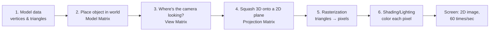

Let's unpack each box, because each one is a concept interviewers love to ask about.

**1. Model data — a chair is just numbers**

A 3D "sofa" isn't a picture. It's a list of **points in 3D space** (called *vertices*), and a list of which 3 points form a triangle (called *faces*). Every 3D surface, no matter how curved-looking, is actually built from thousands of tiny flat triangles.

```
      (0,1,0)
        /\
       /  \
      /    \
(-1,0,0)---(1,0,0)
```

That's one triangle in 3D space (x, y, z coordinates for each corner). A sofa model might have 5,000–50,000 triangles like this.

**2. Model Matrix — "where is this sofa in the room?"**

The artist who made the 3D sofa model made it centered at the origin (0,0,0), sitting on the ground, facing forward. But the user wants it in the *corner* of *their* room, rotated 45°. So we apply a **transform** — a small matrix that says "take every vertex of this model, and move it +3 on x, rotate it 45° around y, and scale it by 1.0." This is called the **Model Matrix** (or "world transform").

This is the single most important idea for later: **every object on screen = (its raw shape) + (a transform describing where/how it's placed).** This is exactly what you'll later store in the database — you don't store "a sofa mesh" per room, you store "sofa #123, at position (3,0,2), rotated 45°." Cheap to save, cheap to send over network.

**3. View Matrix — "where is the camera, and which way is it looking?"**

The user can orbit around the room. The camera itself has a position and orientation, just like furniture does. The View Matrix essentially re-expresses every object's position *relative to the camera*, as if the camera were standing at the origin looking down -z. This is why in Three.js/WebGL, "camera" and "furniture" both have transforms — the camera isn't special, it's just another object in the scene whose transform we use inversely.

**4. Projection Matrix — squashing 3D onto a flat screen**

This is the "fake it" step. There are two flavors:
- **Perspective projection** — things farther away appear smaller (like real vision, like a photo). Used for room walkthroughs.
- **Orthographic projection** — no size falloff with distance, parallel lines stay parallel (used in CAD "top-down floor plan" view — useful for your furniture app when the user wants a precise top-down layout view!)

```
Perspective:              Orthographic:
   \        /                |    |
    \      /                 |    |
     \    /                  |    |
      \  /                   |    |
   (near->far shrinks)    (no shrink, for measuring)
```

Most furniture-placement apps actually offer **both** — a 3D perspective view for "does this look nice," and an orthographic top-down view for "does this fit precisely," because precision measurement is hard to eyeball in perspective.

**5. Rasterization — triangles become pixels**

The GPU takes every 2D-projected triangle and figures out exactly which pixels on your screen it covers, and interpolates values (color, depth) across them. This is done by the GPU in massively parallel hardware — this is *why GPUs exist* — thousands of tiny cores each independently computing "is this pixel inside this triangle, and what color is it."

**6. Shading/Lighting** — for each pixel, compute the final color based on light sources, material properties (is it shiny like leather? matte like fabric?), textures (the wood-grain image wrapped onto the triangles).

### Who actually writes this code — do you write raw pipeline code?

Almost nobody hand-writes steps 1–6 today. The browser exposes a low-level API called **WebGL** (built on OpenGL ES) that lets JS talk directly to the GPU — but it's extremely verbose (hundreds of lines just to draw one triangle). So the industry-standard move is to use a library that wraps WebGL and gives you a friendly API:

- **Three.js** — the most popular for web (this is what most furniture configurators, like IKEA's early prototypes and many startups, are built on)
- **Babylon.js** — Microsoft-backed alternative, arguably better dev tools for this exact "product configurator" use case
- Under the hood: newer browsers expose **WebGPU**, the modern successor to WebGL, closer to how native game engines (Vulkan/Metal/DirectX12) talk to GPUs — faster, but adoption is still catching up as of 2026.

So in an interview, if asked "how would you render the 3D room," the answer is: *"Client-side, using Three.js on top of WebGL/WebGPU, which abstracts the vertex/fragment shader pipeline. I don't hand-roll the rendering math — I describe a scene graph (objects + transforms + lights + camera) and the library drives the GPU each frame."*

### Quick sanity-check example

Say we want a red cube at position (2, 0, 0) in Three.js — conceptually (not to memorize syntax, just to see how the pipeline maps to code):

```js
const geometry = new THREE.BoxGeometry(1, 1, 1);      // step 1: vertices/triangles
const material = new THREE.MeshStandardMaterial({ color: 'red' });
const cube = new THREE.Mesh(geometry, material);
cube.position.set(2, 0, 0);                            // step 2: Model Matrix
scene.add(cube);

const camera = new THREE.PerspectiveCamera(75, aspect, 0.1, 1000); // step 3+4
camera.position.set(0, 5, 10);
camera.lookAt(0, 0, 0);

renderer.render(scene, camera);   // steps 5+6, every frame, driven by requestAnimationFrame
```

Notice: `geometry` (the shape) is separate from `position` (the placement). That separation is the seed of everything in Part B — your database will store shapes-by-reference (a catalog of furniture models) and placements-by-value (per-room instance data).

---

That's the full story of "how does the 3D canvas even work." Take your time with it — ask me anything that's fuzzy (matrices, perspective vs ortho, WebGL vs Three.js, whatever), and when you're solid on this, say **"next"** and we'll go to **Stop 2: Coordinate Systems** (world space vs local space vs screen space — this is where "how do we place furniture correctly" starts to click).

---

## Stop 2: Coordinate Systems — World Space, Local Space, and Why This Matters for "Placing Furniture"

### The problem this solves

Say your 3D artist builds a dining table model. They build it in a 3D modeling tool (Blender) with the table's *own center* at (0,0,0) — legs symmetric around the origin, top sitting at y = 0.75 (table height). This is convenient for the artist — they don't care where in the world the table will eventually go.

Now, on the store's floor plan, the user drags this table to the far corner of their room, rotates it 30°, and later, they buy a *matching chair* that needs to sit "0.5 meters to the left of the table, tucked under it" — from the *table's* point of view, not the room's.

If everything only had one global coordinate system, every time the user rotated the table, you'd have to manually recompute the chair's world position with trigonometry by hand. That gets unmanageable fast once you have 30 objects in a room. This is the exact problem that forced 3D engines to formalize **multiple coordinate spaces** and matrix transforms between them.

### The spaces, story-style

Think of it like nested Russian dolls / a company org chart:

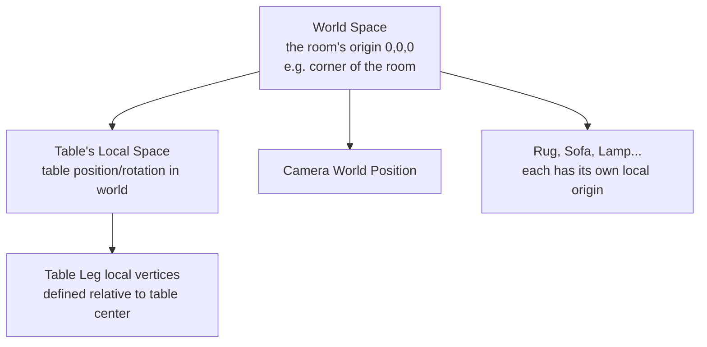

- **Local Space (a.k.a. Object Space / Model Space):** coordinates as the artist authored them, e.g. table leg is at (-0.4, 0, -0.3) *relative to the table's own center.*
- **World Space:** one shared coordinate system for the entire room. The room's corner might be (0,0,0), and "north wall" is along +z, "up" is +y (Three.js convention: Y-up, right-handed).
- **View/Camera Space:** world coordinates re-expressed relative to the camera (used internally during rendering, step 3 from Stop 1).
- **Screen Space:** the final 2D pixel coordinates after projection (this becomes important in Stop 4, raycasting).

The **transform** (Model Matrix from Stop 1) is literally the translator between local space and world space:

```
world_position = ModelMatrix × local_position
```

Where ModelMatrix bundles together **Translation** (move), **Rotation** (spin), and **Scale** (resize) — commonly abbreviated **TRS**.

### A concrete walk-through example

Say the table's local origin has a leg at local coordinate `(-0.4, 0, -0.3)`.

The user places the table at world position `(3, 0, 2)`, rotated 90° around the Y-axis (vertical axis — think "spin like a lazy Susan").

Step by step:
1. **Scale** — no scaling, factor = 1. Skip.
2. **Rotate** — rotating `(-0.4, 0, -0.3)` by 90° around Y swaps x and z (with a sign flip): roughly becomes `(-0.3, 0, 0.4)`. (This is just 2D rotation math applied to the x-z plane.)
3. **Translate** — add the table's world position `(3, 0, 2)`: final = `(3 - 0.3, 0, 2 + 0.4)` = `(2.7, 0, 2.4)`.

So that leg, which the artist thought was at `(-0.4, 0, -0.3)`, actually renders at `(2.7, 0, 2.4)` in the room. **Every vertex of every triangle of the table goes through this same math**, every frame, which is why GPUs (doing this in parallel across thousands of vertices) matter so much.

### Why this matters for your HLD interview specifically

This is the concept that explains **why you don't store raw 3D geometry per room in your database.** You store:

```json
{
  "furnitureItemId": "sofa_ikea_klippan_v2",   // reference to catalog model (local space geometry lives in the catalog/CDN)
  "position": { "x": 3.0, "y": 0.0, "z": 2.0 },
  "rotation": { "y": 90 },
  "scale": 1.0
}
```

That's it — ~5 numbers plus an ID. Compare that to storing 20,000 vertices per placed item — the difference is **kilobytes vs megabytes per room**, which massively affects your database design, your API payload size, your caching story, all of which we'll hit in Part B.

### The naive alternative people try, and why it breaks

A newcomer might think: "Why not just store world-space vertices for every object placed in the room, pre-baked?" This seems simpler at first (no matrix math needed at load time). But it breaks because:

1. **Storage blows up** — a room with 15 furniture pieces × 20k vertices each = 300k+ floats stored per room, vs. ~15 small transform records.
2. **You lose editability** — if the user nudges the sofa 10cm to the left, you'd have to regenerate every single vertex, instead of changing 3 numbers.
3. **You can't reuse the model** — 10,000 customers with the same IKEA sofa in their room would each need their own full copy of the mesh baked into world coordinates, instead of all sharing one canonical mesh from a catalog (huge implication for the CDN/storage stop later).

So the industry converged on: **geometry stays local & shared (in a catalog), placement is a small transform stored per room.** This single decision cascades through your entire system design — it's a great thing to say explicitly in an interview.

### One more space worth knowing: right-handed vs left-handed, and "up" axis conventions

Small gotcha interviewers sometimes probe: different engines pick different conventions.
- Three.js / OpenGL: **Y-up, right-handed** coordinate system.
- Some CAD/architecture tools: **Z-up** (because floor plans are naturally drawn on the X-Y plane, and "height" is Z).

If your furniture catalog is authored by a 3rd party (say, manufacturers upload their own 3D models, like a marketplace), this becomes a **real data-ingestion problem**: you need a normalization/conversion step in your upload pipeline that reorients every incoming model into your engine's canonical convention. Worth mentioning if asked "how do you onboard 3rd party furniture models" — it's a legit edge case.

---

**Recap before we move on:** every object = local geometry (from a shared catalog) + a transform (position/rotation/scale) that places it into world space. This transform is the *entire* piece of data you need to save per placed item — cheap, small, and independent of the mesh complexity.

Solid on this? Say **"next"** and we'll go to **Stop 3: Representing the Room and Furniture as Data (the Scene Graph)** — this is where we formalize "room = tree of objects" and start bridging into actual database schema thinking.

---

## Stop 3: Representing the Room as Data — the Scene Graph

### The problem this solves

By Stop 2, we know each piece of furniture is "local geometry + a transform." But a *room* isn't just a flat list of unrelated objects. Real scenes have **hierarchy**: a lamp sits *on* a table, which sits *on* the floor. If the user drags the table across the room, the lamp on top of it should move with it automatically — nobody wants to manually reposition the lamp every time.

Early 3D engines (game engines especially, back in the 90s) initially treated every object as independent, with its own world-space transform. Developers quickly hit the "move the table, lamp floats in place" bug. The fix that emerged — now universal across every 3D engine (Unity, Unreal, Three.js, Blender, CAD tools) — is the **Scene Graph**: a tree structure where each node's transform is relative to its **parent**, not the world.

### The Scene Graph, visually

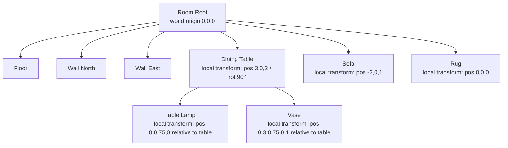

The key rule: **a child's final world transform = parent's world transform × child's local transform.** This is called **transform inheritance**, and it's just repeated matrix multiplication walking up the tree to the root.

So if you move the table (change *its* transform), every descendant (lamp, vase) automatically inherits the new position when the engine recomputes world transforms — you never touch the lamp's data at all. This is exactly why real furniture apps let you "group" a table + chairs as one draggable unit, or why a "living room set" can be moved as one block.

### Concrete example, doing the math

Table's local-to-world transform: position `(3, 0, 2)`, no rotation.
Lamp's transform *relative to the table*: position `(0, 0.75, 0)` (sitting on top, 0.75m up — table height).

Lamp's actual world position = table's world position + lamp's local offset = `(3, 0.75, 2)`.

Now the user drags the table to `(5, 0, 2)`. Nobody touches the lamp's data (`(0, 0.75, 0)` stays exactly the same, relative to its parent). The engine just recomputes: lamp's world position = `(5, 0.75, 2)`. This recompute happens automatically, every frame, as part of the rendering pipeline's Model Matrix step from Stop 1 — it's literally free, it's just how the pipeline already works, extended to walk a tree instead of a flat list.

### Why this is an HLD-relevant concept (not just graphics trivia)

This scene graph structure directly informs **how you'd design your database schema** for a "Room." A naive schema might be a flat table:

```
placements: id, room_id, furniture_id, x, y, z, rot_x, rot_y, rot_z
```

This works fine for *most* furniture apps because most items sit directly on the floor — you don't usually need deep hierarchy (a chair doesn't have children). But the moment your product wants "stacked/grouped" objects (lamp on a shelf, vase on a table, or "duplicate this whole dining set"), you need a `parent_placement_id` column:

```
placements: id, room_id, furniture_id, parent_placement_id (nullable),
            local_x, local_y, local_z, local_rot_y, scale
```

This is a self-referencing tree in the DB — same shape as a file system or an org chart. Common interview follow-up: *"how do you fetch/reconstruct the whole scene efficiently?"* Answer: fetch all placements for a room_id in one query (they're a small list, tens of rows), reconstruct the tree in memory client-side (or server-side before sending JSON) by grouping on `parent_placement_id`, and let the 3D engine do the transform-walk at render time. You do **not** want N+1 queries walking the tree node by node — pull the flat list once, build the tree in application code.

### The "found issues, tried again" part of this story

Early web-based configurators actually made a subtler mistake: they tried to persist the **entire live scene graph object** (as instantiated by Three.js, including camera state, lighting rig, animation state, helper/gizmo objects used only for editing) directly as the "saved room." This seemed convenient — "just serialize the whole Three.js scene to JSON, done."

It broke for a few reasons that are good interview talking points:
1. **Bloat** — the live scene graph includes editor-only objects (selection outlines, grid helpers, transform gizmos) that have nothing to do with the actual room design. Saving them wastes storage and, worse, sometimes *renders* them back into the "saved" room.
2. **Version coupling** — if you upgrade your Three.js version or change how a "table" object is internally represented in code, old saved scene-graph dumps can silently break, because you've serialized *implementation details*, not a stable data contract.
3. **Security** — some naive setups even serialized *functions* (event handlers) as part of "scene state," which is a foot-gun (arbitrary code stored/loaded from your DB).

The fix the industry converged on: **separate your "authoring/runtime scene graph" (an in-memory, ephemeral, engine-specific object) from your "persistence schema" (a small, stable, versioned JSON/DB representation)**. You write an explicit **serializer/deserializer** layer that walks the live scene and extracts *only* the meaningful fields (furniture_id, transform, room dimensions) into your stable schema, and does the reverse on load. This mirrors a very classic HLD principle you've probably seen elsewhere: **don't leak your internal runtime representation directly into your storage/API contract** — always have an explicit DTO/schema boundary. Nice pattern to name-drop in an interview.

### Quick recap table

| Concept | Analogy | Why it exists |
|---|---|---|
| Local space | "my coordinates from my own POV" | lets artists build models independent of where they'll be used |
| World space | "shared coordinates for the whole room" | lets the renderer place everything consistently |
| Scene graph | "org chart / parent-child tree" | lets moving a parent automatically move its children |
| Persistence schema | "stable contract, not the live objects" | decouples your DB from engine/library internals, avoids bloat & breakage |

---

Solid on the scene graph / hierarchy idea, and the "don't persist the live engine objects" lesson? Say **"next"** and we'll hit **Stop 4: Placing Furniture — Raycasting** (how a 2D mouse click on your flat screen turns into "put the sofa exactly *there* on the 3D floor"). This is one of the most commonly asked "wait, how does that even work?" questions for this kind of app.

---

## Stop 4: Placing Furniture — How a 2D Mouse Click Becomes a 3D Position (Raycasting)

### The problem this solves

You've got a rendered room on screen. The user drags a "sofa" thumbnail from a sidebar catalog and drops it somewhere on the floor in the 3D view. Your mouse cursor only ever reports a **2D pixel position** — like `(640, 380)` on a 1920×1080 screen. But you need to know: *where on the actual 3D floor, in world coordinates, does that pixel correspond to?*

This is fundamentally the **reverse of the rendering pipeline** from Stop 1. Rendering takes 3D world coordinates → projects them down to 2D screen pixels. Placing furniture needs to go the other way: 2D screen pixel → 3D world position. Going backward through a "squashing" operation (3D → 2D) is inherently ambiguous — infinitely many 3D points project onto the same 2D pixel (imagine a laser pointer shining from your eye through that pixel into the screen — it hits a *line* of points in 3D, not a single point).

### The naive first idea, and why it's not enough

A newcomer might think: "the mouse gives me x,y — I'll just set the sofa's position to `(mouseX, 0, mouseY)`, treating screen pixels directly as world coordinates." This *sort of* works only in a pure top-down orthographic view with no camera movement ever — the moment the user rotates or tilts the camera even slightly (which every real furniture app allows, because customers want to "walk around" their room), this mapping falls apart completely. Screen pixels and world coordinates are related by a full perspective/orthographic projection (matrices from Stop 1), not a simple 1:1 scale.

### The real solution: Raycasting

The actual technique, used everywhere from furniture apps to FPS games (for "which enemy did I click on") to CAD tools, is called **raycasting**:

1. Take the mouse's 2D pixel position.
2. Convert it into a **ray** — a 3D line starting at the camera's position, shooting through that exact pixel on the "virtual camera screen" (near plane), out into infinite distance.
3. Ask: **what does this ray intersect first?** — the floor plane, a wall, or another piece of furniture.
4. Wherever it first hits something, *that's* your 3D placement point.

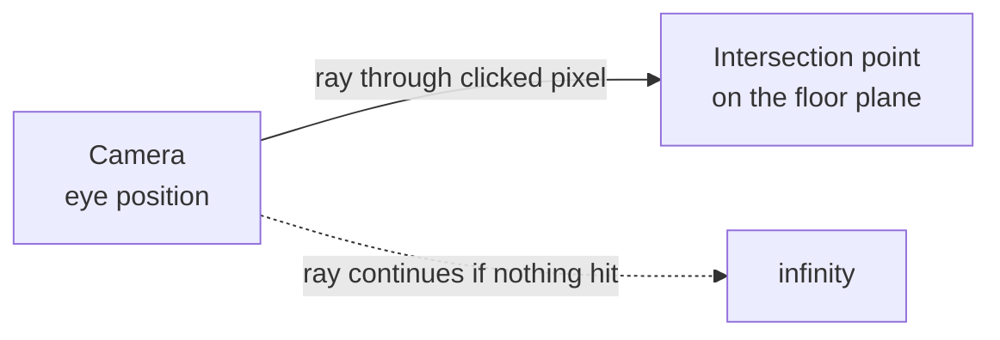

Think of it literally like a laser pointer coming out of the camera's eye, straight through the pixel you clicked on your screen, continuing into the 3D world until it hits *something*.

### The math, conceptually (you don't need to derive it, just understand the shape of it)

1. **Unproject** the 2D mouse coordinate: take screen pixel → normalize it to a range like (-1 to 1) on both axes → this is called **Normalized Device Coordinates (NDC)**.
2. Apply the **inverse** of the Projection Matrix and **inverse** of the View Matrix (the same matrices from Stop 1's rendering pipeline, just run backward) to turn that NDC point into a direction vector in world space.
3. Now you have a **ray**: `origin = camera.position`, `direction = that unprojected vector`.
4. **Intersect** that ray against your scene's geometry:
   - Against an infinite floor plane → simple algebra (a ray-plane intersection formula).
   - Against actual 3D meshes (say, "did I click on the existing sofa to select it, not the floor") → more expensive ray-triangle intersection tests, potentially against thousands of triangles.

In Three.js, this entire dance is wrapped in one built-in class, unsurprisingly named `Raycaster` — you don't hand-roll steps 1-4:

```js
const raycaster = new THREE.Raycaster();
const mouseNDC = new THREE.Vector2(x_normalized, y_normalized);

raycaster.setFromCamera(mouseNDC, camera);           // steps 1-3, done for you
const intersects = raycaster.intersectObjects([floorMesh, ...existingFurniture]);

if (intersects.length > 0) {
  const point = intersects[0].point;                  // the exact 3D hit point!
  newSofa.position.set(point.x, 0, point.z);           // place it (y=0, standing on floor)
}
```

`intersects` comes back **sorted by distance from the camera**, so `intersects[0]` is always the *first* thing the ray hits — critical, because you don't want to place a sofa "inside" a wall that happens to be behind the floor from the camera's perspective, you want the nearest valid surface.

### The performance problem people hit next, and the fix

Here's where the story gets interesting for an HLD audience specifically (not just graphics folks). Naive raycasting checks intersection against **every triangle of every object in the scene**, every time the user moves the mouse (for hover highlighting) or clicks. Early implementations did exactly this — and it worked fine with 5 furniture pieces, but as rooms grew to 30-50 detailed items (each with tens of thousands of triangles), raycasting started taking tens of milliseconds per check, causing visible input lag — the classic "works in the demo, breaks with real data" story.

The fix, now standard in every 3D engine, is a **two-phase check**:

**Phase 1 — cheap broad check:** First test the ray against a **bounding box** or **bounding sphere** around each object (a simple, coarse "invisible box" wrapping the whole mesh, defined by just 2 corner points — min & max x/y/z). Ray-vs-box math is extremely cheap (a handful of comparisons). This is called **broad phase collision detection**.

```
     ___________
    |  \        |
    |   \  sofa  |   <- bounding box (cheap to test)
    |____\_______|
        (actual mesh has thousands of triangles inside)
```

**Phase 2 — expensive precise check, only if phase 1 hits:** Only for objects whose bounding box the ray actually intersects, do you bother testing the *real* triangles for exact intersection. This is **narrow phase**.

This "cheap filter first, expensive check only on survivors" pattern is a *massive*, recurring theme in system design generally (bloom filters before DB lookups, indexes before full scans, caching layers before hitting the DB) — pointing out that 3D raycasting uses the exact same philosophy is a great thing to say in an interview, it shows you see the pattern, not just the graphics trick.

Many engines go a step further and organize all objects in the scene into a spatial index — a **BVH (Bounding Volume Hierarchy)** or **Octree** — so instead of checking the ray against N bounding boxes one by one, you walk a tree and discard whole branches of the scene at once (identical in spirit to how a database index lets you skip whole subtrees instead of scanning every row). Three.js scenes with lots of objects commonly use libraries like `three-mesh-bvh` for exactly this reason.

### Snapping and constraints — the last piece of "placing" furniture

Raw raycast hit points are precise to the millimeter, which is *not* what users want — nobody drags a sofa and expects it to land at `x = 2.3471829`. Real apps add a **placement policy layer** on top of the raw raycast result:

- **Grid snapping** — round the hit point to the nearest 5cm or 10cm grid cell (mirrors how design tools like Figma snap objects to alignment grids — same UX idea, different domain).
- **Surface constraints** — a "wall lamp" should only be placeable when the ray hits a *wall* object, not the floor; the app checks *which* object type was hit (`intersects[0].object.userData.type === 'wall'`) before allowing the drop.
- **Rotation snapping to walls** — when placing something against a wall (a bookshelf), auto-rotate it to align its back face flush with the wall's normal vector (the wall's "facing direction"), rather than making the user rotate it by hand pixel-perfectly.

### Recap

| Step | What happens |
|---|---|
| Mouse click → NDC | Normalize pixel coords to -1..1 range |
| NDC → Ray | Inverse-project through camera's View & Projection matrices |
| Ray → broad phase | Cheap bounding-box test to shortlist candidate objects |
| Ray → narrow phase | Precise triangle-level intersection, only on shortlisted objects |
| Hit point → placement | Apply grid snapping / surface-type constraints / rotation alignment |
| Final result | A clean `(x, y, z)` + rotation → this becomes the transform we save (Stop 2/3) |

---

This is genuinely one of the coolest "aha" mechanisms in the whole system — 2D pixel to exact 3D surface point, done tens of times a second as the user drags. Sit with it, ask anything that's unclear (the matrix inverse part is the most commonly hand-waved bit, happy to go deeper there), and when ready say **"next"** for **Stop 5: Does the furniture actually fit? — Collision Detection**, which builds directly on the bounding-box idea we just introduced.

---

## Stop 5: Does the Furniture Actually Fit? — Collision Detection

### The problem this solves

You've placed a sofa using raycasting (Stop 4). Now the user drags a second sofa and drops it... partially overlapping the first one, or half-inside a wall. Visually, in a naive renderer, this just *works* — the GPU happily draws two overlapping meshes with their triangles interpenetrating, no error, no crash. Nothing stops you from rendering two solid objects occupying the same space, because rendering (Stop 1) only cares about "what color is this pixel," not "does this violate physical reality."

But the entire point of a furniture app is to answer "will this actually fit in my room?" So we need an explicit, separate system whose only job is: **given two or more objects' current transforms, does their geometry overlap?** This is **collision detection**, and it's a completely different subsystem from rendering — a common thing people don't realize until they build it: *rendering and physics/collision are two independent pipelines that both read the same scene graph, but do totally different math.*

### The naive first attempt, and why it dies immediately

The obvious idea: "for every pair of objects, check if any triangle of object A intersects any triangle of object B." Precise, correct... and catastrophically slow. If a sofa has 20,000 triangles and a table has 15,000 triangles, checking all pairs is 300 million triangle-triangle tests — for *one* pair of objects. A room with 20 furniture items has ~190 pairs of objects. This is not viable at interactive frame rates (you need this to run in milliseconds, ideally every frame while dragging, so the user gets live "this doesn't fit" feedback).

This is the exact same broad-phase/narrow-phase lesson from Stop 4, applied to a new problem — which is a great sign you actually understand the pattern rather than memorizing tricks.

### The real solution: Bounding Volumes (AABB and OBB)

**Step 1 — wrap every object in a cheap approximate shape.** The two common choices:

**AABB (Axis-Aligned Bounding Box)** — the smallest box, aligned to the world's x/y/z axes, that fully contains the object.

```
World axes:  y
             |
             |___ x

    AABB of a rotated chair:
    +--------------+
    |    /\        |
    |   /  \  <-- chair rotated 30°, but box stays axis-aligned
    |  /____\      |
    +--------------+
```

Testing if two AABBs overlap is *extremely* cheap — just compare min/max on each axis:

```
overlap = (A.min.x <= B.max.x && A.max.x >= B.min.x) &&
          (A.min.y <= B.max.y && A.max.y >= B.min.y) &&
          (A.min.z <= B.max.z && A.max.z >= B.min.z)
```

Six comparisons. That's the entire test. This is why AABB is the default first-pass check almost everywhere.

**The problem AABB introduces:** once furniture gets *rotated* (very common — nobody places every piece axis-aligned), the AABB has to grow to still fully contain the rotated shape, becoming loose and wasteful — a chair rotated 45° has a much bigger AABB than its actual footprint, causing **false positives** (the system says "collision!" when the real shapes don't actually touch, just their boxes do).

```
   Rotated chair (actual footprint = diamond)
        /\
       /  \
      /    \
      \    /
       \  /
        \/
   AABB (must expand to contain the diamond):
   +------------+
   |    /\      |
   |   /  \     |
   |   \  /     |
   |    \/      |
   +------------+
   (lots of wasted "empty" corner area counted as occupied)
```

**The fix: OBB (Oriented Bounding Box)** — a box that rotates *with* the object, hugging it tightly regardless of orientation. Much more accurate, but the math to test two OBBs against each other is meaningfully more expensive than AABB (it involves a technique called the **Separating Axis Theorem**, checking whether you can find *any* axis along which the two boxes' projections don't overlap — if you can find one, they don't collide).

**The real-world compromise nearly every engine uses:** run the cheap **AABB test first as a filter** (broad phase — quickly rule out the vast majority of object pairs that are obviously nowhere near each other), and only for pairs whose AABBs *do* overlap, run the more precise **OBB test** (narrow phase) to get an accurate yes/no. Same two-phase pattern as raycasting, now applied here too — this repetition across the system is genuinely how these engines are built, not a coincidence, and it's worth explicitly saying that in an interview: *"I'd apply the same broad-phase/narrow-phase filtering pattern used in raycasting to collision detection too."*

### Room boundary checks — a special, simpler case

Besides furniture-vs-furniture collisions, you need furniture-vs-room-boundary checks (don't let the sofa clip through the exterior wall). Since room walls are typically simple flat rectangles/planes (not complex meshes), this check is usually just: is the furniture's bounding box fully within the room's floor polygon, accounting for wall thickness? This is cheap — a 2D point-in-polygon style check on the floor plan, ignoring height, since walls are usually vertical extrusions of a 2D floor outline.

### "Fits" is not just "doesn't overlap" — the deeper product requirement

Here's a subtlety a lot of people miss when first designing this feature: **collision detection alone doesn't answer "does this fit" the way a customer means it.** A sofa can be placed with zero geometric overlap with anything, yet:
- Block a doorway (nobody can walk through).
- Leave zero walking clearance around it (unrealistic/unusable layout).
- Be placed floating mid-air (bounding box test passed because y-ranges of two unrelated objects didn't overlap, but the sofa isn't resting on the floor).

So real furniture apps add a layer of **domain-specific placement rules** on top of raw collision detection:
- **Clearance zones** — an invisible "buffer" AABB slightly larger than the actual furniture footprint (e.g., +60cm in front of a chair for "pull-out" space), checked against other clearance zones, not just hard geometry.
- **Grounding check** — verify the object's bottom face y-coordinate equals the floor's y (using the same raycasting technique from Stop 4 — cast a ray straight down from the object and confirm it hits the floor at distance ≈ 0).
- **Doorway/walkway reservation** — some apps model door swing arcs and walkway paths as invisible "no-place zones" that furniture AABBs must not intersect.

This is a great place to show interviewers you think about **product requirements translating into engineering primitives**, not just "collision = true/false."

### Where does this check actually run — client, server, or both?

This is a real HLD design decision, not just a graphics detail, and it's worth reasoning through explicitly:

- **Client-side, real-time, during drag:** must run collision checks locally in the browser (JS/WebGL), because network round-trips (even 50-100ms) would make dragging feel laggy and broken. The client needs instant "red highlight = doesn't fit" feedback.
- **Server-side, on save:** should you *also* validate on the backend when the room is saved? Generally yes, for the same reason you always validate on the server even if you validated on the client elsewhere in software: **the client can't be trusted** (a modified/malicious client, or a client with a stale/buggy version, could submit a room with impossible overlaps directly via the API). If your product has any feature depending on "rooms are guaranteed physically valid" — e.g., professional designers browsing user-submitted layouts, or auto-generating a shopping cart /bill-of-materials from a valid room — you don't want corrupted data silently persisted.
- **Practical trade-off:** the server-side check is usually a *much lighter* re-validation (AABB-only, no expensive OBB/mesh-level precision) — good enough to catch "this is obviously broken" without re-implementing the full physics engine twice. This mirrors a very common HLD theme: **duplicate validation logic client + server, but tune the depth/cost differently at each layer** based on their different latency budgets.

### Recap

| Concept | Purpose | Cost |
|---|---|---|
| AABB | fast, axis-aligned bounding box | very cheap, but loose/inaccurate under rotation |
| OBB | rotates with the object, tight fit | more expensive, but accurate |
| Broad phase (AABB) → Narrow phase (OBB) | same filter-then-verify pattern as raycasting | keeps collision checks fast at scale |
| Clearance zones / grounding / walkways | translates product "does it fit" into engineering checks | domain logic layered on top of raw collision math |
| Client vs. server validation | client for instant UX feedback, server as source-of-truth validation | classic "never trust the client" principle |

---

You now have the full client-side story: render (Stop 1) → coordinate spaces (Stop 2) → scene graph/hierarchy (Stop 3) → place via raycasting (Stop 4) → validate via collision detection (Stop 5). Next we do the piece that ties it to persistence concretely: **Stop 6 — Saving a Room** (turning this live, in-browser 3D state into a JSON payload, versioning it, and what the actual save/load API looks like). This is the bridge into Part B (the classic backend HLD topics). Say **"next"** when ready.

---

## Stop 6: Saving a Room — From Live 3D Scene to Persisted Data

### The problem this solves

The user has spent 20 minutes arranging furniture. They click "Save." What actually gets sent over the network, and what gets written to disk? This is where all five previous stops collapse into one clean answer — and it's also where the "story" of naive-approach-then-fix repeats one more time, in a way that's very HLD-interview-relevant (payload size, versioning, partial updates).

### The naive first attempt: save everything, dump the whole scene

We already foreshadowed this in Stop 3 — the tempting-but-wrong move is to serialize the entire live Three.js scene graph (including camera state, lighting, helper gizmos, full mesh geometry) straight to JSON and POST it to the server. Two things kill this:

1. **Payload size** — a full mesh (thousands of vertices) serialized as JSON numbers is enormous — megabytes for a single sofa. A room with 20 items would be tens of megabytes just to save a *position change*.
2. **Redundancy** — every one of your 500,000 users who owns the same IKEA sofa model would be storing an identical copy of that sofa's geometry, over and over, room after room.

### The real approach: save only the transform + reference, exactly like Stop 2/3 taught us

By now this should feel obvious — that's the point, the earlier stops were building toward this moment. What you actually persist per room:

```json
{
  "roomId": "room_88213",
  "userId": "user_4471",
  "version": 3,
  "roomDimensions": { "width": 5.2, "depth": 4.0, "height": 2.7 },
  "wallLayout": [ { "start": [0,0], "end": [5.2,0] }, ... ],
  "placements": [
    {
      "placementId": "p_001",
      "furnitureItemId": "sofa_ikea_klippan_v2",
      "parentPlacementId": null,
      "position": { "x": 3.0, "y": 0.0, "z": 2.0 },
      "rotation": { "y": 90 },
      "scale": 1.0
    },
    {
      "placementId": "p_002",
      "furnitureItemId": "lamp_generic_table_v1",
      "parentPlacementId": "p_001",
      "position": { "x": 0, "y": 0.75, "z": 0 },
      "rotation": { "y": 0 },
      "scale": 1.0
    }
  ],
  "updatedAt": "2026-09-01T10:22:00Z"
}
```

Notice: `furnitureItemId` is a **reference** into a shared catalog (which holds the actual heavy 3D mesh + textures, stored once, served via CDN — this is exactly the topic of the next stop). The room document itself is tiny — a handful of KB even for a fully furnished room with 50 items. This is a direct, practical payoff of the local-space/world-space distinction and the scene-graph hierarchy we covered earlier — not abstract theory, this is *why* your save payload stays small.

### Where does this document live — what kind of database?

This is a natural point where an interviewer asks: "SQL or NoSQL for the room data?" Let's reason it through rather than just declare an answer.

**Characteristics of a "room":**
- Read-heavy relative to writes (user loads their room often, edits occasionally).
- Naturally a **nested/tree-shaped document** (room → placements → possibly nested children) — maps very cleanly to JSON.
- Rarely needs complex cross-room relational queries ("find all rooms containing a red sofa" is rare/analytics-y, not a hot path).
- Whole-document reads are the common case (you basically always load the *entire* room to render it — you don't fetch "just 3 placements").

This pattern — nested, document-shaped, whole-object read/write — is the textbook case for a **document database** (MongoDB, DynamoDB, Firestore-style). You'd typically store:
- `rooms` collection: one document per room, embedding the `placements` array directly (since placements are always read/written together with their parent room — this is the classic **embed vs. reference** decision in document DB design, and "always accessed together, bounded size" is exactly the signal to embed rather than store placements as a separate collection with a foreign key).
- A **separate** `furniture_catalog` collection/table (this one *is* more relational — think product catalog: SKU, dimensions, price, category, model file URLs — and is shared/reused across all rooms, high read volume, changes rarely — a great caching candidate, which we'll hit in Part B).

If instead the product needed heavy relational querying across rooms (e.g., "show me all rooms a designer manages, join with their client info, filter by budget") a relational DB might win for that *specific* access pattern — a good interview answer often ends with "it depends on the dominant access pattern," and the right move is to name the access pattern explicitly, not just pick a database because it's trendy.

### Versioning — the part people forget until it bites them

Here's a very real failure story: an app ships v1 of their room schema. Six months later, product wants to add "ceiling height" and "wall material" to rooms. Old saved rooms in the DB don't have those fields. If your load code just assumes every field exists, you get null-pointer-style crashes reading old data.

The fix — which you can see already baked into the example JSON above — is an explicit `"version": 3` field on every saved room document, plus a small **migration/adapter layer** on load:

```
loadRoom(doc):
  if doc.version == 1: doc = migrateV1toV2(doc)
  if doc.version == 2: doc = migrateV2toV3(doc)
  return doc  # now guaranteed to match current schema
```

This is the same "schema evolution" problem every long-lived stateful system faces (event-sourced systems, mobile app local storage, API versioning) — furniture apps aren't special here, but it's a very concrete, relatable example of *why* versioning matters, which makes it a strong thing to bring up unprompted in an interview.

### Autosave vs. explicit save, and the "chatty updates" problem

Users dragging furniture around generate *many* small state changes per second (every frame of a drag is a new position). If you naively call "save the whole room" on every drag-tick, you'd hammer your API with huge, mostly-redundant writes — a scaling problem interviewers love to probe.

The realistic solution, layered:
1. **Client-side debounce/throttle** — don't send anything until the user pauses dragging (e.g., wait 300-500ms after the last movement) or releases the mouse (`drop` event) — collapse dozens of intermediate frames into one final save call.
2. **Optimistic local state, deferred persistence** — the client keeps its own in-memory scene graph as the source of truth *during* editing (instant, no network needed to see your own changes — this is exactly why raycasting/collision run client-side per Stops 4-5), and only syncs to the server at natural checkpoints (drop, explicit "Save" click, periodic autosave every N seconds/on tab blur).
3. **Partial updates, not full-document rewrites, where possible** — instead of PUT-ing the entire room JSON on every small change, a PATCH-style update touching just the changed placement(s) reduces payload and write contention, especially relevant later for **collaborative editing** (Part B topic) where two people might be editing different furniture pieces in the same room simultaneously.

### Recap: the full client-side story, now connected end to end

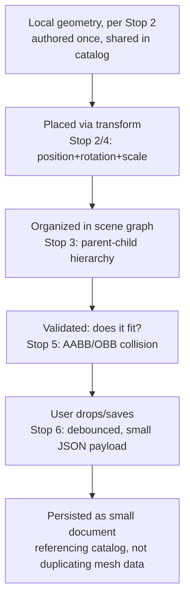

---

That's the complete "how does the 3D canvas even work, and how does it become saveable data" story — this was genuinely the hardest, most unfamiliar part, and you now have it end to end with the *why* at each step, not just the *what*.

We're now switching gears into **Part B: the classic backend HLD conversation** — architecture, catalog storage + CDN, caching, replication, sharding, real-time collaboration, error handling, security. This is the part that will feel much more like "standard HLD interview" territory, and everything we just built will plug directly into it (e.g., you'll immediately see *why* the furniture catalog needs a CDN once we talk about it).

Ready? Say **"next"** for **Stop 7: High-Level Architecture** — we'll draw the full system end to end first, then drill into each box one at a time.

---

## Stop 7: High-Level Architecture — The Full Picture First

### Why start here

Before drilling into caching, sharding, replication etc. individually, we need a map of the whole system so each subsequent stop has an obvious "where does this fit" answer. This is also exactly how you should open an HLD interview answer — draw the boxes first, then go deep box by box, rather than diving into one component blind.

### The actors and their needs

Let's identify *who* uses this system and *what* they need, because the architecture falls out of these requirements almost mechanically:

1. **Shopper** — browses furniture catalog, creates/edits 3D rooms, places furniture, saves rooms, maybe shares a room with a friend or a designer.
2. **Furniture Manufacturer / Admin** — uploads new furniture models (3D mesh + textures + metadata: price, dimensions, category) into the catalog.
3. **(Optional, advanced) Collaborators** — two people (e.g., a couple, or a customer + a professional interior designer) editing the same room together in real time.

### The high-level diagram

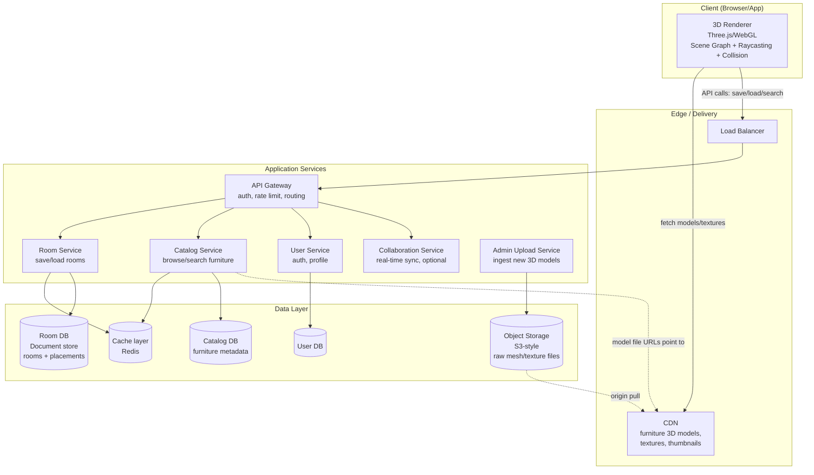

### Walking through the request flows (this is the part interviewers actually probe)

**Flow 1 — Loading the furniture catalog / browsing**
Client → CDN/LB → API Gateway → Catalog Service → (check Cache first, fallback to Catalog DB) → returns metadata (name, price, dimensions, thumbnail URL, model file URL). The actual 3D model *file* (the heavy binary) is **never** fetched through your application servers — it's fetched **directly from the CDN** by the browser. This distinction matters a lot and we'll unpack it fully next stop: your app servers should only ever handle small JSON, never multi-MB binary assets.

**Flow 2 — Opening/editing a room**
Client → Gateway → Room Service → Cache (hit? return immediately) → else Room DB → reconstruct scene graph client-side (Stop 3) → user drags furniture (Stops 4/5, all client-side, no network calls needed for real-time feedback) → debounced save (Stop 6) → Room Service writes to Room DB (and invalidates/updates cache).

**Flow 3 — Admin uploads a new furniture model**
Admin tool → Upload Service → validates file (format, size, polycount budget — more on this in error handling) → pushes raw mesh/texture files to Object Storage → writes metadata row into Catalog DB → CDN pulls/caches the object storage file on first real request (or you proactively push/invalidate).

**Flow 4 — Real-time collaboration (optional, advanced feature)**
Two clients connect to the Collaboration Service (WebSocket-based) which broadcasts placement changes between them live. We'll dedicate a full stop to this since it's a great "senior-level" topic to bring up unprompted.

### Why these specific service boundaries (not arbitrary)

A common interview follow-up: "why did you split it into these services and not just one monolith, or a different split?" The reasoning:

- **Catalog Service vs Room Service split** — these have *very different read/write ratios and scaling needs*. Catalog is read-heavy, changes rarely (a sofa's dimensions don't change daily), and is shared/global across all users → perfect caching candidate, can scale mostly via cache + read replicas. Room data is per-user, written more frequently (autosave), and has no cross-user sharing (mostly) → different scaling lever, more naturally shardable by user/room id (Stop 13). Bundling them into one service and one DB would force you to scale a low-write, highly-cacheable workload together with a higher-write, less-cacheable one — wasteful and operationally messy.
- **Separate Object Storage vs. Databases** — databases (SQL/NoSQL) are optimized for structured queries over small-ish records; they are *not* built to efficiently store/serve multi-megabyte binary blobs (mesh files, textures). Object storage (S3-style) is purpose-built for exactly that, and pairs naturally with a CDN in front of it. This is a very standard, important separation to state explicitly: **structured metadata → database, unstructured/binary large files → object storage + CDN.**
- **Collaboration Service is separate** because it's a fundamentally different protocol shape — everything else here is classic request/response HTTP (stateless, easy to horizontally scale behind a load balancer). Real-time collaboration needs **persistent stateful connections** (WebSockets), which scale and get load-balanced very differently (sticky sessions / connection affinity, not simple round-robin). Mixing stateful and stateless workloads in the same service tier is a common scaling headache, so isolating it is the standard move.

### The one big architectural insight to say out loud in an interview

If you remember one sentence from this stop: **this system has two very different kinds of "heavy" data — large, shared, rarely-changing binary assets (furniture 3D models → object storage + CDN) and small, per-user, frequently-changing structured data (room layouts → document DB + cache)** — and almost every subsequent design decision (caching strategy, replication, sharding, even collaboration) flows from treating these two data types differently rather than lumping "3D furniture app data" into one undifferentiated blob.

---

Solid on the overall shape? Say **"next"** and we'll drill into **Stop 8: The Furniture Catalog — Storage & CDN**, where we go deep on exactly *how* a 3D model file makes it from a manufacturer's upload to a user's browser efficiently (chunking, LOD/compression, cache headers, CDN edge behavior) — this is a very meaty, concrete topic.

---

## Stop 8: The Furniture Catalog — Storage, Compression, and the CDN

### The problem this solves

A single detailed 3D sofa model — mesh geometry + high-res fabric/wood textures — can easily be 5-20MB. Multiply that by a catalog of, say, 50,000 furniture items, and by millions of monthly users each loading a room with 10-20 pieces of furniture. If every one of those requests hit your application servers and your primary database, you'd need an absurd amount of compute just to shovel bytes around — and worse, your API servers (meant for fast JSON responses) would be tied up on slow, large binary transfers, degrading everyone's experience even for unrelated small requests.

This is almost the exact same story that led to CDNs existing in the first place for images/video on any large website — but it's worth walking through *why*, specifically for 3D assets, because there are some 3D-specific wrinkles.

### The naive first approach

Early prototypes of these apps (and genuinely, some real early startups) served 3D model files directly from their own application server's filesystem or straight out of the database as BLOBs. This works for a demo with 10 furniture items and 5 test users. It breaks at real scale for reasons that should now sound familiar from other stops:

1. **App servers get starved** — a server thread/connection tied up streaming a 15MB file for 3 seconds could've served 50 fast JSON API calls in that time. Binary asset serving and API serving have very different resource profiles (bandwidth-bound vs CPU-bound), and mixing them wastes capacity.
2. **No geographic locality** — a user in Mumbai fetching a file from a single server in Virginia pays enormous latency, especially painful for something users expect to "just load" as they orbit a room.
3. **Database bloat** — storing large binary blobs in a relational/document DB inflates backup sizes, slows replication (Stop 12), and most databases are just not architected for this (extra overhead per BLOB row, poor streaming support).

### The real solution, layered

**Layer 1 — Object Storage for the raw files.** Every 3D model, texture, and thumbnail image is stored as a file in an object store (S3-style: AWS S3, GCS, or similar) — not in your database. Your database only stores a **URL/key** pointing at the object storage location, plus metadata (name, price, category, dimensions). This is the "structured metadata vs. large binary blob" split we called out in Stop 7, now concretely: `furniture_catalog` table has a row like:

```json
{
  "furnitureItemId": "sofa_ikea_klippan_v2",
  "name": "Klippan Sofa",
  "dimensions": { "width": 1.8, "depth": 0.88, "height": 0.68 },
  "price": 279,
  "modelUrl": "https://cdn.example.com/models/sofa_klippan_v2.glb",
  "textureUrls": ["https://cdn.example.com/tex/klippan_fabric_diffuse.jpg", "..."],
  "thumbnailUrl": "https://cdn.example.com/thumbs/sofa_klippan_v2.jpg"
}
```

**Layer 2 — CDN in front of object storage.** A CDN (CloudFront, Fastly, Akamai, etc.) caches these files at edge locations physically close to users worldwide. First user in a region to request `sofa_klippan_v2.glb` triggers an **origin fetch** (CDN pulls from object storage, slow-ish, one-time per edge location), and every subsequent request from that region is served straight from the nearby edge cache — fast, and crucially, **it never touches your application servers at all.** The browser downloads the model directly from `cdn.example.com`, bypassing your API entirely for the heavy part.

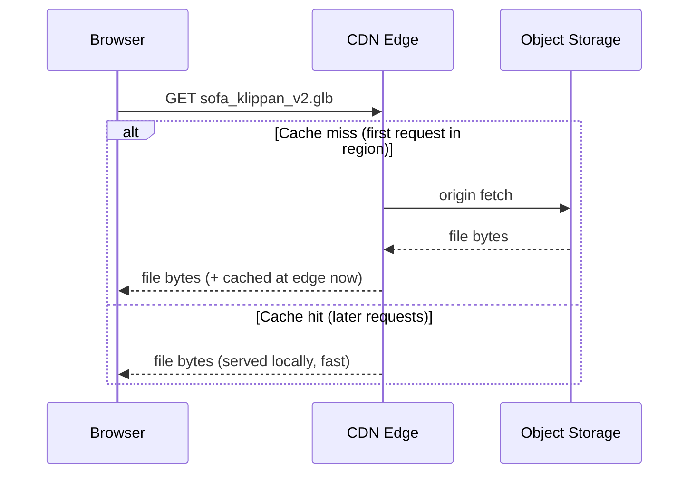

**Layer 3 — long cache lifetimes, because furniture models rarely change.** Since a "sofa" model's geometry essentially never changes once published (if a manufacturer needs to update it, they publish a *new* versioned file, e.g. `sofa_klippan_v3.glb`, rather than mutating the existing one in place), you can set very aggressive HTTP cache headers (`Cache-Control: max-age=31536000, immutable`) — telling browsers *and* CDN edges to cache this file basically forever. This "immutable, content-addressed / versioned filename" pattern is the same trick used for JS/CSS bundle caching in general web dev (`app.a3f9c1.js`) — same underlying idea, applied to 3D assets: **never mutate a published file in place; publish a new version with a new name/URL, so caching can be maximally aggressive without staleness bugs.**

### The 3D-specific wrinkle: file format and compression matter a lot here

This is worth knowing cold for an interview because it shows depth beyond generic "use a CDN":

- **glTF/GLB** is the modern standard format for delivering 3D models on the web (think of it as "the JPEG of 3D" — a compact, purpose-built interchange format), largely replacing older, bulkier formats (OBJ, FBX) for runtime delivery. GLB is the binary-packed single-file version (mesh + textures + materials bundled together) — fewer separate HTTP requests, which matters a lot given HTTP connection overhead.
- **Mesh compression** (e.g., Draco compression, which Google built specifically for this) shrinks the geometry data significantly — similar spirit to how gzip shrinks text, but designed around the specific patterns of 3D vertex/triangle data.
- **Texture compression** — textures (the images wrapped onto meshes) are often converted to GPU-native compressed formats (like Basis Universal / KTX2) that the graphics card can decode natively, rather than shipping raw JPEG/PNG and decompressing on the CPU every load.
- **LOD (Level of Detail)** — this is the big one, worth its own explanation below.

### Level of Detail (LOD) — the "why serve one giant model to everyone" problem

Here's a scenario that mirrors a very classic system design lesson (adaptive bitrate streaming for video, e.g., Netflix serving different quality streams based on your bandwidth): a furniture catalog thumbnail in a sidebar list is rendered at maybe 80×80 pixels — do you really need to stream a 50,000-triangle, 4K-texture sofa model just to show a tiny icon? Obviously not. And even in the full 3D room view, a sofa in the far corner of the room, tiny on screen, doesn't need the same triangle density as a sofa the camera is currently zoomed into.

The fix: **store multiple versions of the same model at different detail levels**, and pick the right one based on context:

```
sofa_klippan_v2_LOD0.glb   <- 50,000 triangles, full detail (up close)
sofa_klippan_v2_LOD1.glb   <- 8,000 triangles (mid distance)
sofa_klippan_v2_LOD2.glb   <- 800 triangles (far away / many objects on screen)
sofa_klippan_v2_thumb.jpg  <- flat 2D image (catalog browsing, not even 3D)
```

The renderer can swap between these automatically based on **distance from camera** or **screen-space size** — this is a standard built-in feature of engines like Three.js. This directly reduces: (a) how much data needs to be downloaded/cached in the first place, and (b) GPU rendering cost per frame when many objects are on screen (Stop 1's rasterization step scales with triangle count).

### Search — a piece we haven't covered yet

Browsing/filtering the catalog ("show me sofas under $300, in blue, that fit in a 2m×2m space") is a classic **search/filter** problem, not a 3D-specific one. This is a good spot to mention: for rich filtering (price range, category, color, dimension constraints) plus free-text search ("mid-century modern armchair"), the Catalog DB alone (especially if it's a document store) often isn't the best tool — many real systems add a dedicated search index (Elasticsearch/OpenSearch, or a managed search service) fed by a change-data-capture pipeline off the Catalog DB, so search queries don't hammer the primary database directly. Worth a one-line mention if catalog browsing/search comes up as a requirement, without necessarily needing to go deep unless asked.

### Recap

| Concern | Solution |
|---|---|
| Large binary files clogging app servers/DB | Object storage (S3-style), DB stores only URLs+metadata |
| Slow global access to large files | CDN caches files at edge locations near users |
| Files rarely change | Aggressive/immutable cache headers + versioned filenames, never mutate in place |
| Format overhead | glTF/GLB + Draco mesh compression + compressed textures |
| Not every view needs full detail | LOD — multiple resolution tiers, swapped by distance/screen size |
| Rich filtering/search over catalog | Dedicated search index (Elasticsearch-style), fed from Catalog DB |

---

That's the full "how does a 20MB sofa file efficiently get onto a user's screen" story. Notice this stop was really about **static, shared, rarely-changing data** — next we flip to the **other** data type from Stop 7's big insight: **small, per-user, frequently-changing room data**, and specifically how **caching** works for *that*, which has a different set of trade-offs (cache invalidation on writes, per-user cache keys, etc.).

Say **"next"** for **Stop 9: Caching Strategy** when you're ready.

---

## Stop 9: Caching Strategy — Two Very Different Caching Problems

### Why this needs its own stop, distinct from the CDN

It's tempting to think "we did caching already, that's what the CDN was." But the CDN (Stop 8) solves caching for **large, static, shared, rarely-changing files** (furniture models/textures). We now need caching for **small, structured, frequently-changing, often per-user data** — catalog *metadata* (price, dimensions — changes occasionally) and room documents (changes every time someone edits). This is a genuinely different problem with different tools (in-memory key-value stores like Redis, not a CDN) and different failure modes (staleness/invalidation bugs, not just "slow first load").

### Problem 1: Catalog metadata — a "hot item" caching story

Picture a big seasonal sale: 500,000 users hit the catalog page for "Living Room Sofas" within an hour. Without caching, every single request goes: API Gateway → Catalog Service → Catalog DB, running effectively the same query (or near-identical filtered queries) over and over. Your database — built for durable, consistent storage, not blistering read throughput — becomes the bottleneck, and worse, it's doing *redundant* work: the answer to "what sofas are on sale" doesn't change between request #1 and request #500,000 arriving 200ms later.

**The fix: a read-through cache (Redis) sitting in front of the Catalog DB.**

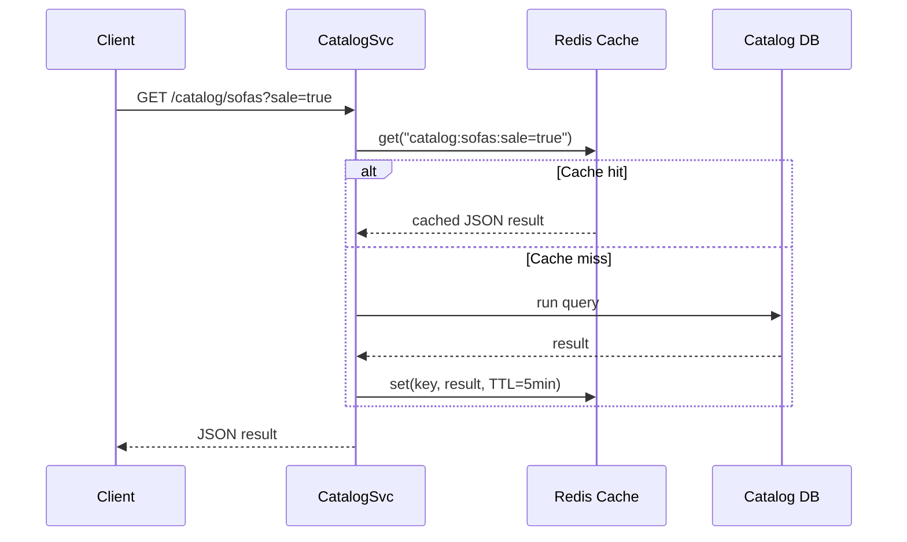

This is the standard **cache-aside (lazy loading)** pattern: the app checks the cache first, and only falls through to the DB on a miss, populating the cache for next time. Given catalog data changes relatively infrequently (a price update, a new item added), a **TTL (time-to-live)** of a few minutes is usually fine — slight staleness (a price shown as $279 for 3 more minutes after an update) is an acceptable trade-off for the massive read-load reduction. This "eventual consistency is fine for this kind of data" judgment call is worth stating explicitly in an interview — not every field needs strong consistency, and recognizing *which* fields can tolerate staleness is exactly the skill being tested.

For a single furniture item's full detail page (`GET /catalog/items/sofa_klippan_v2`), you'd cache by item ID directly — simple key-value, very high hit rate since popular items get requested constantly (a classic **power-law / hot-key** access pattern — a small fraction of the catalog, like trending or on-sale items, accounts for a large fraction of traffic, which caches beautifully).

### Problem 2: Room data — the harder, "your cache must never lie to you" story

Here's where it gets more interesting than typical read-heavy caching. Room data is:
- **Per-user** (not shared across users, so the cache key must include a user/room identifier — no hot-key sharing benefit like the catalog had).
- **Written frequently** (autosave, as covered in Stop 6).
- **Must be correct** — if a user edits their room, closes the tab, reopens it, and sees their *old* layout because of a stale cache, that's a visible, trust-breaking bug (unlike a sofa's price lagging by 2 minutes, which nobody notices).

So the caching strategy shifts from "tolerate some staleness for a big throughput win" to **"cache for read speed, but be strict about invalidating on every write."**

The pattern: **cache-aside for reads (same as before), but explicit invalidation on every write, not just a TTL.**

```
On save (RoomService.saveRoom):
  1. write new room data to Room DB (source of truth)
  2. after successful DB write: cache.set("room:88213", newData)   <- write-through the cache too, don't just delete
     OR: cache.delete("room:88213")                                 <- simpler, next read repopulates it
```

There's a real trade-off between these two invalidation strategies worth naming:

- **Delete-then-repopulate-on-next-read** — simpler to reason about, avoids ever caching something that doesn't match the DB (fewer bugs), but the very next read after a save pays a cache-miss DB hit.
- **Write-through (update cache directly on save)** — avoids that immediate miss, but risks a subtle race condition: if two writes happen close together, and their cache-updates land **out of order** (e.g., due to network jitter, write #2 finishes and updates cache, then write #1's slightly-delayed update overwrites it with older data), the cache can end up holding **stale data even though the DB has the correct, newer data**. This is a genuinely classic distributed systems bug, and a great thing to bring up: *"I'd guard against this by tagging cache writes with a version number or timestamp, and only accepting a cache-write if the version is newer than what's already cached — a simple compare-and-set guard."*

### The "stale cache during active editing" problem — a subtler one specific to this domain

While a user is actively dragging furniture (client-side only, per Stop 6 — no network calls per frame), the server-side cache and DB are both "stale" relative to what's on the user's screen *by design* — that's fine, intentional, and invisible to the user, since they're reading their own client-side state, not round-tripping through the cache at all. The danger case is specifically: **user A edits on device 1, then opens the same room on device 2** (phone + laptop) — *that's* when a stale server-side cache would visibly bite them. Worth explicitly distinguishing these two scenarios in an interview if asked "but doesn't dragging furniture constantly invalidate your cache?" — no, because dragging doesn't touch the server at all until the debounced save; the cache only needs to be correct at *save* boundaries, not per-frame.

### Cache eviction — what happens when the cache fills up

Redis-style caches have finite memory. When full, something must be evicted to make room for new entries. The standard policies:
- **LRU (Least Recently Used)** — evict whatever hasn't been accessed in the longest time. This is the default, sensible choice for both our use cases: rarely-viewed old rooms and unpopular catalog items naturally fall out of cache, popular/recent stuff stays.
- **TTL-based expiry** — entries auto-expire after N seconds/minutes regardless of access pattern (used for catalog data, as discussed, to bound staleness).

For room data specifically, you'd typically combine both: a moderate TTL (say, 30-60 min of inactivity) *plus* LRU eviction under memory pressure — an actively-edited room stays hot and cheap to access, a room nobody's touched in months gets evicted and simply refetched from the DB on the rare occasion it's opened again (acceptable — one slightly-slower load is a fine cost for a rarely-accessed item).

### Cache stampede — a failure mode worth naming proactively

Imagine a very popular catalog page's cache entry expires (TTL hit zero) at the exact moment 10,000 concurrent requests arrive for it. Naively, *all 10,000* see a cache miss simultaneously and *all* hammer the DB with the identical expensive query at once — a "thundering herd" that can take down your database right as load peaks, which is almost worse than not having a cache at all. The standard fix: **request coalescing / locking** — the first request that misses acquires a short-lived lock and does the actual DB fetch + cache repopulation, while the other 9,999 concurrent requests either wait briefly for that fetch to complete (then read the now-warm cache) or are served a slightly-stale/last-known-good value instead of all independently re-querying the DB. Worth a one-liner mention — it's a very "senior engineer" detail that shows you've thought about caching failure modes, not just the happy path.

### Recap

| Data type | Cache pattern | Staleness tolerance | Key design point |
|---|---|---|---|
| Catalog metadata | Cache-aside, TTL-based | High (minutes of staleness OK) | Hot-key friendly, shared across all users |
| Room documents | Cache-aside + explicit invalidation on write | Very low (must reflect latest save) | Per-user keys, versioned writes to avoid out-of-order overwrite bugs |
| Furniture 3D files | CDN edge cache (Stop 8) | Effectively infinite (immutable, versioned filenames) | Different tool entirely — not Redis, this is the CDN's job |
| Eviction | LRU + TTL combined | — | Popular/active stays hot, stale/unpopular naturally falls out |
| Stampede protection | Request coalescing/locking on miss | — | Prevents thundering herd on expiry of hot keys |

---

You now have both halves of the caching story clearly separated — this distinction (tolerant/shared vs strict/per-user) is genuinely one of the most interview-differentiating things you can articulate clearly, so it's worth being able to explain in your own words.

Say **"next"** for **Stop 10: Database Replication** — where we cover why and how you'd run multiple copies of your database, read replicas vs. leader-follower, and what breaks (replication lag) if you're not careful.


---

## Stop 10: Database Replication — Why One Database Is Never Enough

### The problem this solves

Say your Room DB is a single database instance. Two failure modes hit you almost immediately at real scale:

1. **Single point of failure** — that one machine dies (disk failure, host crash, datacenter outage), and *every* user in the world instantly loses the ability to load or save any room. For a consumer product with millions of users, this is unacceptable downtime.
2. **Read throughput ceiling** — a single database server can only serve so many queries per second before CPU/disk I/O saturates. As your user base grows, reads (loading rooms, browsing catalog) vastly outnumber writes (saving), and eventually one machine simply can't keep up, no matter how well-indexed your queries are.

**Replication** solves both: run multiple copies of the database, kept in sync, so you have redundancy (survive a failure) and can spread read load across copies.

### The classic pattern: Leader-Follower (a.k.a. Primary-Replica)

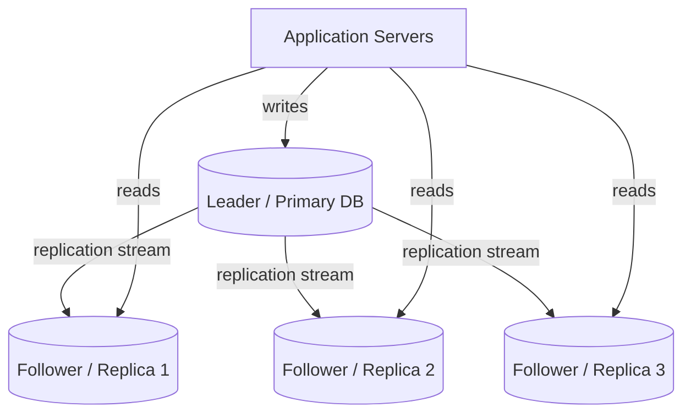

**The rule:** all **writes** go to exactly one node, the **leader** (also called primary or master). The leader then streams every change it makes to one or more **followers** (replicas), which apply those same changes to stay in sync. **Reads** can be served from *any* node — leader or followers — which is how you scale read throughput horizontally: need to handle more read traffic, just add more follower replicas.

Why not let writes go to any node? Because if two different nodes accepted conflicting writes to the *same* record at the *same* time independently, you'd need to resolve conflicts (whose write wins?) — a genuinely hard distributed-systems problem (this is the "multi-leader" or "leaderless" replication territory, used in some systems, but adds real complexity). Single-leader is simpler, avoids write conflicts by construction, and is the default choice unless you have a specific reason (like needing writes to succeed even during a full leader-region outage) to go further.

### Applying this to our system specifically

- **Room DB**: writes (saves) are relatively frequent per active user but the *total* write volume across all users is still much lower than read volume (people load/view rooms far more often than they edit and save them). Leader handles all room writes; several follower replicas absorb the "load my room" read traffic. 
- **Catalog DB**: even more read-skewed (catalog rarely changes, gets browsed constantly) — this is an *ideal* candidate for many read replicas, since almost all catalog traffic is reads, and we already have Redis in front absorbing much of it too (Stop 9) — replicas here are your defense for the cache-miss traffic and for regions/analytics queries that shouldn't hit the leader.

### Replication lag — the problem that bites people who don't think about it

Replication isn't instant. There's a small delay — usually milliseconds, but under load can stretch to seconds — between the leader committing a write and a follower having applied that same write. This gap is called **replication lag**, and it causes a very concrete, real bug in our system:

**The scenario:** User saves a room edit (write goes to Leader). Immediately after, the app reloads the room to confirm the save (read goes to a Follower, per our "reads can go anywhere" rule) — but that follower hasn't received the replicated write yet. The user sees their *old* room data flash back, right after saving. Confusing, feels broken, erodes trust ("did my save even work?").

This is called a **read-after-write consistency** problem, and it's one of the most commonly discussed replication issues in HLD interviews — good to have ready.

**Standard fixes** (worth naming more than one, since interviewers often ask "how would you fix that"):

1. **Read-your-own-writes routing** — right after a user performs a write, route *that specific user's* subsequent reads to the Leader (not a follower) for some short window (e.g., a few seconds), or specifically for that room ID. Other users' reads of *other* rooms are unaffected and continue to use followers normally.
2. **Sticky session / same-replica reads** — route a given user's reads consistently to the *same* follower for their session, so at least they see a monotonically-progressing view (never "goes backward" even if occasionally slightly behind), avoiding the jarring "flicker back to old data" experience even if not perfectly fresh.
3. **Client-side optimistic state (which we actually already have, from Stop 6!)** — since the client keeps its own in-memory scene graph as the local source of truth during editing, and only reloads from the server on a fresh page load/different device, the read-after-write race is actually far less likely to visibly manifest in *this specific app* compared to, say, a chat app — worth explicitly connecting this back to an earlier stop in an interview, it shows the design is coherent end-to-end, not a patchwork of generic fixes.
4. **Synchronous replication for critical writes** (trade-off: slower writes) — instead of the leader acknowledging a write as soon as *it* has committed (asynchronous replication — fast, but replicas can lag), require at least one follower to confirm it's applied the write too before the leader reports success back to the client. This closes the lag window entirely for that write, at the cost of higher write latency (waiting on a network round-trip to a follower). Most systems use this selectively for their most consistency-sensitive writes, not universally, since it slows down every write globally otherwise.

### Failover — what happens when the leader dies

If the leader node crashes, followers still have (mostly) up-to-date copies of the data, but nobody can currently accept writes — the system needs to **promote** a follower to become the new leader.

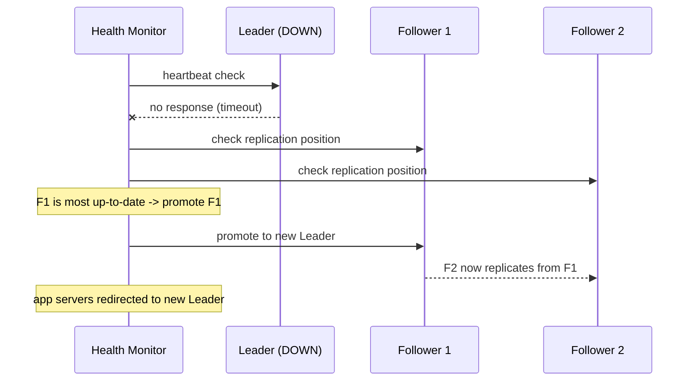

This process — detecting the failure, picking the best-positioned replica (usually the one with the least replication lag, to minimize data loss), promoting it, and redirecting traffic — is called **failover**, and can be manual (an on-call engineer runs it) or automatic (managed by tooling like Patroni for Postgres, or built into managed cloud DB offerings like AWS RDS Multi-AZ / Aurora). A subtlety worth mentioning: any writes that were sent to the old leader but hadn't yet replicated to the promoted follower **before the crash** are lost — this is why the choice between async vs semi-sync/sync replication (previous section) is fundamentally a trade-off between **write latency** and **durability guarantees during failover**, and it's a great, concrete way to explain the CAP-theorem-style trade-off without hand-waving.

### Recap

| Concept | What it means here |
|---|---|
| Leader-Follower replication | One node accepts writes, multiple nodes serve reads, kept in sync |
| Why | Redundancy (survive node failure) + horizontal read scaling |
| Replication lag | Small delay before followers catch up to the leader's latest writes |
| Read-after-write bug | User sees stale data right after their own save, due to lag |
| Fixes | Route own-writes to leader briefly, sticky reads, client-side optimistic state, or sync replication for critical writes |
| Failover | Promoting a follower to leader when the original leader dies; risk of losing very-recent unreplicated writes |

---

Solid on replication? Say **"next"** for **Stop 11: Sharding** — this is the natural follow-up ("replication scales reads, but what scales *writes*, or a dataset too big for one machine's disk?") and it's usually the meatiest, most-probed topic in these HLD interviews, so we'll take real care with it.

---

## Stop 11: Sharding — Scaling Beyond One Machine's Limits

### The problem this solves

Replication (Stop 10) solved *read* scaling — add more followers, spread read traffic. But it did **not** solve two other real problems:

1. **Write throughput ceiling** — every single write, no matter how many followers you have, still has to go through **one leader**. If you have millions of active users all autosaving room edits, eventually that one leader's disk I/O and CPU become the bottleneck — more followers don't help writes at all.
2. **Dataset size ceiling** — if you have 50 million saved rooms, at some point the *entire dataset* no longer comfortably fits on a single machine's disk (or fits, but indexes/working-set no longer fit in memory, so every query gets slow, even simple ones).

**Sharding (a.k.a. horizontal partitioning)** solves this by **splitting your data across multiple independent database machines**, where each machine holds only a *subset* of the total data — instead of one leader handling all rooms, you might have 10 separate leader-follower clusters, each responsible for 1/10th of all rooms.

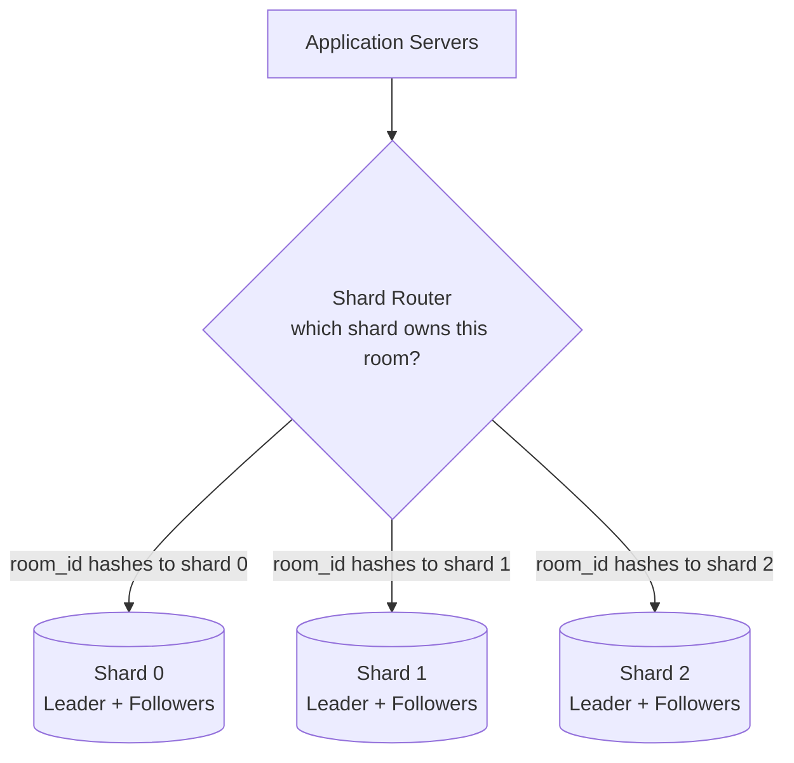

Each shard is itself a full leader-follower replica set (Stop 10) — sharding and replication are **complementary**, not competing techniques: replication scales reads *within* a shard and gives redundancy, sharding scales writes and total capacity *across* shards. Real large systems (and a strong interview answer) use **both together**.

### The core question: how do you decide which shard a given room lives on?

This is the single most important design decision in sharding, and it's exactly where the naive-approach-then-fix story is richest.

**Naive attempt #1 — range-based sharding.** "Room IDs 1 to 1,000,000 go to Shard 0, 1,000,001 to 2,000,000 go to Shard 1," and so on, sequentially. Simple to reason about, and has one genuine advantage: range queries ("give me rooms created in this ID range") stay efficient. But it breaks badly here because:
- **Hotspotting** — all *new* rooms get created with ever-increasing IDs, meaning all new writes pile onto whichever shard currently owns the "newest" range. If your product's rooms are mostly created and heavily edited in their first few days (very plausible — people set up a room, tweak it a lot initially, then rarely touch it again), the newest shard becomes a massive hotspot while older shards sit nearly idle. You've distributed *storage* but not *load*.

**Naive attempt #2 — hash-based sharding.** Instead of sequential ranges, hash the room_id (or user_id) and use `hash(id) % number_of_shards` to pick a shard. This spreads both storage *and* write load evenly and pseudo-randomly across all shards — no more hotspotting on "newest" data, since a hash function scatters IDs uniformly regardless of creation order. This is the standard default choice for exactly our kind of workload (per-entity data, no need for range scans across IDs).

**The problem hash-sharding introduces, and why it needed one more fix:** what happens when you need to **add an 11th shard** because you've outgrown 10? With plain `hash(id) % N`, changing N from 10 to 11 changes the modulo result for *almost every single key* — nearly the entire dataset needs to be reshuffled/moved between shards simultaneously. For a live system with millions of rooms, this is an enormous, risky, slow migration — effectively a full-system rebalance triggered just by adding one machine.

**The real fix: Consistent Hashing.** Instead of `hash(id) % N`, imagine the hash space laid out as a **ring** (0 to some max value, wrapping back to 0). Each shard is assigned one or more points on this ring. A room is stored on whichever shard's point is the **next one clockwise** from the room_id's hash position.

```
                    0
                    |
        Shard C -----+----- Shard A
             \       |       /
              \      |      /
               \     |     /
                -----+-----
              /     |     \
             /      |      \
        Shard B ----+---- (new Shard D
                    |       inserted here)
                  (ring)

room_id hashes to a point -> walk clockwise -> lands on nearest shard marker
```

The payoff: when you add a new shard (Shard D) to the ring, it only needs to take over the small arc of the ring between itself and its counter-clockwise neighbor — **only that slice of keys moves**, everything else on the ring stays exactly where it was. Adding/removing a shard now touches roughly `1/N` of the data instead of nearly all of it. This is *the* standard technique behind sharding in real distributed databases and caching systems (DynamoDB, Cassandra, and even Redis Cluster use variants of this) — knowing this by name and being able to sketch the ring is a strong, specific signal in an interview, much better than vaguely saying "we hash it."

(One more refinement worth a one-line mention: real systems use "virtual nodes" — each physical shard is actually assigned *many* points scattered around the ring, not just one — which smooths out load distribution further and makes rebalancing even more even when a shard is added/removed. Good to mention if pushed deeper, not essential to lead with.)

### What key do you actually shard *on*, for our specific system?

This matters a lot and is a great concrete design decision to state explicitly:

- **Shard the Room DB by `user_id`** (not `room_id` directly) — because a very common query pattern is "give me all rooms belonging to this user" (their dashboard/room list). If you sharded by `room_id`, a user's 5 saved rooms could be scattered across 5 different shards, turning "show my rooms" into a fan-out query hitting every shard and merging results (slow, wasteful). Sharding by `user_id` guarantees all of one user's rooms live together on the same shard — this is called **co-location of related data**, and picking the right shard key almost always comes down to "what's my dominant multi-row query pattern, and how do I keep those rows together?"
- **Catalog DB is usually *not* sharded**, or far less aggressively — the entire catalog (even at 50,000+ items with full metadata, no binary blobs since those live in object storage) is probably only a few GB, comfortably fits on one well-replicated leader-follower set with a cache in front. Sharding adds real operational complexity (cross-shard queries, rebalancing, more moving parts) — you should only shard when you actually have a size/throughput problem that replication + caching can't solve, not by default. This restraint is genuinely a good thing to say out loud: **"I wouldn't shard the catalog — it's small and read-heavy, that's what caching and replicas are for; sharding is specifically for the Room DB, which is the large, write-heavier, naturally partitionable-by-user dataset."**

### The cost sharding introduces: cross-shard operations become hard

Once data is split across shards, some operations that were trivial on one machine become genuinely awkward:

- **Cross-shard queries** — "find all rooms containing a specific discontinued sofa model, across all users" (e.g., to notify affected customers) now requires querying every shard and merging results (a **scatter-gather** query) — much slower and more complex than a single-machine query. This is exactly the kind of query you'd instead serve from a separate search index (Stop 8's mention of Elasticsearch) fed by a change-data-capture stream off all shards, rather than hitting the shards directly.
- **Cross-shard transactions** — if a feature ever needed to atomically update data across two different users' rooms in one transaction (rare here, but common in e.g. financial apps transferring money between accounts on different shards), you'd need distributed transaction protocols (two-phase commit, or saga patterns) — genuinely complex, and worth mentioning only exists as a cost, not something this particular app needs much of, since rooms are inherently per-user, independent entities.

### Recap

| Concept | Purpose |
|---|---|
| Sharding | Split data across multiple DB machines to scale writes + total storage |
| Range-based sharding | Simple, but causes hotspots on sequentially-growing IDs |
| Hash-based (`% N`) sharding | Even distribution, but resharding on growth moves nearly everything |
| Consistent hashing | Adding/removing a shard only moves ~1/N of the data — the real-world standard |
| Shard key choice | Shard Room DB by `user_id` to co-locate a user's rooms; don't shard Catalog DB (small, cache/replica-friendly) |
| Cost | Cross-shard queries/transactions become slow/complex — mitigate with a search index for cross-cutting queries, avoid needing cross-shard transactions by design |

---

This is usually the topic interviewers spend the most follow-up time on, so it's worth being able to redraw that consistent-hashing ring from memory and explain *why* you'd shard by `user_id` specifically for this app, not just "sharding = hash it."

Say **"next"** for **Stop 12: Real-Time Collaboration** — the fun, senior-level "two people editing one room together" feature we've been foreshadowing since Stop 7, and it pulls together WebSockets, conflict resolution, and ties back nicely to everything about the scene graph/placements we built earlier.

---

## Stop 12: Real-Time Collaboration — Two People Editing One Room Together

### The problem this solves

Picture a couple furnishing their new apartment together, or a customer working live with a professional interior designer on a call — both want to see the same 3D room, and when one person drags a sofa, the other should see it move **live**, not after a manual refresh. This is a genuinely different problem from everything we've covered so far, because up to now, every interaction (Stops 4-6) assumed **one user, one client, occasionally syncing to a server**. Now we need **multiple clients, continuously syncing to each other**, in near real-time.

### Why plain HTTP request/response doesn't work here

Every backend interaction so far has been classic REST: client sends a request, server sends one response, connection closes. This model has no way for the **server to push** new information to a client unannounced — and that's exactly what we need: when User A moves the sofa, User B's browser needs to be told *immediately*, without User B's browser having asked for anything at that moment.

**The naive first attempt: polling.** User B's client just asks the server "anything changed?" every 1-2 seconds, in a loop. This technically works and is genuinely how some early real-time-ish web features were built. But it's wasteful and laggy:
- Most polls return "nothing changed" — pure wasted requests, multiplied by every active room, hammering your servers for mostly-empty answers.
- Real-time "feel" is capped by your poll interval — 1-2 second polling means the sofa visibly jumps rather than smoothly moving, and a genuinely live collaborative feel needs much lower latency than that.

**The real solution: WebSockets.** A WebSocket is a **persistent, bidirectional connection** between client and server — opened once, kept alive, and either side can push a message to the other at any time with minimal overhead (no repeated HTTP handshake per message). This is the standard mechanism behind every "live" collaborative feature you've used (Google Docs cursors, Figma multiplayer, multiplayer games).

### The architecture for this specific feature

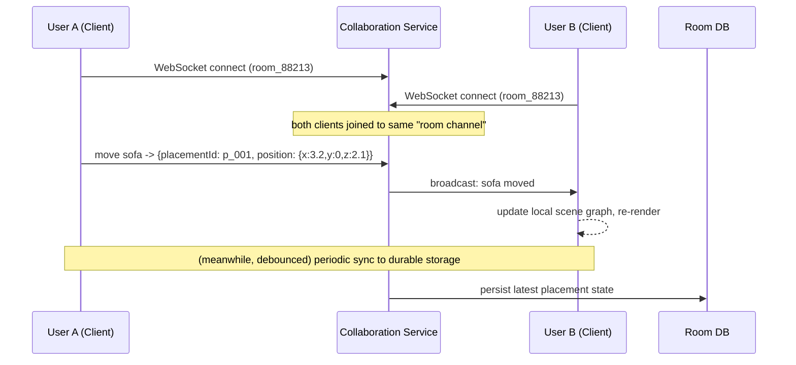

Key design points:
1. **Rooms as channels/topics.** The Collaboration Service groups connected clients by `room_id` — a message from a client in room 88213 only broadcasts to *other* clients also connected to room 88213, not globally. This is usually implemented with a **pub/sub** mechanism (Redis Pub/Sub, or a dedicated message broker) *behind* the Collaboration Service — because if you scale the Collaboration Service to multiple server instances (you will, for load), User A and User B might be connected to *different* physical server instances, and those instances need a shared way to relay messages to each other. Pub/sub is exactly that shared relay.
2. **The WebSocket messages themselves are small — the same `placementId` + transform data from Stop 6**, not full scene dumps. Live-dragging generates many small delta messages ("this placement's position is now X"), which is cheap to broadcast frequently, unlike broadcasting entire room JSON on every mouse-move.
3. **Durable persistence to the Room DB still happens separately, debounced** — you don't want every live drag-tick hitting the actual database (same reasoning as Stop 6), so the Collaboration Service holds the "live" authoritative state in memory/Redis and flushes to the durable Room DB on the same pause/drop/interval triggers as before. If the Collaboration Service crashes before flushing, you lose only the last few seconds of live edits, not the whole session — an acceptable trade-off, explicitly worth naming as one in an interview.

### The hard part: what if both users move the SAME object at the same time?

This is the conflict-resolution question, and it's the one interviewers most want to hear you reason about rather than hand-wave.

**Scenario:** User A drags the sofa to position X. At almost the same instant, User B drags the *same* sofa to position Y. Both messages arrive at the Collaboration Service within milliseconds of each other. What's the final position?

**Naive approach: last-write-wins (LWW), based on server arrival time.** Whichever message the server processes last simply overwrites the other — simplest possible rule, and honestly, for *this specific domain* (furniture position), it's usually good enough: there's no meaningful way to "merge" two different (x,y,z) positions for the same object into something sensible, unlike merging two people's edits to different words in a shared text document. If both users try to move the same object simultaneously, one of them "winning" and the sofa briefly popping to the final position is a perfectly reasonable, user-understandable outcome — much unlike, say, two people editing the same sentence in Google Docs, where losing a whole edit silently would feel broken.

This is actually a great insight to state explicitly in an interview: **the right conflict resolution strategy depends entirely on the semantics of the data.** For discrete, "current state" values like a position/rotation/color, LWW is fine. For accumulating, mergeable content (like collaborative text), you'd need something much more sophisticated — which brings us to:

**The more sophisticated approaches, worth knowing exist (even if you conclude LWW is right here):**
- **Operational Transformation (OT)** — the technique Google Docs originally used: transforms concurrent operations against each other so they can be applied in a different order on different clients and still converge to the same result. Complex to implement correctly, mainly justified for rich text editing.
- **CRDTs (Conflict-free Replicated Data Types)** — data structures mathematically designed so that concurrent updates, applied in *any* order, always converge to the same final state without needing a central coordinator (used in things like Figma's multiplayer engine, some collaborative editors, distributed counters). This is the more modern go-to term to know for these interviews, even if you determine LWW is sufficient for placement data specifically.

For a furniture app, an honest, well-reasoned answer is: *"I'd use last-write-wins per placement field, since positions are a 'current value' not accumulating content — genuinely conflicting simultaneous drags of the exact same object are rare and low-stakes if one wins. I'd reserve CRDTs/OT for a feature like shared text notes/comments on the room, if that existed, where losing a concurrent edit would actually feel bad."* This shows you know the fancier tools exist *and* that you can judge when they're overkill — that judgment is the actual signal being tested, not "do you know the buzzword."

### Presence — a nice, cheap feature that falls out of this architecture for free

Since you already have a live WebSocket connection per user per room, showing "who else is currently viewing/editing this room" (little avatar cursors, like Figma/Google Docs) is nearly free — the Collaboration Service already knows who's connected to which room channel; you just also broadcast lightweight cursor/camera-position updates (again, small deltas, throttled) alongside the furniture placement updates. Worth a one-line mention as a natural extension, shows product sense on top of the systems design.

### Scaling the Collaboration Service specifically

This is a good callback to Stop 7's point about stateful vs. stateless services: a normal REST API server is stateless — any instance can handle any request, so a load balancer can round-robin freely. A WebSocket connection is **stateful** — once User A connects to server instance #3, they *stay* connected to instance #3 for the life of that session (you can't casually move an open TCP connection to a different server mid-session). This means:
- Load balancing WebSocket connections needs **connection affinity/sticky routing** at connect-time (which instance you land on at first-connect matters, unlike stateless HTTP).
- Cross-instance broadcasting (User A on instance #3, User B on instance #7, both in room 88213) requires that shared pub/sub layer mentioned above — instance #3 doesn't broadcast directly to User B's socket; it publishes to Redis Pub/Sub (or similar), and instance #7 (subscribed to that room's channel) receives it and forwards it down User B's own socket.
- If a Collaboration Service instance crashes, every client connected to it needs to detect the drop and **reconnect** (client-side retry logic with backoff), likely landing on a different instance — the client should be built to handle "briefly disconnected, catch up on reconnect" gracefully (e.g., re-fetch current room state on reconnect, rather than assuming it missed nothing).

### Recap

| Concept | Purpose |
|---|---|
| WebSockets over polling | Persistent, bidirectional, low-latency push — needed for "live" feel |
| Rooms as pub/sub channels | Scope broadcasts to only clients in the same room, across server instances |
| Small delta messages | Broadcast just changed placement transforms, not full scene dumps |
| Debounced durable persistence | Live state lives in memory/Redis; DB writes stay infrequent, same pattern as Stop 6 |
| Last-write-wins for placements | Simple, appropriate conflict resolution for "current state" data like position |
| OT / CRDTs | Known-but-likely-overkill-here techniques for genuinely mergeable content |
| Sticky sessions + pub/sub relay | How you scale a stateful WebSocket tier across multiple server instances |

---

That's real-time collaboration end to end, and notice how much of it *reused* concepts from earlier stops (debounced saves, small transform payloads, the stateless/stateful service split) rather than being an isolated new topic — that reuse is exactly what a coherent system design looks like.

Say **"next"** for **Stop 13: Error Handling & Edge Cases** — the practical "what actually goes wrong and how do you handle it gracefully" conversation that interviewers often use to probe whether you've *actually* built things, not just diagrammed them.

---

## Stop 13: Error Handling & Edge Cases — What Actually Goes Wrong

### Why this stop matters in interviews

Anyone can draw boxes and arrows for the happy path. What separates a strong HLD answer is anticipating **failure modes** — network drops, bad uploads, race conditions, malicious input — and having a concrete plan for each, not just "we'd add error handling." Let's go through this system's failure surface systematically, grouped by where the failure originates.

### 1. Client-side failures — the 3D rendering layer

**Problem: the user's device can't handle the scene.** A room with 40 detailed furniture pieces might run smoothly on a gaming laptop but choke a 3-year-old phone (frame rate tanks, browser tab crashes from GPU memory exhaustion). This ties directly back to Stop 8's LOD system — the fix isn't just "hope it works," it's **adaptive quality**:
- Detect device capability at load time (check `navigator.hardwareConcurrency`, WebGL renderer info, or simply measure actual frame time for the first few seconds and react).
- Automatically drop to lower LOD tiers, reduce shadow quality, or cap max visible objects on weaker devices — same LOD infrastructure from Stop 8, now driven by a runtime performance signal instead of just camera distance.
- Provide a manual "performance mode" toggle as a fallback for users the auto-detection gets wrong.

**Problem: a specific furniture model fails to load** (corrupted file, CDN edge miss + slow origin, user's network drops mid-download). You don't want the *entire room* to fail to render because one sofa's `.glb` file 404'd. The fix: **per-object error boundaries** — wrap each furniture load in its own try/catch; on failure, render a placeholder (a simple gray box silhouette, sized to the item's known dimensions from catalog metadata) instead of blocking the whole scene, and retry the actual asset load in the background with exponential backoff.

**Problem: WebGL isn't supported at all** (very old browser, or WebGL disabled/unavailable in a locked-down corporate environment). Detect this upfront (`canvas.getContext('webgl')` returns null) and show a clear fallback message rather than a blank screen or cryptic crash — some products even offer a 2D top-down floor-plan-only mode as a graceful degradation for this case.

### 2. Save/write failures — the room persistence layer

**Problem: the save request fails mid-flight** (network drop, server 500, timeout) right as the user closes their laptop lid. Since the client holds authoritative in-progress state locally (Stop 6), the fix is **retry with confirmation, not silent failure**:
- Client queues the save, retries with exponential backoff on failure.
- If retries are exhausted (e.g., genuinely offline), persist the pending change to browser local storage as a last resort, and sync on next successful connection/app load — so a flaky connection doesn't silently lose 20 minutes of arranging furniture.
- Show explicit UI state ("saving...", "saved", "save failed — retrying") rather than assuming saves silently succeed — this is a real UX/reliability principle worth naming: **never let a write fail silently from the user's perspective.**

**Problem: duplicate save requests** — if the client retries a save that actually *did* succeed server-side (response was lost in transit, but the write landed), you risk a duplicate write or, worse, a race with a subsequent edit. The fix is **idempotency keys**: the client attaches a unique request ID to each save attempt; the server checks "have I already processed this exact request ID?" before applying it, and if so, just returns the previous result instead of reapplying. This is a very standard, widely-applicable pattern (payment systems use this heavily) and a great one to know cold.

### 3. Concurrent edit failures — beyond the real-time collab case

Even *without* the real-time collaboration feature turned on, a user could have the app open on their phone and laptop simultaneously, both editing the same room independently, both eventually saving. Without any protection, the second save silently overwrites the first, discarding the first device's changes with no warning.

The fix: **optimistic concurrency control**, using the `version` field we already introduced back in Stop 6 for schema versioning — dual-purpose it here too:

```
Save request includes: { roomId, expectedVersion: 3, newPlacements: [...] }

Server logic:
  currentVersion = db.getVersion(roomId)
  if currentVersion != expectedVersion:
      reject with 409 Conflict  # someone else saved in between
  else:
      apply update, increment version to 4
```

On a `409 Conflict`, the client can't blindly overwrite — it should re-fetch the latest room state and either merge (hard, for arbitrary 3D layouts) or, more realistically, prompt the user: *"This room was edited elsewhere since you opened it — reload latest, or keep your version?"* Simple, honest, and correct — much better than silent data loss. This is a very concrete, well-known pattern (**optimistic locking via a version/ETag field**) worth naming precisely in an interview rather than describing vaguely.

### 4. Upload/ingestion failures — the admin/catalog side (Stop 8's upload pipeline)

**Problem: a manufacturer uploads a malformed or oversized 3D model.** Without validation, a broken `.glb` file could crash client renderers for every user who later loads it, or a 500MB "sofa" could blow past reasonable bandwidth/storage budgets. The fix is a **validation gate in the Upload Service**, run *before* anything reaches the CDN/production catalog:
- File format/schema validation (is this actually valid glTF?).
- Polygon count budget enforcement (reject or flag for LOD regeneration if triangle count exceeds a threshold).
- File size ceiling per asset tier.
- Automated visual smoke-test — render the model server-side (headless) and confirm it produces a non-empty, reasonable-looking output before publishing, catching "technically valid file, but geometry is garbage/empty" cases.
- A staging/review state before an uploaded item goes live in the public catalog, rather than instant-publish — standard content-moderation-style pipeline.

### 5. Malicious/abusive input — security-flavored edge cases

**Problem: a malicious client sends fabricated placement data directly to the API** (bypassing the real 3D client entirely — e.g., a modified request placing "1 million sofas" in one room, or negative/absurd coordinates like `x: 999999999`). Since the client can never be trusted (Stop 5 already flagged this for collision checks specifically), the server needs its own independent guardrails on **every** write, not just the "does it physically fit" check:
- Cap the number of placements per room (a sane product limit, e.g., a few hundred — also protects rendering performance for anyone who later opens that room).
- Bound-check coordinates against reasonable room dimensions (reject placements wildly outside any plausible room size).
- Validate `furnitureItemId` actually exists in the catalog (reject references to nonexistent/deleted items) — otherwise you get orphaned references that crash the client trying to look up a model that isn't there.
- Rate-limit save requests per user (via the API Gateway, Stop 7) to prevent someone scripting thousands of rapid saves as either abuse or accidental infinite-loop bugs in a buggy client build.

**Problem: room sharing/permissions** — if rooms can be shared (e.g., a shareable link for a designer to view a client's room), you need explicit authorization checks on every room read/write (is this requester actually the owner, or a collaborator with edit rights, or a read-only viewer via share link?) — not just "if you know the room ID, you can edit it." Standard access-control-list style check at the Room Service layer, worth mentioning if sharing is a stated requirement.

### Recap table

| Layer | Failure | Fix |
|---|---|---|
| Client rendering | Low-end device chokes on scene complexity | Adaptive LOD, performance mode, capability detection |
| Client rendering | One asset fails to load | Per-object error boundary, placeholder + background retry |
| Client rendering | No WebGL support | Detect early, graceful fallback (2D mode or clear message) |
| Save | Network drop mid-save | Client-side retry + local storage backup + explicit save-state UI |
| Save | Duplicate retried requests | Idempotency keys |
| Save | Concurrent edits from 2 devices | Optimistic concurrency control via version field, 409 + reconcile prompt |
| Upload/ingestion | Bad/oversized/malformed model | Validation gate, size/polycount limits, staging review before publish |
| API | Malicious/fabricated placement data | Server-side bounds checks, catalog reference validation, rate limiting |
| Access | Unauthorized room access | Explicit ownership/collaborator/viewer permission checks |

---

Notice how many of these fixes are *reused patterns* from earlier stops (idempotency ~ the debounce/retry logic, optimistic concurrency ~ the version field from schema evolution, validation gate ~ the same "never trust the client" principle from collision detection) — that consistency is what makes an HLD answer feel designed, not assembled from a checklist.

Say **"next"** for **Stop 14: Security & Abuse Prevention** (a bit more than what we just covered — auth, data privacy, rate limiting architecture, and asset protection/piracy concerns specific to a paid furniture catalog) — the last conceptual stop before we wrap with a full end-to-end summary you can use to rehearse the whole interview answer.

---

## Stop 14: Security & Abuse Prevention

### Why this is a distinct stop from error handling

Stop 13 was about *accidental* failures and honest mistakes (network drops, bugs, bad data). Security is about **adversarial** actors — people deliberately trying to extract value they shouldn't have, break the system, or steal assets. Different mindset: instead of "what could go wrong," it's "what would someone try to get away with, on purpose."

### 1. Authentication & Authorization — the foundation

**Authentication** ("who are you") sits at the API Gateway (Stop 7) — every request carries a token (JWT is standard) issued at login, validated on every request before it reaches any downstream service. Keeping this at the gateway, rather than re-implementing auth checks inside every individual service, is the standard **single point of enforcement** pattern — avoids the bug where one service forgets to check auth.

**Authorization** ("are you allowed to do *this specific thing*") is finer-grained and belongs closer to the resource itself — the Room Service, not the gateway, is what knows "is this user the owner of room 88213, a collaborator, or a stranger?" This is the access-control-list check we flagged in Stop 13's sharing scenario — worth restating here as a security concern, not just a correctness one: without it, a malicious user could enumerate room IDs (`room_1`, `room_2`, `room_3`...) and read or edit *other people's* private rooms just by guessing/incrementing IDs. Two defenses layer together:
- **Use non-sequential, non-guessable IDs** (UUIDs, not auto-increment integers) — makes enumeration attacks impractical.
- **Still always check ownership/permissions server-side regardless** — obscurity (hard-to-guess IDs) is a nice-to-have, never a substitute for an actual authorization check. This is a classic security principle worth stating explicitly: **security through obscurity is not security.**

### 2. Rate limiting — protecting against abuse and scraping

We touched this in Stop 13 for accidental buggy-client loops; the security angle is deliberate abuse:
- **Scraping the catalog** — a competitor (or a bot building a copycat product) could script requests to download your entire furniture catalog metadata + assets. Rate limiting per API key/IP/user, plus monitoring for anomalous request patterns (one account requesting 10,000 distinct catalog items in a minute — clearly not a human browsing), triggers throttling or a CAPTCHA challenge.
- **Where to enforce**: at the API Gateway, using a sliding-window or token-bucket algorithm, keyed by user ID (for authenticated abuse) and IP (for unauthenticated/pre-signup abuse) — layering both catches more cases than either alone (a script rotating IPs but reusing one account still gets caught by the user-keyed limit, and vice versa).

### 3. Protecting the 3D assets themselves — a genuinely unique concern here

This is worth calling out because it's specific to this domain and shows depth beyond generic "add rate limiting":

**The problem:** furniture models are the manufacturer's/your company's IP, often licensed content with real commercial value (a designer furniture brand doesn't want their exact 3D model files freely downloadable and reused elsewhere, or 3D-printed, or used by a competitor's app). But we established in Stop 8 that these files are served directly from a CDN to the browser — which means, fundamentally, **the raw file bytes do reach the client's machine** to be rendered; you can't render something the browser never received. So "protection" here is realistically about **raising the bar against casual copying**, not making it cryptographically impossible (a sufficiently determined person with browser dev tools can always intercept a file their own browser downloaded — this is true of literally any client-rendered asset, worth acknowledging honestly rather than overpromising):
- **Signed, time-limited CDN URLs** — instead of a permanent public URL, generate a signed URL with a short expiry (e.g., valid for a few hours) per session, so casually-shared/scraped links go stale quickly, and bulk-scraping the whole catalog requires actually running your app repeatedly rather than one script hitting stable URLs.
- **Referrer/origin checks at the CDN** — reject requests for asset files that didn't originate from your own app's domain, blocking naive hotlinking.
- **Watermarking/asset obfuscation** — some real systems apply subtle mesh-level modifications per licensed partner to trace leaked files back to a source, though this is a heavier/optional measure typically reserved for genuinely high-value licensed content, not every catalog item.
- **Accept the honest limitation** — for a system design interview, the strongest answer is naming the realistic goal ("deter casual scraping and hotlinking, not achieve perfect DRM") rather than claiming a client-rendered asset can be made unextractable, which isn't true and an experienced interviewer will know it isn't.

### 4. Input validation against injection & malformed payloads

Beyond the "fabricated placement data" bounds-checking from Stop 13, standard web security hygiene applies throughout:
- **SQL/NoSQL injection** — parameterized queries / ORM usage everywhere, never string-concatenating user input into queries (applies to catalog search filters, room lookups, everywhere user input touches a query).
- **File upload validation** (Upload Service, Stop 13) doubles as a security boundary too, not just a correctness one — a malicious "furniture model" upload could attempt a zip-bomb, an oversized file designed to exhaust storage/processing resources, or embed something other than valid geometry data in a crafted file expecting a parser vulnerability. Validate strictly against the expected format spec, run uploads through sandboxed/resource-limited processing, never trust the uploader (even though in our case uploaders are presumably vetted manufacturer partners — defense in depth still applies, an internal partner's credentials could be compromised).

### 5. Data privacy — rooms can be sensitive

A saved room is, in a real sense, a floor plan of someone's actual home — arguably more sensitive than it first appears (reveals home layout, room dimensions, possibly implies presence/absence patterns if tied to smart-home-adjacent features). Baseline practices:
- **Encryption at rest** for the Room DB (standard for any DB holding personal data) and **encryption in transit** (TLS everywhere — client-to-CDN, client-to-gateway, service-to-service).
- **Data deletion / right to be forgotten** — if a user deletes their account, room data (and any object storage assets uniquely tied to them, e.g., custom uploaded room photos/floor plans if that's a feature) needs an actual deletion pipeline, not just a soft "hidden" flag, to meet privacy regulations (GDPR-style) — worth a one-line mention if the interviewer probes data lifecycle.
- **Least-privilege access internally** — engineers/support staff shouldn't have blanket raw DB access to browse arbitrary users' room layouts; access should be scoped, logged, and audited, same as any consumer product handling personal data.

### Recap

| Concern | Defense |
|---|---|
| Auth | JWT validated centrally at API Gateway |
| Authorization | Per-resource ownership/permission checks at the service layer, non-guessable IDs (but never rely on obscurity alone) |
| Abuse/scraping | Rate limiting (token bucket, keyed by user + IP), anomaly detection |
| Asset protection | Signed time-limited CDN URLs, referrer checks, honest acknowledgment of client-side limits |
| Injection/malformed input | Parameterized queries, strict upload format validation, sandboxed processing |
| Data privacy | Encryption at rest/in transit, real deletion pipelines, least-privilege internal access |

---

## Full Recap — The Whole System, End to End

You now have every piece. Here's the complete map, tying all 14 stops together, which you can use as your mental outline going into an interview:

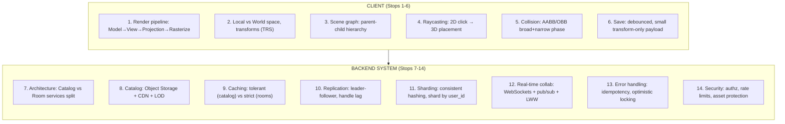

### The handful of "big insight" sentences worth having ready to say verbatim

If you remember nothing else, these are the sentences that show you actually understand *why*, not just *what*:

1. *"Every 3D object is local geometry plus a transform — this is why room data stays tiny even though furniture meshes are huge, and it's the single decision that shapes the whole storage/CDN architecture."*
2. *"This system has two fundamentally different data types — large/shared/static assets and small/per-user/frequently-changing state — and nearly every design decision downstream (storage choice, caching strategy, replication needs) follows from treating those two differently."*
3. *"Raycasting and collision detection both use the same broad-phase-then-narrow-phase pattern — cheap filter first, expensive precise check only on survivors — which is the same idea behind indexes and bloom filters elsewhere in system design."*
4. *"I'd shard the Room DB by user_id, not room_id, to co-locate a user's rooms for the common 'list my rooms' query, and I wouldn't shard the Catalog DB at all — it's small enough that replication and caching handle it."*
5. *"The client already holds authoritative in-progress state locally, which is why several classic distributed-systems problems — read-after-write lag, live-drag chattiness — are less painful here than in other real-time apps, since we're not round-tripping through the server for every frame."*
6. *"For furniture placement conflicts I'd use last-write-wins, not CRDTs/OT, because position is 'current state' not accumulating content — the right conflict strategy depends on the data's semantics, not a default toolset."*

---

That's the complete system, story to system design, ready for an interview. Want to do a mock round now — I ask you the HLD question cold, you talk through it out loud (or in writing) as if in an interview, and I give feedback on what you nailed and what to tighten? Or would you rather revisit any specific stop first?

