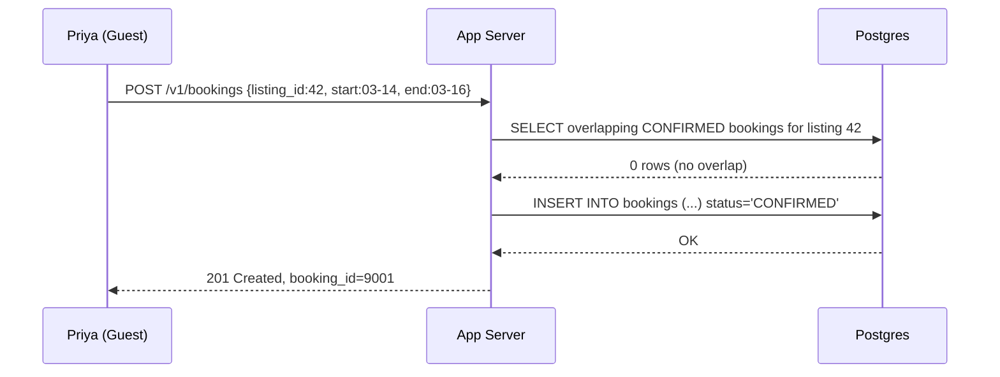
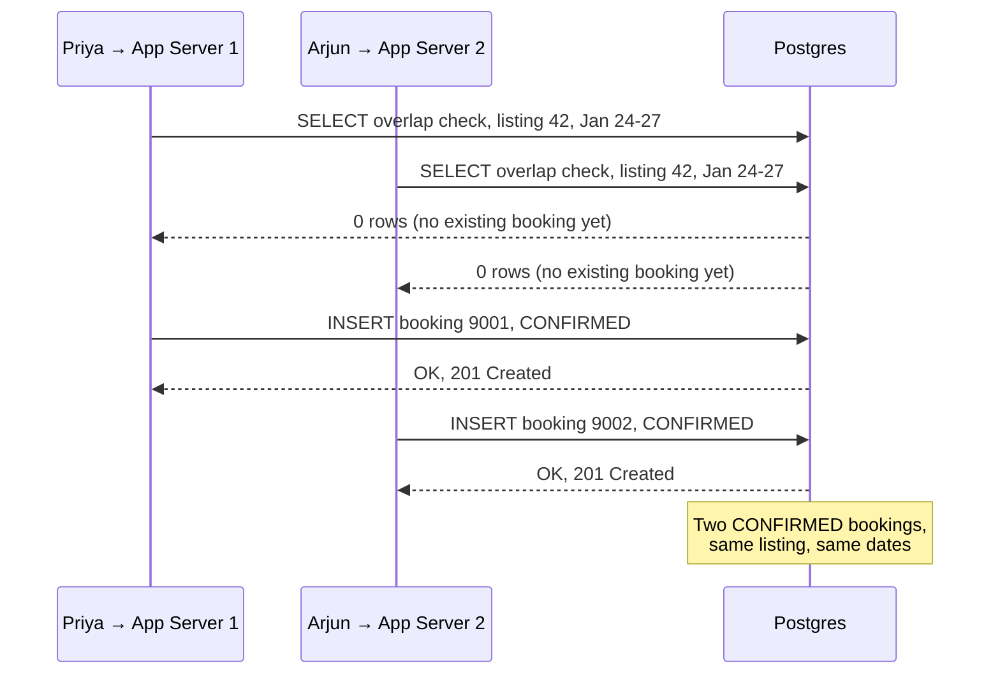
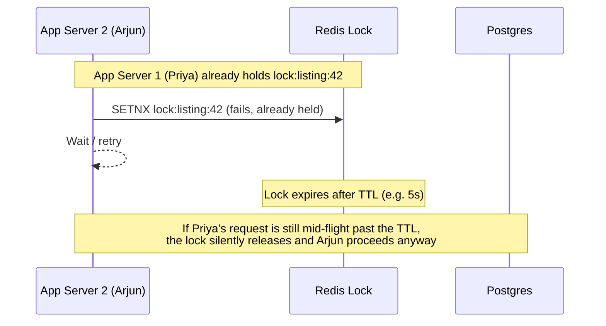
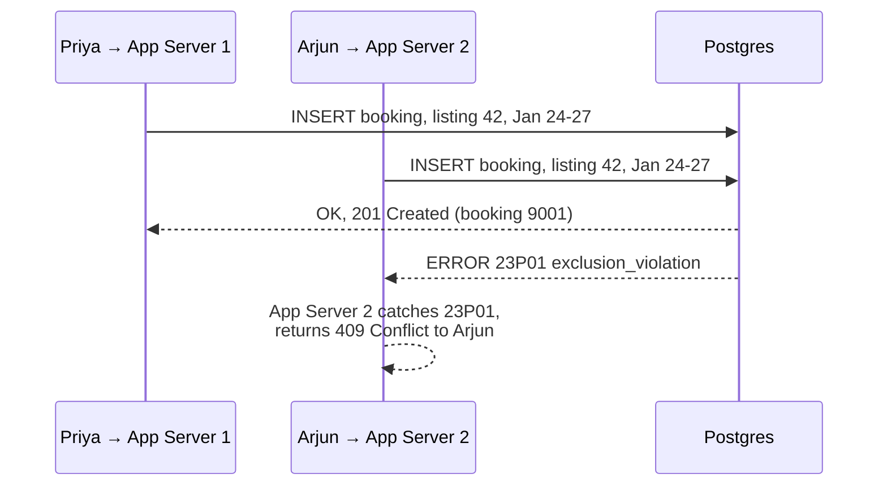
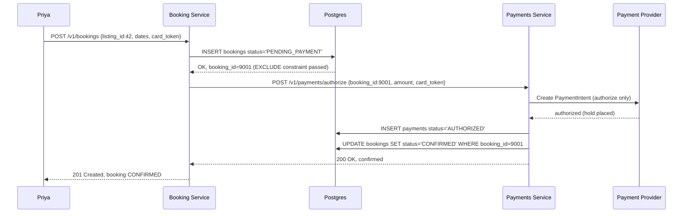
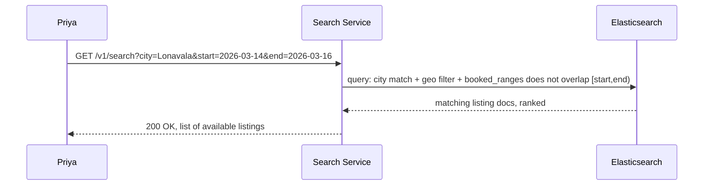
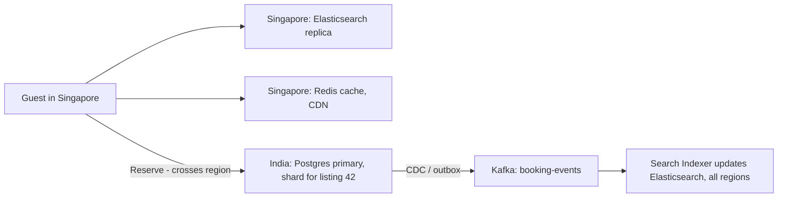
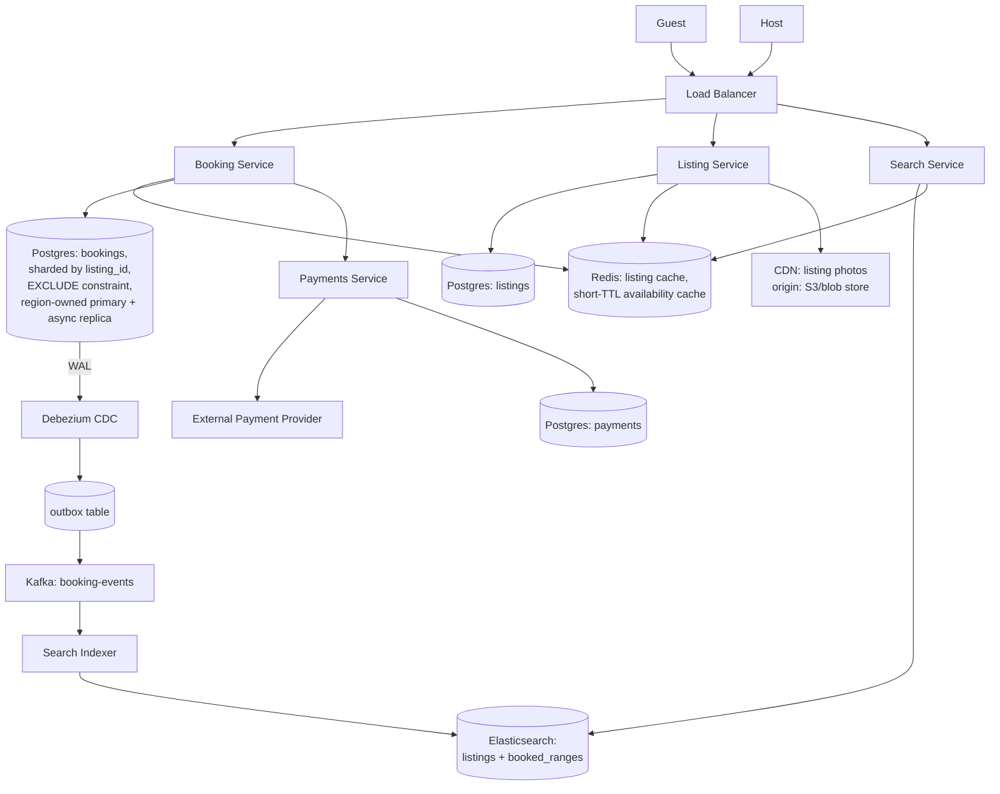

# Why This System Exists

It's 2008. Brian Chesky and Joe Gebbia can't afford rent in San Francisco.

A design conference is in town, every hotel is booked solid, and they have three air mattresses and a spare room. They rent it out for the weekend.

That one-off transaction only works because of trust and coordination between two strangers who've never met. The interesting engineering problem isn't "list a room" — it's "make sure two strangers can't both book the same room for the same night, at scale, across millions of listings, without a human ever double-checking a spreadsheet."

That's the problem we're building for.

# Scoped Requirements

Here's what I think actually drives the interesting design decisions. Confirm or adjust before we start.

**P0 — Core requirements:**

1. **Search listings** by location and date range, and only show listings that are actually available for those dates.
2. **Book a listing for a date range without double-booking it.** Two guests hitting "Reserve" on the same cabin for overlapping nights is the single failure mode this whole system exists to prevent. This is our crux — we'll spend most of our time here.
3. **Host can create and manage listings** (title, location, price, calendar). Necessary for search to have data, but architecturally light — mostly CRUD.

**P1 — Also in scope, lighter treatment:**

4. **Payment capture tied to the booking**, at least at the level of "hold funds when reserved, capture on confirmation" — because this interacts with the double-booking problem (do you charge before or after you've locked the dates?).

**Cutting these P2s — no real architectural impact for an HLD interview:**

- Reviews and ratings
- Host/guest messaging
- Dynamic/smart pricing algorithms
- Recommendation engine ("listings you might like")
- Detailed cancellation policy tiers (flexible/moderate/strict)
- Fraud detection
- Multi-currency conversion

**The crux, explicitly:** requirement #2. Preventing double-booking under concurrent requests, at scale, is where all the hard distributed-systems decisions live — locking strategy, transaction boundaries, what happens across shards, what happens across regions. Everything else in this system is comparatively straightforward once that's solved.

Does this scope look right to you? Anything you want added back in or cut further before we hit Day 0?

---

# Day 0: The Dumbest Thing That Could Work

Picture a single guest, **Priya**, searching for a cabin in Lonavala for the weekend of March 14–16. There's a host, **Ravi**, who listed that cabin last week.

For Day 0, we run:

- **One application server** (a monolith handling search, listings, and bookings)
- **One relational database** (Postgres)
- **No caching, no sharding, no replicas**

That's it. Every request — search, create listing, make a booking — hits the same server, which talks to the same single Postgres instance.

## Data Model

Three tables get us through Day 0:

```sql
CREATE TABLE listings (
    listing_id   BIGINT PRIMARY KEY,
    host_id      BIGINT NOT NULL,
    title        TEXT NOT NULL,
    city         TEXT NOT NULL,
    price_cents  INT NOT NULL,
    created_at   TIMESTAMP NOT NULL
);

CREATE TABLE bookings (
    booking_id    BIGINT PRIMARY KEY,
    listing_id    BIGINT NOT NULL REFERENCES listings(listing_id),
    guest_id      BIGINT NOT NULL,
    start_date    DATE NOT NULL,
    end_date      DATE NOT NULL,  -- exclusive: guest checks out this morning
    status        TEXT NOT NULL,  -- 'CONFIRMED', 'CANCELLED'
    created_at    TIMESTAMP NOT NULL
);

CREATE TABLE users (
    user_id   BIGINT PRIMARY KEY,
    name      TEXT NOT NULL,
    email     TEXT NOT NULL
);
```

Who writes `bookings`? The single app server, when a guest hits Reserve.

Who reads `bookings`? The same app server, both to render a listing's calendar and to check availability before confirming a new booking.

## The Booking Flow

Here's the exact sequence when Priya reserves Ravi's cabin for March 14–16:

1. **Check availability** — app server runs:
```sql
SELECT 1 FROM bookings
WHERE listing_id = 42
  AND status = 'CONFIRMED'
  AND start_date < '2026-03-16'
  AND end_date > '2026-03-14';
```
If this returns any row, the dates overlap with an existing booking and we reject.

2. **Insert the booking** — if no overlap, app server runs:
```sql
INSERT INTO bookings (booking_id, listing_id, guest_id, start_date, end_date, status, created_at)
VALUES (9001, 42, 501, '2026-03-14', '2026-03-16', 'CONFIRMED', now());
```



## Why This Is a Reasonable Starting Point, Not a Strawman

This design gives us one real guarantee: **as long as both the SELECT and the INSERT happen inside the same database transaction on the same machine, Postgres's row-level locking makes this genuinely safe from double-booking** — for a single server talking to a single database.

That's not nothing. If Priya and a second guest, **Arjun**, both hit Reserve at literally the same instant, Postgres serializes the two transactions. One's `SELECT ... FOR UPDATE` (or a `SERIALIZABLE` isolation level) blocks the other until the first commits, so the second one's overlap check correctly sees the first booking and gets rejected.

The guarantee we're trading away later is **simplicity of reasoning**: right now, "is this safe?" has a one-sentence answer — "yes, it's all one database." Every iteration from here on makes that answer longer.

## Where This Breaks

Two things will break Day 0, and they're different failures:

- **Scale**: one Postgres instance can't hold every listing and booking on Earth, and one app server can't serve global search traffic.
- **Concurrency across servers**: the moment we add a second app server for horizontal scaling, the "it's all one transaction" guarantee gets much harder to keep — two servers can both run their SELECT before either runs its INSERT.

That second one is exactly where we're headed next: Ravi's cabin becomes a stand-in for a **popular listing during a long weekend**, hit by many guests at once, from many app servers, and we watch the double-booking guarantee actually fail.

Got it / next when you're ready.

---

# Break It: The Long Weekend Race

We scale horizontally. Two app servers now sit behind a load balancer, both talking to the same Postgres instance.

Ravi's cabin becomes the hot listing for **Republic Day long weekend** (Jan 24–27). It's the only decent place in Lonavala with a mountain view, and it's all over Instagram.

At 9:00:00 AM sharp, two guests both hit Reserve within the same 40 milliseconds:

- **Priya**, routed to **App Server 1**
- **Arjun**, routed to **App Server 2**

Both want Jan 24–27.

## Why This Looked Fine

Our Day 0 logic was: check for overlap, then insert if clear. That worked because there was only one server, so requests were naturally serialized — one finished before the next started.

Adding a second server doesn't change the SQL. It changes the **timing**. Now two independent processes can each be mid-flight through "check, then insert" at the same moment, against the same row range, with neither one aware the other exists.

## The Specific Way It Breaks



Both SELECTs run before either INSERT commits. Both see an empty result. Both conclude the cabin is free. Both insert a `CONFIRMED` row.

Ravi now has two guests with two confirmed bookings for the same three nights, in the same cabin. One of them is showing up to a locked door — or worse, both show up and Ravi has to referee it in person.

## Why "Just Use One Server" Isn't the Answer

We could reject horizontal scaling and keep a single app server forever. That doesn't work for two separate reasons:

- **Throughput** — one process, however well-written, has a ceiling on requests per second. Airbnb-scale search and booking traffic blows past that ceiling quickly.
- **Availability** — one server is a single point of failure. It crashes, restarts, or gets redeployed, and the entire booking system is down until it's back.

So we need multiple app servers. Which means the fix has to live somewhere that's still true even when two servers are racing each other — and that means it has to live in how we talk to the database, not in how many app servers we run.

Next: we fix this specific race with real locking at the database layer, and look at why the *naive* version of "just add a lock" still isn't enough once we're past a single database instance.

Got it / next?

---

# Evolve It: Solving the Race, For Real

This is the crux, so we're going to walk it properly — including the attempts that look reasonable and specifically how they fail, before landing on the real answer.

## Attempt 1: "Just Use SERIALIZABLE Isolation"

Day 0's logic — check, then insert, inside a transaction — sounded airtight. The catch: it was only airtight because we never said which **isolation level** Postgres was running at, and the default is `READ COMMITTED`.

Under `READ COMMITTED`, a `SELECT` never blocks another transaction's `SELECT`. Both Priya's and Arjun's overlap checks run freely, see nothing, and both proceed to insert. That's exactly the race we just watched.

So the obvious fix: bump the transaction to `SERIALIZABLE`, which is supposed to make transactions behave as if they ran one at a time.

**Where this breaks:** `SERIALIZABLE` in Postgres doesn't queue conflicting transactions — it lets both run, then **aborts one at commit time** with a serialization failure if it detects a conflict. That means:

- Every booking write now needs explicit retry logic in the app, because "your booking failed, try again" becomes a normal, expected response under contention — not an edge case.
- Under real contention (our long-weekend cabin), you can get repeated abort-and-retry storms on the hottest listings, which is exactly the traffic pattern where you most need things to just work.
- It's also a systemic setting — easy for a future engineer touching unrelated code to run a query at `READ COMMITTED` by accident and silently reopen the hole.

It's not wrong, but it's fragile: correctness depends on every transaction, everywhere in the codebase, remembering to opt into the right isolation level.

## Attempt 2: A Distributed Lock Per Listing

Next idea: before touching the database at all, grab a lock keyed on `listing_id` — say, in Redis — so only one request per listing can be "in flight" at a time. Priya's request locks `listing:42`, Arjun's request for the same listing blocks until Priya's finishes.

This looks clean because it moves the serialization out of the database entirely and makes it explicit.



**Where this breaks**, two ways:

- **Lock expiry vs. request duration.** Locks need a TTL, or a crashed holder blocks the listing forever. But pick a TTL and you've picked a race window — if Priya's request is slow (GC pause, network blip) and outlives the TTL, the lock releases while she's still mid-transaction, and Arjun slips through. This is the exact failure Martin Kleppmann's critique of distributed locks (Redlock) is famous for.
- **Granularity.** Locking the whole `listing_id` means Priya booking Jan 24–27 blocks Arjun from booking the *same cabin* in August, even though the dates don't overlap at all. We've traded a correctness bug for a throughput problem — the lock is coarser than the thing we actually need to protect, which is the date range.

## Attempt 3: The Real Answer — Let the Database Enforce It

Both attempts tried to make the *app* responsible for serializing access. The actual fix is to stop trusting app-level logic entirely and make overlap **structurally impossible to insert**, using a database constraint.

Postgres supports `EXCLUDE` constraints — the `btree_gist` extension lets you say "no two rows in this table may have the same `listing_id` AND an overlapping `daterange`," and Postgres enforces this at commit time, unconditionally, regardless of isolation level, regardless of how many app servers exist, regardless of whether the app code remembered to lock anything.

```sql
CREATE EXTENSION IF NOT EXISTS btree_gist;

ALTER TABLE bookings
ADD COLUMN date_range daterange
    GENERATED ALWAYS AS (daterange(start_date, end_date, '[)')) STORED;

ALTER TABLE bookings
ADD CONSTRAINT no_overlapping_bookings
EXCLUDE USING gist (
    listing_id WITH =,
    date_range WITH &&
) WHERE (status = 'CONFIRMED');
```

Read that constraint as: "for the same `listing_id`, no two `CONFIRMED` rows may have overlapping (`&&`) date ranges." Postgres checks this the same way it checks a `UNIQUE` constraint — as an integral part of the `INSERT`.

Now the flow changes from "check, then hope nobody else inserted" to "just insert, and let the database tell you if you lost the race":



Whichever `INSERT` reaches Postgres's commit path first wins. The second one doesn't get a chance to corrupt state — it fails cleanly with SQLSTATE `23P01`, and App Server 2 translates that into a `409 Conflict` — "these dates are no longer available" — for Arjun.

Notice what's no longer needed: no separate lock service, no TTL tuning, no isolation-level discipline. The guarantee lives in the schema, not in every code path that happens to write to `bookings`.

## Comparison

| Approach | Correct under concurrency? | Cost |
|---|---|---|
| Check-then-insert, `READ COMMITTED` | No — this is the bug we started with | — |
| `SERIALIZABLE` isolation | Yes | Abort/retry storms under contention; fragile (opt-in per transaction) |
| Redis distributed lock per listing | No, at the edges (TTL races) | Also over-broad locking hurts throughput even when it works |
| Postgres `EXCLUDE` constraint | Yes, unconditionally | One-time schema design cost; requires `btree_gist` |

## Interviewer Follow-Ups

**"Why not just use `SELECT ... FOR UPDATE` on the listing row?"**
That works too, and it's a legitimate alternative — it forces the second transaction to block until the first commits. But it still requires every write path to remember to take the lock correctly, and it serializes *all* bookings on that listing even for non-overlapping dates, same granularity problem as the Redis lock. The `EXCLUDE` constraint gets you correctness without relying on discipline, and only blocks on genuine date overlap.

**"What if two different rows both pass the constraint check but for adjacent, not overlapping, dates — is there an off-by-one risk?"**
This is why `date_range` uses `'[)'` — inclusive start, exclusive end. Priya's `end_date = Jan 27` and a next guest's `start_date = Jan 27` don't overlap, because checkout morning and check-in morning are meant to be the same calendar day. Getting this bracket notation right is exactly the kind of detail that's easy to get wrong with hand-rolled overlap SQL and hard to get wrong with `daterange`.

This constraint is airtight for a **single Postgres instance**. It has a blind spot we haven't hit yet: what happens once `bookings` is too big for one database and we shard it — does the constraint still hold across shard boundaries? That's next.

Got it / next?

---

# Sharding the Bookings Table

Postgres's `EXCLUDE` constraint gave us a real guarantee — but it's a **per-instance** guarantee. It only stops overlapping inserts if both inserts land on the same physical database. The moment `bookings` splits across multiple machines, we need to make sure that guarantee doesn't quietly evaporate at the shard boundary.

**Why we're sharding at all, in one line:** Airbnb has millions of listings and tens of millions of bookings a year: a single Postgres instance runs out of disk, write throughput, and index-maintenance headroom for the `bookings` table long before that. This isn't a "might we need it" question — at that volume, one instance is off the table.

## Candidate Shard Keys

**`listing_id`**

Every booking row carries a `listing_id`. Sharding on it means: "all bookings for Ravi's cabin always live on the same shard."

- Optimizes: the exact check we care about — is *this listing* free for *these dates*. The `EXCLUDE` constraint stays valid, because Priya's and Arjun's competing inserts for the same listing are guaranteed to hit the same shard, so Postgres still sees both and still enforces the constraint.
- Breaks: "show me all of Ravi's bookings across his 5 listings" now means fanning out to up to 5 shards. Also breaks: a guest's booking history ("show me all of Priya's trips") means fanning out to every shard, since her bookings are scattered by listing, not by guest.

**`booking_id`**

Shard by the booking's own ID — a random or sequential key unrelated to listing.

- Optimizes: even, uniform write distribution across shards, since booking IDs are generated independently of which listing they belong to.
- Breaks: this is the one that actually matters — **it breaks correctness, not just query convenience.** Priya's insert for listing 42 and Arjun's competing insert for listing 42 could land on *different* shards, because their `booking_id`s have nothing to do with each other. Now the `EXCLUDE` constraint can't see both rows at once, and we've silently reintroduced the double-booking race we just spent an entire iteration closing.

**`region` (e.g., city or geo-cell)**

Shard by where the listing is — all Lonavala bookings on one shard, all Goa bookings on another.

- Optimizes: search, since "find listings in Lonavala for these dates" is naturally regional and stays on one shard.
- Breaks: a region like Goa during festival season generates wildly more booking volume than a sparsely-listed region — the shards aren't load-balanced by traffic, only by geography. It also complicates a host who lists properties in two different regions.

## The Decision

**`listing_id`** is the only one of the three that preserves the correctness guarantee from the last iteration, so it's the shard key — everything else is a secondary concern next to "don't reopen the double-booking bug."

One more piece: we don't shard on the raw `listing_id` directly (e.g., `shard = listing_id % N`). We hash it first — **consistent hashing** on `listing_id`, mapping listings onto a ring of virtual shard positions. The reason comes up in the next section.

## Hotspots

Does `listing_id` create a hot shard for this system's traffic shape? **Not really, and this is a genuinely different situation from something like a celebrity's social feed.**

A celebrity's *account* attracts disproportionate load because millions of people all interact with one entity. A listing is a physical cabin with 365 nights a year and one booking transaction per stay — there's a natural ceiling on how many writes a single `listing_id` can generate, no matter how popular it is. Ravi's cabin during Republic Day weekend gets a burst of *competing read/write attempts* for the same three nights, but that's contention on one row range, not sustained hot-shard throughput — and it's exactly the kind of contention the `EXCLUDE` constraint already resolves cleanly within a shard.

Where a real hotspot *can* show up: a host who owns hundreds of listings (a property-management company, not an individual), or an uneven number of listings per shard if the hash function clusters badly. Consistent hashing with **virtual nodes** (each physical shard owns many small ring segments, not one big contiguous range) is the standard fix — it spreads any one region or high-volume host's listings across the ring instead of concentrating them.

## Resharding Cost

This is exactly why we chose consistent hashing over `listing_id % N`.

With **modulo sharding**, adding a 5th shard to a 4-shard cluster changes almost every listing's `shard = listing_id % N` result — nearly the entire dataset has to be re-distributed at once. That's a full rehash, and it's operationally brutal at Airbnb's scale — you'd need to pause or dual-write during a massive data migration.

With **consistent hashing**, adding a shard only remaps the ring segment that new shard claims — roughly `1/N` of the data moves, and every other shard's listings stay exactly where they are. The blast radius is bounded to the fraction of the ring that changed hands, not the whole dataset.

```
Consistent hash ring (simplified, 4 shards):

              Shard A
           ╱          ╲
     Shard D            Shard B
           ╲          ╱
              Shard C

listing_id → hash() → position on ring → owned by nearest shard clockwise
```

## Interviewer Follow-Ups

**"What about search — 'find listings in Lonavala for March 14-16' — doesn't that need to hit every shard now, since listings are sharded by `listing_id`, not location?"**
Yes, and that's a real cost of this choice — search becomes a **scatter-gather** across shards rather than a single-shard query. We're accepting this because it's solvable with a separate read-optimized index (a search service backed by something like Elasticsearch, keyed by location) that's decoupled from the transactional booking store. The booking store's job is correctness under write contention; the search store's job is fast reads. They don't need the same shard key.

**"What if Ravi's booking history query fanning out to multiple shards becomes a real problem?"**
That's a secondary-index problem, not a primary-shard problem: maintain a separate `host_id → listing_id` lookup table (or a search-index entry) so "show Ravi's bookings" resolves to a small, known set of listing shards to query, rather than a blind fan-out to all of them.

---

Next: the P1 requirement — payment. Specifically, *when* do we charge Priya's card relative to the `INSERT` that just gave her the booking, and what happens if the payment fails after the row's already committed?

Got it / next?

---

# Booking Meets Payment

Priya's `INSERT` just succeeded — she has a `CONFIRMED` booking for Ravi's cabin. But no money has moved yet. Now we need to decide: **when, relative to that INSERT, does her card get charged?**

## Attempt 1: Charge Before You Insert

The naive order: call the payment provider first, and only insert the booking if the charge succeeds. Reasoning: don't create a booking nobody paid for.

**Where this breaks:** payment and booking are now two independent operations with no shared transaction. If the charge succeeds but the `INSERT` then fails — because Arjun's `EXCLUDE`-violating insert beat Priya to it by 50 milliseconds — Priya has been charged for a cabin she doesn't have. Now someone has to notice this and refund her, and until they do, she's out money with no booking. This is a **dangling charge**, and it's a support-ticket generator, not an edge case.

## Attempt 2: Insert Then Charge

Flip the order: insert the booking first (the `EXCLUDE` constraint guarantees only one of Priya/Arjun succeeds), then charge the winner's card.

**Where this breaks:** now the failure mode is inverted. Priya's `INSERT` commits — she holds a `CONFIRMED` booking — but her card is expired, or her bank declines the charge. She now has a confirmed reservation for Ravi's cabin, unpaid, and Ravi thinks he has a guest showing up. Nobody's out money, but the booking itself is now wrong and needs to be unwound.

## The Real Answer: Reserve, Then Capture, With an Explicit Pending State

Both attempts fail for the same underlying reason: they treat "insert the booking" and "take the money" as one atomic step, when they're really two separate systems (our Postgres, and an external payment provider like Stripe/Razorpay) that can't share a transaction.

The fix is the same shape as the two-bank problem from the UPI design: **don't pretend this is atomic — make the intermediate state explicit, and reconcile it.**

Concretely:

1. Insert the booking as `PENDING_PAYMENT`, not `CONFIRMED`. The `EXCLUDE` constraint still applies to `PENDING_PAYMENT` rows too — this is what actually blocks Arjun, at reservation time, not at payment time.
2. Call the payment provider to **authorize and hold** funds (not capture yet) — this is a standard "auth hold" every card network supports, the same hold a hotel puts on your card at check-in.
3. On successful auth, flip the booking to `CONFIRMED` and **capture** the hold.
4. On failed auth, flip the booking to `CANCELLED`, freeing those dates for someone else.

```sql
ALTER TABLE bookings
    ALTER COLUMN status TYPE TEXT,
    ADD CONSTRAINT valid_status
        CHECK (status IN ('PENDING_PAYMENT', 'CONFIRMED', 'CANCELLED'));
```

The `EXCLUDE` constraint's `WHERE (status = 'CONFIRMED')` clause from last iteration needs updating too — it has to also block on `PENDING_PAYMENT`, or Arjun could sneak in while Priya's payment is still being authorized:

```sql
DROP INDEX no_overlapping_bookings;

ALTER TABLE bookings
ADD CONSTRAINT no_overlapping_bookings
EXCLUDE USING gist (
    listing_id WITH =,
    date_range WITH &&
) WHERE (status IN ('PENDING_PAYMENT', 'CONFIRMED'));
```

## Who Writes, Who Reads

A new **Payments Service** enters here, owning its own table:

```sql
CREATE TABLE payments (
    payment_id      BIGINT PRIMARY KEY,
    booking_id      BIGINT NOT NULL REFERENCES bookings(booking_id),
    provider_ref_id TEXT NOT NULL,   -- idempotency key sent to payment provider
    amount_cents    INT NOT NULL,
    status          TEXT NOT NULL,   -- 'AUTHORIZED', 'CAPTURED', 'FAILED'
    created_at      TIMESTAMP NOT NULL
);
```

| Step | Writes | Reads |
|---|---|---|
| Booking Service inserts reservation | `bookings` row, `PENDING_PAYMENT` | — |
| Booking Service calls Payments Service | — | — |
| Payments Service calls provider, records result | `payments` row | `bookings.booking_id` (to link) |
| Payments Service tells Booking Service the outcome | `bookings.status → CONFIRMED` or `CANCELLED` | `payments.status` |

Same store as `bookings` for now — Postgres, in a `payments` table. No new storage technology yet; this is a straightforward relational write with a foreign key, not an access pattern that needs anything more exotic.

## The Flow



If the Stripe call fails instead: `payments` gets a `FAILED` row, `bookings.status` flips to `CANCELLED`, and those dates immediately become bookable again for the next guest — the `EXCLUDE` constraint's `WHERE` clause stops matching that row the instant status leaves `PENDING_PAYMENT`/`CONFIRMED`.

## What We Gained / What We Gave Up

**Gained:** no dangling charges, no confirmed-but-unpaid bookings — the booking's status always accurately reflects payment reality.

**Gave up:** a booking now has a brief `PENDING_PAYMENT` window (typically low hundreds of milliseconds to a couple seconds, bounded by the payment provider's auth latency) where the dates are held but not yet guest-confirmed. If Priya's browser dies mid-flow after the `INSERT` but before the provider responds, we need a way to know whether the auth actually succeeded — same **idempotency-key** problem from UPI. `provider_ref_id` in the `payments` table exists exactly for this: Booking Service can safely retry `POST /v1/payments/authorize` with the same key without risking a double charge, and reconcile against Stripe's status if it never got a response.

**Rejected alternative:** capture funds immediately instead of authorize-then-capture, and refund on cancellation. Rejected because refunds are visibly slower and worse UX than a hold that simply never gets captured — and refund failures are their own failure mode we'd rather not add.

## Interviewer Follow-Up

**"What if the booking flips to `CONFIRMED` but the app crashes right after, before the guest ever sees the confirmation?"**
The guest's client can always re-fetch `GET /v1/bookings/9001` and see `CONFIRMED` — the state lives in Postgres, not in the response the crashed request never delivered. This is why step 3 writes the authoritative status to the DB *before* replying to Priya, not after.

---

Next: search. Priya's original query — "cabins in Lonavala, March 14–16" — has to run against a `bookings` table now sharded by `listing_id`, which we already flagged means scatter-gather. Time to fix that with a dedicated read path.

Got it / next?

---

# Search: Fixing the Scatter-Gather

Priya's original query was "cabins in Lonavala, available March 14–16." Right now that's a genuine problem: `bookings` is sharded by `listing_id`, so "which listings in Lonavala are free" has no single shard to ask — we'd have to fan out to all of them and merge results. That gets worse, not better, as shard count grows.

## Why Caching-the-Query Isn't the Fix Here

The instinct might be "just cache search results." But caching doesn't solve the actual problem — the issue isn't that the query is *slow to repeat*, it's that the query shape (search by location) doesn't match the shard key (`listing_id`), no matter how fast any single execution is. We need a store whose layout matches the read pattern, not a faster path to a mismatched one.

## The Real Answer: A Separate Search Index

We decouple search from the transactional booking store entirely. A **Search Service**, backed by **Elasticsearch**, maintains a denormalized, read-optimized copy of listing data — indexed by location and date availability, not by `listing_id`.

**Why Elasticsearch, specifically, and not just another Postgres table:** the access pattern here is "geo + text + range filter, ranked and paginated" — find listings near a location, filter by date availability, sort by relevance/price. That's a search-index access pattern (inverted index, geo-queries, relevance scoring), not a transactional one. A relational table could technically answer it with the right indexes, but a dedicated search index handles geo-radius queries and free-text matching (neighborhood names, listing titles) far more cheaply at scale than relational `WHERE` clauses would. The alternative — Postgres with `PostGIS` and full-text search extensions — is workable at smaller scale but starts to strain as listing count and query volume grow; Elasticsearch is purpose-built for exactly this shape.

## Schema and Who Writes / Reads

```json
{
  "listing_id": 42,
  "host_id": 501,
  "title": "Mountain View Cabin",
  "city": "Lonavala",
  "location": { "lat": 18.7546, "lon": 73.4062 },
  "price_cents": 450000,
  "booked_ranges": [
    { "start": "2026-01-24", "end": "2026-01-27" }
  ]
}
```

| Who | Writes | Reads |
|---|---|---|
| Listing Service | New/updated listing metadata (title, price, location) | — |
| Booking Service | `booked_ranges` appended on `CONFIRMED`, removed on `CANCELLED` | — |
| Search Service | — | Full document, on every search request |

This is a second producer touching the same document (Listing Service for metadata, Booking Service for availability), which is exactly the "who writes / who reads" table format earning its keep.

## The Search Flow



`bookings` in Postgres (sharded by `listing_id`) is never touched by this flow at all. Search reads exclusively from Elasticsearch.

## Keeping the Index in Sync

This is the part worth being explicit about: how does a booking that just got `CONFIRMED` in Postgres end up in `booked_ranges` in Elasticsearch?

**Naive option: dual write** — Booking Service writes to Postgres, then separately calls Elasticsearch to update `booked_ranges`, in the same request. This reopens a problem you've seen before: if the app crashes between the two writes, Postgres says booked and Elasticsearch still shows available — Priya's booking is real, but a second guest can still find and attempt to book the same dates through search. It's the same **dual-write gap** as the UPI outbox problem, just between Postgres and Elasticsearch instead of Postgres and Kafka.

**The fix, same pattern as before:** transactional outbox. Booking Service's single Postgres transaction writes both the `bookings` row *and* an `outbox` row describing the change. A CDC process (Debezium tailing Postgres's WAL) picks up the outbox event and publishes it to a Kafka topic, `booking-events`. A **Search Indexer** consumer reads from `booking-events` and updates the Elasticsearch document's `booked_ranges`.

```sql
CREATE TABLE outbox (
    outbox_id    BIGINT PRIMARY KEY,
    aggregate_id BIGINT NOT NULL,      -- booking_id
    event_type   TEXT NOT NULL,        -- 'BOOKING_CONFIRMED', 'BOOKING_CANCELLED'
    payload      JSONB NOT NULL,
    created_at   TIMESTAMP NOT NULL
);
```

Who writes `outbox`: Booking Service, in the same transaction as the `bookings` status update. Who reads it: Debezium, tailing the WAL — never a direct SQL read.

This means search availability is **eventually consistent**, not read-your-writes — there's a small window (typically sub-second with CDC) where Priya's booking is durably `CONFIRMED` in Postgres but Elasticsearch hasn't caught up yet. That's an acceptable staleness window for *search* results, precisely because the `EXCLUDE` constraint — not the search index — is what actually prevents double-booking. Elasticsearch being briefly stale only means Arjun might *see* a listing that's about to become unavailable; the moment he tries to actually reserve it, the Booking Service's write path (with the constraint) is the real gatekeeper and will reject him with a 409. Search staleness is a UX nuisance, not a correctness bug.

## What We Gained / Gave Up

**Gained:** search queries are fast and match the actual access pattern (geo + availability), completely decoupled from how `bookings` is sharded for write correctness.

**Gave up:** a second data store to keep in sync, plus a small propagation lag between confirm and searchable-unavailable. We accept this because the source of truth for "is this actually booked" was never search — it's the constraint on `bookings`.

**Rejected alternative:** query Postgres directly for search, with a materialized view refreshed periodically. Rejected because materialized views refresh on a schedule (minutes), not on events (sub-second), and still don't give you geo/text search capability — you'd eventually need Elasticsearch anyway, just bolted on later instead of designed in.

## Interviewer Follow-Up

**"What if the Search Indexer consumer falls behind or crashes for an hour?"**
Kafka retains the `booking-events` topic, so no events are lost — the consumer resumes from its last committed offset and catches up. Worst case, search shows stale availability for longer than usual, but the booking write path's constraint is unaffected and still rejects genuinely conflicting reservations.

---

Next: replication. So far every read — availability checks, booking history — hits a single Postgres primary per shard. We haven't asked whether that primary needs read replicas at all, and Republic Day weekend traffic is about to make that question concrete.

Got it / next?

---

# Replication: Does Postgres Even Need Read Replicas?

Let's ask this properly instead of defaulting to "add replicas," per the read:write ratio for *this specific system*.

## What Actually Reads From Postgres Now

After the last two iterations, Postgres's `bookings` table is read from surprisingly rarely:

- **Availability checks at booking time** — folded into the `EXCLUDE` constraint check during `INSERT`, so this is a write-path read, not a standalone query.
- **Search** — no longer touches Postgres at all; that's Elasticsearch's job now.
- **"Show me my booking"** (Priya checking her confirmation) — a single-row lookup by `booking_id`, low volume, latency-insensitive.
- **Host's booking calendar** — a handful of rows per listing, infrequent.

Compare that to writes: every reservation attempt is a write (even the ones that get rejected by the constraint still hit the primary). We deliberately moved the high-volume, latency-sensitive read (search/availability) *out* of Postgres in the last iteration. What's left is a workload that's much closer to write-heavy than the classic "100 reads for every write" social-feed shape.

**So: does `bookings` need read replicas?** Yes, but for a narrower reason than throughput — the read:write ratio here doesn't demand it the way, say, a news feed would. The real justification is **isolation and availability**: without a replica, a burst of "show me my booking" polling during a high-traffic weekend competes for the same connection pool and I/O as the `INSERT`s that the `EXCLUDE` constraint depends on. One slow analytics-style query on the primary shouldn't be able to degrade booking-write latency. That's a replica's job even at modest read volume.

## How Many, Sync or Async

**One async replica per shard**, to start.

**Sync vs. async, and what it costs:** a synchronous replica would mean every `INSERT` waits for the replica to acknowledge before committing — that directly adds latency to the exact write path we spent two iterations hardening (the `EXCLUDE`-constrained booking insert). Async means the primary commits and replies to Priya immediately; the replica catches up a beat later.

**What that costs:** a small window where the replica is behind the primary — typically low milliseconds under normal load. If Priya reads her own booking from the replica microseconds after her `INSERT` committed on the primary, she could theoretically see a stale "not found" or old status.

## The Consistency Model, Grounded in a Concrete Flow

This is where it matters which specific read we're talking about — "eventual consistency" as a blanket statement isn't useful here.

**Booking confirmation, right after Priya's `POST /v1/bookings` succeeds:** this needs **read-your-writes**. If her confirmation screen re-fetches the booking immediately after creating it and gets routed to a lagging replica, she could see "pending" or a 404 on a booking that's actually confirmed — a real, visible bug for the person who just paid. Fix: route the *next* read after a write, for that same booking, to the **primary** — the same pattern we used for idempotency checks in UPI. This can be a short-lived rule (e.g., reads for a `booking_id` within a few seconds of creation go to primary) or simply: the booking confirmation response itself already carries the authoritative state, so the client doesn't need to re-read at all in the common case.

**Host's calendar view, browsing bookings from last month:** eventual consistency is completely fine. Ravi looking at his calendar a few milliseconds stale has zero user-facing consequence — nothing about that view is time-critical or was just written by the person looking at it.

## Query Routing

| Query | Routed to | Why |
|---|---|---|
| `EXCLUDE`-constrained `INSERT` (make a booking) | Primary | Must be write; correctness depends on it |
| Read immediately following that guest's own booking write | Primary | Read-your-writes for the confirmation screen |
| Host calendar, booking history, general lookups | Replica | Latency-insensitive, staleness is harmless |

## Interviewer Follow-Up

**"Why not just make the confirmation response itself the source of truth, and skip the re-read entirely — do you even need the read-your-writes routing rule?"**
Fair challenge, and largely correct for the immediate confirmation screen — the `INSERT`'s own response already has everything needed to render "you're booked." Where the routing rule still earns its keep is anywhere *else* that re-fetches a just-created booking shortly after — a mobile app resuming from background, a second browser tab, a webhook consumer. Those don't have the original response in hand, so they still need a route to a store that's guaranteed current.

---

Next: caching. We've established Postgres reads are now light — so where does caching actually pay off in this system, and is a CDN warranted for anything here?

Got it / next?

---

# Caching and CDN

## Where Caching Actually Pays Off

We already moved the expensive, repeated read — search — out to Elasticsearch. So "just add Redis in front of Postgres" doesn't have an obvious target the way it would in a read-heavy system. Let's find where a cache is actually justified by *this* system's read pattern, not by default.

**Candidate: listing detail pages.** When Priya taps into Ravi's cabin listing from search results, that's a read of mostly-static data — title, description, photos, price, house rules — that changes rarely (a host edits their listing maybe a few times a year) but gets read constantly (every search result click, every re-visit, every share link). That's the textbook cache shape: **high read:write ratio, tolerant of brief staleness.**

- **What's cached:** the listing detail document — everything except live availability, which we'll get to.
- **Layer:** app-level cache (Redis), sitting in front of the Listing Service's database. Not CDN yet — that's a separate decision below.
- **Invalidation:** write-through. When a host updates a listing via the Listing Service, the service writes to Postgres *and* updates the Redis entry in the same request path, rather than waiting for a TTL to expire. This fits the mutability pattern well: listing edits are infrequent and known-about-in-advance (the host is the one editing), so there's no reason to tolerate a stale read when the write path can just push the update.

```
Key:   listing:42
Value: { title, description, photos, price_cents, house_rules, ... }
TTL:   24h (safety net if a write-through update is ever missed)
```

**Candidate: availability, on the listing detail page.** This is the one that needs care. The listing page shows a calendar — which dates are blocked. This is exactly the data whose source of truth is the `EXCLUDE`-constrained `bookings` table, and it changes the instant someone reserves a date. Caching this naively reintroduces a stale-availability problem for the *specific page* where a guest is about to commit to a purchase.

The fix: cache it, but with a **short TTL** (e.g., 30–60 seconds) rather than write-through invalidation. We don't need it perfectly fresh — we already established that search-and-browse staleness is a UX nuisance, not a correctness bug, because the real gatekeeper is the `EXCLUDE` constraint at booking time. A 30-second-stale calendar view costs nothing: worst case, Priya sees a date as available, clicks Reserve, and gets a 409 if Arjun beat her to it in the last 30 seconds. That's a rare, honest race condition — not a silently wrong system.

**What's explicitly *not* cached:** the booking write path itself. The `INSERT` against the `EXCLUDE` constraint always goes straight to the primary — caching anything in that path would be reintroducing exactly the race condition we spent an entire iteration closing.

## Is a CDN Warranted?

Split this into the two questions the brief calls for:

**(a) Static and cacheable-by-anyone, or personalized?** Listing photos are the clear case — the same JPEG of Ravi's cabin is served identically to every viewer, with no personalization. Fully CDN-cacheable. Listing *prices*, by contrast, can vary by dates/guest count query params and change often enough (host edits, dynamic pricing if it existed — which we scoped out) that they don't belong on a CDN; those stay behind the app-level cache above.

**(b) Is the user base geographically spread enough to matter?** Yes, structurally — Airbnb's guests and hosts are global by definition, and a photo served from a single origin region to a guest browsing from another continent pays real latency for no reason.

So: **yes, a CDN for listing images and other static assets** (photos, house-rule PDFs if any), fronting a blob store (S3 or equivalent) as origin. This is a clean, low-risk win — the content is genuinely static and genuinely global, which is exactly the case the brief says to reach for a CDN, as opposed to reflexively slapping one in front of everything.

**Not CDN'd:** search results, availability, booking data — all personalized-or-volatile-enough that CDN caching would either do nothing useful or actively cause staleness bugs.

## Summary Table

| Data | Cache? | Layer | Invalidation |
|---|---|---|---|
| Listing metadata (title, price, description) | Yes | Redis (app-level) | Write-through on host edit |
| Listing images | Yes | CDN | Content-addressed / rarely changes, long TTL |
| Availability calendar (display only) | Yes, short-lived | Redis (app-level) | 30–60s TTL, no write-through |
| Search results | No (already Elasticsearch, not double-cached) | — | — |
| Booking write path (`EXCLUDE` insert) | Never | — | — |

## Interviewer Follow-Up

**"Why not write-through invalidate the availability cache too, the same as listing metadata — Booking Service already writes an outbox event on confirm, why not have that also bust the Redis key?"**
Reasonable, and honestly a fine upgrade if the traffic pattern justifies it — it would tighten that 30-60 second window to near-zero. It's left as a short-TTL cache instead of write-through mainly because the payoff is small: the `EXCLUDE` constraint already makes the failure mode of staleness here "harmless 409, try another date" rather than "double-booked cabin." Write-through invalidation is worth the added wiring on data where staleness is a real bug (listing details); here it's an optimization, not a correctness fix.

---

Next: multi-region. Where does Ravi's cabin's data actually live, who "owns" writes to it, and what happens if we add a second region for a guest browsing from, say, Singapore?

Got it / next?

---

# Multi-Region

## The Actual Hard Decision: Write Ownership

Ravi's cabin is a physical object in Lonavala, India. It will never move. That single fact makes this system's multi-region story much simpler than something like a social feed, where any user might post from anywhere.

**Write ownership model: home-region-per-listing**, not home-region-per-user and not per-shard-primary-elected-dynamically. Concretely: a listing's `region` is fixed at creation time — Ravi's cabin belongs to the **India region** permanently, because that's where the property physically is, and every booking write for that listing is routed to India's primary, regardless of where the *guest* is browsing from.

Why per-listing and not per-guest: the thing we're protecting from conflict is the `bookings` row for a given `listing_id` — that's the entity with the `EXCLUDE` constraint on it. The guest is incidental to where that write needs to land; the listing is what determines it. A Singapore-based guest booking Ravi's cabin still needs her `INSERT` to land in the same place as every other competing request for that same cabin — India.

This is a direct extension of the sharding decision from earlier, not a new mechanism: we already shard `bookings` by `listing_id` using consistent hashing. Multi-region just adds a second dimension to where a shard physically sits — each shard's primary now lives in the region matching its listings' geography, instead of all shards living in one datacenter.

## How Conflicts Are Avoided (By Construction, Not Resolution)

Because every booking for a given `listing_id` always routes to the same regional primary — **single-writer-per-shard**, exactly like the UPI multi-region design — there is no scenario where two regions independently accept writes for the same listing that later need to be reconciled. The `EXCLUDE` constraint keeps working exactly as designed, because it only ever has to arbitrate between requests that all funneled through the same primary.

Compare this to a true multi-writer setup (accepting writes for the same listing in two regions simultaneously, then reconciling after the fact) — that would require conflict resolution logic for a case that shouldn't be ambiguous in the first place: two guests can't both stay in the same cabin the same weekend, so "last write wins" or "merge" style resolution doesn't even make sense semantically here. Avoiding the conflict by construction isn't just simpler engineering — it's the only answer that matches reality.

## What Multi-Region Actually Buys Us, Concretely

For a Singapore-based guest browsing Ravi's India-hosted cabin:

- **Search (Elasticsearch)** and **listing detail cache (Redis, CDN)** can be replicated to a Singapore region — these are read paths with no write-ownership complexity, so they benefit fully from being geographically close to the reader.
- **The actual booking `INSERT`** still crosses the ocean to India's primary. That's an accepted latency cost — a few hundred milliseconds for the one write in the entire flow that must be correct, versus every browsing/search interaction being fast because it's regionally local.



## Data Sovereignty

Worth naming since Airbnb genuinely operates under this constraint: some countries (India among them, under its data localization rules) require certain categories of user data to be stored within national borders. Home-region-per-listing happens to align naturally with this — an Indian listing's booking and payment data already lives in the India region by construction, not as a bolted-on compliance rule. This wouldn't be true under a home-region-per-*guest* model, where a Singaporean guest's booking of an Indian property would create an ambiguous "whose sovereignty rule applies" question.

## Real-World Parallel

This is structurally the same trade-off as **DynamoDB Global Tables' single-writer-per-partition-key mode** (as opposed to its multi-writer last-write-wins mode) — pick the partition key so ownership is unambiguous, and conflicts stop being a runtime problem instead of becoming a resolution algorithm.

## Interviewer Follow-Up

**"What happens if the India region goes down entirely — does Ravi's cabin become unbookable worldwide?"**
Yes, for writes specifically — that's the honest cost of single-writer-per-shard. Search and browsing for Ravi's cabin would still work globally (Elasticsearch replicas survive independently), but the `INSERT` can't complete until India's primary is reachable, or until a failover promotes a replica in another region to primary for that shard. That failover is an operational/availability question (standby replica promotion, health-check-triggered) rather than a conflict-resolution one — we're trading a rare full-region outage against never having to resolve a double-booking after the fact, which for a real-world physical-inventory system is the right trade.

---

We've now covered every P0/P1 requirement plus all four starred NFRs. Ready for the full interview-readiness recap — architecture diagram, every end-to-end path restated, and the "why not X" cheat sheet — or is there a piece you want to drill deeper into first?

---

# Full Architecture Recap



# Every End-to-End Path

## 1. Search Path

1. `GET /v1/search?city=Lonavala&start=2026-03-14&end=2026-03-16` → Search Service
2. Search Service queries Elasticsearch: geo/city match + `booked_ranges` doesn't overlap requested dates
3. Returns ranked, available listings — never touches Postgres

*(Sequence diagram covered in the Search iteration — unchanged since.)*

## 2. Booking Path (the crux)

```mermaid
sequenceDiagram
    participant Guest
    participant BS as Booking Service
    participant DB as Postgres (region primary)
    participant PS as Payments Service
    participant Stripe

    Guest->>BS: POST /v1/bookings {listing_id, dates, card_token}
    BS->>DB: INSERT bookings status='PENDING_PAYMENT' (EXCLUDE constraint enforced)
    alt Constraint violated
        DB-->>BS: 23P01 exclusion_violation
        BS-->>Guest: 409 Conflict
    else Insert succeeds
        DB-->>BS: OK, booking_id
        BS->>PS: POST /v1/payments/authorize
        PS->>Stripe: authorize hold
        alt Auth succeeds
            Stripe-->>PS: authorized
            PS->>DB: payments row AUTHORIZED; bookings → CONFIRMED
            PS-->>BS: confirmed
            BS-->>Guest: 201 CONFIRMED
        else Auth fails
            Stripe-->>PS: declined
            PS->>DB: payments row FAILED; bookings → CANCELLED
            PS-->>BS: failed
            BS-->>Guest: 402 Payment Failed
        end
    end
```

## 3. Index-Sync Path (keeping search fresh)

1. Booking Service's transaction writes `bookings` status change + an `outbox` row, atomically
2. Debezium tails Postgres's WAL, publishes to Kafka topic `booking-events`
3. Search Indexer consumes the topic, updates the Elasticsearch document's `booked_ranges`

This path is async and eventually consistent by design — the `EXCLUDE` constraint, not this path, is the correctness guarantee.

## 4. Read-Your-Writes Path (booking confirmation)

1. Immediately after a guest's own `INSERT`, any re-read of that `booking_id` routes to the **primary**, not the replica
2. All other reads (host calendars, historical lookups) route to the **async replica**

# The "Why Not X" Arsenal

| Alternative | One-line answer |
|---|---|
| Check-then-insert with `SELECT` before `INSERT` | Races under concurrent app servers — two servers can both see "free" before either commits. Postgres `EXCLUDE` constraint makes overlap structurally impossible instead. |
| `SERIALIZABLE` isolation as the fix | Works but requires app-wide retry logic and discipline on every transaction; constraint-based correctness doesn't depend on every code path remembering to opt in. |
| Redis distributed lock per listing | TTL races can let a slow request's lock expire mid-flight, plus it's coarser than needed — blocks unrelated non-overlapping dates on the same listing. |
| Shard `bookings` by `booking_id` instead of `listing_id` | Breaks correctness outright — two competing bookings for the same listing could land on different shards, and the `EXCLUDE` constraint can't see across shards. |
| Modulo sharding (`listing_id % N`) instead of consistent hashing | Adding a shard reshuffles nearly the whole dataset; consistent hashing bounds resharding to ~1/N of the data. |
| Charge card before inserting the booking | Dangling charge risk — payment succeeds, then the insert loses the race, and the guest is charged for nothing. |
| Cache/skip Elasticsearch, query Postgres for search with a materialized view | Materialized views refresh on a schedule (minutes), not events; still lacks native geo/text search — you'd need Elasticsearch eventually anyway. |
| Sync replication for `bookings` | Adds replica-ack latency directly to the booking write path — the one path we've spent the most effort keeping fast and correct. |
| Home-region-per-guest instead of per-listing | Ambiguous ownership for a fixed physical asset, and breaks data-sovereignty alignment (an Indian listing should live under Indian rules regardless of who's booking it). |
| CDN in front of availability/search data | That data is either personalized or short-lived/volatile — CDN caching would either be useless or actively introduce staleness bugs. CDN is reserved for genuinely static, non-personalized assets (photos). |

---

Want to drill deeper into any single piece — for example, failure handling and retries on the Payments Service call, or observability/monitoring we haven't touched yet — or should we run a mock interviewer Q&A where I pressure-test you across the whole design?
