Great goal — and the "story first, mechanics after" approach is exactly right for this. Let's build this as a series of chapters. I'll go deep on one idea, check that it's landed, then move on. By the end you'll be able to trace a `docker run` command all the way down to Linux kernel primitives, and connect it to HLD topics like scaling and fault tolerance.

Here's the rough map we'll walk (we won't rush it):

1. **The problem** — why isolation became necessary at all (today)
2. **OS foundations** — what a process actually is, and what the kernel gives it
3. **chroot** — the first, broken attempt at isolation
4. **Namespaces** — how Linux isolates *what a process can see*
5. **Cgroups** — how Linux isolates *what a process can use*
6. **Union filesystems** — how images are layered and shared
7. **Putting it together** — what "a container" actually is (spoiler: it's not a thing)
8. **Docker's architecture** — daemon, containerd, runc, images, registries
9. **Networking** — how containers talk to each other and the world
10. **Container vs VM** — the real technical difference
11. **From here to HLD** — orchestration, scaling, replication, failure handling, using this foundation

---

## Chapter 1: The Problem

### Act 1 — One app, one server (early 2000s mindset)

Companies ran each application on its own physical server. Simple mental model: one machine, one app, no neighbors to worry about.

**Problem:** waste. A typical server sat at 5–15% CPU utilization most of the time, because you provisioned for peak load, not average load. If you had 20 applications, you bought 20 servers, and 18 of them were mostly idle, 24/7. Expensive, and slow to provision — ordering, racking, and configuring a physical server could take weeks.

### Act 2 — "Let's just run multiple apps on one server"

Obvious next idea: put multiple applications on the same physical machine to use that idle capacity.

This is where the real pain started, and it's the pain Docker eventually solves. Two apps on the same host:

- **App A** needs Python 2.7 and an old version of a library. **App B** needs Python 3.10 and a newer, incompatible version of the same library. You can't easily have both live on one filesystem at `/usr/lib/...`.
- **App A** crashes and, because of a bug, eats all available memory. **App B**, sitting right next to it, gets starved and also crashes — even though App B's code was fine. There was no wall between them.
- App A's team wants to upgrade the OS's OpenSSL for a security patch. App B's team tested against the old version and refuses. Now upgrading requires painful negotiation between teams who don't even work together.
- A developer says "it works on my machine" and it's not a joke — their laptop has slightly different library versions than the production server, and that difference is enough to break things.

This class of problem has a name: **dependency hell** combined with **noisy neighbors** (one workload harming another by hogging shared resources) and **lack of isolation** (nothing stops App A from touching App B's files, memory, or crashing the whole box).

### Act 3 — The first fix: Virtual Machines

The industry's answer, dominant through the 2000s–2010s: if apps can't safely share an OS, give each app **its own OS**, and let one physical machine pretend to be many machines.

A **hypervisor** (like VMware ESXi, Xen, or KVM) sits on the physical hardware and creates multiple virtual machines. Each VM has its own complete, independent operating system kernel, its own virtual disk, its own virtual network card — as far as the app inside is concerned, it's running on a dedicated computer.

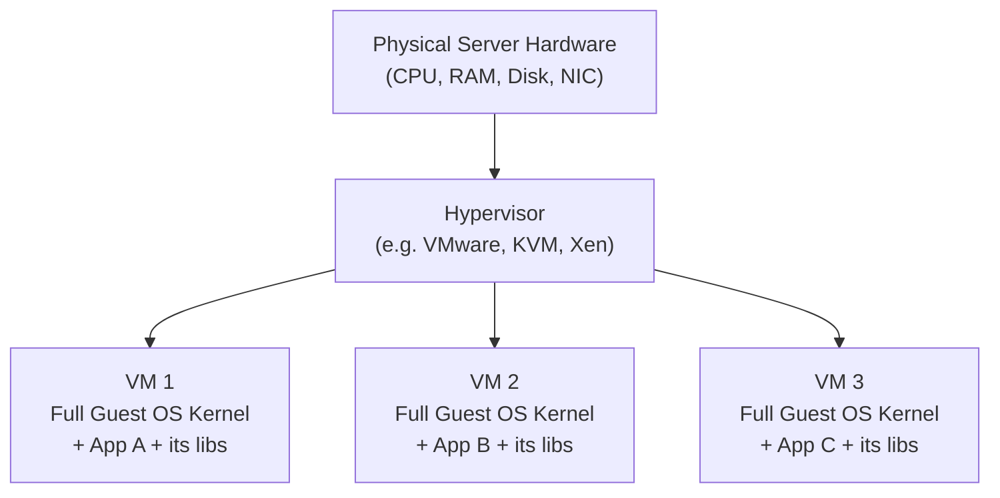

This genuinely solved isolation. App A crashing inside VM1 cannot touch VM2 — they don't even share a kernel. Different OS versions, different libraries, no conflict, because each is a fully separate world.

**But VMs brought a new, heavier problem**, and this is the crucial turn in the story:

- Every VM needs its **own full operating system** — its own kernel, its own copy of system libraries, its own boot process. That's gigabytes of disk per VM, and real CPU/RAM overhead just to run each guest OS, before your application has done any work at all.
- Booting a VM means booting an entire OS: BIOS/bootloader → kernel init → system services → *then* your app. That's often 30 seconds to a few minutes.
- If you wanted to run 100 small apps, you paid the "full OS tax" 100 times over. A lot of the resources you virtualized to save money in Act 1 are now spent again on redundant OS copies.

So by the mid-2010s, engineers had strong isolation (VMs) but it was heavy, slow to start, and wasteful — the same instincts that killed the "one giant shared server" idea (waste, slowness) were creeping back in, just at a different layer.

**The question that started containers:** *Can we get VM-like isolation between apps, but without each one needing its own kernel — by being cleverer about what a single shared Linux kernel can do?*

That question is answered entirely inside the Linux kernel, using features that existed before Docker was even conceived. Docker didn't invent isolation — it packaged existing kernel primitives into something usable. That's the next chapter: before we can understand *how* Linux fakes isolation on a shared kernel, you need to understand what a **process** is and what the kernel normally hands it — since containers work by selectively taking pieces of that away.

---

Does this framing of "the problem" make sense so far — the waste → isolation-via-VMs → VMs-too-heavy arc? Once that's solid, we'll move to **Chapter 2: OS foundations (processes, PIDs, filesystpresents view, the kernel's job)**, which sets up everything else.

---

## Chapter 2: OS Foundations — What Is a Process, Really?

Before we can understand what a container *removes or fakes* for a process, we need to understand what a process *normally has*, unmodified, on a regular Linux box. This is the "required OS parts" you asked for — I'll keep it tightly scoped to what containers touch.

### The kernel's job, in one sentence

The **Linux kernel** is the one program that talks directly to hardware (CPU, RAM, disk, network card). Every other program — your shell, Chrome, a Python script — is not allowed to touch hardware directly. Instead, they ask the kernel to do it on their behalf, through **system calls** (syscalls) — things like `read()`, `write()`, `open()`, `fork()`, `connect()`.

This is a deliberate design called **privilege separation**: the CPU itself has hardware-enforced modes (kernel mode / "ring 0" vs user mode / "ring 3"). Kernel code can do anything; ordinary program code cannot touch hardware or other processes' memory — it can only ask the kernel via syscalls. This is *why* isolation is even possible: the kernel is the single gatekeeper standing between every process and the shared resources (CPU, RAM, disk, network).

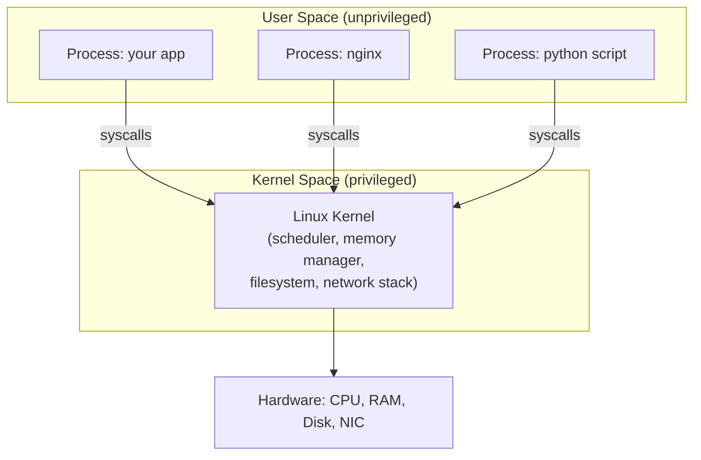

Since every process must go through the kernel for anything meaningful, **whoever controls what the kernel tells a process it can see and use, controls what that process is isolated from.** Hold onto that sentence — it's the entire principle behind containers. Namespaces and cgroups (next two chapters) are just the kernel selectively lying to / limiting a process, using this exact chokepoint.

### What does a normal process get, by default?

When you run a program on a normal (non-containerized) Linux machine, the kernel gives it several "views" of the system. On a normal machine, these views are **global and shared** — every process sees the *same* one. This is the important part:

1. **A PID (Process ID)** — every process gets a unique number. Normal Linux processes see *all* other processes on the machine via `ps aux`. Process 1 (`PID 1`) is special — it's the very first process the kernel starts at boot (historically `init`, now often `systemd`), and it's responsible for starting everything else and "reaping" (cleaning up) orphaned processes.

2. **A filesystem view** — normally every process sees the *same* root filesystem: `/`, `/usr`, `/home`, `/etc`, etc. If process A writes to `/etc/config.txt`, process B sees that same file, because they're literally looking at the same disk-backed tree.

3. **Network interfaces** — normally every process on the machine shares the *same* network stack: same IP address, same set of open ports. If App A binds to port 8080, App B cannot also bind to port 8080 — they'd collide, because there's only one shared view of "ports on this machine."

4. **Users and permissions** — Linux has UIDs (user IDs). Root is UID 0 and can do almost anything. Normal users have restricted UIDs. This is *permission-based* isolation, not *visibility-based* — a non-root user can still usually *see* that other users' processes exist (via `ps`), just can't touch them.

5. **Resource access** — by default, any process can use as much CPU and RAM as the kernel's scheduler will give it. There's no wall stopping one runaway process from consuming all available memory unless something explicitly limits it.

6. **Hostname** — the machine has one hostname (`uname -n`), and every process sees that same one.

### Why this matters for the story

Look at the list above and map it back to Chapter 1's pain points:

| Chapter 1 problem | Which "shared view" caused it |
|---|---|
| App A's crash starves App B of memory | #5 — no resource limits, shared CPU/RAM pool |
| App A and App B need conflicting library versions at `/usr/lib` | #2 — shared filesystem view |
| Both apps want port 8080 | #3 — shared network stack |
| App A can see/kill App B's processes if compromised | #1 — shared PID view |

Every single pain point from Chapter 1 traces back to processes sharing a *global, single view* of some kernel-managed resource. So the fix, conceptually, is almost obvious once you see it laid out this way:

> **What if, instead of giving every process the *same* view of PIDs/filesystem/network/hostname, the kernel could give different processes *different, private* views of each of these — while they all still run on one shared kernel?**

That's precisely what **namespaces** are (Chapter 3), and what **cgroups** solve for the resource-limiting problem (Chapter 4). VMs solved isolation by giving each app a whole separate kernel. Namespaces solve it by keeping *one* kernel, but making that one kernel maintain multiple independent "views" for different process groups.

One more piece before we move on, because it's the one people mix up in interviews:

**A process is not "code." A process is code *plus* kernel-tracked state** — its memory pages, its open file descriptors, its PID, its user ID, which namespaces it belongs to (once we get there), and how much CPU/memory it's allowed. When people say "a container is just a process," this is exactly what they mean: it's a normal process, except the kernel-tracked state attached to it has been curated — narrowed views via namespaces, resource caps via cgroups. Nothing more exotic than that.

---

Quick check before we continue: does the idea of "every syscall goes through the kernel, and the kernel currently gives every process the *same* shared view of PIDs/filesystem/network" make sense as the baseline we're about to break?

Once you confirm, Chapter 3 covers **chroot** — the first, historically real, and famously *broken* attempt to give a process a private filesystem view, and exactly how it fails (this sets up why namespaces had to be invented as a proper fix).

---

## Chapter 3: chroot — The First Attempt (and Why It Failed)

### The story

Long before Docker, long before namespaces even existed in Linux, people had a narrower version of Chapter 1's problem: *"I just want a process to think a specific directory is its root filesystem `/`, so it can't see or touch the real root filesystem."*

This came up for things like: testing software in a clean fake environment, or restricting an FTP server so that if it got compromised, the attacker couldn't wander up into `/etc/passwd` on the real system.

Unix answered this in 1979 with a syscall called `chroot()` ("change root"). It's astonishingly simple:

```
chroot("/some/fake/root")
```

After calling this, the process's idea of `/` is now `/some/fake/root`. If it tries to `open("/etc/passwd")`, the kernel actually resolves that to `/some/fake/root/etc/passwd`. The process is, from its own point of view, sitting at the top of a filesystem — it has no path syntax that can express "go above my root."

### Setting one up (conceptually)

```
/some/fake/root/
├── bin/
│   ├── ls
│   └── sh
├── lib/
│   └── (shared libraries ls and sh need)
└── etc/
    └── (minimal config)
```

You'd populate this folder with copies of the binaries and libraries a process needs, then `chroot` a shell into it. Now that shell can run `ls`, but it can never `cd ..` its way out to see your real `/home` or `/etc`. This is, in fact, the direct conceptual ancestor of a Docker image — "a self-contained folder with everything the process needs" is the exact idea a Docker image later formalizes and ships as a tarball of layers.

### Why chroot looked like a solution but wasn't

It solves the *filesystem visibility* problem (item #2 from Chapter 2's list) — sort of. But it fails badly in three ways, and each failure is a direct reason later technology exists:

**1. It's escapable (this is the famous one).**
If the chrooted process is running as **root**, it can break out with a well-known trick called a "chroot breakout": root can call `mknod` to create device files, or use tricks with file descriptors it opened *before* the chroot call, to climb back out to the real filesystem. In short: `chroot` restricts *paths*, but root inside a chroot is still root — the same privileged UID 0 that can do almost anything the kernel allows, and the kernel doesn't fundamentally re-check "wait, are you actually still confined?" for many operations. This is why, to this day, security guidance says chroot is not a security boundary against a root process.

**2. It only isolates the filesystem — nothing else.**
Recall Chapter 2's list: PIDs, network ports, hostname, resource usage. `chroot` touches *only* item #2. A chrooted process can still see every other process on the machine via `/proc` (if mounted) or signals, still shares the network stack and can bind the same ports as anything else, still shows the real hostname, and still has zero resource limits — it can eat all the RAM it wants. So it does nothing for 3 out of 4 of Chapter 1's core pain points.

**3. It requires you to manually build the fake root by hand.**
You have to copy every binary and every shared library the program needs into the chroot folder yourself, and get the paths right, or things silently break (a classic symptom: "command not found" inside a chroot even though the binary is right there, because a *library* it depends on is missing). There's no standard, shareable, versioned way to package "this is everything App A needs" — every team invents their own scripts.

### The gap this leaves

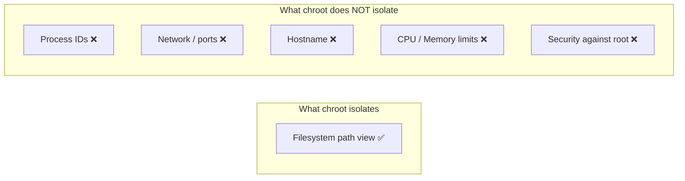

So by the early 2000s, the industry has: VMs (Chapter 1) — heavyweight but fully isolated — and `chroot` — lightweight but leaky and filesystem-only. Neither is "cheap AND actually safe." This is the real gap that motivated kernel developers (mostly at Google, IBM, and in the Linux community generally, through the 2000s) to build something that does for *every* kind of view — PIDs, network, hostname, users — what `chroot` half-did for the filesystem, but properly, as an actual kernel-enforced boundary rather than a path trick.

That's **namespaces**, and it's the single most important concept in this whole series — once you understand namespaces deeply, "what is a container" stops being mysterious. That's Chapter 4.

---

Quick check: is it clear *why* chroot's failure (root can escape, and it only ever touched the filesystem) is precisely the gap namespaces needed to close? Say "next" when ready and we'll go deep on namespaces — I'll cover each of the 7 namespace types with concrete examples (PID, mount, network, UTS, IPC, user, cgroup) since this is the chapter interviewers actually probe hardest.

---

## Chapter 4: Namespaces — Real, Kernel-Enforced Isolation

### The core idea

A **namespace** wraps a specific *kind* of global kernel resource (PIDs, network interfaces, mount points, etc.) and gives a process (or group of processes) its **own private instance** of that resource, instead of the one shared global instance every process normally sees.

This is fundamentally different from `chroot`. `chroot` was one syscall that changed one path pointer. Namespaces are a proper kernel subsystem: the kernel now tracks *which namespace* a process belongs to, and every relevant syscall (`getpid()`, `bind()`, `mount()`, ...) checks that namespace before answering. It's enforced at the same layer as everything else in Chapter 2's "process gets kernel-tracked state" idea — a namespace ID is just another piece of state attached to a process.

Linux has **7 namespace types** you should know cold for interviews. Let's go through each with what problem it solves and a concrete example.

---

### 1. PID namespace — private process IDs

**Problem it solves:** Chapter 1's "App A can see and kill App B's processes."

Inside a new PID namespace, the first process started becomes **PID 1** *inside that namespace* — even though on the real host it might be PID 4521. Processes inside this namespace can only see other processes *in the same namespace*. They have no visibility into the host's other processes at all — not restricted permission, actual **invisibility**.

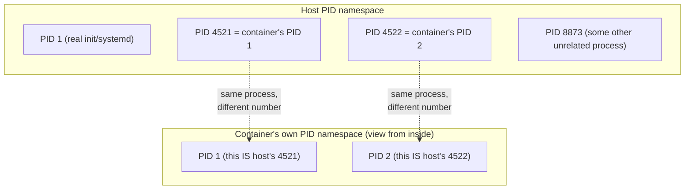

Same underlying process, two different numbers depending on which namespace you're asking from. This is why, when your app inside a container crashes and it's PID 1, you may notice zombie-process cleanup issues — PID 1 has special "reaping" responsibilities in Unix, and a lot of ordinary app binaries were never written expecting to *be* PID 1. (This is a genuinely common real-world Docker gotcha, and a good thing to mention in an interview: it's why tools like `tini` exist — a tiny init process Docker can run as real PID 1 inside the container to properly reap zombie processes.)

PID namespaces nest — the host can see *into* every container's PID namespace (a process has one PID per ancestor namespace it belongs to), but a container can never see its parent's or siblings'.

---

### 2. Mount namespace — private filesystem view (chroot, done properly)

**Problem it solves:** chroot's filesystem isolation, but as a real kernel boundary instead of a path trick.

A mount namespace gives a process its own private list of "what's mounted where." Inside a new mount namespace, you can mount and unmount filesystems, and the *host* never sees those changes — and, crucially, mount namespaces are combined with `pivot_root` (a more robust successor to `chroot` that actually swaps the root filesystem instead of just faking a path prefix) to eliminate exactly the chroot-breakout problem from Chapter 3. `pivot_root` inside a proper mount namespace doesn't have the "old root is still reachable through a stray file descriptor" escape hatch chroot had.

```
Host sees:            Container sees (its own mount namespace):
/                      /
├── home/              ├── app/
├── var/                   └── server.py
├── docker/...          ├── lib/
└── etc/                ├── etc/
                        └── (nothing from host's /home, /var, etc.)
```

This is the mechanism behind a Docker image "becoming" the container's entire filesystem — the layers we'll cover in Chapter 6 get mounted together and `pivot_root`'d into as the new `/`.

---

### 3. Network namespace — private network stack

**Problem it solves:** Chapter 1's "both apps want port 8080."

Each network namespace gets its own: network interfaces, IP addresses, routing table, and port space. Two containers can each bind to port 8080 *inside their own namespace* with zero conflict, because "port 8080" is a namespace-local concept once this exists.

By default a new network namespace starts completely empty — not even a loopback interface works properly, and it definitely has no route to the outside world. To make it useful, the standard technique is a **veth pair** (virtual ethernet cable) — think of it as a network cable with two ends; one end is placed inside the container's network namespace, the other end stays on the host, usually plugged into a bridge:

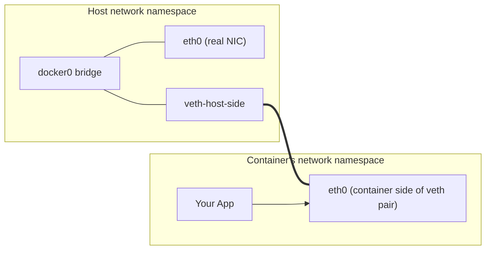

This is genuinely worth internalizing because it's exactly what people mean in HLD interviews when they say "container networking" — it's veth pairs plus a bridge (for container-to-container and container-to-host) plus NAT/iptables rules (for container-to-internet). We'll do a full chapter on this later since it directly matters for service discovery and load balancing questions.

---

### 4. UTS namespace — private hostname

**Problem it solves:** every container appearing to have its own hostname (you've seen this — `docker run` gives you a random hex-string hostname like `a3f9c21b4e2d` inside the container).

"UTS" is a historical name (Unix Timesharing System), but all it isolates is `hostname` and `domainname`. Small, but it's why `hostname` returns something different inside a container than on the host.

---

### 5. IPC namespace — private inter-process communication

**Problem it solves:** stopping unrelated processes from talking to each other through shared memory segments, semaphores, or message queues.

Linux has old-school IPC mechanisms (SysV IPC, POSIX message queues) that let processes on the *same machine* share memory or signal each other by ID. Without an IPC namespace, App A could theoretically attach to a shared memory segment App B created, purely because they're on the same kernel. The IPC namespace gives each namespace its own private set of IPC IDs, so containers can't accidentally (or maliciously) rendezvous this way.

---

### 6. User namespace — private user/group ID mapping

**Problem it solves:** the single scariest part of Chapter 3 — "root inside is root outside."

This is the one that actually fixes chroot's core security failure. A user namespace lets a process be **root (UID 0) inside the namespace**, while the kernel maps that to an **unprivileged, ordinary UID on the host** — say, UID 100000.

```
Inside container:  "I am root, UID 0, I can do anything!"
Host's real view:  "That's just UID 100000, an unprivileged user."
```

So even if an attacker fully compromises a process and gets "root" inside a container, and even if they somehow escape the mount/PID/network namespaces, they land on the host as a nobody-user, not as real root. This is the difference between "isolation as a convenience" and "isolation as an actual security boundary" — and it's genuinely worth naming explicitly in an interview if asked about container security, because **many real-world Docker setups historically did *not* enable user namespace remapping by default**, which is a legitimate, commonly-cited security criticism of containers vs VMs (a VM's root is root only inside its own separate kernel; there's no shared kernel to escalate into in the first place).

---

### 7. Cgroup namespace — private view of resource-control hierarchy

**Problem it solves:** a smaller, more recent one — hiding the cgroup directory structure (Chapter 5 topic) so a container can't see the host's full cgroup tree, only its own slice of it. Mostly about not leaking host topology information. Least interview-critical of the seven, but complete the list for correctness.

---

### Putting all 7 together

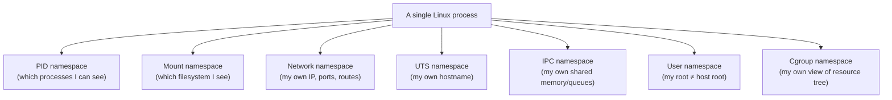

**The key insight to say out loud in an interview:** a "container" is just a regular Linux process that has been launched into a *new* set of these 7 namespaces (usually via the `clone()` syscall with specific flags like `CLONE_NEWPID`, `CLONE_NEWNET`, etc., or later via `unshare()`). There is no special "container mode" in the kernel. The kernel doesn't even have a concept called "container" — that word exists only in userspace tooling (Docker, containerd, runc). This is genuinely one of the most interview-impressive things you can say, because most people using Docker daily don't know it.

Notice, though — namespaces solve *visibility* ("what can I see/access") but not *quantity* ("how much CPU/RAM can I use"). A process in its own PID/network/mount namespace can still, today, in this chapter's story, consume 100% of the host's CPU and all its RAM, starving everyone else — Chapter 1's noisy-neighbor problem, still completely unsolved. That's exactly what **cgroups** fix, and it's Chapter 5.

---

Quick check before moving on: does the distinction between namespaces (private *views*) vs the still-missing piece (resource *limits*) feel solid? And does "a container is just a process placed into new namespaces via `clone()`/`unshare()`" make sense as a concrete mechanism rather than something magical? Say "next" for Chapter 5: **cgroups** — CPU shares, memory limits, the OOM killer, and how Docker flags like `--memory` and `--cpus` map directly onto this.

---

## Chapter 5: Cgroups — Controlling *How Much*, Not Just *What You See*

### The story

Namespaces (Chapter 4) solved *visibility*. But recall the still-open wound from Chapter 1: **App A goes rogue — a memory leak, an infinite loop — and eats all the CPU/RAM on the box, starving App B**, even though App B is now sitting safely in its own PID/network/mount namespaces. Namespaces never touched this. A process in a private namespace can still call `malloc()` in a loop forever and the kernel will happily keep handing it memory pages until the whole machine falls over.

Google engineers hit this exact problem at massive scale in the mid-2000s — they were running thousands of unrelated workloads on shared machines internally and needed a way to say "this workload gets at most 2 CPU cores and 4GB of RAM, full stop." Their in-house solution was called "process containers," which they upstreamed into the Linux kernel around 2007–2008 under a less confusing name: **control groups**, or **cgroups**. (Fun fact worth knowing: this is literally where the word "container" traces back to — Google's original tooling was even called `lmctfy`, "let me contain that for you.")

### What a cgroup actually is

A cgroup is, at heart, just **a named group of processes that the kernel tracks together**, with **resource limits (or accounting rules) attached to that group as a whole**, rather than to each process individually. Instead of the kernel asking "how much CPU does process 4521 get," it asks "which cgroup is 4521 in, and what's *that group's* CPU limit."

Historically these were exposed as a virtual filesystem at `/sys/fs/cgroup/` — you'd literally `mkdir` a directory there to create a cgroup, and write numbers into special files to set limits:

```
/sys/fs/cgroup/
└── my_app_group/
    ├── cpu.max          <- write "50000 100000" = 50% of one CPU
    ├── memory.max        <- write "500M" = hard cap of 500MB RAM
    ├── pids.max          <- write "100" = max 100 processes
    ├── io.max            <- disk I/O bandwidth caps
    └── cgroup.procs      <- write a PID here to add it to this group
```

(Modern Linux uses "cgroups v2," a cleaned-up unified hierarchy — the exact file names above are illustrative of the idea rather than something to memorize letter for letter, but the *mental model* — "a directory = a group, files in it = limits, adding a PID = joining the group" — is exactly right and worth stating in an interview.)

### The controllers — what can actually be limited

Cgroups aren't one monolithic thing; they're split into **controllers**, each governing one resource type. The ones worth knowing:

| Controller | What it limits | Real Docker flag |
|---|---|---|
| `cpu` | CPU time / shares | `--cpus="1.5"`, `--cpu-shares` |
| `memory` | RAM (and triggers OOM kill when exceeded) | `--memory="512m"` |
| `pids` | max number of processes/threads | `--pids-limit` |
| `io` (blkio) | disk read/write bandwidth | `--device-read-bps` |
| `net_cls`/`net_prio` | network traffic prioritization/tagging | (less commonly exposed directly) |

So when you type:

```
docker run --memory="512m" --cpus="1.5" myapp
```

Docker is, underneath, creating a cgroup, writing `512m` into that cgroup's memory limit file and a CPU quota corresponding to 1.5 cores, and placing your container's process into that cgroup before it even starts running. **This is not a Docker-invented feature at all — Docker is just a friendly CLI over kernel cgroup files that have existed since 2008.**

### What happens when a limit is hit — the OOM killer

This is a favorite interview follow-up, so let's be precise. If a cgroup's memory usage exceeds its `memory.max`:

1. The kernel does *not* gracefully ask the process to free memory.
2. The kernel invokes the **OOM (Out-Of-Memory) killer**, which picks a process *within that cgroup* and sends it `SIGKILL` — an unstoppable, un-catchable kill signal.
3. This is why a container that hits its memory limit doesn't "slow down" or "swap gracefully" — it gets abruptly killed, often mid-request, and you'll see `Exited (137)` as the container's exit status (137 = 128 + 9, where 9 is `SIGKILL`'s signal number — genuinely useful to know cold in an interview: seeing exit code 137 in the wild should immediately make you think "OOM-killed").

This directly connects to HLD reliability discussions later: if you under-provision a container's memory limit, you get intermittent, hard-to-debug kills under load spikes — which is exactly why "how do you size container resource limits" and "how do you handle OOM kills gracefully" are real interview questions, and now you know the actual mechanism behind them rather than a vague "it crashes."

### CPU limiting is softer than memory limiting — an important nuance

Unlike memory (hard cap, kill on breach), CPU limits are typically **throttling**, not killing. If you set `--cpus="0.5"` (half a core) and your process tries to use a full core, the kernel's CPU scheduler simply doesn't give it more time slices than its quota allows within each scheduling period — the process just runs slower, it isn't killed. This asymmetry (memory = hard kill, CPU = soft throttle) is worth stating explicitly if asked to compare them.

### Putting namespaces + cgroups together — this is "a container"

```mermaid
graph TD
    subgraph "Regular Linux Process"
        A["Normal process:<br/>sees everything, unlimited resources"]
    end
    subgraph "+ Namespaces applied"
        B["Process with private:<br/>PIDs, mounts, network, hostname,<br/>IPC, user mapping, cgroup view"]
    end
    subgraph "+ Cgroups applied"
        C["Same process, now also capped:<br/>max CPU, max RAM, max PIDs, max I/O"]
    end
    A -->|clone()/unshare()<br/>with namespace flags| B
    B -->|placed into a cgroup<br/>with limits written| C
    C --> D["🎉 This is what Docker calls<br/>'a container'"]
```

Say this sentence out loud a few times because it's the single highest-value line for an HLD interview about containers:

> **A container is an ordinary Linux process, given a private set of namespaces (so it can't* see* things it shouldn't) and placed in a cgroup (so it can't *use* more than it's allowed). There is no kernel object called "container" — it's these two independent, decades-old kernel mechanisms, combined by userspace tooling.**

Notice what's still missing from our story, though: namespaces + cgroups isolate a *running process*. But `docker run nginx` doesn't just isolate some process — it also produces an entire filesystem for that process to live in, built from an *image*, shareable and versioned, downloadable from the internet in seconds. Nothing we've covered explains *that* part yet. That's the last major kernel-level piece: **union filesystems and image layers** — Chapter 6, and it's where the story of `docker build`, layer caching, and "why are Docker images so small compared to VM images" all comes from.

---

Quick check: is the OOM-kill-vs-CPU-throttle asymmetry, and the "container = namespaces + cgroups, nothing more" idea, landing clearly? Say "next" and we'll cover **union/overlay filesystems** — how multiple read-only image layers get stacked with one writable layer on top, why that makes layer caching and image sharing possible, and exactly what `docker build`'s layer caching is doing under the hood.

---

## Chapter 6: Union Filesystems — How Images Actually Work

### The story

We now have a process that's properly isolated (namespaces) and resource-capped (cgroups). But it needs somewhere to *live* — a root filesystem with `/bin`, `/lib`, `/etc`, your app code, all of it. Chapter 3's `chroot` story showed the naive approach: manually build a folder with everything the process needs. That has a huge, unaddressed problem once you're running this at scale:

**Imagine you have 50 different container images, all based on Ubuntu.** Each one needs a copy of Ubuntu's base filesystem (~70MB+), plus its own app layer on top. If every image is a fully independent, flat folder:

- You're storing the same Ubuntu base files 50 times on disk.
- Every time you download ("pull") a new image that's "Ubuntu + a different app," you re-download the entire Ubuntu base again — even though your machine already has it from a different image.
- Building an image (adding one line to a Dockerfile, rebuilding) means regenerating and re-transferring the *entire* filesystem, even if only the last line changed.

This is wasteful in exactly the same *spirit* as Chapter 1's original sin — paying for the same thing repeatedly when it could be shared. The fix mirrors the whole series' pattern: don't duplicate, let the kernel help you share safely.

### The fix: layers + copy-on-write

The kernel feature that solves this is a **union filesystem** (Linux's implementation is called **OverlayFS**, and it's the standard today — older systems used AUFS, device-mapper, or btrfs backends, but OverlayFS is what to know). The idea: instead of one flat filesystem, you **stack multiple directories on top of each other**, and the kernel presents them to the process as if they were merged into a single tree.

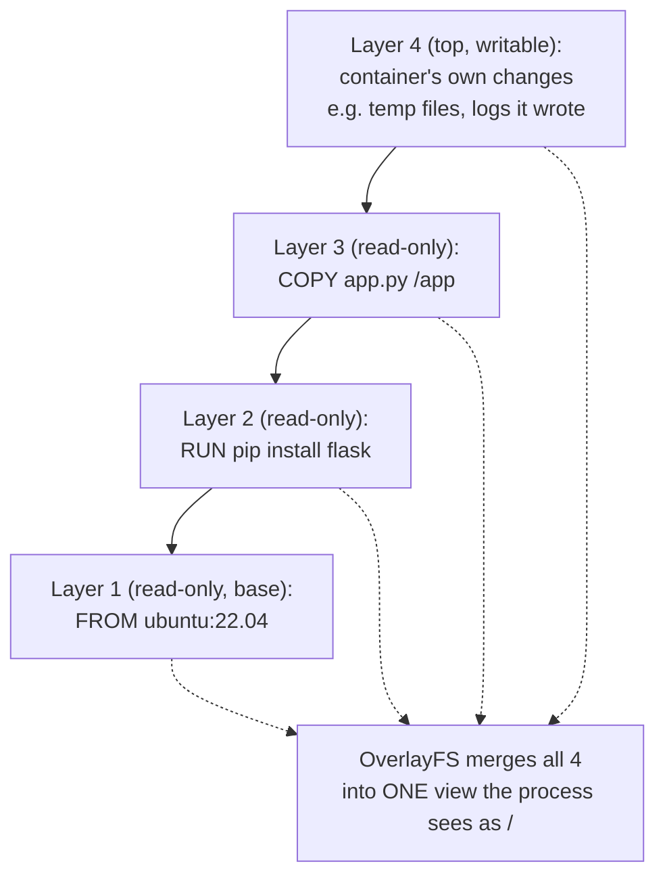

Each `RUN`, `COPY`, or `ADD` line in a Dockerfile creates exactly **one new read-only layer** — a diff of what changed. Critically: **layers are content-addressed and shared across images.** If two completely different images both start `FROM ubuntu:22.04`, Docker stores that base layer's files **once** on disk, and both images just reference it. Pull a new image that shares a base layer you already have, and Docker skips re-downloading that layer entirely — that's exactly why `docker pull` sometimes prints `Already exists` next to some layers.

### The clever part: copy-on-write (CoW)

Here's the part that resolves the "writable" question, and it's a very common interview probe: **if 5 layers are read-only, how does the container ever write a file, e.g. a log file or a temp file?**

Answer: OverlayFS adds exactly **one writable layer on top** (Docker sometimes calls this the "container layer"). The mechanics:

- **Reading** a file: OverlayFS looks top-down through the stack and returns the first copy it finds. If it's not in the writable layer, look in layer 3, then 2, then 1.
- **Writing** to a file that exists in a lower read-only layer: OverlayFS doesn't modify the read-only layer (it can't — it's read-only, and remember, it might be shared with other containers!). Instead, it **copies the file up** into the writable top layer first, then applies the write there. This is called **copy-on-write** — you don't pay the cost of copying until the moment you actually modify something.
- **Deleting** a file that exists in a lower layer: since you can't actually remove it from the read-only layer, OverlayFS creates a special marker file called a **"whiteout"** in the writable layer, which tells the merged view "pretend this file doesn't exist," even though it's still physically present in a lower layer.

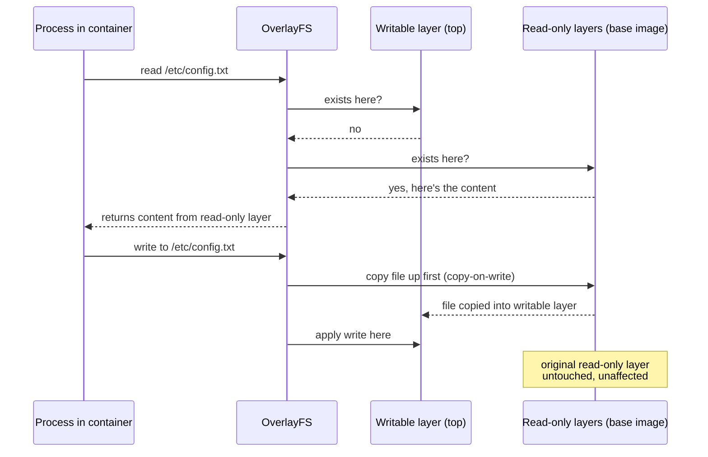

This single mechanism explains several things people find confusing about Docker in practice:

- **"Why did my container's image not change even though the app wrote files while running?"** — because those writes only ever land in the ephemeral writable layer, which is destroyed when the container is removed. The image (the read-only layers) is never touched by a running container.
- **"Why does `docker build` cache steps?"** — because each Dockerfile instruction is a layer, and if the instruction and its inputs haven't changed, Docker just reuses the previously-built layer instead of rebuilding it. This is why Dockerfile *ordering* matters (a classic best-practice interview point): put things that change rarely (installing dependencies) *before* things that change often (copying your app source), so the expensive, rarely-changing layers stay cached.
- **Why images are small and fast to distribute compared to VM disk images** — you're only ever transferring the *diff* layers you don't already have, not a whole OS disk image each time.

### One more concrete thing: what's actually *in* layer 1, `FROM ubuntu:22.04`?

This closes a loop from Chapter 1–2. It is **not** a Linux kernel. It's just a folder of userspace files — `/bin/bash`, `/usr/lib/...`, package manager files, `/etc/passwd`, etc. — the *userland* of Ubuntu, with **no kernel inside it at all**. When the container runs, it uses the **host's** kernel (there's only ever one kernel — the host's — remember, containers share the kernel; that's the entire premise since Chapter 1's Act 3). The "Ubuntu" in a Docker image is purely a familiar set of user-space tools and libraries, layered on top of whatever kernel the host happens to be running. This is exactly why a container can start in milliseconds instead of VM's 30+ seconds — there's no kernel to boot at all, you're just mounting some folders together and starting a process.

---

We've now covered every kernel-level building block: namespaces (visibility), cgroups (resource limits), and OverlayFS (layered, shared, copy-on-write filesystems). Everything from here is about **how Docker as a piece of software orchestrates these three primitives** — that's Chapter 7.

Quick check: does copy-on-write and the whiteout-file mechanism make sense — specifically *why* a write to a file in a read-only layer doesn't corrupt other containers sharing that same base layer? Say "next" for Chapter 7: **Docker's actual architecture** — the daemon, `containerd`, `runc`, and the OCI spec, i.e., which *piece of software* calls `clone()`/`unshare()` and writes those cgroup files, since "Docker" is actually several separate programs talking to each other.

---

## Chapter 7: Docker's Architecture — Who Actually Calls These Syscalls?

### The story

We now know *what* a container fundamentally is (namespaces + cgroups + OverlayFS). But when you type `docker run nginx`, what actually calls `clone()`, writes to cgroup files, and sets up OverlayFS mounts? The answer surprises people: **"Docker" is not one program.** It's a stack of separate, independently-usable pieces — and this split happened for a very deliberate, story-worthy reason.

### Act 1 — The original Docker (2013): one big daemon

Early Docker was architecturally a single, large background process called the **Docker daemon** (`dockerd`), running as root, that did *everything*: talked to the CLI, managed images, set up networking, created namespaces, wrote cgroup files, monitored running containers — all in one monolithic binary.

**Problems this caused:**

1. **A single point of failure for *every* container.** If you needed to upgrade or restart the Docker daemon (for a security patch, a bug fix), the daemon restarting would kill or disrupt every single running container on that host, because the daemon itself was the parent process supervising them. Restarting your container runtime shouldn't require restarting production workloads — but architecturally, it did.
2. **Non-standard.** Docker was so popular that competitors and orchestrators (like Kubernetes, then rkt) wanted to run containers *without* using all of Docker's specific implementation — but there was no shared standard for "what is a container runtime supposed to do," so everyone risked reinventing slightly incompatible wheels.

### Act 2 — Standardization: the OCI

In 2015, Docker Inc. and other industry players (Google, CoreOS, Red Hat) formed the **Open Container Initiative (OCI)**, which defined two key specifications:

- **OCI Image Spec** — the exact format of a container image (how layers are structured, how metadata/manifests are written), so any tool can produce an image and any other tool can run it.
- **OCI Runtime Spec** — the exact contract for "a program that takes a filesystem bundle + a config file, and turns it into a running, namespaced, cgrouped process." Any tool implementing this spec is called an **OCI-compliant runtime**.

This is the same pattern you see everywhere in good system design (worth saying explicitly in interviews): **once an ecosystem has multiple competing implementations of the same idea, standardizing the interface between layers lets each layer evolve/be swapped independently.**

### Act 3 — Breaking the monolith apart

With a standard in place, Docker split its one big daemon into layered, independent pieces. Here's the stack, top to bottom, as it exists today:

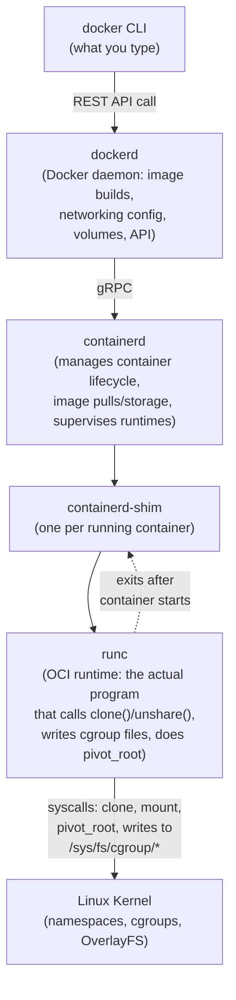

Walking down this, with what each piece is actually responsible for:

- **`docker` CLI** — just a client. Sends your command as a REST API call to `dockerd`. It does no isolation work itself.
- **`dockerd`** — handles the higher-level Docker-specific features: building images from Dockerfiles, managing networks/volumes, the API that tools like Docker Compose talk to. It delegates the actual "run a container" work downward.
- **`containerd`** — a full container runtime *manager*, donated by Docker to the Cloud Native Computing Foundation (CNCF) in 2017 and now used independently by Kubernetes itself (via CRI, the Container Runtime Interface) — proof this decoupling succeeded. It handles pulling images, managing storage/snapshots (the OverlayFS layers from Chapter 6), and supervising the low-level runtime.
- **`containerd-shim`** — a small, crucial piece: one shim process per running container, which stays alive as the immediate parent of your container's process. Why does this exist? So that `containerd` itself (or even `dockerd`) can be restarted or upgraded **without killing running containers** — solving Act 1's original pain point directly. The shim keeps holding onto the container's stdout/stdin/exit status even if everything above it restarts.
- **`runc`** — the actual OCI-spec-implementing binary that does the real work we've spent 5 chapters on: it calls `clone()`/`unshare()` with the namespace flags, writes the cgroup limit files, performs `pivot_root` with the assembled OverlayFS layers, and then **execs your application** and exits. Notice: `runc` doesn't stick around babysitting the container — it does the setup, then gets out of the way, leaving the actual app process as a child of the shim.

**This is a genuinely good interview answer if asked "what happens when you run `docker run`":** trace this exact chain — CLI → dockerd → containerd → shim → runc → kernel syscalls → runc exits, app process now parented by the shim. Very few people can do this, and it demonstrates you understand containers aren't magic, they're a supervised pipeline of small, standardized programs.

### A useful side note: this is *why* alternatives to Docker exist and are compatible

Because of the OCI standard, you can swap pieces: **Podman** implements a similar CLI without any long-running daemon at all (it talks to `runc`/`crun` more directly, addressing Act 1's single-point-of-failure/root-daemon concerns differently). **`crun`** is a faster, C-based alternative to `runc` implementing the same OCI runtime spec. Kubernetes talks to `containerd` (or `CRI-O`) directly via the CRI, **without needing `dockerd` in the loop at all** — this is exactly why you may have heard "Kubernetes is deprecating Docker support," which alarmed people needlessly: Kubernetes was never removing containers, it removed the unnecessary `dockerd` layer and talks straight to an OCI-compliant runtime, since `dockerd` was designed for humans typing CLI commands, not for an orchestrator.

---

We've now covered the full vertical stack: kernel primitives (namespaces, cgroups, OverlayFS) and the software stack that drives them (dockerd, containerd, shim, runc). The one big piece left before we can call the "single-host" story complete is **networking** — how a container actually reaches the internet, how two containers on the same host talk to each other, and how this scales into the multi-host service-discovery/load-balancing questions HLD interviews love. That's Chapter 8.

Quick check: does the daemon → containerd → shim → runc chain make sense, especially *why* the shim exists (surviving daemon restarts)? Say "next" when ready for networking.

---

## Chapter 8: Container Networking — From One Box to the Internet

### The story recap

Chapter 4 introduced the **network namespace**: each container gets its own private network stack — own interfaces, own routing table, own port space. But a namespace by itself is *inert* — it starts as an empty box with no way in or out, not even functioning loopback traffic to anywhere useful. Something has to actively wire these isolated boxes together and to the outside world. That "something" is what this chapter covers, and it directly feeds into HLD questions like service discovery and load balancing.

### Problem 1: Two containers on the same host need to talk to each other

**The mechanism: veth pairs + a bridge** (briefly introduced in Chapter 4 — now let's go deep).

A **veth pair** is exactly what it sounds like conceptually: a virtual Ethernet cable with two ends. Whatever comes in one end comes out the other — the kernel implements it as a pair of connected virtual network interfaces. Docker creates one veth pair *per container*: one end is placed inside the container's network namespace (usually renamed `eth0` from the container's point of view), and the other end stays on the host, plugged into a **Linux bridge** — a kernel-level virtual switch — that Docker creates by default and calls `docker0`.

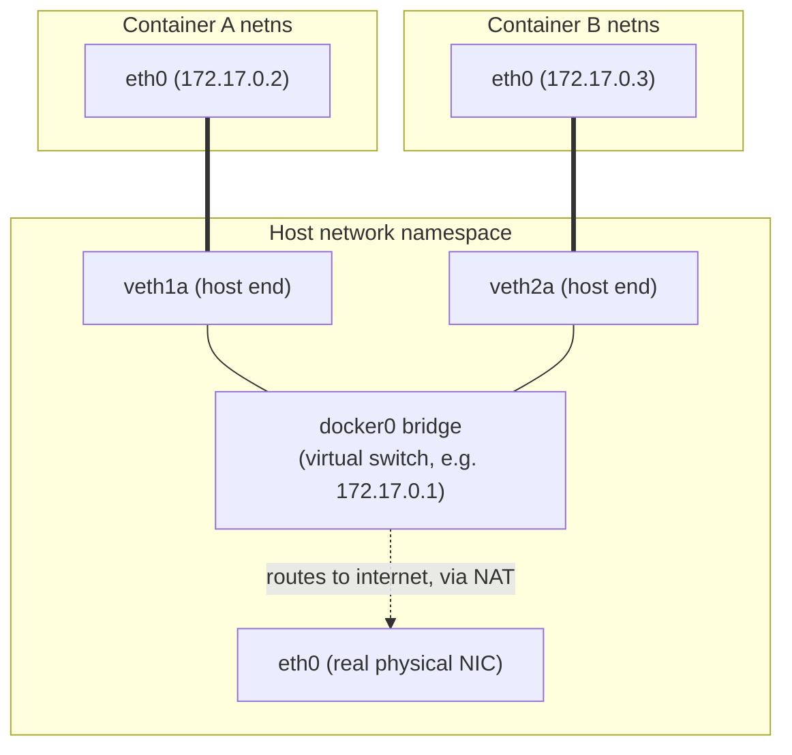

When Container A sends a packet to Container B's IP (say `172.17.0.3`), it goes out A's veth end, arrives at `docker0`, and the bridge — acting exactly like a physical Ethernet switch — forwards it to B's veth end. This all happens **entirely inside the kernel, without ever leaving the machine** — fast, and it's why two containers on the same Docker host can reach each other by their internal IPs without any external router involved.

### Problem 2: A container needs to reach the actual internet

The container's IP (`172.17.0.2`) is private — it's meaningless outside this host, and the real internet has no route back to it. Docker solves outbound traffic with **NAT (Network Address Translation)**, specifically **masquerading**, implemented via `iptables` rules the Docker daemon installs automatically:

1. Container sends a packet to, say, `8.8.8.8`.
2. It hits the bridge, then the host's routing table sends it out the real `eth0`.
3. Before it leaves, an iptables NAT rule rewrites the packet's source IP from the container's private IP to the **host's** real IP.
4. The response comes back to the host's real IP; iptables remembers the mapping (a "conntrack" table entry) and rewrites the destination back to the container's private IP before delivering it inward.

This is the exact same NAT concept as your home WiFi router letting multiple devices share one public IP — same mechanism, just implemented via Linux's netfilter/iptables instead of router firmware.

### Problem 3: The outside world needs to reach a container (port publishing)

This is what `docker run -p 8080:80` does. It's **DNAT** (Destination NAT) — another iptables rule, this time saying "any traffic arriving at the host on port 8080 gets rewritten and forwarded to `172.17.0.2:80` inside the container." This is why you can run five containers each internally listening on port 80, and expose them externally as 8080, 8081, 8082 — the host's port space is the only thing that needs to stay conflict-free; each container's internal port space is fully private (Chapter 4's network namespace payoff, made concrete).

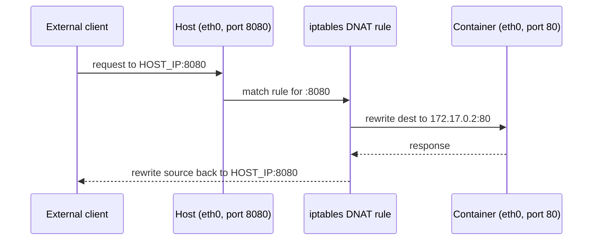

### The Docker network "drivers" — naming what you've already seen

Docker exposes several network modes, and each is just a different arrangement of the mechanisms above:

- **`bridge`** (default) — exactly what we just walked through: veth pairs + `docker0`. Good default isolation with NAT overhead.
- **`host`** — skip the network namespace entirely; the container shares the host's real network stack directly. No NAT, no port mapping needed, but you lose port-space isolation (container's port 80 *is* the host's port 80 — back to the Chapter 1 conflict problem, traded deliberately for performance).
- **`none`** — no networking at all, just loopback. Used for security-sensitive batch jobs that shouldn't have network access.
- **`overlay`** — the one that matters for multi-host setups (Docker Swarm, and conceptually what Kubernetes' CNI plugins do too): it builds a virtual network **spanning multiple physical hosts**, typically using **VXLAN** (a way to tunnel Layer-2 Ethernet frames inside Layer-3/UDP packets), so a container on Host A and a container on Host B can have IPs on the same virtual subnet even though the real machines are on different networks entirely. This is the direct bridge into distributed-systems territory: service-to-service communication across a cluster, which is the foundation under Kubernetes networking, service meshes, and load balancer questions in HLD interviews.

### Why this matters for your HLD interviews specifically

When someone asks "how does load balancing work in a containerized microservice setup," the honest technical chain is: **DNS/service-discovery → resolves to a virtual IP → iptables/IPVS rules (in Kubernetes' `kube-proxy`) → DNAT to one of several backing container IPs → container's private network namespace.** It's the exact same DNAT idea from Problem 3 above, just with a load-balancing decision inserted at the DNAT step instead of a single fixed target. Once you've internalized single-host DNAT, multi-node load balancing is "the same trick, one more layer of indirection" rather than a new concept — that's a strong thing to say explicitly in an interview.

---

We've now completed the *full* single-host container story: namespaces, cgroups, OverlayFS, the daemon/containerd/runc stack, and networking. One clean comparison chapter will cement everything before we pivot into the HLD-specific territory (scaling, replication, orchestration failure handling) you ultimately want.

Quick check: does the veth-pair/bridge (same host) vs NAT/DNAT (in/out of host) vs overlay/VXLAN (multi-host) distinction feel clear? Say "next" for **Chapter 9: Containers vs VMs — the precise technical comparison**, a very common interview question, and then we'll move into Chapter 10+: orchestration, scaling, replication, and failure handling, tying everything back to what you now know about the internals.

---

## Chapter 9: Containers vs VMs — The Precise Technical Comparison

This is one of the most commonly asked questions, and now you can answer it from first principles instead of reciting buzzwords like "containers are lightweight."

### The one-sentence technical answer

> **VMs virtualize hardware — each VM gets its own kernel, talking to virtual hardware provided by a hypervisor. Containers virtualize the OS — every container shares the exact same host kernel, and isolation is achieved entirely in userspace-configured kernel features (namespaces + cgroups), with no hardware virtualization at all.**

### Side-by-side architecture

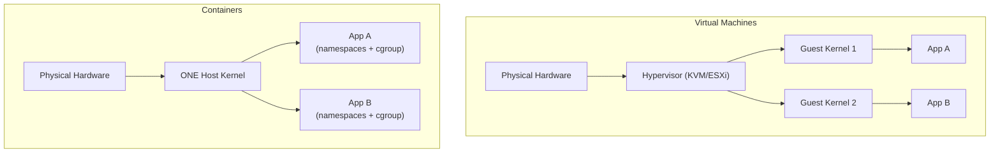

### The comparison table an interviewer wants

| Dimension | VM | Container |
|---|---|---|
| **What's isolated** | Whole hardware (via hypervisor) | Kernel resources (namespaces/cgroups) |
| **Kernel** | Each VM has its own, fully independent | One kernel, shared by all containers |
| **Startup time** | Seconds to minutes (boots a full OS) | Milliseconds to ~1 second (just starts a process) |
| **Image/disk size** | GBs (full OS + app) | MBs (just app + its direct deps, shared base layers) |
| **Density per host** | Tens of VMs, typically | Hundreds to thousands of containers |
| **Isolation strength** | Very strong — separate kernels, hardware-enforced (VT-x/AMD-V) | Weaker by default — one kernel compromise (e.g. a kernel exploit) can affect everything on the host |
| **Cross-OS support** | Yes — Linux host can run a Windows VM | No — a Linux container needs a Linux kernel; can't run natively on a different kernel |
| **Runtime overhead** | Hypervisor + full guest OS consume real CPU/RAM just idling | Near-zero — no duplicate OS, just the app's own footprint |

### The isolation-strength point, explained precisely (favorite follow-up question)

Recall Chapter 4's user-namespace discussion: even with every namespace correctly applied, **all containers on a host make syscalls into the exact same kernel binary**. If there's an exploitable bug in the kernel itself (a real, historically-occurring category of vulnerability), a sufficiently malicious process *might* be able to escape all namespace/cgroup boundaries, because those boundaries are enforced *by* the kernel that's now compromised — the referee itself got beaten.

With VMs, even if a guest kernel has a serious bug, an attacker exploiting it is still trapped inside that one guest kernel; to reach another tenant they'd need to *also* break out through the hypervisor's hardware-virtualization boundary (VT-x/AMD-V-enforced), which is a fundamentally different, much smaller, and much more scrutinized attack surface than "the entire Linux kernel's syscall interface." This is precisely why highly multi-tenant, security-sensitive platforms (e.g., public cloud providers running arbitrary customer code) often don't fully trust plain containers for hard tenant isolation, and use approaches like:

- **gVisor** (Google) — a userspace-implemented kernel that intercepts syscalls before they reach the real host kernel, shrinking the trusted surface.
- **Firecracker** (AWS, powers Lambda) — a "microVM": a stripped-down, extremely fast-booting real VM (still has hardware-level isolation) but boots in tens of milliseconds instead of a normal VM's seconds, specifically to get VM-grade isolation with near-container-grade speed.

Mentioning gVisor/Firecracker unprompted, when asked "are containers as secure as VMs," is a strong signal in an interview — it shows you know the real answer is "no, not by default, and here's what the industry actually does about it" rather than a flat "yes, they're basically the same."

### The honest nuance on startup time and density

Worth stating precisely rather than just "containers are faster": a container's startup time is dominated by *your application's own startup* (JVM warm-up, Python imports, etc.) once you strip away OS boot — because there's no OS boot at all, just `fork`/`exec` of your binary into pre-configured namespaces. A VM's startup time is dominated by BIOS/bootloader + kernel init + system services, *before* your app even starts. That's the real mechanical reason for the multi-order-of-magnitude gap, not just "containers are magically lighter."

---

That completes the full "what is a container, really" arc:
1. Why isolation was needed (Ch 1)
2. What a process normally has (Ch 2)
3. chroot's partial, broken attempt (Ch 3)
4. Namespaces — real visibility isolation, all 7 types (Ch 4)
5. Cgroups — resource limiting, OOM killer (Ch 5)
6. OverlayFS — layered images, copy-on-write (Ch 6)
7. The daemon/containerd/runc software stack (Ch 7)
8. Networking — bridges, NAT, overlay networks (Ch 8)
9. Containers vs VMs, precisely (Ch 9)

You now have the complete mechanical foundation. From here, we move into the part you specifically wanted for HLD interviews: **orchestration** (why Kubernetes exists — this is a direct sequel to Chapter 1's story, one level up), then scaling, replication, service discovery, caching, and failure handling — each grounded in the internals you now understand rather than memorized buzzwords.

Say "next" and we'll start **Chapter 10: Why Orchestration? (The Kubernetes origin story)** — same story-driven approach: what breaks when you have hundreds of containers across dozens of hosts, and why manually running `docker run` doesn't scale as an operational model.

---

## Chapter 10: Why Orchestration? (The Kubernetes Origin Story)

### The story

By the mid-2010s, teams had internalized Chapters 1–9: containers are cheap, fast, isolated, and easy to ship. So they did the natural thing — they stopped running one app per host and started running **many containers across many hosts**. A company with 200 microservices, each needing 3–10 replicas for redundancy, easily lands on thousands of running containers spread across hundreds of physical or virtual machines.

This is where a *new* class of problem appears — not about isolating one process anymore, but about **managing a fleet.** And it's worth walking through concretely, because "why can't you just SSH in and run `docker run`" is a real interview question, and the answer is a list of specific, genuine operational failures:

**1. Placement.** You have 200 machines with varying free CPU/RAM, and you need to start 40 replicas of Service X. Which machine gets which replica? Doing this by hand doesn't scale past a handful of hosts, and naive round-robin ignores that some hosts might already be near their cgroup-enforced limits (Chapter 5) while others sit idle.

**2. Failure recovery.** A host's kernel panics, or a container gets OOM-killed (Chapter 5's exit code 137) under a traffic spike. Nobody manually watches thousands of containers 24/7 to notice and restart them. You need something that constantly asks "is what's *actually* running still what I *wanted* to be running?" and corrects the difference automatically.

**3. Service discovery.** Container IPs (Chapter 8) are assigned dynamically and change every time a container restarts or gets rescheduled onto a different host. If Service A needs to call Service B, and B's IP changes every few minutes as replicas come and go, hardcoding IPs is a dead end. Something needs to sit between "I want to talk to Service B" and "here's a currently-alive IP for it."

**4. Load distribution.** Even once you know "Service B has 10 live replicas," which one should handle *this* particular request, and how do you keep that decision updated as replicas come and go?

**5. Rolling updates.** You need to deploy version 2 of a service without a hard cutover that drops traffic — replacing containers gradually, in a controlled order, with the ability to roll back midway if something looks wrong.

**6. Configuration and secrets at scale.** Thousands of containers need database passwords, API keys, config files — consistently, securely, without baking secrets into images (a real security anti-pattern, since image layers, Chapter 6, are often shared/pushed to registries).

This is, structurally, **the exact same story shape as Chapter 1**, just one abstraction level higher. Chapter 1 was "manually managing individual processes on individual machines breaks down past a certain scale, we need automatic isolation" → containers. This chapter is "manually managing individual *containers* across many machines breaks down past a certain scale, we need automatic scheduling and healing" → **orchestration**.

### Early attempts

Docker itself shipped **Docker Swarm** — a simpler orchestrator, easier to set up, tightly integrated with the Docker CLI you already know. Apache **Mesos** (with frameworks like Marathon) was an earlier, more general-purpose cluster resource manager, originally built at Berkeley/Twitter to schedule *any* workload (not just containers) across large clusters — it predates widespread container adoption and was adapted for it.

Both had real usage, but **Kubernetes** (open-sourced by Google in 2014, based directly on over a decade of Google's internal experience running Borg — their internal cluster manager, running literally billions of containers a week internally before "container" was even a public buzzword) became dominant, largely because Google had already lived through Chapter 10's exact problems at extreme scale internally and encoded hard-won answers directly into Kubernetes' design.

### The core idea Kubernetes introduces: declarative, reconciled state

This is the single most important mental model for the rest of our HLD chapters, so let's be precise about it, because it's a genuine paradigm shift from `docker run`:

- **Imperative (what `docker run` is):** you tell the system exactly *what to do*, step by step. "Start this container, with these flags." If it dies, nothing happens automatically — you'd have to notice and run the command again.
- **Declarative (what Kubernetes is):** you tell the system *what you want the end state to be* — "I want 5 replicas of this container, always, with this config" — and a **controller** continuously compares the desired state against the actual observed state, and takes action to close any gap. This loop is called the **reconciliation loop** (or control loop), and it runs constantly, forever, not just once at deploy time.

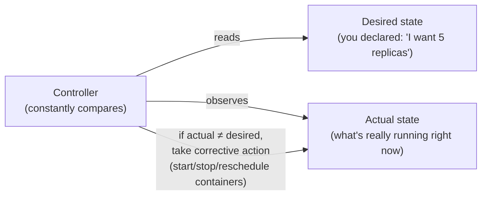

Concretely: if you declare "5 replicas" and a host holding one of them crashes, the controller notices "actual = 4, desired = 5" on its next reconciliation pass (this happens continuously, in a loop, not on a timer you set) and starts a new replica elsewhere — **without a human doing anything.** This single loop is the mechanism behind self-healing, and it's the same mechanism behind rolling updates (gradually shift "desired state" from v1 to v2 and let the loop converge) and autoscaling (change the desired replica count based on a metric, and let the loop converge). Once you see this loop, most of Kubernetes' behavior stops looking like separate features and starts looking like one idea applied repeatedly.

### Where this leaves us

We now have a name for the layer above individual containers (orchestration), a concrete historical reason it emerged (the 6 fleet-management problems above), and the one core mechanism (declarative desired-state + reconciliation loop) that underlies almost everything Kubernetes does. This is exactly the right foundation to now go one-by-one through the specific HLD topics you asked about — scaling, replication, service discovery, caching, load balancing, error handling — because each of them is really just "the reconciliation loop, applied to a specific problem," and I'll show you that connection explicitly for each one.

---

Quick check: does the imperative-vs-declarative distinction, and the reconciliation loop as *the* core mechanism, feel solid? Say "next" and we'll do **Chapter 11: Kubernetes' building blocks** — Pods, Deployments, ReplicaSets, and Services — mapping each one directly onto a piece of the reconciliation-loop idea and the networking/namespace concepts from earlier chapters, before we get into scaling/replication/caching proper.

---
