## OPENING HOOK

Picture a coding interview platform in 2013. A candidate submits a solution, and someone on the other end has to actually run untrusted code to check if it's correct. Except that code could be `while(true){}`, or `rm -rf /`, or a fork bomb that spins up processes until the box dies.

That's the real problem. You're not just "running code" — you're running code written by strangers, some of whom are actively trying to break your box, on shared infrastructure, thousands of times a minute.

## CLARIFYING QUESTIONS

1. **What languages must we support?** A handful of fixed languages (Python, Java, C++) vs. an open plugin model changes whether we can hardcode per-language sandboxes or need a generic runner interface.

2. **Is this graded (LeetCode-style, hidden test cases + verdict) or just "run and show me stdout" (like a REPL/Jupyter)?** Grading needs a test-case store, comparator logic, and a verdict pipeline. A plain runner just needs stdout/stderr back.

3. **What's the latency expectation — is this in the interactive path (user staring at a spinner) or async (submit and poll)?** Interactive means p99 in low seconds, which shapes how much container warm-pooling we need. Async lets us queue more loosely.

4. **What resource limits per execution — CPU time, memory, wall-clock timeout?** This decides the sandbox's kill-switch logic and whether we need cgroups vs. something heavier like a microVM.

5. **How adversarial is the input?** Is this trusted internal code (CI-like) or fully public untrusted code (open contest, arbitrary user)? This is the single biggest fork — it decides whether Docker-with-seccomp is enough or we need Firecracker/gVisor-level isolation.

6. **What's the expected concurrency — how many submissions per second at peak?** A university judge doing 50 QPS during a contest window is a different system than a public platform doing 5000 QPS globally.

7. **Do we need to support multi-file projects / compiled languages with build steps**, or is it always single-file, single-entry-point scripts? Compiled languages add a compile stage with its own failure mode (compile error vs. runtime error vs. wrong answer) that scripts don't have.

8. **Is there an interactive/stdin component**, or is it always "run against these fixed test cases and diff the output"? Interactive judges (game-playing problems) need a bidirectional pipe kept alive across multiple exchanges, not a single run-once execution.

9. **What happens on tie for resources — do we guarantee fairness across users**, or is best-effort fine? This affects whether we need per-tenant quotas/rate limiting baked into the scheduler from day one.

Go ahead and give me your answers, or tell me to assume reasonable defaults (I'd default to: multi-language via containers, graded submissions, interactive latency target, untrusted/adversarial code, moderate scale ~500-1000 QPS peak, single-file scripts with compile step where needed, no interactive stdin judges, best-effort fairness) and I'll move to scoping.

---

Going with the defaults I laid out. Let's scope it.

## SCOPE

**P0/P1 requirements:**

1. **Submit code + get a graded verdict** (Accepted / Wrong Answer / Time Limit Exceeded / Runtime Error / Compile Error) against hidden test cases. This is the core product.

2. **Untrusted code isolation** — a submission must never be able to touch the host, other tenants' data, or the network. This is non-negotiable given adversarial input.

3. **Bounded resource execution** — every run has a hard CPU time limit, memory limit, and wall-clock timeout, enforced by the platform, not the language runtime.

4. **Multi-language support** via a generic execution interface — Python, Java, C++ to start, but the design shouldn't hardcode assumptions that break when language #4 shows up.

**P2s I'm cutting, and why:**

- **Interactive/stdin judges** (game-playing, adaptive problems) — cut. Needs a persistent bidirectional pipe per submission, which is a materially different execution model. Not worth diluting the core design.
- **Multi-file / multi-step build projects** — cut. We'll handle single-file-with-compile-step (covers Java/C++) but not arbitrary project structures with dependency graphs.
- **Fine-grained per-tenant fairness/quotas** — cut to best-effort. Worth a mention when we hit scaling, but not a P0.
- **Custom judge logic per problem** (e.g. floating-point tolerance, multiple valid answers) — cut. We'll assume exact-match or a simple diff comparator; custom judges are a plugin point we can gesture at, not build.

**The crux:**

Requirement #2 — **untrusted code isolation under real concurrency** — is where this system lives or dies. Everything else (queueing, language support, verdict pipeline) is comparatively standard distributed-systems plumbing. The interesting fight is: what's the actual boundary between "attacker's code" and "your infrastructure," how do you enforce CPU/memory/time limits without trusting the code to cooperate, and how do you do this fast enough to still feel interactive when you're spinning up an isolated environment per submission, thousands of times a minute.

That's where most of our time goes — the sandbox model, container vs. microVM, warm pools vs. cold start, and the specific kernel-level mechanisms (cgroups, seccomp, namespaces) that make isolation real instead of theoretical.

Confirm this scope and I'll start V0.

---

## V0 — The Dumbest Thing That Could Work

Forget scale, forget security hardening for a second. What's the smallest thing that takes code and a test case and produces a verdict?

One server. It receives code, writes it to a file, shells out to run it, captures stdout, diffs it against the expected output, returns a verdict.

**What correctness guarantee V0 has:** if the code is well-behaved, we get a correct verdict, synchronously, with zero infrastructure. That's the whole guarantee — V0 trusts the code to behave. It's not safe, it's not scalable, it's not even multi-language yet beyond "shell out to whatever interpreter." But it proves the verdict logic works before we bury it under sandboxing machinery.

**Implement it:**

API: `POST /submissions` with body:
```json
{
  "problem_id": "two-sum",
  "language": "python3",
  "code": "print(sum(map(int, input().split())))"
}
```

Server logic, plain and ugly:

```python
def run_submission(code, test_cases):
    with open("/tmp/sub.py", "w") as f:
        f.write(code)

    results = []
    for tc in test_cases:
        proc = subprocess.run(
            ["python3", "/tmp/sub.py"],
            input=tc["input"],
            capture_output=True,
            text=True,
            timeout=5
        )
        verdict = "AC" if proc.stdout.strip() == tc["expected"].strip() else "WA"
        results.append(verdict)

    return "AC" if all(r == "AC" for r in results) else "WA"
```

Test cases live in a simple table:

```sql
CREATE TABLE test_cases (
  id SERIAL PRIMARY KEY,
  problem_id TEXT,
  input TEXT,
  expected_output TEXT
);
```

Who writes: an admin/problem-setup flow, offline, not part of the submission path.
Who reads: the submission server, once per submission, to grade against.
Where it lives: a single Postgres instance, colocated with the app server for now.

That's it. One process, one file write, one `subprocess.run`, one diff.

## CURRENT STATE — V0

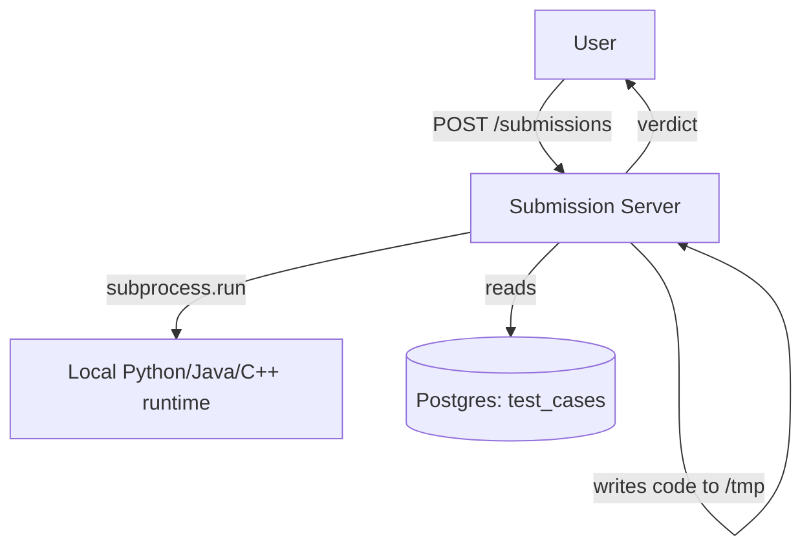
```mermaid
graph TD
    User[User] -->|POST /submissions| Server[Submission Server]
    Server -->|writes code to /tmp| Server
    Server -->|subprocess.run| Runtime[Local Python/Java/C++ runtime]
    Server -->|reads| DB[(Postgres: test_cases)]
    Server -->|verdict| User
```

**Flows:**

1. **Submit path:** User sends code → server writes it to a temp file on local disk → server fetches test cases for that problem from Postgres → server shells out to run the code against each test case's input → server diffs stdout against expected output → returns AC/WA to the user, synchronously.

That's the only flow that exists right now.

## Interviewer follow-ups

**Q: "What happens if the code has an infinite loop?"**
A: In V0, nothing good — `subprocess.run(timeout=5)` will eventually kill it after 5 seconds, but for those 5 seconds that server thread is blocked, and if ten people submit infinite loops at once, we've got ten stuck threads. This is exactly the crux we scoped — V0 doesn't solve it, it just delays the pain.

**Q: "Why run it directly with subprocess instead of some sandbox?"**
A: Because V0's job is to prove the grading logic — file in, test cases in, verdict out — works at all, before we spend effort on isolation. We're deliberately not solving problem #2 from our scope yet; that's next.

## Recap

| Concept | The Insight |
|---|---|
| V0's job | Prove the verdict pipeline (code → run → diff → AC/WA) works, nothing more |
| subprocess.run | Directly executing untrusted code on the host — the naive baseline every real judge starts from and immediately regrets |
| Test case storage | Simple relational table is fine here — access pattern is "fetch all rows for one problem_id," no need for anything fancier yet |
| The ticking bomb | This server has zero isolation — it's one `while True` away from taking down the whole box |

**One-breath interview line:** *"The naive judge just shells out to run submitted code directly on the server, which works until someone submits an infinite loop or a fork bomb and takes the whole box down — so the very next step is putting a real isolation boundary between the code and the host, not just a timeout flag."*

Next up: we break V0 with the most obvious attack — a fork bomb — and that's where containers and cgroups enter the picture.

---

## V1 — Break It: The Fork Bomb

Meet the scenario. A user named Priya is testing our platform's limits (or just being malicious) and submits this as her "solution" to Two Sum:

```python
import os
while True:
    os.fork()
```

She hits submit. On our V0 server, `subprocess.run` spawns this process directly on the host. Each fork doubles the process count — 1, 2, 4, 8, 16... within a couple seconds we're past the OS process limit. The kernel's process table fills up. Every other process on that box, including our own server process, starts failing to spawn threads or fork. The `timeout=5` we set never even gets a chance to fire, because the box is already thrashing before 5 seconds pass.

One submission just took down the server for every other user.

This isn't a hypothetical edge case — it's problem #1 on any list of "things people submit to code judges," right alongside `while True: pass` and `open("/dev/urandom").read()` to fill disk.

**A quick two-engineer exchange on the "obvious" fix:**

> **Dev A:** "Let's just add a process limit check in our Python wrapper — count forks, kill if it exceeds 50."
> **Dev B:** "Kill it with what? Our wrapper is a separate process from the one forking. By the time we notice and send a signal, she's already spawned into the thousands. And that's assuming she doesn't just disable our monitoring by forking faster than we can poll."

Any fix implemented *inside* the same trust boundary as the code is a fix the code can outrun or evade. The limit has to come from **outside** — something the kernel enforces regardless of what the process does.

## Solve It

✅ **What we gained:** A hard isolation boundary. The submitted code runs in its own process/mount/network namespace, with kernel-enforced caps on CPU, memory, and process count. No matter what Priya's code does, it cannot see or affect anything outside its container, and it physically cannot exceed the resource ceiling — the kernel kills it, not our application code.

⚠️ **What we gave up / new problem created:** Startup cost. Spinning up a container per submission — even a lightweight one — is not instant. `docker run` from a cold image pull can take hundreds of milliseconds to seconds. We just moved from "fast but unsafe" to "safe but slower," and if we're targeting interactive latency (per our scope), this becomes the next thing we have to fight. We're also now managing container lifecycle — cleanup of dead containers, image storage, orphaned processes — which is real operational surface area we didn't have before.

❌ **What we considered and rejected:**
- **chroot + ulimit only, no containers** — rejected because chroot doesn't isolate process namespaces or network; a fork bomb still eats the shared process table, and a chroot'd process can still see and signal other PIDs on the host.
- **Full hardware VMs (one VM per submission)** — rejected for V1 as overkill; VM boot time is seconds-to-tens-of-seconds, way too slow for the "container is already too slow" problem we're about to hit. (We'll revisit microVMs like Firecracker later, once we've seen exactly what a container leaks.)
- **Language-level sandboxing (e.g. Python's `exec` with restricted builtins)** — rejected because it's fighting the problem at the wrong layer; it only helps for Python, and there's a long history of these being escapable (reflection tricks, `__import__`, etc.) since the interpreter itself isn't a security boundary.

| Approach | Isolation strength | Startup cost | Multi-language? |
|---|---|---|---|
| chroot + ulimit | Weak — shares process table, network | Very low | Yes |
| Container (Docker + cgroups + namespaces) | Strong — separate PID/net/mount namespace, kernel-enforced limits | Low-medium | Yes |
| Full VM per submission | Strongest | High (seconds+) | Yes |
| Language-level sandbox (restricted exec) | Weak — interpreter escapes exist | Near zero | No, per-language |

For V1, **containers** are the right trade-off: real kernel-enforced isolation, without VM-level boot latency. VMs come back into the conversation later, once we ask "is container isolation actually strong enough for fully adversarial code," but that's a multi-region/hardening-level question, not V1.

## Implement It

The core mechanism: run the submission inside a Docker container, with explicit kernel-level limits, so the fork bomb dies inside its own sandbox instead of touching the host.

**PID limit** (kills fork bombs specifically):
```bash
docker run --pids-limit=64 ...
```
This caps the number of processes/threads the container's cgroup can ever have. Priya's fork loop hits 64 and gets `EAGAIN` from the kernel on the 65th fork — it can't proceed, and it never leaves the container's cgroup to affect anything else.

**Memory limit** (kernel OOM-kills the container, not the host):
```bash
docker run --memory=256m --memory-swap=256m ...
```

**CPU limit** (prevents one submission from starving others on a shared host):
```bash
docker run --cpus=0.5 ...
```

**No network** (prevents exfiltration, prevents calling out to fetch more payload):
```bash
docker run --network=none ...
```

**Wall-clock timeout** (belt-and-suspenders on top of the above — kills the container outright if it's still running after N seconds, regardless of resource usage):
```bash
timeout 5s docker run --rm \
  --pids-limit=64 \
  --memory=256m --memory-swap=256m \
  --cpus=0.5 \
  --network=none \
  --read-only \
  -v /tmp/sub_abc123:/sandbox:ro \
  python:3.11-slim python3 /sandbox/sub.py < /tmp/sub_abc123/input.txt
```

Full call sequence for one test case:

1. Submission server writes `sub.py` and `input.txt` into a fresh temp directory, `/tmp/sub_<submission_id>/`.
2. Server invokes `docker run` with the flags above, mounting that directory read-only into the container at `/sandbox`.
3. Container starts, runs `python3 /sandbox/sub.py`, stdin piped from `input.txt`.
4. **Branch: fork bomb / runaway process** → kernel's cgroup pids controller blocks new forks past 64 → process errors out inside the container → container exits non-zero → server records `RUNTIME_ERROR` (or maps it to a specific "resource limit exceeded" verdict).
5. **Branch: normal execution finishes in time** → stdout captured by Docker, returned to server → diffed against expected output as before → AC/WA.
6. **Branch: exceeds wall-clock timeout** → outer `timeout 5s` sends SIGKILL to the `docker run` process → server catches non-zero exit → verdict `TIME_LIMIT_EXCEEDED`.
7. Server removes the temp directory and confirms the container was cleaned up (`--rm` handles the common case; a background reaper sweeps orphans as a backstop).

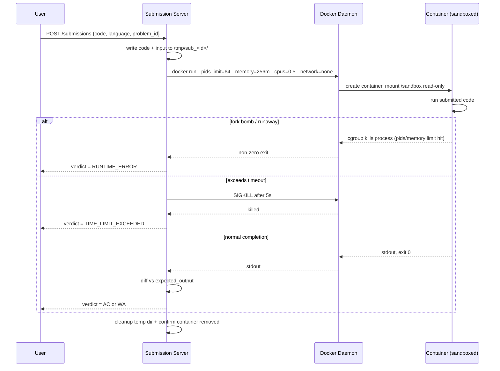
```mermaid
sequenceDiagram
    participant U as User
    participant S as Submission Server
    participant D as Docker Daemon
    participant C as Container (sandboxed)

    U->>S: POST /submissions {code, language, problem_id}
    S->>S: write code + input to /tmp/sub_<id>/
    S->>D: docker run --pids-limit=64 --memory=256m --cpus=0.5 --network=none
    D->>C: create container, mount /sandbox read-only
    C->>C: run submitted code
    alt fork bomb / runaway
        C-->>D: cgroup kills process (pids/memory limit hit)
        D-->>S: non-zero exit
        S-->>U: verdict = RUNTIME_ERROR
    else exceeds timeout
        S->>D: SIGKILL after 5s
        D-->>S: killed
        S-->>U: verdict = TIME_LIMIT_EXCEEDED
    else normal completion
        C-->>D: stdout, exit 0
        D-->>S: stdout
        S->>S: diff vs expected_output
        S-->>U: verdict = AC or WA
    end
    S->>S: cleanup temp dir + confirm container removed
```

## CURRENT STATE — V1

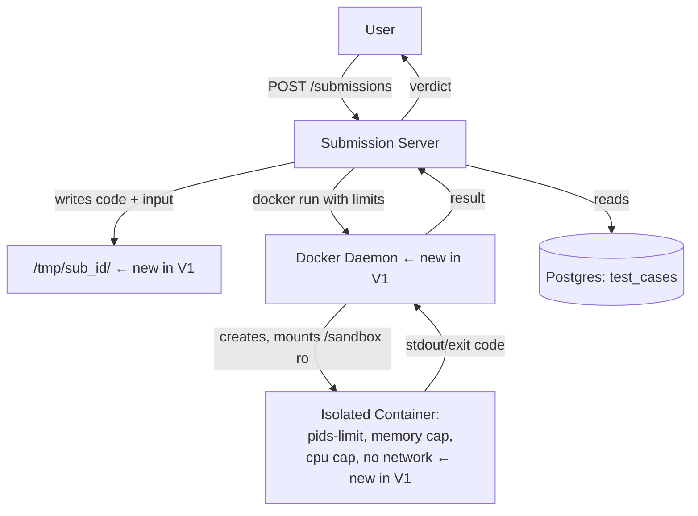
```mermaid
graph TD
    User[User] -->|POST /submissions| Server[Submission Server]
    Server -->|writes code + input| TmpDir["/tmp/sub_id/ ← new in V1"]
    Server -->|docker run with limits| Docker[Docker Daemon ← new in V1]
    Docker -->|creates, mounts /sandbox ro| Container["Isolated Container:<br/>pids-limit, memory cap,<br/>cpu cap, no network ← new in V1"]
    Container -->|stdout/exit code| Docker
    Docker -->|result| Server
    Server -->|reads| DB[(Postgres: test_cases)]
    Server -->|verdict| User
```

**Flows:**

1. **Submit path (changed this version):** User sends code → server writes code + input to an isolated temp dir → server invokes `docker run` with pid/memory/cpu/network limits and an outer wall-clock timeout → code executes fully inside the container's cgroup/namespace boundary → container exits (normally, resource-killed, or timed-out) → server captures stdout, diffs against expected output from Postgres → returns verdict → temp dir and container are cleaned up.

2. **Test case read path:** unchanged from V0 — server still fetches test cases for the `problem_id` from Postgres, once per submission.

## Interviewer follow-ups

**Q: "Is a Docker container actually secure enough for fully untrusted, adversarial code?"**
A: Container isolation shares the host kernel, so a kernel exploit or side-channel (like a Docker escape CVE) can, in principle, break out — it's isolation, not a hard security boundary the way a VM's hypervisor is. For genuinely hostile code at scale, teams like Judge0 or competitive programming platforms often layer on `seccomp` profiles to block dangerous syscalls, or move to gVisor/Firecracker microVMs for a stronger boundary. We're treating Docker + cgroups as "good enough for V1," and flagging that hardening is a real follow-up, not a solved problem.

**Q: "Why `--pids-limit=64` specifically — how did you pick that number?"**
A: It's a judgment call, not a derived constant — most legitimate solutions spawn at most a handful of threads/processes (some languages spin up a few runtime threads by default), so 64 gives generous headroom while still capping a fork bomb within milliseconds of hitting the ceiling instead of letting it run for seconds.

## Recap

| Concept | The Insight |
|---|---|
| The fork bomb | Shows why in-process monitoring can't save you — code that's actively hostile can outrun any check running in the same trust boundary |
| cgroups pids controller | The kernel-enforced ceiling that makes "no more than 64 processes" a physical fact, not a polite request |
| Container vs. chroot | chroot hides the filesystem but still shares the process table and network stack — not real isolation |
| Container vs. VM | Containers share the host kernel (weaker boundary, fast startup); VMs get a full hypervisor boundary (stronger, slow startup) — V1 picks containers for speed, flags VMs as a future hardening step |
| `--network=none` | Blocks exfiltration and "phone home for more payload" attacks, not just resource abuse |

**One-breath interview line:** *"If asked how you isolate untrusted code: a naive judge shells out directly on the host, so a fork bomb or infinite loop takes down the whole server — the fix is running each submission inside a container with kernel-enforced cgroup limits on PIDs, memory, and CPU plus no network access, so the kernel kills the runaway process inside its own sandbox instead of the host ever being at risk."*

Next up: containers solve isolation, but `docker run` from a cold image is slow — and at any real submission volume, that latency is going to become the next wall we hit.

---

## V2 — Break It: Cold Start Under Load

Let's put a number on V1. A `docker run` from scratch — even with the image already cached locally — has to set up a new network namespace, mount namespace, overlay filesystem layer, and cgroup hierarchy from zero. That typically costs somewhere in the 150-400ms range per container, and Docker's daemon serializes a lot of this work internally around its graph driver. In practice, a single daemon starts struggling to sustain much more than ~20-30 fresh container creations per second before that internal locking causes queueing.

Now picture a coding contest starting. At T+0, 800 people hit submit within the same few seconds — a realistic burst for our "peak QPS" assumption from scoping. Our daemon can create maybe 25 containers/sec. That's a 30x mismatch. The queue of "containers waiting to be created" balloons immediately, and by second 3 of the contest, someone's submission that should return a verdict in under a second is sitting in a queue with an ETA of 15+ seconds.

We didn't break isolation this time. We broke latency, at exactly the moment (contest start) when it matters most.

> **Dev A:** "Let's just run more Docker daemons in parallel, spread the load."
> **Dev B:** "That helps some, but we're still paying the 150-400ms cold-start tax on every single submission, forever. We haven't removed the cost, we've just added more lanes to the same slow road."

The real fix isn't "create containers faster." It's "stop creating them on the request path at all."

## Solve It

The mechanism: keep a pool of already-running, idle containers per language, sitting warm and waiting. When a submission comes in, grab one from the pool and inject the code into it via `docker exec` — which forks a new process inside an *existing* set of namespaces, instead of building new ones. That's the difference between renting a furnished apartment (fast move-in) versus building a house from the foundation up (every single time) for every new tenant.

`docker exec` into a running container typically completes in single-digit-to-low-tens of milliseconds, because the expensive setup (namespaces, overlay mount, cgroup creation) already happened once, ahead of time, off the request path.

✅ **What we gained:** Submission latency is now dominated by actual code execution time, not sandbox setup. The expensive part of isolation got moved from "per-request" to "background, ahead of time."

⚠️ **What we gave up / new problem created:** A pooled container is used exactly once and then destroyed — reusing it for a second submission would mean two different users' code sharing the same container filesystem and process namespace, which reopens the exact isolation hole V1 closed. So now we need a **replenishment system**: something has to constantly refill the pool in the background, and if a burst drains the pool faster than it refills, we're back to cold-start latency for whoever hits an empty pool. We've also added a new component (the pool manager) that itself needs to be reliable — if it dies, every submission cold-starts.

❌ **What we considered and rejected:**
- **Just reuse containers across submissions, with an in-container "reset" script** (delete temp files, reset filesystem) — rejected because a reset script runs with the same trust level as the code that might have already compromised the container; you can't trust a potentially-hostile environment to clean itself.
- **Pre-fork a huge static pool sized for peak, always-on** — rejected as wasteful; sizing for the absolute peak means paying for hundreds of idle containers 99% of the day. We want the pool to flex.
- **Skip pooling, just parallelize across many Docker daemons/hosts** — rejected as treating the symptom; it raises the ceiling but the per-submission cold-start tax never goes away, so at 10x scale we're back here again.

| Approach | Per-submission latency | Isolation preserved? | Operational cost |
|---|---|---|---|
| Cold `docker run` per submission (V1) | 150-400ms+ setup, worse under load | Yes | Low (nothing to manage) |
| Reuse + in-container reset script | Near zero | No — trust boundary broken | Low |
| Warm pool, destroy-after-use, background refill | ~10-50ms (exec) | Yes | Medium — needs a pool manager |
| Always-on pool sized for peak | ~10-50ms | Yes | High — pays for idle capacity constantly |

Warm pool with destroy-and-replenish is the right trade for us: it preserves V1's isolation guarantee completely (every submission still gets a brand-new, never-touched container) while moving the expensive part off the critical path.

## Implement It

**New component: Pool Manager.** It owns, per language, a target pool size of pre-started containers and keeps that pool topped up asynchronously.

Pool state, kept in Redis (fast, ephemeral, exactly the access pattern — push/pop a list):

```
LPUSH warm_pool:python3.11 <container_id>
LPUSH warm_pool:java17     <container_id>
LPUSH warm_pool:cpp17      <container_id>
```

Who writes: the Pool Manager, continuously, in the background — it starts a fresh idle container (`docker run -d --entrypoint sleep <image> infinity` with the same `--pids-limit`/`--memory`/`--cpus`/`--network=none` flags from V1 baked in at creation time) and pushes its ID onto the list whenever the list length drops below target.
Who reads: the Submission Server, once per incoming submission, to pop a ready container ID.
Where it lives: Redis instance colocated with the submission service, separate from the Postgres test-case store (different access pattern — this is high-churn, ephemeral, single-key list operations, not relational data).

Full flow for one submission:

1. `POST /submissions` arrives at the Submission Server, same request shape as before.
2. Server does `RPOP warm_pool:python3.11` — gets back a container ID that's already running, idle, isolated.
3. **Branch: pool non-empty** → server copies code + input into the container via `docker cp`, then runs `docker exec <container_id> python3 /sandbox/sub.py < input.txt` with the same outer wall-clock timeout as V1.
4. **Branch: pool empty (burst drained it)** → fall back to V1's cold `docker run` path directly, and log a pool-exhaustion event. This is our safety valve — degraded latency for the unlucky few, not a hard failure.
5. Execution finishes → server captures stdout, diffs against expected output (Postgres, unchanged from V0/V1) → returns verdict.
6. Server issues `docker rm -f <container_id>` — the used container is destroyed unconditionally, never reused, preserving the isolation guarantee.
7. Pool Manager, running independently, notices `LLEN warm_pool:python3.11` dropped below target and starts a replacement container asynchronously, off the request path.

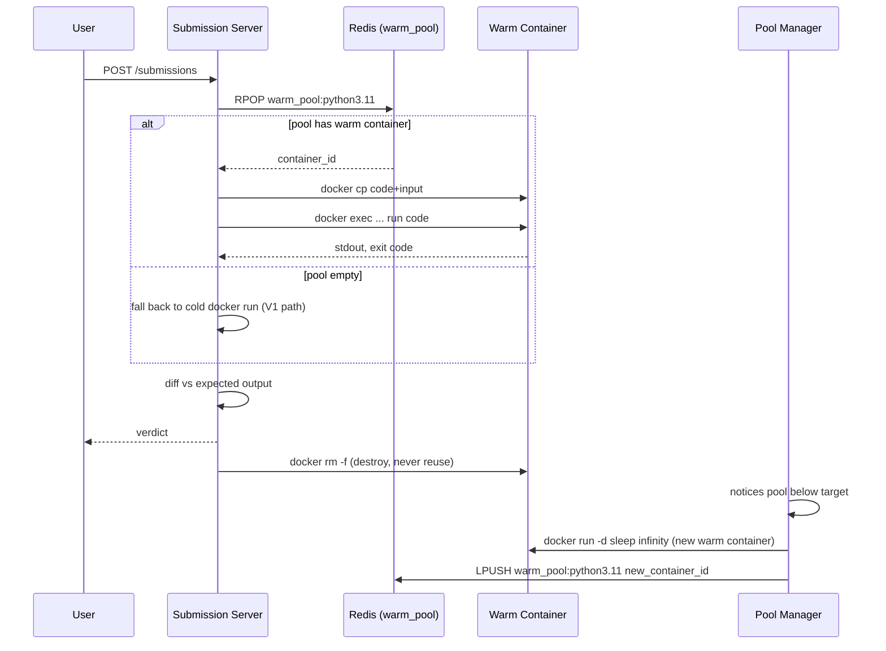
```mermaid
sequenceDiagram
    participant U as User
    participant S as Submission Server
    participant R as Redis (warm_pool)
    participant C as Warm Container
    participant PM as Pool Manager

    U->>S: POST /submissions
    S->>R: RPOP warm_pool:python3.11
    alt pool has warm container
        R-->>S: container_id
        S->>C: docker cp code+input
        S->>C: docker exec ... run code
        C-->>S: stdout, exit code
    else pool empty
        S->>S: fall back to cold docker run (V1 path)
    end
    S->>S: diff vs expected output
    S-->>U: verdict
    S->>C: docker rm -f (destroy, never reuse)
    PM->>PM: notices pool below target
    PM->>C: docker run -d sleep infinity (new warm container)
    PM->>R: LPUSH warm_pool:python3.11 new_container_id
```

## CURRENT STATE — V2

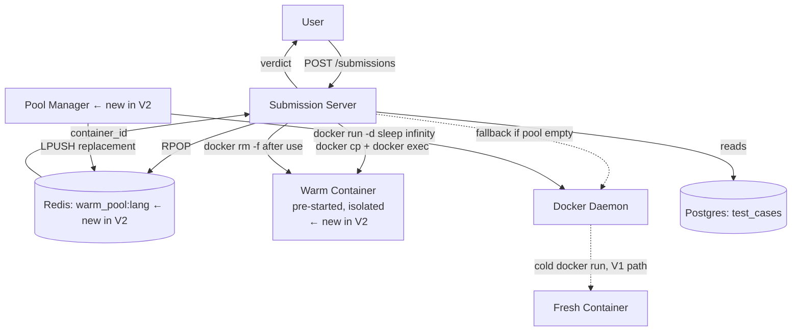
```mermaid
graph TD
    User[User] -->|POST /submissions| Server[Submission Server]
    Server -->|RPOP| Redis[("Redis: warm_pool:lang ← new in V2")]
    Redis -->|container_id| Server
    Server -->|docker cp + docker exec| WarmC["Warm Container<br/>pre-started, isolated<br/>← new in V2"]
    Server -.->|fallback if pool empty| Docker[Docker Daemon]
    Docker -.->|cold docker run, V1 path| ColdC[Fresh Container]
    Server -->|docker rm -f after use| WarmC
    PM[Pool Manager ← new in V2] -->|docker run -d sleep infinity| Docker
    PM -->|LPUSH replacement| Redis
    Server -->|reads| DB[(Postgres: test_cases)]
    Server -->|verdict| User
```

**Flows:**

1. **Submit path (changed this version):** User sends code → server pops a ready container ID from Redis's warm pool → copies code/input into that already-running container → runs via `docker exec` (fast, no namespace setup) → captures stdout → diffs against Postgres test cases → returns verdict → destroys the used container. If the pool is empty, falls back to V1's cold `docker run` path as a safety valve.

2. **Pool replenishment (new path):** Independently of any user request, the Pool Manager watches each language's pool size in Redis and starts new idle containers in the background whenever the count drops below target, keeping the pool topped up ahead of demand.

3. **Test case read path:** unchanged since V0 — server still fetches test cases from Postgres per submission.

## Interviewer follow-ups

**Q: "What if a contest burst is so big it drains the pool faster than the Pool Manager can refill it?"**
A: We fall back to cold `docker run` for whoever hits the empty pool — degraded latency for a subset of users rather than a hard failure for everyone. The real answer for predictable bursts (a contest with a known start time) is to pre-scale the pool ahead of the event, similar to how you'd pre-warm autoscaling groups before a big launch.

**Q: "Doesn't `docker cp` before `docker exec` add its own latency?"**
A: It's a small file write, typically single-digit milliseconds for a source file — negligible next to the 150-400ms we removed. If it ever became a bottleneck, the alternative is mounting a per-submission volume at exec time instead of copying, but that's a micro-optimization we don't need yet.

## Recap

| Concept | The Insight |
|---|---|
| Cold start bottleneck | Namespace/cgroup/overlay setup, not the code execution itself, was the slow part of V1 |
| `docker exec` vs `docker run` | Exec reuses existing namespaces (fast); run builds them from scratch (slow) — same isolation, very different cost |
| Warm pool | Moves expensive setup from the request path to a background process, without weakening V1's guarantee |
| Destroy-after-use | Non-negotiable — reusing a container across users would reopen the isolation hole V1 just closed |
| Pool exhaustion fallback | A safety valve, not a redesign — degrade gracefully to V1's path rather than fail the request |

**One-breath interview line:** *"If asked how you avoid cold-start latency under load: spinning up a fresh container per submission means paying 150-400ms of namespace and cgroup setup on every request, which collapses under a burst — so you pre-warm a pool of already-running containers and use `docker exec` to inject code into an existing sandbox, destroying and replacing it after each use so isolation never gets weaker, just faster."*

Next up: the pool solves latency for one host, but what happens when submission volume outgrows a single Submission Server — that's where we start talking about sharding the workload across a fleet.

---

Good question — let me slow down on this one because it's easy to wave away as "just add a cleanup step."

Here's the concrete scenario. Container C1 runs Priya's submission. Say her code is malicious — not a fork bomb this time, something quieter. It writes a file to `/tmp/backdoor.sh` inside the container, or it drops a cron-like background process that's still alive when the main script exits, or it modifies environment variables that get inherited by whatever runs next.

Now the pool wants to reuse C1 for the next user, Raj. Before reuse, we run some "reset" script inside C1 to clean up — delete temp files, kill stray processes, reset state.

Here's the problem: **that reset script runs inside the same container Priya's code just had full control of.** If her code left something behind that the reset script doesn't know to look for — a modified `PATH`, a malicious binary shadowing `python3`, a process that respawns itself, a kernel-level side effect the container filesystem doesn't even show you — the reset script won't catch it. You're asking a potentially-compromised environment to certify its own cleanliness. That's not a security boundary, that's trusting the fox to confirm the henhouse is empty.

The analogy: it's like renting a hotel room to a guest who might be a arsonist, then asking *that same room* — not a cleaning crew, the room itself — to confirm it's safe for the next guest. Even a very thorough reset script is still code running with the same privileges inside the same namespace the attacker just had.

Compare that to destroy-and-replace: `docker rm -f` doesn't clean the container, it **removes it entirely** — the overlay filesystem layer is discarded, the cgroup is torn down, the namespaces cease to exist. There's no state left to inherit because there's no container left. The Pool Manager's next container is built fresh from the base image, which nobody has touched. That's a guarantee "reset and reuse" can never give you, no matter how good the reset script is.

The cost we pay for that guarantee is exactly what V2 solves: rebuilding is expensive (V1's cold-start problem), so we hide that cost by rebuilding *ahead of time, in the background*, instead of rebuilding *cheaply in place*. We get to keep the "every submission gets a genuinely untouched sandbox" guarantee, and we've just moved when the cost is paid, not whether it's paid.

One more angle worth having ready for an interviewer: even memory itself isn't fully trustworthy to "reset." Cgroup memory accounting, page cache artifacts, and things like leftover shared memory segments (`/dev/shm`) can persist in subtle ways that a naive `rm -rf /tmp/*` reset script won't touch. Destroying the container is the only way to guarantee zero carryover, because the isolation primitives themselves get torn down, not just the files inside them.

Want me to keep going to V3 (sharding across hosts), or dig into anything else about the pool/reuse mechanics first?

---

Good set of questions — and honestly, V2 as I described it glossed over exactly this, so let me be precise instead of hand-wavy.

**Where does Docker actually run in V2?**

As I described it, the Submission Server itself has Docker installed locally, and both `docker run` (Pool Manager) and `docker exec` (Submission Server) are just shell commands hitting the *local* Docker daemon on that same box. One machine, wearing two hats: it serves the API, and it also runs untrusted code.

That's actually a real gap worth naming out loud: if container isolation is ever bypassed — a Docker escape, a kernel exploit — the thing sitting right there on the same host is our own API server, with its DB credentials, its Redis connection, everything. Blast radius is bigger than it should be.

The clean fix is a dedicated **executor fleet** — a separate pool of hosts whose only job is running containers, with the Submission Server talking to them over the network instead of shelling out locally. That's genuinely a V3-level concern (it's tangled up with sharding — once you have multiple executor hosts, you need to decide which host a given submission's container lives on). So V2 as I wrote it is implicitly single-host, and that's a simplification I should have flagged rather than let slide.

**Is Pool Manager a separate service, or code inside the Submission Server?**

Separate process, even on a single host. Two reasons:

1. **Different lifecycle.** Pool Manager needs to run continuously, in a loop, independent of whether any requests are coming in. If it's just a function called inline during request handling, nobody's replenishing the pool between requests — you'd need a background thread anyway, which is really the same thing as "a separate process" with extra steps.
2. **Fault isolation.** If the Submission Server crashes or gets redeployed, you don't want that to kill pool replenishment. And if Pool Manager gets stuck (say, the Docker daemon hangs on a `docker run` call), you don't want that blocking request handling.

So: separate process today, and once we shard (V3), it naturally becomes a separate *service* — one Pool Manager (or one per executor host) rather than one per Submission Server instance.

**Why Redis instead of an in-memory list?**

Here's the concrete failure an in-memory list runs into, even before any sharding: a real Submission Server isn't one process. To handle concurrent requests, you run it with multiple worker processes (think `gunicorn -w 4`). Each worker is a separate OS process with its own memory space.

If the pool is an in-memory Python list, worker #1 and worker #2 each have their *own* list. Pool Manager can only push into one of them. A request landing on worker #2 sees an empty pool and cold-starts, even though worker #1 is sitting on 20 warm containers doing nothing.

Redis fixes this by being a shared point of truth that lives *outside* any single process — every worker, and Pool Manager, all see the same `warm_pool:python3.11` list, regardless of which process popped or pushed last. It also happens to be exactly the primitive we'll need once this spans multiple hosts in V3, so we're not making a throwaway choice — we're building the piece we'd need anyway, one version early.

One more real detail worth having ready: Redis storing a container ID doesn't guarantee that container is still alive (it could've died from an OOM kill on a previous run that we failed to clean up, or the host rebooted). In practice you'd do a lightweight liveness check right before `docker exec` — `docker inspect <id>` or just let the exec fail and fall back to cold-start on error — rather than blindly trusting the Redis entry.

Want me to fold "dedicated executor fleet" into V3 as the sharding version, since it's the natural next break, or keep going on V2 details first?

---

## V3 — Break It: One Host Runs Out of Room

Let's put a number on it. Say each executor host can safely run about 40 concurrent containers before CPU/memory contention between them starts corrupting timing — a submission that should finish in 200ms starts taking 800ms because it's fighting 39 neighbors for the same CPU cores. That's not a made-up ceiling; it falls straight out of the `--cpus=0.5` limit we set in V1 — a 16-core box divides into roughly 32 "half-cores" before you're oversubscribing.

Now scale to our target: 800 QPS at contest peak, each execution taking roughly 1-2 seconds end to end (compile + run + overhead). That's roughly 800-1600 containers that need to be *alive* at any given moment during peak. One host doing 40 is nowhere close — we need on the order of 20-40 hosts running concurrently, not one host running harder.

Even ignoring raw capacity, V2 as we left it has a single Docker daemon on a single box. If that box's kernel takes a bad Docker escape or just has a bad disk, every single submission platform-wide goes down — one machine holding up the whole product.

> **Dev A:** "Let's just get a bigger box — more cores, more RAM, raise the container ceiling from 40 to 400."
> **Dev B:** "That buys us a factor of 10, once. And it's still one blast radius — if that box's kernel gets exploited, or the disk fills, we still lose 100% of capacity, not 3%. We need *more* boxes, not a *bigger* box."

This is the same vertical-vs-horizontal argument that shows up everywhere, but here it's sharper: the "server" holding local state isn't just holding request state, it's holding **running containers with live processes inside them**. You can't just spin up an identical replica and load-balance blindly — a submission mid-execution on Host A doesn't exist on Host B.

## Solve It

First, the underlying idea, plainly: horizontal scaling only works if any given unit of work can land on *any* server, because no server is holding something unique that only it has. Here, the "state" a naive executor host holds locally is: its warm container pool, and any submission currently mid-execution on it. If we just clone the Submission Server code onto 20 boxes without a plan, we've made 20 islands, each with its own separate warm pool, each independently racing to replenish — no coordination, no single source of truth for "who has capacity right now."

So we split the architecture into two tiers:

- **Submission Servers** — stateless, handle the API, do NOT run Docker locally anymore. Just receive requests, pick an executor, delegate, wait for result. Any Submission Server can handle any request — no local state to shard around.
- **Executor Fleet** — a set of hosts whose only job is running Docker and hosting the warm pools. This is the tier that actually needs a sharding decision, because *this* is where the real resource (CPU, memory, running containers) lives.

Now: how does a Submission Server decide *which* executor host gets a given submission? This is the actual shard-key question.

**Candidate 1 — hash on submission_id.** Optimizes: perfectly even distribution, dead simple. Breaks: doesn't account for load — you could hash two heavy Java submissions onto the same host back-to-back while another host sits idle, purely by chance.

**Candidate 2 — hash on language (route all Python to hosts 1-5, all Java to hosts 6-10, etc).** Optimizes: pool locality — Python-warm-pool traffic doesn't dilute Java's pool. Breaks: hotspotting — if a Python contest problem goes viral, hosts 1-5 melt while 6-10 sit idle. This is the "wrong shard key" failure mode from the Uber session, same shape: a key that correlates with real-world skew creates hot shards.

**Candidate 3 — least-loaded / capacity-aware routing.** Each executor host reports its current running-container count (or free pool size) to a shared registry. Submission Server picks whichever executor currently has room. Optimizes: actual load balancing, adapts to real-time skew. Breaks: needs a live registry (more moving parts) and a small window of staleness (two Submission Servers could both pick the same "least loaded" host in the same instant).

| Approach | Even distribution | Handles traffic skew | Complexity |
|---|---|---|---|
| Hash on submission_id | Yes, statistically | No — ignores current load | Low |
| Hash on language | No — ties directly to problem popularity | No — actively creates hotspots | Low |
| Least-loaded via registry | Yes, adaptively | Yes | Medium — needs live state |

We go with **least-loaded routing**, because our traffic shape (contest bursts, viral problems) is exactly the skew-prone pattern that a static hash can't absorb. It costs us a shared registry, but we already have Redis in the picture from V2 — this is the same tool, one more use.

✅ **What we gained:** No single host is a capacity ceiling or a single point of failure. Submissions land wherever there's actual room right now, not wherever a hash function said to, so a viral problem or a contest burst gets absorbed across the whole fleet instead of melting one box.

⚠️ **What we gave up / new problem created:** We now need every executor host to report liveness and load continuously — if that heartbeat mechanism itself lags or fails, Submission Servers are routing against stale data, potentially overloading a host that looks free but isn't. We've traded "one box, no coordination" for "many boxes, real coordination overhead."

❌ **What we considered and rejected:**
- **Hash on submission_id** — rejected because it's blind to load; fine for uniform traffic, wrong tool for bursty contest traffic.
- **Hash on language** — rejected because it structurally creates hotspots the moment one language's traffic spikes, which is common (everyone uses Python).
- **A central scheduler that owns all routing decisions synchronously** — rejected for now as unnecessary complexity; a shared registry that servers read from is enough, we don't need a single arbiter making every decision (that itself becomes a bottleneck/SPOF).

## Implement It

**New component: Executor Registry**, in Redis (same instance family as the warm pool — this is small, high-churn, per-key data, a natural fit for the same store):

```
HSET executor:host-07 running_containers 12 max_capacity 40 last_heartbeat 1725350000
HSET executor:host-12 running_containers 38 max_capacity 40 last_heartbeat 1725350001
```

Who writes: each Executor Host, on a 2-second heartbeat loop — reports its own current running-container count and a timestamp.
Who reads: every Submission Server, on each incoming submission, to pick a target.
Where it lives: same Redis instance as `warm_pool:*` from V2 — colocated, since both are small, hot, ephemeral coordination data, distinctly different access pattern from the relational test-case store in Postgres.

Routing logic on the Submission Server:

```python
def pick_executor():
    candidates = redis.scan_iter("executor:*")
    best = None
    for key in candidates:
        info = redis.hgetall(key)
        if time.time() - float(info["last_heartbeat"]) > 5:
            continue  # stale, treat as dead, skip it
        load_ratio = int(info["running_containers"]) / int(info["max_capacity"])
        if best is None or load_ratio < best.load_ratio:
            best = Candidate(key, load_ratio)
    return best
```

Full flow for one submission:

1. `POST /submissions` arrives at any Submission Server (any instance — they're stateless, a plain round-robin load balancer in front of them is enough).
2. Submission Server scans `executor:*` in Redis, filters out any host whose heartbeat is older than 5 seconds (treat as dead — this is our simple failure detector), and picks the host with the lowest `running_containers / max_capacity` ratio.
3. Submission Server sends the execution request to that host over the network: `POST http://host-07:9000/execute` with the code, language, and test input in the body.
4. Executor Host receives it, runs the exact same warm-pool logic from V2 locally (`RPOP` its own local pool or a per-host Redis key like `warm_pool:host-07:python3.11`, `docker exec`, `docker rm -f`, replenish).
5. **Branch: chosen executor is actually near-full or the request fails (race — another Submission Server picked it in the same instant)** → Submission Server catches the failure/timeout and retries against the next-best candidate from its sorted list, rather than failing the whole submission.
6. Executor returns stdout/exit code over HTTP back to the Submission Server.
7. Submission Server diffs against Postgres test cases (unchanged since V0) and returns the verdict to the user.

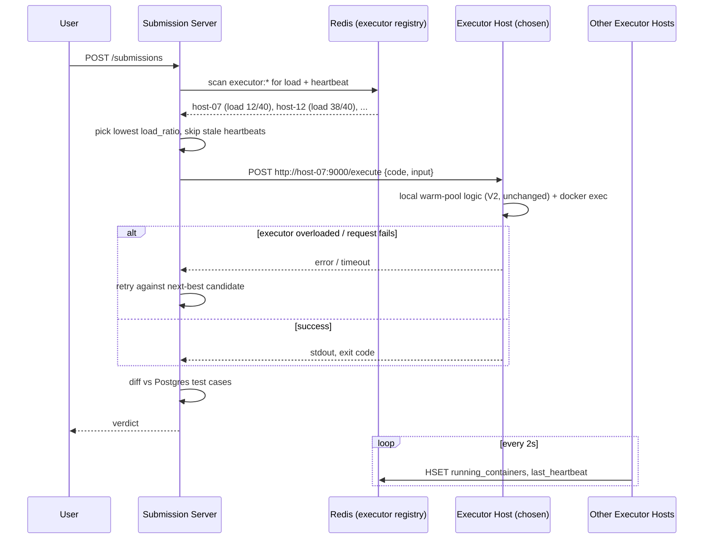
```mermaid
sequenceDiagram
    participant U as User
    participant S as Submission Server
    participant Reg as Redis (executor registry)
    participant E as Executor Host (chosen)
    participant EH as Other Executor Hosts

    U->>S: POST /submissions
    S->>Reg: scan executor:* for load + heartbeat
    Reg-->>S: host-07 (load 12/40), host-12 (load 38/40), ...
    S->>S: pick lowest load_ratio, skip stale heartbeats
    S->>E: POST http://host-07:9000/execute {code, input}
    E->>E: local warm-pool logic (V2, unchanged) + docker exec
    alt executor overloaded / request fails
        E-->>S: error / timeout
        S->>S: retry against next-best candidate
    else success
        E-->>S: stdout, exit code
    end
    S->>S: diff vs Postgres test cases
    S-->>U: verdict
    loop every 2s
        EH->>Reg: HSET running_containers, last_heartbeat
    end
```

## CURRENT STATE — V3

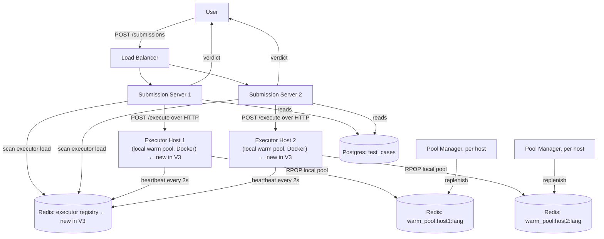
```mermaid
graph TD
    User[User] -->|POST /submissions| LB[Load Balancer]
    LB --> S1[Submission Server 1]
    LB --> S2[Submission Server 2]
    S1 -->|scan executor load| Reg[("Redis: executor registry ← new in V3")]
    S2 -->|scan executor load| Reg
    S1 -->|POST /execute over HTTP| E1["Executor Host 1<br/>(local warm pool, Docker) ← new in V3"]
    S2 -->|POST /execute over HTTP| E2["Executor Host 2<br/>(local warm pool, Docker) ← new in V3"]
    E1 -->|RPOP local pool| RedisPool1[("Redis: warm_pool:host1:lang")]
    E2 -->|RPOP local pool| RedisPool2[("Redis: warm_pool:host2:lang")]
    PM1[Pool Manager, per host] -->|replenish| RedisPool1
    PM2[Pool Manager, per host] -->|replenish| RedisPool2
    E1 -->|heartbeat every 2s| Reg
    E2 -->|heartbeat every 2s| Reg
    S1 -->|reads| DB[(Postgres: test_cases)]
    S2 -->|reads| DB
    S1 -->|verdict| User
    S2 -->|verdict| User
```

**Flows:**

1. **Submit path (changed this version):** User's request hits any Submission Server behind a load balancer (stateless, interchangeable) → server checks the Executor Registry in Redis for the least-loaded, live executor host → forwards the code/input to that executor over HTTP → executor runs V2's exact warm-pool-and-`docker exec` logic *locally on itself* → returns stdout/exit code to the Submission Server → server diffs against Postgres, returns verdict to user. Failure to reach the chosen executor triggers a retry against the next-best candidate.

2. **Executor heartbeat path (new):** every executor host reports its current container count and a timestamp to the Redis registry every 2 seconds, independent of any user request — this is what makes least-loaded routing possible and lets Submission Servers detect a dead host by stale heartbeat.

3. **Pool replenishment path:** unchanged in mechanism from V2, but now runs per-executor-host, with each host's Pool Manager maintaining its own local warm pool keyed by hostname (`warm_pool:host-07:python3.11`) rather than one global pool.

4. **Test case read path:** unchanged since V0 — Submission Server reads from Postgres, once per submission.

## Interviewer follow-ups

**Q: "What happens if the Redis registry itself goes down?"**
A: Every Submission Server loses the ability to pick a target intelligently — this is a new single point of failure we introduced. The mitigation is running Redis with replication (which we'll formalize when we get to the Replication version), and having Submission Servers fall back to plain round-robin across a static, rarely-changing list of known executor hosts if the registry is unreachable — degraded routing quality, not a hard outage.

**Q: "Why HTTP between Submission Server and Executor instead of something like gRPC or a message queue?"**
A: HTTP is fine here because this is a synchronous request-response call in the interactive latency path — we need the result back before we can answer the user. A queue would decouple the two sides nicely, but it turns a 1-2 second interactive request into "submit, then poll," which contradicts our scoped latency requirement. gRPC would shave some serialization overhead versus JSON-over-HTTP, but that's a micro-optimization, not a correctness or architecture question.

## Recap

| Concept | The Insight |
|---|---|
| The real shard-key question | It's not "which server handles the API request" (those are stateless), it's "which executor host actually runs the container" — that's where the real resource lives |
| Hash-based routing's failure mode | Any static key (submission_id, language) ignores real-time load, so it can't absorb skewed, bursty traffic like a viral contest problem |
| Least-loaded routing | Costs a shared registry, but adapts to actual load instead of guessing from a hash |
| Submission Server vs. Executor split | Separating "stateless API tier" from "stateful execution tier" is what makes horizontal scaling of the *right* tier possible |
| Heartbeat + staleness check | A simple, cheap failure detector — no heartbeat in 5s means treat the host as dead, don't route to it |

**One-breath interview line:** *"If asked how you scale execution beyond one host: a single Docker host caps out around a few dozen concurrent containers and becomes a single point of failure, so you split into a stateless Submission Server tier and a dedicated Executor fleet, and route each submission to whichever executor is currently least loaded — via a live Redis registry — rather than a static hash, because contest-style traffic is exactly the skewed pattern a static shard key can't absorb."*

Next up: with a live registry telling us load per host, what happens when that registry — or an executor host itself — actually dies mid-submission? That's replication and failure handling.

---

Fair — that paragraph was doing too much at once. Let me slow it down with the actual before/after.

**What V2 looked like, concretely.** In V2 there's only one kind of box: the Submission Server. That same box does two jobs at once — it receives the HTTP request from the user, *and* it runs Docker locally (the warm pool lives on it, `docker exec` runs on it). One machine, two jobs, glued together.

**Why that's a problem the moment you add more boxes.** Say we now spin up 20 of these identical Submission Servers to handle more load, and put a load balancer in front that just round-robins requests across them.

Request 1 lands on Server A. Server A's *local* warm pool has 20 idle Python containers sitting on it, ready to go.

Request 2 lands on Server B (round robin sent it there, purely by chance). Server B's local pool happens to be empty right now — maybe it just got hit by a burst, maybe its Pool Manager is slow this second.

Request 2 cold-starts, eating the full 150-400ms penalty, *even though Server A right next to it has 20 warm containers doing nothing.* The load balancer had no idea — it just round-robins, it doesn't know anything about pool state. Each server is its own island: its own pool, no visibility into anyone else's pool, no way to say "hey, send this one to A instead, I'm dry."

That's what "20 islands, no coordination" means concretely — not an abstract inefficiency, but literally: identical requests get wildly different latency depending on which box the load balancer happened to pick, and there's no mechanism for a request to find the box that actually has room.

**Why splitting into two tiers fixes this.** The insight is: the two jobs a V2 server does don't need to live on the same machine.

- Job 1 — "receive the HTTP request, look up test cases, diff the output, return a verdict" — needs *no* local state. Any box can do this for any request. This becomes the **Submission Server** tier.
- Job 2 — "hold a warm pool of containers, run `docker exec`" — is the part that has real, physical, per-machine state (actual running processes, actual RAM used, actual CPU). This becomes the **Executor** tier.

Once you pull them apart, the Submission Server doesn't run Docker at all anymore — it just asks "who has room right now?" (that's the registry from V3) and forwards the request over HTTP to whichever executor answers "me." Now Request 2 isn't stuck with whatever pool happened to live on the box the load balancer picked — it can be routed to Server A's warm containers even though the *request* arrived at Server B.

So the one-line version: **in V2, "which server gets the request" and "which server's warm pool serves it" were the same decision, forced together by round-robin luck. Splitting into two tiers turns that into two separate decisions — the load balancer can pick any Submission Server (they're interchangeable), and then the Submission Server makes a second, informed decision about which Executor actually has capacity.** That second decision is only possible once you have a shared registry to check — which is exactly why the registry from V3 has to exist.

Does that land, or do you want me to also walk why a *global* pool (one Redis list shared by everyone, no per-host split) wasn't the fix instead of the two-tier split?

---

## V4 — Break It: The Registry Goes Blind

Let's trace what actually happens when an executor host dies mid-flight, because "it fails" is too vague to design against.

Host-07 is running 30 containers, mid-contest. At 2:14:00 it sends its last heartbeat: `running_containers=30, last_heartbeat=1725350040`. At 2:14:01, the box's kernel panics — hardware fault, doesn't matter what caused it. It's just gone.

Our staleness check from V3 says: treat a host as dead if its heartbeat is older than 5 seconds. So for the next 5 seconds, every Submission Server still thinks host-07 is alive with 30/40 capacity — a *good* score, actually, since it's not the most loaded host. Submission Servers keep routing new submissions to it. Those requests time out one by one, each only discovering the problem after eating a full network timeout (let's say 3-5 seconds each), and each of those failed submissions needs the retry-next-candidate logic from V3 to even recover.

Worse question: what about the ~15 submissions that were *actively executing inside host-07's containers* at the moment it died? Those users are sitting there. Their HTTP request to the Submission Server never got a response, and the Submission Server itself is stuck waiting on a TCP connection to a host that no longer exists.

This isn't a Redis problem or an executor problem specifically — it's the general question every distributed system has to answer: **when a node holding in-flight work disappears without warning, who notices, how fast, and what happens to the work it was holding?**

## Solve It

This is the "replica failover" sub-problem — a genuinely famous one, worth listing the real candidate fixes rather than picking one and moving on.

**Option 1 — Faster heartbeat + shorter staleness window.** Drop heartbeat interval to 500ms, staleness threshold to 1.5s. Detects failure faster.
Breaks: it's a band-aid, not a fix — you're just shrinking the blast radius window, not eliminating it. Push it too aggressive (sub-second) and you start getting false positives from ordinary network jitter, marking healthy hosts dead.

**Option 2 — Health-check push instead of pull, with immediate deregistration on graceful shutdown.** If an executor is being intentionally drained (deploy, scale-down), it actively tells the registry "I'm going away" instead of waiting to be timed out.
Breaks: only covers the *graceful* case. A kernel panic, a network partition, a hard power loss — none of these give you a chance to send a goodbye message. This is a real improvement but not a complete fix on its own.

**Option 3 — Submission Server sets its own request-level timeout, independent of the registry's staleness window, and retries immediately on timeout rather than waiting for the registry to catch up.** The registry's heartbeat is for *routing new work away* from a bad host; it was never going to be fast enough to save work that's *already in flight* there.
This doesn't prevent the failure — it accepts that failure is inevitable and makes recovery cheap and fast for the caller, instead of trying to detect death faster and faster.

| Approach | Detects failure | Covers hard crashes | Cost |
|---|---|---|---|
| Faster heartbeat | Yes, bounded by interval | Yes | Risk of false positives if too aggressive |
| Graceful deregistration | Instantly, for planned exits | No — silent for crashes | Low, but incomplete alone |
| Client-side timeout + fast retry | N/A — doesn't detect, just recovers | Yes | Low, and it's the actual safety net |

We need **all three together**, but they solve different halves of the problem: graceful deregistration handles the common case (deploys, scale-downs) instantly and cheaply. A reasonably fast heartbeat (2-3s, not sub-second — we don't want false positives) catches the uncommon hard-crash case within a bounded window. And client-side timeout + retry is the actual safety net that makes an individual *user's* request recover quickly, regardless of why the executor died or how fast the registry noticed.

The key mental shift: **the registry's job is to stop routing new work to a dead host. It is not, and can never be, the mechanism that saves work already in flight there.** That work is just lost — the container, whatever state it had, gone. The only correct response to "my executor died mid-request" is: the Submission Server's own timeout fires, and it retries the *entire submission* fresh against a different, live executor. Not resume — retry from scratch.

✅ **What we gained:** No more silent hangs — every submission either succeeds or fails fast enough to retry, bounded by a client-side timeout we control, not by however long it takes the registry to figure out something's wrong. Graceful deploys of executor hosts stop causing any failed requests at all.

⚠️ **What we gave up / what new problem this creates:** Retrying means re-running the submission from scratch on a new executor — for expensive compiled languages (Java/C++), that's compile time paid twice for one user's one submission. We also need the retry itself to be safe to do blindly, which raises the idempotency question — if the *first* attempt actually succeeded but the response got lost on the way back (not the executor dying, just a dropped response), a naive retry could double-execute. We're flagging this now and it becomes its own concern once we get to failure-handling depth generally.

❌ **What we considered and rejected:**
- **Try to migrate/resume in-flight containers to a new host** — rejected outright; a running container's process state, memory, open file descriptors are tied to that specific kernel instance. There is no cheap "resume elsewhere" for a plain container (this is actually one of the arguments *for* microVMs with live-migration support, like Firecracker, in systems that need it — but it's real added complexity we don't need for a code judge where "just re-run it" is an acceptable, cheap fallback).
- **Have the Pool Manager itself detect and report its own host's death** — rejected as a logical contradiction; if the host is dead, nothing on that host, including its own Pool Manager, is running to report anything. Detection has to come from the outside.

## Implement It

**Graceful deregistration** — executor's shutdown hook, called on `SIGTERM` (normal deploy/scale-down signal):

```python
def on_shutdown(host_id):
    redis.delete(f"executor:{host_id}")
    # stop accepting new /execute requests, finish in-flight ones if possible
```

**Heartbeat interval** stays at 2s from V3, staleness threshold tightened slightly to 4s (down from an implicit generous window) — a deliberate number: tight enough to bound the blind-routing window to a handful of seconds, loose enough that one or two missed heartbeats from GC pause or transient network blip don't falsely evict a healthy host.

**Client-side timeout + retry**, on the Submission Server, wrapping the executor call from V3:

```python
def execute_with_retry(submission, max_attempts=2):
    tried_hosts = set()
    for attempt in range(max_attempts):
        host = pick_executor(exclude=tried_hosts)
        if host is None:
            return Verdict.SYSTEM_ERROR  # no live executor available at all
        tried_hosts.add(host.id)
        try:
            resp = requests.post(
                f"http://{host.addr}:9000/execute",
                json=submission.payload,
                timeout=6  # hard cap: compile+run+network, tuned to our TLE limit + headroom
            )
            return parse_verdict(resp)
        except (requests.Timeout, requests.ConnectionError):
            continue  # this attempt is dead, loop retries against a different host
    return Verdict.SYSTEM_ERROR  # exhausted attempts
```

Full flow, the new failure path:

1. Submission Server picks host-07 via the registry (V3 logic, unchanged) and sends `POST http://host-07:9000/execute`.
2. Host-07 is dead (kernel panic, no goodbye message sent). The TCP connection attempt itself hangs, or the request hangs mid-flight — either way, no response arrives.
3. At 6 seconds, the Submission Server's own `requests.post(timeout=6)` fires client-side, independent of anything Redis knows.
4. Submission Server catches the timeout, excludes host-07 from candidates, calls `pick_executor()` again — gets host-12 instead (registry may or may not have marked host-07 dead yet; doesn't matter, we just don't ask it again this attempt).
5. Full submission — code, input, everything — is sent fresh to host-12, which runs it via its own local warm pool (V2 logic, unchanged).
6. Meanwhile, independently: host-07's last heartbeat ages past 4 seconds, so the *next* unrelated submission's `pick_executor()` call naturally excludes it too, without anyone having to explicitly notice or announce the death.
7. Verdict returned to user — total added latency for this user: roughly 6 seconds (the timeout) plus a normal execution, not a full contest-blocking hang.

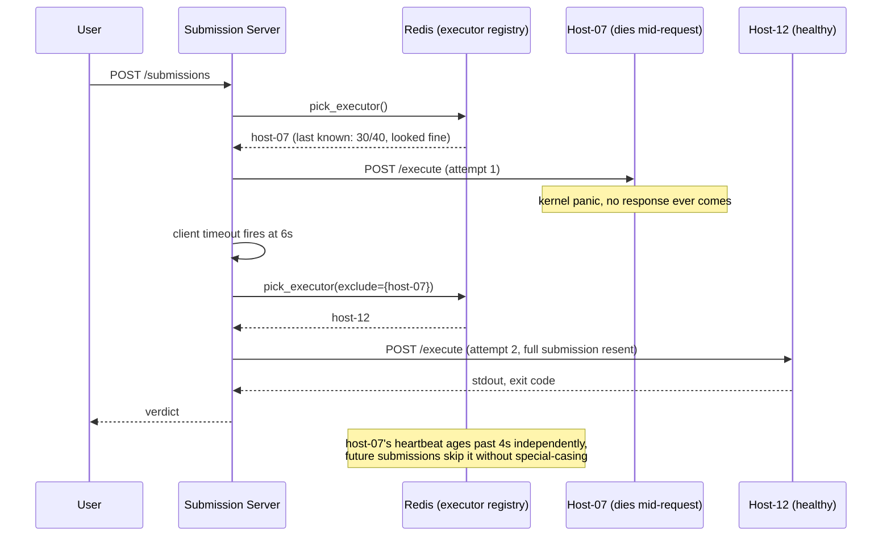
```mermaid
sequenceDiagram
    participant U as User
    participant S as Submission Server
    participant Reg as Redis (executor registry)
    participant Dead as Host-07 (dies mid-request)
    participant Alive as Host-12 (healthy)

    U->>S: POST /submissions
    S->>Reg: pick_executor()
    Reg-->>S: host-07 (last known: 30/40, looked fine)
    S->>Dead: POST /execute (attempt 1)
    Note over Dead: kernel panic, no response ever comes
    S->>S: client timeout fires at 6s
    S->>Reg: pick_executor(exclude={host-07})
    Reg-->>S: host-12
    S->>Alive: POST /execute (attempt 2, full submission resent)
    Alive-->>S: stdout, exit code
    S-->>U: verdict
    Note over Reg: host-07's heartbeat ages past 4s independently,<br/>future submissions skip it without special-casing
```

## CURRENT STATE — V4

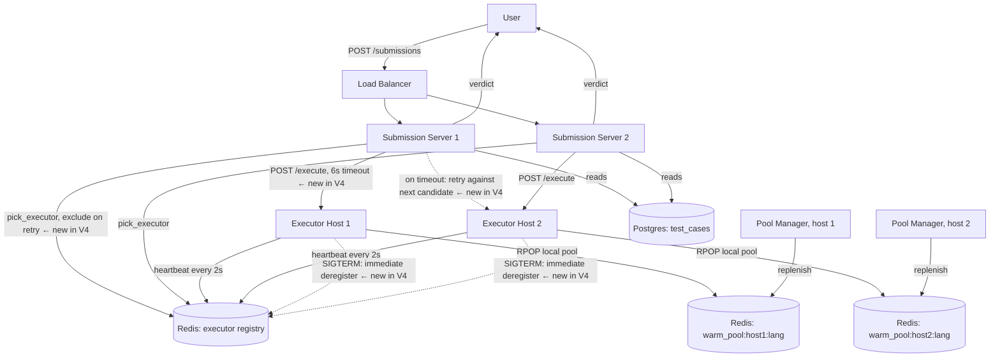
```mermaid
graph TD
    User[User] -->|POST /submissions| LB[Load Balancer]
    LB --> S1[Submission Server 1]
    LB --> S2[Submission Server 2]
    S1 -->|pick_executor, exclude on retry ← new in V4| Reg[("Redis: executor registry")]
    S2 -->|pick_executor| Reg
    S1 -->|POST /execute, 6s timeout ← new in V4| E1[Executor Host 1]
    S1 -.->|on timeout: retry against next candidate ← new in V4| E2[Executor Host 2]
    S2 -->|POST /execute| E2
    E1 -->|RPOP local pool| RedisPool1[("Redis: warm_pool:host1:lang")]
    E2 -->|RPOP local pool| RedisPool2[("Redis: warm_pool:host2:lang")]
    PM1[Pool Manager, host 1] -->|replenish| RedisPool1
    PM2[Pool Manager, host 2] -->|replenish| RedisPool2
    E1 -->|heartbeat every 2s| Reg
    E2 -->|heartbeat every 2s| Reg
    E1 -.->|SIGTERM: immediate deregister ← new in V4| Reg
    E2 -.->|SIGTERM: immediate deregister ← new in V4| Reg
    S1 -->|reads| DB[(Postgres: test_cases)]
    S2 -->|reads| DB
    S1 -->|verdict| User
    S2 -->|verdict| User
```

**Flows:**

1. **Submit path, happy case:** unchanged from V3 — pick least-loaded live executor, delegate, get result, diff, return verdict.

2. **Submit path, executor failure (new this version):** Submission Server's own request-level timeout (6s) fires independent of registry staleness → Submission Server excludes the failed host and retries the *full* submission fresh against the next-best candidate → registry staleness (now 4s) separately and asynchronously stops routing *future, unrelated* submissions to the dead host, once its heartbeat ages out.

3. **Graceful shutdown path (new):** an executor receiving `SIGTERM` (planned deploy/scale-down) immediately deletes its own registry key before going down, so it's removed from routing consideration instantly rather than waiting out the staleness window — zero failed requests for planned exits.

4. **Pool replenishment path:** unchanged since V2/V3 — per-host, local, background.

5. **Test case read path:** unchanged since V0.

## Interviewer follow-ups

**Q: "Why retry the whole submission instead of trying to somehow resume it on another host?"**
A: A container's execution state — its process, memory, file descriptors — is tied to the specific kernel instance it's running on; there's no cheap way to snapshot and resume that on a different physical host with plain containers. Re-running from scratch is more expensive per-retry, but it's actually simple and correct, versus building a resume mechanism (like microVM live migration) that's real added complexity for a failure mode that's rare in the first place.

**Q: "What if the response was actually generated successfully, but got lost on the way back to the Submission Server — doesn't retrying now double-execute the code?"**
A: Correct catch, and it's a real gap here — if the code has side effects (which, for a code judge, ideally it shouldn't, since we run with `--network=none` and a throwaway filesystem), a blind retry is safe. But this is exactly the idempotency concern from the broader failure-handling checklist, and it's worth tagging as unfinished rather than pretending V4 fully closes it.

## Recap

| Concept | The Insight |
|---|---|
| Registry staleness vs. client timeout | Two different jobs — staleness stops routing *future* work to a dead host; client timeout is what saves the *current* request, and it has to be independent of the registry |
| "Detection can't come from the dying host" | A dead host can't self-report its own death — Pool Manager or heartbeat logic on that host dies with it; detection must be external |
| No resume, only retry-from-scratch | Containers can't be cheaply migrated mid-execution with plain Docker — accept the cost of re-running rather than build state transfer |
| Graceful vs. hard failure | Two different mechanisms for two different causes — deregister-on-SIGTERM for planned exits, heartbeat timeout for unplanned crashes |
| Retry safety gap | Retrying blind assumes the first attempt never actually succeeded — true here since executions are side-effect-free, but worth naming as an idempotency assumption, not a given |

**One-breath interview line:** *"If asked what happens when an executor dies mid-submission: a heartbeat-based registry is too slow to save work already in flight there, so the fix is a client-side timeout on the Submission Server that fires independently and retries the whole submission fresh against a different live host, while the registry's only real job is making sure future, unrelated submissions stop getting routed to the dead one."*

Next up: we've been treating Redis (both the warm pool and the executor registry) as if it just always works — time to ask what happens when Redis itself is the thing that goes down.

---

## V5 — Break It: The Single Redis Instance Dies

Right now, both the warm pool state (`warm_pool:host-07:python3.11`) and the executor registry (`executor:host-07`) live on one Redis instance. We've been treating it as ambient infrastructure. Let's actually break it.

At 2:14:00, that Redis box's process crashes — OOM, disk issue, doesn't matter which. Every Submission Server's next call to `pick_executor()` — the `redis.scan_iter("executor:*")` from V3 — throws a connection error, immediately, not after some graceful degradation.

There's no fallback here. We didn't build one. Every single submission platform-wide fails at once: not "slow," not "degraded for the unlucky few" like the executor-death case in V4 — completely dead, for everyone, until someone manually restarts Redis and every executor host re-registers itself from a heartbeat that hasn't fired since the crash. If heartbeats are every 2s, worst case that's a couple seconds of blindness once Redis comes back, but the outage itself — however long Redis is down — is total.

This is a different kind of failure than V4. In V4, one executor died and we had a plan: exclude it, retry elsewhere, keep serving everyone else. Here, the thing that died is the coordination layer everyone depends on to find *any* executor. There's no "elsewhere" to retry against, because the retry logic itself needs Redis to pick a candidate.

> **Dev A:** "Let's just run a second Redis instance and have the app write to both."
> **Dev B:** "Which one do we read from if they disagree? And who tells the app which one is 'primary' right now if the first one dies — the app can't just guess."

That's the actual shape of the problem: it's not "run two copies," it's "how does the system agree on which copy is authoritative, and how does everyone find out when that changes."

## Solve It

**Should we even add read replicas here — is it justified?** First, be honest about the read:write ratio for this specific data. The executor registry gets written every 2 seconds by every host (heartbeat) and read once per incoming submission by whichever Submission Server is routing it. At our target load (roughly one submission routing decision per request, heartbeats fixed regardless of traffic), reads roughly track submission QPS while writes are flat and low — at 800 QPS peak, reads dramatically outnumber writes. That ratio does justify replicas for *read scaling*. But that's not actually our problem right now — our problem is a single point of *failure*, not read throughput. So the real question isn't "do we need replicas for load," it's "do we need replicas for availability," and the answer to that is unconditionally yes regardless of read:write ratio, because right now there is exactly one copy of this data anywhere.

**Sync, async, or semi-sync replication — and what does each cost?**

Plain language first: replication means a second Redis instance keeps a copy of the first one's data, updated as writes happen. The question is *when* a write is considered "done" — before or after the replica has it.

- **Synchronous** — primary waits for the replica to confirm it has the write before telling the client "success." Guarantees the replica is never behind, but every write now pays the network round-trip to the replica, and if the replica is slow or unreachable, writes stall.
- **Asynchronous** — primary confirms the write immediately, ships it to the replica in the background. Fast, but there's a window — milliseconds, usually — where the replica is behind the primary. If the primary dies in that window, whatever hadn't shipped yet is gone.
- **Semi-synchronous** — primary waits for *at least one* replica to acknowledge (not all), then confirms. A middle ground: bounded staleness risk, without paying for every replica's round-trip.

**Which fits our data?** Here's the concrete case for staleness actually mattering: if we lose the last 100ms of heartbeat writes when the primary fails over, worst case a Submission Server briefly thinks a host has slightly stale load numbers (12 containers instead of 13) for one routing decision. That's a rounding error, not a correctness bug — nobody double-books a seat, nobody loses money. Compare that to, say, a payments ledger, where losing 100ms of writes on failover means losing a transaction record. This data's mutability profile — high-churn, short-lived, self-correcting every 2 seconds anyway — means **async replication is the right choice, not synchronous.** Paying a network round-trip on every heartbeat write, for data that's stale again in 2 seconds regardless, buys us nothing.

**How many replicas, and how do we fail over?** This needs a name-checked, well-known mechanism rather than us hand-rolling leader election: **Redis Sentinel**. Plain-language version — a small set of separate watcher processes (typically 3, for quorum) continuously ping the Redis primary. If a majority of them agree it's unreachable, they promote one replica to be the new primary and tell every connected client "the primary moved, here's the new address." We run 1 primary + 2 replicas, with 3 Sentinel processes doing the watching.

| Approach | Data loss on failover | Write latency cost | Complexity |
|---|---|---|---|
| Single instance (today) | Total (outage until manual fix) | None | Lowest, but zero availability |
| Sync replication, no auto-failover | None | High (every write waits) | Medium, still needs manual promotion |
| Async replication + Sentinel auto-failover | Small window (sub-second, self-correcting data) | None | Medium — 3 extra processes to run |
| Redis Cluster (sharded + replicated) | Small window | None | High — full resharding model, overkill at our data volume |

We land on **async replication with Sentinel-managed automatic failover**. Redis Cluster is the wrong tool here — it's built for sharding Redis itself across many nodes when *data volume* outgrows one box, and our registry/pool data is small (a few KB per host, not gigabytes); we don't have a Redis-capacity problem, we have an availability problem, and Sentinel solves exactly that without the operational weight of full clustering.

✅ **What we gained:** Redis dying is no longer a total-outage event. Sentinel detects the primary's failure (via the same style of heartbeat/quorum logic we already used for executors — same pattern, different layer) and promotes a replica automatically, typically within a few seconds, without a human paged at 3am to restart a process.

⚠️ **What we gave up / new problem created:** During the failover window itself — Sentinel noticing, agreeing, promoting, and clients reconnecting to the new primary — Submission Servers still see errors for a few seconds. We haven't made Redis unbreakable, we've made its downtime measured in seconds instead of "until someone notices the page." We've also added operational surface: 2 more Redis processes and 3 Sentinel processes to run, monitor, and reason about.

❌ **What we considered and rejected:**
- **Synchronous replication** — rejected because this data's staleness tolerance is high (self-corrects every 2s anyway) and paying round-trip latency on every heartbeat write, for every host, at scale, is a real throughput cost for zero real benefit.
- **Redis Cluster** — rejected as solving a different problem (data-volume sharding) than the one we have (availability); adds resharding complexity we'd never actually need at this data size.
- **Manual failover (page a human, restart Redis, point everyone at it)** — rejected as unacceptable for anything in the interactive request path; minutes of total outage during a live contest is a real product failure, not an edge case.

## Implement It

**Topology:** 1 Redis primary, 2 async replicas, 3 Sentinel processes (odd number, for majority quorum — same reason juries and voting systems use odd numbers).

Sentinel config (each of the 3 Sentinel processes runs this):

```
sentinel monitor judge-redis 10.0.1.10 6379 2
sentinel down-after-milliseconds judge-redis 3000
sentinel failover-timeout judge-redis 10000
sentinel parallel-syncs judge-redis 1
```

`monitor judge-redis 10.0.1.10 6379 2` — watch the primary at that address, and require agreement from at least 2 of the 3 Sentinels before declaring it down (quorum, so one Sentinel with a flaky network link can't trigger a false failover alone).
`down-after-milliseconds 3000` — a Sentinel calls the primary "subjectively down" after 3s of no response.
`failover-timeout 10000` — how long to wait before retrying a failover attempt if the first one doesn't complete.

**Submission Server side** — instead of connecting to a hardcoded Redis IP, it connects through the Sentinel layer, which always knows the current primary:

```python
from redis.sentinel import Sentinel

sentinel = Sentinel([
    ("sentinel-1", 26379),
    ("sentinel-2", 26379),
    ("sentinel-3", 26379),
], socket_timeout=0.5)

redis_primary = sentinel.master_for("judge-redis", socket_timeout=0.5)
redis_replica = sentinel.slave_for("judge-redis", socket_timeout=0.5)
```

Writes (executor heartbeats, pool pushes) always go through `redis_primary`. Reads that can tolerate slight staleness (a Submission Server scanning `executor:*` to pick a candidate) can go through `redis_replica` to spread read load — this is the read-scaling benefit from the ratio discussion earlier, now actually realized, on top of the availability fix.

Failover sequence, concretely:

1. Primary at `10.0.1.10:6379` stops responding (crashed).
2. Each of the 3 Sentinels independently notices missed pings past the 3000ms threshold, marks it "subjectively down," and gossips this to the other Sentinels.
3. Once 2 of 3 agree (`quorum=2`), the primary is marked "objectively down."
4. Sentinels elect one of the 2 replicas (the one with the most up-to-date replication offset) to be promoted.
5. That replica runs `REPLICAOF NO ONE`, becoming the new primary. The other replica is reconfigured to replicate from it instead of the dead node.
6. Sentinels update their internal record of "who is primary" and start answering `sentinel.master_for(...)` calls with the new address.
7. Submission Servers' next `master_for()` call transparently gets the new primary's address — no code change, no restart, no manual DNS update.
8. Any heartbeat/pool writes that were in-flight to the old primary during the crash, and hadn't yet replicated (the async window), are lost — consistent with the trade-off we accepted above.

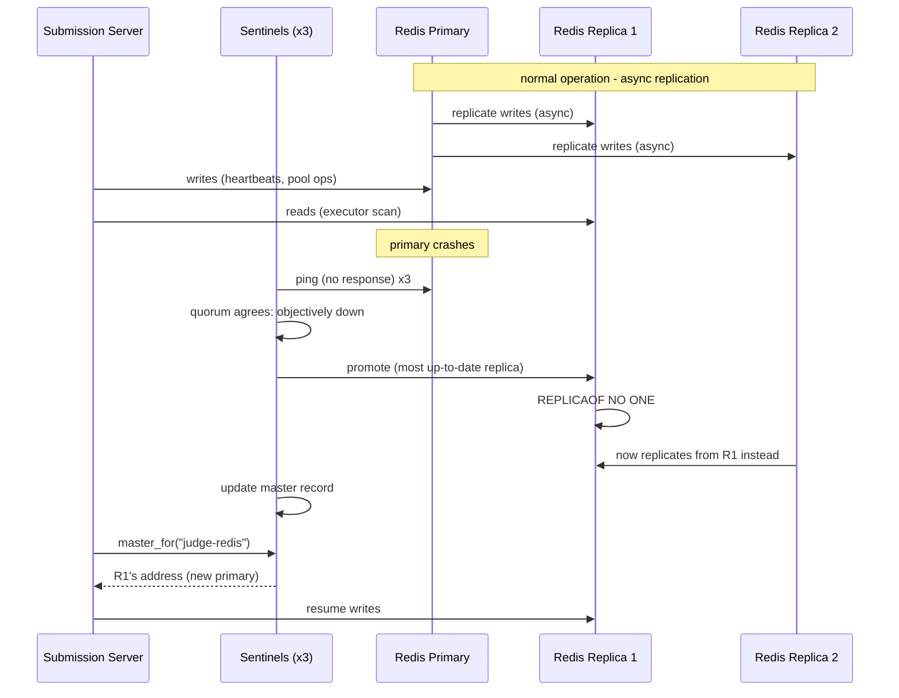
```mermaid
sequenceDiagram
    participant S as Submission Server
    participant Sent as Sentinels (x3)
    participant P as Redis Primary
    participant R1 as Redis Replica 1
    participant R2 as Redis Replica 2

    Note over P,R2: normal operation - async replication
    P->>R1: replicate writes (async)
    P->>R2: replicate writes (async)
    S->>P: writes (heartbeats, pool ops)
    S->>R1: reads (executor scan)

    Note over P: primary crashes
    Sent->>P: ping (no response) x3
    Sent->>Sent: quorum agrees: objectively down
    Sent->>R1: promote (most up-to-date replica)
    R1->>R1: REPLICAOF NO ONE
    R2->>R1: now replicates from R1 instead
    Sent->>Sent: update master record

    S->>Sent: master_for("judge-redis")
    Sent-->>S: R1's address (new primary)
    S->>R1: resume writes
```

## CURRENT STATE — V5

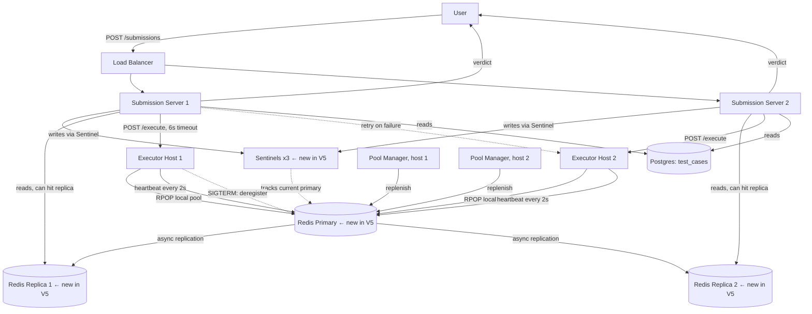
```mermaid
graph TD
    User[User] -->|POST /submissions| LB[Load Balancer]
    LB --> S1[Submission Server 1]
    LB --> S2[Submission Server 2]
    S1 -->|writes via Sentinel| Sent["Sentinels x3 ← new in V5"]
    S2 -->|writes via Sentinel| Sent
    Sent -.->|tracks current primary| RP[("Redis Primary ← new in V5")]
    RP -->|async replication| RR1[("Redis Replica 1 ← new in V5")]
    RP -->|async replication| RR2[("Redis Replica 2 ← new in V5")]
    S1 -->|reads, can hit replica| RR1
    S2 -->|reads, can hit replica| RR2
    S1 -->|POST /execute, 6s timeout| E1[Executor Host 1]
    S1 -.->|retry on failure| E2[Executor Host 2]
    S2 -->|POST /execute| E2
    E1 -->|RPOP local pool| RP
    E2 -->|RPOP local pool| RP
    PM1[Pool Manager, host 1] -->|replenish| RP
    PM2[Pool Manager, host 2] -->|replenish| RP
    E1 -->|heartbeat every 2s| RP
    E2 -->|heartbeat every 2s| RP
    E1 -.->|SIGTERM: deregister| RP
    S1 -->|reads| DB[(Postgres: test_cases)]
    S2 -->|reads| DB
    S1 -->|verdict| User
    S2 -->|verdict| User
```

**Flows:**

1. **Submit path, happy case:** unchanged in shape from V3/V4 — but every Redis interaction (executor registry lookups, warm pool pop) now goes through Sentinel-resolved connections rather than a hardcoded address, and reads may be served from a replica.

2. **Submit path, executor failure:** unchanged from V4 — client-side timeout, retry against next candidate.

3. **Redis primary failure (new this version):** Sentinels detect the dead primary via quorum, promote the most up-to-date replica automatically, and Submission Servers transparently resume against the new primary on their next call — no manual intervention, small async-replication-window data loss accepted as a known trade-off.

4. **Graceful executor shutdown path:** unchanged since V4.

5. **Pool replenishment path:** unchanged since V2/V3, now writing through Sentinel-resolved primary.

6. **Test case read path:** unchanged since V0 — separate store (Postgres), separate concern, not touched by this version.

## Interviewer follow-ups

**Q: "Why not just put the executor registry data in Postgres instead of Redis, since you're already worried about durability?"**
A: Wrong tool for the access pattern — this data is overwritten every 2 seconds per host and scanned on every routing decision; that's a key-value, high-churn workload, not a relational one. Postgres would work but adds write amplification (WAL, indexes) for data that's intentionally short-lived and self-correcting. We're solving *availability*, not durability — we don't actually need this data to survive forever, we need it to survive a single-process crash.

**Q: "What if all 3 Sentinels themselves are on hosts that go down together — say, one bad rack?"**
A: That's a real gap if all 3 are colocated — the fix is spreading Sentinels (and the Redis instances) across separate failure domains (different racks or availability zones), so a single rack-level event can't take out the whole quorum. This is the seed of the multi-region conversation, which we'll get to properly later.

## Recap

| Concept | The Insight |
|---|---|
| Coordination layer as SPOF | A registry that everyone depends on to find capacity is itself a capacity dependency — its failure mode is worse than any single executor dying |
| Read:write ratio doesn't drive this decision | Replicas here are justified by availability, not by the read-heavy ratio — the ratio is a bonus (read scaling), not the reason |
| Async replication, deliberately | Chosen because this specific data self-corrects every 2s — sync replication's latency cost buys nothing for data this disposable |
| Sentinel quorum | Same heartbeat-and-quorum pattern as the executor registry, one layer down — requiring 2-of-3 agreement prevents one flaky watcher from triggering a false failover |
| Failover isn't free | A few seconds of errors during promotion, and a small async-window data loss, are the accepted cost — not eliminated, just bounded |

**One-breath interview line:** *"If asked what happens when your coordination store dies: a single Redis instance holding your executor registry is a hidden single point of failure even if every other tier is redundant, so you run it as a primary with async replicas behind Sentinel-managed automatic failover, accepting a small, self-correcting window of data loss in exchange for turning a total outage into a few seconds of disruption."*

Next up: we've made routing, execution, and coordination resilient — next is asking whether we even need to cache anything on the read-heavy paths (like fetching test cases), or whether that's a reflex we haven't actually justified yet.

---

## V6 — Break It: Every Submission Hits Postgres for the Same Rows

Let's look at what the test-case read path actually does, which hasn't changed since V0: every single submission runs `SELECT * FROM test_cases WHERE problem_id = ?`, against Postgres, every time.

Here's the access pattern underneath that query. A popular contest problem might have, say, 15 test cases, and during a contest, get hit by hundreds of submissions per minute — but those 15 rows themselves basically never change once the contest starts. Nobody is editing test cases mid-contest. We are running an identical `SELECT` against identical rows, thousands of times, for data that changes maybe once, at problem-creation time, and then sits frozen for the problem's entire lifetime.

Put a number on it: at 800 QPS peak, if even 30% of that traffic clusters onto the 10 most popular problems in an active contest (which is realistic — contests have a handful of problems everyone's solving at once), that's roughly 240 QPS all reading the exact same 10 sets of rows from Postgres, over and over, for data with an effective write rate of approximately zero during that whole window.

This isn't a broken system yet — Postgres can serve 240 QPS of simple indexed reads without breaking a sweat. But it's a real cost paid for nothing: every one of those reads does index lookup + disk/buffer-pool work + network round-trip, for data that was already known, unchanged, at the *previous* read a second ago. And it's a growing cost — the moment we's talking about launching a much bigger contest, or a public platform with 10x this traffic, this exact same query is the first thing to become a real bottleneck, and it'll be a bottleneck for work that was completely avoidable.

## Solve It

**Is a cache actually justified here?** Yes, clearly — check the access pattern first rather than reflexively reaching for one. Test cases are written once (problem creation) and read enormously more often (every submission against that problem, indefinitely). That's about as strong a caching case as exists: high read:write ratio, and the data doesn't just change slowly, it's essentially immutable once published.

**What layer?** Plain language: caching can happen at several points between the user and the database, each catching the request at a different distance from where the data lives.

- **CDN** — caches responses at the edge, physically close to users, before the request even reaches our infrastructure. Makes sense for content that's identical for every user and rarely changes, like static assets or public pages.
- **Client-side cache** — the user's own device remembers a previous response. Not applicable here; the client never has test cases in the first place — those are a grading-internal detail, never sent to the user.
- **Application-layer cache** (what we mean here) — the Submission Server checks a fast store (Redis) before querying Postgres.
- **DB-layer cache** — Postgres's own buffer pool/shared_buffers already does this at the page level. It helps, but it's per-database-instance and not something we control granularly (like "cache this problem's rows for exactly this long").

**Is a CDN warranted?** No — deliberately calling this out rather than reflexively adding one. Test cases aren't user-facing content served over HTTP to browsers; they're an internal lookup the Submission Server does against its own datastore. A CDN caches responses to *requests*, typically public ones — this is an internal service-to-service data fetch, so a CDN is the wrong tool entirely, not just unnecessary.

So: **application-layer cache**, Redis (same technology already in our stack for the warm pool and registry, though logically a separate concern/keyspace — this is just "read-through cache," a different Redis use case than the ephemeral coordination data from V3-V5).

**What's cached, and what's the invalidation strategy?** We cache the full test-case set for a `problem_id`, as one blob, since they're always read together (a submission needs *all* test cases for the problem, never a subset).

Invalidation candidates:

**Option 1 — TTL-based expiry (e.g., cache for 1 hour, then naturally refetch from Postgres).** Simple, self-healing (an edit eventually reflects, at worst after 1 hour). Breaks: a problem edited mid-contest — say a test case had a bug and got fixed — could keep serving the *old*, buggy test cases for up to an hour, silently giving wrong verdicts to everyone in that window.

**Option 2 — Explicit invalidation on write (admin edits a problem → the write path deletes/updates the cache key immediately).** Correctness is immediate — no stale window at all. Breaks: only as reliable as remembering to wire it into every code path that can mutate test cases; if someone adds a new "bulk import test cases" admin tool later and forgets to invalidate, you get silent staleness with no natural expiry to save you.

**Option 3 — Both together: explicit invalidation as the primary mechanism, with a TTL as a safety net.** Correctness is immediate in the common case, and even if some write path forgets to invalidate, staleness is capped at the TTL rather than permanent.

| Approach | Staleness window | Correctness under a missed invalidation | Complexity |
|---|---|---|---|
| TTL only | Up to full TTL, every time | N/A — always eventually correct, just slow | Lowest |
| Explicit invalidation only | Zero, when wired correctly | Permanent staleness if a write path is missed | Medium |
| Explicit invalidation + TTL safety net | Zero in common case, bounded worst case | Self-healing even if a path is missed | Medium |

We take **option 3**. Given that stale test cases mean wrong verdicts for real users — this is a correctness-sensitive cache, not a "slightly slow page" cache — we want immediate invalidation as the primary path, and a TTL purely as a backstop against our own future mistakes (a new admin tool that forgets to invalidate), not as the main mechanism.

✅ **What we gained:** ~240 QPS (in our earlier estimate) of repeated, identical Postgres reads collapse into cache hits — Postgres now only sees a read for a given problem's test cases once per TTL window (or once per edit), not once per submission. Submission latency also improves slightly, since a Redis GET is faster than a Postgres round-trip.

⚠️ **What we gave up / new problem created:** We now have two sources of truth for the same data (Postgres is authoritative, Redis is a copy), and every write path to test cases has to remember to keep them in sync — this is the classic cache-invalidation discipline problem, and if we ever add a bulk-edit or admin-import feature later, we have to remember this rule applies there too.

❌ **What we considered and rejected:**
- **TTL-only, no explicit invalidation** — rejected because staleness directly causes wrong verdicts, which is a correctness bug for a code judge, not a UX inconvenience; a 1-hour window of "sometimes wrong grading" is not acceptable.
- **CDN caching** — rejected; this is internal service-to-service data, not public HTTP content, so a CDN doesn't apply.
- **Caching individual test cases as separate keys instead of one blob per problem** — rejected as unnecessary complexity; every submission needs the *entire* set, never a partial fetch, so there's no benefit to splitting them and it just adds more keys to manage and invalidate.

## Implement It

Cache key format: `testcases:{problem_id}`, value is the full JSON array, so one GET retrieves everything needed for a submission.

```
SET testcases:two-sum '[{"input":"2 7 11 15\n9","expected_output":"0 1"}, {"input":"3 2 4\n6","expected_output":"1 2"}]' EX 3600
```

`EX 3600` — the TTL safety net, one hour, chosen because problem edits are rare and this just bounds worst-case staleness from a missed invalidation, not something we expect to actually rely on in normal operation.

Read path, on the Submission Server (replacing the plain `SELECT` from V0):

```python
def get_test_cases(problem_id):
    cached = redis_replica.get(f"testcases:{problem_id}")
    if cached:
        return json.loads(cached)

    rows = postgres.query(
        "SELECT input, expected_output FROM test_cases WHERE problem_id = %s",
        (problem_id,)
    )
    redis_primary.set(f"testcases:{problem_id}", json.dumps(rows), ex=3600)
    return rows
```

Write path (admin edits/adds test cases — this now has an explicit invalidation step it didn't need before):

```python
def update_test_cases(problem_id, new_cases):
    postgres.execute(
        "DELETE FROM test_cases WHERE problem_id = %s", (problem_id,)
    )
    postgres.execute_many(
        "INSERT INTO test_cases (problem_id, input, expected_output) VALUES (%s, %s, %s)",
        [(problem_id, tc["input"], tc["output"]) for tc in new_cases]
    )
    redis_primary.delete(f"testcases:{problem_id}")  # explicit invalidation, new in V6
```

Who writes `testcases:{problem_id}`: the Submission Server, lazily, the first time any submission needs a problem's test cases after a cache miss (cache-aside pattern) — and the Admin/problem-setup path, which deletes the key outright on any edit rather than trying to update it in place (simpler and safer than computing a partial update).
Who reads it: every Submission Server, on every submission, before falling back to Postgres.
Where it lives: same Redis primary/replica pair from V5 — this is a different keyspace (`testcases:*` vs. `warm_pool:*` / `executor:*`) but the same physical instances, since none of these are large enough individually to warrant separate infrastructure.

Full flow for one submission's test-case lookup:

1. Submission Server needs test cases for `problem_id="two-sum"`.
2. `GET testcases:two-sum` against the Redis replica (read traffic, same replica-routing choice as V5, since a few seconds of staleness here is fine given the TTL/invalidation design).
3. **Branch: cache hit** → parse JSON, use directly, no Postgres touched at all.
4. **Branch: cache miss** (first request after an edit, first request ever, or TTL expired) → query Postgres for that `problem_id` → write result into Redis (through the primary, since this is a write) with a 1-hour TTL → return the rows.
5. Separately, whenever an admin updates test cases for a problem: Postgres is updated first, then the corresponding `testcases:{problem_id}` key is explicitly deleted — the *next* read after this naturally falls into the cache-miss branch and repopulates from the now-current Postgres data.

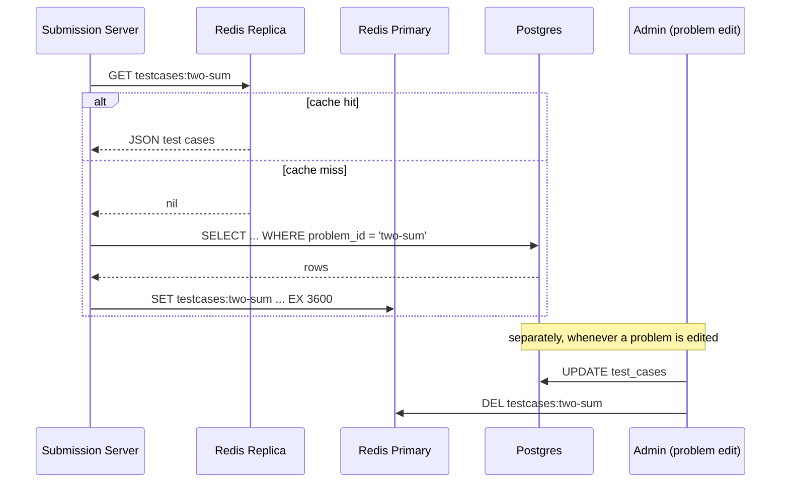
```mermaid
sequenceDiagram
    participant S as Submission Server
    participant RR as Redis Replica
    participant RP as Redis Primary
    participant PG as Postgres
    participant A as Admin (problem edit)

    S->>RR: GET testcases:two-sum
    alt cache hit
        RR-->>S: JSON test cases
    else cache miss
        RR-->>S: nil
        S->>PG: SELECT ... WHERE problem_id = 'two-sum'
        PG-->>S: rows
        S->>RP: SET testcases:two-sum ... EX 3600
    end
    Note over A,PG: separately, whenever a problem is edited
    A->>PG: UPDATE test_cases
    A->>RP: DEL testcases:two-sum
```

## CURRENT STATE — V6

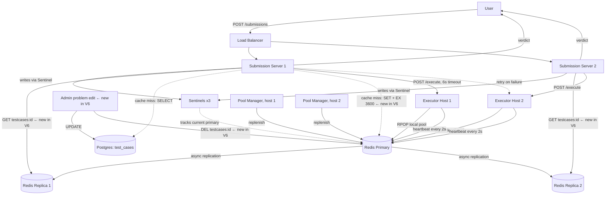
```mermaid
graph TD
    User[User] -->|POST /submissions| LB[Load Balancer]
    LB --> S1[Submission Server 1]
    LB --> S2[Submission Server 2]
    S1 -->|writes via Sentinel| Sent[Sentinels x3]
    S2 -->|writes via Sentinel| Sent
    Sent -.->|tracks current primary| RP[(Redis Primary)]
    RP -->|async replication| RR1[(Redis Replica 1)]
    RP -->|async replication| RR2[(Redis Replica 2)]
    S1 -->|GET testcases:id ← new in V6| RR1
    S2 -->|GET testcases:id ← new in V6| RR2
    S1 -.->|cache miss: SELECT| DB[(Postgres: test_cases)]
    S1 -.->|cache miss: SET + EX 3600 ← new in V6| RP
    Admin["Admin problem edit ← new in V6"] -->|UPDATE| DB
    Admin -->|DEL testcases:id ← new in V6| RP
    S1 -->|POST /execute, 6s timeout| E1[Executor Host 1]
    S1 -.->|retry on failure| E2[Executor Host 2]
    S2 -->|POST /execute| E2
    E1 -->|RPOP local pool| RP
    E2 -->|RPOP local pool| RP
    PM1[Pool Manager, host 1] -->|replenish| RP
    PM2[Pool Manager, host 2] -->|replenish| RP
    E1 -->|heartbeat every 2s| RP
    E2 -->|heartbeat every 2s| RP
    S1 -->|verdict| User
    S2 -->|verdict| User
```

**Flows:**

1. **Submit path, happy case (changed this version):** User's request hits a Submission Server → server picks a least-loaded executor via the registry (unchanged since V3-V5) → delegates execution over HTTP (unchanged) → **test case lookup now checks Redis first (`testcases:{problem_id}`), only falling back to Postgres on a miss, then populating the cache** → diffs output → returns verdict.

2. **Submit path, executor failure:** unchanged since V4 — client timeout, retry against next candidate.

3. **Redis primary failure:** unchanged since V5 — Sentinel-managed automatic failover.

4. **Problem edit path (new this version):** an admin updating test cases for a problem writes to Postgres first, then explicitly deletes the corresponding `testcases:{problem_id}` cache key — ensuring the next read repopulates fresh data rather than serving stale cases.

5. **Graceful executor shutdown, pool replenishment:** unchanged since V4/V2.

## Interviewer follow-ups

**Q: "What if the DEL on problem edit fails — say Redis is mid-failover at that exact moment?"**
A: This is exactly why the TTL safety net exists — if the explicit invalidation silently fails, the stale entry self-heals within at most an hour, rather than staying wrong forever. It's a real gap (an admin editing test cases during a Redis failover could get up to an hour of stale grading), but it's a bounded, known gap rather than an unbounded one — could tighten the TTL further if that risk profile matters more than we've assumed.

**Q: "Why cache-aside (check cache, fall back to DB, populate) instead of write-through (every Postgres write also immediately writes the cache)?"**
A: Cache-aside fits our access pattern better — most cache population happens from *reads* (a submission is the trigger), not from writes, since problems are created once and read constantly. Write-through would mean every problem creation eagerly warms the cache even for problems nobody's actively solving yet, which is wasted work; cache-aside only ever caches things that are actually being requested.

## Recap

| Concept | The Insight |
|---|---|
| Justify the cache first | Test cases are read astronomically more than written and barely ever change — about as strong a caching case as exists; don't skip this check even when a cache feels obviously right |
| CDN vs. app cache | A CDN caches public HTTP responses near users; this is an internal service-to-datastore lookup, so CDN doesn't apply here at all |
| Correctness-sensitive caching | Stale test cases mean wrong verdicts, not just a slow page — that's why explicit invalidation is primary and TTL is only a backstop, not the reverse |
| Cache-aside vs. write-through | Cache-aside only caches what's actually being read; write-through would eagerly warm data nobody asked for yet |
| Two sources of truth | Adding a cache means every future write path to that data has to remember the invalidation step — a discipline cost, not a one-time cost |

**One-breath interview line:** *"If asked whether you'd cache test case data: yes, because it's written once at problem creation and read on every single submission against that problem — but since stale test cases mean wrong verdicts, not just a slow response, invalidation has to be explicit on every write path, with a TTL only as a safety net for whatever future write path forgets to invalidate."*

Next up: we've built one contest venue really well — the natural next break is what happens when this platform needs to serve users on the other side of the world, and that's where multi-region ownership and cross-region conflicts enter.

---

## V7 — Break It: Latency From the Other Side of the World

Everything so far — Submission Servers, Executors, Redis, Postgres — sits in one region, say `us-east`. Let's trace what happens to a user in Mumbai.

Raj submits code. The request physically travels from Mumbai to `us-east` — that round-trip alone, just network transit over that distance, is commonly in the 200-250ms range each way before we've done a single unit of work. Then the actual submission flow runs: route to an executor, run the code, diff against test cases, return the verdict — call it another 500ms-1s of real work we've already built.

Total: the same submission that feels instant for a user in Virginia takes 1.5-2+ seconds for Raj, purely from geography, before our system has done anything wrong. Now put a live coding contest on top of that — hundreds of Indian and European users all paying this same tax simultaneously, while US users don't. That's not a bug we introduced; it's physics we've been ignoring by only scoping for one region.

> **Dev A:** "Let's just stand up the whole stack in `ap-south` too — Submission Servers, Executors, Redis, Postgres, all of it, mirrored."
> **Dev B:** "Mirrored how? If Raj's submission gets written to a `submissions` table in `ap-south` and someone in the US reads the leaderboard from `us-east`'s copy, which one is right, and how do the two ever agree?"

That's the actual question multi-region always comes down to: it's not "can we run copies elsewhere," it's "who is allowed to write what, and what happens when two regions' writes could conflict."

## Solve It

**Step one: figure out what actually needs multi-region treatment, because not everything does.**

Look at our data by mutability and access pattern, the same lens we used for caching:

- **Test cases** — written rarely (problem creation/edit), read constantly, already cached. This is a natural candidate for read replicas in every region — nobody's fighting over who gets to edit "two-sum"'s test cases from two continents simultaneously.
- **Executor registry / warm pool state** — this is inherently per-region already, almost by accident. A heartbeat from an `ap-south` executor host is meaningless to a `us-east` Submission Server; you'd never route a Mumbai user's code to a Virginia executor for latency reasons alone. This data doesn't need cross-region replication at all — it needs to exist independently, per region.
- **Submissions themselves** (the record of "Raj submitted this code, got this verdict, at this time") — each submission is created by exactly one user, graded once, done. Two regions are never going to *concurrently edit the same submission* — there's no realistic scenario where Raj's submission in Mumbai and some other write in Virginia touch the same row.

That last point is the important one: **this system has almost no genuine multi-writer conflict surface.** Submissions are create-once, immutable-after-verdict records, naturally owned by whichever region created them. This is very different from something like collaborative document editing, where two people in two regions really can edit the same paragraph at the same instant.

**So: how is write ownership decided per region?** Simplest correct answer for this system — **each submission is owned by the region it was created in.** Raj's submission is created, executed, and graded entirely within `ap-south`; a US user's submission is created, executed, and graded entirely within `us-east`. There's no cross-region write path for the same submission, ever, because a submission's whole lifecycle is short and local.

This is a **single-writer-per-entity** model, not a single-writer-for-the-whole-system model — it's not that one region owns *everything*, it's that each individual submission's region is fixed at creation and never contested.

**What data does need to actually sync across regions, then?**

1. **Test cases / problem data** — written in one "home" region (wherever the admin tooling lives, say `us-east`), read everywhere. This is a read-replica story: `us-east` Postgres is the primary, `ap-south` gets an async read replica (same async-vs-sync reasoning as V5 — test cases changing mid-contest is rare, and a few seconds of replication lag is immaterial next to save round-trip latency for every read).

2. **Submission records, for global views** (e.g., a global leaderboard, or an admin dashboard showing all recent submissions across regions) — these need to be aggregated somewhere, but note this is a **read-side aggregation problem, not a write-conflict problem.** Nobody's editing the same submission from two regions; we just need a way to see all of them together.

**Candidate approaches for the "get a global view" problem:**

**Option 1 — Every region writes submissions to one global, cross-region database.** Optimizes: single source of truth, trivial to query globally. Breaks: every submission write now pays cross-region latency, which defeats the entire point of going multi-region in the first place — we'd be back to Raj paying the Mumbai-to-Virginia round trip, just relocated to the write path instead of the whole request.

**Option 2 — Each region writes locally; a background process streams/replicates submission records to every other region asynchronously (or to one aggregating store).** Optimizes: local writes stay fast (the actual goal), global view exists with acceptable lag. Breaks: the global leaderboard is now eventually consistent — a submission might take a few seconds to appear in the aggregate view. For this system, that's a fine trade: nobody needs a real-time global leaderboard to be linearizable to the millisecond.

| Approach | Write latency for the user | Global view freshness | Conflict risk |
|---|---|---|---|
| Single global DB, cross-region writes | High — pays cross-region cost on every write | Immediate | None (single copy) |
| Local write + async cross-region stream | Low — local only | Eventually consistent, seconds of lag | None — submissions aren't edited, so streaming them is safe |

We take **local write + async stream**, using the same CDC-style pattern already established for reliable event propagation in other parts of this prep (Debezium/outbox-style) — each region's Postgres submissions table streams inserts to a shared analytics/aggregation store, without submission writes ever leaving their home region synchronously.

✅ **What we gained:** Every user's submission is created, executed, and graded entirely within their nearest region — no cross-region round trip anywhere in the critical, latency-sensitive path. Raj's 1.5-2s tax disappears; he now pays roughly the same latency US users always had, just against `ap-south` infrastructure instead of `us-east`.

⚠️ **What we gave up / what new problem this creates:** A genuinely global, real-time, strongly-consistent view (e.g., "the leaderboard, exactly up to the second, across all regions") no longer exists — it's eventually consistent, lagging by however long the cross-region stream takes. We've also multiplied our operational footprint: a full stack (Submission Servers, Executors, Redis, Postgres replica) per region, each needing the same deployment, monitoring, and on-call coverage we built for one region.

❌ **What we considered and rejected:**
- **Single global database, all regions write to it directly** — rejected because it reintroduces exactly the cross-region write latency we're trying to eliminate; the whole point of multi-region is defeated if writes still cross oceans.
- **Multi-writer with conflict resolution (e.g., CRDTs, last-write-wins) on submission records** — rejected as solving a problem we don't have; submissions aren't concurrently edited by multiple regions, so there's no actual conflict to resolve. Reaching for CRDT machinery here would be over-engineering — that's the right tool for collaborative editing, not for immutable, single-owner records.
- **Synchronous cross-region replication for submissions (so every region always has an up-to-date copy immediately)** — rejected for the same reason sync replication was rejected in V5: it means every regional write waits on a cross-region round-trip, which is the exact latency cost we built this whole version to remove.

## Implement It

**Regional topology:** each region (`us-east`, `ap-south`, ...) runs a full independent stack — Submission Servers, Executor fleet, local Redis (primary + replicas + Sentinel from V5), and a local Postgres for that region's own `submissions` table.

**Test case replication** (read-only, cross-region):

```sql
-- ap-south's Postgres, configured as a logical replication subscriber
CREATE SUBSCRIPTION test_cases_sub
  CONNECTION 'host=us-east-pg.internal dbname=judge'
  PUBLICATION test_cases_pub;
```
`us-east` Postgres publishes changes to the `test_cases` table (and `problems` metadata); every other region subscribes, read-only. Admin edits always happen against `us-east` (the designated home for problem authoring); every other region sees the change within normal logical-replication lag (typically sub-second to a few seconds).

**Submission ownership — new column, made explicit rather than implicit:**

```sql
ALTER TABLE submissions ADD COLUMN home_region TEXT NOT NULL DEFAULT 'us-east';
```
Set at insert time to whichever region's Submission Server handled the request — this is what makes "each submission is owned by its creating region" a concrete, queryable fact instead of an assumption.

**Cross-region aggregation stream** (submissions → global view), reusing the outbox/CDC pattern:

```python
# Debezium-style connector on each region's Postgres,
# streaming inserts on `submissions` to a shared Kafka topic
{
  "topic": "global-submissions",
  "payload": {
    "op": "c",
    "after": {
      "submission_id": "sub_9f2a...",
      "user_id": "raj_123",
      "problem_id": "two-sum",
      "verdict": "AC",
      "home_region": "ap-south",
      "created_at": "2026-09-03T10:15:02Z"
    }
  }
}
```
Who writes: each region's own Debezium connector, tailing its local Postgres WAL — nobody's application code does this explicitly, it's change-data-capture, same mechanism as the payments-reliability session.
Who reads: a global aggregation consumer (feeding a leaderboard service or analytics store) subscribed to `global-submissions` across all regions' topics.
Where it lives: Kafka, one shared cluster (or region-local clusters with cross-region mirroring) — a new store class for this conversation; a durable, ordered log fits this "stream of immutable events from many sources into one consumer" pattern better than a database table would, since nobody's querying it by key, they're consuming it as a sequence.

**Routing users to their region** — DNS/GeoDNS or a global load balancer directs Raj's request to `ap-south`'s Submission Server tier based on his IP's geography, before any of our application logic runs at all. This is infrastructure-layer, not something the Submission Server itself decides.

Full flow for Raj's submission:

1. Raj's request hits GeoDNS, resolves to `ap-south`'s load balancer (not `us-east` — new in V7).
2. `ap-south` Submission Server picks a least-loaded `ap-south` executor via `ap-south`'s local Redis registry (unchanged mechanism from V3-V5, just regionally scoped).
3. Executor runs the code (unchanged since V1/V2).
4. Submission Server fetches test cases: `GET testcases:two-sum` against `ap-south`'s local Redis cache → on miss, reads from `ap-south`'s Postgres **read replica** of `test_cases` (new — previously this always went to the single Postgres instance).
5. Verdict computed, returned to Raj — entire round trip stayed within `ap-south`, no cross-region hop anywhere in this path.
6. Submission Server writes the submission record to `ap-south`'s local Postgres `submissions` table, with `home_region='ap-south'`.
7. Asynchronously, independent of Raj's request: `ap-south`'s Debezium connector picks up that new row from the WAL, publishes it to the `global-submissions` Kafka topic, where the global aggregation consumer eventually reflects it in any cross-region leaderboard/dashboard.

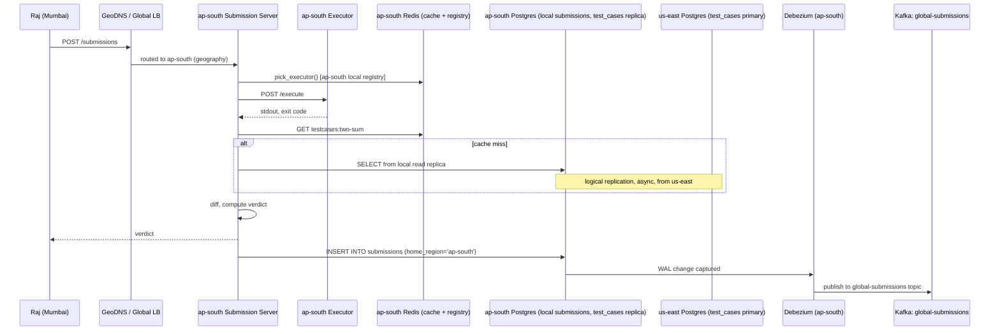
```mermaid
sequenceDiagram
    participant Raj as Raj (Mumbai)
    participant Geo as GeoDNS / Global LB
    participant S as ap-south Submission Server
    participant E as ap-south Executor
    participant R as ap-south Redis (cache + registry)
    participant PGa as ap-south Postgres (local submissions, test_cases replica)
    participant PGu as us-east Postgres (test_cases primary)
    participant D as Debezium (ap-south)
    participant K as Kafka: global-submissions

    Raj->>Geo: POST /submissions
    Geo->>S: routed to ap-south (geography)
    S->>R: pick_executor() [ap-south local registry]
    S->>E: POST /execute
    E-->>S: stdout, exit code
    S->>R: GET testcases:two-sum
    alt cache miss
        S->>PGa: SELECT from local read replica
        Note over PGu,PGa: logical replication, async, from us-east
    end
    S->>S: diff, compute verdict
    S-->>Raj: verdict
    S->>PGa: INSERT INTO submissions (home_region='ap-south')
    PGa->>D: WAL change captured
    D->>K: publish to global-submissions topic
```

## CURRENT STATE — V7

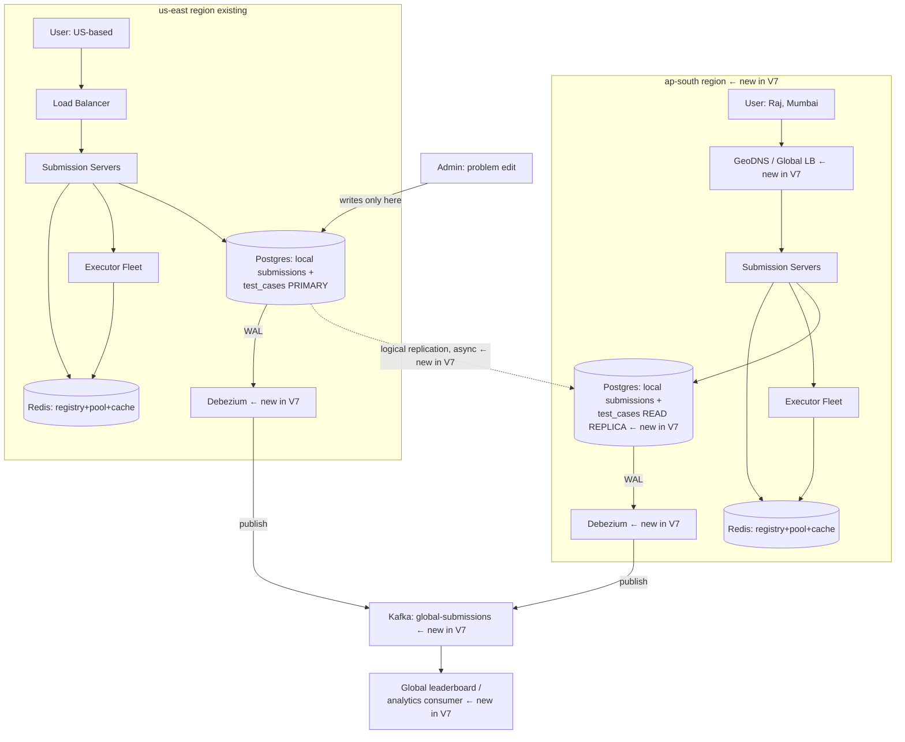
```mermaid
graph TD
    subgraph "ap-south region ← new in V7"
        Raj[User: Raj, Mumbai] --> GeoDNS[GeoDNS / Global LB ← new in V7]
        GeoDNS --> ASsub[Submission Servers]
        ASsub --> ASreg[(Redis: registry+pool+cache)]
        ASsub --> ASexec[Executor Fleet]
        ASexec --> ASreg
        ASsub --> ASpg[(Postgres: local submissions +<br/>test_cases READ REPLICA ← new in V7)]
        ASpg -->|WAL| ASdebz[Debezium ← new in V7]
    end

    subgraph "us-east region existing"
        USuser[User: US-based] --> USlb[Load Balancer]
        USlb --> USsub[Submission Servers]
        USsub --> USreg[(Redis: registry+pool+cache)]
        USsub --> USexec[Executor Fleet]
        USexec --> USreg
        USsub --> USpg[(Postgres: local submissions +<br/>test_cases PRIMARY)]
        USpg -->|WAL| USdebz[Debezium ← new in V7]
    end

    USpg -.->|logical replication, async ← new in V7| ASpg
    Admin[Admin: problem edit] -->|writes only here| USpg

    ASdebz -->|publish| Kafka["Kafka: global-submissions ← new in V7"]
    USdebz -->|publish| Kafka
    Kafka --> GlobalView[Global leaderboard /<br/>analytics consumer ← new in V7]
```

**Flows:**

1. **Submit path (changed this version):** GeoDNS routes the user to their nearest region entirely before any application logic runs → from there, the *entire* flow (executor routing, execution, test-case cache/lookup, verdict, submission write) stays within that one region, unchanged in mechanism from V1-V6, just regionally scoped instead of global.

2. **Test case replication path (new):** admin edits happen only against `us-east`'s Postgres (the designated home/primary for problem data); every other region's Postgres subscribes via logical replication and serves reads locally, keeping V6's cache-then-Postgres-fallback logic intact but pointed at a local replica.

3. **Cross-region submission aggregation (new):** each region's Debezium connector streams newly-inserted submission rows from its local Postgres WAL to a shared Kafka topic; a global consumer builds any cross-region view (leaderboard, dashboard) from that stream, eventually consistent by however long the stream takes to catch up.

4. **Executor registry, warm pool, pool replenishment:** unchanged in mechanism since V2-V5, but now explicitly region-local — no cross-region routing or replication of this data at all, since it's meaningless outside its own region.

5. **Executor/Redis failure handling:** unchanged since V4/V5, applied independently within each region.

## Interviewer follow-ups

**Q: "What if `us-east` (the test-case primary) goes down — can `ap-south` still accept submissions?"**
A: Yes for existing problems — `ap-south`'s local read replica still has the last-replicated test case data and the cache from V6 still serves most reads anyway, so submissions keep grading normally. What breaks is *new* problem creation or edits, since those only happen against the `us-east` primary — that's a real, accepted limitation of single-writer-for-problem-data, and promoting a new primary here would follow the same Sentinel-style failover reasoning as V5, just at the Postgres layer instead of Redis.

**Q: "Why not let each region have its own writable copy of problem data too, instead of one global primary?"**
A: Because problem data genuinely has one natural owner — whoever authors problems — and multi-writer here would reintroduce a real conflict surface for no benefit: two admins in two regions editing the same problem's test cases concurrently is an actual conflict, unlike submissions, which never collide. Single-writer is simpler and correct because the write pattern doesn't need multi-writer in the first place.

## Recap

| Concept | The Insight |
|---|---|
| Not everything needs multi-region treatment | Executor/pool state is naturally region-local already; only test-case reads and submission aggregation actually need cross-region thought |
| Write ownership per submission | Decided at creation time, permanently, by which region the user hit — no submission is ever contested between regions |
| Why no CRDT/multi-writer machinery here | Submissions are immutable-after-creation and single-owner; conflict resolution is solving a problem this data doesn't have |
| Sync vs. async, again | Test-case replication and submission aggregation are both async, for the same reason as V5 — the data tolerates seconds of lag, and paying cross-region latency synchronously would defeat the point of multi-region |
| Global view = eventually consistent, by design | A cross-region leaderboard lagging by seconds is an accepted trade, not a bug we're trying to eliminate |

**One-breath interview line:** *"If asked how you'd go multi-region for a code judge: each user's submission is created, executed, and graded entirely within their nearest region because submissions are never contested across regions, so you route users geographically, replicate read-mostly problem data asynchronously from one home region, and stream submission records via CDC into a shared topic for any global view — avoiding multi-writer conflict resolution entirely, because the data simply doesn't have concurrent writers to reconcile."*

---

That closes out the core NFR arc — we've covered isolation, cold-start, sharding, failure handling, replication, caching, and multi-region, each as its own version with a real break and a real implementation. The design is interview-complete for the scope we set.

Want the **FINAL WRAP-UP** (full end-to-end diagram, every path restated, the full "why not X" arsenal, and the master recap table), or do you want to drill into one specific piece first, or run a mock Q&A where I play interviewer and pressure-test the whole design?

---

Sharp catch — let me be honest about this rather than paper over it.

What I labeled "sharding" back in V3 was actually **routing/scheduling** — deciding which executor host runs a given submission's container. That's a real distributed-systems decision, but it's not the same thing as **data sharding**, which is partitioning a growing dataset across multiple database nodes because one node can no longer hold or serve it. I conflated the two by reusing the word "shard key" for executor selection. Fair to call that out.

So — do we actually need classic data sharding anywhere in this design? Let's check the real candidate, honestly, instead of assuming yes or no.

**The `submissions` table.** This is the one that grows unboundedly — every submission, forever, from every user. Let's put a number on it: say 800 QPS sustained during peak hours isn't realistic 24/7, but even a modest 50 QPS average, all day, every day, is about 4.3 million rows a day, over a billion rows a year. That's a real growth curve, and unlike test cases (small, static, cacheable), this table has no ceiling — it just keeps growing as long as the platform exists.

At some point, a single Postgres instance's `submissions` table hits real problems: index bloat slows down inserts, a table scan for "all of Raj's submission history" gets slower as the table grows past what fits comfortably in the buffer pool, and vacuum/maintenance windows get longer. This is a legitimate, number-backed reason to shard — I skipped it, and it deserves the same treatment as the other NFRs: break it, solve it, implement it, as its own version.

Quick preview of the real shape that version would take, so you can see why it's non-trivial:

- **Candidate shard keys**: `user_id` (optimizes "show me my submission history" — a very common query — but a viral problem could still skew if one user submits abnormally often, which is rare); `problem_id` (optimizes "show all submissions for this problem," useful for admin/analytics, but breaks user-history lookups, which are more common); `submission_id`/time-based (optimizes even write distribution, breaks almost every useful read query, since you'd fan out across all shards for "Raj's history").
- Realistically, `user_id`-based sharding wins here, because the dominant read pattern is "a user viewing their own history," and that's the one thing you want to hit a single shard for.
- Resharding cost, hot users, and the actual implementation (consistent hashing vs. range-based, re-key migration) would all need the full treatment.

Want me to actually run this as a proper V8 — data sharding on the `submissions` table — before we do the final wrap-up? It's a legitimate gap and probably the right thing to close before calling this interview-complete.

---

## V8 — Break It: The Submissions Table Outgrows One Postgres Instance

Let's put real numbers on this, because "it'll grow forever" isn't a design trigger by itself — the specific failure is.

At a modest 50 QPS average submission rate, sustained across a day, that's roughly 4.3 million rows a day, and past a year of operation we're sitting on more than a billion rows in one `submissions` table, in one Postgres instance, per region.

Here's where that actually breaks something concrete. Raj wants to see his submission history — a common, everyday query: `SELECT * FROM submissions WHERE user_id = 'raj_123' ORDER BY created_at DESC LIMIT 20`. Even with an index on `user_id`, at a billion rows the B-tree index itself gets deep enough that each lookup does more page reads, buffer cache hit rates drop because the working set no longer comfortably fits in memory, and background autovacuum on a table this size starts taking long enough to compete with foreground write traffic for I/O. None of this is instant collapse — Postgres degrades gracefully — but "gracefully" here means p99 read latency creeping from tens of milliseconds toward hundreds, quietly, and INSERT throughput on the same table (every new submission, non-stop) fighting the same disk and WAL contention.

The concrete trigger: at some point during a contest, insert latency on `submissions` — which sits directly in the critical path of every single submission, since we write the verdict there before responding to the user — starts adding real, user-visible milliseconds to every request, at the exact moment (peak contest traffic) when we can least afford it.

> **Dev A:** "Let's just add more indexes, tune autovacuum, throw a bigger instance at it."
> **Dev B:** "That buys time, same as V3's 'bigger box' argument for executors. The table only grows one direction. We need to split the data across multiple instances, not make one instance work harder forever."

## Solve It

**Candidate shard keys — for the `submissions` table specifically:**

**Candidate 1 — `user_id`.** Optimizes: the single most common read pattern we have — "show Raj his own submission history" — lands entirely on one shard, no fan-out. Breaks: a small number of extremely active users (say, someone running automated stress-testing against the platform, or a popular streamer submitting constantly) could create a hot shard, though this is a much milder skew than, say, a celebrity's follower graph — submission volume per user is naturally bounded by how fast a human (or even a script) can submit.

**Candidate 2 — `problem_id`.** Optimizes: admin/analytics queries like "show me every submission against today's contest problem." Breaks: this is a far worse hotspot than candidate 1 — during a live contest, the 5-10 active problems get hit by nearly all traffic simultaneously, meaning a handful of shards absorb 90%+ of writes while the rest sit idle. This is the same "wrong shard key causes fan-out/hotspotting" lesson from the Uber session, just inverted — here a *popularity-correlated* key concentrates load instead of spreading it.

**Candidate 3 — `submission_id` (random/UUID) or time-based.** Optimizes: near-perfectly even write distribution across shards, since submission IDs (or insert time) don't correlate with anything skewed. Breaks: the most common read — "Raj's history" — now has to fan out and query every shard and merge results, since Raj's submissions are scattered randomly across all of them.

| Shard key | Write distribution | "My history" reads | "All submissions for problem X" reads |
|---|---|---|---|
| `user_id` | Good — bounded by per-user submission rate | Excellent — single shard | Fan-out across all shards |
| `problem_id` | Poor — contest problems create hot shards | Fan-out across all shards | Excellent — single shard |
| `submission_id` / time | Excellent — evenly spread | Fan-out across all shards | Fan-out across all shards |

**Decision: shard by `user_id`.** The dominant, highest-frequency read in this system is a user looking at their own submission history — that's the query we want to be fast without fan-out. The admin/analytics use case (`problem_id` fan-out) is lower-frequency and latency-insensitive — an admin dashboard can tolerate querying all shards and merging, a user waiting on their history page cannot. This mirrors the driver/geography lesson directly: pick the key that matches your dominant *read* pattern, not the one that looks like it matches the data's natural grouping.

**Does `user_id` actually create hotspots for us?** Worth checking honestly rather than assuming: unlike a social graph where one celebrity account can dwarf everyone else combined, submission volume per user during a contest is naturally self-limiting — a human can only write and submit code so fast, and even an aggressive script hammering the judge is bounded by our own per-user rate limiting (a control we'd want regardless, for abuse prevention). So `user_id` gives us good-enough distribution without a specialized hot-key mitigation layer on top.

**What does resharding cost?** This is where the key choice matters again. With **consistent hashing** over `user_id`, adding a new shard only needs to move the fraction of the hash ring that shifts ownership — roughly `1/N` of existing users' data for the affected boundary, not a full rehash of every row in the table. Compare that to a naive `hash(user_id) % N` scheme, where adding one shard changes the modulus and reshuffles nearly every user's shard assignment — a full rehash, a full data migration, for the whole table. Consistent hashing gives us a bounded blast radius; naive modulo hashing doesn't.

✅ **What we gained:** No single Postgres instance's `submissions` table grows without bound anymore — each shard holds a fraction of total users' data, so insert and read latency stay flat as the platform grows, instead of degrading as one giant table ages. The dominant read pattern (a user's own history) stays a single-shard query, never a fan-out.

⚠️ **What we gave up / what new problem this creates:** Any query that isn't scoped to a single `user_id` — the admin "all submissions for problem X today" report, or a cross-user analytics query — now has to fan out to every shard and merge results in the application layer, which is slower and more complex than a single `SELECT` was before. We've also added real operational weight: a routing layer that must correctly map `user_id → shard` on every single query, and a migration story for when we add shards.

❌ **What we considered and rejected:**
- **`problem_id` as shard key** — rejected because contest traffic is inherently clustered around a handful of active problems, which would create exactly the kind of hot-shard fan-out we're trying to avoid, just moved from reads to writes.
- **Naive `hash(user_id) % N`** — rejected in favor of consistent hashing specifically because of resharding cost — modulo hashing means adding capacity requires migrating nearly the entire dataset, an unacceptable operational event for a table this large.
- **Vertical scaling (bigger Postgres instance)** — rejected as a permanent fix for the same reason it was rejected for executors in V3: it delays the problem by a constant factor without addressing the fact that the table grows without bound, forever.

## Implement It

**Shard key function** — consistent hashing over `user_id`, with virtual nodes for even distribution across a small number of physical shards:

```python
import hashlib

VIRTUAL_NODES_PER_SHARD = 100

def build_hash_ring(shard_ids):
    ring = {}
    for shard_id in shard_ids:
        for v in range(VIRTUAL_NODES_PER_SHARD):
            key = f"{shard_id}:{v}"
            h = int(hashlib.md5(key.encode()).hexdigest(), 16)
            ring[h] = shard_id
    return dict(sorted(ring.items()))

def get_shard(user_id, ring):
    h = int(hashlib.md5(user_id.encode()).hexdigest(), 16)
    for ring_hash in ring:
        if h <= ring_hash:
            return ring[ring_hash]
    return next(iter(ring.values()))  # wrap around
```

Ring built once at startup (or on shard-topology change) from the current shard list, e.g. `["submissions-shard-0", "submissions-shard-1", "submissions-shard-2", "submissions-shard-3"]`, stored in application config, not recomputed per-request.

**Schema** — unchanged shape from earlier versions, just replicated across N physical Postgres instances instead of one:

```sql
-- identical schema on every shard
CREATE TABLE submissions (
  submission_id UUID PRIMARY KEY,
  user_id TEXT NOT NULL,
  problem_id TEXT NOT NULL,
  verdict TEXT NOT NULL,
  home_region TEXT NOT NULL,
  created_at TIMESTAMPTZ NOT NULL DEFAULT now()
);
CREATE INDEX idx_submissions_user ON submissions(user_id, created_at DESC);
```

Who writes: the Submission Server, once per graded submission — routed to exactly one shard via `get_shard(user_id)`.
Who reads: the Submission Server (user history — single shard, via `get_shard`) and the admin/analytics service (cross-shard queries — fan-out, all shards).
Where it lives: N Postgres instances (start with 4, per region), each independently running the same replication/failover story from earlier — sharding and replication are orthogonal, each shard can still have its own read replicas if needed later.

**Write path** — every submission insert now routes through the shard function first:

```python
def save_submission(submission):
    shard_id = get_shard(submission.user_id, ring)
    conn = shard_connections[shard_id]
    conn.execute(
        "INSERT INTO submissions (submission_id, user_id, problem_id, verdict, home_region, created_at) "
        "VALUES (%s, %s, %s, %s, %s, %s)",
        (submission.id, submission.user_id, submission.problem_id,
         submission.verdict, submission.home_region, submission.created_at)
    )
```

**Read path — user history (single shard, no fan-out):**

```python
def get_user_history(user_id, limit=20):
    shard_id = get_shard(user_id, ring)
    conn = shard_connections[shard_id]
    return conn.query(
        "SELECT * FROM submissions WHERE user_id = %s ORDER BY created_at DESC LIMIT %s",
        (user_id, limit)
    )
```

**Read path — admin "all submissions for problem X" (fan-out, explicit and accepted cost):**

```python
def get_all_submissions_for_problem(problem_id):
    results = []
    for shard_id, conn in shard_connections.items():
        rows = conn.query(
            "SELECT * FROM submissions WHERE problem_id = %s", (problem_id,)
        )
        results.extend(rows)
    return sorted(results, key=lambda r: r["created_at"])
```

Full flow for a submission write, with the new routing step:

1. Submission Server has already computed the verdict (unchanged since V0-V7).
2. Server computes `shard_id = get_shard(submission.user_id, ring)` — a pure in-memory hash lookup, no network call.
3. Server writes the `INSERT` to that specific shard's Postgres connection — not "Postgres," a named shard, e.g. `submissions-shard-2`.
4. That shard's Debezium connector (unchanged mechanism from V7) picks up the WAL change and streams it to the `global-submissions` Kafka topic, exactly as before — sharding is invisible to the cross-region aggregation path, since Debezium runs per-shard-instance regardless of how many shards exist.
5. **Branch: user requests their own history** → single-shard query via `get_shard`, no fan-out, same latency profile as the old single-instance design had.
6. **Branch: admin requests cross-user data (by problem, by date range, etc.)** → fan-out across all shard connections, merged in the application layer — slower, but this path was never latency-critical.

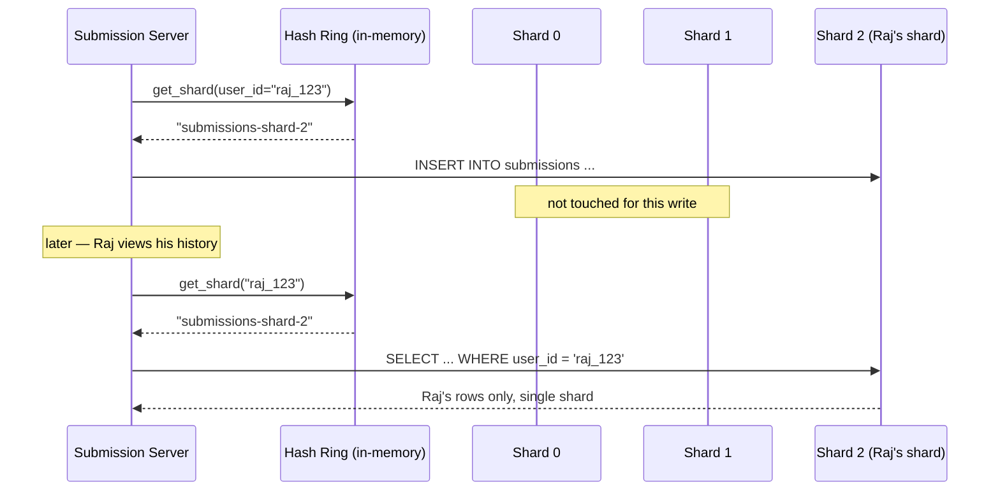
```mermaid
sequenceDiagram
    participant S as Submission Server
    participant Ring as Hash Ring (in-memory)
    participant Sh0 as Shard 0
    participant Sh1 as Shard 1
    participant Sh2 as Shard 2 (Raj's shard)

    S->>Ring: get_shard(user_id="raj_123")
    Ring-->>S: "submissions-shard-2"
    S->>Sh2: INSERT INTO submissions ...
    Note over Sh0,Sh1: not touched for this write

    Note over S: later — Raj views his history
    S->>Ring: get_shard("raj_123")
    Ring-->>S: "submissions-shard-2"
    S->>Sh2: SELECT ... WHERE user_id = 'raj_123'
    Sh2-->>S: Raj's rows only, single shard
```

## CURRENT STATE — V8

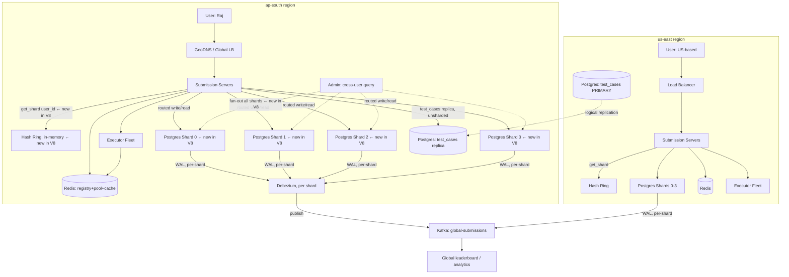
```mermaid
graph TD
    subgraph "ap-south region"
        Raj[User: Raj] --> GeoDNS[GeoDNS / Global LB]
        GeoDNS --> ASsub[Submission Servers]
        ASsub -->|get_shard user_id ← new in V8| Ring["Hash Ring, in-memory ← new in V8"]
        ASsub --> ASreg[(Redis: registry+pool+cache)]
        ASsub --> ASexec[Executor Fleet]
        ASexec --> ASreg
        ASsub -->|routed write/read| Sh0["Postgres Shard 0 ← new in V8"]
        ASsub -->|routed write/read| Sh1["Postgres Shard 1 ← new in V8"]
        ASsub -->|routed write/read| Sh2["Postgres Shard 2 ← new in V8"]
        ASsub -->|routed write/read| Sh3["Postgres Shard 3 ← new in V8"]
        ASsub -->|test_cases replica, unsharded| TCReplica[(Postgres: test_cases replica)]
        Sh0 & Sh1 & Sh2 & Sh3 -->|WAL, per-shard| ASdebz[Debezium, per shard]
        Admin[Admin: cross-user query] -.->|fan-out all shards ← new in V8| Sh0
        Admin -.-> Sh1
        Admin -.-> Sh2
        Admin -.-> Sh3
    end

    subgraph "us-east region"
        USuser[User: US-based] --> USlb[Load Balancer]
        USlb --> USsub[Submission Servers]
        USsub -->|get_shard| USRing[Hash Ring]
        USsub --> USShards["Postgres Shards 0-3"]
        USsub --> USreg[(Redis)]
        USsub --> USexec[Executor Fleet]
        USpg[(Postgres: test_cases PRIMARY)]
    end

    USpg -.->|logical replication| TCReplica
    ASdebz -->|publish| Kafka["Kafka: global-submissions"]
    USShards -->|WAL, per-shard| Kafka
    Kafka --> GlobalView[Global leaderboard / analytics]
```

**Flows:**

1. **Submit path (changed this version):** unchanged through executor routing, execution, and test-case lookup (V1-V6, region-scoped per V7) — but the final verdict write now computes `get_shard(user_id)` and inserts into that specific shard's Postgres instance, instead of one monolithic `submissions` table.

2. **User history read (new this version):** a request for "show my submissions" routes through the same `get_shard(user_id)` function and queries exactly one shard — no fan-out, same latency characteristics the old single-instance design had, now preserved as the table grows.

3. **Admin/cross-user analytics read (new this version):** any query not scoped to a single `user_id` (e.g., "all submissions for problem X") fans out across every shard and merges in the application layer — accepted as a slower, lower-frequency path.

4. **Cross-region aggregation:** unchanged in mechanism from V7 — each shard's own Debezium connector streams its WAL to the same shared `global-submissions` Kafka topic, so sharding the write side is invisible to the aggregation consumer.

5. **Test case caching, replication:** unchanged since V6/V7 — this table was never sharded, since it's small and read-mostly, not growing-without-bound like `submissions`.

6. **Executor registry, warm pool, Redis failover, executor failure handling:** unchanged since V2-V5, entirely orthogonal to this version.

## Interviewer follow-ups

**Q: "What happens when you actually need to add a 5th shard — walk me through the migration?"**
A: With consistent hashing, adding a shard only reassigns the slice of the ring between the new shard's position and its neighbor — roughly `1/N` of users, not everyone. In practice: stand up the new shard empty, dual-write new data for the affected user range to both old and new shard during a migration window, backfill historical rows for that range with a background job, then cut reads over and stop dual-writing. It's a bounded, gradual operation, not a big-bang full-table rehash.

**Q: "Doesn't fan-out for admin queries get worse as you add more shards?"**
A: Yes, linearly — more shards means more connections to query and merge for any cross-user request. That's an accepted trade given how infrequent and latency-insensitive those queries are; if admin/analytics needs became a first-class, frequent, low-latency requirement, the right fix would be a separate analytics store (e.g., a columnar warehouse fed by the same Kafka stream) built for exactly that access pattern, rather than querying the sharded OLTP store directly.

## Recap

| Concept | The Insight |
|---|---|
| Sharding vs. routing/scheduling | These are different problems — V3's executor routing picks *where work runs*; this version partitions *growing data* across storage nodes. Worth keeping the vocabulary precise. |
| Shard key must match dominant read | `user_id` wins because "my history" is the frequent, latency-sensitive query — `problem_id` looked plausible but creates contest-time hotspots |
| Consistent hashing vs. modulo | Consistent hashing bounds resharding cost to roughly `1/N` of data; naive modulo hashing forces a full rehash on every capacity change |
| Fan-out is an accepted cost, not a failure | Cross-user admin queries fanning out to all shards is fine precisely because that path was never latency-critical to begin with |
| Sharding is orthogonal to replication/region | Each shard can still have its own replicas and region-local presence — these NFRs stack, they don't replace each other |

**One-breath interview line:** *"If asked how you'd shard a growing submissions table: pick the key that matches your dominant read pattern — here, a user viewing their own history — not the key that looks like it groups the data naturally, since sharding by problem_id would create exactly the contest-time hotspots you're trying to avoid, and use consistent hashing so adding capacity later moves a bounded slice of users instead of forcing a full-table rehash."*

---

That's the real gap closed. Want the **FINAL WRAP-UP** now (full diagram, every path, the complete "why not X" arsenal, master recap table), or drill into something else first?

---

## FINAL WRAP-UP

### Full Architecture — Everything, One Diagram

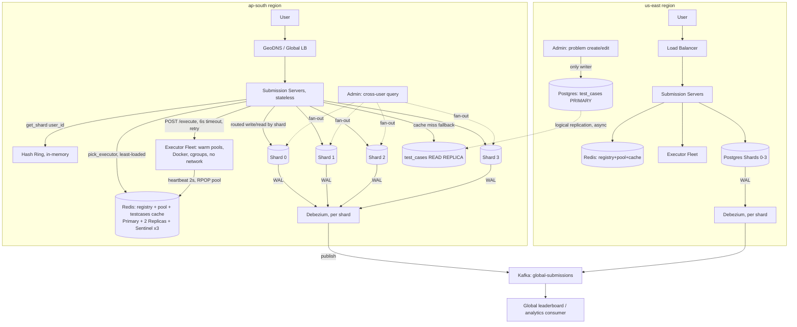
```mermaid
graph TD
    subgraph "ap-south region"
        Raj[User] --> GeoDNS[GeoDNS / Global LB]
        GeoDNS --> ASsub[Submission Servers, stateless]
        ASsub -->|get_shard user_id| Ring[Hash Ring, in-memory]
        ASsub -->|pick_executor, least-loaded| ASreg[("Redis: registry + pool + testcases cache<br/>Primary + 2 Replicas + Sentinel x3")]
        ASsub -->|POST /execute, 6s timeout, retry| ASexec[Executor Fleet: warm pools,<br/>Docker, cgroups, no network]
        ASexec -->|heartbeat 2s, RPOP pool| ASreg
        ASsub -->|routed write/read by shard| Sh0[(Shard 0)]
        ASsub --> Sh1[(Shard 1)]
        ASsub --> Sh2[(Shard 2)]
        ASsub --> Sh3[(Shard 3)]
        ASsub -->|cache miss fallback| TCReplica[(test_cases READ REPLICA)]
        Sh0 & Sh1 & Sh2 & Sh3 -->|WAL| ASdebz[Debezium, per shard]
        Admin[Admin: cross-user query] -.fan-out.-> Sh0 & Sh1 & Sh2 & Sh3
    end

    subgraph "us-east region"
        USuser[User] --> USlb[Load Balancer]
        USlb --> USsub[Submission Servers]
        USsub --> USReg[(Redis: registry+pool+cache)]
        USsub --> USexec[Executor Fleet]
        USsub --> USShards[(Postgres Shards 0-3)]
        USShards -->|WAL| USdebz[Debezium, per shard]
        USpg[(Postgres: test_cases PRIMARY)]
        ProblemAdmin[Admin: problem create/edit] -->|only writer| USpg
    end

    USpg -.logical replication, async.-> TCReplica
    ASdebz -->|publish| Kafka[Kafka: global-submissions]
    USdebz --> Kafka
    Kafka --> GlobalView[Global leaderboard / analytics consumer]
```

### Every End-to-End Path

**1. Submission — happy path**
1. GeoDNS routes user to nearest region.
2. Submission Server calls `pick_executor()` against local Redis registry — least-loaded, live host.
3. Delegates via `POST /execute` (6s timeout) to that executor.
4. Executor pops a warm container (`RPOP` local pool), runs code via `docker exec` inside cgroup/namespace limits (`--pids-limit`, `--memory`, `--cpus`, `--network=none`).
5. Server fetches test cases: Redis cache hit, or Postgres replica on miss (repopulates cache with `EX 3600`).
6. Diffs output, computes verdict.
7. Writes submission row to the shard selected by `get_shard(user_id)`.
8. Returns verdict to user.
9. (Async, off critical path) Debezium streams the new row to `global-submissions` Kafka topic.

**2. Executor failure mid-request**
1. Chosen executor dies or hangs (no heartbeat, no response).
2. Submission Server's client-side 6s timeout fires, independent of registry staleness.
3. Server excludes that host, calls `pick_executor()` again, resends the *full* submission fresh to a new executor.
4. Separately, that host's heartbeat ages past 4s in the registry — future unrelated submissions stop routing there automatically.

**3. Graceful executor shutdown (deploy/scale-down)**
1. Executor receives `SIGTERM`.
2. Immediately deletes its own registry key before going down.
3. Zero failed requests — Submission Servers simply never see it as a candidate again.

**4. Redis primary failure**
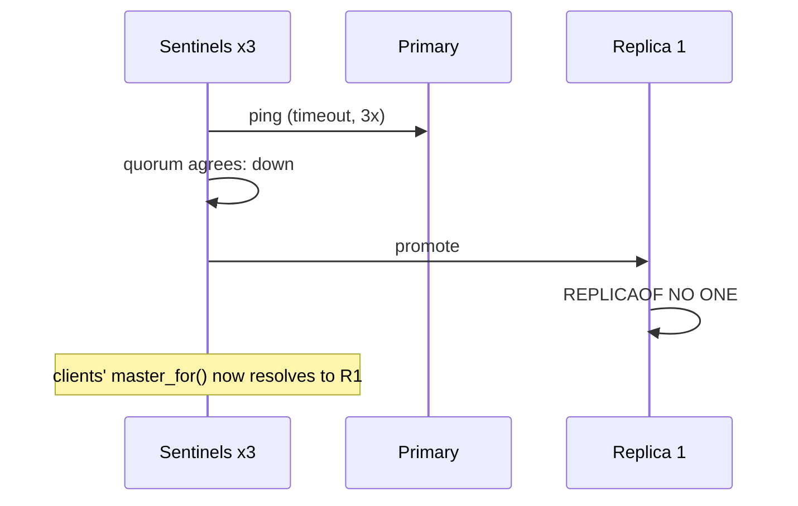
```mermaid
sequenceDiagram
    participant Sent as Sentinels x3
    participant P as Primary
    participant R1 as Replica 1
    Sent->>P: ping (timeout, 3x)
    Sent->>Sent: quorum agrees: down
    Sent->>R1: promote
    R1->>R1: REPLICAOF NO ONE
    Note over Sent: clients' master_for() now resolves to R1
```
1. Primary crashes.
2. 2-of-3 Sentinels agree it's down (quorum, avoids false failover).
3. Most up-to-date replica is promoted, becomes new primary.
4. Submission Servers' next `sentinel.master_for()` call transparently gets the new address — no restart needed.
5. Accepted cost: small async-replication-window of lost heartbeat/pool writes — self-correcting within seconds.

**5. Problem/test-case edit**
1. Admin writes to `us-east` Postgres (sole primary for problem data).
2. Server explicitly deletes `testcases:{problem_id}` from Redis.
3. Every region's Postgres replica picks up the change via logical replication, async.
4. Next read anywhere falls into cache-miss, repopulates from the now-current data.
5. TTL (1hr) is a safety net if the explicit delete is ever missed.

**6. Cross-region aggregation (read-only global view)**
1. Each region writes submissions only to its own local shards — never cross-region synchronously.
2. Each shard's Debezium connector tails its own WAL, publishes inserts to shared `global-submissions` Kafka topic.
3. A global consumer builds the leaderboard/analytics view from that stream — eventually consistent, lag bounded by streaming delay, not by any write path.

**7. User history read**
1. `get_shard(user_id)` resolves to exactly one shard.
2. Single-shard query, no fan-out — same latency profile regardless of total platform size.

**8. Admin cross-user query**
1. Fan out to all shards in that region.
2. Merge and sort in the application layer.
3. Accepted as slower — this path was never latency-critical.

### The "Why Not X" Arsenal

1. **Why not run submitted code directly on the host?** A fork bomb or infinite loop takes down the whole server — no kernel-enforced boundary means the app's own monitoring can always be outrun by hostile code.
2. **Why not chroot instead of full containers?** chroot hides the filesystem but still shares the process table and network stack — a fork bomb still exhausts host-wide PIDs.
3. **Why not a VM per submission?** Boot time (seconds+) is too slow for interactive grading; containers give kernel-enforced isolation at a fraction of the startup cost. VMs (Firecracker/gVisor) are the right call if container-level isolation proves insufficient for a specific threat model.
4. **Why not reuse a container across submissions with a reset script?** The reset script runs inside the same trust boundary the previous (possibly hostile) code just controlled — it can't certify its own cleanliness. Destroy-and-recreate is the only guarantee with no carryover.
5. **Why not a static hash for executor routing instead of least-loaded?** Static hashing (by submission ID or language) is blind to real-time load — it can't absorb contest-style bursty, skewed traffic, unlike a live registry.
6. **Why not resume a crashed container's execution instead of retrying from scratch?** Container process state is tied to its specific kernel instance — no cheap migration exists for plain Docker. Retry-from-scratch is simpler and correct; live-migration-capable microVMs are the answer only if this becomes a frequent, expensive problem.
7. **Why not synchronous replication for the Redis registry?** The data self-corrects every 2 seconds anyway (next heartbeat) — paying round-trip latency on every write buys nothing for data this disposable.
8. **Why not shard the submissions table by problem_id?** Contest traffic clusters on a handful of active problems — that key creates severe write hotspots exactly when load is highest, the mirror image of the driver_id lesson from the Uber design.
9. **Why not a single global database for multi-region?** Every write would pay cross-region latency, defeating the entire purpose of going multi-region in the first place.
10. **Why not CRDTs/multi-writer conflict resolution for submissions across regions?** Submissions are immutable-after-creation and single-owner — there's no actual concurrent-write conflict to resolve, unlike collaborative editing.

### Master Recap Table

| Version | Concept | The Insight |
|---|---|---|
| V0 | Verdict pipeline | Prove code → run → diff → verdict works before adding any isolation machinery |
| V1 | Fork bomb / containers | In-process monitoring can be outrun by hostile code — isolation must be kernel-enforced, from outside the trust boundary |
| V1 | Container vs. VM/chroot | Containers: real isolation, fast startup. chroot: fake isolation. VMs: stronger isolation, too slow for interactive grading |
| V2 | Cold start | Namespace/cgroup/overlay setup, not code execution, was the slow part — warm pools move that cost off the request path |
| V2 | No container reuse | Reset scripts can't be trusted to clean an environment the attacker just controlled — destroy and recreate instead |
| V3 | Real shard key | The question isn't "which API server," it's "which executor host holds the actual resource" |
| V3 | Least-loaded routing | Static hashing can't absorb skewed, bursty contest traffic — a live registry can |
| V4 | Registry vs. client timeout | Heartbeat staleness stops *future* routing to a dead host; only a client-side timeout saves *in-flight* work |
| V4 | No resume, only retry | Container state can't cheaply migrate — accept re-execution cost over building state transfer |
| V5 | Coordination layer as SPOF | The registry that finds capacity is itself a capacity dependency — its failure is worse than any single executor's |
| V5 | Async replication + Sentinel | Chosen because registry data self-corrects every 2s — sync replication's cost buys nothing here |
| V6 | Cache justification | Test cases are read astronomically more than written and barely change — a strong, deliberate caching case, not a reflex |
| V6 | Correctness-sensitive invalidation | Stale test cases cause wrong verdicts, not just slow pages — explicit invalidation is primary, TTL is only a backstop |
| V7 | Multi-region write ownership | Each submission is owned by its creating region, permanently — no cross-region contention ever arises |
| V7 | No CRDTs needed | Submissions are immutable-after-creation and single-owner — conflict resolution machinery would solve a problem that doesn't exist here |
| V8 | Data sharding vs. routing | Different problems — V3 decides where work *runs*, V8 partitions where growing data *lives* |
| V8 | Shard key = dominant read | `user_id` wins because "my history" is the frequent, latency-sensitive query — `problem_id` looked natural but creates contest hotspots |
| V8 | Consistent hashing | Bounds resharding cost to roughly `1/N` of data, versus a full rehash under naive modulo hashing |

---

That's the full design, start to finish: isolation → cold start → routing/scale → failure handling → coordination durability → caching → multi-region → data sharding.

Want to:
**(a)** drill deeper into any one piece (e.g., the observability/monitoring layer we never explicitly covered, or failure-handling patterns like circuit breakers and bulkheads we mentioned in coverage but didn't build out), or
**(b)** run a mock interview where I play interviewer and pressure-test the whole design live?

---

