# Why Payment Systems Exist

Picture this: it's the early 2000s, and eBay sellers and buyers are mailing paper checks and money orders to each other to settle auction payments. People are getting scammed constantly — checks bounce, money orders go missing, and nobody trusts a stranger on the internet with their bank details.

PayPal's founding insight was simple: what if there's a neutral party that holds the money-movement logic, so a buyer's bank never has to talk directly to a seller's bank? That neutral party has to solve a problem banking systems never had to solve at this speed: guarantee that money is never created or destroyed by a bug, a crash, or a network timeout, while doing this thousands of times a second, across currencies, banks, and countries that don't trust each other.

That tension — moving fast *and* never losing a cent — is why payment systems are one of the most interesting distributed systems problems out there.

---

## Scoped Requirements (P0/P1)

Here's what I think should drive the design. Let me know if you want to adjust this list.

**P0 — Core requirements:**

1. **Exactly-once money movement.** A payment must debit the payer and credit the payee exactly once — never zero times (money vanishes), never twice (money is duplicated), even if a client retries a request or a server crashes mid-transaction.
2. **Idempotency under retry.** Clients (mobile apps, POS terminals, flaky networks) will retry the same payment request multiple times. The system must guarantee the same logical payment isn't processed twice.
3. **Strong consistency on balances.** Two concurrent payments from the same account must not both succeed if only one can be covered by the balance — no overdraft from a race condition.

**P1 — Important but secondary:**

4. **Auditability.** Every state transition on a payment must be reconstructable after the fact (for disputes, chargebacks, regulators) — this shapes the data model (ledger-style, append-only) more than it shapes the distributed-systems story.

**What I'm cutting (P2, no architectural impact):**

- Fraud detection / risk scoring models — this is a separate ML pipeline that consumes payment events; it doesn't change how we move money correctly.
- Currency conversion / FX rates — a data lookup, not a distributed-systems problem.
- Multiple payment methods (card vs. bank transfer vs. wallet) — we'll assume one abstracted "payment instrument" and note where it'd branch.
- Recurring/subscription billing — a scheduling problem layered on top of the same core engine, not a different core.

**Where we'll spend most of our time:**

Requirement #1 — exactly-once money movement under failure — is the crux. This is where "the network call succeeded but I never got the response, did the debit happen or not?" lives, and it's what separates a toy CRUD app from a real payments architecture. Requirement #2 (idempotency) and #3 (consistency under concurrency) are really just two faces of that same core problem, so they'll show up together.

---

Does this scope look right to you? Once you confirm, I'll start with Day 0.

---

# Day 0 — The Simplest Thing That Could Work

Let's start with a single running example we'll carry through the whole design: **Alice pays Bob $50.**

Alice is at a coffee shop, Bob owns it. Alice taps her phone to pay via our app. Under the hood, this is just: reduce Alice's account balance by $50, increase Bob's account balance by $50.

## The Architecture

One **Payment Service** (a stateless app server), talking to one **Postgres database**. That's it. No queues, no caching, no sharding.

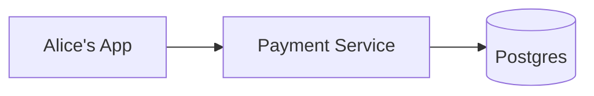

## Why This Is a Reasonable Starting Point

Here's the thing this Day 0 design gets *completely right*, and it's worth naming explicitly: **a single relational database transaction gives you atomicity for free.**

If I wrap "debit Alice, credit Bob, record the payment" inside one `BEGIN ... COMMIT` block, Postgres guarantees that either all three things happen, or none of them do. There's no in-between state where Alice's money is gone but Bob hasn't received it. This is the ACID guarantee, and it's not a hack — it's the database engine's actual job.

Every iteration from here on is going to be about how we preserve this guarantee while giving up the "everything lives in one box" simplicity. So it's worth being precise about what Day 0 buys us, because that's the bar the rest of the design has to clear.

## The Schema

Two tables. First, the accounts table — this is where money "lives":

```sql
CREATE TABLE accounts (
    account_id UUID PRIMARY KEY,
    balance_cents BIGINT NOT NULL CHECK (balance_cents >= 0),
    currency CHAR(3) NOT NULL,
    updated_at TIMESTAMP NOT NULL DEFAULT now()
);
```

I'm storing money as integer cents, not floats — floating point rounding errors in a ledger are a real and embarrassing bug, so this is non-negotiable from day one.

Second, the payments table — this is the append-only audit record, driven by our P1 auditability requirement:

```sql
CREATE TABLE payments (
    payment_id UUID PRIMARY KEY,
    payer_account_id UUID NOT NULL REFERENCES accounts(account_id),
    payee_account_id UUID NOT NULL REFERENCES accounts(account_id),
    amount_cents BIGINT NOT NULL,
    currency CHAR(3) NOT NULL,
    status VARCHAR(20) NOT NULL,
    created_at TIMESTAMP NOT NULL DEFAULT now()
);
```

**Who writes to `accounts`:** the Payment Service, on every payment request, updating both the payer's and payee's row.
**Who writes to `payments`:** the Payment Service, once, when the payment completes or fails.
**Who reads either:** the Payment Service (for balance checks) and, later, any reporting or dispute-resolution tooling.

Both tables live in the same Postgres instance — that's what makes the single-transaction trick possible.

## The Write Flow

Here's exactly what happens when Alice's request hits the server.

**API:** `POST /v1/payments`
```json
{
  "payer_account_id": "alice-uuid",
  "payee_account_id": "bob-uuid",
  "amount_cents": 5000,
  "currency": "USD"
}
```

**Steps, inside a single DB transaction:**

1. Payment Service begins a transaction: `BEGIN;`
2. Payment Service locks and reads Alice's row: `SELECT balance_cents FROM accounts WHERE account_id = 'alice-uuid' FOR UPDATE;`
3. Payment Service checks in application code: is `balance_cents >= 5000`? If not, `ROLLBACK` and return a 402-style "insufficient funds" error.
4. Payment Service debits Alice: `UPDATE accounts SET balance_cents = balance_cents - 5000 WHERE account_id = 'alice-uuid';`
5. Payment Service credits Bob: `UPDATE accounts SET balance_cents = balance_cents + 5000 WHERE account_id = 'bob-uuid';`
6. Payment Service records the payment: `INSERT INTO payments (payment_id, payer_account_id, payee_account_id, amount_cents, currency, status) VALUES ('pay-uuid', 'alice-uuid', 'bob-uuid', 5000, 'USD', 'COMPLETED');`
7. Payment Service commits: `COMMIT;`
8. Payment Service returns `200 OK` with the payment ID to Alice's app.

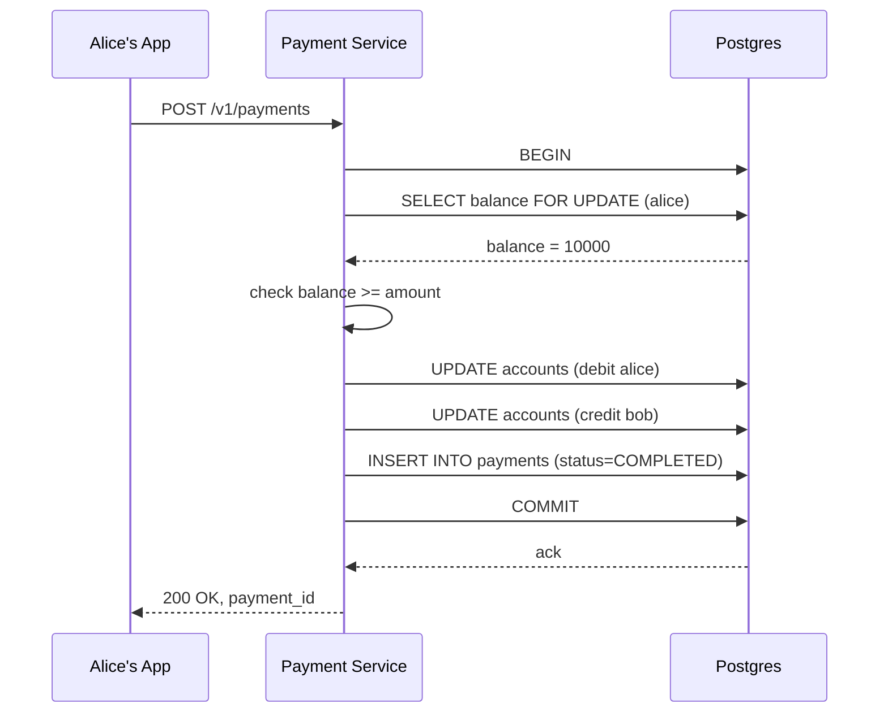

The `FOR UPDATE` row lock in step 2 is what handles our P0 concurrency requirement — if Alice somehow fires two payments at once from two devices, the second one blocks on that lock until the first transaction commits or rolls back, so we never read a stale balance and double-spend.

---

## Interviewer Follow-Ups

**"Why not just do two separate API calls — one to debit, one to credit?"**
Because then atomicity becomes *your* problem instead of the database's. If the debit call succeeds and the credit call fails or the server crashes in between, Alice's money is just gone. A single transaction means the database's write-ahead log handles that all-or-nothing guarantee for us, for free.

**"What if Postgres itself crashes right after step 5 but before step 7?"**
Nothing has actually committed yet — Postgres's write-ahead log ensures an uncommitted transaction is rolled back on recovery. Alice's balance is exactly as it was before the request. This is precisely why we do the debit and credit *inside* the transaction boundary rather than as two independent writes.

---

Next up: Day 0 works fine as long as every request reaches the server exactly once. But networks aren't reliable — Alice's phone is going to time out waiting for a response and retry the exact same payment. Let's see what that does to her balance.

Got it / next?

---

Good question — this is one of those things that sounds like a nitpick until you see it actually happen.

## The Core Problem

Computers store floating-point numbers (like `float` or `double`) in binary. But binary can't exactly represent most decimal fractions, the same way `1/3` can't be written exactly in decimal — you get `0.333...` forever.

The classic example: try `0.1 + 0.2` in almost any programming language.

```python
>>> 0.1 + 0.2
0.30000000000000004
```

That's not a bug in Python. It's a bug in the *idea* of using floats for money at all. `0.1` and `0.2` simply don't have exact binary representations, so the moment you add them, the tiny rounding errors surface.

## Why This Actually Matters for a Ledger

Here's a concrete version with our Alice-and-Bob example.

Say Alice's balance is stored as a float: `$100.10`. She makes three purchases of `$33.30` each ($99.90 total), leaving an expected balance of `$0.20`.

If that arithmetic runs through floating-point subtraction, you can easily end up with a stored balance like `0.19999999999999982` instead of exactly `0.20`. Now:

- If you round it for display, it *looks* fine — `$0.20` shows up on screen.
- But if your `balance >= amount_requested` check compares the raw stored float against another float, a payment that should succeed can fail, or one that should fail can slip through, depending on which side of the rounding error you land on.

## A Real-World Case

This isn't theoretical — it's a known enough problem that it has a name in finance circles: **"salami slicing."** The idea (sometimes urban legend, sometimes real fraud cases) is that if a system computes interest or currency conversion using floats, fractions of a cent get rounded off on millions of transactions. Individually each rounding error is invisible — a fraction of a cent — but multiplied across millions of accounts, it becomes real, missing money that has to reconcile somewhere.

Even without any fraud involved, banks and payment processors get regulatory audits where the books have to balance to the *cent*, across billions of transactions. A `0.00000000001` drift multiplied across a ledger with millions of rows doesn't just look sloppy — it means the books literally don't add up, and someone has to explain where the discrepancy went.

## Why Integer Cents Fixes It

If Alice's balance is stored as `10010` (meaning $100.10, in cents) instead of `100.10`, every operation is now integer arithmetic. Integers in binary are *exact* — there's no rounding error possible for `10010 - 3330 - 3330 - 3330`. You get exactly `20`, every time, on every machine, forever.

```python
>>> 10010 - 3330 - 3330 - 3330
20
```

No ambiguity, no drift, no reconciliation nightmare. This is why our schema used `balance_cents BIGINT` — an integer type — instead of `balance DECIMAL` or `balance FLOAT`.

## A Quick Nuance

You might ask: why not use `DECIMAL`/`NUMERIC` types instead of raw integers, since Postgres has arbitrary-precision decimal types that don't have this float problem either?

That's a completely valid alternative, and plenty of real systems do this. The reason many payment systems still prefer integer cents (or even smaller units — Stripe, for instance, works in the smallest currency unit) is:

- It avoids any ambiguity about how many decimal places a `DECIMAL` column allows across every currency (yen has no decimal subunit at all, for example — 1 yen is already the smallest unit).
- Integer arithmetic is marginally cheaper and has zero ambiguity across every language, serialization format, and API boundary the number crosses — a `DECIMAL` can still get silently coerced into a float somewhere in a client SDK or a JSON parser, and that's exactly where these bugs sneak back in.

So the rule of thumb: **never let money touch a floating-point type, anywhere in the pipeline** — not in storage, not in the API payload, not in application code doing the arithmetic.

---

Want me to continue to the retry/idempotency problem next, or dig into anything else first?

---

# Break It — The Retry Problem

Alice taps to pay Bob $50. Her phone sends the `POST /v1/payments` request. The server processes it, debits Alice, credits Bob, commits — everything works.

But the response never makes it back to Alice's phone. Maybe she walked out of WiFi range for two seconds. Maybe a load balancer timed out. Alice's app doesn't know if the payment succeeded or failed — all it knows is it didn't get a `200 OK`.

So the app does the reasonable thing: it retries. It sends the exact same `POST /v1/payments` request again.

## Why This Breaks Day 0

Our Day 0 server has no way to tell "this is a brand-new payment" apart from "this is Alice's phone retrying a payment I already completed." Every request looks identical — same payer, same payee, same amount. So the server just runs the whole transaction again:

1. Debit Alice another $50.
2. Credit Bob another $50.
3. Insert a *second* row into `payments`.

Alice now has $100 missing instead of $50, and Bob has $100 instead of $50. Nobody asked for that. This is the exact "network call succeeded but I never got the response" scenario I flagged back in the scoping step — and it's not a rare edge case. Mobile networks drop packets constantly, and any client written to be resilient *will* retry on timeout.

Here's the timeline made concrete:

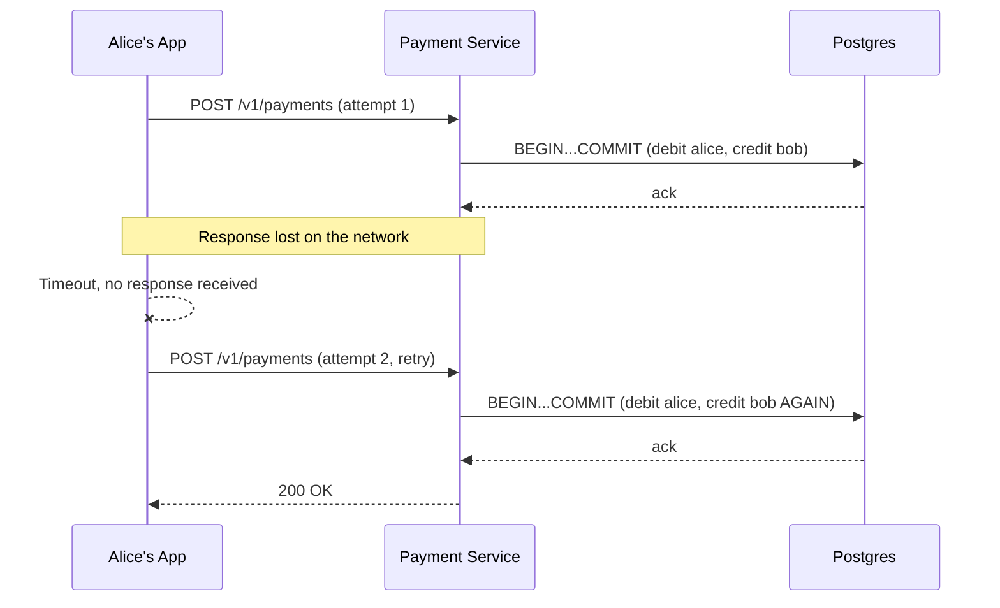

Notice the server did nothing wrong by its own logic — it received two requests and correctly processed both. The bug is that it had no way to know they were the *same* logical payment.

## Why "Just Make the Client Not Retry" Doesn't Work

You might think: why not just tell client apps not to retry payment requests? Two problems with that.

First, you don't control every client. A POS terminal, a partner's server integration, a mobile app on a flaky cell connection — some of them *will* retry, whether your API docs recommend it or not. Second, even if the client is disciplined, the client itself can crash or restart after sending the request but before recording the outcome, and then a human or a script retries from scratch with no memory of the first attempt. The fix has to live on the server side, because that's the only place with a full view of what's already happened.

---

Next up: the fix here is an **idempotency key** — but it's not as simple as "check if we've seen this ID before." There's a genuine race condition even in the naive version of that fix, and that's worth walking through carefully, since it's exactly the kind of thing an interviewer will push on.

Got it / next?

---

# Evolve It — Idempotency Keys, and Why the Obvious Version Race-Conditions

The core idea everyone reaches for first is: give every payment request a unique **idempotency key**, generated by the client, and have the server remember which keys it's already processed. If a retry comes in with a key it's seen before, don't process it again — just return the original result.

Simple in concept. Let's actually try to build it, because the first two attempts both look reasonable and both break in specific ways.

## Attempt 1: "Check, Then Act"

The client generates a UUID for each *logical* payment attempt (not each HTTP request — Alice's app generates one UUID and reuses it across retries of the same tap-to-pay action).

```json
POST /v1/payments
{
  "idempotency_key": "alice-tap-7f3a...",
  "payer_account_id": "alice-uuid",
  "payee_account_id": "bob-uuid",
  "amount_cents": 5000
}
```

Server logic:

1. `SELECT * FROM payments WHERE idempotency_key = 'alice-tap-7f3a...'`
2. If a row exists, return its stored result immediately.
3. If no row exists, proceed with the debit/credit transaction from before, and insert the payment row with this key at the end.

This looks reasonable. But notice the shape of the logic: **check, then act.** That gap between "checking if it exists" and "acting because it doesn't" is exactly where a race condition lives.

Here's the specific way it breaks. Alice's phone has a bad connection and fires the retry *before* the first request's response comes back — so now two copies of the same request are in flight genuinely concurrently, not sequentially.

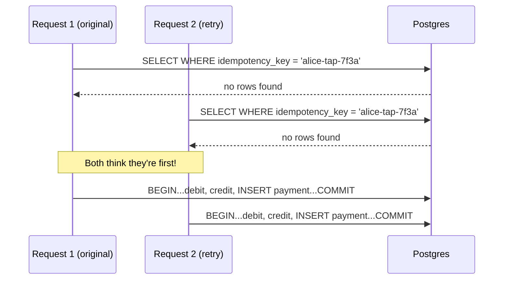

Both requests ran their `SELECT` check before either one had inserted anything. Both saw "no row exists" and both proceeded to move money. We've reintroduced the exact double-debit bug we were trying to fix — the idempotency key existed, but the check-then-act gap meant it never actually got enforced.

## Attempt 2: "Add a Unique Constraint, Catch the Error"

Okay — the fix for a check-then-act race is usually to make the check and the act atomic. So let's add a uniqueness constraint on `idempotency_key` in the `payments` table, and let the database itself be the referee: whichever request's `INSERT` lands second gets rejected with a constraint violation, and we catch that error and treat it as "already processed."

```sql
ALTER TABLE payments ADD CONSTRAINT unique_idempotency_key UNIQUE (idempotency_key);
```

This is *much* closer to correct, and it fixes Attempt 1's race — the database guarantees only one `INSERT` with that key can ever succeed. But there's still a gap, and it's subtler.

In our current flow, the `INSERT INTO payments` happens as the *last* step of the transaction — after the debit and credit updates. So the uniqueness constraint only catches the collision at commit time, after both requests have already run the debit/credit updates and are sitting there holding row locks, both about to commit.

Here's the concrete failure: it doesn't cause a double-debit anymore — good — but it does something almost as bad. Both transactions do the full debit-and-credit work speculatively. One of them commits fine. The other one hits the unique constraint violation on `INSERT`, and now has to `ROLLBACK` — meaning it has to undo the debit and credit it just did.

That's not incorrect, but it's wasteful and, worse, it's fragile: it depends on the application code correctly catching that specific constraint-violation error and rolling back cleanly *every single time*, across every code path, every language client, every partial deploy. One missed error-handling branch and you're back to a silent double-debit. We're relying on exception-handling discipline to guarantee something as important as "never move money twice" — that's the kind of thing that should be structurally impossible, not "handled if the code remembers to."

## Attempt 3 (the real fix): Reserve the Key First, Inside the Same Transaction

The fix is to flip the order: **claim the idempotency key as the very first statement of the transaction**, before any money moves. If the claim fails, we know instantly and cheaply that this is a duplicate, and we never touch a balance at all.

```sql
CREATE TABLE payments (
    payment_id UUID PRIMARY KEY,
    idempotency_key VARCHAR(255) NOT NULL UNIQUE,
    payer_account_id UUID NOT NULL REFERENCES accounts(account_id),
    payee_account_id UUID NOT NULL REFERENCES accounts(account_id),
    amount_cents BIGINT NOT NULL,
    currency CHAR(3) NOT NULL,
    status VARCHAR(20) NOT NULL,
    created_at TIMESTAMP NOT NULL DEFAULT now()
);
```

**Who writes to this table:** the Payment Service, and only the Payment Service — once per unique idempotency key, ever.
**Who reads it:** the Payment Service, at the very start of handling every payment request, to decide whether to proceed or short-circuit.

Revised transaction order:

1. Payment Service begins transaction: `BEGIN;`
2. Payment Service tries to claim the key first, in `PENDING` status: `INSERT INTO payments (payment_id, idempotency_key, payer_account_id, payee_account_id, amount_cents, currency, status) VALUES ('pay-uuid', 'alice-tap-7f3a', 'alice-uuid', 'bob-uuid', 5000, 'USD', 'PENDING');`
3. **Branch — insert fails (unique violation):** this key already exists. Roll back immediately (nothing else has happened yet, so this is free). Look up the existing row's final status and return that result to the client instead of reprocessing.
4. **Branch — insert succeeds:** this is genuinely the first time we've seen this key. Continue: lock and check Alice's balance, debit Alice, credit Bob, as before.
5. Update the same row's status to `COMPLETED`: `UPDATE payments SET status = 'COMPLETED' WHERE payment_id = 'pay-uuid';`
6. Commit: `COMMIT;`

```mermaid
sequenceDiagram
    participant R1 as Request 1 (original)
    participant R2 as Request 2 (retry)
    participant DB as Postgres

    R1->>DB: BEGIN; INSERT payments (status=PENDING)
    DB-->>R1: success, row claimed
    R2->>DB: BEGIN; INSERT payments (status=PENDING)
    DB--xR2: unique constraint violation
    R2->>DB: ROLLBACK (no money touched)
    R2->>DB: SELECT status WHERE idempotency_key=...
    DB-->>R2: status = PENDING (still in flight)
    R1->>DB: debit alice, credit bob, UPDATE status=COMPLETED, COMMIT
    DB-->>R1: ack
    Note over R2: R2 can poll/retry the SELECT<br/>until it sees COMPLETED
```

Now the race is resolved at the cheapest possible point — a single `INSERT`'s atomicity, which Postgres already guarantees as a primitive, rather than something our application code has to get right. The loser of the race never touches a balance, never risks a partial rollback of real money movement, and just reads back whatever the winner eventually writes.

One edge case worth naming: if request 2's rollback happens while request 1 is still mid-flight (status still `PENDING`), request 2 needs to either poll briefly or return a "processing, check back" response — it can't yet return a final answer, because there isn't one yet. This is a real but minor detail, not a new architectural problem.

## Comparison

| Attempt | What breaks | Why |
|---|---|---|
| Check-then-act SELECT | Double-debit under concurrent retries | Gap between check and act isn't atomic |
| Unique constraint, INSERT last | No double-debit, but wasted work + relies on error-handling discipline | Money moves speculatively before the duplicate is detected |
| Claim key first, INSERT first | Correct and cheap | Duplicate detection is a single atomic INSERT, before any balance is touched |

---

## Interviewer Follow-Ups

**"What if the client doesn't send an idempotency key at all?"**
Reject the request outright with a 400 — for a payments API, this should be a required field, not an optional courtesy. You don't want to be in the business of guessing whether an un-keyed request is a retry.

**"What if two genuinely different payments happen to generate the same idempotency key by accident?"**
This is why the key should be scoped per-client — typically `client_id + client-generated UUID`, so the uniqueness constraint is really on the combination, not a bare UUID collision across unrelated clients.

---

Next up: idempotency handles retries from one client hitting one server. But we've still got a single Postgres instance holding every account balance in the world — next, we look at what happens when that single database has to handle far more load than one machine can take, and why sharding is genuinely harder to get right for money than it looks.

Got it / next?

---

# Break It — One Database Can't Hold the World's Money

Our idempotency fix is solid, but it didn't change anything about capacity. We still have exactly one Postgres instance holding every account balance and every payment record, for every user, everywhere.

Let's put a number on this, because it's the number that decides whether we actually need to shard or whether we're over-engineering.

Say we're operating at Visa-like scale — on the order of tens of thousands of transactions per second at peak (Visa has publicly cited handling up to 65,000 transactions per second at peak capacity). A single Postgres instance, even a beefy one, realistically tops out somewhere in the low thousands of write TPS once you account for row locking, WAL fsyncs, and connection overhead. That's not a "maybe someday" gap — that's an order of magnitude short, today, at any serious scale.

There's also a second, more mundane problem: **storage**. Every account and every payment row lives forever (audit requirement). A single disk, no matter how large, eventually can't hold "every payment ever made, for every user, ever" — and even before it physically fills up, index sizes and query performance degrade as one table grows into the billions of rows.

So the fix has to be **sharding** — splitting accounts and payments across multiple database instances, each holding a slice of the data.

## The Real Question: Shard By What?

This is the crux decision, and it's worth being precise, because the wrong shard key doesn't just cause "some inefficiency" — for a payment system specifically, it can silently break the exactly-once guarantee we just spent an entire iteration building.

Let's walk through the candidates.

### Candidate 1: Shard by `payment_id`

Each payment gets hashed to a shard based on its own ID. This spreads write load beautifully — payments are independent, so there's no hot spot from any one payment.

Here's the specific way it breaks: **a payment isn't a self-contained fact — it touches two accounts.** Alice's balance and Bob's balance need to be read, checked, and updated together, inside one atomic transaction, to preserve our P0 guarantee (no overdraft from a race, no partial debit-without-credit). If the payment row lives on Shard 3, but Alice's account lives on Shard 1 and Bob's account lives on Shard 7, our nice single-Postgres-transaction trick from Day 0 is gone. We'd need a distributed transaction across three separate database instances for every single payment — which is exactly the kind of coordination overhead and failure surface we were trying to avoid by sharding in the first place.

### Candidate 2: Shard by `account_id`

Each account is hashed to a shard, and that account's balance lives there permanently. This fixes Candidate 1's core problem for the common case — most payments are one account debiting and a *different* account crediting, but at least each account's own balance updates are local to one shard.

But here's the concrete break: **Alice pays Bob, and Alice's account is on Shard 2 while Bob's account is on Shard 5.** We're still doing a debit on Shard 2 and a credit on Shard 5 — two separate database instances — for the exact same payment. We haven't eliminated cross-shard transactions; we've just made them the common case instead of the rare case, since any two random accounts are very unlikely to land on the same shard.

This is actually the *closest* to correct, and it's what real systems do — but it means we can't avoid cross-shard transactions; we have to solve them properly. We'll come back to exactly how in a moment.

### Candidate 3: Shard by region (e.g., Alice's home country/currency zone)

Group accounts by geography — all US accounts on one cluster, all EU accounts on another. This helps with data sovereignty (GDPR-style requirements that EU user data stays in the EU) and keeps most domestic payments within one region.

The concrete break: **cross-border payments** — Alice in the US paying a merchant in Germany — still cross shards, and now they cross shards *and* potentially cross legal jurisdictions, which is strictly harder than Candidate 2's problem, not easier. Region-sharding solves a compliance problem, not the money-movement problem, and a huge fraction of real payment volume (any international commerce) is exactly the cross-shard case.

## Hotspot Check

For `account_id` sharding specifically: does this create hot shards for our traffic shape? Yes — a payment system's version of "a celebrity account" is a **large merchant or a popular platform's central payout account** (think: a major e-commerce site's receiving account, getting credited by thousands of buyers per second). If that one account hashes to Shard 5, Shard 5 takes disproportionate write load compared to every other shard holding ordinary individual users.

The fix for this specific case is usually to give known-high-volume accounts (identified operationally — big merchants are onboarded, not anonymous) a dedicated shard or a further-partitioned sub-ledger, rather than trying to solve it generically for every account.

## Resharding Cost

Worth answering explicitly, since it's always the follow-up: if we shard by `hash(account_id) % N`, adding a new shard (`N` changes) means the modulo changes for almost every account, forcing a massive rehash and data migration across the whole fleet — that's the worst case for resharding cost. The standard fix is **consistent hashing**, where adding a shard only moves the accounts that fall into the newly-inserted range on the hash ring, bounding the blast radius to roughly `1/N` of accounts instead of nearly all of them. Given how sensitive account data is to being unavailable mid-migration, bounding that blast radius isn't a nice-to-have here — it's close to a P0 concern in its own right.

| Candidate | Optimizes | Breaks | Hotspot risk |
|---|---|---|---|
| `payment_id` | Payment write spread | Every payment needs cross-shard txn | Low, but doesn't matter — still broken |
| `account_id` | Most single-account ops local | Cross-account payments still cross shards | Yes — large merchants |
| region | Compliance, data sovereignty | Cross-border payments, doesn't fix core problem | Yes — home-region imbalance |

We're going with **`account_id`, via consistent hashing**, because it's the only candidate that makes the *majority* of real operations (balance checks, single-account history lookups) shard-local, even though it doesn't eliminate cross-shard payments entirely.

---

## Interviewer Follow-Up

**"Why not just avoid the problem entirely and keep everything on one giant machine with better hardware?"**
Vertical scaling has a ceiling — you can't buy a single machine that does 65,000 durable, fsync'd writes per second indefinitely, and even if you could today, it's a single point of failure for the entire world's money. Horizontal sharding trades a harder consistency problem (cross-shard transactions) for the ability to scale writes and fault-isolate — a Shard 5 outage doesn't take down Shard 1's accounts.

---

Next up: we've decided *how* to shard, but we still owe a real answer to "how does a debit on Shard 2 and a credit on Shard 5 commit atomically, without our Day 0 single-transaction trick?" That's the two-phase commit / saga pattern discussion, and it deserves its own message since it's genuinely meaty.

Got it / next?

---

# Evolve It — Committing Across Two Shards Atomically

We've decided Alice's account lives on Shard 2 and Bob's lives on Shard 5. Our Day 0 trick — `BEGIN; debit; credit; COMMIT;` — doesn't work anymore, because "commit" now means committing to *two separate databases*, and there's no single transaction log spanning both. Let's try a few approaches and see where each one breaks.

## Attempt 1: Just Do Two Sequential Local Transactions

The simplest thing: debit Alice on Shard 2 in one transaction, then credit Bob on Shard 5 in a second transaction, right after.

1. Payment Service: `BEGIN` on Shard 2, `UPDATE accounts SET balance_cents = balance_cents - 5000 WHERE account_id = 'alice-uuid'`, `COMMIT`.
2. Payment Service: `BEGIN` on Shard 5, `UPDATE accounts SET balance_cents = balance_cents + 5000 WHERE account_id = 'bob-uuid'`, `COMMIT`.

This looks fine as long as step 2 always follows step 1 successfully. Here's the concrete break: **the Payment Service process crashes, or the network to Shard 5 times out, right after step 1 commits but before step 2 commits.**

Alice's $50 is gone — permanently debited, committed to disk on Shard 2. Bob never got it. There's no rollback available, because Shard 2 already considers its transaction done and durable. We've recreated the exact "money vanishes" failure mode from our very first requirement, just moved from "single server crash" to "cross-shard partial failure." This is strictly worse than Day 0, not better.

## Attempt 2: Two-Phase Commit (2PC)

The classic distributed-transactions answer: add a coordinator that asks both shards "can you commit this?" before either one actually commits, so nobody commits unless everybody can.

**Phase 1 (prepare):** Coordinator tells Shard 2 "prepare to debit Alice $50" and Shard 5 "prepare to credit Bob $50." Each shard locks the relevant row, writes the change to its transaction log, but does *not* release the lock or make it visible yet — it just replies "yes, I can commit this" or "no, I can't" (e.g., insufficient balance).

**Phase 2 (commit):** Only if *both* shards said yes, the coordinator tells both to actually commit. If either said no, the coordinator tells both to abort.

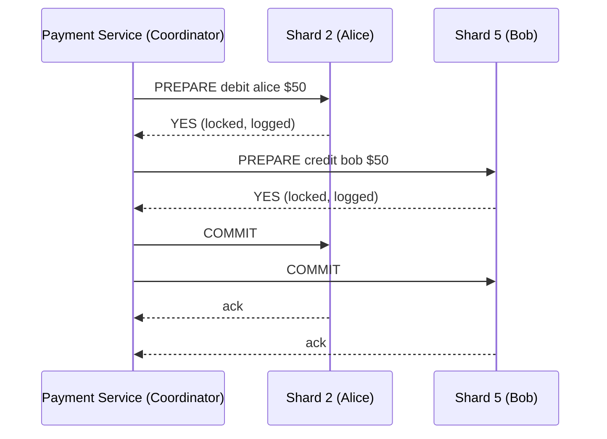

This actually solves the atomicity problem correctly — genuinely, if both shards are up and responsive, this is safe. So why isn't this just the answer?

Here's the concrete break: **the coordinator itself crashes after both shards said YES in phase 1, but before it sends the phase-2 commit message to either.** Both Shard 2 and Shard 5 are now sitting there with rows locked, transaction logged, waiting indefinitely for a coordinator that no longer exists to tell them what to do. Alice's $50 is neither debited nor available to her — it's frozen, mid-air, and the lock on her row means *no other payment involving her account can proceed either*, until someone manually intervenes or the coordinator recovers.

This is the well-known "blocking problem" of 2PC. It's not a rare edge case — coordinator crashes happen, and 2PC's failure mode is that a crash anywhere in the protocol can freeze resources on shards that were otherwise perfectly healthy. For a payment system, "Alice's account is now unusable because some unrelated coordinator process died" is a genuinely bad availability trade-off, and it gets worse the more shards a single transaction touches.

## Attempt 3 (the real fix): Saga Pattern with Compensating Actions

The industry answer for cross-shard payments is to give up on true distributed atomicity and instead do the debit and credit as two **independent local transactions**, each fully committed on its own shard, but backed by a **compensating action** if the second one fails. This is the **saga pattern**.

The mental model shift: instead of "nothing happens until everything can happen" (2PC), it's "each step commits for real, but if a later step fails, we run a deliberate undo step, not a magic rollback."

1. Payment Service creates a payment record in `PENDING` status (this is the durable source of truth for "where are we in this saga").
2. Payment Service commits the debit on Shard 2: `BEGIN; UPDATE accounts SET balance_cents = balance_cents - 5000 WHERE account_id = 'alice-uuid'; COMMIT;` — this is real, final, committed money movement, not a tentative lock.
3. Payment Service commits the credit on Shard 5: `BEGIN; UPDATE accounts SET balance_cents = balance_cents + 5000 WHERE account_id = 'bob-uuid'; COMMIT;`
4. **If step 3 succeeds:** update the payment record to `COMPLETED`. Done.
5. **If step 3 fails** (Shard 5 unreachable, or some validation fails): run the **compensating transaction** — credit Alice back her $50 on Shard 2, and mark the payment `FAILED`.

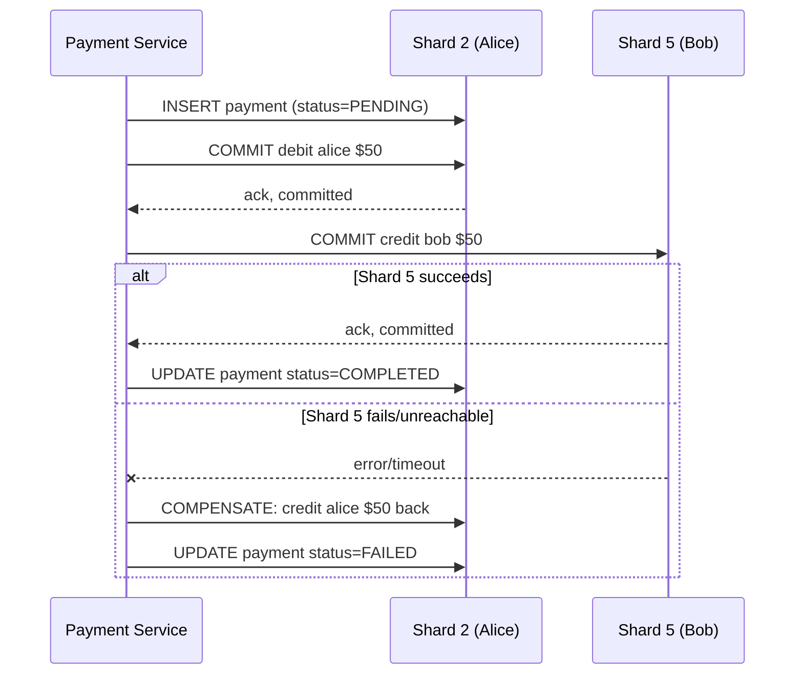

Notice the crucial difference from 2PC: at every single point in this flow, Alice's account is never *locked and frozen waiting on a third party* — it's either debited (a real, final state) or restored (another real, final state). Other payments involving Alice's account can proceed the moment step 2 commits, because there's no held lock spanning the network round-trip to Shard 5.

The trade-off we're explicitly accepting: there's a real, observable window — between step 2 and step 3 — where Alice has been debited but Bob hasn't been credited yet. The payment record's `PENDING` status is what makes this window *visible and recoverable* rather than silent, but it's a genuine intermediate state that didn't exist in Day 0's single-transaction world. This is why the payment status field isn't just for audit logging — it's the actual coordination mechanism for the saga.

**What if the Payment Service itself crashes between step 2 and step 3** — the exact same failure that broke Attempt 1? This is where the `PENDING` record earns its keep: a recovery process periodically scans for payments stuck in `PENDING` past some timeout, and either retries step 3 or runs the compensating action from step 5. Nothing is silently lost, because the durable payment record tells any recovery process exactly which step to resume from.

## Comparison

| Approach | What breaks | Why |
|---|---|---|
| Two sequential local transactions | Money vanishes on partial failure | No coordination between the two commits at all |
| 2PC | Resources freeze indefinitely on coordinator crash | Both shards block, holding locks, waiting for a phase-2 message that may never come |
| Saga + compensating transaction | Genuine intermediate state exists, but it's visible and recoverable | Each step commits for real; failures are undone explicitly, not rolled back magically |

---

## Interviewer Follow-Ups

**"Doesn't the saga pattern violate 'exactly-once money movement' since there's a window where the money is debited but not yet credited?"**
It violates strict atomicity, not exactly-once — the payment record's status field tracks exactly where in the saga we are, and the recovery process guarantees every payment eventually reaches `COMPLETED` or `FAILED` with the compensating action applied. "Eventually consistent with a durable recovery path" is a defensible trade-off; "sometimes silently loses money" is not, and 2PC's blocking failure mode risks the latter in practice by freezing accounts indefinitely.

**"What if the compensating transaction itself fails — Shard 2 is down when we try to credit Alice back?"**
The recovery process retries the compensating action with backoff until it succeeds — since compensating actions are just another local, idempotent transaction on Shard 2, this is the same retry/idempotency machinery we already built earlier, not a new mechanism.

---

Next up: this saga's correctness depends on that recovery process reliably finding stuck `PENDING` payments and retrying them — which means we need a durable, ordered way to track "what step is this payment on" that survives the Payment Service crashing entirely. That's where an event log (Kafka) enters the picture instead of relying purely on database polling.

Got it / next?

---

# The Saga, Step by Step — Including Recovery

Let's make the whole thing fully concrete: the schema that drives it, the exact happy-path steps, and exactly what the recovery process does when something crashes mid-saga.

## The Schema That Tracks Saga State

We need more than just a `status` string — we need to know exactly which step a payment is stuck on, so recovery knows what to do without guessing.

```sql
CREATE TABLE payments (
    payment_id UUID PRIMARY KEY,
    idempotency_key VARCHAR(255) NOT NULL UNIQUE,
    payer_account_id UUID NOT NULL,
    payee_account_id UUID NOT NULL,
    amount_cents BIGINT NOT NULL,
    currency CHAR(3) NOT NULL,
    status VARCHAR(20) NOT NULL,
    -- status values: PENDING, DEBITED, COMPLETED, COMPENSATING, FAILED
    updated_at TIMESTAMP NOT NULL DEFAULT now(),
    created_at TIMESTAMP NOT NULL DEFAULT now()
);
```

The key addition is the `status` values themselves — each one marks a distinct point in the saga, not just "in progress" vs. "done."

**Who writes to this row:** the Payment Service, once per state transition, during both the normal flow and recovery.
**Who reads this row:** the Payment Service (to resume), and a new **Recovery Worker** process (to find stuck payments).
**Where it lives:** on the same shard as the payer's account — Shard 2 in Alice's case — so the debit and the status write in step 2 below can happen in the *same local transaction*. This matters: it means "debit happened" and "status says DEBITED" can never disagree with each other.

## Happy Path, Step by Step

1. Payment Service receives `POST /v1/payments` from Alice's app, with the idempotency key.
2. Payment Service claims the idempotency key: on Shard 2, `BEGIN; INSERT INTO payments (payment_id, idempotency_key, payer_account_id, payee_account_id, amount_cents, currency, status) VALUES ('pay-1', 'alice-tap-7f3a', 'alice-uuid', 'bob-uuid', 5000, 'USD', 'PENDING'); COMMIT;` — same duplicate-detection trick from before.
3. Payment Service debits Alice **and** flips status to `DEBITED`, in one local transaction on Shard 2: `BEGIN; UPDATE accounts SET balance_cents = balance_cents - 5000 WHERE account_id = 'alice-uuid'; UPDATE payments SET status = 'DEBITED', updated_at = now() WHERE payment_id = 'pay-1'; COMMIT;`
4. Payment Service commits the credit on Shard 5: `BEGIN; UPDATE accounts SET balance_cents = balance_cents + 5000 WHERE account_id = 'bob-uuid'; COMMIT;`
5. Payment Service flips status to `COMPLETED` on Shard 2: `UPDATE payments SET status = 'COMPLETED', updated_at = now() WHERE payment_id = 'pay-1';`
6. Payment Service returns `200 OK` to Alice's app.

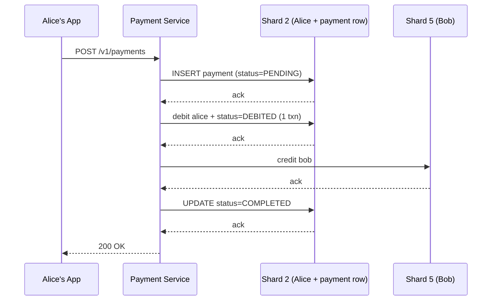

Notice status `DEBITED` exists *specifically* to mark "step 3 is durably done, step 4 hasn't been confirmed yet." That's the exact window recovery needs to detect.

## Where Crashes Can Happen, and What State They Leave Behind

| Crash point | Status left behind | What actually happened |
|---|---|---|
| Before step 2 commits | No row at all | Nothing happened — safe to retry from scratch |
| After step 2, before step 3 | `PENDING` | Idempotency key claimed, no money moved |
| After step 3, before step 4 | `DEBITED` | Alice debited, Bob not yet credited |
| Step 4 fails outright | `DEBITED` | Same as above — Shard 5 rejected or timed out |
| After step 4, before step 5 | `DEBITED` | Bob **was** credited, but we don't know that yet |
| After step 5 | `COMPLETED` | Fully done, nothing to recover |

The tricky row is the second-to-last one: status still says `DEBITED`, but the credit on Shard 5 *actually succeeded* — the Payment Service just died before it could record that fact. Recovery has to handle this without double-crediting Bob.

## The Recovery Worker

This is a separate, independent process — not part of the request path at all. It runs continuously in the background.

1. Every N seconds, Recovery Worker scans each shard: `SELECT * FROM payments WHERE status = 'DEBITED' AND updated_at < now() - interval '30 seconds';`
2. The 30-second threshold matters — it stops the recovery worker from racing a payment that's simply *still in flight* between steps 3 and 4 on a slow but healthy path.
3. For each stuck payment found, Recovery Worker needs to answer one question: **did the credit to Bob actually happen, or not?**
4. Recovery Worker checks Shard 5 for evidence: it looks for a credit already applied for this exact `payment_id`. This is why the credit itself should carry the payment ID — e.g., a small `applied_credits` table on Shard 5 keyed by `payment_id`, written in the same transaction as step 4's balance update, checked by Recovery Worker before deciding what to do next.

```sql
CREATE TABLE applied_credits (
    payment_id UUID PRIMARY KEY,
    account_id UUID NOT NULL,
    amount_cents BIGINT NOT NULL,
    applied_at TIMESTAMP NOT NULL DEFAULT now()
);
```

**Who writes this:** the Payment Service, inside the same transaction as step 4's `UPDATE accounts` on Shard 5 — so "Bob was credited" and "we recorded that we credited him for this payment" can never disagree, the same trick we used for Alice's debit and status update.
**Who reads this:** the Recovery Worker, to distinguish "credit never happened" from "credit happened, but the status update after it never happened."

5. **If Recovery Worker finds a row in `applied_credits` for this `payment_id`:** the credit already succeeded — the crash happened between step 4 and step 5. Recovery Worker simply completes the saga: `UPDATE payments SET status = 'COMPLETED' WHERE payment_id = 'pay-1';` No money moves. This is safe to run any number of times — it's idempotent by construction, since it's just correcting a status field to match reality.
6. **If Recovery Worker finds no row in `applied_credits`:** the credit genuinely never happened. Recovery Worker retries step 4 itself: attempt the credit on Shard 5 again, using the same `payment_id`-keyed insert into `applied_credits`, which is naturally idempotent if it somehow gets attempted twice.
7. **If the retried credit keeps failing** (Shard 5 is down for an extended period, or the account itself was closed) past some retry budget, Recovery Worker gives up and runs the **compensating transaction**: credit Alice back her $50 on Shard 2, and set status to `FAILED`.

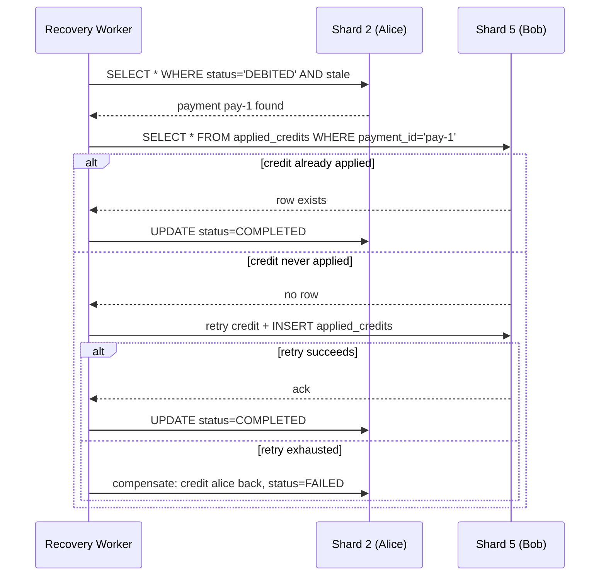

## Why This Doesn't Need a Coordinator Process to Stay Alive

Notice the Recovery Worker isn't a single point of failure the way the 2PC coordinator was. If the Recovery Worker itself crashes mid-scan, nothing is lost — no locks are held, no in-memory state exists. It just picks up the same query on its next scan cycle and finds the same stuck `DEBITED` rows again. Every action it takes (complete, retry-credit, compensate) is idempotent, so running the same recovery attempt twice by accident is harmless.

This is the real payoff of the saga pattern over 2PC: **the recovery mechanism is just another idempotent client of the same durable state**, not a fragile coordinator that has to stay alive for correctness.

---

## Interviewer Follow-Up

**"How does the Recovery Worker know it's not competing with another Recovery Worker instance also trying to fix the same stuck payment?"**
The same `FOR UPDATE`-style row lock (or a lightweight `claimed_by`/`claimed_at` column) on the payment row during recovery — whichever worker locks the row first proceeds, the other skips it. Since every recovery action is idempotent anyway, even a rare double-claim under a race just means the same safe correction gets applied twice, not that money moves twice.

---

Next up: recovery today depends on a polling scan finding stale `DEBITED` rows every 30 seconds — that's a real but somewhat blunt instrument. Bringing in a durable, ordered event log (Kafka) instead of pure polling changes that story — want to go there next, or is there something else you'd like to dig into first?

---

# Evolve It — From Polling to an Event Log

Polling every 30 seconds works, but let's be honest about what it costs us and see exactly where it breaks down as we scale.

## Why Polling Starts To Hurt

Picture this at scale: thousands of shards, each with a Recovery Worker running `SELECT * FROM payments WHERE status = 'DEBITED' AND updated_at < now() - interval '30 seconds'` every 30 seconds. Two concrete problems show up.

First, **latency**. If a payment gets stuck right after the scan just ran, it sits there for up to 30 seconds before the *next* scan even notices it. For a payment system, "Bob might not get his money for up to 30 seconds after a crash, and we won't even start trying to fix it for that long" is a real, felt delay — not catastrophic, but not great either.

Second, **wasted work at scale**. Every shard, every 30 seconds, forever, runs a scan — even during the 99.9% of the time when there's nothing stuck. That's a constant background query load across every shard in the fleet, purely to catch the rare crash. It scales with the number of shards and the polling frequency, not with the number of actual failures — which is backwards.

## The Fix: An Event Log Instead of Polling

Instead of the Payment Service silently updating a status column and hoping a poller notices, have it **publish an event** every time the saga moves to a new step. A durable, ordered log — **Kafka** — becomes the single place every interested party (recovery, auditing, notifications) subscribes to, instead of each one independently hammering the database.

### Why Kafka, Specifically

This is the first time a genuinely new storage/infra technology enters the picture, so it's worth justifying the *class* of tool, not just naming it.

We need: durable, ordered, replayable delivery of "this happened" facts to multiple independent consumers, without those consumers needing to poll a database. That's exactly what a log-structured pub/sub system is built for — Kafka retains events for a configurable window, preserves order per-partition, and lets multiple consumer groups (Recovery Worker, Audit Service, Notification Service) each read the same stream independently at their own pace.

The alternative you'd reach for otherwise — a message queue like RabbitMQ — is built around "deliver once, then the message is gone." That's a worse fit here, because we specifically want multiple independent consumers to each see every event, and we want replayability for audit purposes (P1 requirement from way back). A plain queue would need a separate queue per consumer and loses the "replay history" property; a log-structured system gives us both for free.

## The Schema: What Goes on the Topic

A Kafka topic called `payment-events`, partitioned by `payment_id` (so all events for one payment land in order, on one partition — ordering only needs to be guaranteed per-payment, not globally).

```json
{
  "payment_id": "pay-1",
  "event_type": "DEBITED",
  "payer_account_id": "alice-uuid",
  "payee_account_id": "bob-uuid",
  "amount_cents": 5000,
  "currency": "USD",
  "timestamp": "2026-08-27T10:15:03Z"
}
```

`event_type` mirrors our status values: `PENDING_CREATED`, `DEBITED`, `CREDITED`, `COMPLETED`, `COMPENSATED`, `FAILED`.

**Who writes to this topic:** the Payment Service — once per state transition, right after (or as part of) the same local transaction that updates the `payments` row's status.
**Who reads from this topic:** the Recovery Worker (to react immediately, not on a timer), plus, later, an Audit Service and a Notification Service — each as independent consumer groups, each tracking its own read position.

## The Revised Flow

The database writes from before are unchanged — same transactions, same tables. What changes is that each transition now also **publishes** to Kafka, and the Recovery Worker becomes a **consumer**, not a poller.

1. Payment Service claims idempotency key on Shard 2, status `PENDING` — unchanged from before.
2. Payment Service debits Alice + sets status `DEBITED` on Shard 2, in one local transaction — unchanged. **New:** immediately after this transaction commits, Payment Service publishes a `DEBITED` event to the `payment-events` topic.
3. Payment Service commits the credit on Shard 5 — unchanged. **New:** publishes a `CREDITED` event.
4. Payment Service sets status `COMPLETED` — unchanged. **New:** publishes a `COMPLETED` event.

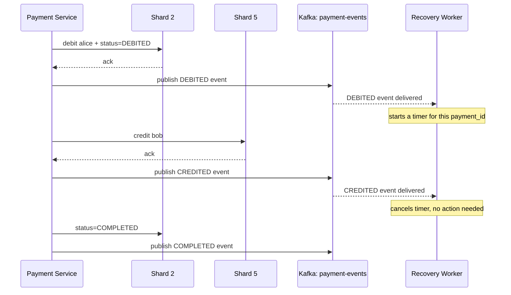

Now the Recovery Worker's job changes shape entirely: instead of scanning on a timer, it **consumes the `payment-events` topic and starts a short timer (e.g., 10 seconds) the moment it sees a `DEBITED` event with no matching `CREDITED` event following it.** If the timer fires before the `CREDITED` event shows up, *then* it does exactly the same recovery work as before — check `applied_credits` on Shard 5, retry the credit, or compensate.

This is strictly better on both axes we cared about: detection latency drops from "up to 30 seconds" to "roughly 10 seconds, and only when something's actually wrong," and there's no constant background scan cost — the worker is idle unless an event tells it something needs attention.

## An Important Nuance: The Database Write and the Kafka Publish Aren't Atomic

Worth being honest about a small crack here: step 2 above is really two separate actions — commit the local transaction on Shard 2, *then* publish to Kafka. If the Payment Service crashes in the gap between those two, the database says `DEBITED` but Kafka never got the event. The Recovery Worker's polling fallback (kept as a much-less-frequent backstop, say every few minutes instead of every 30 seconds) still exists for exactly this residual gap — the event log is the fast path, not a full replacement for the database being the ultimate source of truth.

This pattern — write to the database, then reliably get an event out — is common enough to have a name: the **transactional outbox pattern**. A slightly more robust version writes the event into an `outbox` table in the *same* local transaction as the status update, and a separate small process tails that table and publishes to Kafka, guaranteeing the event is never lost even if the publish step itself crashes. Whether that extra layer is worth the complexity depends on how much residual risk you're willing to leave to the slow polling backstop — a reasonable follow-up to flag in an interview, not something we need to over-build here.

---

## Interviewer Follow-Ups

**"Why partition Kafka by `payment_id` and not by `payer_account_id`?"**
Because ordering only matters *within* one payment's own lifecycle — `DEBITED` must be seen before `CREDITED` for pay-1. Partitioning by account would also work and has a different benefit (all of Alice's payment events in order, useful for her transaction history), but it doesn't change the recovery logic, so `payment_id` is the simpler choice unless account-level ordering becomes a separate requirement.

**"What if Kafka itself is down when the Payment Service tries to publish?"**
The transactional outbox pattern is exactly the answer here — since the event is durably recorded in the database as part of the same local transaction regardless of Kafka's availability, a separate tailer process can retry publishing once Kafka recovers, with zero risk of losing the event in the meantime.

---

We've now covered the crux of this system pretty thoroughly: exactly-once movement, idempotency, sharding, and cross-shard sagas with recovery. Want to move into caching and read-heavy concerns next (balance checks, transaction history), or are we ready to jump to the final architecture recap and "why not X" cheat sheet?

---

# The Transactional Outbox Pattern, Applied

Let's replace the "commit to the database, then hope the Kafka publish also succeeds" gap with something that's actually guaranteed. The core idea: **write the event to an `outbox` table in the exact same local transaction as the status update**, so the event's existence and the state change are atomic by construction — they're the same commit. A separate, independent process then reads that outbox table and pushes to Kafka, retrying forever until it succeeds.

## The New Table

```sql
CREATE TABLE outbox (
    outbox_id BIGSERIAL PRIMARY KEY,
    payment_id UUID NOT NULL,
    event_type VARCHAR(20) NOT NULL,
    payload JSONB NOT NULL,
    published BOOLEAN NOT NULL DEFAULT FALSE,
    created_at TIMESTAMP NOT NULL DEFAULT now()
);
```

**Who writes to this table:** the Payment Service — inserting one row per state transition, inside the same transaction as the corresponding `payments`/`accounts` update. Never anyone else.
**Who reads from this table:** a new component, the **Outbox Tailer**, and only the Outbox Tailer. Nothing else touches this table.
**Where it lives:** on the *same* shard as the payment row it's describing — Shard 2 in Alice's case — specifically so the `INSERT INTO outbox` can ride along in the same local transaction as the status/balance update. If it lived elsewhere, we'd be back to a cross-shard atomicity problem, which is exactly what we're trying to avoid.

`published` starts `FALSE` and is flipped to `TRUE` only after the Outbox Tailer confirms Kafka has durably accepted the event.

## The Outbox Tailer

This is a small, separate, stateless-ish process (or a lightweight per-shard worker) whose only job is:

1. Continuously poll (or use Postgres's logical replication / `LISTEN`/`NOTIFY` for lower latency): `SELECT * FROM outbox WHERE published = FALSE ORDER BY outbox_id ASC LIMIT 100;`
2. For each unpublished row, publish it to the `payment-events` Kafka topic, keyed by `payment_id`.
3. On a successful Kafka acknowledgment, mark it published: `UPDATE outbox SET published = TRUE WHERE outbox_id = 123;`
4. If the Kafka publish fails or times out, do nothing — just leave `published = FALSE` and let the next poll cycle retry it. This is safe specifically because Kafka producers can be configured idempotent (deduping on `payment_id` + a producer sequence number), so a retried publish never creates a duplicate event downstream.

This tailer is the only thing that ever talks to Kafka on the write side — the Payment Service itself no longer publishes directly.

## Revised Step-by-Step Flow

Only the `DEBITED` transition is shown in full detail below; the same outbox pattern applies identically to every other transition (`PENDING`, `CREDITED`, `COMPLETED`, `COMPENSATED`), so those are noted but not re-derived.

1. Payment Service claims the idempotency key on Shard 2 — unchanged from before, still its own transaction, still `PENDING`.
2. Payment Service begins a **single local transaction** on Shard 2 that now does three things together, not two:
   - `UPDATE accounts SET balance_cents = balance_cents - 5000 WHERE account_id = 'alice-uuid';`
   - `UPDATE payments SET status = 'DEBITED', updated_at = now() WHERE payment_id = 'pay-1';`
   - `INSERT INTO outbox (payment_id, event_type, payload) VALUES ('pay-1', 'DEBITED', '{"payment_id":"pay-1","payer_account_id":"alice-uuid","payee_account_id":"bob-uuid","amount_cents":5000,"currency":"USD"}');`
3. Payment Service commits: `COMMIT;`. At this exact point, the debit, the status flip, and the fact that an event *needs* to be published are all durable together, or none of them are — there's no gap anymore.
4. Payment Service returns control (it does **not** wait for Kafka at all now — this is a nice side benefit, the request path is faster since it never talks to Kafka directly).
5. Independently, the Outbox Tailer's next poll cycle picks up the new `outbox` row (`published = FALSE`), publishes `DEBITED` to Kafka, and on ack, flips `published = TRUE`.
6. Kafka delivers the event to the Recovery Worker consumer, which starts its short timer for `pay-1` as before.
7. Steps 2–6 repeat in the same shape for the `CREDITED` event (written on Shard 5, tailed by Shard 5's own Outbox Tailer) and the `COMPLETED` event (back on Shard 2).

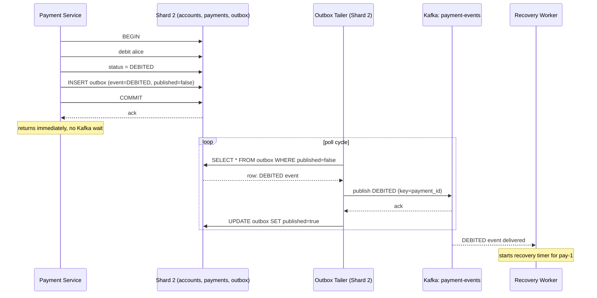

## Walking Through the Failure Cases This Actually Fixes

**Payment Service crashes right after step 3's `COMMIT`, before returning to the client.** No problem — the outbox row is already durably committed. The Outbox Tailer finds it on its next poll regardless of whether the Payment Service process is even still alive. This is the whole point: publishing no longer depends on the same process instance that wrote the data.

**Kafka is completely down for five minutes.** The Outbox Tailer keeps polling, keeps failing to publish, keeps leaving `published = FALSE`. Nothing is lost — the row just sits there. The moment Kafka recovers, the next poll cycle successfully publishes it. The Recovery Worker's detection is delayed by however long Kafka was down, but never incorrect.

**The Outbox Tailer publishes to Kafka successfully, but crashes before it can run the `UPDATE outbox SET published = TRUE`.** The row still shows `published = FALSE`, so the next poll cycle picks it up *again* and republishes it — a genuine duplicate delivery to Kafka. This is exactly why the Kafka producer needs to be configured as idempotent (deduping by producer ID and sequence number per partition), and why downstream consumers like the Recovery Worker should treat their own event handling as idempotent too — "start a timer for `pay-1`" is naturally idempotent since starting it twice for the same payment has no harmful effect.

## Comparison: Direct Publish vs. Outbox

| Approach | What breaks | Why |
|---|---|---|
| Publish directly to Kafka after commit | Event can be silently lost if the process crashes between commit and publish | Two independent actions, no shared atomicity |
| Transactional outbox | Event is never lost; Kafka being down just delays, never drops | Event's existence is committed atomically with the state change itself |

---

## Interviewer Follow-Up

**"Doesn't polling the outbox table bring back the same latency/overhead problem you just moved away from with events?"**
Partially, but at a much smaller and cheaper scope — the outbox poll only needs to check one table per shard for `published = FALSE` rows, which is a tiny, indexed, mostly-empty query, versus the earlier version scanning the entire `payments` table for stale statuses. It can also poll far more frequently (sub-second) cheaply, or be replaced with Postgres logical replication / CDC (e.g., Debezium) to get near-zero latency with no polling at all — that's a common production upgrade once this pattern is in place.

---

Next up: we've now got a fully durable write path. Let's shift to the read side — Alice checking her balance, or pulling up her last 50 transactions — and why that traffic pattern justifies a cache in a way that's specific to this system, not just "add Redis by default."

Got it / next?

---

# Evolve It — Why Balance Checks Need a Different Answer Than Writes

Let's shift to a new scenario. Alice opens the app. Before she even taps to pay, the app displays her current balance. Then she scrolls down and sees her last 50 transactions. Neither of these should touch the same heavyweight, lock-guarded path we built for writes.

## Justifying a Cache Against the Actual Read Pattern

Before reaching for Redis, it's worth asking what specifically makes this read expensive or repeated enough to bother caching. Two different reads are hiding under "check balance," and they have different answers.

**Reading Alice's current balance** is a single-row lookup by primary key on Shard 2 — `SELECT balance_cents FROM accounts WHERE account_id = 'alice-uuid';`. That's already cheap on an indexed primary key. Caching this doesn't save much *per query*, but it matters because of *volume*: balance checks happen far more often than payments — every app open, every screen refresh, every pre-payment check — so even a cheap query becomes a meaningful chunk of database load in aggregate. This is a **read-heavy, low-latency-sensitive** case: users expect their balance to show up instantly on app open.

**Reading transaction history** (last 50 payments) is a different shape entirely — it's a range query, potentially touching an index scan across the `payments` table, and it's the kind of query that gets noticeably slower as a user's total transaction count grows into the thousands. This is worth caching for a different reason: the *result* is somewhat expensive to compute and doesn't change on every read.

So: yes, a cache is justified here, but for volume-amplification reasons on the balance side and computation-avoidance reasons on the history side — not "reads are slow" in general.

## What's Cached, and At What Layer

This needs to be explicit, because "app-level cache," "CDN," and "client cache" are genuinely different decisions with different consequences.

**Balance:** cached at the **application layer**, in Redis, one key per account: `balance:alice-uuid` → `10010` (a plain string/integer, matching our cents-based representation). This sits between the Payment Service and Shard 2 — not a CDN, and not the client — because the balance is deeply personalized (nobody else should ever see Alice's cached value) and it changes on every payment, so it needs a layer close to the write path that can be invalidated precisely.

**Transaction history:** also application-layer Redis, but as a different structure — a Redis **sorted set** per account, `history:alice-uuid`, scored by timestamp, so `ZREVRANGE history:alice-uuid 0 49` cheaply returns the most recent 50 without re-scanning Postgres.

**Is a CDN warranted anywhere here?** No, and it's worth explicitly ruling it out rather than skipping the question. A CDN earns its keep for content that's either (a) genuinely static/anyone-cacheable, or (b) so geographically distributed in *readership* that edge caching meaningfully cuts latency. Balances and transaction histories are the opposite of shareable — every single value is personalized to exactly one account, so an edge node caching Alice's balance provides zero benefit to anyone else, and it's mutated too frequently (every payment) to be worth pushing to the edge at all. A CDN belongs in front of things like static app assets or a merchant's public product catalog — not personal financial data.

## Schema and Ownership

```
Redis key: balance:{account_id}          → string, e.g. "10010"
Redis key: history:{account_id}          → sorted set, member=payment_id, score=timestamp
```

**Who writes `balance:{account_id}`:** the Payment Service, immediately after any committed balance change on that account — both the debit side (Shard 2) and the credit side (Shard 5), each service instance updating its own account's cache entry right after its local commit.
**Who reads it:** the Payment Service, on every balance-check API call, and on the pre-debit balance check during a new payment (with one caveat below).
**Who writes `history:{account_id}`:** the Payment Service, appending the `payment_id` once a payment reaches `COMPLETED`.
**Who reads it:** the Payment Service, when the app requests transaction history.

## Invalidation Strategy, and Why It Fits This Data

The mutability pattern here is: **every write to an account is already funneled through the Payment Service's own transaction**, so we don't need a generic cache-invalidation scheme (like TTL-based expiry guessing at staleness) — we can do **write-through invalidation**, updating the cache in the same code path as the database commit, because we control every writer.

Concretely: right after step in the saga where `UPDATE accounts SET balance_cents = ...` commits on Shard 2, the Payment Service also does `SET balance:alice-uuid 9510` (or `DECRBY balance:alice-uuid 5000` if we want an atomic delta instead of a full re-set). This keeps the cache correct by construction rather than by expiration — there's no window where the cache is confidently wrong, only a brief window where it hasn't been updated *yet* if the Redis write itself lags.

**One important caveat for the pre-payment balance check specifically:** using the *cached* balance to decide "does Alice have enough money for this payment" is dangerous — a stale or lagging cache read could approve a payment that would actually overdraft. So the cache is used for **display** (showing Alice her balance on screen) but the actual debit path still does its `SELECT ... FOR UPDATE` against Postgres directly, as in our original flow. This is a case where two different consumers of the "same" data need different consistency guarantees — display can tolerate a few hundred milliseconds of staleness, the debit decision cannot.

| Read | Cached? | Why | Consistency needed |
|---|---|---|---|
| Balance for display | Yes — Redis string | High volume, cheap-but-frequent query | Can tolerate brief staleness |
| Balance for debit decision | No — hits Postgres directly | Wrong answer risks overdraft | Must be current, locked read |
| Transaction history | Yes — Redis sorted set | Expensive range query, doesn't change per-read | Can tolerate brief staleness |

## Revised Read Flow

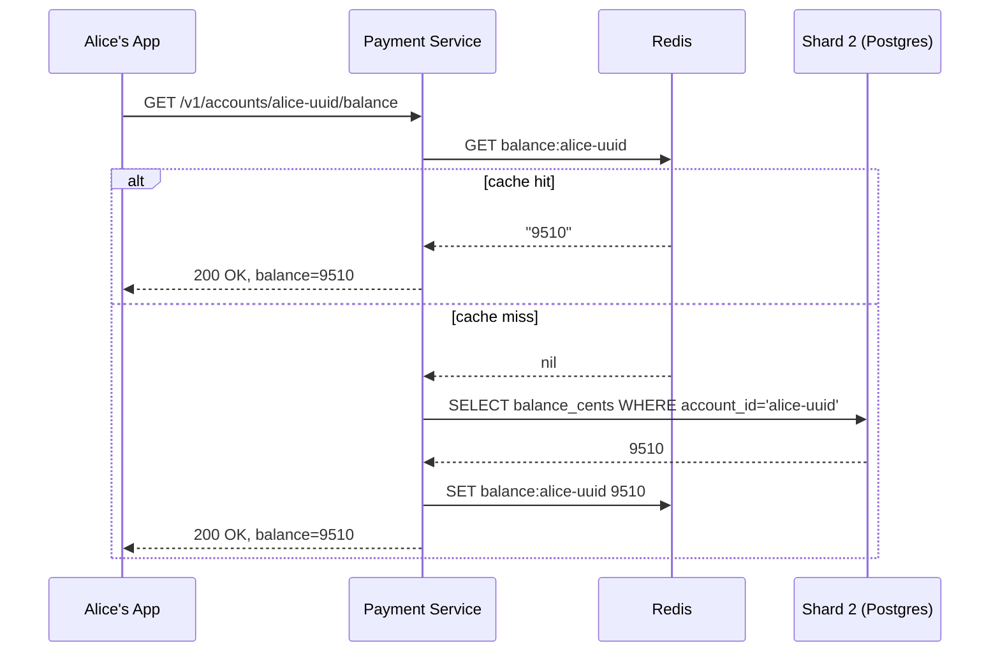

The cache-miss branch (say, after a Redis restart or eviction) falls back to Postgres and repopulates — this is the standard cache-aside pattern for the miss case, layered on top of write-through for the update case.

---

## Interviewer Follow-Ups

**"Why not just cache-aside everything, including the debit path, and accept eventual consistency?"**
Because "eventual consistency" on a debit decision means "sometimes approves a payment the account can't actually cover" — for most systems that's a fine trade, but for money movement it's not a staleness bug, it's a correctness bug indistinguishable from a lost-money incident. The cost of always hitting Postgres for the debit path is a single indexed row lock, which is cheap enough that there's no real performance reason to risk it.

**"What happens if Redis and Postgres disagree — say Redis says $95.10 but Postgres says $100.10?"**
Postgres is always the source of truth; Redis is a display accelerator that can be wiped and rebuilt entirely from Postgres with zero data loss. If they disagree, worst case is Alice sees a stale number on screen for a moment — never a wrong debit, since the debit path doesn't consult Redis at all.

---

We've now covered the full core loop: writes, idempotency, sharding, sagas, recovery, event-driven detection, and reads/caching. Ready for the final full architecture recap, end-to-end path listings, and the "why not X" cheat sheet — or is there another piece (replication/consistency model, multi-region, failure handling like circuit breakers) you want to go deeper on first?

---

# Replication, Multi-Region, and Failure Handling

You've asked for three NFRs together — let's take them in turn, each grounded in what we've already built rather than starting from scratch.

---

## Replication & Consistency

### Does This System Need Read Replicas At All?

Justify it against the actual read:write ratio, not by default. We already established that balance and history reads are far more frequent than payments themselves — every app open is a read, but a payment only happens when Alice actually pays someone. That's a classic read-heavy skew, and it's a genuine argument for read replicas on the **Postgres shards themselves** (separate from the Redis cache we just built, which handles the hottest reads before they even reach Postgres).

Why do we need both a cache *and* replicas, if Redis already absorbs most reads? Because Redis can be cold (just restarted, key evicted) or simply not have every possible query shape cached — someone querying a date-range of transactions that isn't the "last 50" sorted-set case still needs to hit Postgres, and we don't want that falling straight onto the primary that's also handling every write.

### How Many, Sync or Async, and What That Costs

For the `accounts` table specifically — the one holding actual money — this is where the sync-vs-async decision has real teeth.

**Async replication** (the common default): the primary commits and acknowledges the client immediately; replicas catch up shortly after, typically milliseconds behind. Cheap, doesn't add write latency. The risk: if the primary fails *right after* committing a debit but *before* that write ships to any replica, and a replica gets promoted to new primary, that committed debit is gone — Alice's money vanished from the new primary's perspective, even though we told her it succeeded.

**Synchronous replication** to at least one replica: the primary doesn't acknowledge the commit until at least one replica has durably received the write too. This closes that gap — a failover can't lose an acknowledged transaction, because by definition at least one other node already has it. The cost is real: every debit now waits for a network round-trip to another machine before it's considered done, adding tail latency to every single payment.

**The choice for this system:** synchronous replication to one replica for the `accounts` and `payments` tables specifically, with any *additional* replicas (say, a second or third for read scaling) staying asynchronous. This is a deliberate split — we pay the sync latency cost only for the minimum needed to prevent losing an acknowledged payment, and get the read-scaling benefit cheaply from extra async replicas layered on top.

| Replication mode | What we gain | What we pay |
|---|---|---|
| Fully async | Lowest write latency | Risk of losing the last committed write on failover |
| Fully sync (all replicas) | Maximum durability | Highest write latency, and one slow replica stalls every write |
| Sync to 1, async to rest (our choice) | Durability floor without full latency cost | Slightly more write latency than pure async; extra ops complexity |

### What Consistency Model Falls Out of This

For the **debit/credit path**, we get **read-your-writes on the primary** — any read immediately following a write, routed to the primary, sees that write, because that's just normal single-node Postgres behavior. This is why the debit decision (the `FOR UPDATE` check) always reads from the primary, never a replica — a replica read here could be milliseconds stale and approve an overdraft.

For **balance display reads served from a read replica** (say, during a replica-served fallback when Redis is cold), we get **eventual consistency** — Alice might see a balance that's a few milliseconds out of date if she reads immediately after a write lands elsewhere. Concretely: Alice pays Bob, and if her *own* subsequent balance-display read happens to hit a lagging replica before that replica caught up, she could briefly see her pre-payment balance. This is tolerable for display, for the same reason the Redis cache staleness was tolerable — nothing here can never approve an incorrect debit, because the debit decision never uses this path.

---

## Multi-Region

### How Write Ownership Is Decided

The real question isn't "do we deploy in three regions" — it's **who's allowed to accept a write for a given account, and where.**

The natural fit here is **home-region-per-account**: Alice's account is provisioned in, say, the US region, and the US region's shard cluster is the sole writer for her account, permanently (barring an explicit account migration). This mirrors our sharding decision — we're just adding "region" as another dimension of the same idea: a given account has exactly one authoritative shard, and now that shard lives in exactly one region.

Why not multi-writer, where any region can accept a write for any account? Because that reopens the exact problem sharding was designed to avoid: if both a US replica cluster and an EU replica cluster could accept a debit against Alice's account independently, you need genuine conflict resolution when both accept a concurrent debit that together would overdraft her — and that's strictly harder than anything we've built so far, for a benefit (write locality everywhere) that most payment systems don't actually need, since Alice mostly transacts near her home region anyway.

### How Cross-Region Conflicts Are Avoided, By Construction

Because we chose single-writer-per-account, **there is no conflict to resolve** — every write to Alice's account, from any region's Payment Service instance, gets routed to her home region's shard as the one and only place that write can commit. A Payment Service instance in the EU handling a request that happens to involve Alice's account simply forwards that piece of the transaction to the US shard, the same way our saga already forwards the credit-side write to whatever shard owns Bob's account.

This is the same trade-off DynamoDB Global Tables and similar systems name explicitly: single-writer-per-partition avoids conflict resolution entirely, at the cost of cross-region latency whenever a write has to reach a home region that isn't nearby. For payments specifically, that's an acceptable cost — a payment already involves cross-shard coordination (our saga), so cross-region is just a longer-latency version of a coordination pattern we've already built, not a new kind of problem.

### Data Sovereignty

Worth naming since it's a real regulatory driver, separate from the technical argument: an EU user's account data generally needs to physically reside within the EU (GDPR-adjacent requirements). Home-region-per-account gives us this for free as a side effect — Alice's data never needs to leave the US, Bob's EU counterpart's data never needs to leave the EU, because "home region" was already the right sharding boundary for latency and conflict-avoidance reasons, and it happens to satisfy the compliance requirement too.

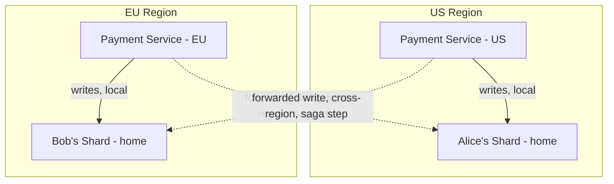

---

## Failure Handling

We've already built idempotency and retries-with-recovery for the payment saga itself. What's left is the general defensive layer around every network call in the system — the stuff that keeps one slow dependency from taking the whole system down with it.

### Timeouts and Retries with Backoff and Jitter

Every inter-service call (Payment Service → Shard, Payment Service → Redis, Outbox Tailer → Kafka) needs an explicit timeout — without one, a hung dependency holds a thread or connection forever, and those pile up until the calling service itself runs out of resources and falls over too.

When a retry is warranted (a transient timeout, not a business-logic rejection like insufficient funds), it should use **exponential backoff with jitter** — wait longer between each successive retry, and randomize that wait slightly. The jitter part matters more than it sounds: if a shard goes briefly unavailable and a thousand Payment Service instances all retry on the exact same fixed schedule, they all hammer it again simultaneously the moment it comes back, which can knock it back down immediately. Randomizing the wait spreads that retry storm out instead of concentrating it.

### Circuit Breakers

Picture Shard 5 (Bob's shard) going into a bad state — overloaded, responding slowly but not outright down. Without protection, every Payment Service instance keeps sending it requests, each one waiting out its full timeout before failing, which means Shard 5's already-bad state gets worse (more queued requests) and every caller wastes a timeout's worth of latency finding that out.

A **circuit breaker** sits in front of that call: once failures against Shard 5 cross a threshold (say, 50% of calls failing over the last 10 seconds), it "trips open" — for a cooldown window, calls to Shard 5 fail immediately, without even attempting the network call, giving Shard 5 room to recover instead of being buried under retries. After the cooldown, it moves to "half-open" and lets a small trickle of requests through as a test; if those succeed, it closes again and traffic resumes normally.

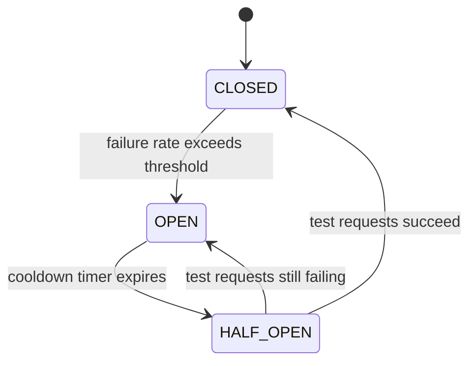

For our saga specifically: if the circuit breaker for Shard 5 is open when we try step 4 (the credit), we don't retry into a wall — we fail fast, and the payment stays in `DEBITED`, exactly the state our Recovery Worker already knows how to find and act on later. The circuit breaker doesn't need new recovery logic; it just decides *faster* that recovery will be needed.

### Bulkheads

The name comes from ship design — a ship is divided into watertight compartments so a single hull breach floods one compartment, not the entire vessel. Applied here: if the Payment Service uses one shared connection pool for calls to *every* shard, a single slow or overloaded shard can exhaust that shared pool, starving requests to every *other*, perfectly healthy shard too.

The fix is to give each shard (or each external dependency — Redis, Kafka, each downstream shard) its **own** isolated connection pool and thread budget, so Shard 5 having a bad day can only exhaust Shard 5's own slice of resources, leaving Shard 2's calls unaffected.

### Dead-Letter Queues

For the Outbox Tailer specifically: if a particular event repeatedly fails to publish (say, malformed payload from a bug, not a transient Kafka outage), retrying it forever isn't productive — it just clogs the tailer's attention on one bad row while healthy rows queue up behind it. After some bounded number of retries, that event gets moved to a **dead-letter queue** — a separate topic or table for events that need human investigation — so the tailer can move on to everything else, and nothing gets silently dropped or silently stuck forever.

### Idempotency — Already Covered

Worth noting explicitly rather than re-deriving: every retry-safe mechanism above (retries with backoff, circuit-breaker half-open probes, dead-letter reprocessing) leans on the idempotency guarantees we already built — the idempotency key on payment creation, and the idempotent `applied_credits` write on the credit side. Failure handling doesn't need a separate idempotency story; it's consuming the one we already have.

---

## Interviewer Follow-Ups

**"Why sync replication for accounts specifically, but not for, say, the outbox table?"**
The outbox table's worst case if a write is lost on failover is a delayed or missing event — recoverable, since the slow-polling backstop and the `DEBITED`-without-`CREDITED` detection still catch it eventually. Losing a committed *balance* write on failover is unrecoverable by any downstream mechanism — there's no "backstop" for money that was debited and then forgotten. The sync-replication cost is reserved for the one table where losing a write has no fallback.

**"What if the circuit breaker itself has a bug and never closes again even after Shard 5 recovers?"**
This is why the half-open state exists as an automatic, timer-driven probe rather than requiring manual intervention — but as a defense in depth, this is exactly the kind of thing observability (next section, if we get to it) needs to alert on: a circuit breaker stuck open past some expected recovery window is itself an incident, not a silent steady state.

---

We've now covered every NFR on the checklist in real depth. Ready for the final full architecture recap, the complete end-to-end path listings, and the "why not X" cheat sheet?

---

# Final Architecture Recap

## Full System Diagram

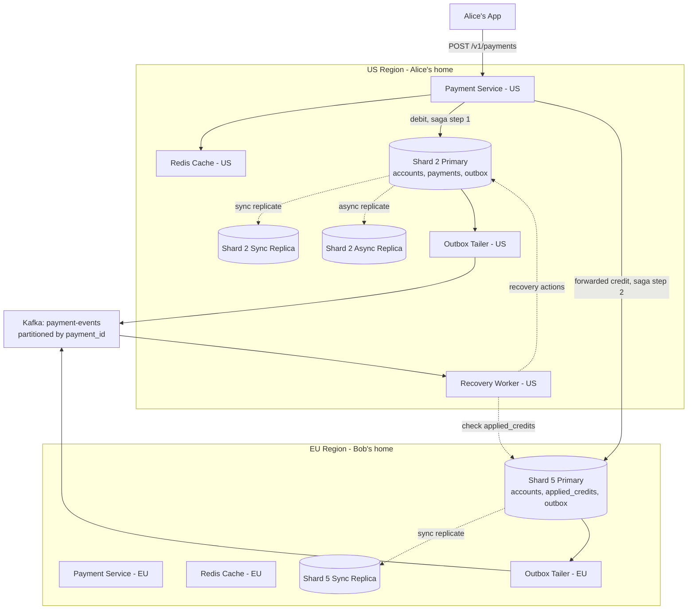

---

## End-to-End Paths

### 1. Write Path — Alice Pays Bob

1. `POST /v1/payments` with idempotency key arrives at Payment Service (US).
2. Claim idempotency key on Shard 2, status `PENDING`.
3. Single local transaction on Shard 2: debit Alice, status → `DEBITED`, insert `outbox` row.
4. Outbox Tailer (US) picks up the row, publishes `DEBITED` to Kafka, marks published.
5. Forwarded write reaches Shard 5 (Bob's home shard): credit Bob, insert `applied_credits`, insert `outbox` row.
6. Outbox Tailer (EU) publishes `CREDITED` to Kafka.
7. Payment Service updates status → `COMPLETED` on Shard 2, publishes `COMPLETED` event.
8. `200 OK` returned to Alice's app.

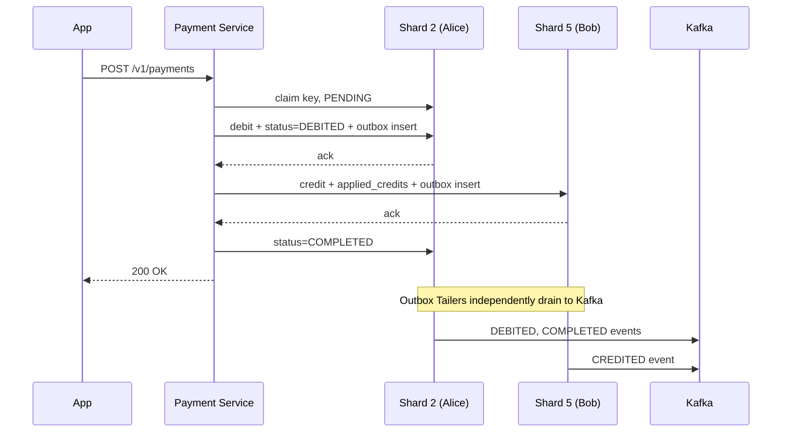

### 2. Read Path — Balance and History Display

1. App requests balance.
2. Payment Service checks Redis (`balance:alice-uuid`) — cache hit returns immediately; miss falls back to Shard 2 primary or replica, then repopulates Redis.
3. History requests hit `history:alice-uuid` sorted set the same way.
4. **Note:** the pre-debit balance check inside the write path never uses this cache — it always reads Shard 2's primary directly under `FOR UPDATE`.

*(Sequence diagram already covered in the caching section — unchanged here.)*

### 3. Recovery Path — Stuck Saga Detection

1. Recovery Worker consumes `payment-events` from Kafka.
2. Sees a `DEBITED` event with no matching `CREDITED` within its short timer window.
3. Checks Shard 5's `applied_credits` table for that `payment_id`.
4. If found: credit already happened, just mark `COMPLETED`. If not found: retry the credit. If retries exhaust: compensate — credit Alice back, mark `FAILED`.
5. A slow polling backstop (minutes-scale) independently re-scans for `DEBITED` rows with no event ever published at all, covering the outbox-publish gap.

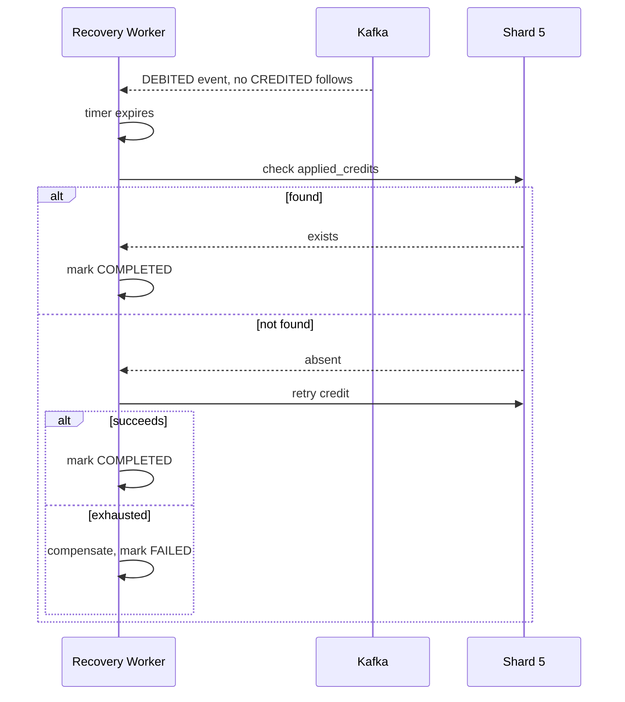

---

## The "Why Not X" Cheat Sheet

| Question | Defensible one-line answer |
|---|---|
| Why not two plain sequential DB writes instead of a saga? | A crash between them silently loses money with no recovery path — the saga's durable status field makes the intermediate state visible and recoverable. |
| Why not 2PC instead of sagas? | 2PC blocks and freezes locked resources indefinitely if the coordinator dies mid-protocol; sagas keep every step locally committed and independently recoverable. |
| Why not shard by `payment_id`? | Payments touch two accounts, so the payment row and both balances would live on three different shards — every payment becomes a distributed transaction. |
| Why not floats for money? | Binary floating point can't represent most decimals exactly, causing rounding drift that breaks cent-level ledger reconciliation at scale. |
| Why not skip idempotency and just tell clients not to retry? | You don't control every client, and a client can crash after sending but before recording the outcome — the guarantee has to live server-side. |
| Why not fully async replication everywhere? | An acknowledged debit could be lost on failover before it reaches any replica — sync replication to at least one replica closes that gap for the tables holding real money. |
| Why not multi-writer across regions? | Requires genuine conflict resolution for concurrent debits on the same account; single-writer-per-home-region avoids the conflict entirely, at the cost of cross-region latency for non-local writes. |
| Why not a CDN for balance data? | Balances are fully personalized and mutate on every payment — there's no shareable, cacheable-by-anyone content for a CDN to help with. |
| Why not use the cache for the debit decision to save a DB hit? | A stale cache read on the debit path risks approving an overdraft — a correctness bug, not just a staleness inconvenience. |

---

What would you like to do next — drill deeper into any single piece of this (say, the outbox/CDC upgrade, or observability/monitoring we haven't touched yet), or should I run a mock interviewer Q&A and pressure-test you on the whole design?

---

# The Outbox/CDC Upgrade — From Polling to Tailing the Write-Ahead Log

Let's revisit the Outbox Tailer we built earlier. It works, but it's still fundamentally a poller: `SELECT * FROM outbox WHERE published = FALSE`, on a timer. Let's see exactly what that costs us, and how Change Data Capture fixes it.

## What the Polling Tailer Actually Costs

Picture this at real scale: Shard 2 alone might process hundreds of payments per second at peak, each writing one or more outbox rows. The tailer polls, say, every 500ms to keep latency reasonable. Two costs stack up.

**Latency is bounded by the poll interval, not by how fast the event could actually be published.** An event that lands right after a poll cycle just checked the table sits there for up to 500ms before the next cycle even looks at it. That's not catastrophic, but it's pure waiting for no reason — the row was ready to publish the instant it was inserted.

**The query itself scales badly as the outbox grows.** Even with `published = FALSE` indexed, every poll cycle re-scans that index, every shard, every 500ms, forever — whether or not there's anything new. And if publishing ever falls behind (a slow Kafka moment), the "unpublished" set grows and each poll does more work scanning it, right when the system is already under stress. This is the same shape of problem we hit with the original 30-second recovery poll — cost that scales with polling frequency and table size, not with actual new work.

## The Fix: Read the Database's Own Write-Ahead Log Instead

Here's the reframe: Postgres already knows, instantly, the moment a row is inserted — it just wrote that fact to its **write-ahead log (WAL)**, the durable, ordered record every transaction commit appends to, that Postgres itself uses for crash recovery and replication. Instead of polling a table and asking "did anything change since last time," we can **subscribe directly to that log** and get told the instant a row is inserted, with zero polling delay and no repeated table scan.

This is **Change Data Capture (CDC)** — treating a database's replication stream as a first-class event source, rather than something only the database's own replicas consume.

### Why Postgres Logical Replication Is the Right Technology Class Here

This is a genuinely new technology entering the picture, so it's worth justifying against the alternative. Postgres offers **logical replication slots** specifically for this: unlike physical replication (which ships raw disk-block changes, only readable by another Postgres instance), a logical replication slot decodes WAL entries into a structured, row-level change stream — "this row was inserted into this table, here are its column values" — that any external consumer can read.

The alternative would be building our own trigger-based capture (a Postgres trigger that fires on `INSERT INTO outbox` and pushes to some queue itself). That works but adds latency and load *inside* the same transaction we're trying to keep fast, and it's one more thing that can fail inside the write path. Logical replication instead reads the WAL entirely **outside** the transaction's critical path — the transaction just commits normally, and the WAL stream is consumed asynchronously by something watching from the outside. That separation is exactly what we want: zero added latency to the payment write itself, but near-instant downstream notification.

### Debezium as the Connector

**Debezium** is the standard tool here — it's a CDC connector that attaches to a Postgres logical replication slot, decodes the WAL stream into structured change events, and publishes them directly to Kafka, without us writing any polling code ourselves.

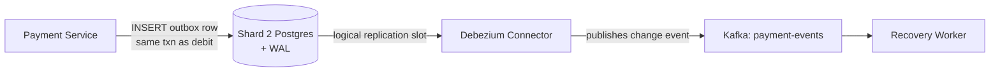

## Revised Flow

The write side is **unchanged** — this is worth being explicit about, because the upgrade is entirely on the publishing side, not the transaction itself.

1. Payment Service's local transaction on Shard 2 — debit Alice, status → `DEBITED`, `INSERT INTO outbox (...)` — exactly as before, same schema, same atomicity guarantee.
2. Payment Service commits and returns to the client — unchanged, still never waits on Kafka.
3. **New:** the moment that transaction commits, Postgres appends the `INSERT` to its WAL, as it always does for crash-recovery purposes anyway — this isn't extra work we're asking Postgres to do, it's a side effect of committing that already happens.
4. **New:** Debezium, subscribed to Shard 2's logical replication slot, sees this new WAL entry within milliseconds and decodes it into a structured change event: `{"op": "c", "table": "outbox", "after": {"payment_id": "pay-1", "event_type": "DEBITED", ...}}`.
5. **New:** Debezium publishes this event to the `payment-events` Kafka topic, keyed by `payment_id` — same topic, same partitioning, same downstream consumers as before.
6. Recovery Worker consumes it exactly as it did in the polling-tailer version — nothing about the consumer side changes at all.

```mermaid
sequenceDiagram
    participant PS as Payment Service
    participant S2 as Shard 2 (Postgres + WAL)
    participant DBZ as Debezium
    participant K as Kafka
    participant RW as Recovery Worker

    PS->>S2: BEGIN; debit; status=DEBITED; INSERT outbox; COMMIT
    S2-->>PS: ack
    Note over PS: returns to client immediately
    S2->>S2: WAL entry appended (normal commit behavior)
    DBZ->>S2: reads logical replication slot
    S2-->>DBZ: decoded outbox INSERT event
    DBZ->>K: publish DEBITED event
    K-->>RW: DEBITED event delivered
```

Notice steps 1–2 are byte-for-byte identical to the transactional outbox pattern from before. That's the point of this upgrade — it doesn't touch correctness at all, it only changes *how fast and how cheaply* the event gets from "committed in the database" to "visible to Kafka consumers."

## What We Gained, What We Gave Up

**Gained:** near-instant publish latency (milliseconds instead of a poll interval), zero repeated table-scanning cost, and — as a side benefit — we no longer need the `published` boolean column or the `UPDATE outbox SET published = TRUE` write at all, since Debezium tracks its own read position in the WAL stream (a replication slot position), not a column on our table. That's one less write per event, on the hot path's own table.

**Gave up:** operational complexity. Debezium is another service to run, monitor, and scale — it needs its own alerting for "is this connector still keeping up with the WAL," and a stuck or crashed Debezium instance means events stop flowing even though the database side is working perfectly. We've also taken on a dependency on Postgres's logical replication slot mechanism specifically, which has its own failure mode worth naming: **if Debezium falls behind or disconnects for a long time, the replication slot holds onto WAL segments so it can resume from where it left off — and an abandoned or badly-lagging slot can cause the primary's WAL to grow unbounded, eventually risking disk exhaustion on the primary itself.** This needs its own monitoring (alert on slot lag, not just on outbox row count) — a genuinely new operational surface that the simple polling tailer never had.

**What we considered and rejected:** trigger-based capture (fires inside the transaction, adds latency and a new failure point to the write path itself — rejected for that reason) and keeping the polling tailer but shortening its interval to, say, 50ms (reduces latency somewhat, but the table-scan cost scales with frequency, so we'd just be trading latency for CPU load on the exact table sitting in the hot write path — rejected because it doesn't fix the underlying inefficiency, just shifts it).

| Approach | Publish latency | Ongoing cost | New failure mode |
|---|---|---|---|
| Polling tailer (original) | Bounded by poll interval | Repeated table scan every cycle | None new — just latency |
| Trigger-based capture | Near-instant | Extra work inside the write transaction | Adds risk to the hot write path itself |
| CDC via Debezium (this upgrade) | Near-instant, off the write path | Runs entirely outside the transaction | Slot lag risking WAL growth on the primary |

---

## Interviewer Follow-Ups

**"If Debezium crashes for an hour, do we lose any events?"**
No — this is exactly what the replication slot buys us. Postgres retains the WAL segments the slot hasn't yet acknowledged as consumed, so when Debezium comes back, it resumes exactly where it left off and processes everything that accumulated. The risk isn't lost events, it's disk pressure on the primary from retained WAL if the outage runs long enough — which is why slot lag needs active alerting, not just a "trust it'll catch up" assumption.

**"Do we still need the `published` boolean column on the outbox table?"**
Not for Debezium's own tracking — it manages its own position via the replication slot. It's still reasonable to keep a lightweight audit trail or TTL-based cleanup job for old outbox rows, but that's now a housekeeping concern, not a correctness mechanism the way it was under polling.

---

Want to keep going — observability/monitoring is the one checklist item we haven't touched — or move to the mock interviewer Q&A to pressure-test the whole design?

---

# Observability and Deployment Strategies

These are the two checklist items left, and they're both less about deep distributed-systems tension and more about "how do you actually run this thing in production without flying blind." Let's cover them together since neither needs the full three-attempts treatment — they're more straightforward applications of known patterns to our specific system.

---

## Observability

### The Scenario That Motivates This

Imagine it's 2am, and someone on the on-call rotation gets paged: "payment success rate dropped." With everything we've built so far — sagas, sharding, outbox, Kafka, Redis — there are now a dozen places something could have gone wrong. Without the right signals, that page turns into an hour of guessing. Observability is what turns "something's wrong somewhere" into "Shard 5's credit step is failing, starting at 1:47am, correlated with a Redis connection pool exhaustion."

### Metrics — What to Actually Track

Generic advice says "track latency, errors, traffic." For this specific system, a few metrics matter more than others because they map directly to the failure modes we designed around.

**Saga-specific metrics** are the most important ones we haven't had a generic playbook for:
- Count of payments currently sitting in each status (`PENDING`, `DEBITED`, `COMPLETED`, `FAILED`) — a sudden spike in `DEBITED` with no corresponding `COMPLETED` growth is the single clearest signal that something downstream (Shard 5, Kafka, Debezium) is unhealthy, and it's exactly the condition our Recovery Worker is built to react to.
- Recovery Worker's own action counts — how many payments it's completing-via-check, retrying, versus compensating. A sudden jump in compensations means something is failing hard enough that retries are exhausting, not just being slow.
- Outbox/CDC lag — how far behind is Debezium's replication slot, in both time and WAL bytes retained. This is the metric that catches the "Debezium crashed, WAL is growing unbounded" failure mode before it becomes a disk-full incident.

**Standard infrastructure metrics**, applied to our specific components:
- Per-shard write latency and error rate (catches a single bad shard before it takes down the whole payment rate).
- Redis hit/miss ratio on `balance:*` and `history:*` keys — a sudden drop in hit rate means either a mass eviction or a cold restart, and tells you to expect a Postgres load spike right behind it.
- Circuit breaker state per downstream dependency (open/half-open/closed) — this should be a first-class dashboard, not just logs, since "is Shard 5's breaker currently open" is a direct answer to "why are payments to Bob failing."

### Logs — What They Need to Carry

Every log line touching a payment needs the `payment_id` attached, always — not as a nice-to-have, but as a hard requirement, because that's the only way to reconstruct a saga's full path across the Payment Service, both shards, the Outbox Tailer/Debezium, and the Recovery Worker after the fact. This is the same idea as our audit requirement from the very start of scoping — logs are effectively a second, less-structured audit trail, and `payment_id` is the join key that makes them useful.

### Distributed Tracing

Here's the thing metrics and logs don't give you well: a single payment's journey *across* every one of those components, with actual timing. A trace, with `payment_id` as the trace ID (or a correlation field carried alongside it), lets you pull up one specific payment and see: 4ms to claim the idempotency key, 12ms to debit Alice, 340ms waiting on the forwarded credit to Shard 5, 2ms to publish the outbox row, 890ms until Debezium's event shows up in Kafka.

That kind of per-payment breakdown is what actually answers "why was *this* payment slow" — aggregated metrics tell you the system is slow on average, a trace tells you which specific hop, for which specific payment, ate the time. For a support team investigating one user's complaint ("my payment took 5 seconds"), a trace is often the only tool that answers the question directly.

| Signal | Answers | Example for this system |
|---|---|---|
| Metrics | Is something wrong, in aggregate, right now? | Saga status counts spiking `DEBITED`, breaker open for Shard 5 |
| Logs | What exactly happened, for one entity, after the fact? | Every state transition for `payment_id=pay-1`, in order |
| Traces | Where did the time go, across every hop, for one request? | 340ms of a 5-second payment sat waiting on Shard 5 |

---

## Deployment Strategies

### Why This Is Harder Than "Just Roll Out the New Version"

Most services can do a straightforward rolling deploy — swap old instances for new ones gradually, watch error rates, roll back if they spike. Payments have one extra wrinkle that makes this riskier than usual: **a bad deploy doesn't just cause errors, it can move money incorrectly**, and unlike a bad UI deploy, you can't just "undo" a debit that already happened without running a real compensating transaction. So the deployment strategy has to be paranoid in a way that, say, a recommendation service's deployment doesn't need to be.

### Schema Migrations — The Part That Breaks First

Here's the concrete failure mode worth naming: say we want to add a new column to the `payments` table. If we deploy new Payment Service code that *writes* to that new column at the same moment we run the migration that *creates* it, any request hitting an instance that hasn't migrated yet fails outright, or worse, writes are inconsistent across instances mid-rollout.

The standard fix is **expand-contract migration**: first deploy a migration that only *adds* the new column (nullable, no code depends on it yet) — this is safe to run while old code is still live, since old code simply ignores the new column. Then deploy new application code that writes to it, once the column already exists everywhere. Only in a later, separate deploy do you make the column non-nullable or drop anything old — the "contract" phase. This three-step separation means schema changes and code changes are never coupled into one risky simultaneous change.

### Canary Deployment for the Payment Service

Rather than deploying new Payment Service code to every instance at once, roll it out to a small slice first — say, 1% of traffic — and specifically watch our saga-health metrics from above (status distribution, compensation rate) on that slice before expanding. This is standard canary practice, but the *choice of what to watch* is specific to us: a generic canary might just watch HTTP error rate, but for payments, a subtle bug could return `200 OK` while silently miscalculating an amount — so the canary dashboard needs payment-specific correctness signals (does debited amount always equal credited amount for payments touching the canary instances), not just "did the request succeed."

### Feature Flags Around Saga Steps

Given the saga has distinct steps, a genuinely useful pattern here is putting a feature flag around any *new* step or changed step in the saga logic — for example, if we're rolling out a change to how the compensating transaction is triggered, flag it so it can be enabled for a small percentage of `FAILED`-bound payments first, observed, and only then ramped up. Because the Recovery Worker's actions are idempotent by construction (something we established earlier), this kind of gradual flagged rollout is low-risk — even if the flag misbehaves, worst case is a recovery action gets retried, not duplicated.

### Blue-Green, and Why It's Less Central Here Than You'd Expect

Blue-green deployment (running two full parallel environments and switching traffic between them atomically) is popular for stateless services, but it's a harder fit for the *stateful* pieces of this system — you can't cleanly "blue-green" a Postgres shard holding live account balances the way you can an app server, since both environments would need to share the same underlying data to avoid split-brain on money. In practice, blue-green applies cleanly to the stateless Payment Service instances themselves, while the shards and Kafka underneath get the more careful expand-contract and canary treatment instead — it's worth being explicit that "blue-green everything" isn't actually the right mental model for a system with this much durable state.

---

## Interviewer Follow-Ups

**"How would you actually detect a deploy caused a problem, versus a normal transient blip?"**
Compare the canary slice's saga-health metrics against the stable majority's, in the same time window — if the canary's compensation rate or `DEBITED`-stuck rate is meaningfully higher than the control group experiencing the same real-world conditions, that's a signal specific to the new code, not just ambient noise.

**"What's your rollback plan if a bad deploy already processed some payments incorrectly before you caught it?"**
Rolling back the code stops new incorrect payments, but any already-processed ones need to be identified (via the audit trail — this is exactly why every state transition is durably logged with a `payment_id`) and fixed via new, explicit compensating transactions — never by trying to "undo" history in place, since the ledger is append-only by design.

---

That covers the full checklist. Want to run the mock interviewer Q&A now to pressure-test the whole design end-to-end, or is there a specific piece you'd like to revisit first?

---
