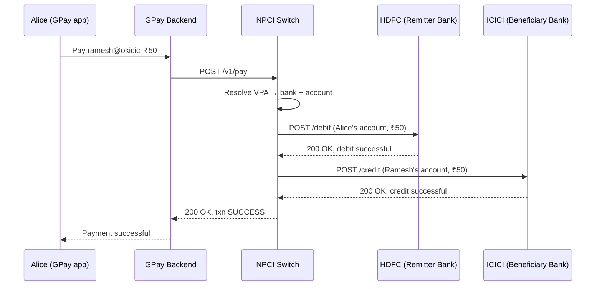
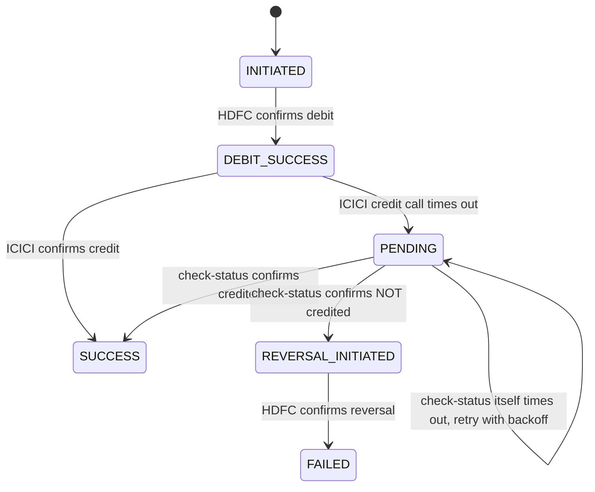
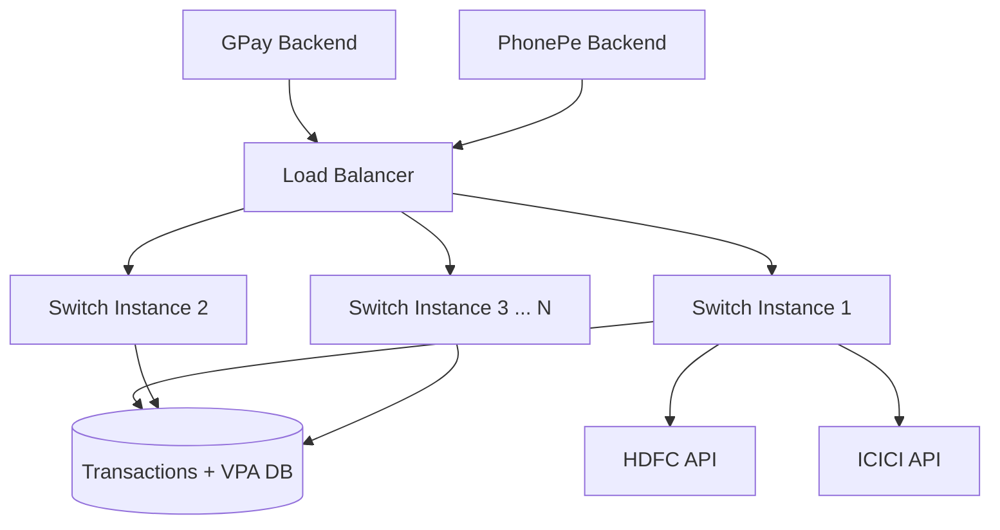
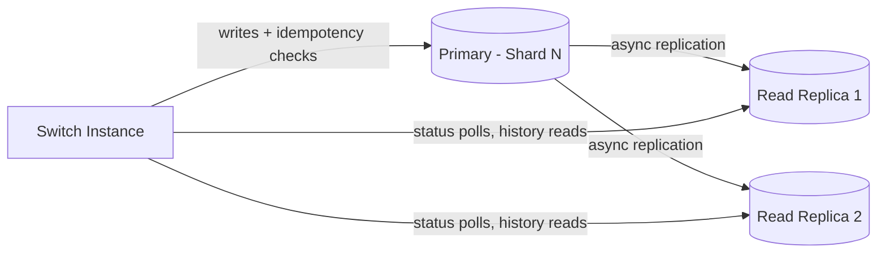
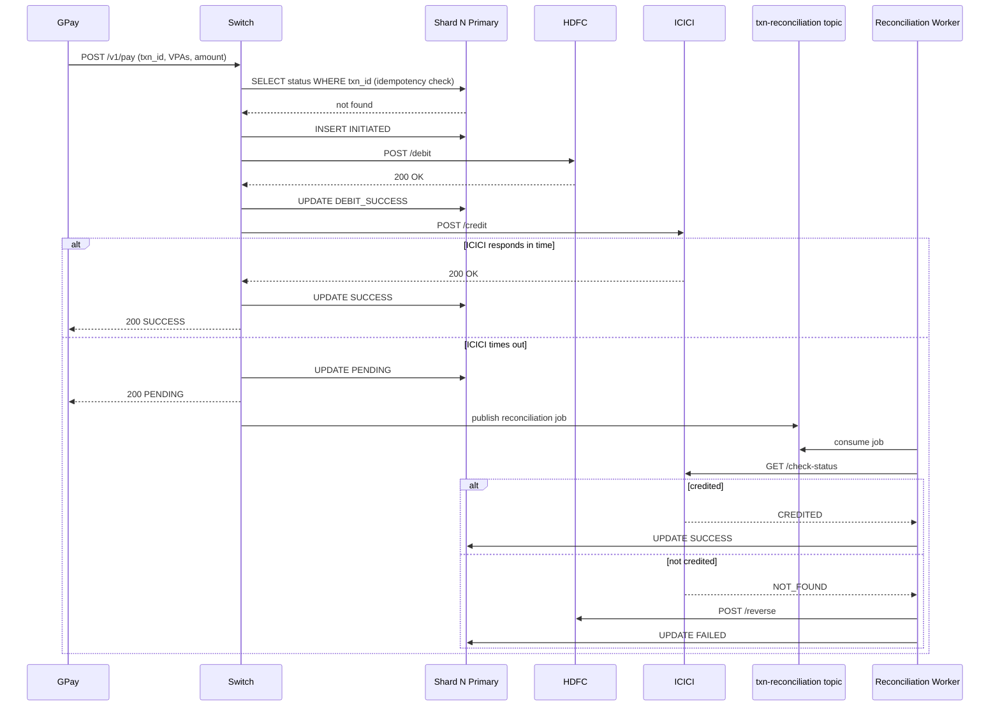
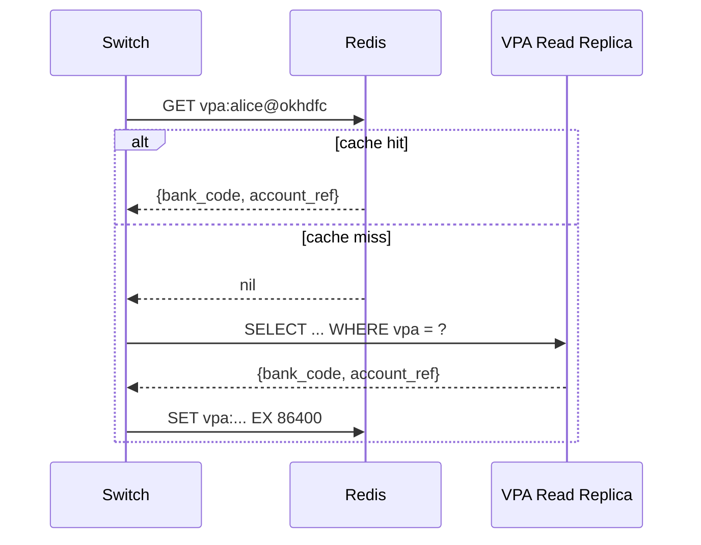
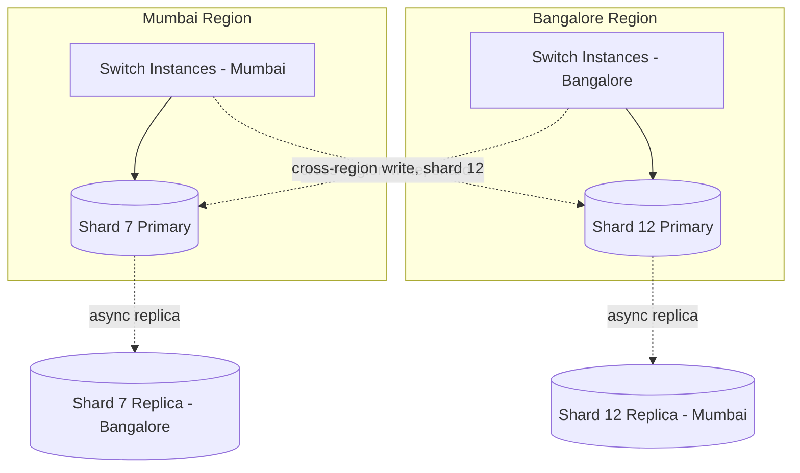
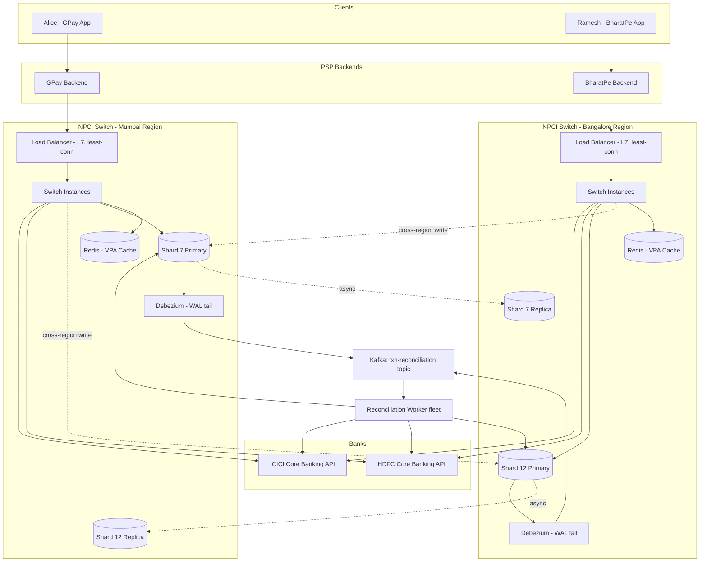

## Why UPI exists

It's 2015 in India. Moving money between two banks means knowing the recipient's full account number and an IFSC code — a string like `HDFC0001234` — and typing it into a form, hoping you didn't fat-finger a digit.

NEFT settles in batches, RTGS is for big-ticket transfers only, and IMPS is instant but still needs that account number dance. Meanwhile over 80% of transactions in the country are still cash, because paying a vegetable vendor by "opening netbanking and adding a beneficiary" is absurd.

NPCI's insight: what if you could pay anyone using something as memorable as an email address — `alice@okhdfc` — and have money move bank-to-bank in seconds, with your bank and their bank never having talked to each other before, at 2am on a Sunday, for free, forever? That's UPI.

## Scoped requirements — confirm before we start

**P0 — the requirements that actually shape this design:**

1. **Instant transfer using an abstract identifier (VPA), not raw account details.** Alice pays `bob@okicici` and the money moves in seconds — she never sees or needs Bob's account number.
2. **Interoperability by construction.** Alice's app (say, GPay, backed by HDFC) must be able to pay Bob, whose account sits at ICICI, without GPay or HDFC having any prior bilateral relationship with ICICI. This is why a central switch (NPCI) exists at all — every bank+app pair meets in the same place.
3. **Atomic, correct money movement across two banks that don't share a database.** Debit must happen at Bank A, credit must happen at Bank B, and the system must never end up in a state where one happened and not the other — no double-debit, no money vanishing into the switch. **This is the crux.** There's no shared transaction log between two competing banks' core banking systems, so you can't just wrap this in a normal ACID transaction. This is where almost all our distributed-systems discussion will live.
4. **High volume, 24x7 availability.** UPI does billions of transactions a month nationally, with sharp spikes (salary day, festival sales), and unlike NEFT it has no "batch window" — it's expected to just always work, including 3am on a bank holiday.

**Explicitly cutting (P2, no architectural impact on the core flow):**

- **UPI Lite / offline small-value payments** — a separate on-device wallet mechanism, doesn't touch our core switch design.
- **Recurring mandates / Autopay** — a scheduling layer on top of the same rails; interesting but additive, not foundational.
- **Credit-line-on-UPI, rewards, cashback** — pure product features layered on top, zero effect on how the switch or ledgers work.
- **Fraud/risk analytics dashboards** — a consumer of transaction data, not a producer; doesn't change the write path.

Item 3 is going to dominate — it's a genuinely hard "distributed transaction between two sovereign systems" problem, and NPCI's actual solution to it (which is elegant and a little surprising) is worth walking through slowly with a couple of naive attempts first.

Does this scope look right to you? Once you confirm, I'll start at Day 0.

---

# Day 0 — The Naive Synchronous Switch

## The scenario

Alice has a GPay app backed by HDFC. She wants to pay Ramesh, who runs a chai stall and has ICICI Bank behind his BharatPe app.

Alice types `ramesh@okicici` and hits pay ₹50. She expects this to just work, instantly, even though GPay and ICICI have never spoken to each other before in their lives.

## The architecture

The simplest thing that could work: **one central switch**, run by NPCI, that every bank and every PSP app (GPay, PhonePe, BharatPe) has a prior agreement with.

Every bank exposes the same fixed set of APIs to the switch — debit, credit, check-status. The switch doesn't know or care what's inside each bank's core banking system; it just speaks this one contract to all of them.

On Day 0, the switch does everything **synchronously**, in one request-response cycle, on a single server, backed by a single database.



## The data, made explicit

**VPA mapping table** — lives in the Switch's database (a single Postgres instance is fine here, this is pure key-value lookup, low write volume relative to the rest of the system):

```sql
CREATE TABLE vpa_mapping (
    vpa VARCHAR(64) PRIMARY KEY,      -- 'ramesh@okicici'
    bank_code VARCHAR(16) NOT NULL,   -- 'ICICI'
    account_ref VARCHAR(64) NOT NULL, -- bank's internal account token, NOT raw account number
    psp_code VARCHAR(16) NOT NULL     -- 'BHARATPE'
);
```

- **Written by**: the bank/PSP, once, when Alice or Ramesh registers a VPA during onboarding.
- **Read by**: the Switch, on every single payment request, to resolve `ramesh@okicici` into "ICICI, account token X."

**Transaction table** — also in the Switch's DB:

```sql
CREATE TABLE transactions (
    txn_id UUID PRIMARY KEY,
    payer_vpa VARCHAR(64),
    payee_vpa VARCHAR(64),
    amount_paise BIGINT,
    status VARCHAR(16),   -- INITIATED, SUCCESS, FAILED
    created_at TIMESTAMP
);
```

- **Written by**: the Switch — once as `INITIATED` when the request lands, once more when it flips to `SUCCESS`/`FAILED`.
- **Read by**: the Switch itself for status checks, and later by reconciliation jobs (not built yet).

Why relational, not something fancier? At Day 0 volume this is a lookup table and an append-mostly log — Postgres gives us strong consistency on that single row update for free, and we have no access pattern yet that needs a wide-column store's horizontal write throughput. We'll revisit this the moment volume forces our hand.

## The numbered write path

1. `POST /v1/pay` — GPay backend calls the Switch: `{ "payer_vpa": "alice@okhdfc", "payee_vpa": "ramesh@okicici", "amount": 5000 }` (paise, to avoid floats).
2. **Switch** inserts a row into `transactions` with `status = INITIATED`.
3. **Switch** does `SELECT bank_code, account_ref FROM vpa_mapping WHERE vpa = 'alice@okhdfc'` and the same for Ramesh's VPA.
4. **Switch** calls `POST /debit` on HDFC's API with Alice's account ref and amount. HDFC's core banking system moves the money out of Alice's account into a suspense/settlement account and returns `200 OK`.
5. **Switch** calls `POST /credit` on ICICI's API with Ramesh's account ref and amount. ICICI credits Ramesh and returns `200 OK`.
6. **Switch** updates the transaction row: `UPDATE transactions SET status = 'SUCCESS' WHERE txn_id = ...`.
7. Switch responds to GPay, GPay shows Alice a success screen.

## Why this is a reasonable starting point, not a strawman

This gives us one honest guarantee: **as long as both bank calls succeed, the transaction is genuinely, correctly consistent** — one debit, one matching credit, nothing double-counted, no concurrency bugs, because there's exactly one thread handling this one request from start to finish.

That's a real property. It's just a property that only holds in the happy path — and the thing we're about to trade away, permanently, is the assumption that both calls always succeed.

## Break it

It's a Tuesday afternoon. ICICI is pushing a routine software update to their core banking system, and for 90 seconds their `/credit` endpoint is unreachable.

Alice hits pay. Step 4 succeeds — HDFC debits her ₹50, no problem. Step 5 times out — ICICI never responds, or responds after the Switch has already given up waiting.

Alice's ₹50 is gone from her account. Ramesh never got it. The chai stall transaction just quietly destroyed fifty rupees that belong to nobody's ledger anymore. Multiply this by a country doing billions of transactions a month, and this "rare timeout" is actually a routine, hourly occurrence at scale.

This is not a scale problem or a sharding problem — it's the fundamental one: **two banks, two independent systems of record, no shared transaction, and no way to make "debit here" and "credit there" atomic the way a single SQL transaction would.**

Next, we'll walk through the naive fixes people reach for first here — and why each one breaks in its own specific way — before landing on what NPCI actually does.

Want me to continue into that crux discussion?

---

# Evolve it — fixing atomicity across two banks

## Attempt 1: "Just retry the credit"

The instinct: step 5 failed, so retry it a few times before giving up.

This looks reasonable — most timeouts are transient, ICICI's blip lasts 90 seconds, a retry loop with a few seconds of backoff would sail right through it.

**Where it breaks**: retries don't tell you *why* the call failed. If ICICI's `/credit` timed out because the response got lost on the way back — not because the credit itself failed — you don't actually know if Ramesh already got paid. Retry blindly and you might credit him **twice**. Don't retry, and you might leave him uncredited. A timeout is ambiguous by nature: you know your request may or may not have been processed, and naive retries assume it wasn't.

## Attempt 2: "Add a compensating reversal"

The next instinct: fine, if credit fails after debit succeeded, don't retry the credit — instead, **reverse the debit**. Call HDFC and tell it to put Alice's ₹50 back.

This looks like the right fix. It restores Alice's balance, nothing is lost, the transaction fails cleanly.

**Where it breaks**: the reversal call is itself a network call to another bank, and it can *also* fail. If HDFC's reversal endpoint is unreachable right when you need it, you're now retrying a reversal with the exact same ambiguity problem you just tried to solve. You haven't eliminated the "call to an external system might silently fail" problem — you've just moved it one level down and pretended it's solved.

## Attempt 3: "Make the Switch smarter about deciding success/failure itself"

Maybe the Switch should just be more careful — check both banks' responses more carefully, add more error handling, make the code more robust.

**Where it breaks**: this doesn't touch the actual problem. No amount of "being more careful" on the Switch's side changes the fact that a network call across two organizations can time out in a way that's fundamentally ambiguous — you cannot distinguish "the request never arrived" from "it arrived, succeeded, and the response got lost" using retries and better exception handling alone. You need a mechanism that lets you *ask the truth* after the fact, not just guess harder.

## The real answer: deemed status is a lie, so ask for the truth

The actual fix has two parts, and both matter.

**Part 1 — every request carries a client-generated idempotency key**, not one the Switch invents. Alice's GPay app generates a UUID for this payment attempt *before* it ever reaches the Switch. That same UUID gets passed to HDFC's debit call and ICICI's credit call.

This means if GPay ever needs to retry the whole `/v1/pay` call (say the Switch itself was slow to respond), the Switch — and each bank — can recognize "I've already seen this exact key" and return the previous result instead of executing the debit or credit a second time. Retries become **safe** because they're idempotent, not because we promise not to need them.

**Part 2 — for the specific ambiguous case (debit succeeded, credit response unknown), don't guess. Ask.** Every bank in the UPI network is contractually required to expose a `/check-status` API keyed by that same transaction ID. If the Switch's call to ICICI times out, it doesn't retry the credit blindly and it doesn't reverse the debit blindly — it calls ICICI's `check-status` endpoint and asks "did txn `abc-123` actually land?"

- If ICICI says **yes, credited** → the Switch marks the transaction `SUCCESS`. Nothing more to do.
- If ICICI says **no, never received / not processed** → the Switch now knows it's safe to reverse HDFC's debit, because it has confirmed the credit genuinely never happened.
- If ICICI is *still* unreachable for the status check itself → the Switch parks the transaction in a `PENDING` / "in doubt" state and retries the status check on a backoff schedule (seconds, then minutes) until it gets a definitive answer, rather than resolving it optimistically.

This is the core trick: **the Switch never trusts its own memory of what happened over the network — it always defers to the source of truth, which is the bank's own ledger, queried explicitly.** This is functionally a two-phase reconciliation protocol, and it's close to how real interbank rails (UPI, and internationally SWIFT gpi's tracking) handle exactly this — status is always ultimately confirmed by asking the account-holding system, not inferred from a client-side timeout.



## What we gained / what we gave up

**Gained**: no more silent money loss. Every ambiguous outcome resolves to a definitive state eventually, driven by asking banks directly rather than guessing from timeouts.

**Gave up**: instant finality. A transaction can now sit in `PENDING` for anywhere from a few seconds to (in bad cases) a couple of minutes while the Switch reconciles. That's why you've likely seen a UPI app say "payment is processing, we'll notify you" instead of an instant success/failure — that UX exists *because* of this exact mechanism.

**Rejected alternative — true distributed 2PC (two-phase commit) across banks**: have the Switch send a "prepare" to both banks, wait for both to ack readiness, then send "commit" to both. This is the textbook atomic solution. It's rejected in practice because it requires banks to hold a lock on Alice's funds while waiting for the coordinator, across an organizational boundary, with no shared trust — a bank absolutely will not leave money in a prepared-but-uncommitted limbo state waiting on a third party's coordinator to say "go." Real 2PC needs a level of mutual trust and shared failure-recovery infrastructure that doesn't exist between competing commercial banks.

| Approach | Prevents double-credit | Prevents money loss | Requires bank trust/locking | Latency cost |
|---|---|---|---|---|
| Blind retry | No | No | No | Low |
| Compensating reversal only | Partial | No (reversal can fail too) | No | Low |
| Idempotency key + check-status reconciliation | Yes | Yes | No | Medium (occasional PENDING delay) |
| True 2PC across banks | Yes | Yes | Yes (impractical) | High |

## Likely interviewer follow-ups

**"Why not just make the debit and credit one atomic database transaction?"**
Because HDFC and ICICI run on entirely separate core banking systems, often different vendors (Finacle, TCS BaNCS, etc.), with no shared database or transaction coordinator — there is no `BEGIN; ... COMMIT;` that spans two banks' infrastructure.

**"What if a transaction sits in PENDING forever because ICICI is down for hours?"**
NPCI enforces SLA timeouts — after a defined window (in practice, minutes, not hours) an unresolved transaction is auto-reversed and the remitter is refunded, with the bank held accountable for the outage. The system prefers a delayed refund over an indefinite unresolved state.

Next, we'll look at what breaks once this correct-but-single-server Switch has to handle national-scale volume — a specific spike, like a flash sale, that a single-instance Switch can't survive.

---

# Break it — flash sale traffic

## The scenario

It's Diwali. Flipkart's Big Billion Day sale starts at 12:00 AM sharp. Within the first 60 seconds, millions of people across the country hit "Pay via UPI" simultaneously.

Every one of those payments hits the same single Switch instance from Day 0. That one process has a finite number of threads, a finite number of open connections to each bank's API, and a single Postgres instance backing it.

The VPA lookup alone — `SELECT bank_code, account_ref FROM vpa_mapping WHERE vpa = ?` — now needs to run tens of thousands of times per second, on top of every debit/credit call and every transaction-status write. A single Postgres box, however well-tuned, has a ceiling on connections and IOPS, and this traffic blows straight through it. Requests start queueing, then timing out, and Alice's "pay ₹50 for a chai" gets caught in the same pileup as someone buying a flagship phone.

This isn't a correctness problem like last time — it's capacity. **One process, one database, cannot serve national flash-sale concurrency.**

## Evolve it — stateless Switch, horizontally scaled

The fix here is the standard first move: make the Switch process **stateless**, so you can run many copies of it behind a load balancer, and let any instance handle any request.

"Stateless" specifically means: no instance holds anything in local memory that the next request depends on. Every `INITIATED` / `PENDING` / `SUCCESS` transaction state lives in the shared database, not in a variable inside one server's process. This is what makes it safe to run 50 identical Switch instances instead of 1 — none of them need to know what any other instance is doing, because the database is the single shared source of truth.



**What's new vs. Day 0**: the single Switch box is replaced by N identical instances behind a Load Balancer. `← new this iteration`. Every instance still talks to the *same* database — we haven't touched the database's capacity problem yet, only the application layer's.

## Load balancing choice

This is a good spot to name the mechanism properly instead of hand-waving "add a load balancer."

Think of it like a maître d' at a busy restaurant with several identical kitchens behind it. Every diner (request) walks up to the same host stand; the maître d' doesn't care which kitchen cooks the order, only that it goes to one that isn't already swamped, and that the kitchen is actually open.

For UPI's Switch specifically:

- **Layer 7 (application-aware), not Layer 4.** The LB needs to route based on the HTTP request itself — path, headers — and more importantly needs to do **active health checks** against each Switch instance (hit a `/health` endpoint every few seconds), so a crashed or hung instance is pulled out of rotation immediately rather than silently eating requests.
- **Algorithm: least-connections, not round-robin.** Payment requests aren't uniform — a `check-status` reconciliation call is cheap, a fresh `/pay` call that fans out to two banks is expensive and holds the connection open longer. Round-robin would happily send the 10th request to an instance still busy with 3 slow bank calls from earlier, while an idle instance sits nearby. Least-connections routes to whichever instance currently has the fewest in-flight requests, which naturally accounts for that variance.

## What we gained / what we gave up

**Gained**: the application layer now scales horizontally. Flash-sale traffic gets spread across N instances instead of queueing on one, and a single instance crashing no longer takes down the whole Switch — the LB's health check routes around it.

**Gave up / new problem introduced**: we've moved the bottleneck, not removed it. Every one of those N instances still hits the *same single Postgres database* for every VPA lookup and every transaction write. At flash-sale volume, the database — not the application servers — is now the thing that falls over first.

**Rejected alternative — vertical scaling (bigger single box)**: just get a bigger server with more CPU and RAM for the one Switch instance. Rejected because it has a hard ceiling (you eventually run out of bigger machines to buy), and worse, it's a single point of failure — one box, one crash, and the entire country's UPI traffic goes down at once. Horizontal scaling trades that off for "many replaceable, individually unimportant instances."

## Likely interviewer follow-ups

**"Why least-connections over round-robin here specifically?"**
Because UPI request costs are heterogeneous — a `/pay` call that fans out to two bank APIs takes meaningfully longer than a `/check-status` poll, and round-robin ignores that, potentially piling slow requests onto an already-busy instance while others sit idle.

**"What happens if the load balancer itself goes down?"**
In practice you run the LB tier redundantly too (active-passive or active-active LB pairs with a floating IP / DNS failover), so there's no single point of failure at that layer either — this is usually handled by infrastructure/networking teams rather than being a UPI-specific design decision, so we won't dwell on it here.

Next, we'll dig into that database bottleneck properly — this is where sharding and replication decisions actually get interesting, because a payments ledger has very different constraints than a typical read-heavy app.

---

# Evolve it — scaling the database (Sharding)

## The scenario

Even with 50 Switch instances now spread across the fleet, they're all still funneling into one Postgres box for two very different jobs:

1. **VPA lookups** — `SELECT ... FROM vpa_mapping WHERE vpa = ?` — happens on every single payment, read-heavy, tiny rows.
2. **Transaction writes** — insert `INITIATED`, update to `SUCCESS`/`PENDING`/`FAILED` — happens on every single payment too, but these are writes, and this table is growing by billions of rows a month with no natural end.

At Diwali-flash-sale volume, both of these together exceed what one Postgres primary can push through in terms of write IOPS and connection count, regardless of how many app servers are asking. This is now specifically a **write-throughput and storage-growth problem on the transactions table** — the VPA table is small and mostly-read, so we'll treat it separately in a moment.

The fix for a table this size, growing this fast, with this write volume, is **sharding**: split the transactions table across multiple database nodes so no single node carries the whole load.

## Candidate shard keys

**Candidate 1 — shard by `txn_id` (random UUID, hash-based)**

Every transaction gets hashed to a shard based on its own unique ID.

- **Optimizes**: writes are spread perfectly evenly. No shard is systematically hotter than any other, because UUIDs are random by construction.
- **Breaks**: "show me all of Alice's transaction history" now means querying *every shard* and merging results, because Alice's transactions are scattered randomly across all of them. That's a fan-out read for a very common, everyday query (your UPI app's transaction history screen).

**Candidate 2 — shard by `payer_vpa` (or the underlying user/account ID)**

All of a given user's transactions land on the same shard.

- **Optimizes**: "Alice's transaction history" becomes a single-shard query — fast, cheap, no fan-out.
- **Breaks**: hotspotting for high-fan-in accounts. Think of a large e-commerce merchant's settlement VPA, or a popular UPI-based bill-payment aggregator — thousands of different payers all sending money *to* the same payee VPA. If we shard by payer, that's fine for spreading writes; but if a query pattern needs "all payments received by this merchant," it's now scattered, same fan-out problem as before, just shifted to the other side of the transaction.

**Candidate 3 — shard by `date` (time-based partitioning)**

All of today's transactions in one shard/partition, yesterday's in another.

- **Optimizes**: this is fantastic for a specific real need in payments — regulatory retention and archival. Old shards can be moved to cheaper cold storage wholesale, and reconciliation jobs that run "for all of yesterday's transactions" hit one partition.
- **Breaks**: it doesn't spread live write load at all — right now, *all* writes go to today's single active partition, which is exactly the hot-spot problem sharding is supposed to solve. This is a good complementary axis, not a standalone answer.

## Does this create hotspots for UPI's actual traffic shape?

Yes, specifically candidate 2 in isolation. UPI's traffic isn't symmetric — a handful of VPAs (large merchants, payment aggregators, popular biller accounts) receive an enormous, disproportionate share of total inbound transactions compared to any individual payer. Sharding purely by payee would concentrate all of, say, a major food-delivery platform's inbound payment volume onto one shard, recreating the single-hot-node problem we started with.

**The fix NPCI-style systems actually use**: shard by `txn_id` (hash-based, Candidate 1) for even write distribution, and solve the "show me my history" read problem with a **separate secondary index keyed by `payer_vpa` and `payee_vpa`**, maintained asynchronously, purpose-built for that query pattern — rather than trying to make one shard key serve both the write-distribution job and the read-lookup job at once. This is a common pattern: let the primary shard key optimize for writes (which is the actual bottleneck we're solving), and serve reads through a denormalized index built for that purpose.

## What resharding costs later

This is where the choice of hashing scheme matters, independent of which column you hash.

- **Naive modulo hashing** (`shard = hash(txn_id) % N`): adding a new shard changes `N`, which changes the result of that modulo for almost every existing key. This means a near-total rehash and data shuffle across the whole cluster the moment you add capacity — extremely expensive at billions-of-rows scale.
- **Consistent hashing**: place shards on a hash ring; each key belongs to the next shard clockwise from its hash position. Adding a new shard only remaps the keys between the new shard and its immediate predecessor on the ring — a bounded, local slice of data, not the whole dataset.

For a table this size with a national payments SLA (you cannot afford hours of downtime to reshard), **consistent hashing is the only defensible choice** — it bounds the blast radius of growth to a fraction of the cluster instead of the whole thing.

```
Hash ring (clock face analogy):

              0/360
         Shard D  |  Shard A
                \  |  /
        270 ------ + ------ 90
                /  |  \
         Shard C  |  Shard B
              180

txn_id hashes to a point on the ring, walks
clockwise, lands in whichever shard it hits first.
Adding Shard E between C and D only moves the keys
that were between C and D — not A's or B's data.
```

## What about the VPA mapping table?

Worth being explicit that this table doesn't need the same treatment. It's small (one row per registered VPA, not per transaction), overwhelmingly read-heavy, and rarely written (only on VPA registration/change). Sharding it would be solving a problem it doesn't have — a well-indexed table plus read replicas (next section) is the right-sized fix here, not partitioning.

| Shard key | Optimizes | Breaks | Hotspot risk |
|---|---|---|---|
| `txn_id` (hash) | Even write spread | Per-user history needs fan-out | Low |
| `payer_vpa`/`payee_vpa` | Single-shard user history | Even distribution | High (large merchants) |
| `date` | Archival, batch reconciliation | Live write spread (all writes hit "today") | High (always) |
| **Chosen: `txn_id` hash + secondary VPA index** | Both writes and lookups, via two structures | Slightly more write-side complexity (dual write) | Low |

## Likely interviewer follow-ups

**"Why not just shard by payer_vpa and accept the merchant hotspot — can't you just give big merchants their own dedicated shard?"**
That's actually a real mitigation pattern (sometimes called shard-splitting for known hot keys), but it requires manually identifying hot keys in advance and special-casing them — fragile and reactive. Hash-based sharding on `txn_id` avoids needing to predict who'll be hot at all, which matters because virality/hotspots in payments (a flash sale, a viral biller) can appear overnight.

**"Doesn't the secondary index become its own bottleneck?"**
Potentially, yes — it's now a second write on every transaction. This is a deliberate trade-off: we've turned one hard sharding problem into one easy sharding problem (the index can itself be sharded by `payer_vpa` cleanly, since by definition it's built for that access pattern and has no conflicting write-spread requirement).

Next, we'll tackle replication on top of this sharded setup — specifically, whether this ledger needs read replicas at all, and what consistency guarantee actually matters for a user checking "did my payment go through?"

---

# Evolve it — Replication & Consistency

## Does this even need read replicas?

Worth asking honestly rather than defaulting to "add replicas because that's what you do."

Look at the actual read:write ratio on the transactions table. Every transaction is written a small, fixed number of times — once as `INITIATED`, once more when it resolves. But it's read far more than that: the payer's app polls for status, the payee's app polls for status, the passbook/history screen reads it later, and reconciliation jobs read it in bulk at end of day.

That's a read-heavy skew on top of a write-heavy table — which sounds contradictory until you realize both are true simultaneously: writes are high in absolute volume (billions/month), but reads are a multiple of that. **Yes, this needs read replicas** — a single primary per shard would need to serve both the transactional writes and all that polling/status-check read traffic, and the read traffic alone would saturate it at national scale.

## Sync or async, and what it costs

This is the actual hard call, not a rubber-stamp "add replicas."

- **Synchronous replication** (primary waits for replica to confirm before acknowledging the write): guarantees zero data loss on failover, but every single write now pays the network round-trip to the replica *before* the Switch can tell the bank "transaction recorded." At national payment volume, that added latency compounds badly.
- **Asynchronous replication** (primary acknowledges immediately, replica catches up shortly after): fast writes, but if the primary dies in the split second before the replica caught up, that last write — potentially a `SUCCESS` status flip — can be lost on failover.

For UPI specifically: **async replication, but only for the replica used for read-scaling (status polling, history reads)** — losing a few milliseconds of replication lag on a *read* replica is harmless, the reader just sees slightly stale data for a moment. The actual write path to the primary itself doesn't get relaxed at all; the primary write is still the durable source of truth, confirmed with its own local commit (a normal DB commit, which is itself durable via the DB's own WAL) before the Switch considers the debit/credit step done. Async replication risk is scoped to "the replica might lag a few milliseconds behind," not "the write itself might vanish."

So per shard: **one primary (handles all writes), 2+ async read replicas (handle status polling and history reads)**, which is a standard fan-out ratio for read-heavy-on-top-of-write-heavy tables.

## What consistency model falls out of this

Here's the concrete scenario where this actually bites: Alice pays Ramesh, the Switch's primary commits `SUCCESS` for the transaction, and 50 milliseconds later Alice's GPay app polls `/check-status` for that exact transaction — and that poll happens to land on a read replica that hasn't caught up yet. Alice sees "processing" for a beat, even though it's actually done.

This is **eventual consistency for the polling/status-check read path**, and for UPI, this specific staleness window is genuinely tolerable — a payment app already shows "processing..." transiently as normal UX, so a replica lagging by tens of milliseconds is invisible to the user in practice.

Where staleness would **not** be tolerable: if the Switch itself, mid-transaction, needed to re-check "did I already process this idempotency key?" *while deciding whether to process a retry*. That check must never read stale data — a stale "not yet processed" read could cause an actual double-debit. So that specific read — the idempotency check inside the write path — **always goes to the primary**, never to a replica. This is the one place we need read-your-writes / strong consistency, and we get it simply by routing that one query type to the primary by rule, not by making the whole system strongly consistent.



**What's new this iteration**: each shard's single database node from the last iteration is now a primary plus 2 async replicas, with reads explicitly split by query type — idempotency/in-flight checks to primary, everything else to replicas.

| Read type | Routed to | Why |
|---|---|---|
| Idempotency check during `/pay` processing | Primary | Must never see stale "not processed" and cause a double-debit |
| Status poll (`/check-status`) | Replica | Momentary staleness is invisible/acceptable UX |
| Transaction history / passbook | Replica | No correctness dependency, pure read scaling |
| Reconciliation batch jobs | Replica | Bulk, not time-critical to the millisecond |

## Likely interviewer follow-ups

**"What if the primary for a shard dies entirely?"**
One of the async replicas is promoted to primary (leader election, typically via a consensus mechanism like Raft-based tooling or a managed DB's built-in failover). Because replication was async, there's a real — if small — chance the last few milliseconds of writes before the crash never made it to any replica, which is exactly why NPCI's SLA-driven auto-reversal (from the earlier iteration) exists as a safety net: if a transaction's fate is ambiguous post-failover, it gets resolved the same way an ambiguous bank timeout does — status-check reconciliation, not blind assumption.

**"Why not just make everything synchronous and eliminate the staleness question entirely?"**
Because the cost is paid on every single write, all the time, to protect against a staleness window that's only actually dangerous for one narrow read (the idempotency check) — which we've already solved cheaply by routing just that read to the primary. Paying sync-replication latency on 100% of writes to fix a problem in <1% of reads is the wrong trade.

Next, we'll cover caching — specifically, whether UPI's VPA-resolution lookup (which happens on every single payment) is worth caching, and what layer that cache belongs at.

---

# Implementation-Level Walkthrough — Write Path & Status-Check Path

Here's the full payment flow as it stands with everything built so far: stateless Switch fleet, hash-sharded (consistent hashing on `txn_id`) transaction store, secondary VPA-indexed table, primary+replica reads split by query type.

## Write path: `POST /v1/pay`

**Step 1 — GPay backend generates the idempotency key and calls the Switch.**

Service: **GPay Backend** (PSP)
```
POST https://npci-switch.upi.gov.in/v1/pay
{
  "txn_id": "a1b2c3d4-...",        // client-generated UUID, doubles as idempotency key
  "payer_vpa": "alice@okhdfc",
  "payee_vpa": "ramesh@okicici",
  "amount_paise": 5000,
  "note": "chai"
}
```

**Step 2 — Switch resolves the shard for this `txn_id` and checks idempotency (primary, not replica).**

Service: **Switch Instance** (whichever one the LB routed to)
```sql
-- routed to Shard N's PRIMARY, via consistent-hash(txn_id)
SELECT status FROM transactions WHERE txn_id = 'a1b2c3d4-...';
```
- If a row already exists with `status = SUCCESS` or `FAILED` → return that result immediately, do nothing else. This is what makes GPay's retry-on-timeout safe.
- If no row exists → continue.

**Step 3 — Switch inserts the transaction row as `INITIATED`, on the primary.**

```sql
INSERT INTO transactions (txn_id, payer_vpa, payee_vpa, amount_paise, status, created_at)
VALUES ('a1b2c3d4-...', 'alice@okhdfc', 'ramesh@okicici', 5000, 'INITIATED', now());
```

**Step 4 — Switch resolves both VPAs.**

VPA table is small/read-replica-served, not sharded (from the earlier caching/replica discussion):
```sql
SELECT bank_code, account_ref FROM vpa_mapping WHERE vpa = 'alice@okhdfc';
SELECT bank_code, account_ref FROM vpa_mapping WHERE vpa = 'ramesh@okicici';
```
Returns: HDFC + Alice's account token, ICICI + Ramesh's account token.

**Step 5 — Switch calls HDFC's debit API**, passing the same `txn_id` as the idempotency key HDFC must honor on its side too.

```
POST https://hdfc-bank-api.internal/v1/debit
{
  "txn_id": "a1b2c3d4-...",
  "account_ref": "HDFC-TOKEN-XXXX",
  "amount_paise": 5000
}
→ 200 OK { "status": "DEBITED" }
```

**Step 6 — Switch updates the transaction row: `DEBIT_SUCCESS`.**

```sql
UPDATE transactions SET status = 'DEBIT_SUCCESS' WHERE txn_id = 'a1b2c3d4-...';
```

**Step 7 — Switch calls ICICI's credit API.**

```
POST https://icici-bank-api.internal/v1/credit
{
  "txn_id": "a1b2c3d4-...",
  "account_ref": "ICICI-TOKEN-YYYY",
  "amount_paise": 5000
}
```

**Branch A — ICICI responds `200 OK` within timeout:**

**Step 8a.** Switch updates the row:
```sql
UPDATE transactions SET status = 'SUCCESS' WHERE txn_id = 'a1b2c3d4-...';
```
**Step 9a.** Switch writes to the secondary VPA-indexed table (async, fire-and-forget from the Switch's perspective — this is what serves history-screen reads later):
```sql
INSERT INTO vpa_txn_index (vpa, txn_id, role, amount_paise, status, created_at)
VALUES ('alice@okhdfc', 'a1b2c3d4-...', 'PAYER', 5000, 'SUCCESS', now()),
       ('ramesh@okicici', 'a1b2c3d4-...', 'PAYEE', 5000, 'SUCCESS', now());
```
**Step 10a.** Switch responds `200 OK` to GPay backend, GPay shows Alice a success screen.

**Branch B — ICICI call times out (ambiguous outcome):**

**Step 8b.** Switch marks the row `PENDING`, does **not** retry the credit blindly:
```sql
UPDATE transactions SET status = 'PENDING' WHERE txn_id = 'a1b2c3d4-...';
```
**Step 9b.** Switch responds to GPay with `PENDING` — Alice sees "processing your payment."
**Step 10b.** Switch enqueues a reconciliation job (this is a new piece — a **Kafka topic**, `txn-reconciliation`, consumed by a background **Reconciliation Worker** service) rather than blocking the request further:
```json
// published to Kafka topic: txn-reconciliation
{ "txn_id": "a1b2c3d4-...", "beneficiary_bank": "ICICI", "attempt": 1 }
```

## Status-check / reconciliation path (consumes the `PENDING` case)

**Step 1.** **Reconciliation Worker** (a separate consumer service, not the Switch instance that handled the original request — this matters because the original Switch instance may have moved on or crashed) reads the message off the `txn-reconciliation` Kafka topic.

**Step 2.** Worker calls ICICI's status API:
```
GET https://icici-bank-api.internal/v1/check-status?txn_id=a1b2c3d4-...
→ { "status": "CREDITED" }   // or "NOT_FOUND" / "FAILED"
```

**Branch — `CREDITED`:**
**Step 3a.** Worker updates the primary directly:
```sql
UPDATE transactions SET status = 'SUCCESS' WHERE txn_id = 'a1b2c3d4-...';
```
Writes to `vpa_txn_index` as in step 9a above.

**Branch — `NOT_FOUND` / confirmed not credited:**
**Step 3b.** Worker calls HDFC's reversal API:
```
POST https://hdfc-bank-api.internal/v1/reverse
{ "txn_id": "a1b2c3d4-...", "account_ref": "HDFC-TOKEN-XXXX", "amount_paise": 5000 }
```
**Step 4b.** Worker updates the row to `FAILED` once HDFC confirms the reversal.

**Branch — ICICI's status endpoint itself is unreachable:**
**Step 3c.** Worker re-publishes to `txn-reconciliation` with `attempt + 1` and a backoff delay (exponential, with jitter, so a full outage doesn't cause every pending transaction to retry in lockstep). After NPCI's SLA window elapses with no resolution, the transaction is force-reversed as a safety net (from the earlier iteration).

## Sequence diagram — both paths together



This is exactly the level of detail an interviewer probing "walk me through what happens when I hit pay" wants — named services, real payloads, explicit branch points, and the idempotency/reconciliation mechanics made concrete rather than hand-waved.

Ready to continue into caching next, or do you want to sit with this a bit first?

---

# Evolve it — Caching

## Justify the cache against the actual read pattern

The read that happens on *every single payment*, without exception, is the VPA resolution step (Step 4 in the write path): resolving `alice@okhdfc` and `ramesh@okicici` into bank codes and account tokens.

This is a great caching candidate for a specific reason: VPA-to-account mappings are **read constantly but written almost never** — a VPA is registered once and changes rarely (someone re-links a new bank account, maybe once every few years). That's about as favorable a read:write ratio as a cache can ask for. Compare that to the `transactions` table, where every row is fresh and mutating within seconds of creation — caching that would mean constantly serving stale payment statuses, which is exactly wrong for money movement.

So: **cache the VPA mapping, not the transaction state.**

## What layer, and why

Three layers to consider, and they answer different questions:

- **Client-side (on Alice's phone)**: wrong fit. VPA mappings are shared infrastructure looked up by the Switch on behalf of millions of different payer/payee pairs — this isn't personalized, cacheable-on-device data.
- **CDN**: not warranted here at all. A CDN earns its place for content that's (a) identical for anyone requesting it and (b) fetched by geographically spread-out end users hitting edge servers — think images, static assets, video. A VPA lookup is an internal backend-to-backend call between the Switch and its own database, never touched by a browser or a CDN edge node. There's no "geographically distributed end user" fetching this asset directly.
- **App-level cache, in front of the Switch's DB call** — this is the right layer. Every Switch instance, before hitting `vpa_mapping` in Postgres, first checks a shared in-memory cache.

Technology: a **Redis cluster**, shared across all Switch instances (not a local-process cache per instance) — because with N stateless Switch instances behind a load balancer, a per-instance cache would mean each instance independently warms its own cache and you get N times the cache-miss cost on cold start, plus no consistency between instances when a VPA does change.

```sql
-- Redis: simple key-value, since the access pattern is a pure lookup by VPA, no ranges or ordering needed
SET vpa:alice@okhdfc '{"bank_code":"HDFC","account_ref":"HDFC-TOKEN-XXXX"}' EX 86400
```

Why key-value (Redis) and not, say, keeping this purely relational: the access pattern is a single-key point lookup with no joins, no filtering, no sorting — Redis serves that in sub-millisecond time from memory, versus a network round-trip plus index lookup on Postgres even when well-indexed. A relational store's strengths (joins, transactions, constraints) aren't needed for this specific lookup; we still keep Postgres as the durable source of truth, Redis is purely a fast front for it.

## Invalidation strategy

VPA mappings change on: a user linking a new bank account, deactivating a VPA, or porting to a different PSP app.

**Strategy: write-through invalidation, not TTL-only expiry.** When a bank/PSP updates the `vpa_mapping` table (VPA re-link, etc.), that write path explicitly deletes the corresponding Redis key as part of the same operation:

```sql
-- Bank's onboarding/update service, on VPA change:
UPDATE vpa_mapping SET account_ref = 'HDFC-TOKEN-NEW' WHERE vpa = 'alice@okhdfc';
```
```
DEL vpa:alice@okhdfc   -- explicit invalidation, same request
```

This fits the data's mutability pattern specifically: changes are rare but **must** take effect immediately — you cannot have Alice pay into a stale, deactivated account token because a TTL hadn't expired yet. A pure TTL-only approach (say, 24-hour expiry with no active invalidation) would risk exactly that: money routed to a token that's no longer valid, for up to a day. Write-through invalidation combined with a modest 24-hour TTL as a safety net (in case an invalidation call itself fails) gives correctness on updates while still getting the cache-hit benefit for the 99.9% of lookups where nothing changed.

## Updated write path (the delta only)

Step 4 from the previous iteration changes:

**Old**: Switch reads `vpa_mapping` directly from the read replica on every payment.

**New**:
```
GET vpa:alice@okhdfc   -- Redis
```
- **Cache hit** (expected case, since VPAs are looked up repeatedly and rarely change): return immediately, skip the DB entirely.
- **Cache miss** (first-ever lookup, or invalidated key): fall through to the Postgres read replica, then populate Redis for next time:
```sql
SELECT bank_code, account_ref FROM vpa_mapping WHERE vpa = 'alice@okhdfc';
```
```
SET vpa:alice@okhdfc '{"bank_code":"HDFC",...}' EX 86400
```



Everything downstream of Step 4 (debit call, credit call, status updates) is unchanged from the last iteration.

## What we gained / gave up

**Gained**: the highest-frequency read in the entire system (happens twice per payment, on every single payment) now mostly bypasses the database entirely, which is exactly what lets the sharded/replicated Postgres tier breathe under national flash-sale load instead of taking the full VPA-lookup volume on top of transaction writes.

**Gave up**: a small window where a cached entry could theoretically be served just after a change but before invalidation propagates (if the DEL and the UPDATE aren't perfectly atomic) — mitigated by keeping the TTL short-ish (24h, not 7 days) as a backstop, and by making invalidation part of the same request path as the update rather than a separate async job that could lag.

**Rejected alternative — cache the full account balance for a "pre-check" before even calling the bank.** This looks tempting (skip a slow debit call if you already know Alice has insufficient funds), but rejected outright: balance is exactly the kind of data that mutates constantly and where staleness is actively dangerous — a stale cached balance could greenlight a payment that the bank would've declined, or block one that's actually fine. Balance must always come from the bank's own system of record, live, never cached.

## Likely interviewer follow-ups

**"What if Redis itself goes down?"**
Every Switch instance falls through to the read replica on every lookup — degraded performance (the replica now takes full VPA-lookup load again), but not broken correctness, since Redis was never the source of truth, only an accelerator in front of it.

**"Why 24 hours and not something like 5 minutes for the TTL?"**
Because the TTL here is a safety net for missed invalidations, not the primary correctness mechanism — write-through invalidation handles correctness on the vast majority of changes instantly. A short TTL like 5 minutes would just add unnecessary cache-miss volume back onto the database for a rarely-changing dataset, without meaningfully improving correctness over the write-through path we already have.

Next, we'll move to multi-region — specifically, since a bank's core system is inherently tied to a specific data center, how NPCI decides "which region owns the write" for a transaction spanning a Mumbai-based bank and a Bangalore-based bank, and how that avoids the cross-region conflict problem entirely.

---

# Evolve it — Multi-Region

## The scenario

NPCI's Switch can't live in one data center forever — that's a single geographic point of failure for the entire country's payment rail. So the Switch gets deployed across, say, a **Mumbai** region and a **Bangalore** region, both fully live.

Now: Alice (HDFC, whose core banking system happens to be reachable fastest from Mumbai) pays Ramesh (ICICI, reachable fastest from Bangalore). Which region's Switch instance should own this transaction? And if both regions could theoretically accept writes for the *same* shard, what stops them from racing each other?

## The actual hard decision: who owns the write

This is the part that's easy to hand-wave as "just deploy in multiple regions" — the real decision is **per-shard write ownership**, not per-transaction or per-user.

Recall from the sharding iteration: transactions are hash-sharded by `txn_id` across N shards, each with one primary and async replicas. The multi-region extension of that same idea: **each shard's primary lives in exactly one region at a time.** Shard 7's primary might live in Mumbai; shard 12's primary might live in Bangalore. Every region runs Switch application instances that can *serve* any request, but for the database write itself, a request for a `txn_id` that hashes to shard 7 is routed — regardless of which region received the original HTTP call — to shard 7's primary in Mumbai.

This is **single-writer-per-shard**, and it's the same principle we already used for replication, just extended across a longer network hop. A Bangalore-based Switch instance handling Alice-pays-Ramesh doesn't write locally — it forwards the write to Mumbai, because that's where shard 7's primary lives, then reads back the result to respond to the caller.



**What's new this iteration**: shard primaries are now pinned to specific regions rather than an unstated "somewhere." Each region also holds an async **read replica** of the other region's shards — this is the same async-replication mechanism from the earlier iteration, just now crossing a longer physical distance, and it's what lets a Bangalore user's status-poll for a Mumbai-owned shard still get served locally without a cross-region hop.

## How this avoids cross-region conflicts entirely

Because exactly one region can write to a given shard at any time, **there is no scenario where Mumbai and Bangalore both try to commit conflicting writes for the same `txn_id`** — the question "what if two regions disagree about a transaction's outcome" simply cannot arise by construction, the same way it couldn't arise with a single-primary-per-shard within one region. We didn't need to invent a conflict-resolution algorithm (like last-write-wins or vector clocks) because we designed the system so conflicts are structurally impossible, not something to resolve after the fact.

This is the same trade-off DynamoDB Global Tables faces when choosing between single-region-writer semantics and true multi-writer with conflict resolution — single-writer-per-partition is simpler and correctness-safe, at the cost of a cross-region hop whenever the writer isn't local to the request.

The cost of that safety is exactly the extra hop shown above: a Bangalore-originated request touching a Mumbai-owned shard pays real cross-region latency (tens of milliseconds, India's geography being what it is) for that write. That's an acceptable trade for a payments system — correctness is non-negotiable, a few extra milliseconds on a fraction of transactions is not.

## Data sovereignty note

Worth a one-line mention since this is India-specific and genuinely shapes deployment: RBI mandates that payment system data be stored **only within India** ("data localization"). This doesn't change the single-writer-per-shard design at all — it just constrains *which* regions are legal options for hosting a shard (all Indian data centers), rather than introducing any new architectural mechanism.

## What we gained / gave up

**Gained**: resilience to a full regional outage (if Mumbai goes dark, shards owned there can fail over to their Bangalore replica, same failover mechanism as the intra-region replication iteration, just now also serving as disaster recovery), and no need for any conflict-resolution logic.

**Gave up**: cross-region write latency whenever the request and the shard's home region don't match — which happens constantly, since users and their banks aren't geographically pinned to a specific NPCI region.

**Rejected alternative — true multi-writer, both regions can write any shard, resolve conflicts after the fact**: this would remove the cross-region latency penalty by letting Bangalore write shard 7 locally too. Rejected because it reintroduces exactly the ambiguity we spent the earliest iterations eliminating — if both regions can independently mark the same `txn_id` as `SUCCESS` with different bank-call outcomes, you need a conflict-resolution policy for *money*, and there is no safe "last-write-wins" for a debit/credit pair. Single-writer-per-shard was chosen specifically because payments correctness outweighs shaving milliseconds off the less-common cross-region case.

## Likely interviewer follow-ups

**"What if Mumbai goes down entirely — how fast does Bangalore take over shard 7?"**
The async replica in Bangalore gets promoted to primary via the same leader-election mechanism as intra-region failover — the only new risk is the same one we already named for async replication: a few milliseconds of un-replicated writes right before the outage are handled by the existing SLA-driven reconciliation/reversal safety net, not a new mechanism.

**"Isn't forwarding every off-region write across the country slow? Why not just replicate the whole database everywhere and let any region write anything?"**
That's exactly the "true multi-writer" alternative above, and it's rejected for the same reason — full multi-master replication buys speed at the cost of needing a conflict-resolution policy for financial transactions, which is a worse trade than tens of milliseconds of forwarding latency on the subset of requests that land in the "wrong" region.

We've now covered every item on the checklist. Ready for the final full recap — architecture diagram, every end-to-end path, and the "why not X" cheat sheet?

---

Yes — and actually, we already built one. Let's name it properly now that the mechanism is fully on the table.

## What we built, restated in saga terms

A **saga** is a sequence of local transactions, each against its own system, where correctness across the whole chain comes not from one atomic commit but from either completing every step in order or explicitly undoing the steps that already succeeded when a later step fails.

Map that onto what we did:

- **Step 1: debit at HDFC** — a local transaction, fully committed within HDFC's own system.
- **Step 2: credit at ICICI** — a second local transaction, fully committed within ICICI's own system.
- **Compensating action**: if step 2 is confirmed to have failed, reverse step 1 (the `/reverse` call to HDFC from the reconciliation path).

That's a two-step saga. The Switch is the thing deciding "did step 1 succeed, should I proceed to step 2, and if step 2 fails, do I need to compensate step 1" — which makes this specifically an **orchestration-based saga**, not a choreography-based one.

## Orchestration vs. choreography — and why orchestration is the only sane choice here

Worth being explicit about this distinction, since it's a common follow-up.

- **Choreography**: each service reacts to events from the previous one with no central coordinator — HDFC publishes "debited" to a topic, ICICI listens and credits, ICICI publishes "credited," some third thing listens for that. No single component knows the whole flow.
- **Orchestration**: one component (our Switch) explicitly calls each step in order and holds the state of where the saga currently is.

Choreography is rejected here for a concrete reason: **HDFC and ICICI are different banks with no shared event bus.** They will never subscribe to each other's Kafka topics — there's no trust relationship or infrastructure for that. NPCI's entire reason for existing is to be the one party both banks *do* trust and integrate with directly. That structurally forces orchestration — a neutral third party has to be the one holding saga state and calling each leg, because the participants can't coordinate with each other directly.

## Where our version differs from textbook saga — and why

Textbook saga descriptions usually present the failure case as binary: step 2 either succeeded (move on) or failed (compensate step 1). What we built has a third state textbook saga doesn't usually dwell on: **step 2's outcome is unknown** (timeout, not a clean failure response).

That's why we added the `check-status` reconciliation step before deciding whether to compensate. A naive saga implementation that treats "timeout" the same as "failure" and immediately compensates is dangerous here — if ICICI's credit actually succeeded and the response just got lost, blindly reversing HDFC's debit now means Ramesh got paid *and* Alice got refunded, doubling the money out of nowhere. So our saga's compensation trigger isn't "step 2 failed," it's "step 2 is *confirmed* not to have happened" — an extra state that matters specifically because bank APIs over an unreliable network can't distinguish "never received" from "received, processed, response lost" any other way.

## Saga state, made explicit

This is really just the `transactions.status` state machine from earlier, now named as saga state rather than generic transaction state:

| Saga state | Meaning |
|---|---|
| `INITIATED` | Saga started, no local transactions committed yet |
| `DEBIT_SUCCESS` | Step 1 committed |
| `SUCCESS` | Step 2 committed — saga complete, no compensation needed |
| `PENDING` | Step 2's outcome unknown — saga paused pending reconciliation |
| `REVERSAL_INITIATED` → `FAILED` | Step 2 confirmed not committed — compensating step 1 |

The Reconciliation Worker we introduced is, in saga terminology, the **saga orchestrator's recovery path** — the piece that resumes a saga that got stuck mid-flight, which is a standard concern for orchestrated sagas (what happens if the orchestrator itself crashes between steps) that we solved by persisting saga state in the database rather than in the orchestrator's memory, so any Switch instance or worker can pick up where a crashed one left off.

## Likely interviewer follow-up

**"Why not use a saga orchestration framework (like Temporal or AWS Step Functions) instead of building this by hand?"**
That's a legitimate real-world choice for a lot of saga-based systems — those frameworks handle state persistence, retries, and timeouts for you. It's less clear-cut for a national payments switch specifically because of the strict latency SLAs and because NPCI needs full custom control over exactly how "ambiguous" states are reconciled (the bank-specific `check-status` semantics aren't something a generic framework knows how to interpret) — so a purpose-built orchestrator embedded in the Switch, rather than a generic workflow engine, is the more defensible choice here, though it's a legitimate design discussion either way.

Want the final full recap now, or keep drilling into another piece?

---

Yes — there's exactly one spot in the design where we have a **dual-write problem**, and it's worth pulling out explicitly rather than leaving it implicit in the reconciliation flow.

## Where the dual write actually is

Look back at Branch B of the write path: ICICI's credit call times out.

1. Switch writes `status = PENDING` to Postgres.
2. Switch publishes a message to the `txn-reconciliation` Kafka topic.

Two separate systems, two separate writes, no shared transaction between Postgres and Kafka. That's the exact same shape of problem we solved for HDFC/ICICI — just one level down, between our own database and our own message queue this time.

## The scenario where this breaks

The Switch instance updates the row to `PENDING` in Postgres — that commit succeeds. Then, a split second later, the Switch instance crashes, or the network to the Kafka brokers has a blip, before the publish call goes out.

Now you have a transaction sitting in `PENDING` in the database, with **no reconciliation job ever enqueued for it**. Nothing is watching it. It just sits there, silently, until — in the best case — some separate periodic sweep job eventually notices old `PENDING` rows and re-triggers reconciliation manually, and in the worst case, it waits for NPCI's SLA-timeout safety net to force-reverse it, which is slower and coarser than it needs to be.

Flip the order — publish to Kafka first, then write `PENDING` to Postgres — and you get the opposite failure: the Reconciliation Worker picks up the job and calls ICICI's `check-status`, but if it also needs to read/write the transaction row and that row doesn't exist yet (the Postgres write hasn't happened or failed), the worker has nothing to reconcile against.

Either ordering has a window where one write can succeed and the other silently doesn't, and there's no atomic operation spanning Postgres and Kafka to prevent it.

## The fix: transaction outbox pattern

Instead of writing to Postgres and separately publishing to Kafka, the Switch does **both writes to Postgres**, in a single local transaction:

```sql
BEGIN;
  UPDATE transactions SET status = 'PENDING' WHERE txn_id = 'a1b2c3d4-...';
  INSERT INTO outbox_events (event_id, txn_id, event_type, payload, published)
  VALUES (gen_random_uuid(), 'a1b2c3d4-...', 'RECONCILE_NEEDED',
          '{"beneficiary_bank":"ICICI","attempt":1}', false);
COMMIT;
```

Both rows land or neither does — this is back inside a single database, so it's a normal ACID transaction, no cross-system ambiguity at all.

A separate, small **Outbox Relay** service then does the actual Kafka publish: it polls (or uses Postgres's logical replication / CDC, e.g. Debezium reading the WAL) for unpublished rows in `outbox_events`, publishes each to the `txn-reconciliation` Kafka topic, and marks it published only after Kafka confirms receipt:

```sql
SELECT * FROM outbox_events WHERE published = false ORDER BY created_at LIMIT 100;
-- for each row: publish to Kafka, then:
UPDATE outbox_events SET published = true WHERE event_id = '...';
```

If the relay crashes mid-batch, it just re-reads the same unpublished rows next time it comes up — publishing is naturally idempotent here because the Reconciliation Worker's own logic (idempotency check against `transactions.status` before acting) already tolerates seeing the same reconciliation job twice.

```mermaid
sequenceDiagram
    participant Switch
    participant PrimaryDB as Shard N Primary
    participant Relay as Outbox Relay
    participant Kafka as txn-reconciliation topic
    participant Worker as Reconciliation Worker

    Switch->>PrimaryDB: BEGIN; UPDATE PENDING; INSERT outbox_events; COMMIT
    Relay->>PrimaryDB: SELECT unpublished outbox_events
    Relay->>Kafka: publish RECONCILE_NEEDED
    Relay->>PrimaryDB: UPDATE outbox_events SET published=true
    Worker->>Kafka: consume
    Worker->>Worker: proceed with check-status flow (as before)
```

**What's new this iteration**: the direct `Switch → Kafka` publish from the earlier write-path is replaced by `Switch → outbox table (same DB transaction as the status update) → Outbox Relay → Kafka`. Nothing about the Reconciliation Worker's own logic changes.

## What we gained / gave up

**Gained**: the `PENDING` status update and the "a reconciliation job will definitely be enqueued for it" guarantee are now atomic — there's no window where one happens without the other, because they're the same database commit.

**Gave up**: a small amount of latency between "transaction marked PENDING" and "reconciliation job actually lands in Kafka" — bounded by the relay's poll interval (or near-instant if using CDC/Debezium off the WAL instead of polling). This is fine here because `PENDING` was already an inherently delayed, asynchronous path — we're not adding latency to the fast/happy-path payment flow at all, only to the already-slow reconciliation branch.

**Rejected alternative — distributed transaction / two-phase commit between Postgres and Kafka**: technically possible with XA transactions, but heavyweight, poorly supported by Kafka's client ecosystem in practice, and adds coordinator overhead to a path that the outbox table solves with a plain local ACID transaction we already know how to reason about.

## Likely interviewer follow-up

**"Doesn't this apply anywhere else in the design, not just the PENDING branch?"**
Yes — the same pattern should technically cover the `vpa_txn_index` write in the success branch (Step 9a), since that's also a dual-write off the main `transactions` update. In practice it's lower-stakes there because that index only serves history-screen reads, not money-movement correctness, so a brief inconsistency (or even an occasional dropped write recovered by a periodic backfill job) is tolerable in a way it never would be for the reconciliation trigger — which is exactly why we reserve full outbox rigor for the PENDING path specifically, rather than applying it uniformly everywhere a dual-write exists.

Ready for the final recap now?

---

Good instinct — let's make this concrete instead of leaving "CDC" as a name-drop in that last message.

## Why polling was the weaker half of that answer

The Outbox Relay as I described it polls: `SELECT * FROM outbox_events WHERE published = false`, every N milliseconds, forever, on every relay instance.

That has two real costs at national scale. First, it's wasted work — most polls return nothing, because most of the time no `PENDING` transactions exist, yet you're still hitting the database on a fixed schedule regardless. Second, there's a direct tension between **latency** and **load**: poll every 100ms and you get fast reconciliation pickup but hammer the database constantly; poll every 5 seconds and you cut load but every ambiguous transaction now sits unreconciled for up to 5 extra seconds for no good reason.

## What CDC actually does differently

**Change Data Capture** doesn't ask the database "is there anything new?" on a timer. Instead, it reads the database's own internal transaction log — for Postgres, the **WAL (Write-Ahead Log)** — which the database is already writing to for every single commit, as part of its own crash-recovery mechanism.

Think of it like the difference between a nurse walking into a hospital room every 5 minutes to check a patient's vitals, versus the patient already being wired to a monitor that pushes a signal the instant something changes. The WAL is the monitor that's already there — every database write already produces this log entry as a side effect of committing; CDC just taps it, rather than adding new polling load on top.

**Debezium** (the standard tool for this) runs as a connector that:

1. Registers as a logical replication client against Postgres — to Postgres, it looks just like another read replica asking to stream WAL changes.
2. Reads each committed change to the `outbox_events` table as it happens.
3. Publishes it directly to Kafka — often to the `txn-reconciliation` topic directly, skipping the "relay polls, then relay publishes" two-step entirely.

```mermaid
sequenceDiagram
    participant Switch
    participant PrimaryDB as Shard N Primary (WAL)
    participant Debezium as Debezium Connector
    participant Kafka as txn-reconciliation topic
    participant Worker as Reconciliation Worker

    Switch->>PrimaryDB: BEGIN; UPDATE PENDING; INSERT outbox_events; COMMIT
    PrimaryDB->>Debezium: WAL entry for outbox_events insert (streamed, not polled)
    Debezium->>Kafka: publish RECONCILE_NEEDED
    Worker->>Kafka: consume
```

**What's new vs. the last iteration**: the Outbox Relay's poll loop is replaced by Debezium tailing the WAL. The `outbox_events` table and its schema are unchanged — CDC doesn't change what we write, only how the write gets noticed and forwarded.

## What this costs and what it doesn't

**Gained**: near-zero latency between commit and Kafka publish (milliseconds, not a poll interval), and zero added query load on the primary — WAL streaming is a fundamentally different, much cheaper mechanism than running `SELECT` statements against a live table.

**Gave up / new operational surface**: Debezium is now a stateful piece of infrastructure of its own — it tracks its position in the WAL stream (an offset, conceptually like a Kafka consumer's own offset), and if it falls behind or restarts, it needs to resume from the correct WAL position, not from the beginning or from "now" arbitrarily. This is a well-trodden operational problem (Debezium persists its own offset checkpoint), but it's a genuine new component to run and monitor, versus the polling relay which was simpler code with a worse latency/load trade-off.

**Rejected alternative — trigger-based CDC** (a Postgres `AFTER INSERT` trigger that directly calls out to Kafka): rejected because database triggers making synchronous network calls block the original transaction's commit on Kafka being reachable — which reintroduces exactly the dual-write coupling the outbox pattern exists to remove. WAL-based CDC is decoupled from the write path entirely; the `INSERT` into `outbox_events` commits and returns immediately, regardless of whether Kafka or Debezium are healthy at that instant.

## Likely interviewer follow-up

**"What if Debezium itself is down for a while — do we lose events?"**
No — this is exactly why it tails the WAL rather than a live feed it can miss. Postgres retains WAL segments until every registered logical replication consumer (Debezium included) confirms it has read past them, so Debezium resumes from its last checkpoint and catches up on everything it missed once it's back, rather than silently dropping events the way a live-only stream would. The trade-off is that Postgres must retain WAL for as long as Debezium might be down — Debezium being down for an extended period can cause WAL to grow on the primary, which is worth monitoring but isn't a correctness gap.

Ready for the full recap now, or another piece to drill into first?

----

# Full Consolidated Write Path — Every Iteration Combined

This is the complete, current state of the write path, incorporating sharding, replicas, caching, the saga, and the CDC-based outbox — end to end.

## Step-by-step

**Step 1 — GPay backend generates idempotency key, calls the Switch.**

Service: **GPay Backend**
```
POST https://npci-switch.upi.gov.in/v1/pay
{
  "txn_id": "a1b2c3d4-...",
  "payer_vpa": "alice@okhdfc",
  "payee_vpa": "ramesh@okicici",
  "amount_paise": 5000
}
```
Load balancer (least-connections, L7, health-checked) routes this to whichever **Switch Instance** currently has the fewest in-flight requests.

**Step 2 — Switch determines the shard via consistent hashing on `txn_id`, then checks idempotency on that shard's primary.**

```
shard = consistent_hash("a1b2c3d4-...")   → Shard N
```
```sql
-- Shard N PRIMARY (idempotency checks never go to a replica)
SELECT status FROM transactions WHERE txn_id = 'a1b2c3d4-...';
```
- Row exists with `SUCCESS`/`FAILED` → return that result immediately, stop here.
- No row → continue to Step 3.

If Shard N's primary lives in a different region than this Switch instance, this call is forwarded cross-region to the owning region (per single-writer-per-shard from the multi-region iteration).

**Step 3 — Switch inserts the saga's initial state.**

```sql
INSERT INTO transactions (txn_id, payer_vpa, payee_vpa, amount_paise, status, created_at)
VALUES ('a1b2c3d4-...', 'alice@okhdfc', 'ramesh@okicici', 5000, 'INITIATED', now());
```

**Step 4 — Switch resolves both VPAs, cache-first.**

```
GET vpa:alice@okhdfc   -- Redis
GET vpa:ramesh@okicici -- Redis
```
- **Cache hit** (expected, VPAs rarely change): use cached `{bank_code, account_ref}` directly.
- **Cache miss**: fall through to the VPA table's read replica, then repopulate Redis:
```sql
SELECT bank_code, account_ref FROM vpa_mapping WHERE vpa = 'alice@okhdfc';
```
```
SET vpa:alice@okhdfc '{"bank_code":"HDFC","account_ref":"HDFC-TOKEN-XXXX"}' EX 86400
```

**Step 5 — Switch calls HDFC's debit API (saga step 1).**

```
POST https://hdfc-bank-api.internal/v1/debit
{ "txn_id": "a1b2c3d4-...", "account_ref": "HDFC-TOKEN-XXXX", "amount_paise": 5000 }
→ 200 OK { "status": "DEBITED" }
```

**Step 6 — Switch updates saga state.**

```sql
UPDATE transactions SET status = 'DEBIT_SUCCESS' WHERE txn_id = 'a1b2c3d4-...';
```

**Step 7 — Switch calls ICICI's credit API (saga step 2).**

```
POST https://icici-bank-api.internal/v1/credit
{ "txn_id": "a1b2c3d4-...", "account_ref": "ICICI-TOKEN-YYYY", "amount_paise": 5000 }
```

### Branch A — ICICI responds `200 OK` in time

**Step 8a.**
```sql
UPDATE transactions SET status = 'SUCCESS' WHERE txn_id = 'a1b2c3d4-...';
```
**Step 9a.** Switch responds to GPay: `200 SUCCESS`. Alice sees payment confirmed.
**Step 10a.** (Best-effort, not outbox-guarded — see earlier trade-off) Switch writes to the VPA-keyed secondary index for history-screen reads:
```sql
INSERT INTO vpa_txn_index (vpa, txn_id, role, amount_paise, status, created_at)
VALUES ('alice@okhdfc','a1b2c3d4-...','PAYER',5000,'SUCCESS',now()),
       ('ramesh@okicici','a1b2c3d4-...','PAYEE',5000,'SUCCESS',now());
```

### Branch B — ICICI call times out (ambiguous — saga paused)

**Step 8b.** Switch does **both** writes atomically, in one Postgres transaction (transaction outbox pattern):
```sql
BEGIN;
  UPDATE transactions SET status = 'PENDING' WHERE txn_id = 'a1b2c3d4-...';
  INSERT INTO outbox_events (event_id, txn_id, event_type, payload, created_at)
  VALUES (gen_random_uuid(), 'a1b2c3d4-...', 'RECONCILE_NEEDED',
          '{"beneficiary_bank":"ICICI","attempt":1}', now());
COMMIT;
```
**Step 9b.** Switch responds to GPay: `200 PENDING`. Alice sees "processing your payment."
**Step 10b.** **Debezium** (tailing Shard N primary's WAL, not polling) picks up the committed `outbox_events` row the moment it's written, and publishes:
```json
// Kafka topic: txn-reconciliation
{ "txn_id": "a1b2c3d4-...", "beneficiary_bank": "ICICI", "attempt": 1 }
```

## Reconciliation path (consumes Branch B's Kafka message)

**Step 1.** **Reconciliation Worker** consumes the message from `txn-reconciliation`.

**Step 2.** Worker calls ICICI's status API:
```
GET https://icici-bank-api.internal/v1/check-status?txn_id=a1b2c3d4-...
```

**Branch — `CREDITED`:**
**Step 3a.**
```sql
UPDATE transactions SET status = 'SUCCESS' WHERE txn_id = 'a1b2c3d4-...';
```
Writes `vpa_txn_index` rows as in Step 10a.

**Branch — `NOT_FOUND` (confirmed not credited — compensate):**
**Step 3b.**
```
POST https://hdfc-bank-api.internal/v1/reverse
{ "txn_id": "a1b2c3d4-...", "account_ref": "HDFC-TOKEN-XXXX", "amount_paise": 5000 }
```
**Step 4b.**
```sql
UPDATE transactions SET status = 'FAILED' WHERE txn_id = 'a1b2c3d4-...';
```

**Branch — status check itself times out:**
**Step 3c.** Worker republishes to `txn-reconciliation` with `attempt + 1`, exponential backoff with jitter. If NPCI's SLA window elapses unresolved, force-reverse as the final safety net.

## Full sequence diagram

```mermaid
sequenceDiagram
    participant GPay
    participant LB as Load Balancer
    participant Switch
    participant Redis
    participant PrimaryDB as Shard N Primary
    participant HDFC
    participant ICICI
    participant Debezium
    participant Kafka as txn-reconciliation
    participant Worker as Reconciliation Worker

    GPay->>LB: POST /v1/pay
    LB->>Switch: route (least-connections)
    Switch->>PrimaryDB: SELECT status (idempotency check)
    PrimaryDB-->>Switch: not found
    Switch->>PrimaryDB: INSERT INITIATED
    Switch->>Redis: GET vpa:alice@okhdfc / vpa:ramesh@okicici
    Redis-->>Switch: cached account refs (or miss → replica fallback)
    Switch->>HDFC: POST /debit
    HDFC-->>Switch: 200 OK
    Switch->>PrimaryDB: UPDATE DEBIT_SUCCESS
    Switch->>ICICI: POST /credit

    alt success
        ICICI-->>Switch: 200 OK
        Switch->>PrimaryDB: UPDATE SUCCESS
        Switch-->>GPay: 200 SUCCESS
    else timeout
        Switch->>PrimaryDB: BEGIN; UPDATE PENDING; INSERT outbox_events; COMMIT
        Switch-->>GPay: 200 PENDING
        PrimaryDB->>Debezium: WAL stream (outbox insert)
        Debezium->>Kafka: publish RECONCILE_NEEDED
        Worker->>Kafka: consume
        Worker->>ICICI: GET /check-status
        alt credited
            Worker->>PrimaryDB: UPDATE SUCCESS
        else not credited
            Worker->>HDFC: POST /reverse
            Worker->>PrimaryDB: UPDATE FAILED
        end
    end
```

This single flow now demonstrates every mechanism we built: consistent-hash sharding, primary-only idempotency reads, cache-first VPA resolution, the orchestrated saga with its ambiguous-outcome branch, and the CDC-driven outbox replacing a naive dual-write. This is the exact walkthrough to give an interviewer who says "walk me through hitting pay."

Ready for the final full recap — architecture diagram, all paths, and the "why not X" cheat sheet?

---
# Final Recap — Complete UPI Architecture

## Full architecture diagram



## Every end-to-end path

### 1. Write path (happy case)

1. GPay generates `txn_id`, calls `POST /v1/pay`.
2. LB routes to a Switch instance (least-connections).
3. Switch hashes `txn_id` → shard, checks idempotency on that shard's **primary**.
4. Switch inserts `INITIATED`.
5. Switch resolves both VPAs via Redis (cache-first, replica on miss).
6. Switch calls HDFC `/debit` → `DEBIT_SUCCESS`.
7. Switch calls ICICI `/credit` → succeeds → `SUCCESS`.
8. Switch responds to GPay; Switch writes to `vpa_txn_index` (best-effort).

*(Full sequence diagram already covered in the previous message — not redrawn here since ordering is unchanged.)*

### 2. Write path (ambiguous/failure case → saga compensation)

1–7 same as above, until the ICICI call **times out**.
8. Switch atomically writes `PENDING` + an outbox event in one Postgres transaction.
9. Switch responds `PENDING` to GPay.
10. Debezium tails the WAL, publishes to Kafka `txn-reconciliation` — no polling, no dual-write gap.

```mermaid
sequenceDiagram
    participant Switch
    participant PrimaryDB
    participant Debezium
    participant Kafka
    Switch->>PrimaryDB: BEGIN; UPDATE PENDING; INSERT outbox_events; COMMIT
    PrimaryDB->>Debezium: WAL stream
    Debezium->>Kafka: publish RECONCILE_NEEDED
```

### 3. Reconciliation path

1. Worker consumes from Kafka.
2. Worker calls ICICI `/check-status`.
3. `CREDITED` → mark `SUCCESS`. `NOT_FOUND` → call HDFC `/reverse`, mark `FAILED`. Status-check itself times out → republish with backoff+jitter, eventually SLA-timeout force-reverse.

*(Sequence diagram already shown in the previous message.)*

### 4. Status-poll / read path

1. GPay app polls `GET /v1/status/{txn_id}` for UX ("processing...").
2. Switch routes this read to a **replica** (never the primary) — staleness of milliseconds is acceptable UX here, unlike the idempotency check.

### 5. Cross-region write path

1. A Bangalore-originated request hashes to a shard whose primary lives in Mumbai.
2. Bangalore Switch instance forwards the write to Mumbai's primary (single-writer-per-shard, no conflict resolution needed by construction).
3. Response flows back to the Bangalore Switch instance, then to the caller.

## The "why not X" arsenal

| Question | One-line defensible answer |
|---|---|
| Why not one atomic DB transaction across both banks? | No shared database/coordinator exists between competing banks — there's no `BEGIN...COMMIT` spanning two organizations. |
| Why not true 2PC across banks? | Requires banks to hold funds locked in a "prepared" state pending a third party's commit signal — no bank will accept that trust/locking exposure. |
| Why not blindly retry on timeout? | Timeouts are ambiguous — you can't tell "never received" from "received, processed, response lost," so blind retry risks double-crediting. |
| Why shard by `txn_id` hash instead of `payer_vpa`? | Payer/payee sharding creates hotspots on large merchants and aggregators; hash sharding spreads writes evenly, with a secondary VPA index serving history reads instead. |
| Why consistent hashing over modulo hashing? | Modulo hashing rehashes nearly the entire dataset on resize; consistent hashing bounds remapped keys to a local slice of the ring. |
| Why async replication, not sync? | Sync pays a network round-trip on every write to protect against a failover window that's only dangerous for one specific read (idempotency check), which we solve separately by routing that read to the primary. |
| Why cache VPA mappings but never balances? | VPA mappings are read constantly, written almost never — balances mutate constantly and staleness there is actively dangerous, not just inconvenient. |
| Why no CDN? | VPA lookups are internal backend-to-backend calls, not content fetched by geographically distributed end users — a CDN has nothing to cache here. |
| Why single-writer-per-shard across regions instead of multi-writer? | Multi-writer reintroduces the conflict-resolution problem for money that the whole design exists to eliminate; a few ms of cross-region forwarding is the cheaper trade. |
| Why orchestration (not choreography) for the saga? | HDFC and ICICI share no event bus or trust relationship — a neutral coordinator (the Switch) is structurally required. |
| Why transaction outbox + CDC instead of a direct Kafka publish? | A direct publish is a dual-write with Postgres — either can succeed without the other; the outbox makes both part of one atomic local commit, and CDC (WAL tailing) delivers it without added query load or publish-path coupling. |

## What's next

I can either:

**(a)** Drill deeper into any single piece — e.g., how bank-side idempotency actually works on HDFC/ICICI's end, how NPCI's real settlement/netting batch works after individual transactions clear, or how VPA registration/porting works.

**(b)** Run a mock interview — I play interviewer, throw follow-up and "what if X fails" questions at your understanding of this design, and you answer live.

Which do you want?

---

