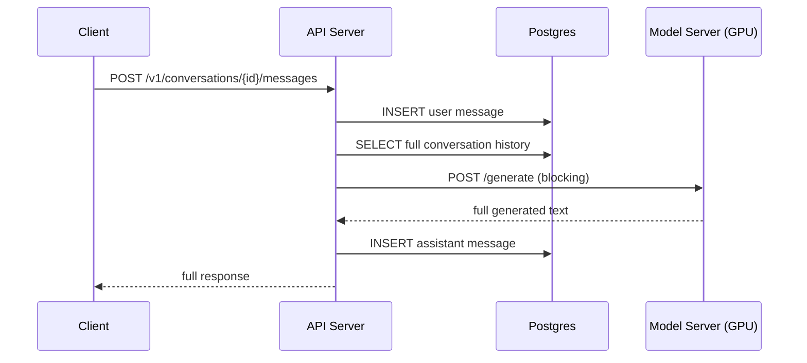
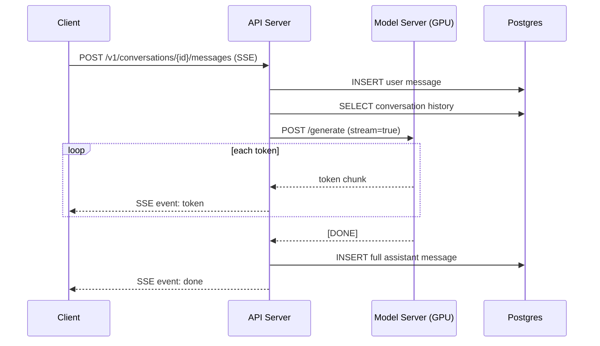
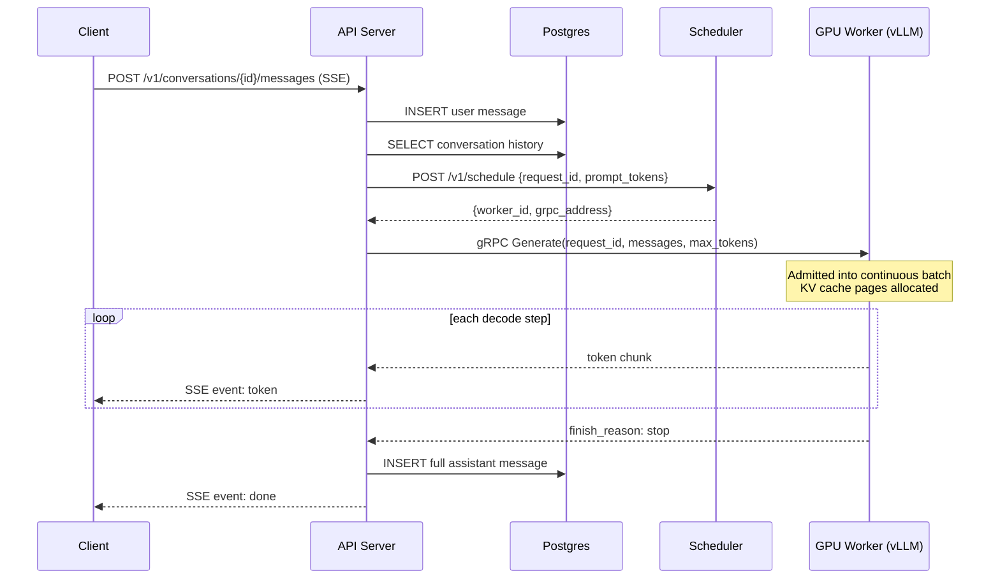
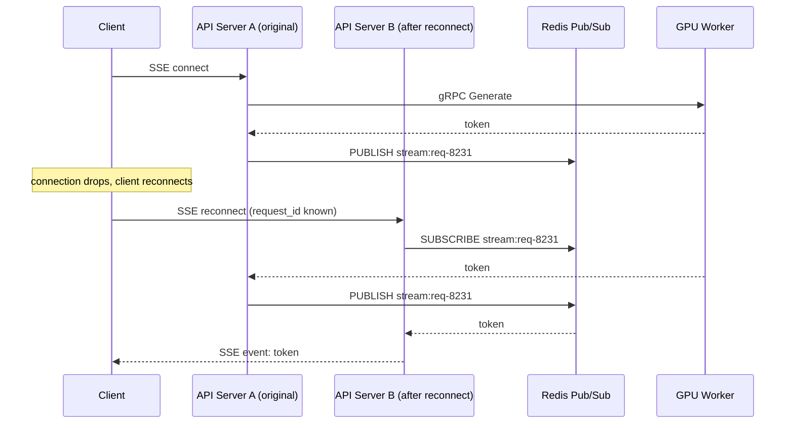
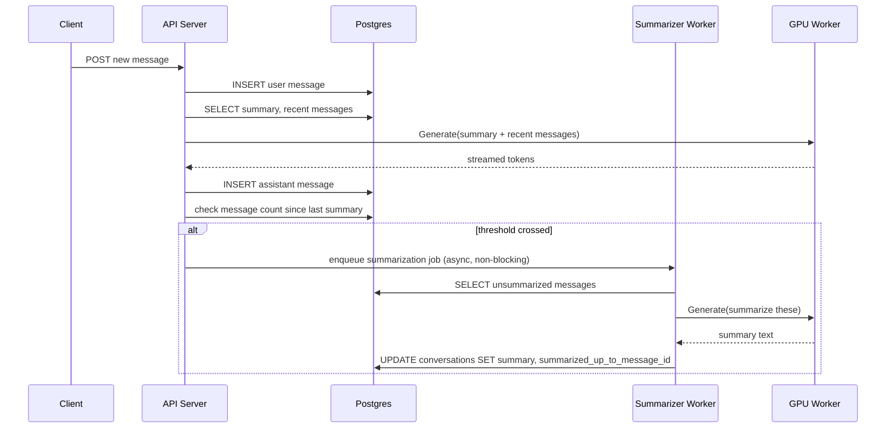
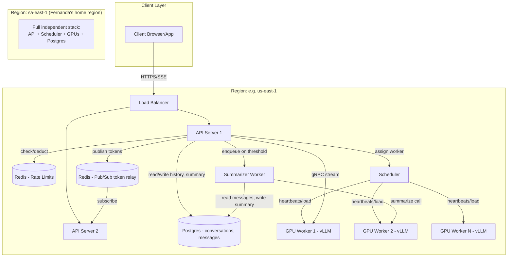
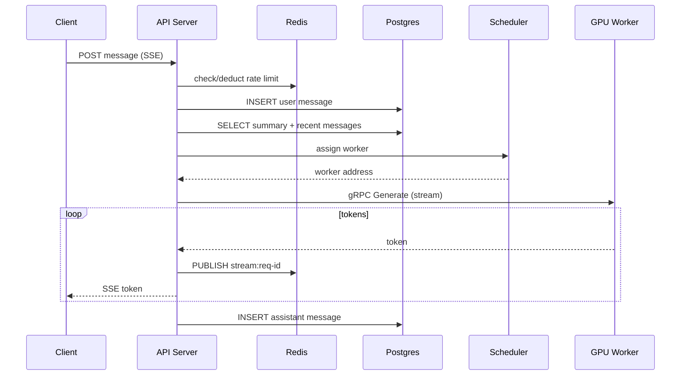

## Why This System Exists

Picture late 2022. You've got a language model that can hold a conversation, but every single time someone asks it something, you're doing a fresh, stateless computation — feed in text, get out text, forget everything the moment the connection closes.

Now put that behind a product with 100 million people using it in two months, each one expecting a UI that feels like texting a very fast, very well-read friend: words should appear as they're being "thought," not after a 30-second silence and then a wall of text. And if you close the tab and come back tomorrow, it should remember what you were talking about.

That's the whole tension right there — a fundamentally expensive, stateful-feeling conversation, running on top of a model that is neither cheap nor naturally stateful, at a scale where "just add more servers" stops being a complete answer somewhere around the first afternoon.

---

## Scoped Requirements

Here's what I think actually drives the interesting architecture for a ChatGPT/Claude-like system. Let me lay out what's in, what's cut, and why.

**P0 — In scope:**

1. **Send a message, get a streamed response token-by-token.** This is the core loop. It's also the one that forces real decisions about long-lived connections, backpressure, and what happens when a GPU worker dies mid-generation.
2. **Conversation history / context management.** Every message you send needs the prior turns fed back into the model. This drives storage design, and it's where cost and latency start fighting each other as conversations get long.
3. **Multi-turn context correctness under concurrency and scale.** Specifically: routing a user's follow-up message back to something that has (or can reconstruct) their conversation state, across a fleet of stateless-looking API servers and a much smaller, much more expensive pool of GPU inference workers.
4. **Inference request scheduling onto a scarce, expensive resource (GPU fleet).** Unlike a normal web request that a DB can serve in 5ms, a single chat request can occupy a GPU for seconds. This is the requirement I think generates most of the hard distributed-systems discussion — it's less "how do we store data" and more "how do we schedule work onto a resource that is orders of magnitude more constrained than anything in a typical CRUD system."

**P1 — In scope, lighter treatment:**

5. **Rate limiting / usage tiers** (free vs paid, tokens-per-minute caps) — real, but architecturally it's a fairly standard token-bucket-at-the-gateway problem, not a novel one.

**Explicitly cutting (P2, no architectural impact worth spending time on):**

- Fine-tuning / custom model training pipelines — separate system entirely.
- File/image upload and multi-modal ingestion — bolts onto the request path without changing the core scheduling story.
- Team/org workspace sharing, admin consoles, billing dashboards — standard multi-tenant CRUD, nothing new here.
- Content moderation / safety classifiers — real system, but it's a filter stage bolted onto the pipeline, not a driver of the core architecture.

The crux we'll spend the most time on is **#4 — scheduling inference requests onto a GPU fleet under streaming and cost constraints** — because that's the part that doesn't look like any system you've designed with me so far. Payments and CRDTs and ride-sharing all had cheap, fast backends doing the real work. Here the "backend" is a small number of very slow, very expensive machines, and that inverts a lot of normal assumptions about horizontal scaling.

Does this scoped list look right to you, or do you want to pull in or drop anything before we start Day 0?

---

## Day 0 — The Simplest Thing That Could Work

Meet Priya. She opens the app, types "Explain photosynthesis in one paragraph," and hits enter. She expects an answer. That's it — that's the whole product at Day 0.

So let's build the dumbest version that satisfies that.

**One API server.** It takes Priya's HTTP request, and does three things in sequence: saves her message, calls the model, saves and returns the model's answer.

**One GPU machine** running the model, exposed as a plain internal HTTP endpoint. The API server calls it synchronously and waits for the *entire* response before doing anything else — no streaming yet, no partial tokens. Priya just sees a loading spinner until the full paragraph shows up at once.

**One relational database** holding conversations and messages.

### Why this is a reasonable starting point, not a strawman

At Day 0, correctness is trivial to reason about. There's exactly one writer to the database, one caller of the model, no concurrency to worry about, no partial failure modes where a message got saved but the reply didn't, or vice versa — because it's all one linear sequence of steps on one machine. Every later iteration is going to deliberately give up some of this simplicity in exchange for scale, and it's worth being honest that Day 0's single-threaded, single-writer nature *is* a real guarantee, not just laziness.

### Data model

```sql
CREATE TABLE conversations (
    conversation_id UUID PRIMARY KEY,
    user_id UUID NOT NULL,
    created_at TIMESTAMP NOT NULL DEFAULT now()
);

CREATE TABLE messages (
    message_id UUID PRIMARY KEY,
    conversation_id UUID NOT NULL REFERENCES conversations(conversation_id),
    role VARCHAR(16) NOT NULL,       -- 'user' or 'assistant'
    content TEXT NOT NULL,
    created_at TIMESTAMP NOT NULL DEFAULT now()
);
```

This lives in a single Postgres instance. Postgres is the obvious choice here, not because it's the only option, but because at Day 0 we have no scale pressure yet — a relational store gives us transactional writes and easy ordering by `created_at`, which is exactly what a linear conversation needs. There's no access pattern yet that would justify anything more exotic.

**Who writes:** the API server, once per user message and once per assistant reply.
**Who reads:** the API server, when it needs to reconstruct conversation history to send to the model.

### The request flow

1. `POST /v1/conversations/{id}/messages` with body `{"content": "Explain photosynthesis in one paragraph"}` hits the **API Server**.
2. API Server runs `INSERT INTO messages (message_id, conversation_id, role, content) VALUES (..., ..., 'user', 'Explain photosynthesis...')` against **Postgres**.
3. API Server runs `SELECT role, content FROM messages WHERE conversation_id = ... ORDER BY created_at` against **Postgres** to build the full conversation history.
4. API Server calls the **Model Server** synchronously: `POST /generate` with body `{"messages": [...]}`, and blocks until it gets the full text back.
5. API Server runs `INSERT INTO messages (...) VALUES (..., ..., 'assistant', '<generated text>')` against **Postgres**.
6. API Server returns the full response to Priya's client in one HTTP response.



Sharding, replication, and caching aren't relevant yet — there's exactly one of everything, so those questions don't have content to attach to until we introduce scale.

### Likely follow-up questions

**"Why not stream the response even at Day 0, since ChatGPT famously streams?"**
Because streaming is a real design decision with its own machinery (chunked responses, keeping a connection open, client-side incremental rendering), and Day 0's job is to nail correctness of the linear save-generate-save loop first. We'll add streaming in the very next iteration, once we've felt why blocking is painful.

**"Why one GPU machine instead of a pool from day one?"**
Because at Day 0 we haven't established there's more than one user hitting the system at a time. Adding a pool before you've proven you need one is solving a problem you don't have yet — and it hides the actual failure mode (a single slow or dead GPU) instead of letting us confront it directly.

---

Next up: Priya sends her message and stares at a blank spinner for 8 seconds before anything appears — and if two people use the app at the same time, the second one waits even longer because that one GPU is now serialized. That's what breaks first.

Got it / next when ready.

---

## Break It — The Blocking Wall

Priya asks her photosynthesis question. Nothing happens for 8 seconds. Then the entire paragraph pops onto the screen at once, like a fax machine finishing a page.

That's already bad. But now let's bring in a second user — Marcus, on the other side of the world, asking the model to write him a cover letter at the exact same moment Priya's request is running.

Our Day 0 architecture has **one API server making one blocking call to one GPU machine**. The GPU can only run one generation at a time — it's not like a web server that can juggle thousands of lightweight connections, because a single generation request occupies the entire GPU's compute for its whole duration. So Marcus's request either queues behind Priya's inside the model server, or the API server itself blocks on the HTTP call and Marcus's request just... waits, holding open a thread the whole time.

Now imagine Priya's answer is long — say a 600-word explanation. The GPU might take 15-20 seconds to generate all of it token by token internally, but because we only return the *complete* response, Priya sees nothing for the full 20 seconds, then everything at once. Marcus, queued behind her, now waits 20+ seconds before his request even *starts*.

Two concrete problems just showed up:

1. **Perceived latency is the entire generation time**, even though the model is actually producing output continuously, token by token, in the background. We're throwing away useful partial progress.
2. **One slow request head-of-line-blocks every other user** on that GPU, because nothing about the current design lets multiple requests interleave or lets users see progress while they wait their turn.

## Evolve It — Streaming Tokens as They're Generated

The model, internally, doesn't produce a paragraph atomically — it produces one token, then the next, then the next, each one taking a few milliseconds. Day 0 was throwing that away by buffering everything into one final string before sending anything back. The fix is to stop buffering and forward each token to the client the moment it's produced.

**The analogy:** think of the difference between a restaurant that plates your entire seven-course meal and brings it out all at once at the very end, versus one that brings each course out as it's ready. The kitchen (the GPU) is doing the same total amount of work either way — but in the second case, you start eating, and start *feeling like something is happening*, within a minute instead of forty.

The mechanism for this on the wire is **Server-Sent Events (SSE)** — a single long-lived HTTP connection where the server pushes chunks of data as they become available, and the client appends each chunk to the screen as it arrives. (WebSockets would also work here; SSE is simpler because this is one-directional — server to client only — and that's all a token stream needs.)

### What we gained

Priya sees the first word of her answer in ~200ms instead of 8 seconds. The *total* time to finish generating is unchanged, but perceived latency — the thing users actually feel — drops enormously. This matters concretely: chat products live and die on "does this feel alive," and a wall of silence reads as broken even when it's just working slowly.

### What we gave up / new problem introduced

The API server now holds a connection open for the *entire* duration of a generation — potentially 20-30 seconds for a long response — instead of a quick request/response cycle. A traditional thread-per-request web server model burns a thread (and its memory) for the whole time. At low traffic this is fine. It will become a real constraint once we have many concurrent conversations, which is a problem we'll pick up when we talk about scaling the API layer itself.

We also haven't fixed the underlying issue that one GPU can only truly compute one generation at a time — streaming makes waiting *feel* better, it doesn't remove the queueing. Marcus still starts his generation only after Priya's finishes, he just doesn't know it because his connection is simply open and idle until his first token arrives.

### What we considered and rejected

We could have polled instead of streamed — client asks "any new tokens?" every 500ms. Rejected because it adds latency (up to 500ms staleness on every chunk), wastes requests when there's nothing new, and doesn't scale connection-count-wise any better than SSE while being strictly worse on freshness.

### Updated flow

Step 4 from Day 0 changes. Everything else — steps 1, 2, 3, 5 — is unchanged.

4. API Server calls **Model Server**: `POST /generate` with `{"messages": [...], "stream": true}`. Instead of waiting for one final response, it holds the connection open and receives a sequence of chunks: `{"token": "Photo"}`, `{"token": "synthesis"}`, `{"token": " is"}`, etc. As each chunk arrives, the API Server immediately forwards it to Priya's client over its own open SSE connection: `event: token\ndata: {"text": "Photo"}\n\n`.



Notice step 5 — saving the assistant's full message — now has to happen *after* the stream completes, by accumulating chunks server-side as they pass through. The API Server, not the client and not the model, is responsible for buffering the full text for persistence while simultaneously forwarding pieces onward in real time.

### Likely follow-up questions

**"What happens if the client disconnects mid-stream — do we lose the generation?"**
The GPU keeps generating regardless of whether the client is still listening, since the API Server is the one actually holding the model connection. Good practice is to let the API Server keep consuming and buffering until `[DONE]`, save the full message anyway, and simply stop trying to forward chunks to a dead client connection. That way a flaky WiFi drop doesn't waste the GPU work or lose the reply — Priya can just reload and see it.

**"Why SSE and not WebSockets, given WebSockets are more 'standard' for chat apps?"**
WebSockets are bidirectional and heavier to manage (ping/pong keepalives, more complex reconnection semantics) for a channel that, in this specific flow, only ever needs to carry data in one direction — server to client. SSE also rides on plain HTTP, which plays more nicely with existing load balancers and proxies without special upgrade handling.

---

Next up: Marcus's cover letter request is now queued behind Priya's on the *same* GPU, and we only have one GPU. That's the point where we have to talk about a pool of GPU workers and how requests get scheduled onto them — the actual crux of this whole design.

Got it / next when ready.

---

## Break It, Again — One GPU, Many Users

Streaming fixed how waiting *feels*. It didn't fix the actual constraint: one GPU can physically only be computing one generation at a time. Priya and Marcus can't both be mid-generation on the same card simultaneously — the GPU's compute is fully occupied per request, unlike a CPU serving a web request where you can interleave thousands of lightweight tasks.

So the obvious next move is: get more GPUs. Let's say we provision 10 GPU machines instead of 1. Now the real question — the one that actually matters — is **how does a request find its way to one of those 10 machines, fairly and efficiently?** This is the crux of the whole system, so let's actually walk through the attempts someone would reasonably try, in order, and see exactly where each one breaks.

### Attempt 1 — Treat GPU workers like stateless web servers, round-robin behind a load balancer

This looks reasonable at first glance. We already have a load balancer in front of our API servers doing round-robin. Why not just put one in front of the GPU fleet too — request 1 goes to GPU-1, request 2 to GPU-2, and so on?

Here's the specific way this breaks. Round-robin assumes every request costs roughly the same amount of work, which is true for a typical CRUD read but false here. Priya's request might be a two-word answer ("Yes, definitely") finishing in 1 second. Marcus's cover letter might run 25 seconds. A third user, David, asks the model to summarize a 40-page document — that one might take 90 seconds and use far more of the GPU's memory for its context window.

Round-robin has no idea any of this is true. It just cycles. So it's entirely possible for GPU-3 to get handed three long-running heavy requests back to back purely by bad luck of arrival order, while GPU-7 sits idle after finishing a quick one. You end up with wildly uneven load despite "evenly" distributing request *count* — because request count was never the thing that mattered. Compute-seconds were.

### Attempt 2 — A shared FIFO queue, GPUs pull work when free

So instead of blindly assigning ahead of time, let's have every GPU worker pull its next job from one shared, central queue the instant it's free. This fixes the round-robin problem — a GPU that just finished a fast 1-second request immediately grabs the next waiting item, so no worker sits idle while another drowns.

This is a real improvement, and it's genuinely how a lot of task-queue systems work. But it breaks in a specific way once we account for how modern inference engines actually get their efficiency: **batching**. A GPU processing one request at a time is wasting most of its parallel compute capacity — it's built to crunch many sequences at once, and if you feed it one sequence at a time, you're leaving most of the hardware idle during every step. A pure FIFO-single-job-per-worker model never batches anything, so you're burning far more GPU-hours (and money) per response than necessary. At the traffic volumes this product actually sees, that's not a minor inefficiency, it's the difference between the unit economics working at all.

### Attempt 3 — Continuous batching with a request scheduler

The real answer used by production LLM serving systems (this is essentially what vLLM, TensorRT-LLM, and similar inference engines do under the hood) is **continuous batching**: instead of a GPU worker taking one request and running it start-to-finish alone, the scheduler groups multiple in-flight requests together and steps them forward *token by token as a batch*. When one request in the batch finishes early (David's short answer wraps up), a new waiting request gets slotted into that now-free "lane" immediately, without waiting for the other, longer requests in the batch to finish.

**The analogy:** think of an elevator that doesn't wait to fill up completely before leaving, and doesn't insist everyone gets off at the same floor either — people get on and off continuously as it travels, and the car is always carrying close to its full capacity rather than running mostly empty or waiting around. That's continuous batching: the GPU is always working on a nearly-full batch, and requests join and leave the batch independently as they arrive and complete.

Concretely, the architecture needs two new pieces beyond "more GPUs":

- A **Scheduler** service sitting between the API servers and the GPU fleet, which holds a request queue and decides which pending requests get admitted into each GPU worker's active batch.
- Each **GPU worker** runs an inference engine capable of continuous batching internally (this is a property of the serving software, not something we hand-roll) — so a worker isn't "one request in, one response out," it's "many concurrent requests in, tokens streamed out per request as each one advances."

| Approach | Fair load spread | GPU utilization | Handles mixed short/long requests | Complexity |
|---|---|---|---|---|
| Round-robin LB | Poor | Poor | Poor | Low |
| Shared FIFO queue | Good | Poor | Good | Medium |
| Continuous batching + scheduler | Good | Excellent | Excellent | High |

### What we gained

GPU utilization goes up dramatically because idle compute during any single request's "thinking time" gets filled with other users' work instead of wasted. Fair scheduling also means Marcus's long cover letter no longer forces David to wait — David's short summary can be admitted into an already-running batch and finish independently.

### What we gave up / new problem introduced

We now have a stateful **Scheduler** as a new single point of coordination, and it needs to know, in near real time, which GPU workers have capacity in their current batch — that's shared state that has to be kept fresh and consistent across the fleet, which is a new operational concern that didn't exist when it was "one blocking call to one machine." We'll need to decide how the Scheduler tracks that state (in-memory with heartbeats? a shared store?) — that's worth its own look once we talk about failure handling.

### What we considered and rejected

We could have simply over-provisioned GPUs so heavily that queueing rarely happens at all, sidestepping scheduling complexity. Rejected because GPU capacity is extremely expensive compared to a CPU web server — over-provisioning to paper over bad scheduling multiplies your most expensive line item, whereas building a real scheduler is a one-time engineering cost that pays for itself continuously.

### Likely follow-up questions

**"Why can't the API server itself just pick a GPU worker directly, skipping the separate Scheduler?"**
Because picking a good worker requires up-to-date knowledge of every worker's current batch occupancy, and that state changes token-by-token across potentially hundreds of workers. Centralizing that decision in one (or a small, coordinated set of) Scheduler process avoids every API server needing its own stale, independently-guessed view of fleet load.

**"Does batching hurt latency for any individual request?"**
It can add a small amount of jitter — a request might wait a few extra milliseconds to be slotted into the next batch step rather than starting instantly — but this cost is tiny compared to the total generation time, and it's vastly outweighed by the throughput gained across the whole fleet.

---

Next up: now that the Scheduler is tracking live GPU capacity, what happens when a GPU worker crashes mid-batch — does everyone in that batch just lose their in-progress response? That's where we bring in real failure handling.

Got it / next when ready.

---

## Why a GPU Can't Just "Run Two Requests at Once" for Free

This is the part that trips almost everyone up, so let's slow down on it.

A GPU has thousands of cores. In the sense of "doing lots of arithmetic simultaneously," it's extremely parallel. But generating tokens has a bottleneck that has nothing to do with arithmetic speed — it's about **memory bandwidth**.

Here's the mechanism. To produce the next token, the model has to run its input through every layer of its weights — the actual numbers that define the model, potentially over a hundred billion of them. Those weights live in the GPU's memory (HBM), not inside the compute cores themselves. Before any multiplication can happen, the weights have to be **read out of memory into the compute units**.

That read is slow. The actual multiply-and-add math, once the numbers are loaded, is comparatively fast — GPUs are built to churn through that part instantly. So the real cost of producing one token isn't "doing the math," it's "hauling the weights from memory to the math."

Here's the part that makes batching magic: that memory read cost is basically **the same** whether you use those loaded weights to compute the next token for 1 sequence, or for 64 sequences at once, as long as you arrange it as one combined matrix operation. You pay for the expensive trip to memory once, and get 64 answers out of it instead of 1.

**The analogy:** a delivery truck driving from a warehouse to a neighborhood. The drive itself — there and back — is the slow, expensive part. Loading one package onto the truck versus loading fifty costs almost nothing extra once the truck is already making the trip. Send the truck out separately for every single package, and you pay for the drive fifty times. Load it up and go once, and you pay for the drive once.

So it's not that "the GPU can't do two things at once." It's that **two unbatched requests each pay the full memory-loading cost separately**, using almost none of the GPU's actual compute capacity while they wait on that read. One batched request pays that cost once and gets far more useful work out of it. This is why running 2 sequences batched together is barely slower than running 1 — but running 2 sequences back-to-back, unbatched, takes roughly twice as long.

---

## How the Scheduler Actually Batches — Continuous Batching and vLLM

Two new concepts feed into this: the **KV cache**, and **iteration-level scheduling**.

**The KV cache.** When the model attends over everything it's generated so far, it needs each prior token's Key and Value vectors. Recomputing those from scratch at every new step would be wasteful, so the engine caches them per sequence. This cache grows by a fixed amount with every token generated, and it lives in GPU memory for as long as that request is active.

This matters because **GPU memory, not just compute, is the limiting resource** for how many requests you can batch together. Every active sequence in a batch is holding onto a slice of memory for its own growing KV cache.

**Iteration-level scheduling.** This is the actual mechanism behind what I called "continuous batching" earlier. At every single step — one token generated for every active sequence in the batch — the engine does this:

1. Look at which sequences are currently active, and how much KV-cache memory they're using.
2. Check the waiting queue: is there enough free memory *right now* to admit a new request into this step's batch?
3. Admit as many as fit.
4. Run one batched forward pass, producing the next token for every sequence in the batch — old and newly admitted — simultaneously.
5. Any sequence that just hit its stop condition gets removed immediately, freeing its memory for the next step.
6. Repeat, every single step.

This is different from naive batching, where you'd lock in a fixed group of requests and make everyone wait for the whole group to finish before admitting anyone new. Continuous batching lets a short request (David's summary) leave the batch the moment it's done, and a new request slot in on the very next step, without waiting on Marcus's still-running cover letter.

**PagedAttention** (this is vLLM's actual core contribution) solves a memory-management problem this creates. If you naively reserve a big contiguous chunk of memory per request sized for the worst-case output length, you waste huge amounts of memory on requests that finish early, and you fragment memory so badly that odd-sized leftover chunks can't fit new requests.

The fix borrows directly from how operating systems manage virtual memory: split the KV cache into small, fixed-size blocks ("pages"), allocate them on demand as a sequence grows, and track which blocks belong to which sequence via a page table — the blocks themselves don't need to be physically contiguous. This lets the engine pack memory almost perfectly and keep far more sequences batched together than the naive approach, which is where vLLM's big throughput jump over earlier serving approaches actually comes from.

**Where this lives in our architecture:** this iteration-level batching and paging happens *inside each GPU worker*, as part of the inference engine (vLLM or similar) running on that machine. The **Scheduler** service I described earlier is doing a coarser, separate job — deciding which *worker* a brand-new request should be sent to in the first place, based on each worker's reported load. Two different scheduling decisions, two different layers: fleet-level routing, and engine-level batching.

---

## How Tokens Find Their Way Back to the Right User

This is a real routing question, so let's be precise about it.

In the common case, there's actually no discovery problem at all, because **nothing moves**. The same API Server process that accepted Priya's request holds both ends of the pipe for the entire duration:

- the SSE connection out to Priya's browser
- a direct streaming connection to whichever GPU worker the Scheduler assigned

Here's the exact sequence:

1. API Server calls the Scheduler once, at the start: `POST /v1/schedule` with `{"request_id": "req-8231", "prompt_tokens": 42}`. Scheduler replies `{"worker_id": "gpu-worker-7", "grpc_address": "10.0.4.23:50051"}`.
2. API Server opens a **gRPC streaming call** directly to `10.0.4.23:50051` — a persistent, bidirectional-capable connection well suited to a server pushing a sequence of chunks.
3. That gRPC stream carries every token chunk from gpu-worker-7 straight back to the *same* API Server instance that made the call.
4. As each chunk lands on that gRPC stream, the API Server immediately re-emits it as an SSE event on the connection it's still holding open to Priya.

So the "affinity" is trivial by construction — the API Server is simply relaying between two connections it personally owns, not looking anything up.

**Where this actually breaks:** if that API Server crashes mid-stream, or if Priya's client disconnects and reconnects and the load balancer happens to route the retry to a *different* API Server instance, that new instance has no idea a generation is already running on gpu-worker-7. There's nothing in this design that lets it find and resume that stream.

The real fix — which we'll build properly in the failure-handling iteration — decouples "who is generating this" from "who is listening for it," typically via a pub/sub channel keyed by request ID: the worker publishes tokens to `stream:req-8231` regardless of who's listening, and whichever API Server instance ends up serving that client just subscribes to that same channel. I'm flagging it now rather than solving it, since it's exactly the seed of the next break.

How does the Scheduler know gpu-worker-7 had room in the first place? Each worker reports its current load — active sequence count and free KV-cache blocks — via a lightweight heartbeat roughly every 200ms, written to a shared store the Scheduler reads from. The Scheduler then picks the worker with the most free capacity, which is the same "least outstanding requests" idea used in ordinary L7 load balancing, just applied to GPU memory headroom instead of connection count.

---

## Full Step-by-Step Flow



Steps 1-3 (save user message, fetch history) are unchanged from Iteration 1. What's new this iteration is the **assignment step** (API Server → Scheduler → worker address) inserted before generation begins, and the fact that step 4's streaming now flows through a specific, named GPU worker rather than "the model server."

### Likely follow-up questions

**"Why gRPC between API Server and worker instead of another SSE hop?"**
gRPC's native support for typed, bidirectional streaming and lower per-message overhead makes it a better fit for high-frequency internal service-to-service token streaming than HTTP/SSE, which is better suited to the external, browser-facing leg where broad client compatibility matters more than raw efficiency.

**"What stops the Scheduler from becoming a bottleneck if every single request has to call it first?"**
The Scheduler's job per request is small and fast — read current load, pick a worker, respond — nothing it does is as expensive as the generation itself, so it can be horizontally replicated behind its own load balancer with workers' load data kept in a shared store all replicas can read.

---

Next up: a GPU worker crashes with Priya, Marcus, and David all mid-batch on it at once — what happens to their in-flight generations, and how does the system even detect the crash quickly enough to matter?

Got it / next when ready.

---


## Break It — The GPU Worker Crashes Mid-Batch

Picture this exact moment: gpu-worker-7 is running a batch with Priya, Marcus, and David all active in it. Priya's on token 40 of 60. Marcus is on token 800 of an estimated 1000. David just got admitted and has one token out.

The machine hard-crashes — bad GPU driver, out-of-memory kernel panic, doesn't matter which. All three in-flight generations vanish instantly. Nothing about our current design detects this, retries anything, or tells the three API Servers holding open connections to those users that anything went wrong. Priya, Marcus, and David each just... stop receiving tokens. Their SSE connections eventually time out client-side, with no explanation.

Two distinct problems are bundled together here, so let's separate them:

1. **Detection** — how does anyone even find out gpu-worker-7 is dead, and how fast?
2. **Recovery** — once we know, what happens to Priya's, Marcus's, and David's requests? Do they restart from scratch, resume, or just fail?

## Evolve It — Heartbeats, Lease Expiry, and Retry-from-Scratch

**Detection** reuses the heartbeat mechanism from the last iteration. Each GPU worker was already reporting load every ~200ms. We extend that into a proper **lease**: the Scheduler tracks a `last_heartbeat_at` timestamp per worker, and if a worker misses its heartbeat for, say, 3 consecutive intervals (~600ms), the Scheduler marks it `DEAD` and stops routing any new requests to it.

That's fast and cheap, but it only tells us the worker is gone — it does nothing for the three people whose tokens just stopped arriving. That's the recovery half, and it's where the real design decision lives.

**The analogy:** think of a phone call that drops mid-sentence versus a phone call where the person you're talking to had a stroke and can't remember what they were saying. If the call just dropped, you can call back and say "as I was saying—" and continue. If the person can't remember the conversation, your only real option is to start over. GPU inference is the second case: the moment gpu-worker-7 dies, its in-memory KV cache — everything it knew about Priya's conversation-in-progress — dies with it. There is no "resume from token 40," because token 40's internal state doesn't exist anywhere else.

So recovery has to mean: **the API Server detects the failure, and re-issues the entire request to a different worker, from scratch.** Priya's request goes back through the Scheduler, gets assigned to (say) gpu-worker-3, and generation restarts at token 0 — this time hopefully finishing without incident. From Priya's point of view, this can look like a stutter or a brief pause before tokens resume, rather than a hard failure, if we handle it right on the client side.

Here's exactly how the API Server finds out. The gRPC stream between the API Server and gpu-worker-7 doesn't hang forever — gRPC surfaces a stream error when the underlying TCP connection drops or when the server-side process disappears. The API Server catches that error specifically, and that's the trigger for retry.

### Retries need backoff, jitter, and a cap

If gpu-worker-7 died because of a bad batch that also poisons whichever worker picks up the retry, blindly retrying immediately could just cascade the failure. Standard practice: retry with **exponential backoff** (wait 100ms, then 200ms, then 400ms if it fails again) plus **jitter** (a small random offset added to each wait) so that if many requests failed at once — likely, since a whole batch just died together — they don't all retry in the same instant and slam the Scheduler and a fresh worker simultaneously. Cap retries at 2-3 attempts; beyond that, return an error to the client rather than leaving them waiting indefinitely.

### What we gained

The system now survives a GPU worker dying without silently hanging every affected user forever. Detection happens in under a second, and recovery is automatic from the client's perspective — worst case, a visible stutter, not a dead connection with no explanation.

### What we gave up / new problem introduced

Retrying from scratch means Priya's 40 tokens of already-generated output are thrown away and regenerated, which costs real GPU time twice for one answer. There's no way around this given that KV cache state is worker-local and non-durable — but it does mean a worker that's *flapping* (repeatedly dying) can waste a disproportionate amount of fleet capacity on repeated partial generations. We'd want the Scheduler to actively avoid re-routing retries back to a worker with a recent failure, which is a one-line addition to the assignment logic: exclude workers marked `DEAD` or `RECENTLY_FAILED` for a cooldown window.

### What we considered and rejected

We could try to make KV cache state durable — checkpoint it to a shared store periodically so a new worker could theoretically resume mid-generation. Rejected: KV cache for a single sequence can be tens of megabytes, growing every token, and serializing/deserializing that fast enough to be useful would add latency to *every* step of *every* healthy request, just to handle a rare crash. The cost is paid on the common path to help the uncommon path — not a good trade here.

## The Second Problem, Resurfacing — Stream Delivery After a Reconnect

This is the loose thread from last iteration. Say Priya's *client* — not the worker — is the one that drops (phone loses signal for two seconds) and her browser reconnects. The load balancer in front of the API Server fleet has no reason to route her reconnect back to the *same* API Server instance that was relaying her tokens. A different instance picks up the request, and it has no idea a generation for Priya is in flight anywhere.

The fix: decouple "who is generating" from "who is listening," using a pub/sub channel keyed by request ID.

**Schema / shape of the new channel:**

```json
// Redis Pub/Sub channel name: stream:req-8231
// Published message shape, one per token:
{"request_id": "req-8231", "token": "Photo", "seq": 41}
```

**Who publishes:** the API Server instance that owns the gRPC stream to the GPU worker — instead of (or in addition to) writing directly to its own SSE connection, it publishes every token it receives onto `stream:req-8231` in Redis.

**Who subscribes:** whichever API Server instance is currently holding the client's SSE connection, subscribes to `stream:req-8231` the moment it accepts that connection, and forwards whatever arrives on the channel to its client.

This lives in **Redis Pub/Sub** specifically because the access pattern is pure fan-out of ephemeral, in-order messages with no need for durability past the life of one generation — a full database write per token would be wasteful, and this isn't data anyone queries later, just a live relay.



Note this replaces the direct API-Server-to-client relay assumption from Iteration 2 — tokens now always pass through Redis, even in the common no-reconnect case, so there's one consistent path rather than a special case for reconnects.

### Likely follow-up questions

**"Why not just make the client retry the whole HTTP request on reconnect instead of building pub/sub?"**
Because the generation is still running server-side and hasn't failed — throwing it away and restarting wastes the GPU work that's already in progress, for a problem that's purely about the client-to-server *transport* dropping, not the generation itself failing.

**"Doesn't Redis Pub/Sub risk losing messages if a subscriber isn't connected at the exact moment something's published?"**
Yes — Pub/Sub is fire-and-forget with no replay. For this use case that's an acceptable trade because a missed token or two during the exact instant of a reconnect is a minor visible glitch, not data loss (the full message is still persisted to Postgres once generation completes) — but it's worth naming explicitly rather than assuming reliability we didn't build.

---

Next up: all of this assumed one region. Once we have users in Mumbai and São Paulo both talking to the same product, we have to decide where their conversations' "home" actually lives, and what happens to latency and consistency across the ocean.

Got it / next when ready.

---

## Break It — Priya in Mumbai, a New User in São Paulo

Everything we've built so far quietly assumed one region — one Postgres, one Scheduler, one fleet of GPU workers, all living in, say, `us-east`. That was fine while our users were concentrated somewhere near that region. It stops being fine the moment we have real users on the other side of the planet.

Say Fernanda in São Paulo starts a conversation. Every message she sends has to cross the ocean to `us-east` before anything even *starts* happening — the round trip alone is commonly 150-200ms each way for that distance, before the GPU has generated a single token. That's pure network latency stacked in front of an already multi-second generation. Streaming softens the pain a little (first token still shows up eventually), but every single token in the stream now also pays that same one-way network tax on its way back, which shows up as visible added lag between characters appearing on her screen — not undoable, since we can't get her closer to Virginia by rearranging software.

There's a second, quieter problem: this product needs GPUs, and GPUs are the scarcest, most expensive part of the whole system. Running redundant idle GPU capacity in every region "just in case" is a very different cost proposition than running a redundant read replica of a small Postgres table, which is what made multi-region relatively cheap in the payments and CRDT systems we've done before.

## Evolve It — Home Region Per User, Not Per-Shard Multi-Writer

The core decision here is: **how do we decide which region "owns" a given user's conversation?**

The good news is this system has a property that makes the decision much easier than it was for, say, the collaborative doc editor: **a single user's conversation has exactly one active writer at a time — the user themselves, sending one message, waiting for one reply.** Nobody else is concurrently editing Fernanda's conversation with her. There's no concurrent-edit conflict to resolve, because conversations aren't a shared, simultaneously-mutated document — they're a private, strictly turn-taking log.

That means we don't need per-shard multi-writer replication or any real conflict resolution machinery at all. We can go with the simplest model that fits: **home-region-per-user**, decided once at signup or on first use, based on where their request originates from (their client's IP or auth-token metadata pins them to a region, similar to how a CDN's edge node is chosen by geography).

Fernanda's account gets pinned to `sa-east-1` (São Paulo). Every piece of her — her conversation and message rows in Postgres, and the GPU fleet + Scheduler that serve her requests — lives in that region, full stop. Priya, pinned to `us-east`, never touches `sa-east-1` infrastructure at all, and vice versa.

**This is close to the same trade-off Iteration 2 of our CRDT design made** — single-owner placement per document, rather than true multi-writer replication — just applied here to a user's whole account instead of a single doc.

### What we gained

Fernanda's entire round trip — API Server, Scheduler, GPU worker, Postgres — is now local to `sa-east-1`. No transoceanic hop anywhere in her hot path. And because there's no cross-region writer for the same conversation, **there's no conflict resolution to build at all** — this is conflict avoidance by construction, not conflict resolution after the fact.

### What we gave up / new problem introduced

If `sa-east-1` has an outage, Fernanda's conversations are unavailable until it recovers, since nothing failed over to another region automatically. We could mitigate this with asynchronous cross-region replication of her Postgres data to a standby region purely for disaster recovery — but that standby wouldn't have live GPU capacity serving her by default, since keeping a full duplicate GPU fleet warm and idle in every region "just in case" is exactly the expensive redundancy we said we wanted to avoid. In practice, this usually means: data durability is protected via async backup replication, but full regional failover for the *inference* fleet is a slower, capacity-provisioning response, not an instant failover — an explicit availability trade-off worth stating out loud rather than glossing over.

There's also a data placement wrinkle: a user's home region might need to account for **data sovereignty rules** (e.g., a user in the EU whose data must legally stay in the EU) rather than pure latency-optimal placement. This doesn't change the mechanism — it's still home-region-per-user — it just means the assignment logic sometimes has to prioritize a legal constraint over the geographically nearest region.

### What we considered and rejected

We could shard by conversation instead of by user, letting a single user's different conversations live in different regions depending on where each one started. Rejected: it adds complexity — now every piece of infra needs to know to look up *per-conversation* home region instead of a single per-user one — for no real benefit, since a given user overwhelmingly connects from the same geography across all their conversations. The added flexibility isn't paying for itself.

We could replicate every conversation synchronously to all regions for instant failover anywhere. Rejected outright: synchronous cross-ocean replication would add that same 150-200ms penalty to every single message *write*, for every user, permanently — defeating the entire point of regional placement, to save exactly that latency.

| Approach | Latency for local users | Handles regional outage | Conflict resolution needed | GPU cost |
|---|---|---|---|---|
| Single global region | Poor for distant users | Single point of failure | None (single writer anyway) | Lowest |
| Home-region-per-user | Excellent | Data safe (async backup), inference degraded | None — single writer by construction | Moderate (one fleet per active region) |
| Full multi-region sync replication | Excellent | Excellent | None (still single writer) but pays sync cost everywhere | Highest, plus latency tax on every write |

### Likely follow-up questions

**"What happens if Fernanda travels to Tokyo and uses the app from there?"**
Her requests still route to her home region, `sa-east-1` — home-region-per-user is about where her *data and account* live, not where she's currently connecting from. She'll experience `sa-east-1`-level latency from Tokyo, which is a real cost of this model, but it's a rare case (most users don't roam internationally often) versus the common case of every message paying cross-region latency, which is what we'd get with a single global region.

**"Why is this simpler than the ride-sharing system's regional design?"**
Because ride-sharing had to handle cross-region matching when someone travels (a driver and rider from different home regions can still need to match live), which forced real cross-region coordination. Here, nobody else is ever a party to Fernanda's conversation — there's no equivalent "match" that could span two regions, so the isolation is complete and clean.

---

We've now covered the full arc: streaming, GPU scheduling with continuous batching, failure recovery, and multi-region placement. Want me to move on to a couple of the remaining coverage items we've touched lightly (rate limiting, or context-window management as conversations get long), or go straight to the final full-architecture recap and "why not X" cheat sheet?

---

## Break It — The Conversation That Won't Stop Growing

Marcus comes back to the same conversation every day for three weeks, asking follow-up questions about a novel he's writing. By day 20, that conversation has 400 messages in it.

Recall step 3 from Day 0, still unchanged this whole time: every time Marcus sends a new message, the API Server runs `SELECT role, content FROM messages WHERE conversation_id = ... ORDER BY created_at` and sends the *entire* history to the model. On day 1, that's a few hundred tokens. By day 20, it's tens of thousands of tokens, every single message he sends, even a one-line follow-up like "what about chapter 12?"

Two very concrete problems now:

1. **The model has a hard context window limit.** Every model has a maximum number of tokens it can accept as input — say 128K for a concrete number. Marcus's conversation will eventually exceed that ceiling, and the very next message he sends would simply fail outright, not degrade gracefully.
2. **Cost and latency both scale with input size**, even before hitting that hard ceiling. Recall from the memory-bandwidth discussion earlier: processing a longer prompt means more KV-cache to build up before generation even starts. A 40K-token history costs meaningfully more GPU time to process than a 2K-token one, for every single message, even a trivial one — and Marcus is paying for (or we're absorbing the cost of) re-processing chapter 1 of his novel-discussion 400 times over.

## Evolve It — Truncation, Then Summarization

**First attempt: just truncate.** Keep only the most recent N messages — say the last 20 — and drop everything older when building the prompt sent to the model.

This is simple and it does solve the hard ceiling problem. But it breaks in an obvious way for Marcus specifically: if he asks "what was the name of the character I mentioned in chapter 2?" and that's message #14 out of 400, a fixed-window truncation that only keeps the last 20 messages has already dropped it. The model will confidently make up an answer, having no idea chapter 2 was ever discussed — this is a real, common failure mode, not a hypothetical.

**Better: rolling summarization.** Instead of just dropping old messages, periodically compress them. Once a conversation crosses a threshold — say every 20 new messages — an async job takes the oldest chunk of the conversation and asks the model itself to produce a compact summary of it: "Marcus is writing a fantasy novel; established so far: protagonist named Kael, chapter 2 introduced a betrayal by his mentor, chapter 5 ended on a cliffhanger at the harbor." That summary gets stored and prepended to future prompts *instead of* the raw messages it replaces.

**The analogy:** this is exactly what a human assistant does taking notes across a long-running project — they don't try to recite every email verbatim from three months ago, they keep a running set of notes capturing what matters, and refer back to the notes instead of the raw history.

### Schema and flow for the new piece

```sql
ALTER TABLE conversations ADD COLUMN summary TEXT;
ALTER TABLE conversations ADD COLUMN summarized_up_to_message_id UUID;
```

**Who writes:** a background **Summarizer Worker**, triggered async after a conversation crosses the message-count threshold. It reads the unsummarized message range, calls the model with a "summarize this" prompt, and writes the result into `conversations.summary`, updating `summarized_up_to_message_id` to mark the boundary.

**Who reads:** the API Server, at step 3 of the request flow — instead of selecting *all* messages, it now does `SELECT summary FROM conversations WHERE conversation_id = ...` plus `SELECT role, content FROM messages WHERE conversation_id = ... AND message_id > summarized_up_to_message_id ORDER BY created_at`, and sends `[summary] + [recent raw messages]` to the model.

This is an important branch point, so let's be explicit about both paths:

- **Cache hit equivalent (summary exists and is current):** API Server sends `summary + recent messages`. Small prompt, fast, cheap.
- **Cache miss equivalent (no summary yet, conversation still short):** API Server sends the raw message history directly, exactly as before — this is just Day 0's behavior, unchanged, for conversations that haven't crossed the threshold yet.



Notice the summarization job is fired off async and doesn't block Marcus's response — his current message gets answered using whatever summary already exists, and the *next* message benefits from the freshly updated one.

### What we gained

Marcus's conversation can grow indefinitely without ever hitting the hard context ceiling, and his per-message cost stays roughly bounded instead of growing linearly forever. The old-chapter-2 problem is meaningfully improved too, since a summary retains key facts rather than silently discarding them the way flat truncation did.

### What we gave up / new problem introduced

Summarization is lossy by nature — a compressed note about "a betrayal by his mentor" loses the exact wording and nuance of the original exchange. If Marcus asks for the *precise phrasing* he used in message #14, the summary won't have it, only the gist. There's also new cost here: summarization itself is an extra model call, so we're spending GPU time to save GPU time — a bet that pays off because it happens once per threshold crossing (every 20 messages) rather than on every single message.

### What we considered and rejected

We could re-summarize the *entire* conversation from scratch every time, rather than incrementally summarizing just the newly-aged-out chunk. Rejected: that cost grows with total conversation length forever, which is exactly the unbounded-cost problem we were trying to escape in the first place — incremental summarization keeps each summarization job's cost bounded to one chunk, regardless of how long the conversation has been running overall.

### Likely follow-up questions

**"Why not use embeddings and retrieval (RAG) instead of summarization, so old details are searchable rather than compressed away?"**
That's a legitimate alternative and production systems sometimes use both — a summary for gist plus a vector search over old messages for exact-detail lookups triggered on demand. We're keeping it to summarization alone here because it fully solves the two P0 problems (hard ceiling, growing cost) on its own; retrieval adds real value for precision but is closer to a P1 refinement than a requirement this specific scope demands.

**"What if the summarization job itself fails or lags behind?"**
The API Server's read path degrades gracefully — it just uses whichever `summary` and `summarized_up_to_message_id` currently exist in Postgres, even if stale, and the raw messages since that point are still included directly. Worst case, a delayed summary means a slightly longer prompt for a message or two, not a broken response.

---

That covers the last of the meaty P0/P1 territory — streaming, scheduling, failure handling, multi-region, and context growth. Want the full end-to-end recap now (architecture diagram, every path restated, and the "why not X" cheat sheet), or should we touch rate limiting first since it's still untouched?

---

## Rate Limiting — Free vs Paid Tiers

Quick one, since this is P1 and doesn't need crux-level depth — it's a fairly standard pattern applied to a system where the resource being protected happens to be GPUs instead of a database.

Priya's on the free tier, capped at 20 messages per hour. Marcus is paying, capped at 500 tokens per minute (paid tiers are usually limited by tokens, not message count, since a token cap tracks actual GPU cost more directly than a message count does — a one-word message and a 2000-word essay cost wildly different amounts, and message-count limits can't see that difference).

**Where it lives:** at the API Server layer, before the request ever reaches the Scheduler or touches a GPU. This is a deliberate placement — rejecting an over-limit request should be as cheap as possible, and the whole point is to never let it get anywhere near the expensive resource.

**Mechanism: token bucket**, one bucket per user, tracked in Redis.

```
Key: ratelimit:user:{user_id}
Value: {tokens_remaining: 480, last_refill_at: <timestamp>}
```

Each request: API Server computes how many tokens should have refilled since `last_refill_at` based on the user's rate (proportional refill, not a hard reset at a fixed clock boundary — this avoids the classic bug where everyone's limit resets at the same wall-clock minute and a burst of requests all land in the same instant), adds that to `tokens_remaining` up to the bucket's cap, then checks if enough tokens exist for this request's estimated cost. If yes, deduct and proceed; if no, return `429 Too Many Requests` immediately.

**Who writes:** the API Server, on every request, via an atomic Redis `INCR`/Lua script (atomicity matters here — two concurrent requests from Marcus shouldn't both read "480 remaining" and both proceed, double-spending the same budget).
**Who reads:** the API Server, same call, same script.

This reuses Redis, already in our design for pub/sub — same technology class justification as before: fast, in-memory, naturally suited to short-lived counters that don't need durability past their refill window.

One system-specific wrinkle worth naming: for a *streaming* response, we don't know the exact token cost upfront. The fix is to deduct an estimate at request time (based on prompt length and the tier's typical response length), then true up the count once the actual response length is known — slightly imprecise but bounded, and self-correcting over many requests.

### Likely follow-up question

**"Why not rate-limit at the Scheduler instead of the API Server?"**
Because by the time a request reaches the Scheduler, it's already about to consume GPU scheduling overhead — the entire point of rate limiting is to reject cheaply and early, so it belongs at the outermost layer that can make the decision, which is the API Server right after auth.

---

That's the full coverage list now. Ready for the final end-to-end recap — full architecture diagram, every path restated as its own flow, and the "why not X" cheat sheet — or want to drill into anything specific first?

---

## Final Recap — Full Architecture



Each region is a fully independent stack — a user's requests never cross into another region's infrastructure, per the home-region-per-user decision.

---

## Every End-to-End Path

### 1. Message send path (the core loop)

1. Client sends `POST /v1/conversations/{id}/messages` over SSE.
2. API Server checks Redis rate-limit bucket for this user — reject with `429` if exhausted.
3. API Server writes the user's message to Postgres.
4. API Server reads `summary` + messages since `summarized_up_to_message_id` from Postgres.
5. API Server calls Scheduler for a worker assignment.
6. API Server opens gRPC stream to the assigned GPU worker.
7. Worker admits the request into its continuous batch; tokens stream back over gRPC as they're generated.
8. API Server publishes each token to `stream:{request_id}` in Redis and simultaneously forwards it via SSE to any subscriber holding the client connection.
9. On completion, API Server writes the full assistant message to Postgres.
10. API Server checks message count since last summary; if threshold crossed, enqueues an async summarization job.



### 2. Reconnect path

1. Client's SSE connection drops and reconnects, possibly landing on a different API Server.
2. New API Server subscribes to `stream:{request_id}` in Redis.
3. Original API Server keeps relaying tokens from its live gRPC stream, publishing to the same channel.
4. New API Server forwards whatever arrives to the client, from that point forward.

### 3. Worker failure & retry path

1. Scheduler detects a missed heartbeat (3x ~200ms) and marks the worker `DEAD`.
2. API Server's gRPC stream to that worker errors out.
3. API Server retries the *entire* request against the Scheduler, excluding the dead/recently-failed worker.
4. Retry uses exponential backoff + jitter, capped at 2-3 attempts before surfacing an error to the client.

### 4. Summarization path

1. Threshold crossed on a completed message → API Server enqueues a job (async, non-blocking).
2. Summarizer Worker reads unsummarized messages from Postgres.
3. Summarizer Worker calls a GPU worker with a "summarize this" prompt.
4. Summarizer Worker writes the new summary and updated boundary marker back to Postgres.

---

## Why-Not-X Arsenal

| Question | One-line answer |
|---|---|
| Why not poll instead of stream? | Adds up to full poll-interval latency per chunk and wastes empty-check requests; SSE delivers as-generated with lower overhead. |
| Why not round-robin GPU requests like a normal load balancer? | Ignores wildly uneven per-request cost (a 2-word answer vs. a 90-second summary), leading to unbalanced load despite "even" request counts. |
| Why not a plain FIFO queue with one-request-per-worker? | Fixes load balance but leaves most of the GPU idle per step, since it never batches — throwing away the core efficiency lever of inference serving. |
| Why not make KV cache durable so failed requests can resume instead of restarting? | Serializing tens of MB of growing per-sequence state every step would tax every healthy request's latency to help a rare crash case — bad trade. |
| Why not full synchronous multi-region replication for instant failover everywhere? | Adds transoceanic latency to every write for every user, permanently, defeating the entire purpose of regional placement. |
| Why not shard by conversation instead of by user for multi-region? | Adds per-conversation lookup complexity for no real benefit, since a user's conversations overwhelmingly originate from one geography anyway. |
| Why not truncate old messages instead of summarizing? | Silently drops real facts (an early detail the user later asks about) and the model will confidently hallucinate rather than admit it forgot. |
| Why not rate-limit at the Scheduler instead of the API Server? | The whole point is rejecting cheaply before any expensive resource (GPU, batching overhead) is touched — do it at the outermost layer. |

---

Want to drill deeper into any single piece — say, PagedAttention internals, or the exact Scheduler load-balancing algorithm — or should we run a mock Q&A where I play interviewer and pressure-test the whole design?

