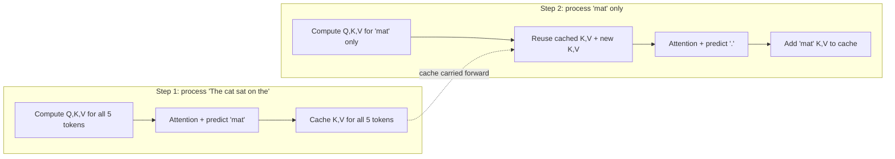
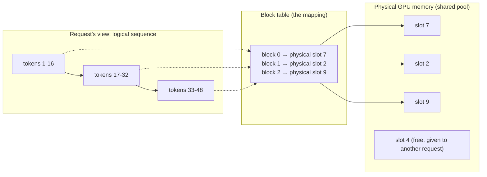
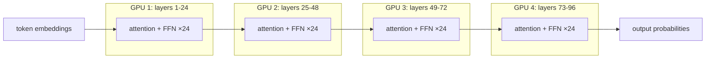
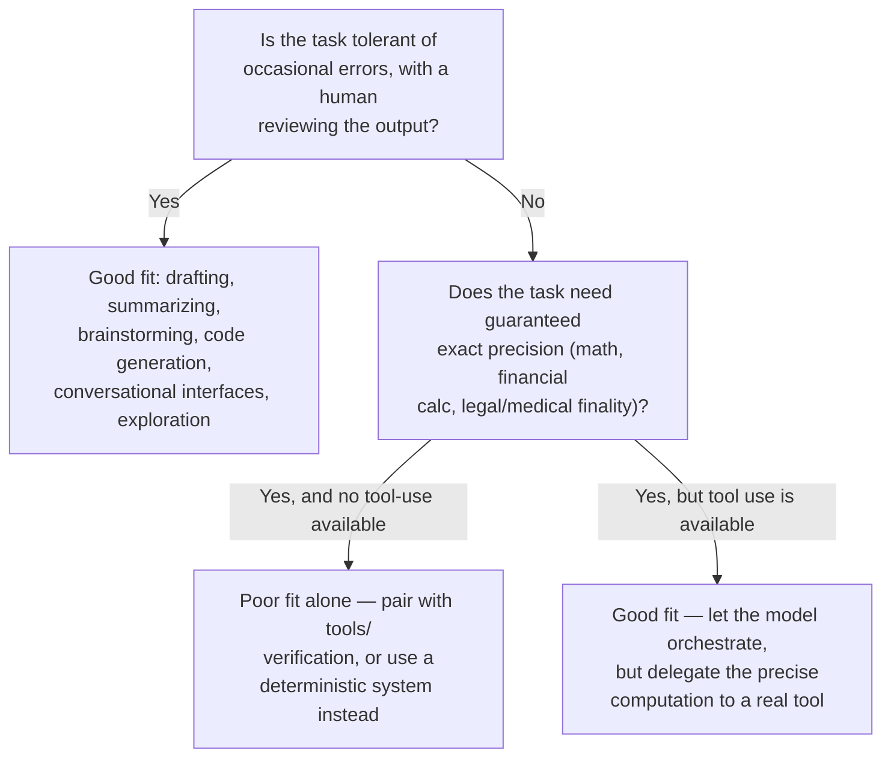

Good — let's do this properly, one piece at a time, story-first, with real depth. Given how much ground you've listed, here's the roadmap I'd propose (we won't rush any of it):

**Roadmap**
1. What is a "parameter" really, and why do we need billions of them → why that forces matrix multiplication at massive scale
2. Why CPUs choke on this and why GPUs are the answer → SIMD/SIMT, cores, memory bandwidth
3. The Transformer & attention — the actual computation happening per token
4. Inference: autoregressive generation, and why it's fundamentally different from training
5. Context window — what it actually is physically, and its limits
6. KV cache — the problem it solves and the memory cost it introduces
7. Batching, memory fragmentation, and why vLLM/PagedAttention exists
8. Quantization, model loading, sharding across GPUs
9. Guarantees & failure modes — what LLMs can/can't promise, hallucination, and why

We'll do exactly one numbered item per round. Tell me when you're solid on one and I'll move to the next. Let's start.

---

## 1. What is a "parameter," and why billions of them?

### The origin problem

Picture the earliest attempts at teaching a machine to do something "smart" — say, decide if an email is spam. The 1950s-60s approach (the *perceptron*) was: take the input, multiply each feature by a **weight**, sum them up, and if the sum crosses a threshold, fire "yes."

```
spam_score = w1*(contains "free") + w2*(contains "click") + w3*(sender_unknown) + b
```

Those `w1, w2, w3, b` — the numbers the machine tunes to get better at the task — are **parameters**. That's it. That's the whole concept. A parameter is just a number the model learns, as opposed to a number you hand it as input.

The problem researchers hit almost immediately: a spam filter with 3 weights can only draw a straight line between "spam" and "not spam" in a 3-dimensional space of features. Real language isn't linearly separable like that. So people stacked these into layers — one layer's output feeds the next layer's input, each with its own weights. This is a **neural network**. More layers, more weights per layer = more "shapes" of patterns the network can represent.

### Why the number exploded into billions

Here's the actual story of the scale-up, because it wasn't a single leap:

| Era | Model | Parameters | What changed |
|---|---|---|---|
| 1958 | Perceptron | ~a few hundred | proof of concept |
| 1986-2012 | Small neural nets | thousands–millions | multi-layer backprop works, but hand-crafted features still needed |
| 2012 | AlexNet (image) | 60 million | GPUs used for training for the first time at scale — this is the pivot point |
| 2018 | GPT-1 | 117 million | first "pretrain on raw text, no labels" language model |
| 2019 | GPT-2 | 1.5 billion | scaling up = shockingly better *without new algorithms* |
| 2020 | GPT-3 | 175 billion | this is where the industry realized: scale itself is a lever, not just architecture |
| 2023+ | GPT-4, Claude 3+ | rumored/estimated hundreds of billions to ~1T+ (undisclosed) | mixture-of-experts, way more training data, much bigger context |

The key discovery (mid-2010s to 2020, especially the GPT-2→GPT-3 jump) was empirical, almost accidental: researchers kept finding that if you just made the network bigger *and* fed it more data, its ability to generalize kept improving smoothly, with no sign of hitting a ceiling. This became known as **scaling laws**. Nobody had to invent a fundamentally new "trick" to go from GPT-2 to GPT-3 — they mostly just added more layers, more weights per layer, and more training text. This surprised even the researchers — intuition from classical statistics said more parameters than data points should mean *overfitting* (memorizing instead of generalizing), but for these models it didn't break that way, up to a point.

So "billions of parameters" isn't an arbitrary marketing number — each parameter is one learned number in a giant chain of matrix multiplications, and empirically, more of them (fed more data) made the model markedly better at predicting language, up to enormous scales.

### What a parameter is doing, concretely

Every parameter lives inside a **matrix**. When the model processes your input, your text becomes a matrix of numbers (embeddings), and that matrix gets multiplied against **weight matrices** — the parameters — layer after layer.

Example, tiny scale so you can see it: suppose one layer takes a 4-number input vector and has a weight matrix of size 4×4 (16 parameters):

```
input:  [0.2, 0.9, 0.1, 0.4]

weight matrix (4x4):
[ 0.1  0.3 -0.2  0.5 ]
[ 0.4 -0.1  0.2  0.0 ]
[ 0.0  0.2  0.3 -0.4 ]
[ 0.6  0.1 -0.3  0.2 ]

output = input × weight_matrix   → another vector of 4 numbers
```

That's one layer, one 4×4 matrix multiply. A real model like GPT-3 has matrices with dimensions in the thousands, dozens of these per layer, and ~96 layers stacked. Every single token you send it gets multiplied through **all** of that, every single time. That's why "billions of parameters" directly means "billions of multiply-and-add operations, per token, per layer pass" — and that raw fact is exactly the seed of the next problem: normal computers are built to do one arithmetic operation at a time, fast. This workload needs *millions of independent multiplications happening at once*. That mismatch is what makes item #2 (why GPUs) necessary — but that's next lesson.

---

Sit with this one. Once "parameter = learned number living in a weight matrix, and there are billions of them because scale empirically kept helping" feels solid, say the word and we'll go to **why CPUs can't handle this and what a GPU actually does differently**.

---

## 2. Why CPUs choke on this, and what a GPU actually does differently

### The problem, concretely

Let's put real numbers on lesson 1. GPT-3 (175B parameters) processing **one single token** requires roughly 2×175B ≈ 350 billion floating-point operations (each parameter gets one multiply and one add against the input). Now remember: this happens *again, from scratch, for every new token the model generates or reads*. A 500-word response might be ~700 tokens. That's on the order of 2.4×10¹⁴ operations for one reply.

A high-end CPU core does maybe 10-50 billion operations/second for this kind of arithmetic. So even ignoring everything else, one core alone would take minutes to produce a single response. That's the wall people hit: **the workload isn't just "big," it's embarrassingly parallel** — and CPUs are built for the opposite kind of problem.

### The story of why CPUs are the wrong tool

CPUs were designed, from the 1970s onward, to be good at **sequential, branching, unpredictable** work: run this instruction, check a condition, jump somewhere else, fetch data that depends on the last result, repeat. A modern CPU has maybe 8-64 cores, but each core is enormously sophisticated — branch predictors, out-of-order execution, deep caches — because it's optimized to run *one thread of complicated logic* as fast as possible. That sophistication costs transistors and power, so you can't have millions of these cores on one chip.

But a matrix multiplication like the one in lesson 1 is not complicated logic — it's the *same simple operation* (multiply, add) repeated millions of times on independent pieces of data, where the operations don't need to influence each other. Multiplying row 1 by the weight matrix doesn't care what happens to row 5,000. That's the exact opposite of what CPU cores are built for, and it wastes almost all of a CPU core's complexity — you're using a Formula 1 engine to do the job of a thousand simple engines.

### Enter GPUs — a different story entirely

GPUs weren't built for AI originally — they were built in the 1990s-2000s to render millions of pixels/triangles for video games, where (same story) you need to do the same simple computation ("what color is this pixel") independently, for millions of pixels, simultaneously, every frame. So GPU makers (mainly NVIDIA) built chips completely differently: instead of a few complex cores, they built **thousands of small, simple cores**, all doing the same instruction on different data at the same time. This design is called **SIMT** (Single Instruction, Multiple Threads) — a close cousin of the older SIMD (Single Instruction, Multiple Data) idea from CPU vector units, but taken to a much larger, more flexible scale.

| | CPU core | GPU |
|---|---|---|
| Count per chip | 8–64 complex cores | thousands of simple cores (e.g. ~16,000 "CUDA cores" on an H100) |
| Optimized for | sequential logic, branching | identical ops across huge data in parallel |
| Per-core power | very high (deep pipelines, prediction) | low, deliberately simple |
| Best at | one complicated task fast | one simple task, a million times at once |
| Memory bandwidth | ~50-100 GB/s typical | ~2-3 TB/s (H100) — this matters hugely, see below |

The 2012 pivot point I mentioned in lesson 1 (AlexNet) is the actual historical moment this collided with AI: researchers realized that neural network math — layer after layer of matrix multiplication — is *exactly* the same shape of problem as rendering pixels: huge amounts of independent, identical arithmetic. They repurposed gaming GPUs (via NVIDIA's CUDA programming platform, released 2007, which let developers write general-purpose code for GPUs, not just graphics) to train neural nets, and got roughly 10-20x speedups over CPUs immediately. That's the moment "deep learning" became practical at scale rather than an academic curiosity — it's a hardware story as much as an algorithm story.

### How the parallelism actually happens, mechanically

Take that 4×4 matrix multiply from lesson 1, scaled up to something real — say a 4096×4096 weight matrix (a realistic layer size). Computing one output row requires 4096 multiply-adds. A GPU doesn't do these one at a time — it assigns **many output elements to many cores simultaneously**. Conceptually:

```
GPU launches a "kernel" (a function) across a grid of threads:
  thread(0,0) computes output[0]
  thread(0,1) computes output[1]
  thread(0,2) computes output[2]
  ...thousands of threads, all executing the exact same
  multiply-add instruction, at the exact same clock cycle,
  just on different slices of data.
```

This is the crucial mechanism: it's not that the GPU is "faster" per operation than a CPU (individual GPU cores are actually *weaker* than CPU cores) — it's that it does an enormous number of the *same* operation in true lockstep, in parallel, because the problem allows it. If the problem required each step to depend on a decision made by the previous step (like parsing deeply nested code logic), a GPU would actually be worse than a CPU — this is why GPUs are useless for, say, running your operating system, but perfect for neural nets.

### The second, less-talked-about bottleneck: memory bandwidth

Raw compute isn't the only reason CPUs lose here. To multiply a matrix, the chip has to *read* all those parameter values from memory first. With billions of parameters, you're constantly streaming huge amounts of data from memory into the compute units. This is called being **memory-bandwidth-bound** rather than compute-bound, and it's a distinct problem from raw arithmetic speed — it's why the table above shows GPU memory bandwidth (~2-3 TB/s) is 20-30x a CPU's (~50-100 GB/s). GPUs pair their thousands of cores with specially designed high-bandwidth memory (HBM) sitting physically very close to the compute cores, precisely so they can keep feeding all those parallel cores without starving them. This distinction — compute-bound vs. memory-bandwidth-bound — becomes *very* important later when we get to inference and the KV cache, so file it away.

---

Once "GPU = thousands of simple cores doing identical operations in lockstep, paired with very high memory bandwidth to keep them fed, because matrix multiplication is embarrassingly parallel while CPUs are built for sequential branching logic" feels solid, say **next** and we'll go into the Transformer architecture and attention — the actual per-token computation.

---

That's on me — parallelism is genuinely one of the hardest things to build intuition for through text alone. Let me show it.That picture is the whole idea. Now let's ground it with a plain-English analogy and one more diagram for the memory piece.

### The analogy: grading exams

Imagine 4,096 exam papers need grading, each with the same 5 questions.

- **CPU approach**: You hire 4 brilliant, fast professors. Each one is incredibly good — grades a paper in 2 seconds. But there are only 4 of them, so 4,096 papers ÷ 4 graders ≈ 1,024 papers each, one after another. Total time is dominated by *how many papers per grader*, done in sequence.
- **GPU approach**: Instead, you hire 4,000 undergrad TAs. Each one is slower individually — takes 8 seconds per paper, since they're less experienced. But you hand out **all 4,096 papers at once**, one (or one batch) per TA, and they all grade simultaneously. Total time ≈ 8 seconds, because the work happened in parallel, not because any individual worker was fast.

That's the entire GPU trick: **not faster individual workers — vastly more workers, given identical, independent work to do at the same time.** This only works because grading paper #1 doesn't depend on the result of grading paper #2 — exactly like row 1 of a matrix multiply doesn't depend on row 5,000. If grading paper #50 required knowing the average score of the first 49 papers (a dependency), you couldn't parallelize like this — you'd be stuck going in order, and the CPU's fast-but-few professors might even win. **That's the litmus test for "can this be GPU-accelerated": are the pieces of work independent of each other?**

### Why "billions of parameters" specifically needs this

Recall from lesson 1: one layer might be a 4096×4096 weight matrix. Computing the output means computing 4096 independent dot-products (one per output row) — each one is its own "exam paper," completely independent of the others. A GPU assigns each dot-product to a different core and does all 4096 at essentially the same time. A CPU has to trickle through them a handful at a time. With ~96 layers, each with several such matrices, and billions of total parameters, the sheer *count* of independent, identical, parallelizable operations is why this problem is uniquely GPU-shaped.

### The memory-bandwidth half, in the same terms

Here's the part people usually miss: even with 4,000 TAs ready to grade simultaneously, if there's only **one runner** delivering papers from the file cabinet to the TAs' desks, the TAs sit idle waiting for papers. That runner's speed is the bottleneck — not how fast the TAs can grade.

That's memory bandwidth. The GPU's thousands of cores are useless if the chip can't stream the model's parameters (the "papers," stored in memory) to those cores fast enough. This is why GPUs pair massive core counts with **HBM (High Bandwidth Memory)** sitting physically right next to the compute cores — think of it as building the filing cabinet *inside the classroom* instead of down the hall, so the runner's trip is nearly instant. This compute-vs-bandwidth distinction is going to matter a lot later — it's the actual root cause of why the KV cache becomes a memory problem, not a compute problem, during inference.

---

Does the picture + analogy make it click now? Once solid, say **next** for the Transformer & attention — the real per-token computation.

---

Good question — that confusion is exactly the right thing to poke at, because the answer isn't "GPU math is faster," it's something more subtle. Let me slow way down.

### The key idea you're missing: it's not speed-per-operation, it's how many operations fit in the same clock tick

Here's the thing that will feel surprising: **an individual GPU core is actually slower than an individual CPU core.** A CPU core runs at ~4-5 GHz (4-5 billion ticks/second). A GPU core runs at ~1.5-2 GHz — roughly half the clock speed. So if you gave one CPU core and one GPU core the exact same single multiply-add, the CPU core would actually finish it first.

The speedup comes from a completely different place: **how many of those operations happen *during the same tick*.**

### Walk through a small, concrete example

Say we need to compute 16 independent row-multiplications (a tiny stand-in for our 4096-row matrix). Each row-multiplication takes exactly 1 "tick" to compute, on either kind of core.

**CPU: 4 cores available**

```
              tick 1   tick 2   tick 3   tick 4
Core A:        row1     row5     row9     row13
Core B:        row2     row6     row10    row14
Core C:        row3     row7     row11    row15
Core D:        row4     row8     row12    row16
```

Each core works through its own queue, one row per tick, four ticks in a row. All 16 rows done in **4 ticks total**. (Note: this already includes the CPU's own multi-core parallelism — 4 cores working simultaneously — this is the *best case* for a CPU.)

**GPU: 16 cores available (each individually slower, remember)**

```
              tick 1
Core 1:        row1
Core 2:        row2
Core 3:        row3
Core 4:        row4
Core 5:        row5
Core 6:        row6
Core 7:        row7
Core 8:        row8
Core 9:        row9
Core 10:       row10
Core 11:       row11
Core 12:       row12
Core 13:       row13
Core 14:       row14
Core 15:       row15
Core 16:       row16
```

All 16 rows done in **1 tick.** Not because any core is faster — because there were enough cores that nobody had to wait in line.

### Now scale it to the real numbers

Our real matrix had 4096 rows.

```
CPU (4 cores):        4096 rows ÷ 4 cores  = 1024 ticks needed
GPU (4096+ cores):    4096 rows ÷ 4096 cores = 1 tick needed
```

That's a **~1024x** difference in wall-clock ticks, purely from *width* (how many independent workers you have), even though — remember — each individual GPU tick is actually a bit slower in absolute time than a CPU tick. The parallel width advantage completely swamps the per-tick disadvantage.

### The mental model to keep

```
total wall-clock time  ≈   total operations needed
                            ------------------------
                            (operations done per tick) × (tick speed)
```

A CPU tries to win by maximizing "tick speed" (few cores, each blazing fast, complex).
A GPU tries to win by maximizing "operations per tick" (thousands of cores, each modest).

For a workload like matrix multiplication — millions of independent multiply-adds with zero dependencies between them — stacking width (GPU's strategy) wins by orders of magnitude, because you can throw thousands of workers at the pile simultaneously. Tick speed alone (CPU's strategy) can never catch up once the number of independent pieces of work vastly exceeds the number of cores you have.

### Why this *wouldn't* work for other problems (the boundary case)

```
Sequential task example: computing 1+2+3+...+1000 by
running total (each step needs the previous result):

step1: sum=1
step2: sum=1+2=3      <- depends on step1's result
step3: sum=3+3=6      <- depends on step2's result
...
```

Here there's nothing to spread across thousands of cores — step 500 literally cannot start until step 499 finishes. A GPU with 4096 idle cores would help zero here; a CPU's higher tick speed would win outright. This is why GPUs dominate neural nets (independent dot-products, no cross-dependency within a layer) but are useless for, say, running your web browser's UI logic (deeply sequential, dependent, branching).

---

Does the tick-timeline version make the mechanism click now — that it's parallel *width*, not per-operation speed? Once that's solid, say **next** for the Transformer/attention lesson.

---

## 3. The Transformer & attention — the actual per-token computation

### The problem that came before transformers

Rewind to 2014-2016. Language models at the time used **RNNs** (Recurrent Neural Networks) and their improved cousin, **LSTMs**. The idea: read a sentence word by word, left to right, carrying a running "memory" (a vector called the hidden state) forward.

```
"The cat sat on the mat"

 The → [state1] → cat → [state2] → sat → [state3] → on → [state4] → ...
```

Two problems emerged, and — tying directly back to what we just covered — **one of them is a GPU problem**:

1. **Sequential bottleneck**: computing `state4` requires `state3`, which requires `state2`, which requires `state1`. This is *exactly* the "running total" dependency chain from the last lesson — the one case where GPUs can't help. RNNs were structurally stuck being slow, no matter how many GPU cores you threw at them, because each step depends on the previous one's output.
2. **Long-range memory loss**: by the time the model reached word 50 in a long sentence, the "memory" of word 1 had been diluted through 49 rounds of transformation. Models struggled to connect distant words (e.g., matching a pronoun to a noun 30 words earlier).

### The 2017 insight: attention

A Google paper titled *"Attention Is All You Need"* (2017) proposed dropping recurrence entirely. Instead of carrying a running memory word-by-word, let **every word directly look at every other word in the sentence at once**, and learn how much to "attend to" each one. This is called **self-attention**, and it's the mechanism the entire modern LLM boom is built on.

Critically — and this is why it mattered for the GPU story — **there's no dependency chain**. Computing how much word 5 attends to word 2 doesn't require first computing how word 4 attends to word 1. Every attention calculation across every pair of words is independent, which means it's exactly the kind of embarrassingly-parallel workload GPUs eat for breakfast. Transformers didn't just improve quality — they *unlocked* the GPU speed advantage that RNNs structurally couldn't use.

### How attention actually works, mechanically

Every word (token) gets converted into three vectors, via three separate learned weight matrices (yes — more parameters, more matrix multiplies):

| Vector | What it represents | Rough analogy |
|---|---|---|
| **Query (Q)** | "What am I looking for?" | The question this word is asking |
| **Key (K)** | "What do I contain?" | The label/tag other words advertise |
| **Value (V)** | "What information do I actually carry?" | The payload to hand over if selected |

For the sentence "The cat sat on the mat," take the word **"sat"**. Its Query vector gets compared (dot product) against the Key vector of *every* word in the sentence, including itself:

```
score("sat" → "The") = Q_sat · K_The   = 1.2
score("sat" → "cat") = Q_sat · K_cat   = 8.7   ← high! "cat" is the subject doing the sitting
score("sat" → "sat") = Q_sat · K_sat   = 3.0
score("sat" → "on")  = Q_sat · K_on    = 2.1
score("sat" → "the") = Q_sat · K_the   = 0.9
score("sat" → "mat") = Q_sat · K_mat   = 4.5   ← "mat" matters too, it's what's being sat on
```

These raw scores get passed through a **softmax** (turns any numbers into probabilities that sum to 1), producing attention *weights*:

```
"sat" attends to:  The=0.03  cat=0.55  sat=0.09  on=0.06  the=0.02  mat=0.25
```

Then the final output for "sat" is a **weighted sum of every word's Value vector**, using those weights — so "sat"'s representation, after this layer, is now a blend that's mostly "cat" + a good chunk of "mat" + a little of everything else. This is the model learning grammatical/semantic relationships purely from data — nobody programmed in "subject-verb" rules.### Why this is a matrix-multiply problem again (ties back to lesson 2)

I described it above for one word ("sat") comparing against all others. In practice, the model doesn't loop word-by-word — it computes **all words' Q, K, V vectors at once** and does the *entire* comparison as one big matrix multiplication:

```
Q (6 words × d dims)  ×  Kᵀ (d dims × 6 words)  =  Scores (6×6 matrix)
```

That single matrix multiply produces *every* word's attention score against *every* other word simultaneously — 36 scores for a 6-word sentence, computed in one parallel GPU pass, no sequential loop needed. This is precisely why the "independent, parallel dot-products" story from lesson 2 matters so much: attention is just... more matrix multiplication, at a bigger scale, stacked with the feed-forward layers from lesson 1.

### A few more pieces, briefly (so the picture is complete but not overloaded)

| Concept | What it adds |
|---|---|
| **Multi-head attention** | Instead of one Q/K/V comparison, the model runs ~32-96 of these *in parallel* with different learned weights ("heads") — one head might learn to track grammar, another meaning, another coreference. Their outputs get concatenated. |
| **Positional encoding** | Since attention has no built-in sense of word order (unlike RNNs, which read left-to-right naturally), a position signal gets added to each word's vector so the model knows "cat" was word 2, not word 5. |
| **Feed-forward layer** | After attention mixes information *between* words, a plain feed-forward layer (the matrix multiply from lesson 1) processes *each* word's vector individually to refine it further. |
| **Stacking** | One "block" = attention + feed-forward. Real models stack 32-120 of these blocks, each refining the representation further. GPT-3 has 96; deeper models have more. |

So the full picture: a token flows through dozens of stacked blocks, each doing (a) attention — comparing against every other token, and (b) a feed-forward transform — and every one of those steps is matrix multiplication, done in parallel across all tokens simultaneously, which is why this architecture and GPUs were made for each other.

---

Once "attention = every token compares against every other token via Q/K/V matrix multiplies, done in parallel, stacked across many layers" feels solid, say **next** and we'll move to inference — what actually happens when you hit "send" and the model generates a reply, one token at a time (and why *that* part is surprisingly not fully parallel).

---

Good instinct to stop on that — it's not obvious why you'd need *three* separate vectors instead of just comparing words directly. Let me unpack the reasoning.

### Why not just compare the raw word vectors to each other?

You could imagine a simpler design: each word already has a vector (its embedding). Why not just directly compare word "sat"'s vector against word "cat"'s vector, and skip Q/K/V entirely?

The problem: a word's single embedding vector would then have to serve **two conflicting jobs at once**:
1. Encode "here's how I should be found/matched by other words"
2. Encode "here's what actual information I should hand over once matched"

These are genuinely different tasks, and forcing one vector to do both hurts each. Here's a concrete illustration:

### The search-engine analogy

Think of a library search system:

- **Query** = what you type into the search box ("looking for books about big cats")
- **Key** = the index tags/keywords a book is filed under ("feline," "wildlife," "Africa")
- **Value** = the actual book content you get handed once there's a match

Notice these are naturally three *different* things, even though they're all "about" the same book. The keyword tags a librarian uses to *index* a book (Key) don't need to look anything like the book's actual chapters (Value) — the tags just need to be good at matching relevant searches (Query). If you forced the index tags and the book content to be the exact same object, you'd get a worse system: either the tags become bloated trying to also be readable content, or the content gets compressed down to searchable keywords and loses richness.

### Applying that back to "sat" looking at "cat"

- **"cat"'s Key vector** only needs to be good at *one job*: making itself discoverable by relevant queries. It might end up encoding something like "I am a concrete noun, likely a grammatical subject, animal-related" — abstract, matching-oriented features.
- **"cat"'s Value vector** needs to carry the actual rich semantic payload that gets blended into "sat"'s new representation if selected — things like "small domesticated feline, furry, an entity capable of independent action."

These can be (and empirically, need to be) quite different vectors. And critically — **the same underlying word embedding gets pushed through three separate learned weight matrices** (`W_Q`, `W_K`, `W_V`) to produce these three views:

```
word_embedding("cat")  →  × W_Q  →  Query vector   (if "cat" were doing the asking)
word_embedding("cat")  →  × W_K  →  Key vector     (how "cat" advertises itself)
word_embedding("cat")  →  × W_V  →  Value vector   (what "cat" actually contributes)
```

Because `W_Q`, `W_K`, `W_V` are *separate, independently learned* matrices (yes — more parameters), gradient descent (the training process) is free to shape each projection for its specialized job without one job's requirements dragging the other one around. Empirically, this is exactly what researchers found when they tried it: separating these roles noticeably outperformed cramming them into one shared vector.

### One more subtlety: why does a word even need a Query if it's also a Key?

Every word plays *both* roles in the same layer: it asks a question (as Query, "what should I pay attention to?") **and** advertises itself for others to find (as Key), **and** offers content if chosen (as Value). "sat" uses its Query to look outward at "cat" and "mat." Simultaneously, "cat" uses its own Key to be discoverable — maybe by some other word that's looking for a subject. All of this happens for every word, at once, in the same parallel matrix multiply.

---

Does the search-engine framing make the "why three vectors" click? Once solid, say **next** and we'll move to inference.

---

## 4. Inference — what happens when you hit "send"

### The critical split you need in your head: training vs. inference

Everything in lessons 1-3 (parameters, attention, matrix multiplies) describes the *shape* of the model. But there are two completely different moments when that shape gets used:

- **Training**: the model already has the *entire* sequence of text (the full sentence from the training data) available upfront. It processes the whole thing **in parallel** in one pass, checks its predictions against the known-correct next words, and adjusts weights. This is why lessons 2-3's parallelism story works so cleanly during training — everything is available at once.
- **Inference**: this is what happens when you chat with the model. It does **not** have the full response upfront — it doesn't know what it's going to say next any more than you know your next sentence before you think of it. It has to generate the reply one piece at a time.

### Autoregressive generation — the actual loop

The model can only ever do one thing: **given everything so far, predict what token comes next.** A "token" is roughly a word or word-piece (I'll treat them as words here for clarity). Then — and this is the key mechanic — it takes that newly predicted token, **appends it to the input**, and runs the entire forward pass again on the now-longer sequence, to predict the *next* token. This repeats until it decides to stop.### Watching it happen, token by token

```
Step 1:  input = "The cat sat on the"           → predicts "mat"    → append
Step 2:  input = "The cat sat on the mat"       → predicts "."      → append
Step 3:  input = "The cat sat on the mat."      → predicts <STOP>   → done
```

Each step is a **full run through the entire model** — every layer, every attention block, every matrix multiply from lessons 1-3 — just to produce **one single token**. Then the model throws that whole computation away and starts over on a slightly longer input to get the *next* token. That repetition is the literal reason a longer response takes proportionally longer to generate — you're not getting one big parallel burst of computation like training; you're paying the full cost of a forward pass, once per word, back to back.

### Why "predict next token" isn't a single fixed answer

At each step, the model doesn't output one word — it outputs a probability over its entire vocabulary (often 50,000-100,000+ possible tokens):

```
after "The cat sat on the ___":
  mat     → 41%
  floor   → 22%
  chair   → 9%
  couch   → 6%
  ...(thousands more, tiny probabilities each)
```

A **sampling strategy** then picks one. Always picking the top probability (called *greedy decoding*) makes output deterministic but often bland/repetitive. Real systems usually sample with some randomness (controlled by a **temperature** setting — higher temperature flattens the distribution, encouraging less-obvious word choices), often restricted to just the top few candidates (**top-p / top-k sampling**) so it doesn't occasionally pick something absurd. This randomness is exactly why asking a model the same question twice can give slightly different phrasing each time.

### The part that should feel uncomfortable, given lesson 2

Notice the tension: training was gloriously parallel (whole sequence at once, GPU-friendly). But generation — inference — is **sequential by nature**: you cannot know token 2 until you've produced token 1, because token 1 becomes part of the input for producing token 2. This is *exactly* the "running total" dependency chain from lesson 2's boundary case, the one situation where GPUs' massive parallel width can't help.

This is not a small footnote — it's the central tension of running these models in production, and it's exactly the problem that the **KV cache** exists to partially solve (without it, each new token would require redoing the *entire* forward pass on the entire growing sequence from scratch, recomputing everything about all previous tokens every single time). That's next.

---

Once "inference = sequential loop, one full forward pass per token, fundamentally different from training's parallel pass" feels solid, say **next** for the context window and then the KV cache.

---

## 5. The context window — what it physically is, and why it's limited

### What "context window" actually means, concretely

Every time you send a message, the model doesn't just see your latest sentence — it re-reads the **entire conversation so far** (your messages, its previous replies, the system prompt, any documents you've shared) as one long sequence of tokens, and processes all of it through the attention mechanism from lesson 3. The **context window** is simply the maximum number of tokens that sequence is allowed to be. GPT-2 could handle about 1,024 tokens. Modern models handle 128,000 to over a million.

This is not a made-up limit or a pricing decision — it comes directly from something you already understand: **attention**.

### Why it doesn't just scale for free — the quadratic problem

Recall from lesson 3: attention means *every token computes a score against every other token*. For a sequence of length `n`, that's `n × n` score comparisons, per attention layer. Double the sequence length, and the attention computation doesn't double — it **quadruples**. This is the famous "attention is O(n²)" problem.Even on a log-scale y-axis (which flattens exponential-looking growth into a straight line), this curve still bends upward — that's how aggressive quadratic growth is. Going from a 1K-token conversation to a 128K-token one isn't 128x more attention work, it's **~16,384x more** (128² = 16,384). And remember from lessons 1-2: this attention computation happens *per layer* — a 96-layer model pays this cost 96 times over, for every single token it generates.

### The story of how context windows grew anyway

| Era | Model | Context length | What made it possible |
|---|---|---|---|
| 2018-2019 | GPT-1/2 | 512-1,024 tokens | quadratic cost was just barely tolerable at this size |
| 2020 | GPT-3 | 2,048-4,096 | bigger GPUs, but still fundamentally the same brute-force attention |
| 2022-2023 | GPT-4, Claude 2 | 8K-100K | algorithmic tricks: sparse/local attention variants, better positional encoding (see below), and much more efficient GPU kernels |
| 2024-2026 | Claude, Gemini, GPT | 200K-1M+ | further systems-level optimizations (this is where the KV cache and things like FlashAttention/vLLM come in — next lessons) |

Two separate kinds of innovation made this jump, and it's worth knowing both exist as distinct efforts:

1. **Algorithmic**: instead of every token attending to *literally every other token* with full brute force, techniques like sliding-window attention (only look at nearby tokens closely) or better relative-position encodings (**RoPE** — Rotary Position Embeddings — is the one most modern models use) let the model generalize to longer sequences than it was even trained on, without the naive full quadratic cost everywhere.
2. **Systems/hardware**: smarter memory management and fused GPU operations that don't reduce the *math* but make each operation dramatically cheaper to execute in practice. This bucket is exactly where the KV cache lives — which is the next lesson, and directly explains why generating text with a long conversation history feels like it "remembers" without redoing all that attention math from scratch every single token.

### What actually shares this budget

A crucial practical point: the context window isn't just "your question." It's a single shared pool consuming:

```
[ system prompt ] + [ full conversation history ] + [ any documents/files ] + [ model's response so far ]
                              all counted together, against one token limit
```

If you upload a large document, it eats directly into the same budget available for conversation history and the response. This is also why very long conversations sometimes get truncated or summarized behind the scenes — the system has to keep the total under the model's hard token ceiling.

---

Once "context window = max tokens in the shared sequence, limited because attention cost grows quadratically with length" feels solid, say **next** and we'll go into the KV cache — the mechanism that makes generating long responses inside that window computationally survivable at all.

---

## 6. The KV cache — avoiding redundant work, at the cost of memory

### The waste hiding inside the autoregressive loop

Look back at lesson 4's loop. At step 2, the model reprocesses `"The cat sat on the mat"` from scratch — meaning it recomputes the Key and Value vectors (lesson 3) for *every single word*, including "The," "cat," "sat," "on," "the" — words it already processed identically in step 1. Nothing about those words' Key/Value vectors changes just because a new word got appended.

```
Step 1: process "The cat sat on the"
        → compute K,V for: The, cat, sat, on, the           (5 words' worth of work)

Step 2: process "The cat sat on the mat"
        → compute K,V for: The, cat, sat, on, the, mat       (6 words — but the
                                                                first 5 are IDENTICAL
                                                                to what we just computed!)
```

Redoing identical work every step is pure waste — and it's the kind of waste that gets worse as the conversation grows, since step 100 redundantly recomputes K/V for 99 words it already knew.

### The fix: cache the Keys and Values

The insight: since a word's Key and Value vectors never change once computed (they only depend on that word and its position, not on what comes after), **just store them the first time and reuse them forever.**



So from step 2 onward, the model only ever computes **Query, Key, and Value for the one brand-new token**, then runs attention using that new Query against *all* the cached Keys (old + new), and the cached Values for the weighted sum. The Query for old tokens is never even needed again — you only need a Query when a token is *doing the asking*, and old tokens already asked their question back when they were the "current" token.

### What this actually saves — with numbers

Without caching, generating a 1,000-token response means: token 1 does 1 unit of K/V work, token 2 redoes that 1 unit plus 1 more, token 3 redoes 2 units plus 1 more... This is the same quadratic shape from lesson 5, applied across the *generation* process itself, not just the prompt.

```
Without KV cache (recompute everything each step):
  step 1:    1 token's  K,V computed
  step 2:    2 tokens'  K,V computed   (1 wasted repeat)
  step 3:    3 tokens'  K,V computed   (2 wasted repeats)
  ...
  step 1000: 1000 tokens' K,V computed (999 wasted repeats)
  total K,V computations ≈ 500,000

With KV cache (compute once, reuse):
  step 1:    1 token's  K,V computed
  step 2:    1 token's  K,V computed   (reuse the rest)
  step 3:    1 token's  K,V computed   (reuse the rest)
  ...
  step 1000: 1 token's  K,V computed   (reuse the rest)
  total K,V computations = 1000
```

That's a ~500x reduction in redundant computation for a 1,000-token response — and the ratio gets *more* extreme the longer the response, since the waste was quadratic before and is now linear.

### The cost this introduces: memory, not compute

This is where lesson 2's "compute-bound vs. memory-bandwidth-bound" distinction comes back. The KV cache has to physically **live somewhere** — in GPU memory, for the entire duration of that conversation, so it can be reused at every step. And it doesn't just hold one vector — it holds a K and a V vector, **for every token, for every layer, for every attention head.**

Rough size formula:

```
KV cache size = 2 (K and V)
              × num_layers
              × num_attention_heads × head_dim   (= hidden size)
              × sequence_length
              × bytes_per_number (2 bytes for fp16)
```

Concrete example — a mid-size model: 40 layers, hidden size 5,120, at 4,096 tokens of context:

```
2 × 40 × 5,120 × 4,096 × 2 bytes  ≈  3.4 GB   ← just for ONE conversation's cache
```

Now the punchline: a production server isn't handling one conversation — it's handling **hundreds of users simultaneously**, each with their own growing KV cache, all needing to sit in the GPU's limited memory (an H100 has 80GB total, and the model's own parameters already occupy a big chunk of that). 3.4GB × 200 concurrent users = 680GB — far more than any single GPU holds.

So the KV cache trades away a compute problem (redundant recomputation) for a **memory capacity and management problem**: how do you fit many growing, unpredictable-length caches into limited GPU memory without waste or crashes? That exact problem — and the clever solution to it — is what **vLLM and PagedAttention** were built for. That's next.

---

Once "KV cache = store each token's Key/Value once, reuse on every future step, turning quadratic redundant work into linear work — but at the cost of memory that grows per-user and per-token" feels solid, say **next** for vLLM and how serving systems manage that memory across many simultaneous users.

---

## 7. vLLM and PagedAttention — solving the memory management problem

### The waste inherited from lesson 6

The KV cache solved a compute problem but created a memory problem: every active conversation needs its cache to sit in GPU memory, growing token by token, for as long as that conversation is being generated. Early serving systems (like the original Hugging Face `transformers` generation code) handled this the simplest possible way: **when a request comes in, pre-allocate one big contiguous block of GPU memory, sized for the maximum possible sequence length** (say, 2,048 tokens), whether or not the response ends up using all of it.

```
Request A asks a short question, gets a 50-token reply:

  [██████████████████████████████████████████████████] 2,048 tokens reserved
  [██] ← only 50 actually used
  [                    1,998 tokens wasted, unusable by anyone else                ]
```

This is called **internal fragmentation** — memory that's reserved but sitting empty, because the system had to guess the maximum upfront and commit to it. Multiply this across hundreds of simultaneous users, most of whom don't use anywhere near the max length, and a huge fraction of expensive GPU memory sits idle, unusable even though other requests are being turned away for "lack of memory."

### The second problem: static batching leaves the GPU half-empty

GPUs are most efficient processing many requests *together* in a batch (remember lesson 2 — parallel width is the whole point). But the naive approach batches a fixed group of requests and waits for **all of them to finish** before starting a new batch:

```
Static batching, 4 requests in a batch:

  Request 1: [tok][tok][tok][tok][tok][tok][tok][tok]  (needs 8 steps)
  Request 2: [tok][tok][tok]  done                     (needs 3 steps — GPU slot now idle, but stuck waiting)
  Request 3: [tok][tok][tok][tok][tok]  done           (needs 5 steps — idle for 3 steps)
  Request 4: [tok][tok][tok][tok][tok][tok]  done      (needs 6 steps — idle for 2 steps)
                                          ↑
                          batch can't accept new requests until ALL 4 finish,
                          even though slots 2, 3, 4 sat idle for several steps
```

Short requests finish early but their GPU slot sits idle rather than being handed to a new, waiting request — because the whole batch is locked together until the slowest member finishes.

### vLLM's fix, part 1: PagedAttention (2023, UC Berkeley)

The core idea is borrowed directly from a decades-old solution to almost the exact same problem in operating systems: **virtual memory paging**. Instead of giving each process one giant contiguous slab of RAM (which fragments badly), an OS splits memory into small fixed-size **pages** and gives processes non-contiguous pages as needed, with a **page table** mapping "logical" addresses to wherever the physical pages actually landed.

vLLM does the same thing to the KV cache: split it into small fixed-size **blocks** (e.g., 16 tokens' worth of K/V per block), and hand out blocks from a shared pool **only as a conversation actually grows**, wherever there's a free block — not one giant pre-reserved region.



The request only ever grows by requesting **one new block at a time**, right when it's needed — no upfront guess, no wasted reservation. This alone eliminates almost all the internal fragmentation from the earlier example.

A bonus this design unlocks: if two requests happen to share an identical prefix (e.g., the same long system prompt), vLLM can literally point both requests' block tables at the **same physical blocks** instead of duplicating them — real memory savings across users, not just within one.

### vLLM's fix, part 2: continuous (iteration-level) batching

Instead of locking a batch together until every member finishes, vLLM re-evaluates the batch **after every single token step**: any request that finished gets removed immediately, freeing its GPU slot and blocks, and any new waiting request gets slotted in right away.

```
Continuous batching, same 4 requests + new arrivals:

step:        1    2    3    4    5    6    7    8
slot A:     [R1] [R1] [R1] [R1] [R1] [R1] [R1] [R1]
slot B:     [R2] [R2] [R2] [R5] [R5] [R5] [R5] [R5]  ← R2 finished at step 3, R5 slotted in immediately
slot C:     [R3] [R3] [R3] [R3] [R3] [R6] [R6] [R6]  ← R3 finished at step 5, R6 slotted in immediately
slot D:     [R4] [R4] [R4] [R4] [R4] [R4] [R7] [R7]  ← R4 finished at step 6, R7 slotted in immediately
```

No slot ever sits idle waiting for the slowest request in an arbitrary fixed group — the GPU stays saturated with useful work at essentially every step.

### The combined result

| | Naive serving | vLLM |
|---|---|---|
| Memory allocation | fixed max-length block per request | small blocks, allocated on demand |
| Fragmentation | severe (often >60-80% wasted) | near-zero |
| Batch composition | fixed until all finish | re-evaluated every step |
| Shared prompts across users | duplicated | can share physical memory |
| Net effect | few concurrent users, GPU often idle | published results: several-fold higher throughput on the same hardware |

This is why vLLM (and similar systems — TensorRT-LLM, SGLang, TGI) matter so much in production: the *model's* math didn't change at all from lessons 1-4 — this entire lesson is about the **serving system** wrapped around the model, managing memory and scheduling across many simultaneous users, which is a completely separate engineering problem from "how does the model compute a token."

---

Once "vLLM = OS-style paged memory for the KV cache + per-step dynamic batching, fixing fragmentation and idle GPU time" feels solid, say **next** and we'll cover quantization and how models actually get loaded into memory and split across multiple GPUs.

---

## 8. Loading the model — precision, quantization, and splitting across GPUs

### The first wall: the model doesn't fit on one GPU

Recall from lesson 1: parameters are just numbers stored in memory. The question is *how many bytes* each number takes, and that decision alone determines whether a model fits on your hardware at all.

```
Model size (bytes) = num_parameters × bytes_per_parameter
```

| Precision | Bytes/param | 175B model size | Notes |
|---|---|---|---|
| fp32 (full precision) | 4 bytes | 700 GB | old default, rarely used for inference now |
| fp16 / bf16 (half precision) | 2 bytes | 350 GB | standard for training and most inference |
| int8 (quantized) | 1 byte | 175 GB | noticeable but often acceptable quality loss |
| int4 (aggressively quantized) | 0.5 bytes | 87.5 GB | biggest compression, more quality risk |

A top-end GPU (H100) has 80GB of memory. Even at fp16, a 175B-parameter model (350GB) doesn't come close to fitting on **one** GPU — and remember, that 80GB also has to hold the KV cache for every active user (lesson 6) and leave room for the actual computation. This is the wall that makes single-GPU inference impossible for large models, and it's why "how many GPUs does this need" is a real production question, not a luxury.

### Fix 1: quantization — shrink each number

Quantization means representing each parameter with fewer bits, accepting some precision loss in exchange for a smaller memory footprint and faster computation (fewer bytes to move = less pressure on that memory bandwidth bottleneck from lesson 2).

```
fp16 value:  0.7364251...   (16 bits of precision)
int8 value:  0.74            (8 bits — rounded/scaled to fit a smaller range)
```

The naive version of this would badly damage model quality — just chopping precision everywhere breaks the delicate learned relationships between billions of parameters. Production quantization techniques (GPTQ, AWQ, and similar) are smarter: they analyze which weights are most sensitive to precision loss and calibrate the rounding per-layer or per-group, so the drop in output quality is often barely noticeable even at int8, and still usable at int4 for many tasks. This is a direct, practical trade-off: smaller/faster/cheaper vs. a small risk to output quality — and it's why you'll sometimes see model variants advertised as "Q4," "Q8," or "AWQ" — that's this exact technique.

### Fix 2: sharding — split the model across multiple GPUs

Even quantized, huge models often still don't fit on one GPU, or you want more GPUs working in parallel for speed. Two main strategies, often combined:

**Tensor parallelism** — split *individual weight matrices* across GPUs. Recall a matrix multiply from lesson 1: you can literally cut a 4096×4096 matrix into 4 vertical slices of 4096×1024 and give one slice to each of 4 GPUs. Each GPU computes its slice of the output, then they briefly communicate to combine results.

**Pipeline parallelism** — split by *layer*, not within a layer. GPU 1 holds layers 1-24, GPU 2 holds layers 25-48, and so on. A token's computation flows through GPU 1, then GPU 2, like an assembly line.



Tensor parallelism gives speed (matrix pieces computed simultaneously) but needs very fast GPU-to-GPU links (like NVIDIA's NVLink) since GPUs must constantly exchange partial results within *each* layer. Pipeline parallelism needs less communication (only hands off between layer groups) but can leave later GPUs idle waiting for earlier ones on a single request — real systems overlap multiple requests to keep all GPUs busy despite this, echoing the same "keep the pipeline full" idea from vLLM's continuous batching in the last lesson.

### Putting it together: what "loading the model" means in practice

```
1. Weight files (e.g. safetensors format) stored on disk, often already
   quantized to fp16/int8/int4
2. At server startup: weights are read from disk and copied into GPU
   memory, sharded across however many GPUs the deployment uses
   (tensor + pipeline parallelism combined, for very large models)
3. Server now sits ready, model resident in GPU memory, waiting for
   requests — this is why large-model servers have a slow "cold start"
   (loading hundreds of GB can take minutes) but fast responses once warm
4. Each incoming request's KV cache (lesson 6) is allocated on demand
   via vLLM-style block management (lesson 7), inside whatever GPU
   memory the model's weights didn't already claim
```

This is the full stack, top to bottom: parameters (1) → why GPUs (2) → attention (3) → autoregressive generation (4) → context window (5) → KV cache (6) → vLLM's memory/batching engineering (7) → and now, how the model itself is compressed and physically distributed across hardware to even begin serving requests (8).

---

Once "quantization = fewer bits per number, sharding = splitting the model across GPUs by matrix-slice or by layer" feels solid, say **next** and we'll close the arc: what guarantees these systems actually provide, their real failure modes (hallucination and friends), and when to reach for an LLM at all versus not.

---

## 9. Guarantees, failure modes, and when to actually use this

We've built the whole machine from the ground up. Let's close the loop on the questions you started with: *why does this exist, what does it actually promise, and where does it fail.*

### Why it exists — the original problem

Before this whole architecture, building an AI system for language meant hand-writing rules or training a separate labeled model for every narrow task (one for spam detection, one for translation, one for sentiment). That's expensive and doesn't generalize. The breakthrough underlying everything in lessons 1-8 was **self-supervised pretraining**: train one enormous model to do a single, unglamorous task — predict the next word — on a vast amount of raw, unlabeled internet text. No human had to label anything. It turns out that getting *very* good at next-word prediction forces the model to implicitly learn grammar, facts, reasoning patterns, and style, all as a side effect. That's the "problem solved": one general-purpose model, usable across wildly different tasks, without task-specific labeled training data for each one.

### What guarantees does it actually provide? Be precise here — the honest answer is: fewer than people assume.

This is the single most important thing to internalize after everything we've covered: **the model is a probability machine, not a database or a calculator.** Every mechanism we walked through — attention, autoregressive sampling — produces a *plausible next token*, not a *verified-true* one. There is no built-in mechanism anywhere in lessons 1-8 that checks "is this actually correct" before the token gets emitted. That single fact explains almost every failure mode below.

| Guarantee people assume | What's actually true |
|---|---|
| "It knows facts, like a database" | It generates statistically plausible text; correct facts are a byproduct of good training data, not a checked guarantee |
| "The same question gets the same answer" | Only true at temperature 0 (greedy decoding, lesson 4) — otherwise sampling introduces real randomness |
| "It knows what's happening today" | It only knows what was in its training data, up to a cutoff date — no built-in live knowledge |
| "If it doesn't know, it'll say so" | Not inherently — it will happily generate a fluent, confident-sounding, *wrong* answer, because fluent continuation is literally the only thing it was ever trained to do |

### The failure mode this directly causes: hallucination

Given a prompt like "cite the study that proved X," the model doesn't have a "check my facts" step — it has a "what token plausibly comes next given everything I've seen" step. If the training data contained many citations in that style, the model will confidently generate something *citation-shaped* — plausible author names, plausible journal, plausible year — with no guarantee any of it corresponds to a real paper. This isn't a bug that slipped through; it's the direct, structural consequence of everything in lessons 3-4: the model was built and trained to produce statistically likely continuations, full stop.

### The new problems this whole architecture introduced, and how the field responded

| Problem introduced | Response developed |
|---|---|
| Hallucination (plausible ≠ true) | **RAG** (Retrieval-Augmented Generation) — retrieve real documents first, then have the model generate an answer *grounded* in that retrieved text, instead of purely from memorized training weights |
| Raw pretraining just predicts internet text, doesn't "help" or "refuse" appropriately | **RLHF / instruction tuning** — additional training stage where the model is further trained on human preference feedback to be helpful, follow instructions, and refuse harmful requests |
| Poor precision at math/logic (next-token prediction isn't arithmetic) | **Tool use / function calling** — let the model call an actual calculator, code interpreter, or API for anything needing exact precision, instead of "guessing" the answer token by token |
| Knowledge goes stale after training cutoff | **Web search / retrieval tools** — bolt on live lookup instead of relying purely on frozen training-time knowledge |
| Can't verify its own reasoning | **Chain-of-thought / extended thinking** — have the model generate intermediate reasoning steps before the final answer, which measurably improves accuracy on multi-step problems (though it still doesn't provide a formal guarantee) |
| Fixed context window (lesson 5) causes "forgetting" mid-conversation | Longer context windows, plus systems-level techniques (summarization, retrieval of older turns) layered on top |
| Serving cost/latency at scale (lessons 6-8) | KV caching, vLLM/PagedAttention, quantization, sharding — the whole systems stack we just walked through |

Notice the pattern: almost none of these are new *model* breakthroughs — they're additional systems, training stages, or tools **wrapped around** the same core next-token-prediction mechanism from lesson 4. The core mechanism never became "smarter" in a fundamental sense; the surrounding scaffolding got much better at compensating for its blind spots.

### When to actually reach for this technology



**Good fit**: open-ended language tasks, tasks where "mostly right, refine with a human" is acceptable, tasks that benefit from broad general knowledge and flexible phrasing, situations where you can pair it with retrieval/tools for the parts that need to be exact.

**Poor fit, on its own**: anything requiring a hard correctness guarantee with no human or tool checking the output — unverified medical/legal/financial final decisions, precise arithmetic without a calculator tool, anything needing guaranteed determinism or guaranteed current facts without search grounding.

---

That closes the full arc — from "what is a parameter" all the way to "what is this actually good for and where does it break." You now have the throughline: parameters (1) → why they need GPUs (2) → attention as the core computation (3) → autoregressive inference (4) → context window limits (5) → KV cache (6) → vLLM's memory/scheduling engineering (7) → quantization and multi-GPU sharding (8) → and finally, what it can and can't actually promise (9).

Anything in this closing lesson you want me to slow down on, or is there a specific piece from the whole series (attention, KV cache, vLLM, quantization) you'd like to go a level deeper on now that you have the full shape?


