## Why This System Exists

Picture a fintech company — let's call it "PayFlow" — that lets people trade stocks online. Government regulation says: users connecting from certain sanctioned countries, or from IPs on a rolling blocklist, must be denied access immediately, no exceptions.

The list of "bad" IPs isn't PayFlow's to define. It lives in a government compliance system — the kind of system that was probably procured in 2009, gets updated a few times a day, and takes 2-3 seconds to respond on a good day.

Now PayFlow has a problem: every single login, every single trade, every single page load needs an allow/block decision — at production latency — from a system that was never built to be a dependency for anyone's hot path.

That tension — "the source of truth is authoritative but slow, and I still need an answer in 10ms" — is the whole game here.

---

## Scoped Requirements

Here's what I think actually drives the interesting design decisions. Let me know if you'd scope this differently.

**P0 — Core requirements:**

1. **Fast decision on every request.** Given an incoming IP, return allow/block in low single-digit milliseconds, at whatever QPS the protected service sees (could be one app, could be dozens of internal services all needing this check).
2. **Stay synchronized with the government system**, which is slow, may rate-limit us, and offers no real-time push — it's a system we poll or query, not one that notifies us.
3. **Define correct behavior when the government system is unreachable.** Do we fail open (let traffic through, risk compliance violation) or fail closed (block everyone, risk taking down the business)? This isn't a footnote — for a compliance system, this is often *the* question an interviewer will push hardest on.

**P1 — Important but secondary:**

4. **Auditability** — for every block/allow decision made under regulatory pressure, we likely need to prove *why* we made it (which list version, what timestamp) if ever challenged.

**What I'm cutting (P2, no architectural impact):**

- **Admin UI for manually overriding the list** — doesn't change the storage/sync architecture.
- **Analytics dashboards** on block rates — bolt-on reporting, not core.
- **Building or improving the government system itself** — it's a black box we integrate with, not something we control.
- **Per-user rate limiting / DDoS protection** — related-sounding but genuinely a different problem (that one's about request *volume* from an IP, this one is about IP *identity/reputation*). I won't conflate them.

**The crux:** Requirement #2 combined with #3. Keeping a fast local view of data whose source of truth is slow and unreliable — and deciding what "correct" even means when that source goes dark — is where almost all the hard distributed-systems discussion will happen. Sharding and replication will show up too, but they're comparatively standard once we get there.

---

Does this scope match what you had in mind? Once you confirm, I'll start with Day 0.

---

## Day 0: The Simplest Thing That Could Work

Picture the very first version of PayFlow's IP check. One engineer, a deadline, and a compliance requirement that just landed on their desk.

The naive move: **call the government system directly, on every request.**

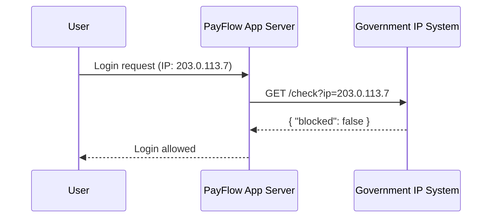

The flow is dead simple:

1. **App Server** receives a request from a user, extracts their source IP.
2. **App Server** calls the **Government IP System**'s API synchronously — something like `GET /check?ip=203.0.113.7`.
3. Government system responds with `{ "blocked": true/false }`.
4. App Server allows or blocks based on that response.

No cache. No local database. No sync job. Every request is a live round-trip to the source of truth.

### Why this is a reasonable starting point, not a strawman

This design has one property that every later iteration will have to work to preserve: **it is always correct.**

There's no staleness window. The moment the government adds an IP to the blocklist, the very next request from that IP gets blocked. No "we'll catch up in 5 minutes." No cache invalidation bugs. No "which version of the list did we check against."

For a compliance system, that's not a throwaway property — it's the whole point of the requirement. So Day 0 isn't dumb because the *logic* is wrong. It's dumb because of what it costs to get that correctness on every single request.

### Follow-up the interviewer might ask

**"Why not just keep doing this if it's always correct?"**
Because correctness here is being purchased with latency and availability we don't control. We've made the government system's performance and uptime *our* performance and uptime — and we didn't get to choose their SLA.

---

Next: I'll break this with a concrete scenario — a slow government API and a traffic spike — and show exactly why Day 0 falls over in production.

Got it / next?

---

## Breaking Day 0

It's a Tuesday morning. PayFlow's marketing team just sent a push notification about a market rally. Login traffic jumps from a steady 200 requests/second to 4,000 requests/second in about ninety seconds.

Here's the part nobody planned for: **the government IP system was never built for this.**

It's a legacy compliance system, shared across dozens of regulated companies, and its own team has told PayFlow, informally, "please don't send us more than ~50 requests/second." At normal traffic PayFlow was already pushing close to that. At 4,000 req/s, PayFlow is now sending 80x the polite limit to a single shared government endpoint.

### What actually happens

The government system doesn't crash cleanly. It does what old systems do under load — it gets **slow**. Response times drift from 200ms to 2 seconds to 8 seconds.

Now walk through what that does to PayFlow:

- Every login request holds open an app server thread/connection for up to 8 seconds, waiting on a single upstream call.
- App servers have finite connection pools and thread pools. Those fill up fast when each request takes 8 seconds instead of 200ms.
- New requests — including ones that have nothing to do with the slow IP check, if this server handles other traffic too — start queuing behind the stuck ones.
- Within a couple of minutes, PayFlow's own login service is unresponsive. Not because *PayFlow's* code is broken, but because a dependency three hops away got slow.

This has a name: **a slow dependency taking down the entire caller**, sometimes called cascading failure or the "sad server" problem. The government system didn't even go fully down — it just got slow, which is often worse, because a hard failure fails fast and a slow failure ties up resources indefinitely.

There's a second, quieter failure mode too: the government system, seeing 80x its expected traffic from one client, might start **rate-limiting or blocking PayFlow's requests outright** — which, ironically, could mean real users get denied service not because their IP is blocked, but because PayFlow got throttled by its own compliance dependency.

### The core problem, stated plainly

Day 0 coupled PayFlow's availability to a system PayFlow doesn't operate, can't scale, and can't get an SLA from. Every request PayFlow serves is now gated by the slowest, least reliable part of the whole stack.

**Follow-up the interviewer might ask:**

*"Couldn't you just add a timeout on the call to the government system?"*
A timeout stops threads from hanging forever, which helps — but it doesn't answer the real question: what do you do when the timeout fires? Allow the user through, or block them? That's not a plumbing fix, that's the fail-open/fail-closed decision from our P0 list, and we still haven't decided it. A timeout without that decision just converts "hung forever" into "wrong answer fast."

---

Next: we'll fix this by pulling data locally instead of calling out on every request — and that's where the real crux of this system begins: how do you keep a fast local copy in sync with a slow, unreliable source of truth, and what do you do the moment they disagree?

Got it / next?

---

## Iteration 1: Stop Calling Out on Every Request

The fix seems obvious once you say it out loud: **don't call the government system per-request — keep a local copy, and check that instead.**

That single change turns an 8-second network call into a local lookup. But "keep a local copy in sync" is doing a lot of hand-waving in that sentence, so let's actually walk through how you'd try to do that — because the naive versions of this all break in specific, instructive ways.

### Attempt 1: Sync on a timer, store in memory

The first idea: every app server, on a background timer, calls the government API once a minute, pulls the full blocklist, and holds it in a local in-memory `Set<String>`.

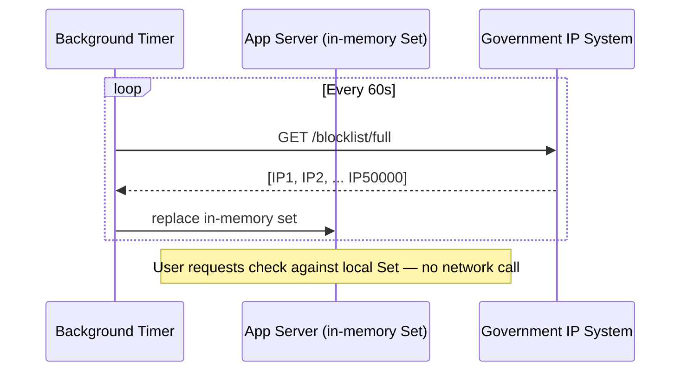

This looks great at first. Request latency drops from seconds to microseconds. The government system now sees one request per minute per server instead of thousands per second.

**Where it breaks:** PayFlow doesn't run one app server. It runs, say, 200 of them, autoscaling up and down through the day. Each one independently polls the government system on its own timer. That's still 200 requests/minute to a system that asked for far less — and worse, every server has to hold the *entire* blocklist in memory, which might be tens of thousands of IPs and growing. When a new server spins up during a traffic spike (the exact moment you least want extra load on the government system), it immediately does a full cold pull before it can serve a single request.

We've reduced load by roughly 300x compared to Day 0, which is real progress — but we've tied the *number of government API calls* to the *number of app servers*, which is exactly the kind of coupling that bites you later when you autoscale to 500 servers instead of 200.

### Attempt 2: Centralize the sync, fan out from there

So: don't let every app server talk to the government system. Introduce one dedicated component — call it the **Sync Service** — whose only job is to poll the government system and write the result somewhere shared. App servers read from that shared store instead of from memory.

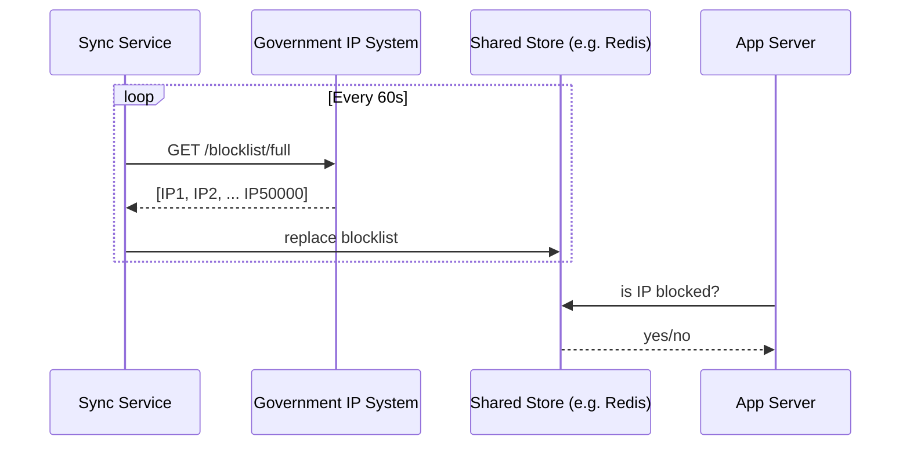

Now exactly **one** client talks to the government system, no matter how many app servers PayFlow runs. That decouples government-system load from PayFlow's own scaling — which is the right shape.

**Where this breaks:** two things, both real.

First, the Sync Service is now a **single point of failure for freshness**. If it crashes or gets stuck, every app server keeps reading a store that silently stops updating. Nobody notices until an IP that should've been blocked yesterday still isn't blocked today.

Second — and this is the sharper problem — what does "replace blocklist" actually mean if the government system's full-list endpoint is *itself* slow or times out mid-pull? If the Sync Service does a naive "delete everything, insert the new list," and the pull fails halfway through, PayFlow now has a **half-empty blocklist** — actively unblocking IPs that were supposed to stay blocked. That's not a performance bug, that's a compliance incident.

### Attempt 3: Versioned swap instead of in-place replace

The fix for that second problem: never mutate the live blocklist in place. Write the new list to a **new location**, and only flip a pointer once the write fully succeeds.

Concretely: the Sync Service writes each new pull to a fresh key — `blocklist:v104` — and only after that write is confirmed complete does it update a single pointer key, `blocklist:current -> v104`. App servers always read through the pointer. Old versions get cleaned up after a short grace period (useful for rollback and audit).

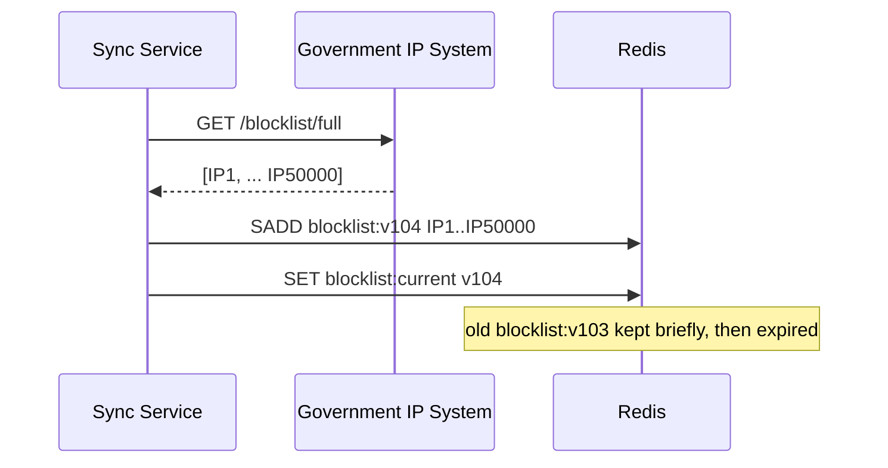

This is the version that actually holds up. A failed or partial pull just means `blocklist:current` never advances — app servers keep serving the last *known-good* version instead of a corrupted half-list. That's a meaningfully different failure mode than Attempt 2, and it's the one we want.

### What we gained, what we gave up

**Gained:** government system load is now constant (one poller) regardless of PayFlow's scale. Request latency is now a local store lookup, not a cross-network call. A bad pull can't corrupt the live list.

**Gave up / new problem introduced:** the blocklist app servers see is now only as fresh as the last successful sync — there's a real staleness window (up to ~60s in this design) between the government adding an IP and PayFlow actually blocking it. We've traded perfect real-time correctness for availability and speed. Whether that trade-off is acceptable is itself a decision we need to make explicitly, not assume — that's next.

**Rejected alternative — read replicas of the government system's own DB:** we could ask the government to let PayFlow replicate their database directly. Rejected because (a) it's not PayFlow's system to replicate, (b) it assumes a level of access/trust a regulator almost certainly won't grant a private company, and (c) it doesn't change the fundamental problem — PayFlow still needs a local, fast-to-query copy either way.

| Approach | Gov API load | Freshness | Failure blast radius |
|---|---|---|---|
| Day 0: call per-request | Scales with user traffic | Perfect | Whole app hangs |
| Attempt 1: per-server polling | Scales with server count | ~60s stale | One server's data only |
| Attempt 2: central sync, in-place write | Constant | ~60s stale | Partial pull corrupts live data |
| Attempt 3: central sync, versioned swap | Constant | ~60s stale | Partial pull is a no-op |

**Follow-up the interviewer might ask:**

*"Why Redis for the shared store instead of a regular database?"*
The access pattern is pure membership lookup — "is this IP in the set" — at very high read QPS with infrequent bulk writes. Redis's `SET`/`SADD`/`SISMEMBER` gives O(1) membership checks in memory, which is exactly the shape of this problem. A relational DB would work correctly too, but you'd be paying disk I/O and query overhead for a check that should be a hash lookup. We'll revisit this once we talk multi-region — a single Redis instance is itself a SPOF we haven't addressed yet.

---

Next: we still haven't answered the sharpest question from our P0 list — what does an app server actually *do* the moment `blocklist:current` stops advancing because the government system is down? Fail open or fail closed? That's the next iteration, and it's a real decision, not a plumbing detail.

Got it / next?

---

## Iteration 2: Fail Open or Fail Closed?

Let's make this concrete before deciding anything.

It's 3 AM. The government system's team is doing unannounced maintenance. PayFlow's Sync Service has been trying to pull the blocklist for six minutes straight and every attempt times out. `blocklist:current` still points at `v104`, last refreshed 6 minutes ago — but the government system itself is now completely unreachable, not just slow.

An app server needs to answer: does the login request from IP `198.51.100.9` get through?

There are exactly two ways to answer that, and they have opposite failure profiles.

### Option A: Fail open

If the Sync Service can't reach the government system (or the local store is unreachable, or the check errors out for any reason), **default to allowing the request through.**

The reasoning: PayFlow is a business. If a compliance dependency going down means every login on the platform stops working, PayFlow has effectively let a third party's outage take down its entire product. That's a massive availability cost for a check that, most of the time, was going to say "allowed" anyway — the vast majority of IPs aren't on any blocklist.

The risk is exactly the mirror image: for however long the government system is down, a genuinely sanctioned IP that got added to the list *during* that outage window could slip through undetected. For a fintech company under regulatory obligation, that's not a hypothetical — that's a reportable compliance gap.

### Option B: Fail closed

If the check can't be completed with confidence, **default to blocking the request.**

This satisfies the regulator's actual ask: no user gets through unless PayFlow can affirmatively prove they're not on the blocklist. It's the conservative, legally defensible posture.

The cost is that PayFlow's uptime is now hostage to a system it doesn't control. If the government system has a bad night, PayFlow — a stock trading platform — stops letting *anyone* log in or trade, including the 99.9%+ of users who were never going to be blocked in the first place. That's a self-inflicted outage on top of someone else's outage.

### Why "it depends" is the actual answer, and why that's fine to say in an interview

Neither option is universally correct — the right choice depends on **how stale is "too stale," and what the regulatory requirement actually says about acceptable risk.** A good interview answer doesn't pick one and defend it as obviously right; it names the trade-off explicitly and proposes a design that narrows the blast radius instead of picking a single global default.

Here's the design that actually holds up: **fail open, but bound the staleness window tightly, and treat prolonged staleness as its own alert-worthy failure — with an explicit maximum-staleness circuit breaker.**

Concretely:

- Each app server tracks the age of the data behind `blocklist:current` — not just "do I have data," but "how old is it."
- Below a threshold (say, 5 minutes stale) — fail open. The list is probably still accurate enough; most blocklist additions aren't so time-critical that a 5-minute lag causes real harm, and this keeps the business running.
- Above that threshold — **flip to fail closed** and page on-call immediately. If the government system has been unreachable for 5+ minutes, that's no longer "normal jitter," that's an incident, and the safe default changes.

This isn't a binary policy — it's a **time-bounded degradation**, and the threshold itself is the actual lever a compliance team would tune, not something an engineer should pick unilaterally.

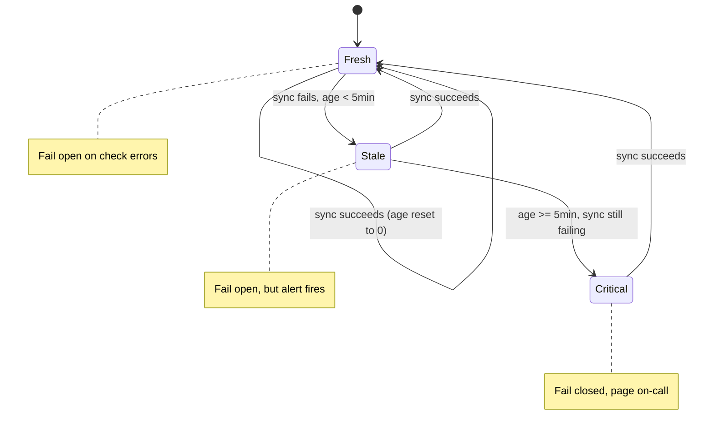

### What we gained, what we gave up

**Gained:** the system degrades gracefully for the common case (brief government-system hiccups) while still converting to the conservative posture the moment staleness becomes genuinely risky — instead of a blanket policy that's wrong in one direction 100% of the time.

**Gave up:** complexity. Every app server now needs to track sync recency, not just blocklist contents, and there's a new operational surface — the threshold itself — that needs tuning and monitoring. It also means PayFlow has to explicitly decide and document that 5-minute-stale data is an acceptable risk to the regulator, which is a business/legal conversation, not just an engineering one.

**Rejected alternative — always fail closed, no threshold:** simplest to reason about and safest on paper, but it means a single government-system outage becomes a PayFlow-wide outage every time, with no proportionality between the severity of the staleness and the severity of the response. Rejected because it optimizes for the regulator's worst case at the cost of availability during ordinary, brief hiccups — which will happen often given how we described this government system.

**Rejected alternative — always fail open, no threshold:** simplest and best for uptime, but has no circuit breaker for the actually dangerous case — a prolonged multi-hour outage where staleness compounds and nobody's paged. Rejected because it silently accepts unbounded compliance risk.

| Policy | Uptime under gov outage | Compliance risk under gov outage | Operational complexity |
|---|---|---|---|
| Always fail open | Unaffected | Unbounded, grows with outage length | Low |
| Always fail closed | PayFlow goes down with them | None | Low |
| Time-bounded degrade (chosen) | Unaffected for brief outages, degrades for long ones | Bounded to the threshold window | Higher — needs staleness tracking + alerting |

**Follow-up the interviewer might ask:**

*"Who decides the 5-minute threshold, and can it change per endpoint?"*
It's a business/compliance decision, not an engineering guess — but engineering should make it configurable, not hardcoded, since different flows may warrant different thresholds. A login might tolerate 5 minutes of staleness; a wire transfer of $1M might have a much tighter tolerance, or might fail closed immediately regardless of staleness. That's a sign this policy should be a parameter per protected action, not one global constant.

*"What about the audit requirement from our P1 list — how does this interact?"*
Every decision — allow or block — should log which `blocklist` version was checked against, the staleness age at decision time, and which policy branch fired (fresh/stale/critical). That gives PayFlow a defensible record: "we blocked/allowed this request because at 03:04:12 our data was 4m40s stale and policy said fail-open." We'll define that log shape explicitly when we get to observability.

---

Next: we've been assuming one Redis instance and one Sync Service. Time to break that assumption — what happens when that Sync Service or its store goes down, or when PayFlow scales into multiple regions and "one government system" has to serve app servers on different continents?

Got it / next?

---

## Iteration 3: One Sync Service Is a Single Point of Failure

Right now the design has exactly one Sync Service process polling the government system, and one Redis instance holding `blocklist:current`. That's a problem independent of the government system's own reliability — it's a new SPOF PayFlow introduced itself.

Concretely: if the single Sync Service process crashes (OOM, bad deploy, host failure), no one notices until the staleness clock starts running — and per Iteration 2, that clock eventually forces a fail-closed state even though the *government system itself* might be perfectly healthy. PayFlow would be self-inflicting an outage over infrastructure it fully controls.

And if the single Redis instance goes down, every app server loses its lookup store entirely — that's worse than stale data, that's *no* data.

### Fixing the Sync Service: active-passive, not active-active

You might reach for running multiple Sync Service instances all polling independently for redundancy. Resist that — it reintroduces the exact problem Attempt 2 solved in Iteration 1: multiple independent clients hammering a government system that explicitly asked for low request volume.

The right shape is **one active poller, one or more standbys, coordinated by a lease.**

- One Sync Service instance holds a **leader lease** (e.g., a Redis key `sync:leader` with a TTL, renewed via `SET sync:leader <instance-id> NX EX 30` on each heartbeat).
- Only the lease holder actually calls the government API and writes new versions.
- Standby instances watch the lease. If it expires without renewal (leader crashed), a standby acquires it and takes over polling — typically within one lease TTL, so a 30-second lease bounds the failover gap.

This gives redundancy without multiplying load on the government system — at any moment exactly one instance is the caller, which is what the government system actually needs.

### Fixing the store: replicate Redis, don't singleton it

Redis itself should run as a small **primary + replica** cluster, not a single node.

- **Who writes:** only the Sync Service leader, and only to the primary.
- **Who reads:** app servers read from replicas (read-heavy, high QPS — this is exactly what replicas are for).
- **Replication:** async is the right call here. This data tolerates a few hundred milliseconds of replica lag fine — it's already tolerating up to 5 minutes of sync staleness per Iteration 2, so sub-second replication lag is noise by comparison. Sync replication would add write latency to protect against a staleness window that's orders of magnitude smaller than one we've already accepted as safe.
- **Consistency model:** this is eventually consistent by design, and that's fine — there's no "read-your-writes" requirement here because there's no single user whose own write needs to be immediately visible to themselves. The blocklist isn't per-user state; it's a shared, slowly-changing global list where a few hundred milliseconds of replica lag is invisible next to the multi-minute staleness we already tolerate from the government system itself.

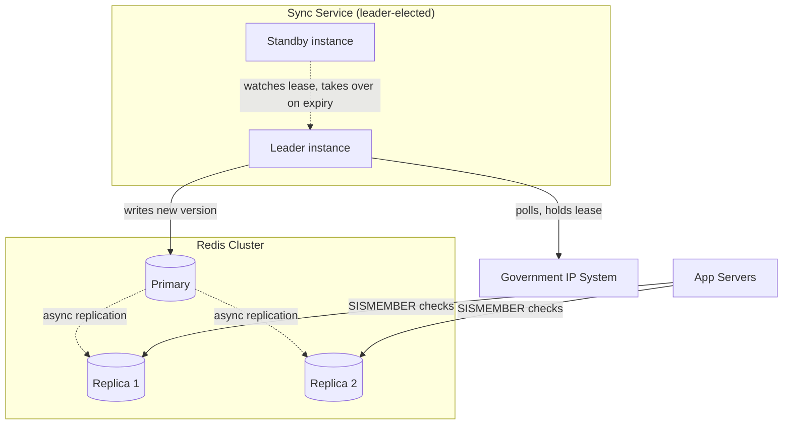

### Do we need sharding here?

Worth naming explicitly, since sharding is on our checklist: **no, not for this store, and here's why.** The entire blocklist — tens of thousands of IPs, maybe low hundreds of thousands in a bad year — comfortably fits in memory on a single Redis node. Sharding solves a dataset-too-big-for-one-node or writes-too-hot-for-one-node problem. We have neither: writes are one bulk update roughly once a minute, and total data size is small. Replication solves our actual problem, which is read throughput and availability, not data volume. Introducing shards here would be solving a problem we don't have at the cost of complexity we don't need.

### What we gained, what we gave up

**Gained:** no single process or single node failure can take down the sync pipeline or the lookup path. Failover is bounded by the lease TTL (~30s) rather than being unbounded or manual.

**Gave up:** operational complexity — leader election is a real distributed-systems primitive with its own edge cases (e.g., a network partition briefly producing two instances that both *believe* they're leader, known as split-brain). Using Redis's own atomic `SET NX EX` for the lease keeps this simple and avoids needing a separate coordination system like ZooKeeper or etcd, but it's still one more moving part to monitor.

**Rejected alternative — multiple independent active pollers:** removes the SPOF but multiplies government API load by however many instances you run, which directly undoes the work from Iteration 1. Rejected because it trades one problem for the exact one we already solved.

**Rejected alternative — a heavier coordination system (etcd/ZooKeeper) for leader election:** more battle-tested for leader election specifically, but it's a whole additional piece of infrastructure to operate for a system that already has Redis doing the job adequately via atomic `SET NX`. Rejected as over-engineering unless PayFlow already runs one of these for other reasons.

| Component | Failure mode addressed | Mechanism |
|---|---|---|
| Sync Service | Single poller crashes | Leader lease, standby takeover |
| Redis store | Single node crashes / read overload | Primary-replica, async replication |
| Government API load | Stays constant | Only the lease holder ever calls it |

**Follow-up the interviewer might ask:**

*"What happens during the failover gap — the up-to-30-seconds where the lease is expired but no new leader has taken over yet?"*
No new sync happens during that window, but reads are completely unaffected — app servers keep reading the last-written data from the Redis replicas, and the staleness clock from Iteration 2 just keeps ticking normally. A 30-second gap in polling is a rounding error against a 5-minute staleness threshold, so this failover is invisible to the fail-open/fail-closed policy in practice.

---

Next: PayFlow is now a global platform with users in the US, EU, and Asia. One Redis cluster in one region means every app server outside that region is paying cross-continent latency on every request. Time to talk multi-region — and this is where we hit the real question: does each region get its own independent copy, and if so, who owns writes?

Got it / next?

---

## Iteration 4: Going Multi-Region

PayFlow now has app servers in `us-east`, `eu-west`, and `ap-south`, each serving local users for latency reasons. Right now, all of them read from one Redis cluster sitting in `us-east`. A user in Singapore logging in means their app server round-trips to Virginia for every single IP check — adding 200ms+ of pure network latency to something that should be a microsecond lookup.

The fix seems obvious: **put a Redis replica in every region.** But let's actually walk through what "replica in every region" means once you ask who's allowed to write.

### Attempt 1: Each region's Sync Service polls independently

Give each region its own Sync Service, each polling the government system directly and writing to its own local Redis primary.

**Where this breaks:** we're right back to Iteration 1's Attempt 1 problem, just at the region level instead of the server level — three independent clients now hitting the government system instead of one. Worse, this design has no way to guarantee `us-east`, `eu-west`, and `ap-south` land on the *same* blocklist version at the *same* time. One region's sync could succeed while another's times out, meaning an IP could be blocked in the US but allowed in Singapore for several minutes. For a single global compliance policy — "this IP is sanctioned, period" — regional disagreement isn't a performance quirk, it's a correctness bug.

### Attempt 2: Single global writer, regional read replicas

Keep exactly **one** Sync Service (leader-elected, per Iteration 3) as the sole writer, in one home region — say `us-east`. It writes to the `us-east` Redis primary. Each other region runs a **read-only Redis replica** that replicates asynchronously from that primary, cross-region.

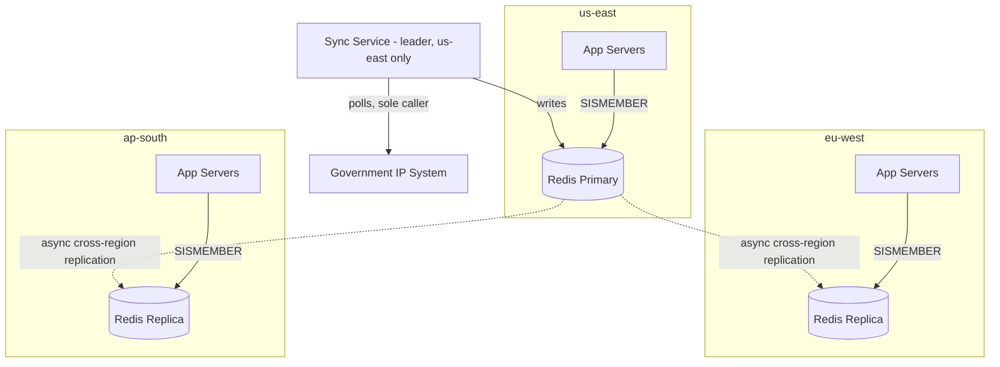

This is the right shape, and here's why the "who owns writes" question has a clean answer for this specific system: **write ownership isn't per-user or per-shard here — it's global and singular, because there's only one source of truth (the government system) and only one correct value for "is this IP blocked."** This is fundamentally different from something like a social feed, where each user's home region naturally owns their own writes. There's no natural per-region partition of "which IPs belong to which region" — an IP from a sanctioned range is sanctioned everywhere, so a single global writer is the correct model, not a compromise.

Because there's exactly one writer, **cross-region conflicts are avoided by construction** — there's no scenario where `eu-west` and `ap-south` both try to write different values for the same IP and need reconciling, because only `us-east` ever writes at all. This sidesteps the entire multi-writer conflict-resolution problem that systems like multi-region user databases have to solve.

**Where this does introduce a real cost:** cross-region async replication lag. A write in `us-east` might take 100-300ms to reach `ap-south`, depending on distance. Per Iteration 3's reasoning, this is still noise against a 5-minute staleness tolerance — but it does mean, worth stating explicitly, that `eu-west` and `ap-south` can briefly disagree with `us-east` about the very newest update, on top of the staleness the sync interval already introduces. This is layered eventual consistency: sync-interval staleness (up to ~60s) plus replication-lag staleness (hundreds of ms) — both bounded, both already inside the tolerance window we established.

### Attempt 3: What if the government system itself is region-specific?

Worth naming even though it doesn't change our design: some regulatory regimes (EU sanctions lists, US OFAC, etc.) are genuinely separate government systems with separate lists, not one global list. If PayFlow operates under multiple regulatory regimes, the Sync Service doesn't poll one government API — it polls several, one per applicable jurisdiction, and merges results into either a single unified blocklist or jurisdiction-tagged entries depending on whether the check needs to know *which* regulation triggered a block (relevant for the audit requirement). This doesn't change the write-ownership model — still one Sync Service, still one writer per data store — it just changes what that Sync Service fetches from. I'll flag this as a variant rather than a full iteration since the architecture doesn't change, only the data source.

### What we gained, what we gave up

**Gained:** every region gets local-latency reads (microseconds instead of hundreds of milliseconds cross-continent). Conflict resolution is trivial — there is none, by construction, because writes are single-sourced.

**Gave up:** `eu-west` and `ap-south` now depend on `us-east` being reachable for *new* data to arrive at all. If `us-east` Redis primary is fully down (not just the Sync Service — the actual store), other regions keep serving their last-replicated data, which is exactly the fail-open/degrade behavior from Iteration 2, just now scoped per-region based on each replica's own staleness clock.

**Rejected alternative — independent regional writers (Attempt 1):** would give each region full autonomy and zero cross-region dependency, but reintroduces multiplied load on the government system and — critically — allows the same IP to have different block statuses in different regions simultaneously, which is a correctness violation for a global sanctions list, not an acceptable trade-off.

**Rejected alternative — synchronous cross-region replication:** would eliminate the replication-lag staleness entirely, but synchronous writes across `us-east → eu-west → ap-south` would mean every blocklist update pays full round-trip latency to the slowest region before completing — turning a once-a-minute background job into a multi-second cross-continent transaction, to protect against a staleness window (hundreds of ms) that's already negligible next to the 5-minute tolerance we set in Iteration 2. Not worth it.

| Approach | Gov API load | Cross-region consistency | Write availability if us-east store dies |
|---|---|---|---|
| Independent regional writers | 3x (one per region) | Can diverge for minutes | Each region unaffected by others |
| Single global writer, async replicas (chosen) | 1x, unchanged | Bounded lag (~ms), converges automatically | Other regions read-only until us-east recovers |
| Single global writer, sync replicas | 1x, unchanged | Always consistent | Writes blocked until all regions reachable |

**Follow-up the interviewer might ask:**

*"What if us-east goes down entirely — not just Redis, the whole region?"*
Reads in `eu-west` and `ap-south` are unaffected in the short term — they keep serving their last-replicated snapshot locally. But no new syncs happen until either `us-east` recovers or we promote a new home region, which means the staleness clock (Iteration 2) starts running globally. This is a good argument for making the Sync Service's home region itself failover-capable — promote a standby Sync Service in another region to become the sole writer, pointed at a promoted Redis primary — but that's a disaster-recovery procedure, not something we'd build for day-to-day operation.

*"Is this comparable to any real system's approach?"*
Yes — this is close to how a lot of "reference data" replication works in practice, similar in spirit to DynamoDB Global Tables' single-region-ownership patterns or Git's single-upstream-many-mirrors model: one authoritative writer, many read-optimized copies, with the hard multi-writer conflict problem avoided entirely rather than solved.

---

We've now covered the crux (staleness + fail-open/closed), redundancy, and multi-region. Next up is a lighter pass: caching at the app-server level (do we even need this on top of Redis?), plus failure-handling details like timeouts/retries/circuit breakers on the government API calls, and then observability — what we log and alert on for the audit requirement from our scoped list.

Got it / next?

---

## Iteration 5: App-Level Caching, and Hardening the Government API Call

Two smaller pieces left before the final recap: whether app servers need a cache in front of Redis, and how the Sync Service should actually call the flaky government API — not just "call it," but with real resilience patterns.

### Do app servers need a local cache on top of Redis?

Worth justifying rather than assuming, per our own rule. Redis reads are already fast — sub-millisecond, same-region. So what would an app-local cache (an in-process map, refreshed periodically) actually buy us?

Two things, and they're both real:

**One, it removes a network hop entirely**, even a fast one. At high QPS — thousands of checks per second per app server — even a 0.5ms Redis round-trip adds up, and it's one more thing that can fail (Redis connection pool exhaustion, a network blip) for a check that, per Iteration 2, is on the hot path of every single request.

**Two, and this is the sharper reason: it gives app servers something to fall back on if Redis itself is unreachable**, distinct from the "government system is unreachable" case we already handled. Redis being down and the government system being down are different failures, and right now we've only designed a response for the second one.

So the design: each app server keeps an in-memory copy of the blocklist, refreshed from its regional Redis replica every 5-10 seconds (not every request — that would just recreate the network hop we're trying to avoid). The staleness-tracking logic from Iteration 2 extends naturally here — "age" now means "seconds since this app server's local copy last successfully refreshed from Redis," and the same fresh/stale/critical policy applies, just measured against a tighter local threshold, since a Redis replica being unreachable is a more immediate signal than the government system being unreachable.

This is **app-level caching**, not a CDN — worth being explicit about the distinction from the checklist. A CDN caches content close to *end users* geographically, and makes sense for content that's either static or cacheable-by-anyone-who-asks (images, public pages). The blocklist isn't being requested by end users at all — it's internal server-to-server lookup data, consumed by PayFlow's own app servers, not browsers. There's no "geographically spread end user" to serve via edge caching here; the geographic spread we already solved with regional Redis replicas in Iteration 4. A CDN would be solving a problem this system doesn't have.

**Invalidation strategy:** this data doesn't really need active invalidation in the traditional cache-busting sense (no one is deleting a specific key on demand). It's a **periodic full refresh** — pull the current set from Redis, replace the local copy — which fits because the whole dataset is small and changes as a batch (one new government pull replaces the whole list), not as scattered individual updates. This is the same pattern as Iteration 1's versioned swap, just one layer up the stack.

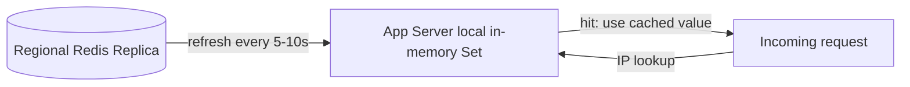

### Hardening the Sync Service's call to the government API

We've talked about *what* happens when the government call fails, but not *how* the call itself should behave — this is the failure-handling checklist item, and it deserves specifics rather than "add retries."

**Timeout:** the Sync Service's HTTP client needs an explicit timeout on the government API call — say 10 seconds, based on that system's known slow-but-not-infinite behavior. Without this, a hung call just recreates Day 0's thread-exhaustion problem, except now it's one background poller hanging instead of every app server.

**Retries with backoff and jitter:** a single timeout shouldn't immediately flip the system to "stale." Retry a few times — say 3 attempts — with **exponential backoff** (1s, 2s, 4s) and **jitter** (a small random offset added to each delay). The jitter matters specifically because PayFlow isn't the only client of this government system — if every company's sync service retries on the exact same fixed schedule after a shared outage, they all hammer the recovering government system in synchronized waves, a pattern sometimes called a "thundering herd." Randomizing the delay spreads that out.

**Circuit breaker:** if the government API fails repeatedly across many sync cycles (not just one), the Sync Service should stop hammering it entirely for a cooldown period — this is the circuit breaker pattern, and it's a genuinely different mechanism from retries, worth distinguishing:

- **Retries** handle a single transient blip within one sync attempt.
- **Circuit breaker** handles sustained failure across many attempts over time — it "opens" after, say, 5 consecutive failed sync cycles, stops calling entirely for a cooldown window (2 minutes), then goes "half-open" and tries one test call before fully resuming.

This protects the government system from a misbehaving or overeager retry loop during a real outage, and it's the mechanism that actually determines when the staleness clock from Iteration 2 starts climbing versus when we're still in normal retry territory.

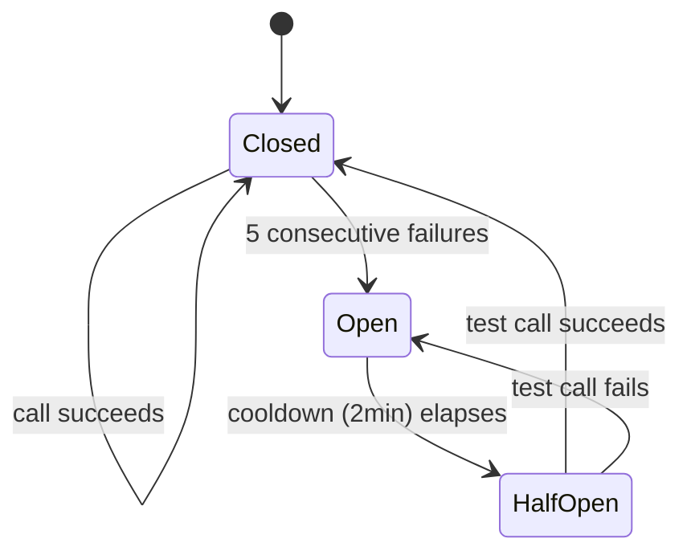

**Idempotency:** worth a one-line check — is repeating the government call safe if a retry fires after the original actually succeeded but the response was lost? Yes, trivially — this is a `GET` (or read-only poll), not a mutation. There's no "did I already submit this" problem here, unlike, say, a payment API call. This one's easy specifically because the Sync Service only ever reads from the government system; it never writes to it.

**Dead-letter handling:** less relevant here than in a typical queue-based system — there's no individual "message" that fails and needs to be set aside, just a poll that either succeeds or doesn't. The closest equivalent is the circuit breaker's open state itself, combined with alerting, which is more actionable for this kind of periodic-pull system than a DLQ would be.

### What we gained, what we gave up

**Gained:** app servers survive brief Redis blips without needing to fall through to a fail-open/closed decision at all. The government API call is now well-behaved under sustained failure instead of retrying forever or hammering during outages.

**Gave up:** a third layer of staleness tracking (government→Redis, Redis→app-local-cache) to reason about and monitor, and more moving parts that need their own metrics.

**Rejected alternative — skip app-local caching, rely on Redis being "fast enough":** simpler, one less staleness layer to reason about — reasonable if QPS is modest. Rejected here on the assumption that PayFlow's request volume is high enough that even sub-millisecond Redis calls at scale, plus Redis's own tail latency under load, add up to a cost worth avoiding, and because it leaves no fallback if Redis itself hiccups.

**Follow-up the interviewer might ask:**

*"With three staleness layers now — sync interval, cross-region replication, app-local cache — how do you avoid this becoming impossible to reason about operationally?"*
Each layer's staleness should be tracked and exposed as its own metric, and the *policy* (Iteration 2's fresh/stale/critical) should key off the **worst** (oldest) of the three at decision time, not each independently — an app server should ask "what's the total age of this data, end to end, from the government system to right now," not just "is my local cache fresh," because a fresh local cache backed by a stale Redis backed by a failed sync is still stale data.

---

Next: observability — what gets logged and alerted on, tying directly back into the P1 audit requirement — and then I'll pull everything together into the full architecture recap, all the end-to-end flows, and the "why not X" cheat sheet.

Got it / next?

---

## Iteration 6: Observability and the Audit Trail

This ties directly back to our P1 requirement: for any block or allow decision, PayFlow needs to be able to prove *why* that decision was made, if a regulator or internal compliance team ever asks.

### What gets logged, and by whom

Every decision point in this system should write a structured audit record. Let's name exactly who writes it and what's in it, rather than saying "the system logs it."

**Who writes:** the app server, at the moment it makes the allow/block decision — it's the last component in the chain and the only one with full context (which user, which IP, which policy branch fired).

**Where it lives:** not Redis — that's built for fast lookups, not long-retention audit records. This calls for a different storage class: an **append-only log store**, something like a Kafka topic feeding into a wide-column store (Cassandra) or a data warehouse, chosen specifically because the access pattern is "write once, rarely read, but must be queryable by IP/time/user when it is read" — high write volume, low read volume, long retention. A relational DB would work but pays unnecessary transactional overhead for data that's never updated after being written, only appended and occasionally scanned.

**Record shape:**

```json
{
  "timestamp": "2026-08-31T03:04:12.331Z",
  "request_ip": "198.51.100.9",
  "user_id": "u_88213",
  "decision": "allow",
  "blocklist_version": "v104",
  "data_age_ms": 280000,
  "policy_branch": "stale",
  "check_layer": "app_local_cache",
  "region": "ap-south"
}
```

**Who reads:** compliance/legal tooling, querying by IP or user_id or time range when investigating a specific incident — this is a cold-path read, not something on the request hot path.

### What gets monitored in real time (distinct from the audit log)

The audit log answers "what happened for this one request, after the fact." Monitoring answers "is the system healthy right now" — different consumers, different urgency, worth keeping separate.

**Metrics** (numeric, dashboarded, alertable):
- Sync Service: time since last successful government API pull, consecutive failure count, circuit breaker state (closed/open/half-open).
- Redis: replication lag per region, primary/replica health.
- App servers: local cache age distribution, decision counts by policy branch (fresh/stale/critical) — a spike in "critical" branch decisions is the signal that fail-closed is actively kicking in.

**Alerting thresholds**, tied directly to the states we already defined:
- Circuit breaker opens → page on-call (Iteration 5).
- Staleness crosses into "critical" (Iteration 2's 5-minute threshold) → page on-call, since this is the moment behavior changes from fail-open to fail-closed.
- Cross-region replication lag exceeds some bound (say 5 seconds) → warn, since this affects how stale non-home-region reads are.

**Tracing:** a single request's path — app server → local cache (or Redis fallback) → decision — is short enough that distributed tracing (e.g., spans across services) has limited value here, since there's rarely more than one or two hops. Where tracing genuinely earns its place is diagnosing latency spikes, correlating "why did this specific request take 40ms instead of 1ms" back to a specific layer (was it a cache miss that fell through to Redis, and was Redis itself slow that moment).

### What we gained, what we gave up

**Gained:** a defensible, queryable record of every decision the P1 requirement actually asked for, plus real-time visibility into exactly the failure states we spent five iterations designing around — meaning the alerts map directly to states we already understand, not a generic "something's wrong" signal.

**Gave up:** another storage system to operate (the audit log store), and a small amount of per-request overhead to emit the log record — though this is async/fire-and-forget from the app server's perspective, so it doesn't sit on the decision's critical path.

**Rejected alternative — log to Redis alongside the blocklist:** would avoid introducing a new storage technology, but Redis is optimized for hot, small, frequently-read data — an ever-growing audit trail of every request ever made is the opposite access pattern, and would eventually compete with the blocklist itself for memory on a store we specifically sized for a small, bounded dataset in Iteration 3.

**Follow-up the interviewer might ask:**

*"Doesn't writing an audit log on every request add latency to the hot path?"*
Only if done synchronously. The app server should emit the record asynchronously — fire it at a local buffer or directly at a Kafka topic without waiting for acknowledgment before responding to the user. Worst case, a burst of log writes gets buffered or briefly delayed; it never blocks the actual allow/block decision, which is the one thing that must stay fast.

---

That covers the full checklist. Next message is the final recap: complete architecture diagram, every end-to-end path spelled out, and the "why not X" cheat sheet.

Got it / next?

---

## Full Architecture Recap

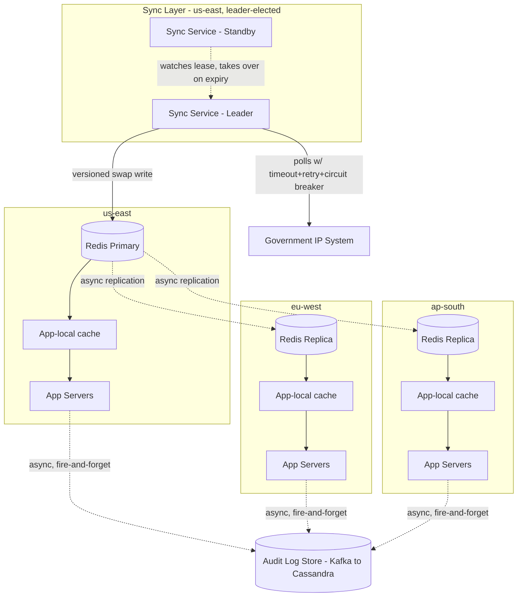

---

## Every End-to-End Path

### 1. Sync path (government system → Redis)

1. **Sync Service (leader)** calls `GET /blocklist/full` on the **Government IP System**, guarded by a 10s timeout, 3 retries with backoff+jitter, and a circuit breaker.
2. On success, **Sync Service** writes the new list to a fresh Redis key: `SADD blocklist:v105 IP1 IP2 ... IPn` against the **us-east Redis Primary**.
3. **Sync Service** flips the pointer: `SET blocklist:current v105`.
4. **Redis Primary** asynchronously replicates the new keys to **eu-west** and **ap-south** replicas.
5. Old versions (`v104` and earlier) expire after a grace period.

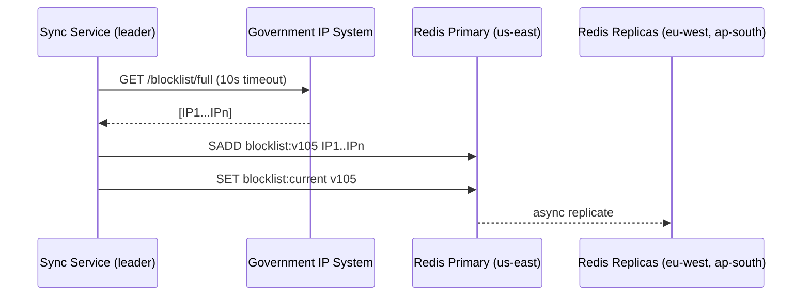

### 2. Local cache refresh path (Redis → app server)

1. Every 5-10s, each **App Server** reads `blocklist:current` and the corresponding set from its **regional Redis replica** (or primary, in us-east).
2. App server replaces its in-memory `Set<String>` and resets its local "age" counter.

### 3. Request decision path (the hot path)

1. **App Server** receives a request, extracts source IP.
2. Checks IP against **local in-memory cache** first.
3. Computes total data age = time since local cache refresh + Redis's own last-known sync age.
4. Applies policy: fresh → decide normally; stale (< 5 min total age) → fail open; critical (≥ 5 min) → fail closed.
5. Returns allow/block to the caller.
6. Asynchronously emits an audit record to the **Audit Log** (Kafka → Cassandra) — never blocks the response.

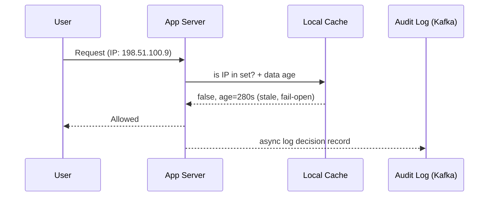

### 4. Failover path (Sync Service leader dies)

1. **Standby Sync Service** detects the leader's lease (`sync:leader`) has expired (no renewal within 30s TTL).
2. Standby acquires the lease via `SET sync:leader <id> NX EX 30`.
3. Standby becomes the new leader and resumes polling the **Government IP System** — no other component changes; reads continue uninterrupted throughout.

---

## The "Why Not X" Arsenal

| Question | One-line answer |
|---|---|
| Why not call the government API on every request? | It's slow and rate-limited — Day 0 showed a traffic spike turns their latency into cascading failure across our whole app tier. |
| Why not let every app server poll the government system independently? | Multiplies load by server count, which is exactly what they asked us not to do; a central Sync Service decouples our scaling from their load. |
| Why not always fail closed on any error? | Ties PayFlow's uptime entirely to a third party's reliability for the common case of brief hiccups, not just real outages. |
| Why not always fail open? | Removes any bound on compliance risk during a prolonged outage — no circuit breaker for the case that actually matters. |
| Why not run multiple active Sync Service pollers for redundancy? | Reintroduces the load-multiplication problem from Day 0's fix; leader election gives redundancy without multiplying calls. |
| Why not let each region run its own independent writer? | Same IP could be blocked in one region and allowed in another simultaneously — a correctness violation for a global sanctions list. |
| Why not sync replication across regions? | Protects against ~hundreds of ms of lag, which is negligible next to the 5-minute staleness tolerance we already accept — not worth the write-latency cost. |
| Why not shard the Redis blocklist store? | Dataset is small (tens of thousands of IPs) and writes are a single bulk update per minute — no volume or write-hotspot problem sharding would solve. |
| Why not use a CDN for the blocklist? | This is internal server-to-server lookup data, not content requested by geographically distributed end users — regional Redis replicas already solve the latency problem a CDN would target. |
| Why not skip the app-local cache and just hit Redis? | Reasonable at modest QPS, but at high volume it's an avoidable network hop with no fallback if Redis itself blips. |

---

Want to go deeper on any single piece — say, the leader-election edge cases, or how the per-action staleness threshold (login vs. wire transfer) would actually get configured — or should I switch into interviewer mode and pressure-test you on the whole design?

---

## The Constraint Just Changed the Whole Game

Everything from Iteration 1 onward assumed we could pull the **entire** blocklist and mirror it locally. If the government only exposes `GET /check?ip=X` — a per-IP lookup, no bulk export — that assumption is gone.

We can no longer build a **complete local copy** of the source of truth. The best we can build is a **cache of IPs we've actually seen and already checked**. That's a fundamentally different pattern: not "replicate everything, ask locally," but "ask on demand, remember the answer."

This is worth naming because it's a very real pattern elsewhere: it's essentially how **DNSBLs (DNS-based blackhole lists)** work — the system email providers use to check if a sender's IP is a known spam source. You don't download the whole spam blocklist; you query per-IP and cache the answer with a TTL. Same shape, same constraint.

---

## Concrete Scenario

Priya connects to PayFlow from a hotel Wi-Fi network in Singapore. This exact IP has never hit PayFlow before — no cache entry exists anywhere. What happens on **this specific request**?

That question — "what do we do on a cold IP, right now, on the hot path" — is the new crux. Let's walk through it like we did before.

### Attempt 1: Synchronous check-through on every cache miss

On a cache miss, the app server calls the government API directly, waits for the answer, then decides.

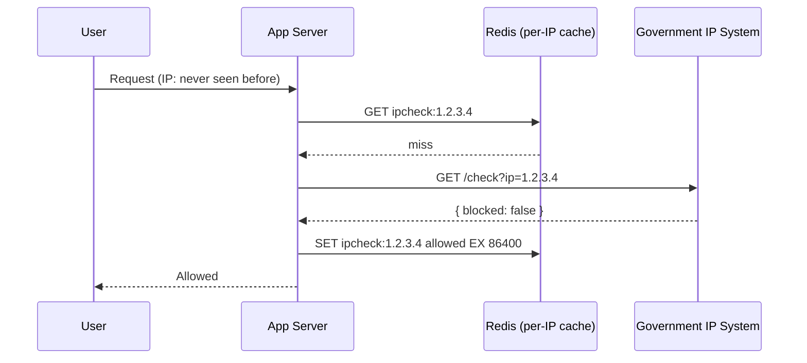

This works for the *repeat* case — Priya's next request hits cache and is fast. But it doesn't fix Day 0's actual problem, it just narrows it.

**Where it breaks:** any traffic pattern with a high rate of genuinely new IPs — a marketing push driving new signups, a viral moment, or simply PayFlow's normal daily churn of mobile users on carrier-grade NAT rotating IPs — puts a *permanent* floor of live, synchronous government calls on the hot path. We've reduced Day 0's load, not eliminated its failure mode. A burst of new-IP traffic still means a burst of blocking government calls.

### Attempt 2: Fail open on miss, verify asynchronously

Don't make the user wait. On a cache miss: allow by default, kick off an async call to the government API in the background, and cache the real answer once it lands.

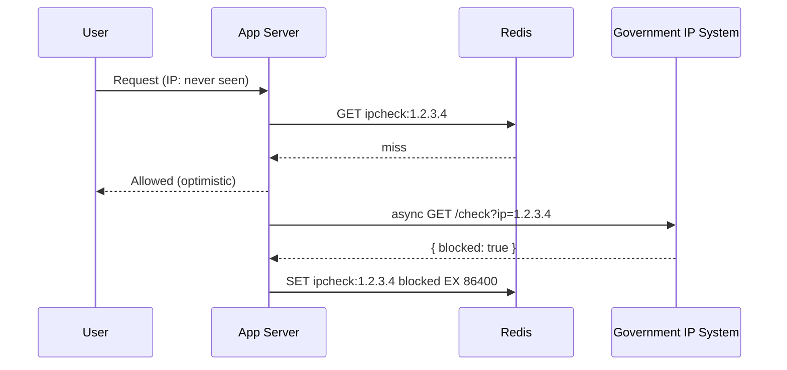

This removes government latency from the user-facing path entirely, which is great for login or browsing.

**Where it breaks:** now there's a window — however many hundred milliseconds the async check takes — where a genuinely sanctioned IP got a real "allowed" decision and possibly *completed an action* before the truth caught up. For a login, that's low-stakes: worst case they get logged out next request. For a wire transfer, that's the exact compliance violation this whole system exists to prevent. **One policy can't be right for every action** — which is actually the same insight we landed on back in Iteration 2 for the government-outage case, just now triggered per-request instead of system-wide.

### Attempt 3: Risk-tiered — the real answer

Split behavior by action sensitivity, using the same fresh/stale/critical framing from Iteration 2, just applied per-lookup instead of per-outage:

- **Low-risk actions** (viewing pages, browsing) → fail open on cache miss, verify async, per Attempt 2.
- **High-risk actions** (trades, withdrawals, account changes) → synchronous check-through on cache miss, per Attempt 1, accepting the latency because correctness matters more here than speed.

This means the *same* IP might get an optimistic "allowed" for a page load and a real synchronous check for a trade a second later — and that's correct, not inconsistent, because the two actions carry different regulatory weight.

---

## Fixing the "Thundering Herd on One New IP" Problem

A corporate VPN egress, a mobile carrier's shared IP, or a bot farm can mean hundreds of concurrent requests from the *same* brand-new IP at once. Without protection, every one of them independently misses cache and calls the government API simultaneously — multiplying load right at the worst moment.

Fix: **request coalescing** (also called single-flight). The first request for a given IP takes a short distributed lock in Redis — `SET ipcheck:lock:1.2.3.4 NX PX 3000` — and becomes the one caller. Every other concurrent request for that same IP either waits briefly on the lock or, for low-risk actions, proceeds with the fail-open default until the real answer lands.

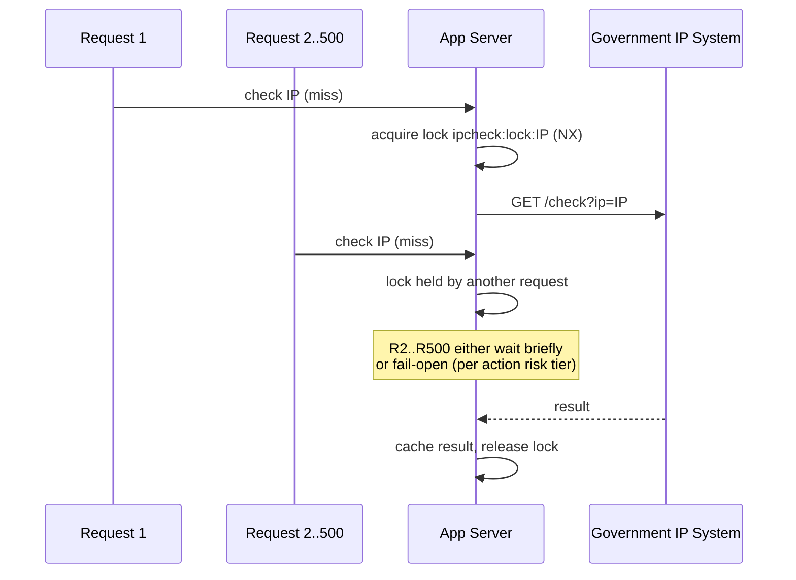

## Rate Limiting the Government Call Itself

Even with caching and coalescing, sustained novel-IP traffic can still exceed the government system's comfort threshold. This calls for an explicit **token bucket rate limiter** in front of outbound government calls — say, capped at 40 req/s, just under their stated ~50 req/s tolerance — with requests beyond the limit falling back to the same fail-open/fail-closed policy from Iteration 2, keyed by risk tier rather than by staleness age this time.

---

## Cache Schema

```json
// key: ipcheck:1.2.3.4
{
  "status": "allowed",
  "checked_at": "2026-08-31T03:04:12Z",
  "source": "gov_api_v1"
}
```

**Who writes:** the App Server (or a small mediating **Lookup Service**, if we want to centralize the rate limiter/coalescing logic rather than duplicating it per app server — the latter is cleaner, similar in spirit to the Sync Service's role before).

**Who reads:** every App Server, on every request, before the local decision.

**TTL asymmetry worth calling out explicitly:**
- `allowed` entries: cache for a while — 24h is reasonable, since re-checking a clean IP constantly wastes calls for no benefit, and the risk of missing a *new* block is bounded by the risk-tier logic above (sync-checked for high-risk actions regardless of cache state, or handled via short TTL for those specific action types).
- `blocked` entries: no correctness risk in caching these long — worst case PayFlow keeps blocking an IP the government already un-blocked, which is the safe direction to be wrong in.

---

## Architecture Recap (Updated)

The nice side effect of this constraint: **we no longer need Iteration 4's single-global-writer-plus-replication model at all.** There's no longer one authoritative full list to mirror consistently across regions — each region is just independently caching answers to questions it happens to ask. Regions naturally converge on the same truth over time because they're all asking the same source, with no coordination needed.

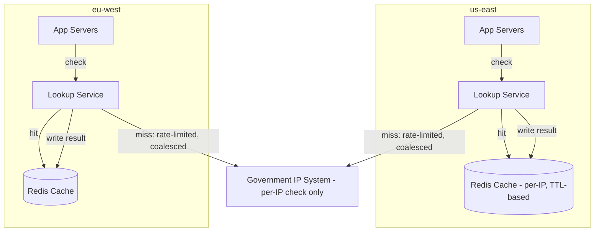

Each region now runs its own independent Lookup Service and cache, each with its own rate limiter against the shared government API — no cross-region replication, no leader election, no single point of write ownership. That entire layer of complexity from Iteration 3-4 goes away because the data model changed from "mirror the truth" to "cache answers to questions we've asked."

---

## What We Gained, What We Gave Up

**Gained:** no more full-list sync complexity, no leader election, no cross-region replication — the architecture actually got simpler in that dimension. Government API load stays bounded via rate limiting + coalescing regardless of traffic shape.

**Gave up:** we've lost the "always know about every blocked IP even before it's requested" property entirely. An IP that's never been seen by PayFlow is, by definition, unverified — there's no way to proactively know it's bad ahead of time anymore, only reactively on first contact. This is a real, permanent trade-off this API constraint forces on us, not an engineering shortcut.

**Rejected alternative — periodically re-check every IP we've ever cached, to simulate a full mirror:** would recreate something list-like, but at the cost of essentially reinventing Day 0's load problem against a system that explicitly can't support bulk operations — and it doesn't even work, since we'd only be re-checking IPs we've *already seen*, never learning about newly-sanctioned IPs we haven't encountered yet. Rejected as effort spent chasing a guarantee this API fundamentally cannot provide.

| Approach | Gov API load shape | Cold-IP behavior | Cross-region complexity |
|---|---|---|---|
| Full mirror (original design) | Constant, low | Instant (already have full list) | High (single writer + replication) |
| Sync check-through on miss | Scales with unique-IP traffic | Correct, but adds gov latency to user | None needed |
| Fail-open + async verify | Scales with unique-IP traffic | Fast, but has an exposure window | None needed |
| Risk-tiered (chosen) | Scales with unique-IP traffic, bounded by rate limiter | Fast for low-risk, correct for high-risk | None needed |

**Follow-up the interviewer might ask:**

*"How do you decide which actions are 'high-risk' enough to warrant synchronous checking?"*
That's a policy decision made per API endpoint, not inferred at runtime — login and page views get tagged low-risk, trade execution and withdrawals get tagged high-risk, likely as a config or annotation on each endpoint. It's the same idea as Iteration 2's per-action staleness threshold, just resolved at design time instead of computed from data age.

*"What if the government API itself can't sustain even 40 req/s of genuinely novel IPs during a traffic spike?"*
Then the rate limiter starts queuing or rejecting excess calls, and those fall back to the fail-open/fail-closed policy by risk tier — exactly Iteration 2's degradation logic, just triggered by "rate limited" instead of "unreachable." The mechanism transfers directly; only the trigger condition changed.

---

This is useful, real feedback — and all three gaps have a common root cause: in our walkthrough, I handed you the math and the conclusions instead of making you produce them. That's exactly backwards for how you need to perform live. Let me fix that here, not by re-explaining the design, but by giving you the *reflexes* you were missing, then making you actually use them.

## Gap 1: Estimation reflexes (cache size, refresh logic)

The failure here usually isn't "I don't know how to do math" — it's not having a **starting template** to reach for under pressure, so you freeze instead of estimating.

The reflex for any cache-sizing question is always the same three numbers:

1. **How many distinct keys will exist?** (unique IPs you'll ever cache)
2. **How big is one entry?** (key + value + overhead)
3. **What's the write/refresh rate?** (how often entries get added or touched)

For *this* system specifically:

- Distinct IPs: bounded by unique users × ~a few IPs each (home, mobile, VPN) over the TTL window (24h). If PayFlow has, say, 10M DAU, that's not 10M distinct IPs — many share IPs, many repeat — but as an interviewer you'd state an assumption out loud: "let's assume ~15M distinct IPs touch us in a 24h window" and move on. **The specific number matters less than showing you have a method and you're willing to commit to an assumption.**
- Entry size: an IP string (~15 bytes) + status + timestamp + Redis's own per-key overhead (Redis overhead is often larger than the data itself — good to know as a fact, roughly 50-100 bytes per key in practice).
- So: 15M keys × ~150 bytes ≈ 2.25 GB. That comfortably fits in a single well-provisioned Redis node or a small cluster.

**Now you try it, live, right here** — don't let me hand it to you: if PayFlow instead has 200M DAU globally, does this still fit on one node, or do you now need to shard? Walk me through it the way you'd say it out loud in the room.

## Gap 2: Multi-DC cache-to-cache sync — the systemic-thinking gap

This is the more serious one, so let's be precise about what you should have caught.

"Cache-to-cache sync" between regions sounds reasonable until you ask **one question**: when `us-east` and `eu-west` both independently do a cache-miss lookup for the *same new IP* at nearly the same time, and both write their own answer locally — what happens when you try to sync those two caches together?

There's no conflict, actually, in this specific case — both should get the same answer from the same government source. But that's not the real problem. The real problem is **you're now paying the cost of the government API call in *every* region independently anyway**, so what is the cache-to-cache sync even buying you? You've built a distributed cache with all the complexity of keeping nodes in sync, for a workload where each region was going to hit the source-of-truth API on a miss regardless. Syncing after the fact doesn't prevent the redundant government calls — it just duplicates the *result* after you already paid the cost.

The actual "obvious" limitation the interviewer wanted you to name: **cache-to-cache sync only helps if a miss in one region can be answered by a hit in another region, which requires the sync to happen *faster than* the next miss arrives** — and cross-region sync has real speed-of-light latency (100-250ms), while a miss can arrive from real user traffic in milliseconds. So sync is almost always too slow to prevent the redundant call it's trying to avoid.

**Try this one too:** given that, what's the actual fix? I'll give you the shape of the answer, you fill in why: should regions share a lookup layer, or stay fully independent? What does "geo-location hints" in the feedback suggest they were nudging you toward?

## Gap 3: Warm-up / cold-boot strategy — the one we never even covered

This is fully on me — I never walked through this in our conversation, so let's fix that gap directly rather than drill you on nothing.

The scenario: a brand-new app server (or a new region) boots up with an **empty local cache**. What happens to the first wave of requests it serves?

The wrong instincts, both named in your feedback, and why they're wrong:

- **"Random generation"** — makes no sense here; there's nothing to randomly generate, the cache holds real government answers, not synthetic data. This suggests the concept of "warm-up" wasn't concretely tied to *this system's actual data* in the answer.
- **"Pre-fetching" without considering scale/source** — the instinct isn't wrong, but you have to say *from where* and *how much*. Pre-fetch from what? The government system doesn't offer a bulk export (that's the whole constraint from this thread) — so you can't pre-fetch the "top N risky IPs" from them even if you wanted to.

The real answer, reasoned out loud: since there's no bulk source to warm up *from* the government system, the only real source of a "known-good starting point" is **another already-warm node or region's cache** — a new app server on boot pulls a snapshot from its regional Lookup Service / Redis cache (which is *already populated* from real traffic), not from the government API at all. That's a one-time bulk copy from a peer, not a redesign of the whole no-bulk-API constraint — it's copying our own derived cache, not their source data.

And during the gap before that snapshot lands: the new node should serve from the **risk-tiered fail-open policy** we already built in Iteration on the per-IP design — same mechanism, new trigger ("I have zero cache" instead of "my cache is stale"). No new concept needed, just recognizing that "empty cache" is a special case of "stale cache" you already have a policy for.

**Your turn on this one, live:** if a new region spins up with a completely empty cache and there's no peer region's cache to copy from yet (say, it's PayFlow's very first region), what do you do for the first hour of traffic there? Answer that one for real — that's the version of this question an interviewer asks when they want to see if you actually internalized the fail-open/fail-closed reasoning or just memorized it for one context.

---

Good question — this is exactly the kind of thing that turns into a live estimation moment in an interview. Let's ground it with real numbers first, then talk fixes.

## The physical cost

Australia to India is roughly 9,000-10,000 km. Speed-of-light-in-fiber round trip for that distance lands around **150-250ms**, before any processing time on either end. That's before TLS. A fresh HTTPS connection adds a TCP handshake (1 round trip) plus a TLS handshake (1-2 round trips) *on top of* that — so a single cold HTTPS call to the government API could easily cost 500-700ms end to end. That's the number that should make you say "this can't sit on the hot path for most requests."

## Fix 1 — the cache already does most of the work

This is worth saying explicitly in an interview, because it's the first line of defense, not a new idea: with the per-IP caching model, **the 250ms distance penalty only applies on a genuine cache miss.** A returning user from a previously-seen IP never pays it. So step one isn't a network trick — it's making sure your cache hit rate is high, which it naturally will be given IPs repeat heavily for logged-in users.

## Fix 2 — persistent connections to the government API (real, concrete win)

Don't open a new HTTPS connection per government API call. Keep a **persistent connection pool** (HTTP keep-alive) from the Australia-side Lookup Service to the India government API. This eliminates the repeated TCP+TLS handshake cost — you pay it once per connection, not once per request. This alone can cut a 600ms cold call down to something closer to the raw ~200ms round trip for subsequent calls on the same connection.

## Fix 3 — put the caller closer to India, not the user

You can't move the government system. But you *can* run the Lookup Service (the component that actually calls it) in a location that's network-topologically closer — say, a small regional presence in Singapore or Mumbai itself, on your cloud provider's backbone, rather than routing raw public internet from Australia. Cloud backbones (AWS/GCP private network) are often meaningfully faster and more stable than public internet routing between two countries. This doesn't fight physics, but it avoids bad routing on top of physics.

## Fix 4 — this is exactly why the risk-tiered fail-open policy from before matters here

For low-risk actions (page views, browsing) on a cold IP: don't make the Australian user eat a 600ms round trip to India synchronously. Fail open, verify async, cache the result — the pattern we already built. The 250ms distance penalty becomes invisible to the user entirely.

For high-risk actions (a trade, a withdrawal): you accept the synchronous latency because correctness matters more than speed there — but now it's a deliberate, justified cost on a small fraction of traffic, not a tax on every request.

**One-line version if an interviewer wants it fast:** *"Cache absorbs repeat traffic, connection pooling removes handshake overhead on the calls that do happen, and risk-tiering means only high-value actions ever pay the full cross-country round trip synchronously — everything else fails open and verifies in the background."*

---

