# IP Allowlist/Blocklist System — Scoping

## Origin Hook

It's 2015 and you're running the login endpoint for a SaaS product. A botnet just started hammering it from 40,000 different IPs, so ops wants to block a huge dynamic list of ranges *right now*, at the edge, before those requests even touch your application servers.

Meanwhile your enterprise customer's security team is emailing you separately: for SOC2 compliance, they want *only* their corporate VPN's IP range allowed to hit their tenant's admin API — everyone else gets a 403, no exceptions.

Both of these are the same underlying problem wearing different hats: "given a request's source IP, should it be let through?" But the two cases pull in opposite directions — one is "block a huge dynamic denylist," the other is "allow a tiny static allowlist" — and both need an answer in microseconds, on every single request, across a fleet of machines that's scattered across the planet.

## Scoped Requirements

**P0/P1 — driving the design:**

1. **Fast membership check on the hot path.** Given a request IP (and optionally a tenant ID), decide allow/deny in well under a millisecond, because this check sits in front of *every* request, not some background job.
2. **CIDR range matching, not just exact-IP.** Rules are ranges (`10.0.0.0/8`, `203.0.113.0/24`), so the check is a longest-prefix-match problem, not a simple set lookup.
3. **Rule updates propagate globally, fast.** An admin adding a block rule during an active attack is useless if it takes 10 minutes to reach every enforcement point worldwide. This is the tension: the read path wants a static, ultra-fast local structure; the write path wants that structure to change *now*, everywhere.
4. **Multi-tenancy.** Different tenants (or services) have independent allow/block lists — Tenant A's allowlist must never leak into Tenant B's request path.

**Cutting these (P2, no architectural impact on the core problem):**

- **Analytics/reporting dashboards** on blocked traffic — this is a downstream consumer of logs, doesn't change how the check or propagation works.
- **Geo-IP / ASN-based auto-rules** — a data-enrichment feature layered on top of the same matching engine, not a new architectural primitive.
- **Admin UI** — CRUD front-end, orthogonal to the distributed systems problem.
- **Rate limiting** — a related but genuinely separate system (it needs counters and time windows; this system needs static-ish set membership). Worth distinguishing explicitly so we don't accidentally design a rate limiter by mistake.

**The crux requirement** is #3 — fast global propagation of rule changes to a data structure that also has to support #1's near-zero-latency local lookup. That tension (fast local reads vs. fast global consistency) is where almost all the interesting distributed-systems discussion will live: how do you push updates to thousands of enforcement nodes worldwide, in what data structure, with what staleness guarantees, and what happens when a node hasn't gotten the memo yet during an active attack.

---

Does this scope look right to you? Once you confirm, I'll start at Day 0.

---

# Day 0: The Dumbest Thing That Could Work

## The Scenario

Let's ground this with a concrete pair: **Tenant "Acme Corp"** wants to allow only their office IP range `203.0.113.0/24` to hit `/admin`. Meanwhile, ops wants to block a known-bad IP `198.51.100.7` globally, across all tenants.

You have one application server. One database. Let's build the simplest thing that answers "should this request through?"

## The Design

A single Postgres table, and the application server checks it on every request.

```sql
CREATE TABLE ip_rules (
    id           BIGSERIAL PRIMARY KEY,
    tenant_id    TEXT,                  -- NULL means "applies globally"
    cidr         CIDR NOT NULL,         -- Postgres native CIDR type
    rule_type    TEXT NOT NULL CHECK (rule_type IN ('ALLOW', 'BLOCK')),
    created_at   TIMESTAMPTZ NOT NULL DEFAULT now()
);

CREATE INDEX idx_ip_rules_tenant ON ip_rules (tenant_id);
```

**Who writes to it:** the Admin (a human, via a script or a basic CRUD endpoint we're not designing) inserts a row directly — `INSERT INTO ip_rules (tenant_id, cidr, rule_type) VALUES ('acme', '203.0.113.0/24', 'ALLOW')`.

**Who reads from it:** the single **API Gateway** process, on every incoming request, before forwarding to the actual application logic.

**Where it lives:** a single Postgres instance. Relational makes sense here — the data is small, highly structured, and we need exact-match query semantics (`<<=` operator for "is this IP contained in this CIDR") that Postgres's native `inet`/`cidr` types support directly. No need for anything fancier yet.

## The Request Flow

1. Request arrives at the **API Gateway** with source IP `203.0.113.55` and tenant `acme`.
2. Gateway runs: `SELECT rule_type FROM ip_rules WHERE (tenant_id = 'acme' OR tenant_id IS NULL) AND cidr >>= '203.0.113.55'::inet ORDER BY tenant_id NULLS LAST LIMIT 1;`
3. Postgres uses the `>>=` "contains" operator to find matching CIDR ranges, returns `ALLOW`.
4. Gateway forwards the request onward. If no row matched, default policy applies (let's say default-allow, unless a tenant explicitly opts into default-deny — that's a per-tenant config flag, easy to bolt on later).

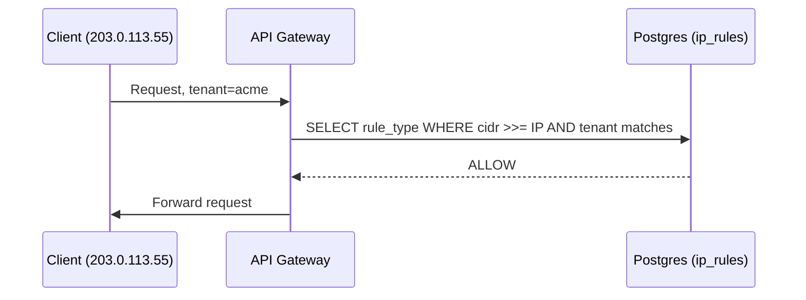

## Why This Is a Reasonable Starting Point

This isn't a strawman. It gives you:

- **Strong consistency by construction** — there's exactly one copy of the rules, so the millisecond after an admin inserts a block rule, every request sees it. No propagation delay, no stale reads, no "did every node get the update" question. That's a real guarantee later iterations will explicitly trade away for speed.
- **Correct CIDR semantics for free** — Postgres's `inet`/`cidr` types and containment operators handle longest-prefix matching correctly out of the box. We're not reinventing that logic yet.
- **Trivial multi-tenancy** — a `WHERE tenant_id = ?` clause is all it takes to isolate tenants at this scale.

The thing we're about to give up on purpose: doing a network round-trip to a database, on the hot path, for every single request, from a single point of failure.

---

**Next up:** what happens when this API Gateway is actually a fleet of 500 machines across 4 regions, handling 200,000 requests/second, and every one of them is hitting the same lonely Postgres instance for a yes/no answer that hasn't changed in the last hour?

---

# Break Day 0

## The Concrete Failure

Let's scale the picture. You now have **500 API Gateway instances** spread across 4 regions, handling **200,000 requests/second** combined. Every single one of those requests still does the same thing: a network round-trip to one Postgres instance sitting in `us-east-1`.

Two named ways this breaks:

**The latency problem — Tenant "Yamamoto Trading" in Tokyo.**
Their gateway node is physically close to their users, but the `ip_rules` table lives in Virginia. Every request now pays a transpacific round-trip of roughly 150-200ms just to ask "is this IP allowed?" — before the actual request logic even starts. The security check has become the slowest part of the entire request.

**The load problem — the botnet attack itself.**
Say the same botnet from our origin story ramps up 10x during an incident, pushing traffic to 2,000,000 req/s. Postgres realistically tops out somewhere in the low thousands of concurrent connections before things degrade badly. Every gateway node is now fighting for a DB connection just to answer a yes/no question — the exact moment you need this system to be *fastest* is the moment it falls over hardest.

There's a third, quieter problem: **Postgres is a single point of failure.** If that instance has a network blip, every gateway node either hangs waiting for a query to time out, or has to decide: fail-open (let traffic through, defeating the whole point) or fail-closed (block everyone, including legitimate traffic — a self-inflicted outage).

None of this is about correctness. Day 0's answer was always *correct*. It's about the fact that a network hop to a shared database, done 200,000 times a second, doesn't survive contact with real scale.

---

# Evolve: Local In-Memory Cache Per Gateway Node

## The Idea

If the round-trip is the problem, stop doing the round-trip on the hot path. Each gateway node keeps its own **local, in-memory copy** of the rules, and answers allow/deny checks entirely from memory — no network call, no dependency on Postgres being reachable.

A background process on each node **refreshes** that local copy periodically by polling Postgres. The request-handling path never talks to the database directly again.

## What Gets Cached, and Where

**Local cache shape**, living in the memory of each gateway process:

```
LocalRuleCache {
    global_rules:  SortedArray<CIDRRule>          // rule_type applies to all tenants
    tenant_rules:  Map<tenant_id, SortedArray<CIDRRule>>
    last_synced_at: Timestamp
}

CIDRRule {
    network_start: uint32   // IPv4 as integer, e.g. 203.0.113.0 -> 3405803776
    network_end:   uint32   // last address in the range
    rule_type:     "ALLOW" | "BLOCK"
}
```

Storing each CIDR as a `[start, end]` integer pair, sorted by `network_start`, means a lookup is a **binary search** over the array — find the last range whose `network_start <= request_ip`, then check if `request_ip <= network_end`. That's O(log n) in memory, no trie needed yet at this scale.

**Who writes to it:** a background **Refresh Worker** goroutine/thread inside each gateway process, running on a timer (say every 5 seconds).

**Who reads from it:** the request-handling hot path, on every incoming request — this is now a pure in-memory operation.

**Where the source of truth still lives:** Postgres, unchanged from Day 0. We're adding a derived copy, not replacing the source of truth.

One schema change to support efficient polling — Day 0's table didn't need to answer "what changed recently," this one does:

```sql
ALTER TABLE ip_rules ADD COLUMN updated_at TIMESTAMPTZ NOT NULL DEFAULT now();
CREATE INDEX idx_ip_rules_updated_at ON ip_rules (updated_at);
```

## The Two Flows Now

**Refresh flow** (new — runs independently of any request):

1. Refresh Worker on Gateway Node #47 wakes up every 5 seconds.
2. It runs `SELECT tenant_id, cidr, rule_type, updated_at FROM ip_rules WHERE updated_at > $last_synced_at`.
3. Postgres returns any rows changed since the last poll.
4. The worker merges these into a **new** `LocalRuleCache` object (build fresh, then atomically swap the pointer — never mutate the live structure a request might be reading mid-lookup) and updates `last_synced_at`.

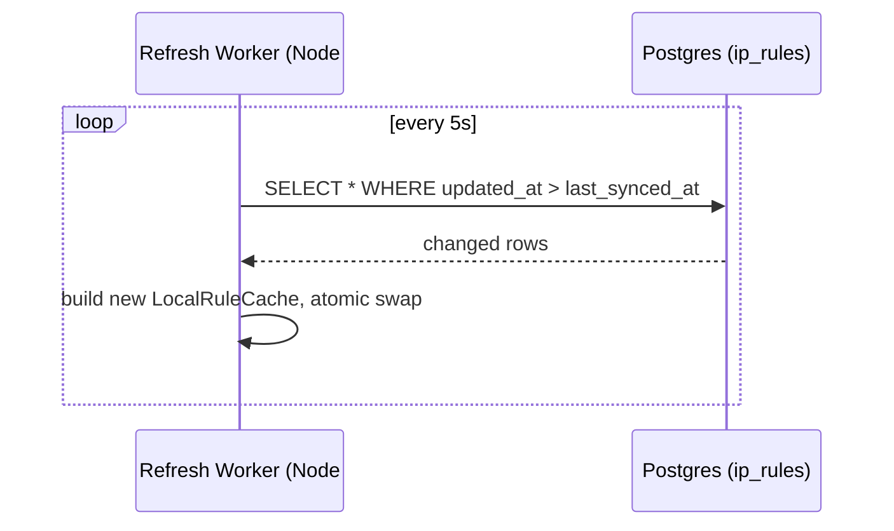

**Request flow** (changed — no more DB hop):

1. Request arrives at Gateway Node #47 with IP `203.0.113.55`, tenant `acme`.
2. Gateway does a local binary search over `tenant_rules["acme"]` and `global_rules`.
3. Returns `ALLOW` or `BLOCK` in microseconds, entirely in-process.

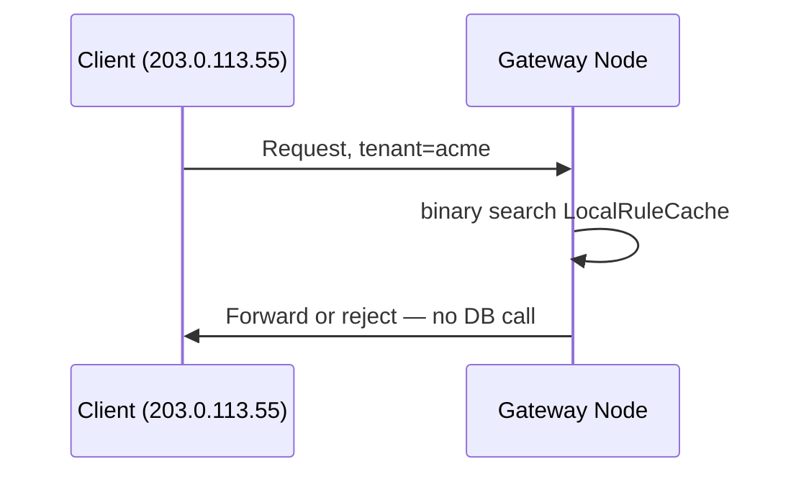

The request path no longer touches Postgres at all. That single change fixes both the Tokyo latency problem and the connection-exhaustion problem, since 500 nodes doing a DB query every 5 seconds is a trivial load compared to 500 nodes doing one per request.

## Trade-off

**What we gained:** sub-microsecond local lookups, and the hot path now has zero dependency on Postgres being reachable in real time. A Postgres blip no longer takes down request handling.

**What we gave up:** every rule change now takes up to ~5 seconds (the poll interval) to reach any given node, and different nodes can disagree with each other for that window. During an active attack, "block this IP" taking 5 seconds to land everywhere is a real gap an attacker's automated traffic will happily fly through in the meantime.

**What we considered and rejected:** keeping the direct-DB-query approach but adding read replicas near each region (so Tokyo reads from a Tokyo replica). Rejected because it only fixes the latency half of the problem — you'd still be doing a network round-trip and a real query per request, so under attack-level load you're still saturating something, just a smaller something. It doesn't remove the per-request DB dependency at all.

## Quick Caching Justification (per the NFR checklist)

Since this is technically our first "cache," worth being explicit: this is an **app-level, in-process cache**, not Redis or a CDN. A CDN doesn't apply here — this isn't publicly cacheable static content, it's a per-tenant security decision evaluated fresh on every request; there's nothing to cache "in front of" the origin for arbitrary clients. The invalidation strategy (periodic poll) fits because the data is low-cardinality and changes infrequently under normal operation — the mismatch only becomes a real problem under exactly one condition: an active attack, where seconds matter. That's not a coincidence — it's exactly the gap our next iteration has to close.

---

## Likely Interviewer Follow-ups

**"Why not just increase the poll frequency to 1 second, or even 100ms?"**
You can, and it helps, but it doesn't change the *shape* of the problem — you're still bounded by however small you can make an interval before 500+ nodes hammering Postgres with polling queries every 100ms starts to look like the same load problem you just solved, just self-inflicted this time. You want push, not faster pull.

**"What happens if a gateway node's refresh worker crashes silently — does it serve stale rules forever?"**
Yes, that's a real gap in this iteration — worth pairing the refresh loop with a health check that pages if `last_synced_at` grows too old, and probably a max-staleness circuit breaker that fails a node out of rotation if its cache hasn't refreshed in, say, 60 seconds. We're building toward a version where this becomes less likely by construction.

---

**Next up:** the crux of this whole system — how do we get a rule change from "admin clicks block" to "every one of 500 nodes worldwide enforces it" in well under a second, not 5+? We'll walk through a few naive attempts at this before landing on the real answer.

---

# Evolve: The Crux — Sub-Second Global Propagation

## The Scenario That Makes This Urgent

It's 3:14 AM. The botnet from our origin story just pivoted its attack to a fresh IP range, `198.51.100.0/24`, after the old one got blocked.

The on-call engineer adds a block rule for the new range. With our current 5-second poll interval, that's fine on average — but "on average" isn't the right frame during an attack.

Some nodes just finished their poll cycle a moment ago. They won't check again for nearly 5 seconds. In that window, `198.51.100.0/24` is hammering every one of those nodes, completely unblocked, and the attacker's tooling will absolutely notice and lean into whichever nodes are slowest to catch up.

We need the *median* propagation time to be near-instant, and the *tail* to still be bounded in low seconds, not "eventually, on the next poll."

## Naive Attempt #1: Poll Faster

The obvious first move: drop the poll interval from 5 seconds to 200ms.

This looks reasonable — it's a one-line config change, no new infrastructure, and it directly shrinks the staleness window.

**Where it breaks:** we already did this math conceptually last iteration, but let's make it concrete. At 200ms intervals, 500 gateway nodes each fire a `SELECT ... WHERE updated_at > ?` against Postgres **2,500 times per second**, forever, even when nothing has changed in hours.

That's not free load — it's *wasted* load, since 99.9% of those polls return zero rows. You've turned a database that should be handling occasional writes into one constantly fielding read traffic proportional to your fleet size, not your actual rule-change rate. Push a few more regions, add a few hundred more nodes, and you've re-created the exact connection-pressure problem from Day 0's breakage — just with extra steps.

## Naive Attempt #2: Admin Fans Out Directly to Every Node

Next idea: skip the middleman. When an admin adds a rule, have the admin service directly call an HTTP endpoint (`POST /internal/rules/push`) on every one of the 500 gateway nodes, telling each one the new rule immediately.

This looks appealing because it's genuinely instant — no polling delay at all, the update reaches every node in one hop.

**Where it breaks, concretely:** the admin service now needs to know the live IP address of all 500 gateway nodes, across 4 regions, and that list changes constantly as autoscaling adds and removes nodes. Say Node #312 is mid-restart when the fan-out fires — that call fails, silently, and #312 now has a stale view of the world with no one aware of it and no retry mechanism.

Now multiply this by every admin action. If two rule changes land 50ms apart, you could have two fan-out storms racing each other with no ordering guarantee — Node A might apply them in one order and Node B in the reverse order. You've traded a bounded staleness window for an *unbounded* one on failure, with no way to even detect it happened. This also means every gateway node has to run an HTTP server just to receive pushes, purely for this one purpose — a second protocol bolted onto a system that already has a database.

## Naive Attempt #3: Gateway Nodes Long-Poll a Central Service

Third try: instead of the admin pushing to gateways, gateways hold open a long-poll HTTP request to a central "Rules Service," which responds the instant a new rule shows up.

This fixes the "who knows everyone's address" problem from Attempt #2 — now it's gateways initiating connections, so autoscaling is a non-issue. And it's much faster than polling, since the response comes the moment something changes rather than on a fixed timer.

**Where it breaks:** the Rules Service now has to hold 500+ open connections simultaneously, and — critically — has to fan that single rule-change event out to all 500 of them at the same instant. That's back to being one process with a hard fan-out responsibility, just relocated. It's also a *single point of failure* for propagation: if that one Rules Service instance dies mid-fan-out, some nodes got the update and some didn't, and there's no record of who's where. You'd need to run several Rules Service replicas for availability — but now those replicas need to agree with each other on what's been sent to whom, which is the exact "who has the latest state" problem we're trying to solve, just moved up one layer.

## The Real Answer: A Pub/Sub Log, Not a Direct Push

The pattern that actually works here is a **message broker** — concretely, **Kafka** — sitting between the write path and every gateway node, using a topic as an ordered, durable, replayable log of every rule change.

Here's the mental model: instead of the admin *knowing* about 500 gateway nodes and trying to reach each one (Attempt #2's mistake), or gateways *depending on one broker instance* holding perfect fan-out state in memory (Attempt #3's mistake), every gateway node independently **subscribes** to a topic and pulls events at its own pace, with the broker handling durability and ordering.

Think of it like a **radio broadcast** instead of a phone tree. In a phone tree (Attempt #2), the caller has to know every number and dial them one by one, and one missed call breaks the chain. A radio broadcast just goes out — anyone tuned in receives it, new listeners can tune in whenever, and the station doesn't need to know or care how many receivers exist. Kafka is that broadcast tower, except it also *remembers* everything it's ever broadcast, so a receiver that was briefly out of range can catch up on exactly what it missed.

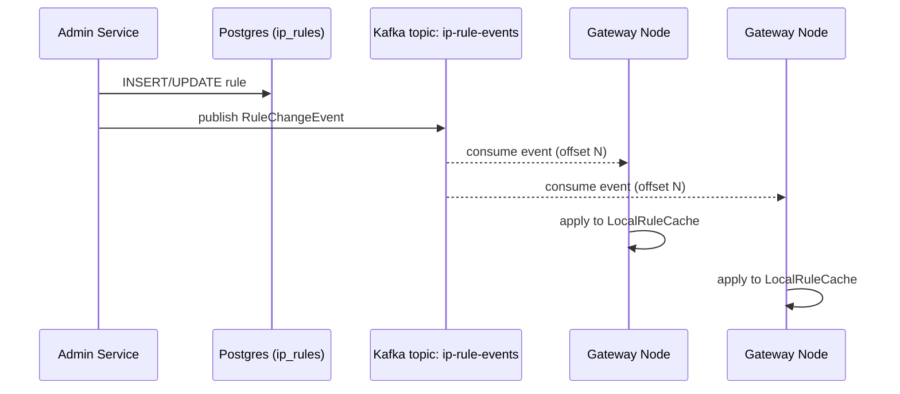

This directly avoids the three failure modes we just walked through:

- **No wasted polling load** (fixes Attempt #1) — nodes only do work when an event actually arrives, not on a timer regardless of activity.
- **No need to track live node addresses** (fixes Attempt #2) — nodes pull from a topic; the publisher never needs to know who's listening or how many there are.
- **No single in-memory fan-out bottleneck** (fixes Attempt #3) — Kafka partitions and replicates the topic itself, and a slow or restarting consumer simply resumes from its last committed offset instead of missing anything.

## What Gained, What Was Given Up

**What we gained:** propagation drops from "up to 5 seconds" to "milliseconds," bounded by Kafka's own publish-to-consume latency, and it holds up under node restarts and network blips because the log is durable and replayable — a node that was offline for 30 seconds just resumes consuming from where it left off.

**What we gave up / new problem introduced:** we now have a new piece of infrastructure (Kafka) that itself needs to be highly available, and gateway nodes have a new failure mode to handle explicitly — a consumer lagging behind its partition. We also need to decide what a node does *while* it's still catching up after a restart (serve from a possibly-stale snapshot? refuse traffic? — worth flagging now, real answer next iteration).

**What we considered and rejected:** a gossip protocol between gateway nodes themselves (each node tells a few peers, who tell a few more, à la Cassandra's gossip). Rejected for this system because gossip is built for *eventual* convergence across a large, dynamic peer set where no single source of truth is needed — but we already have a clear source of truth (Postgres) and a moderate, well-known fan-out target (a few hundred to low thousands of nodes), so a pub/sub log gets us stronger ordering and faster convergence with less protocol complexity than gossip would require.

---

## Likely Interviewer Follow-ups

**"What if Kafka itself goes down — do all gateway nodes fail closed or open?"**
Neither immediately — this is exactly why the local `LocalRuleCache` from the last iteration still exists underneath. Kafka being down means no *new* rules propagate, but every node keeps serving from its last-known-good in-memory snapshot. It degrades to "stale but functioning," not "down." We'll want a staleness alarm here too.

**"Why Kafka specifically, and not something like Redis Pub/Sub?"**
Redis Pub/Sub is fire-and-forget — a node that's disconnected for even a moment misses messages permanently, with no replay. Kafka's log is durable and offset-based, so a node reconnecting after a restart or network blip can resume exactly where it left off instead of silently drifting out of sync forever.

---

**Next up (NFR deep-dive, split out since this iteration is already dense):** what a gateway node does in that "still catching up after restart" window, plus the sharding and multi-region questions this raises — does every region run its own Kafka cluster, or one global one, and what does that mean for a rule added in `us-east-1` reaching a node in Tokyo?

---

# NFR Deep Dive: Node Bootstrap & Multi-Region Propagation

## Sub-problem 1: What Does a Fresh Node Do Before It's Caught Up?

**The scenario:** Gateway Node #501 just spun up during an autoscaling event, mid-attack, no less. It has an empty `LocalRuleCache`. It subscribes to the Kafka topic — but the topic only gives it *new* events from here forward, not the full history of every rule ever created. If we did nothing else, Node #501 would start serving traffic with zero rules loaded, meaning the `198.51.100.0/24` block from ten minutes ago simply doesn't exist as far as this node is concerned.

**The fix — snapshot bootstrap, then tail the log.** This is the same pattern as any event-sourced system's "compact the log into a snapshot" approach:

1. On startup, before subscribing to Kafka at all, Node #501 calls a lightweight internal endpoint (or reads directly, doesn't matter which) to pull a **full snapshot**: `SELECT tenant_id, cidr, rule_type FROM ip_rules` — the complete current state, not a delta.
2. It builds its `LocalRuleCache` from that snapshot and records the Kafka offset that snapshot corresponds to (Postgres can stamp this, or the node can just note "current time" and accept a few hundred ms of possible overlap — cheap insurance, not a correctness requirement).
3. Only *then* does it subscribe to the Kafka topic, starting from that offset, and start applying incremental events on top of the snapshot.
4. Only *then* does it mark itself healthy and start accepting real traffic — a **readiness check**, not a liveness check, so the load balancer doesn't send requests to a node that's still bootstrapping.

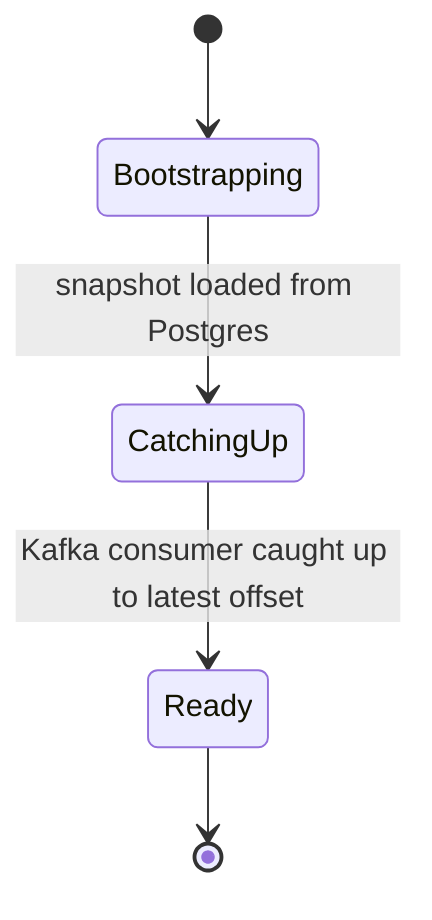

This state machine matters because it's the concrete answer to "fail open or fail closed while catching up" — the node does neither, it just isn't in rotation yet. That's a load balancer / health check decision, not a security-logic decision, which keeps the two concerns cleanly separated.

## Sub-problem 2: One Global Kafka Cluster, or One Per Region?

This is the real multi-region question, and it's about **write ownership**, not just "where do the servers sit."

**Candidate: one global Kafka cluster (say, in `us-east-1`), all regions consume from it.**
This makes the *ordering* story trivial — there's exactly one log, one sequence of events, everyone eventually sees the same order. The cost is that a Tokyo gateway node consuming from a `us-east-1` broker is back to paying a transpacific hop, just for the *propagation* path now instead of the *lookup* path. That's a much smaller problem than Day 0's — it's async background consumption, not blocking a live request — but it does mean Tokyo's staleness window is a bit longer than `us-east-1`'s, purely due to physics.

**Candidate: one Kafka cluster per region, with cross-region replication (MirrorMaker or similar).**
This gets every region a local broker to consume from, cutting the propagation hop close to zero locally. The cost is now you're maintaining cross-region replication *between brokers*, and you've introduced a subtler ordering question: if `us-east-1` and `ap-northeast-1` both accept local rule writes independently, whose write wins when they conflict?

**The actual answer for this system: single global write path, per-region local read replicas of the log.** Here's why that resolves the tension instead of just picking a side.

Rule *writes* are rare — an admin action, maybe a few per minute even during an incident. Rule *reads* (consumption by gateway nodes) are what's frequent, since every node is tailing constantly. So we don't need multi-region *write* capability at all — we need multi-region *read* capability for a write path that's already low-volume.

Concretely: all writes go to a single Kafka cluster (say `us-east-1`), and each other region runs a **local mirror** of that topic (Kafka's MirrorMaker 2, or an equivalent), so gateway nodes in Tokyo consume from a broker sitting in Tokyo, not one 150ms away. But there is exactly one writer, ever — the Admin Service always publishes to the `us-east-1` cluster, full stop. This is a **single-writer, per-shard-replicated-read** model, and it sidesteps conflict resolution entirely by construction, because there's never a scenario where two regions accept independent writes for the same key.

This is the same trade-off DynamoDB Global Tables' "last writer wins" mode is trying to avoid needing — except we don't even need last-writer-wins semantics, because we never allowed concurrent writers in the first place.

| Approach | Write latency | Propagation latency (remote region) | Conflict handling |
|---|---|---|---|
| Single global cluster, remote consumers | Low (one write, close to writer) | Higher for far regions (network hop on every event) | None needed — single writer |
| Per-region cluster + replication, multi-writer | Low locally, everywhere | Low everywhere | Needed — real conflict resolution required |
| **Single-writer + per-region mirrored reads (chosen)** | Low (one write, close to writer) | Low — mirrored topic is local to each region | None needed — single writer, by construction |

## Consistency Model, Stated Explicitly

What falls out of this is **eventual consistency with a bounded, small staleness window** — not "read-your-writes," and that's fine here. The concrete user-facing scenario where this matters: the on-call engineer who just blocked `198.51.100.0/24` from the Admin Service in `us-east-1` cannot assume the Tokyo node has applied it the instant the API call returns 200. The window is milliseconds-to-low-seconds via the mirrored log, not the old 5-second poll — but it's not zero, and nothing in this design should imply otherwise.

## What We Gained / Gave Up

**Gained:** no cross-region conflict resolution logic needed anywhere, ever, because writes are structurally single-sourced. Also gained a natural place to reason about tenant data sovereignty later, if a specific tenant ever needs their rules to physically never leave a region — that becomes "which cluster do we publish to for this tenant," a routing decision, not an architectural rewrite.

**Given up:** every write, even one made by an EU-based admin for an EU tenant, has to reach `us-east-1` first before it can propagate anywhere. For a system where writes are rare and not latency-sensitive to the *admin*, this is a fine trade. It would *not* be fine if this were, say, a high-frequency per-request write path — worth flagging explicitly so it's clear this decision is riding on "writes are rare," not a universal truth.

**Considered and rejected:** sharding the rule set itself by tenant across multiple independent Kafka clusters (Tenant A's rules always written in `us-east-1`, Tenant B's always in `eu-west-1`, based on tenant home region). Rejected as unnecessary complexity for now — global rules (the botnet IP block) apply to *everyone* regardless of tenant, so they'd need to be broadcast across shards anyway, and the actual write volume here never approaches a level where a single cluster becomes the bottleneck. This is a "revisit if we ever see it become true" cut, not a permanent no.

---

## Likely Interviewer Follow-ups

**"What if the `us-east-1` Kafka cluster is unreachable — can admins still make rule changes at all?"**
No new rules can be *published* during that outage, correctly — this is the one deliberate single point of failure we accepted, in exchange for never needing conflict resolution. Existing rules keep enforcing fine everywhere, since every region already has them locally mirrored. Worth pairing this with high replication factor and multi-AZ deployment for that one cluster, since it's now the one component whose downtime has a real (if bounded) blast radius.

**"How would this change if writes suddenly became frequent — say, a rule-per-request rate limiter feature got bolted on?"**
That's exactly the point where you'd revisit the "reject sharding" call above — at that volume, a single-writer bottleneck starts to matter, and you'd look at per-tenant or per-region write ownership instead. It's a good sign this design names its own expiration condition rather than pretending it's the right answer forever.

---

**Next up:** sharding and the shard-key question for the local `LocalRuleCache` structure itself — right now we're doing a flat binary search per lookup, which is fine at hundreds of rules, but what happens when a tenant has 50,000 individual IP rules, and does the *data structure* (not the distributed system) need to change?

---

# Evolve: When a Tenant Has 50,000 Rules

## The Scenario

**Tenant "Fortune500 Corp"** runs a huge enterprise deployment. Their security team has been diligently adding rules for three years — every branch office subnet, every partner VPN range, every acquired company's old IP block that nobody bothered to clean up. They're now sitting at **50,000 individual CIDR rules**, all tenant-scoped.

Meanwhile, a request comes in for this tenant every few milliseconds across the fleet. Our current `LocalRuleCache` does a binary search over a flat sorted array per tenant — that's still only `log2(50,000) ≈ 16` comparisons, which sounds fine in isolation.

**Where it actually breaks:** it's not the lookup that's the problem yet — it's the **update** path. Recall from two iterations ago: every time *any* rule changes for this tenant, the Refresh/Kafka-consumer path builds "a new `LocalRuleCache` object... then atomically swap the pointer." At 50,000 rules, rebuilding and re-sorting that entire array on every single incremental change — even a single-rule tweak — means copying and re-sorting 50,000 entries, every time, on every one of 500+ nodes, every time this one tenant's security team adds a rule. If they're actively cleaning up their rule set during a migration (say, 200 changes in an hour), that's 200 full array rebuilds × 500 nodes, just for one tenant.

There's a second, subtler issue: CIDR ranges can **overlap** in ways a flat sorted-by-start array doesn't handle cleanly. Suppose Fortune500 has a broad `BLOCK 10.0.0.0/8` (block their whole legacy internal range) but also `ALLOW 10.5.3.0/24` (an exception for one trusted subnet inside it). A simple "find the last range whose start ≤ IP" binary search doesn't correctly express "more specific range wins" — it just finds *a* match, not *the most specific* match.

## Naive Attempt: Just Rebuild the Whole Array, But Less Often

The obvious first patch: batch incremental updates and only rebuild once every second instead of on every single Kafka event.

**Why it looked reasonable:** it directly cuts the number of full rebuilds by however many events land in that window.

**Where it breaks:** you've just reintroduced the exact staleness-window problem we spent two iterations eliminating. Batching updates to reduce rebuild cost trades propagation speed for efficiency — during Fortune500's migration, fine; during an active attack needing an urgent block on *any* tenant, not fine, because you can't selectively fast-path "this update is urgent" without knowing that in advance. This also does nothing for the overlap/specificity problem — it's a band-aid on cost, not a fix for correctness.

## The Real Fix: A Trie, Not a Sorted Array

The right structure for "longest prefix match with cheap incremental updates" is a **binary trie over IP bits** (this is literally the same data structure real routers use for IP routing table lookups — it's not a coincidence, it's the same problem).

**The analogy:** think of it like a decision tree of yes/no forks, one per bit of the IP address. Walking `203.0.113.55` through the trie is like a game of twenty questions — "is the first bit 1?", "is the second bit 1?" — where each answer takes you one level deeper. A rule for `10.0.0.0/8` doesn't live at a leaf, it lives at whatever *internal node* corresponds to "the first 8 bits are `00001010`" — anything below that node in the tree inherits it, unless a more specific rule overrides it further down.

This directly solves both problems:

- **Overlap/specificity is inherent to the structure**, not something you have to compute separately. Walking the trie for `10.5.3.9` naturally passes through the `10.0.0.0/8` node first (BLOCK), then continues deeper to the `10.5.3.0/24` node (ALLOW) if that path exists. The convention is simple: **the deepest matching node along the walk wins**, because it's the most specific. No separate "which of these overlapping ranges is more specific" computation needed — the tree traversal order *is* the specificity order.
- **Incremental updates are cheap.** Adding `10.5.3.0/24` means walking 24 bit-levels down from the root and attaching one node — you're touching a handful of nodes, not rebuilding 50,000 entries. This is the actual fix for the rebuild-cost problem, not "rebuild less often."

```
Trie fragment for Fortune500's rules (fragment, not full tree):

                 root
                  |
              0 0 0 0 1 0 1 0        <- 8 bits: 10.0.0.0/8 → BLOCK (marked here)
                  |
            ... walk deeper ...
                  |
   0 0 0 0 0 1 0 1  0 0 0 0 0 0 1 1  <- 16 more bits: 10.5.3.0/24 → ALLOW (marked here)

Lookup for 10.5.3.9:
  walk root -> ... -> hits BLOCK marker at /8 level (remember it)
  continue walking  -> ... -> hits ALLOW marker at /24 level (overrides — deeper wins)
  result: ALLOW
```

Since Mermaid doesn't represent bit-level tries cleanly, ASCII is the right call here per the diagram guidance — ASCII wins over Mermaid.

## Updated Cache Shape

```
LocalRuleCache {
    global_trie:  IPTrie
    tenant_tries: Map<tenant_id, IPTrie>
    last_synced_at: Timestamp
}

IPTrie {
    root: TrieNode
}

TrieNode {
    children: [TrieNode | null, TrieNode | null]  // bit=0, bit=1
    rule_type: "ALLOW" | "BLOCK" | null            // null = no rule ends exactly here
}
```

Same two consumers as before — **Refresh/Kafka consumer writes** (now inserting/removing individual trie nodes instead of rebuilding an array), **request-handling path reads** (now a bit-walk instead of a binary search). Nothing about *who* touches this structure changed, just *how*.

## What We Gained / Gave Up

**Gained:** update cost drops from O(n log n) rebuild to O(32) per change (32 bits in an IPv4 address, so the trie has bounded depth regardless of how many rules exist) — Fortune500 adding rule #50,001 costs the same as adding rule #2. We also get correct longest-prefix-match/overlap semantics as a structural property, not bolted-on logic.

**Given up:** a trie is more memory-hungry per rule than a flat sorted array, since every bit level potentially allocates a node even for sparse rule sets. For a tenant with only 5 rules, a trie is genuine overkill — the binary search array wins there on both memory and cache-locality (a flat array is one contiguous block, better for CPU cache; trie nodes are pointer-chased, scattered across memory).

**Considered and rejected:** keeping the flat array but only for lookups, with a separate lazily-rebuilt "shadow" structure updated in the background. Rejected because it reintroduces a staleness gap between the two structures — you'd be maintaining two sources of truth in memory that can disagree, purely to avoid solving the actual problem, which is that the array is the wrong data structure for this access pattern.

**A middle ground worth naming:** you don't have to trie-ify every tenant. A reasonable real design picks the structure per tenant based on rule count — small tenants (the overwhelming majority) keep the flat sorted array, and only tenants crossing some threshold (say, 1,000+ rules) get promoted to a trie. This is a genuine engineering trade-off, not just theory — most tenants never need the more complex structure.

| Structure | Lookup cost | Update cost | Memory per rule | Handles overlap natively |
|---|---|---|---|---|
| Sorted array + binary search | O(log n) | O(n) rebuild | Low, cache-friendly | No — needs extra logic |
| Binary trie (per-bit) | O(32) fixed | O(32) fixed | Higher, pointer-chased | Yes — structural |

---

## Likely Interviewer Follow-ups

**"What about IPv6? Does this trie approach still work?"**
Yes, same structure, just 128 bit-levels deep instead of 32 — the algorithm is identical, the constant factor changes. In practice, real systems often use a compressed variant (a Patricia trie / radix trie, which collapses single-child chains into one edge) specifically because 128 levels of mostly-empty binary forks wastes a lot of memory otherwise.

**"Could you avoid the trie entirely and just say 'more specific CIDR always wins' as a rule at insert time, keeping the flat array?"**
You could pre-compute specificity at write time and store a priority field, but you'd still need to find *all* overlapping ranges for a given IP at read time to compare their priorities, which means the flat array's binary search — built for "one match" — now has to potentially scan for multiple matches near the found position. The trie makes "most specific" fall out of *traversal order* for free, which is strictly less bookkeeping.

---

**Next up:** we've been assuming IPv4 addresses map cleanly, but what about the load balancer / edge layer question we've been quietly skipping — where does this check actually sit relative to the rest of the request pipeline (L4 vs L7), and does putting it there change anything about failure handling for the overall service?

---

# Evolve: Where This Check Actually Sits — L4 vs L7

## The Scenario

So far we've been saying "the Gateway checks the rule" as if that's one obvious place. Let's make it concrete: a request from `198.51.100.7` (our known-bad botnet IP) arrives at the edge of the network. Right now, in our design, that packet has already:

1. Completed a TCP handshake.
2. Been routed through a load balancer.
3. Reached an actual application process running our Gateway code.
4. *Then* gotten checked against the `LocalRuleCache` and rejected.

For a single blocked request, that's wasteful but survivable. During a real volumetric attack — say the botnet ramps to **2,000,000 requests/second** of pure garbage, as in our earlier breakage scenario — you're now spending full TCP handshake cost, load balancer capacity, and an application process's CPU cycles on every single request, just to say "no" at the very end of that chain. The rejection is correct, but it's happening as late and as expensively as possible.

## The Two Layers, Concretely

**L7 (application layer) — where we've been checking so far.** This is HTTP-aware: it can see the tenant ID (from a header, subdomain, or JWT), the path, everything needed for our per-tenant `tenant_rules` lookup. This is *necessary* for the Fortune500-style tenant-scoped rules — you cannot know "this request is for tenant Acme" without parsing something above raw IP/port.

**L4 (transport layer) — packet/connection level, before any HTTP parsing happens.** This only sees source IP, destination IP, and ports — no tenant context at all, because tenant identity typically doesn't exist until you've parsed a Host header or JWT. But it's *dramatically* cheaper to reject at, because you never pay for a TCP handshake, TLS negotiation, or an application process waking up — the packet gets dropped at the network edge, sometimes even before it reaches a standard load balancer, using something like an eBPF filter, IPTables rule, or a cloud provider's Network ACL / security group layer.

## The Split: Global Rules at L4, Tenant Rules at L7

This maps directly onto a distinction we already made back in scoping: **global rules** (the botnet block — applies to everyone, no tenant context needed) versus **tenant-scoped rules** (Fortune500's admin-API allowlist — needs to know who the request is for).

- **Global BLOCK rules → pushed to an L4 layer** (think: a cloud provider's Network ACL, or an eBPF-based packet filter running on the same hosts as the load balancer). These get dropped before a TCP handshake even completes. This is exactly where you want the botnet IP handled — reject it as cheaply and as early as possible, since there's no tenant nuance to it at all.
- **Tenant-scoped ALLOW/BLOCK rules → stay at L7**, inside the Gateway, because that's the earliest point in the pipeline where tenant identity is actually knowable.

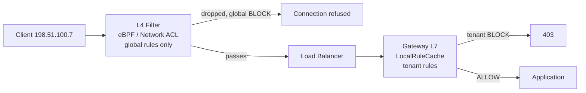

This is a genuine architectural change to the propagation story, not just a new box on the diagram — **global rules now have two delivery destinations from the same Kafka topic**, not one. The Kafka consumer we built two iterations ago needs a second consumer type:

1. The existing **Gateway L7 consumer** (unchanged) — updates `LocalRuleCache` for tenant-scoped enforcement.
2. A new **L4 Sync Agent**, running as a small daemon per host, that also consumes `ip-rule-events` — but only acts on events where `tenant_id IS NULL` (global rules) — and translates them into actual L4 primitives: `iptables -A INPUT -s 198.51.100.0/24 -j DROP`, or the equivalent cloud Network ACL API call, or an eBPF map update if you're running something like Cilium.

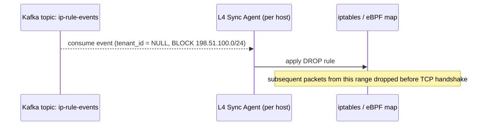

## Why Not Push Everything to L4?

The natural next question: if L4 is so much cheaper, why not push tenant rules there too?

**Where it breaks:** L4 genuinely cannot see tenant identity. Fortune500's rule is "allow `203.0.113.0/24` for *this tenant's* admin API" — but many tenants could share the same load balancer IP and even the same backend fleet, distinguished only by an HTTP Host header or a JWT claim. An L4 filter has no visibility into that; it would have to either apply the rule globally (wrong — blocks/allows for tenants it wasn't meant for) or not apply it at all. Tenant-scoped rules are structurally an L7 concern, full stop, not a performance trade-off we're choosing to skip.

## What We Gained / Gave Up

**Gained:** for the specific attack pattern this system was built around — global volumetric blocks — rejection now happens before a TCP handshake, before a load balancer even gets involved, and before any application process spends a CPU cycle. This is the difference between "reject cheaply at the door" and "reject expensively inside the building."

**Given up / new problem introduced:** we now have **two enforcement points that must agree**, and a rule that's global has to propagate to *two* different types of consumers, in two different technologies (iptables/eBPF vs. an in-process trie), each with its own update mechanics and its own possible lag. That's genuinely more moving parts, and a gap between "L4 says drop" and "L7 already has it" is a real (if brief) window where the two disagree with each other, though never in a way that lets a global block through — the L4 layer, once it's caught up, is stricter, not looser.

**Considered and rejected:** doing all filtering at L4, including tenant rules, by having the load balancer terminate TLS and inject a synthetic port-per-tenant scheme so L4 firewalls could distinguish tenants by port instead of by HTTP content. Rejected as needless complexity — you'd be reinventing tenant routing using ports as a hacky proxy for identity, when the system already has a perfectly good identity mechanism (HTTP headers/JWT) sitting one layer up. It also wouldn't scale past a few hundred tenants before running out of usable ports.

---

## Likely Interviewer Follow-ups

**"What if the L4 Sync Agent falls behind or crashes — does global blocking silently stop working?"**
The L7 Gateway still enforces global rules too, since `LocalRuleCache.global_trie` was never removed — L4 is a *fast-path optimization* layered in front of L7, not a replacement for it. If L4 lags, requests just fall through to L7 and get blocked there instead, at the old cost, not let through. Worth alerting on L4 Sync Agent staleness the same way we already alert on Gateway consumer lag.

**"Does this L4 layer help against a distributed attack where every IP is different and unique, so no single CIDR block covers it?"**
No — L4 rule-based filtering only helps when the attack traffic maps to identifiable, blockable ranges. A truly IP-diverse botnet (thousands of unique residential IPs, each used once) needs a different tool entirely — rate limiting or anomaly detection — which is exactly why we scoped rate limiting out at the start as a related-but-separate system.

---

**Next up:** we've built the enforcement and propagation story pretty thoroughly — time to zoom out and cover the pieces we've been deferring: load balancing algorithm/health checks for the Gateway fleet itself, and observability (what do we actually monitor to know this system is healthy, not just "not crashed").

---

# Evolve: Load Balancing & Observability

This iteration is lighter than the last few — most of the hard decisions are already made. What's left is making sure the *fleet itself* is healthy and that we'd actually notice if something quietly broke.

## Load Balancing for the Gateway Fleet

**Algorithm choice:** since every Gateway node holds an equivalent, near-identical `LocalRuleCache` (that's the whole point of the design — no node is "special" or holds different data than another), there's no reason to route requests based on content or session affinity. A simple **round-robin** or **least-connections** algorithm across healthy nodes is sufficient — this isn't like a sharded database where the load balancer needs to route by key. Least-connections is the marginally better default in practice, since it naturally accounts for nodes that are momentarily slower (e.g., mid-bootstrap) without needing custom logic.

**L7, not L4, for this specific hop.** This might sound like it contradicts the last iteration, but it's a different load balancer than the one filtering the botnet — that one was network-edge traffic shaping. This one is standard "distribute HTTP requests across a fleet of identical app servers," which needs to be L7-aware anyway since routing decisions downstream (which backend pool, TLS termination) already depend on HTTP content in most real deployments.

**Health checks — this is the part that actually matters for our system specifically.** A generic "is the process alive" liveness check isn't enough here, because of the bootstrap state machine from two iterations ago. A node can be alive, accepting TCP connections, and still be dangerously wrong to serve traffic from if it hasn't finished loading its snapshot yet.

So we need two distinct checks:

- **Liveness** (`GET /healthz`) — is the process running at all. Failing this restarts the pod/instance.
- **Readiness** (`GET /readyz`) — returns healthy only when `LocalRuleCache` is in the `Ready` state from our bootstrap state machine (snapshot loaded *and* Kafka consumer caught up), **and** `last_synced_at` is within some acceptable staleness bound (say, under 30 seconds old). Failing this pulls the node out of the load balancer's rotation without killing it — it keeps trying to catch up in the background.

That second check is the direct payoff of having built an explicit state machine earlier — "is this node safe to serve traffic" has a precise, checkable answer instead of a guess.

## Observability: What Actually Tells Us This System Is Healthy

Three categories, each answering a different question an on-call engineer would actually ask at 3 AM.

**Metrics — is the system behaving normally right now?**

- `rule_check_latency_p50/p99` — per Gateway node, the in-process lookup time. This should be microseconds; a creeping p99 here is often the first sign a tenant's trie or array has grown pathologically large or unbalanced.
- `kafka_consumer_lag` — per node, per topic partition. This is the single most important metric in the whole system, because it's a direct, numeric answer to "how stale is this node's view of the rules right now." Alert loudly if this exceeds a few seconds.
- `l4_sync_agent_lag` — the equivalent lag metric for the iptables/eBPF sync path from the last iteration, since it's now a second, independent propagation path that can silently fall behind without affecting the first.
- `rule_check_result_count{result=ALLOW|BLOCK, tenant, scope=global|tenant}` — a simple counter, mostly useful for catching *misconfiguration* (e.g., a tenant suddenly seeing 100% BLOCK after an admin fat-fingers a `/0` range instead of a `/24`).

**Logs — what exactly happened for one specific request, after the fact?**

Every BLOCK decision should log the matched rule ID, the CIDR, and which layer made the call (L4 vs L7) — this is what lets someone answer "why was I blocked?" from a support ticket without guessing. ALLOW decisions generally shouldn't be logged individually at this volume (200K+ req/s) — that's a cost/noise trade-off, sampling is fine there if needed at all.

**Tracing — where did time actually go for this one request?**

Less critical for this system than for a multi-hop transactional one, since the rule check itself is a single in-process operation with no downstream calls. The one place a trace span earns its keep is wrapping the bootstrap sequence for a fresh node (`snapshot fetch -> Kafka catch-up -> ready`), so a slow-starting node under investigation shows exactly which sub-step is taking long, rather than just "node took 45 seconds to become ready."

## What We Gained / Gave Up

**Gained:** a fleet that can distinguish "alive but not trustworthy yet" from "alive and safe," and a small, sharp set of metrics that map directly onto the specific failure modes this system can actually have (staleness, mis-set rules, pathological data structures) rather than a generic dashboard that doesn't reflect this system's real risks.

**Given up:** nothing new traded away here — this iteration is mostly operational hygiene layered on top of decisions already made, which is why it didn't need the "naive attempts" treatment the crux iterations did.

**Considered and rejected:** consistent-hashing-based load balancing keyed on tenant ID, so a given tenant always lands on the same subset of nodes (better cache locality in theory). Rejected because every node already holds the *entire* rule set for every tenant — there's no partial-cache problem to solve, so pinning tenants to specific nodes would only add complexity and create uneven load distribution (a few large tenants would concentrate load on a small node subset) for zero actual benefit.

---

## Likely Interviewer Follow-up

**"Your BLOCK-decision logging at 200K+ req/s — doesn't that itself become a bottleneck?"**
Fair concern, and the answer is BLOCK events should be rare relative to total traffic in steady state (most requests are legitimate) — it's specifically *during an attack* that BLOCK volume spikes, which is exactly when you want the logs most. The mitigation is async, batched log shipping (write to a local buffer, flush in batches to whatever log aggregation pipeline exists) rather than a synchronous write per request — this is a standard pattern, not something specific to this system, so it doesn't need its own deep-dive.

---

We've now covered every item on the original checklist. Ready for the final interview-readiness recap — full architecture diagram, every end-to-end path restated, and a "why not X" cheat sheet — or would you like to go deeper on any single piece first (e.g., the trie's IPv6/Patricia variant, exactly how tenant rule conflicts with global rules resolve, or something else)?

---

# Interview-Readiness Recap

## Full Architecture Diagram

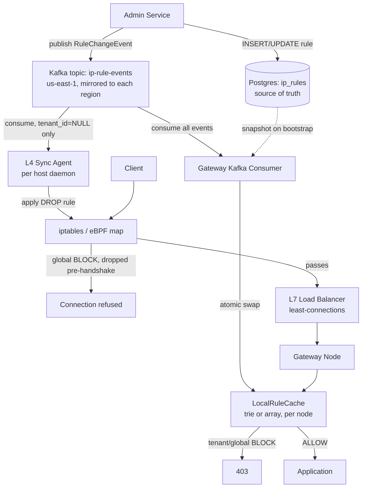

## Every End-to-End Path

**Write path (admin adds/changes a rule):**
1. Admin Service issues `INSERT`/`UPDATE` against Postgres `ip_rules` — durable source of truth.
2. Admin Service publishes a `RuleChangeEvent` to the `ip-rule-events` Kafka topic in `us-east-1` (the single global writer).
3. Topic is mirrored to each region's local Kafka cluster.
4. Two independent consumer types pick it up: the Gateway L7 consumer (all events) and the L4 Sync Agent (global events only).

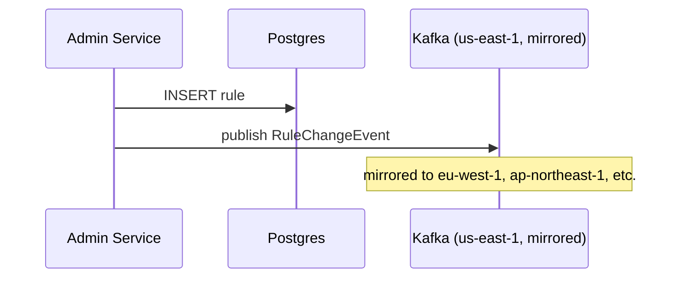

**Global-rule L4 propagation path:**
1. L4 Sync Agent (per host) consumes the event, filters for `tenant_id IS NULL`.
2. Translates to `iptables`/eBPF/Network ACL update.
3. Subsequent packets from that range dropped pre-TCP-handshake.

**Tenant-rule L7 propagation path:**
1. Gateway Kafka Consumer consumes the event.
2. Builds updated trie/array node, atomically swaps into `LocalRuleCache`.

**Node bootstrap path:**
1. Fresh node fetches full Postgres snapshot → builds `LocalRuleCache`.
2. Subscribes to Kafka from that offset, tails until caught up.
3. Marks itself `Ready` — readiness probe passes, load balancer adds it to rotation.

**Read path (a request arrives):**
1. Packet hits L4 filter — dropped if globally blocked, else passes.
2. L7 load balancer routes to a healthy Gateway node.
3. Gateway parses tenant identity, walks `tenant_tries`/`global_trie` in `LocalRuleCache`.
4. ALLOW → forwarded to application. BLOCK → 403, logged with matched rule ID and layer.

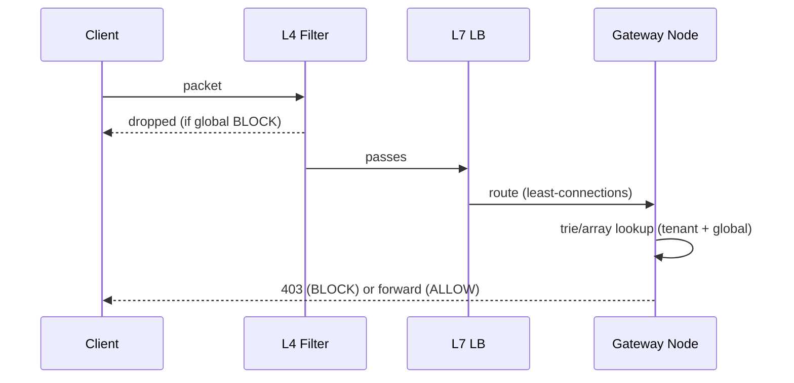

## "Why Not X" Arsenal

| Alternative proposed | One-line rejection |
|---|---|
| Query Postgres directly on every request | Survives correctness but not scale — a network+DB round trip per request can't hit sub-ms at 200K+ req/s, and it's a single point of failure on the hot path. |
| Add read replicas near each region instead of caching | Fixes latency, not the per-request DB dependency — still saturates connections under attack-level load. |
| Poll faster (e.g., every 100-200ms) instead of pub/sub | Shrinks staleness but doesn't change the shape — fleet-wide polling load scales with node count, not actual change rate, and re-creates Day-0-style DB pressure. |
| Admin fans out rule changes directly via HTTP to every node | Requires tracking every node's live address, has no ordering guarantee across concurrent updates, and fails silently on a mid-restart node. |
| Central Rules Service with long-polling | Relocates the fan-out bottleneck to one service instead of removing it, and needs its own replication story to avoid being a SPOF. |
| Redis Pub/Sub instead of Kafka | Fire-and-forget — a disconnected node misses messages permanently with no replay, unlike Kafka's durable offset-based log. |
| Multi-region multi-writer Kafka clusters | Requires real conflict resolution for concurrent writes; unnecessary since rule writes are rare and not latency-sensitive to the admin. |
| Push all filtering (including tenant rules) to L4 | L4 has no tenant identity — that only exists once you've parsed HTTP content, so tenant-scoped rules are structurally an L7-only concern. |
| Trie for every tenant regardless of rule count | Wastes memory/cache-locality for the common case (small tenants) — better to promote only tenants crossing a size threshold. |
| Consistent-hashing load balancer by tenant ID | Every node already holds the full rule set for every tenant — there's no partial-cache benefit, only uneven load risk. |

## What's Next

Options from here:

- **Drill deeper** into any single piece — e.g., the Patricia/radix trie variant for IPv6, exactly how a tenant-scoped ALLOW interacts with a global BLOCK when both match (precedence rules), or data sovereignty routing for tenants requiring region-pinned writes.
- **Mock interview** — I play interviewer and pressure-test you across the whole design, mixing "why not X" questions with new curveballs (failure injection, a scale change, a new requirement dropped in mid-interview).

Which would you like?

---

# Drill-Down: IPv6 Patricia Tries & ALLOW/BLOCK Precedence

## Part 1: Why a Plain Binary Trie Wastes Space on IPv6

Take a concrete IPv6 rule: **`2001:0db8::/32`** flagged as `BLOCK` (say, a cloud provider's allocation block that's been a source of abuse), with a narrower exception underneath it: **`2001:0db8:85a3::/48`** flagged `ALLOW` (a specific customer's legitimate subnet inside that range).

In our plain per-bit binary trie from the earlier iteration, reaching the `/32` BLOCK marker means walking **32 individual bit-levels** down from the root — and unless some *other* rule also happens to diverge partway through those 32 bits, every one of those levels has exactly one child. You're allocating 32 tree nodes just to represent "go left, go left, go right..." with zero actual decision happening at any of them.

Now stretch that to the full 128-bit IPv6 address space, across potentially thousands of rules. Most of the tree is these long, forced, single-child corridors — real branch points (where two different rules actually diverge) are comparatively rare.

## The Fix: Compress the Corridors

A **Patricia trie** (also called a **radix trie**) collapses every maximal run of single-child nodes into one edge, labeled with the bit-string that run represents. A tree node only gets created where a **real decision** exists — either a branch point (two rules diverge here) or a rule actually terminates.

**The analogy:** think of the plain binary trie as a hallway with a door at every single step, even the ones where there's only one way to go. A Patricia trie replaces each stretch of doorless hallway with a single long corridor labeled "walk 32 paces," and only puts an actual door where you'd genuinely need to choose left or right, or where a room (a rule) exists.

```
Patricia trie fragment for our two rules:

root
  |
  [edge: skip 32 bits = 2001:0db8]
  |
 (*) <- BLOCK marked here (rule terminates: 2001:0db8::/32)
  |
  [edge: skip next 16 bits = 85a3]
  |
 (*) <- ALLOW marked here (rule terminates: 2001:0db8:85a3::/48)

Only 2 real nodes exist, instead of 48 forced single-child nodes.
```

**Lookup for `2001:0db8:85a3::1`:**
1. Walk the first edge — the address's first 32 bits match `2001:0db8`, so continue.
2. Hit the BLOCK marker — remember it, but keep going since more bits remain to check.
3. Walk the second edge — the next 16 bits match `85a3`, continue.
4. Hit the ALLOW marker — this is deeper, so it overrides. Final answer: **ALLOW**.

If the address had instead been `2001:0db8:9999::1`, step 3 would fail to match the `85a3` edge — at that point, you stop and return the **last marker seen before the mismatch**, which is the BLOCK from step 2. That's the deepest genuine match, correctly falling back to the broader rule.

## Node Shape and Cost

```
PatriciaNode {
    prefix_bits:  BitString    // the bit sequence this edge represents
    prefix_len:   int          // how many bits it covers
    children:     [PatriciaNode | null, PatriciaNode | null]
    rule_type:    "ALLOW" | "BLOCK" | null
}
```

**Insertion is genuinely trickier here** than the plain trie. Adding a new rule can require **splitting an existing edge** — if the new rule's prefix diverges from an existing compressed edge partway through, you have to break that edge into two shorter ones at the divergence point and insert a new branch there. This is more bookkeeping than a plain trie's "just walk down and attach," but it's still bounded work — at most a handful of splits, not a rebuild.

| | Plain binary trie | Patricia/radix trie |
|---|---|---|
| Node count | O(rules × 128) worst case | O(rules) |
| Memory per rule | High — mostly forced empty nodes | Compact — nodes only at real decisions |
| Lookup cost | More pointer chases, same bits examined | Fewer pointer chases, same bits examined |
| Insert complexity | Simple attach | May require splitting a compressed edge |

This isn't a theoretical structure invented for this problem — it's the same approach behind Linux's `fib_trie` kernel routing table and most real BGP forwarding implementations. IP longest-prefix-match at scale converges on this data structure repeatedly because the "long, sparse, single-child corridor" problem is universal to prefix-based address spaces.

---

## Part 2: Precedence — When Global BLOCK and Tenant ALLOW Both Match

## The Scenario That Forces This Decision

Recall the botnet range from our origin story: a global rule, **`BLOCK 198.51.100.0/24`**, pushed by ops during an active incident.

Now suppose **Tenant Acme**, unaware this range was ever flagged, later configures their own admin-API allowlist and — through a co-location provider reassigning address space, or just an overly broad fat-fingered entry — ends up with a tenant-scoped rule like **`ALLOW 198.51.100.0/28`** that overlaps part of that same blocked range.

If we just ran "deepest CIDR match wins" blindly across *both* scopes at once, the tenant's more specific `/28` ALLOW would beat the global `/24` BLOCK on specificity alone — meaning a tenant's own misconfiguration could silently punch a hole through a platform-wide security block. That's a real vulnerability, not a hypothetical.

## The Fix: Scope Beats Specificity, Specificity Governs Within a Scope

The precedence rule needs two levels, evaluated in this order:

1. **Check the global trie first**, in isolation. If any global rule (ALLOW or BLOCK) matches this IP, that decision is final — the tenant trie is never even consulted.
2. **Only if no global rule matches**, check the tenant's own trie, where specificity governs normally (deepest match wins among that tenant's ALLOW/BLOCK rules, exactly as established two iterations ago).
3. **If neither matches**, fall through to the tenant's configured default policy (default-allow or default-deny — this is a per-tenant setting from way back in Day 0).

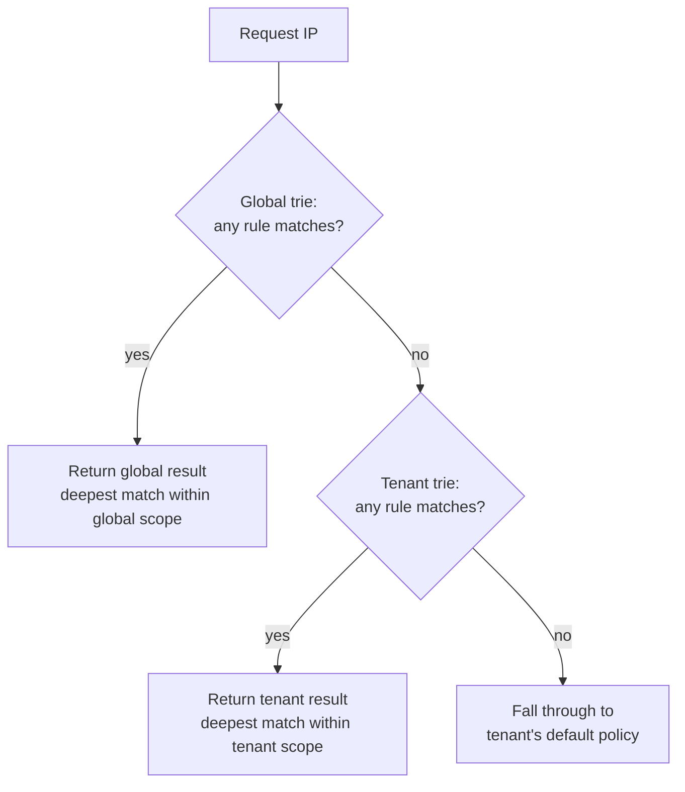

Applied to our scenario: the lookup for an IP in `198.51.100.0/24` hits the global trie first, finds the BLOCK, and returns immediately. Acme's `/28` ALLOW never gets a chance to run — not because it's less specific in some absolute sense, but because it's in a lower-priority *scope* entirely. This matches the real-world intuition: a tenant's own configuration mistake shouldn't be able to override a platform-level security decision they don't even have visibility into.

## The Pseudocode

```
function check(tenant_id, ip):
    global_result = global_trie.lookup(ip)      // deepest match within global scope
    if global_result is not None:
        return global_result

    if tenant_id in tenant_tries:
        tenant_result = tenant_tries[tenant_id].lookup(ip)  // deepest match within tenant scope
        if tenant_result is not None:
            return tenant_result

    return default_policy[tenant_id]            // per-tenant configured default
```

Note this requires **no change to the cache structure** from what we already built — `global_trie` and `tenant_tries` were already separate structures in `LocalRuleCache`. This is purely a change to the *lookup algorithm's* order, checking one structure before the other rather than merging them into a single walk.

## The Analogy

Think of it like a large office building. The **building's own security desk** keeps a banned-visitor list — if you're on it, you're turned away at the lobby, full stop, regardless of what any individual tenant company on floor 12 has written on their own guest list. A tenant's private guest list only gets consulted *after* you've cleared the building's front desk. The tenant can be as permissive as they want with their own list, but they can't override a decision the building itself made.

## The Trade-off This Introduces

**What we gained:** a global BLOCK becomes a genuine security guarantee — no tenant-level misconfiguration, however specific, can accidentally or maliciously punch a hole through it.

**What we gave up:** the reverse case now needs a warning label. A global **ALLOW** rule (say, for an internal health-check or monitoring service that needs universal access) also short-circuits *before* any tenant BLOCK is checked — meaning a tenant cannot use their own rules to exclude something the platform has globally allowed. This is usually the right call for infrastructure-level access, but it means global ALLOW rules deserve tighter write access and review than tenant rules, since a careless one bypasses every tenant's own blocklist at once.

**What we considered and rejected:** letting the most-specific CIDR win regardless of scope (pure LPM semantics, ignoring who owns the rule). Rejected for the security reason above — it's mathematically cleaner, but it means a tenant's own data determines whether a platform-wide ban holds, which inverts who's actually supposed to be in control of that decision.

---

## Likely Interviewer Follow-ups

**"What if two global rules themselves overlap — say `BLOCK 198.51.100.0/24` and `ALLOW 198.51.100.7/32` (an exception for a since-cleaned-up host in that range)?"**
Within a single scope, it's back to pure specificity — the `/32` ALLOW is deeper in the trie than the `/24` BLOCK, so it wins for that one address, same trie-walk logic as tenant rules. The scope-beats-specificity rule only applies *between* global and tenant scopes, not within global rules themselves.

**"Doesn't checking the global trie unconditionally on every single request add latency, even for tenants who've never had a global rule apply to them?"**
It's one extra trie walk, and both tries are already in-process memory — we're talking nanoseconds-to-low-microseconds added, not a new network hop or anything that changes the system's cost profile. The alternative (merging both into one trie) would actually be *more* code complexity for a decision that needs to stay logically separate anyway.

---

Want to keep going — maybe the data-sovereignty routing question (tenants requiring their rules never leave a specific region), or is this a good point to move into the mock interview?

---
