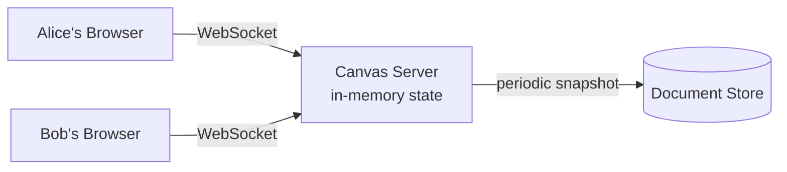
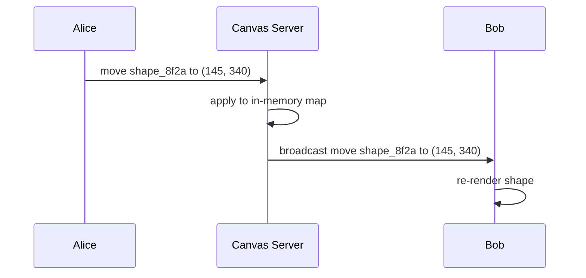
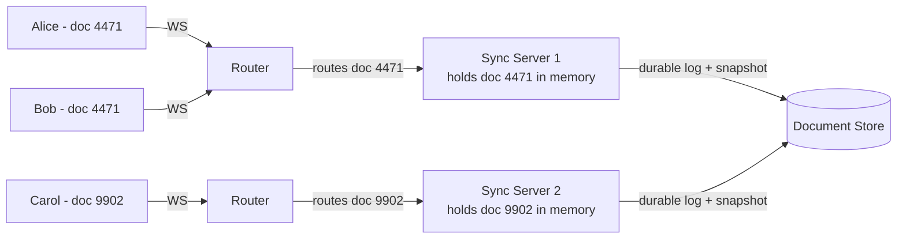
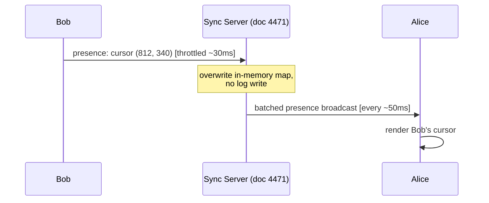
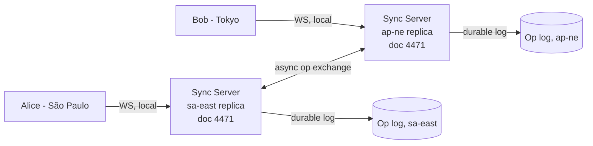
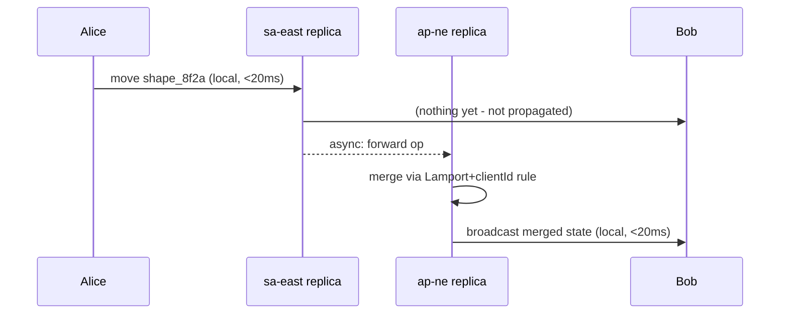
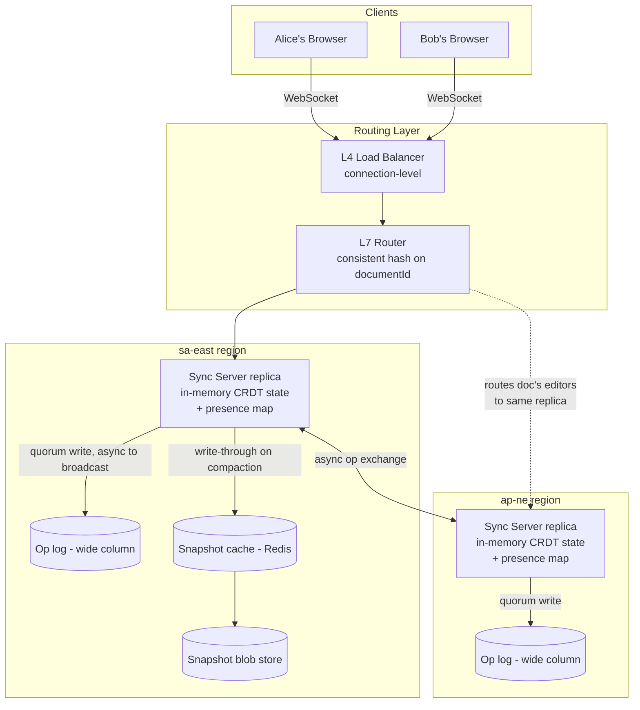
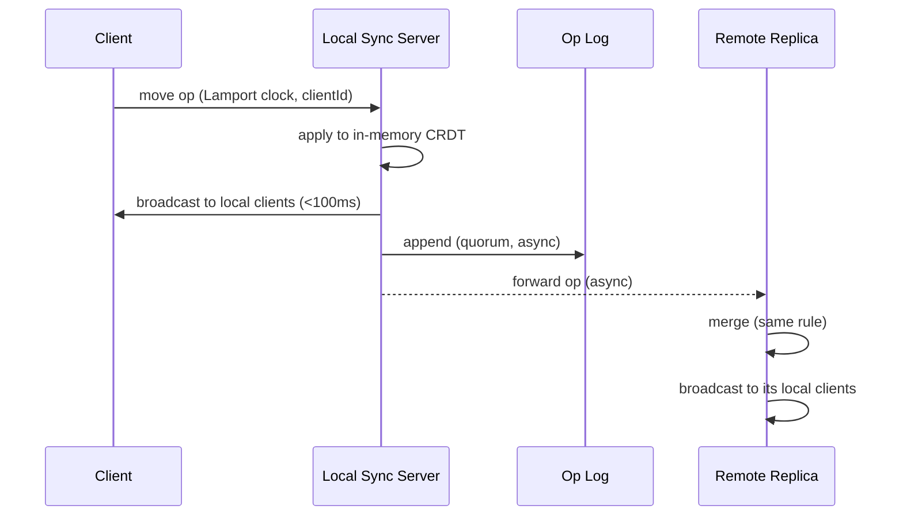

# Why This Problem Exists

It's 2011, and Google Docs has just proven something wild: two people can type into the same document at the same time and neither one has to hit "save" or wait their turn. Before that, "collaboration" meant emailing a `.psd` file back and forth with `_final_v3_ACTUAL.psd` in the filename.

But text is the easy case — characters go in one direction, in one dimension, and merging two edits usually just means "insert both." A design canvas is a different beast entirely. Now you've got shapes with x/y positions, z-order, rotation, resizing, grouping, and someone dragging a rectangle across the screen 60 times a second while someone else is simultaneously resizing it from the opposite corner. Figma's whole founding bet, around 2016, was that this could run smoothly *in a browser*, live, for a whole team watching each other's cursors move in real time.

That's the problem we're solving: not just "sync data between clients," but "sync a live, mutable, spatial document, with sub-second feedback, without anyone's edits silently vanishing."

---

# Step 1 — Clarifying Questions

Here are the questions I'd actually ask an interviewer for *this* system — each one is a fork that sends the architecture down a genuinely different path.

**Scope of "collaborative"**

1. **Are we editing shapes/objects (rectangles, text, paths) or raw pixels (like a shared whiteboard drawing tool)?**
   Object-based editing means we can sync structured operations (move shape A to x,y). Pixel-based editing means we're syncing raster deltas or strokes — a completely different data model and conflict story.

2. **Is this single-document collaboration (one canvas, many editors) or a multi-document product (like all of Figma, with projects, folders, permissions)?**
   Single-document lets us focus entirely on the real-time sync engine. Multi-document drags in a whole file/project management system that's mostly boring CRUD sitting next to the one interesting part.

**Consistency & conflict behavior**

3. **When two users edit the same object at the same time, is "last write wins with occasional visible jank" acceptable, or does every client need to converge to the *exact same* final state deterministically (true CRDT/OT guarantees)?**
   This is the single biggest fork in the whole design. LWW is a much simpler system. Guaranteed convergence is what pushes us toward CRDTs or Operational Transform, and that's where most of the hard distributed-systems discussion lives.

4. **Do we need offline editing support (edit while disconnected, reconcile on reconnect), or is this always-online, and a dropped connection just freezes the client until it reconnects?**
   Offline support all but forces a CRDT-style approach, since OT traditionally assumes a central server is always reachable to sequence operations.

**Real-time mechanics**

5. **Do we need to show live cursors and live "who's selecting what" presence, or just the eventual shape edits?**
   Presence (cursors, selections) is high-frequency, ephemeral, and loss-tolerant — very different delivery requirements than the shape edits themselves, which must not be lost.

6. **What's a tolerable end-to-end latency for one user's edit to appear on another user's screen — under 100ms (feels "live"), or is a few hundred ms acceptable?**
   Sub-100ms effectively rules out routing every edit through a slow consensus path or a heavyweight durable write before broadcast; it pushes us toward optimistic local apply + async persistence.

**Scale & history**

7. **How many concurrent editors on a single document — is this a 2-10 person design team, or do we need to support something like Google Slides' "50 people somehow all editing at once"?**
   Small concurrency (under ~20) lets us get away with a much simpler broadcast fan-out per document. Large concurrency changes how we shard connections and whether we need to batch/throttle broadcasts.

8. **Do we need version history / time-travel (scrub back to any past state), or just "the current state is always correct"?**
   History-as-a-feature means every operation needs to be durably logged and replayable, not just applied and discarded — this affects the write path and storage model materially.

**Existing systems**

9. **Is there an existing auth/identity and document-storage system we integrate with, or are we designing those too?**
   If auth/storage are assumed to exist, we can focus entirely on the sync engine, which is the actually interesting part of this problem.

Take a swing at these (or tell me to assume reasonable FAANG-interview defaults) and I'll lock in the scoped requirements next.

---

# Step 2 — Scoped Requirements

Going with reasonable defaults since you said next:

- Object-based editing (shapes, not raw pixels)
- Single-document focus (the sync engine is the point, not multi-project file management)
- True deterministic convergence required — not "usually consistent," actually consistent
- Offline/reconnect support expected
- Live cursor presence expected
- Sub-100ms feel for edit propagation
- Moderate concurrency — think ~50 concurrent editors on one document, Figma-team-meeting scale, not "the whole internet on one canvas"
- Auth and document/project storage assumed to already exist elsewhere — we're designing the real-time sync engine, not a file manager

## Core Requirements (P0/P1)

**P0 — Convergent concurrent editing.** Multiple users can edit shapes (move, resize, style, delete) on the same canvas at the same time, and every client's view converges to the *same* final state — no lost edits, no permanent divergence — even when two people touch the same object simultaneously.

**P0 — Live presence.** Every editor sees other editors' live cursors and current selections, updated in near real time. This is high-frequency and loss-tolerant — if one cursor frame drops, nobody cares.

**P1 — Durable persistence + late join.** A user who reloads the page, or joins the session five minutes late, gets the full current canvas state, not just edits made after they connected.

**P1 — Reconnect resilience.** A brief network drop (a few seconds to a minute) shouldn't corrupt the document or silently discard whatever the disconnected user was doing locally — it should reconcile cleanly on reconnect.

## Explicitly Cut (P2, no architectural impact on the sync engine)

- **Multi-document / project / folder management** — that's a CRUD app sitting next to this system, not part of it.
- **Permissions and sharing (viewer vs editor roles)** — bolts onto auth, doesn't change how sync works.
- **Full scrubbable version history / time-travel** — we'll keep enough of a log to support undo and durable state, but not a Figma-style "drag the history slider" feature.
- **Comments, plugins, export/rendering pipelines** — product surface area, zero distributed-systems content.

## The Crux

**Convergent concurrent editing** is where we'll spend most of our time. This is the CRDT-vs-OT-vs-locking discussion, and it's the one an interviewer will poke at hardest with "what if two people drag the same rectangle in opposite directions at the same time?"

Confirm this scope and I'll start Day 0.

---

# Day 0 — The Dumbest Thing That Could Work

## The Scenario

Alice opens a canvas. Bob joins the same canvas five seconds later. Alice drags a rectangle across the screen. Bob's browser should see that rectangle move, live.

The simplest possible version of this: **one server, holding the whole canvas in memory, relaying every edit to everyone else connected.**

## The Architecture

One process. It holds the canvas as an in-memory object — a map of shape ID to shape data. Clients connect over a **WebSocket** (not HTTP polling — we need server-initiated pushes, not just client-initiated requests).

When Alice moves a shape, she sends the new position. The server updates its in-memory copy, then immediately forwards that same message to every other connected client — Bob included.



## Why This Is Reasonable, Not a Strawman

This isn't a toy. For a single small document with a handful of editors, this genuinely works:

- **One source of truth** — there's exactly one in-memory copy of the canvas, so there's no question of which version is "right."
- **Trivial ordering** — the server processes messages one at a time, in the order they arrive, so "who moved last" is unambiguous.
- **Zero coordination overhead** — no consensus protocol, no distributed locks, nothing. It's just a chat room that happens to relay shape data instead of text.

The guarantee it gives up is **durability against server crash** and **horizontal scale** — both of which we'll deliberately trade in later. But as a Day 0 baseline, "single authoritative process, broadcast everything" is exactly the right instinct.

## The Data Model (first time, full shape)

```json
{
  "shapeId": "shape_8f2a",
  "type": "rectangle",
  "x": 120,
  "y": 340,
  "width": 200,
  "height": 80,
  "rotation": 0,
  "fill": "#4285F4",
  "zIndex": 5,
  "lastModifiedBy": "user_alice",
  "version": 7
}
```

This lives in one place right now: the **Canvas Server's** in-memory map, keyed by `shapeId`. Every field here matters later — especially `version`, which is currently unused but we'll need it soon.

## Who Writes, Who Reads

- **Writer:** the Canvas Server, whenever any client sends an edit message. It mutates its own in-memory map directly.
- **Reader:** every connected client, via the broadcast the server sends right after applying the write.
- **Physical home:** process memory on the single Canvas Server. Nothing durable yet except a periodic snapshot to a document store (Postgres row, blob, doesn't matter yet — this is a placeholder, not a decision we've made carefully).

## The Edit Flow

**API call:** clients send a WebSocket frame, not a REST call — there's no request/response here, just a fire-and-forget message.

```json
// client → server
{
  "op": "move",
  "shapeId": "shape_8f2a",
  "x": 145,
  "y": 340,
  "clientTimestamp": 1699999999123
}
```

1. **Alice's browser** sends the `move` op over her WebSocket connection.
2. **Canvas Server** receives it, applies it directly to its in-memory `shapes` map (`shapes["shape_8f2a"].x = 145`).
3. **Canvas Server** broadcasts the same op to every other open WebSocket on this document — right now, just Bob.
4. **Bob's browser** receives the op and re-renders that shape at the new position.



No database write happens on the critical path at all — that's what makes this fast. Persistence is a background concern for now (a timer that snapshots the in-memory map to disk every N seconds), not something we've designed carefully yet.

## Interviewer Follow-Up

**"Why WebSocket instead of client polling the server every second?"**
Polling means every client re-fetches the whole canvas state on a timer, which is both wasteful (most polls return "nothing changed") and slow (average latency is half your poll interval). A live cursor moving 60 times a second needs push, not pull — WebSocket keeps one persistent connection open and the server pushes the instant something changes.

## Recap

| Concept | The Insight |
|---|---|
| Single in-memory server | One process = one unambiguous source of truth, no coordination needed |
| WebSocket over polling | Server-initiated push is required for sub-100ms live feel |
| Broadcast-on-write | Server applies the edit once, then relays the identical message to everyone else |
| No DB on critical path | Durability is a background concern here, deliberately deferred |

**Interview arc hook:** *"Day 0 for a collaborative canvas is one server holding the canvas in memory and broadcasting every edit over WebSocket to everyone else connected — it works because there's exactly one copy of the truth, but that also means it can't survive a crash or scale past one machine."*

---

Next up: what happens when the server holding that one precious in-memory copy of the canvas crashes mid-session — and what happens when Alice and Bob grab the *same* rectangle at the *exact* same moment.

---

# Break It

## Failure 1: The Server Crashes

Alice and Bob have been editing for 20 minutes. Neither has touched save — there's no save button, this is real-time collaboration. The Canvas Server process dies (OOM, deploy, hardware fault, doesn't matter which).

Every shape either of them moved, resized, or created in the last however-many-seconds-since-the-last-snapshot is gone. Not corrupted — just never existed anywhere except that process's RAM.

If our snapshot interval is 30 seconds, we just lost up to 30 seconds of two people's work, silently, with no error shown to either of them until they notice the canvas looks wrong.

## Failure 2: Alice and Bob Grab the Same Rectangle

This is the one that actually matters more. Say Alice and Bob are both looking at `shape_8f2a`, a rectangle at `(120, 340)`.

At almost the same instant:
- Alice drags it to `(200, 340)` — moving it right.
- Bob drags it to `(120, 500)` — moving it down.

Both messages arrive at the Canvas Server within a few milliseconds of each other. The server, dumbly, applies them in whatever order they arrived — say Alice's first, then Bob's.

Final state: `(120, 500)`. Alice's move got **silently overwritten**. Her rectangle snapped back to where Bob put it, with zero indication to her that her edit was discarded. She'll assume the app is buggy — from her perspective, she dragged a shape and it teleported somewhere she didn't put it.

This isn't a rare edge case either — for a design tool with 50 concurrent editors on one canvas, two people touching the same object within the same 50ms window happens constantly: nudging the same button element, resizing the same frame, aligning the same group.

## Why Day 0's Model Makes This Worse Than It Sounds

The deeper issue isn't "last write wins" itself — LWW is a legitimate strategy for *some* systems. The issue is that **whole-object overwrite loses information that didn't need to be lost.**

Alice changed `x`. Bob changed `y`. Those aren't actually conflicting edits — they're two edits to two different fields that Day 0's coarse "replace the whole shape" broadcast treats as if they collided. A move-and-a-resize on the same shape, at the same time, should both survive. Right now, neither is guaranteed to.

## Recap

| Concept | The Insight |
|---|---|
| In-memory-only state | A crash loses every edit since the last snapshot, silently |
| Concurrent edits to one shape | Last message to arrive wins, earlier edit vanishes with no signal to the user |
| Field-level vs object-level conflict | Alice's `x` change and Bob's `y` change don't *actually* conflict, but whole-object overwrite treats them as if they do |

**Interview arc hook:** *"Day 0 breaks two ways: a crash loses everything since the last snapshot, and concurrent edits to the same shape silently overwrite each other because the server applies whole-object last-write-wins instead of understanding that two different fields changed."*

---

Next up: this is the crux. We'll walk through a few naive attempts at fixing concurrent edits — locking, then timestamp-based resolution — before landing on why CRDTs are the actual answer here.

---

# Evolve It — Solving Concurrent Edits (The Crux)

## Attempt 1: Pessimistic Locking

The instinct: if two people can't touch the same shape at once, there's no conflict to resolve.

```
Engineer A: "Just lock the shape when someone starts dragging it.
             Nobody else can touch it until they let go."
Engineer B: "So if Alice starts dragging and her laptop's wifi drops
             mid-drag, that shape is locked forever?"
Engineer A: "Add a lock timeout, then."
Engineer B: "Now Bob is staring at a shape he can't move for 5
             seconds because Alice's cursor twitched near it."
```

**Why it looked reasonable:** it's the obvious database answer — `SELECT FOR UPDATE`, mutex, whatever your background is, "prevent the conflict instead of resolving it" is the first idea everyone reaches for.

**Where it breaks, specifically:** a design canvas isn't a bank account. People *expect* to work near each other constantly — nudging adjacent shapes, aligning things in the same group, resizing a frame someone else is populating. Locking turns "collaborative editing" into "polite turn-taking," which defeats the entire point of the product. And the disconnect case is nasty: a lock holder who vanishes either freezes that object for everyone, or you add a timeout and now you're back to needing conflict resolution anyway — you've just delayed it.

## Attempt 2: Timestamp-Ordered Field-Level Merge

The instinct: Day 0's mistake was treating the whole shape as one blob. Fix the granularity — diff at the *field* level, and use timestamps to decide the winner per field.

So Alice's `move to x=200` and Bob's `move to y=500` no longer collide, because they touch different fields. The server keeps, per field, "last write wins by timestamp":

```json
{ "shapeId": "shape_8f2a", "field": "x", "value": 200, "clientTs": 1699999999120 }
{ "shapeId": "shape_8f2a", "field": "y", "value": 500, "clientTs": 1699999999121 }
```

Both apply cleanly. Final shape: `x=200, y=500`. Both edits survived. This actually fixes the Alice/Bob scenario from before.

**Where it breaks:** two problems, both real.

First — **whose clock?** `clientTs` comes from each user's own machine. Alice's laptop clock is 400ms fast. Now her edit "wins" against Bob's even though Bob's arrived at the server first, purely because her local clock lied. You could use server-receipt time instead, but then a client on a slow connection *always* loses to a client on a fast one, regardless of who actually acted first from the user's perspective.

Second, and worse — **this doesn't survive offline/reconnect**, which we scoped as a P1 requirement. If Bob goes offline for 10 seconds, queues up 6 local edits, and reconnects, timestamp-merge has no principled way to replay his queued ops against whatever Alice did in that same window. You end up hand-rolling a diff/merge algorithm per field type, and it still doesn't guarantee two clients converge to the *identical* state — it guarantees "a" state, which might differ depending on network timing. That's not the deterministic convergence we scoped as P0.

## Attempt 3: CRDTs — The Actual Answer

The core idea, in plain language first: instead of the server deciding who "wins," design the data structure itself so that **applying the same set of edits in any order, on any client, always produces the same result.** No arbitration needed, because there's nothing to arbitrate — the math guarantees convergence.

This is a **Conflict-free Replicated Data Type (CRDT)**.

Here's the analogy that actually mirrors the mechanism: think of it like **two people editing the same shared shopping list where every item has a version counter, not a shared pen.** If you and I both cross off "milk" at the same time, it doesn't matter who technically "went first" — the item ends up crossed off either way. The operations are designed so that order doesn't change the outcome. That's the whole trick: pick operations where `A then B` and `B then A` land in the same place.

For our shape's `x` position specifically, a simple CRDT approach is a **Last-Writer-Wins Register (LWW-Register)** per field, but with a crucial difference from Attempt 2: the "last writer" decision is made with a **tie-break rule that's identical on every client** — typically `(logical clock, client ID)` — not a wall-clock timestamp from an untrusted machine.

```json
{
  "shapeId": "shape_8f2a",
  "field": "x",
  "value": 200,
  "lamportClock": 47,
  "clientId": "alice_9f"
}
```

- **Lamport clock**, not wall clock: a counter that only ever increases, incremented on every local op and updated whenever a remote op with a higher counter arrives. It captures *causal* order ("this happened after that"), not *wall* order, which is exactly what you want when clocks can't be trusted.
- **Every client applies the same deterministic rule**: higher Lamport clock wins; on a tie, higher `clientId` wins. Alice and Bob's browsers, and the server, all compute this identically — so there's no "authority" needed to arbitrate. Convergence isn't enforced by a referee, it's guaranteed by construction.

This is also what makes offline editing actually work: Bob's queued local ops each carry his Lamport clock. When he reconnects, his ops replay against whatever happened while he was gone, and every client — including his — lands on the same final state, because the merge rule doesn't care about arrival order.

## Alternative Considered: Operational Transform (OT)

❌ **Operational Transform** — the algorithm Google Docs actually uses. Instead of designing order-independent data, OT keeps a central server that *transforms* incoming operations against whatever happened concurrently, so they can be replayed in a consistent order.

Why rejected here: OT is a legitimate, battle-tested choice, but it fundamentally assumes a **single central sequencer** that every operation passes through to be transformed — that's how Google Docs guarantees order. That's a harder fit for our offline-editing requirement, where Bob might generate a queue of ops with no server in reach to transform them against. CRDTs are designed to merge peer-to-peer with no arbiter required, which lines up with "disconnect for a minute, reconcile cleanly" much more directly. OT is genuinely the better choice for text-heavy, always-online editors — it's not a strictly worse algorithm, it's a worse fit for *this* requirement set.

## Comparison

| Approach | Handles concurrent edits | Handles offline/reconnect | Deterministic convergence | Complexity |
|---|---|---|---|---|
| Pessimistic locking | Avoids by blocking | Poor (lock holder vanishes) | N/A — no concurrency allowed | Low |
| Timestamp field-merge | Partially | Poor (no principled replay) | No (clock-dependent) | Medium |
| CRDT (LWW-Register per field) | Yes | Yes | Yes, by construction | Medium-High |
| OT | Yes | Poor (needs central sequencer) | Yes (server-mediated) | High |

## Interviewer Follow-Up

**"LWW-Register still means one field's edit gets discarded when two people touch the exact same field — isn't that still 'losing' an edit?"**
Yes, at the single-field level, true simultaneous edits to the *same* field still resolve to one winner — that's unavoidable, two different values can't both be "the x position." What CRDTs fix is the false conflicts: different fields, or non-conflicting structural ops like two people adding *different* new shapes, which Day 0's whole-object LWW would have needlessly clobbered. For genuinely same-field collisions, deterministic convergence (everyone agrees on the same winner) is the achievable guarantee — not "nothing is ever overwritten."

## Recap

| Concept | The Insight |
|---|---|
| Pessimistic locking | Prevents conflicts by blocking concurrent access, but kills the collaborative feel and disconnects create stuck locks |
| Timestamp field-merge | Fixes granularity but not trustworthiness — client clocks lie, and it has no principled offline replay story |
| Lamport clock | A counter capturing causal order, not wall-clock order — immune to clock skew |
| CRDT (LWW-Register) | Every client applies the same deterministic tie-break rule, so convergence needs no referee |
| OT vs CRDT | OT needs a central sequencer; CRDTs merge peer-to-peer — CRDTs fit offline editing better |

**Interview arc hook:** *"If asked how you resolve concurrent shape edits: locking kills collaboration and offline resolution, timestamp merges fail because client clocks aren't trustworthy, so a CRDT with Lamport-clock tie-breaking lets every client apply edits in any order and still converge to the identical state — no central arbiter required."*

---

Next up: we've picked the conflict-resolution *algorithm* — now the NFR deep-dive on how this actually runs at 50-concurrent-editors scale: how the server itself scales horizontally once it's no longer safe to just hold everything in one process's memory, and what durable storage for a CRDT document actually looks like.

---

# Evolve It — Scaling the Server & Durable Persistence

## The Concrete Trigger

We've got the algorithm right, but Day 0's architecture still has one process holding one canvas in memory. That's fine for one document. It's not fine for a real product — Figma isn't hosting one canvas, it's hosting millions of them, each with its own set of editors.

Say we now have 10,000 active documents at once, each with anywhere from 1 to 50 concurrent editors. One server holding all of them in memory runs out of RAM and CPU fast — and worse, if that one process dies, *every* document currently open goes down at once, not just one unlucky team's canvas.

## The Fix: Shard by Document, Not by User

The key insight for this system: **a single document's live editing session doesn't need to talk to any other document's session.** Alice and Bob editing canvas #4471 never need real-time coordination with anyone editing canvas #9902. That means we can partition — shard — the *live in-memory CRDT state* across many server processes, one document's session pinned to exactly one server at a time.

This is different from typical DB sharding, so let's be precise about what's being sharded: it's the **WebSocket connections and the in-memory CRDT document state**, not a database table.



Every editor of the *same* document must land on the *same* Sync Server — that's non-negotiable, because the in-memory CRDT state and the broadcast fan-out both live in that one process. A router in front decides which server owns which document.

## Candidate Sharding Keys

- **Shard by `documentId`** — this is the one we're using. It optimizes exactly the access pattern we have: all traffic for one document needs to reach one process. It makes cross-document queries (rare, we don't have them) impossible without hitting every shard, but we don't have that access pattern here.
- **Shard by `userId`** — would optimize "show me all of a user's documents," but that's not a real-time concern, that's a metadata query against the document store, not the sync engine. Wrong axis for this problem — a single document would end up split across multiple users' shards, which breaks the "one process owns one document's live state" invariant entirely.
- **Shard by `teamId`/`orgId`** — groups a company's documents together, which could help with cache locality if teams tend to open several documents from the same org back to back. Rejected as the *primary* key because it creates hot shards: one large org with thousands of simultaneously-open documents lands entirely on shards sized for that org, while a small org's shard sits idle. `documentId` avoids this by spreading load at the finest useful granularity.

**Hotspots for this system specifically:** yes, one is real — a single wildly popular document (an all-hands Figjam board with 50 people in it) can't be split across shards, because it's one document with one authoritative in-memory state. The fix isn't resharding, it's a **connection/broadcast-fanout limit inside one Sync Server** — batching cursor broadcasts, capping presence update frequency — rather than trying to spread one document's session across machines. We scoped max concurrency at ~50 editors specifically because beyond that, broadcast fan-out inside a single process starts to genuinely strain, and that becomes a product-level constraint ("this canvas is getting crowded"), not a sharding problem.

**Resharding cost:** since a document's shard assignment only matters *while the document is actively being edited*, this isn't like resharding a database with petabytes of data sitting on disk — it's closer to **rebalancing live connections**. Use **consistent hashing** on `documentId` across the pool of Sync Servers, so adding or removing a server only reassigns the documents that hashed near that point on the ring, not the whole fleet. When a document gets reassigned, its editors just get told to reconnect to the new server, which reloads that document's state from the durable log — a few hundred milliseconds of hiccup for one document's editors, not a fleet-wide event.

## Durable Persistence — Now Designed Properly, Not a Placeholder

Day 0's "periodic snapshot" was a placeholder. Now let's actually design it, because it interacts directly with the CRDT model.

**What gets stored, and why an append-only log fits:** every CRDT operation (the `{shapeId, field, value, lamportClock, clientId}` messages from the last iteration) is itself a small, self-describing, order-independent fact. That's exactly the access pattern a **write-ahead log / event store** is built for — sequential appends, replay-to-reconstruct. We don't need range queries or joins here, so a general-purpose relational table isn't buying us anything; we need fast sequential writes and fast replay, which is what a log-oriented store (think Kafka topic per document, or an append-only table keyed by `(documentId, sequenceNum)`) is built for.

```json
// one entry in the operation log for doc 4471
{
  "documentId": "doc_4471",
  "sequenceNum": 8842,
  "shapeId": "shape_8f2a",
  "field": "x",
  "value": 200,
  "lamportClock": 47,
  "clientId": "alice_9f"
}
```

**Who writes:** the **Sync Server** owning that document, appending one entry per applied operation — this happens right after applying to in-memory state, not instead of it, so the broadcast to other clients isn't blocked on the durable write.

**Who reads:** two consumers.
- A **late-joining client** (Bob reconnecting, or a fresh page load) needs current state fast — replaying 50,000 individual ops from scratch would be slow, so we periodically **compact** the log into a full-document snapshot (a `documentSnapshot` blob), and late-joiners load `latest snapshot + ops since that snapshot`.
- A **Sync Server recovering a document** after a crash or a reshard does the exact same replay.

**Where it lives:** the operation log itself is well suited to a **wide-column / log-oriented store** (Cassandra-style, or a Kafka topic with long retention) — the access pattern is "append fast, read back a contiguous range for one partition key," which is precisely what wide-column stores are optimized for, and precisely what a relational table would do clumsily under high write volume (index maintenance overhead on every single-field op). The compacted **snapshot** is a good fit for a **blob/object store** (S3-style) — it's a large, infrequently-written, whole-document blob, not something that benefits from row-level structure.

| Store | Holds | Written by | Read by |
|---|---|---|---|
| Wide-column op log | Every individual CRDT op | Sync Server, on every applied op | Sync Server (crash recovery), late-join path |
| Blob store | Compacted full-document snapshots | Background compaction job | Late-join path (as the base before replaying recent ops) |

## Why Not Just Write Every Op Straight to Postgres?

❌ **Relational table, one row per op** — rejected not because Postgres can't handle the throughput in isolation, but because the access pattern (extremely high-frequency single-field writes, sequential replay reads, no need for joins or ad-hoc queries) is exactly what a wide-column/log store is optimized for and a relational table isn't. You'd be paying for index maintenance and transactional overhead on every mouse-drag tick for no benefit we actually need.

## Replication — Answering What's Actually Undecided

Read replicas don't really apply here in the usual sense — the *live* document state isn't read from a database at all, it's held in the Sync Server's memory and pushed over WebSocket. The read:write ratio question that matters instead is: **does the durable op log need replication for durability**, separate from read scaling.

Yes — but for **crash survival**, not read throughput. Each op log write should be replicated **synchronously to at least 2 of 3 replicas** before being acknowledged as durable (a standard quorum write), because losing the log after telling a client "your edit is safe" would silently resurrect the exact data-loss problem from Day 0. This is a small added latency (single-digit ms for a same-region quorum write) — but it happens *after* the in-memory apply and broadcast, not before, so it doesn't touch the sub-100ms live-feel path at all. The consistency model that falls out of this: **clients get read-your-writes instantly** (from in-memory state, no wait), while **durability is eventually-but-quickly consistent** (a few ms behind), which is the right trade for this system — nobody notices a few-ms durability lag, everybody would notice a 100ms UI freeze.

## Interviewer Follow-Up

**"What happens to Bob mid-edit if the Sync Server holding his document crashes?"**
Bob's WebSocket drops, his client detects the disconnect and shows a reconnecting state. The router reassigns `doc_4471` to another Sync Server via the consistent-hash ring, that server rebuilds state from the latest blob snapshot plus any op-log entries after it, and Bob's client reconnects and replays any locally-queued offline ops against that restored state — the same offline-reconcile path we already designed for a plain network drop, so crash recovery doesn't need a separate mechanism.

**"Why not just replicate the entire in-memory document state across multiple Sync Servers for hot failover, instead of rebuilding from the log?"**
That's a real alternative (active-active or active-passive in-memory replication), but it means keeping N processes' memory in lockstep for every single op on every document, most of which will never fail over — that's a lot of steady-state cost paid for a rare event. Rebuilding from a compacted snapshot plus a short op-log tail is slower per-recovery (hundreds of ms instead of near-instant) but far cheaper in the common case, and hundreds of ms of reconnect delay is an acceptable trade-off we haven't scoped as needing to avoid.

## Recap

| Concept | The Insight |
|---|---|
| Shard by `documentId` | One document's live session lives entirely on one server — no cross-shard coordination needed |
| Consistent hashing | Bounds resharding blast radius to just the documents near the moved point on the ring |
| Hot document (50 editors) | Fixed by fan-out batching inside one process, not by splitting one document across shards |
| Op log (wide-column) | Optimized for the actual access pattern: fast sequential append, fast range replay |
| Snapshot (blob store) | Late-joiners load snapshot + recent ops instead of replaying the full history |
| Synchronous quorum replication | Protects the log from loss without blocking the sub-100ms live broadcast path |

**Interview arc hook:** *"Scaling the sync engine means sharding live document sessions by `documentId` with consistent hashing so one process owns one document's in-memory CRDT state, while durability comes from an append-only op log with quorum replication that writes after the broadcast — so crash recovery replays snapshot-plus-log instead of losing state, without slowing down the live path."*

---

Next up: live cursor presence — why this is a deliberately *different* delivery mechanism than the shape edits we just spent two iterations on, and why treating it the same way would be a mistake.

---

# Evolve It — Live Cursor Presence

## The Scenario

Alice and Bob are both in canvas #4471. Bob moves his mouse across the screen, and Alice sees a little "Bob" cursor glide across her screen in near real time — that's the collaborative "we're in the same room" feeling that makes tools like this feel alive.

If we naively route cursor position through the exact same pipeline we just built for shape edits — CRDT op, Lamport clock, append to the durable wide-column log, quorum-replicated — we've built something absurd. A mouse can generate a position update 60 times a second. Multiply by 50 editors, and one popular document is now writing **3,000 durable, quorum-replicated log entries per second**, for data nobody will ever want to replay, reload, or recover after a crash.

Nobody cares where Bob's cursor was 10 seconds ago. If Alice's client misses one cursor frame, she'll get the next one 16ms later and never notice.

## The Core Distinction

Shape edits and cursor positions have opposite requirements, and conflating them was the actual mistake:

| | Shape edits | Cursor presence |
|---|---|---|
| Must survive a crash? | Yes | No |
| Must converge deterministically? | Yes | No — most recent position wins, trivially |
| Frequency | Occasional (a drag, a resize) | Continuous (every mouse-move) |
| Late-joiner needs history? | Yes (the whole document) | No (just *current* positions) |

This is the same shape as a distinction you'll see elsewhere in real systems: it's the same instinct as why a stock ticker doesn't write every tick to a durable ledger the way a trade execution does. One is ephemeral broadcast, the other is a fact that must never be lost.

## The Fix: Separate, Lossy, In-Memory-Only Channel

Cursor updates get their own message type, and critically, **never touch the durable op log at all.**

```json
// client → server, presence channel
{
  "type": "presence",
  "documentId": "doc_4471",
  "userId": "bob_2c",
  "cursorX": 812,
  "cursorY": 340,
  "selectedShapeIds": ["shape_8f2a"]
}
```

The **Sync Server** (same process already owning this document's shape state) keeps a small in-memory map — `documentId → {userId → last known cursor position}` — and overwrites it on every incoming presence message. No versioning, no Lamport clock, no conflict to resolve, because there's only ever one "current" cursor position per user and the newest one is definitionally correct.

**Who writes:** each connected client's browser, on every mouse-move (throttled — see below).
**Who reads:** the Sync Server broadcasts the latest positions to every other client on that document, on a fixed interval, not on every single incoming message.
**Where it lives:** purely in the Sync Server's process memory — same process as the shape CRDT state, but a completely separate map, with no durability path at all. If the server crashes, presence state for that document simply resets to empty when it comes back — nobody's lost work, because there was never any "work" in a cursor position.

## Throttling — Client Side and Server Side

Two throttle points, doing different jobs:

1. **Client-side throttle:** the browser doesn't send a message on every raw mouse-move event (which can fire well over 100 times/second) — it samples down to roughly every 30-50ms before sending. This cuts network chatter at the source.
2. **Server-side broadcast batching:** rather than re-broadcasting the instant any one cursor update arrives, the Sync Server batches all presence updates for a document and flushes them to everyone roughly every 50ms — one small "here's everyone's current position" message instead of a flurry of individual ones.

This keeps presence feeling live (50ms is well under the threshold where motion looks choppy) while capping the fan-out cost at a fixed rate, regardless of how many editors are mashing their mouse around.



## Interviewer Follow-Up

**"What if a client disconnects mid-session — does their cursor stay frozen on everyone else's screen forever?"**
The Sync Server ties each presence entry to that client's WebSocket connection. On disconnect, it removes that `userId` from the in-memory presence map immediately and includes that removal in the next broadcast batch — so Bob's cursor and highlight disappear from Alice's screen within one batch interval, not indefinitely.

**"Could you use the same CRDT/op-log machinery for presence, just to keep the system simpler with one mechanism instead of two?"**
You could, but you'd be paying real cost for a guarantee you don't need — durable replication and deterministic conflict resolution exist to protect against *loss*, and there's nothing to lose here; the "state" is redefined 60 times a second and only the latest value has ever mattered. Running that through quorum-replicated durable writes would add both latency and infrastructure load for zero benefit, which is a bad trade, not a simplification.

## Recap

| Concept | The Insight |
|---|---|
| Presence vs. shape edits | Opposite requirements — ephemeral & lossy vs. durable & convergent — so they need separate pipelines |
| In-memory-only map | No durability path at all; a crash simply resets presence to empty, which is fine |
| Client-side throttle | Sample mouse-moves down before sending, cutting chatter at the source |
| Server-side batching | Broadcast on a fixed ~50ms interval instead of per-message, capping fan-out cost |
| Disconnect handling | Remove from the in-memory map immediately, so stale cursors don't linger |

**Interview arc hook:** *"Live cursors get their own channel entirely separate from shape edits — no CRDT, no durable log, just an in-memory 'last known position' map that's throttled on the client and batched on the server, because presence data is disposable by nature and paying for durability there would be pure waste."*

---

Next up: caching and the CDN question — what actually benefits from caching in a system where the "hot" data is live and constantly mutating, plus a look at failure handling (reconnects, retries, idempotency) and load balancing to round out the NFR coverage before we do the final recap.

---

# Evolve It — Caching, Failure Handling & Load Balancing

## Caching — Justify Before Reaching for Redis

First question: what's actually expensive or repeated enough here to be worth caching? The live document state is already in memory on the owning Sync Server — that's not a cache, that's the source of truth itself, so there's nothing to cache *there*.

The place caching genuinely earns its keep is the **late-join / reload path**. Every time someone opens or refreshes a document, they need `latest snapshot + ops since that snapshot` from the last iteration's durable storage. If that document is popular — say a company's shared onboarding template that dozens of new hires open every day — re-fetching the same blob snapshot from the object store on every single load is wasteful.

**What's cached:** the compacted document snapshot blob (not the live op log — that's small and recent by construction, no need to cache it).
**At what layer:** an **app-level cache** (Redis or similar) sitting in front of the blob store, keyed by `documentId`, holding the most recent snapshot.
**Invalidation:** every time the background compaction job writes a new snapshot, it also overwrites this cache entry — a straightforward write-through, not a time-based expiry. This fits the mutability pattern well: snapshots change at a known, controlled cadence (compaction runs periodically), so there's no ambiguity about when to invalidate.

**Is a CDN warranted?** No, and it's worth saying explicitly why not, rather than skipping it. A CDN earns its place for content that's (a) cacheable-by-anyone and (b) needed by a geographically spread audience. Document snapshots fail test (a) outright — they're permissioned, per-document, frequently-mutating data, not a public static asset anyone can fetch. Pushing that to edge PoPs would mean either serving stale/wrong data to some users or building a purge-on-every-write pipeline to every edge location — real cost for content that isn't actually shareable-by-anyone in the first place. This is a case where the honest answer is "we thought about it and it doesn't fit," not a reflexive yes.

## Failure Handling

**Timeouts and retries:** the client's WebSocket send for a shape op should assume delivery isn't guaranteed — if the server doesn't acknowledge an op within roughly 2-3 seconds, the client retries it. Because every op is already tagged with a Lamport clock and carries the CRDT merge property from two iterations ago, a duplicate delivery is harmless — applying the same `{shapeId, field, value, lamportClock, clientId}` op twice produces the same state both times. That's **idempotency by construction**, not an extra mechanism we had to bolt on — this is one of the quieter payoffs of the CRDT choice.

**Retries need backoff with jitter**, not immediate retry-in-a-loop: if a Sync Server is struggling (that hot 50-editor document from two iterations ago), 50 clients all retrying instantly in lockstep just compounds the load spike. Exponential backoff with random jitter spreads those retries out instead of synchronizing them.

**Circuit breakers:** the router sitting in front of Sync Servers (from the sharding iteration) should trip a circuit breaker per Sync Server, not per document — if one Sync Server starts timing out on connection attempts (overloaded, degraded), the router stops routing *new* connections there and fails fast, rather than piling up connection attempts against a server that's already struggling. Existing connections to that server aren't affected by the breaker; it only gates new routing decisions.

**Bulkheads:** this is really the same idea we already applied when we sharded by `documentId` — one document's session living entirely in one process means one overloaded or crashing document can't starve another document's Sync Server of resources. The sharding decision *is* the bulkhead here, not a separate mechanism layered on top.

**Dead-letter handling:** if an op genuinely can't be applied after retries (malformed payload, referencing a `shapeId` that was deleted by someone else in a way the client's local state doesn't know about yet), it gets logged to a dead-letter queue for debugging rather than silently dropped or endlessly retried — this should be rare, since CRDT merge handles the normal "conflicting but valid" case, so a dead-lettered op usually signals a real client-side bug worth investigating.

## Load Balancing

This needs two distinct layers, because we're balancing two different things.

**L4 (connection-level), in front of the whole Sync Server fleet:** distributes incoming WebSocket connection attempts across available Sync Server instances. Health checks here are simple TCP/process-liveness checks — is this instance even accepting connections.

**L7 (application-aware) routing, for document affinity:** this is the more interesting layer, and it's not really "load balancing" in the traditional sense — it's the **router from the sharding iteration**, using consistent hashing on `documentId` to send every editor of the same document to the same Sync Server. A generic round-robin L4 balancer would happily split Alice and Bob across two different servers for the *same* document, which breaks the entire "one process owns one document's live state" invariant. So the L7 router's health check isn't just "is this server up" — it's "does this server currently own this `documentId`'s live session," which it answers by consulting the same consistent-hash ring used for shard assignment.

## Interviewer Follow-Up

**"If retries are idempotent thanks to CRDTs, do you need exactly-once delivery anywhere in this system?"**
No — and that's a deliberate simplification, not a gap. The CRDT property gives us at-least-once delivery with idempotent apply, which is strictly easier to build than exactly-once (no dedup store, no transactional outbox needed) and produces the identical end state either way. Exactly-once machinery would be solving a problem we don't have.

**"Why route through a document-aware L7 layer instead of just using sticky sessions on a standard load balancer?"**
Sticky sessions (typically cookie or IP-based) pin a *client* to a server, which is the wrong entity — we need to pin a *document* to a server, and route every client editing that document there, regardless of which client connected first or what their IP is. Consistent hashing on `documentId` is the direct expression of the actual invariant we need; sticky sessions are a proxy for it that breaks the moment two different clients' "stickiness" disagree about which server they'd land on.

## Recap

| Concept | The Insight |
|---|---|
| Snapshot cache | Caches the compacted blob for hot documents, write-through invalidated on every new compaction |
| No CDN | Fails the "cacheable-by-anyone" test — permissioned, mutating, per-document data isn't CDN material |
| Idempotent retries | CRDT merge means re-applying a duplicate op is harmless — no dedup machinery needed |
| Backoff + jitter | Prevents synchronized retry storms against an already-struggling Sync Server |
| Bulkhead = sharding | Per-document sharding already isolates failures; no separate bulkhead mechanism needed |
| L4 vs L7 routing | L4 balances raw connections; L7 (consistent-hash router) enforces document-to-server affinity |

**Interview arc hook:** *"Caching here means caching the compacted snapshot blob for hot documents, not the live state itself; a CDN gets explicitly rejected because the data is permissioned and mutating; and failure handling mostly rides for free on the CRDT choice — retries are naturally idempotent, so at-least-once delivery is all we ever need."*

---

Next up: multi-region — this system's actual hard call is how write ownership works when Alice in São Paulo and Bob in Tokyo are both editing the same document, and why that's a different problem than most multi-region designs.

---

# Evolve It — Multi-Region

## Why This Is a Different Problem Than It Looks

Most multi-region designs ask "where does this user's data live." This one asks something harder: **Alice in São Paulo and Bob in Tokyo can be editing the exact same document at the exact same moment**, and neither is more "home" than the other. There's no natural per-user region ownership here — ownership has to be per-*document-session*, and that session might have editors scattered across the planet simultaneously.

## Naive Attempt: One Global Sync Server

```
Engineer A: "We already have one Sync Server owning each document —
             just put it wherever, everyone connects there."
Engineer B: "Bob's in Tokyo. If the server's in us-east, that's a
             150-200ms round trip before his edit even arrives."
Engineer A: "So put it in whichever region has more editors?"
Engineer B: "Then whoever's on the other side of the world eats that
             latency instead — someone always loses."
```

**Why it looked reasonable:** it's literally the architecture we already built — one authoritative process per document, which has worked perfectly well for everything up to now.

**Where it breaks:** our P0 scope requirement was sub-100ms edit propagation. A single global server means anyone geographically far from it blows past that budget on network transit alone, before the server does any work at all. This isn't a load problem or a correctness problem — it's pure speed-of-light physics, and no amount of server tuning fixes it.

## The Fix: Regional Sync Server Replicas, Merged by the CRDT We Already Built

Here's the part that makes this tractable: **we didn't design the CRDT merge rule to only work within one process.** Lamport clock + `clientId` tie-break produces the same answer no matter which process applies it or in what order operations arrive. That means we can run **multiple regional Sync Server replicas for the same document**, each accepting local writes immediately, and let them reconcile asynchronously — the exact same merge logic from the crux iteration, just now crossing a network instead of crossing two browser tabs.

**Write ownership:** not a single global owner. Each region that has active editors for a document runs its own **regional Sync Server replica** for that document, which accepts writes from local clients immediately and broadcasts to local clients with the same sub-100ms local latency as before. There's no "home region" per document — replicas spin up wherever editors currently are.

**Cross-region conflicts:** avoided by construction, not resolved after the fact. When Alice's São Paulo replica and Bob's Tokyo replica have each applied local ops, they exchange those ops asynchronously — over a lightweight inter-region link — and each replica merges incoming remote ops using the identical Lamport-clock-plus-`clientId` rule already established. Because that rule is order-independent, it doesn't matter that São Paulo's ops arrive in Tokyo 200ms late — once applied, both replicas converge to the identical state.



## The Propagation Flow

1. **Alice's browser** sends a `move` op to the **sa-east Sync Server replica** — applied and broadcast to São Paulo-local clients immediately, same as any single-region flow.
2. **sa-east replica** asynchronously forwards that op to every other active regional replica for `doc_4471` — right now, just **ap-ne**.
3. **ap-ne replica** receives it, applies the same deterministic merge rule against its own local state, and broadcasts the result to Tokyo-local clients — including Bob.
4. Both replicas independently append the op to their own regional op log (from the persistence iteration) — durability doesn't need to be centralized either, since replay-and-merge already tolerates each region having a slightly different-ordered log that converges to the same state.



Note the asymmetry made explicit here: Alice sees her own edit instantly (step 1). Bob sees it after one inter-region hop (step 3) — typically 100-250ms depending on region pair. That's the honest trade-off: **local edits stay fast; remote edits are eventually consistent, on the order of one network hop, not indefinitely stale.**

## Data Sovereignty

Worth one line since it can matter in practice: if a document's regional replicas each write their own durable op log locally rather than to one global store, this naturally supports **keeping a region's data at rest within that region** — which lines up with data residency requirements some customers have. We're not designing a full sovereignty solution here, just noting the sharded-by-region log storage happens to be compatible with one if it's ever required.

## Real-World Parallel

This is architecturally close to how **DynamoDB Global Tables** work: multiple regional replicas each accept writes locally, propagate asynchronously, and resolve conflicts with a last-writer-wins rule rather than a synchronous cross-region consensus protocol. The difference is granularity — DynamoDB does it per-item, we're doing it per-field-of-a-shape — but the shape of the trade-off (fast local writes, asynchronous convergence, no cross-region round-trip on the write path) is the same one.

## Interviewer Follow-Up

**"What if the inter-region link is down for a while — do São Paulo and Tokyo diverge permanently?"**
No — this is exactly the offline/reconnect case from earlier, just at the region level instead of the client level. Each replica keeps applying local ops and appending to its local log while disconnected. When the link recovers, both sides exchange their queued ops and merge them with the same deterministic rule — order of arrival still doesn't matter, so they converge to the identical state, just later than usual. The system was already built to tolerate this; multi-region doesn't need a new mechanism, it reuses the existing one at a different scope.

## Monitoring & Observability (brief)

Not a novel decision for this system, so just naming what matters: per-Sync-Server **metrics** on op-apply latency, broadcast fan-out size, and inter-region propagation lag (the gap between Alice's edit and Bob seeing it — the number that would catch a struggling region before users complain). **Distributed tracing** on an op's path from client → regional replica → cross-region forward → remote replica → remote broadcast, tagged with `documentId`, makes "why did Bob's edit take 800ms to show up" answerable instead of guessed at. **Logs** center on dead-lettered ops and circuit-breaker trips from the failure-handling iteration — those are the signals worth alerting on, not routine traffic.

## Recap

| Concept | The Insight |
|---|---|
| No home region | Ownership is per-document-session, not per-user — replicas spin up where editors currently are |
| Regional replicas, not one global server | Keeps local edits fast; a single global server can't satisfy sub-100ms for everyone at once |
| Cross-region merge | Reuses the exact Lamport-clock + `clientId` CRDT rule from the crux — no new conflict logic needed |
| Asymmetric latency | Local edits are instant; remote edits lag by roughly one inter-region hop, not indefinitely |
| Region-local durability | Each replica logs locally, which happens to also support data residency if ever required |

**Interview arc hook:** *"Multi-region works here because the CRDT merge rule we picked for the crux doesn't care who applies it or in what order — so instead of one global Sync Server eating cross-continent latency for half the editors, we run regional replicas that accept local writes instantly and reconcile asynchronously, the same way DynamoDB Global Tables do last-writer-wins across regions."*

---

That's the full NFR arc covered. Next message: the complete architecture recap — full diagram, every end-to-end path restated, the "why not X" cheat sheet, and the master recap table for the night before your interview.

---

# Interview-Readiness — Full Recap

## Full Architecture Diagram



## Every End-to-End Path

### 1. Write path (shape edit)

1. **Client** sends `{op: "move", shapeId, value, lamportClock, clientId}` over its WebSocket.
2. **L7 Router** confirms this connection is already pinned to the Sync Server owning this `documentId` (consistent hash ring).
3. **Sync Server** applies the op to its in-memory CRDT map immediately.
4. **Sync Server** broadcasts to all local same-region clients — this is the sub-100ms path, nothing below this line is on it.
5. **Sync Server** appends the op to the regional **op log** (quorum-replicated, async to the broadcast).
6. **Sync Server** forwards the op asynchronously to other active regional replicas for this document.
7. Each remote replica merges via Lamport-clock + `clientId`, applies, and broadcasts locally.



### 2. Read path (late join / reload)

1. **Client** connects, requests current state for `documentId`.
2. **Sync Server** (if already hosting this doc) serves in-memory state directly — no storage hit at all.
3. If not currently hosted anywhere, **Sync Server** checks the **snapshot cache** (Redis) first.
4. Cache miss → fetch from **blob store**, populate cache.
5. **Sync Server** replays op-log entries newer than the snapshot, reconstructs current state, holds it in memory.

### 3. Presence path (live cursors)

1. **Client** sends throttled (~30ms) cursor position — no Lamport clock, no durability.
2. **Sync Server** overwrites its in-memory presence map for that `userId`.
3. **Sync Server** batches and broadcasts all current positions every ~50ms.
4. On disconnect, entry is removed immediately, reflected in the next batch.

### 4. Crash recovery path

1. **Sync Server** for a document dies.
2. **L7 Router** detects it (circuit breaker / health check), reassigns `documentId` via consistent hashing.
3. New **Sync Server** loads latest snapshot + replays op log tail.
4. Affected clients reconnect, replay any locally-queued offline ops against restored state — same mechanism as a plain network drop.

---

## The "Why Not X" Arsenal

| Alternative | One-line defensible answer |
|---|---|
| Pessimistic locking on shapes | Kills the collaborative feel and creates stuck locks on disconnect — conflict *prevention* isn't the goal, convergence is |
| Timestamp (wall-clock) field merge | Client clocks aren't trustworthy and it has no principled offline-replay story |
| Operational Transform instead of CRDT | OT needs a central sequencer; CRDTs merge peer-to-peer, which fits offline editing and multi-region directly |
| Shard by `userId` instead of `documentId` | Wrong axis — breaks the "one process owns one document's live state" invariant |
| Full in-memory replication for hot failover | Real option, but pays steady-state cost across every op for a rare event — snapshot+log replay is cheaper in the common case |
| Relational table for the op log | Wrong access pattern — high-frequency single-field writes and sequential replay fit a wide-column/log store better |
| CDN for document snapshots | Fails the cacheable-by-anyone test — permissioned, mutating, per-document data |
| Same pipeline for cursors as shape edits | Presence has nothing to lose — paying for durability/CRDT machinery there is pure waste |
| Sticky sessions instead of consistent-hash routing | Pins the wrong entity — we need to pin the *document*, not the *client* |
| Single global Sync Server per document | Physics problem, not a tuning problem — half the editors always eat cross-continent latency |

---

## Master Recap Table

| Concept | The Insight |
|---|---|
| Single in-memory server (Day 0) | One process = one unambiguous source of truth, no coordination needed |
| WebSocket over polling | Server-initiated push is required for sub-100ms live feel |
| In-memory-only state | A crash loses every edit since the last snapshot, silently |
| Whole-object LWW | Alice's `x` and Bob's `y` don't actually conflict, but coarse overwrite treats them as if they do |
| Pessimistic locking | Prevents conflicts by blocking, but kills collaboration and disconnects create stuck locks |
| Timestamp field-merge | Fixes granularity but not trust — client clocks lie, no offline-replay story |
| Lamport clock | Captures causal order, not wall order — immune to clock skew |
| CRDT (LWW-Register) | Deterministic tie-break rule means convergence needs no referee |
| OT vs CRDT | OT needs a central sequencer; CRDTs merge peer-to-peer — better fit for offline |
| Shard by `documentId` | One document's live session lives entirely on one server |
| Consistent hashing | Bounds resharding blast radius to documents near the moved ring point |
| Hot document (50 editors) | Fixed by fan-out batching in one process, not by splitting across shards |
| Op log (wide-column) | Optimized for fast sequential append + fast range replay |
| Snapshot (blob store) | Late-joiners load snapshot + recent ops instead of full replay |
| Quorum replication | Protects the log from loss without blocking the sub-100ms broadcast path |
| Presence vs. shape edits | Opposite requirements — ephemeral/lossy vs. durable/convergent — need separate pipelines |
| Client + server throttling | Sample at the source, batch at the broadcast, cap fan-out cost |
| Snapshot cache | Write-through on compaction, no time-based expiry needed |
| No CDN | Permissioned, mutating, per-document data isn't CDN material |
| Idempotent retries | CRDT merge makes duplicate delivery harmless — no dedup machinery needed |
| Bulkhead = sharding | Per-document sharding already isolates failures; nothing extra needed |
| L4 vs L7 routing | L4 balances connections; L7 enforces document-to-server affinity |
| No home region | Ownership is per-document-session, replicas spin up where editors currently are |
| Cross-region merge | Reuses the exact same CRDT rule from the crux — no new conflict logic |
| Asymmetric latency | Local edits instant; remote edits lag by one inter-region hop, not indefinitely |

---

## What's Next

Want to go deeper on any one piece — the CRDT internals for a more complex op like "resize + rotate simultaneously," how compaction actually decides when to fire, or the router's consistent-hash implementation — or should I switch hats and run a mock interview where I pressure-test you cold on this whole design?

---

