Great goal — and the "story mode" approach is genuinely how the best system-design answers get built, because interviewers care less about you reciting CRDTs and more about *why* CRDTs exist. Let's do this properly, one layer at a time.

## The roadmap (we'll go through these in order)

1. **The single-player mental model** — data model + rendering, before any networking exists
2. **The naive multiplayer approach** — "just send the whole canvas" — and why it breaks
3. **Operations instead of state** — deltas, and the conflict problem this creates
4. **Resolving conflicts** — Operational Transformation → why most modern tools moved to CRDTs
5. **Persistence & history** — undo/redo, event sourcing, snapshots
6. **Networking architecture** — WebSocket servers, rooms, presence/cursors
7. **Scaling out** — sharding by room, pub-sub fan-out (Redis), horizontal scaling
8. **Storage layer** — DB choice, replication, snapshotting strategy
9. **Caching**
10. **Rendering performance at scale** — infinite canvas, viewport culling, spatial indexes (quadtree/R-tree)
11. **Reliability & error handling** — reconnects, offline queues, idempotency
12. **Security & permissions**
13. **Putting it all together** — the full architecture diagram, interview-ready summary

We won't move to step 2 until you're comfortable with step 1. Let's start.

---

## Chapter 1: The Single-Player Mental Model

Here's the mistake almost every candidate makes in a "Design Figma" interview: they hear "collaborative" and immediately jump to WebSockets, operational transforms, and conflict resolution. The interviewer's first thought is: *this person doesn't actually understand what a canvas app even is.*

So let's do what the actual engineers had to do first — forget collaboration exists. Pretend it's just you, alone, drawing shapes on a canvas. What do you need?

### The problem: how do you even represent "a drawing"?

Imagine you draw a rectangle, then a circle, then move the rectangle slightly. Underneath, what changed?

There are two fundamentally different ways people have approached this historically, and understanding *why* one won is a great interview talking point.

**Approach A: "Immediate mode" — just repaint pixels**

The dead-simple approach: whenever something changes, clear the canvas and redraw everything using raw pixel-drawing calls (like the HTML5 `<canvas>` API — `ctx.fillRect()`, `ctx.arc()`, etc.).

```js
function render(shapes) {
  ctx.clearRect(0, 0, width, height);
  for (const shape of shapes) {
    if (shape.type === 'rect') ctx.fillRect(shape.x, shape.y, shape.w, shape.h);
    if (shape.type === 'circle') { /* draw circle */ }
  }
}
```

This works fine for a whiteboard doodle app. But the moment you ask "how do I know if the user *clicked* on the rectangle?" — you have a problem. The canvas has no idea what a "rectangle" is anymore once it's drawn; it's just colored pixels. You'd have to manually do hit-testing math yourself for every shape, every time, and there's no structure to help you with layering, grouping, or selection.

This is why immediate-mode canvas is great for *charts and games* but painful for *design tools* where objects need identity — you need to select them, resize them, group them, reorder them.

**Approach B: "Retained mode" — keep a scene graph**

This is what Figma, Excalidraw, and basically every real design tool does. Instead of throwing away the shape once it's drawn, you keep a persistent data structure — a **scene graph** — that represents every object as a first-class entity with properties. Rendering becomes a *function of that data*, not a sequence of draw commands you throw away.

```js
{
  id: "shape_123",
  type: "rectangle",
  x: 100, y: 200,
  width: 150, height: 80,
  fill: "#3b82f6",
  rotation: 0,
  zIndex: 3,
  parentId: "frame_1"   // shapes can be nested (groups, frames)
}
```

The canvas becomes a tree (or flat list with parent pointers) of these objects. On every change, you don't manually repaint pixels — you mutate the data model, and a render function walks the tree and draws it.

This buys you a huge amount for free:
- **Hit testing** becomes "which shape's bounding box contains this point" — a data query, not pixel math
- **Undo/redo** becomes "revert this object's properties" instead of "somehow reconstruct pixels"
- **Grouping/nesting** is just parent-child relationships in the tree
- **Serialization** (saving the file) is just `JSON.stringify(sceneGraph)`

This single decision — "the canvas is a data structure, not a picture" — is the foundation everything else in this design builds on. Every other feature we'll discuss (real-time sync, undo history, collaboration) is really about **how multiple people/systems agree on the state of this data structure.**

Here's roughly what that scene graph looks like as a tree:Notice the child shapes' coordinates (`x:20 y:20` for Rectangle 1) are relative to the *Frame*, not the whole page. This is why moving a Frame moves everything inside it "for free" — you're not recalculating child positions, you're just shifting where the parent's coordinate system sits. This is the same trick behind Figma's Auto Layout and Frames/Groups.

### Why this matters for the interview

If an interviewer asks "how would you implement grouping/multi-select move?", the retained-mode answer is trivial: reparent the selected shapes under a temporary group node, transform the group, done. If you were still thinking in "canvas pixels," you'd be stuck.

### Quick check before we move on

Two things I want to make sure are solid before Chapter 2 (naive multiplayer), because everything after this builds on them:

1. **Rendering is a pure function of state**: `render(sceneGraph) → pixels`. Whenever *anything* changes (a user drags a shape, or later — a message arrives from another user), you update the scene graph and re-render. You never mutate pixels directly.
2. **Every object has a stable identity** (`id`) — this is what lets us later say "shape_123's x changed from 100 to 140" as an atomic fact we can send over a network, instead of "the picture changed somehow."

Does this part make sense? If yes, tell me and we'll move to **Chapter 2: the naive multiplayer approach** — where a team tries the simplest possible thing to make two people see the same canvas, and we'll see exactly where and why it falls apart.

---

Fair — I jumped ahead. Let's rebuild this from the actual ground floor: what a canvas *physically is* in a browser, and how a click turns into a shape on screen. No scene graph jargon yet.

## Level 1: What is "the canvas," physically?

A browser gives you three real ways to make a drawable surface. This choice is itself a classic interview point.

| Approach | What it is | Who owns "shapes" | Used by |
|---|---|---|---|
| `<canvas>` + 2D context | A bitmap you paint pixels onto | You (the app) — browser forgets shapes after drawing | Simple drawing apps |
| SVG | Actual DOM elements (`<rect>`, `<circle>`) | The browser (DOM tree) | Diagram tools, small apps |
| WebGL (raw GPU) | A pixel buffer you control via shaders | You (the app), fully | **Figma, Excalidraw's canvas mode** |

Here's the key beginner realization: **the canvas element itself has zero memory.** This code draws one rectangle:

```js
const ctx = canvasElement.getContext('2d');
ctx.fillRect(50, 50, 100, 80); // x, y, width, height in pixels
```

The instant this runs, the browser has painted some pixels red (or whatever color). If you ask the canvas "what shapes do you have?" — it has no idea. It's a photograph, not a document. **This is exactly why "the canvas is just pixels" was the problem we ran into last time** — so the *app* itself has to remember "I drew a rectangle at (50,50)" in its own memory. The browser will never tell you.

So the real answer to "how do elements get placed on the canvas" is: **they don't live on the canvas at all.** They live in your app's own data (a JavaScript array/object), and the canvas is just repainted to match that data whenever it changes.

## Level 2: Screen coordinates vs. world coordinates

Before we touch state, one more foundational idea — because "infinite canvas with pan/zoom" (Figma) needs this and beginners always trip on it.

When you click your mouse, the browser tells you the pixel position **on your screen** (`event.clientX`, `event.clientY`) — e.g., "you clicked at screen pixel (400, 300)."

But the canvas can be panned and zoomed. So "screen pixel (400,300)" might actually correspond to "world position (1200, 900)" if you've zoomed out and panned around. We need a **camera** (pan offset + zoom level) to translate between the two.

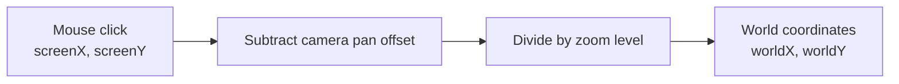
```mermaid
graph LR
    A["Mouse click<br/>screenX, screenY"] --> B["Subtract camera pan offset"]
    B --> C["Divide by zoom level"]
    C --> D["World coordinates<br/>worldX, worldY"]
```

Formula (this is genuinely worth memorizing for the interview):
```
worldX = (screenX - panX) / zoom
worldY = (screenY - panY) / zoom
```

Every shape you ever create is stored in **world coordinates** — not screen coordinates. That's what makes "infinite canvas" possible: shapes just exist at some (x,y) in an unbounded world; the camera decides what slice of that world is currently visible.

## Level 3: The actual state — where placed shapes live

Now the data model, kept dead simple for now — just a flat list:

```js
let shapes = [
  { id: 's1', type: 'rect', x: 100, y: 200, w: 150, h: 80, color: 'blue' },
  { id: 's2', type: 'circle', x: 400, y: 150, r: 40, color: 'red' },
];
```

That's it. That array **is** your canvas document. Everything else (rendering, saving, undo, collaboration) is operations on this array.

## Level 4: The full pipeline — what happens when a user draws a rectangle

Here's the entire journey from mouse-down to pixels-on-screen:

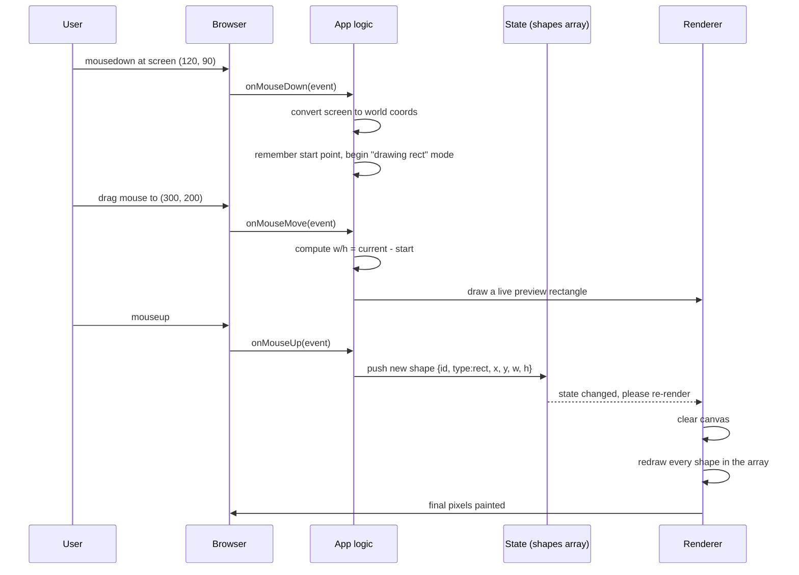
```mermaid
sequenceDiagram
    participant U as User
    participant B as Browser
    participant App as App logic
    participant S as State (shapes array)
    participant R as Renderer

    U->>B: mousedown at screen (120, 90)
    B->>App: onMouseDown(event)
    App->>App: convert screen to world coords
    App->>App: remember start point, begin "drawing rect" mode

    U->>B: drag mouse to (300, 200)
    B->>App: onMouseMove(event)
    App->>App: compute w/h = current - start
    App->>R: draw a live preview rectangle

    U->>B: mouseup
    B->>App: onMouseUp(event)
    App->>S: push new shape {id, type:rect, x, y, w, h}
    S-->>R: state changed, please re-render
    R->>R: clear canvas
    R->>R: redraw every shape in the array
    R->>B: final pixels painted
```

Notice: nothing here is Figma-specific or complicated. This is literally how MS Paint-style rectangle drawing works in any canvas app ever built.

## Level 5: The render loop itself

Every time the state changes (a shape added, moved, resized — for any reason, including later when it's a *remote* user's edit), you do the same 3 steps:

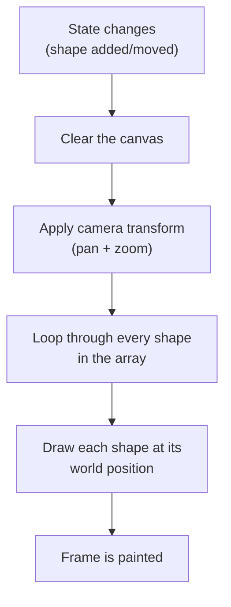
```mermaid
graph TD
    A["State changes<br/>(shape added/moved)"] --> B["Clear the canvas"]
    B --> C["Apply camera transform<br/>(pan + zoom)"]
    C --> D["Loop through every shape<br/>in the array"]
    D --> E["Draw each shape at its<br/>world position"]
    E --> F["Frame is painted"]
```

In code, this looks like:

```js
function render() {
  ctx.clearRect(0, 0, canvas.width, canvas.height);
  ctx.save();
  ctx.translate(panX, panY);
  ctx.scale(zoom, zoom);
  for (const shape of shapes) {
    if (shape.type === 'rect') ctx.fillRect(shape.x, shape.y, shape.w, shape.h);
    if (shape.type === 'circle') { /* draw circle at shape.x, shape.y, shape.r */ }
  }
  ctx.restore();
}
```

Call `render()` any time `shapes` changes. That's the entire rendering model — brutally simple at its core.

## Level 6: How does clicking *select* an existing shape?

This is "hit testing," and it's the mirror image of drawing:

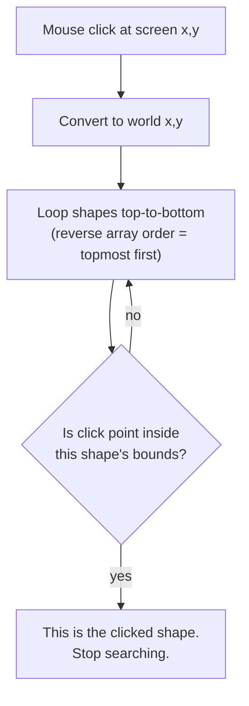
```mermaid
graph TD
    A["Mouse click at screen x,y"] --> B["Convert to world x,y"]
    B --> C["Loop shapes top-to-bottom<br/>(reverse array order = topmost first)"]
    C --> D{"Is click point inside<br/>this shape's bounds?"}
    D -- yes --> E["This is the clicked shape.<br/>Stop searching."]
    D -- no --> C
```

For a rectangle: `worldX >= shape.x && worldX <= shape.x + shape.w && worldY >= shape.y && worldY <= shape.y + shape.h`. You check shapes in reverse order because the *last* drawn shape is visually on top.

## Level 7 (the seed of what's coming): why a flat array eventually isn't enough

Two problems will surface naturally once you sit with the array model:
- If you group shapes (say, into a "Frame"), moving the frame means manually updating every child's x/y — messy.
- Layering/z-order is just "array order," which gets awkward once you have grouping and re-ordering UI.

That's the actual reason tools evolve from "flat array" → "tree with parent-child relationships" (what I called a scene graph last time). But now you've seen *why* it's needed, not just been told it exists.

---

Does this land now? Specifically, are you clear on:
1. The canvas element has no memory — your app's own array is the real document
2. Shapes are stored in **world coordinates**, and a camera transform converts to/from screen coordinates
3. Every change → clear → redraw is the entire rendering model

Once this feels solid, tell me and we'll move to Chapter 2: what happens when a second person opens the same document.

---

Good instinct to slow down here — this is one of those concepts that's simple once it clicks, but confusing if rushed. Let's build it from scratch with a very concrete mental picture.

## Why do we even need two coordinate systems?

Think of it like looking at a huge world map through a small window (your monitor). The map itself is enormous and fixed — every city has one true location on it. But your window only shows a small rectangular slice of that map at any moment, and you can slide the window around (pan) or use a magnifying glass over it (zoom).

- **World coordinates** = the fixed, "true" position of a city on the map. Never changes just because you moved your window.
- **Screen coordinates** = where that city currently appears inside your window. Changes constantly as you slide/zoom the window.

In our canvas app: **shapes are cities, the browser window is your window.** A shape's `x, y` never changes just because the user panned or zoomed — only what pixel it *appears at* changes.

Here's the picture as ASCII — an infinite world, with a small viewport (your browser window) looking at one piece of it:

```
World space (infinite, shapes live here — fixed positions)

  (0,0)
    +---------------------------------------------------------------+
    |                                                                |
    |          ┌───────────────────────┐                            |
    |          │  VIEWPORT (what user   │      ▢ Shape B             |
    |          │  actually sees on      │        world (900,150)     |
    |          │  their screen)         │                            |
    |    ▢ Shape A                      │                            |
    |     world (250,220)               │                            |
    |          └───────────────────────┘                             |
    |                                                                |
    +---------------------------------------------------------------+
```

Shape A is *inside* the viewport right now, so the user sees it. Shape B is outside the current viewport — it still exists at world (900,150), the user just can't see it until they pan right.

## The camera: just two numbers (plus zoom)

The "window" is defined by a tiny camera object:

```js
let camera = { panX: 0, panY: 0, zoom: 1 };
```

- `panX, panY` = how far the world has been shifted relative to the screen (think: "how far have I scrolled the map")
- `zoom` = magnification factor (1 = normal, 2 = things look twice as big, 0.5 = zoomed out)

## The two formulas (memorize these — they come up constantly in interviews)

```
screenX = worldX * zoom + panX        // world → screen (used for RENDERING)
worldX  = (screenX - panX) / zoom     // screen → world (used for INPUT, e.g. clicks)
```

Same for Y. You use the **first** formula when drawing shapes (you know their world position, you need to know where to paint pixels). You use the **second** formula when handling a mouse click (you know the screen pixel clicked, you need to know which world position — and therefore which shape — that corresponds to).

### Worked example — panning

Say `zoom = 1`, `panX = 0`. A shape sits at world `x = 200`.
`screenX = 200*1 + 0 = 200` → it's drawn at screen pixel 200. Makes sense, nothing has moved yet.

Now the user drags the canvas 100px to the right (like dragging a piece of paper). We just do:

```js
camera.panX += mouseDeltaX; // deltaX = 100
```

Now `panX = 100`. Re-render: `screenX = 200*1 + 100 = 300`. The shape visually slid right by 100px — but notice **we never touched the shape's actual `x: 200`**. We only changed the camera. This is the whole trick: panning is cheap because you're not rewriting every shape's coordinates, just one camera offset that affects rendering.

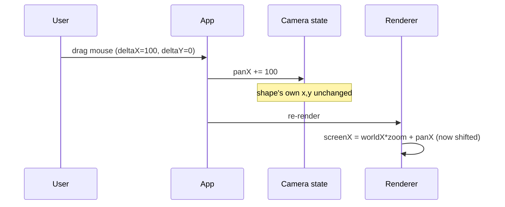
```mermaid
sequenceDiagram
    participant U as User
    participant App as App
    participant Cam as Camera state
    participant R as Renderer

    U->>App: drag mouse (deltaX=100, deltaY=0)
    App->>Cam: panX += 100
    Note over Cam: shape's own x,y unchanged
    App->>R: re-render
    R->>R: screenX = worldX*zoom + panX (now shifted)
```

## Zoom — the part that actually trips people up

Naively, you might think "zoom just means multiply everything by a bigger number." Let's see why that alone gives a bad user experience.

Say a shape is at world `x=200`, `zoom=1`, `panX=0` → drawn at screen 200. User scrolls to zoom in, you set `zoom=2`. Recompute: `screenX = 200*2 + 0 = 400`. The shape just jumped from screen pixel 200 to 400 — **even if the user's mouse cursor was sitting right on top of it at pixel 200.** The content appears to fly away from wherever they were pointing. This is the classic "zoom feels janky" bug.

**What good apps (Figma, Google Maps) actually do: zoom toward the cursor.** The world point currently under the mouse should stay under the mouse after zooming — everything else zooms around that anchor.

Here's it visually — the point under the cursor (marked X) stays fixed, everything else scales around it:

```
BEFORE zoom (zoom=1)                 AFTER zoom (zoom=2, anchored at X)

  ┌─────────────────────┐             ┌─────────────────────┐
  │                      │             │      ▢ shape A       │
  │   ▢ shape A          │             │        (bigger,      │
  │                      │             │         closer to X) │
  │        X  <-cursor   │   ──zoom──> │        X  <-cursor   │
  │                      │             │      (unchanged!)    │
  │            ▢ shape B │             │  ▢ shape B           │
  │                      │             │  (bigger, moved      │
  └─────────────────────┘             │   away from X)       │
                                       └─────────────────────┘
```

Notice: shape A got closer to X, shape B moved away from X — everything scaled *relative to the cursor point*, not relative to the corner of the screen.

### The math for zoom-to-cursor

The trick: figure out what world point is currently under the cursor, change the zoom, then **solve for the new pan** so that same world point still lands on the same screen pixel.

```js
function zoomAtCursor(screenX, screenY, newZoom) {
  // 1. What world point is currently under the cursor?
  const worldX = (screenX - camera.panX) / camera.zoom;
  const worldY = (screenY - camera.panY) / camera.zoom;

  // 2. Update the zoom level
  camera.zoom = newZoom;

  // 3. Recompute pan so that worldX,worldY still maps to screenX,screenY
  camera.panX = screenX - worldX * camera.zoom;
  camera.panY = screenY - worldY * camera.zoom;
}
```

That third step is just algebra on the same formula from before (`screenX = worldX*zoom + panX`, solved for `panX`).

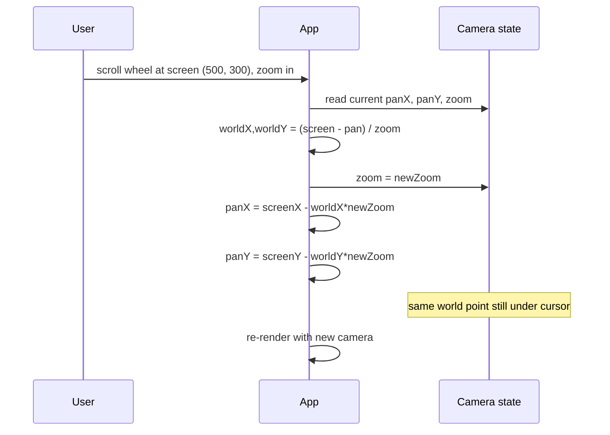
```mermaid
sequenceDiagram
    participant U as User
    participant App as App
    participant Cam as Camera state

    U->>App: scroll wheel at screen (500, 300), zoom in
    App->>Cam: read current panX, panY, zoom
    App->>App: worldX,worldY = (screen - pan) / zoom
    App->>Cam: zoom = newZoom
    App->>App: panX = screenX - worldX*newZoom
    App->>App: panY = screenY - worldY*newZoom
    Note over Cam: same world point still under cursor
    App->>App: re-render with new camera
```

## Putting it together: rendering with pan + zoom

Every single render, for every shape, you apply the same transform:

```js
function render() {
  ctx.clearRect(0, 0, canvasWidth, canvasHeight);
  for (const shape of shapes) {
    const screenX = shape.x * camera.zoom + camera.panX;
    const screenY = shape.y * camera.zoom + camera.panY;
    const screenW = shape.w * camera.zoom;   // size also scales!
    const screenH = shape.h * camera.zoom;
    ctx.fillRect(screenX, screenY, screenW, screenH);
  }
}
```

Notice width/height also get multiplied by zoom — otherwise shapes would move correctly but stay the same size, which looks broken.

## The one-sentence summary to remember for interviews

> **Shapes never move in memory when you pan or zoom — only two numbers (pan, zoom) change, and every render recomputes screen pixels from world coordinates using them.** This is what makes an "infinite canvas" possible — the world has no boundaries, you're just deciding which small window into it to render each frame.

---

Does the pan/zoom mechanic feel solid now — especially *why* zoom needs that extra pan-recalculation step? Once you're comfortable here, we can go back to finishing the single-player foundation (scene graph / grouping) or jump straight to Chapter 2 (multiplayer) — your call.

---

Almost — but let's fix one important detail: the **browser doesn't maintain the camera at all.** That's a common misconception worth killing now, because it clarifies a lot about how much of this stuff is "on you" as the app developer.

## What the browser actually gives you (nothing more, nothing less)

The browser gives you two things only:
1. **Raw input events** — mouse position, scroll wheel delta, touch positions — always in **screen pixels**, relative to your browser window. It has zero concept of "world," "pan," or "zoom."
2. **Pixel-painting APIs** — `ctx.fillRect(x, y, w, h)` etc. — which just paint pixels wherever you tell them to. The browser doesn't remember what you drew, and it has no idea those pixels represent a "shape" living at some zoomed/panned position.

Everything in between — the camera object, the math, deciding when to re-render — is 100% your app's own JavaScript state and logic. `let camera = { panX: 0, panY: 0, zoom: 1 }` is just a plain object sitting in your app's memory, same as the `shapes` array. The browser has no idea it exists.

Here's the division of responsibility:

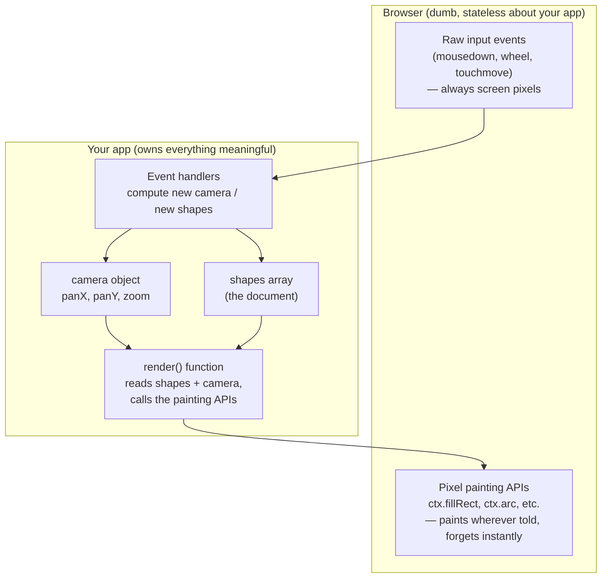
```mermaid
graph TD
    subgraph Browser["Browser (dumb, stateless about your app)"]
        A["Raw input events<br/>(mousedown, wheel, touchmove)<br/>— always screen pixels"]
        B["Pixel painting APIs<br/>ctx.fillRect, ctx.arc, etc.<br/>— paints wherever told, forgets instantly"]
    end

    subgraph App["Your app (owns everything meaningful)"]
        C["shapes array<br/>(the document)"]
        D["camera object<br/>panX, panY, zoom"]
        E["Event handlers<br/>compute new camera / new shapes"]
        F["render() function<br/>reads shapes + camera,<br/>calls the painting APIs"]
    end

    A --> E
    E --> D
    E --> C
    D --> F
    C --> F
    F --> B
```

## So, to directly answer your question — yes, exactly right:

- **Camera state**: your app creates it, owns it, updates it. Just a JS object.
- **Zoom-at-cursor math**: your app's event handler does this, every time a wheel/pinch event fires.
- **Rendering**: your app's `render()` function is the *only* thing that reads `camera` + `shapes` and turns them into pixels. The browser just executes the paint calls it's given — it never "knows" about pan or zoom conceptually.

One more thing worth internalizing: **the browser fires input events continuously and independently of rendering.** It's your app's job to decide "okay, something changed, let me call `render()` again." A typical pattern:

```js
canvas.addEventListener('wheel', (e) => {
  zoomAtCursor(e.clientX, e.clientY, camera.zoom * (e.deltaY < 0 ? 1.1 : 0.9));
  render(); // you explicitly trigger a repaint
});

canvas.addEventListener('mousemove', (e) => {
  if (isPanning) {
    camera.panX += e.movementX;
    camera.panY += e.movementY;
    render(); // again, you trigger it
  }
});
```

If you forget to call `render()` after changing the camera, the screen just... won't update, even though your state changed correctly. This "state changed → must manually trigger a repaint" pattern is exactly the seed that later grows into React-style declarative rendering and, eventually, the "state changed remotely → must re-render" logic that multiplayer sync depends on.

---

Solid on this distinction — browser is dumb/stateless, your app owns all the meaningful state and math? If yes, want to continue with the single-player foundation (finishing the data model / grouping), or are you ready to jump to Chapter 2: multiplayer?

---

Great question — let's trace exactly where these numbers come from, because they come from two very different places.

## Cursor x,y — the browser hands you this directly, for free

Every mouse event the browser fires carries the cursor's position **automatically** — you don't calculate it, you don't track it yourself. It's baked into the event object.

```js
canvas.addEventListener('mousemove', (event) => {
  console.log(event.clientX, event.clientY); // browser already computed these
});
```

- `event.clientX` / `event.clientY` = cursor position in pixels, measured from the **top-left of the browser viewport** (the visible window area).
- The browser's OS-level mouse driver tracks the physical cursor; the browser translates that into "pixels from top-left of this window" and stuffs it into every mouse event it fires. This happens whether or not your JS code does anything with it.

One subtlety: `clientX/clientY` are relative to the *whole browser window*, not your `<canvas>` element specifically. If your canvas doesn't start at the window's top-left corner (e.g., there's a sidebar), you need to subtract the canvas's own offset:

```js
const rect = canvas.getBoundingClientRect(); // canvas's position on the page
const screenX = event.clientX - rect.left;
const screenY = event.clientY - rect.top;
```

*Now* `screenX, screenY` is truly "pixels from the top-left corner of the canvas" — this is the number you feed into the `worldX = (screenX - panX) / zoom` formula from before.

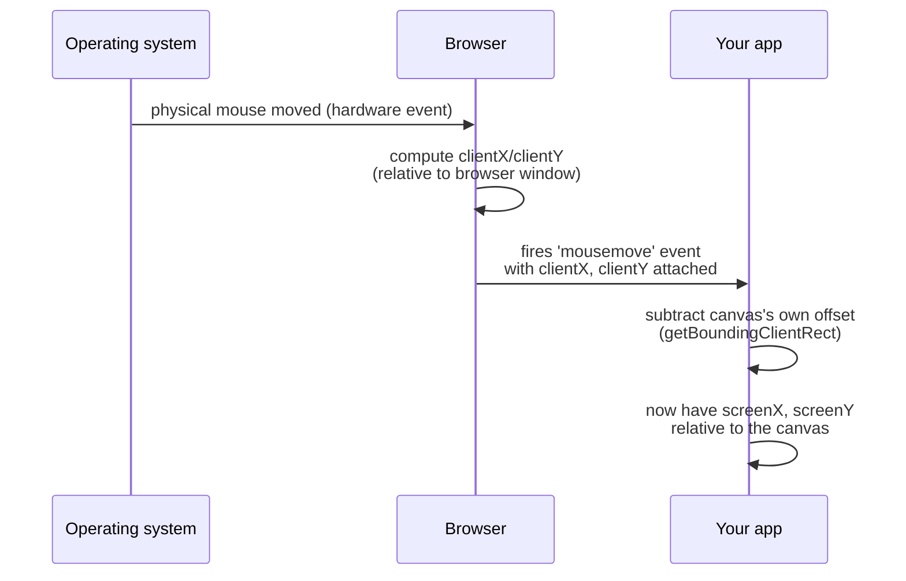
```mermaid
sequenceDiagram
    participant OS as Operating system
    participant Browser as Browser
    participant App as Your app

    OS->>Browser: physical mouse moved (hardware event)
    Browser->>Browser: compute clientX/clientY<br/>(relative to browser window)
    Browser->>App: fires 'mousemove' event<br/>with clientX, clientY attached
    App->>App: subtract canvas's own offset<br/>(getBoundingClientRect)
    App->>App: now have screenX, screenY<br/>relative to the canvas
```

So: **cursor position is given by the browser, per-event, automatically. You never store or "ask for" it independently — you just read it off whatever event just fired.**

## Zoom value — this one is 100% invented and owned by your app

This is the key difference. There is no "zoom" concept in the browser's mouse/wheel events in the sense of a magnification factor for your document. What the browser gives you on a scroll/pinch is just a **raw delta** — "the wheel moved by this much" — and it's *your app's decision* to interpret that as "increase zoom by 10%."

```js
canvas.addEventListener('wheel', (event) => {
  console.log(event.deltaY); // e.g. +100 (scrolled down) or -100 (scrolled up)
  // the browser has NO idea this should mean "zoom out" or "zoom in"
  // — that meaning is something your app assigns
});
```

Your app takes that raw `deltaY` number and decides what to do with it:

```js
canvas.addEventListener('wheel', (event) => {
  event.preventDefault(); // stop the browser's default page-scroll behavior
  const zoomFactor = event.deltaY < 0 ? 1.1 : 0.9; // your app's own rule
  const newZoom = camera.zoom * zoomFactor;
  zoomAtCursor(event.clientX, event.clientY, newZoom); // from before
  render();
});
```

`camera.zoom` itself started life as just `1` in your initial state (`let camera = { panX: 0, panY: 0, zoom: 1 }`) — a number **you** picked as the starting default. Every change to it afterward is purely your app's own arithmetic, done in response to raw browser events (wheel deltas, or trackpad pinch gestures, or a "+"/"-" button the user clicks in your UI). The browser never has an opinion about what "zoom level 2.3" means — that entire concept exists only inside your app's state.

## So, side by side:

| | Cursor position | Zoom level |
|---|---|---|
| Who computes it | Browser (OS → browser → event object) | Your app |
| Where it comes from | `event.clientX/clientY` on every mouse event | Starts as a default (`1`), changed by your own math in response to wheel/pinch/button events |
| Does the browser "remember" it | No — it's fresh on every event, you use it immediately or store it yourself | No — it lives entirely in your `camera` object, which is just a plain JS variable |

The one-line mental model: **the browser only ever tells you "something physical just happened, here's where" — it never tells you anything about your document's zoom, pan, or shapes, because it doesn't know those concepts exist.** Your app is the only thing that assigns meaning to raw input.

---

Clear now? If so, want to lock in the single-player side by finishing grouping/scene-graph, or jump to Chapter 2 (multiplayer)?

---

Good, let's slow down and rebuild this from the flat array you already understand well — because grouping is actually the *same trick* as pan/zoom, just applied one level deeper. That connection will make it click.

## Step 1: Start from where you're already solid

You know this data model cold now:

```js
let shapes = [
  { id: 's1', type: 'rect', x: 100, y: 200, w: 150, h: 80 },
  { id: 's2', type: 'circle', x: 400, y: 150, r: 40 },
];
```

Now the user selects both shapes (say, a rectangle representing a button, and a circle representing an icon on it) and hits "Group." What should happen?

## Step 2: What the user *expects*, concretely

They now want to treat these two shapes as **one thing**. If they drag the group 50px right, both shapes should move together, keeping their relative positions. If they resize the group, both should scale together. If they click on the icon, it should say "you selected part of the Button group."

Let's see what breaks if we try to do this with the flat array as-is.

## Step 3: The naive (broken) approach — just move both manually

```js
function moveGroup(shapeIds, dx, dy) {
  for (const shape of shapes) {
    if (shapeIds.includes(shape.id)) {
      shape.x += dx;
      shape.y += dy;
    }
  }
}
```

This actually *works* for a simple move! But it starts falling apart fast:
- **Resize**: if the group is scaled 2x, you now need to recompute every child's x, y, w, h relative to the group's origin — manually, with math, every single time.
- **Rotate**: rotating a group means rotating each child around the *group's* center, not their own — this math gets genuinely ugly per-shape.
- **Nested groups** (a group inside a group inside a frame): every operation now has to walk through however many levels deep and apply cumulative math each time.
- There's also no persistent notion of "these belong together" — if you deselect, that information is just... gone, unless you separately store `groupId` somewhere.

The pattern you keep hitting: **every group operation forces you to reach in and recompute every child's absolute position by hand.**

## Step 4: The fix — this is exactly the camera trick, one level deeper

Remember: pan/zoom worked because shapes never moved — only the *camera* changed, and rendering did `screenX = worldX * zoom + panX`. 

Do the exact same thing for groups: give the **group itself** a position/transform, and make children's coordinates **relative to their parent**, not relative to the whole world.

```js
// A tree, not a flat array
let scene = {
  id: 'page',
  type: 'page',
  children: [
    {
      id: 'group1',
      type: 'group',
      x: 100, y: 150,      // group's position in world/page coords
      children: [
        { id: 's1', type: 'rect', x: 0, y: 0, w: 150, h: 80 },     // relative to group1!
        { id: 's2', type: 'circle', x: 200, y: 20, r: 40 },        // relative to group1!
      ]
    }
  ]
};
```

Notice: `s1`'s `x: 0, y: 0` doesn't mean "top-left of the page" anymore — it means "top-left of `group1`." Just like a shape's world x didn't care about pan/zoom, a child's local x doesn't care about where its parent group sits.

## Step 5: Now watch how "move the group" becomes trivial

```js
function moveGroup(group, dx, dy) {
  group.x += dx;
  group.y += dy;
  // that's it. Don't touch children at all.
}
```

One line. Both children visually move together automatically, because when we render, we compute each child's *actual screen position* by combining parent + child — exactly like we combined camera + shape before.

## Step 6: Rendering a tree — coordinates "add up" as you go down

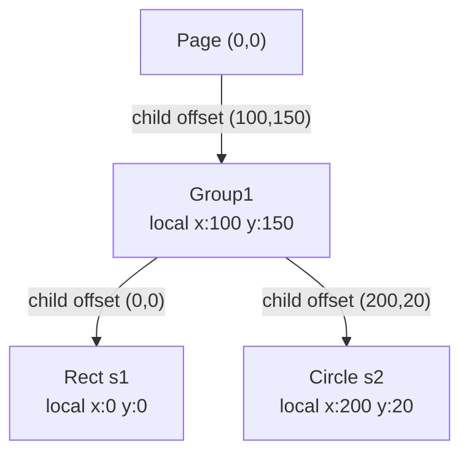
```mermaid
graph TD
    A["Page (0,0)"] -->|"child offset (100,150)"| B["Group1<br/>local x:100 y:150"]
    B -->|"child offset (0,0)"| C["Rect s1<br/>local x:0 y:0"]
    B -->|"child offset (200,20)"| D["Circle s2<br/>local x:200 y:20"]
```

To find where `s1` *actually* is in world space, you walk from the root down, **adding up offsets at each level**:

```
s1's world position = Page's offset + Group1's offset + s1's own offset
                     = (0,0) + (100,150) + (0,0)
                     = (100, 150)

s2's world position = (0,0) + (100,150) + (200,20)
                     = (300, 170)
```

In code, this is a simple recursive walk:

```js
function getWorldPosition(node, parentWorldX = 0, parentWorldY = 0) {
  const worldX = parentWorldX + node.x;
  const worldY = parentWorldY + node.y;
  return { worldX, worldY };
}

function render(node, parentWorldX = 0, parentWorldY = 0) {
  const { worldX, worldY } = getWorldPosition(node, parentWorldX, parentWorldY);
  if (node.type === 'rect') ctx.fillRect(worldX, worldY, node.w, node.h);
  if (node.type === 'circle') { /* draw at worldX, worldY, node.r */ }
  for (const child of node.children || []) {
    render(child, worldX, worldY); // pass this node's world pos down as the new "parent offset"
  }
}
```

This is the **exact same accumulation pattern** as `screenX = worldX * zoom + panX` — just chained across multiple levels instead of one camera. Each level says "here's my position, now interpret my children relative to me."

## Step 7: Why this fixes resize/rotate too

If instead of just `x, y` you give each node a full little transform (`x, y, scale, rotation`), then resizing or rotating a group means changing **only the group node's transform** — every child inherits the change automatically when you walk the tree, because their position is always computed as "parent's transform applied, then mine applied on top." You never manually touch children.

## Step 8: What "grouping" actually does, as an operation

Grouping two existing top-level shapes is just a **reparenting** operation:

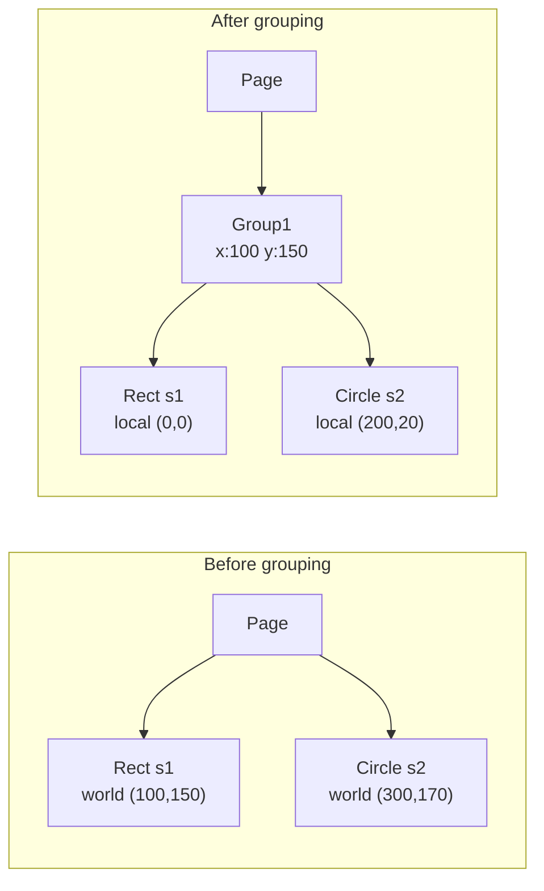
```mermaid
graph LR
    subgraph Before["Before grouping"]
    P1["Page"] --> S1a["Rect s1<br/>world (100,150)"]
    P1 --> S2a["Circle s2<br/>world (300,170)"]
    end

    subgraph After["After grouping"]
    P2["Page"] --> G["Group1<br/>x:100 y:150"]
    G --> S1b["Rect s1<br/>local (0,0)"]
    G --> S2b["Circle s2<br/>local (200,20)"]
    end
```

The code: create a new group node positioned at the *bounding box top-left* of the selected shapes, then rewrite each selected shape's `x,y` to be relative to that new group (`newLocalX = oldWorldX - group.x`), and move them from being Page's children to being Group1's children. Visually **nothing moves on screen** — you've just re-expressed the same world positions using a new parent as the reference point.

---

Does the "coordinates accumulate as you walk down the tree, exactly like camera pan/zoom accumulated for the world" framing land now? Try this check: if `Group1` is at `x:100,y:150` and it's itself inside another group `Group0` at `x:50,y:50`, what's `s1`'s final world position? (Just want to see if the recursive-sum idea clicked before we move to Chapter 2: multiplayer.)

---

Quick answer to lock in the check: `Group0 (50,50) + Group1 (100,150) + s1 (0,0)` → world position **(150, 200)**. Each level adds its offset to the running total as you walk down. If that matches your intuition, the tree model is solid — let's move on.

## Chapter 2: The Naive Multiplayer Approach

### The story

Imagine you're on the team that just finished the single-player canvas from Chapter 1. It works great. Now the CEO says: "Two designers should be able to edit the same file at the same time, like Google Docs." You have a deadline. What's the fastest possible thing you could ship?

Someone on the team says: *"We already have a function that turns our entire state into JSON and renders it. What if — whenever anything changes — we just send the whole document to a server, and the server blasts it out to everyone else? They just replace their local copy and re-render."*

It sounds almost too simple to be wrong. Let's build it.

### How "send the whole state" works

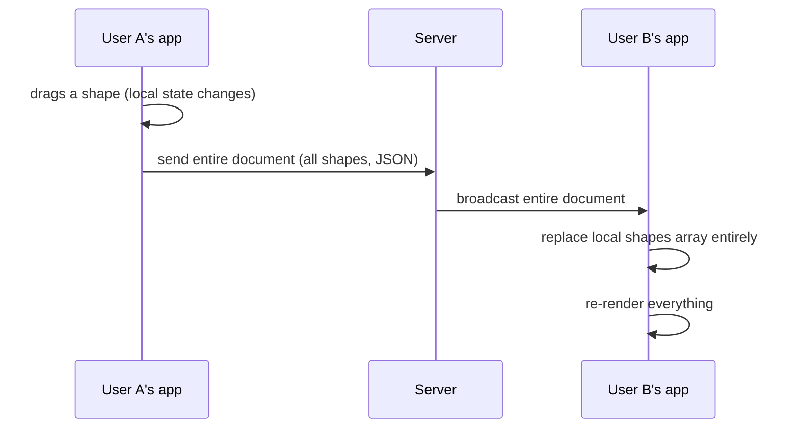
```mermaid
sequenceDiagram
    participant A as User A's app
    participant Srv as Server
    participant B as User B's app

    A->>A: drags a shape (local state changes)
    A->>Srv: send entire document (all shapes, JSON)
    Srv->>B: broadcast entire document
    B->>B: replace local shapes array entirely
    B->>B: re-render everything
```

The server here is doing almost nothing clever — it's just a message relay. Every connected client sends its full document on every change; the server forwards it to everyone else in the same "room" (document).

```
        ┌──────────┐
        │  Server  │   just relays whatever it receives
        └────┬─────┘
      ┌───────┼────────┐
      │       │        │
  ┌───▼──┐ ┌──▼───┐ ┌──▼───┐
  │ User │ │ User │ │ User │
  │  A   │ │  B   │ │  C   │
  └──────┘ └──────┘ └──────┘
```

This genuinely works for a demo. Two people, a handful of shapes, low latency — it looks like magic. This is usually the point where the team ships it and celebrates. Then real usage starts, and three separate problems show up, each teaching a real lesson.

### Problem 1 — Bandwidth explodes as the document grows

A real design file isn't 2 shapes — it can have thousands of nodes, each with dozens of properties (fills, strokes, text content, effects). If a user nudges one rectangle by 1 pixel, "send the whole document" means re-transmitting the *entire file* — possibly megabytes — for a change that touched four numbers.

```
Change: shape.x: 100 → 101   (one number changed)

Naive approach sends:  [entire 3.2 MB document] ──────► server ──────► everyone
What actually changed: { "s1.x": 101 }                (a few bytes)
```

At scale (many users, frequent tiny edits like live dragging, which fires dozens of times per second), this becomes untenable — you're saturating the network with data that's 99.99% unchanged.

### Problem 2 — Race conditions: the "last write wins" trap

This is the more dangerous problem, and it's the seed of everything in Chapter 3-4. Picture this timeline:

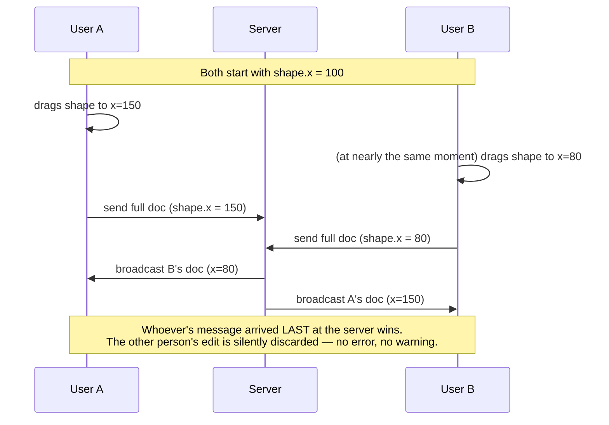
```mermaid
sequenceDiagram
    participant A as User A
    participant Srv as Server
    participant B as User B

    Note over A,B: Both start with shape.x = 100

    A->>A: drags shape to x=150
    B->>B: (at nearly the same moment) drags shape to x=80

    A->>Srv: send full doc (shape.x = 150)
    B->>Srv: send full doc (shape.x = 80)

    Srv->>A: broadcast B's doc (x=80)
    Srv->>B: broadcast A's doc (x=150)

    Note over A,B: Whoever's message arrived LAST at the server wins.<br/>The other person's edit is silently discarded — no error, no warning.
```

Neither user did anything wrong. Both were editing at a reasonable moment. But because the whole document is treated as one indivisible blob, whichever full-document snapshot arrives at the server *last* completely overwrites the other — even the parts B never touched. If A had also added a brand-new shape "s99" in their local state, and B's message arrives after and overwrites the whole doc, **A's new shape can vanish entirely**, even though B never intended to delete it — B just didn't know it existed yet.

This is the core flaw: **treating the whole document as one atomic value means concurrent edits can't be merged — one must fully clobber the other.**

### Problem 3 — Flicker and jank during live dragging

While a user is dragging a shape, you're firing "send full document" potentially 60 times per second (on every `mousemove`). Every other client is replacing its *entire* local state 60 times a second — that's expensive rendering work, plus the network can't keep up, so messages arrive out of order, causing shapes to visibly jitter backward and forward as stale full-snapshots arrive after newer ones.

### Where this leaves the team

The naive approach exposed three real requirements the design didn't account for:
1. We should only send **what changed**, not the whole document (fixes bandwidth)
2. We need a way to **merge concurrent changes** instead of blindly overwriting (fixes the race condition)
3. Messages need some notion of **ordering/versioning** so stale updates don't clobber newer ones (fixes jank)

That naturally leads to the next evolution: instead of syncing *state*, sync *operations* — small, precise descriptions of what changed ("move shape s1 to x=150") instead of the entire document. That's Chapter 3, and it's where the real interesting design work (and eventually CRDTs) comes from.

---

Does the naive approach and *why* it breaks make sense — especially the race-condition example? Once that's solid, we'll move to Chapter 3: operations/deltas instead of full state, and the new problem that creates (ordering conflicts).

---

## Chapter 3: Sending Operations Instead of State

### The story

The team regroups after the naive approach falls apart. Someone says: *"Why are we sending the whole document? We know exactly what changed — the user dragged shape s1 to a new x,y. Let's just send that fact."*

This is a genuinely good idea, and it's how essentially every real collaborative tool works at its foundation. Instead of syncing **state** (the document), you sync **operations** (descriptions of changes). This concept is usually called an "op" or a "patch."

### What an operation looks like

Instead of shipping the whole `shapes` array, you ship small, precise messages:

```json
{ "op": "update", "shapeId": "s1", "props": { "x": 150, "y": 200 } }
{ "op": "create", "shapeId": "s99", "shape": { "type": "rect", "x": 10, "y": 10, "w": 50, "h": 50 } }
{ "op": "delete", "shapeId": "s2" }
```

Each client keeps applying these operations to its **own local copy** of the document — it never needs the full document retransmitted, because it's incrementally building it up from the same sequence of edits everyone else is also seeing.

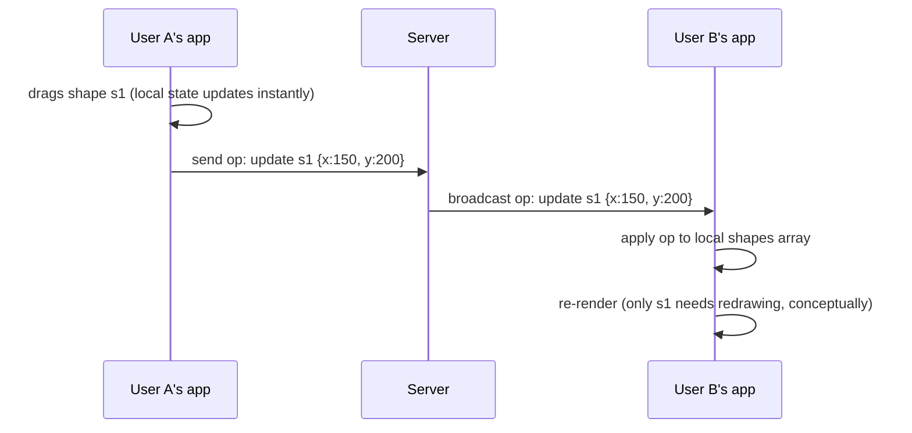
```mermaid
sequenceDiagram
    participant A as User A's app
    participant Srv as Server
    participant B as User B's app

    A->>A: drags shape s1 (local state updates instantly)
    A->>Srv: send op: update s1 {x:150, y:200}
    Srv->>B: broadcast op: update s1 {x:150, y:200}
    B->>B: apply op to local shapes array
    B->>B: re-render (only s1 needs redrawing, conceptually)
```

This immediately fixes Problem 1 from Chapter 2 (bandwidth) — a drag now sends "update s1: x=150,y=200" (maybe 40 bytes) instead of the entire document (megabytes).

### Bonus fix that falls out for free: instant local feedback ("optimistic updates")

Notice in the diagram: User A updates their **own** local state immediately, before even waiting for the server to acknowledge anything. This is called an **optimistic update** — you assume your own edit will succeed, and apply it instantly for a snappy UI. If the server later rejects it (rare, but possible), you'd need to roll it back — but for now, assume it just works. This is why dragging a shape in Figma feels instant even though a network round-trip is happening in the background.

### Now the real problem: operations still collide

Sending deltas fixed bandwidth, but it did **not** fix the race condition from Chapter 2 — it just moved it to a smaller, subtler place. Watch this:

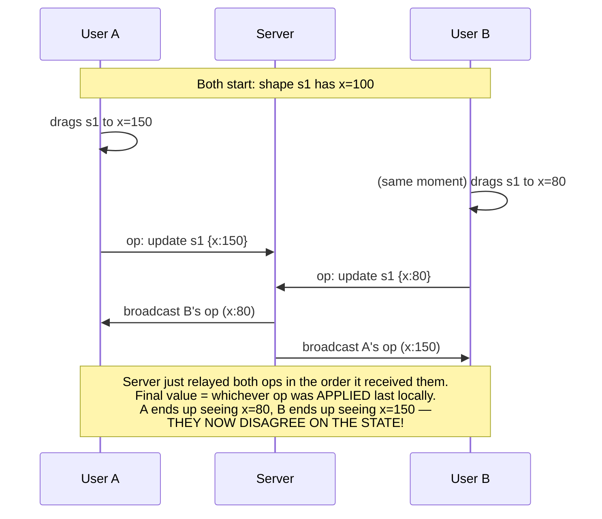
```mermaid
sequenceDiagram
    participant A as User A
    participant Srv as Server
    participant B as User B

    Note over A,B: Both start: shape s1 has x=100

    A->>A: drags s1 to x=150
    B->>B: (same moment) drags s1 to x=80

    A->>Srv: op: update s1 {x:150}
    B->>Srv: op: update s1 {x:80}

    Srv->>A: broadcast B's op (x:80)
    Srv->>B: broadcast A's op (x:150)

    Note over A,B: Server just relayed both ops in the order it received them.<br/>Final value = whichever op was APPLIED last locally.<br/>A ends up seeing x=80, B ends up seeing x=150 — <br/>THEY NOW DISAGREE ON THE STATE!
```

This is worse than it sounds. In the full-document approach, at least *everyone eventually agreed* on one final state (whoever's snapshot arrived last at the server, globally). But with naive op-broadcasting, if the server doesn't enforce a strict global order — or if network delivery timing differs per client — **different users can end up with genuinely different final values for the same property**, because each client is just applying ops as it receives them, in whatever order they arrive locally.

This is called a **divergence problem** — the whole point of "collaborative editing" is that everyone converges to the same state eventually, and naive op-relaying doesn't guarantee that.

### A second, sneakier problem: operations that reference stale context

Some operations are relative rather than absolute, and this makes things worse. Imagine an operation like "increase width by 10" instead of "set width to 60":

```
Start: shape s1 width = 50

User A: "increase width by 10"   → based on width=50, expects result 60
User B: "increase width by 20"   → based on width=50, expects result 70

If both ops apply: final width could be 50+10+20 = 80 (both applied)
                    or 60 (only A's applied)
                    or 70 (only B's applied)
depending on order and whether the server/clients dedupe — 
nobody agreed in advance what "correct" means here.
```

Real design tools actually avoid this specific trap by making most operations **absolute** ("set x to 150") rather than **relative** ("add 10 to x") specifically because absolute ops are easier to reason about — but even absolute ops don't solve the *ordering* divergence problem from the diagram above, they just avoid compounding-math bugs.

### Where this leaves the team

Sending operations instead of full state was the right instinct — it's necessary but not sufficient. The team has now isolated the *real* hard problem in collaborative editing, which was hidden inside the naive approach the whole time:

**When two operations happen concurrently on the same piece of data, what determines the final state — and how do we guarantee every single client, regardless of network timing, arrives at the exact same answer?**

This exact question is what **Operational Transformation (OT)** and **CRDTs** were invented to answer — and they answer it in genuinely different ways, with different trade-offs. That's Chapter 4, and it's the meatiest, most interview-relevant part of this whole design.

---

Quick check before moving on: does it make sense *why* switching to operations fixed bandwidth but did **not** fix the concurrent-edit/ordering problem — that it just made the same fundamental problem smaller and more subtle instead of solving it? Once that's clear, we'll dive into Chapter 4: Operational Transformation vs CRDTs.

---

## Chapter 4: Solving Concurrent Edits — OT vs CRDTs

### The story

The team now understands the real problem precisely: when User A and User B edit the same thing at nearly the same time, every client needs to end up agreeing on the exact same final state — without waiting for a slow round-trip to some central authority every single time (that would kill the "feels instant" experience from optimistic updates).

Two very different schools of thought emerged in the industry to solve this. Google Docs pioneered one path in the mid-2000s. A newer generation of tools (including how many modern collaborative apps, and conceptually similar to what Figma uses) leans on the other. Let's build both from first principles so you see exactly why the industry largely migrated from the first to the second.

## Approach A: Operational Transformation (OT)

### The core idea

OT's philosophy: *"When two operations conflict, mathematically transform one of them so that, once both are applied — in either order — everyone ends up at the same result."*

This was invented for text editing first (Google Docs' original use case), so let's use text to build intuition, then bring it back to shapes.

### A concrete text example

Document starts as: `"cat"` (3 characters, positions 0,1,2)

- User A inserts `"big "` at position 0 → wants `"big cat"`
- User B (at the same moment, unaware of A's edit) inserts `"!"` at position 3 (the end) → wants `"cat!"`

If both operations were applied naively, in the order received, using **the original positions**, this is what could go wrong:

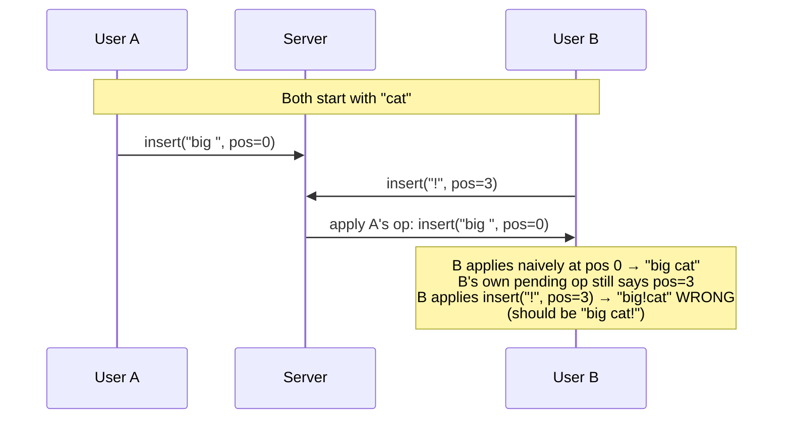
```mermaid
sequenceDiagram
    participant A as User A
    participant Srv as Server
    participant B as User B

    Note over A,B: Both start with "cat"

    A->>Srv: insert("big ", pos=0)
    B->>Srv: insert("!", pos=3)

    Srv->>B: apply A's op: insert("big ", pos=0)
    Note over B: B applies naively at pos 0 → "big cat"<br/>B's own pending op still says pos=3<br/>B applies insert("!", pos=3) → "big!cat" WRONG<br/>(should be "big cat!")
```

The `"!"` landed in the wrong place because position 3 meant "end of the string" when the document was `"cat"`, but after A's insert shifted everything, position 3 is now in the *middle* of `"big cat"`. **The operation's target position became stale the moment the document changed underneath it.**

### What OT actually does — transform the operation

OT's fix: before applying B's operation, **transform** it against A's operation that happened concurrently, adjusting B's position to account for what A already did.

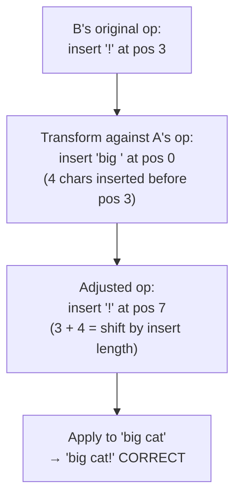
```mermaid
graph TD
    A["B's original op:<br/>insert '!' at pos 3"] --> B["Transform against A's op:<br/>insert 'big ' at pos 0<br/>(4 chars inserted before pos 3)"]
    B --> C["Adjusted op:<br/>insert '!' at pos 7<br/>(3 + 4 = shift by insert length)"]
    C --> D["Apply to 'big cat'<br/>→ 'big cat!' CORRECT"]
```

The transform function essentially says: "since A inserted 4 characters before position 3, B's position needs to shift by 4." This transform logic has to be written **for every possible pair of operation types** (insert-vs-insert, insert-vs-delete, delete-vs-delete, etc.) — and for a design tool, that means insert-shape-vs-move-shape, resize-vs-delete, group-vs-ungroup, and so on.

### Why OT is genuinely hard to implement correctly

This is the critical interview insight: **OT requires a central server to enforce a strict, agreed-upon order of operations**, and every client must transform every incoming operation against every operation it has locally pending but not yet acknowledged. The transform functions must satisfy a mathematical property (often called TP2) to guarantee convergence when operations are transformed in different orders — and getting this exactly right, for every pair of operation types in a complex app like a design tool (not just plain text), is notoriously difficult. Google's own engineers have written about how subtle and bug-prone OT implementations are in practice.

```
OT's requirements:
  ✗ needs a central server as the source of truth for ordering
  ✗ needs transform functions for every pair of op types (O(n²) complexity as op types grow)
  ✗ subtle bugs cause silent divergence that's very hard to detect/debug
  ✓ but: works well, is bandwidth-efficient, and is battle-tested (Google Docs)
```

## Approach B: CRDTs (Conflict-free Replicated Data Types)

### The core idea

CRDTs take a completely different philosophy: *"Instead of transforming operations to resolve conflicts after the fact, design your data structure so that conflicts are mathematically impossible to begin with — any two replicas that have seen the same set of operations, applied in ANY order, are GUARANTEED to converge to the same state."*

No central authority needed to enforce ordering. No transform functions. The data structure itself is built to be "commutative" (order doesn't matter) and "idempotent" (applying the same op twice doesn't break anything).

### How CRDTs achieve this — a simple concrete mechanism

For our canvas, the classic technique is: **give every property a unique timestamp/version, and use "highest timestamp wins" per-property** (not per-document, per-property — this is the crucial difference from Chapter 2's naive approach).

```json
// Each property change carries its own timestamp (or a "logical clock")
{ "shapeId": "s1", "prop": "x", "value": 150, "timestamp": "A@14:02:03.100" }
{ "shapeId": "s1", "prop": "x", "value": 80,  "timestamp": "B@14:02:03.095" }
```

Whichever timestamp is later wins for **that specific property**, deterministically, on every client — regardless of the order the two updates physically arrive over the network.

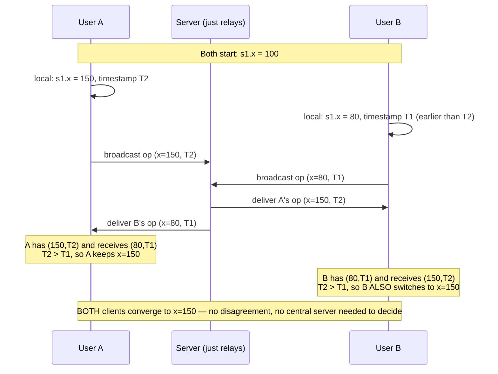
```mermaid
sequenceDiagram
    participant A as User A
    participant Srv as Server (just relays)
    participant B as User B

    Note over A,B: Both start: s1.x = 100

    A->>A: local: s1.x = 150, timestamp T2
    B->>B: local: s1.x = 80, timestamp T1 (earlier than T2)

    A->>Srv: broadcast op (x=150, T2)
    B->>Srv: broadcast op (x=80, T1)

    Srv->>B: deliver A's op (x=150, T2)
    Srv->>A: deliver B's op (x=80, T1)

    Note over A: A has (150,T2) and receives (80,T1)<br/>T2 > T1, so A keeps x=150
    Note over B: B has (80,T1) and receives (150,T2)<br/>T2 > T1, so B ALSO switches to x=150

    Note over A,B: BOTH clients converge to x=150 — no disagreement, no central server needed to decide
```

This is the fundamental guarantee: **whichever order the messages arrive in, both clients independently run the exact same deterministic comparison (compare timestamps) and land on the identical final answer.** No coordination step required, no transform math, no central authority.

### Why "per-property last-write-wins" beats Chapter 2's naive approach

Remember, in Chapter 2, "last write wins" was applied to the **whole document** — so one person's edits could wipe out unrelated changes another person made. Here, last-write-wins is applied **per individual property** — if A changed `s1.x` and B changed `s2.color` at the same time, these don't even compete; they're entirely separate properties on (possibly) separate objects, both survive untouched. Conflicts only actually occur when two people touch the **exact same property on the exact same object** at nearly the exact same instant — which is rare, and even then, the result is at least deterministic and consistent everywhere.

### The catch: what if both edits are meaningful and neither should be silently dropped?

Position/color are simple — one wins, one loses, nobody cares much because the difference (x=150 vs x=80) is a small nudge. But CRDTs get genuinely interesting for things like **text content inside a shape**, where you don't want "last write wins" (that would delete a colleague's typed sentence). For that, CRDT designs use structures like "sequence CRDTs" (e.g., RGA, or Figma's actual approach for text) where every character has a unique, permanent ID and a reference to "what character I come after" — so insertions from different users interleave correctly instead of overwriting each other. That's a deeper rabbit hole; the property-level "highest timestamp wins" model above already covers 90% of what you need to explain confidently for shape properties (position, size, color, rotation) in an interview.

### Side-by-side comparison — the interview-ready summary

| | Operational Transformation | CRDTs |
|---|---|---|
| Core idea | Transform ops against each other before applying | Design data so any order converges to the same result |
| Needs central server to order ops? | Yes — critical requirement | No — server can be a dumb relay |
| Complexity of implementation | High — transform functions per op-type pair | Moderate — mostly per-field metadata (timestamps/IDs) |
| Works offline / peer-to-peer? | Hard (needs server for canonical order) | Naturally yes — this is CRDTs' famous strength |
| Real-world examples | Google Docs (original architecture) | Figma (property-level LWW + custom structures), Automerge, Yjs |
| Main weakness | Bug-prone transform logic; hard to extend to new op types | Can be memory/bandwidth heavier (needs metadata per field); some ops (e.g. text) need more sophisticated CRDT structures |

### Why the industry trend has moved toward CRDTs for new tools

The practical reason most new collaborative tools (Figma included, based on their public engineering writing) lean toward CRDT-style approaches: **you don't need a smart, stateful, ordering-aware server** — the server can be a dumb pub-sub relay (cheap to scale horizontally, which matters a lot for Chapter 7 later), and clients can even work **peer-to-peer or offline** and merge later, since convergence is guaranteed by the data structure itself rather than by a central authority enforcing sequence.

---

This is genuinely the densest chapter so far. Before moving on, does the core distinction feel solid — **OT transforms operations relative to each other and needs a server to enforce order, while CRDTs make the data structure itself immune to ordering by using things like per-property timestamps**? Once that's clear, we'll move to Chapter 5: persistence & history — how undo/redo and saving-to-disk work on top of this operation-based model.

---

Good instinct to pin this down — "where does this data actually live" ties everything together and is a question interviewers love to drill into. Let's build it layer by layer.

## Level 1: The three places this data lives

Data isn't in one place — it exists in three separate stores that must all eventually agree:

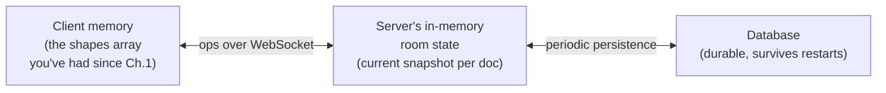
```mermaid
graph LR
    A["Client memory<br/>(the shapes array<br/>you've had since Ch.1)"] 
    B["Server's in-memory<br/>room state<br/>(current snapshot per doc)"]
    C["Database<br/>(durable, survives restarts)"]

    A <-->|"ops over WebSocket"| B
    B <-->|"periodic persistence"| C
```

- **Client memory**: exactly what you built in Chapter 1 — a local `shapes` array, updated optimistically the instant the user acts.
- **Server's in-memory state**: the server also keeps a live copy of the current document (per room/document), so it can answer "what's the current state" to a newly-joining client without hitting the database every time.
- **Database**: the durable copy — if the server crashes or restarts, this is what survives.

## Level 2: Two fundamentally different ways to store "the document"

This is a real architectural decision, and both are used in production systems.

**Option A — Snapshot storage**: store the current state of every shape directly, like a table of rows: `shape_id, x, y, w, h, color, last_modified_by, last_modified_at`. Simple to query, but you lose history — you can't easily answer "what did this look like 10 minutes ago" or "who changed this property last."

**Option B — Event log (event sourcing)**: store *every operation ever applied*, in order, and the "current state" is just the result of replaying all operations. This is what most serious collaborative tools actually do, because it gives you undo/history for free (this pays off directly in Chapter 5).

```
Event log table:
  op_id | doc_id | shape_id | prop  | value | timestamp      | client_id
  1     | doc_1  | s1       | x     | 100   | T1             | userA
  2     | doc_1  | s1       | x     | 150   | T2             | userA
  3     | doc_1  | s1       | x     | 80    | T1.5           | userB   <- arrived late, but T1.5 < T2

Current state (derived) = for each (shape_id, prop), take the row with the HIGHEST timestamp
  → s1.x = 150 (from op 2, since T2 > T1.5 > T1)
```

Notice: this table **is** the conflict resolution mechanism from Chapter 4, just written down as storage. "Highest timestamp wins per property" isn't just a network rule — it's literally how you'd write the SQL/query logic against this table.

Most real systems use a **hybrid**: keep the event log for history/undo, but also maintain a materialized "current snapshot" (Option A) that's kept up to date incrementally, so you don't have to replay the entire history just to render the current document. We'll build this hybrid concretely.

## Level 3: The full end-to-end request flow

Let's trace one edit through every layer — this is the flow an interviewer wants you to be able to draw from memory.

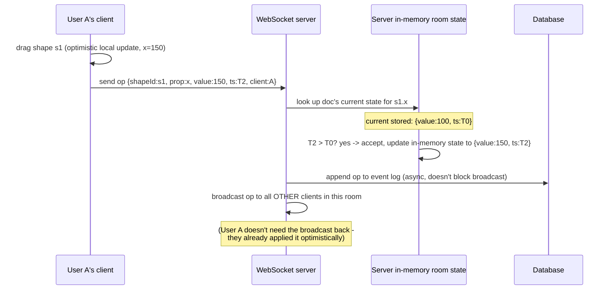
```mermaid
sequenceDiagram
    participant A as User A's client
    participant WS as WebSocket server
    participant Mem as Server in-memory room state
    participant DB as Database

    A->>A: drag shape s1 (optimistic local update, x=150)
    A->>WS: send op {shapeId:s1, prop:x, value:150, ts:T2, client:A}

    WS->>Mem: look up doc's current state for s1.x
    Note over Mem: current stored: {value:100, ts:T0}
    Mem->>Mem: T2 > T0? yes -> accept, update in-memory state to {value:150, ts:T2}

    WS->>DB: append op to event log (async, doesn't block broadcast)
    WS->>WS: broadcast op to all OTHER clients in this room

    Note over WS: (User A doesn't need the broadcast back -<br/>they already applied it optimistically)
```

Two important details baked into this diagram:

1. **The server is the conflict-resolution referee** for consistency, even though CRDTs don't need a "smart" server for correctness — in practice, most implementations still route ops through a server that checks "is this newer than what I have," both to update its own in-memory copy and to avoid re-broadcasting stale ops that would just get ignored anyway.
2. **Persistence to DB happens asynchronously**, off the critical path of "user sees their edit" and "other users see the edit." If DB writes were synchronous/blocking, every drag would feel laggy. This is a very common interview point: **separate the "make it feel real-time" path from the "make it durable" path.**

## Level 4: What happens when a second client's conflicting op arrives

Let's finish the concurrent-edit example from Chapter 4, but now showing storage at every step:

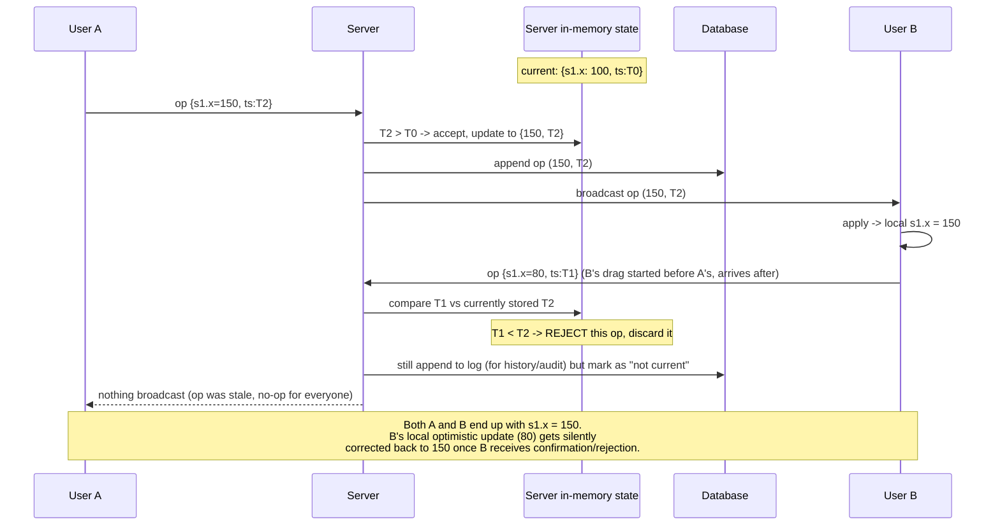
```mermaid
sequenceDiagram
    participant A as User A
    participant WS as Server
    participant Mem as Server in-memory state
    participant DB as Database
    participant B as User B

    Note over Mem: current: {s1.x: 100, ts:T0}

    A->>WS: op {s1.x=150, ts:T2}
    WS->>Mem: T2 > T0 -> accept, update to {150, T2}
    WS->>DB: append op (150, T2)
    WS->>B: broadcast op (150, T2)
    B->>B: apply -> local s1.x = 150

    B->>WS: op {s1.x=80, ts:T1}  (B's drag started before A's, arrives after)
    WS->>Mem: compare T1 vs currently stored T2
    Note over Mem: T1 < T2 -> REJECT this op, discard it
    WS->>DB: still append to log (for history/audit) but mark as "not current"
    WS-->>A: nothing broadcast (op was stale, no-op for everyone)

    Note over A,B: Both A and B end up with s1.x = 150.<br/>B's local optimistic update (80) gets silently<br/>corrected back to 150 once B receives confirmation/rejection.
```

This last point matters: **B's own client had already optimistically shown x=80 locally** the instant B dragged. When the server tells B "your op was stale, the winning value is 150," B's client has to **reconcile** — snap the shape back to x=150. This is a real UX detail worth mentioning in interviews: optimistic updates sometimes need to be *rolled back/corrected*, and good apps do this smoothly (e.g., a brief animation) rather than an ugly jump.

## Level 5: The "current snapshot" table — what's actually stored per property

This is the concrete schema that makes CRDT-style conflict resolution queryable and persistent:

```
shapes_current table:
┌─────────┬──────┬───────┬────────────┬───────────┐
│ shapeId │ prop │ value │ timestamp  │ clientId  │
├─────────┼──────┼───────┼────────────┼───────────┤
│ s1      │ x    │ 150   │ T2         │ userA     │
│ s1      │ y    │ 200   │ T0         │ userA     │  <- untouched by the conflict, unaffected
│ s1      │ color│ blue  │ T5         │ userB     │  <- different property, different winner, no conflict at all
└─────────┴──────┴───────┴────────────┴───────────┘
```

This reinforces something from Chapter 4 worth repeating in storage terms: **conflict resolution is scoped to a single (shapeId, property) pair.** The database doesn't need document-wide locks or transactions across the whole shape — each property is its own tiny independent "last-write-wins register," which is exactly why this scales so well and why unrelated edits never interfere with each other.

## Level 6: One subtlety — what is "timestamp," really?

Using wall-clock time (`Date.now()`) for `T1, T2` is tempting but risky — different users' machines can have clocks that are slightly out of sync, which could make an actually-later edit lose to an actually-earlier one just because of clock drift. Real systems typically use a **logical clock** instead — most commonly a **Lamport timestamp** or a version counter combined with the client's unique ID as a tie-breaker:

```
timestamp = "sequence_number@client_id"
e.g.  "42@userA"  vs  "41@userB"
Compare by sequence_number first; if equal, compare client_id alphabetically as a tiebreaker
```

This guarantees a strict, deterministic ordering across all clients **without relying on anyone's wall clock being accurate** — every client increments its own counter on every local edit, and merges in the highest counter it's seen from others, so the numbers stay meaningfully ordered relative to causality rather than real-world time.

---

That's the full loop: client memory → server relay/referee → durable event log → materialized current-state table, with per-property logical timestamps doing the conflict resolution at every layer. 

Does this flow make sense — particularly the distinction between the **event log** (full history, append-only) and the **current snapshot table** (fast-to-query, derived/kept-in-sync from the log)? Once solid, we'll move to Chapter 5: persistence & history, where that event log directly powers undo/redo.

---

## Chapter 5: Persistence & History — Undo/Redo, Snapshots, and Save

### The story

The team has a working sync engine now — ops flow, conflicts resolve deterministically, and there's a database recording everything. Then a designer files a bug: *"I hit Ctrl+Z and it undid my colleague's change, not mine!"* This forces the team to think carefully about something they'd been ignoring: **undo in a multiplayer app is genuinely different from undo in a single-player app.**

### Why single-player undo is easy (and why it breaks here)

In a solo app, undo is usually just a stack:

```
History stack: [op1, op2, op3]   <- op3 was the last thing YOU did
Ctrl+Z -> pop op3, reverse it, done
```

The instant you add other people, this breaks. If User A does `op1`, then User B does `op2`, then User A hits Ctrl+Z — what should happen? User A almost certainly means **"undo MY last action"** (op1), not "undo the most recent action on the document" (op2, which was B's). A global undo stack shared across users is simply the wrong data structure for this problem.

```mermaid
graph TD
    A["Shared global undo stack:<br/>[opA1, opB1, opA2]"] -->|"A presses Ctrl+Z"| B["Naive: pop last item = opA2<br/>Correct: A wants to undo THEIR<br/>last op, which might not be the<br/>global-last op"]
```

### The fix: per-user undo stacks

Each client keeps its **own** local undo stack, containing only the ops *that user* performed:

```
User A's local undo stack: [opA1, opA2]
User B's local undo stack: [opB1]
```

When A presses Ctrl+Z, A pops their own stack (`opA2`) and generates an **inverse operation** — not a "delete from history" action, but a brand new forward operation that reverses the effect:

```json
// Original op (what's in the log)
{ "op": "update", "shapeId": "s1", "prop": "x", "value": 150, "prevValue": 100, "ts": "T2@A" }

// Undo = a NEW op, generated locally, that sets it back
{ "op": "update", "shapeId": "s1", "prop": "x", "value": 100, "ts": "T5@A" }
```

This is a crucial detail: **undo doesn't "erase history" — it appends a new counteracting operation to the log.** This matters a lot in a multiplayer context — you never want to reach backward and delete an entry that other people's current state might depend on. You just say "and now, set it back," using the exact same op-broadcasting pipeline from Chapter 3/4. Everyone else just sees it as a normal incoming op with a newer timestamp — no special-casing needed anywhere else in the system.

```mermaid
sequenceDiagram
    participant A as User A
    participant Srv as Server
    participant B as User B

    Note over A: Local undo stack: [opA2: x=150, prevValue=100]
    A->>A: Ctrl+Z pressed
    A->>A: pop opA2, generate inverse op: x=100, ts=T5
    A->>A: apply locally immediately (optimistic)
    A->>Srv: broadcast inverse op {x:100, ts:T5}
    Srv->>B: relay op (same as any other op)
    B->>B: apply normally - just sees "x changed to 100"
```

### The catch: what if someone edited the same property after you, before you undo?

Say A sets `x=150` (T2). Then B changes `x=200` (T3). Now A hits Ctrl+Z, wanting to "undo my change." What should the result be — `100` (A's prevValue) or should the undo somehow respect B's newer edit?

This is a genuine, unsolved-by-magic design decision every collaborative tool has to make explicitly, and different tools make different calls:
- **Simplest (most common)**: undo just applies the inverse op with a new, current timestamp. Since T5 (undo) > T3 (B's edit), it wins per our LWW rule from Chapter 4 — A's undo overwrites B's newer edit too. This can surprise B, but it's predictable and simple.
- **More sophisticated**: some tools detect "someone else touched this since your op" and either skip the undo for that property or show a conflict indicator. This adds real complexity and most tools (including early Figma) start with the simple approach.

For an interview, stating the simple approach and *explicitly naming the tradeoff* ("this can clobber someone else's newer edit, and here's how a more advanced version could detect that") shows strong judgment — you don't need to have implemented the fancy version.

### Now: persistence — how does the document actually get saved?

Recall from Chapter 4-and-a-half: we already have an **append-only event log** in the database recording every op. This single structure quietly solves three problems at once:

```mermaid
graph TD
    A["Event log<br/>(every op, ever, in order)"] --> B["Current state<br/>= replay all ops"]
    A --> C["Undo/redo<br/>= generate inverse ops<br/>from log entries"]
    A --> D["Version history<br/>= replay ops up to<br/>any point in time"]
```

"What did this document look like 20 minutes ago?" is just: replay the event log, stopping at the operation whose timestamp is closest to 20 minutes ago. This is exactly how Figma's and Google Docs' "version history" features work conceptually.

### The problem with pure event-log replay: it doesn't scale

If a document has been edited for a year, with millions of operations, **replaying every single operation from the beginning just to compute "current state"** becomes slow — both for a new client joining (they'd have to download and replay the entire history) and for the server itself.

### The fix: periodic snapshots + incremental replay

This is the same pattern used in database write-ahead-logs and is a very standard interview answer:

```
Timeline:  [op1...op1000] -> SNAPSHOT_A -> [op1001...op2500] -> SNAPSHOT_B -> [op2501...now]

To get current state: load SNAPSHOT_B (already has ops 1-2500 baked in)
                       + replay only op2501...now (a small number)
```

```mermaid
sequenceDiagram
    participant C as New client joining
    participant Srv as Server
    participant DB as Database

    C->>Srv: "I want to open this document"
    Srv->>DB: fetch latest snapshot
    DB->>Srv: SNAPSHOT_B (state as of op2500)
    Srv->>DB: fetch ops after snapshot (op2501...now)
    DB->>Srv: small list of recent ops
    Srv->>Srv: apply those few ops on top of snapshot
    Srv->>C: send resulting current state (one shot, not full history)
```

A background job periodically creates a new snapshot (e.g., every N operations, or every few minutes of activity) — trading a bit of storage for a lot of read-speed. This is exactly the same "snapshot vs event log" hybrid mentioned in the last chapter, now with the concrete mechanism for *why* and *when* you snapshot.

### Putting it together: what a client receives when opening a document

```mermaid
sequenceDiagram
    participant C as Client
    participant WS as WebSocket server
    participant DB as Database

    C->>WS: connect, request doc_1
    WS->>DB: load latest snapshot + ops since snapshot
    DB->>WS: current materialized state
    WS->>C: send full current state (ONE time, on join only)
    Note over C: this is the ONLY time a full document<br/>transfer happens - after this, only deltas
    C->>C: render initial state
    loop live editing
        C->>WS: send ops as user edits
        WS->>C: receive ops from other users
    end
```

Notice this reconciles something from Chapter 2: sending the whole document **isn't inherently wrong** — it's wrong to do it *on every single edit*. Doing it exactly once, on initial load, is completely correct and unavoidable (a new client has nothing to build on yet).

---

Quick check: does the distinction click between **event log = source of truth for history/undo**, and **snapshot = a performance optimization so you don't replay from the beginning of time on every load**? Also, does the per-user undo stack (vs. one shared global stack) make sense as the fix for the Ctrl+Z bug?

Once solid, we'll move to Chapter 6: the actual networking architecture — WebSocket servers, rooms, and how presence/cursors (seeing other people's live cursor position) work.

---

## Chapter 6: Networking Architecture — WebSockets, Rooms, and Presence

### The story

Everything so far has assumed "ops just flow between clients and a server" — but we've been hand-waving *how*. Now the team has to actually build the networking layer: how do connections get established, how does the server know which clients belong to which document, and how do you show live cursors (the "you can see exactly where your teammate's mouse is" effect that makes collaborative tools feel magical)?

### Why not just use regular HTTP requests?

This is a great place to start because it's a common interview question by itself: **why WebSockets and not just polling/REST?**

```mermaid
graph TD
    subgraph HTTP["HTTP polling (naive)"]
    A1["Client asks server<br/>'anything new?' every 500ms"] --> A2["Server responds,<br/>often with 'nothing changed'"]
    end
    subgraph WS["WebSocket (persistent connection)"]
    B1["Client opens ONE connection"] --> B2["Server pushes ops<br/>the INSTANT they happen<br/>no polling needed"]
    end
```

HTTP is request-response: the client always has to *ask*. For real-time collaboration, the server needs to **push** data to clients the moment something happens — a colleague's cursor moves 60 times a second, you can't reasonably poll for that. A **WebSocket** is a single long-lived, bidirectional connection opened once, over which both sides can send messages at any time, with none of the overhead of repeatedly opening new HTTP requests.

```
HTTP polling: request → response → close, request → response → close, (repeat forever)
              High overhead, added latency (up to your poll interval), wasteful when nothing changed

WebSocket:    one handshake → connection stays open → messages flow both directions instantly
```

### The concept of a "Room"

A server handling collaboration isn't just handling raw connections — it needs to know **which document each connection cares about**, so it only broadcasts ops to people editing the *same* document. This grouping is universally called a "room" (same term used in gaming/chat systems).

```mermaid
graph TD
    subgraph Server["WebSocket server"]
        R1["Room: doc_1<br/>connections: [UserA, UserB]"]
        R2["Room: doc_2<br/>connections: [UserC]"]
        R3["Room: doc_3<br/>connections: [UserD, UserE, UserF]"]
    end
```

Conceptually, a room is just a piece of server memory: `roomId -> Set of active connections`. When a client connects, the very first message it sends is effectively "I want to join room doc_1." The server adds that connection to the room's set. From then on, any op received from a connection in `doc_1`'s room only gets broadcast to *other* connections in that same set — never to users editing a completely different document.

```mermaid
sequenceDiagram
    participant A as User A
    participant Srv as Server
    participant Room as Room "doc_1" (in-memory set)
    participant B as User B (also in doc_1)
    participant C as User C (in doc_2, different room)

    A->>Srv: connect, joinRoom("doc_1")
    Srv->>Room: add A's connection
    B->>Srv: connect, joinRoom("doc_1")
    Srv->>Room: add B's connection

    A->>Srv: send op (shape moved)
    Srv->>Room: look up who's in doc_1
    Room-->>Srv: [A, B]
    Srv->>B: broadcast op
    Note over C: C never receives this - different room entirely
```

### Presence: showing other people's live cursors

This is a beloved feature (colored cursors with names floating around the canvas) and it's architecturally almost identical to shape ops — just a different, higher-frequency, "don't-bother-persisting" data stream.

Key insight: **cursor position is NOT a document op.** It doesn't belong in your event log (Chapter 5) — nobody cares what your cursor was doing 3 months ago, and you'd flood your database if you tried to store every mousemove. It's **ephemeral** — it matters only right now, and can be safely lost if a connection drops.

```json
// A "presence" message - separate channel/type from document ops
{ "type": "presence", "userId": "userA", "cursor": { "x": 320, "y": 140 }, "color": "#e91e63" }
```

```mermaid
sequenceDiagram
    participant A as User A
    participant Srv as Server
    participant B as User B

    A->>A: mousemove fires (many times/sec)
    A->>A: throttle to ~20-30 times/sec max
    A->>Srv: presence: {cursor: x,y}
    Srv->>B: broadcast presence (NOT written to DB, NOT added to event log)
    B->>B: render a little cursor+name label at that position
```

That "throttle" step matters in practice: raw `mousemove` can fire 100+ times per second, but human eyes can't tell the difference between updating a remote cursor at 30fps vs 100fps — so clients deliberately rate-limit how often they send presence updates, purely to save bandwidth, since accuracy doesn't matter here the way it does for actual document edits.

### Presence also needs a "who's currently in the room" list

Beyond cursors, apps show avatars of everyone currently viewing a document. This is maintained as simple room membership state:

```mermaid
sequenceDiagram
    participant A as User A
    participant Srv as Server
    participant Room as Room "doc_1"
    participant B as User B

    A->>Srv: connect, joinRoom("doc_1")
    Srv->>Room: add A
    Srv->>B: "userA joined" (presence event)
    B->>B: show A's avatar in the top bar

    Note over A: ...A closes the tab / loses connection...
    Srv->>Room: connection closed, remove A
    Srv->>B: "userA left" (presence event)
    B->>B: remove A's avatar
```

The server detects disconnection via the WebSocket's built-in close event (or a timeout if the connection drops silently, e.g., laptop lid closed — handled with periodic "ping/pong" heartbeat messages, which we'll cover more in Chapter 11 on reliability).

### Two data streams, two different guarantees — an important interview distinction

```mermaid
graph LR
    subgraph Doc["Document ops (shape changes)"]
    A1["Must be reliable"] 
    A2["Must be persisted"]
    A3["Order/conflict resolution matters (Ch.4)"]
    end
    subgraph Pres["Presence (cursors, who's online)"]
    B1["OK to drop occasionally"]
    B2["Never persisted"]
    B3["Only the LATEST value matters,<br/>old cursor positions are meaningless"]
    end
```

This distinction is genuinely important to articulate in an interview: not all real-time data needs the same guarantees. Treating cursor movements with the same rigor as shape edits (persisting every position, retry-on-failure, conflict resolution) would be pure waste — the system should apply exactly as much rigor as each data type actually needs, no more.

### Where does the "room" state physically live? (a preview of Chapter 7)

Right now we've said "a room is a set of connections in server memory" — that's fine for **one server**. But real products run **many server instances** behind a load balancer for scale and reliability. If User A connects to Server 1 and User B connects to Server 2, and they're in the same room... Server 1's in-memory set doesn't know Server 2 even exists. This exact problem — and its solution (a pub-sub layer like Redis) — is precisely what Chapter 7 (scaling) is about.

---

Does the room/broadcast model make sense, and specifically the reasoning for why **presence data (cursors, online status) is architecturally separate from document ops** — different persistence rules, different reliability guarantees? Once solid, we'll move into Chapter 7: scaling this out — sharding rooms across multiple servers, and how pub-sub fan-out solves the "two users on two different servers" problem I just teased.

---

## Chapter 7: Scaling Out — Sharding, Pub-Sub, and Horizontal Scaling

### The story

The product is taking off. One server handling a few hundred WebSocket connections was fine — but now there are tens of thousands of concurrent users across thousands of documents. One machine, however beefy, has a hard ceiling on how many long-lived connections it can hold open and how much CPU it can spend broadcasting messages. The team needs multiple servers. And the instant you have multiple servers, the "room = a Set in this server's memory" model from Chapter 6 breaks.

### The problem, made concrete

```mermaid
graph TD
    subgraph LB["Load balancer"]
    end
    subgraph S1["Server 1"]
        Room1["Room doc_1<br/>connections: [User A]"]
    end
    subgraph S2["Server 2"]
        Room2["Room doc_1<br/>connections: [User B]"]
    end
    LB --> S1
    LB --> S2
```

User A and User B are editing the **same document**, but because a load balancer distributed their connections to two different physical servers, each server only knows about its own local half of the room. When A sends an op, Server 1 broadcasts it to everyone in *its own* in-memory room set — which is just A. B never gets it. The document silently desyncs between users, and nobody gets an error — it just quietly breaks.

### The fix: a shared message bus between servers (pub-sub)

The solution is to stop treating "broadcast" as something a single server does entirely on its own, and instead route every op through a **shared pub-sub system** that every server subscribes to. Redis Pub/Sub is the classic, most commonly cited tool for this in interviews (though Kafka, NATS, and others work too — the concept matters more than the specific product).

```mermaid
sequenceDiagram
    participant A as User A (on Server 1)
    participant S1 as Server 1
    participant Redis as Redis Pub/Sub<br/>(channel: doc_1)
    participant S2 as Server 2
    participant B as User B (on Server 2)

    A->>S1: send op (shape moved)
    S1->>Redis: PUBLISH doc_1 {op}
    Redis->>S1: (S1 is also subscribed to doc_1, gets its own message back)
    Redis->>S2: deliver to all subscribers of doc_1
    S1->>S1: broadcast to LOCAL clients in doc_1 (skip sender A)
    S2->>S2: broadcast to LOCAL clients in doc_1 (which includes B)
    S2->>B: deliver op
```

The mental model shift: **every server maintains its own local room (its own subset of connections for a doc), but instead of broadcasting only to that local subset directly from memory, it publishes to a shared channel that every other server is also listening to.** Each server is now responsible only for "fan out to whichever of my directly-connected clients care about this," while Redis handles "make sure every server that has *any* client in this room hears about it."

```
Old model (Chapter 6, single server):
  op arrives -> loop through room's connections -> send

New model (multi-server):
  op arrives -> publish to Redis channel "doc_1"
             -> every server subscribed to "doc_1" receives it
             -> each server loops through ITS OWN local connections in that room -> sends
```

### How does a server know which Redis channels to subscribe to?

A server subscribes to `doc_1`'s channel the moment its **first local client** joins that room, and unsubscribes when its **last local client** for that room leaves. This keeps things efficient — a server with no clients editing `doc_5` has no reason to receive `doc_5`'s traffic at all.

```mermaid
sequenceDiagram
    participant A as User A
    participant S1 as Server 1
    participant Redis as Redis

    A->>S1: connect, joinRoom("doc_1")
    Note over S1: is this the FIRST local client for doc_1?
    S1->>Redis: SUBSCRIBE doc_1
    Note over S1: now this server will receive all doc_1 traffic

    Note over A: ...A disconnects, and A was the last local client for doc_1...
    S1->>Redis: UNSUBSCRIBE doc_1
```

### Sharding — deciding which room lives "where," conceptually

Even though pub-sub solves cross-server broadcast, most systems still try to **route a given room's traffic consistently** to reduce unnecessary hops and keep the "who's in this room" bookkeeping simpler. This is where **sharding by room/document ID** comes in — a common interview term.

The idea: use a deterministic function (a hash of the document ID) to decide which server (or which shard of the pub-sub infrastructure) is the "primary" owner of a given room's coordination, even though clients can still technically connect to any front-end server.

```
shardIndex = hash(documentId) % numberOfShards
```

```mermaid
graph TD
    A["Document ID: doc_9182"] --> B["hash(doc_9182) % 4 = 2"]
    B --> C["Shard 2 owns coordination<br/>for this document"]
```

This matters for a few reasons that are worth naming explicitly in an interview:
- It bounds how many documents' worth of pub-sub traffic any one shard/instance has to deal with, instead of every server subscribing to every possible channel.
- It lets you reason about capacity: "shard 2 currently has 40,000 active rooms" is a concrete, actionable metric you can use for autoscaling or rebalancing.
- If you're also persisting per-document server-side state (like the in-memory "current snapshot" from Chapter 4/5), consistent hashing means the same document's requests tend to land near the same cache/state, reducing cross-server chatter.

### Horizontal scaling of the WebSocket layer itself

Separately from room-sharding, you need the WebSocket-accepting layer itself (the servers clients directly connect to) to scale independently. This is usually just: put a **load balancer** in front of a pool of stateless-as-possible WebSocket server instances, and let it distribute new incoming connections round-robin (or by least-connections). Because room state now lives in the shared pub-sub layer rather than solely in one server's memory, **any** server can handle **any** client for **any** document — this is what makes the fleet horizontally scalable (you can add or remove server instances without losing correctness, only capacity).

```mermaid
graph TD
    LB["Load balancer"] --> S1["Server 1<br/>(stateless-ish, holds only<br/>ITS OWN clients' connections)"]
    LB --> S2["Server 2"]
    LB --> S3["Server 3"]
    S1 <--> Redis["Redis Pub/Sub<br/>(the shared coordination layer)"]
    S2 <--> Redis
    S3 <--> Redis
```

### One important nuance: WebSockets aren't "stateless" in the usual sense

A classic HTTP server can be perfectly stateless — any request can go to any instance. WebSockets are different: **once a client establishes a connection to Server 2, that specific TCP connection physically lives on Server 2 for its entire duration.** You can't "load balance" an already-open connection to a different server mid-flight. This is why the architecture above still needs Redis — the connections themselves are pinned per-server, but the *data* they need flows freely between servers via pub-sub. This is a good distinction to volunteer in an interview: "the connection is sticky to one server, but the data isn't."

### What about the database and persistence layer at this scale?

Chapter 5's event-log-plus-snapshot approach still applies, but at scale you'd typically also introduce a **queue** (like Kafka or SQS) between "op arrives at a server" and "op gets written to the database," so that a burst of edits doesn't overwhelm the database directly — servers can publish ops to both Redis (for real-time fan-out) and a durable queue (for eventual persistence) without the two paths blocking each other.

```mermaid
graph TD
    Op["Incoming op"] --> Redis["Redis Pub/Sub<br/>(fast, for live broadcast)"]
    Op --> Queue["Durable queue<br/>(Kafka/SQS)"]
    Queue --> Worker["Background worker"]
    Worker --> DB["Database<br/>(event log + snapshots)"]
```

This decouples "the user needs to see this instantly" (Redis path, milliseconds) from "this needs to be durably saved eventually" (queue + worker path, can tolerate slight delay, and can retry on failure without affecting live users at all).

---

Quick check: does the core shift make sense — from "server broadcasts directly to its in-memory room" (works for one server) to "server publishes to a shared pub-sub channel, and every server subscribed to that channel fans out to its own local clients" (works across many servers)? And is the distinction clear between **connection stickiness** (a WebSocket is pinned to one server) versus **data flow** (which is free to move between servers via Redis)?

Once solid, we'll move to Chapter 8: the storage layer in depth — database choice (SQL vs NoSQL for this use case), replication, and how snapshotting is actually implemented at scale.

---

Excellent question — this is exactly the kind of "wait, why two systems instead of one" thing interviewers probe on, and the honest answer is that Redis Pub/Sub and a durable queue solve two genuinely different problems, even though they look superficially similar.

## Why not just use Redis Pub/Sub for persistence too?

The core issue: **Redis Pub/Sub has no memory.** It's a pure "fire and forget" broadcast — if a subscriber isn't actively connected and listening at the exact moment a message is published, that message is gone forever. There's no buffer, no replay, nothing to catch up on.

```mermaid
sequenceDiagram
    participant Srv as Server
    participant Redis as Redis Pub/Sub
    participant Worker as DB-writer worker (offline/restarting)

    Srv->>Redis: PUBLISH op {x:150}
    Note over Worker: worker happens to be mid-restart,<br/>not subscribed at this exact instant
    Redis->>Redis: message delivered to... nobody
    Note over Redis: message is now GONE. No log, no retry, no trace.
```

For **live broadcast to other users' cursors/shapes**, this is actually fine — if a message is dropped, the next op a moment later will just correct the state anyway (we saw this in Chapter 4: every op carries the full current value, not a diff to apply on top, so losing one op just means a slightly stale view for a split second, self-healing on the next op).

For **persistence**, this "fine, it'll self-correct" property does *not* apply. If the op that sets `s1.x = 150` never reaches the database because the worker was restarting at that exact moment, **that edit is permanently lost from the historical record** — even though every live user already saw it and moved on. Nobody would even notice until someone reopens the document later and it's subtly wrong, or tries to load version history and finds a gap.

## What a durable queue actually gives you that Pub/Sub doesn't

```mermaid
graph LR
    subgraph PubSub["Redis Pub/Sub"]
    A1["No storage - message exists<br/>only during the instant of delivery"]
    A2["If no subscriber is listening<br/>right now, message is lost"]
    end
    subgraph Queue["Durable queue (Kafka/SQS)"]
    B1["Message is WRITTEN TO DISK<br/>the moment it's published"]
    B2["Sits there until a consumer<br/>explicitly acknowledges<br/>processing it"]
    B3["If the worker crashes mid-processing,<br/>message goes back in the queue<br/>and gets retried"]
    end
```

This is the fundamental distinction: **Pub/Sub is "deliver now or never," a queue is "deliver eventually, guaranteed, even if the consumer is down for an hour."** A queue is a durable, ordered (usually) log that a consumer reads from and explicitly checks off — if the consumer dies partway through, the message simply wasn't checked off, so it's retried by another worker instance later.

## So is the write to both Redis and the queue sync or async?

Here's the key design decision, and the answer is: **publishing to both happens essentially at the same time, but the user-facing "fast path" only waits for Redis, never for the database write.**

```mermaid
sequenceDiagram
    participant A as User A
    participant Srv as Server
    participant Redis as Redis Pub/Sub
    participant Q as Durable queue
    participant B as User B
    participant Worker as DB worker
    participant DB as Database

    A->>Srv: send op
    par Fast path (synchronous, blocks nothing for long)
        Srv->>Redis: PUBLISH op
        Redis->>B: deliver instantly
        B->>B: render update (~tens of ms)
    and Durable path (fire-and-forget from server's perspective)
        Srv->>Q: enqueue op (also nearly instant - just an append)
    end
    Note over Worker: some time later, possibly seconds later
    Q->>Worker: deliver op for processing
    Worker->>DB: write to event log + update snapshot
    Worker->>Q: acknowledge (remove from queue)
```

Both `PUBLISH` and `enqueue` are called by the server essentially back-to-back, and **neither one waits for the other to finish** — they're independent, parallel actions from the server's perspective. Critically, the server does **not** wait for the database write to complete before considering the op "handled" — that would reintroduce the exact latency problem we've been avoiding this whole design (recall optimistic updates from Chapter 3: the whole point is the user never waits on a slow round-trip).

The database write itself, done by a separate background worker consuming from the queue, is **asynchronous relative to the live editing experience** — it might complete 50ms later or 2 seconds later during a traffic spike, and nobody editing the document notices or cares, because they already saw the update via the Redis fast path.

## The real challenges this setup introduces

### Challenge 1: ordering between the two paths can differ

Since Redis delivery and queue processing are two completely independent paths, **there's no guarantee they complete in the same order relative to each other**, especially under load. Two ops might broadcast live in order [op1, op2], but the queue's consumer might, due to retries or worker restarts, end up persisting them in a different order.

This is why the **per-property timestamp/logical-clock approach from Chapter 4 matters even more here** — since the database write applies "highest timestamp wins" rather than "whatever arrives last gets applied," the persisted result converges to the correct value even if the *physical write order* to the DB differs from the live broadcast order.

### Challenge 2: duplicate delivery (queues typically guarantee "at-least-once," not "exactly-once")

If a worker crashes **after** writing to the database but **before** acknowledging the queue message, the queue will redeliver that same op to another worker, which will try to write it again.

```mermaid
sequenceDiagram
    participant Q as Queue
    participant W1 as Worker 1
    participant DB as Database
    participant W2 as Worker 2

    Q->>W1: deliver op {x:150, ts:T2}
    W1->>DB: write op
    Note over W1: CRASHES before acknowledging
    Q->>Q: no ack received, op remains "in flight" -> times out
    Q->>W2: redeliver same op {x:150, ts:T2}
    W2->>DB: write op AGAIN
```

The fix is making the database write **idempotent** — writing the exact same op twice must produce the exact same end result, with no harmful side effect. Since our schema (Chapter 4) is "for this (shapeId, prop), store this value if this timestamp is newer than what's stored" — writing the identical `(s1, x, 150, T2)` a second time just re-confirms the same row; it doesn't corrupt anything or double-apply an increment. This is a genuinely important reason we favored **absolute values over relative deltas** for ops back in Chapter 3 — "set x to 150" is naturally idempotent, while "add 10 to x" would double-apply on a duplicate delivery and silently corrupt the document.

### Challenge 3: consumer lag during traffic spikes

If ops are arriving faster than the DB workers can persist them, the queue's backlog grows. This is usually fine *temporarily* — that's the whole point of a queue, it absorbs bursts — but if it grows unbounded, you eventually need to **scale out the number of worker instances consuming from the queue** (this is a natural place to mention horizontal scaling again, this time for the persistence layer specifically, not just the WebSocket layer from Chapter 7).

### Challenge 4: the queue itself becoming a bottleneck or single point of failure

The queue infrastructure (Kafka cluster, SQS, etc.) needs its own reliability story — typically achieved via replication within the queue system itself (Kafka partitions are replicated across brokers, SQS is managed and highly available by default). This is usually "someone else's problem" in the sense that you use a managed/battle-tested queue product rather than building one, but it's worth knowing *why* it's reliable (replication) rather than treating it as a magic box.

---

Quick summary to lock in: **Pub/Sub = fast, ephemeral, "best effort" broadcast for the live experience; queue = slower but durable, guarantees the op eventually gets persisted even through crashes/restarts — and the two paths run independently and async relative to each other, reconciled correctly later thanks to the idempotent, timestamp-based writes from Chapter 4.**

Does this resolve the "why two systems" confusion? Once solid, want to continue into Chapter 8 (database choice, replication, snapshotting in depth), or stay here a bit longer?

---

## Chapter 8: The Storage Layer — Database Choice, Replication, and Snapshotting at Scale

### The story

The team now has a clear data flow: ops arrive, get broadcast via Redis, and durably queued for a worker to persist. But "persist to the database" has been a black box so far. Now comes a very standard HLD interview question: **SQL or NoSQL for this, and why?** Let's actually reason through it instead of just picking one because it's trendy.

### What are we actually storing? Let's list the access patterns first

Before picking a database, name the actual queries you need to support well — this is the right instinct in any HLD interview, database choice should follow from access patterns, not the other way around.

```
1. Append a new op to the event log (write-heavy, append-only, never updated)
2. Read "give me all ops for doc_1 since snapshot_X" (range query, ordered by time)
3. Read/write "current value of (shapeId, prop) for doc_1" (point lookups, frequent updates)
4. Occasionally: "give me the full document" (all current shape states for doc_1)
5. Occasionally: metadata like doc ownership, permissions, list of docs in a workspace
```

Notice these are actually quite different shapes of access — this is exactly why many real systems end up using **more than one storage technology**, each suited to a different part of the job, rather than forcing everything into one database.

### Event log storage — why an append-only, ordered store fits naturally

The event log (Chapter 5) is pure appends, read in time order, essentially never updated or deleted. This is the textbook use case for either:
- A **wide-column / log-oriented NoSQL store** (like Cassandra or DynamoDB), which are built around fast sequential writes and range scans by a sort key (here: timestamp)
- Or simply the durable **queue's own storage** (Kafka topics themselves function as a durable, replayable log) — some systems actually treat the Kafka topic itself as the event log, skipping a separate database for this part entirely

```
Cassandra/DynamoDB-style table:
  Partition key: doc_id        <- groups all ops for one document together (fast range scans)
  Sort key: timestamp          <- ops come back naturally in order
  Value: {shapeId, prop, value, clientId}
```

The partition key choice matters a lot here: partitioning by `doc_id` means "get me all ops for this document" is a single, efficient range scan on one partition, instead of scattering the query across the entire cluster.

### Current-state / snapshot storage — why this looks more like a key-value or document store

The "current snapshot" (Chapter 4's `shapes_current` table) is read constantly (every time someone opens a document) and updated frequently (every op, in the background worker) but the access pattern is simple: point lookups and point updates by `(doc_id, shapeId)`, or "give me every shape for this doc_id."

This maps well to either:
- A **document database** (MongoDB, Firestore-style) — store the entire current shape as one JSON-like document, since you usually want the whole shape's properties together, not one property at a time
- Or a simple **key-value store** (Redis itself, or DynamoDB) if you want extremely fast reads, since "open a document" is a latency-sensitive path users are actively waiting on

```
Document store, one document per shape:
{
  "_id": "doc_1_s1",
  "docId": "doc_1",
  "shapeId": "s1",
  "type": "rect",
  "x": 150, "y": 200, "w": 150, "h": 80,
  "lastModified": { "x": "T2@userA", "y": "T0@userA" }   <- per-property timestamps, still needed for conflict resolution
}
```

### Metadata storage — why this part is a good fit for traditional SQL

Things like "which workspace does this document belong to," "who has edit vs view permissions," "list all documents a user has access to" — these are relational by nature (users, documents, permissions, workspaces all reference each other) and benefit from real transactions (e.g., "share this document with a new user" should be atomic). A traditional relational database (Postgres, MySQL) is the standard, boring, correct choice here — this is a good place in an interview to say "not everything needs to be exotic; permissions and metadata are a textbook relational problem."

### Putting the storage layer together — a polyglot picture

```mermaid
graph TD
    subgraph Storage["Storage layer (polyglot - different tools for different jobs)"]
    Log["Event log<br/>(Cassandra/DynamoDB or Kafka topic)<br/>append-only, ordered by time"]
    Snap["Current state store<br/>(MongoDB/DynamoDB/Redis)<br/>fast point reads/writes per shape"]
    Meta["Metadata DB<br/>(Postgres/MySQL)<br/>users, permissions, doc ownership"]
    end

    Worker["DB-writer worker<br/>(from Ch.7 queue)"] --> Log
    Worker --> Snap
    App["App server (loading a doc)"] --> Snap
    App --> Meta
```

This is genuinely how large-scale collaborative systems are built in practice — no single database elegantly serves "append-only ordered history," "fast per-object current state," and "relational permissions" equally well, so mature systems accept the complexity of a few specialized stores rather than forcing one database to do everything adequately.

### Replication — why, and how it works here

Replication means: **don't keep only one copy of your data on one machine.** Every one of the stores above needs this, for two distinct reasons worth separating clearly in an interview:

```mermaid
graph LR
    subgraph Reason1["Reason 1: Durability"]
    A["If the one disk holding your data<br/>fails, you haven't just lost<br/>performance - you've lost the data,<br/>permanently"]
    end
    subgraph Reason2["Reason 2: Availability + read scaling"]
    B["Multiple copies mean you can<br/>keep serving reads (and often writes)<br/>even if one machine goes down,<br/9. and spread read traffic<br/>across replicas"]
    end
```

The standard pattern is **leader-follower (primary-replica) replication**:

```mermaid
sequenceDiagram
    participant App as App/Worker
    participant Leader as Leader (primary) node
    participant F1 as Follower replica 1
    participant F2 as Follower replica 2

    App->>Leader: write (append op / update snapshot)
    Leader->>Leader: commit write locally
    Leader->>F1: replicate write
    Leader->>F2: replicate write
    Note over Leader,F2: writes ALWAYS go to the leader;<br/>reads can go to leader OR any follower
```

All **writes** go through a single leader (to keep write ordering unambiguous), and that leader streams every write to one or more followers. **Reads** can be served by any replica, which is what lets you scale read throughput horizontally — this matters a lot for us, since "load a document" (reading current state) happens far more often than "edit a document" for any given user session (people spend more time viewing/thinking than actively dragging shapes).

### Sync vs async replication — a genuine tradeoff, worth stating explicitly

- **Synchronous replication**: the leader waits for at least one follower to confirm it received the write before telling the client "write succeeded." Safer (a leader crash right after can't silently lose the write), but slower (extra network round-trip on every write).
- **Asynchronous replication**: the leader confirms the write immediately, and replicates to followers in the background. Faster, but there's a small window where, if the leader crashes *before* the follower catches up, that write can be lost.

For our event log (durability matters — this is literally the historical record), leaning toward synchronous (or "quorum" — wait for a majority of replicas) replication is the safer default. For less critical data, async is often an acceptable and faster tradeoff. This exact tension — consistency/durability vs latency — is the crux of the CAP theorem, which is worth being ready to name if asked directly, but the practical framing above ("do you wait for confirmation or not") is usually more useful to lead with in an interview than reciting CAP from memory.

### Snapshotting at scale — revisiting Chapter 5, now with real numbers

Chapter 5 established *why* snapshots exist (avoid replaying the entire history). At scale, the actual mechanics look like this:

```mermaid
sequenceDiagram
    participant Cron as Background job (scheduled)
    participant Log as Event log
    participant Snap as Snapshot store

    loop Every N ops, or every T minutes, per document
        Cron->>Log: read all ops since last snapshot for this doc
        Cron->>Cron: compute new current state (apply ops on top of old snapshot)
        Cron->>Snap: write new snapshot, tagged with the op sequence number it represents
    end
```

A practical detail worth naming: this snapshotting job is usually **per-document and triggered by activity**, not a single giant global cron job — a document with thousands of edits per hour gets snapshotted often; a document nobody has touched in months doesn't need re-snapshotting at all. This keeps the job's total work proportional to actual activity rather than to the total number of documents that exist.

### One subtlety: snapshotting a document that's currently being live-edited

If you snapshot while ops are actively streaming in, you need a clear, unambiguous cutoff point — "this snapshot represents state as of op #2500 exactly" — so that when replaying "ops after the snapshot," you never double-apply or skip an op. This is usually done by having the snapshot job read a consistent sequence number from the log (e.g., the log's own auto-incrementing offset, which most log-structured stores like Kafka or Cassandra provide natively) rather than relying on wall-clock time, which could be ambiguous with concurrent writes landing in the same millisecond.

---

Quick check: does the reasoning for **polyglot storage** (different databases for the event log vs. current-state vs. metadata, matched to their actual access patterns) make sense, along with **why leader-follower replication with sync/async tradeoffs** is the standard answer to "how do you make this durable and available"?

Once solid, we'll move to Chapter 9: caching — where it fits on top of everything we've built, and what specifically gets cached (and what definitely shouldn't be).

---

## Chapter 9: Caching — What to Cache, and What Never to Cache

### The story

The storage layer from Chapter 8 works, but the team notices something: opening a popular, frequently-viewed document means hitting the current-state store every single time, even though the same handful of documents get opened by dozens of people per minute (think: a company's shared onboarding doc, or a template everyone duplicates from). Meanwhile, the database — even a well-replicated one — has a cost and latency floor. This is exactly the situation caching exists to solve, but it's also a situation where naive caching can introduce the exact bugs we spent Chapters 2-4 solving. Let's be precise about it.

### First principle: cache things that are read often and don't need to be perfectly fresh at read-time

That second half of the sentence is the part people forget. Caching isn't just "reads are slow, add a cache" — it's specifically useful when **slightly stale data is acceptable**, or when you have a reliable way to invalidate the cache the instant the underlying data changes.

### What's a good caching candidate here?

**1. Document metadata** (title, owner, permissions) — read constantly (every time anyone opens a doc, you check "can this user view/edit this?"), changes rarely (someone renames a doc or changes sharing settings occasionally, not every second).

```mermaid
sequenceDiagram
    participant App as App server
    participant Cache as Cache (Redis)
    participant DB as Metadata DB (Postgres)

    App->>Cache: GET doc_1:metadata
    alt cache hit
        Cache-->>App: {title, owner, permissions}
    else cache miss
        App->>DB: SELECT * FROM documents WHERE id=doc_1
        DB-->>App: metadata
        App->>Cache: SET doc_1:metadata (with TTL)
    end
```

This is a completely standard **cache-aside** pattern (also called lazy loading): check cache first, fall back to DB on a miss, populate the cache on the way back. When metadata changes (a permission update), you explicitly **invalidate** (delete) that cache key so the next read is forced to go to the DB and re-populate with fresh data.

**2. The "current snapshot" of a document, for the read-on-open path** — this is more interesting for us specifically, because we already established (Chapter 6-7) that the server keeps a live in-memory copy of the current state for any document with active connections. That in-memory copy **is already a cache**, in effect — we just didn't call it that yet.

```mermaid
graph TD
    A["User opens a document"] --> B{"Is there already a server<br/>with this room active in memory?<br/>(someone else editing it right now)"}
    B -->|yes| C["Just read from that server's<br/>in-memory state - fastest possible path,<br/>no DB or cache hit needed at all"]
    B -->|no, room is 'cold'| D{"Is it in Redis cache?"}
    D -->|yes| E["Load from Redis<br/>(fast, but has to now become<br/>the new in-memory state on some server)"]
    D -->|no| F["Load from the snapshot+event-log<br/>DB (Chapter 8) - slowest path,<br/>only for genuinely cold/rarely-opened docs"]
```

This gives a clean three-tier freshness/speed hierarchy: **hot in-memory (a room actively being edited) → warm cache (recently active, nobody editing right now) → cold database (rarely touched documents)**. This tiered thinking — "where does this data live depending on how hot it is" — is a strong thing to articulate explicitly in an interview, because it shows you're not treating "cache" as one monolithic layer but as a spectrum.

### What should you NOT cache (or cache very carefully)?

**Cursor/presence data** — already covered in Chapter 6: it's ephemeral by design, lives only in memory for the duration of the connection, and there's no reason to ever put it in Redis-as-cache or any durable cache — it changes too fast and matters too briefly to be worth the overhead.

**The event log** — you generally don't cache this. It's append-only and queried in specific, predictable ways (range scans by document + time); the event-log database itself (Cassandra/DynamoDB from Chapter 8) is already optimized for exactly that access pattern. Sticking a generic cache in front of "give me ops 2500-2600" adds complexity without much benefit, since that read pattern isn't typically repeated by many different users simultaneously the way "open this popular document" is.

**Anything actively being edited, at the shape-property level** — this is the important trap to call out. If you tried to cache individual shape properties (`s1.x = 150`) the same way you cache metadata, you'd reintroduce a subtle version of the Chapter 2 bug: the cache could serve a stale value while the real current value has already moved on via live ops, and now you have **two sources of truth disagreeing** (the cache says 100, the in-memory room state says 150). The rule of thumb: **for data that's actively being collaboratively edited, the "cache" is the server's own in-memory room state, kept correct via the ops pipeline itself — not a separate generic cache layer that could drift out of sync.**

### Cache invalidation — the classically "hard" caching problem, applied here

The famous line "there are only two hard things in computer science: cache invalidation and naming things" applies directly. For our metadata cache, there are two common strategies:

```mermaid
graph LR
    subgraph TTL["TTL-based (time-to-live)"]
    A1["Cache entry auto-expires<br/>after N seconds/minutes"]
    A2["Simple, but data can be<br/>stale for up to N seconds<br/>after a real change"]
    end
    subgraph Explicit["Explicit invalidation"]
    B1["The write path actively<br/>deletes/updates the cache key<br/>the instant the underlying data changes"]
    B2["Fresher, but requires every<br/>write path to remember to<br/>invalidate correctly - easy to miss one"]
    end
```

Most production systems use **both together** — explicit invalidation for the common, known write paths (so changes show up immediately), plus a TTL as a safety net in case an invalidation is ever missed due to a bug, so staleness is at least bounded rather than permanent.

### Cache placement — where does it physically sit?

```mermaid
graph TD
    LB["Load balancer"] --> S1["App server 1"]
    LB --> S2["App server 2"]
    S1 --> Cache["Shared Redis cache<br/>(one cluster, shared by all app servers)"]
    S2 --> Cache
    Cache --> DB["Database"]
```

A crucial detail: the cache should be a **shared** layer (like a Redis cluster), not something local to each individual app server's memory. If each server kept its own local cache, you'd get the exact same "servers disagree" problem from Chapter 7 (the whole reason we introduced Redis pub-sub in the first place) — Server 1's local cache might have stale metadata that Server 2's local cache already invalidated. A shared cache means every server sees the same cached value at the same time.

### Cache eviction — what happens when the cache is full?

Caches have finite memory, so when full, something has to be evicted to make room for new entries. The standard, default-safe answer is **LRU (Least Recently Used)** — evict whichever cached item hasn't been accessed in the longest time, on the reasoning that data nobody's asked for recently is the least likely to be asked for again soon. Redis supports this as a built-in configuration (`maxmemory-policy: allkeys-lru`), so in practice you're usually just picking this setting correctly rather than implementing eviction yourself.

---

Quick check: does the **three-tier hierarchy** make sense (hot in-memory room state → warm shared cache → cold database), along with *why* actively-edited shape data specifically should NOT go through a generic cache layer (because the in-memory room state, kept correct by the ops pipeline, already serves that role and a separate cache risks disagreeing with it)?

Once solid, we'll move to Chapter 10: rendering performance at scale — how an infinite canvas with potentially tens of thousands of shapes stays smooth, using viewport culling and spatial indexing (quadtrees/R-trees).

---

## Chapter 10: Rendering Performance at Scale — Viewport Culling and Spatial Indexing

### The story

Everything so far has assumed a document with a handful of shapes. Now imagine a real Figma-style file: a design system with 50,000 components across dozens of pages, or a brainstorming board with thousands of sticky notes. If your render loop (from Chapter 1) is still doing `for every shape in the array, draw it` — you're now looping through 50,000 objects, 60 times a second, even though the user's screen can only physically display maybe 200 of them at once. This is where the "simple and correct" model from Chapter 1 needs a serious performance layer bolted on.

### Problem 1: rendering shapes the user can't even see

Recall the camera/viewport concept from Level 2 earlier. At any given moment, the user is only looking at a small rectangular slice of the infinite world. Everything outside that rectangle is, by definition, invisible — so drawing it is pure wasted work.

```
World space (50,000 shapes scattered across it)

  ┌──────────────────────────────────────────────────────┐
  │  ▢    ▢         ▢                          ▢    ▢     │
  │       ▢    ┌─────────────────┐        ▢              │
  │  ▢         │  VIEWPORT       │   ▢          ▢    ▢    │
  │       ▢    │  (only ~40      │                        │
  │            │  shapes here    │  ▢    ▢                │
  │  ▢    ▢    │  actually       │              ▢         │
  │            │  need drawing)  │        ▢          ▢    │
  │       ▢    └─────────────────┘   ▢                    │
  │  ▢              ▢         ▢            ▢    ▢         │
  └──────────────────────────────────────────────────────┘
```

### The fix: viewport culling

The idea is almost embarrassingly simple once you see it: **before drawing anything, first filter the shape list down to only shapes whose bounding box overlaps the current viewport rectangle.** Everything else, skip entirely.

```js
function getVisibleShapes(shapes, viewport) {
  return shapes.filter(shape => boundingBoxesOverlap(shape, viewport));
}

function render() {
  const visible = getVisibleShapes(shapes, currentViewport);
  for (const shape of visible) {
    draw(shape); // only ~40 draws instead of 50,000
  }
}
```

```mermaid
graph TD
    A["Full shapes array<br/>(50,000 shapes)"] --> B["Filter: does shape's<br/>bounding box overlap<br/>the viewport rectangle?"]
    B -->|yes| C["Include in this frame's<br/>draw list (~40 shapes)"]
    B -->|no| D["Skip entirely -<br/>zero rendering cost"]
    C --> E["Actually draw these"]
```

This alone is a massive win — but notice the filter step itself is still `O(n)`: you're looping through **all 50,000 shapes** every single frame just to check "is this one visible?", even though only 40 pass the check. At 50,000 shapes and 60 frames per second, that's 3 million bounding-box checks per second just for filtering — better than 3 million *draws*, but still wasteful. This naturally raises the next question: can we avoid even *looking at* shapes we already know are far away?

### Problem 2: the filter itself needs to be faster than "check every shape"

This is where **spatial indexing** comes in — a classic HLD/systems-design topic that shows up far beyond just canvas apps (game engines, GIS systems, collision detection all use the same idea).

### The core idea: organize shapes by location, not by insertion order

Instead of a flat array, build a data structure that lets you ask "give me all shapes roughly near this rectangle" **without checking every single shape** — by pre-organizing them spatially, the same way a phone book organized alphabetically lets you jump straight to "M" instead of scanning every name.

### Quadtree — the most commonly cited structure for 2D canvases

A quadtree recursively divides space into four quadrants, only subdividing further where shapes are actually dense.

```
                    ┌───────────────────────┐
                    │           │            │
                    │    NW     │     NE     │
                    │  (5 shapes)│  (2 shapes)│
                    │           │            │
                    ├───────────┼────────────┤
                    │           │  ┌───┬───┐  │
                    │    SW     │  │NE'│NE'│  │ <- this quadrant got
                    │ (1 shape) │  ├───┼───┤  │    subdivided further
                    │           │  │SW'│SE'│  │    because it's dense
                    │           │  └───┴───┘  │    with shapes
                    └───────────────────────┘
```

```mermaid
graph TD
    Root["Root node<br/>(entire world)"] --> NW["NW quadrant"]
    Root --> NE["NE quadrant"]
    Root --> SW["SW quadrant"]
    Root --> SE["SE quadrant<br/>(dense - subdivided further)"]
    SE --> SE_NW["SE-NW"]
    SE --> SE_NE["SE-NE"]
    SE --> SE_SW["SE-SW"]
    SE --> SE_SE["SE-SE"]
```

Each node only subdivides once it holds more than some threshold (say, 8 shapes) — sparse areas of your canvas stay as one big node, dense clusters get progressively broken into smaller regions. This means the tree's shape naturally adapts to how your actual content is distributed.

### Querying a quadtree for "what's visible right now"

```mermaid
sequenceDiagram
    participant App as Render loop
    participant QT as Quadtree

    App->>QT: query(viewportRectangle)
    QT->>QT: does viewport overlap root's bounds? yes, descend
    QT->>QT: does viewport overlap NW quadrant? no -> skip ENTIRE subtree
    QT->>QT: does viewport overlap NE quadrant? yes -> descend further
    QT->>QT: does viewport overlap SW quadrant? no -> skip
    QT->>QT: does viewport overlap SE quadrant? yes -> descend into its 4 children
    QT-->>App: return only the shapes in the quadrants that actually overlapped
```

The win: instead of checking all 50,000 shapes individually, you're making a handful of "does this large region overlap the viewport" checks, and the instant a whole region doesn't overlap, you discard **everything inside it** — potentially thousands of shapes — in a single check. This is the classic divide-and-conquer speedup: roughly `O(log n)` region-checks instead of `O(n)` individual shape-checks.

### The catch: the quadtree has to stay up to date as shapes move

This is the real engineering cost of spatial indexes, and it's worth naming explicitly in an interview. Every time a shape moves (which, remember, happens constantly during live dragging, both locally and from remote collaborators' ops), its position in the quadtree potentially needs updating — remove it from its old quadrant, re-insert it into whichever quadrant it now belongs to.

```mermaid
graph TD
    A["Shape moves via drag or<br/>incoming remote op"] --> B["Remove shape from its<br/>current quadtree node"]
    B --> C["Recompute which quadrant(s)<br/>the shape's NEW position<br/>belongs to"]
    C --> D["Insert shape into the<br/>correct node"]
```

If a shape is being actively dragged (position changing 60 times/second), doing a full remove+reinsert on every single frame can itself become a performance problem. A common practical mitigation: **only update the shape's position in the quadtree periodically during a drag (e.g., a few times per second) and use the shape's last-known quadtree position plus its live on-screen position for rendering** — the tree doesn't need to be perfectly precise every millisecond, just precise enough that culling doesn't hide something that should be visible.

### R-tree — the alternative, common for shapes with very different sizes

Quadtrees assume space subdivides evenly into quadrants, which works fine when shapes are roughly similar in size. If your canvas has both tiny 5px icons and a giant 3000px background frame, a quadtree can end up with the giant shape technically overlapping every single quadrant (since it's huge), forcing it to be duplicated or checked in many nodes. An **R-tree** instead groups shapes by their actual bounding boxes into a hierarchy of *nested* bounding rectangles (not fixed grid quadrants), which handles wildly different shape sizes more gracefully. This is the structure most spatial databases (like PostGIS) use internally, and it's a fine one-line alternative to mention if an interviewer pushes on "what if shape sizes vary enormously" — you don't need to implement one from scratch, just know it exists and why it's the better fit for that specific scenario.

### Problem 3: even 40 visible shapes can be slow if each one is complex

Viewport culling and spatial indexing solve "don't process what's invisible," but a different problem shows up when the *visible* shapes themselves are complex — think a frame containing hundreds of nested vector paths, or heavy text rendering, or shapes with blur/shadow effects. Two standard techniques handle this:

**Level of detail (LOD)**: when zoomed far out, render a simplified version of a complex shape (e.g., just its bounding box or a low-res cached bitmap) instead of its full vector detail — since at that zoom level, the fine detail is imperceptible anyway.

```mermaid
graph LR
    A["Zoom level check"] -->|"zoomed in (detail visible)"| B["Render full vector detail"]
    A -->|"zoomed way out (detail imperceptible)"| C["Render simplified/cached<br/>low-res version instead"]
```

**Caching rendered output for static content**: if a group of shapes hasn't changed since the last frame (nobody's editing that part of the canvas right now), you can render it once to an offscreen bitmap/texture and simply redraw that cached bitmap on subsequent frames instead of re-computing every vector path again — only re-rendering that region when something inside it actually changes. This is conceptually identical to the caching principle from Chapter 9, just applied to pixels instead of data: **don't redo expensive work for something that hasn't changed.**

### Tying it back — the full rendering pipeline, updated

```mermaid
graph TD
    A["Camera/viewport changes<br/>OR shape data changes"] --> B["Query spatial index<br/>(quadtree/R-tree) for<br/>shapes overlapping viewport"]
    B --> C["For each candidate shape,<br/>check zoom level"]
    C -->|"zoomed out"| D["Draw simplified/cached version"]
    C -->|"zoomed in"| E["Draw full detail<br/>(or reuse cached bitmap<br/>if unchanged since last frame)"]
    D --> F["Frame painted"]
    E --> F
```

---

Quick check: does the two-layer performance story make sense — **viewport culling** (only draw what's visible) as the first-order fix, and **spatial indexing via quadtree/R-tree** as the mechanism that makes *finding* what's visible itself fast, rather than looping through every shape to check? And is the tradeoff clear — spatial indexes speed up queries but cost you extra bookkeeping every time something moves?

Once solid, we'll move to Chapter 11: reliability and error handling — reconnection after a dropped connection, offline editing queues, and idempotency (a concept we touched on briefly in Chapter 7, now built out properly).

---

## Chapter 11: Reliability & Error Handling — Reconnection, Offline Queues, Idempotency

### The story

Everything so far has quietly assumed the network just... works. A real product can't assume that — someone's WiFi drops for 3 seconds, someone closes their laptop lid on a train and reopens it 20 minutes later, someone loses connectivity entirely and keeps typing anyway expecting it to "just work" when they're back online. This chapter is about making all the machinery from Chapters 3-9 survive the real world.

### Problem 1: how do you even know a connection died?

This sounds obvious but isn't — a WebSocket doesn't always announce its own death cleanly. If a user's laptop lid closes, or WiFi silently drops, the TCP connection can sit in a **zombie state** — the server thinks it's still open, keeps it in the room (Chapter 6), and would happily try to broadcast to it — but nothing's actually listening anymore.

### The fix: heartbeats (ping/pong)

Both client and server periodically send tiny "are you still there?" messages, and expect a reply within some timeout.

```mermaid
sequenceDiagram
    participant C as Client
    participant S as Server

    loop every 30 seconds
        S->>C: PING
        C->>S: PONG (within 5 seconds)
    end

    Note over C,S: ...connection silently dies (WiFi drops)...

    S->>C: PING
    Note over S: no PONG received within timeout
    S->>S: mark connection as dead, remove from room,<br/>broadcast "user left" presence event (Ch.6)
```

Without this, a dead connection could sit in a room's member list indefinitely, showing a colleague as "online" when they've actually been disconnected for an hour — confusing for presence, and it also means the server keeps wasting effort trying to send that connection data.

### Problem 2: the client's own reconnection story

When the client detects it's disconnected (its own heartbeat fails, or the browser fires an offline event), what should it do? Just retrying immediately, in a tight loop, is a classic mistake — if the server is struggling or restarting, thousands of clients all hammering it with reconnect attempts at once can make the outage worse (this is called a **thundering herd**).

### The fix: exponential backoff with jitter

```mermaid
graph TD
    A["Connection drops"] --> B["Wait 1s, try reconnect"]
    B -->|fails| C["Wait ~2s, try again"]
    C -->|fails| D["Wait ~4s, try again"]
    D -->|fails| E["Wait ~8s, try again"]
    E -->|fails| F["...cap at some max,<br/>e.g. 30s, keep retrying"]
```

The wait time roughly doubles after each failed attempt (exponential), and a small random amount is added to each wait ("jitter") specifically so that if 10,000 clients all disconnected at the same moment (e.g., a brief server-side blip), they don't all retry at the exact same instant and slam the server simultaneously — jitter spreads the retry attempts out over time.

```js
function getBackoffDelay(attemptNumber) {
  const base = Math.min(1000 * 2 ** attemptNumber, 30000); // cap at 30s
  const jitter = Math.random() * 1000;
  return base + jitter;
}
```

### Problem 3: what happens to the user's edits WHILE they're disconnected?

This is the important one, and it directly reuses machinery you already understand. The answer: **the client keeps a local outbox/queue of unsent ops**, and the user's local UI keeps working the entire time (the scene graph and rendering pipeline from Chapter 1 don't care whether the network is up) — they can keep dragging shapes, typing text, everything, because we've been doing optimistic local updates since Chapter 3 anyway.

```mermaid
sequenceDiagram
    participant U as User (offline)
    participant Local as Local state + outbox queue
    participant Net as Network (down)

    U->>Local: drags shape (local update applies instantly, as always)
    Local->>Local: op also pushed into outbox queue<br/>[op1]
    Net--xLocal: can't send, connection down

    U->>Local: types some text
    Local->>Local: outbox queue: [op1, op2]

    Note over Local: user can keep working indefinitely -<br/>UI never blocks on network state
```

When the connection comes back:

```mermaid
sequenceDiagram
    participant Local as Local state + outbox
    participant Srv as Server

    Note over Local: connection restored
    Local->>Srv: reconnect, join room (Ch.6)
    Srv->>Local: send current state (in case Local missed<br/>ops from OTHER users while offline)
    Local->>Local: reconcile: apply any incoming ops<br/>using the same per-property LWW rule (Ch.4)
    Local->>Srv: flush outbox: send op1, op2, ... in order
    Srv->>Srv: apply each using normal conflict-resolution logic
    Note over Local: outbox is now empty, fully caught up
```

Notice this "just works" because of decisions made much earlier: since ops are **absolute values with timestamps** (Chapter 3-4), not relative deltas, replaying a locally-queued op from 20 minutes ago is handled by the exact same "highest timestamp wins per property" logic as a live op — there's no special "offline op" code path needed anywhere in the conflict resolution system. This is a great thing to point out in an interview: **good foundational design decisions (absolute values, per-property timestamps) pay off again here, for a problem that seems completely unrelated at first glance (offline support).**

### Problem 4: duplicate delivery, revisited — idempotency in the reconnection path

This connects directly back to Chapter 7's queue-duplication discussion. When a client reconnects and flushes its outbox, what if the server actually *did* receive `op1` right before the connection dropped, but the client never got the acknowledgment and assumes it needs to resend?

```mermaid
sequenceDiagram
    participant C as Client
    participant S as Server

    C->>S: send op1 {x:150, ts:T2}
    S->>S: apply op1 successfully
    S--xC: ack lost (connection drops right here)
    Note over C: client never saw the ack,<br/>assumes op1 failed, keeps it in outbox

    Note over C,S: ...reconnects...
    C->>S: resend op1 {x:150, ts:T2} (duplicate!)
    S->>S: compare ts T2 against currently stored T2 -<br/>equal, not newer -> harmless no-op, already applied
```

This is exactly why the **idempotent, timestamp-based write** design from Chapters 4 and 7 matters so much — resending the same op twice causes **zero harm**, because "apply if newer" naturally absorbs duplicates without any special deduplication logic needed. If ops had instead been relative deltas ("add 10 to x"), this exact scenario would silently double-apply the delta and corrupt the document — this is worth explicitly connecting back to earlier chapters if asked "why does idempotency matter here specifically."

### Problem 5: what if the user was offline for a LONG time, and lots has changed?

If someone works offline for an hour on a document that a dozen colleagues heavily edited in the meantime, "reconcile via per-property timestamps" still works correctly (whoever's timestamp is later wins, per property) — but the user might be surprised: they thought they were editing a document a certain way, and it turns out several of their changes get silently overridden by newer edits from others once ops flow correctly. Some tools proactively surface this ("this document has changed since you went offline — here's what's different") rather than silently reconciling; that's a UX decision layered on top of the correctness mechanism, not a different mechanism.

### Problem 6: server-side crash recovery

If the *server process itself* crashes (not just a client's connection), what happens to the rooms it was hosting?

```mermaid
sequenceDiagram
    participant Clients as Connected clients on crashed server
    participant LB as Load balancer
    participant S2 as A healthy server
    participant DB as Database (event log + snapshots)

    Note over Clients: server crashes - all their<br/>WebSocket connections die instantly
    Clients->>Clients: detect disconnect (heartbeat failure)
    Clients->>Clients: exponential backoff reconnect
    Clients->>LB: reconnect attempt
    LB->>S2: routed to a DIFFERENT, healthy server
    S2->>DB: load latest snapshot + recent ops (Ch.5/8)
    S2-->>Clients: current state, room rebuilt fresh
```

This is precisely why we made room state reconstructible from the durable snapshot+log (Chapter 5) rather than the *only* copy of truth living in server memory — a server crash loses nothing permanent, because any other server can rebuild the exact same current state from the database, and clients just reconnect and resync exactly like the "long offline" case above. **This is the payoff of designing the persistence layer correctly back in Chapter 5** — reliability at the infrastructure level falls out of a data model that was originally motivated by undo/history, not crash recovery. Worth explicitly calling out in an interview as an example of how good data modeling solves multiple problems at once.

---

Quick check: does the chain make sense — **heartbeats detect dead connections → exponential backoff prevents thundering herd on reconnect → local outbox queue lets editing continue offline → idempotent timestamp-based ops make resent/duplicate messages harmless → the same reconnection/reconciliation logic handles everything from "3 second WiFi blip" up to "server crashed entirely"**?

Once solid, we'll move to Chapter 12: security & permissions — access control, and a couple of canvas-specific concerns (like validating that ops from a client are actually legitimate).

---

## Chapter 12: Security & Permissions

### The story

Everything so far assumed every op arriving at the server is legitimate and every user is allowed to be in the room they're in. That's obviously not true in production — you need to answer "can this specific user even open this document," "can they edit it or only view it," and "what stops a malicious or buggy client from sending garbage that corrupts the document for everyone else." Let's go through each.

### Problem 1: authentication — who is this connection, actually?

Before a WebSocket connection is even allowed to join a room, the server needs to know *who* is connecting. This typically happens during the connection handshake, not as a separate step afterward — you don't want an unauthenticated connection sitting in a room even briefly.

```mermaid
sequenceDiagram
    participant C as Client
    participant WS as WebSocket server
    participant Auth as Auth service

    C->>WS: connect with auth token (e.g., JWT in query param/header)
    WS->>Auth: validate token
    Auth-->>WS: valid, userId = "userA"
    WS->>WS: accept connection, associate it with userA's identity
    Note over WS: from this point on, every message from<br/>this connection is known to be from userA - <br/>no message can lie about who sent it
```

This last point matters a lot for everything downstream: because the server (not the client) attaches the `clientId`/`userId` to every op based on the authenticated connection, a malicious client **cannot forge another user's identity** by putting a different `clientId` in their op payload — the server ignores whatever the client claims and uses the identity it verified at connection time.

### Problem 2: authorization — can this user even be in this room?

Authentication answers "who are you," authorization answers "are you allowed to do this." These are separate checks, and skipping the second one is a very common real-world vulnerability class (an authenticated user editing a document they were never given access to).

```mermaid
sequenceDiagram
    participant C as Client (userA)
    participant WS as Server
    participant Meta as Metadata DB (Ch.8)

    C->>WS: joinRoom("doc_1")
    WS->>Meta: does userA have access to doc_1? what role (viewer/editor)?
    Meta-->>WS: userA has "editor" role on doc_1
    WS->>WS: allow join, tag this connection with role=editor
    Note over WS: if Meta had returned "no access" -><br/>reject the join entirely, never add to room
```

The permission check happens **once, at join time**, but the resulting role (viewer vs editor) needs to be remembered by the server for the duration of the connection, because it affects what that connection is allowed to do next.

### Problem 3: enforcing "view-only" — this is where canvas apps have a subtlety

Here's a mistake worth naming explicitly: it's tempting to enforce "viewers can't edit" purely in the **client UI** (hide the editing tools, disable drag handles). This is necessary for good UX, but it is **not security** — a technically-inclined user could open browser dev tools, bypass the UI entirely, and send an `update` op directly over the WebSocket, exactly as if they were an editor. **The server must independently re-check every incoming op against the connection's stored role**, never trusting that "the client wouldn't send that because the button was disabled."

```mermaid
sequenceDiagram
    participant C as Client (viewer role)
    participant WS as Server

    C->>WS: op {update s1.x = 999} (sent via dev tools, bypassing UI)
    WS->>WS: check this connection's stored role: "viewer"
    WS->>WS: viewers cannot send update ops -> REJECT
    WS-->>C: rejected (optionally: notify client, force local rollback)
    Note over WS: op is NEVER broadcast, NEVER persisted -<br/>as if it never happened
```

The general principle, worth stating plainly in an interview: **never trust the client to enforce a security rule — the client's job is UX, the server's job is enforcement.** Anything the client "prevents" via disabled buttons must also be independently blocked server-side, because client-side code is fully visible and controllable by whoever's running it.

### Problem 4: validating that ops are well-formed and sane, not just authorized

Beyond "is this user allowed to edit at all," the server should sanity-check the *content* of ops before accepting them — partly for security (a malicious client could try to inject something harmful), and partly just for robustness against buggy clients.

```
Examples of validation the server should do on every incoming op:
  - Does shapeId actually exist in this document? (reject ops on nonexistent/deleted shapes)
  - Are the property values the right type/within reasonable bounds?
    (e.g., x/y are numbers, not a 50KB string; width isn't negative)
  - Is the op's structure well-formed at all? (matches expected schema)
  - Rate limiting: is this connection sending a suspiciously large volume of ops
    (e.g., 10,000/second), suggesting a bug or abuse rather than real human input?
```

```mermaid
graph TD
    A["Incoming op"] --> B{"Authenticated<br/>connection?"}
    B -->|no| Z["Reject - connection<br/>shouldn't exist"]
    B -->|yes| C{"Authorized for<br/>this action?<br/>(role check)"}
    C -->|no| Z2["Reject"]
    C -->|yes| D{"Well-formed &<br/>within sane bounds?"}
    D -->|no| Z3["Reject"]
    D -->|yes| E{"Under rate limit?"}
    E -->|no| Z4["Reject / throttle"]
    E -->|yes| F["Accept: apply, broadcast,<br/>persist (Ch.3-8 pipeline)"]
```

This layered check (authenticate → authorize → validate content → rate-limit) is a genuinely reusable mental checklist for almost any "accept input from a client" system, not just canvas apps — good to have ready verbatim in an interview.

### Problem 5: content-level concerns specific to a design tool

A couple of canvas-specific security considerations worth mentioning if asked:
- **Text content in shapes** could contain malicious payloads if ever rendered as raw HTML somewhere (e.g., in a "share preview" or export feature) — standard XSS-prevention (escaping/sanitizing user content before rendering it anywhere outside the canvas itself) applies.
- **Uploaded images/assets** (a user pastes an image into their design) need standard file-upload precautions: validate the actual file type (not just trusting the extension), scan for malware if the platform requires it, and store them in a way that doesn't let a malicious file be served back as executable content.
- **Sharing links** ("anyone with the link can view/edit") need care around link predictability (use unguessable random tokens, not sequential IDs like `doc_1`, `doc_2`) so someone can't simply enumerate document IDs to find and access documents they weren't given.

### Problem 6: encryption — in transit and at rest

Two standard, expected answers here, worth stating even though they're not canvas-specific:
- **In transit**: WebSocket connections should run over `wss://` (WebSocket over TLS), exactly like HTTPS for regular web traffic — otherwise ops (including potentially sensitive design content) travel as plaintext, visible to anyone on the network path.
- **At rest**: the databases (Chapter 8) storing the event log, snapshots, and metadata should have disk-level encryption, and especially sensitive fields (if any) may warrant additional application-level encryption — this is usually a checkbox on your cloud provider's managed database offering rather than something you build yourself.

---

Quick check: does the core principle land — **the client's UI is for user experience, but every permission and validation rule must be independently re-enforced on the server**, because a client can always be bypassed by someone determined enough? And does the authenticate → authorize → validate → rate-limit pipeline make sense as a general checklist?

This was the last individual concept chapter. Ready to move to Chapter 13: putting the entire architecture together into one whole picture — the summary you'd actually want to sketch and narrate end-to-end in an interview?

---

## Chapter 13: Putting It All Together

### The story

You've now built this system the same way it was actually invented — problem, naive fix, new problem, better fix. In an interview, you won't have 90 minutes to walk through 12 chapters of history — you need to sketch the **whole picture** in a few minutes, then let the interviewer drill into whichever part interests them (and now you can go deep on any of them). Let's assemble that end-to-end picture and a narration script for it.

### The full architecture, as one diagram

```mermaid
graph TD
    subgraph Client["Client (Ch.1-3, 11)"]
        SceneGraph["Scene graph<br/>(shapes, camera)"]
        Outbox["Outbox queue<br/>(offline-safe)"]
    end

    subgraph Edge["Edge / connection layer (Ch.6-7, 12)"]
        LB["Load balancer"]
        WS1["WS server 1"]
        WS2["WS server 2"]
    end

    subgraph Coord["Coordination layer (Ch.7)"]
        Redis["Redis Pub/Sub<br/>(cross-server fan-out)"]
    end

    subgraph Durability["Durability path (Ch.5, 7-8)"]
        Queue["Durable queue<br/>(Kafka/SQS)"]
        Worker["DB-writer worker"]
    end

    subgraph Storage["Storage layer (Ch.8-9)"]
        EventLog["Event log<br/>(Cassandra/Dynamo)"]
        SnapStore["Current-state store<br/>(Mongo/Dynamo)"]
        MetaDB["Metadata DB<br/>(Postgres)"]
        Cache["Shared cache<br/>(Redis)"]
    end

    Client -->|"ops, wss://"| LB
    LB --> WS1
    LB --> WS2
    WS1 <--> Redis
    WS2 <--> Redis
    WS1 --> Queue
    Queue --> Worker
    Worker --> EventLog
    Worker --> SnapStore
    WS1 -.->|"read on join"| Cache
    Cache -.-> SnapStore
    WS1 -.->|"auth/permission check"| MetaDB
```

### The narration script — how to actually present this out loud

This is the sequence I'd walk an interviewer through, mapping each sentence back to the chapter that justifies it:

1. **"A canvas is a data structure, not a picture."** (Ch.1) Shapes live in a scene graph with stable IDs; rendering is a pure function of that state plus a camera (pan/zoom).
2. **"For collaboration, I don't sync full documents — I sync small, absolute operations."** (Ch.2-3) Sending the whole state on every edit doesn't scale and causes silent data loss on conflicts.
3. **"Conflicts are resolved deterministically, without a central authority deciding order."** (Ch.4) Per-property logical timestamps (a CRDT-style "last write wins per field") let every client converge to the same state regardless of message arrival order — cheaper and more robust than OT's transform-functions-plus-central-server approach.
4. **"Persistence is an append-only event log plus periodic snapshots."** (Ch.5) This single structure gives you current state (replay), undo/redo (inverse ops), and version history (replay-to-a-point) for free — and later turns out to also solve crash recovery (Ch.11).
5. **"Real-time delivery and durable persistence are two separate, async paths."** (Ch.6-7) WebSocket connections are sticky to one server, so cross-server broadcast goes through Redis Pub/Sub (fast, ephemeral); persistence goes through a durable queue (slower, guaranteed) — decoupled so a DB slowdown never adds latency to live editing.
6. **"Storage is polyglot, matched to access patterns."** (Ch.8) Append-heavy ordered log → wide-column store; frequently-read/updated current state → document/KV store; relational permissions/ownership → Postgres.
7. **"Caching sits in front of cold reads, never in front of live-edited data."** (Ch.9) A hot-warm-cold hierarchy: in-memory room state → shared cache → database — because caching actively-edited properties separately from the ops pipeline would reintroduce the exact conflict bugs we solved in Ch.4.
8. **"At high shape counts, rendering itself needs viewport culling plus a spatial index."** (Ch.10) Quadtree/R-tree queries avoid looping every shape every frame just to find the ~40 that are actually visible.
9. **"The system assumes the network will fail, constantly."** (Ch.11) Heartbeats detect dead connections, exponential backoff prevents thundering herds, an offline outbox lets editing continue with zero network, and idempotent timestamped ops make duplicate/resent messages harmless.
10. **"The server is the only enforcement point — the client is just UX."** (Ch.12) Every op is re-validated server-side for authentication, authorization, and sane content, regardless of what the client's UI would normally prevent.

### The one-paragraph "elevator version" (if you're asked to summarize in 30 seconds)

> "Shapes live in a tree-structured scene graph rendered via a camera transform. Edits are sent as small absolute operations with per-property logical timestamps, so any two clients converge to the same state regardless of arrival order — no central lock needed. An append-only event log plus periodic snapshots gives durability, undo, and version history from one structure. Delivery is split into a fast, ephemeral Redis pub-sub path for live sync across WebSocket servers, and a separate durable queue for eventually persisting to a polyglot storage layer. Everything — reconnection, offline editing, permission checks — is designed around the assumption that the network and individual servers will fail, and idempotent operations make that recovery safe."

### Quick-reference table — concept → which chapter owns it

| If asked about... | Point to |
|---|---|
| Data model / how shapes are represented | Ch.1 (scene graph) |
| Why not just send the whole doc every time | Ch.2 |
| Bandwidth efficiency | Ch.3 (ops instead of state) |
| Conflict resolution / concurrent edits | Ch.4 (OT vs CRDT) |
| Undo/redo, version history | Ch.5 |
| WebSockets, rooms, live cursors | Ch.6 |
| Multi-server scaling, sharding | Ch.7 |
| Database choice, replication | Ch.8 |
| Caching strategy | Ch.9 |
| Performance with huge documents | Ch.10 (culling, quadtree) |
| Reconnection, offline support, idempotency | Ch.11 |
| Permissions, auth, malicious clients | Ch.12 |

---

That's the complete design, end to end, built the way the real engineering problems actually forced each decision. You now have both the deep "why" behind each piece and a compressed narration you could give cold in an interview.

Want to stress-test this — I can throw a few likely follow-up interview questions at you (e.g., "what if two people group/ungroup at the same time," "how would you shard by workspace instead of document," "what if the CRDT approach isn't enough for rich text") and we can work through the answers together?

---

This is exactly the right question to nail down — "detailed schema + exact request flow" is where interviews separate people who understand the concepts from people who can actually build the thing. Let's go step by step with zero hand-waving.

## Part 1: Core Entities

```mermaid
erDiagram
  USERS ||--o{ DOCUMENT_PERMISSIONS : has
  WORKSPACES ||--o{ DOCUMENTS : contains
  DOCUMENTS ||--o{ DOCUMENT_PERMISSIONS : "grants access via"
  DOCUMENTS ||--o{ SHARE_LINKS : has
  USERS ||--o{ WORKSPACES : owns
  USERS {
    uuid id PK
    string email
    string name
    timestamp created_at
  }
  WORKSPACES {
    uuid id PK
    uuid owner_id FK
    string name
  }
  DOCUMENTS {
    uuid id PK
    uuid workspace_id FK
    uuid owner_id FK
    string title
    bigint latest_snapshot_seq
    timestamp updated_at
  }
  DOCUMENT_PERMISSIONS {
    uuid id PK
    uuid document_id FK
    uuid user_id FK
    string role
  }
  SHARE_LINKS {
    uuid id PK
    uuid document_id FK
    string token
    string role
    timestamp expires_at
  }
```

This is the **metadata DB (Postgres)** — relational, transactional, low write volume. Note: `documents.latest_snapshot_seq` is the pointer that tells the read path "the durable snapshot store has this document's state as of sequence number N" — this is the bridge between the relational metadata world and the NoSQL event/snapshot world below.

The other three entities (Shape, Operation, Snapshot) don't fit a relational shape well — they live in different stores, shown below.

### Event log entity (Cassandra / DynamoDB)

```
Table: document_ops
  Partition key: document_id
  Sort key:      seq              (server-assigned, strictly increasing per document)

Row shape:
{
  "document_id": "doc_1",
  "seq": 2501,
  "op_id": "uuid-generated-by-client",   // used for idempotency dedup
  "shape_id": "s1",
  "op_type": "update",                    // create | update | delete
  "prop": "x",
  "value": 150,
  "client_logical_clock": "42@userA",     // Lamport clock, used for LWW comparison
  "client_id": "userA",
  "server_received_at": "2026-09-01T10:15:22.104Z"
}
```

### Current-state entity (MongoDB / DynamoDB)

```
Collection: shapes_current
Document key: (document_id, shape_id)

{
  "_id": "doc_1#s1",
  "document_id": "doc_1",
  "shape_id": "s1",
  "type": "rect",
  "parent_id": "group_1",
  "properties": { "x": 150, "y": 200, "w": 150, "h": 80, "color": "#3b82f6" },
  "last_modified": {
    "x":     { "value": 150, "clock": "42@userA" },
    "y":     { "value": 200, "clock": "10@userA" },
    "color": { "value": "#3b82f6", "clock": "8@userB" }
  }
}
```

### Snapshot entity (blob store — S3/Mongo)

```
{
  "document_id": "doc_1",
  "seq_covered_up_to": 2500,
  "created_at": "...",
  "shapes": [ /* full array of shapes_current documents, frozen at seq 2500 */ ]
}
```

Now let's use every one of these in an actual request.

---

## Part 2: The Write Flow — dragging a shape, start to finish

```mermaid
sequenceDiagram
    participant U as User A (browser)
    participant WS as WS server (Server-1)
    participant RMem as Server-1 in-memory room map<br/>{doc_1: {s1.x: {value,clock}}}
    participant Redis as Redis
    participant Kafka as Kafka topic canvas-ops<br/>(partition = document_id)
    participant Worker as DB-writer worker
    participant EventLog as Cassandra: document_ops
    participant Snap as Mongo: shapes_current

    U->>U: mouseup after drag - local scene graph<br/>already updated optimistically (x=150)
    U->>U: increment own Lamport clock: 41 -> 42
    U->>WS: WS frame: {type:"op", opId:"uuid-9f2", docId:"doc_1",<br/>shapeId:"s1", prop:"x", value:150, clock:"42@userA"}

    WS->>WS: auth check (connection already authenticated at connect time)
    WS->>WS: role check: is userA "editor" on doc_1? (cached on connection since join)
    WS->>WS: schema/bounds validation: x is a number, shapeId exists, not 10000 msgs/sec

    WS->>RMem: compare incoming clock "42@userA" vs stored clock for s1.x
    Note over RMem: stored was "30@userB" - incoming is newer -> ACCEPT
    WS->>RMem: update in-memory value: s1.x = 150, clock="42@userA"

    WS->>Redis: INCR doc_1:seq_counter -> returns 2501
    WS->>Redis: PUBLISH room:doc_1 {opId, shapeId:s1, prop:x, value:150, clock:"42@userA", seq:2501}
    Redis-->>WS: (Server-1 is also subscribed to room:doc_1, receives its own publish)
    WS->>WS: loop local connections in room doc_1, EXCLUDING sender socket, send op frame

    WS->>Kafka: PRODUCE canvas-ops, key=doc_1, value={op_id, doc_1, s1, x, 150, "42@userA", seq:2501}
    Kafka-->>WS: ack (message durably written to broker, partition offset assigned)

    Note over Worker: some time later - independent, async
    Kafka->>Worker: deliver message (consumer group db-writer-workers)
    Worker->>EventLog: INSERT INTO document_ops (doc_1, seq=2501, op_id=uuid-9f2, ...)<br/>op_id is unique key -> re-delivery is a harmless no-op (idempotent insert)
    Worker->>Snap: UPSERT shapes_current WHERE _id="doc_1#s1"<br/>IF stored clock for prop "x" < "42@userA" THEN set x=150, clock="42@userA"<br/>(conditional write - also idempotent against redelivery)
    Worker->>Kafka: commit offset (mark message as processed)
```

Walking through every "why" so nothing is hidden:

1. **The client's Lamport clock** (`42@userA`) is generated client-side and is what CRDT-style conflict resolution (Chapter 4) actually compares. This is separate from...
2. **The server's `seq` counter** (`2501`), generated via `Redis INCR doc_1:seq_counter` — this is a single, atomic, strictly-increasing integer *per document*, shared across every WS server via Redis (not generated independently by each server, which would produce duplicates/gaps). Its only job is giving the event log a clean, gapless ordering key for range scans and snapshot cutoffs (Chapter 8) — it plays no role in conflict resolution.
3. **`opId`** is a client-generated UUID, carried through every layer, and is the idempotency key: the event log's insert and the snapshot's upsert are both written so that replaying the exact same `opId` twice (Kafka's at-least-once redelivery, Chapter 7) produces the identical end state, never a duplicate row or double-applied change.
4. **The in-memory room map** (`RMem`) on Server-1 is the "hot" copy from Chapter 9's three-tier cache hierarchy — it's checked and updated *before* anything touches Redis or Kafka, because it's what makes the "accept or reject based on newer clock" decision instantly, without a network round-trip.
5. Redis Pub/Sub and Kafka are produced to **independently and without waiting on each other** — this is the sync/async split from your earlier question: the pub/sub publish is on the user-facing latency path (milliseconds), the Kafka produce+consume+DB-write is fully decoupled and can lag behind by seconds under load with zero impact on live editing.

---

## Part 3: The Read Flow — opening a document

```mermaid
sequenceDiagram
    participant C as Client
    participant App as App/WS server
    participant RC as Redis (cache)
    participant PG as Postgres
    participant SnapStore as Mongo: shapes_current
    participant EventLog as Cassandra: document_ops

    C->>App: HTTPS/WS connect: openDocument(doc_1), authToken

    App->>App: verify authToken -> userId="userA"

    App->>RC: GET user:userA:perm:doc_1
    alt cache hit
        RC-->>App: role = "editor"
    else cache miss
        App->>PG: SELECT role FROM document_permissions<br/>WHERE user_id='userA' AND document_id='doc_1'
        PG-->>App: role = "editor"
        App->>RC: SET user:userA:perm:doc_1 = "editor" (TTL 5 min)
    end
    Note over App: if no row found -> reject with 403, STOP here

    App->>RC: GET doc:doc_1:meta
    alt cache hit
        RC-->>App: {title, owner_id, workspace_id}
    else cache miss
        App->>PG: SELECT * FROM documents WHERE id='doc_1'
        PG-->>App: metadata row
        App->>RC: SET doc:doc_1:meta (TTL 10 min)
    end

    App->>RC: GET doc:doc_1:snapshot  (full materialized shape list, cached blob)
    alt cache hit
        RC-->>App: full current shape array, seq=2501
    else cache miss
        App->>PG: SELECT latest_snapshot_seq FROM documents WHERE id='doc_1'
        PG-->>App: latest_snapshot_seq = 2400
        App->>SnapStore: fetch snapshot blob at seq 2400
        SnapStore-->>App: {shapes: [...], seq_covered_up_to: 2400}
        App->>EventLog: SELECT * FROM document_ops<br/>WHERE document_id='doc_1' AND seq > 2400<br/>ORDER BY seq ASC
        EventLog-->>App: ops [2401...2501] (101 ops)
        App->>App: apply these 101 ops on top of the seq-2400 snapshot in memory
        App->>RC: SET doc:doc_1:snapshot = resulting state, seq=2501 (write-through)
    end

    App-->>C: send full current state (ONE-TIME full transfer, per doc.5)

    C->>App: WS frame: {type:"join", docId:"doc_1"}
    App->>App: add connection to LOCAL in-memory room set for doc_1
    App->>App: is this the FIRST local client for doc_1 on this server?
    alt yes
        App->>RC: SUBSCRIBE room:doc_1
    end
    App->>RC: PUBLISH presence:doc_1 {event:"joined", userId:"userA"}
    App-->>C: send current presence list (who else is in the room)
```

Every explicit decision point, called out:

1. **Two separate permission checks happen conceptually** — one at "open the document" time (this flow), and the server *also* re-checks role on every single op it receives (Chapter 12) — the join-time check is not a substitute for per-op enforcement, it's just what decides whether the connection is allowed to exist in the room at all.
2. **The snapshot cache-miss path shows exactly how "snapshot + replay recent ops" (Chapter 5/8) is implemented concretely** — you never replay the *entire* event log, only ops after `latest_snapshot_seq`, which is why keeping that pointer in Postgres and snapshotting periodically matters for read latency.
3. **`doc:doc_1:snapshot` is write-through** in this flow (populated on a miss, computed fresh) — but note from the write flow above, this cache key is **not** kept updated on every single live op (that would mean a cache write on every drag frame, defeating the purpose). It's acceptable for this cache entry to go slightly stale while a document is being actively edited, because anyone actually in the room right now gets updates via the live WS/pub-sub path (Part 2), not by re-reading this cache key. This cache exists purely to make the *next new person's* document-open fast, not to be a real-time source of truth.
4. **Room membership (`add connection to LOCAL in-memory room set`) and Redis subscription are separate steps** — the first happens for every joining client; the Redis `SUBSCRIBE` only happens once per server per document (first client), exactly as established in Chapter 7.

---

## Reference: every key, topic, and message shape in one place

| Store/System | Key / Topic pattern | Payload shape |
|---|---|---|
| Redis cache | `user:{userId}:perm:{docId}` | `"editor"` \| `"viewer"` (string, TTL 5 min) |
| Redis cache | `doc:{docId}:meta` | `{title, owner_id, workspace_id}` (TTL 10 min) |
| Redis cache | `doc:{docId}:snapshot` | full shape array + seq (write-through, no fixed TTL — refreshed on miss) |
| Redis counter | `doc:{docId}:seq_counter` | integer, incremented via `INCR` |
| Redis Pub/Sub | `room:{docId}` | `{opId, shapeId, prop, value, clock, seq}` |
| Redis Pub/Sub | `presence:{docId}` | `{event: "joined"\|"left"\|"cursor", userId, cursor?}` |
| Kafka topic | `canvas-ops`, partitioned by `document_id` | `{op_id, document_id, shape_id, op_type, prop, value, client_logical_clock, seq}` |
| Kafka consumer group | `db-writer-workers` | consumes `canvas-ops`, writes to Cassandra + Mongo |
| Cassandra table | `document_ops` (partition=`document_id`, sort=`seq`) | full op row, `op_id` unique for idempotency |
| Mongo collection | `shapes_current` (`_id = doc_id#shape_id`) | current properties + per-property `{value, clock}` |
| Postgres table | `documents` | includes `latest_snapshot_seq` — the bridge pointer |

---

Does this fill in the gaps — specifically the distinction between the **client's Lamport clock** (conflict resolution) vs the **server's Redis-assigned `seq`** (event log ordering), and *why* the snapshot cache is allowed to go stale for actively-edited docs while the pub-sub path stays real-time? Happy to trace through a second concrete scenario (e.g., what the flow looks like for a `delete` op, or for the very first op ever sent on a brand-new empty document) if that would help solidify it.

