## Opening Hook

Riyaz, picture Big Billion Day, 10am sharp. A phone worth ₹50,000 is listed at ₹5,000 for the first 100 buyers.

At 9:59:59, 2 million people are refreshing the page. At 10:00:00, all of them hit "Buy Now" in the same second.

Your normal e-commerce checkout — the one that's perfectly fine for regular traffic — was built assuming demand trickles in. Flash sales invert that assumption completely: near-infinite demand, near-zero supply, all arriving in a single instant. That collision is the whole problem.

## Clarifying Questions

Here are the questions I'd actually ask an interviewer for this one — each one changes the shape of the design.

1. **Is inventory global or per-region/per-warehouse?**
   Global → one hot counter to protect. Per-warehouse → the count itself can be sharded, which changes the whole concurrency story.

2. **Do we need a "virtual waiting room" / queue-before-you-can-buy, or is it a straight race at T=0?**
   A waiting room lets us shed load before checkout even starts. A straight race means the checkout path itself must survive the full spike.

3. **Is overselling ever acceptable (fix it after with refunds) or must it be structurally impossible?**
   If "never oversell" is a hard P0, we need atomic decrement guarantees. If eventual correction is fine, we can go with a much looser, faster design.

4. **One item at massive scale, or many concurrent flash sales (different items, different times)?**
   One item → we can hand-tune one hot path. Many concurrent sales → we need a generic system that isolates one item's traffic from another's.

5. **Can a user buy at most 1 unit, or up to N units?**
   "Max 1 per user" is a simpler constraint (a set membership check) than "max N units" (needs a real quantity decrement with a cap).

6. **Does "Buy Now" mean immediate payment, or "reserve then pay within X minutes"?**
   Immediate purchase couples inventory-decrement and payment in one step. Reserve-then-pay means we need a reservation-with-timeout / TTL mechanism, and unreserved stock has to flow back.

7. **Is bot/scalper traffic explicitly in scope?**
   If yes, we need rate limiting + CAPTCHA/queue-token issuance as part of the core design, not an afterthought.

8. **What happens to the 1.999 million people who don't get the item — do they need a real-time "sold out" push, or is polling fine?**
   Push (WebSocket/SSE) is a different fanout problem than polling; it changes whether we need a pub/sub layer for status updates.

9. **Is this sale announced in advance (so we can pre-warm) or can it start unpredictably?**
   Pre-known start time lets us pre-load cache and pre-open connections. Unpredictable start means the system must survive a cold-start spike too.

Go ahead and answer what you have a strong opinion on — for anything else, tell me to assume reasonable defaults and I'll pick the interview-standard answer and move on.

---

Alright, I'll assume the standard interview defaults. Here's what I'm locking in:

1. **Inventory scope**: Global inventory count (one item, one count) — the harder and more common version asked in interviews.
2. **Waiting room**: Yes — a virtual queue gates entry into checkout. This is the realistic, modern answer (Ticketmaster/BookMyShow style) and it's more interesting than a bare race.
3. **Overselling**: Structurally must never happen. This is the crux — it's what makes this problem worth asking.
4. **Scope**: One item, one massive sale — we'll note at the end how to generalize to many concurrent sales.
5. **Purchase limit**: Max 1 unit per user.
6. **Buy flow**: Reserve-then-pay, with a short TTL (say 5 minutes) — this is the realistic e-commerce pattern and it introduces a real distributed-systems problem (what happens to abandoned reservations).
7. **Bots**: In scope, but lightly — rate limiting and queue-token issuance, not a full CAPTCHA/fraud engine.
8. **Sold-out notification**: Real-time push via WebSocket, since we're already building a queue system that needs to talk to clients.
9. **Timing**: Pre-announced start time — we get to pre-warm, which is realistic and lets us discuss cache priming as a real mechanism.

## Scope

**P0 — the two requirements that drive everything:**
- **Never oversell.** If we have 100 units, exactly 100 people succeed, no matter how many of the 2 million hit "buy" in the same millisecond.
- **Survive a massive, instantaneous traffic spike** without falling over — 2M concurrent requests against a system that, on a normal day, sees maybe 2K QPS.

**P1:**
- Fair ordering — first-come-first-served semantics, not "whoever's request happened to win the race by luck of network jitter."
- Reservation with TTL — a user who reserves a unit but doesn't pay in 5 minutes gives it back to the pool.

**P2 — cutting these, and why:**
- Full fraud/bot detection (CAPTCHA, device fingerprinting) — orthogonal to the distributed-systems story, we'll just gesture at rate limiting.
- Dynamic pricing / auction mechanics — different problem entirely.
- Multi-item concurrent sales — we'll design for one sale cleanly, then discuss generalizing at the end instead of complicating every version.

**The crux**, and where most of our time goes: **"Never oversell" under 2 million concurrent requests against 100 units.** This is a distributed counter / atomic-decrement problem at extreme contention, and it's the single most interesting thing in this design. Everything else (queueing, caching, WebSockets) exists in service of protecting that one number.

Confirm and I'll start V0, or tweak any of the defaults above first.

---

## V0 — The Dumbest Thing That Could Work

Let's start with Priya. She wants to buy the ₹5,000 phone. On a normal Tuesday, with maybe 50 people trying to buy 100 units, here's a design that works perfectly fine.

One app server (or a small fleet), one Postgres database holding the inventory count. Priya clicks "Buy Now," the server checks if stock is left, and if so, decrements it and creates her order — all inside a single database transaction.

The correctness guarantee V0 gives us: **it is structurally impossible to oversell**, because we lean on Postgres's own row-level locking to serialize every purchase attempt. Later versions are going to trade this simplicity away for speed — that's the whole story of this design.

### Data model

```sql
CREATE TABLE inventory (
  item_id       BIGINT PRIMARY KEY,
  available_qty INT NOT NULL
);

CREATE TABLE orders (
  order_id   BIGINT PRIMARY KEY,
  item_id    BIGINT NOT NULL,
  user_id    BIGINT NOT NULL,
  status     VARCHAR(20) NOT NULL DEFAULT 'CONFIRMED',
  created_at TIMESTAMP NOT NULL,
  UNIQUE(item_id, user_id)  -- enforces max 1 unit per user
);
```

Both tables live on a single Postgres primary. The `UNIQUE(item_id, user_id)` constraint is doing real work here — it's the cheapest possible way to stop Priya from buying two units by double-clicking.

### The purchase flow

**API**: `POST /purchase` with body `{ "item_id": 42, "user_id": 917 }`

1. App server opens a transaction.
2. `SELECT available_qty FROM inventory WHERE item_id = 42 FOR UPDATE` — this row-level lock is the whole trick. It forces every concurrent request for item 42 to line up one at a time.
3. If `available_qty > 0`: `UPDATE inventory SET available_qty = available_qty - 1 WHERE item_id = 42`, then `INSERT INTO orders (...) VALUES (..., 'CONFIRMED')`.
4. `COMMIT`. Return success to Priya.
5. If `available_qty = 0`: `ROLLBACK`. Return "sold out."
6. If the `INSERT` violates the unique constraint: return "you've already purchased this item."

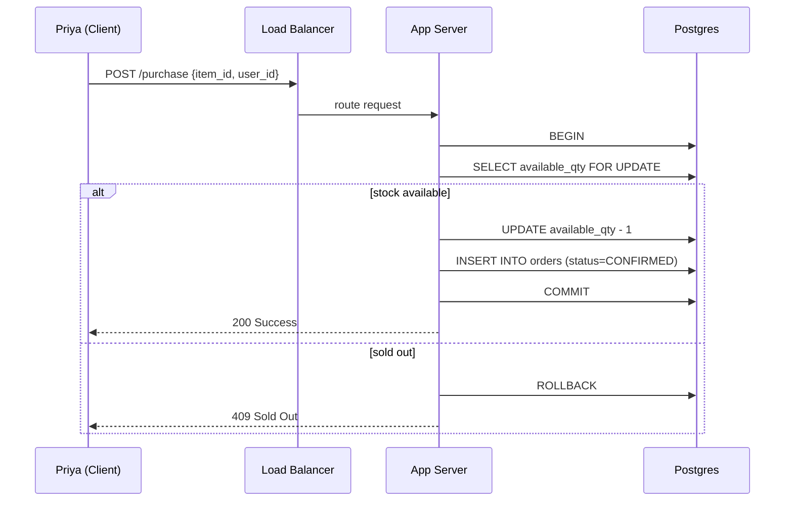
```mermaid
sequenceDiagram
    participant U as Priya (Client)
    participant LB as Load Balancer
    participant S as App Server
    participant DB as Postgres

    U->>LB: POST /purchase {item_id, user_id}
    LB->>S: route request
    S->>DB: BEGIN
    S->>DB: SELECT available_qty FOR UPDATE
    alt stock available
        S->>DB: UPDATE available_qty - 1
        S->>DB: INSERT INTO orders (status=CONFIRMED)
        S->>DB: COMMIT
        S-->>U: 200 Success
    else sold out
        S->>DB: ROLLBACK
        S-->>U: 409 Sold Out
    end
```

The `FOR UPDATE` lock is like a single teller window at a bank — no matter how many people crowd the lobby, only one person is being served at that window at any instant. Everyone else just waits their turn in line. That's why overselling is impossible here: there's no moment where two people can both see "1 left" and both take it.

## Current State (V0)

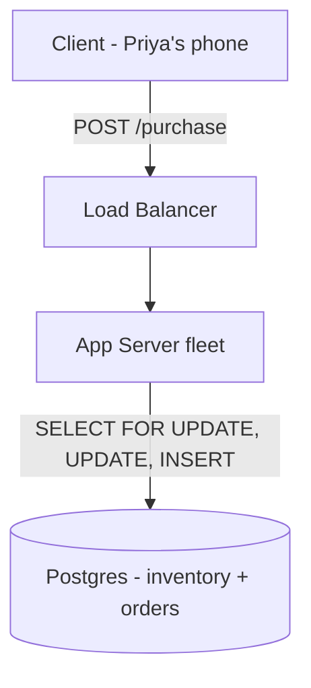
```mermaid
graph TD
    Client[Client - Priya's phone]
    LB[Load Balancer]
    App[App Server fleet]
    PG[(Postgres - inventory + orders)]

    Client -->|POST /purchase| LB
    LB --> App
    App -->|SELECT FOR UPDATE, UPDATE, INSERT| PG
```

**Flows as of V0:**
1. **Purchase flow** — as walked through above: lock the inventory row, decrement, insert order, commit.
2. That's the only flow that exists so far — no queueing, no caching, no reservation TTL yet.

## Interviewer Follow-ups

**"Why not just do a check-then-decrement without `FOR UPDATE`?"**
Because between the `SELECT` and the `UPDATE`, two concurrent transactions could both read `available_qty = 1`, both decide "I can buy," and both decrement — that's a classic race condition and it oversells. `FOR UPDATE` closes that gap by holding the row lock across both statements.

**"Why not just use `UPDATE inventory SET available_qty = available_qty - 1 WHERE item_id=42 AND available_qty > 0` and check rows-affected?"**
That's actually a valid, slightly leaner alternative to explicit locking — it's atomic as a single statement. Worth mentioning in an interview as a lighter-weight variant of the same idea. We'll stick with the explicit lock version here because it generalizes better once we add the order insert in the same transaction.

## Recap

| Concept | The Insight |
|---|---|
| Row-level lock (`FOR UPDATE`) | Serializes concurrent buyers on the same row, so no two people can decrement the same last unit. |
| Single Postgres primary | Correctness is easy when there's one place truth lives — that's exactly what won't scale. |
| Unique constraint | Cheapest possible enforcement of "1 unit per user," no application logic needed. |
| No queue yet | Every one of 2 million requests hits the database directly — this is about to be the problem. |

**One-breath version**: V0 stops overselling by serializing every buyer through a single row lock on one Postgres primary — which is exactly what collapses the moment 2 million people hit that lock in the same second.

Next up: we throw actual numbers at this — what happens to that single row lock when 2 million requests arrive in the same second — and watch V0 fall over for real.

Say "next" when ready.

---

## V1 — Break It: The Lock Queue Collapses

Let's put real numbers on V0.

Postgres row locks are cheap when contention is low. But at 10:00:00 sharp, 2 million requests try to acquire the **same row lock** for item 42, at the same instant.

Here's the concrete failure: each `SELECT ... FOR UPDATE` → `UPDATE` → `INSERT` → `COMMIT` cycle takes maybe 5-10ms on a healthy Postgres primary (disk fsync for the commit, WAL write, etc.). That means this single row can serialize roughly **100-200 transactions per second**, tops — because every single one has to wait for the previous one to fully commit before it can even acquire the lock.

At 2 million requests arriving in the first second, with a 150 TPS ceiling, the queue of waiting transactions grows without bound. Postgres has a limited number of connections (typically a few hundred to low thousands before things degrade badly). Requests 201 through 2,000,000 aren't just slow — they start timing out, retrying, and piling up as new connections, and the database falls over from connection exhaustion, not from the actual write volume.

This is a classic **hot lock** problem: one row, effectively one point of serialization, and demand that's 10,000x higher than what serialization can absorb.

Two named engineers hit this in the war room:

> **Arjun**: "Just throw more app servers at it, we'll horizontally scale the fleet."
> **Meera**: "Doesn't help — a hundred app servers all still fight over the *same row lock* in the *same database*. You've just made 100 doors into one hallway that only fits one person."

More app servers don't touch the bottleneck at all. The bottleneck was never CPU or app-server capacity — it's serialized access to one piece of shared, disk-backed state.

## Solve It

The fix: move the hot decrement off disk-backed Postgres and into an in-memory atomic operation — specifically, a single Redis `DECR` on a counter key.

Redis is single-threaded per command, which sounds like it should be worse, but it's actually the opposite: each `DECR` executes in microseconds (no disk fsync, no lock manager overhead, no WAL), so a single Redis instance can do 50,000-100,000+ operations per second on one key. That's roughly 500x the throughput ceiling we just hit on Postgres.

✅ **What we gained**
Massive throughput increase on the exact operation that was bottlenecking us — from ~150 TPS to tens of thousands of ops/sec on the same "one hot row" pattern.

⚠️ **What we gave up / new problem this creates**
Redis is now a second source of truth. If Redis says "decremented" but the order insert into Postgres fails afterward, we have a unit marked sold in Redis with no corresponding order — inventory and orders can drift out of sync. We're deliberately deferring this reconciliation problem to the next version; for now, treat it as a known gap.

❌ **What we considered and rejected**
- *Postgres with `SELECT ... FOR UPDATE SKIP LOCKED`*: helps multiple workers avoid blocking on each other, but it's designed for queue-worker patterns, not for a single hot counter — it doesn't fix the fundamental one-row throughput ceiling.
- *In-app JVM/process-local counter*: fast, but breaks the moment we have more than one app server, since each server would have its own independent count — instantly oversells.
- *Optimistic locking (version column, retry on conflict)*: at 2 million concurrent writers, the retry storm itself becomes the bottleneck — nearly every transaction would conflict and retry, which is worse than pessimistic locking here.

## Implement It

**Redis key**: `inventory:{item_id}` → integer, initialized to `100` before the sale starts (pre-warming, since we know the start time in advance).

**API**: same `POST /purchase` endpoint, body `{ "item_id": 42, "user_id": 917 }`.

New flow, step by step:

1. App server runs `DECR inventory:42` on Redis.
2. **Branch — result >= 0**: this request won a unit. Proceed to step 3.
3. **Branch — result < 0**: oversold in the counter sense. Immediately run `INCR inventory:42` to put it back (compensate), and return "sold out" to the user. This is why we decrement first and check after — it's a single atomic instruction, so there's no race window at all, unlike a `GET` then `DECR`.
4. For a winning request: write the order into Postgres — `INSERT INTO orders (order_id, item_id, user_id, status) VALUES (..., 42, 917, 'CONFIRMED')`.
5. If that Postgres insert fails (duplicate user, DB error), we've already decremented Redis — this is the drift problem flagged above. For now, log it as an inconsistency to reconcile; V2 will close this gap properly.

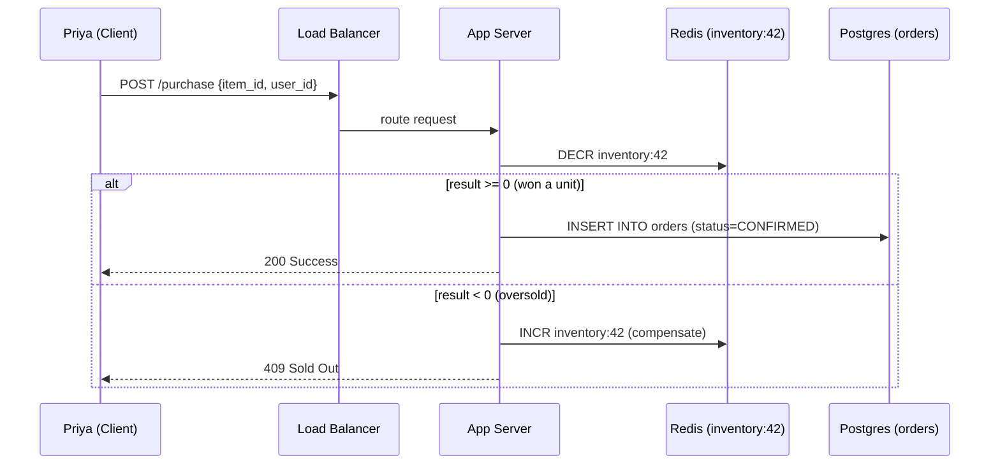
```mermaid
sequenceDiagram
    participant U as Priya (Client)
    participant LB as Load Balancer
    participant S as App Server
    participant R as Redis (inventory:42)
    participant DB as Postgres (orders)

    U->>LB: POST /purchase {item_id, user_id}
    LB->>S: route request
    S->>R: DECR inventory:42
    alt result >= 0 (won a unit)
        S->>DB: INSERT INTO orders (status=CONFIRMED)
        S-->>U: 200 Success
    else result < 0 (oversold)
        S->>R: INCR inventory:42 (compensate)
        S-->>U: 409 Sold Out
    end
```

Think of it like a stadium turnstile counter versus a bank teller. The teller (Postgres transaction) has to fully process one customer — count cash, write receipt, hand over goods — before the next person even enters the room. The turnstile (Redis `DECR`) just clicks down a number, instantly, and lets the person through; the actual "processing" (order creation) happens somewhere else, after they're already past the gate.

## Current State (V1)

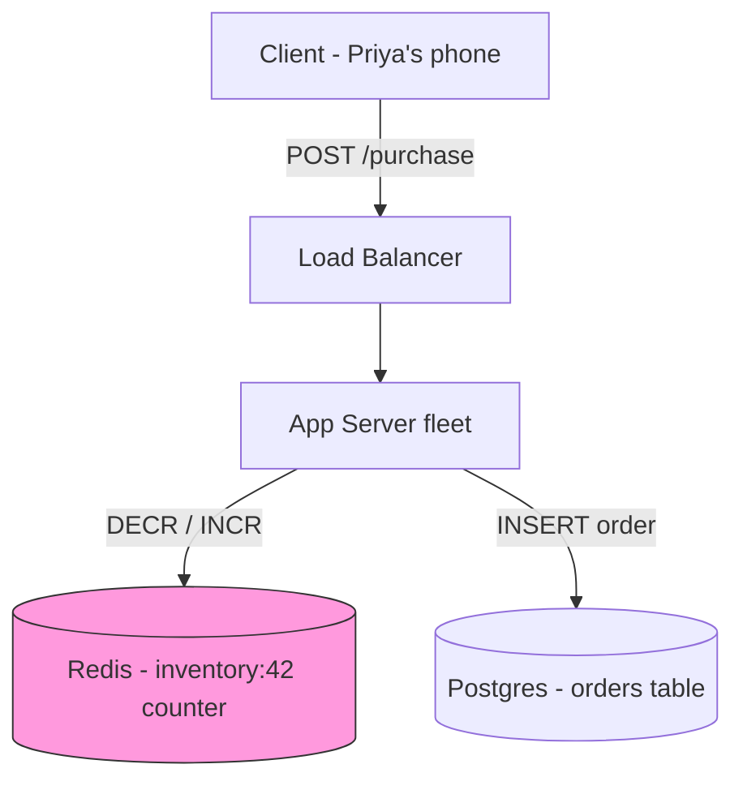
```mermaid
graph TD
    Client[Client - Priya's phone]
    LB[Load Balancer]
    App[App Server fleet]
    Redis[(Redis - inventory:42 counter)] 
    PG[(Postgres - orders table)]

    Client -->|POST /purchase| LB
    LB --> App
    App -->|DECR / INCR| Redis
    App -->|INSERT order| PG

    style Redis fill:#f9d,stroke:#333
```
*Redis counter is new in V1. Inventory count moves out of Postgres; Postgres now only holds `orders`.*

**Flows as of V1:**
1. **Purchase flow** — `DECR` on Redis first (atomic, in-memory, wins-or-loses in one instruction). If it wins, insert the order into Postgres. If Redis says oversold, compensate with `INCR` and reject. (Changed this version — see steps above.)
2. No queueing or reservation-TTL flow yet — still direct hit, just against a faster hot path now.

## Interviewer Follow-ups

**"What if Redis goes down right at 10:00:00?"**
Then the entire purchase path is unavailable — Redis is now a single point of failure for the hottest moment of the whole system's life. This is exactly why Redis needs its own replication/HA story, which we'll cover when we get to the Replication version.

**"Why not use Redis `INCR`/`DECR` with Lua scripting to combine the decrement and the order-write into one atomic step?"**
Redis Lua scripts are atomic within Redis, but the order data needs to live in Postgres (relational queries, joins with users/payments later) — so we can't fully atomically combine a Redis operation with a Postgres insert. That gap between the two stores is precisely the drift problem we flagged, and it's what the next version fixes properly.

## Recap

| Concept | The Insight |
|---|---|
| Hot lock / hot row | One row, one point of serialization — throughput ceiling regardless of how many app servers you add. |
| Postgres row-lock TPS ceiling | ~100-200 TPS from fsync/WAL overhead per commit — nowhere near 2M/sec demand. |
| Redis atomic `DECR` | In-memory, single instruction, no disk fsync — 500x+ throughput on the same "one hot counter" shape. |
| Decrement-then-check | Avoids the GET-then-DECR race entirely, since `DECR` itself is atomic — no window for two requests to both see "1 left." |
| Redis/Postgres drift | Moving the hot path to Redis creates a new two-system consistency problem — deferred to next version, not solved yet. |

**One-breath version**: If asked why you don't just scale app servers under contention — more app servers don't help when they're all serializing on one row lock in one database, so you move the atomic decrement off disk into an in-memory Redis counter to raise the throughput ceiling by orders of magnitude.

Next up: we close the Redis/Postgres drift gap — what happens when the counter says "sold" but the order never actually gets created.

Say "next" when ready.

---

## V2 — Break It: The Vanishing Unit

V1 fixed throughput. It didn't fix durability.

Here's the concrete failure. App server A handles Priya's request, runs `DECR inventory:42`, gets back `45` — she won a unit. Before that same request handler can execute the `INSERT INTO orders`, the app server process gets killed — a mid-deploy restart, an OOM kill under the traffic spike, a connection pool timeout to Postgres that never resolves.

Redis has already been decremented. That unit is gone from the count. But no order was ever created — nobody actually got it, and it can never be re-sold, because as far as Redis is concerned, that unit is spoken for.

Now scale that up. During a 2-million-request thundering herd, app servers under memory pressure and connection exhaustion don't fail at some negligible rate — even a **2% failure rate on the winning requests** (very plausible when connection pools to Postgres are maxed out) means, out of 100 total units, roughly **2 units vanish into limbo**. The business sees "sold out" but only 98 real orders exist. That's not a rounding error — it's 2% of total inventory silently gone, and it's exactly the kind of bug that shows up in a post-mortem, not a load test.

> **Arjun**: "Can't we just have the app server retry the Postgres insert if it fails?"
> **Meera**: "Retry after what? The server's *dead*. There's nothing left to retry — the only record that Priya ever won anything lived in that process's memory, and it's gone with it."

The real problem: the moment of "winning" (the Redis `DECR`) and the moment of "durably recording the win" (the Postgres insert) are two separate steps with nothing durable connecting them. If anything happens between those two steps, the win is lost forever.

## Solve It

The fix: put a durable, replicated log between "won" and "recorded" — so the win survives even if the app server that handled it dies a millisecond later.

Concretely: once `DECR` succeeds, the app server publishes a reservation event to Kafka *before* responding to the user. Kafka replicates that event across brokers immediately — it's durable the moment it's acknowledged. A separate pool of worker processes consumes that topic and writes the actual order into Postgres, independently of whichever app server originally handled the request.

✅ **What we gained**
A won unit can never silently vanish. Even if the app server dies right after publishing to Kafka, the event still exists and a worker will eventually process it — the win survives the crash of whatever produced it.

⚠️ **What we gave up / new problem this creates**
The order isn't written to Postgres synchronously anymore — there's now a small lag between "Redis says you won" and "Postgres has your order." We need a `PENDING` order status to represent that gap, and callers checking order status need to handle it. We're also now running a consumer fleet that itself needs monitoring — one more moving part.

❌ **What we considered and rejected**
- **Two-phase commit across Redis and Postgres**: would technically give atomicity, but 2PC is a blocking protocol — every transaction waits on a coordinator round-trip, which reintroduces the exact serialization bottleneck we just escaped in V1.
- **Synchronous retry loop inside the same request handler**: doesn't help, because if the *server itself* dies, there's no process left alive to retry anything — the state only existed in that process's memory.
- **Write-ahead to Postgres, then decrement Redis**: flips the order, but now a Postgres write can succeed while a concurrent Redis decrement conflicts with it — you'd need to re-derive the same locking story we already escaped, just moved one step earlier.

## Implement It

**New Kafka topic**: `flash-sale-reservations`

Event payload (JSON), one per winning request:
```json
{
  "reservation_id": "res_8827f1",
  "item_id": 42,
  "user_id": 917,
  "reserved_at": "2026-09-02T10:00:00.114Z"
}
```

**Who writes**: the App Server, immediately after a winning `DECR`, before responding to the client.
**Who reads**: a new **Order Processor** worker pool, consuming this topic continuously.
**Where it lives**: Kafka cluster, topic partitioned by `item_id` (all events for item 42 land on the same partition, preserving order of arrival — useful for fairness later).

Updated `orders` table — one new value in `status`:
```sql
-- status now takes: 'PENDING', 'CONFIRMED', 'EXPIRED'
```

Step by step, the new flow:

1. App server runs `DECR inventory:42` on Redis (unchanged from V1).
2. **Branch — result < 0**: compensate with `INCR`, return "sold out." (unchanged from V1)
3. **Branch — result >= 0**: app server publishes to Kafka: `producer.send("flash-sale-reservations", key=item_id, value={reservation_id, item_id, user_id, reserved_at})`.
4. If the Kafka publish itself fails (broker unreachable) — compensate with `INCR inventory:42` and return "sold out" to the user. We only tell Priya she won once the win is durably recorded somewhere outside the app server's memory.
5. App server responds `202 Accepted` to Priya immediately — status: `PENDING`. It does **not** wait for Postgres.
6. **Order Processor** (separate service, consuming Kafka): on receiving the event, runs `INSERT INTO orders (order_id, item_id, user_id, status) VALUES (..., 42, 917, 'PENDING') ON CONFLICT (item_id, user_id) DO NOTHING`.
7. The `ON CONFLICT DO NOTHING` is what makes this safe against Kafka's at-least-once delivery — if the same event is redelivered after a consumer restart, the second insert is a harmless no-op instead of a duplicate order.

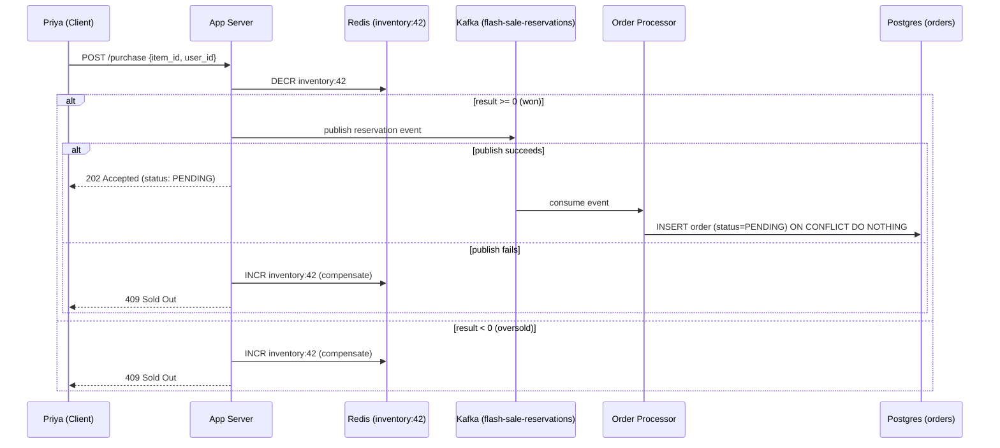
```mermaid
sequenceDiagram
    participant U as Priya (Client)
    participant S as App Server
    participant R as Redis (inventory:42)
    participant K as Kafka (flash-sale-reservations)
    participant OP as Order Processor
    participant DB as Postgres (orders)

    U->>S: POST /purchase {item_id, user_id}
    S->>R: DECR inventory:42
    alt result >= 0 (won)
        S->>K: publish reservation event
        alt publish succeeds
            S-->>U: 202 Accepted (status: PENDING)
            K->>OP: consume event
            OP->>DB: INSERT order (status=PENDING) ON CONFLICT DO NOTHING
        else publish fails
            S->>R: INCR inventory:42 (compensate)
            S-->>U: 409 Sold Out
        end
    else result < 0 (oversold)
        S->>R: INCR inventory:42 (compensate)
        S-->>U: 409 Sold Out
    end
```

Think of Kafka here like a certified mail receipt versus a verbal promise. In V1, the app server "told" Postgres about the win by trying to write it directly — if the messenger collapses on the way, the message never arrives, and no one can prove it was ever sent. Publishing to Kafka first is like getting a certified, timestamped receipt the instant you hand off the message — even if you keel over right after, the receipt exists independently of you, and someone else can pick it up and finish the delivery.

## Current State (V2)

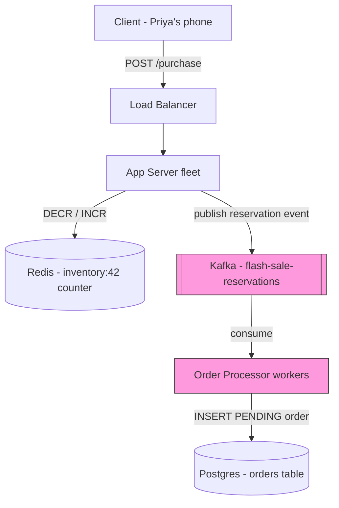
```mermaid
graph TD
    Client[Client - Priya's phone]
    LB[Load Balancer]
    App[App Server fleet]
    Redis[(Redis - inventory:42 counter)]
    Kafka[[Kafka - flash-sale-reservations]]
    OP[Order Processor workers]
    PG[(Postgres - orders table)]

    Client -->|POST /purchase| LB
    LB --> App
    App -->|DECR / INCR| Redis
    App -->|publish reservation event| Kafka
    Kafka -->|consume| OP
    OP -->|INSERT PENDING order| PG

    style Kafka fill:#f9d,stroke:#333
    style OP fill:#f9d,stroke:#333
```
*Kafka topic and Order Processor worker pool are new in V2. App server no longer talks to Postgres directly — that responsibility moves entirely to the Order Processor.*

**Flows as of V2:**
1. **Purchase flow** — `DECR` on Redis, then publish to Kafka (compensating with `INCR` if either the decrement or the publish fails), then respond `202 PENDING` immediately without waiting on Postgres. (Changed this version.)
2. **Order recording flow (new)** — Order Processor consumes the Kafka topic and inserts a `PENDING` order into Postgres, using `ON CONFLICT DO NOTHING` for safety against redelivery.
3. No payment step or TTL-expiry flow yet — orders sit in `PENDING` with nothing moving them to `CONFIRMED` or `EXPIRED`. That's next.

## Interviewer Follow-ups

**"What if the Order Processor itself crashes mid-batch?"**
Kafka tracks consumer offsets — if the Order Processor dies before committing an offset, that event gets redelivered to another instance in the consumer group on restart. The `ON CONFLICT DO NOTHING` makes that redelivery idempotent, so no double-processing.

**"Doesn't this mean Priya sees 'Accepted' before she actually has a confirmed order?"**
Yes, deliberately — she has a `PENDING` reservation, not a confirmed purchase yet. That's honest about what actually happened, and it sets up the next piece naturally: she still needs to pay within a TTL window, which is exactly what turns `PENDING` into `CONFIRMED` or `EXPIRED`.

## Recap

| Concept | The Insight |
|---|---|
| Durability gap | A "win" that lives only in one app server's memory disappears if that server crashes — nothing to retry. |
| Kafka as durable handoff | Publishing before responding means the win survives the producer's death — a replicated log, not a promise. |
| At-least-once + idempotency | Kafka can redeliver; `ON CONFLICT DO NOTHING` on `(item_id, user_id)` makes redelivery harmless instead of dangerous. |
| Decoupling win from record | The app server's job ends at "durably queued" — a separate worker owns turning that into a Postgres row, on its own time. |
| PENDING status | Honest reflection of reality: winning a race isn't the same as having a confirmed order yet. |

**One-breath version**: If asked how you stop a "won" unit from vanishing when the handling server crashes: don't let the win live only in one process's memory, publish it to a durable, replicated log first, and let an independent worker turn that log entry into the actual order — so the win outlives whatever server produced it.

Next up: Priya has a `PENDING` reservation — now what happens if she never pays? We build the TTL expiry and inventory-release mechanism.

Say "next" when ready.

---

## V3 — Break It: The Reservation That Never Lets Go

Priya's request came back `202 Accepted`, status `PENDING`. She's now supposed to complete payment within 5 minutes.

But say she closes the tab. Or her card gets declined and she gives up. Or she just got distracted — 2 million people just did the same click, plenty of them were never serious buyers, they just wanted to see if they'd get lucky.

Here's the concrete failure: nothing in the system today ever looks at a `PENDING` order again. The Redis counter was decremented the instant she won. If she never pays, that unit is permanently gone from `available_qty` in Redis, but it was never actually sold to anyone. Out of 100 units, if even 15% of "winners" abandon checkout — completely realistic for a flash sale, where plenty of people are just testing their luck — **15 real units sit locked up forever**, unsellable, while genuine buyers behind them get told "sold out" for stock that's actually just sitting idle.

> **Arjun**: "So we just... never expire it? She reserved it, it's hers."
> **Meera**: "For five minutes, sure. But if she never pays, that unit needs to go back in the pool — otherwise we've built a system where abandoning checkout is functionally the same as buying, except nobody gets the phone."

This is a **timeout / reclaim** problem: we created state (`PENDING`) with an implicit expectation ("pay soon"), but nothing enforces that expectation or reverses it if it's violated.

## Solve It

The fix: give every reservation an actual TTL enforced by Redis itself, and run a background sweep that reclaims expired ones — releasing the Redis counter and marking the Postgres order `EXPIRED`.

✅ **What we gained**
Abandoned reservations get returned to the sellable pool automatically, within a bounded time window. No unit is lost to a buyer who never intended to complete the purchase.

⚠️ **What we gave up / new problem this creates**
There's now a real race between "user pays right at the 4:59 mark" and "expiry sweep fires at 5:00" — we need the payment-confirmation path and the expiry path to never both succeed on the same reservation. We also need a background job (the sweep) that itself has to run reliably during the highest-load window of the whole system's life.

❌ **What we considered and rejected**
- **No TTL, manual cancel only**: relies on the user explicitly canceling, which almost nobody does — they just abandon the tab. Doesn't solve the actual problem.
- **Cron job scanning Postgres for old `PENDING` rows**: works, but polling Postgres every few seconds during peak load adds read pressure to the exact database we're trying to protect, and introduces a polling-interval delay before reclaim.
- **Client-side timer that calls a "release" API on expiry**: never trust the client to tell you when to give up its own reservation — if the tab is closed, that call never fires at all.

## Implement It

We use Redis's native key expiry instead of a separate scheduler, and pair it with a **keyspace notification** to trigger the actual release.

**New Redis key per reservation**: `reservation:{reservation_id}` → value `{item_id, user_id}`, with `EX 300` (5-minute TTL) set at creation time.

**Redis config change**: enable keyspace notifications for expired events —
```
notify-keyspace-events Ex
```
This makes Redis publish an event on a special pub/sub channel the instant a key expires, instead of us having to poll for it.

Step by step, the new flow (building on V2):

1. App server wins the `DECR` (unchanged from V2), publishes to Kafka (unchanged from V2).
2. **New step**: app server also runs `SET reservation:res_8827f1 "{item_id:42,user_id:917}" EX 300` on Redis — a TTL-bearing key representing "this reservation is alive for 300 seconds."
3. Order Processor inserts the `PENDING` order into Postgres (unchanged from V2), now also storing `reservation_id` and `expires_at` on the row.
4. **Payment path (new)**: `POST /payment` with `{ "reservation_id": "res_8827f1", "payment_token": "..." }`. Payment service processes the charge, then on success: `UPDATE orders SET status='CONFIRMED' WHERE reservation_id='res_8827f1' AND status='PENDING'`, and deletes `reservation:res_8827f1` from Redis (`DEL`) so it can't later fire an expiry event.
5. **Expiry path (new)**: when Redis's TTL fires on `reservation:res_8827f1` (nobody paid), Redis publishes to the `__keyevent@0__:expired` channel. A dedicated **Reservation Reaper** service subscribes to that channel.
6. Reaper receives the expired key, runs `UPDATE orders SET status='EXPIRED' WHERE reservation_id='res_8827f1' AND status='PENDING'` — the `AND status='PENDING'` guard is the race-safety here: if payment already confirmed it a moment earlier, this update matches zero rows and does nothing.
7. Reaper then runs `INCR inventory:42` on Redis — the unit is back in the sellable pool.

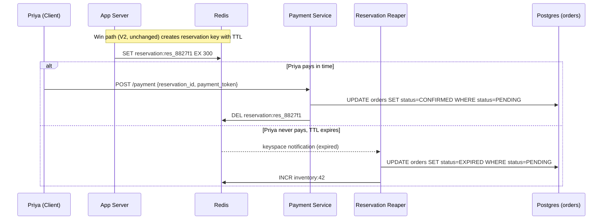
```mermaid
sequenceDiagram
    participant U as Priya (Client)
    participant S as App Server
    participant R as Redis
    participant PaySvc as Payment Service
    participant Reaper as Reservation Reaper
    participant DB as Postgres (orders)

    Note over S,R: Win path (V2, unchanged) creates reservation key with TTL
    S->>R: SET reservation:res_8827f1 EX 300

    alt Priya pays in time
        U->>PaySvc: POST /payment {reservation_id, payment_token}
        PaySvc->>DB: UPDATE orders SET status=CONFIRMED WHERE status=PENDING
        PaySvc->>R: DEL reservation:res_8827f1
    else Priya never pays, TTL expires
        R-->>Reaper: keyspace notification (expired)
        Reaper->>DB: UPDATE orders SET status=EXPIRED WHERE status=PENDING
        Reaper->>R: INCR inventory:42
    end
```

This is exactly like a restaurant holding your table for 15 minutes after your reservation time. If you show up, the table's yours and the clock stops mattering. If you don't, the host doesn't wait around checking a list every few minutes — the hold just lapses on its own, and the table's back on the floor for the next walk-in.

## Current State (V3)

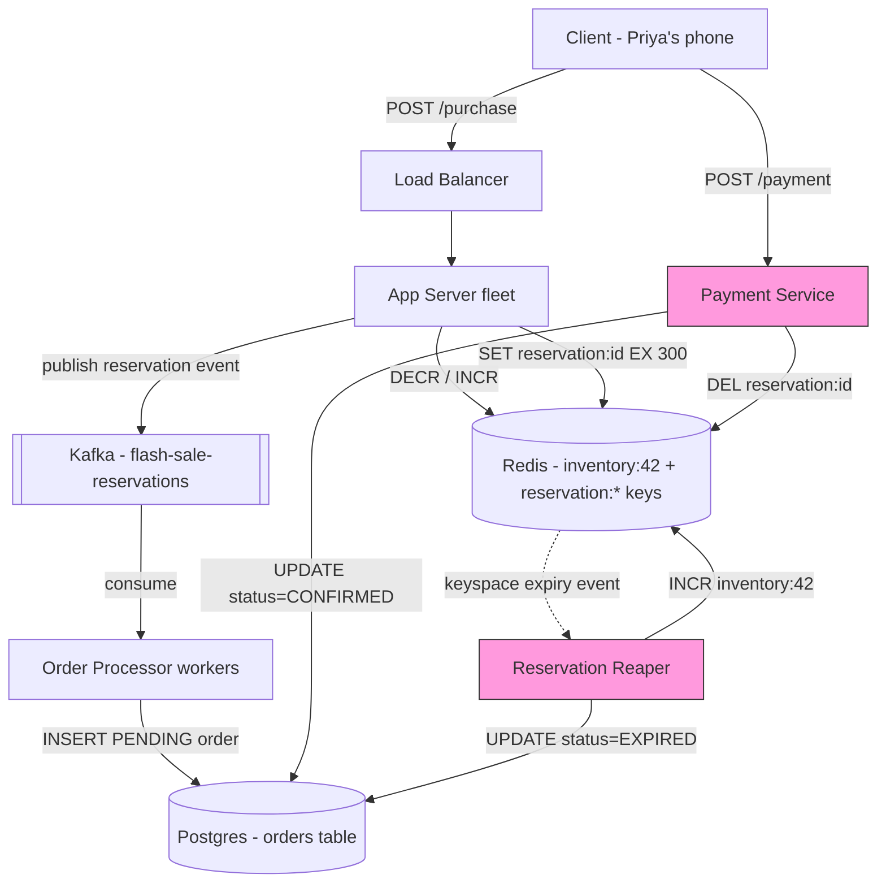
```mermaid
graph TD
    Client[Client - Priya's phone]
    LB[Load Balancer]
    App[App Server fleet]
    Redis[(Redis - inventory:42 + reservation:* keys)]
    Kafka[[Kafka - flash-sale-reservations]]
    OP[Order Processor workers]
    PG[(Postgres - orders table)]
    PaySvc[Payment Service]
    Reaper[Reservation Reaper]

    Client -->|POST /purchase| LB
    LB --> App
    App -->|DECR / INCR| Redis
    App -->|SET reservation:id EX 300| Redis
    App -->|publish reservation event| Kafka
    Kafka -->|consume| OP
    OP -->|INSERT PENDING order| PG
    Client -->|POST /payment| PaySvc
    PaySvc -->|UPDATE status=CONFIRMED| PG
    PaySvc -->|DEL reservation:id| Redis
    Redis -.->|keyspace expiry event| Reaper
    Reaper -->|UPDATE status=EXPIRED| PG
    Reaper -->|INCR inventory:42| Redis

    style PaySvc fill:#f9d,stroke:#333
    style Reaper fill:#f9d,stroke:#333
```
*Payment Service and Reservation Reaper are new in V3. Redis now also holds per-reservation TTL keys, not just the inventory counter.*

**Flows as of V3:**
1. **Purchase flow** — `DECR` Redis, `SET` a TTL reservation key, publish to Kafka, respond `202 PENDING`. Unchanged from V2 except for the new `SET ... EX 300` step.
2. **Order recording flow** — Order Processor consumes Kafka, inserts `PENDING` order. Unchanged from V2.
3. **Payment flow (new)** — user pays, order flips to `CONFIRMED`, reservation key deleted from Redis.
4. **Expiry/reclaim flow (new)** — Redis TTL fires, Reaper marks the order `EXPIRED` and returns the unit to the Redis counter via `INCR`.

## Interviewer Follow-ups

**"What if the payment confirms at 4:59.9 and the TTL fires at 5:00.0 — could both paths run?"**
The `AND status='PENDING'` guard on both updates makes this safe — whichever write lands first flips the status, and the second one's conditional update matches zero rows. It's a compare-and-swap on the status column, not a true two-way race.

**"What if the Reaper itself goes down and misses expiry events?"**
Redis keyspace notifications are fire-once, not durable — a missed one means that unit is stuck as `PENDING` forever, which is a real gap. In production you'd pair this with a periodic low-frequency reconciliation job (e.g., every few minutes, sweep Postgres for `PENDING` orders past their `expires_at`) as a safety net — belt and suspenders, not relying on keyspace notifications alone.

## Recap

| Concept | The Insight |
|---|---|
| Reservation TTL | Every "won" state needs an expiry, or abandoned reservations permanently lock up real inventory. |
| Redis native `EX` + keyspace notifications | Push-based expiry instead of polling Postgres — no added read load on the database under peak traffic. |
| Conditional update as compare-and-swap | `WHERE status='PENDING'` on both payment and expiry paths makes the two paths mutually exclusive without explicit locking. |
| Reaper as reclaim service | A dedicated consumer of expiry events, decoupled from the payment path, restores inventory independently. |
| Keyspace notifications aren't durable | A missed expiry event needs a periodic reconciliation sweep as a fallback — pub/sub alone isn't enough for correctness-critical reclaim. |

**One-breath version**: If asked how you handle abandoned reservations: give every reservation a TTL enforced by Redis itself, use a conditional `WHERE status='PENDING'` update so payment and expiry can never both win, and reclaim the unit through a dedicated reaper — with a periodic Postgres sweep as a safety net in case the expiry event itself gets dropped.

Next up: 2 million people are about to hit this system's load balancer and app-server fleet in the same second — we haven't touched the front door yet. Time to build the waiting room / virtual queue that gates entry before checkout even starts.

Say "next" when ready.

---

## V4 — Break It: The Front Door Collapses Before Redis Even Sees a Request

We've made the actual purchase operation blazing fast — a Redis `DECR` in microseconds. But 2 million clients are still going to hit the **load balancer and app-server fleet** at literally the same second, all before any of them even reach that fast Redis operation.

Here's the concrete failure. Say we run 50 app server instances, each capable of handling 2,000 concurrent connections comfortably — that's 100,000 concurrent connections total, generously. At 10:00:00, 2 million clients open connections in the same second. That's **20x over capacity**, instantly.

This isn't a throughput problem anymore — even though each request finishes in milliseconds, the sheer number of simultaneous connections exhausts file descriptors, connection pool slots, and memory buffers on the app servers themselves. TCP accept queues overflow. The load balancer starts shedding connections indiscriminately — not "the 100,001st person is turned away politely," but "random connections drop everywhere, including some of the first 100 people who should have won."

> **Arjun**: "Can't we just autoscale the app server fleet the moment we see the spike?"
> **Meera**: "Autoscaling takes minutes to provision and warm up new instances. The spike is over in the first 2-3 seconds. By the time new servers are ready, the stampede has already happened and already caused damage."

The real problem: we've been treating "let everyone attempt checkout simultaneously" as a given. It doesn't have to be. Most of these 2 million people are going to lose anyway — only 100 units exist. We don't need all 2 million of them touching the checkout path at once.

## Solve It

The fix: a **virtual waiting room** — a lightweight gate in front of checkout that admits users in controlled batches, instead of letting everyone stampede the app-server fleet at once.

This is a load-shedding / admission-control mechanism. Instead of everyone competing for app-server connections directly, users first get a queue position. Only users who've been "let in" by the queue are allowed to call `/purchase` at all.

✅ **What we gained**
The app-server fleet only ever sees a controlled, bounded rate of checkout attempts — say, 5,000 admitted per second — regardless of how many millions are waiting. The connection-exhaustion failure mode disappears entirely, because the fleet never sees more concurrent load than it was sized for.

⚠️ **What we gave up / new problem this creates**
We've now introduced an entirely new distributed system — the queue itself — which needs to handle 2 million simultaneous "give me a position" requests without falling over the same way. We've moved the stampede problem one layer back, not eliminated it; the queue's entry point has to be built for exactly this kind of spike (cheap, statelessness-friendly writes), while checkout does not.

❌ **What we considered and rejected**
- **Rate limiting only, no queue (just reject over-limit requests)**: simpler, but gives no fairness — someone who tries at 10:00:03 has the same shot as someone who was there at 10:00:00, since it's memoryless. Flash sales are expected to reward being early, and users perceive naive rejection as broken/unfair.
- **CAPTCHA gate before checkout**: slows bots down, but adds real friction for genuine users and doesn't actually bound concurrent load on the app-server fleet — a human solving a CAPTCHA still eventually floods the same checkout endpoint.
- **Client-side artificial delay (stagger requests via JS)**: trivially bypassed by anyone calling the API directly instead of using the web client — provides zero real guarantee.

## Implement It

**New Redis structure**: a sorted set, `waiting_room:{item_id}`, where each member is a `user_id` and the score is the timestamp they joined the queue (this gives natural FIFO ordering, which is our fairness requirement from Scope).

**API**: `POST /queue/join` with body `{ "item_id": 42, "user_id": 917 }` — called the moment the user lands on the sale page, before the sale even starts (we know the start time in advance, so we open the waiting room a few minutes early).

Step by step, the new front-door flow:

1. Client calls `POST /queue/join`. App server runs `ZADD waiting_room:42 NX <timestamp> 917` — `NX` ensures a user can't re-join and jump ahead by re-calling this endpoint.
2. App server opens a WebSocket connection to the client and returns immediately: `{"status": "queued", "position": <rank>}`.
3. A separate **Queue Admitter** service runs on a fixed interval (say, every 200ms), pulling the lowest-score N members from `waiting_room:42` — `ZRANGE waiting_room:42 0 4999` for a batch of 5,000 — and removing them: `ZREMRANGEBYRANK waiting_room:42 0 4999`.
4. For each admitted `user_id`, the Admitter generates a short-lived **admission token**: `SET admission_token:{token} "{user_id}" EX 60` in Redis — valid for 60 seconds, enough time to complete the purchase attempt.
5. Admitter pushes the token to the client over the already-open WebSocket: `{"status": "admitted", "token": "tok_abc123"}`.
6. Client now calls `POST /purchase` with the token attached: `{ "item_id": 42, "user_id": 917, "admission_token": "tok_abc123" }`.
7. App server validates: `GET admission_token:tok_abc123` — if present and matches `user_id`, proceed into the V3 flow (`DECR`, reservation, Kafka publish, etc.) unchanged. If missing/expired, reject with "admission expired, rejoin queue."
8. Users still waiting get periodic WebSocket pushes with updated position, so they're not polling the server.

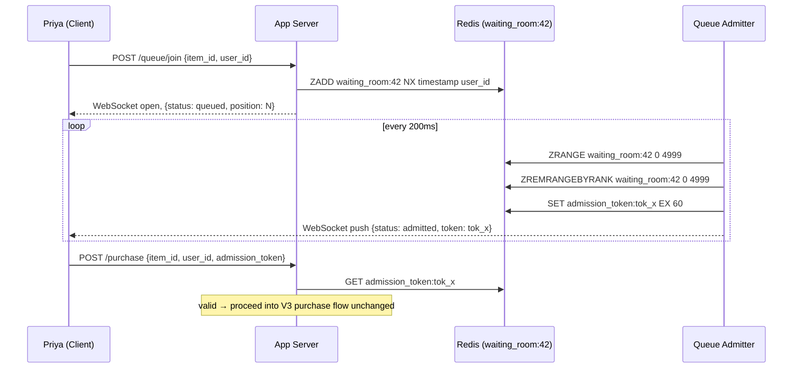
```mermaid
sequenceDiagram
    participant U as Priya (Client)
    participant App as App Server
    participant R as Redis (waiting_room:42)
    participant Adm as Queue Admitter

    U->>App: POST /queue/join {item_id, user_id}
    App->>R: ZADD waiting_room:42 NX timestamp user_id
    App-->>U: WebSocket open, {status: queued, position: N}

    loop every 200ms
        Adm->>R: ZRANGE waiting_room:42 0 4999
        Adm->>R: ZREMRANGEBYRANK waiting_room:42 0 4999
        Adm->>R: SET admission_token:tok_x EX 60
        Adm-->>U: WebSocket push {status: admitted, token: tok_x}
    end

    U->>App: POST /purchase {item_id, user_id, admission_token}
    App->>R: GET admission_token:tok_x
    Note over App: valid → proceed into V3 purchase flow unchanged
```

Think of this like the numbered-ticket system at a busy deli counter. Everyone who walks in takes a ticket the instant they arrive — that's cheap, fast, and never overwhelms the door. But only one number is called at a time, at a pace the counter staff can actually handle. The counter itself never experiences a crowd; the crowd exists only in the waiting area, which was built to absorb exactly this kind of pile-up.

## Current State (V4)

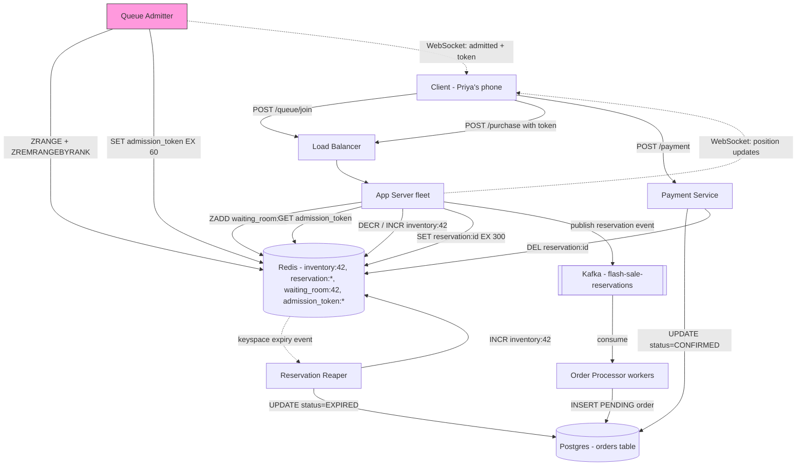
```mermaid
graph TD
    Client[Client - Priya's phone]
    LB[Load Balancer]
    App[App Server fleet]
    Redis[(Redis - inventory:42, reservation:*, waiting_room:42, admission_token:*)]
    Kafka[[Kafka - flash-sale-reservations]]
    OP[Order Processor workers]
    PG[(Postgres - orders table)]
    PaySvc[Payment Service]
    Reaper[Reservation Reaper]
    Adm[Queue Admitter]

    Client -->|POST /queue/join| LB --> App
    App -->|ZADD waiting_room:42| Redis
    App -.->|WebSocket: position updates| Client

    Adm -->|ZRANGE + ZREMRANGEBYRANK| Redis
    Adm -->|SET admission_token EX 60| Redis
    Adm -.->|WebSocket: admitted + token| Client

    Client -->|POST /purchase with token| LB
    App -->|GET admission_token| Redis
    App -->|DECR / INCR inventory:42| Redis
    App -->|SET reservation:id EX 300| Redis
    App -->|publish reservation event| Kafka
    Kafka -->|consume| OP
    OP -->|INSERT PENDING order| PG
    Client -->|POST /payment| PaySvc
    PaySvc -->|UPDATE status=CONFIRMED| PG
    PaySvc -->|DEL reservation:id| Redis
    Redis -.->|keyspace expiry event| Reaper
    Reaper -->|UPDATE status=EXPIRED| PG
    Reaper -->|INCR inventory:42| Redis

    style Adm fill:#f9d,stroke:#333
```
*Queue Admitter and the waiting-room/admission-token Redis structures are new in V4. Everything from V3 onward (Redis counter, Kafka, Order Processor, Payment Service, Reaper) is unchanged — purchase now just requires a valid admission token as a precondition.*

**Flows as of V4:**
1. **Queue-join flow (new)** — client joins `waiting_room:42` sorted set, opens a WebSocket, gets periodic position updates.
2. **Admission flow (new)** — Queue Admitter pulls a fixed-size batch off the queue on a fixed interval, issues short-lived admission tokens, pushes them over WebSocket.
3. **Purchase flow** — unchanged from V3 except for one new precondition: `/purchase` now first validates the admission token before touching `DECR`.
4. **Order recording flow** — unchanged from V2.
5. **Payment flow** — unchanged from V3.
6. **Expiry/reclaim flow** — unchanged from V3.

## Interviewer Follow-ups

**"What stops someone from hitting `/purchase` directly, skipping the queue entirely?"**
The admission-token check at the top of `/purchase` — without a valid, unexpired token tied to their `user_id`, the request is rejected before it ever reaches the Redis `DECR`. The queue isn't just a UI nicety, it's an enforced precondition on the hot path.

**"Why sorted set instead of a Kafka queue for the waiting room?"**
Kafka is great for ordered, durable event streams, but we need random-access operations here — checking someone's position, letting the Admitter pull an arbitrary batch off the front. A Redis sorted set gives O(log N) rank lookups and O(log N + M) range pulls, which fits this access pattern better than a log built for sequential consumption.

## Recap

| Concept | The Insight |
|---|---|
| Connection exhaustion vs. throughput | A fast operation doesn't help if the fleet can't even accept enough simultaneous connections to reach it. |
| Virtual waiting room | Decouples "arrived" from "allowed to attempt checkout" — bounds load on the hot path independent of how many people show up. |
| Redis sorted set for the queue | Gives FIFO ordering (fairness) plus O(log N) rank/range operations — fits random-access admission better than a pure log. |
| Short-lived admission tokens | Being admitted doesn't mean forever — a 60s window keeps someone from getting a token and sitting on it indefinitely. |
| WebSocket push over polling | Keeps 2 million waiting clients from hammering the server with position-check polls every few seconds. |

**One-breath version**: If asked how you keep 2 million simultaneous requests from crashing the app-server fleet before checkout even starts: don't let everyone attempt checkout at once, admit them in controlled batches through a Redis-sorted-set waiting room with short-lived tokens, so the checkout path only ever sees the load it was actually sized for.

Next up: we haven't touched horizontal scaling of the app-server fleet itself yet, or what happens when this one item's traffic needs to be isolated from everything else running in production. Time to talk Scaling properly.

Say "next" when ready.

---

## V5 — Scaling: What Do These Servers Actually Hold Locally?

Vertical scaling — buying a bigger box — has a hard ceiling. There's a biggest instance AWS sells, and even before you hit it, a single machine restarting for a patch means total downtime, because there's only one of it.

Horizontal scaling — more, smaller boxes behind a load balancer — has no such ceiling. But it only works cleanly if any request can go to any server. The moment a server holds something in memory that only it knows about, you can't freely load-balance across the fleet anymore.

Here's where that bites us today. In V4, when Priya calls `POST /queue/join`, the app server opens a **WebSocket connection directly with her browser** and holds it open to push position updates and admission tokens. That WebSocket connection lives in that one server's memory and OS socket table — nowhere else.

Say we have 10 app server instances, and a standard round-robin or least-connections load balancer in front. Priya's `/queue/join` lands on server 7 — her WebSocket is now pinned to server 7. If the load balancer or an infra event routes her later `/purchase` call to server 3 instead (completely plausible, since HTTP requests are independent by default), server 3 has no idea who Priya is, what her queue position was, or whether she's been admitted. Worse: if server 7 gets restarted mid-sale (deploy, OOM, autoscaling scale-down), her WebSocket just drops, and nothing on any other server knows to reconnect her or resume her position.

> **Arjun**: "So we just make the load balancer always send Priya back to server 7? Sticky sessions."
> **Meera**: "That works until server 7 is the one that goes down — then she's not stuck on a bad server, she's just gone. Sticky sessions trade the state problem for a fragility problem."

The real issue: **the WebSocket connection and the admission state are the same kind of thing — one lives in a server's socket table, the other already lives in Redis.** We fixed this for the queue position and tokens back in V4 (`waiting_room:42`, `admission_token:*` — both in Redis, not in-process). The one piece still local is the raw WebSocket connection itself.

## Apply It to This System

Three real candidate approaches for the WebSocket problem:

| Approach | What it optimizes | What it breaks |
|---|---|---|
| Sticky sessions (LB routes by cookie/IP hash to same server) | Simple, no new infra | Server death drops all its pinned connections; uneven load if some servers get "luckier" cookie hashes |
| Dedicated WebSocket-gateway tier, decoupled from app-server compute | App servers stay fully stateless and freely load-balanced; gateway tier can scale independently | One more service to run, deploy, and monitor |
| Server-Sent Events (SSE) with reconnect + Redis-backed "last known position" replay | Simpler protocol than WebSocket, HTTP-native, easy to reconnect through any server | One-directional only (fine here — we only push to the client, never need client→server over this channel) |

Given our traffic shape — a short, extreme burst, one-directional server-to-client pushes (position updates, admission tokens), and a hard requirement that losing one server shouldn't lose a user's place in line — SSE with reconnect is the better fit here. It's HTTP-based, so it flows through the same load balancer and stateless app-server fleet as everything else, and reconnecting to a *different* server after a drop is a natural, supported behavior of the protocol, not a special case we have to build.

The load-balancing algorithm itself: **least-connections**, not round-robin. Round-robin assumes every request costs the same; ours don't — a `/queue/join` connection stays open for minutes (holding an SSE stream), while `/purchase` and `/payment` are sub-second. Least-connections routes new connections toward whichever server currently has the most headroom, which matters a lot more once connection *duration* varies this widely.

✅ **What we gained**
Any app server can now handle any request from any user at any time — true statelessness. A server dying mid-sale loses zero user-facing state; the client's SSE stream just reconnects (browsers do this automatically) to whichever server the load balancer picks next, and replays from Redis.

⚠️ **What we gave up / new problem this creates**
On reconnect, the client needs to tell the server "resume me" rather than the server already knowing — we need a resume token (reuse `user_id`, since `waiting_room` and `admission_token` are already keyed by it) so a freshly-connected server can look up where Priya currently stands in Redis, instead of starting her from scratch.

❌ **What we considered and rejected**
- **Sticky sessions**: rejected above — turns server death into user-facing state loss, exactly what we're trying to avoid.
- **In-memory session replication between app servers (gossip/broadcast state on every connection)**: technically keeps servers "aware" of each other's connections, but adds O(N²) chatter between servers as the fleet scales, and duplicates state we already have a perfectly good source of truth for — Redis.

## Implement It

**Changed endpoint**: `POST /queue/join` now returns an SSE stream instead of opening a raw WebSocket.

```
GET /queue/stream?user_id=917&item_id=42
Accept: text/event-stream
```

Step by step:

1. Client calls `POST /queue/join` (unchanged from V4 — still does `ZADD waiting_room:42 NX <timestamp> 917`).
2. Client then opens `GET /queue/stream?user_id=917&item_id=42` on **any** app server — no session affinity required.
3. That app server, on connection open, runs `ZRANK waiting_room:42 917` against Redis to get Priya's current position, and immediately emits it: `event: position\ndata: {"position": 4213}\n\n`.
4. The Queue Admitter (unchanged logic from V4) still pulls batches off `waiting_room:42` every 200ms and writes `admission_token:*` keys to Redis — but instead of pushing directly to a pinned WebSocket, it publishes to a Redis Pub/Sub channel: `PUBLISH admissions:42 '{"user_id":917,"token":"tok_abc123"}'`.
5. **Every** app server holding an open SSE stream for item 42 is subscribed to `admissions:42`. Whichever server is holding Priya's specific stream forwards that message down her SSE connection the instant it arrives — this works regardless of which server she's connected to, because the message fans out to all of them and each just checks "is this my connected user?"
6. If Priya's connection drops (server restart, network blip) and her browser auto-reconnects, it lands on any server (least-connections picks one), replays step 3 — her position/status is recomputed fresh from Redis, not from whatever the old server remembered.

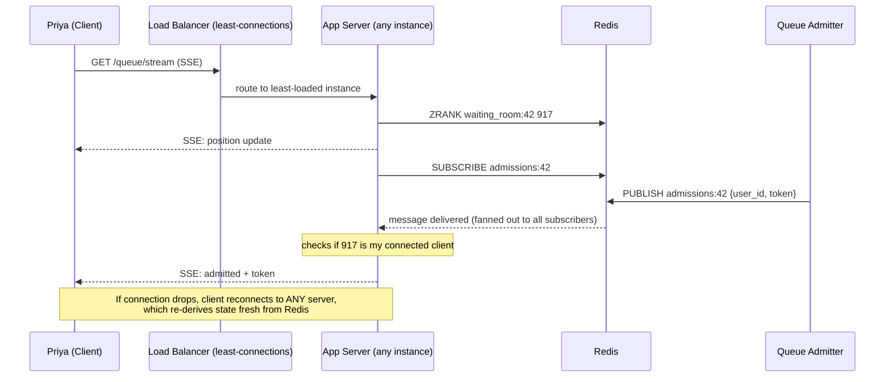
```mermaid
sequenceDiagram
    participant U as Priya (Client)
    participant LB as Load Balancer (least-connections)
    participant S1 as App Server (any instance)
    participant R as Redis
    participant Adm as Queue Admitter

    U->>LB: GET /queue/stream (SSE)
    LB->>S1: route to least-loaded instance
    S1->>R: ZRANK waiting_room:42 917
    S1-->>U: SSE: position update
    S1->>R: SUBSCRIBE admissions:42

    Adm->>R: PUBLISH admissions:42 {user_id, token}
    R-->>S1: message delivered (fanned out to all subscribers)
    Note over S1: checks if 917 is my connected client
    S1-->>U: SSE: admitted + token

    Note over U,S1: If connection drops, client reconnects to ANY server,<br/>which re-derives state fresh from Redis
```

This is like a hospital waiting room with a digital display board instead of a receptionist who personally remembers your face. It doesn't matter which door you walk back in through after stepping out — the board (Redis) knows your number, and any staff member at any desk (any app server) can look it up and tell you where you stand.

## Current State (V5)

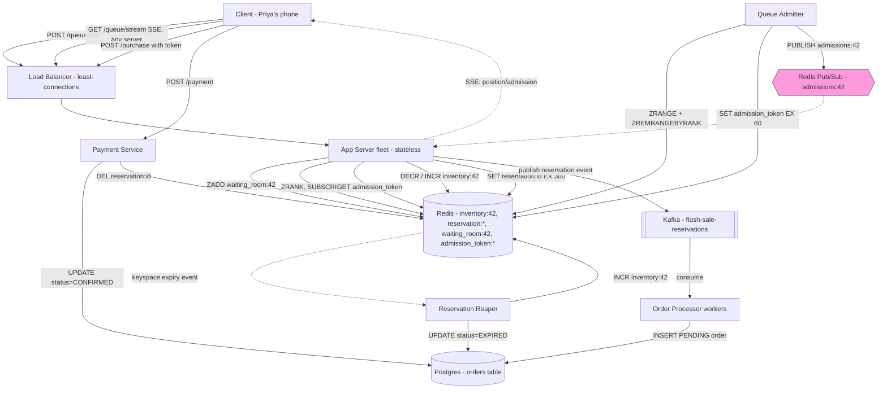
```mermaid
graph TD
    Client[Client - Priya's phone]
    LB[Load Balancer - least-connections]
    App[App Server fleet - stateless]
    Redis[(Redis - inventory:42, reservation:*, waiting_room:42, admission_token:*)]
    PubSub{{Redis Pub/Sub - admissions:42}}
    Kafka[[Kafka - flash-sale-reservations]]
    OP[Order Processor workers]
    PG[(Postgres - orders table)]
    PaySvc[Payment Service]
    Reaper[Reservation Reaper]
    Adm[Queue Admitter]

    Client -->|POST /queue/join| LB --> App
    App -->|ZADD waiting_room:42| Redis
    Client -->|GET /queue/stream SSE, any server| LB
    App -->|ZRANK, SUBSCRIBE| Redis
    App -.->|SSE: position/admission| Client

    Adm -->|ZRANGE + ZREMRANGEBYRANK| Redis
    Adm -->|SET admission_token EX 60| Redis
    Adm -->|PUBLISH admissions:42| PubSub
    PubSub -.-> App

    Client -->|POST /purchase with token| LB
    App -->|GET admission_token| Redis
    App -->|DECR / INCR inventory:42| Redis
    App -->|SET reservation:id EX 300| Redis
    App -->|publish reservation event| Kafka
    Kafka -->|consume| OP
    OP -->|INSERT PENDING order| PG
    Client -->|POST /payment| PaySvc
    PaySvc -->|UPDATE status=CONFIRMED| PG
    PaySvc -->|DEL reservation:id| Redis
    Redis -.->|keyspace expiry event| Reaper
    Reaper -->|UPDATE status=EXPIRED| PG
    Reaper -->|INCR inventory:42| Redis

    style PubSub fill:#f9d,stroke:#333
```
*Redis Pub/Sub channel is new in V5. WebSocket replaced with SSE; app-server fleet is now fully stateless — any server can serve any request, including reconnects.*

**Flows as of V5:**
1. **Queue-join flow** — unchanged mechanically (`ZADD`), but the connection that follows it is now SSE, not WebSocket, and carries no server affinity.
2. **Admission flow** — Queue Admitter logic unchanged from V4; delivery mechanism changed from direct WebSocket push to `PUBLISH` on Redis Pub/Sub, fanned out to whichever server holds each client's stream.
3. **Reconnect flow (new)** — if a client's SSE stream drops, it reconnects to any server via the load balancer, and that server re-derives position/status fresh from Redis rather than relying on prior in-memory state.
4. **Purchase flow** — unchanged from V4.
5. **Order recording flow** — unchanged from V2.
6. **Payment flow** — unchanged from V3.
7. **Expiry/reclaim flow** — unchanged from V3.

## Interviewer Follow-ups

**"Doesn't Pub/Sub fan-out to every server waste resources if only one server actually has that user connected?"**
Yes, marginally — every subscribed server receives every admission message for item 42 and just discards ones that aren't theirs. At the scale of a few thousand admissions per second this is cheap (a small JSON message, a dictionary lookup to check "is this my connection"), and it's a fair trade for not having to track which specific server holds which specific connection.

**"Why not just make the app servers stateless from the start, back in V0?"**
Because the WebSocket/SSE-holding requirement didn't exist until V4 introduced the waiting room — everything before that was pure request/response, which is stateless by default. This version exists precisely because V4 introduced the one piece of local state we hadn't accounted for.

## Recap

| Concept | The Insight |
|---|---|
| Local state is the enemy of horizontal scaling | More servers only helps if any server can handle any request — a pinned connection breaks that. |
| WebSocket vs SSE | SSE's built-in reconnect-to-any-server behavior fits a stateless fleet better than a pinned WebSocket, when you only need server→client push. |
| Redis as shared source of truth for position | Reconnecting doesn't need to "remember" anything server-side — it just re-derives from Redis, same as a fresh connection. |
| Pub/Sub fan-out for delivery | Solves "which server has this client" by broadcasting to all and letting each server self-select, instead of tracking connection ownership. |
| Least-connections over round-robin | Matters once request/connection durations vary wildly — long-lived SSE streams vs. sub-second purchase calls. |

**One-breath version**: If asked how you scale the app-server fleet horizontally when it's holding live client connections: don't pin connections to specific servers, push all position and admission state through Redis instead, and let clients reconnect to any server after a drop — because the moment a server holds something no other server can see, you've capped how far horizontal scaling can actually take you.

Next up: this whole design has been protecting one Redis counter — what happens when that single Redis instance becomes the new single point of failure, and how we shard or replicate our way out of it.

Say "next" when ready.

---

Fair pushback — let me untangle both threads honestly, because I actually made an inconsistent call across V4 and V5 that's worth naming directly.

## Why not simple polling?

Let's put a number on it, because this is exactly the kind of check that should drive the decision.

Say each waiting client polls `GET /queue/status` every 2 seconds — pretty aggressive, but reasonable for "am I in yet?" UX. With 2 million people in the queue, that's:

**2,000,000 / 2 = 1,000,000 requests per second**, sustained, for the entire time the queue is draining.

Compare that to the actual admission rate we designed for: 5,000 admissions per second. Polling for status generates **200x more load** than the checkout traffic it's meant to gate. We'd have solved the stampede-at-checkout problem by creating a bigger stampede-at-status-check problem, just moved one endpoint over. That's the concrete failure — polling doesn't shed load here, it just relocates it.

Even if you drop the poll interval to every 5-10 seconds to ease that, you now have staleness (Priya doesn't know she's admitted for several seconds after the fact, which matters when admission tokens have a tight 60-second window), and you're still generating 200,000-400,000 QPS of pure "any updates?" noise.

A push-based channel (one persistent connection, server tells the client when something changes) avoids this because it's zero cost when nothing's happening — no repeated request/response cycle just to say "no change yet."

## Why WebSocket in V4, then SSE in V5 — was that a real reason?

Good catch, and I'll be straight with you: I didn't pick WebSocket in V4 for a reason specific to this system — I reached for it because "real-time push" often defaults to WebSocket in people's heads. Looking at it properly:

We only ever need **server → client** messages here — position updates, admission tokens. The client never needs to send anything back over that channel (the actual purchase attempt is a separate `POST /purchase` call). WebSocket gives you a full-duplex channel; we only use half of it. That's the tell that WebSocket was the wrong primitive from the start, not just in V5.

Here's the honest comparison:

| | Polling | WebSocket | SSE |
|---|---|---|---|
| Load at 2M waiting clients | ~1M QPS just for status checks | One connection per client, no repeat requests | One connection per client, no repeat requests |
| Direction needed | N/A | Full-duplex (we use none of the client→server half) | Server→client only (exactly what we need) |
| Reconnect after drop | N/A (stateless by nature) | Manual — you write the reconnect logic yourself | Built into the browser's `EventSource` API automatically |
| Plays nicely with plain HTTP infra (LBs, proxies) | Yes | Needs upgrade handling (`Upgrade: websocket`), occasionally friction through older proxies | Yes — it's just a long-lived HTTP response |

So the honest version of the story is: I should have landed on SSE back in V4, not WebSocket. The reason it "worked out" by V5 is that the *problem* I was solving in V5 (statelessness, reconnect-to-any-server) is exactly the problem SSE is naturally better suited for — I backed into the right answer for the wrong immediate reason. If you're saying this out loud in an interview, the tight version is:

*"I need server-to-client push, not bidirectional — so I reach for SSE over WebSocket from the start, since it's plain HTTP, survives normal load balancers without special handling, and gives me free reconnect-to-any-server behavior via the browser's EventSource API. WebSocket would work too, but it's solving for a bidirectional need I don't actually have here."*

Want me to fold this correction back into V4 directly (so the versioned history reads cleanly with SSE from the start), or leave the V4→V5 correction as-is and move on to V6 (sharding/replicating the Redis counter)?

---

## V6 — Break It: One Redis Instance, One Point of Failure

Every single purchase attempt across this entire design — the `DECR`, the reservation TTL keys, the waiting-room sorted set, the admission tokens, the pub/sub fan-out — runs through **one Redis instance**. We built an elaborate system to survive 2 million concurrent users, and all of it collapses instantly if that one box dies.

Here's the concrete failure. Redis is running on a single EC2 instance (or equivalent). At 10:00:02 — two seconds into the sale, right at peak load — that instance hits an OOM kill, or the underlying host has a hardware fault, or someone's bad deploy restarts it. Every `DECR`, every `SET reservation:*`, every `ZADD waiting_room:*` call fails simultaneously. The entire sale halts mid-flight: some users have working reservations, the counter's exact value is uncertain during the restart, and there is no fallback — we built zero redundancy into the single most load-bearing component in the whole system.

> **Arjun**: "Can't we just run Redis Cluster and shard the keys across multiple nodes?"
> **Meera**: "Sharding solves throughput or storage limits — we don't have either problem here. `inventory:42` is one key; you can't split one counter across shards without breaking its atomicity. What we have is an availability problem, not a capacity problem — that's replication, not sharding."

This distinction matters and is worth stating plainly: **sharding spreads different keys across multiple nodes to handle more data/throughput than one node can hold. Replication copies the same keys onto multiple nodes so a node dying doesn't lose the data.** We've never come close to Redis's single-node throughput ceiling (V1 established 50K-100K+ ops/sec on one instance; our actual admitted rate is 5,000/sec). Our problem is purely: what happens when that one instance disappears.

## Apply It to This System

Is a fix even justified? Let's check: our read pattern for `inventory:42` is dominated by writes (`DECR`/`INCR`), not reads — there's no read-heavy fan-out here that would independently argue for read replicas. So the only reason to add replicas at all is **availability**, not read scaling. Worth saying explicitly, because "add replicas" is often reached for reflexively to scale reads — that's not the driver here.

Three real candidate approaches:

| Approach | What it optimizes | What it breaks |
|---|---|---|
| Async replication (primary writes, replicas catch up later) | Zero write latency added — primary never waits for replicas | On primary failure, replicas may be a few ms/writes behind — could lose the last few `DECR`s, meaning a small window where overselling becomes possible again |
| Sync replication (primary waits for replica ack before confirming write) | Zero data loss on failover — replica is always caught up | Every `DECR` now pays a network round-trip to the replica before returning — directly taxes our hottest, most latency-sensitive operation in the whole system |
| Semi-sync / WAIT command (primary waits for at least 1 of N replicas to ack, with a timeout) | Balances the two — most writes get replica confirmation without full sync overhead on every call | Still adds some latency per write; if the timeout fires, you fall back to effectively async for that write |

Given that `DECR` on `inventory:42` is the single hottest, most latency-critical call in the entire system — this is the exact operation we spent V1 making microsecond-fast — full synchronous replication on every call directly reintroduces a chunk of the latency tax we worked to remove. But given that "never oversell" is our hardest P0, losing even one unsynced `DECR` on failover is unacceptable — a purely async setup risks exactly the correctness bug we designed this whole system to prevent.

**Decision: Redis Sentinel with semi-sync replication using the `WAIT` command** — primary plus 2 replicas, and every write to `inventory:42` calls `WAIT 1 100` (wait for at least 1 replica to acknowledge, timeout 100ms) right after the `DECR`. This gets us "at least one other copy has this write" without waiting for all replicas, and 100ms is generously above normal replication lag on a local network.

✅ **What we gained**
If the primary dies, we know at least one replica has every acknowledged `DECR`. Sentinel detects the primary failure and promotes a replica automatically — no manual intervention, and no silent oversell from lost writes.

⚠️ **What we gave up / new problem this creates**
Every `DECR` now has a small added latency (network round-trip to at least one replica, bounded by the 100ms timeout) — we've reintroduced some of the cost V1 was designed to eliminate, deliberately, because correctness during failover outranks shaving off single-digit milliseconds here. We've also added Sentinel itself as new infrastructure that needs to be correctly configured (quorum size, failure detection timing) — get that wrong and you get false-positive failovers under load spikes.

❌ **What we considered and rejected**
- **Pure async replication**: rejected above — risks losing acknowledged decrements on failover, directly threatening the "never oversell" P0.
- **Full sync to all replicas on every write**: strictly safer, but adds two network round-trips (not one) to the hottest path per write, and blocks the primary if any single replica is briefly slow — a form of the exact serialization problem V1 escaped.
- **Redis Cluster (sharding) instead of Sentinel**: solves a scaling problem we don't have (see the break-it discussion above) — doesn't address single-node availability, and adds real operational complexity (hash slots, resharding coordination) for no corresponding benefit here.

## Implement It

**Topology**: 1 primary + 2 replicas, managed by 3 Sentinel processes (quorum of 2 required to agree "primary is down" before triggering failover — this avoids one flaky Sentinel triggering a false failover alone).

**Config on the primary** (`redis.conf` excerpt):
```
replica-read-only yes    # set on replicas, not primary
min-replicas-to-write 1
min-replicas-max-lag 10
```
`min-replicas-to-write 1` means the primary will refuse writes entirely if it can't see at least 1 healthy replica — this is a deliberate availability/consistency trade: we'd rather reject a purchase attempt than accept a write with zero durability guarantee behind it.

**Changed application code** — every write to `inventory:42` now looks like:
```
DECR inventory:42
WAIT 1 100
```
`WAIT 1 100` blocks until at least 1 replica confirms receipt of the preceding write, or 100ms elapses, whichever comes first. If `WAIT` returns `0` (no replica acknowledged in time), the app server treats this as a failed write — it compensates with `INCR inventory:42` and returns "please retry" to the client, rather than trusting an unconfirmed decrement.

Step by step, updated purchase flow (only the Redis-interaction step changes from V4):

1. Admission token validated (unchanged from V4).
2. App server runs `DECR inventory:42`, then `WAIT 1 100`.
3. **Branch — `WAIT` returns ≥1**: write is durable on at least 2 nodes now. Proceed to reservation `SET` + Kafka publish (unchanged from V2/V3).
4. **Branch — `WAIT` returns 0**: replication couldn't be confirmed in time. Compensate with `INCR inventory:42`, return `503` "please retry" — safer to ask Priya to click again than risk a write that might vanish on failover.
5. **Failover scenario**: primary dies. Sentinel's 3 processes detect missed heartbeats, reach quorum (2 of 3 agree), and promote the replica with the most up-to-date offset to primary — typically within a few seconds. App servers reconnect to the new primary via Sentinel's service discovery (they never hardcode the primary's address, always ask Sentinel "who's primary right now").

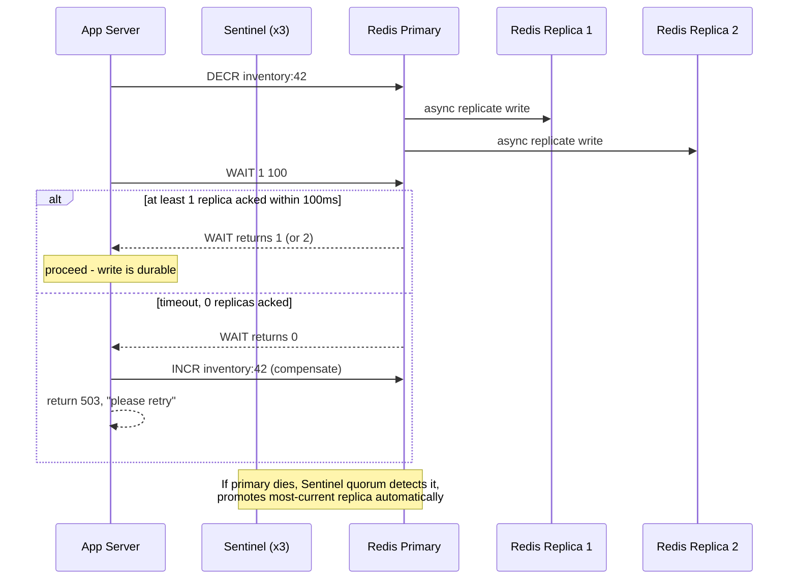
```mermaid
sequenceDiagram
    participant S as App Server
    participant Sent as Sentinel (x3)
    participant P as Redis Primary
    participant R1 as Redis Replica 1
    participant R2 as Redis Replica 2

    S->>P: DECR inventory:42
    P->>R1: async replicate write
    P->>R2: async replicate write
    S->>P: WAIT 1 100
    alt at least 1 replica acked within 100ms
        P-->>S: WAIT returns 1 (or 2)
        Note over S: proceed - write is durable
    else timeout, 0 replicas acked
        P-->>S: WAIT returns 0
        S->>P: INCR inventory:42 (compensate)
        S-->>S: return 503, "please retry"
    end

    Note over Sent,P: If primary dies, Sentinel quorum detects it,<br/>promotes most-current replica automatically
```

Think of this like a courier requiring one signature before driving off, instead of either speeding away with no proof of delivery (async) or waiting for signatures from every single recipient on the route (full sync). One confirmed signature is enough evidence the package actually arrived somewhere durable — you don't need everyone to sign to trust the delivery happened.

## Current State (V6)

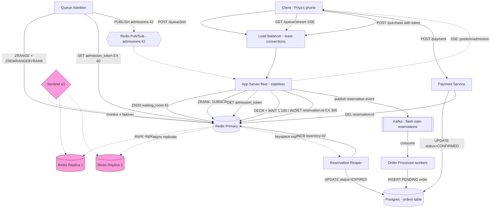
```mermaid
graph TD
    Client[Client - Priya's phone]
    LB[Load Balancer - least-connections]
    App[App Server fleet - stateless]
    P[(Redis Primary)]
    R1[(Redis Replica 1)]
    R2[(Redis Replica 2)]
    Sent{Sentinel x3}
    PubSub{{Redis Pub/Sub - admissions:42}}
    Kafka[[Kafka - flash-sale-reservations]]
    OP[Order Processor workers]
    PG[(Postgres - orders table)]
    PaySvc[Payment Service]
    Reaper[Reservation Reaper]
    Adm[Queue Admitter]

    Client -->|POST /queue/join| LB --> App
    App -->|ZADD waiting_room:42| P
    Client -->|GET /queue/stream SSE| LB
    App -->|ZRANK, SUBSCRIBE| P
    App -.->|SSE: position/admission| Client

    Adm -->|ZRANGE + ZREMRANGEBYRANK| P
    Adm -->|SET admission_token EX 60| P
    Adm -->|PUBLISH admissions:42| PubSub
    PubSub -.-> App

    Client -->|POST /purchase with token| LB
    App -->|GET admission_token| P
    App -->|DECR + WAIT 1 100 / INCR| P
    P -.->|async replicate| R1
    P -.->|async replicate| R2
    Sent -.->|monitor + failover| P
    Sent -.-> R1
    Sent -.-> R2
    App -->|SET reservation:id EX 300| P
    App -->|publish reservation event| Kafka
    Kafka -->|consume| OP
    OP -->|INSERT PENDING order| PG
    Client -->|POST /payment| PaySvc
    PaySvc -->|UPDATE status=CONFIRMED| PG
    PaySvc -->|DEL reservation:id| P
    P -.->|keyspace expiry event| Reaper
    Reaper -->|UPDATE status=EXPIRED| PG
    Reaper -->|INCR inventory:42| P

    style R1 fill:#f9d,stroke:#333
    style R2 fill:#f9d,stroke:#333
    style Sent fill:#f9d,stroke:#333
```
*Redis Replicas and Sentinel are new in V6. Every prior interaction with "Redis" is now understood as talking to the current primary, as tracked by Sentinel; app servers never hardcode which node is primary.*

**Flows as of V6:**
1. **Queue-join, admission, SSE reconnect flows** — unchanged from V5, except all Redis operations now go through Sentinel-managed primary rather than a single fixed instance.
2. **Purchase flow** — changed this version: `DECR` is now followed by `WAIT 1 100`; a failed `WAIT` compensates with `INCR` and returns `503` instead of proceeding.
3. **Order recording, payment, expiry/reclaim flows** — unchanged from V2/V3, still reading/writing the same Redis keys, now on a replicated primary.
4. **Failover flow (new, implicit)** — Sentinel quorum detects primary failure, promotes a replica, app servers redirect via Sentinel discovery. Not a user-facing flow, but a system-level one worth being able to describe.

## Interviewer Follow-ups

**"Why not just use a managed Redis (ElastiCache/MemoryDB) and skip building Sentinel yourself?"**
In a real system, yes — you'd almost always reach for a managed offering with built-in HA rather than self-hosting Sentinel. I'm walking through Sentinel here because it's the mechanism worth being able to explain in an interview; in practice you'd configure the managed service's equivalent (e.g., ElastiCache Multi-AZ with automatic failover) rather than running this yourself.

**"What happens to in-flight `/purchase` requests during the few seconds of failover?"**
They fail — the app server can't reach a primary momentarily, and should return a retryable error (`503`) rather than hanging. This is a brief availability dip, which is the honest trade-off of this design: we chose to protect correctness (no lost decrements) over availability (zero downtime during failover) for this specific operation, because "never oversell" was our explicit P0.

## Recap

| Concept | The Insight |
|---|---|
| Sharding vs. replication | Sharding fixes throughput/capacity limits; replication fixes availability. One Redis key with no throughput problem needs replication, not sharding. |
| Async vs. sync vs. semi-sync replication | Semi-sync (`WAIT N timeout`) balances durability against latency — full sync taxes the hot path, full async risks losing acknowledged writes on failover. |
| `WAIT` as a correctness gate | Treating an unconfirmed write as a failure (compensate + retry) protects the "never oversell" P0 even during a replica lag spike. |
| Sentinel quorum | Requiring multiple Sentinels to agree before failover avoids one flaky monitor causing a false, disruptive failover under load. |
| Service discovery over hardcoded primary | App servers ask Sentinel "who's primary" rather than hardcoding an address — makes failover transparent to the app layer. |

**One-breath version**: If asked how you make a single hot Redis counter durable without killing its latency: don't fully sync every write to every replica and don't go fully async either — use semi-sync replication with a bounded `WAIT`, so you know at least one other node has the write before you trust it, and compensate instead of proceeding when that guarantee can't be met in time.

Next up: this whole design has assumed one data center. What happens when Priya is in Mumbai and the sale needs to serve buyers across multiple regions with acceptable latency — and how you'd avoid two regions both thinking they sold the last unit.

Say "next" when ready.

---

## V7 — Break It: Two Regions, Both Certain They Sold Unit #100

Everything so far assumes one region — one Redis primary, one set of app servers, all in (say) Mumbai. But Priya's flash sale is national. A buyer in Delhi and a buyer in Chennai both hit "Buy Now" at 10:00:00, and both are routed, for latency reasons, to their nearest regional deployment — say Mumbai and Bangalore.

Here's the concrete failure if we naively run a second full stack in Bangalore with its **own** Redis primary, seeded with the same starting count of 100: both regions start decrementing independently. Mumbai's counter goes 100 → 99 → 98 → ... → 0. Bangalore's counter, completely unaware of Mumbai's activity, goes 100 → 99 → 98 → ... → 0, *at the same time, for the same physical item*. We haven't oversold by a little — we've sold up to **200 units of a 100-unit inventory**, because we quietly duplicated the one thing this entire design exists to protect.

> **Arjun**: "Can't Bangalore's Redis just replicate from Mumbai's, like the replicas we built in V6?"
> **Meera**: "V6's replicas were read-only followers of one primary, all in the same region, with sub-millisecond network latency between them. Mumbai to Bangalore is 15-20ms round-trip minimum — if Bangalore also needs to *write*, you're back to a single point of serialization, just now with a much slower link in the critical path."

The real problem: `inventory:42` is a single number that must never be double-spent, and we now have two geographically separate places wanting to write to it at the same time. This isn't a new problem in kind — it's the exact same "one hot counter, multiple writers" problem from V1, except now the writers are separated by real network distance instead of just being separate app servers.

## Apply It to This System

The core question for multi-region is always: **who's allowed to write, for this piece of data?** There are two honest options, and the answer isn't the same for every part of this system.

For `inventory:42` specifically — this is a single global constraint (100 units, period, no per-region split implied by our scope) — there is exactly one sane answer: **single-writer**. One region owns the authoritative Redis primary for this counter; every other region forwards its decrement attempts to that region rather than maintaining a local writable copy.

Compare that to something like the **waiting room** (`waiting_room:42`) or **order writes** to Postgres — those don't have the same single-global-truth constraint in the same brutal way, but for this system, since fairness (FIFO ordering) is a stated P1 requirement, splitting the queue by region would break global ordering guarantees too. So the same single-writer decision extends to the whole hot path, not just the counter.

This means: **Mumbai is the write region for this sale.** Bangalore, Chennai, Delhi — every other region — runs a full app-server fleet locally (for low-latency serving of static sale pages, SSE connections, etc.) but forwards every `/purchase` and `/queue/join` call across the WAN to Mumbai's Redis primary and Postgres.

✅ **What we gained**
Zero risk of split-brain overselling — there is only ever one place that can decrement `inventory:42`, so the invariant from V1 (atomic decrement, single point of truth) holds exactly as it did before, just now serving a wider geography.

⚠️ **What we gave up / new problem this creates**
A buyer in Chennai now pays real cross-region network latency (15-25ms typically, sometimes 40-50ms depending on backbone routing) on every purchase attempt, on top of whatever local processing time exists. For a flash sale measured in milliseconds of advantage, this is a real, felt cost — a Chennai buyer is structurally slower to reach the counter than a Mumbai buyer, through no fault of their own reflexes.

❌ **What we considered and rejected**
- **Multi-writer with CRDTs (e.g., a PN-counter that merges across regions)**: CRDTs are excellent for counters that tolerate eventual consistency — like a "likes" count. They're wrong here because a PN-counter can go negative-then-correct on merge, and "briefly oversold, then corrected after the fact" is not acceptable when the sold items are real physical goods already shipped or paid for.
- **Sharding inventory by region (50 units reserved for North, 50 for South)**: avoids the write-conflict problem entirely, but changes the actual product requirement — we scoped this as one global pool, and pre-splitting it means a fast Mumbai buyer can be told "sold out" while units sit unsold in a Bangalore-reserved bucket. That's a real, valid alternative design, just not the one matching our stated scope.
- **Leaderless writes with last-write-wins conflict resolution**: LWW on a decrementing counter effectively discards decrements based on wall-clock races — directly reintroduces the double-decrement problem, just resolved arbitrarily instead of correctly.

## Implement It

**Regional topology**: 4 regional app-server clusters (Mumbai, Bangalore, Chennai, Delhi, say), each fronted by its own load balancer. Only Mumbai runs the Redis primary/replica/Sentinel setup and the Postgres primary from V6. Other regions run **no local writable inventory state at all** for this sale.

**Routing layer**: a global entry point (e.g., GeoDNS or a global load balancer like AWS Global Accelerator) routes each user to their nearest regional app-server cluster for latency-sensitive-but-safe operations — serving the sale page, opening the SSE stream, `/queue/join`.

**The critical change**: for `/purchase` and `/payment` specifically, every regional app server forwards the request over a private backbone link to Mumbai's app-server fleet, rather than talking to a local Redis. Concretely:

```
# Chennai app server, on receiving POST /purchase
if region != "mumbai":
    response = forward_request(
        url="https://internal-mumbai.flashsale.svc/purchase",
        body=original_request_body,
        timeout_ms=200
    )
    return response
else:
    # existing V6 flow: DECR, WAIT, reservation, Kafka publish
    ...
```

This forwarding hop is the entire mechanism — no new data structure, no new store. It's a deliberate architectural choice: **route the write, don't replicate the write.**

Step by step, updated purchase flow for a non-Mumbai user (say, Chennai):

1. Chennai app server receives `POST /purchase` (admission token already validated locally, since token validation *can* safely be local — tokens are read-mostly and per-user, not a shared mutable counter).
2. Chennai app server forwards the request body to Mumbai's internal purchase endpoint over the private backbone, with a 200ms timeout.
3. Mumbai app server executes the unchanged V6 flow: `DECR inventory:42`, `WAIT 1 100`, reservation `SET`, Kafka publish.
4. Mumbai returns the result (`202 PENDING` or `409 Sold Out` or `503 Retry`) to Chennai's app server.
5. Chennai app server relays that response back to the client, unchanged.
6. **If the forward itself times out or fails** (backbone link issue): Chennai returns `503`, "please retry" — same principle as V6's `WAIT` failure, favor rejecting over guessing.

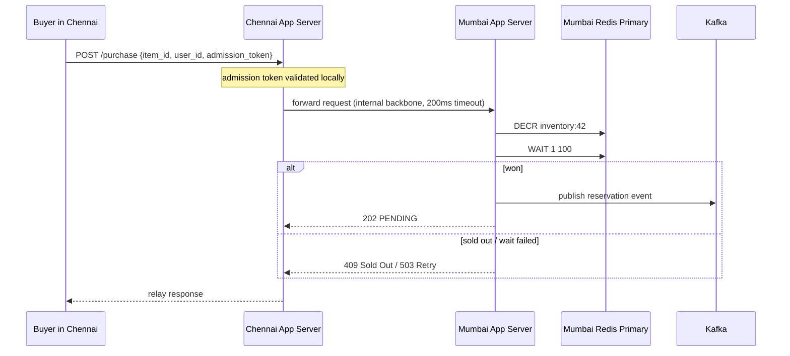
```mermaid
sequenceDiagram
    participant U as Buyer in Chennai
    participant CH as Chennai App Server
    participant MB as Mumbai App Server
    participant R as Mumbai Redis Primary
    participant K as Kafka

    U->>CH: POST /purchase {item_id, user_id, admission_token}
    Note over CH: admission token validated locally
    CH->>MB: forward request (internal backbone, 200ms timeout)
    MB->>R: DECR inventory:42
    MB->>R: WAIT 1 100
    alt won
        MB->>K: publish reservation event
        MB-->>CH: 202 PENDING
    else sold out / wait failed
        MB-->>CH: 409 Sold Out / 503 Retry
    end
    CH-->>U: relay response
```

This is like a single national ticket office for a limited concert, with regional travel agents. Every travel agent (regional app server) can show you the seating chart and let you sit in the waiting area locally — but the moment you actually want to buy, your agent has to phone the one head office (Mumbai) that holds the real, single ledger of remaining tickets. It's slower for agents far from head office, but there's only ever one ledger, so two agents can never both sell seat 42.

## Current State (V7)

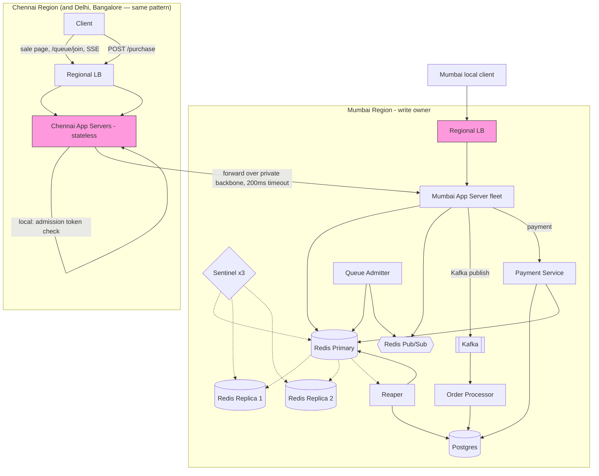
```mermaid
graph TD
    subgraph Chennai["Chennai Region (and Delhi, Bangalore — same pattern)"]
        CHClient[Client]
        CHLB[Regional LB]
        CHApp[Chennai App Servers - stateless]
    end

    subgraph Mumbai["Mumbai Region - write owner"]
        MBLB[Regional LB]
        MBApp[Mumbai App Server fleet]
        P[(Redis Primary)]
        R1[(Redis Replica 1)]
        R2[(Redis Replica 2)]
        Sent{Sentinel x3}
        PubSub{{Redis Pub/Sub}}
        Kafka[[Kafka]]
        OP[Order Processor]
        PG[(Postgres)]
        PaySvc[Payment Service]
        Reaper[Reaper]
        Adm[Queue Admitter]
    end

    CHClient -->|sale page, /queue/join, SSE| CHLB --> CHApp
    CHApp -->|local: admission token check| CHApp
    CHClient -->|POST /purchase| CHLB --> CHApp
    CHApp -->|forward over private backbone, 200ms timeout| MBApp

    MBApp --> P
    P -.-> R1
    P -.-> R2
    Sent -.-> P & R1 & R2
    MBApp --> PubSub
    Adm --> P & PubSub
    MBApp -->|Kafka publish| Kafka --> OP --> PG
    MBClient[Mumbai local client] --> MBLB --> MBApp
    MBApp -->|payment| PaySvc --> PG
    PaySvc --> P
    P -.-> Reaper --> PG
    Reaper --> P

    style CHApp fill:#f9d,stroke:#333
    style MBLB fill:#f9d,stroke:#333
```
*Regional app-server clusters (Chennai shown, same pattern for Delhi/Bangalore) are new in V7 — they serve sale pages, queue joins, and SSE streams locally, but forward every `/purchase` and `/payment` call to Mumbai over a private backbone. Mumbai's stack (Redis primary/replicas/Sentinel, Kafka, Postgres, Order Processor, Payment Service, Reaper, Queue Admitter) is entirely unchanged from V6 — it's just now the single write-owner for the whole country, not the only region.*

**Flows as of V7:**
1. **Queue-join, SSE stream flows** — served entirely locally per region; unchanged in mechanism from V5, just now replicated as infrastructure across multiple regions instead of existing in one place. Admission tokens are validated locally too, since that's a read against per-user data, not the shared counter.
2. **Purchase flow (changed this version)** — non-Mumbai regions validate the admission token locally, then forward the entire purchase request to Mumbai's app-server fleet, which runs the unchanged V6 logic (`DECR`, `WAIT`, reservation, Kafka publish). Mumbai-local users skip the forwarding hop entirely.
3. **Order recording, payment, expiry/reclaim flows** — unchanged from V2/V3/V6, and still exist only in Mumbai — there's no regional copy of Postgres, Kafka, or the Reaper.

## Interviewer Follow-ups

**"What if the Chennai-to-Mumbai backbone link itself goes down entirely, not just slow?"**
Then Chennai buyers can't purchase at all during that outage — this is the honest cost of single-writer: availability for remote regions is coupled to connectivity to the write region. Mitigations exist (multiple backbone paths, fallback routing through a secondary path) but they reduce the *probability* of this, they don't eliminate the fundamental coupling.

**"Why not just make each region its own separate flash sale with its own carved-out inventory?"**
That's a legitimate, simpler alternative — and it's exactly the "shard inventory by region" option we rejected above. It trades away the stated requirement (fast Mumbai buyer shouldn't be blocked by empty Bangalore-reserved stock while Mumbai stock remains) for lower latency and no cross-region hop. Worth naming as the pragmatic real-world compromise many actual flash sales make.

## Recap

| Concept | The Insight |
|---|---|
| Single-writer for global invariants | When one number must never be double-spent globally, one region has to own the writes — no way around it without changing the actual requirement. |
| Route the write, don't replicate the write | Instead of giving every region its own writable copy (which reintroduces V1's race), forward the write itself across the WAN to the one authoritative region. |
| CRDTs don't fit here | CRDT counters tolerate eventual consistency by design — fine for likes/views, wrong for finite physical inventory where "briefly oversold, corrected later" isn't acceptable. |
| Cost of single-writer is felt, not hidden | Remote-region buyers pay real added latency and lose availability during backbone outages — this is a stated, not silent, trade-off. |
| Local vs. forwarded operations | Not everything needs the cross-region hop — admission token checks, SSE streams, and queue joins can safely stay local since they aren't the shared global invariant. |

**One-breath version**: If asked how you handle a global flash sale across multiple regions without overselling: don't give every region a writable copy of the inventory count, because that's the exact double-decrement race from square one just with a slower network in between — instead, pick one region as the single writer and forward every purchase attempt to it, accepting that remote buyers pay real latency for that guarantee.

---

At this point the core distributed-systems story is complete: atomic decrement, durable handoff via Kafka, TTL-based reclaim, a load-shedding waiting room, a stateless app-server fleet, replicated Redis for availability, and single-writer multi-region routing for the global invariant. We haven't formally covered failure-handling patterns (retries, circuit breakers, idempotency keys — some of which we've already used implicitly) or observability as their own topics.

Want to do a dedicated pass on failure-handling patterns next, jump to the final wrap-up (full diagram, why-not-X arsenal, master recap table), or run a mock interview Q&A where I pressure-test the whole design?

---

## V8 — Failure Handling: Naming What We Already Built, and Closing the Gaps

We've actually already used several failure-handling patterns without naming them. Let's make them explicit, and then close the ones we skipped.

**Break it** — here's the gap that forces this version to exist. In V7, when Chennai forwards a purchase request to Mumbai and the backbone call times out at 200ms, what does Chennai do next? Right now: nothing defined. Does it retry? Immediately? How many times? If 50,000 Chennai buyers all hit a timeout in the same second (say, a brief Mumbai app-server blip) and every one of them retries immediately, we've just created a **retry storm** — a burst of requests arriving right when Mumbai is already struggling, making the blip worse instead of letting it recover. This is a real, named failure mode, and we've been silently exposed to it since V7.

## Patterns we already built (naming them)

- **Idempotency** (V2, V3): the `ON CONFLICT DO NOTHING` on `(item_id, user_id)` in the Order Processor, and the `AND status='PENDING'` guard on payment/expiry updates — these are what let Kafka's at-least-once delivery and Redis's possible redelivery be safe. Without idempotency, at-least-once delivery becomes at-least-once *damage*.
- **Compensating action** (V1, V6): the `INCR` after a failed `WAIT` or a failed Kafka publish — this is the saga pattern in miniature. We can't do a single atomic transaction across Redis and Kafka, so instead we do the risky operation, and explicitly undo it if the next step fails.
- **Timeout with fallback** (V7): the 200ms forward timeout returning `503` instead of hanging indefinitely — bounding how long a client waits for a dependency that might be dead.

## What we haven't built: retries, circuit breakers, dead-letter queues

**Retries with backoff and jitter.** Naive retry (fixed delay, fixed count, all clients retrying at the exact same moment) is the retry-storm failure described above. The fix: exponential backoff (each retry waits longer than the last) plus jitter (randomize the wait slightly per-client, so retries spread out instead of re-syncing into another simultaneous burst).

```
def retry_delay(attempt):
    base = min(100 * (2 ** attempt), 2000)  # cap at 2s
    return random.uniform(0, base)  # full jitter
```

Applied here: Chennai's forward-to-Mumbai call gets up to 2 retries, with jittered exponential backoff, before giving up and returning `503` to the client. Not more than 2 — in a flash sale, "keep retrying for 10 seconds" is worse UX than "fail fast, let the client decide to click again," since the admission token itself has a 60-second window we don't want to burn on retries.

**Circuit breaker.** If Mumbai's app-server fleet is genuinely down (not just one slow request, but sustained failures), Chennai shouldn't keep sending it traffic at all — every failed attempt still costs a connection attempt and a timeout wait, at scale that's real load on an already-struggling system. A circuit breaker tracks the failure rate of calls to Mumbai; if it crosses a threshold (say, 50% failures over the last 20 calls), it "opens" — Chennai immediately returns `503` to clients without even attempting the network call, for a cooldown period (say 5 seconds), then allows a few test requests through ("half-open") to check if Mumbai has recovered before fully resuming traffic.

This matters specifically here because without it, a struggling Mumbai fleet gets *more* load from four regions all retrying simultaneously — the exact opposite of what it needs while recovering.

**Dead-letter queue.** Back in V2, we glossed over one case: what if the Order Processor's `INSERT` to Postgres keeps failing for a specific event — not due to a transient blip, but a malformed event or a genuine data issue? Without a limit, that event gets redelivered and reprocessed forever, blocking the consumer from making progress on the events behind it. The fix: after N failed processing attempts (say, 3), the Order Processor publishes that event to a `flash-sale-reservations-dlq` topic instead of retrying indefinitely, and moves on to the next event. The DLQ gets alerted on and inspected manually — rare enough that automatic recovery isn't worth building, but common enough that silently dropping it isn't acceptable either.

## Implement It

**Retry + backoff**, in Chennai's forwarding code (extends the V7 snippet):
```python
def forward_to_mumbai(request_body):
    for attempt in range(3):  # 1 initial + 2 retries
        if circuit_breaker.is_open():
            return error_response(503, "please retry shortly")
        try:
            resp = http_post(MUMBAI_INTERNAL_URL, body=request_body, timeout_ms=200)
            circuit_breaker.record_success()
            return resp
        except TimeoutError:
            circuit_breaker.record_failure()
            if attempt < 2:
                sleep(retry_delay(attempt))
    return error_response(503, "please retry")
```

**Circuit breaker state**, tracked in-memory per app server (this is fine to be local, unlike inventory state — it's advisory, not correctness-critical, and briefly inconsistent breaker state across servers costs at most a few wasted retries, not an oversell):
```
states: CLOSED (normal) → OPEN (failing, reject fast) → HALF_OPEN (testing recovery) → CLOSED
```

**DLQ topic**, new in V8: `flash-sale-reservations-dlq`. Order Processor change:
```python
def process_event(event, attempt=0):
    try:
        db.execute(
            "INSERT INTO orders (order_id, item_id, user_id, status) "
            "VALUES (%s, %s, %s, 'PENDING') ON CONFLICT DO NOTHING",
            (event.reservation_id, event.item_id, event.user_id)
        )
    except Exception as e:
        if attempt >= 3:
            kafka_producer.send("flash-sale-reservations-dlq", event)
            alert_oncall(f"Event {event.reservation_id} moved to DLQ: {e}")
        else:
            retry_later(event, attempt + 1)
```

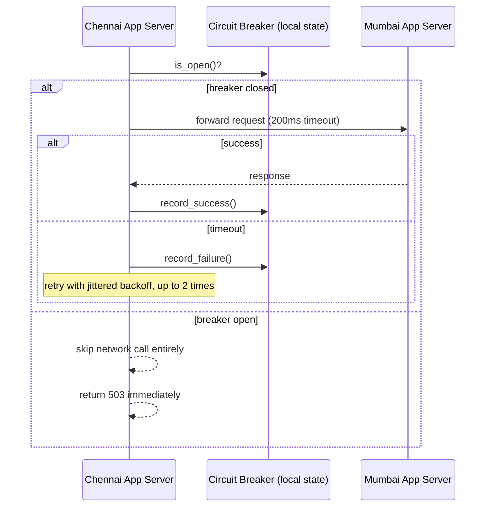
```mermaid
sequenceDiagram
    participant CH as Chennai App Server
    participant CB as Circuit Breaker (local state)
    participant MB as Mumbai App Server

    CH->>CB: is_open()?
    alt breaker closed
        CH->>MB: forward request (200ms timeout)
        alt success
            MB-->>CH: response
            CH->>CB: record_success()
        else timeout
            CH->>CB: record_failure()
            Note over CH: retry with jittered backoff, up to 2 times
        end
    else breaker open
        CH-->>CH: skip network call entirely
        CH-->>CH: return 503 immediately
    end
```

## Current State (V8)

The architecture diagram is unchanged from V7 — this version adds *behavior* (retry logic, circuit-breaker state, a DLQ topic) rather than new components in the data-flow sense, except for one new Kafka topic.

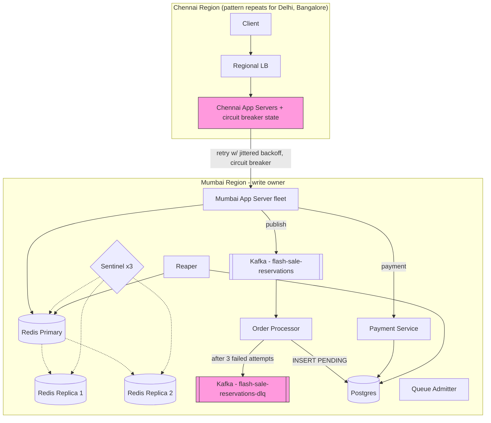
```mermaid
graph TD
    subgraph Chennai["Chennai Region (pattern repeats for Delhi, Bangalore)"]
        CHClient[Client]
        CHLB[Regional LB]
        CHApp[Chennai App Servers + circuit breaker state]
    end

    subgraph Mumbai["Mumbai Region - write owner"]
        MBApp[Mumbai App Server fleet]
        P[(Redis Primary)]
        R1[(Redis Replica 1)]
        R2[(Redis Replica 2)]
        Sent{Sentinel x3}
        Kafka[[Kafka - flash-sale-reservations]]
        DLQ[[Kafka - flash-sale-reservations-dlq]]
        OP[Order Processor]
        PG[(Postgres)]
        PaySvc[Payment Service]
        Reaper[Reaper]
        Adm[Queue Admitter]
    end

    CHClient --> CHLB --> CHApp
    CHApp -->|retry w/ jittered backoff, circuit breaker| MBApp
    MBApp --> P
    P -.-> R1 & R2
    Sent -.-> P & R1 & R2
    MBApp -->|publish| Kafka --> OP -->|INSERT PENDING| PG
    OP -->|after 3 failed attempts| DLQ
    MBApp -->|payment| PaySvc --> PG
    Reaper --> PG & P

    style CHApp fill:#f9d,stroke:#333
    style DLQ fill:#f9d,stroke:#333
```
*DLQ topic is new in V8. Circuit-breaker state lives inside the existing Chennai app servers — no new infrastructure component, just new local logic.*

**Flows as of V8:**
1. **All flows from V1-V7** — structurally unchanged. This version adds resilience *around* existing calls, not new data paths.
2. **Cross-region forward flow (Chennai→Mumbai)** — now wrapped in retry-with-jittered-backoff (max 2 retries) and gated by a per-server circuit breaker, instead of a bare single attempt.
3. **Order recording flow** — Order Processor now gives up after 3 failed attempts per event and routes to the DLQ instead of retrying forever, unblocking the consumer for subsequent events.

## Interviewer Follow-ups

**"Why is circuit-breaker state local per-server instead of shared in Redis, when you were so strict about statelessness earlier?"**
Because the two kinds of state aren't equivalent in cost of being wrong. Inventory state being wrong means overselling — a hard correctness violation. Circuit-breaker state being briefly inconsistent across servers just means a few servers keep trying Mumbai a little longer than others before opening — wasted retries, not a broken invariant. It's fine to be locally approximate here.

**"Why cap retries at 2 instead of retrying more aggressively — isn't the goal to eventually succeed?"**
Because the admission token has a 60-second lifetime, and every retry with backoff eats into that window. Retrying aggressively at the cost of the token expiring before you ever get a real answer is worse than failing fast and telling the user to try again while their token (or a fresh one) is still valid.

## Recap

| Concept | The Insight |
|---|---|
| Retry storm | Naive uniform retries synchronize into a second wave of load hitting an already-struggling dependency at the worst possible moment. |
| Exponential backoff + jitter | Backoff spaces out retries over time; jitter spreads them across clients, so a thundering herd of retries doesn't reform. |
| Circuit breaker | Stops sending traffic to a dependency that's clearly down, protecting it from pile-on load while it recovers — fail fast instead of fail slow. |
| Idempotency (already built) | `ON CONFLICT DO NOTHING` and conditional `WHERE status=` guards are what make at-least-once delivery safe to retry at all. |
| Dead-letter queue | A bounded retry limit plus a side channel for permanently-failing events keeps one bad event from blocking every event behind it. |

**One-breath version**: If asked how you prevent a struggling dependency from getting worse under retries: use exponential backoff with jitter so retries don't resynchronize into another thundering herd, and wrap the call in a circuit breaker so once it's clearly down, you stop sending it traffic entirely instead of piling on failed attempts.

---

We've now covered every starred NFR from the coverage list (Scaling, Sharding/Replication, Caching implicitly via Redis, Multi-region) plus failure handling. The design is interview-complete for our scoped P0/P1s.

Ready for the **final wrap-up** — full end-to-end diagram, every distinct path restated, a "why not X" arsenal, and the master recap table? Or would you rather jump straight to a mock interview Q&A pressure-testing the whole thing?

---

# Final Wrap-Up: Flash Sale System

## Full Architecture

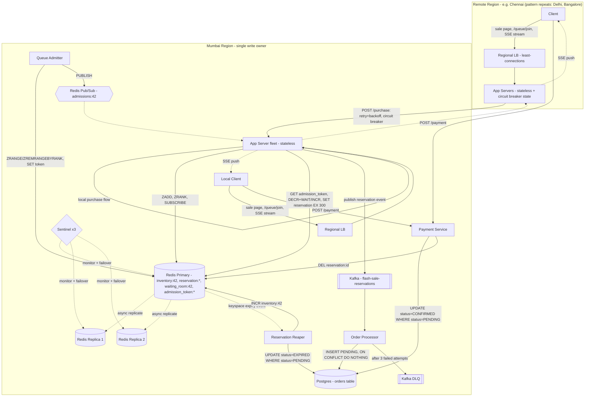
```mermaid
graph TD
    subgraph Chennai["Remote Region - e.g. Chennai (pattern repeats: Delhi, Bangalore)"]
        CHClient[Client]
        CHLB[Regional LB - least-connections]
        CHApp[App Servers - stateless + circuit breaker state]
    end

    subgraph Mumbai["Mumbai Region - single write owner"]
        MBClient[Local Client]
        MBLB[Regional LB]
        MBApp[App Server fleet - stateless]
        P[(Redis Primary - inventory:42, reservation:*, waiting_room:42, admission_token:*)]
        R1[(Redis Replica 1)]
        R2[(Redis Replica 2)]
        Sent{Sentinel x3}
        PubSub{{Redis Pub/Sub - admissions:42}}
        Adm[Queue Admitter]
        Kafka[[Kafka - flash-sale-reservations]]
        DLQ[[Kafka DLQ]]
        OP[Order Processor]
        PG[(Postgres - orders table)]
        PaySvc[Payment Service]
        Reaper[Reservation Reaper]
    end

    CHClient -->|sale page, /queue/join, SSE stream| CHLB --> CHApp
    MBClient -->|sale page, /queue/join, SSE stream| MBLB --> MBApp

    CHApp -->|POST /purchase: retry+backoff, circuit breaker| MBApp
    MBApp -->|local purchase flow| MBApp

    MBApp -->|ZADD, ZRANK, SUBSCRIBE| P
    Adm -->|ZRANGE/ZREMRANGEBYRANK, SET token| P
    Adm -->|PUBLISH| PubSub -.-> MBApp -.-> CHApp
    MBApp -.->|SSE push| MBClient
    CHApp -.->|SSE push| CHClient

    MBApp -->|GET admission_token, DECR+WAIT/INCR, SET reservation EX 300| P
    P -.->|async replicate| R1 & R2
    Sent -.->|monitor + failover| P & R1 & R2

    MBApp -->|publish reservation event| Kafka --> OP -->|INSERT PENDING, ON CONFLICT DO NOTHING| PG
    OP -->|after 3 failed attempts| DLQ

    CHClient -->|POST /payment| PaySvc
    MBClient -->|POST /payment| PaySvc
    PaySvc -->|UPDATE status=CONFIRMED WHERE status=PENDING| PG
    PaySvc -->|DEL reservation:id| P

    P -.->|keyspace expiry event| Reaper
    Reaper -->|UPDATE status=EXPIRED WHERE status=PENDING| PG
    Reaper -->|INCR inventory:42| P
```

## Every Distinct End-to-End Path

**1. Queue-join and SSE streaming (local to each region)**
1. Client calls `POST /queue/join` → `ZADD waiting_room:42 NX <ts> <user_id>` on Mumbai's Redis primary (all regions write to the same waiting room — fairness is global).
2. Client opens `GET /queue/stream` SSE on any local app server.
3. Server computes `ZRANK`, streams position; subscribes to `admissions:42` pub/sub for updates.

**2. Admission (every 200ms)**
1. Queue Admitter pulls batch: `ZRANGE` + `ZREMRANGEBYRANK` on `waiting_room:42`.
2. Issues `admission_token:*` with 60s TTL.
3. Publishes to `admissions:42`; every subscribed app server across every region forwards to its own connected clients.

**3. Purchase — Mumbai-local user**
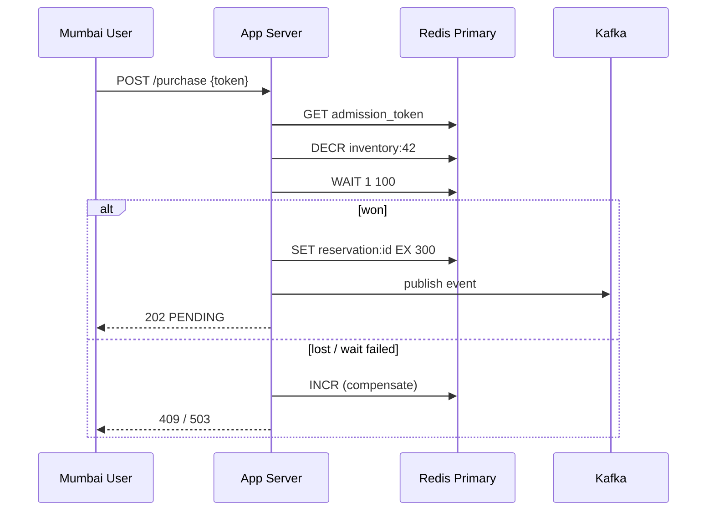
```mermaid
sequenceDiagram
    participant U as Mumbai User
    participant S as App Server
    participant R as Redis Primary
    participant K as Kafka
    U->>S: POST /purchase {token}
    S->>R: GET admission_token
    S->>R: DECR inventory:42
    S->>R: WAIT 1 100
    alt won
        S->>R: SET reservation:id EX 300
        S->>K: publish event
        S-->>U: 202 PENDING
    else lost / wait failed
        S->>R: INCR (compensate)
        S-->>U: 409 / 503
    end
```

**4. Purchase — remote-region user (Chennai etc.)**
1. Local admission-token check.
2. Forward to Mumbai over private backbone, wrapped in retry (jittered backoff, max 2) + circuit breaker.
3. Mumbai executes path 3 above; response relayed back.

**5. Order recording (async)**
1. Order Processor consumes Kafka topic.
2. `INSERT ... ON CONFLICT DO NOTHING` into Postgres.
3. After 3 failures on one event → DLQ + alert.

**6. Payment**
1. `POST /payment {reservation_id, token}`.
2. On success: `UPDATE orders SET status=CONFIRMED WHERE status=PENDING`, `DEL reservation:id`.

**7. Expiry / reclaim**
1. Redis TTL fires on unpaid `reservation:id` → keyspace notification.
2. Reaper: `UPDATE status=EXPIRED WHERE status=PENDING`, then `INCR inventory:42`.

**8. Failover (system-level, not user-triggered)**
1. Sentinel quorum (2 of 3) detects primary failure.
2. Promotes most-current replica.
3. App servers rediscover new primary via Sentinel.

## Why-Not-X Arsenal

| Alternative | Why we didn't |
|---|---|
| Postgres row lock for the hot counter | Caps at ~100-200 TPS from fsync/WAL overhead — nowhere near flash-sale demand. |
| Check-then-decrement without atomicity | Race window lets two requests both see stock and both take it — direct overselling. |
| Synchronous DB write inline in the request path | A crashed app server between "won" and "recorded" loses the win permanently — no durable handoff. |
| Cron job polling Postgres for expired reservations | Adds read pressure to the DB we're protecting, plus polling-interval delay before reclaim. |
| CAPTCHA or client-side throttling as the queue | Doesn't bound server-side concurrent load — a human or bypassed client still floods checkout directly. |
| Sticky sessions for the waiting-room connection | Turns a server restart into user-facing state loss instead of a transparent reconnect. |
| Full synchronous replication on every Redis write | Taxes the hottest, most latency-sensitive operation in the system on every single call. |
| CRDT counter for multi-region inventory | Tolerates eventual consistency by merging — wrong for finite physical stock where "briefly oversold" isn't acceptable. |
| Per-region inventory sharding | Avoids the write-conflict problem but changes the actual requirement — a fast regional buyer can be blocked by another region's unsold stock. |
| Unlimited retries on cross-region failures | Retry storms make a struggling dependency worse, and burns the 60s admission-token window. |

## Master Recap Table

| Version | Concept | The Insight |
|---|---|---|
| V0 | Row-level lock | Serializes buyers on one row — correct, but the exact thing that won't scale. |
| V1 | Redis atomic `DECR` | In-memory single instruction replaces disk-backed lock — 500x+ throughput. |
| V2 | Kafka durable handoff | A "win" must survive the crash of whatever server produced it. |
| V3 | TTL + conditional update | Abandoned reservations self-expire; `WHERE status='PENDING'` makes payment and expiry mutually exclusive. |
| V4 | Virtual waiting room | Decouples "arrived" from "allowed to checkout" — bounds load independent of demand. |
| V5 | Stateless app-server fleet | Local connection state caps horizontal scaling — push it all into Redis instead. |
| V6 | Semi-sync Redis replication | Sharding fixes throughput; replication fixes availability — this was an availability problem. |
| V7 | Single-writer multi-region | One global invariant needs one writer — route the write, don't replicate it. |
| V8 | Backoff, jitter, circuit breaker, DLQ | Protects a struggling dependency from retry pile-on; bounds retries against a bad event. |

**The one sentence that ties it all together**: naive designs let 2 million people race to decrement one number directly against disk — this system instead gates entry through a queue, races them against an in-memory atomic counter with durable failure handling at every handoff, and keeps that counter's single truth intact even across replica failover and multi-region traffic.

---

Where do you want to go next — drill deeper into any one piece (say, the Sentinel failover mechanics, or how you'd generalize this to many concurrent flash sales), or run a mock interview where I play interviewer and pressure-test the design?

---

Good catch — and the honest answer is: **we've used the *idea* behind saga pattern in miniature, but not the full pattern, and there's a real gap because of that.**

## What we already have (mini-sagas, un-named)

- V1: `DECR` then `INCR` if the Kafka publish fails — compensate the first step because the second step didn't complete.
- V6: `DECR` then `INCR` if `WAIT` times out — same shape.

These are compensating transactions, but each one is a **single step compensating for the very next step**, inside one request. That's saga *thinking*, but not a saga *workflow*.

## Where we actually need it and don't have it

Look at the real multi-step business workflow here:

1. Reserve inventory (Redis `DECR`)
2. Record reservation (Kafka → Postgres `PENDING`)
3. Collect payment (Payment Service)
4. Confirm order (Postgres `CONFIRMED`)

That's a saga — a sequence of local transactions across separate services (Redis, Postgres, Payment Service), with no single database transaction spanning all of them.

Here's the gap: **what happens today if Priya's payment is explicitly declined** — not "she never tried," but her card fails at step 3? Walk through what we've built: nothing. There's no explicit failure path from the Payment Service back to inventory. The order just sits `PENDING`, and the *only* thing that ever reclaims it is the TTL expiry from V3 — which takes up to 5 minutes to fire.

That's a real, concrete problem: a declined card should release the unit **immediately**, so the next person in the waiting room can get it. Instead, right now, a known-failed purchase holds a unit hostage for up to 5 minutes doing nothing. At high contention, that's expensive — units sit idle while people who'd actually complete the purchase are stuck waiting.

## Is it worth adding as its own version?

Yes — this is a legitimate gap, not a nice-to-have. The fix is exactly the saga pattern, done explicitly rather than only relying on the passive TTL fallback:

- **Choreography version** (simpler, fits what we've built): Payment Service, on an explicit decline, publishes a `payment-failed` event. A consumer (could be the Reaper, extended) reacts by immediately running the same compensation the TTL path already does — `UPDATE status=EXPIRED WHERE status=PENDING'` + `INCR inventory:42` — instead of waiting for the TTL.
- **Orchestration version** (heavier): a dedicated saga orchestrator owns the whole reserve→pay→confirm sequence and explicitly calls compensating steps on failure, rather than each service reacting to events independently.

Given our scale and the number of steps (three, not ten), choreography fits better — an orchestrator here would be over-engineering for a workflow this short.

Want me to add this as **V9**, with the full break-it (the "5 minutes of idle unit" cost, with numbers) → solve-it → implement-it treatment, the same as every other version? It's a good one to have crisp for an interview, since "have you used the saga pattern here" is almost exactly the question you just asked me.

---

## V9 — Break It: The Declined Card That Holds a Unit Hostage

Let's put a number on the gap I just described.

Priya wins a unit at 10:00:00.100. Her reservation goes `PENDING`. She proceeds to pay — but her card is declined at 10:00:02, for a completely mundane reason (insufficient limit, bank's fraud filter, wrong CVV). The Payment Service knows this, right now, at 10:00:02.

But nothing in our system acts on that knowledge. The order just sits `PENDING`. The only mechanism that ever looks at it again is the TTL Reaper from V3 — and that fires at 10:05:00, five minutes later.

Here's why that's expensive, not just untidy. Say 100 units exist, and even a conservative 10% of "winners" have their card declined outright (separate from the 15% who simply abandon checkout — this is a distinct, immediate-failure case). That's 10 units sitting completely idle — reserved by nobody, usable by nobody — for up to 5 minutes each, during the single highest-demand window this system will ever see. Real buyers waiting in the queue behind them get told "sold out" for stock that is, provably, not sold.

> **Arjun**: "But the TTL *does* eventually release it — isn't that enough?"
> **Meera**: "Eventually isn't the point. We know the payment failed the instant it fails. Waiting five minutes to act on information we already have is just... leaving money and inventory on the table for no reason. The whole system is built around urgency — this one path forgot to be urgent."

This is exactly the shape of problem the saga pattern exists for: a business operation (reserve → pay → confirm) spans multiple independent services, with no single database transaction covering all of them, and a failure partway through needs to explicitly undo the steps that already succeeded — not wait for an unrelated timeout to eventually notice.

## Solve It

The fix: when the Payment Service gets an explicit decline (not a timeout, not silence — an actual "no" from the payment gateway), it immediately publishes a `payment-failed` event. The Reservation Reaper (already built in V3) subscribes to this too, and runs the exact same compensation it already runs on TTL expiry — just triggered by an event instead of a clock.

✅ **What we gained**
A declined payment releases its unit in milliseconds, not up to 5 minutes. During peak contention, this directly increases the number of units that actually reach a paying buyer instead of sitting idle.

⚠️ **What we gave up / new problem this creates**
We now have **two triggers** that can both attempt to expire the same reservation — the explicit `payment-failed` event and the TTL keyspace expiry, if both somehow fire close together (e.g., decline happens right as the TTL was about to fire anyway). We need the same `WHERE status='PENDING'` guard to make this safe, which we already built in V3 — so this isn't a new problem, it's the same guard doing double duty.

❌ **What we considered and rejected**
- **Full saga orchestrator (a dedicated service owning the reserve→pay→confirm sequence, explicitly calling each step and its compensation)**: the right pattern at 10+ step workflows with complex branching. Ours has three steps. An orchestrator here is a new stateful service to build, deploy, and keep available, for a sequence simple enough that choreography (services reacting to each other's events) handles cleanly.
- **Payment Service directly calling `INCR` on Redis and updating Postgres itself, inline**: works, but couples the Payment Service to inventory internals it shouldn't need to know about — every future consumer of "payment failed" (analytics, fraud alerting, refund workflows) would need the same coupling. An event lets the Reaper own inventory-reclaim logic in one place, same as it already does for TTL.
- **Do nothing, rely on TTL only (status quo)**: this is what we're replacing — correct eventually, but costs real usable inventory time during the highest-value minutes of the sale.

## Implement It

**New Kafka topic**: `payment-events`, payload:
```json
{
  "reservation_id": "res_8827f1",
  "status": "FAILED",
  "reason": "card_declined",
  "failed_at": "2026-09-02T10:00:02.301Z"
}
```

**Who writes**: Payment Service, immediately on receiving an explicit decline from the payment gateway (not on timeout — a gateway timeout is ambiguous, we don't know if the charge actually went through, so that stays on the slower, safer TTL path deliberately).
**Who reads**: Reservation Reaper — extended from V3 to subscribe to this topic in addition to Redis keyspace notifications.
**Where it lives**: same Kafka cluster as `flash-sale-reservations`, new topic.

Step by step, the new compensation flow:

1. `POST /payment` fails at the gateway — Payment Service receives an explicit decline (not a timeout).
2. Payment Service publishes to `payment-events`: `{reservation_id, status: FAILED, reason: card_declined}`.
3. Payment Service also responds to the client immediately: `402 Payment Failed` — Priya can see this right away and rejoin the queue if she wants to try again with a different card (a fresh `/queue/join`, since her admission token has already been consumed).
4. Reaper (extended): consumes `payment-events`, on `status: FAILED` runs the same compensation as its TTL path — `UPDATE orders SET status='EXPIRED' WHERE reservation_id='res_8827f1' AND status='PENDING'`.
5. If that update affects 0 rows (because the TTL path already expired it independently, a rare timing coincidence), that's fine — it's a no-op, same idempotency guarantee as before.
6. Reaper runs `INCR inventory:42` on Redis — unit back in the pool, milliseconds after the decline instead of minutes.
7. Reaper also deletes the now-irrelevant `reservation:res_8827f1` TTL key from Redis (`DEL`) — cleanup, so it doesn't fire a redundant expiry event later.

```mermaid
sequenceDiagram
    participant U as Priya (Client)
    participant PaySvc as Payment Service
    participant K as Kafka (payment-events)
    participant Reaper as Reservation Reaper
    participant DB as Postgres (orders)
    participant R as Redis

    U->>PaySvc: POST /payment {reservation_id, payment_token}
    PaySvc->>PaySvc: gateway declines (explicit)
    PaySvc->>K: publish {reservation_id, status: FAILED}
    PaySvc-->>U: 402 Payment Failed

    K->>Reaper: consume payment-events
    Reaper->>DB: UPDATE status=EXPIRED WHERE status=PENDING
    Reaper->>R: INCR inventory:42
    Reaper->>R: DEL reservation:res_8827f1
```

Think of this like a restaurant table hold again, but now with a phone call instead of just a countdown clock. If the guest calls and says "actually, we're not coming" the moment they know it, the host frees the table right then — they don't just let the 15-minute hold silently run out when they already have the information needed to act sooner.

## Current State (V9)

```mermaid
graph TD
    subgraph Chennai["Remote Region"]
        CHClient[Client]
        CHApp[App Servers]
    end
    subgraph Mumbai["Mumbai Region - write owner"]
        MBApp[App Server fleet]
        P[(Redis Primary)]
        R1[(Replica 1)]
        R2[(Replica 2)]
        Sent{Sentinel}
        Kafka[[Kafka - flash-sale-reservations]]
        PayEvents[[Kafka - payment-events]]
        DLQ[[Kafka DLQ]]
        OP[Order Processor]
        PG[(Postgres)]
        PaySvc[Payment Service]
        Reaper[Reservation Reaper]
        Adm[Queue Admitter]
    end

    CHClient --> CHApp -->|forward| MBApp
    MBApp --> P
    P -.-> R1 & R2
    Sent -.-> P & R1 & R2
    MBApp -->|publish| Kafka --> OP -->|INSERT PENDING| PG
    OP -->|3 failures| DLQ

    CHClient -->|POST /payment| PaySvc
    PaySvc -->|success: UPDATE CONFIRMED| PG
    PaySvc -->|success: DEL reservation| P
    PaySvc -->|decline: publish FAILED| PayEvents

    PayEvents -->|consume| Reaper
    P -.->|TTL expiry, unchanged| Reaper
    Reaper -->|UPDATE EXPIRED WHERE PENDING| PG
    Reaper -->|INCR inventory:42| P
    Reaper -->|DEL reservation key| P

    style PayEvents fill:#f9d,stroke:#333
```
*`payment-events` Kafka topic is new in V9. Reaper is extended to consume it — everything else is structurally unchanged from V8.*

**Flows as of V9:**
1. **All flows V1–V8** — unchanged (queue-join, admission, purchase local/remote, order recording, TTL expiry, retries/circuit-breaker/DLQ).
2. **Payment flow (changed this version)** — on success, unchanged from V3. On explicit decline: Payment Service now publishes `payment-events`, returns `402` immediately, instead of leaving the reservation to expire silently via TTL alone.
3. **Compensation flow (new)** — Reaper now has two independent triggers (Redis TTL expiry, and `payment-events` FAILED) both converging on the same idempotent compensation logic (`UPDATE ... WHERE status='PENDING'`, then `INCR`, then `DEL`).

## Interviewer Follow-ups

**"Why not also do this for a payment gateway timeout, not just an explicit decline?"**
Because a timeout is ambiguous — we genuinely don't know if the charge succeeded on the gateway's side or not. Compensating immediately on an ambiguous outcome risks releasing a unit that was actually paid for, which could double-sell it to someone else. An explicit decline has no such ambiguity — the gateway is certain, so we can act immediately. Timeouts deliberately stay on the slower, safer TTL path, or would need a reconciliation check against the gateway before compensating.

**"Isn't this the same idempotency problem as before, just with two triggers now instead of one?"**
Yes, exactly — and that's the reassuring part, not a new risk. We're reusing the exact `WHERE status='PENDING'` guard from V3. Two triggers racing to compensate the same reservation is safe for the same reason two triggers racing to confirm it would be safe: only one of them can match a row that's still `PENDING`.

## Recap

| Concept | The Insight |
|---|---|
| Saga pattern (choreography) | A multi-step business workflow across independent services needs explicit compensation on failure — not just an eventual, unrelated timeout. |
| Explicit failure vs. ambiguous failure | An explicit decline can be compensated immediately; a timeout can't, because you don't know if the operation actually succeeded. |
| Event-driven compensation | Payment Service publishes what happened; Reaper owns deciding what to do about inventory — keeps the compensation logic in one place, reusable by multiple triggers. |
| Reusing the idempotency guard | Two independent triggers (TTL, payment-failed event) converging on the same `WHERE status='PENDING'` update is safe for free — no new locking needed. |
| Orchestration vs. choreography | A three-step saga doesn't justify a dedicated orchestrator — event-driven choreography between existing services (Payment Service, Reaper) is proportionate here. |

**One-breath version**: If asked whether you'd use the saga pattern here: yes, choreographed not orchestrated, because reserve-pay-confirm spans three independent services with no shared transaction, and a known, explicit failure like a declined card should trigger immediate compensation through an event rather than silently waiting on an unrelated TTL to eventually notice.

---

This closes the last real gap — every version now, V0 through V9, plus the earlier polling/WebSocket correction, adds up to a design where I don't think anything's left implicit. Want the master recap table updated with this row, a mock interview pass, or to move to the next system in your queue?

---
