Let's do this properly — like a war story, not a lecture. I'll set the scene, show you the naive system, let it crash and burn, then we dig into *why* before fixing it. We'll go slow — one concept per turn — and you tell me when you're ready to move on.

---

## Chapter 1: The Naive System (and why it dies)

**The setup:** You're an engineer at "ShopFast," a mid-size e-commerce company. Marketing wants to sell 1,000 units of a wildly hyped sneaker at ₹2,000 (normally ₹8,000) at exactly 12:00 PM. They've promoted it for a week. They expect "maybe 50,000 people" to show up.

Your current architecture — because it's worked fine for years of normal traffic — looks like this:

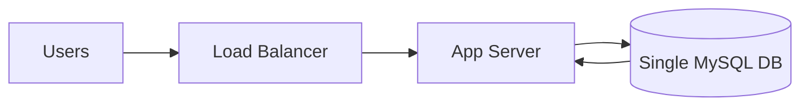
```mermaid
flowchart LR
    U[Users] --> LB[Load Balancer]
    LB --> A1[App Server]
    A1 --> DB[(Single MySQL DB)]
    DB --> A1
```

Simple. App server checks stock in the DB, if stock > 0 it creates an order and decrements stock, all in one SQL transaction. This is how checkout has always worked. Nobody sees a problem — because nobody has ever sent this system 50,000 people in the same 10 seconds before.

**12:00 PM hits.**

Three things go wrong, almost simultaneously:

### Problem 1: The thundering herd
Instead of 50,000 people trickling in over an hour, you get 50,000 requests in the first 15 seconds — everyone had the page open, refreshing, waiting for the clock. Your load balancer happily forwards all of them to your app servers. Your app servers happily open 50,000 DB connections (or queue trying to). MySQL, which is tuned for maybe 200 concurrent connections, falls over. Not just the flash sale breaks — **your entire site goes down**, because this is the same DB powering your product pages, your login, everything.

This is called a **thundering herd problem**: a huge number of clients waking up and hitting the same resource at the exact same instant.

### Problem 2: Overselling (the race condition)
Even for the requests that *do* get through, here's your naive checkout logic:

```sql
SELECT stock FROM products WHERE id = 123;  -- returns stock = 1
-- app checks: stock > 0? yes.
UPDATE products SET stock = stock - 1 WHERE id = 123;
INSERT INTO orders ...;
```

Looks fine for one user. But with concurrency, here's what actually happens with the last unit of stock:

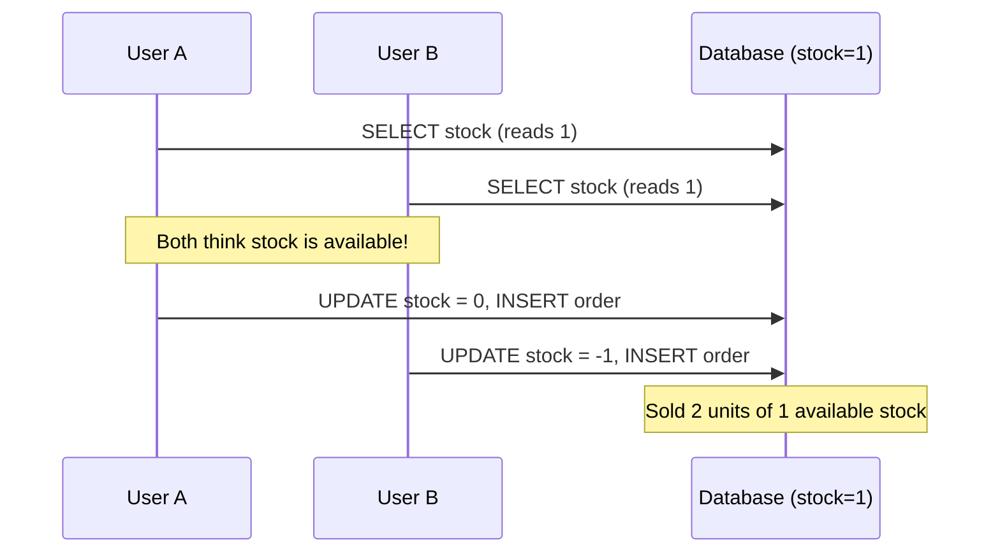
```mermaid
sequenceDiagram
    participant U1 as User A
    participant U2 as User B
    participant DB as Database (stock=1)

    U1->>DB: SELECT stock (reads 1)
    U2->>DB: SELECT stock (reads 1)
    Note over U1,U2: Both think stock is available!
    U1->>DB: UPDATE stock = 0, INSERT order
    U2->>DB: UPDATE stock = -1, INSERT order
    Note over DB: Sold 2 units of 1 available stock
```

Both requests read stock=1 *before* either writes. Both think they succeeded. You've now sold the same pair of sneakers to two people. At flash-sale scale, with thousands of concurrent requests on one hot row, this isn't a rare edge case — it's guaranteed to happen, repeatedly, and you end up overselling hundreds of units. Someone now has to call customers and apologize.

### Problem 3: Everything is a single point of failure
One DB. One set of app servers with no autoscaling configured for a 1000x spike. When the DB dies, everything downstream dies with it. There's no isolation between "flash sale traffic" and "everything else ShopFast does."

---

**So here's the situation you're in as the engineer:** marketing wants to run this again next month, bigger. Your job is to redesign this so it (a) survives the traffic spike, (b) never oversells, and (c) doesn't take down the rest of the site.

Before I introduce the first fix — take a second and tell me: **of these three problems, which do you think is the hardest to solve, and why?** That'll tell me where to start us.

---

## Chapter 2: Taming the Thundering Herd — The Virtual Waiting Room

Let's tackle Problem 1 first, because if you don't solve it, nothing else matters — your servers die before they even get a chance to worry about overselling.

**The instinct most engineers have first:** "Let's just add more app servers and scale up the DB." This is the natural first move, and it's *wrong* as a primary fix — here's why.

Say you scale from 10 app servers to 200, and upgrade your DB to a beefier instance. You've spent a lot of money to survive *this* flash sale. But the fundamental problem hasn't changed: you're still trying to let 50,000 people hit a resource that only has 1,000 units to sell. **99.98% of that traffic is going to fail anyway** — there's no amount of horizontal scaling that lets everyone "win" a sale of 1,000 items among 50,000 buyers. So why are you paying to give all 50,000 of them full access to your checkout, database, and inventory system at the same instant?

The real insight: **flash sales don't need more capacity, they need traffic shaping.** You need to control *the rate* at which requests are even allowed to reach your critical systems.

### The fix: Virtual Waiting Room (a.k.a. queue-based admission control)

Instead of routing users straight to checkout, you put them in a queue *before* they ever touch your app servers or DB:

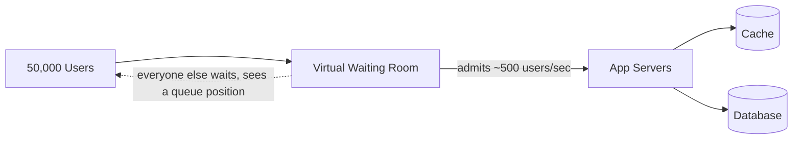
```mermaid
flowchart LR
    U[50,000 Users] --> WR[Virtual Waiting Room]
    WR -->|"admits ~500 users/sec"| A[App Servers]
    A --> C[(Cache)]
    A --> DB[(Database)]
    WR -.->|"everyone else waits, sees a queue position"| U
```

How it actually works:

1. When a user hits the sale page, they're handed a **ticket** (often a signed token with a timestamp) and shown "You are #14,532 in line."
2. A lightweight, horizontally-scalable service (this can literally just be a Redis-backed counter behind a CDN edge, or a dedicated queueing layer) admits a controlled number of tickets per second — say, 500/sec — into the actual checkout flow.
3. Everyone else just polls a cheap status endpoint ("am I in yet?") which does **not** touch your DB at all — it's served from cache/edge.
4. Only admitted users get a short-lived, valid session to actually hit inventory/checkout.

This is exactly what ticketing platforms (Ticketmaster's queue, BookMyShow during big releases) and shoe drop apps (Nike SNKRS) do. You've probably stood in one of these virtual queues yourself.

### Why this works

- **It converts an uncontrolled spike into a controlled, steady stream.** Your app/DB now only ever sees the load you designed for (500 req/s, not 50,000 req/s in one burst).
- **The expensive resources (DB, app servers) are shielded entirely** — the waiting room absorbs 98% of the traffic using cheap infrastructure (a counter + a CDN), not your core stack.
- **It's honest with users.** A spinning wheel that times out feels broken. A queue position feels fair and manages expectations — critically important for a business, since angry customers hurt the brand more than a slow queue does.

### A subtlety worth knowing for interviews: how do you admit people *fairly*?

Two common strategies, and interviewers like hearing you weigh them:

| Strategy | How it works | Trade-off |
|---|---|---|
| **FIFO ticket queue** | First to request a ticket, first admitted | Fair, but rewards people with faster bots/scripts refreshing at 11:59:59 |
| **Randomized lottery** | Everyone who arrives in a window (e.g., first 2 min) gets randomly shuffled, then admitted | Neutralizes bot advantage, feels fairer to humans, but harder to explain to users ("why is someone who joined after me in front?") |

Real systems (Nike SNKRS, ticket sales for concerts) increasingly use the **lottery model** specifically to fight bots — a plain FIFO queue is trivially gameable by anyone running a script that requests a ticket faster than a human can click.

---

This single layer solves Problem 1 (thundering herd) and Problem 3 (blast radius — the waiting room is a separate, cheap, isolated service, so even if it gets hammered, your core DB/app servers never feel it).

Notice: **it has not yet solved Problem 2 (overselling).** Even with only 500 requests/sec hitting your checkout now, if your last unit of stock is being checked by 2 of those 500 requests at the same millisecond, you can still oversell. That's next.

Does the waiting room concept make sense so far? Once you're comfortable, we'll move to fixing the race condition on inventory.

---

Good — this is exactly the kind of "wait, but *how*" question interviewers love, and it's where most candidates hand-wave. Let's build it piece by piece.

## The core data structure: a Redis Sorted Set

You need something that can answer two questions cheaply, at scale:
1. "What's my position in line?" (without removing me from the queue)
2. "Let the next 500 people through" (in arrival order)

A **Redis Sorted Set (ZSET)** does both:

```
Key: queue:{sale_id}
Member: session_id (unique per user)
Score: arrival_sequence (a monotonically increasing number, or timestamp)
```

- `ZADD queue:sale123 <seq> <session_id>` → enqueue (O(log N))
- `ZRANK queue:sale123 <session_id>` → get position without removing anyone (O(log N))
- `ZPOPMIN queue:sale123 500` → atomically pop the 500 earliest arrivals to admit them (O(log N))

This is why Redis specifically (not just "a queue") — you need rank lookups, and a plain queue (Kafka, SQS) can't tell a waiting user "you're #14,532" without consuming the queue.

## The full request flow

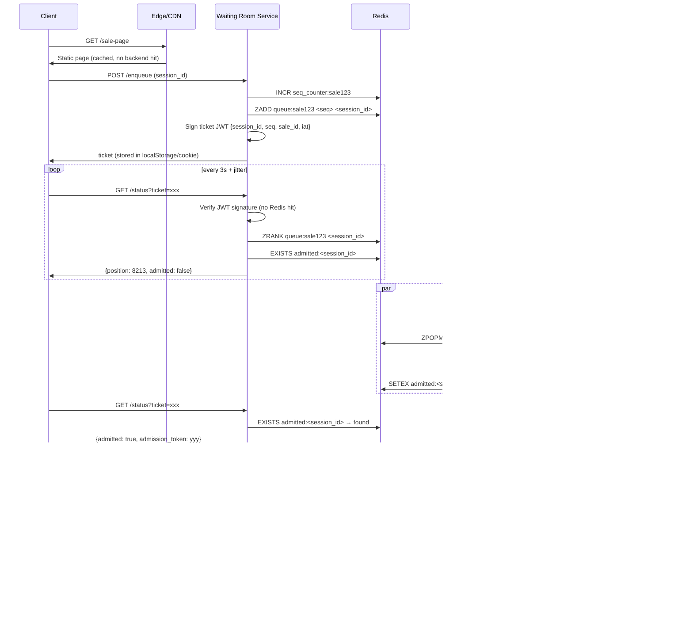
```mermaid
sequenceDiagram
    participant C as Client
    participant E as Edge/CDN
    participant WR as Waiting Room Service
    participant R as Redis
    participant AW as Admission Worker
    participant APP as App/Checkout Server

    C->>E: GET /sale-page
    E->>C: Static page (cached, no backend hit)

    C->>WR: POST /enqueue (session_id)
    WR->>R: INCR seq_counter:sale123
    WR->>R: ZADD queue:sale123 <seq> <session_id>
    WR->>WR: Sign ticket JWT {session_id, seq, sale_id, iat}
    WR->>C: ticket (stored in localStorage/cookie)

    loop every 3s + jitter
        C->>WR: GET /status?ticket=xxx
        WR->>WR: Verify JWT signature (no Redis hit)
        WR->>R: ZRANK queue:sale123 <session_id>
        WR->>R: EXISTS admitted:<session_id>
        WR->>C: {position: 8213, admitted: false}
    end

    par Every 1 second
        AW->>AW: Check downstream health / capacity
        AW->>R: ZPOPMIN queue:sale123 500
        AW->>AW: Generate admission_token (signed, 90s TTL) per user
        AW->>R: SETEX admitted:<session_id> 90 <admission_token>
    end

    C->>WR: GET /status?ticket=xxx
    WR->>R: EXISTS admitted:<session_id> → found
    WR->>C: {admitted: true, admission_token: yyy}

    C->>APP: GET /checkout (admission_token=yyy)
    APP->>APP: Verify signature + expiry
    APP->>R: SET used_nonce:<token_id> NX EX 90
    alt nonce not seen before
        APP->>C: Proceed to inventory check
    else nonce already used (replay)
        APP->>C: 403 Reject
    end
```

Let's unpack the pieces you specifically asked about — "how do we know a ticket is ready."

### 1. Two different tokens, two different jobs

People conflate these, but they're distinct, and interviewers notice if you don't separate them:

- **Queue ticket** — issued immediately on enqueue. Proves "I'm in line, and here's my position." Long-lived (whole queue duration).
- **Admission token** — issued only when the Admission Worker pops you off the queue. Proves "I'm cleared to hit checkout, right now." Deliberately **short-lived** (60–90 seconds) — this is your defense against someone getting admitted, walking away, and holding a checkout slot open forever while stock ticks down.

### 2. Why signed (JWT-style) tokens instead of just a Redis lookup key

Both tickets are **signed** (HMAC or RSA) by the Waiting Room Service. This matters because:
- The **poll endpoint** can verify "is this a legitimate ticket, has it expired, does the sale_id match" *without touching Redis at all* — pure CPU signature verification. Redis is only consulted for the *dynamic* part (rank, admitted-or-not). At 50,000 users polling every 3 seconds, that's ~16,600 QPS — you want as much of that served without a database round-trip as possible.
- It prevents forgery — a user can't hand-craft a ticket claiming `seq: 1` to jump the queue, because they can't produce a valid signature.

### 3. How the App Server knows to trust an admitted request

The admission token is just another signed JWT, but the App Server does one extra thing: **nonce/replay protection**. Without it, a user could screenshot/share their admission token in a Discord, and 500 people could reuse the *same* token to hit checkout. So:
```
SET used_nonce:<token_id> NX EX 90
```
`NX` = only set if not already present. If two requests race with the same token, only the first `SET` succeeds — the second is rejected. This is a cheap, atomic single Redis command doing double duty as both a replay guard and a mini rate-limiter.

### 4. Why polling has jitter, and why not just use WebSockets

Polling every *exactly* 3 seconds means all 50,000 clients that enqueued around the same moment will re-poll in synchronized waves — you've recreated a smaller thundering herd against your own status endpoint. Adding random jitter (e.g., `3s + random(0,1s)`) smooths this into a steady stream.

You could instead push updates via WebSocket/SSE when someone's admitted — no polling waste. The trade-off: now your Waiting Room Service has to hold 50,000 concurrent open connections, which is a different (and arguably harder) scaling problem — connection-count scaling instead of request-rate scaling. Most real systems (Ticketmaster, BookMyShow) choose polling specifically because it's stateless and trivially horizontally scalable — any of N status-service replicas can answer any poll, since state lives in Redis, not in a held-open connection.

### 5. The Admission Worker's rate is not fixed — it's a feedback loop

This is the detail that separates a "textbook queue" answer from a "production-grade" answer: the worker doesn't blindly admit 500/sec forever. It watches downstream health signals (app server latency, DB CPU, error rate) and **throttles admission dynamically** — admit fewer if checkout is struggling, admit more if there's headroom. This ties directly into circuit breakers, which we'll cover later in the error-handling chapter.

---

One loose end for completeness: what if the user refreshes their browser mid-queue? The ticket is stored client-side (localStorage/cookie), keyed to a `session_id` that's also derived deterministically (or stored server-side against a login/device fingerprint) — so re-fetching `/status` with the same ticket resumes exactly where they were, rather than re-enqueuing them at the back.

Take a moment with this — does the two-token split (queue ticket vs. admission token) and the ZSET mechanics make sense? Once you're solid here, we move to Chapter 3: the actual inventory race condition, now that we know only ~500 req/sec of *validated* traffic reaches that layer.

---

Good catch — I glossed over that. Let's be precise.

## What it actually is

`session_id` is just a **random, unique identifier for this particular visit/tab**, not tied to a login. Typically a **UUIDv4** (`f47ac10b-58cc-4372-a567-0e02b2c3d479`) or a cryptographically random string (e.g., 128 bits from `crypto.randomUUID()` in JS or `secrets.token_urlsafe(16)` server-side).

Its only job: let the same browser tab consistently prove "I am the same entity that enqueued earlier" across the poll requests, without requiring the user to be logged in (many flash sale sites let you queue *before* login/checkout).

## Where it's actually generated — and why "client-side" is a bit misleading

You're right to push on this, because **pure client-generation is a real security smell**, and a careful interviewer will flag it. Let's separate what's true from what's sloppy in what I said:

**The naive/wrong way:** client runs `crypto.randomUUID()` in JS and sends whatever it wants as `session_id` in the enqueue request. Problem: nothing stops a user from generating 1,000 different session_ids and enqueuing 1,000 times to get 1,000 queue tickets, or from *guessing/reusing* someone else's session_id to peek at their queue position.

**What real systems actually do:** the server generates the session_id (or a wrapper around it) and hands it to the client — the client never gets to invent its own identity. Two common patterns:

1. **Logged-in flow:** `session_id` is just derived from the existing auth session (a hash of the user's account ID + a per-sale salt, so it's stable but doesn't leak the raw user ID). One account → one ticket, enforced server-side at enqueue time (`ZADD` is a no-op if the member already exists in the ZSET — that's a natural dedup for free).

2. **Anonymous/pre-login flow:** on the very first request to the sale page, the server sets an **HttpOnly, Secure cookie** containing a signed random ID (`Set-Cookie: qsid=<random>; HttpOnly; Secure; SameSite=Strict`). "Client-side" in my earlier message really meant "the browser carries this cookie back on every subsequent request automatically" — not that the client is free to mint its own value. The `HttpOnly` flag matters specifically so JS on the page (or an injected script) can't read/tamper with it.

## So why not just use the JWT ticket itself as the identity?

You could — and honestly, in a lot of real implementations, `session_id` as a separate concept collapses into "whatever's inside the signed ticket's `sub` claim." I introduced it as a separate field mainly to make the ZSET operations readable (`ZADD queue:sale123 <seq> <session_id>`), but the more precise version is:

- Server picks a random ID (or derives one from login) → this becomes the ZSET member and the JWT's `sub` claim → cookie carries a reference to fetch that same ticket back on refresh.

The important interview point isn't the exact field name — it's that **identity has to originate from something the server controls or verifies (a signed cookie, an auth token), never a bare client-supplied string**, or you've opened the door to trivial queue-stuffing/spoofing.

Want to go back to Chapter 3 (the inventory race condition) now, or any other loose end here first?

---

## Chapter 3: Stopping the Overselling — The Inventory Race Condition

Recall Problem 2 from Chapter 1: two users both `SELECT` stock=1, both think they can buy, both `UPDATE` and `INSERT`. You've now sold 1 sneaker to 2 people. Even with the waiting room throttling you to 500 req/sec, if 20 of those are all trying to buy the *last* unit in the same 100ms window, you still oversell without fixing this specifically.

Let's walk through the fixes in the order teams typically discover them — including the ones that look right and aren't.

### Attempt 1: "Just add a WHERE clause" (the naive fix people try first)

```sql
UPDATE products SET stock = stock - 1 
WHERE id = 123 AND stock > 0;
```

This is actually a real improvement — it's a **single atomic statement** instead of read-then-write. The DB guarantees that only requests where `stock > 0` *at the moment of the update* succeed. Check `rows_affected`: if it's 0, sale failed (sold out), no INSERT happens.

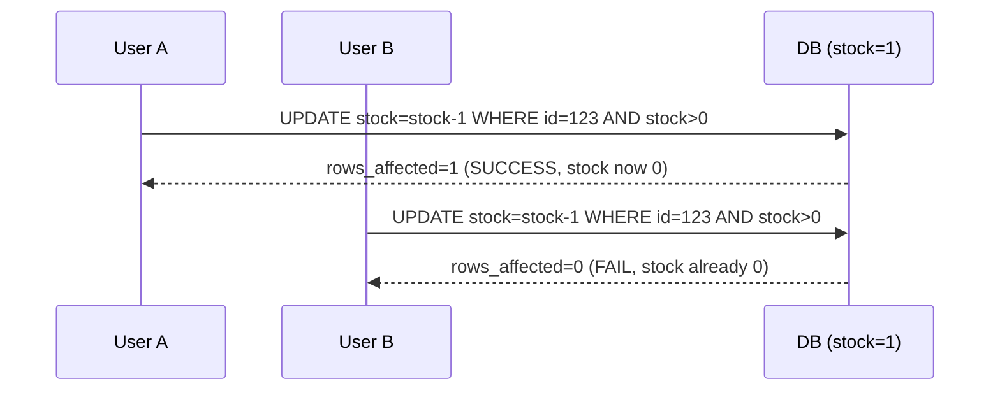
```mermaid
sequenceDiagram
    participant U1 as User A
    participant U2 as User B
    participant DB as DB (stock=1)

    U1->>DB: UPDATE stock=stock-1 WHERE id=123 AND stock>0
    DB-->>U1: rows_affected=1 (SUCCESS, stock now 0)
    U2->>DB: UPDATE stock=stock-1 WHERE id=123 AND stock>0
    DB-->>U2: rows_affected=0 (FAIL, stock already 0)
```

This genuinely fixes correctness — MySQL/Postgres take a row-level lock during the UPDATE, so two concurrent updates on the same row are serialized by the DB engine itself. **No overselling.** This is a real, production-valid answer, and I want to pause on it — a lot of people wrongly skip straight to "you need distributed locks," but for a lot of scale ranges, this atomic UPDATE is genuinely sufficient and simpler.

**So why isn't this the end of the story?**

### The problem this reveals: the "hot row"

Here's the thing nobody notices until they load-test it: **every single one of your 500 req/sec for this product is fighting over one row.** Postgres/MySQL row locks mean requests queue up *waiting for the lock*, not failing fast. With 500 concurrent transactions all trying to lock `WHERE id=123`, you get:

- Massive **lock contention** — transactions queue, latency climbs from 5ms to 2000ms+ per request
- **Connection pool exhaustion** — every waiting transaction holds a DB connection open
- If it gets bad enough, the DB's lock wait timeout kicks in and starts throwing deadlock/timeout errors

This is fundamentally different from Chapter 1's problem (which was about the *DB dying from raw connection count*). Here the DB isn't dying — it's just serializing everyone through a single point, because inventory decrement is *inherently* a sequential operation on one number. You cannot shard your way out of "this counter must be touched one-at-a-time" the way you can shard reads.

### Attempt 2: Move the hot counter out of the DB entirely — Redis atomic decrement

The insight: the DB is the wrong tool for "very fast, very contended single-number decrement." Redis is single-threaded per command and built exactly for this.

```
DECR inventory:product123
```

`DECR` is atomic in Redis — no race condition possible, and it's an in-memory operation, so it's orders of magnitude faster than a row-locked SQL UPDATE (microseconds vs milliseconds).

Flow becomes:

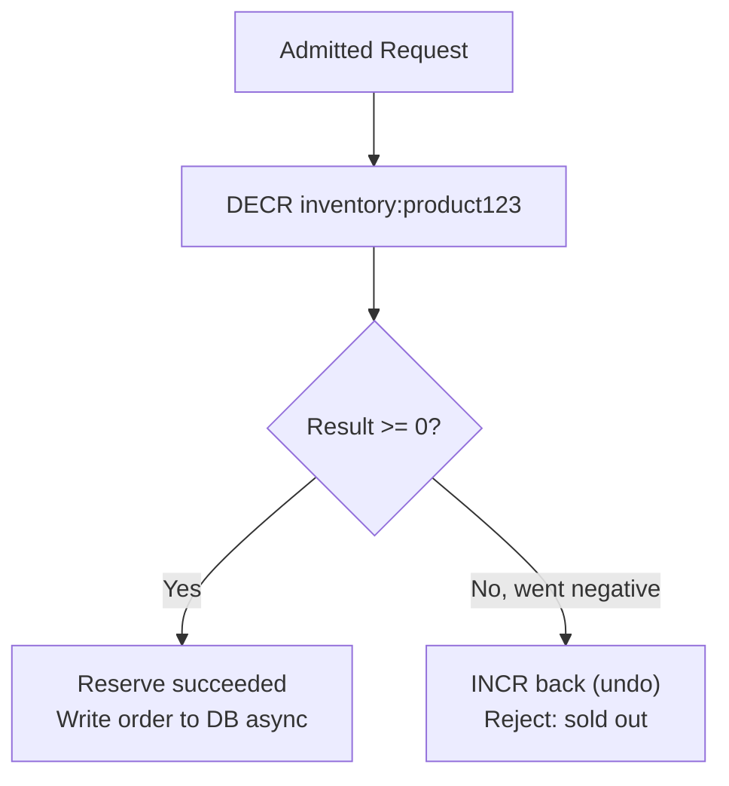
```mermaid
flowchart TD
    A[Admitted Request] --> B["DECR inventory:product123"]
    B --> C{"Result >= 0?"}
    C -->|Yes| D[Reserve succeeded<br/>Write order to DB async]
    C -->|No, went negative| E["INCR back (undo)<br/>Reject: sold out"]
```

Important subtlety: `DECR` doesn't know about "don't go below zero" — it'll happily take stock to -47 if you let it. So you check the *returned* value after decrementing, and if it's negative, you immediately `INCR` it back (undo) and reject the request. This is a well-known pattern, but notice it's slightly wasteful — you're doing a decrement-then-possibly-undo dance under high contention at the very end of the sale when most requests are failing.

**Better: a single atomic check-and-decrement using a Lua script**, since Redis guarantees a Lua script runs atomically, uninterrupted:

```lua
-- KEYS[1] = inventory:product123
local stock = tonumber(redis.call('GET', KEYS[1]))
if stock > 0 then
    redis.call('DECR', KEYS[1])
    return 1  -- success
else
    return 0  -- sold out
end
```

This does the check-and-decrement as one atomic unit — no separate undo step needed, no window where a bad decrement is visible to anyone else.

### The new problem this creates: Redis is now your source of truth for money-relevant data

This is the trade-off an interviewer wants you to *articulate*, not just discover:

- Redis is in-memory. If that Redis node crashes before it's persisted (AOF/RDB) or replicated, **you lose the true inventory count** — you might come back up thinking you have 200 units left when you actually have 0.
- Redis and your DB (source of truth for the *actual order record*) are now **two systems that can disagree**. If the Redis decrement succeeds but the async DB write to create the order fails, you've decremented stock for an order that doesn't exist — phantom lost inventory.

So the real production pattern is: **Redis for the hot-path gatekeeping decision (fast reject/accept), DB (or a durable log) as eventual source of truth**, reconciled asynchronously. This naturally leads into decoupling order *acceptance* from order *fulfillment* via a message queue — which is genuinely the next big concept (and also helps with Problem 3's blast-radius concern, and gives you retry/idempotency for free).

---

Quick gut-check before we go there: does the progression make sense — **DB atomic UPDATE (correct but contended) → Redis atomic DECR/Lua (fast but now needs reconciliation with the DB)**? Once that's solid, Chapter 4 is: what happens *after* Redis says "yes you got one" — how do we reliably turn that into a real order without losing it or double-processing it (this is where message queues, idempotency, and async processing come in).

---

## Chapter 4: From "Reserved" to "Order Placed" — Async Processing & Idempotency

We left off with: Redis says "yes, you got the last sneaker" (via `DECR` or the Lua script). But **a Redis decrement is not an order.** Nothing has been charged, nothing's in the orders table, no confirmation email exists. Let's trace what goes wrong if you handle this step naively, then fix it.

### Attempt 1: Do everything synchronously in the request

```
1. DECR inventory (Redis) → success
2. Charge payment (call payment gateway)
3. INSERT into orders table
4. Send confirmation email
5. Return 200 to user
```

All four steps, in the request-response cycle, before the user's spinner stops. Here's why this collapses under flash-sale load:

- **Step 2 (payment gateway) is the slowest, least reliable part of this entire chain** — often 500ms–3s, sometimes it times out, sometimes the gateway itself is rate-limited or degraded. Your 500 req/sec of *admitted* traffic now sits there holding open connections waiting on a third party you don't control.
- If step 3 (DB insert) fails *after* step 2 (payment succeeded), you've charged someone's card with no order to show for it. Support nightmare.
- If your app server crashes between step 2 and step 4, same problem — money taken, no record, no email.
- You've also re-introduced contention: N app server threads all blocked waiting on network I/O to the payment gateway, holding resources idle.

The core issue: **you're chaining a fast, certain operation (the Redis reservation) to a slow, uncertain one (payment) synchronously, and expecting all-or-nothing behavior from steps that aren't in a single transaction.**

### The fix: decouple "reservation" from "fulfillment" with a message queue

The insight — once Redis says you've secured a unit, that fact should be captured **durably and immediately**, and everything after that (charging, DB writes, email) can happen asynchronously, with retries, off the critical request path.

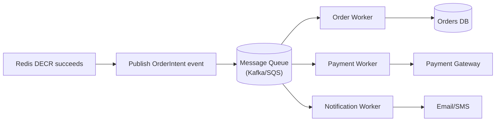
```mermaid
flowchart LR
    R["Redis DECR succeeds"] --> P[Publish OrderIntent event]
    P --> Q[("Message Queue<br/>(Kafka/SQS)")]
    Q --> W1[Order Worker]
    W1 --> DB[(Orders DB)]
    Q --> W2[Payment Worker]
    W2 --> PG[Payment Gateway]
    Q --> W3[Notification Worker]
    W3 --> EM[Email/SMS]
```

New flow:

1. Redis `DECR` succeeds → app server immediately publishes an `OrderIntentCreated` event to a queue (Kafka/SQS/RabbitMQ) containing `{user_id, product_id, reservation_id, timestamp}`.
2. App server **returns to the user right away**: "Your order is confirmed, processing payment" — the user isn't blocked on payment gateway latency at all.
3. Independent workers consume from the queue at their own pace:
   - **Order Worker** writes the durable order record to the DB (`status: PENDING_PAYMENT`).
   - **Payment Worker** charges the card, updates status to `PAID` or `PAYMENT_FAILED`.
   - **Notification Worker** sends confirmation once paid.
4. If payment fails, a compensating flow triggers: release the reserved inventory back (this is where you'd `INCR` the Redis counter back, or restock).

Why this is strictly better under load:
- The **write to the queue is fast and durable** (Kafka persists to disk, replicates across brokers) — so even if every downstream worker is currently overwhelmed or down, the fact "this user reserved a unit" is never lost.
- Each worker **scales independently**. Payment gateway slow today? Scale up payment workers, or just let the queue buffer — depth grows, but nothing is lost, and users aren't sitting on an open HTTP connection waiting.
- The app server's request-handling capacity is no longer coupled to the payment gateway's reliability at all.

### The problem this introduces: what if a worker processes the same message twice?

This is the concept interviewers specifically probe for once you mention queues, because it's almost always true: **most queue systems guarantee "at-least-once" delivery, not exactly-once.** A worker can crash *after* charging a card but *before* acknowledging the message to the queue — the queue, not seeing an ack, redelivers the message to another worker, which now charges the card **again**.

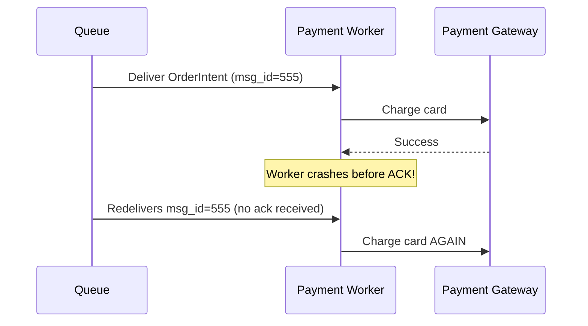
```mermaid
sequenceDiagram
    participant Q as Queue
    participant W as Payment Worker
    participant PG as Payment Gateway

    Q->>W: Deliver OrderIntent (msg_id=555)
    W->>PG: Charge card
    PG-->>W: Success
    Note over W: Worker crashes before ACK!
    Q->>W: Redelivers msg_id=555 (no ack received)
    W->>PG: Charge card AGAIN
```

### The fix: idempotency keys

Every message carries a unique, stable **idempotency key** — often the `reservation_id` from step 1, generated once and never regenerated on retry. Before doing the actual side-effecting work (charging a card, inserting an order), the worker checks:

```
SET processed:<reservation_id> NX EX 86400
```

If the key already exists (`NX` fails), this message has been handled before — skip straight to returning the cached result, don't charge again. Payment gateways themselves (Stripe, Razorpay) also accept an `Idempotency-Key` header for exactly this reason — so even if *your* dedup check somehow lets a duplicate through, the gateway itself refuses to double-charge for the same key.

This is a broadly important pattern worth internalizing: **in any distributed system with retries (and you should assume retries everywhere), every operation that has a side effect needs to be idempotent, keyed by something stable that survives retries.**

---

One thing worth flagging before we move on: notice we now have Redis (fast reservation) and the queue+DB (durable order state) as two separate stores that must stay consistent — same category of problem as Chapter 3, just one layer up the stack. Real systems handle this with periodic reconciliation jobs (compare Redis counters against actual paid-order counts, alert on drift) — we can go deeper on that if you want, or move forward.

Ready for Chapter 5? That's a good spot to cover **caching** properly (product pages, read-heavy traffic — we've been focused on the write path so far) and **sharding/replication** for the DB layer. Or, if you'd rather, we can go deeper on reconciliation first. Your call.

---

## Chapter 5: The Read Storm — Caching Product Pages

We've spent four chapters on the *write* path (checkout, inventory, orders) because that's where correctness bugs hide. But let's step back: before those 500 admitted users even reach checkout, **all 50,000 queued users are refreshing the product page** — looking at the sneaker photos, price, description, stock count — while they wait. That's a completely different traffic pattern, and it needs its own story.

### The naive approach: hit the DB for every page view

```
GET /product/123 → App Server → SELECT * FROM products WHERE id=123 → DB
```

Fine at normal traffic. At flash-sale traffic, this is now 50,000+ req/sec, **all reading the exact same row**, repeatedly, while people wait and refresh. This is a fundamentally different problem from the inventory write contention in Chapter 3 — reads don't conflict with each other, so it feels like it should be "just scale reads horizontally," but let's see why that's not the first move.

### Why "just add read replicas" isn't the first answer

You could add MySQL read replicas and route reads there. It helps, but:
- You're still paying full DB round-trip latency (disk-backed, query parsing, connection overhead) for data that's **read-only and hasn't changed in the last 5 seconds**.
- Replication lag means replicas might briefly show stale data anyway — so you get DB overhead *without* even guaranteeing freshness.
- You're using an expensive, stateful resource (a full relational DB replica) to serve what's essentially a static lookup by ID.

The real insight: **product detail during a flash sale is close to a static asset** — it changes rarely (maybe stock count ticks down, but even that can tolerate a few seconds of staleness for a page view). This is a textbook cache-aside case.

### The fix: Cache-Aside with Redis (and CDN in front of that)

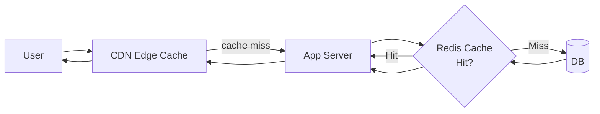
```mermaid
flowchart LR
    U[User] --> CDN[CDN Edge Cache]
    CDN -->|"cache miss"| A[App Server]
    A --> RC{"Redis Cache<br/>Hit?"}
    RC -->|Hit| A
    RC -->|Miss| DB[(DB)]
    DB --> RC
    RC --> A
    A --> CDN
    CDN --> U
```

Two layers, each solving a different scale problem:

- **CDN (edge cache)** — for the truly static parts: product images, description, price (things that don't change per-request). Served from an edge location physically close to the user, never even reaching your origin infra. This alone can absorb the vast majority of the 50,000 page-view requests.
- **Redis (application cache)** — for semi-dynamic data you still want fast, like an approximate stock count ("Only 12 left!"). App server checks Redis first; on a miss, reads DB once, populates Redis with a short TTL, serves from cache thereafter.

### The problem this introduces: cache stampede

Here's the failure mode that catches people out, and it's a great one to bring up unprompted in an interview because it shows depth. Say your Redis cache entry for `product:123` has a 5-second TTL. At the exact moment it expires, you still have thousands of requests per second hitting that endpoint. **All of them get a cache miss simultaneously**, and all of them go to the DB at once to repopulate it — you've recreated exactly the DB-hammering problem the cache was supposed to prevent, just every 5 seconds instead of constantly.

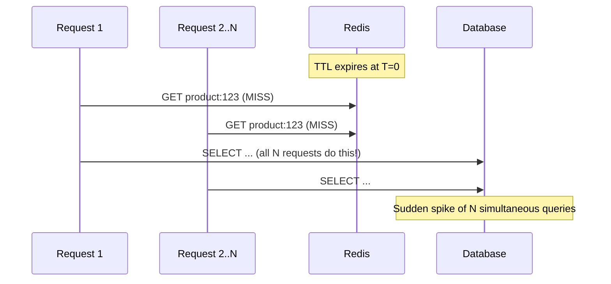
```mermaid
sequenceDiagram
    participant R1 as Request 1
    participant R2 as Request 2..N
    participant Cache as Redis
    participant DB as Database

    Note over Cache: TTL expires at T=0
    R1->>Cache: GET product:123 (MISS)
    R2->>Cache: GET product:123 (MISS)
    R1->>DB: SELECT ... (all N requests do this!)
    R2->>DB: SELECT ...
    Note over DB: Sudden spike of N simultaneous queries
```

**Fixes, roughly in order of sophistication:**

1. **Locking / single-flight** — first request to get a cache miss acquires a short lock (`SET lock:product:123 NX EX 5`) and is the *only one* allowed to query the DB; everyone else either waits briefly and retries the cache, or gets served slightly-stale data instead of hitting the DB.
2. **Logical (soft) expiry** — never actually let the key expire from Redis. Store a `stale_at` timestamp alongside the value. Every reader checks: if stale, serve the old value immediately (fine, it's a product page) *and* asynchronously trigger one background refresh. Users never see a miss; the DB only ever gets one refresh request, not thousands.
3. **Pre-warming** — since you *know* the flash sale start time in advance (unlike organic traffic spikes), just proactively load the cache before T-0 and set a TTL longer than the sale duration, or don't expire it at all during the sale window — refresh it out-of-band via an event when stock actually changes.

Given that flash sales are *scheduled*, #3 (pre-warming) is usually the most practically important one — you have advance notice, so use it. #2 (soft expiry) is the generally robust pattern for any hot key you can't fully pre-warm.

### One more subtlety: don't cache the *live* stock count the same way as the price

Notice I said "approximate stock count" earlier — that's deliberate. The actual authoritative decrement-per-purchase from Chapter 3 lives in Redis as a real-time counter (`inventory:product123`), updated on every sale. The *displayed* "12 left!" on the product page can lag behind that by a second or two (read from a cached snapshot, refreshed every 1-2s) — nobody's harmed by the page saying "12 left" when it's actually 11, but you'd never want checkout's actual decision to buy vs. reject to go through this display cache. **Different consistency requirements for the same underlying number, served by two different mechanisms** — this distinction (strict consistency for the write-path decision, relaxed/eventual consistency for the read-path display) is a very reusable idea across HLD interviews generally.

---

Good spot to check understanding: does the cache stampede problem and the three fixes (locking, soft expiry, pre-warming) make sense?

Once you're solid, Chapter 6 will cover **DB sharding and replication** properly — how you'd actually partition the orders/inventory data if a single DB instance (even with the caching and Redis layers) still isn't enough at true massive scale (think: a national flash sale with millions of concurrent users, not tens of thousands).

---

## Chapter 6: When One Database Isn't Enough — Sharding & Replication

Let's raise the stakes. Say ShopFast's flash sale worked great with the fixes so far — queueing, atomic Redis inventory, async order processing, caching. Now the company goes national: a single-day sale across 10 million users, thousands of different products going live at different times, and the **orders table alone** is now the bottleneck — not because of race conditions (Chapter 3 solved that), but because **one machine physically cannot hold and serve this much data and traffic.**

Let's separate two different problems that get conflated a lot: **replication** solves availability/read-scaling, **sharding** solves write-scaling and total data size. You usually need both, for different reasons.

### Replication first — because it's the simpler, more foundational idea

**The problem it solves:** even after moving hot reads to Redis/CDN, your DB still has *some* read traffic (analytics queries, admin dashboards, order-history lookups) and, critically, **is still a single point of failure**. If your one DB instance dies mid-flash-sale, everything stops — no new orders, no reads, nothing.

**The fix: one primary, multiple replicas.**

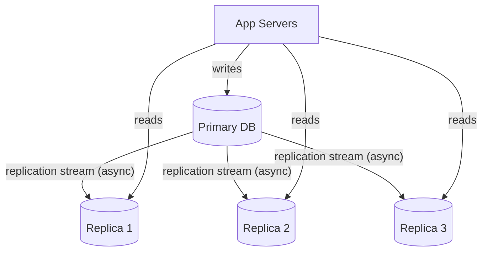
```mermaid
flowchart TD
    A[App Servers] -->|writes| P[(Primary DB)]
    P -->|"replication stream (async)"| R1[(Replica 1)]
    P -->|"replication stream (async)"| R2[(Replica 2)]
    P -->|"replication stream (async)"| R3[(Replica 3)]
    A -->|reads| R1
    A -->|reads| R2
    A -->|reads| R3
```

- All writes go to the **primary**.
- The primary streams its write-ahead log to N **replicas**, which apply the same changes.
- Reads get distributed across replicas — this is a legitimate horizontal scale-out for reads specifically.
- If the primary dies, one replica is promoted to be the new primary (failover) — you're no longer down for the whole sale.

**The catch — replication lag.** Replication is typically **asynchronous**: the primary doesn't wait for replicas to confirm before telling the client "write succeeded." This means there's a small window (milliseconds, sometimes seconds under heavy load) where a replica has stale data relative to the primary.

Concretely, imagine: user places an order (write goes to primary), then the confirmation page immediately does a read (routed to a replica) to show "your order." If that read hits a replica that hasn't caught up yet — **the user sees "order not found" for their own just-placed order.** This is a classic, very-asked-about bug class.

**Fixes:**
- **Read-your-writes consistency**: right after a write, route that specific user's subsequent reads to the primary (or to a replica you know has caught up) for some short window, rather than round-robin.
- **Synchronous replication** for critical data — the primary waits for at least one replica to ack before confirming the write. Safer, but adds latency to every write, and you're trading availability/speed for consistency (this is literally the CAP theorem trade-off, and it's fair game to name it explicitly in an interview).

Notice: replication **does not help write throughput** — every replica still has to apply every write eventually, so if your bottleneck is "too many orders per second," adding replicas doesn't fix that. That's what sharding is for.

### Sharding — splitting the data itself across multiple databases

**The problem it solves:** your orders table has grown to billions of rows, or your write rate (thousands of orders/sec across many concurrent flash sales) exceeds what one primary can handle, no matter how well-tuned. You need to split the data itself across multiple independent DB instances, each handling a slice.

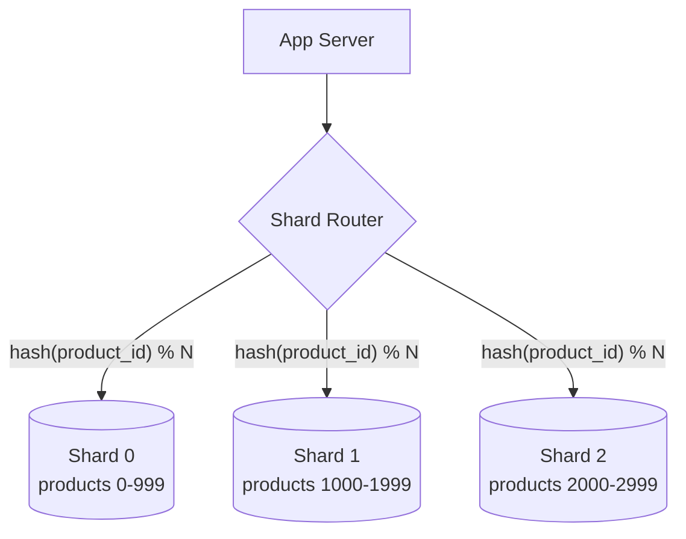
```mermaid
flowchart TD
    A[App Server] --> SR{Shard Router}
    SR -->|"hash(product_id) % N"| S0[(Shard 0<br/>products 0-999)]
    SR -->|"hash(product_id) % N"| S1[(Shard 1<br/>products 1000-1999)]
    SR -->|"hash(product_id) % N"| S2[(Shard 2<br/>products 2000-2999)]
```

The critical design decision here is the **shard key** — what field determines which shard a row lives on. For a flash sale system, the natural candidates:

| Shard key | Good for | Bad for |
|---|---|---|
| `product_id` | Inventory/stock writes for one product always hit one shard — no cross-shard coordination needed for the hottest operation (decrementing stock) | If one product (the hyped sneaker) gets 90% of traffic, that one shard becomes a hotspot — you haven't actually distributed the load, you've just moved the Chapter 3 hot-row problem to a hot-shard |
| `user_id` | Spreads a single user's load evenly, good for "show me my orders" queries | A single hyped product's writes still all land wherever that product's *reservation* logic routes — doesn't fix hotspotting for one popular item |
| `order_id` (or a generated random/UUID key) | Very evenly distributed writes | Loses the "all writes for one product are colocated" property, so checking/decrementing stock now potentially needs to look across shards |

**The important interview insight: for flash sales specifically, sharding by `product_id` is usually right for inventory, but you must accept that a single viral product will still create a hotspot on its one shard** — sharding doesn't remove Chapter 3's problem, it just contains the blast radius to one DB instance instead of your only DB instance. This is exactly why Chapter 3's actual fix (moving the hot counter to Redis, not the DB) still matters even *after* you shard — sharding and the Redis-counter trick are solving overlapping but distinct problems, and production systems use both together: Redis absorbs the truly hot single-item contention, sharded DBs handle the overall order volume across many different products.

### A trick specific to flash sales: pre-sharding by sale/campaign

Since a flash sale is a scheduled, known event (not organic, unpredictable traffic), some systems go further and provision **dedicated, temporary shards/instances just for that sale's hottest products**, separate from the regular order database entirely — sized precisely for the expected spike, and torn down afterward. This avoids a viral flash-sale item ever contending with your everyday, steady-state order traffic at all. Worth mentioning in an interview as a "given that we know this is scheduled" optimization — it's a nice example of using domain knowledge (predictable spike, known start time) to sidestep a general distributed-systems problem instead of solving it in full generality.

---

Quick check: does the distinction land — **replication = same data copied, for availability + read scaling, async lag is the risk; sharding = data split, for write throughput + total size, hotspotting on the shard key is the risk**?

Next up, Chapter 7 can cover **error handling and resilience patterns** (circuit breakers, retries with backoff, graceful degradation — what happens when the payment gateway itself is flaky during peak load) or we could do **rate limiting / bot & scalper defense** (a very flash-sale-specific topic interviewers love to probe). Which do you want next?

---

## Chapter 7: Keeping Bots and Scalpers Out

I'll take rate limiting & bot defense first, since it's the topic most specific to flash sales (generic e-commerce doesn't usually worry about this nearly as much) — we'll do error handling/resilience right after.

**The new problem:** Even with a perfect waiting room, atomic inventory, async orders, caching, and sharding — you notice something ugly after the sale: **80% of the 1,000 sneakers went to 200 accounts**, all reselling them on other platforms within the hour at 5x the price. Your "fair" queue was fair to *scripts*, not to humans. This is a real, well-documented problem (sneaker bots are practically an industry).

### Why your existing defenses don't stop this

Notice that nothing we've built so far distinguishes a human from a script:
- The waiting room's FIFO ticket queue (Chapter 2) actually **rewards bots** — a script can hit "enqueue" the microsecond the sale opens, faster than any human can click, guaranteeing bots cluster at the front of the line.
- Redis atomic decrement doesn't care who's asking.
- Idempotency keys stop *double*-charging, not *many different* fraudulent purchases.

You need a dedicated layer whose entire job is: **is this request likely a human, acting like a normal customer, and not exceeding reasonable limits?**

### Layer 1: Rate limiting (the blunt, cheap first line)

Before anything else, cap how often a given identity can hit your endpoints. The classic algorithm here, and worth knowing in detail for interviews, is the **token bucket**:

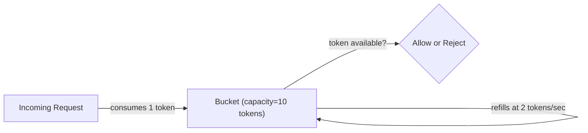
```mermaid
flowchart LR
    B["Bucket (capacity=10 tokens)"] -->|"refills at 2 tokens/sec"| B
    R[Incoming Request] -->|"consumes 1 token"| B
    B -->|"token available?"| D{Allow or Reject}
```

- Each identity (IP, user account, device fingerprint) gets a bucket of tokens.
- Each request consumes one token; the bucket refills at a steady rate.
- No tokens left → request rejected (HTTP 429) until it refills.

Why token bucket specifically over simpler counters (fixed window counting): it **allows brief bursts** (a real user might click "buy" twice by accident) while still enforcing a steady long-run rate, and it avoids the fixed-window edge case where someone sends max-requests at the very end of one window and max-requests again at the very start of the next, effectively doubling their real rate right at the boundary.

**Implementation detail (this is genuinely how it's built in production):** a Lua script in Redis, same idea as Chapter 3's atomic decrement, because "check tokens, then consume one" needs to be atomic to avoid a race where two concurrent requests both read "1 token left" and both get allowed:

```lua
-- token bucket check-and-consume, atomic
local tokens = tonumber(redis.call('GET', KEYS[1]) or capacity)
if tokens > 0 then
    redis.call('DECR', KEYS[1])
    return 1
else
    return 0
end
```

**The catch: rate limiting by IP alone is weak.** Bot operators run requests through hundreds of residential proxy IPs specifically to defeat this. So identity for rate-limiting needs to be layered:

| Signal | Defeats | Bot workaround |
|---|---|---|
| IP address | Casual scripts | Residential proxy pools |
| Account/user_id | Single-account abuse | Buying/renting hundreds of accounts |
| Device fingerprint (canvas hash, etc.) | Same-device multi-account abuse | Browser automation with randomized fingerprints |
| Payment method (card, UPI ID) | Multi-account fraud at checkout | Harder to fake at scale — real money instruments |

No single signal is sufficient — production anti-bot systems combine several and score risk rather than binary allow/reject.

### Layer 2: Behavioral / bot detection (CAPTCHA and beyond)

Rate limiting stops *volume*; it doesn't stop a well-behaved bot making requests one-at-a-time, indistinguishable from a human by request rate alone. This is where you add:

- **CAPTCHA / proof-of-work challenge** at the enqueue step (Chapter 2) — before a ticket is even issued. A proof-of-work challenge (make the client solve a small computational puzzle before submitting) is a nice trick specifically because it costs a human a negligible fraction of a second but costs a bot operator running 10,000 parallel sessions real, meaningful compute — this raises their cost per attempt without ever inconveniencing a genuine single user.
- **Behavioral signals** — mouse movement, time spent on page before clicking "buy" (a bot clicking within 50ms of page load is a strong signal), TLS/HTTP header fingerprinting that flags headless browser tools like Puppeteer/Selenium.
- These typically feed a **risk score** rather than a hard block — low risk sails through, medium risk gets a CAPTCHA challenge, high risk gets silently rate-limited or shadow-queued (put in a queue that never actually admits them, so they don't even realize they're blocked and don't immediately retool).

### Layer 3: Structural fixes (arguably the most effective, least talked about)

A few things worth mentioning that aren't purely technical but come up in good interview discussions:
- **Per-account purchase limits** enforced at the inventory-reservation step (Chapter 3) — "max 1 per account" checked atomically alongside the stock decrement, same Lua script pattern.
- **Delayed/randomized reveal** — don't announce the exact sale second publicly; this blunts scripts timed to the millisecond (though determined bot operators just poll aggressively around the estimated window).
- **The lottery model from Chapter 2** — worth re-connecting here: randomizing admission order among everyone who arrives within a window is *itself* a major anti-bot defense, because it removes the advantage of being fastest. This is why serious ticketing/drop platforms have moved toward it.

### The honest trade-off to state in an interview

None of this is a hard wall — it's **cost-raising, not cost-eliminating**. Good bot defense doesn't promise "zero bots get through," it promises "the cost/effort to bypass this exceeds the profit margin for most operators," while staying invisible to genuine customers. Naming this explicitly (rather than claiming you can "solve" bot traffic) is exactly the kind of maturity senior interviewers are listening for.

---

Make sense? Next up: **Chapter 8 — Error handling & resilience** (circuit breakers, retries with backoff, what happens when the payment gateway itself degrades mid-sale, graceful degradation strategies). Ready?

---

## Chapter 8: When Things Fail Anyway — Resilience Patterns

Everything so far assumed your dependencies (DB, Redis, payment gateway, queue) are up. They won't always be — and a flash sale is exactly the worst time for any of them to wobble, because load is at its peak precisely when failure probability is highest. Let's walk through this the way it actually bites teams.

### The scenario: the payment gateway starts timing out

Midway through your sale, your third-party payment gateway (Razorpay, Stripe, whoever) starts responding slowly — 8 seconds instead of 200ms — maybe *they're* also under load from other merchants running sales, or a network issue. Your Payment Worker (from Chapter 4) calls it synchronously and waits.

### Attempt 1 (naive): just wait, and retry on failure

```
try:
    charge_card(order)
except TimeoutError:
    retry charge_card(order)  # try again immediately
```

Two things go wrong fast:

**Problem A — resource exhaustion cascades upstream.** If each Payment Worker thread is now blocked for 8 seconds instead of 200ms, and you have a fixed pool of, say, 100 worker threads, your effective throughput drops ~40x. The queue backs up. If workers share a connection pool with something else, that gets starved too. **One slow dependency degrades everything connected to it** — this is the core failure mode resilience patterns exist to contain.

**Problem B — naive retries make it worse, not better.** If 1,000 in-flight requests all timeout around the same moment and all immediately retry, you've just sent a second wave of 1,000 requests at a gateway that was *already* struggling — a self-inflicted thundering herd, identical in spirit to Chapter 1's problem, except now you caused it.

### Fix 1: Retries with exponential backoff + jitter

Instead of retrying immediately, wait, and wait longer each subsequent failure:

```
attempt 1: fail → wait ~1s
attempt 2: fail → wait ~2s
attempt 3: fail → wait ~4s
```

Add **jitter** (randomize each wait slightly, e.g., `2s ± 500ms`) for the same reason as Chapter 5's cache stampede fix — without jitter, everyone who failed at the same moment retries at the same moment again, recreating synchronized waves.

But backoff alone doesn't answer: *how many times do you retry before giving up, and should you even be trying at all if the gateway is clearly down, not just slow?* That's the next piece.

### Fix 2: Circuit breakers — stop calling a dependency that's clearly failing

This is the pattern interviewers most want to hear named correctly, and it's genuinely elegant. Model the connection to the payment gateway as a state machine:

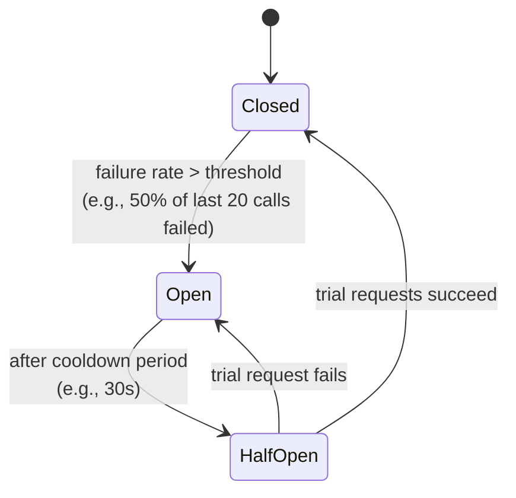
```mermaid
stateDiagram-v2
    [*] --> Closed
    Closed --> Open: failure rate > threshold<br/>(e.g., 50% of last 20 calls failed)
    Open --> HalfOpen: after cooldown period<br/>(e.g., 30s)
    HalfOpen --> Closed: trial requests succeed
    HalfOpen --> Open: trial request fails
```

- **Closed** (normal): requests flow through as usual. The breaker tracks recent success/failure rate.
- **Open**: once failures cross a threshold, the breaker "trips" — for the next 30 seconds, it **doesn't even attempt** to call the gateway. Requests fail instantly (fast-fail) with a clear "temporarily unavailable" instead of hanging for 8 seconds each.
- **Half-Open**: after the cooldown, let a small trickle of trial requests through. If they succeed, close the breaker (resume normal traffic). If they fail, snap back to Open and wait again.

**Why this matters specifically at flash-sale scale:** without a circuit breaker, every single one of your thousands of in-flight requests individually discovers "the gateway is down" the slow way (each one waits out its own timeout). With a circuit breaker, the *first* handful of failures trip it, and every request after that fails in milliseconds instead of seconds — freeing up worker threads, connection pools, and queue capacity immediately instead of them all being tied up simultaneously.

### Fix 3: What do you actually do with a request when the breaker is open?

This is where "resilience" becomes a business/product decision, not just an engineering one — and it's a great thing to discuss explicitly in an interview:

- **Fail gracefully, not silently.** Tell the user "Payment processing is delayed, we'll confirm your order shortly" rather than a raw error — remember, you already reserved their inventory in Redis (Chapter 3), so don't release that stock reservation just because the payment call is temporarily circuit-broken; put the order in a `PENDING` state and let it retry once the breaker closes.
- **Dead-letter queue (DLQ).** If a message (order) fails processing repeatedly beyond a retry limit, don't retry forever or drop it — route it to a separate DLQ for manual/automated investigation later. This ties back to Chapter 4's queue: your consumer logic should say "after 5 failed attempts, move to DLQ" rather than blocking the whole queue on one poison message.
- **Have a reservation expiry.** If payment genuinely never completes (user abandoned, gateway down for an extended period), the Redis reservation from Chapter 3 shouldn't hold that unit hostage forever — attach a TTL, and if payment isn't confirmed within, say, 10 minutes, release the stock back (`INCR`) so it's available to someone else. This is the same idea as the admission token's short TTL from Chapter 2 — **anything that "holds" a scarce resource needs an expiry, or a stuck/abandoned request quietly leaks that resource forever.**

### Fix 4: Bulkheads — contain the blast radius between components

One more named pattern worth having ready: **bulkheading** — the ship-hull metaphor, where compartments are isolated so one flooded section doesn't sink the whole ship. Concretely: give the Payment Worker pool its *own* dedicated thread/connection pool, separate from the Order Worker pool and separate from your regular (non-flash-sale) site traffic's pool. If payment processing degrades and its pool gets fully occupied by slow/retrying calls, **it cannot starve threads that your Order Workers or your everyday checkout flow need.** This is the same "isolate the blast radius" principle from Chapter 2's waiting room, just applied one layer deeper into your internal service architecture.

### Putting it together — what "handling failure well" looks like end to end

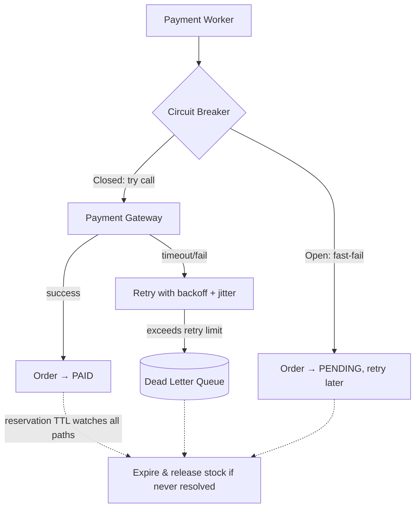
```mermaid
flowchart TD
    W[Payment Worker] --> CB{Circuit Breaker}
    CB -->|Closed: try call| PG[Payment Gateway]
    PG -->|success| Done[Order → PAID]
    PG -->|timeout/fail| RB[Retry with backoff + jitter]
    RB -->|exceeds retry limit| DLQ[(Dead Letter Queue)]
    CB -->|Open: fast-fail| Pending[Order → PENDING, retry later]
    Done -.->|reservation TTL watches all paths| Exp[Expire & release stock if never resolved]
    Pending -.-> Exp
    DLQ -.-> Exp
```

---

Does the circuit breaker state machine and the retry/backoff/jitter combo make sense? Once you've got this, the last core piece is **Chapter 9: Observability & monitoring** (what metrics/alerts you'd actually put in place to know any of this is working *during* the sale, not after) — and then we can do a final chapter pulling the entire architecture together into one end-to-end diagram, which is usually how you'd want to close out an actual interview. Want to continue?

---

## Chapter 9: Observability — Knowing It's Working *During* the Sale

Here's the scenario that motivates this chapter: your flash sale starts at 12:00 PM. At 12:03 PM, orders have basically stopped coming in, but nobody notices for 20 minutes because nothing "crashed" — no 500 errors, no alarms. Turns out the circuit breaker to payment tripped and stayed open the whole time because the cooldown/half-open trial kept failing, silently. You just lost 20 minutes of a sale that only runs for an hour. **This is the failure mode observability exists to prevent** — not just "is the system up," but "is the system doing the thing it's supposed to do, right now."

### The wrong instinct: "we have logs and a /health endpoint"

Most systems start here, and it's not enough for two reasons:
- **Logs are for after-the-fact investigation, not live awareness.** Nobody is tailing logs across 50 app servers during a live incident and mentally aggregating "hmm, error rate seems up."
- **A `/health` endpoint that just checks "is the process running"** tells you nothing about whether checkout is actually succeeding. Your app server can be perfectly "healthy" while every single checkout fails because Redis is unreachable.

You need three distinct things, and interviewers like hearing them named separately: **metrics, logs, and traces** — each answers a different question.

### 1. Metrics — the dashboard you stare at during the sale

These need to be **business-meaningful**, not just infra-generic. The infra-generic ones (CPU%, memory, DB connections) matter too, but alone they don't tell you if the *sale* is healthy. The metrics that actually matter for a flash sale:

| Metric | Why it matters | What a bad value looks like |
|---|---|---|
| **Checkout success rate** | The single most important business metric | Drops from 95% to 40% → something's actively breaking purchases |
| **Queue admission rate** (Ch. 2) | Are people actually being let through, or backed up forever | Admission rate flatlines while queue depth grows unbounded |
| **Redis DECR latency/error rate** (Ch. 3) | Your fastest, most critical hot path | p99 latency spike → Redis under memory pressure or network issue |
| **Payment gateway success rate + circuit breaker state** (Ch. 8) | Exactly the "silent 20 minutes" scenario above | Breaker stuck Open for minutes, not seconds |
| **Order queue depth / consumer lag** (Ch. 4) | Are workers keeping up with incoming order intents | Lag growing means orders are accepted but not being fulfilled — customers will eventually complain "where's my confirmation" |
| **Inventory drift** | Reconciliation between Redis counter and actual DB paid-order count (flagged back in Ch. 4) | Any nonzero drift after the sale = you oversold or lost inventory somewhere |

The key idea: **metrics should map directly to the failure modes you already designed against** in earlier chapters. If you introduced a circuit breaker, you must monitor its state — building the resilience mechanism and not instrumenting it is a half-finished job, and a sharp interviewer will ask "how would you know that's happening?" after literally every pattern you name.

### 2. Alerting — the difference between a dashboard and someone getting paged

A dashboard nobody's watching at 12:03 AM (or, more relevantly, one nobody has time to stare at while also handling a live 1-hour sale) doesn't help. You need **alerts on the metrics above, with thresholds tuned to the sale's short, spiky nature** — not your normal steady-state alerting.

Important, often-missed detail: **normal-time alert thresholds are wrong for a flash sale.** If your default alert is "page someone if error rate > 5% sustained over 10 minutes," that's far too slow for an event that's over in 60 minutes total — by the time it fires, the sale might be half done. Flash-sale-specific alerting needs **tighter windows and lower latency to page** (e.g., 1-minute rolling error rate), explicitly configured/activated for the duration of the event.

### 3. Distributed tracing — for when something's slow and you don't know where

Given the flow we've built — request → waiting room → app server → Redis → queue → multiple workers → payment gateway → DB — a single checkout now touches 6-7 different systems. If p99 latency spikes, "where" is not obvious from metrics alone (which just tell you *that* it's slow). **Distributed tracing** (OpenTelemetry, Jaeger, etc.) attaches a single `trace_id` to a request at the very start (the waiting room ticket is actually a natural place to mint this) and propagates it through every downstream hop, so you can pull up one request and see exactly which hop ate the latency — Redis call took 2ms, but the payment gateway call took 6 seconds. Without this, debugging a distributed system under live pressure is mostly guesswork.

### The specific discipline flash sales require: a "war room" runbook, not just tooling

One more thing worth saying explicitly, because it's the kind of maturity point that separates a good HLD answer from a great one: **a flash sale is a known, scheduled event — treat it like a launch, not like ambient production traffic.** In practice this means:
- A **runbook** prepared in advance: "if checkout success rate < 80% for >2 min, check circuit breaker state first, then Redis latency, then queue depth" — written *before* the sale, not improvised during it.
- **Dedicated on-call/war-room** for the sale's exact duration, with the dashboards above already open.
- **A kill switch** — the ability to pause new admissions from the waiting room (Ch. 2) instantly if something's badly wrong, without a full deploy. This is a cheap, high-leverage thing to build and worth naming: sometimes the best "resilience pattern" is a big red button a human can press.

---

Solid? That closes out the individual concepts. **Chapter 10** will be the finale: pulling all nine chapters into one complete end-to-end architecture diagram and a tight "if asked to summarize this system in 2 minutes" narrative — exactly the shape you'd want to reproduce on a whiteboard in an actual interview. Ready for that?

---

## Chapter 10: The Whole System, End to End

This is the "whiteboard summary" — if an interviewer says "walk me through your final design," this is the shape of the answer, told as the story we just built rather than a list of buzzwords.

### The complete architecture

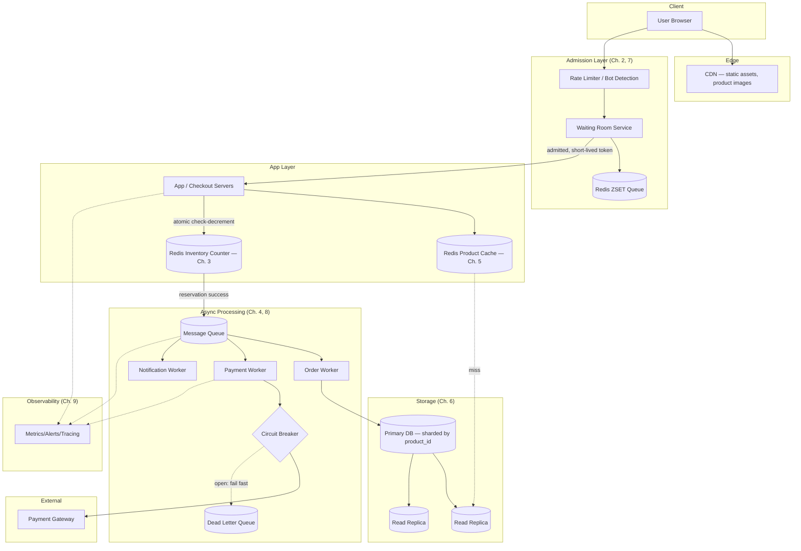
```mermaid
flowchart TB
    subgraph Client
        U[User Browser]
    end

    subgraph Edge
        CDN[CDN — static assets, product images]
    end

    subgraph "Admission Layer (Ch. 2, 7)"
        WR[Waiting Room Service]
        RL[Rate Limiter / Bot Detection]
        ZQ[("Redis ZSET Queue")]
    end

    subgraph "App Layer"
        APP[App / Checkout Servers]
        PC[(Redis Product Cache — Ch. 5)]
        INV[(Redis Inventory Counter — Ch. 3)]
    end

    subgraph "Async Processing (Ch. 4, 8)"
        MQ[("Message Queue")]
        OW[Order Worker]
        PW[Payment Worker]
        NW[Notification Worker]
        CB{Circuit Breaker}
        DLQ[(Dead Letter Queue)]
    end

    subgraph "Storage (Ch. 6)"
        PDB[(Primary DB — sharded by product_id)]
        RDB1[(Read Replica)]
        RDB2[(Read Replica)]
    end

    subgraph External
        PG[Payment Gateway]
    end

    subgraph "Observability (Ch. 9)"
        MET[Metrics/Alerts/Tracing]
    end

    U --> CDN
    U --> RL --> WR
    WR --> ZQ
    WR -->|admitted, short-lived token| APP
    APP --> PC
    PC -.miss.-> RDB1
    APP -->|"atomic check-decrement"| INV
    INV -->|reservation success| MQ
    MQ --> OW --> PDB
    MQ --> PW --> CB --> PG
    CB -.open: fail fast.-> DLQ
    MQ --> NW
    PDB --> RDB1
    PDB --> RDB2
    APP -.-> MET
    PW -.-> MET
    MQ -.-> MET
```

### The narrative, if you had to say it in two minutes

1. **Don't let everyone in at once.** A waiting room (Redis ZSET-backed, rate-limited, bot-screened) shapes 50,000 simultaneous users into a controlled admission rate, protecting everything downstream. *(Ch. 2, 7)*
2. **Never trust read-then-write for scarce resources.** Inventory is decremented atomically — in Redis via a Lua script for speed, with the DB as reconciled source of truth — so two concurrent buyers can never both win the last unit. *(Ch. 3)*
3. **Decouple acceptance from fulfillment.** The moment a unit is reserved, that fact goes durably onto a queue. Payment, order persistence, and notifications happen asynchronously, idempotently, off the user's request path. *(Ch. 4)*
4. **Cache the read-heavy part separately from the write-critical part.** Product pages are cached (CDN + Redis, with stampede protection via soft expiry/pre-warming); the *authoritative* inventory decision never goes through that same cache. *(Ch. 5)*
5. **Scale storage two different ways for two different problems.** Replicas for read scaling and availability (accepting async lag as the cost); shards (by `product_id`) for write throughput and data size (accepting that a viral item still hotspots its one shard — which is exactly why step 2's Redis counter matters even after sharding). *(Ch. 6)*
6. **Assume dependencies will degrade, and contain the damage.** Circuit breakers fast-fail instead of hanging when the payment gateway wobbles; retries use backoff+jitter to avoid self-inflicted herds; bulkheads stop one degraded component starving the rest; every reservation has a TTL so nothing leaks forever. *(Ch. 8)*
7. **Instrument the failure modes you designed against.** Business-level metrics (checkout success rate, breaker state, queue lag, inventory drift), tight alert thresholds sized for a short event, tracing across the now-many hops, and a runbook + kill switch prepared before the sale starts, not during it. *(Ch. 9)*

### Quick recap table — the whole journey

| # | Problem discovered | Root cause | Fix |
|---|---|---|---|
| 1 | Site crashes under traffic spike | Thundering herd on a monolith | Virtual waiting room |
| 2 | Ticket fairness gameable by bots | Naive FIFO queue rewards scripts | Signed tokens, lottery admission |
| 3 | Overselling | Read-then-write race on inventory | Atomic DB UPDATE → Redis atomic DECR/Lua |
| 4 | Slow/failed payment blocks checkout | Sync chaining of fast + slow operations | Async queue + idempotency keys |
| 5 | DB hammered by page views | Read-heavy hot key, no caching | CDN + Redis cache, stampede protection |
| 6 | One DB can't handle scale | Single node limits on reads/writes/size | Replication (availability) + sharding (throughput) |
| 7 | Bots/scalpers dominate the sale | No identity/behavior verification | Rate limiting, bot detection, purchase limits |
| 8 | One flaky dependency cascades | No isolation/fast-fail on failure | Circuit breakers, backoff+jitter, bulkheads, TTLs |
| 9 | Failure goes unnoticed for 20 minutes | No live, business-level visibility | Metrics/alerts/tracing tuned for a short event |

### A tip for the actual interview

Don't present this as chapter 1 through 9 in order — that's how we *learned* it, but in a live interview, lead with the two hardest, most-asked-about pieces first (overselling prevention and the waiting room), since that's usually what the interviewer probes hardest and fastest. Then let them steer you into the rest ("what about the DB layer," "how do you handle failures") rather than reciting the whole list unprompted — a good interview is a conversation where you demonstrate you *know* the fuller picture exists and can go deep wherever they point, not a monologue.

---

That's the full system. Anything you want to go back and stress-test — like having me play interviewer and grill you on one of these chapters, or drill into a spot that still feels shaky?

---

## Saga Pattern — Yes, It's Already Implicit in Chapter 4 and 8. Let's Make It Explicit.

Good question, and you're right to push on it — I used pieces of the saga pattern ("release the inventory reservation," "compensating flow triggers" in Ch. 8) without ever naming it or showing the actual mechanics. Let's fix that properly.

### First: why do we even need this? Why not just a normal DB transaction?

Look at what a single order actually spans:

```
1. Decrement inventory  → Redis
2. Create order record  → DB
3. Charge the card      → External Payment Gateway (a completely different company's system)
4. Send confirmation    → Email/SMS provider
```

A normal ACID transaction (`BEGIN...COMMIT`) only works within **one database**. You cannot wrap a Redis command, a Payment Gateway API call, and a DB insert into one atomic unit — there's no shared transaction coordinator across three independent systems, especially not across an external company's payment API that you don't control.

**The "textbook" distributed-transaction answer is Two-Phase Commit (2PC)** — and it's worth explicitly naming *and rejecting* this in an interview, because it shows you know the alternative and why it fails here:
- 2PC requires every participant to support a "prepare" phase and hold locks until a coordinator says "commit." Stripe/Razorpay do not offer this — you can't ask a payment gateway to "tentatively hold a charge, awaiting your go-ahead," at least not in the generic case.
- Even where it's technically possible, 2PC holds locks across the *entire* multi-step operation, across network calls to a third party with unpredictable latency — at flash-sale volume, this would recreate exactly the lock-contention disaster from Chapter 3, just spread across more systems.

**So instead: accept that each step commits independently and immediately, and if a later step fails, don't roll back — actively *undo* the earlier steps with their own explicit operations.** That's the saga pattern: a sequence of local transactions, each with a defined **compensating transaction** that semantically undoes it if something downstream fails.

### The saga for this exact system, step by step

| Step | Forward action | Compensating action (if we must undo) |
|---|---|---|
| 1 | `DECR inventory:product123` (Redis) — Ch. 3 | `INCR inventory:product123` (give the unit back) |
| 2 | `INSERT order (status=PENDING_PAYMENT)` (DB) — Ch. 4 | `UPDATE order SET status=CANCELLED` |
| 3 | Charge card via Payment Gateway — Ch. 4, 8 | Issue a refund via Payment Gateway API |
| 4 | `UPDATE order SET status=PAID` | (terminal success — nothing to compensate) |
| 5 | Send confirmation email | Not compensated — instead send a "your order was cancelled" email |

Notice: **compensation isn't a rollback in the DB sense — it's a new, forward-moving operation that semantically cancels the effect of the earlier one.** `INCR` isn't "undoing" `DECR` at the storage engine level, it's a brand-new write that happens to reverse the business effect. This distinction matters — it means compensations can fail and need retries too, exactly like forward steps.

### Two ways to implement this: Orchestration vs. Choreography

This is the concept interviewers specifically want you to compare, with a clear opinion on which fits here.

**Choreography** — no central coordinator; each service reacts to events from the previous one and emits its own event, including failure events that trigger the previous service to compensate.

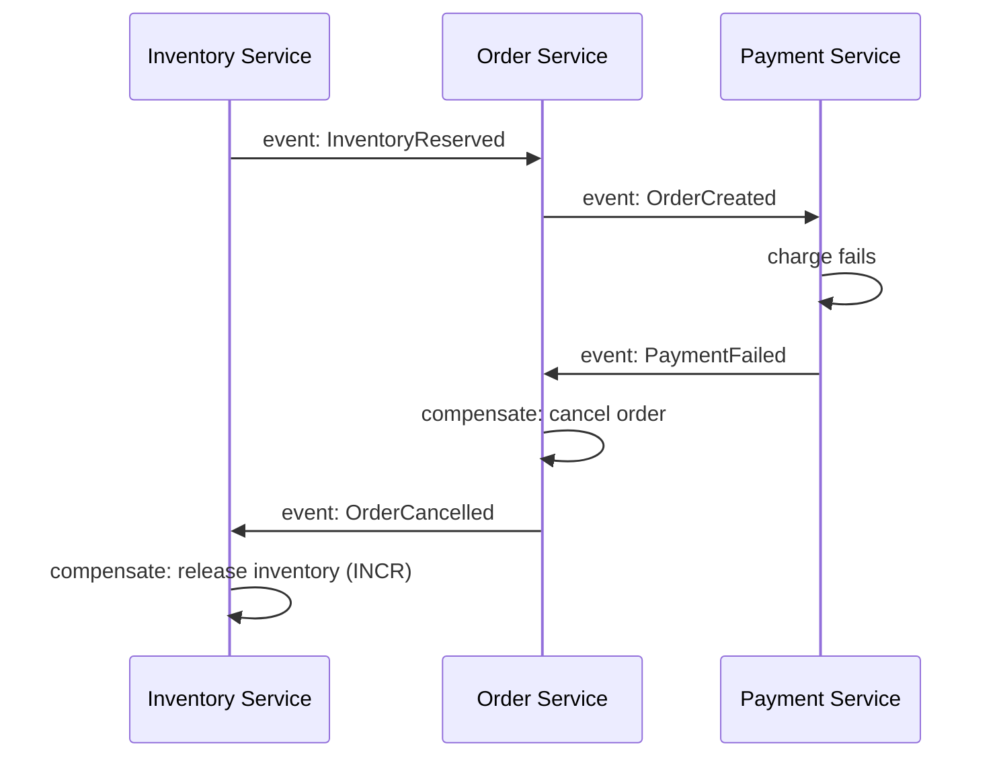
```mermaid
sequenceDiagram
    participant INV as Inventory Service
    participant ORD as Order Service
    participant PAY as Payment Service

    INV->>ORD: event: InventoryReserved
    ORD->>PAY: event: OrderCreated
    PAY->>PAY: charge fails
    PAY->>ORD: event: PaymentFailed
    ORD->>ORD: compensate: cancel order
    ORD->>INV: event: OrderCancelled
    INV->>INV: compensate: release inventory (INCR)
```

**Orchestration** — a single dedicated coordinator (the "Saga Orchestrator") calls each step explicitly and, on failure, explicitly calls compensations in reverse order. Nothing reacts on its own; the orchestrator drives everything.

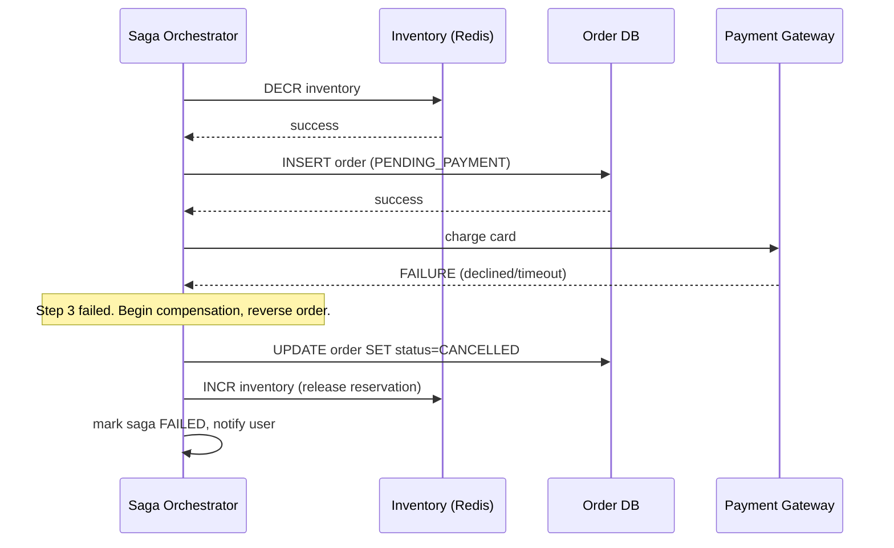
```mermaid
sequenceDiagram
    participant SO as Saga Orchestrator
    participant INV as Inventory (Redis)
    participant ORD as Order DB
    participant PAY as Payment Gateway

    SO->>INV: DECR inventory
    INV-->>SO: success
    SO->>ORD: INSERT order (PENDING_PAYMENT)
    ORD-->>SO: success
    SO->>PAY: charge card
    PAY-->>SO: FAILURE (declined/timeout)
    Note over SO: Step 3 failed. Begin compensation, reverse order.
    SO->>ORD: UPDATE order SET status=CANCELLED
    SO->>INV: INCR inventory (release reservation)
    SO->>SO: mark saga FAILED, notify user
```

**Why orchestration is the right call for this system specifically** (and worth stating as a deliberate choice, not a default):
- **Debuggability under pressure.** During a live flash sale, when something's going wrong, you need to look at *one place* to see "where is this order stuck." With choreography, tracing a stuck order means chasing events across 4 different services' logs — brutal at 2 AM during an active incident. An orchestrator has a single, queryable state.
- **No cyclic/implicit coupling.** Choreography means Payment Service needs to know to emit an event Inventory Service listens for — services become implicitly coupled to each other's event contracts, which gets fragile as steps get added (e.g., adding a fraud-check step later means touching multiple services' event handlers).
- **Choreography is nicer when steps are truly independent and few** — but a checkout flow has a strict, mostly-linear order (can't charge before reserving, can't ship before charging), which is exactly the case orchestration handles more clearly.

### Implementing the orchestrator — concretely, no hand-waving

The orchestrator needs **its own durable state**, separate from the order table itself, because the orchestrator itself needs to survive crashes/restarts mid-saga. A table like:

```sql
CREATE TABLE order_saga (
    saga_id UUID PRIMARY KEY,
    order_id UUID,
    reservation_id VARCHAR,      -- ties back to the Redis reservation key
    current_step VARCHAR,        -- 'RESERVE_INVENTORY' | 'CREATE_ORDER' | 'CHARGE_PAYMENT' | 'CONFIRM' | 'COMPENSATING' | 'FAILED' | 'COMPLETED'
    status VARCHAR,              -- IN_PROGRESS | COMPLETED | COMPENSATING | FAILED
    payload JSONB,               -- user_id, product_id, amount, etc — everything needed to resume
    updated_at TIMESTAMP
);
```

The orchestrator's loop, driven off the queue from Chapter 4, looks like this (pseudocode, but literally implementable as-is):

```python
def handle_saga_step(saga):
    try:
        if saga.current_step == 'RESERVE_INVENTORY':
            reserve_inventory(saga.payload)          # Lua script, Ch. 3
            advance(saga, next='CREATE_ORDER')

        elif saga.current_step == 'CREATE_ORDER':
            create_order_record(saga.payload)         # idempotent INSERT, Ch. 4
            advance(saga, next='CHARGE_PAYMENT')

        elif saga.current_step == 'CHARGE_PAYMENT':
            charge_card(saga.payload)                  # through circuit breaker, Ch. 8
            advance(saga, next='CONFIRM')

        elif saga.current_step == 'CONFIRM':
            confirm_order(saga.payload)
            mark_completed(saga)

    except StepFailedException:
        begin_compensation(saga)   # flips status to COMPENSATING, starts unwinding


def begin_compensation(saga):
    # walk backwards through completed steps only
    if saga.completed_steps.contains('CREATE_ORDER'):
        cancel_order(saga.order_id)
    if saga.completed_steps.contains('RESERVE_INVENTORY'):
        release_inventory(saga.reservation_id)   # INCR back
    mark_failed(saga)
    notify_user_of_failure(saga.payload)
```

Critical details that are easy to leave implicit but shouldn't be:

**1. Every forward step and every compensating step must be idempotent** (direct callback to Chapter 4's idempotency keys). Why: the orchestrator itself can crash *mid-step* — say, right after `charge_card()` succeeds but before it writes `advance(saga, next='CONFIRM')` to the DB. On restart, it'll re-read `current_step = CHARGE_PAYMENT` and try to charge again. Without the idempotency key from Chapter 4 (a stable key derived from `saga_id`, sent to the payment gateway), this double-charges the customer.

**2. The saga's own state transitions must themselves be a single atomic DB write** — `advance()` is one `UPDATE order_saga SET current_step=..., status=... WHERE saga_id=... AND current_step=<expected_previous_step>`. That `WHERE current_step=<expected>` clause is a **compare-and-swap** — it stops two orchestrator instances (if you've scaled the orchestrator horizontally, which you should) from both picking up the same saga and racing each other.

**3. Timeouts need explicit handling, not just error handling.** What if `charge_card()` doesn't throw an error, it just... never returns (gateway hung)? The orchestrator needs a **step-level timeout** ("if CHARGE_PAYMENT hasn't resolved in 15 seconds, treat it as failed and begin compensation") — otherwise a saga can sit stuck in `IN_PROGRESS` forever, holding an inventory reservation hostage. This is exactly why Chapter 8's reservation TTL exists as a *second, independent* safety net — even if the orchestrator logic has a bug and never times out properly, the Redis key itself will eventually expire and self-heal the inventory count.

**4. Compensation can fail too — and then what?** Say `release_inventory()` (the `INCR`) fails because Redis is briefly unreachable. You don't want to give up silently (that's a permanent inventory leak). The compensation step itself needs the same retry-with-backoff treatment as any other step (Ch. 8), and if it exhausts retries, it goes to the **same Dead Letter Queue** from Chapter 8 — a human/automated job investigates and manually reconciles. This is worth saying explicitly: **sagas don't eliminate the need for a DLQ and reconciliation, they just make the common-case failures self-healing; the DLQ is your backstop for when even compensation fails.**

### Where exactly does this live in the system we built?

To be fully concrete about scope: **the saga governs everything from "Redis says you got a unit" (end of Chapter 3) through "order is PAID and confirmed" (Chapter 4's async workers).** It does *not* include the waiting room (Ch. 2) — that's a simple admit/reject gate, nothing to compensate. It also isn't really needed for the notification step (Ch. 4's Notification Worker) — a failed email isn't compensated, it's just retried, because sending an email isn't something that needs to be "undone" if a later step fails (there is no later step after notification).

One more honest note for the interview: in practice, very few teams hand-roll this orchestrator from scratch the way I laid out — production systems often use a workflow engine (**Temporal, AWS Step Functions, Camunda**) that gives you the `order_saga` table, retries, timeouts, and crash-recovery semantics as a platform feature rather than something you build and debug yourself. It's fine to say "I'd hand-roll it for an interview to show I understand the mechanics, but in practice I'd reach for Temporal/Step Functions" — that shows both depth and pragmatism.

---

Does the orchestration mechanics — particularly the compare-and-swap state transition and the "compensation can also fail → DLQ" point — make sense? That's genuinely one of the more commonly-probed follow-ups once someone mentions async processing, so worth being solid on it.

---

## Orchestrator Resilience: Single Point of Failure? Let's Kill That Assumption Immediately.

You've spotted the elephant in Chapter's design: I drew "Saga Orchestrator" as one box. If that's literally one process, we've just rebuilt Chapter 1's problem — a single point of failure — one layer up, except now it's guarding *in-flight orders*, which is arguably worse than a crashed app server. Let's tear this down properly.

### No — a single orchestrator instance is never enough. Here's exactly why, concretely.

Two independent reasons, not one:

1. **Availability** — if the one orchestrator process dies (OOM, deploy, host failure), every saga currently `IN_PROGRESS` freezes. Nobody advances. Inventory stays reserved, cards may or may not have been charged, and nothing moves until *someone* restarts it and it figures out where it left off.
2. **Throughput** — at flash-sale volume (hundreds to thousands of orders/sec), one process cannot execute that many sequential multi-step workflows fast enough regardless of crashes.

So: **you run a pool of orchestrator instances — say, 20 identical, stateless processes** — and the hard problem becomes "how do multiple instances share the work of processing thousands of sagas *without two instances working the same saga at once* (which would double-charge cards or double-decrement inventory)."

This is the actual crux of your question. Let's build it piece by piece.

### Which DB does the orchestrator use, and why

The `order_saga` table (from before) needs to live in a **relational DB (Postgres/MySQL)** — not Redis, not the queue. Here's the reasoning, not just an assertion:

- **You need row-level compare-and-swap semantics** (`UPDATE ... WHERE current_step = X`) — this is a native relational operation. Redis *can* do compare-and-swap via Lua, but you also need rich queries like "give me every saga stuck in `IN_PROGRESS` for longer than 30 seconds" — that's a range/filter query over a durable table, not something you want to build against Redis's data model.
- **You need this to survive a full restart of everything** — including Redis, potentially. Redis is generally treated as a fast cache/counter layer in our design (Ch. 3, 5); making it *also* the durable bookkeeping store for in-flight financial workflows is mixing concerns that should stay separate. If Redis has a bad night and loses data, you want your saga state — which knows "did we actually charge this card" — completely unaffected.
- **This can be the same physical sharded DB from Chapter 6**, just a separate table/logical shard, sharded by `saga_id` (or `order_id`, since they map 1:1) — so it inherits Chapter 6's throughput scaling for free, and there's no new infrastructure category to reason about.

### The mechanism: leasing (not leader election)

You do **not** need a single "leader" orchestrator coordinating the others (that reintroduces a single point of failure at the coordination layer itself). Instead, use the same pattern SQS visibility timeouts and Sidekiq/Celery job queues use: **each orchestrator instance atomically claims a saga for a short lease, works it, and releases or renews the claim.**

Extend the table from before with two columns:

```sql
ALTER TABLE order_saga ADD COLUMN locked_by VARCHAR;         -- worker instance id
ALTER TABLE order_saga ADD COLUMN lease_expires_at TIMESTAMP;
```

The claim query — this is the one statement that makes the whole multi-instance scheme safe:

```sql
UPDATE order_saga
SET locked_by = 'worker-7', lease_expires_at = now() + interval '30 seconds'
WHERE saga_id = (
    SELECT saga_id FROM order_saga
    WHERE status IN ('IN_PROGRESS', 'COMPENSATING')
      AND (locked_by IS NULL OR lease_expires_at < now())
    ORDER BY updated_at ASC
    LIMIT 1
    FOR UPDATE SKIP LOCKED
)
RETURNING *;
```

Two details doing the real work here, worth being able to explain precisely if asked:

- **`WHERE locked_by IS NULL OR lease_expires_at < now()`** — a saga is claimable if nobody holds it, *or* the previous holder's lease has expired (meaning that worker likely crashed mid-step, without releasing its claim). This is exactly how a crashed orchestrator's work gets picked back up — nobody needs to detect the crash explicitly; the lease just times out and becomes claimable again.
- **`FOR UPDATE SKIP LOCKED`** — this is the part that makes it safe for many instances to run this exact same query concurrently. Without `SKIP LOCKED`, 20 orchestrator instances querying simultaneously would serialize behind each other waiting for row locks, and worse, might all try to grab the same row and have 19 of them fail/retry. `SKIP LOCKED` tells Postgres/MySQL: "if a row's already locked by another transaction, just skip it and look at the next candidate" — so N workers can all run this query at the same moment and each walks away with a *different* saga, no contention, no wasted retries.

### Full end-to-end flow, including the crash

Let's trace exactly what happens when Orchestrator instance A dies mid-payment-charge, in detail:

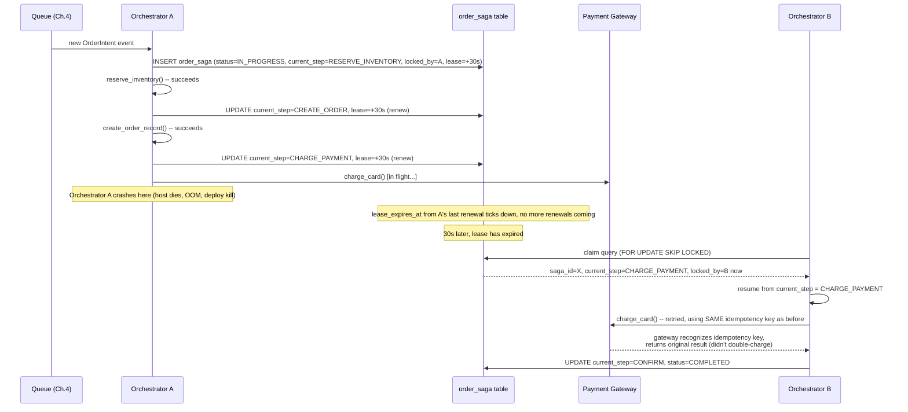
```mermaid
sequenceDiagram
    participant MQ as Queue (Ch.4)
    participant A as Orchestrator A
    participant DB as order_saga table
    participant PG as Payment Gateway
    participant B as Orchestrator B

    MQ->>A: new OrderIntent event
    A->>DB: INSERT order_saga (status=IN_PROGRESS, current_step=RESERVE_INVENTORY, locked_by=A, lease=+30s)
    A->>A: reserve_inventory() -- succeeds
    A->>DB: UPDATE current_step=CREATE_ORDER, lease=+30s (renew)
    A->>A: create_order_record() -- succeeds
    A->>DB: UPDATE current_step=CHARGE_PAYMENT, lease=+30s (renew)
    A->>PG: charge_card() [in flight...]
    Note over A: Orchestrator A crashes here (host dies, OOM, deploy kill)
    Note over DB: lease_expires_at from A's last renewal ticks down, no more renewals coming

    Note over DB: 30s later, lease has expired
    B->>DB: claim query (FOR UPDATE SKIP LOCKED)
    DB-->>B: saga_id=X, current_step=CHARGE_PAYMENT, locked_by=B now

    B->>B: resume from current_step = CHARGE_PAYMENT
    B->>PG: charge_card() -- retried, using SAME idempotency key as before
    PG-->>B: gateway recognizes idempotency key,<br/>returns original result (didn't double-charge)
    B->>DB: UPDATE current_step=CONFIRM, status=COMPLETED
```

Two things here that are easy to gloss over but shouldn't be:

**1. "Resume from current_step" only works because every step is idempotent (as established in the previous chapter).** Orchestrator B doesn't know whether A's `charge_card()` call actually reached the gateway before A died — A could've crashed a millisecond before sending the request, or a millisecond after receiving a success response but before writing it to the DB. B has to safely re-attempt the *exact same* operation with the *same* idempotency key regardless of which case it was, and get the correct outcome either way (gateway either processes it fresh, or recognizes the key and returns the already-completed result without charging twice). This is precisely why idempotency isn't a "nice to have" here — the entire crash-recovery story is built on top of it.

**2. The lease must be actively renewed during a long-running step, not just set once for the whole saga.** If `charge_card()` legitimately takes 8 seconds (Chapter 8's slow-gateway scenario) and your lease is 30 seconds, fine. But if a step could ever take longer than the lease, you'd have another worker snatch the saga away *while the first one is still legitimately working it* — a false crash-detection. Production implementations run a background "heartbeat" that renews the lease every few seconds *while* the step is in flight, not just before/after — so the lease only ever expires when a worker has actually gone silent.

### The catch: how does anyone notice a saga *right after* a crash, without waiting for something to trigger a re-check?

This is worth being explicit about, because it exposes a real design choice with two valid answers:

**Option A — pure polling.** Every orchestrator instance, in a loop, continuously runs the claim query (say, every 500ms) whether or not there's anything new. It'll naturally pick up both brand-new sagas (inserted by Chapter 4's queue consumer) and orphaned ones (lease expired). Simple, but wastes some DB query load during idle periods, and adds up to 500ms of latency before a crashed saga is noticed.

**Option B — event-driven with a periodic sweep as backstop.** Orchestrator instances are normally triggered by the queue directly (a message arrives → an instance picks it up and creates+claims the saga immediately, no polling delay). *Separately*, a lightweight background sweeper (could be one of the orchestrator instances taking turns, or a dedicated cron-like job) runs the claim-query-for-expired-leases every few seconds, purely to catch orphaned/crashed sagas — since those don't have a fresh queue message to trigger them.

**Option B is what real systems do**, and the reasoning is: the common case (no crashes) should have zero polling latency — you want checkout to feel instant, not "wait up to 500ms because we're on a polling cycle." But you still need *some* periodic sweep as a safety net purely for the rare crash-recovery case, where a few seconds of extra latency is a completely acceptable trade-off (the user's already been told "processing," not left hanging on an open connection — Chapter 4's whole point).

### What happens on a *total* restart — every orchestrator instance died at once?

This is the scenario your question is really getting at, I think — not "one instance crashes while others are healthy" (handled above by leasing), but "the whole orchestrator fleet went down and came back up." The answer: **nothing special has to happen, because the DB was always the source of truth, not any instance's memory.**

When the fleet comes back up (deploy restart, or after an outage), each fresh instance simply starts running the same claim query as always:

```sql
WHERE status IN ('IN_PROGRESS', 'COMPENSATING')
  AND (locked_by IS NULL OR lease_expires_at < now())
```

Every saga that was mid-flight when the fleet died has, by now, an expired lease (nobody renewed it) — so this query finds *all* of them, indistinguishable from the single-crash case. The fleet doesn't need a special "recovery mode" or a startup scan — the claim query **is** the recovery mechanism, always running, and a mass outage just means a mass batch of sagas becomes claimable at once instead of a trickle. This is the elegant part of leasing over, say, an in-memory orchestrator that tracks state in a hashmap — there's no separate "state" to lose, because the state was never anywhere but the DB.

One operational note worth naming: after a *mass* restart, you'll get a thundering-herd-shaped spike of reclaim queries all at once (every instance racing to grab its share of potentially thousands of orphaned sagas) — the same shape of problem as Chapter 1 and Chapter 5, and `SKIP LOCKED` plus a reasonable claim batch size (`LIMIT 1` per query call, looped) keeps this from turning into contention. This is a nice thing to point out unprompted — it shows you're pattern-matching failure shapes across the whole system, not treating each chapter's problem as unrelated to the others.

### Scaling the orchestrator pool itself

Since orchestrator instances are **stateless workers** (all state lives in the DB), scaling is just "run more instances" — a standard horizontally-scalable worker pool, autoscaled on a signal like "count of claimable sagas" or queue depth from Chapter 4. No sharding-by-key needed for the orchestrators themselves (unlike Chapter 6's DB sharding) — any instance can claim any saga, since `SKIP LOCKED` handles the coordination. The only thing that needs to scale carefully is the underlying `order_saga` table itself, which — same as Chapter 6 — you'd shard by `saga_id`/`order_id` if the claim query's write volume ever became the bottleneck.

---

So, to directly answer your four questions in one line each: **no, single orchestrator is not enough — you run a stateless pool; it uses a relational DB (Postgres/MySQL) specifically for compare-and-swap and range queries, not Redis; it discovers pending/orphaned sagas via the same lease-based claim query always running, which doubles as both normal dispatch and crash recovery; and a total fleet restart needs no special handling because the DB, not any instance's memory, was always the source of truth.**

Does the leasing mechanism — particularly why `SKIP LOCKED` matters and why the claim query *is* the recovery mechanism rather than a separate "startup scan" — feel solid? That's a good place to pause, since this is genuinely one of the more senior-level follow-ups (interviewers who ask "what if the orchestrator itself fails" are usually specifically checking whether you reach for stateless-worker-plus-durable-DB, versus getting stuck describing a single coordinator).

---

## The Complete Request Flow Catalog — Every Endpoint, Payload, Table, Query, and Event

This is long because you asked for zero assumptions — let's treat it as the reference doc you'd sketch on a whiteboard if an interviewer said "now trace one request all the way through." I'll number each flow and use consistent naming throughout so you can see how they chain together.

---

## Flow 1: Landing on the Sale Page

**Client action:** User opens the sale page before/at T-0.

```
GET /api/v1/sale/{sale_id}
```

**Where it lands:** Never reaches an app server for the static parts — served by **CDN edge** from cache (Ch. 5). Only the dynamic bit (approximate stock display) calls back:

```
GET /api/v1/products/{product_id}/summary
```

**Service:** App Server → checks Redis cache first.

**Redis key:**
```
Key:   product:summary:{product_id}
Value: {"name": "Air Zoom X", "price": 2000, "approx_stock": 12, "image_url": "..."}
TTL:   soft-expiry pattern (Ch. 5) — logical stale_at field inside the value, not a hard Redis TTL
```

**On cache miss**, falls through to:
```sql
-- DB: products table, read replica
SELECT id, name, price, image_url, description
FROM products
WHERE id = ?;
```
```sql
CREATE TABLE products (
    id BIGINT PRIMARY KEY,
    name VARCHAR(255),
    price DECIMAL(10,2),
    image_url TEXT,
    description TEXT,
    updated_at TIMESTAMP
);
```

**Response:**
```json
{
  "product_id": 123,
  "name": "Air Zoom X",
  "price": 2000,
  "approx_stock": 12,
  "sale_starts_at": "2026-09-02T12:00:00Z"
}
```

No event published — pure read, nothing changes state.

---

## Flow 2: Enqueue Into the Waiting Room

**Client action:** User clicks "Notify me / Join queue" (or this fires automatically at T-0).

```
POST /api/v1/queue/enqueue
Content-Type: application/json
Cookie: qsid=<signed_session_cookie>   -- set on first visit, Ch. "session_id" discussion

Body:
{
  "sale_id": "sale_20260902_sneaker"
}
```

**Service:** Waiting Room Service.

**What it does, step by step:**
1. Extracts `session_id` from the verified `qsid` cookie (server-issued, not client-generated — per our earlier discussion).
2. Checks for an existing ticket first (idempotent enqueue — refresh-safe):
```
GET ticket:{sale_id}:{session_id}   -- Redis, if exists, return it instead of re-enqueuing
```
3. If new:
```
INCR seq_counter:{sale_id}                         -- e.g. returns 48213
ZADD queue:{sale_id} 48213 {session_id}             -- O(log N)
```
4. Mints a signed JWT queue ticket:
```json
{
  "sub": "session_abc123",
  "sale_id": "sale_20260902_sneaker",
  "seq": 48213,
  "iat": 1725270000,
  "exp": 1725277200
}
```
5. Caches it: `SETEX ticket:{sale_id}:{session_id} 7200 <jwt>`

**Response:**
```json
{
  "ticket": "eyJhbGciOi...",
  "position": 48213
}
```

**Event published:** None yet — enqueue is a pure state write to Redis, no downstream system cares until admission happens.

---

## Flow 3: Polling Queue Status

```
GET /api/v1/queue/status?ticket={jwt}
```

**Service:** Waiting Room Service (stateless, any replica can serve this).

**What it does:**
1. Verifies JWT signature + expiry — **no Redis call if invalid** (fail fast, cheap).
2. If valid:
```
ZRANK queue:{sale_id} {session_id}          -- current position, O(log N)
EXISTS admitted:{sale_id}:{session_id}       -- has admission worker cleared them?
```

**Response (not yet admitted):**
```json
{ "admitted": false, "position": 8213, "estimated_wait_seconds": 24 }
```

**Response (admitted):**
```json
{
  "admitted": true,
  "admission_token": "eyJhbGciOi...",
  "expires_in": 90
}
```

Client polls this every `3s + jitter(0–1s)` (Ch. 2 detail on avoiding synchronized polling waves).

---

## Flow 4: The Admission Worker (background process, no client request)

**Service:** Admission Worker — a standalone process, not triggered by any API call, runs on a fixed interval.

```
Every 1 second:
  ZPOPMIN queue:{sale_id} 500                 -- atomically pops 500 lowest-seq members
  For each popped session_id:
      token = sign_jwt({sub: session_id, sale_id, admission_id: uuid(), exp: now+90s})
      SETEX admitted:{sale_id}:{session_id} 90 {token}
```

**Feedback loop (Ch. 2's dynamic throttling):** before popping, the worker checks a health signal:
```
GET health:checkout_p99_latency     -- published by app servers, Ch. 9 metrics
```
If p99 > threshold, it pops fewer (e.g., 100 instead of 500) that cycle.

No DB table involved here — this entire flow lives in Redis by design, since it needs to run at sub-second intervals against a queue of tens of thousands of members.

---

## Flow 5: Checkout Page Load (Post-Admission)

```
GET /api/v1/checkout/{product_id}
Header: Authorization: Bearer {admission_token}
```

**Service:** App/Checkout Server.

1. Verifies `admission_token` signature + expiry.
2. Fetches product detail (Flow 1's cache path) plus **live** stock from the authoritative counter:
```
GET inventory:{product_id}    -- Redis, Ch. 3's real counter, not the display cache
```

**Response:**
```json
{
  "product_id": 123,
  "name": "Air Zoom X",
  "price": 2000,
  "live_stock": 47,
  "checkout_token": "..."  -- short-lived, scoped to this specific checkout attempt
}
```

---

## Flow 6: Place Order — The Critical Path

This is the one worth being airtight on.

```
POST /api/v1/orders
Header: Authorization: Bearer {admission_token}
Idempotency-Key: {client-generated UUID, generated ONCE and reused on any client-side retry}

Body:
{
  "product_id": 123,
  "quantity": 1,
  "payment_method_id": "pm_5f3a...",
  "shipping_address_id": "addr_991"
}
```

Note on the `Idempotency-Key` header: this is generated **client-side**, but unlike the `session_id` discussion earlier, this is fine — if the client retries (network blip, double-tap), it resends the *same* key, and the server's job is to deduplicate on it. Worst case if a client behaves maliciously here is "I fail to dedupe my own retried request," not "I gain unfair access to someone else's queue slot" — much lower stakes than session identity.

**Service: App Server.** Sequence, in order:

**Step A — dedupe check:**
```
SET request:dedupe:{idempotency_key} "processing" NX EX 90
```
If `NX` fails (key exists) → look up cached response for this key and return it immediately, skip everything below.

**Step B — atomic inventory check-and-decrement (Ch. 3):**
```lua
-- Redis Lua script, KEYS[1]=inventory:{product_id}
local stock = tonumber(redis.call('GET', KEYS[1]))
if stock > 0 then
    redis.call('DECR', KEYS[1])
    return 1
else
    return 0
end
```
If returns `0` → respond `409 Conflict {"error": "sold_out"}`, release the dedupe key, stop here. No event published, no DB write.

**Step C — create the saga (Ch. "orchestrator" discussion):**
```sql
INSERT INTO order_saga (
    saga_id, order_id, reservation_id, user_id, product_id,
    quantity, amount, payment_method_id,
    current_step, status, locked_by, lease_expires_at, payload, created_at
) VALUES (
    ?, ?, ?, ?, ?, ?, ?, ?,
    'RESERVE_INVENTORY', 'IN_PROGRESS', NULL, NULL, ?, now()
);
```
```json
// payload column (JSONB)
{
  "user_id": "u_882",
  "product_id": 123,
  "quantity": 1,
  "amount": 2000,
  "payment_method_id": "pm_5f3a...",
  "idempotency_key": "550e8400-...",
  "shipping_address_id": "addr_991"
}
```
Note: `current_step` starts at `RESERVE_INVENTORY` but that step is *already done* (Step B just did it) — the saga row is created retroactively marking it complete, then immediately advanced. In practice this INSERT sets `current_step = 'CREATE_ORDER'` directly, since reservation already succeeded synchronously in the request path.

**Step D — publish the event that kicks off async processing:**
```
Topic: order.intent.created
Partition key: order_id   (ensures ordering per-order if you need it)

Message:
{
  "event_id": "evt_9f8a...",
  "saga_id": "saga_1122",
  "order_id": "ord_3344",
  "user_id": "u_882",
  "product_id": 123,
  "quantity": 1,
  "amount": 2000,
  "idempotency_key": "550e8400-...",
  "timestamp": "2026-09-02T12:00:03.221Z"
}
```

**Step E — respond to client immediately** (this is the whole point of Ch. 4 — don't block on payment):
```json
202 Accepted
{
  "order_id": "ord_3344",
  "status": "PENDING",
  "poll_url": "/api/v1/orders/ord_3344/status"
}
```
```
SET request:dedupe:{idempotency_key} '{"order_id":"ord_3344","status":"PENDING"}' EX 90   -- overwrite the "processing" placeholder with the real response
```

---

## Flow 7: Order Worker — Persisting the Order Record

**Trigger:** Consumes from `order.intent.created` (also serves as the signal for an orchestrator instance to claim the saga — Flow 6's Step C already inserted it, so this is really "orchestrator picks it up").

**Service:** Orchestrator instance (claims via the leasing query from before):
```sql
UPDATE order_saga
SET locked_by = 'orch-worker-7', lease_expires_at = now() + interval '30 seconds'
WHERE saga_id = (
    SELECT saga_id FROM order_saga
    WHERE status = 'IN_PROGRESS'
      AND current_step = 'CREATE_ORDER'
      AND (locked_by IS NULL OR lease_expires_at < now())
    ORDER BY updated_at ASC LIMIT 1
    FOR UPDATE SKIP LOCKED
) RETURNING *;
```

**DB write — the actual orders table (distinct from order_saga, which is bookkeeping; `orders` is the customer-facing, queryable record):**
```sql
CREATE TABLE orders (
    order_id UUID PRIMARY KEY,
    user_id BIGINT,
    product_id BIGINT,
    quantity INT,
    amount DECIMAL(10,2),
    status VARCHAR(20),   -- PENDING_PAYMENT | PAID | CANCELLED | FAILED
    shipping_address_id BIGINT,
    created_at TIMESTAMP,
    updated_at TIMESTAMP
);
-- sharded by product_id, per Ch. 6
```
```sql
INSERT INTO orders (order_id, user_id, product_id, quantity, amount, status, shipping_address_id, created_at)
VALUES ('ord_3344', 'u_882', 123, 1, 2000, 'PENDING_PAYMENT', 'addr_991', now())
ON CONFLICT (order_id) DO NOTHING;   -- idempotent insert, safe on saga retry
```

**Advance saga:**
```sql
UPDATE order_saga
SET current_step = 'CHARGE_PAYMENT', lease_expires_at = now() + interval '30 seconds'
WHERE saga_id = 'saga_1122' AND current_step = 'CREATE_ORDER';   -- CAS
```

**No new event published to Kafka here** — in this design, the orchestrator drives the next step directly (that's the whole point of orchestration over choreography, per the earlier chapter) rather than emitting an event for some other service to react to.

---

## Flow 8: Payment Worker — Charging the Card

**Trigger:** Same orchestrator instance (or another, if it re-claims), now executing `current_step = 'CHARGE_PAYMENT'`.

**Service:** Orchestrator → Payment Worker logic, wrapped in the circuit breaker (Ch. 8).

**External call:**
```
POST https://api.paymentgateway.com/v1/charges
Header: Idempotency-Key: saga_1122   -- reuse the saga_id itself as the gateway's dedupe key

Body:
{
  "amount": 2000,
  "currency": "INR",
  "payment_method_id": "pm_5f3a...",
  "metadata": { "order_id": "ord_3344" }
}
```

**On success:**
```sql
UPDATE orders SET status = 'PAID', updated_at = now() WHERE order_id = 'ord_3344';
UPDATE order_saga SET current_step = 'CONFIRM', lease_expires_at = now() + interval '30 seconds'
WHERE saga_id = 'saga_1122' AND current_step = 'CHARGE_PAYMENT';
```

**Event published (this one *is* a real fan-out event, since multiple independent consumers care — notifications, analytics, fraud monitoring):**
```
Topic: order.paid
Partition key: order_id

Message:
{
  "event_id": "evt_a1b2...",
  "order_id": "ord_3344",
  "user_id": "u_882",
  "product_id": 123,
  "amount": 2000,
  "paid_at": "2026-09-02T12:00:05.400Z"
}
```

**On failure (gateway declines, or circuit breaker is Open and fast-fails):**
```sql
UPDATE order_saga SET status = 'COMPENSATING', current_step = 'CHARGE_PAYMENT_FAILED'
WHERE saga_id = 'saga_1122';
```
```
Topic: order.payment.failed
Message:
{
  "saga_id": "saga_1122",
  "order_id": "ord_3344",
  "reason": "card_declined",  -- or "gateway_circuit_open"
  "timestamp": "..."
}
```
→ triggers Flow 9 (compensation).

---

## Flow 9: Compensation — Unwinding on Failure

**Trigger:** Orchestrator sees `status = 'COMPENSATING'`, walks backward through completed steps.

```sql
UPDATE orders SET status = 'CANCELLED', updated_at = now() WHERE order_id = 'ord_3344';
```
```
INCR inventory:123    -- release the unit back, Redis
```
```sql
UPDATE order_saga SET status = 'FAILED', current_step = 'COMPENSATED' WHERE saga_id = 'saga_1122';
```
```
Topic: order.cancelled
Message:
{
  "order_id": "ord_3344",
  "user_id": "u_882",
  "reason": "payment_failed",
  "timestamp": "..."
}
```
Notification Worker (Flow 10) consumes this same topic pattern too — it doesn't just listen for success.

---

## Flow 10: Notification Worker

**Trigger:** Consumes both `order.paid` and `order.cancelled` topics.

```sql
-- to avoid double-sending on redelivery
SELECT 1 FROM notification_log WHERE event_id = 'evt_a1b2...';
```
```sql
CREATE TABLE notification_log (
    event_id VARCHAR PRIMARY KEY,
    order_id UUID,
    channel VARCHAR,   -- email | sms
    sent_at TIMESTAMP
);
```
If not found → calls email/SMS provider API, then:
```sql
INSERT INTO notification_log (event_id, order_id, channel, sent_at)
VALUES ('evt_a1b2...', 'ord_3344', 'email', now());
```
No further event published — this is a terminal consumer, nothing downstream reacts to a sent notification.

---

## Flow 11: Client Polls Order Status

```
GET /api/v1/orders/{order_id}/status
```

**Service:** App server, reads from **read replica** (Ch. 6):
```sql
SELECT status, updated_at FROM orders WHERE order_id = ?;
```

**Response:**
```json
{ "order_id": "ord_3344", "status": "PAID", "updated_at": "2026-09-02T12:00:05Z" }
```

Watch for the replication-lag trap from Ch. 6 here specifically: if this read happens **immediately** after Flow 8's write (same request-response cycle, e.g., client polls right after getting a webhook/push), route it to the primary or a replica known to have caught up — otherwise the user briefly sees stale `PENDING_PAYMENT` for their own just-completed order.

---

### The full picture, one diagram, all flows numbered

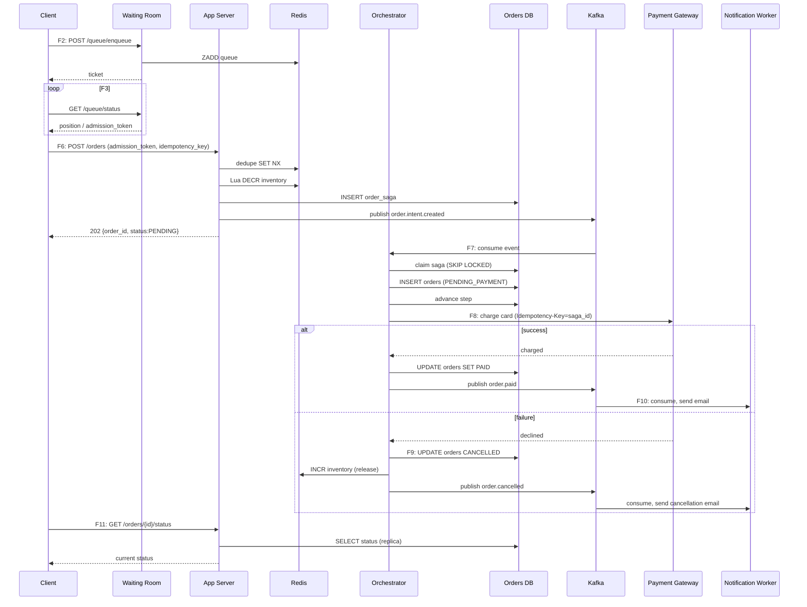
```mermaid
sequenceDiagram
    participant C as Client
    participant WR as Waiting Room
    participant APP as App Server
    participant RD as Redis
    participant SAGA as Orchestrator
    participant DB as Orders DB
    participant MQ as Kafka
    participant PG as Payment Gateway
    participant NW as Notification Worker

    C->>WR: F2: POST /queue/enqueue
    WR->>RD: ZADD queue
    WR-->>C: ticket

    loop F3
        C->>WR: GET /queue/status
        WR-->>C: position / admission_token
    end

    C->>APP: F6: POST /orders (admission_token, idempotency_key)
    APP->>RD: dedupe SET NX
    APP->>RD: Lua DECR inventory
    APP->>DB: INSERT order_saga
    APP->>MQ: publish order.intent.created
    APP-->>C: 202 {order_id, status:PENDING}

    MQ->>SAGA: F7: consume event
    SAGA->>DB: claim saga (SKIP LOCKED)
    SAGA->>DB: INSERT orders (PENDING_PAYMENT)
    SAGA->>DB: advance step

    SAGA->>PG: F8: charge card (Idempotency-Key=saga_id)
    alt success
        PG-->>SAGA: charged
        SAGA->>DB: UPDATE orders SET PAID
        SAGA->>MQ: publish order.paid
        MQ->>NW: F10: consume, send email
    else failure
        PG-->>SAGA: declined
        SAGA->>DB: F9: UPDATE orders CANCELLED
        SAGA->>RD: INCR inventory (release)
        SAGA->>MQ: publish order.cancelled
        MQ->>NW: consume, send cancellation email
    end

    C->>APP: F11: GET /orders/{id}/status
    APP->>DB: SELECT status (replica)
    APP-->>C: current status
```

---

This is genuinely the level of detail that separates "I understand the concept" from "I could build this" — every arrow above has a concrete API shape, a table or Redis key, and either an event or a direct next call behind it. Want me to do the same treatment for one specific edge case end-to-end — e.g., what exactly happens across all these tables/events if the client hits "place order" twice within 100ms (double-click), or if the orchestrator crashes exactly between Flow 7 and Flow 8?

---

## Multi-Region: Where Everything We Built Gets Genuinely Harder

This is a great one to end on, because it doesn't introduce brand-new patterns so much as it **breaks an assumption baked into everything so far**: that there's one Redis, one DB primary, one queue cluster. Let's find that assumption and pull on it.

### Why multi-region at all — two separate motivations, worth naming separately

1. **Latency.** If ShopFast is selling globally and everything (app servers, Redis, DB) lives in `ap-south-1` (Mumbai), a user in São Paulo has 250-300ms round-trip latency just to *reach* your servers, before any processing happens. For a flash sale where milliseconds decide who gets the last unit, this is inherently unfair to distant users, and it makes your waiting-room polling (Ch. 2) sluggish for them.
2. **Availability / blast radius.** If that one region has a cloud provider outage (it happens — AWS `ap-south-1` or `us-east-1` going down is a real, recurring event), your *entire* flash sale — global — goes to zero, not just for that region's users.

Both are real, but they push you toward different solutions, and conflating them is where people get sloppy in interviews. Let's build this up the same way we did everything else — naive, break it, fix it.

### Step 1: The easy part — stateless layers go multi-region trivially

**CDN (Ch. 5)** is already inherently multi-region — that's the entire point of a CDN, edge nodes are everywhere. Nothing to redesign.

**App servers, waiting room service, admission workers** are stateless (Ch. "orchestrator" discussion established this pattern) — you can run identical fleets in `us-east-1`, `eu-west-1`, `ap-south-1`, fronted by **GeoDNS or Anycast routing**, which sends each user to their nearest region automatically:

```mermaid
flowchart TB
    U1[User: São Paulo] --> GEO{GeoDNS/Anycast}
    U2[User: Mumbai] --> GEO
    U3[User: London] --> GEO
    GEO --> R1[Region: us-east-1<br/>App + Waiting Room]
    GEO --> R2[Region: ap-south-1<br/>App + Waiting Room]
    GEO --> R3[Region: eu-west-1<br/>App + Waiting Room]
```

This part is genuinely not hard — it's the same pattern as scaling app servers within one region, just geographically distributed. **The hard part is what these regional app servers talk to for stock.**

### Step 2: The actual hard problem — one global inventory count, written from three continents

Here's where it breaks. You have **1,000 units of one sneaker, globally.** Users in all three regions are trying to buy it *at the same moment*. Recall Chapter 3: correctness required an atomic decrement on a single counter. If that counter lives in `ap-south-1`'s Redis, every purchase attempt from São Paulo now has to make a **cross-region call** (200+ ms) just to check stock — your fast, microsecond Redis operation from Chapter 3 just became your slowest hop, for two-thirds of your users.

You cannot simply run three independent Redis counters, one per region, each starting at 1000 — that's not "sharding," that's **triple-selling your inventory**, because each region would independently think it has the full 1,000 units to sell.

This is the real design decision multi-region flash sales force, and there are two legitimate answers, with a real trade-off — worth presenting both to an interviewer rather than pretending there's one right answer.

### Option A: Single authoritative region for inventory (strong consistency, higher latency for some)

Pick one region — say `ap-south-1` — to hold the **one true inventory counter**. Every region's checkout flow, no matter where the user is, makes the atomic `DECR`/Lua call to *that* region's Redis:

```mermaid
sequenceDiagram
    participant US as App (us-east-1)
    participant SA as App (ap-south-1)
    participant RD as Redis (ap-south-1, authoritative)

    US->>RD: DECR inventory:123 (cross-region call, ~200ms)
    RD-->>US: result
    SA->>RD: DECR inventory:123 (local call, ~1ms)
    RD-->>SA: result
```

**Correctness: perfect** — there's still exactly one atomic counter, same guarantee as Chapter 3, just now some callers are far from it.
**Cost: the far regions pay real latency** on the single most latency-sensitive operation in the whole system, and — critically — **you've recreated a single point of failure**: if `ap-south-1` goes down, *global* checkout stops, even for users in São Paulo who have nothing to do with that region. This is a real regression against the "availability" motivation from the top of this chapter.

### Option B: Partition the stock across regions upfront (availability, at the cost of possible imbalance)

Instead of one global counter, **pre-allocate the 1,000 units across regions before the sale starts**, based on expected regional demand:

```
inventory:123:us-east-1  = 400
inventory:123:eu-west-1  = 300
inventory:123:ap-south-1 = 300
```

Now each region's `DECR` is **fully local** — no cross-region call, full Chapter 3 speed, and each region is independently resilient (if `eu-west-1` goes down, US and APAC sales continue completely unaffected — genuinely solves the availability motivation).

```mermaid
flowchart LR
    subgraph "us-east-1"
        U1[Users] --> RD1["Redis: inventory=400"]
    end
    subgraph "eu-west-1"
        U2[Users] --> RD2["Redis: inventory=300"]
    end
    subgraph "ap-south-1"
        U3[Users] --> RD3["Redis: inventory=300"]
    end
```

**The new problem this creates — regional imbalance.** What if the sneaker goes viral specifically in the US and sells out its 400-unit allocation in 30 seconds, while EU's allocation is only half sold an hour later? You've told US users "sold out" while genuinely available stock sits idle in Europe — a worse *business* outcome than the latency Option A accepted.

**The fix teams actually use: allocate conservatively + a rebalancing/overflow mechanism**, not a one-time static split:
- Hold back a portion (say, 10%) as an **unallocated global reserve**, not assigned to any region upfront.
- When a region's local allocation hits zero, instead of immediately declaring sold-out, it makes an (infrequent — not per-request) call to a lightweight **global allocator service** asking "can I have another 50 units from the reserve?" This is a much lower-frequency, lower-stakes cross-region call than doing it on every single checkout — you're batching the cross-region cost instead of paying it per-purchase.
- The global allocator itself is just... Option A's pattern (one authoritative counter, atomic decrement) — but now it's only invoked occasionally per region, not per-user, so the cross-region latency cost is amortized across dozens/hundreds of local sales instead of paid by every single buyer.

This is the actual production answer for a lot of real systems: **hybrid — mostly Option B (regional, fast, resilient) with an escape hatch to Option A (global, authoritative, slower) only when a region needs to borrow from the reserve.**

### Step 3: The database layer — active-passive across regions, not active-active

For the `orders` table and `order_saga` table (Ch. 6, and the orchestrator chapter), you're tempted to think "multi-region DB, run a primary in each region" — this is **active-active multi-master replication**, and it's worth explicitly saying why you'd avoid it for this specific system, even though it exists as a general pattern:

- Active-active means the same row (or related rows, like two orders decrementing what should be one global count) can be written concurrently in two regions, and the database has to **resolve conflicts** — last-write-wins, vector clocks, CRDTs. For financial/order data, "last write wins" can silently discard a legitimate order or double-apply a payment; this is not a place you want eventually-resolved conflicts.
- The safer, standard pattern: **one primary region for the writable order data** (matches whichever region "owns" that shard, from Ch. 6's product_id sharding — you could even say each product's shard has a home region, matching Option B's regional allocation), with **async cross-region read replicas** everywhere else, same mechanics as Ch. 6's single-region replication, just with a longer replication lag (cross-continent, tens to hundreds of ms instead of same-datacenter single-digit ms).

```mermaid
flowchart TB
    subgraph "us-east-1 (owns this product's shard)"
        P[(Primary DB)]
    end
    subgraph "eu-west-1"
        R1[(Cross-region Replica)]
    end
    subgraph "ap-south-1"
        R2[(Cross-region Replica)]
    end
    P -->|async replication, higher lag| R1
    P -->|async replication, higher lag| R2
```

Consequence worth stating plainly: a user in Europe checking their order status (Flow 11 from before) reading from the EU replica might see slightly staler data than a US user reading from the primary directly — same replication-lag trade-off as Chapter 6, just amplified by geography. The read-your-writes fix (route a user's own post-write reads to the primary, or to a replica proven caught-up) matters even more here.

### Step 4: Queue/messaging layer — regional clusters, not one global queue

Running one Kafka cluster stretched across three continents means every message write has to satisfy replication across regions before being acknowledged — you'd be paying cross-region latency on every single order event (Ch. 4's whole point was to make this path *fast*). Standard practice: **run independent regional Kafka clusters** (each region's orchestrators, workers, and order-intent events stay local to that region), with **cross-region replication (e.g., MirrorMaker)** used only for data that genuinely needs to be visible globally — like feeding a global analytics pipeline or the reconciliation job that checks for inventory drift across all regions combined.

### Step 5: The failure scenario worth being ready for — a whole region goes dark mid-sale

Say `eu-west-1` (which owns 300 units of allocation, per Option B) has a total network partition — it's not necessarily *dead*, just unreachable from the outside world. Two things happen, and you need answers for both:

1. **GeoDNS/Anycast reroutes EU users to the next-nearest healthy region** (say `us-east-1`) — fine for stateless traffic, but that region doesn't have EU's inventory allocation or its in-flight sagas.
2. **What about orders that were `IN_PROGRESS` inside `eu-west-1` when it went dark?** This is exactly the orchestrator-crash scenario from before, just at a regional scale instead of a single-instance scale — those sagas' leases will eventually expire, but if the *entire region* (including its DB) is unreachable, nobody can claim and resume them until the region recovers. This is an honest limitation worth stating rather than hand-waving: **you cannot safely release EU's reserved-but-unconfirmed inventory to other regions while you're not certain whether `eu-west-1` is truly down versus just network-partitioned** — releasing it prematurely risks double-selling if the region comes back and finishes those sagas independently. This is a direct, real-world instance of the CAP theorem: you're choosing between availability (let other regions sell that reserved stock now) and consistency (wait until you're certain, potentially losing sale time on those units). Most systems choose consistency here specifically because overselling has real financial/legal cost, while "some stock sits unsold for 10 extra minutes" doesn't.

### One more real consideration worth a sentence: data residency

If ShopFast operates in the EU, GDPR-style data residency rules may legally require EU users' personal/order data to stay stored within EU infrastructure — this is actually a *forcing function* toward Option B's regional-ownership model (each region genuinely owning its users' order records, not just for latency reasons but for compliance), rather than a nice-to-have optimization.

---

**The honest summary, if asked to compress this into two sentences in an interview:** stateless layers (CDN, app servers, waiting room) go multi-region for free via GeoDNS; the hard part is that inventory correctness (Ch. 3) and order durability (Ch. 6/orchestrator) both assumed one authoritative store, so multi-region forces a real trade-off — either keep one global authoritative inventory counter (correct, but a latency/availability cost for distant regions) or partition stock per region with an occasional cross-region reserve-borrowing mechanism (fast and resilient, but risks regional imbalance) — and for financial data specifically, active-passive replication with a home region per shard beats active-active multi-master, because conflict resolution on money isn't something you want "eventually" solved.

That's genuinely the deepest layer of this system — multi-region is usually where senior/staff-level interviews go once everything else is solid, precisely because it forces you to revisit every earlier "atomic, single-source-of-truth" assumption and admit which ones survive geographic distribution and which don't.

Want to stress-test any part of this with a specific scenario, or do a mock-interview run where I grill you across the whole system?

---
