# Live Auction System — Opening Hook

eBay's original architecture let anyone bid until literally the last second, and it turned out that meant almost nobody won fairly — people wrote bots to snipe bids at 0.5 seconds left, before anyone else could react. That's the whole problem in one sentence: an auction is a system where the correct final state depends on strict global ordering of events arriving from thousands of independent, unsynchronized clocks, under time pressure. Get the ordering or the timing wrong and you don't get a "bug," you get a lawsuit-shaped fairness problem. That's why auction systems are a favorite HLD interview topic — they force you to talk about ordering, consistency, and race conditions with real stakes attached.

## Clarifying Questions

1. **Is this a single continuous ascending-price auction (like eBay/live bidding) or a Dutch/sealed-bid auction?**
   Ascending auctions need real-time fan-out to bidders watching a price move up. Sealed-bid auctions barely need any real-time infra at all — this changes almost the entire architecture, so I'll assume ascending unless you say otherwise.

2. **Does the auction have a hard end time, or a "soft close" that extends if a bid lands in the final seconds (anti-sniping)?**
   A hard end time means the crux is "who's bid arrives last before the clock." A soft close means we need an extension mechanism, which changes the state machine and adds another race condition to solve.

3. **How many people are typically watching/bidding on ONE auction — dozens, or could a single hot item (a celebrity's item, a viral drop) pull in tens of thousands of concurrent watchers?**
   This decides whether a single item can become a hot-key/hot-shard problem worth designing around, or whether we can just shard by auction ID and move on.

4. **Do bids need to be visible to all watchers in real time, or is it enough that the bidder gets confirmation and others find out on next poll/refresh?**
   Real-time visibility to all watchers is a fan-out/pub-sub problem (like the flash sale SSE work you already did). If it's fine to be a bit stale for spectators, we can get away with much simpler polling.

5. **Is there real money attached (payment capture on win), or is this just bid tracking with settlement handled by a separate system?**
   If money changes hands, we need idempotency and strong consistency on the winning bid decision — a double-charge or a "won twice" bug is not acceptable. If it's out of scope, we can wave at it and move on.

6. **Can a single user place multiple simultaneous bid attempts (e.g., "buy it now" AND a live bid), or is bidding always strictly one action at a time per user per item?**
   This decides whether we need per-user concurrency control in addition to per-item concurrency control.

7. **What happens if the current highest bidder is a bot doing proxy bidding (auto-increment up to a max they set), like eBay's proxy bidding — is that in scope?**
   Proxy bidding adds a whole extra layer of server-side logic that fires bids automatically, which is a great source of interesting design discussion, but it's also a meaningfully bigger scope.

8. **Is this a single global platform (one big matching/bidding engine) or does each auction run independently and just needs to scale in aggregate (many auctions, not one mega-auction)?**
   The former pushes toward a system that must handle skew across many concurrent auctions; the latter is more naturally partitioned from day one.

Go ahead and answer what you have opinions on — for anything you don't, I'll assume sensible defaults (ascending auction, soft close with anti-snipe extension, hot-item skew is in scope, real-time fan-out to watchers, payment capture is out of scope/handled downstream, no proxy bidding in v1, many independent auctions running concurrently) and we'll lock those into SCOPE next.

---

Going with the defaults I laid out: ascending auction, soft close with anti-snipe extension, hot-item skew in scope, real-time fan-out to watchers, payment capture out of scope, no proxy bidding in v1, many independent auctions running concurrently.

# Scope

**P0/P1 requirements:**

1. **Place a bid, and have exactly one bid win the correctness race.** Two users bidding $500 at the same instant on the same item must resolve to one consistent winner, never both, never neither. This is table stakes — get it wrong and the whole system is untrustworthy.

2. **Soft close / anti-sniping.** A bid in the final N seconds extends the auction clock. This is a real functional requirement, not just an NFR — it changes the state machine for "when does an auction end."

3. **Real-time price updates to all watchers.** If I'm watching an auction with 500 other people, I should see the price move within roughly a second of a new highest bid, not on next page refresh.

4. **Correct handling of a hot auction** — a single item that pulls thousands of concurrent bidders/watchers (viral drop, celebrity item) shouldn't degrade or corrupt the auction, while a normal item shouldn't pay that cost.

**P2s I'm cutting, and why:**

- **Proxy/auto-bidding** (bid up to a max on my behalf) — interesting, but it's a layer on top of a working bid engine, not core to it. We can mention it as an extension at the end.
- **Payment capture / settlement** — real money handling is its own system (you've already done a deep payment-system session). I'll treat "auction ends, winner determined" as the boundary and hand off from there.
- **Seller-side auction creation/moderation workflows** — CRUD, not distributed-systems-interesting.
- **Search/browse/recommendation of auctions** — a typeahead/search-infra problem, not an auction problem.

**The crux — where most of our time goes:**

The hot-item bid race under a hard time deadline. Specifically: **many concurrent bidders hitting the same auction row at the exact moment it's about to close, where the correctness of "who won" and the fairness of "was the clock extended before or after this bid landed" both depend on getting a strict, unambiguous ordering of events that arrive from unsynchronized clients over an unreliable network.** This single problem touches concurrency control, ordering, the soft-close race condition, and hot-key scaling all at once — everything else in the design supports getting this one moment right.

Confirm and I'll start V0, or tweak the scope first.

---

# V0 — The Dumbest Thing That Could Work

**Scenario:** Priya lists a vintage camera, auction ends at 6:00:00 PM. Arjun bids $100 at 5:58, Kavya bids $120 at 5:59. One server, one Postgres database, one `auctions` table holding current state.

```sql
CREATE TABLE auctions (
  id BIGINT PRIMARY KEY,
  seller_id BIGINT NOT NULL,
  item_name TEXT NOT NULL,
  current_price NUMERIC(12,2) NOT NULL,
  current_winner_id BIGINT,
  ends_at TIMESTAMP NOT NULL,
  status TEXT NOT NULL -- 'active' | 'closed'
);
```

**Write path:** a bidder calls the API, the app server reads the current price, checks the new bid is higher, and writes it back.

```
POST /auctions/{id}/bids
{ "bidder_id": 42, "amount": 120.00 }
```

Handled as:
1. `SELECT current_price, ends_at, status FROM auctions WHERE id = 123`
2. App checks: `amount > current_price` and `status = 'active'` and `now() < ends_at`
3. `UPDATE auctions SET current_price = 120.00, current_winner_id = 42 WHERE id = 123`

**Read path:** every watcher's browser polls once a second.

```
GET /auctions/123 → { current_price: 120.00, current_winner_id: 42, ends_at: ... }
```

A background job checks every auction every second: if `now() >= ends_at` and `status = 'active'`, flip it to `closed`.

**What guarantee V0 actually has:** with one server and no concurrent requests in flight, this is trivially correct — there's no ambiguity about ordering because there's only ever one request being handled at a time from that server's point of view. That simplicity is exactly what we're about to lose.

---

## Break It

Arjun and Kavya both have the page open. At 5:59:59.800, both click "bid $120" within 50ms of each other, hitting two different app server threads (or even the same server with two concurrent requests — Postgres connections are concurrent by default).

Timeline:
- Thread A (Arjun's request): `SELECT current_price` → reads `100.00`
- Thread B (Kavya's request): `SELECT current_price` → reads `100.00`   *(both read before either writes)*
- Thread A: `120 > 100` ✓. `UPDATE ... SET current_price = 120, current_winner_id = 42`
- Thread B: `120 > 100` ✓ *(checked against its own stale read of 100)*. `UPDATE ... SET current_price = 120, current_winner_id = 7`

Final state: `current_price = 120`, `current_winner_id = 7` (Kavya) — but Arjun's bid of 120 was submitted first and *also* got written, just overwritten. Worse: if Arjun bid **130** and Kavya bid **120**, and Kavya's write lands second, Kavya's *lower* bid overwrites Arjun's higher one. The auction now shows $120 as the winning price when a $130 bid was actually placed and accepted seconds ago. That's not a fairness nitpick — that's a legally indefensible bug (Priya sold her camera for less than a documented bid that was in the system).

This is the classic **read-modify-write race** — check-then-act isn't atomic across two connections.

---

## Solve It

✅ **What we gained:** by making the price update conditional in the SQL itself instead of in application logic, the database becomes the single point of truth for "is this bid actually the highest," and no interleaving of reads/writes can produce a wrong winner.

⚠️ **What we give up / new problem this creates:** under high concurrency on one hot auction, every bid now competes for a row-level lock on the same row. This doesn't break correctness, but it's the seed of a scaling problem — 10,000 people trying to `UPDATE` the same row a second before close will queue up. That's a separate NFR concern (contention on a hot row) — we defer it and come back once it's actually a numbers problem later.

❌ **What we considered and rejected:**
- **Application-level locking (mutex per auction ID in the app server)** — works only if there's exactly one app server. The moment we horizontally scale app servers (which we will, for availability), this lock is invisible to other instances and the race reappears.
- **Optimistic locking with a version column, retry on conflict** — this actually works too and is a legitimate alternative, but it pushes retry logic into the client/app layer for every single bid, even uncontended ones, which is wasted complexity when the database can just make the write conditional in one statement.
- **Distributed lock (Redis `SETNX`) per auction before every bid** — adds a whole extra network hop and a new failure mode (lock service down = bidding down) to solve a problem Postgres already solves natively with a single conditional `UPDATE`.

**The fix:** make the price check part of the same atomic statement as the write, so the database — not the application — decides atomically whether this bid is even allowed to land.

---

## Implement It

```
POST /auctions/{id}/bids
{ "bidder_id": 7, "amount": 120.00 }
```

1. **API Gateway / App Server** receives the request, does basic validation (amount is a positive number, auction ID exists in cache/DB).
2. **App Server** issues one atomic conditional update directly against Postgres — no separate `SELECT` first:

```sql
UPDATE auctions
SET current_price = 120.00,
    current_winner_id = 7
WHERE id = 123
  AND status = 'active'
  AND now() < ends_at
  AND current_price < 120.00
RETURNING current_price, current_winner_id;
```

3. **Branch on the result:**
   - **Rows affected = 1** → this bid won the race. App server returns `200 OK` with the new price to Arjun/Kavya's client.
   - **Rows affected = 0** → either the auction closed, or someone else's bid already beat this one to a higher (or equal) price. App server re-reads the current row with a plain `SELECT` to find out which, and returns `409 Conflict` with the current price, so the client can immediately show "someone bid $130, want to bid higher?"

This single-statement conditional update is what makes it safe under concurrency: Postgres serializes concurrent `UPDATE`s to the same row internally (via its row-level locking), so of the two nearly-simultaneous requests, exactly one will see `current_price < 120.00` still true and commit, and the other will see it's now false (because the first one's write already landed) and get zero rows affected. No interleaving of two independent read-then-write sequences is possible anymore, because there's no separate read step to interleave.

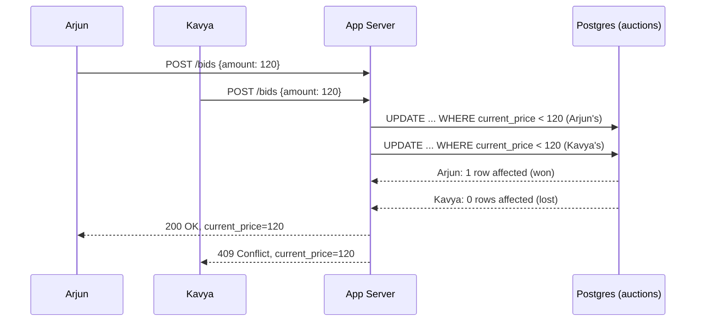

---

# Current State — After V0

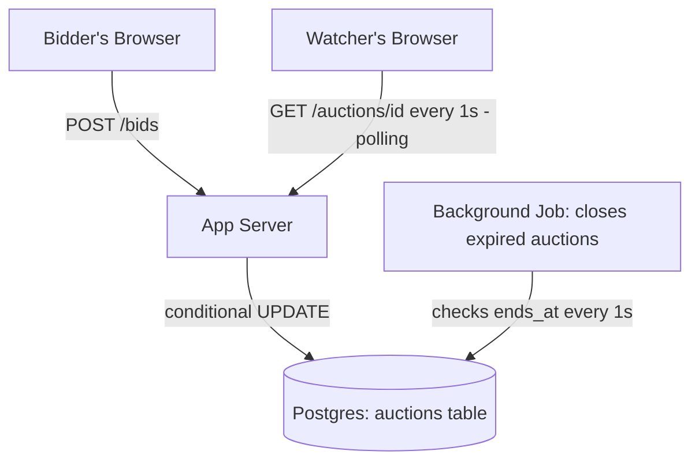

**Flows as of V0:**

1. **Bid write path:** bidder submits a bid → app server issues a single conditional `UPDATE ... WHERE current_price < :amount AND status='active' AND now() < ends_at` → 1 row affected means the bid won and the client gets `200`, 0 rows affected means the client gets `409` and re-fetches current state.
2. **Watch/read path:** every watcher's browser polls `GET /auctions/{id}` once a second and gets the current price, winner, and end time directly from Postgres.
3. **Auction close path:** a background job scans for `status='active' AND now() >= ends_at` every second and flips those rows to `closed`.

No anti-sniping yet, no real-time push yet, no sharding/caching/replication yet — this is the correctness-only baseline. Everything from here is about making it fast, fair under sniping, and scalable.

---

## Interviewer Follow-ups

**Q: Why not just use a `SELECT ... FOR UPDATE` to lock the row first, then check-then-write in two statements?**
A: That works too and is functionally equivalent, but it holds a row lock across two round trips (the `SELECT` and the `UPDATE`) instead of one, which means the lock is held longer under contention — for a hot auction with thousands of bids in the closing seconds, that's strictly worse throughput than a single conditional statement for no correctness benefit.

**Q: What if two bids come in for the exact same amount?**
A: The conditional `UPDATE` uses `<`, not `<=`, so a bid equal to the current price is rejected — this system requires strictly increasing bids, which is standard auction behavior (you can't tie a live auction bid; you must outbid, even if only by a minimum increment we haven't defined yet).

---

## Recap

| Concept | The Insight |
|---|---|
| Read-modify-write race | Two independent reads before either write both look "valid," so both writes succeed and the wrong one can win. |
| Atomic conditional update | Fold the check into the `WHERE` clause of the write itself, so the database — not app code — decides atomicity. |
| Rows-affected as signal | `0` rows affected isn't an error, it's the mechanism's way of saying "you lost the race," and the client re-fetches to learn why. |
| Row-level locking | Postgres serializes concurrent writers to the same row for free — we don't need our own lock service for single-item correctness. |

**Interview-arc sentence:** *If asked how you prevent a double-bid-win race: reading the price then writing it back leaves a gap where two concurrent bidders both see a stale price as valid, so folding the price check into the `UPDATE`'s `WHERE` clause makes the database resolve the race atomically instead of the application guessing.*

Next up: real-time price updates to watchers — polling every second doesn't scale to a hot auction with 10,000 spectators, and that's V1.

---

# V1 — Real-Time Price Updates to Watchers

**Break it:** Priya's camera auction goes viral — 8,000 people have the auction page open in the final two minutes. Every one of them is polling `GET /auctions/123` once a second. That's 8,000 QPS hitting Postgres for a single row, every single second, just to read a price that mostly hasn't changed since the last poll. Postgres can serve that read volume for one row fine (it's cached in shared buffers), but now multiply by ten hot auctions happening simultaneously across the platform, and you're burning tens of thousands of QPS on reads that are 99% "nothing changed, here's the same price again." Worse: the moment the price *does* change, watchers only find out up to a full second late, and near the closing seconds — where fairness matters most — that lag is exactly wrong.

This is a fan-out problem, not a database problem: one write (a new bid) needs to reach 8,000 readers immediately, and polling makes every reader ask individually instead of the system telling them once.

## Solve It

✅ **What we gained:** watchers get price updates pushed within milliseconds of a bid landing, instead of up to 1000ms late, and we eliminate the constant per-watcher polling load on Postgres entirely for steady-state watching.

⚠️ **What we give up / new problem this creates:** we now need a persistent connection per watcher (instead of stateless HTTP polling), which means app servers hold open-connection state, and we need a way to broadcast one event to all connections subscribed to one auction — which becomes its own routing problem once we have more than one app server (a watcher connected to server A needs to hear about a bid that landed via server B).

❌ **What we considered and rejected:**
- **WebSockets** — bidirectional, but watchers only need to *receive* updates; bids go through the normal `POST /bids` REST call. Full duplex is unneeded complexity here — this is the same reasoning you landed on in the flash sale session.
- **Long polling** — better than naive polling, but still round-trips per update per client and doesn't meaningfully beat SSE for a pure server-to-client push use case.
- **Client polls faster (every 200ms instead of 1s)** — makes the staleness problem better but the load problem 5x worse. Doesn't address the root cause at all.

**The fix:** Server-Sent Events (SSE) for the push, backed by Redis Pub/Sub so any app server can broadcast a bid event and every app server holding watcher connections for that auction receives it and forwards to its own connected clients.

## Implement It

**New store: Redis Pub/Sub channel per auction.** No schema — it's a fire-and-forget message bus, not a store with persistence. Channel name: `auction:{id}:events`. Lives in the existing Redis cluster (or a new single Redis instance if this is the first time Redis enters the design — this is a pub/sub mechanism, not a data store, so there's nothing to durably persist here).

**Watcher connects:**

```
GET /auctions/123/stream
Accept: text/event-stream
```

1. **App Server** accepts the SSE connection, keeps it open, and subscribes to Redis channel `auction:123:events` on behalf of this connection.
2. **App Server** immediately sends one initial event with current state (so the client doesn't have to wait for the next bid to know where things stand):
   ```
   event: price_update
   data: {"current_price": 120.00, "current_winner_id": 7, "ends_at": "..."}
   ```

**Bid lands (extends V0's write path):**

1. **App Server** runs the same conditional `UPDATE` from V0.
2. If rows affected = 1 (bid won), **App Server** publishes to Redis:
   ```
   PUBLISH auction:123:events '{"current_price": 130.00, "current_winner_id": 42, "ends_at": "18:00:00"}'
   ```
3. **Every App Server** with a live subscription to `auction:123:events` receives the message (Redis Pub/Sub fans it out to all subscribers automatically).
4. Each of those app servers writes the event to every SSE connection it holds for that auction:
   ```
   event: price_update
   data: {"current_price": 130.00, "current_winner_id": 42, "ends_at": "18:00:00"}
   ```

**Who writes / who reads (auction:{id}:events channel):**

| Actor | Action |
|---|---|
| App Server (on winning bid) | Publishes one event per successful bid |
| App Server (per watcher connection) | Subscribes, forwards to its own SSE clients |
| Nothing persists this | Redis Pub/Sub has no history — a watcher who connects gets state via the initial snapshot query (step 2 above), not by replaying past events |

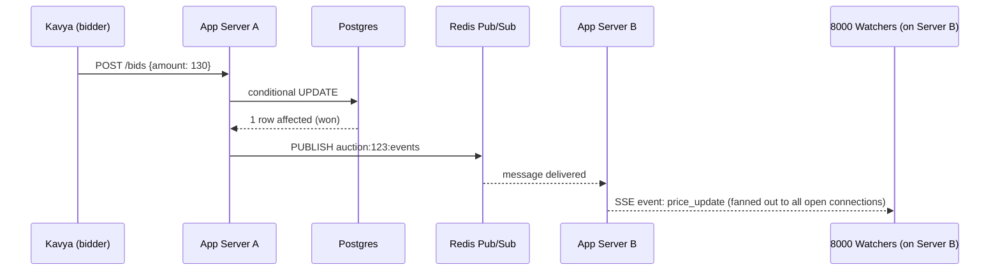

---

# Current State — After V1

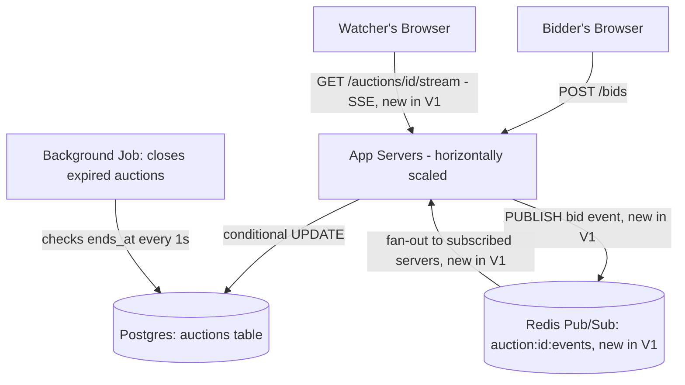

**Flows as of V1:**

1. **Bid write path (extended):** bidder submits a bid → app server issues the conditional `UPDATE` from V0 → if it won, app server also publishes the new price to `auction:{id}:events` on Redis so watchers get it immediately, in addition to returning the HTTP response to the bidder.
2. **Watch/read path (replaced):** watcher opens an SSE connection to `GET /auctions/{id}/stream` instead of polling; app server sends an initial snapshot, then pushes every subsequent price_update event as it's published to Redis. No more per-second polling.
3. **Auction close path:** unchanged from V0 — background job flips expired auctions to `closed`.

---

## Interviewer Follow-ups

**Q: What happens to a watcher's SSE connection if the app server handling it crashes?**
A: The client's `EventSource` automatically reconnects (that's built into the SSE spec), hits the load balancer, lands on a different app server, and that server resubscribes to the Redis channel and sends a fresh initial snapshot — so the watcher loses at most the events during the reconnect gap, and immediately catches up via the snapshot rather than needing replayed history.

**Q: Doesn't holding 8,000 open connections on one app server risk exhausting file descriptors or memory?**
A: Yes, and that's exactly why we need to think about how many watcher connections a single app server instance can hold before we need to shard watchers across more instances — but that's a capacity/scaling number, not a correctness problem, so it folds into the horizontal scaling version rather than needing its own fix here.

## Recap

| Concept | The Insight |
|---|---|
| Polling doesn't scale to fan-out | 8,000 watchers polling once a second is 8,000 QPS of near-useless reads; the system should push once instead of being asked 8,000 times. |
| SSE over WebSockets | Watchers only receive, never send, over this channel — full duplex is unneeded complexity when the write path is a separate REST call. |
| Redis Pub/Sub decouples publisher from subscriber servers | The app server that wins a bid doesn't need to know which servers hold which watchers — it publishes once, Redis fans out to every subscribed server. |
| No persistence in Pub/Sub | A reconnecting watcher can't "catch up" on missed events — it needs a snapshot query, because Pub/Sub messages that fire while nobody's listening are gone. |

**Interview-arc sentence:** *If asked how you push live price updates to thousands of watchers: polling means every client asks even when nothing changed, so switching watchers to an SSE stream fed by Redis Pub/Sub lets one bid event fan out to every connected watcher in milliseconds instead of up to a second late.*

Next up: the soft-close anti-sniping problem — a bid landing at the last possible millisecond needs to extend the clock, and that interacts badly with the fan-out we just built. That's V2.

---

Good feedback, thank you — I'll restructure "Solve It" to lead with the mechanism in plain language, and slow down when new infra shows up. Applying that now.

# V2 — Soft Close / Anti-Sniping

**Break it:** Arjun has been watching Priya's camera auction for an hour, planning to bid right at the end. At 5:59:59.900 — 100 milliseconds before the hard `ends_at` deadline — he submits a bid of $200, beating Kavya's $180. Kavya was actively watching the SSE stream and would have gladly bid $220, but by the time she sees the update and clicks "bid," the auction has already flipped to `closed`. She never had a chance to respond. This isn't a bug in our concurrency handling — V0 and V1 both work exactly as designed — but the *design itself* rewards whoever can time a bid closest to the deadline, which is precisely the sniping behavior eBay got famous for enabling.

## Solve It

Here's a short exchange that captures the first instinct:

> **Dev A:** "Easy — after we accept a bid, we just check if it's close to the deadline, and if so, push `ends_at` back a bit."
> **Dev B:** "As a separate query after the bid update?"
> **Dev A:** "Yeah, read `ends_at`, if it's within 30 seconds of now, update it to `now() + 30s`."
> **Dev B:** "What if two bids land in that same last second, on two different servers?"

That's the hole. If the extension check is a *second* database round trip after the price update, we've reintroduced exactly the read-modify-write race from V0 — just on the `ends_at` column instead of `current_price`. Two near-simultaneous bids could both read the old `ends_at`, both decide "yes, extend," and both write `now() + 30s` — which happens to be harmless *in this specific case* because the result is the same either way, but it's fragile: it only works by accident, because both writes happened to compute the same target time. If the two bids arrive even slightly apart, the second one's `now() + 30s` could actually be *earlier* than what the first one already set, and now we've accidentally shortened the auction instead of extending it.

The actual fix is to make the extension part of the *same* atomic statement as the price update — not a follow-up query — and make it monotonic, so it can never move backward. The mechanism: every time a bid successfully raises the price, the database also recomputes `ends_at` as "whichever is later: the current `ends_at`, or 30 seconds from right now." That single rule guarantees the deadline only ever moves forward, never back, no matter how many bids land in the closing window or in what order. It's the same idea as an auctioneer who says "going once, going twice" and restarts the countdown every time a new hand goes up — the hammer never falls while someone's still actively bidding, and it doesn't matter how many hands go up at once, the rule is just "reset the clock, every time."

✅ **What we gained:** a bid in the closing window structurally cannot be a "free win" — anyone watching gets a real window to respond, and the extension is race-proof because it's computed by the database in the same atomic step as the price check, not guessed at by the application afterward.

⚠️ **What we give up / new problem this creates:** an auction with sustained last-second bidding can now run indefinitely in theory — if bids keep landing every 25 seconds, the 30-second extension keeps re-triggering forever. We need a cap (say, extensions stop after N extensions, or after some absolute outer deadline) so a determined pair of bidders (or bots) can't hold an auction open all night. That's a small addition, not a new version — I'll fold it into the implementation below.

❌ **What we considered and rejected:**
- **Separate extension query after the price update** — the race condition just walked through; rejected because it only avoids corruption by coincidence, not by design.
- **Fixed extension window regardless of current `ends_at`** (always set `ends_at = bid_time + 30s`, no `GREATEST`) — breaks if a bid somehow arrives with a delayed timestamp (clock skew, retried request) and would *shorten* an already-extended auction. Monotonicity via `GREATEST` closes that off entirely.
- **Let the client-side extend the timer visually and reconcile later** — this is a client display trick, not a server-side guarantee. The actual close decision has to live in the one place that's authoritative: the database row.

## Implement It

The fix folds directly into V0's conditional `UPDATE` — no new statement, no new round trip:

```sql
UPDATE auctions
SET current_price = 200.00,
    current_winner_id = 42,
    ends_at = GREATEST(ends_at, now() + INTERVAL '30 seconds'),
    extension_count = extension_count + 1
WHERE id = 123
  AND status = 'active'
  AND now() < ends_at
  AND current_price < 200.00
  AND extension_count < 10   -- cap: stop extending after 10 extensions
RETURNING current_price, current_winner_id, ends_at;
```

New column on the existing `auctions` table: `extension_count INT NOT NULL DEFAULT 0` — this is the delta on a store that already exists, not a new store, so no new schema block needed.

1. **App Server** receives `POST /auctions/123/bids {bidder_id: 42, amount: 200.00}` — same endpoint as V0, no API change.
2. **App Server** issues the single statement above. Postgres evaluates `GREATEST(ends_at, now() + 30s)` and the `extension_count` cap *inside the same atomic write* that checks the price — so there's no window where two concurrent bids could each compute a different, conflicting `ends_at`.
3. **Branch on result**, same as V0: 1 row affected = bid won (and possibly extended the clock); 0 rows affected = lost the race, or the extension cap was hit and the auction is now unextendable and about to close for real.
4. If the bid won, **App Server** publishes to the existing `auction:123:events` Redis channel from V1 — now including the possibly-updated `ends_at` in the payload, so watchers' countdown timers reset in the same event that shows the new price:
   ```
   PUBLISH auction:123:events '{"current_price": 200.00, "current_winner_id": 42, "ends_at": "18:00:30", "extension_count": 1}'
   ```
5. **Watchers**, via the SSE connection from V1, receive this event and their client-side countdown UI resets to the new `ends_at` — no separate mechanism needed, this rides the same pipe.

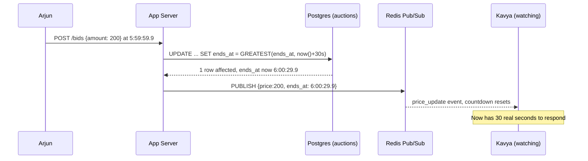

---

# Current State — After V2

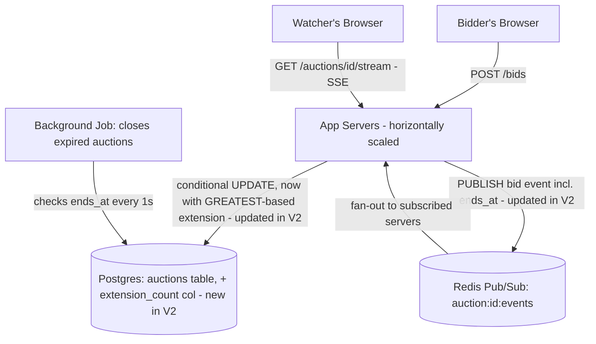

**Flows as of V2:**

1. **Bid write path (extended again):** bidder submits a bid → app server runs one atomic conditional `UPDATE` that checks price, checks the auction is still active, checks the extension cap, and — if all pass — extends `ends_at` monotonically via `GREATEST` in the same statement. 1 row affected = won (and possibly extended); 0 rows affected = lost or auction truly closing.
2. **Watch/read path:** unchanged mechanism from V1 (SSE fed by Redis Pub/Sub), but the event payload now always includes the current `ends_at`, so a countdown extension is visible to every watcher the instant it happens, not just the price.
3. **Auction close path:** unchanged in mechanism from V0 — background job flips `status='active'` rows to `closed` once `now() >= ends_at` — but `ends_at` itself is now a moving target during the closing window instead of fixed at auction creation.

---

## Interviewer Follow-ups

**Q: Why cap the number of extensions instead of capping the total elapsed extended time?**
A: Both are valid caps, but count-based is simpler to reason about and cheaper to check (`extension_count < 10` is one integer comparison), while a time-based cap would need to track and compare against the *original* `ends_at`, which we'd have to store separately since `ends_at` itself now mutates — it's solvable, but adds a column and a slightly more complex comparison for a marginal fairness improvement.

**Q: What if the extension cap is hit while a genuine flurry of legitimate bidding is happening — doesn't this end the auction against the seller's interest?**
A: That's a real product trade-off, not a bug — it's the same trade-off eBay makes: without *some* hard stop, a determined pair of bidders (or two bots) could theoretically keep an auction open indefinitely, so the cap trades a small amount of "maybe missed one more raise" for a guaranteed termination, and 10 extensions at 30 seconds each already gives 5 extra minutes of contested bidding, which covers the realistic sniping case.

## Recap

| Concept | The Insight |
|---|---|
| Sniping is a design flaw, not a concurrency bug | V0/V1 resolve races correctly but still let whoever bids last with zero reaction time "win" by design — the fix is a rule change, not a bug fix. |
| Fold the extension into the same atomic statement | A separate extension query reintroduces the exact read-modify-write race we fixed in V0, just on a different column. |
| `GREATEST()` makes extension monotonic | `ends_at` can only move forward, never back, no matter how many bids land simultaneously or in what order they're applied. |
| Cap the extensions | Without a hard ceiling, sustained last-second bidding could keep an auction open indefinitely — a count-based cap guarantees termination. |
| Fan-out payload grows, mechanism doesn't | Adding `ends_at` to the existing Redis Pub/Sub event required zero new infrastructure — same channel, same subscribers, richer payload. |

**Interview-arc sentence:** *If asked how you prevent bid sniping: a fixed deadline rewards whoever bids with zero reaction time left for anyone else, so extending the deadline monotonically inside the same atomic bid-update — capped at a fixed number of extensions — gives every late bidder a real chance to respond without letting the auction run forever.*

Next up: this system's crux — thousands of bidders hammering the *same row* on one viral auction in the closing seconds. Postgres row-level locking kept us correct, but does it keep us *fast* at that concurrency? That's V3.

---

# V3 — The Hot Row Under Load

**Break it:** It's 5:59:58 on Priya's camera auction, and it's gone properly viral — 8,000 people are watching, and maybe 500 of them are actively trying to bid in this final two seconds, each one bidding, getting a `409` because someone beat them, then immediately re-bidding higher. That's not 500 requests — that's several rounds of retry storms, easily 3,000-5,000 `UPDATE` attempts per second landing on that *one* Postgres row.

Here's the part that's easy to miss: even the *losing* `UPDATE`s aren't free. Postgres still has to acquire the row lock, evaluate the `WHERE` clause, discover it doesn't match, and release the lock — that's real work and a real lock-wait for every request queued up behind it, win or lose. At 4,000+ attempts/second serialized through one row's lock, requests start queueing for tens to hundreds of milliseconds each instead of single-digit milliseconds. Now here's the real trigger: Postgres has a hard cap on concurrent connections — commonly a few hundred. If enough app server threads are all stuck waiting on locks for *this one row*, they're holding *connections* open the whole time they wait. Once the connection pool fills up with requests queued behind Priya's camera, a completely unrelated auction — someone else's toaster — can't get a connection to process *its* bids either. One hot row has taken down bidding platform-wide.

## Solve It

Here's the instinct that seems reasonable at first:

> **Dev A:** "Connection pool's maxing out — let's just bump `max_connections` and the pool size way up."
> **Dev B:** "That buys us headroom, but does it actually fix the queueing? Postgres still only lets one writer touch that row at a time no matter how many connections exist."
> **Dev A:** "...right, more connections just means more requests *waiting in line*, not more of them being served at once."

That's the core issue: **this isn't a capacity problem, it's a serialization problem.** No matter how many app servers or connections you throw at it, exactly one write to Priya's camera row can happen at any instant — that's what correctness *requires*. The question isn't "how do we allow more concurrent writers to one row" (we structurally can't, and shouldn't want to), it's "how do we make each serialized decision so cheap that even thousands per second don't queue up."

That's exactly the shape of problem Redis is built for: it's single-threaded internally, which sounds like a limitation but is actually the point — every command runs to completion with no lock contention, no waiting on I/O mid-operation, because there's no other thread to contend with. A Postgres `UPDATE` round trip involves a lock wait, a WAL fsync for durability, and network overhead — each one costs low-single-digit milliseconds at best under contention. A Redis command run via a Lua script is fully in-memory and costs sub-millisecond, and because Lua scripts run atomically in Redis, we get the exact same "no read-modify-write gap" correctness guarantee as our Postgres conditional `UPDATE`, just roughly 1000x cheaper per operation. Redis can comfortably serialize 100,000+ such operations per second on modest hardware — the retry storm that was choking Postgres barely registers.

The trade this creates: Redis is in-memory, so if it crashes before a bid is durably saved somewhere else, that bid's state can vanish. We solve that by keeping Postgres as the durable source of truth, but taking it *out of the hot path* — Redis becomes the fast-path arbiter that decides who wins each bid instantly, and every winning bid is asynchronously written to Postgres afterward for durability, off the critical path of the bidder's response.

✅ **What we gained:** the bid race is now resolved in-memory, sub-millisecond, with no lock queueing — a viral auction's retry storm no longer threatens connection pool exhaustion for unrelated auctions, because Postgres isn't in the loop for every single bid attempt anymore.

⚠️ **What we give up / new problem this creates:** Redis is now briefly the sole authoritative copy of "who's winning this auction" between a bid landing and it being persisted to Postgres — if Redis loses that data before the async write lands, we could lose track of the true winner. We need Redis persistence (AOF) and a durable async write path (not just "fire and forget") to close that gap, which I'll build into the implementation below.

❌ **What we considered and rejected:**
- **Just increase Postgres connection pool / `max_connections`:** the dialogue above — doesn't address serialization, just delays the queue backing up, and a bigger queue under sustained load still queues, just later and bigger.
- **Shard the `auctions` table by auction ID:** sharding spreads *different* auctions across different DB nodes, which helps if the load is spread across many auctions — it does nothing for *one* viral auction, because all 4,000 attempts/sec are for the *same* row regardless of which shard it lives on. Wrong tool for a single hot key.
- **In-process single-threaded queue per auction on the app server (actor model):** this actually shares the "serialize cheaply" idea with the Redis fix, but it only works if all bids for one auction route to the *same app server instance* — which means we'd need sticky routing by auction ID, adding a routing layer, and it doesn't survive that instance crashing without extra replication work. Redis gives us the same serialization property without the sticky-routing constraint, since any app server can talk to the same Redis instance.

## Implement It

**New store shape: a Redis hash per auction**, holding the fields the Lua script needs to check atomically.

```
Key: auction:123:state
Fields: current_price, current_winner_id, ends_at (unix ms), extension_count, status
```

This lives in the same Redis deployment already used for Pub/Sub in V1 — same infrastructure, new key pattern, not a new technology class.

**The atomic bid-arbitration script**, run via `EVAL` (Lua scripts execute atomically in Redis — no other command interleaves mid-script):

```lua
-- KEYS[1] = "auction:123:state"
-- ARGV[1] = new bid amount, ARGV[2] = bidder_id, ARGV[3] = now_ms, ARGV[4] = extension_ms, ARGV[5] = max_extensions

local price = tonumber(redis.call('HGET', KEYS[1], 'current_price'))
local ends_at = tonumber(redis.call('HGET', KEYS[1], 'ends_at'))
local ext_count = tonumber(redis.call('HGET', KEYS[1], 'extension_count'))
local now = tonumber(ARGV[3])
local bid = tonumber(ARGV[1])

if now >= ends_at then
  return {"LOST", "closed"}
end
if bid <= price then
  return {"LOST", "outbid", price}
end

local new_ends_at = ends_at
if (ends_at - now) < tonumber(ARGV[4]) and ext_count < tonumber(ARGV[5]) then
  new_ends_at = now + tonumber(ARGV[4])
  ext_count = ext_count + 1
end

redis.call('HSET', KEYS[1], 'current_price', bid, 'current_winner_id', ARGV[2],
           'ends_at', new_ends_at, 'extension_count', ext_count)
return {"WON", bid, ARGV[2], new_ends_at, ext_count}
```

This is the same logic as V2's Postgres `UPDATE` — price check, deadline check, monotonic extension via a max instead of `GREATEST` — just expressed as an atomic Redis script instead of an atomic SQL statement.

**Revised write path:**

1. **App Server** receives `POST /auctions/123/bids` — same API as before.
2. **App Server** calls `EVAL` with the Lua script above against `auction:123:state` in Redis, not Postgres. This is now the hot-path decision — sub-millisecond, no lock queueing.
3. **Branch on result:** `"WON"` → app server returns `200` to the bidder immediately. `"LOST"` → app server returns `409` with the current price, same as before.
4. If `"WON"`, **App Server** does two things, both off the bidder's critical path (they've already gotten their `200`):
   - Publishes to the existing `auction:123:events` Redis Pub/Sub channel from V1 (unchanged mechanism).
   - Asynchronously writes the winning bid to Postgres for durability: `INSERT INTO bid_log (auction_id, bidder_id, amount, ts) VALUES (123, 42, 200.00, now())`, and updates the `auctions` row's `current_price`/`current_winner_id`/`ends_at` to match. This can be a fire-and-forget call from the app server, or routed through a small durable queue (Kafka topic `bid-events`) so a transient Postgres blip doesn't silently drop the write — given you've built exactly this write-behind pattern in the payment system session, I'd reuse that shape here rather than reinvent it.

**Who writes / who reads:**

| Actor | Touches |
|---|---|
| App Server (on every bid attempt) | Runs the Lua `EVAL` against `auction:{id}:state` in Redis — this is now the source of truth for "who's winning right now" |
| App Server (async, after a win) | Writes to Postgres `auctions` (updated) and `bid_log` (new, append-only audit trail) for durability |
| Redis (durability) | AOF (append-only file) enabled, so a Redis restart replays recent writes instead of losing them |

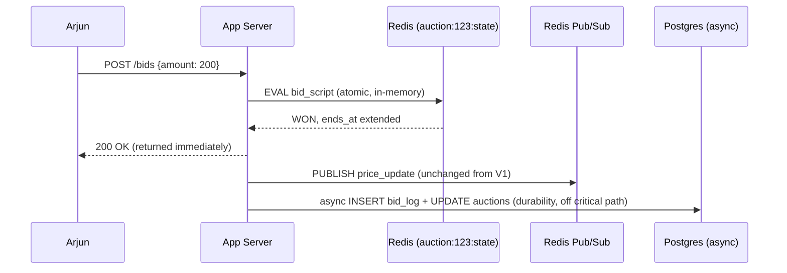

---

# Current State — After V3

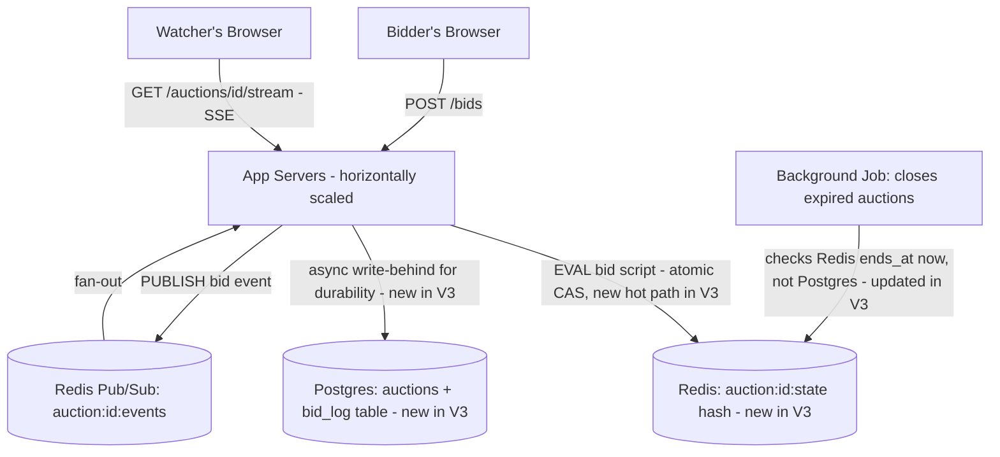

**Flows as of V3:**

1. **Bid write path (replaced):** bidder submits a bid → app server runs an atomic Lua script (`EVAL`) against the auction's Redis hash, which checks price, deadline, and extension cap, and updates all three atomically in-memory. Bidder gets `200`/`409` based on the script's result, sub-millisecond, with Postgres entirely off this critical path.
2. **Durability path (new):** after a winning bid, the app server asynchronously persists the new state to Postgres (`auctions` row update) and appends to a new `bid_log` audit table — this is fire-and-forget from the bidder's perspective, purely for durability and historical record.
3. **Watch/read path:** unchanged from V1/V2 — SSE fed by Redis Pub/Sub, now triggered by the Lua script's result instead of a Postgres `UPDATE`'s result.
4. **Auction close path (updated):** the background closer now checks `ends_at` in Redis (the authoritative live copy), not Postgres, since Redis is ahead of Postgres by design during the async write-behind window.

---

## Interviewer Follow-ups

**Q: If Redis is now the source of truth for who's winning, what happens if Redis crashes mid-auction?**
A: With AOF enabled, Redis replays its append-only log on restart and recovers the last known state with sub-second data loss at worst; for the auction platform overall we'd also run Redis with a replica for failover, so a primary crash promotes a replica that already has the state rather than starting from empty.

**Q: Why not just skip Postgres entirely and make Redis the permanent source of truth?**
A: Redis is excellent for hot, ephemeral, high-throughput state, but it's not built as the durable system of record you'd want for financial/audit purposes — every bid needs to survive infrastructure failures, support disputes, and feed into settlement systems, and Postgres with `bid_log` gives us that permanent, queryable audit trail that Redis isn't designed to be.

## Recap

| Concept | The Insight |
|---|---|
| More connections doesn't fix serialization | A bigger connection pool just delays queueing, since exactly one writer can still touch a hot row at a time — the fix is making that one operation cheaper, not adding more waiters. |
| Redis is single-threaded by design, not despite it | No lock contention because there's no concurrent thread to contend with — every command is atomic by construction, which is exactly the property a bid race needs. |
| Sharding doesn't help a single hot key | Sharding spreads different auctions across nodes; it does nothing when all the load is on one specific auction's row regardless of which shard it's on. |
| Write-behind decouples hot path from durability | The bidder gets their answer from Redis in under a millisecond; Postgres catches up asynchronously, trading "instant durability" for "instant response," which is the right trade for a UX-critical write. |

**Interview-arc sentence:** *If asked how you handle a single auction getting hammered by thousands of bids per second: a relational row can only serialize one writer at a time regardless of connection pool size, so moving the hot-path bid arbitration into an atomic in-memory Redis script — and writing to Postgres asynchronously afterward for durability — turns a lock-contention bottleneck into a sub-millisecond decision.*

Next up: this fixes one *hot* auction, but what about the platform running thousands of *concurrent* auctions at once — that's where sharding and horizontal scaling of the app tier actually earn their keep. That's V4.

---

now we have two source of truths for bids right? redis and postgres? how can we make sure they're consistent and correct?

---

Great catch — this is exactly the kind of gap an interviewer will press on. Let's break it properly.

**Break it:** Kavya bids $200 and wins the Lua script in Redis. Her `200 OK` goes out immediately. But before the app server's async write-behind call to Postgres fires, that app server instance gets OOM-killed by Kubernetes. Redis now says Kavya is winning at $200. Postgres still shows the *previous* bid, $180, from someone else. Two sources of truth, genuinely disagreeing, and nothing is coming to reconcile them — the async write just silently never happened.

There's a second, sneakier version of this same problem: suppose two different app servers each win a bid on the same auction back-to-back — bid A ($180→$190) on Server 1, then almost immediately bid B ($190→$210) on Server 2. Both fire their async Postgres writes independently. If Server 1's write is slow (network blip, GC pause) and lands *after* Server 2's write, Postgres ends up showing $190 as "current" even though $210 actually happened later and is the real state. That's not a crash — that's just ordinary network reordering — and it silently corrupts the historical record with no error anywhere.

So there are really two separate failure modes hiding in "two sources of truth": **writes that never arrive**, and **writes that arrive out of order**. They need two different fixes.

## Fix 1: writes that never arrive — make the event durable *before* the app server can drop it

The root problem is that the win event only exists in the app server's memory, briefly, between the Lua script returning and the Postgres call succeeding. If the app server dies in that gap, the event is gone — Redis has already moved on to the *next* state, so even a reconciliation job comparing "Redis now" to "Postgres now" wouldn't necessarily catch that a specific historical event was skipped, it would just see a jump.

The fix: make the event durable in the *same atomic step* as the state update, so there's no gap between "the bid won" and "the event exists somewhere durable." Redis Streams are built exactly for this — an `XADD` inside the same Lua script that does the `HSET` means the win event is persisted (with AOF) at the exact instant the bid wins, with zero dependency on the app server surviving long enough to make a second network call.

```lua
-- inside the same Lua script from V3, after computing WON:
redis.call('HSET', KEYS[1], 'current_price', bid, 'current_winner_id', ARGV[2],
           'ends_at', new_ends_at, 'extension_count', ext_count)
local seq = redis.call('INCR', 'auction:123:seq')
redis.call('XADD', 'auction:123:bid_stream', '*', 'seq', seq, 'price', bid,
           'bidder_id', ARGV[2], 'ends_at', new_ends_at)
return {"WON", bid, ARGV[2], new_ends_at, seq}
```

Now a **separate consumer** — not the request-handling app server, so it doesn't matter which one crashed — reads `auction:123:bid_stream` using a Redis consumer group and writes each event to Postgres, acknowledging (`XACK`) only after the Postgres write succeeds. If a consumer crashes mid-processing, the event is still sitting unacknowledged in the stream, and Redis will redeliver it to another consumer. Nothing is lost, because durability no longer depends on any single app server's uptime.

## Fix 2: writes that arrive out of order — make the Postgres write a CAS, keyed by the sequence number

The `seq` field from `INCR` above is the piece that fixes reordering. It's a strictly increasing integer per auction, assigned atomically inside the same script that decided the bid won — so it's a reliable "this happened before that" marker, independent of which app server processed it or when the network happened to deliver it.

The Postgres consumer doesn't blindly `UPDATE`. It applies the same conditional-write pattern from V0 and V2, just using `seq` instead of price as the guard:

```sql
UPDATE auctions
SET current_price = 210.00,
    current_winner_id = 7,
    ends_at = '18:00:45',
    last_applied_seq = 14
WHERE id = 123
  AND last_applied_seq < 14;
```

If event 14 (the $210 bid) happens to arrive before event 13 got applied, that's fine — 13 arriving late will simply fail its own `last_applied_seq < 13` check once it shows up, since 14 already moved the counter past it, and gets discarded as stale. Out-of-order delivery can no longer corrupt the record, because Postgres always keeps whichever event has the highest sequence number, regardless of arrival order. The `bid_log` insert (the audit trail) doesn't need this guard — every event gets appended there regardless of order, since it's a log, not current state, and order doesn't matter for an audit trail the way it does for "what's the current price."

## The safety net: reconciliation at auction close

Even with both fixes, I wouldn't trust Postgres blindly at settlement time — I'd treat Redis as authoritative right up until close, since it's where every bid actually gets adjudicated. When an auction closes, the settlement job compares `last_applied_seq` in Postgres against the current value of `auction:123:seq` in Redis. If they match, Postgres is caught up and settlement proceeds from Postgres. If there's a gap, the job replays the remaining entries directly from `auction:123:bid_stream` (which still has them, since Redis Streams retain history unlike Pub/Sub) before finalizing the winner — so a slow consumer never causes the wrong person to be declared the winner, it just delays settlement by however long the replay takes.

| Failure mode | Fix | Why it works |
|---|---|---|
| App server crashes after Redis write, before Postgres write | `XADD` inside the same Lua script as `HSET` | Durability no longer depends on the app server surviving a second network call |
| Two async writes arrive at Postgres out of order | Sequence number + conditional `UPDATE ... WHERE last_applied_seq < :seq` | Postgres always keeps the highest-sequence write, regardless of arrival order |
| Consumer lags behind at the moment of auction close | Compare `last_applied_seq` vs. Redis's `seq` counter, replay from the stream if behind | Settlement is never finalized on stale data, even under consumer lag |

One thing worth naming explicitly: this means Redis, not Postgres, is the actual source of truth for "what happened, in what order" — Postgres is a durable *projection* of that stream, built for querying, auditing, and surviving a full Redis loss, not a second independent authority that could legitimately disagree. That framing is what resolves the "two sources of truth" discomfort — there's really one source of truth (the Redis stream) and one durable replica of it, kept in sync by sequence-guarded, idempotent writes.

Want me to fold this into V3's "Current State" as a V3.1-style hardening pass with its own diagram, or move on to V4 (many concurrent auctions / sharding) now that this is settled?

---

# V3.1 — Durable, Ordered Write-Behind (hardening V3)

**Break it:** covered above — two concrete failure modes. First: an app server crashes in the gap between winning a bid in Redis and firing its async Postgres write, silently losing that event with no error anywhere. Second: two winning bids on the same auction, processed by different app servers, can have their Postgres writes arrive out of order due to ordinary network jitter — leaving Postgres showing an older price as "current" even though a newer, higher bid actually happened after it.

## Solve It

The root cause of both failures is the same: the win event only exists in an app server's memory for the brief window between the Lua script returning and a second, separate network call to Postgres succeeding. Anything that can go wrong in that window — a crash, a slow network, a reordered delivery — turns into silent data loss or corruption, because nothing durable remembers the event happened until that second call lands.

The fix is to stop treating "the bid won" and "the event is durably recorded" as two separate steps done by two different actors. Instead, record the event durably in the *exact same atomic operation* that decides the bid won — using Redis Streams (`XADD`), which behaves like a durable, ordered, append-only log rather than the fire-and-forget behavior of Pub/Sub from V1. Then hand off delivery to Postgres to a dedicated consumer group that reads this log at its own pace, acknowledging each event only once it's safely written — so it doesn't matter which app server (if any) is still alive by the time that write happens. A strictly increasing per-auction sequence number, assigned in that same atomic step, is what lets Postgres safely apply events even if they arrive out of order — it always keeps whichever event has the highest sequence number and discards anything older as stale, which is the same "conditional write wins" pattern from V0, just guarded by `seq` instead of price.

✅ **What we gained:** the event's durability no longer depends on any single app server surviving long enough to make a second network call — it's durable the instant the bid wins, inside Redis's own AOF. Out-of-order delivery from independent app servers can no longer corrupt Postgres's view of "current state," because the sequence guard always keeps the newest event. And because Redis Streams retain history (unlike Pub/Sub), a lagging consumer can always catch up by replay instead of having missed messages be gone forever.

⚠️ **What we give up / new problem this creates:** we now have a consumer group to operate — something has to run continuously, track its position in the stream, and handle its own crashes and restarts without double-processing or dropping events. That's a small new operational surface (any consumer group needs monitoring for lag), but it's a well-understood pattern, not a new correctness risk, since idempotent, sequence-guarded writes make redelivery safe even if a crashed consumer's in-flight message gets redelivered to another one.

❌ **What we considered and rejected:**
- **Two-phase commit between Redis and Postgres:** would give strict atomicity across both stores, but 2PC is slow, adds a coordinator as a new single point of failure, and blocks the hot bidding path on a cross-store protocol — completely undoing the sub-millisecond win from V3 for a guarantee we can get more cheaply with sequence numbers.
- **Just retry the async Postgres write on failure, no stream:** doesn't fix reordering — retries can still land in a different order than they were issued, and a crashed app server can't retry anything, it's gone. Solves neither failure mode.
- **Make the bidder's response wait for the Postgres write to succeed:** trivially correct, but reintroduces exactly the multi-millisecond latency on the hot path that V3 existed to eliminate — this is the same trade we already rejected once.

## Implement It

**Redis Streams entry, per winning bid** — added inside the existing Lua script from V3, same atomic execution as the `HSET`:

```lua
-- ...after computing WON and updating the hash (unchanged from V3):
redis.call('HSET', KEYS[1], 'current_price', bid, 'current_winner_id', ARGV[2],
           'ends_at', new_ends_at, 'extension_count', ext_count)
local seq = redis.call('INCR', 'auction:123:seq')
redis.call('XADD', 'auction:123:bid_stream', '*',
           'seq', seq, 'price', bid, 'bidder_id', ARGV[2], 'ends_at', new_ends_at)
return {"WON", bid, ARGV[2], new_ends_at, seq}
```

**New store: `auction:{id}:bid_stream`** (Redis Stream, durable via AOF, same Redis deployment as everything else in V1–V3 — no new technology class, just a different Redis data structure). A **Postgres-writer consumer group** (a small pool of worker processes, separate from the request-serving app servers) reads this stream:

1. Consumer calls `XREADGROUP GROUP pg_writers consumer_1 COUNT 10 STREAMS auction:123:bid_stream >` to pull unacknowledged events.
2. For each event, consumer runs the sequence-guarded conditional `UPDATE`:
   ```sql
   UPDATE auctions
   SET current_price = 210.00, current_winner_id = 7,
       ends_at = '18:00:45', last_applied_seq = 14
   WHERE id = 123 AND last_applied_seq < 14;
   ```
   plus an unconditional append to the `bid_log` audit table (order doesn't matter for a log, so no guard needed there).
3. Only after the Postgres write succeeds does the consumer call `XACK` on that event. If the consumer crashes before acking, the event stays pending and Redis redelivers it to another consumer in the group — safe to reapply, since the `last_applied_seq` guard makes the Postgres write idempotent.

**New column on `auctions`:** `last_applied_seq BIGINT NOT NULL DEFAULT 0` — delta on the existing table, not a new schema.

**Auction-close reconciliation:** when the background closer (from V0) flips an auction to `closed`, it also compares Postgres's `last_applied_seq` against the live value of `auction:123:seq` in Redis. Equal → Postgres is caught up, settlement reads from Postgres. Behind → settlement job replays the remaining entries directly from `auction:123:bid_stream` before finalizing the winner, since the stream still has them.

**Who writes / who reads:**

| Actor | Touches |
|---|---|
| App Server (Lua script, on every winning bid) | `XADD`s to `auction:{id}:bid_stream` — same atomic step as the price update |
| Postgres-writer consumer group (new component) | Reads the stream, applies sequence-guarded writes to `auctions` + `bid_log`, acks only on success |
| Auction-close job | Compares `last_applied_seq` vs. Redis `seq`, replays from the stream on any gap before finalizing a winner |

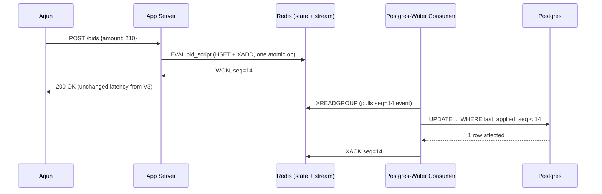

---

# Current State — After V3.1

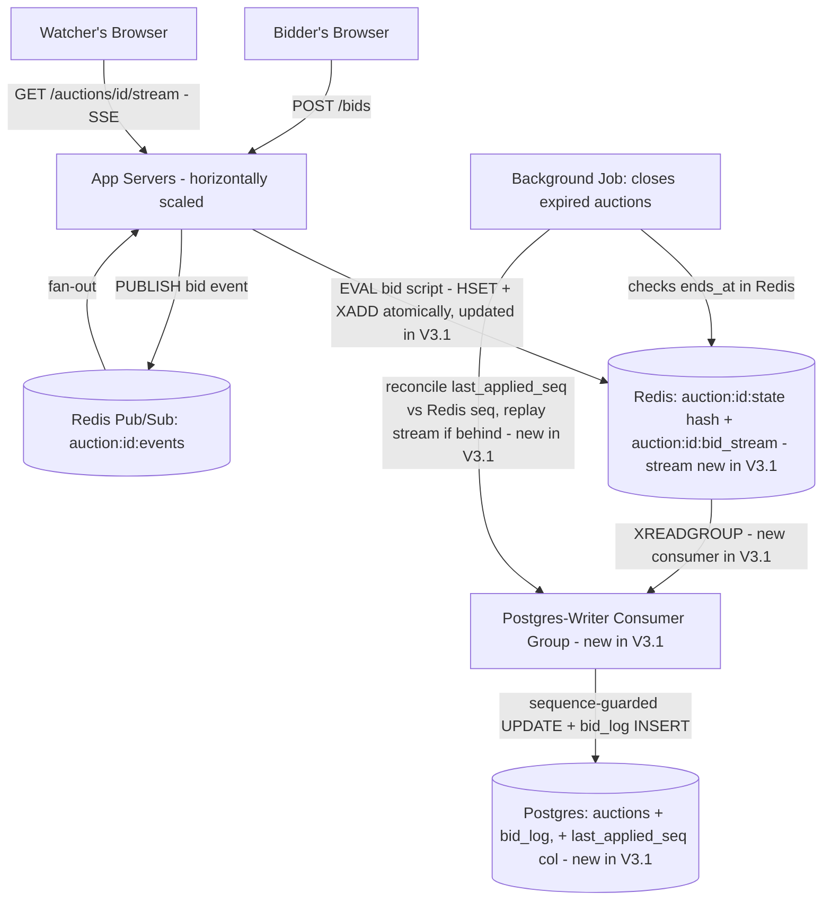

**Flows as of V3.1:**

1. **Bid write path (updated):** bidder submits a bid → app server runs the Lua script against Redis, which atomically checks price/deadline/extension cap, updates the state hash, *and* appends a durable, sequenced event to the bid stream — all in one atomic operation. Bidder gets `200`/`409` immediately, same latency as V3.
2. **Durability path (replaced):** instead of an app-server-driven fire-and-forget write, a dedicated Postgres-writer consumer group reads the bid stream, applies each event to Postgres guarded by a strictly increasing sequence number, and acknowledges only after the write succeeds — crash-safe and reorder-safe.
3. **Watch/read path:** unchanged from V1/V2 — SSE fed by Redis Pub/Sub.
4. **Auction close path (updated):** background closer flips status in Redis as before, and now also reconciles Postgres against Redis's sequence counter, replaying any gap from the stream before settlement finalizes a winner.

---

## Interviewer Follow-ups

**Q: Why not just make the consumer group synchronous — have the app server wait for the stream write to be acked before responding to the bidder?**
A: That would reintroduce the latency we eliminated in V3 for no benefit — the bidder doesn't need to know Postgres is caught up, they need to know they won the bid, which the Lua script already guarantees the instant it returns; durability catching up asynchronously is invisible to the user as long as reconciliation happens before settlement.

**Q: What if the entire consumer group is down for an extended period — does bidding stop?**
A: No — bidding is entirely served by Redis and is unaffected by the consumer group's health, since the consumer is a downstream reader, not a dependency of the hot path; the only consequence of an extended outage is a growing backlog in the stream, which is bounded by Redis Streams retention and gets caught up (or replayed at auction close) once the consumer group recovers.

## Recap

| Concept | The Insight |
|---|---|
| Two-step "decide then persist" has a gap | Anything that can happen in the gap between deciding a bid won and a second network call succeeding turns into silent loss — collapse it into one atomic step instead. |
| Redis Streams vs. Pub/Sub | Pub/Sub (V1) is fire-and-forget with no history; Streams persist and support consumer groups with acknowledgment, which is what durability actually requires. |
| Sequence number, not arrival order, defines "current" | A strictly increasing per-auction counter assigned atomically at write time lets Postgres always keep the truly latest event, regardless of network reordering. |
| Consumer groups make delivery crash-safe | An unacknowledged event gets redelivered to a different consumer, and the sequence guard makes reapplying it safe — no double-processing risk. |
| Redis is the real source of truth; Postgres is a durable projection | Framing it this way resolves the "two sources of truth" tension — there's one authority (the ordered stream) and one synced, queryable replica of it. |

**Interview-arc sentence:** *If asked how you keep Redis and Postgres consistent for bid state: writing to Postgres as a second, separate network call after Redis leaves a gap where a crash or reordering causes silent loss or corruption, so appending a sequenced event to a Redis Stream in the same atomic step as the bid decision — then applying it to Postgres through a sequence-guarded, acknowledgment-based consumer — makes durability crash-safe and reorder-safe without slowing down the bidder's response.*

Next up: V4 — scaling to many concurrent auctions across the whole platform, where sharding and horizontal scaling actually earn their keep.

---

# V4 — Scaling the App Tier Horizontally

**Break it:** Priya's single viral camera auction is one thing — V3 handled that. But it's a Tuesday evening and the platform is running 5,000 concurrent auctions across every category, each with a handful to a few hundred active watchers. Aggregate load: roughly 50,000 open SSE connections platform-wide, plus a steady 8,000 bids/sec spread across all of them. Three app servers are handling this today.

Each app server holds one SSE connection open per watcher it's serving — that's a real, per-connection file descriptor and a chunk of memory for buffering, sitting in that specific process for as long as the watcher's browser tab is open. At roughly 12,000 concurrent connections per server (a realistic ceiling before file-descriptor limits and per-connection memory overhead start causing problems), three servers cap out around 36,000 connections total — we're already short of the 50,000 we need tonight, and it's not even a weekend sale event yet. Beyond the raw connection ceiling, each server is also spending CPU cycles serializing and pushing SSE frames to every one of its connections whenever a Pub/Sub message arrives — that cost scales with connections held, not with bids placed, so a server near its connection ceiling is also close to its CPU ceiling for this specific kind of work.

The fix seems obvious — "just add more app servers" — but before doing that, it's worth naming exactly what state, if any, would break that plan. Here's the useful check: **can any of these servers be killed and replaced without losing correctness or losing a user's session?** For the bidding path, yes — the app server holding a request doesn't store anything about the auction itself; the Lua script in Redis is the actual arbiter, so any server can handle any bid for any auction. For the watch path, the SSE connection itself is tied to one specific server (that's just what a persistent connection is), but which server a watcher lands on doesn't matter, because V1 already made every server subscribe to Redis Pub/Sub and forward to its own connections — no server needs to know anything the others don't. So the good news: nothing here requires new work to *make* state external — V1 and V3 already did that. This version is really about *how many* servers, and how traffic gets routed to them.

## Solve It

The mechanism is straightforward once you see that app servers are already stateless with respect to auction data: put a load balancer in front of a pool of identical app servers, and let the pool size grow or shrink based on load. The interesting decision isn't "should we horizontally scale" — that's already unlocked — it's **how the load balancer decides which server gets the next connection**, because that choice matters differently for the two traffic types this system has.

For short-lived bid requests (a `POST` that completes in milliseconds), round-robin or least-outstanding-requests both work fine — the requests are so brief that even a mediocre distribution algorithm evens out over a few seconds. For SSE connections, though, round-robin is actively wrong: it distributes *new* connections evenly, but says nothing about how many *existing* long-lived connections each server is already holding. If server A has been up longer and is already holding 11,000 watchers, round-robin will happily send it a 12,000th, tipping it over its ceiling, while a freshly-added server D sits at zero. The right algorithm here is **least-connections** — route each new SSE connection to whichever healthy server currently holds the fewest open connections — because for a workload defined by long-lived state per server, connection count *is* the real signal of how loaded a server actually is, not request rate.

✅ **What we gained:** the platform can absorb aggregate load — many auctions running concurrently — by adding app server instances, with no ceiling from a single server's connection or CPU limits, because no auction-specific state lives on any one server that would need to be migrated or replicated when instances come and go.

⚠️ **What we give up / what new problem this creates:** every app server now needs to subscribe to Redis Pub/Sub channels for *whichever* auctions its currently-connected watchers care about, dynamically, as connections come and go — that's a small bookkeeping cost per server (subscribe on new watcher, unsubscribe when the last watcher for that auction on this server disconnects), not a correctness risk, but it's real state to manage per instance. Also, health checks and graceful shutdown now matter more: killing a server that's holding 10,000 SSE connections needs to gracefully close those connections (triggering client reconnect) rather than dropping them mid-flight, or we get a thundering herd of reconnects at once.

❌ **What we considered and rejected:**
- **Sticky sessions (route a given user to the same server every time, via cookie or IP hash):** unnecessary here — since no per-user state lives on the app server (it's all in Redis/Postgres), there's nothing to "stick" to, and sticky sessions would actually hurt us by making least-connections balancing impossible to honor.
- **Round-robin for SSE connections:** the failure case above — ignores existing connection load per server, which is exactly the wrong blind spot for long-lived connections.
- **Vertical scaling (bigger app server boxes instead of more of them):** buys some headroom, but hits a hard ceiling (there's a biggest box you can buy) and creates a single larger blast radius if that one box goes down — doesn't fit a workload that's fundamentally about many independent watchers, which parallelizes naturally across boxes.

## Implement It

**Load balancer configuration** (e.g., an AWS ALB or equivalent, in front of the app server pool):

```
Listener: HTTPS :443
Target group: app-servers (auto-scaling group)
Routing algorithm: least_outstanding_requests   -- for POST /bids (short-lived)
Sticky sessions: disabled
Health check: GET /health every 10s, 2 consecutive failures = unhealthy
Connection draining timeout: 30s  -- lets in-flight SSE connections close gracefully
```

For the SSE endpoint specifically (`GET /auctions/{id}/stream`), if the load balancer's algorithm options don't distinguish by path, this is typically handled by routing SSE traffic through a separate target group with `least_connections` as its algorithm, since that's the metric that actually reflects load for persistent connections — most cloud load balancers support per-path routing rules to send these two traffic types to different target group configs even though both hit the same server pool.

**Auto-scaling policy**, triggered on the metric that actually predicts trouble for this workload:

```
Scale-out trigger: avg(open_sse_connections_per_instance) > 9000  OR  avg(cpu) > 70%
Scale-in trigger: avg(open_sse_connections_per_instance) < 4000  AND  avg(cpu) < 30%, sustained 5 min
Min instances: 3
Max instances: 40
Cooldown: 60s between scaling actions
```

**Graceful shutdown**, when an instance is scaled in or replaced:
1. Instance is marked unhealthy / deregistered from the target group — load balancer stops sending it *new* connections immediately.
2. Instance sends an SSE event to each of its currently-open connections telling clients to reconnect: `event: reconnect\ndata: {}`.
3. Client's `EventSource` reconnects (built into the SSE spec, as noted back in V1), lands on a different, healthy instance via the load balancer.
4. Old instance waits out the connection-draining timeout (30s) for stragglers, then terminates.

**Per-instance Pub/Sub subscription bookkeeping** (delta on V1's mechanism, not a new mechanism):
- On a new SSE connection for auction `123`: if this instance has no existing watcher for `123`, `SUBSCRIBE auction:123:events`. If it already has at least one, no new subscribe needed — the message will be forwarded to all local connections for that auction from the existing subscription.
- On a watcher disconnecting: decrement a local in-memory counter for that auction; if it hits zero, `UNSUBSCRIBE auction:123:events`, since this instance has nobody left to forward to.

---

# Current State — After V4

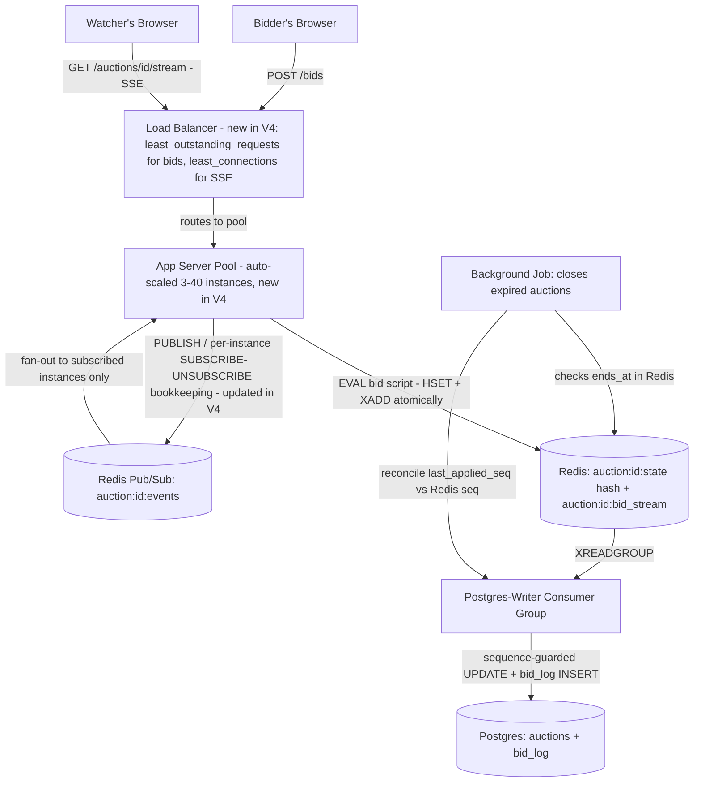

**Flows as of V4:**

1. **Bid write path:** unchanged mechanism from V3.1 — bidder submits a bid, load balancer routes it to any healthy app server instance (doesn't matter which, since bidding logic is fully stateless at the app layer), that instance runs the Lua script against Redis.
2. **Watch/read path (updated):** watcher opens an SSE connection, load balancer routes it via least-connections to whichever instance currently holds the fewest open connections; that instance subscribes to the relevant Redis Pub/Sub channel only if it doesn't already have a local subscription for that auction, then forwards events to its own connections as before.
3. **Durability path:** unchanged from V3.1 — Postgres-writer consumer group reads the bid stream, applies sequence-guarded writes.
4. **Auction close path:** unchanged from V3.1.
5. **Scaling path (new):** app server pool grows or shrinks based on connection count and CPU, with graceful shutdown ensuring watchers reconnect elsewhere rather than getting dropped when an instance is removed.

---

## Interviewer Follow-ups

**Q: Doesn't per-instance subscribe/unsubscribe bookkeeping risk a race — two watchers for the same auction connecting and disconnecting on one instance at nearly the same time?**
A: The local counter only needs to answer "is it zero or not," and standard atomic increment/decrement on an in-memory counter (or a `sync.Map`-style structure) handles that safely within one process; the only real risk is a brief redundant `SUBSCRIBE` call if two connects race, which is harmless and idempotent — Redis just treats a second subscribe to the same channel from the same client as a no-op.

**Q: Why not just always keep every app server subscribed to every auction's channel, and skip the bookkeeping entirely?**
A: That works at small scale, but with thousands of concurrent auctions, every instance maintaining thousands of Pub/Sub subscriptions it's not actually using wastes memory and adds needless message-filtering overhead — the bookkeeping cost is small and keeps each instance's subscription set proportional to what it's actually serving.

## Recap

| Concept | The Insight |
|---|---|
| Check for local state before assuming scale-out is free | The right question isn't "can we add servers," it's "what state currently lives on one server that breaks if we do" — here, only SSE connections do, and even those don't need cross-server coordination thanks to V1's Pub/Sub design. |
| Least-connections vs. round-robin for long-lived connections | Round-robin balances *arrival rate* of new connections; least-connections balances *existing load*, which is what actually matters when connections persist for minutes or hours. |
| Graceful shutdown prevents thundering herds | Dropping 10,000 SSE connections at once sends 10,000 simultaneous reconnect attempts; telling clients to reconnect proactively and draining lets that redistribute smoothly instead. |
| Scaling metric should reflect the actual bottleneck | CPU alone doesn't capture SSE connection-holding cost well; scaling on connection count per instance catches the real ceiling this workload hits first. |

**Interview-arc sentence:** *If asked how you scale the app tier for many concurrent auctions: because bid arbitration lives in Redis and watcher fan-out already flows through Pub/Sub, app servers hold no auction-specific state except the SSE connections themselves, so horizontally scaling behind a least-connections load balancer — with graceful shutdown to avoid a reconnect storm — absorbs aggregate platform load with no per-server ceiling.*

Next up: the app tier scales, but Redis and Postgres are each still a single node handling *every* auction platform-wide — at some traffic level, that single node becomes the new bottleneck. That's V5: sharding.


----

can you talk a bit more on this booking thing. why we need it. what it solves. how it solves etc.
does all the servers subscribe to that action channel or only few. how and who. decides this etc.

----

Good question to slow down on — I glossed over this in one line and it deserves the full treatment.

**The naive default, and why it breaks:** imagine we skipped the bookkeeping entirely and just had every app server instance subscribe to every auction's channel that exists, all the time. With 40 app server instances and 5,000 concurrent auctions, that's 40 servers × 5,000 channels of standing subscriptions — Redis has to maintain that entire subscriber list internally, and every single `PUBLISH` (all 8,000 bids/sec, spread across those 5,000 auctions) gets delivered to all 40 servers, regardless of whether that server has a single watcher interested in that particular auction.

Here's the concrete waste: Priya's camera auction has 8,000 watchers spread across all 40 servers — fine, every server *does* need that event there. But a niche stamp-collection auction with exactly 3 watchers, all of whom happen to be connected to server A? Under "subscribe to everything," all 40 servers still receive every bid event for that stamp auction, even though 39 of them have zero watchers who care. Multiply that pattern across 5,000 mostly-quiet auctions, and you get roughly 8,000 × 40 = 320,000 message deliveries per second platform-wide, when the *actual* useful deliveries — messages that land on a server holding a real watcher — are a small fraction of that. It's not a correctness bug, it's pure waste: CPU spent deserializing and immediately discarding messages, and Redis-side bookkeeping that grows with servers × auctions instead of with actual watcher count.

The mental model that fixes this: **a server should only be subscribed to an auction's channel while it's actually got skin in the game — at least one open SSE connection for that specific auction.** That's the entire idea. It's like a delivery driver who only signs up for routes they actually have a package for, instead of getting handed every route in the city and sorting out which ones matter after the fact.

**How it works, mechanically:** each app server instance keeps a small local in-memory map — nothing shared, nothing distributed — of `auction_id → count of watchers currently connected to *this* instance`.

- **Watcher connects** for auction 123 on this instance: check the local count for 123. If it's currently 0, call `SUBSCRIBE auction:123:events` on this instance's Redis connection — this instance now starts receiving that channel's messages. If it's already > 0, skip the subscribe entirely (already listening), just increment the count.
- **Watcher disconnects**: decrement the local count for that auction on this instance. If it hits 0, call `UNSUBSCRIBE auction:123:events` — nobody on this instance cares anymore, so stop paying the cost of receiving those messages.

**Who decides — and this is the key point — is fully decentralized.** There's no coordinator, no shared registry saying "server A handles auction 123's fan-out." Each instance makes this call purely based on its own local watcher count, independently of every other instance. Redis itself is the only thing that actually knows the full subscriber list for a channel at any moment — that's just how Pub/Sub works internally — and that list, at any given instant, is exactly the set of servers currently holding at least one real watcher for that auction, nothing more.

So for the stamp auction with 3 watchers all on server A: only server A is ever subscribed to `auction:123:events`. For Priya's viral camera with 8,000 watchers spread by the least-connections load balancer across all 40 servers: all 40 end up subscribed, because all 40 genuinely have watchers who need those events. The subscription footprint tracks reality instead of being a fixed worst-case cost paid on every server for every auction whether it's needed there or not.

**One subtlety worth naming:** what if the last watcher on an instance disconnects (triggering an unsubscribe) at almost the same instant a new watcher connects for that same auction on the same instance (which would want a fresh subscribe)? This is handled by making the increment/decrement-and-check an atomic operation within the process — a mutex-guarded counter, or an atomic compare-and-swap on that per-auction entry — so the two events get strictly ordered rather than racing. Worst case, you get one redundant `SUBSCRIBE` or `UNSUBSCRIBE` call, which Redis treats as a harmless no-op either way — a duplicate subscribe just confirms you're already listening, it doesn't create a second copy of messages.

**Why not a central registry service instead** ("service X tracks which server has watchers for which auction, and tells servers what to subscribe to")? It would work, but it adds a new component, a new network hop on every connect/disconnect, and a new single point of failure — to manage a decision that's inherently *local*: whether server A itself has a watcher for auction 123 is something server A already knows without asking anyone. Centralizing a purely local decision buys nothing here.

Want me to move on to V5 (sharding Redis/Postgres) now, or keep digging into this piece?

---

can we route user to the server which already subscribed to that action and it can accommodate few more users? something like this?

---

Yes — that's a real, legitimate alternative to what I described, and it's worth walking through properly, because it trades one problem for a different one.

**The idea, stated plainly:** instead of routing each new watcher to whichever server has the fewest total connections (least-connections, V4's choice), route them to a server that's *already* subscribed to that specific auction's channel, as long as it has room. For a quiet auction with 50 watchers, this could mean all 50 land on one or two servers instead of being spread across all 40 — which means only those one or two servers ever need to `SUBSCRIBE` to that auction's channel at all. That's strictly better fan-out than what I described, for the common case.

**How you'd actually route this:** the standard mechanism is consistent hashing (you've used this exact idea in the collaborative-doc and Uber sessions) — hash the `auction_id` to pick a small set of candidate servers, say the top 2-3 nodes on the hash ring for that key, and route new watchers to whichever of those candidates has spare capacity. This is deterministic and coordination-free: any server, or the load balancer itself, can compute "which servers should be handling auction 123" just from the auction ID and the current set of live instances, without asking anyone.

**Where this breaks — the exact case we already built V3 for:** Priya's camera goes viral, 8,000 watchers want in. If they're all consistently hashed toward the same 2-3 servers "because that's where auction 123 lives," those 2-3 servers blow straight through the ~12,000-connection ceiling from V4's break-it, while the other 37 servers sit nearly idle. We'd have solved the fan-out efficiency problem and reintroduced the exact hot-server overload problem V4 exists to prevent — just moved from "one hot database row" to "one hot app server."

So the honest answer is: **neither pure strategy is right on its own.** Affinity routing (your idea) is great for the long tail of ordinary auctions — minimizes subscriptions, minimizes wasted fan-out. Least-connections is what actually saves us on the handful of viral auctions, because it deliberately spreads a hot auction's watchers wide instead of concentrating them.

The real fix is a **hybrid with a capacity ceiling per auction, per server** — affinity by default, with automatic spillover once a server's watcher count for that specific auction gets large:

1. Consistent-hash `auction_id` onto the ring to get a small ordered candidate list, say `[server_7, server_22, server_3]` — this is your routing layer's decision, computed once per connection, no coordinator needed.
2. New watcher for auction 123 arrives → route to `server_7` (top candidate) *if* `server_7`'s current watcher count **for auction 123 specifically** is under some threshold (say 2,000).
3. If `server_7` is already at that threshold for this auction, spill over to `server_22`, the next candidate on the ring — not to an arbitrary least-loaded server, so we're still concentrating this auction's watchers onto a small, deterministic set rather than smearing across all 40.
4. If all candidates on the ring for this auction are saturated, the routing layer picks additional servers by overall least-connections (falling back to V4's mechanism) — at this point the auction has crossed into "viral," and spreading wide is now the right call, exactly as V4 intended.

This gives you the best of both: a quiet auction with 50 watchers never touches more than 1-2 servers, so subscription and fan-out cost stays minimal. A viral auction naturally escapes the small affinity set once it crosses the per-server threshold, and behaves exactly like V4's design from that point on — wide spread, no single server overloaded.

| Strategy | Subscription fan-out (quiet auctions) | Behavior under viral auction | Coordination needed |
|---|---|---|---|
| Least-connections only (V4 as described) | Wasteful — can end up subscribed on many servers for a handful of watchers | Handles it well — spreads naturally | None |
| Pure affinity / consistent hashing | Optimal — 1-2 servers per auction | Breaks — concentrates load onto a few servers, recreates the hot-server problem | None (deterministic hash) |
| Hybrid: affinity with per-auction, per-server threshold + spillover | Optimal for the common case | Falls back to wide spread automatically once threshold crossed | None — threshold check is local, spillover candidates come from the same deterministic ring |

One practical note: the "watcher count for this auction on this server" number the threshold check needs is exactly the same local counter from the bookkeeping we just discussed — no new tracking required, just a different decision made using it (a routing choice instead of a subscribe/unsubscribe trigger).

Given this is genuinely a nice efficiency win for the 99% of auctions that never go viral, I'd mention this exact hybrid if asked "how would you improve on V4's routing" in an interview — it shows you can identify a real inefficiency in your own design and fix it without breaking the case you already solved for.

Want this folded in as a small V4.1, or should we move to V5 (sharding Redis/Postgres)?


----

# V5 — Sharding Redis and Postgres

**Break it:** The app tier now scales horizontally with no ceiling. But every one of those 40 app servers still talks to the *same single* Redis node for bid arbitration, and the same single Postgres instance for durability. At 5,000 concurrent auctions averaging modest bid rates, plus a few viral ones spiking hard, we're pushing something like 8,000-10,000 `EVAL` calls/sec at that one Redis node, plus the async consumer group's writes landing on that one Postgres instance.

Here's the concrete ceiling: a single Redis instance is genuinely fast — it can push well past 100,000 simple ops/sec — but it's still **one process, one CPU core doing the actual command execution** (Redis is single-threaded for command processing, which is exactly what gave us atomicity back in V3). Every `EVAL` for *every* auction platform-wide funnels through that same single execution thread. At some point — say the platform grows 10x, or three auctions go viral simultaneously instead of one — that single core saturates, and now *every* auction on the platform slows down, not just the busy ones. That's the real trigger: a single Redis node makes the whole platform's latency hostage to whichever auctions happen to be busiest, because there's no isolation between them.

Postgres has the same shape of problem for different reasons: one primary handling all `INSERT`s to `bid_log` and all `UPDATE`s to `auctions`, across every auction platform-wide, competing for the same WAL, the same buffer cache, the same connection slots. It doesn't hit its ceiling as fast as Redis single-threaded execution does, but it's the same underlying issue — no isolation, so one instance's total capacity is the whole platform's ceiling.

## Solve It

The fix is to split "all auctions" across multiple Redis nodes and multiple Postgres nodes, so no single node has to handle platform-wide load — each node only handles its slice. This is the sharding pattern from your IP-filtering and Uber sessions, applied here.

The interesting decision is the **shard key** — what determines which node a given auction's data lives on. Three real candidates, each optimizing something different:

- **`auction_id` hashed directly** (e.g., `hash(auction_id) % num_shards`, or consistent hashing onto a ring): every operation for a given auction — every bid, every read — always goes to the same shard. This is simple and gives perfect locality: the Lua script only ever needs data that's on one node, since an auction's entire state (price, winner, deadline, extension count, stream) lives together.
- **`seller_id`**: groups all of one seller's auctions on one shard. Optimizes for "show me all of Priya's active auctions" style queries, but does nothing for our actual hot-path problem — bid arbitration doesn't care who the seller is, and a seller running one wildly viral auction still creates a hot shard exactly like today, just relabeled.
- **`category` (electronics, collectibles, etc.)**: groups by item type. Optimizes category-browsing queries, but categories aren't evenly loaded (electronics auctions get way more traffic than, say, stamps), so this doesn't distribute load evenly at all — it just moves the imbalance from "one node" to "one category's node."

`auction_id` is the right key here: our entire hot path — the bid, the deadline check, the extension, the durable stream — is scoped to one auction at a time, never joining across auctions. Sharding by `auction_id` means every one of those operations stays fully local to one shard, no cross-shard coordination ever needed for the thing we spent V0-V3.1 getting right.

**Does this system's traffic shape create hotspots even with the right key?** Yes — this is the important nuance. Unlike, say, sharding by user ID where load is roughly uniform across users, auction load is *wildly* non-uniform: most auctions get a trickle of bids, a few go viral and get thousands per second. If `hash(auction_id)` happens to place two viral auctions on the same shard at the same time, that shard is hot even though the sharding scheme is "correct." This is fundamentally different from the sharding problems you've solved before, where the fix was just "spread more evenly" — here, no static hash function can predict *which* auction will go viral *before* it happens.

The practical mitigation: don't rely on the hash alone — add **per-shard capacity monitoring with rebalancing**. If one shard's command rate crosses a threshold (say, 20,000 ops/sec, a large fraction of what one node can sustainably do), that specific hot auction gets migrated to a dedicated, lightly-loaded shard (or even its own standalone Redis instance) on the fly — its data is small (one hash, one stream), so the migration itself is cheap; the hard part is doing it without dropping in-flight bids, which the sequence-numbered stream from V3.1 actually makes safe (any bid that arrives mid-migration can be resolved by replaying the stream on the new shard from the last known `seq`).

✅ **What we gained:** platform-wide load is now spread across N Redis nodes and M Postgres nodes instead of funneling through one of each — normal-traffic auctions never compete with each other for a shared resource, and the platform's total capacity scales roughly linearly as we add shards.

⚠️ **What we give up / what new problem this creates:** a hash-based shard assignment can still put two unlucky viral auctions on the same node simultaneously — sharding by the right key reduces the *odds* of hotspots, it doesn't eliminate them, so we still need the monitoring-and-migration mechanism above as a safety valve. We've also added real operational complexity: N+M nodes to run, monitor, and fail over, instead of 2.

❌ **What we considered and rejected:**
- **Shard by `seller_id` or `category`:** walked through above — neither addresses the actual hot-path bottleneck (bid arbitration is per-auction), and both create their own uneven-load problems that don't map to what actually drives load.
- **No sharding, just a much bigger single Redis node (vertical scaling):** delays the ceiling but doesn't remove it, and creates a much larger blast radius — losing one giant node now means losing *the entire platform's* bidding, instead of one shard's worth of auctions.
- **Range-based sharding by `auction_id`** (auctions 1-1M on shard A, 1M-2M on shard B, etc., instead of hashing): would make it easy to find "which shard is auction X on" by simple arithmetic, but new auctions are created sequentially over time, so the *most recent* auctions — which are disproportionately the ones still active and being bid on — would all land on whichever shard currently owns the newest ID range. That's the opposite of spreading load; hashing intentionally scatters sequential IDs to avoid exactly this.

## Implement It

**Shard assignment**, computed by the app server on every request — no lookup service needed for the common case:

```
shard_index = consistent_hash(auction_id) % num_redis_shards
redis_client = redis_shard_pool[shard_index]
```

Using **consistent hashing** (hash ring, as in prior sessions) rather than plain `% num_shards` specifically because it matters for resharding cost: with plain modulo, adding a shard changes the modulus and reshuffles *most* keys' assignments — every auction's data would need to move. With consistent hashing, adding a shard only moves the auctions that land in the newly-inserted node's slice of the ring — a bounded blast radius, not a full rehash. Since we already established shards will need to change over time (both from growth and from hot-auction migration), this cost matters here more than in a system with a fixed, rarely-changing shard count.

**Postgres sharding**, same key for the same locality reason: `auction_id` determines which Postgres shard owns that auction's `auctions` row and `bid_log` entries. The consumer group from V3.1 becomes shard-aware — one consumer group instance per Redis shard, reading that shard's stream and writing to the corresponding Postgres shard.

```
consumer_group[i] reads from redis_shard[i].bid_stream
              writes to   postgres_shard[i]
```

This keeps the entire V3.1 durability pipeline intact per-shard — nothing about the sequence-guard logic changes, it just now runs N times in parallel instead of once.

**Hot-shard detection and migration** (the mitigation for the hashing limitation above):

1. A monitoring job tracks ops/sec per Redis shard (standard Redis `INFO commandstats`, sampled every few seconds).
2. If a shard crosses the threshold (e.g., 20,000 ops/sec sustained for 30s), identify which single auction on that shard is responsible for the spike (easy — it's almost always one obviously dominant `auction:{id}:*` key pattern by command volume).
3. Spin up (or select) a dedicated lightly-loaded shard for that one auction, copy its current hash + stream state over, and update a small **override table** (`auction_id → forced_shard`, itself just a small Redis hash, cheap to check on every routing decision) so future requests for that auction route to the new dedicated shard directly, bypassing the normal consistent-hash calculation.
4. Any bids that land during the brief copy window are resolved by re-reading the stream's tail on the new shard from the last-copied `seq` before accepting new writes — same mechanism V3.1 already gives us for consumer catch-up, reused here for migration safety.

**Who writes / who reads:**

| Actor | Touches |
|---|---|
| App Server (every bid/read) | Computes `consistent_hash(auction_id)`, checks the small override table first, routes to the resulting Redis shard |
| Monitoring job (new) | Reads per-shard command stats, triggers migration when threshold crossed |
| Migration process (new, runs rarely) | Copies one auction's hash + stream to a new shard, writes the override table entry |
| Consumer group (per shard, extending V3.1) | Reads its own shard's stream, writes to its own shard's Postgres instance |

---

# Current State — After V5

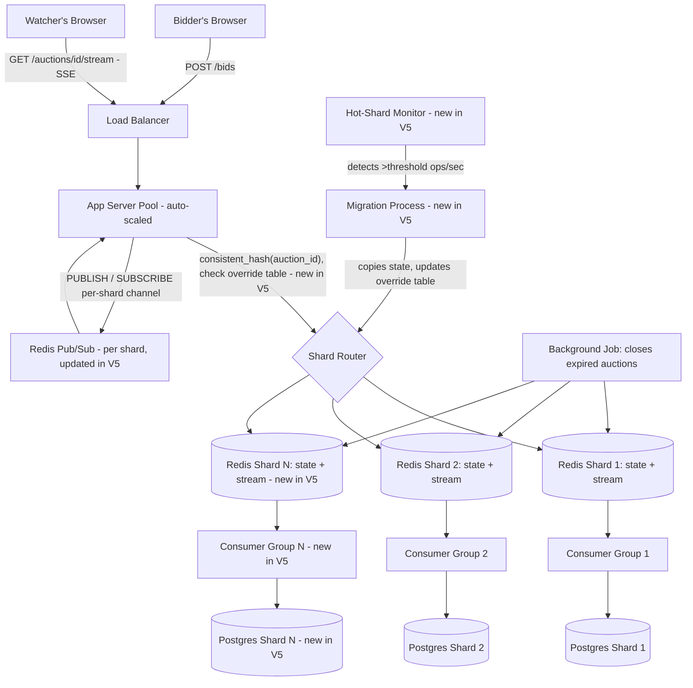

**Flows as of V5:**

1. **Bid write path (updated):** bidder submits a bid → app server computes `consistent_hash(auction_id)`, checks the override table for a forced shard assignment, routes to the resulting Redis shard, then runs the same V3/V3.1 Lua script (`HSET` + `XADD`) unchanged — sharding only changed *which node* runs it, not the script itself.
2. **Durability path:** unchanged mechanism from V3.1, now running once per shard in parallel — each shard's consumer group reads its own stream and writes to its own Postgres shard.
3. **Watch/read path:** unchanged mechanism from V1/V4 — SSE fed by Pub/Sub — now scoped per-shard, since an auction's Pub/Sub channel lives on the same shard as its state.
4. **Auction close path:** unchanged mechanism, now checking whichever shard owns that specific auction.
5. **Hot-shard mitigation path (new):** monitoring job watches per-shard load; on threshold breach, migration process moves one hot auction's state to a dedicated shard and records the override, so future traffic for that auction bypasses the normal hash.

---

## Interviewer Follow-ups

**Q: Doesn't the override table become a bottleneck itself — every single request now checks it first?**
A: It's a small hash (probably only ever holding a handful of currently-migrated auctions at once, since most auctions never go viral), so it's cheap enough to keep replicated in-memory on every app server via a lightweight pub/sub-based cache invalidation, rather than a network round-trip per request — a request only pays a real lookup cost if the local cached copy might be stale, which is rare.

**Q: What happens to Redis Pub/Sub subscriptions across a shard migration?**
A: App servers that had watchers subscribed to the old shard's channel for that auction need to re-subscribe to the new shard's channel once the override table update propagates — this briefly means a watcher could miss an event during the switch, which is exactly why every SSE connection resends a fresh snapshot on reconnect (from V1) rather than relying purely on continuous event delivery; worst case a watcher's UI is stale for a second, not wrong.

## Recap

| Concept | The Insight |
|---|---|
| Single-threaded correctness has a capacity ceiling | The same property that gave Redis atomicity for free in V3 means all platform-wide load funnels through one core — sharding is what removes that shared ceiling. |
| Shard by what the hot path actually touches | `auction_id` wins because every hot-path operation is scoped to one auction; `seller_id`/`category` optimize queries we don't have on the hot path. |
| Hashing reduces hotspot odds, doesn't eliminate them | Auction load is inherently non-uniform (most quiet, a few viral) — no static hash can predict which key goes hot next, so a monitoring-and-migration safety valve is still needed. |
| Consistent hashing bounds resharding cost | Plain modulo reshuffles most keys when the shard count changes; consistent hashing only moves keys in the affected slice of the ring — critical here since we already know shards will change over time. |
| Migration reuses V3.1's machinery | The sequence-numbered stream that made durability crash-safe also makes shard migration safe — replay from the last known `seq` handles both problems with one mechanism. |

**Interview-arc sentence:** *If asked how you scale bid arbitration past one Redis node: a single instance's single-threaded execution caps platform-wide throughput regardless of how well any one auction is optimized, so sharding by `auction_id` via consistent hashing isolates normal auctions from each other's load, with a monitoring-and-migration safety valve to handle the rare viral auction that a hash function couldn't have predicted.*

Next up: replication — we've sharded for throughput, but what happens when *one* shard's Redis node or Postgres node simply dies? That's V6.

---

# V6 — Replication for Availability

**Break it:** Shard 7's Redis node — which happens to be hosting three moderately active auctions right now, none viral, just ordinary traffic — has its EC2 instance hardware-fault and disappears. Nothing gradual, no warning. Every bid attempt for those three auctions now fails outright: the app server's `EVAL` call times out or errors, because there's no replica, no standby, nothing else holding that shard's state. Those three auctions are completely unable to accept bids until someone manually provisions a new node — and worse, whatever was in that node's memory that hadn't yet made it into AOF on disk (a small window, but nonzero) is gone permanently, meaning even after we bring a replacement online from the last AOF snapshot, we might have silently lost a moment's worth of bid history.

This is a different kind of failure from everything we've handled so far — V0 through V5 all assumed the node itself stays up. Sharding (V5) spread load across nodes so no single node handles *everything*, but it did nothing for the case where *one specific* node simply stops existing. A hot-shard migration moves data because a shard is *overloaded*; this is a node that's just *gone*.

## Solve It

The mechanism: keep a second, continuously-updated copy of each shard's data on a separate physical node, so if the primary disappears, the copy can take over immediately instead of us waiting for a rebuild from a possibly-stale disk snapshot. This is standard primary-replica replication, but the interesting decision for *this* system is: how many replicas, and does the primary wait for them before confirming a write?

First — is replication for *reads* even justified here, independent of the failover question? Look at our actual read:write ratio on the hot path: every bid is a write (the `EVAL` script), and the only "read" that matters for correctness is that same script reading the hash right before writing it — which happens on the primary anyway, atomically, as part of one script. Watchers don't read Redis directly at all — they get pushed to via Pub/Sub. So there's no meaningful "spread read load across replicas" case here the way there would be for, say, a system dominated by lookups. That means read replicas for *scaling reads* are not justified for this workload — the only reason we want a replica here is **failover**, not read capacity. That's worth stating explicitly rather than defaulting to "yes, add replicas" out of habit.

Given failover is the actual goal, the real question becomes: sync or async replication to that standby? Here's the naive-looking easy answer and why it's wrong for us specifically:

> **Dev A:** "Let's just do async replication — primary confirms the write immediately, replica catches up in the background. Fastest, simplest."
> **Dev B:** "So if the primary dies one millisecond after confirming a bid, but before the replica got that write?"
> **Dev A:** "...the replica takes over as the new primary, and that bid just vanishes — even though we already told the bidder they won."

That's a real problem for us in a way it wouldn't be for, say, a view-count counter — a vanished *winning bid* means we told someone they won an auction and then that fact silently disappeared, which is exactly the kind of "legally indefensible" gap we called out back in V0. So fully async replication reintroduces a version of the very first problem this whole design has been fighting.

Fully **synchronous** replication (primary waits for the replica to confirm before responding to the app server) closes that gap completely, but at a real cost: every single bid now pays an extra network round-trip to the replica before the bidder gets their `200`, which directly undoes some of the sub-millisecond win from V3 — and if that replica is temporarily slow or briefly unreachable, the *primary* now blocks on every write, meaning a struggling replica can stall an otherwise-healthy shard.

The middle ground, and what fits here: **semi-synchronous replication** — the primary waits for acknowledgment from *at least one* replica before confirming the write, but doesn't wait for all of them if there are more than one. This bounds the data-loss window to "the primary and its one synced replica both die in the same instant," which is an extremely rare double-failure, while adding only one replica's round-trip latency (not N), and — critically — most Redis semi-sync setups have a timeout fallback: if the replica doesn't ack within a few milliseconds, the primary can either wait longer or (configurably) proceed anyway, so a single slow replica doesn't have unlimited power to stall the shard.

✅ **What we gained:** losing a primary node no longer means losing recent winning bids or taking that shard's auctions offline — a replica already has (via semi-sync) the confirmed state and can be promoted immediately.

⚠️ **What we give up / what new problem this creates:** every bid now pays one extra network hop (primary → replica → ack) before confirming to the bidder — a real latency cost, though small (sub-millisecond to low-single-digit ms for a replica in the same datacenter). We also now need **failover detection and promotion** — something has to notice the primary is gone and tell the app servers "shard 7's primary is now this other node," which is itself a new piece of infrastructure, not something that happens automatically.

❌ **What we considered and rejected:**
- **Fully async replication:** the dialogue above — cheap, but reintroduces silent loss of confirmed bids on primary failure, which is unacceptable for this specific system given what a "lost bid" actually means (a legal and trust problem, not just a UX blip).
- **Fully synchronous replication to all replicas:** eliminates the loss window entirely but makes every bid's latency dependent on the *slowest* replica, and blocks writes if any replica is briefly unreachable — too fragile for a hot path we specifically optimized for speed in V3.
- **No replication, rely on AOF + fast manual recovery:** this is what V0-V5 implicitly had, and it's exactly the break-it scenario — AOF only protects data already fsynced to disk, and "manual recovery" means real downtime for that shard's auctions, which isn't acceptable for a live system.

## Implement It

**Redis replication setup, per shard** (using Redis Sentinel, which handles both the replication link and the failover detection/promotion):

```
Shard 7:
  redis-primary-7   (accepts all writes)
  redis-replica-7a  (semi-sync replica, same region, different AZ)
  redis-replica-7b  (async replica, for extra durability margin — optional second copy)

sentinel monitor shard7 redis-primary-7 6379 quorum=2
sentinel down-after-milliseconds shard7 2000
sentinel failover-timeout shard7 10000
```

Primary config for semi-sync-like behavior (Redis calls this `WAIT`):
```
# After the Lua EVAL completes, before returning to the app server:
WAIT 1 100   -- wait for at least 1 replica to ack, timeout after 100ms
```

**Failover sequence, when `redis-primary-7` disappears:**
1. Three Sentinel instances (a small quorum, running independently to avoid one Sentinel being a single point of failure itself) each periodically ping `redis-primary-7`. Two or more agreeing it's unreachable for 2000ms (`down-after-milliseconds`) triggers the quorum condition.
2. Sentinels elect one of the replicas (whichever has the most up-to-date replication offset — typically `redis-replica-7a`, the semi-sync one) and promote it to primary.
3. Sentinels update their internal record of "who is shard 7's primary now" and publish that change.
4. **App servers**, which don't talk to Redis nodes directly by hardcoded address but instead ask Sentinel for the current primary before connecting (or use a Redis client library with built-in Sentinel awareness), pick up the new primary address on their next connection attempt — no manual redeploy or config change needed.

**Postgres replication** for the same failover reasoning, using standard Postgres streaming replication with synchronous_commit:
```sql
-- On primary, postgresql.conf:
synchronous_standby_names = 'FIRST 1 (postgres_replica_7a, postgres_replica_7b)'
synchronous_commit = on
```
This means a `COMMIT` on the primary (from the consumer group's sequence-guarded `UPDATE`, from V3.1) waits for at least one named standby to confirm before returning success — same semi-sync reasoning as Redis, applied to Postgres's own replication mechanism. Failover here is typically handled by a tool like Patroni, which does for Postgres what Sentinel does for Redis: monitors the primary, promotes a standby, and updates a small service-discovery record that the consumer groups check before connecting.

**What consistency model results, and where staleness would matter:** with semi-sync, a confirmed bid is guaranteed durable on at least 2 nodes (primary + 1 replica) at the moment the bidder gets their `200`. The specific user-facing flow where staleness *would* matter is if a watcher's SSE connection happened to be served by an app server that queried a lagging *async* replica (like `redis-replica-7b` above) for some reason — but we've deliberately kept all reads and Pub/Sub sourced from the primary, so this staleness risk doesn't actually surface anywhere in the current design; it's only a live concern if a future version added read-replica-served reads, which — as established above — we don't need for this workload.

---

# Current State — After V6

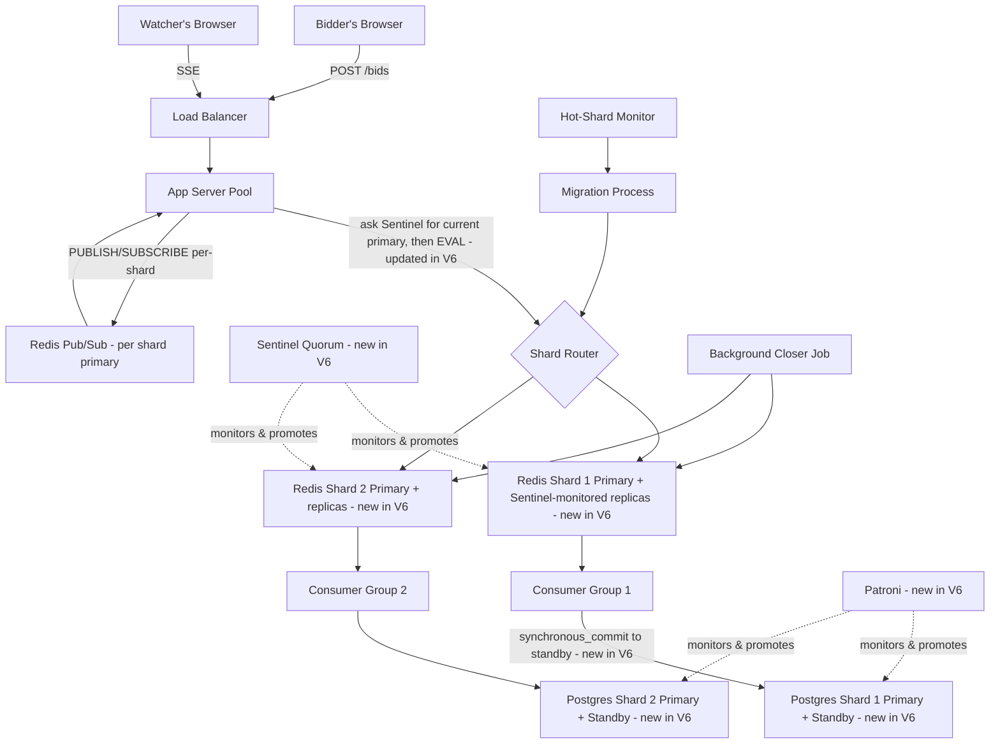

**Flows as of V6:**

1. **Bid write path (updated):** app server asks Sentinel which node is currently shard N's primary (or uses a Sentinel-aware client that caches this), runs the same Lua script from V3/V3.1, and the primary now waits for at least one replica's acknowledgment (`WAIT 1 100`) before returning — adding a small, bounded latency, but guaranteeing the confirmed bid survives a primary failure.
2. **Durability path (updated):** consumer group's `UPDATE`/`INSERT` to Postgres now commits synchronously against at least one standby, same semi-sync reasoning, via Patroni-managed failover.
3. **Watch/read path:** unchanged — still served from the primary via Pub/Sub, deliberately not from replicas, so no staleness is introduced here.
4. **Failover path (new):** on primary loss, Sentinel (Redis) or Patroni (Postgres) detects it via quorum-based health checks, promotes the most up-to-date replica, and app servers/consumer groups pick up the new primary on their next connection — no manual intervention, bounded downtime (the `down-after-milliseconds` + election time, on the order of a couple seconds).
5. **Auction close / hot-shard migration paths:** unchanged mechanism, now operating against whichever node is currently the primary for a given shard.

---

## Interviewer Follow-ups

**Q: What happens to in-flight requests during the few seconds between primary failure and promotion completing?**
A: Those specific requests fail or time out — there's a real, bounded unavailability window (roughly 2-3 seconds here, driven by `down-after-milliseconds` plus election time) for that one shard's auctions specifically, not platform-wide; the app server should retry once against the newly-announced primary, and a bidder retrying a failed bid within a couple seconds is a reasonable UX to design for, versus the alternative of that shard being down indefinitely without replication.

**Q: Why `WAIT 1` and not wait for both replicas?**
A: Because the goal is surviving a single node failure, not maximizing the fsync guarantee — waiting for one already gets us from "guaranteed loss on primary death" to "loss only if two specific nodes die in the same instant," and waiting for the second replica too would double the latency cost for a marginal improvement in an already-rare failure mode.

## Recap

| Concept | The Insight |
|---|---|
| Sharding solves throughput, not availability | Spreading load across nodes doesn't help if any one node can just disappear — replication is a separate concern with a separate fix. |
| Justify replicas by the actual read pattern, not by default | This system's reads are all served via Pub/Sub push, not direct Redis reads, so read-scaling replicas aren't needed — only failover replicas are. |
| Async replication can silently lose confirmed writes | If the primary confirms before the replica has the data, a primary crash in that gap loses a bid we already told the bidder they won. |
| Semi-sync is the deliberate middle ground | Wait for one replica, not all — bounds the data-loss window to a rare double failure, without paying full sync's blocking-on-the-slowest-replica cost. |
| Failover needs its own watcher, not just a replica | A replica existing doesn't help if nothing detects the primary is gone and promotes it — Sentinel/Patroni are the mechanism that makes replication actually usable during an outage. |

**Interview-arc sentence:** *If asked how you handle a Redis or Postgres node dying mid-auction: async replication can lose a bid we already confirmed to the bidder if the primary dies before the replica catches up, so semi-synchronous replication — waiting for at least one replica's acknowledgment before confirming the write, with Sentinel/Patroni handling automatic detection and promotion — bounds the data-loss window to a rare double failure while keeping the added latency to a single replica hop.*

Next up: multi-region. So far everything assumes one region — what happens when Priya's in Mumbai, Kavya's in Virginia, and both are bidding on the same auction across a real network distance? That's V7.

---
