Let's do this properly — I'll lay out the full roadmap first so you know where we're headed, then we go deep on one piece at a time. You tell me when you're ready to move on.

## The Roadmap (story arc)

Think of this like an engineer's journal over the life of "AuctionHub":

1. **The Problem** — What is a live auction system, functional/non-functional requirements, and the *naive* first design (single server, polling)
2. **Real-Time Bidding** — Why polling dies at scale → WebSockets/long-polling → the fan-out problem
3. **The Race Condition** — Two people bid the same amount at the same millisecond → concurrency control, locking, atomic operations
4. **Consistency & the Bid Ledger** — Why you can't lose a single bid → database choice, write-ahead logs, idempotency
5. **Scaling the Fan-Out** — Pub/Sub, message queues (Kafka), WebSocket gateway scaling
6. **Sharding & Partitioning** — One DB can't hold all auctions → how to shard by auction ID, hot partition problem (viral auction)
7. **Caching** — Current highest bid, auction metadata → cache invalidation story, cache stampede
8. **CDN & Static Content** — Images, auction listings, read-heavy traffic
9. **The Auction Close Problem** — "Sniping," clock sync, distributed timers, ensuring exactly-one "auction ended" event
10. **Replication & High Availability** — Leader election, failover, what happens when the primary DB dies mid-auction
11. **Notifications** — Outbid alerts, push notifications, at-least-once vs exactly-once delivery
12. **Payments & Post-Auction Flow** — Saga pattern, distributed transactions
13. **Error Handling, Rate Limiting, Abuse** — Bid sniping bots, DDoS, circuit breakers
14. **Putting it all together** — Final architecture diagram + how to present it in an interview

That's a lot — we won't rush. Each section: story → naive attempt → why it breaks → real solution → example → your understanding check.

---

## Part 1: The Problem

**The story:**

Imagine it's 2015. A small startup, "AuctionHub," wants to build an eBay-style live auction site — but *live*, like a real auction house. People watch a Rolex listing, and for the last 5 minutes, bids fly in every second, and everyone needs to see the current highest bid *instantly*.

The founding engineer, Maya, sits down and asks: what do we actually need to build?

**Functional Requirements** (what the system must do):
- Users can create an auction (item, starting price, end time)
- Users can place bids on an active auction
- All viewers of an auction see the current highest bid update in near real-time
- The system must correctly determine the winner when the auction ends
- Users get notified if they're outbid

**Non-Functional Requirements** (how well it must do it):
- **Low latency** — a bid update should reach other viewers within ~1 second
- **Strong consistency for bids** — you cannot lose a bid or accept two "winning" bids
- **High availability** — auctions run on a timer; the system can't go down mid-auction
- **Scalability** — could be 10 viewers on one auction, or 100,000 on a celebrity charity auction

Maya's first instinct — the naive design:

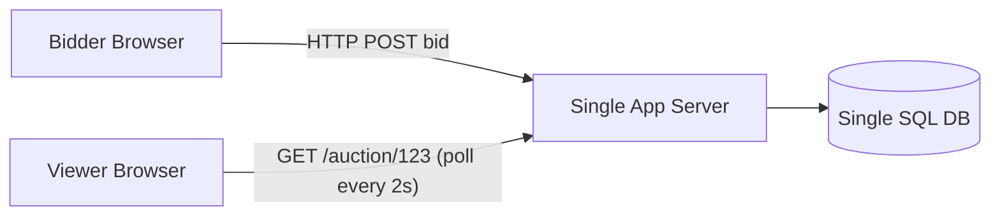

Every viewer's browser just **polls** the server every 2 seconds: "what's the highest bid now?" Bids are simple HTTP POST requests that update a row in a database.

This actually *works* — for a demo with 5 users. Maya ships it.

Then AuctionHub gets its first big auction: a charity event with a celebrity guitar, 50,000 people watching in the last 10 minutes.

**Two things break immediately.** Before I tell you, think about it — with polling every 2 seconds and 50,000 viewers:

1. What's the obvious load problem this creates on the server?
2. Even if the server survives, what's wrong with the *user experience* of "poll every 2 seconds" when bids are coming in every 200ms in the final seconds?

Take a guess at both — doesn't need to be precise, just your intuition.

---

Fair enough — let's reveal it and keep moving.

**Problem 1: Server load from polling.**

50,000 viewers × 1 request every 2 seconds = **25,000 requests/second**, just for people *checking* the price — not even bidding. Every single one of those hits your app server, which hits the database to read the current highest bid. Your single server (and single DB) melts. This is called the **thundering herd of polling** — you're doing massive constant work to answer a question that hasn't even changed most of the time (the bid only changes when someone actually bids, but everyone's asking every 2 seconds regardless).

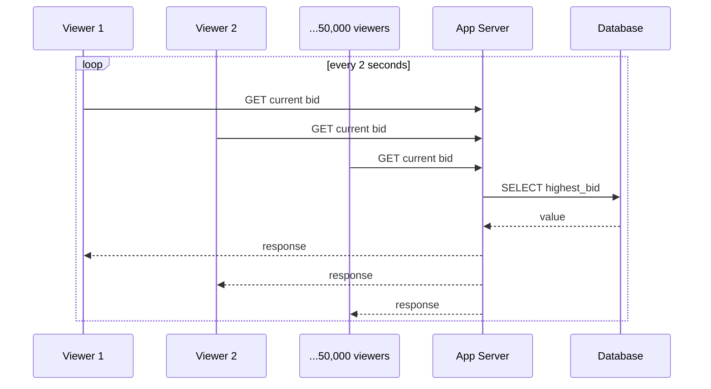

Notice: 99% of those DB reads return the *same unchanged value*. Pure waste.

**Problem 2: Staleness / bad UX.**

In the final 10 seconds of an exciting auction, bids might come in every 200-500ms. But your client only refreshes every 2 seconds. So a bidder sees "$5,000 is the highest" and confidently bids $5,100 — not knowing 3 people already bid higher in the last second. They get outbid instantly and don't even know it until their *next* poll. This isn't just annoying — in an auction, **stale information directly costs people money and trust**. Nobody will use a live auction site that feels laggy.

So Maya's takeaway: **polling is fundamentally the wrong communication model for this problem.** She needs the server to *push* updates to clients the instant something changes, not wait for clients to ask.

That's exactly where Part 2 picks up — real-time delivery (WebSockets vs long-polling vs SSE) and the much harder problem hiding behind it: how do you push one bid update to 50,000 open connections without falling over?

Ready to move to Part 2?

---

## Part 2: Real-Time Bidding

**The story continues:**

Maya researches and finds three candidate technologies to replace polling. Let's walk through each like she did — trying one, hitting its ceiling, moving to the next.

**Attempt A: Long Polling**

Instead of the client asking every 2 seconds and getting an immediate reply, the client makes a request and the *server holds it open* — doesn't respond until there's actually new data (or a timeout, say 30s). When new data arrives, server responds immediately, client processes it, and immediately opens a new long-poll request.

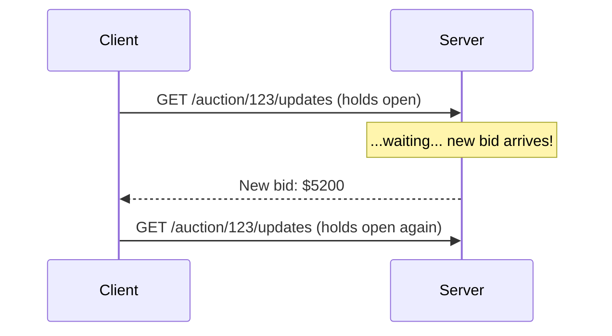

This is much better than naive polling — no wasted "nothing changed" responses, and latency drops close to real-time. This is what Maya ships next, and it holds up reasonably well.

**But it has a real limit Maya discovers:** every open long-poll request **still holds a server thread/connection** for up to 30 seconds. With 50,000 concurrent viewers, that's 50,000 held-open HTTP connections just idling, waiting. Each reconnect cycle also has HTTP overhead (headers, TLS handshake reuse issues). It's a big improvement, but it's still fighting the HTTP request/response model, which wasn't built for this.

**Attempt B: WebSockets**

A WebSocket is a **persistent, full-duplex connection** — client and server do one handshake, and then the connection stays open, and *either side* can send data at any time, with no request/response overhead per message.

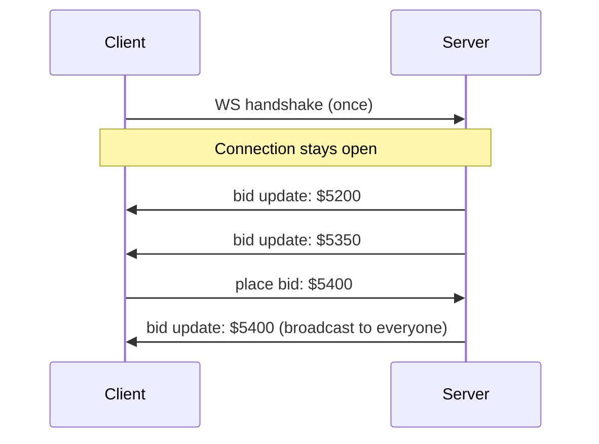

This is the standard answer for live auctions, live sports scores, chat apps, collaborative editing — anything needing bidirectional low-latency push. Maya adopts this.

**A quick mention of Attempt C: Server-Sent Events (SSE)** — one-directional (server→client only) push over plain HTTP. It's simpler than WebSockets and works great when *the client never needs to send data over that same channel* (e.g., a stock ticker). But bidders need to *send* bids too, so SSE alone isn't enough here — you'd still need a separate channel (regular POST) for placing bids. Interviewers like it when you mention SSE as an alternative and explain *why* you didn't pick it.

**Now the harder problem appears — the one that actually matters in the interview:**

WebSockets solve client↔server communication for *one* connection. But Maya now has 50,000 open WebSocket connections, all watching auction #123. When a new bid comes in, that update needs to reach **all 50,000** connections, fast.

Here's the question for you: if all 50,000 users are connected to just *one* app server, is that fine? What happens when AuctionHub grows and needs, say, 10 app servers behind a load balancer, and viewers are spread across those 10 servers — how does a bid placed on Server 3 get broadcast to a viewer connected to Server 7?

Take a guess before I explain — this is the classic **fan-out** problem, and it's one of the most commonly probed areas in live-system interviews.

---

Good instinct to want to see it rather than guess blind — let's build it up.

**The problem, concretely:**

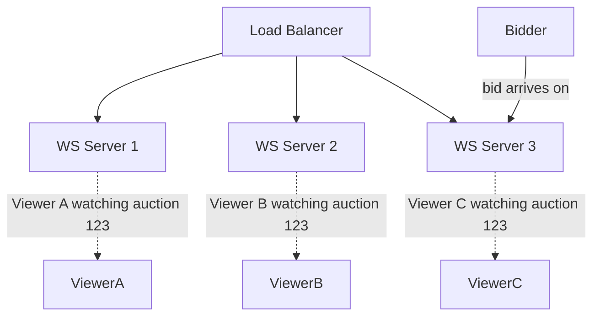

Viewer A is connected to WS Server 1. Viewer B to Server 2. The bid landed on Server 3. **Server 3 has no direct way to talk to Server 1 or Server 2's open sockets** — those connections live in a different process's memory entirely. If Server 3 just updates "its own" connected clients, Viewers A and B never find out. This is the **fan-out problem**: one event needs to reach connections scattered across many independent server processes.

**The naive (bad) fix Maya first considers:** have every WS server call every other WS server directly (all-to-all mesh) whenever it gets a bid. This technically works at tiny scale but is an operational nightmare — N servers need N² potential connections between them, and every server needs to know about every other server's existence and health. It doesn't scale and it's fragile (what if Server 2 is mid-restart?).

**The real solution: a Pub/Sub broker in the middle.**

Instead of servers talking to each other, every WS server **subscribes** to a channel per auction (e.g., `auction:123`) in a shared broker like **Redis Pub/Sub** or **Kafka**. When a bid is placed, whichever server received it just **publishes** the event to that channel — it doesn't need to know or care who else is listening.

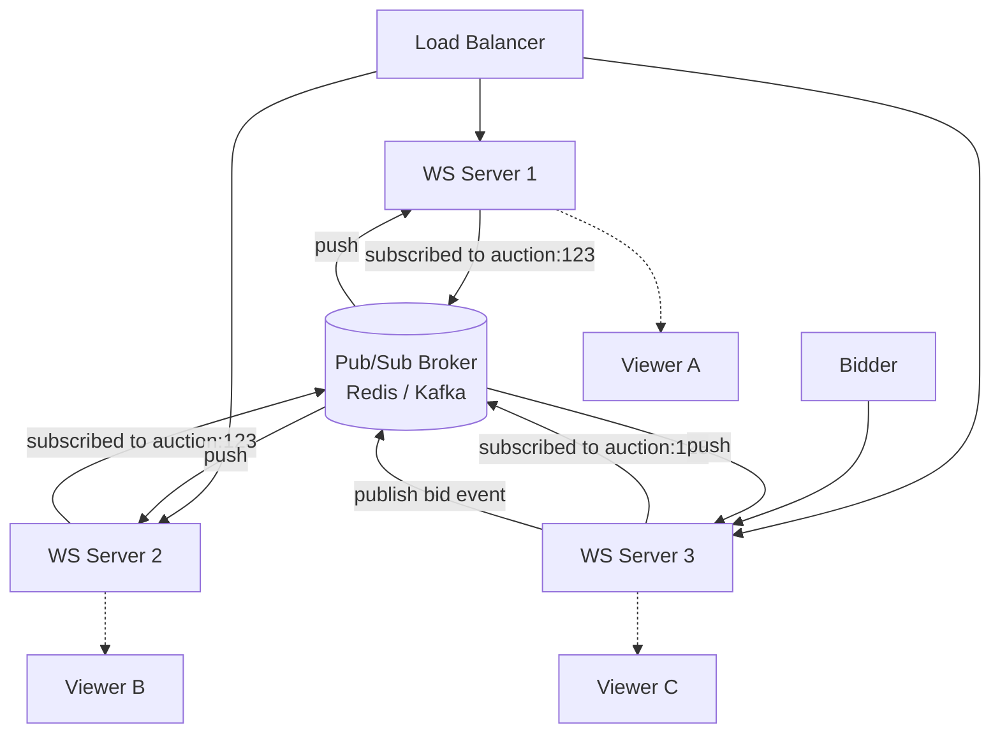

Flow:
1. Bidder places bid → hits WS Server 3
2. Server 3 validates/persists the bid (we'll cover this properly in Part 3 & 4)
3. Server 3 **publishes** `{auction: 123, bid: $5400, bidder: X}` to channel `auction:123`
4. The broker delivers that message to **every server subscribed** to `auction:123` — that's Servers 1, 2, and 3 (it's subscribed to its own channel too, for consistency)
5. Each server pushes the message down the open WebSocket to *its own* locally-connected viewers watching that auction

This decouples "who received the bid" from "who needs to know about it." Any server can scale independently, and servers don't need to know about each other at all — only about the broker.

**Redis Pub/Sub vs Kafka — a distinction interviewers love to probe:**

| | Redis Pub/Sub | Kafka |
|---|---|---|
| Delivery guarantee | Fire-and-forget — if a subscriber is down, message is lost | Persisted log — consumers can replay, at-least-once delivery |
| Latency | Very low (sub-ms) | Slightly higher, but still low (ms) |
| Use case here | Great fit for *live ephemeral* broadcast (bid updates) — if you miss one intermediate bid update, the *next* one still has the current price | Better for things that must never be lost (e.g., the actual bid record for the ledger, notification events) |

This is a key interview insight: **for the live "current price" broadcast, losing an occasional intermediate update is often OK** (self-healing — the next update corrects it), so Redis Pub/Sub is a very reasonable and commonly used choice. But for the *bid itself* — the fact that "User X bid $5400 at time T" — that must **never** be lost. That's a different pipeline (we'll get there in Part 4, the Bid Ledger).

**Quick check for you:** Given what you just learned — if Redis Pub/Sub can silently drop a message when a subscriber (WS server) is briefly disconnected from the broker, is that actually a real risk here? Think about what a "dropped bid update broadcast" would mean for a viewer, versus what a "dropped bid record" would mean. Are they equally bad, or is one recoverable and one not? Give me your take.

---

Fair — you clearly want the exposition to keep flowing rather than stopping at each checkpoint. I'll answer my own question briefly and adjust: fewer forced pauses, more continuous teaching, and I'll flag clearly when we hit a natural "concept boundary" so you can say "next" or ask something.

**Quick answer to that last question:** They're *not* equally bad — that's the key insight. A dropped bid **update broadcast** is recoverable: the next bid a second later carries the current price anyway, so a viewer's screen just skips one intermediate value and catches up. A dropped **bid record** (the actual "$5400 accepted at time T" fact) is unrecoverable — you might miscalculate the winner, or lose money someone is owed. So: ephemeral broadcast → Redis Pub/Sub is fine. Source-of-truth bid data → needs a durable, never-lose pipeline. Keep that distinction; it's a recurring theme in HLD interviews (broadcast/notification paths tolerate loss, ledger/transactional paths don't).

---

## Part 3: The Race Condition

**The story:**

AuctionHub is now live with WebSockets + Pub/Sub, feeling good. Then during a hot auction, two bidders — Alice and Bob — both see the current price as $5,000 and, at the exact same instant, both click "Bid $5,100."

Both requests hit the backend within milliseconds of each other, maybe even on two different app servers.

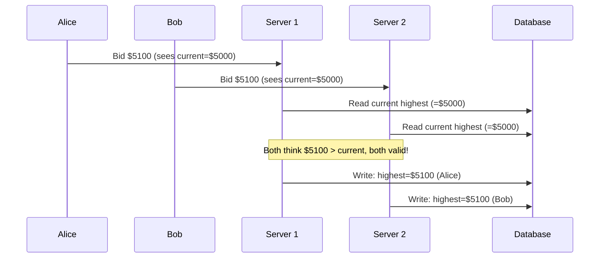

This is a **classic read-modify-write race condition**. Both servers read the same stale value, both decide their bid is valid, and now you have two "highest bids" — a data integrity nightmare. In an auction, this is unacceptable: you could end up with two people both told "you're winning!" or, worse, the wrong final winner.

**Why does this happen?** Because "check if bid is higher" and "record the new bid" are two separate steps (read, then write) with a gap between them, and nothing stops two requests from interleaving in that gap. This is called a **TOCTOU bug** — Time-Of-Check to Time-Of-Use.

**Attempt 1 (naive): Application-level check.**
```
if (newBid > currentHighestBid) {
    updateHighestBid(newBid)
}
```
This is exactly the buggy code above. Doesn't work under concurrency — full stop.

**Attempt 2: Pessimistic locking (row-level lock / SELECT FOR UPDATE).**

Make the read-then-write **atomic** by locking the row for the duration of the transaction:
```sql
BEGIN;
SELECT highest_bid FROM auctions WHERE id=123 FOR UPDATE;  -- locks the row
-- app checks: is new bid higher?
UPDATE auctions SET highest_bid = 5100, highest_bidder='Alice' WHERE id=123;
COMMIT;
```
Now if Bob's transaction tries to do the same `SELECT FOR UPDATE` while Alice's transaction holds the lock, Bob's request **blocks** until Alice's commits. Then Bob's `SELECT` re-reads the *now-updated* value ($5100) and correctly rejects his $5100 bid as "not higher."

This works correctly. The tradeoff: it **serializes** all bids on the same auction — one at a time, forcing others to wait. For a niche auction with a bid every few seconds, this is totally fine. For a viral auction with 50 bids/second on the same row, this lock becomes a bottleneck and requests start queuing up, increasing latency.

**Attempt 3: Optimistic concurrency control (version numbers).**

Instead of locking, attach a `version` column. Read the row (no lock), and when writing, only succeed if the version hasn't changed:
```sql
UPDATE auctions
SET highest_bid = 5100, highest_bidder = 'Alice', version = version + 1
WHERE id = 123 AND version = 7;  -- the version we read
```
If someone else updated the row in between, `version` is no longer 7, so this UPDATE affects **0 rows** — the app detects that and knows to retry (re-read the new highest bid, and reject if 5100 is no longer higher). No blocking/locking — just "try, and retry on conflict."

This is better under high contention *if conflicts are rare*, but if an auction is truly hot (many bids per second all fighting over the same row), you get a storm of retries — which can actually be worse than a lock queue.

**Attempt 4 (what real systems often do): Atomic compare-and-swap via a single-threaded store, e.g. Redis.**

Keep the "current highest bid" for a *live, in-progress* auction in Redis (fast, in-memory), using an atomic operation like a Lua script or `WATCH/MULTI/EXEC`, or simply Redis's single-threaded execution model to do an atomic "if new bid > stored bid, set it" in one operation with no race window at all. This is extremely fast (sub-millisecond) and naturally serializes because Redis processes commands one at a time per key.

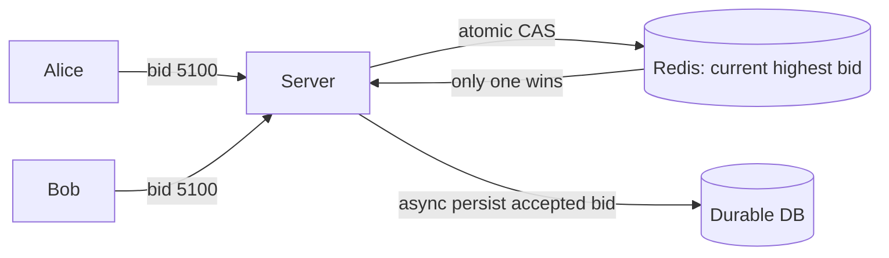

The pattern that emerges: **Redis holds the "hot" mutable state for fast atomic decisions (who's winning right now), and the durable database holds the permanent record (append-only bid history) asynchronously.** This is a very common pattern to mention in interviews — separating "hot path decision-making" from "durable audit trail."

**Summary table — a good thing to have ready for interviews:**

| Approach | Correctness | Performance under contention | When to use |
|---|---|---|---|
| App-level check (no locking) | ❌ Broken | N/A | Never |
| Pessimistic lock (`SELECT FOR UPDATE`) | ✅ Correct | Poor (serialized, blocking) | Low-contention auctions |
| Optimistic concurrency (version) | ✅ Correct | Poor if contention is high (many retries) | Medium contention |
| Atomic in-memory CAS (Redis) | ✅ Correct | Excellent | High-contention, viral auctions — the standard modern answer |

This is a great one to really lock in, since "how do you handle two simultaneous bids" is probably *the* single most common live-auction interview question. Let me know when you've got it and want to move to **Part 4: The Bid Ledger** — where we deal with the *other* half of this: how do you make sure the winning bid decision, once made, is never lost even if a server crashes right after?

---

Good question to push on — that gap needed filling. Let me be very explicit about *what problem Redis solves that plain SQL locking doesn't*, because if you can't articulate this crisply, an interviewer will catch it.

**First, the important admission: correctness-wise, plain SQL locking already works.** `SELECT FOR UPDATE` or optimistic versioning on your normal database gives you a *correct* answer — no double-wins, no lost updates. So if Redis isn't needed for correctness, what is it needed for?

**Answer: throughput and latency under a hot key.**

Here's the concrete mechanics of why a traditional SQL database struggles specifically in this scenario:

**1. Every SQL write is heavier than it looks.**
A `BEGIN; SELECT FOR UPDATE; UPDATE; COMMIT;` isn't just "change a number in memory." On commit, the database typically has to:
- Write to a **write-ahead log (WAL)** on disk
- `fsync` that log to guarantee durability (so it survives a crash)
- Manage the lock in a lock table, wake up whichever transaction was waiting next

That `fsync` alone typically costs **1–5 milliseconds** on decent disks (SSD), sometimes more on networked/cloud storage. So a single row, under lock, can realistically sustain maybe **200–1000 writes/second** *at best* before requests start queuing.

**2. Now put a viral auction on that one row.**
Imagine 50–100 bids/second on auction #123 in its last 30 seconds (this happens — think a celebrity charity item). Every single bid needs the *same row* locked, one at a time. So:

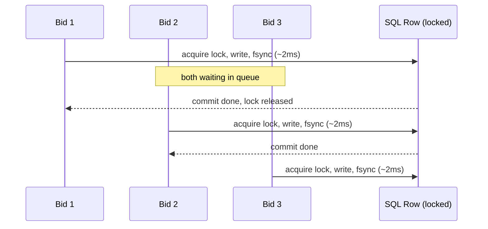

If each write takes ~2ms and 80 bids arrive in one second, they simply **cannot all be serialized in time** — a queue builds up. Bidders start seeing multi-second delays before their bid is even acknowledged. Worse:

**3. Every waiting request holds a database connection open.**
Databases have a hard limit on concurrent connections (often 100–500, sometimes less depending on tier). While Bid #47 is queued waiting for the lock, its request thread is sitting there holding a DB connection **doing nothing but waiting**. If enough bids pile up on this one hot auction, you can **exhaust the connection pool for the entire database** — and now *other, unrelated auctions* on the same DB start failing too, even though they had zero contention themselves. This is the classic "one hot key takes down the whole system" failure mode.

**Now compare Redis:**

- Redis is **single-threaded** for command execution — it processes one command at a time, in memory, with no lock manager, no fsync-per-write by default.
- A single "compare and set" operation (is this bid higher? if so, set it) takes **microseconds**, not milliseconds — because there's no disk round-trip in the critical path.
- Because each operation returns almost instantly, connections aren't held open waiting — Redis can push **tens of thousands to 100k+ operations/second** through a single key on modest hardware, versus the SQL row's few hundred.

So the same 80 bids/second scenario that stalls SQL is trivial for Redis — it's done and moving to the next bid before the SQL version would've even finished its `fsync`.

**But here's the part that makes this a *complete* answer, not just "Redis is faster":** Redis, by default, keeps data in memory and isn't as durably safe as a disk-backed SQL DB (a crash could lose recent writes unless you configure AOF persistence, which reintroduces some of that disk cost). So the actual architecture is a **division of labor**:

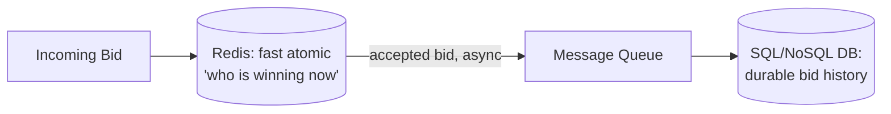

- **Redis answers the question "is this the new highest bid?" instantly** — this is the hot, latency-sensitive, high-frequency decision.
- **The durable database keeps the permanent, audit-safe record of every bid** — this doesn't need to happen synchronously in the critical path; it can be written asynchronously (via a queue) right after Redis makes the fast decision, without making the bidder wait for a disk fsync.
- If Redis ever crashes and loses its in-memory state, you can **rebuild "current highest bid" by replaying the durable bid log** — so Redis's lack of durability isn't actually dangerous, because it's not the source of truth, just a fast cache/arbiter in front of the source of truth.

**So, to directly answer "why did we need Redis":** we didn't need it for *correctness* (SQL alone is correct) — we needed it because a single database row has a hard physical ceiling on writes/second (bounded by disk fsync + lock contention + connection limits), and a viral auction's hot row can exceed that ceiling, causing cascading failures across the whole system. Redis removes that ceiling for the "who's winning" decision, while the SQL DB remains the durable, permanent record — used asynchronously, off the hot path.

Does that fully close the gap? If yes, we can move to Part 4, where we dig into exactly *how* that durable bid log is written so that no bid is ever silently lost even if a server crashes mid-request.

---

## Part 4: Consistency & the Bid Ledger

**The story:**

AuctionHub now uses Redis for the fast "who's winning" decision, with an async write to the durable database for the permanent record. One day, a server crashes **right after** Redis accepts a bid but **before** that bid gets written to the durable database. That bid — a legitimate, accepted, "you're currently winning!" bid — just vanishes. The bidder saw a confirmation. The system now has no record of it. When the auction ends, the wrong person is declared the winner.

This is the core tension of Part 4: **Redis gave us speed, but we've now created a durability gap.** Let's trace exactly where, and fix it properly.

**Where the gap lives:**

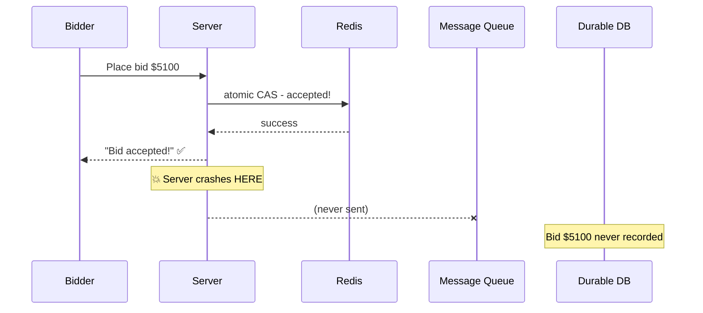

The bidder was told "success" — that's the dangerous part. We *confirmed* something we hadn't actually made durable yet.

**Attempt 1 (naive): Write to DB synchronously, then Redis.**
What if we just reverse the order — write to the durable DB first, *then* update Redis, *then* respond to the user? This fixes the crash-loses-data problem (DB write happens before we ever say "success"), but it brings back the exact problem we solved in Part 3: every bid now pays the full DB write cost (locking + fsync) again, in the critical path, and we're back to a few-hundred-writes/second ceiling on a hot auction.

**Attempt 2: Write-Ahead Queue (the real answer) — but make the queue itself durable.**

The fix is to stop treating the message queue as "just an async nice-to-have" and instead treat **enqueueing the bid as the durability guarantee**, using a queue that itself persists messages to disk before acknowledging — like **Kafka** (this is exactly why Kafka, not Redis Pub/Sub, is the right tool for *this* part of the pipeline, unlike the ephemeral broadcast in Part 2).

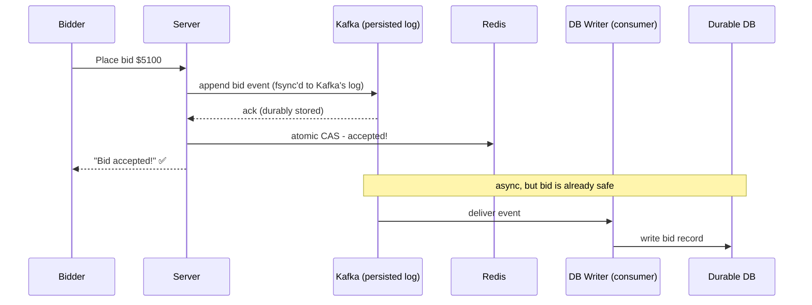

Why this works: **Kafka's append-only log write is cheap and fast** (sequential disk writes, not random-access row locks — this is a fundamental performance difference: sequential writes can be nearly as fast as memory, while random-access row updates with locking are much slower). So we get a *durability guarantee* almost as fast as Redis, without paying the full relational-DB transaction cost in the critical path. Once the event is in Kafka's log, **it cannot be lost** even if our app server crashes immediately after — Kafka will always have it, and a consumer will eventually write it to the DB, even if that consumer restarts, crashes, and resumes later (Kafka tracks consumer offsets so nothing is skipped).

**Now a new question emerges — ordering.** If Bidder A and Bidder B's bids both flow through Kafka, does Kafka guarantee they arrive at the DB consumer in the same order they were placed? This matters a lot: if Bob's $5100 gets processed before Alice's $5000, that's fine — order doesn't matter *between different amounts* since the atomic Redis check already picked the real winner. But what if we need the bid *history* to be provably ordered for auditing/disputes? Kafka guarantees ordering **within a partition**, not across partitions. So the practical fix: **partition Kafka by auction ID** — all bids for auction #123 always go to the same partition, guaranteeing they're processed in the exact order they were appended, while different auctions can be processed in parallel across other partitions.

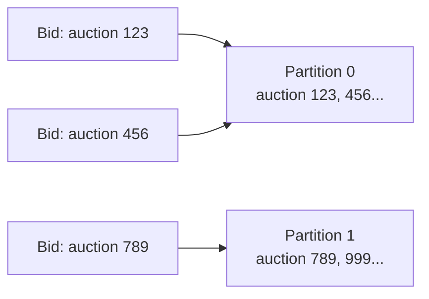

This partitioning-by-key idea (hash auction_id → partition) is something you'll see again in Part 6 (database sharding) — it's the exact same underlying principle: **route related events to the same physical location to preserve order/locality, while spreading unrelated events across many locations for parallelism.**

**One more piece — idempotency.** What if the server *did* successfully write to Kafka, but then crashed before it could reply "success" to the bidder? The bidder's client, seeing a timeout, might **retry** the same bid request. Now you risk double-processing the same bid. The fix: every bid request carries a unique **idempotency key** (e.g., a UUID generated client-side when the "Place Bid" button is clicked). The server/consumer checks: "have I already processed this idempotency key?" — if yes, it just returns the previous result instead of processing it again. This is a very commonly expected detail in HLD interviews for *any* payment or transactional flow, not just auctions — always mention it when discussing "what if the request is retried."

**Recap of the full write path now:**

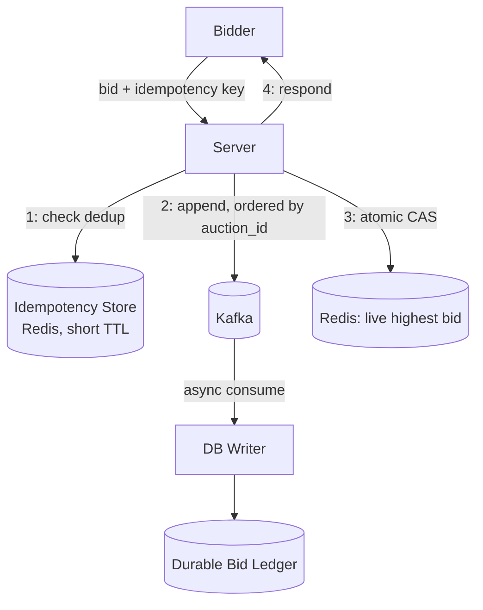

This gives us: fast responses, no lost bids even on crash, correct ordering per auction, and safety against duplicate submissions.

Ready for **Part 5: Scaling the Fan-Out** (what happens when it's not just 3 WS servers but 500, and not just one broker but a cluster), or do you want to sit with Part 3+4 a bit more first?

---

You're right to push here — I moved too fast and glossed over the actual justification. Let me rebuild this from scratch, answering each of your questions directly.

**Question 1: Why do we need a queue at all — why not just write to the DB directly?**

We covered this in Part 3, but to restate tightly: a direct synchronous write to a relational DB (lock + fsync) costs 1–10ms and has a hard throughput ceiling on a single hot row (a few hundred writes/sec before queuing cascades). Kafka's append is a **sequential disk write** with no row-lock contention — it can sustain orders of magnitude more writes/sec on the same hardware, because "append to the end of a log" is fundamentally cheaper than "find a row, lock it, modify it, fsync a random-access page." So the queue exists to give us **durability without paying the relational-DB tax** on every single bid.

**Question 2: What exactly was wrong with "Redis first, then queue"?**

Let me replay that failure precisely:

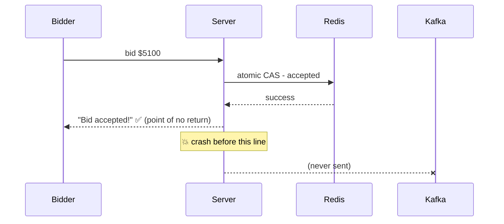

The problem isn't "Redis vs Kafka" as technologies — it's the **order relative to the response**. The moment we tell the bidder "accepted," we've made a promise. If anything after that point can silently fail, we've lied to the user. In this ordering, the *only* durable copy of the bid is Redis's in-memory state (fragile — lost on crash/restart unless configured with disk persistence, and even then it's not our real source of truth). We told the user "success" before creating any durable record. That's the bug.

**Question 3: Why does "queue first, then Redis" fix it?**

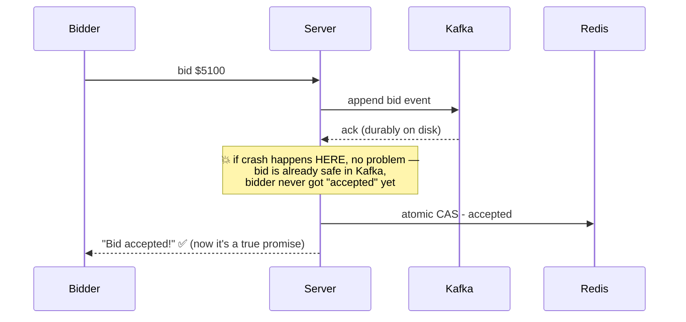

The rule: **never confirm success to the user before the data is somewhere that survives a crash.** Kafka's ack means "this is on disk, in a replicated log, it will not disappear." Only after that do we let Redis make the fast "are you winning" decision and reply to the user. If the server dies *before* the Kafka ack, the bidder just sees a timeout/error and can safely retry (this is where the idempotency key from before matters — a retry after a real success won't double-count). If it dies *after* the Kafse ack, the bid is safe regardless of what happens next — even Redis's decision can be recomputed later by replaying the log.

**Question 4: Does every request go through queue → Redis → DB? Who actually writes the DB, and what about latency?**

Yes, every bid follows this exact path — nothing skips it. Let's lay out the full lifecycle with who does what:

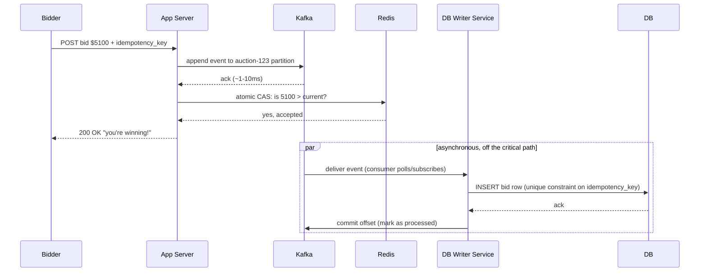

- **Who saves to the DB?** A separate, independent process — commonly called a **consumer service** (or "DB writer" / "ledger writer") — that does nothing but read from the Kafka topic and insert rows into the durable database. It's decoupled from the app servers entirely; it can crash, restart, or scale independently, and Kafka's offset tracking means it always resumes exactly where it left off, never skipping or (if using at-least-once + idempotent inserts) never double-inserting.
- **Latency the bidder actually feels:** only the Kafka ack + Redis CAS — both fast, both in the critical path shown above. The DB write happens **after** the bidder already got their response — it's not on their critical path at all. This is the whole point: we moved the slow part (real DB write) *outside* the user-facing request.
- **Being honest about the tradeoff:** we did add *one* network hop (the Kafka produce+ack) to every request that didn't exist in the very first naive design. That's real, measurable latency — typically 1–10ms depending on whether you configure Kafka for `acks=1` (leader only, faster, tiny window of risk if that leader dies before replicating) or `acks=all` (all in-sync replicas, safer, a few ms slower). This is a genuine, nameable tradeoff to raise in an interview: **you're trading a few milliseconds of latency for a durability guarantee that survives server crashes** — and it's still far cheaper than the alternative (a full relational transaction with row locking) would have been.

Does that fully close the loop now? If yes, Part 5 is where this whole pipeline gets pressure-tested at real scale — 500 WS servers, a Kafka/Redis *cluster* instead of a single node, and what happens when the broker itself becomes the bottleneck.

---

Good instinct — let's make this fully concrete, so there's no hand-waving left. I'll cover: (1) data models, (2) the full "place bid" flow end-to-end, (3) the full "watch auction live" flow, and (4) every failure/edge case along the way.

## 1. Data Models (so the flows make sense)

```
Auction {
  auction_id: string (UUID)
  item_name: string
  start_price: decimal
  current_highest_bid: decimal
  current_highest_bidder_id: string
  status: enum(SCHEDULED, ACTIVE, CLOSED)
  end_time: timestamp
  kafka_partition_key: auction_id   // used for routing
}

Bid {
  bid_id: string (UUID, server-generated)
  idempotency_key: string (client-generated UUID)
  auction_id: string
  bidder_id: string
  amount: decimal
  client_submitted_at: timestamp
  server_received_at: timestamp
  status: enum(ACCEPTED, REJECTED)
}
```

`idempotency_key` is generated **once**, client-side, the moment the user clicks "Place Bid" — and reused on any retry of that exact click (not regenerated on retry).

## 2. Flow A: Placing a Bid — fully detailed

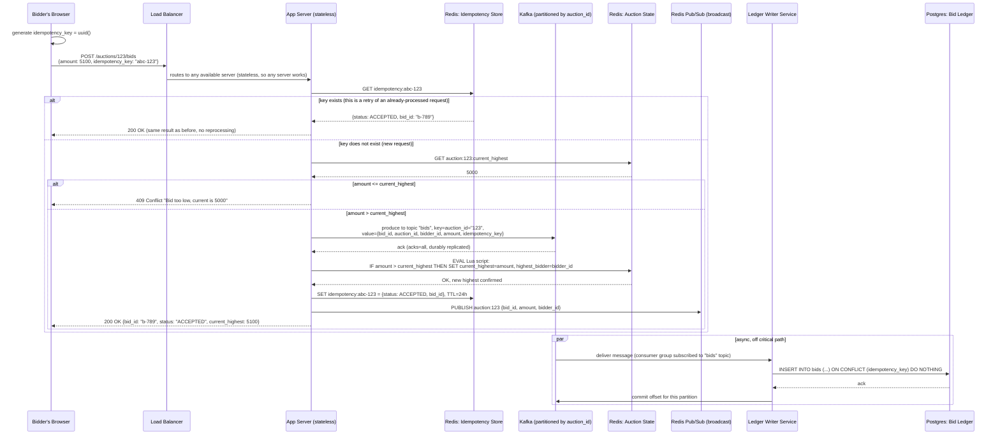

**Why the Redis re-check happens even though Kafka already has it:** the `amount > current_highest` check against Redis is a **fast-fail** before we pay for the Kafka write. Without it, every lowball/late bid would still hit Kafka and consume partition throughput unnecessarily. It's not the *only* correctness check — the Lua CAS against Redis right after Kafka is what's actually atomic and authoritative; the earlier GET is just an optimization to reject obviously-invalid bids cheaply.

**Why check idempotency store *before* touching Redis/Kafka at all:** if we didn't, a retried request (e.g., user's phone lost network right after the first request succeeded, client retries) would re-run the entire CAS+publish logic — and even though the DB insert is deduped via `ON CONFLICT`, you'd still double-publish a broadcast event and potentially confuse the "current highest" state if amounts interact oddly. Checking idempotency first makes retries a true no-op.

## 3. Flow B: Watching an Auction Live (WebSocket)

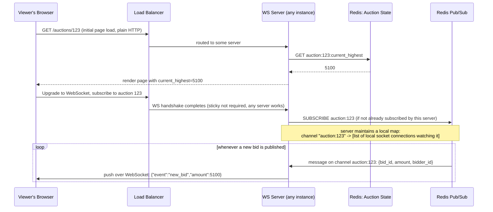

**One implementation detail people often skip:** a single WS server, at any given moment, might have viewers watching **many different auctions simultaneously**. So the server keeps an in-memory map of `auction_id → [socket connections]`, and subscribes to a Redis Pub/Sub channel **only once per auction it has at least one local viewer for** (not once per viewer) — otherwise you'd have thousands of redundant subscriptions. When the last local viewer for an auction disconnects, the server unsubscribes from that channel to avoid leaking subscriptions.

**What happens on WebSocket disconnect/reconnect (mobile network drop, laptop sleep, etc.):** the client detects the drop, and on reconnect, does the **initial GET flow again first** (fetch current state from Redis directly via a normal HTTP call) before resubscribing to the WebSocket — this guarantees the client never displays stale data just because it missed some Pub/Sub messages while disconnected. This is the same "self-healing" property from Part 2: a missed broadcast doesn't matter because the next full-state fetch corrects it.

## 4. Every failure mode, explicitly

| Failure point | What happens | Why it's safe |
|---|---|---|
| Server crashes after Kafka ack, before Redis CAS | Bidder never got a response → client times out → retries with same idempotency_key. On retry, idempotency store has no entry yet (we only set it *after* success), so it reprocesses — but the Redis CAS is naturally idempotent-ish here since it's just "is X > current," and the duplicate Kafka message is deduped at DB insert via `ON CONFLICT` | Bid isn't lost; at worst, reprocessed safely |
| Server crashes after Redis CAS, before responding to bidder | Bidder sees a timeout despite the bid actually being accepted. On retry with the same idempotency_key, the idempotency store **still has no entry** (we hadn't written it yet either) | Edge case gap — see note below |
| Kafka partition leader dies mid-produce | With `acks=all`, produce simply blocks/retries until a new leader is elected (Kafka handles this transparently) — client-facing latency spikes briefly but no data loss | Kafka's replication (Part 10 material) covers this |
| Ledger Writer (consumer) crashes mid-processing | On restart, resumes from last committed offset — reprocesses the last uncommitted message, deduped by `ON CONFLICT (idempotency_key)` | At-least-once delivery + idempotent DB writes = effectively-once |
| Redis (auction state) restarts and loses in-memory data | `current_highest` is gone | Rebuild by replaying the Kafka topic for that auction (or reading the last row from the durable DB) — Redis is a derived cache of Kafka/DB truth, never the sole source |

**I want to flag that gap honestly rather than paper over it:** the row "crashes after Redis CAS, before responding" is a genuine edge case where the idempotency key never gets recorded, so a client retry could theoretically be treated as a "new" bid — reading `current_highest` again, seeing its *own* already-accepted amount as no longer higher (since it's already the current value), and correctly getting rejected as "not higher than current" rather than double-counted. So the failure mode resolves itself as a harmless rejection, not corruption — but it's worth explicitly naming in an interview that you've thought about this rather than claiming a false "impossible."

Does this flow feel implementation-ready now, or is there a specific piece (Kafka partitioning, the Lua CAS script, WS subscription management) you want expanded further before we move to Part 5?

---

I'm still unclear.
Lets say app server written to the kafka but didn't update the redis. what happens now?
Does leger writer service process it?
Does ledger writer service consume events before even redis got updated?

---

This is exactly the crack I glossed over — you found a real, well-known distributed systems problem. Let's trace it precisely.

## Tracing your exact scenario

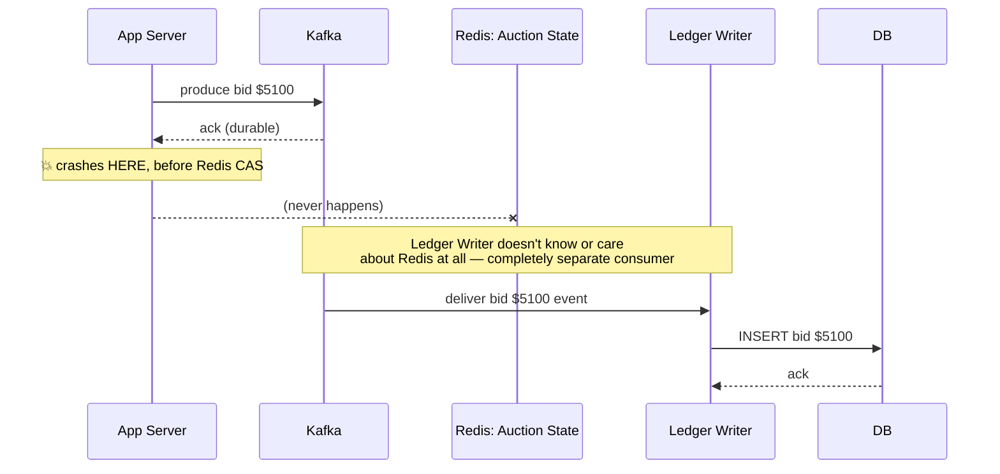

**Direct answers to your three questions:**

1. **What happens?** The bid is safely in Kafka and will eventually land in the durable DB — it is *not lost*. But `current_highest` in Redis is now **stuck at the old value** ($5000, say) — nobody ever told Redis about the $5100 bid.

2. **Does the Ledger Writer process it?** Yes — unconditionally, independently. It's a separate consumer group subscribed to the Kafka topic. It has **no dependency on Redis whatsoever**. It will process this message exactly the same whether Redis was updated or not.

3. **Does the Ledger Writer consume before Redis is updated?** Yes, potentially — there's no ordering guarantee between "app server updates Redis" and "Ledger Writer consumes from Kafka." They're two completely independent, uncoordinated consumers of the same event. This is the crux of the bug.

## Naming the actual problem

This is a well-known pattern called the **dual-write problem**: the app server is writing to **two separate systems** (Kafka and Redis) with no atomicity between them. There is no transaction spanning both — if you crash (or even just experience a network blip) between the two writes, they diverge. This is a classic distributed-systems trap and interviewers specifically listen for whether you catch it.

**Why this actually matters (not just theoretical):** now the *durable DB* says highest bid is $5100, but *Redis* — the thing driving the live fast-path decision and the WebSocket broadcast — still says $5000. A new bidder placing $5050 would get **wrongly accepted** as "new highest," because Redis has no idea $5100 already happened. That's a real correctness bug, not just staleness.

## The fix: stop writing to Redis directly — make it a consumer too

The clean fix follows the **single-writer principle**: only one thing should ever update the "current highest bid" state, and everything else should be a **read**, not an independent write. Instead of the app server writing to both Kafka and Redis, only the app server writes to Kafka — and Redis is updated *by consuming Kafka*, exactly like the DB is.

```mermaid
flowchart LR
    API[App Server] -->|produce only| Kafka[(Kafka)]
    Kafka --> StateConsumer[State Updater Consumer]
    Kafka --> LedgerConsumer[Ledger Writer Consumer]
    StateConsumer -->|update| Redis[(Redis: current highest)]
    LedgerConsumer -->|insert| DB[(Durable DB)]
```

Now Redis and the DB are both just **materialized views derived from the same single source of truth (the Kafka log)**, processed in the same order (same partition, same key = auction_id). They can never structurally diverge the way they just did in your scenario — at worst, one consumer lags slightly behind the other by a few milliseconds, but they will always **converge** to the same value, because they're replaying the exact same ordered log.

**But this creates a new problem — how does the app server give the bidder a fast synchronous "accepted!" response now?** The CAS decision used to happen synchronously, in the app server's own request. Now the decision ("is 5100 actually higher than current") is made by the **State Updater consumer**, asynchronously, after the produce.

The real solution: turn this into a **request/response over an async pipeline** — the app server produces the bid, then waits (with a timeout) for the State Updater to publish a "decision" event tagged with that bid's ID:

```mermaid
sequenceDiagram
    participant Bidder
    participant API as App Server
    participant Kafka
    participant StateConsumer as State Updater
    participant Redis
    participant DecisionChannel as Redis Pub/Sub: decisions

    Bidder->>API: POST bid $5100
    API->>Kafka: produce bid event (bid_id=b-789)
    Kafka-->>API: ack
    API->>DecisionChannel: SUBSCRIBE to decision:b-789 (with timeout, e.g. 500ms)

    Kafka->>StateConsumer: deliver bid event
    StateConsumer->>Redis: atomic CAS (single-threaded, ordered per auction)
    Redis-->>StateConsumer: accepted (5100 > 5000)
    StateConsumer->>DecisionChannel: PUBLISH decision:b-789 {status: ACCEPTED}

    DecisionChannel-->>API: decision received
    API-->>Bidder: 200 OK "Bid accepted!"
```

This is genuinely the more correct design. The honest tradeoff to state out loud in an interview: **you've traded a small amount of added latency (waiting on one consumer hop through Kafka — typically single-digit milliseconds) for eliminating the dual-write inconsistency entirely.** That's almost always the right trade for money-correctness-critical systems like an auction, and naming this exact tradeoff (dual-write problem → single-writer/event-sourced fix → latency cost) is a strong signal in an interview that you understand real distributed systems failure modes, not just the happy path.

Does this resolution make sense? If yes, this closes Part 4 properly — and Part 5 (fan-out at real scale) will build directly on this same "consumer group" mental model.

---

This is exactly the crack I glossed over — you found a real, well-known distributed systems problem. Let's trace it precisely.

## Tracing your exact scenario

```mermaid
sequenceDiagram
    participant API as App Server
    participant Kafka
    participant BidState as Redis: Auction State
    participant Consumer as Ledger Writer
    participant DB

    API->>Kafka: produce bid $5100
    Kafka-->>API: ack (durable)
    Note over API: 💥 crashes HERE, before Redis CAS
    API--xBidState: (never happens)

    Note over Kafka,Consumer: Ledger Writer doesn't know or care<br/>about Redis at all — completely separate consumer
    Kafka->>Consumer: deliver bid $5100 event
    Consumer->>DB: INSERT bid $5100
    DB-->>Consumer: ack
```

**Direct answers to your three questions:**

1. **What happens?** The bid is safely in Kafka and will eventually land in the durable DB — it is *not lost*. But `current_highest` in Redis is now **stuck at the old value** ($5000, say) — nobody ever told Redis about the $5100 bid.

2. **Does the Ledger Writer process it?** Yes — unconditionally, independently. It's a separate consumer group subscribed to the Kafka topic. It has **no dependency on Redis whatsoever**. It will process this message exactly the same whether Redis was updated or not.

3. **Does the Ledger Writer consume before Redis is updated?** Yes, potentially — there's no ordering guarantee between "app server updates Redis" and "Ledger Writer consumes from Kafka." They're two completely independent, uncoordinated consumers of the same event. This is the crux of the bug.

## Naming the actual problem

This is a well-known pattern called the **dual-write problem**: the app server is writing to **two separate systems** (Kafka and Redis) with no atomicity between them. There is no transaction spanning both — if you crash (or even just experience a network blip) between the two writes, they diverge. This is a classic distributed-systems trap and interviewers specifically listen for whether you catch it.

**Why this actually matters (not just theoretical):** now the *durable DB* says highest bid is $5100, but *Redis* — the thing driving the live fast-path decision and the WebSocket broadcast — still says $5000. A new bidder placing $5050 would get **wrongly accepted** as "new highest," because Redis has no idea $5100 already happened. That's a real correctness bug, not just staleness.

## The fix: stop writing to Redis directly — make it a consumer too

The clean fix follows the **single-writer principle**: only one thing should ever update the "current highest bid" state, and everything else should be a **read**, not an independent write. Instead of the app server writing to both Kafka and Redis, only the app server writes to Kafka — and Redis is updated *by consuming Kafka*, exactly like the DB is.

```mermaid
flowchart LR
    API[App Server] -->|produce only| Kafka[(Kafka)]
    Kafka --> StateConsumer[State Updater Consumer]
    Kafka --> LedgerConsumer[Ledger Writer Consumer]
    StateConsumer -->|update| Redis[(Redis: current highest)]
    LedgerConsumer -->|insert| DB[(Durable DB)]
```

Now Redis and the DB are both just **materialized views derived from the same single source of truth (the Kafka log)**, processed in the same order (same partition, same key = auction_id). They can never structurally diverge the way they just did in your scenario — at worst, one consumer lags slightly behind the other by a few milliseconds, but they will always **converge** to the same value, because they're replaying the exact same ordered log.

**But this creates a new problem — how does the app server give the bidder a fast synchronous "accepted!" response now?** The CAS decision used to happen synchronously, in the app server's own request. Now the decision ("is 5100 actually higher than current") is made by the **State Updater consumer**, asynchronously, after the produce.

The real solution: turn this into a **request/response over an async pipeline** — the app server produces the bid, then waits (with a timeout) for the State Updater to publish a "decision" event tagged with that bid's ID:

```mermaid
sequenceDiagram
    participant Bidder
    participant API as App Server
    participant Kafka
    participant StateConsumer as State Updater
    participant Redis
    participant DecisionChannel as Redis Pub/Sub: decisions

    Bidder->>API: POST bid $5100
    API->>Kafka: produce bid event (bid_id=b-789)
    Kafka-->>API: ack
    API->>DecisionChannel: SUBSCRIBE to decision:b-789 (with timeout, e.g. 500ms)

    Kafka->>StateConsumer: deliver bid event
    StateConsumer->>Redis: atomic CAS (single-threaded, ordered per auction)
    Redis-->>StateConsumer: accepted (5100 > 5000)
    StateConsumer->>DecisionChannel: PUBLISH decision:b-789 {status: ACCEPTED}

    DecisionChannel-->>API: decision received
    API-->>Bidder: 200 OK "Bid accepted!"
```

This is genuinely the more correct design. The honest tradeoff to state out loud in an interview: **you've traded a small amount of added latency (waiting on one consumer hop through Kafka — typically single-digit milliseconds) for eliminating the dual-write inconsistency entirely.** That's almost always the right trade for money-correctness-critical systems like an auction, and naming this exact tradeoff (dual-write problem → single-writer/event-sourced fix → latency cost) is a strong signal in an interview that you understand real distributed systems failure modes, not just the happy path.

Does this resolution make sense? If yes, this closes Part 4 properly — and Part 5 (fan-out at real scale) will build directly on this same "consumer group" mental model.

---

Let's build the complete, corrected, implementation-ready flow — no shortcuts this time. I'll go component-by-component, then trace the full timeline step-by-step, then cover every failure branch.

## Components in play

| Component | Role |
|---|---|
| App Server (stateless) | Accepts HTTP requests, produces to Kafka, waits for decision, responds |
| Kafka topic `bids` | Single source of truth, partitioned by `auction_id` |
| **State Updater** (consumer group `state-updater`) | Only writer to Redis auction state |
| **Ledger Writer** (consumer group `ledger-writer`) | Only writer to durable DB |
| Redis: Auction State | `auction:{id}:current_highest`, `auction:{id}:current_bidder` — read-only for app servers |
| Redis Pub/Sub: `decisions` | Ephemeral channel to notify app servers of a decision on a specific bid |
| Redis: Idempotency Store | `idempotency:{key}` → cached response, TTL 24h |
| Postgres: Bid Ledger | Permanent append-only bid history |

Both consumer groups subscribe to the **same topic, same partitions** — Kafka lets multiple independent consumer groups each get their own full copy of the stream, so State Updater and Ledger Writer never interfere with each other.

## Step-by-step: Placing a Bid

```mermaid
sequenceDiagram
    autonumber
    participant UI as Browser
    participant API as App Server
    participant IdemStore as Redis: Idempotency
    participant BidState as Redis: Auction State (read)
    participant Kafka
    participant SU as State Updater Consumer
    participant Decisions as Redis Pub/Sub: decisions
    participant LW as Ledger Writer Consumer
    participant DB as Postgres

    UI->>UI: idempotency_key = uuid()
    UI->>API: POST /auctions/123/bids {amount:5100, idempotency_key}

    API->>IdemStore: GET idempotency:{key}
    alt cache hit (retry)
        IdemStore-->>API: cached {status, bid_id}
        API-->>UI: return cached response, STOP
    end

    API->>BidState: GET auction:123:current_highest
    BidState-->>API: 5000
    alt 5100 <= 5000
        API-->>UI: 409 "bid too low", STOP
    end

    API->>API: bid_id = uuid()
    API->>Decisions: SUBSCRIBE decision:{bid_id}
    API->>Kafka: PRODUCE topic=bids, key=auction_id="123",<br/>value={bid_id, auction_id, bidder_id, amount, idempotency_key},<br/>acks=all
    Kafka-->>API: produce ack (durable, replicated)

    par Consumer 1 (independent)
        Kafka->>SU: deliver message (same partition, in order)
        SU->>BidState: EVAL Lua CAS script:<br/>IF amount > current_highest<br/>THEN SET current_highest=amount, bidder=bidder_id
        BidState-->>SU: result: accepted / rejected
        SU->>Decisions: PUBLISH decision:{bid_id} {status: ACCEPTED, new_highest:5100}
    and Consumer 2 (independent, unordered relative to Consumer 1)
        Kafka->>LW: deliver message
        LW->>DB: INSERT INTO bids (...) ON CONFLICT (idempotency_key) DO NOTHING
        DB-->>LW: ack
        LW->>Kafka: commit offset
    end

    Decisions-->>API: decision:{bid_id} received (status: ACCEPTED)
    API->>IdemStore: SET idempotency:{key} = {status:ACCEPTED, bid_id}, TTL=24h
    API-->>UI: 200 OK {bid_id, status: ACCEPTED, current_highest:5100}
```

## Narrated walkthrough — every line justified

**Step 1-2 (client):** `idempotency_key` is generated once per logical "click," stored in the UI's request state so a retry (same click) reuses it, but a genuinely new bid click generates a new one.

**Step 3-5 (idempotency check):** This is a pure Redis `GET`, sub-millisecond. If the key exists, we already have the answer from a prior attempt — return immediately, don't touch Kafka or anything else. This makes retries safe and cheap.

**Step 6-8 (fast-fail check):** Reading `current_highest` from Redis here is **not the authoritative check** — it's a cheap pre-filter to reject obviously-stale bids before paying for a Kafka round trip. The *real* decision happens later in Step 15 (the Lua CAS inside State Updater). This double-check is intentional and worth stating explicitly in an interview: "optimistic fast-path rejection + authoritative slow-path decision."

**Step 9 (subscribe before produce — order matters!):** The app server subscribes to `decision:{bid_id}` **before** producing to Kafka. If it subscribed *after*, there's a race: State Updater could process the message and publish the decision before the app server even starts listening, and that decision would be lost forever (Pub/Sub has no replay/buffering). Subscribing first closes that race.

**Step 10-11 (produce, with `acks=all`):** The app server does not know or update Redis directly anymore. It only writes to Kafka, and it waits for the broker's ack that the message is durably replicated. `acks=all` is deliberately chosen over `acks=1` here because this is money-correctness-critical — the extra couple of milliseconds of latency is worth guaranteeing the message survives even if the partition leader dies immediately after.

**Steps 12-14 (State Updater — authoritative decision):** This consumer reads messages **in order, per partition** (partition = auction_id, from Part 4's ordering discussion), so bids for the same auction are never processed out of order even under concurrency. The Lua script does the read-check-write as one atomic operation inside Redis — no race window, because Redis executes it as a single indivisible command. This is the *only* place `current_highest` is ever written.

**Steps 16-17 (Ledger Writer — fully independent):** Notice this happens **in parallel**, not after Step 14. It doesn't wait for or depend on the State Updater's decision at all — it just durably records every bid that was ever submitted (accepted or not, if you want a full audit trail — commonly you'd store the State Updater's decision back into this row too, via a secondary update, so the ledger reflects the final ACCEPTED/REJECTED status; see the "closing the loop" note below).

**Steps 18-20 (decision arrives, respond to client):** Only now — after the authoritative decision — do we cache the idempotency result and respond to the bidder. This is the actual fix from before: we no longer respond based on an app-server-local Redis write; we respond based on the single-writer consumer's decision.

## The critical addition your question forced: the timeout

What if State Updater is slow, or Redis Pub/Sub drops the decision message (remember — Pub/Sub is fire-and-forget, no persistence)? The app server can't wait forever.

```mermaid
sequenceDiagram
    participant API as App Server
    participant Decisions as Redis Pub/Sub
    participant UI

    API->>Decisions: SUBSCRIBE decision:{bid_id}
    Note over API: wait up to 2000ms
    alt decision arrives in time
        Decisions-->>API: decision received
        API-->>UI: 200 OK, final status
    else timeout (no decision within 2s)
        API-->>UI: 202 Accepted "processing — check status"
        Note over UI: client polls GET /bids/{bid_id}/status<br/>or waits for a WebSocket push for its own bid
    end
```

This is important to say explicitly in an interview: **you cannot honestly return a synchronous 200 "accepted" forever if the async pipeline is slow — you need a defined timeout and a fallback (return a "pending" status + give the client a way to check later, e.g., poll a status endpoint or just wait for the normal WebSocket broadcast of the auction's new state, since if their bid was accepted, they'll see `current_highest` become their own amount).** This is the same category of tradeoff as the CAP theorem discussions later (Part 10) — you're choosing to not block indefinitely, at the cost of occasionally telling a client "I don't know yet" instead of a clean yes/no.

## Closing one loose thread: does the Ledger Writer know the final decision?

In the flow above, Ledger Writer inserts the bid **before** knowing if State Updater accepted or rejected it. Two reasonable designs, worth naming both:

1. **Ledger stores every bid attempt regardless of outcome**, with a `status` column defaulting to `PENDING`, and a **second, small update** happens when the decision is known (either State Updater itself also publishes to Kafka a "decision" event that Ledger Writer separately consumes and uses to `UPDATE bids SET status=...`, or simpler: Ledger Writer only writes the row once it processes a decision-topic message alongside the bid-topic message).
2. **Only store accepted bids** in the ledger, and log rejected ones separately/cheaply (e.g., just metrics, not a durable row) — simpler, but you lose a full audit trail of "who tried to bid what and got rejected," which auction platforms sometimes want for dispute resolution or fraud detection.

Most real systems pick option 1 with an extra topic (`bid-decisions`) so the ledger ends up fully accurate. I'm flagging this as an explicit design choice rather than silently picking one — in an interview, naming the tradeoff ("do we persist rejected attempts too?") is itself a signal of maturity.

Is this now fully nailed down for you, or is there still a fuzzy edge — the Lua CAS script internals, exact Kafka partition/consumer-group mechanics, or the timeout/polling fallback — that needs its own deep dive before we move to Part 5 (fan-out at real scale)?

---

this system looks so complicated?
Are there any other simpler solutions for this?
Maybe Lets say we insert into the redis first. later through a CDC event is pushed into the queue and db can update it? doesn't it simplify this? or something other simpler?

---

Good pushback — and honestly, "this feels overcomplicated" is exactly the right instinct to have. Let's evaluate your CDC idea directly, then step back and give you the actual simpler answer, because I think we jumped to the hardest version of this problem too early.

## Your idea: Redis first, CDC pushes to Kafka/DB

```mermaid
sequenceDiagram
    participant API as App Server
    participant Redis
    participant CDC as CDC Connector
    participant Kafka
    participant Consumer
    participant DB

    API->>Redis: atomic CAS, accepted
    Redis-->>API: success
    API-->>Bidder: 200 OK
    Redis->>CDC: change event (keyspace notification)
    CDC->>Kafka: publish change
    Kafka->>Consumer: deliver
    Consumer->>DB: write durable record
```

Let's trace what this actually buys and costs you.

**Problem 1 — Redis isn't a real CDC source the way a database is.** CDC (Debezium etc.) works by tailing a database's **write-ahead log** — a durable, ordered, replayable record of every committed change, guaranteed not to lose entries. Redis has "keyspace notifications," but they're **fire-and-forget pub/sub**, not a durable log — if the CDC connector is down for even a second, notifications during that window are gone, permanently, with no way to replay them. So this isn't really CDC in the safety sense you want; it's closer to "Redis Pub/Sub with extra steps," which we already established (Part 2) is fine for *ephemeral broadcast* but not for *the only copy of a financial fact*.

**Problem 2 — you haven't actually removed the dual-write/crash gap, you've just relocated it.** If the app server crashes right after Redis says "success" but before the CDC pipeline captures and durably ships that change onward, you're in the exact same hole as before: the user was told "accepted," and the only copy of that fact lives somewhere that can lose it. You've traded "app server writes to two things" for "Redis's internal durability becomes your only safety net" — and Redis, even with AOF persistence, is not what most teams trust as their financial source of truth.

So: it *feels* simpler because there's one fewer explicit write in the app server's code, but it quietly makes Redis your primary durable store, which is a worse position, not a better one. This is a good idea to have raised though — recognizing "can I use CDC instead of dual-writing" is genuinely a real pattern (it's a known solution to the dual-write problem, called the **CDC/Outbox pattern**), it's just normally applied the other way around: **CDC on the durable database, not on Redis.**

## The actual simpler answer: stop building for viral-scale first

Here's the thing I should have said back in Part 3: **the entire Kafka/dual-consumer/decision-channel pipeline is only necessary because we pre-committed to handling "50 bids/second on one auction."** Most auctions — even successful ones — don't have that. If you're in an interview and haven't been told "assume viral hot-key scale," the *right* answer is to start simple and layer complexity only when asked to scale further. That's a better interview signal than jumping straight to the complex version.

**The simple version — one database, row-level locking, fully synchronous:**

```mermaid
sequenceDiagram
    participant Bidder
    participant API as App Server
    participant DB as Postgres

    Bidder->>API: POST bid $5100, idempotency_key
    API->>DB: BEGIN
    API->>DB: SELECT current_highest FROM auctions WHERE id=123 FOR UPDATE
    DB-->>API: 5000
    alt 5100 > 5000
        API->>DB: INSERT INTO bids (...) 
        API->>DB: UPDATE auctions SET current_highest=5100, bidder='alice'
        API->>DB: COMMIT
        API-->>Bidder: 200 OK, accepted
        API->>PubSub: PUBLISH auction:123 new_highest=5100 (for live viewers)
    else
        API->>DB: ROLLBACK
        API-->>Bidder: 409 bid too low
    end
```

**Why this is genuinely fine for most cases:**
- One transaction, one system, no dual-write, no distributed consistency puzzle — correctness is trivial to reason about (it's just ACID).
- Idempotency is trivial too: a unique constraint on `idempotency_key` in the `bids` table means a retried INSERT just fails harmlessly, which you catch and treat as "already processed."
- The `SELECT FOR UPDATE` serializes bids **per auction**, which is exactly the granularity you want — different auctions don't block each other at all, since they're different rows.
- A modern Postgres instance can comfortably handle **hundreds of locked read-modify-writes per second per row** — which covers the overwhelming majority of real auctions. Even a fairly "hot" auction (a few bids per second) is nowhere near this ceiling.

**When do you actually need the Kafka/dual-consumer complexity from before?** Only when you have a concrete, named reason: *"this specific auction is expected to get 50-100+ bids/second in its closing seconds, and row-lock contention on Postgres would create multi-second queueing delays."* That's a real, citable number-driven trigger — not a default assumption. This is a very strong thing to say explicitly in an interview: **"I'd start with synchronous DB locking — it's simple and correct. I'd only introduce the async event-sourced pipeline with Kafka if we have a specific hot-key/viral-auction requirement, because it trades simplicity for throughput, and that trade isn't worth it until you actually need the throughput."**

**A middle-ground option, before jumping all the way to Kafka:** if a *few* specific hot auctions are the issue rather than general scale, you could keep everything as the simple synchronous DB design, but **only** for those specific hot auctions, add a Redis-based fast-path CAS (the Attempt 4 from Part 3) purely as a **write-through cache with synchronous fallback** — i.e., app server updates Redis and DB **in the same request, sequentially, and simply waits for both** (Redis first since it's fast, DB second) rather than trying to make it fully async and eventually-consistent. This still has a small dual-write risk window, but it's much smaller in blast radius, and you'd explicitly reconcile via a periodic job that checks "does Redis match the DB's last row for this auction" — a background consistency-repair job, rather than a full event-sourced architecture.

**My honest recommendation for how to carry this into interviews:** present the simple synchronous DB-lock design as your **default answer**, then say out loud: *"if the interviewer pushes on 'what if this auction goes viral and gets 100 bids/second,' here's how I'd evolve it"* — and that's when you bring out the Kafka/State-Updater/Ledger-Writer pipeline we built. That progression (simple → justified complexity) is *itself* one of the most valued interview behaviors — it shows you don't reach for Kafka reflexively.

Does the simple version feel solid to you now? If so, I'd suggest we treat **that** as the "Part 3/4 baseline" going forward, and only reintroduce the complex event-sourced version later as "the scaled-up evolution" when we hit Part 5 (fan-out) and revisit hot-key handling in Part 6 (sharding) — that way the story arc matches how you'd actually present it in an interview: simple first, complexity earned. Sound good?

---

Good — let's keep building on the full event-sourced pipeline then. That's the harder, more interesting version anyway, and it's what distinguishes a strong interview answer.

## Part 5: Scaling the Fan-Out

**Where we left off:** we have WebSocket servers subscribing to Redis Pub/Sub channels per auction, broadcasting bid updates to whoever's connected. That worked fine conceptually for 3 servers. Now let's stress it.

**The story:** AuctionHub is now genuinely popular. Instead of 3 WS servers, they need 500 to handle concurrent viewers across thousands of simultaneous auctions. A few new cracks appear that didn't exist at small scale.

**Crack 1 — Redis Pub/Sub has a fan-out ceiling too.**

Redis Pub/Sub is single-threaded, same as everything else in Redis. If one wildly popular auction has 500 WS servers all subscribed to `auction:123`, and bids come in at 50/second, Redis has to push each message to all 500 subscribers — that's 500 × 50 = **25,000 socket writes/second from a single Redis node**, just for one auction's fan-out. Redis can generally handle this fine actually (Pub/Sub fan-out is cheap per-message), but the real issue is different:

**Crack 2 — Redis Pub/Sub has no consumer groups, no replay, no backpressure.** If a WS server is momentarily slow or its network blips, any Pub/Sub messages published during that gap are just gone for that server — its connected viewers silently miss updates until the next one arrives (self-healing, as we said, but still a real gap under heavy load). At small scale this never showed up. At 500 servers, some server is *always* having a brief hiccup, so this becomes a constant low-grade issue rather than a rare one.

**Crack 3 — single Redis Pub/Sub instance is a single point of fan-out for the whole platform.** Every WS server across your entire fleet is connected to the *same* Redis Pub/Sub node for delivery. If that Redis node goes down, **every live auction's broadcast stops simultaneously** — not just one auction. That's a much bigger blast radius than you want for a single dependency.

**The evolution — using Kafka for fan-out too, not just the durability pipeline:**

Since we already have Kafka carrying every bid event (from Part 4), the natural move is to let **WS servers consume directly from Kafka** for the broadcast, instead of adding a separate Redis Pub/Sub hop:

```mermaid
flowchart TB
    subgraph Ingest
        API[App Servers] -->|produce| Kafka[(Kafka topic: bids,<br/>partitioned by auction_id)]
    end

    Kafka --> SU[State Updater]
    Kafka --> LW[Ledger Writer]
    Kafka --> WSFanout[WS Broadcast Consumer Group]

    SU --> Redis[(Redis: state)]
    LW --> DB[(Postgres)]

    WSFanout --> WS1[WS Server 1]
    WSFanout --> WS2[WS Server 2]
    WSFanout --> WS500[WS Server 500]

    WS1 -.-> Viewers1[connected viewers]
    WS2 -.-> Viewers2[connected viewers]
    WS500 -.-> Viewers500[connected viewers]
```

This gives Kafka's durability/replay properties to the broadcast path too — if a WS server briefly disconnects from Kafka, it doesn't lose messages; it resumes from its last committed offset and catches up. That's strictly better than Pub/Sub's silent-drop behavior.

**But this introduces a real, non-obvious problem — think about it before I explain:** Kafka topics are split into a fixed number of **partitions**, and within a consumer group, **each partition is consumed by exactly one consumer at a time**. If auction #123's bids are all routed to partition 7 (by our earlier partitioning-by-auction_id rule), then only **one** WS server in the "WS Broadcast Consumer Group" will ever receive partition 7's messages at any moment.

Given that — if 50,000 viewers of auction #123 are spread across all 500 WS servers, but only *one* of those 500 servers is actually consuming partition 7 from Kafka, how do the other 499 servers' viewers get the update? Take a moment with this — it's the single most important "gotcha" in this whole design, and it's a favorite thing for interviewers to probe once you've proposed "let's just use Kafka for fan-out."

---

Right — this is the crux, so let's nail it precisely.

**The gotcha, stated plainly:** Kafka's consumer group model was designed for **load-balancing work across consumers** (each partition processed by exactly one consumer, so work isn't duplicated) — not for **broadcasting the same message to every consumer**. Those are fundamentally opposite goals. State Updater and Ledger Writer *want* load-balancing (each bid processed exactly once, by one instance, for correctness). But WS fan-out wants the **opposite**: every single WS server that has a viewer on auction #123 needs to receive that message, not just one lucky server.

```mermaid
flowchart LR
    subgraph "What consumer groups give you (wrong for fan-out)"
        P7[Partition 7: auction 123 bids] --> OneServer[Only WS Server 42<br/>gets this message]
    end
    subgraph "What fan-out actually needs"
        P7b[Partition 7: auction 123 bids] --> AllServers[Every WS server with<br/>a viewer on auction 123]
    end
```

So plugging WS servers into Kafka as a normal consumer group is **the wrong tool for this specific job** — it silently breaks broadcast semantics.

**The fix: separate the two roles cleanly instead of trying to force one mechanism to do both.**

- **Kafka's job stays what it's good at:** ordered, exactly-once-per-partition processing for State Updater and Ledger Writer (correctness-critical, load-balanced work).
- **Fan-out to WS servers goes back to a broadcast mechanism** — but now we design *around* Redis Pub/Sub's weaknesses instead of replacing it outright. The realistic industry pattern: **State Updater, after committing the accepted bid to Redis, is the one that publishes the broadcast event** (not the app server directly, and not by having every WS server read Kafka itself).

```mermaid
sequenceDiagram
    participant Kafka
    participant SU as State Updater
    participant Redis as Redis: State
    participant PubSub as Redis Pub/Sub
    participant WS1
    participant WS2
    participant WS500

    Kafka->>SU: bid event (auction 123, $5100)
    SU->>Redis: atomic CAS - accepted
    SU->>PubSub: PUBLISH auction:123 {amount:5100}
    PubSub->>WS1: deliver (subscribed)
    PubSub->>WS2: deliver (subscribed)
    PubSub->>WS500: deliver (subscribed)
```

This is actually the same diagram as Part 2 — we haven't invented something new, we've just correctly identified **where** in the new pipeline the Pub/Sub publish should happen (after State Updater's authoritative decision, not from the app server, since the app server no longer owns that decision).

**Now, does this bring back Crack 2 and Crack 3 (Pub/Sub's silent drops and single-point blast radius)?** Yes — and here's the honest answer: **for the specific job of "broadcast a live, self-correcting value to viewers," you generally accept Redis Pub/Sub's weaknesses, because the self-healing property (next update fixes any missed one) makes the risk tolerable** — this is the same reasoning from Part 2. The blast radius concern (crack 3) is real though, and the actual mitigation is **Redis Pub/Sub in cluster mode / sharded Pub/Sub** (available in Redis 7+) — you shard channels across multiple Redis nodes by key (e.g., hash of `auction_id`), so a single node failing only takes down broadcast for the subset of auctions hashed to it, not the whole platform. This is directly analogous to Kafka partitioning — same underlying idea (shard by key to bound blast radius and spread load), applied to Redis instead.

```mermaid
flowchart TB
    SU[State Updater] -->|hash auction_id| Shard{Which Redis shard?}
    Shard -->|hash % 3 == 0| R0[(Redis Pub/Sub Shard 0)]
    Shard -->|hash % 3 == 1| R1[(Redis Pub/Sub Shard 1)]
    Shard -->|hash % 3 == 2| R2[(Redis Pub/Sub Shard 2)]

    R0 --> WSsubset0[WS servers subscribed<br/>to shard 0's auctions]
    R1 --> WSsubset1[WS servers subscribed<br/>to shard 1's auctions]
    R2 --> WSsubset2[WS servers subscribed<br/>to shard 2's auctions]
```

**One more real-world nuance worth naming — the "N WS servers, but do they all need every auction's channel?"** A WS server should only subscribe to `auction:123` on whichever Redis shard when it actually has ≥1 local viewer watching auction 123 — exactly the same subscribe/unsubscribe-on-demand logic from Part 2. This matters more now: with thousands of concurrent auctions, no single WS server should blindly subscribe to *all* channels — it maintains subscriptions only for auctions it's actively serving, keeping its own subscription count proportional to its local viewer diversity, not the platform's total auction count.

**Recap — the corrected end-to-end picture for Part 4 + 5 combined:**

```mermaid
flowchart TB
    Bidder[Bidder] --> API[App Server]
    API -->|produce, acks=all| Kafka[(Kafka: bids topic,<br/>partitioned by auction_id)]

    Kafka --> SU[State Updater<br/>consumer group]
    Kafka --> LW[Ledger Writer<br/>consumer group]

    SU -->|atomic CAS| RedisState[(Redis: Auction State)]
    SU -->|publish decision| DecisionCh[Redis Pub/Sub: decisions]
    SU -->|publish broadcast| BroadcastCh[Redis Pub/Sub: broadcast,<br/>sharded by auction_id]

    LW --> DB[(Postgres: Bid Ledger)]

    DecisionCh --> API
    API -->|200 OK| Bidder

    BroadcastCh --> WSFleet[WS Server Fleet]
    WSFleet -.-> Viewers[Connected Viewers]
```

This is the point where you can tell an interviewer, with confidence: *"correctness-critical writes flow through Kafka consumer groups (exactly-once-per-partition), while live broadcast flows through sharded Pub/Sub (fire-and-forget, self-healing, bounded blast radius) — because those are different problems with different guarantees needed, and using the same mechanism for both would either break correctness or break scalability."* That sentence alone is a strong interview answer.

Ready for **Part 6: Sharding & Partitioning** — where we zoom out from "one hot auction" to "millions of auctions across a database," and the hot-partition problem shows up again in a new form?

---

That's a genuinely good instinct, and it maps to a real pattern used in production systems (Discord, Slack, and various chat/live-event platforms all do variations of this). Let's work through it properly — what it fixes, and the new problem it creates that most people miss.

**What you're proposing, made concrete:**

```mermaid
flowchart TB
    Viewer[New Viewer wants auction 123] --> LB{Load Balancer /<br/>Connection Router}
    LB -->|"check: who's already<br/>subscribed to auction 123?"| Registry[(Registry: auction_id -><br/>list of WS servers serving it)]
    Registry -->|"WS Server 7 is already<br/>subscribed, has capacity"| LB
    LB --> WS7[WS Server 7]
```

**What this fixes:** right now, a random/round-robin load balancer might send viewer #1 of auction 123 to Server 3, viewer #2 to Server 91, viewer #3 to Server 217 — meaning potentially **hundreds of WS servers each end up subscribing to the same Redis Pub/Sub channel just to serve one viewer each**. Your idea reduces that: if we can concentrate viewers of the same auction onto fewer servers, fewer total Pub/Sub subscriptions exist platform-wide, and each server does more useful work per subscription. This is a real efficiency gain — good catch.

**The new problem this creates — and it's the same shape of problem we've hit twice already:**

If you always route new viewers of a hot auction to "whichever server already has it," and that auction goes viral (50,000 viewers), you'll keep stuffing viewers onto the **same handful of servers** until they're the only ones serving that auction. Now:

```mermaid
flowchart TB
    Viewer1[Viewers 1-50000<br/>all routed here] --> WS7[WS Server 7:<br/>trying to hold 50,000<br/>WebSocket connections]
    WS7 -->|CPU/memory/socket limits| Overload[💥 Server 7 overloaded]
```

A single server has real limits — typically tens of thousands of concurrent WebSocket connections is achievable per modern server (numbers vary a lot by hardware/config, but there's always a ceiling), plus CPU cost of serializing/sending a message to every one of them on each broadcast. You've essentially recreated **the hot-key/hot-partition problem** (same one from Part 3's Redis row, same one we'll formally name in Part 6) — except now applied to WebSocket connection capacity instead of database writes.

**The fix: bounded pools per auction, not a single server per auction.**

Instead of "find *the* server for this auction," use "find *a* server from a **capacity-bounded pool** of servers currently serving this auction, adding a new server to the pool only when existing ones are full":

```mermaid
sequenceDiagram
    participant Viewer
    participant LB as Connection Router
    participant Registry as Redis: auction_pools
    participant WS7
    participant WS91

    Viewer->>LB: connect to auction 123
    LB->>Registry: GET pool:auction:123
    Registry-->>LB: [WS7 (48k/50k conns), WS91 (12k/50k conns)]
    LB->>LB: pick least-loaded server in pool: WS91
    LB->>WS91: route here
    WS91->>Registry: (if not already subscribed) subscribe to Pub/Sub channel auction:123
```

When all servers in the pool hit a capacity threshold (say, 80% full), the router **adds a new server to that auction's pool** rather than continuing to overload existing ones:

```mermaid
flowchart LR
    subgraph "Auction 123's pool (grows only when needed)"
        WS7["WS7 (50k/50k - full)"]
        WS91["WS91 (50k/50k - full)"]
        WS205["WS205 (new, 1/50k)"]
    end
    NewViewer[New viewer] --> WS205
```

This gives you the best of both: for a *normal* auction with 200 viewers, they naturally consolidate onto 1-2 servers (fewer subscriptions, your original goal), but a *viral* auction automatically spreads across as many servers as its actual connection count needs (avoiding the overload you'd get from rigid "always the same server" routing).

**One more practical detail — how does the registry itself stay correct and fast?** This "which servers are in which auction's pool, and how full is each" state needs to live somewhere shared and fast — Redis again (a Hash or Sorted Set per auction_id, updated via `INCR`/`DECR` as connections open/close, with a TTL-based heartbeat so a crashed WS server's stale entry ages out rather than the router routing viewers to a dead server forever). This is a small but real operational detail interviewers sometimes probe: *"what if the server you routed someone to had actually just crashed 2 seconds ago?"* — answer: the router should treat a failed connection attempt as a signal to remove that server from the pool immediately and retry against another, not just trust the registry blindly (registries can be stale; always have a fallback on actual connection failure).

**Naming the pattern for the interview:** this is essentially the same idea as **consistent hashing with bounded virtual nodes**, or what's sometimes called **"shard assignment with rebalancing"** — you're not statically assigning "auction 123 always → server 7," you're dynamically assigning to a *pool* and growing the pool under load. It's the same underlying principle you'll see again in Part 6 for database sharding: **route by key for locality, but never let one key's traffic be pinned to a single physical resource with a hard ceiling.**

Good catch on this — it's the kind of refinement interviewers like seeing you arrive at yourself rather than needing to be led to. Ready to move to **Part 6: Sharding & Partitioning**, where this exact "hot key" theme reappears in the database layer?

---

## Part 6: Sharding & Partitioning

**The story:** AuctionHub now has millions of auctions — past, present, and future — and a single Postgres instance holding the `auctions` and `bids` tables is straining under total data volume and total query load (not just one hot auction anymore, but the *aggregate* of everything). Maya needs to split this data across multiple database instances. This is **sharding**.

**The core idea:** instead of one giant database holding every auction, split auctions across N smaller databases ("shards"), each holding a subset. The critical design question is: **how do you decide which auction goes to which shard**, such that (a) lookups are fast, and (b) load is spread evenly?

**Attempt 1: Range-based sharding.**

Shard by ranges of `auction_id` (assuming sequential IDs) — e.g., auctions 1–1M go to Shard 0, 1M–2M to Shard 1, etc.

```mermaid
flowchart LR
    A1[auction_id: 1 - 1,000,000] --> S0[(Shard 0)]
    A2[auction_id: 1,000,001 - 2,000,000] --> S1[(Shard 1)]
    A3[auction_id: 2,000,001 - 3,000,000] --> S2[(Shard 2)]
```

**Advantage:** easy to reason about, easy to add new shards for new ID ranges as they're created, and range scans (e.g., "get all auctions created in this ID window") are efficient since they live on one shard.

**Problem — the same "hot key" theme from Parts 3 and 5, now at the shard level:** all the *newest, currently-active* auctions land on the **highest** shard (whichever range is currently being filled), since new auctions get the next sequential ID. But active/live auctions are exactly where all the read/write traffic concentrates — bids, viewers, everything. So the newest shard becomes a hot shard while older shards, holding closed/historical auctions, sit nearly idle. You've spread the *data* evenly but not the *traffic* — this is a very common sharding mistake to flag in interviews.

```mermaid
flowchart TB
    S0["Shard 0<br/>(old, closed auctions)<br/>~0% of traffic"]
    S1["Shard 1<br/>(old, closed auctions)<br/>~0% of traffic"]
    S2["Shard 2<br/>(NEW auctions, all live)<br/>~90% of traffic 🔥"]
```

**Attempt 2: Hash-based sharding.**

Instead of ranges, hash the `auction_id` and mod by the number of shards: `shard = hash(auction_id) % N`.

```mermaid
flowchart LR
    A[auction_id: 4471] -->|hash % 4| Calc{hash = ...}
    Calc -->|result: 2| S2[(Shard 2)]
```

**Advantage:** this scatters auctions (and therefore their traffic) essentially randomly and evenly across all shards, regardless of when they were created — a viral new auction is just as likely to land on Shard 0 as Shard 3. This solves the "newest shard is always hottest" problem from Attempt 1.

**New problem this creates:** what happens when you need to **add a 5th shard** because you've outgrown 4? `hash(auction_id) % 4` and `hash(auction_id) % 5` give completely different answers for almost every single key — meaning nearly **all** existing data needs to be reshuffled/moved to new shards simultaneously. This is called the **resharding problem**, and it's expensive and risky to do live (you'd need to migrate huge amounts of data while the system stays up).

**Attempt 3: Consistent hashing — the real-world answer.**

Instead of `hash % N` (which breaks completely when N changes), place both shards and keys onto a **conceptual ring** (a hash space from 0 to some max value, wrapping around). Each shard owns a position on the ring; a key belongs to whichever shard is the *next one clockwise* from its own hash position.

```mermaid
flowchart TB
    subgraph Ring["Hash Ring (conceptual)"]
        direction TB
        S1p["Shard 1 @ position 90"]
        S2p["Shard 2 @ position 200"]
        S3p["Shard 3 @ position 20"]
    end
    Key1["auction hash = 50 -> goes to Shard 1 (next clockwise)"]
    Key2["auction hash = 150 -> goes to Shard 2"]
    Key3["auction hash = 250 -> goes to Shard 3 (wraps around)"]
```

**Why this fixes resharding:** when you add a new Shard 4 at some position on the ring, it only "steals" the keys that fall between its position and the *previous* shard's position — everything else on the ring is completely undisturbed. Instead of reshuffling ~100% of your data (like `hash % N` does), you typically only move **roughly 1/N of the data** — just the portion that now belongs to the new shard.

```mermaid
flowchart TB
    subgraph "Before: 3 shards"
        direction LR
        A1[Shard 1] --> A2[Shard 2] --> A3[Shard 3] --> A1
    end
    subgraph "After: adding Shard 4"
        direction LR
        B1[Shard 1] --> B2[Shard 2] --> B4["Shard 4 (new)<br/>only takes keys between<br/>Shard 2 and Shard 4"] --> B3[Shard 3] --> B1
    end
```

**A practical refinement — virtual nodes:** with only a few real shards placed on the ring, you can still get uneven distribution by luck of where they land. The standard fix (used by DynamoDB, Cassandra, and most real systems) is **virtual nodes**: each physical shard is actually placed at *many* points around the ring (e.g., 100–200 virtual positions per real shard), so the load evens out statistically, and when a shard is added/removed, its virtual nodes' worth of keys are spread across many other shards rather than dumped on just one or two neighbors.

**Now — the recurring hot-key problem shows up again, and this time hashing alone can't fully save you.**

Even with perfect consistent hashing, if **one single auction_id** goes viral, all of that auction's read/write traffic still lands on **one shard**, because sharding routes by key — and one key, by definition, lives on exactly one shard. Sharding solves "spread millions of auctions evenly," it does **not** solve "one auction has more traffic than any single shard can handle" — that's precisely why Parts 3-5's whole Redis/Kafka pipeline exists *in front of* the sharded database: the hot-path decision-making (Redis CAS) and fan-out (Pub/Sub) absorb the extreme concurrency for a single viral auction, while the sharded durable DB just needs to handle the steady-state async write-behind rate, not the raw bid-per-second spike. This is a great synthesis point to make explicit in an interview: **"sharding solves horizontal scale of aggregate data/traffic across many keys; it does not solve a single hot key — that requires the in-memory/queue-based hot-path pattern we built earlier, working together with sharding, not instead of it."**

**One more real design decision — what do you actually shard by?** We've been assuming `auction_id`, but consider: do you also need to query "all auctions by seller X" or "all bids by bidder Y" efficiently? If you shard purely by `auction_id`, those cross-cutting queries now require **scatter-gather** — querying every shard and merging results, which is slow and expensive at scale.

```mermaid
flowchart TB
    Query["Get all bids by bidder Y"] --> S0[(Shard 0: check)]
    Query --> S1[(Shard 1: check)]
    Query --> S2[(Shard 2: check)]
    Query --> S3[(Shard 3: check)]
    S0 & S1 & S2 & S3 --> Merge[Merge results from all shards]
```

The common real-world answer: keep `auction_id`-sharding as primary (since bids are the hot, high-write-volume data and need locality with their auction), and maintain a **separate denormalized index/materialized view** (e.g., in Elasticsearch, or a separate "bidder_history" table/service) specifically for "all bids by user X" type queries, updated asynchronously (via — you guessed it — the same Kafka event stream, since every bid already flows through it). This is a recurring HLD theme worth internalizing: **shard your primary/hot-write data one way, and build secondary indexes/read-optimized views for the query patterns that don't align with that sharding key**, rather than trying to pick one sharding key that satisfies every access pattern (usually impossible).

**Quick recap table for this section:**

| Strategy | Pro | Con |
|---|---|---|
| Range-based | Simple, good for range scans | New/active data (and thus hot traffic) clusters on one shard |
| Hash (`% N`) | Even distribution | Resharding requires moving ~100% of data |
| Consistent hashing (+ virtual nodes) | Even distribution, resharding moves only ~1/N of data | More complex to implement/reason about |
| Sharding in general | Solves aggregate scale | Does NOT solve single hot-key traffic — needs Redis/Kafka hot path in front |

Ready for **Part 7: Caching** — where we go deeper on what to cache, cache invalidation strategy, and the "cache stampede" failure mode?

---

## Part 7: Caching

**The story:** With sharding solved, Maya turns to a different pain point: most traffic on AuctionHub isn't bidding at all — it's **browsing**. People scroll auction listing pages, view auction details, check "current highest bid" without ever placing a bid themselves. Every one of these reads currently hits a sharded Postgres database. Read load is dominating, and it's wasteful — the same auction detail page is being read thousands of times between actual writes.

**What to cache — think in layers, not "just add Redis everywhere":**

```mermaid
flowchart TB
    subgraph "What gets read constantly"
        A[Auction listing pages<br/>changes rarely]
        B[Auction detail / current highest bid<br/>changes often during active auction]
        C[User profile / bid history<br/>changes rarely]
        D[Static images/thumbnails<br/>never changes once uploaded]
    end
```

Each of these has a **different read/write ratio and different staleness tolerance**, and that difference should drive *how* (and whether) you cache it.

**Case 1 — Auction listing pages (browse/search results).** These change relatively rarely (new auctions added, old ones close) compared to how often they're read. Classic **cache-aside pattern**: on a read, check cache first; on a miss, read DB and populate cache; writes (new auction created) invalidate/update the relevant cache entries.

```mermaid
sequenceDiagram
    participant Client
    participant App as App Server
    participant Cache as Redis Cache
    participant DB

    Client->>App: GET /auctions?category=electronics
    App->>Cache: GET listing:electronics:page1
    alt cache hit
        Cache-->>App: cached listing
        App-->>Client: return (fast, no DB hit)
    else cache miss
        App->>DB: query listings
        DB-->>App: results
        App->>Cache: SET listing:electronics:page1, TTL=30s
        App-->>Client: return
    end
```

A short TTL (say 30 seconds) is usually good enough here — nobody notices or cares if a brand-new listing takes 30 seconds to appear in a browse page. This is a case where **eventual consistency is completely fine**, and you should say so explicitly in an interview rather than over-engineering strict invalidation for something nobody needs strict on.

**Case 2 — Current highest bid on an active auction. This is the interesting one.** You might think "just cache this like anything else" — but wait: we already have this in Redis! Recall Parts 3-5: `current_highest` lives in Redis as the **authoritative live state**, updated by State Updater via atomic CAS. This isn't a "cache" of the DB in the traditional sense — it's the **primary hot-path source of truth for in-progress auctions**, with the DB as the durable backing/audit store. This distinction matters in interviews: **not everything that lives in Redis is "a cache" — sometimes it's intentionally the fast tier of a tiered-consistency system.** Calling it "just a cache" would actually undersell the design you built.

For a *closed* auction though, once it's over, the final result is now genuinely a cache-able "read mostly, never changes again" value — a completed auction's final price is permanently the same. This is a great one to cache aggressively with a **very long or infinite TTL**, since it truly never changes.

**Case 3 — the interesting failure mode: cache stampede.**

Imagine a wildly popular, currently-active auction's detail page is cached with a 5-second TTL (short, because the price is changing). At the exact moment that cache entry expires, and 10,000 concurrent viewers all request that page in the same instant:

```mermaid
sequenceDiagram
    participant V1 as Viewer 1
    participant V2 as Viewer 2
    participant Vn as ...10,000 viewers
    participant Cache
    participant DB

    Note over Cache: TTL just expired
    V1->>Cache: GET auction:123 - MISS
    V2->>Cache: GET auction:123 - MISS
    Vn->>Cache: GET auction:123 - MISS
    V1->>DB: query (all 10,000 do this simultaneously!)
    V2->>DB: query
    Vn->>DB: query
    Note over DB: 💥 10,000 simultaneous identical<br/>queries hit the DB at once
```

This is called a **cache stampede** (or "thundering herd," reusing a term from Part 1's polling problem — same underlying shape: many requests suddenly converging on one backend at once). The cache, which exists specifically to protect the DB, briefly stops protecting it at exactly the worst moment — right when something is popular enough to expire from heavy access.

**Fix 1 — Request coalescing / locking ("single flight").** When a cache miss happens, the *first* request to notice the miss acquires a short-lived lock (e.g., `SET auction:123:lock NX EX 5` in Redis) and is the only one allowed to actually query the DB and repopulate the cache. Every other concurrent request that sees the miss simply **waits briefly and retries the cache read** instead of also hitting the DB.

```mermaid
sequenceDiagram
    participant V1 as Viewer 1 (first)
    participant V2 as Viewer 2 (concurrent)
    participant Cache
    participant DB

    V1->>Cache: GET auction:123 - MISS
    V1->>Cache: SET lock:auction:123 NX (acquired!)
    V2->>Cache: GET auction:123 - MISS
    V2->>Cache: SET lock:auction:123 NX (fails, already locked)
    Note over V2: wait 50ms, retry cache read instead of hitting DB
    V1->>DB: query (only one query hits DB)
    DB-->>V1: result
    V1->>Cache: SET auction:123, result
    V2->>Cache: GET auction:123 - HIT now!
```

**Fix 2 — Staggered/jittered TTLs.** If many cache entries were all populated at the same time (e.g., a bulk cache-warm on deploy), they'll all expire at the same time too, causing synchronized stampedes across *many different keys* at once. Adding a small random jitter to each TTL (e.g., `30s + random(0, 5s)`) spreads expirations out so they don't all hit the DB simultaneously.

**Fix 3 — Serve stale while revalidating.** Instead of treating an expired cache entry as "gone," keep serving the slightly-stale value to viewers while *one* background request refreshes it. Viewers get a fast response (maybe 1-2 seconds stale) instead of everyone waiting on/triggering a DB hit. This trades a small amount of staleness for a much smoother load profile — a very reasonable trade for something like a browse page, less so for the live current-bid value where staleness has real consequences (as we covered all the way back in Part 1's polling problem).

**Case 4 — Cache invalidation on write. The classic "two hard problems in computer science" joke exists for a reason.** When an auction's data changes (e.g., description edited by the seller), do you:
- **Invalidate** (delete the cache entry, let the next read repopulate it) — simpler, momentary cache-miss cost, but guarantees no stale data lingers.
- **Update in place** (write the new value directly to cache on write) — avoids the miss, but risks a race: if two writes happen close together and their cache-updates arrive out of order, the cache can end up holding an **older** value than the DB, permanently wrong until the next natural TTL expiry or another write.

For most fields (descriptions, images, metadata), **invalidate-on-write** is the safer default specifically because of that ordering risk — it's simpler to reason about and self-heals via the next read.

**One more layer worth naming — CDN as a "cache," but for a different kind of content.** Auction images/thumbnails are a great fit for a CDN (Part 8 territory, but worth flagging the boundary here): CDNs cache **static, rarely-changing, geographically-distributed** content close to users, whereas Redis caches **dynamic, frequently-changing, server-side** data close to your application. Different tools for different jobs — a common interview slip-up is treating "caching" as one monolithic concept instead of distinguishing "edge/CDN caching for static assets" from "application-layer caching for computed/DB data."

**Recap table:**

| What | Cache type | TTL strategy | Key risk |
|---|---|---|---|
| Auction listings | Redis, cache-aside | Short TTL + jitter | Stampede on expiry |
| Live current bid (active auction) | Redis, source-of-truth tier (not a traditional cache) | N/A — updated synchronously by State Updater | Dual-write if mismanaged (Part 4) |
| Closed auction final price | Redis, cache-aside | Very long/infinite TTL | None — data is immutable |
| Auction images | CDN | Long TTL, versioned URLs | Stale image after edit (fixed via cache-busting filename) |

Ready for **Part 8: CDN & Static Content**, where we go deeper on that image/CDN piece — including the cache-busting mention above — or do you want to sit with cache stampede/invalidation a bit more first?

---

## Part 8: CDN & Static Content

**The story:** AuctionHub's traffic is now global — bidders in Tokyo, Berlin, São Paulo. Every auction listing shows item photos, and Maya's servers (all sitting in one AWS region, say `us-east-1`) are serving every single image request across the globe. A viewer in Tokyo loading an auction page waits for images to travel halfway around the world — high latency, and it's also just wasted repeated work, since the same popular auction's images are being fetched by thousands of different users.

**What a CDN actually does — the core mental model:** A CDN (Content Delivery Network) is a globally distributed set of **edge servers/caches** that sit physically close to end users. Instead of every image request traveling back to your origin server, it's served from a nearby edge node that already has a cached copy.

```mermaid
flowchart TB
    subgraph Without CDN
        UserTokyo1[User in Tokyo] -->|~200ms round trip| Origin[Origin Server, us-east-1]
        UserBerlin1[User in Berlin] -->|~150ms round trip| Origin
    end
```

```mermaid
flowchart TB
    subgraph With CDN
        UserTokyo2[User in Tokyo] -->|~10ms| EdgeTokyo[CDN Edge: Tokyo]
        UserBerlin2[User in Berlin] -->|~10ms| EdgeBerlin[CDN Edge: Berlin]
        EdgeTokyo -.->|cache miss only, rare| Origin2[Origin Server]
        EdgeBerlin -.->|cache miss only, rare| Origin2
    end
```

The first request for an image from any given region is a **cache miss** at the edge — it fetches from your origin once, caches it there, and every subsequent request from nearby users is served locally, fast, without ever touching your origin server again (until the cache entry expires or is evicted).

**Why this matters for a live auction system specifically — two distinct benefits:**

1. **Latency** — images load fast globally, which matters a lot for an auction site where visual appeal of the item directly affects bidding behavior (a slow-loading guitar photo is a worse auction experience).
2. **Origin offload** — your actual servers never see the bulk of image traffic at all. This is huge: without a CDN, a viral auction's image could get requested 100,000+ times, and every one of those would otherwise hit your origin infrastructure — competing for the same capacity your bidding APIs need. The CDN absorbs almost all of that load before it ever reaches you.

**What should and shouldn't go through a CDN — a common interview distinction:**

| Content type | CDN-appropriate? | Why |
|---|---|---|
| Item photos/thumbnails | ✅ Yes | Static, rarely changes, high read volume, safe to cache long |
| JS/CSS bundles | ✅ Yes | Static, versioned on deploy |
| Auction listing page HTML (SSR) | ⚠️ Sometimes, with short TTL | Semi-dynamic — some CDNs support short-TTL caching for this |
| Current highest bid API response | ❌ No | Changes every second during active bidding — caching this at the edge would show every viewer stale prices, which is exactly the Part 1 problem we started with |
| WebSocket connections | ❌ No (not applicable) | CDNs cache/serve content; a live bidirectional connection isn't cacheable content at all |

This table is worth internalizing as a rule of thumb: **CDN for anything static-per-URL; never CDN for anything that must reflect real-time state.** An interviewer will sometimes probe "would you put the bid API behind a CDN?" specifically to see if you understand this boundary — the correct answer is a confident no, with the reasoning above.

**The cache invalidation problem for images — and the elegant fix.** Say a seller uploads a new photo replacing the old one, same filename `item123.jpg`. If the CDN edge cached the old version with a 24-hour TTL, users could see the stale image for up to a day. Two approaches:

**Approach 1 — active purge/invalidation.** Explicitly tell the CDN "evict this URL from all edges now" via an API call. This works but is slower (can take seconds to minutes to propagate globally) and adds operational complexity (you must remember to call it on every update).

**Approach 2 — cache-busting via versioned/content-addressed URLs (the standard real-world answer).** Instead of always serving `item123.jpg`, name the file using a hash of its content or a version number: `item123-a1b2c3.jpg`. When the seller uploads a new photo, it gets a **new URL** entirely (`item123-d4e5f6.jpg`), and the auction listing's HTML/API response is simply updated to point to the new URL.

```mermaid
sequenceDiagram
    participant Seller
    participant App as App Server
    participant S3 as Object Storage
    participant CDN

    Seller->>App: upload new photo
    App->>S3: store as item123-d4e5f6.jpg (hash-based name)
    App->>DB: UPDATE auction SET image_url = ".../item123-d4e5f6.jpg"
    Note over CDN: old URL item123-a1b2c3.jpg still cached,<br/>but nobody references it anymore - harmless
    Note over CDN: new URL is a cache MISS the first time,<br/>then cached fresh from here on
```

This sidesteps invalidation entirely — you never need to tell the CDN "forget this," because **the old cached content is simply never requested again** once the reference to it disappears from your app. This pattern (content-addressed/versioned URLs to avoid invalidation) shows up constantly in real systems (webpack bundle hashes, S3 + CloudFront setups) and is a strong thing to mention proactively in an interview as "I'd avoid needing invalidation at all by using versioned URLs" rather than describing a purge API.

**Origin architecture — where do images actually live "at rest"?** Not on your app servers' local disk (that doesn't scale, isn't durable, and isn't shareable across servers). The standard setup: images are uploaded directly to **object storage** (S3, GCS), and the CDN sits **in front of** that object storage as its origin — your app servers are barely involved in serving images at all, just in generating upload URLs and storing references.

```mermaid
flowchart LR
    Seller -->|1: request upload URL| App[App Server]
    App -->|2: pre-signed URL| Seller
    Seller -->|3: upload directly| S3[(Object Storage: S3)]
    Viewer[Any Viewer] -->|4: request image| CDN
    CDN -->|cache miss: fetch once| S3
```

Notice step 3: the seller's browser uploads **directly** to S3 using a **pre-signed URL** the app server generated — the actual image bytes never pass through your app servers at all. This avoids your app servers becoming a bottleneck/bandwidth cost center for large file uploads, and is a detail worth mentioning when discussing "how does image upload work" in an interview — many candidates default to "upload to my server, then my server uploads to S3," which is a needless extra hop and a scalability bottleneck.

**Recap of Part 8's core ideas:**
- CDN = edge caching for latency + origin offload, appropriate only for content that's the same for everyone (or cacheable with short TTL) — never for live per-request state.
- Prefer versioned/content-addressed URLs over active cache purging — sidesteps invalidation complexity entirely.
- Uploads should go client → object storage directly (via pre-signed URLs), not routed through app servers.

Ready for **Part 9: The Auction Close Problem** — this is a great one, since it's unique to auctions specifically (unlike caching/CDN, which apply to most systems) and covers distributed timers, "sniping," and making sure exactly one "auction ended" event fires?

---

Good — this deserves its own deep dive since we've been using Kafka as a black box for four parts now. Let's open it up properly.

## Kafka's core structure: topics, partitions, brokers

A **topic** (e.g., `bids`) is a logical name. Under the hood, it's split into a fixed number of **partitions** — each partition is literally an **append-only log file** on disk (ordered sequence of messages, each with an incrementing offset).

```mermaid
flowchart TB
    subgraph Topic["Topic: bids"]
        P0["Partition 0: [msg0][msg1][msg2][msg3]..."]
        P1["Partition 1: [msg0][msg1][msg2]..."]
        P2["Partition 2: [msg0][msg1][msg2][msg3][msg4]..."]
    end
```

These partitions are physically spread across multiple **brokers** (Kafka server instances) in a cluster:

```mermaid
flowchart TB
    subgraph Broker1["Broker 1"]
        P0L["Partition 0 (leader)"]
        P2F["Partition 2 (replica)"]
    end
    subgraph Broker2["Broker 2"]
        P1L["Partition 1 (leader)"]
        P0F["Partition 0 (replica)"]
    end
    subgraph Broker3["Broker 3"]
        P2L["Partition 2 (leader)"]
        P1F["Partition 1 (replica)"]
    end
```

This is how Kafka **handles load**: since each partition is an independent, physically separate log (potentially on a different disk/machine entirely), work is naturally parallelized. Producers writing to Partition 0 and Partition 1 are hitting completely different brokers, different disks — no contention between them at all. This is exactly why sequential appends across many partitions can sustain enormous aggregate throughput (millions of messages/sec cluster-wide), even though each individual partition is just a simple, dumb, ordered append.

## How a message gets assigned to a partition — this is where ordering comes from

When you produce a message, you supply a **key** (in our case, `auction_id`). Kafka runs `hash(key) % num_partitions` to deterministically choose which partition it goes to.

```mermaid
flowchart LR
    Msg1["key=auction_123"] -->|hash % 3| P1["Partition 1"]
    Msg2["key=auction_123"] -->|hash % 3, same key = same partition| P1
    Msg3["key=auction_456"] -->|hash % 3, different result| P2["Partition 2"]
```

**This is the entire mechanism behind our ordering guarantee from Part 4.** Every bid for `auction_123` hashes to the same partition, every time. Within a single partition, Kafka **guarantees strict append order** — messages are written to the log in the order they arrive, and consumers read them back in that exact same order, always. That's it — that's the whole trick. Kafka doesn't guarantee any ordering *across* partitions (auction_123's bids and auction_456's bids have no defined relative order, and that's fine — they're unrelated).

**Important nuance:** this is why choosing a good partition key matters enormously. If you'd instead partitioned by, say, `bidder_id`, then two different bids on the *same auction* from two *different* bidders could land on different partitions and be processed out of order relative to each other — breaking the exact guarantee we needed. Always partition by the entity whose internal ordering you actually care about preserving. This is a very common thing interviewers probe: "why partition by X and not Y."

## Replication — how a partition survives a broker dying

Each partition has one **leader** (handles all reads/writes for that partition) and N **followers/replicas** (passive copies on other brokers, continuously pulling/copying the leader's log).

```mermaid
sequenceDiagram
    participant Producer
    participant Leader as Broker 2 (Partition 1 Leader)
    participant Rep1 as Broker 1 (Replica)
    participant Rep3 as Broker 3 (Replica)

    Producer->>Leader: produce message
    Leader->>Leader: append to local log
    Leader->>Rep1: replicate
    Leader->>Rep3: replicate
    Rep1-->>Leader: ack
    Rep3-->>Leader: ack
    Note over Leader: once enough replicas ack (per acks setting),<br/>message is considered "committed"
    Leader-->>Producer: produce ack
```

This is exactly where the **`acks` setting** from Part 4 plugs in:
- `acks=0` — producer doesn't wait for any ack at all. Fastest, but a message can be silently lost if the leader crashes before writing it anywhere durable. Never use this for bids.
- `acks=1` — producer waits only for the **leader** to write it locally. Fast, but if the leader crashes *before* replicating to followers, that message is gone even though the producer got an ack (a real, if narrow, data-loss window).
- `acks=all` (what we chose for bids) — producer waits until the message is replicated to all **in-sync replicas (ISR)** — the set of replicas that are caught up and healthy. Now even if the leader dies immediately after, one of the followers already has the message and will be promoted to leader with no data loss.

**What happens when the leader actually dies?** Kafka's controller (an elected coordinator role among the brokers) detects the failure (via heartbeat/session timeout) and promotes one of the in-sync replicas to be the new leader. Producers and consumers get redirected to the new leader automatically — this is transparent to your app code, though you'll see a brief latency blip during the failover (typically low seconds).

```mermaid
sequenceDiagram
    participant Producer
    participant OldLeader as Broker 2 (Leader) 💥
    participant Replica as Broker 1 (in-sync replica)
    participant Controller

    Note over OldLeader: crashes
    Controller->>Controller: detects leader failure (missed heartbeats)
    Controller->>Replica: promote to new leader
    Producer->>Producer: metadata refresh: new leader is Broker 1
    Producer->>Replica: resume producing here
```

**Why "in-sync replica" matters, not just "any replica":** if a follower had fallen behind (network issue, slow disk) and *wasn't* in the ISR set when the leader died, promoting *that* one would lose the messages it hadn't caught up on. Kafka only promotes replicas that were confirmed caught-up, which is precisely why `acks=all` waiting for the ISR set — not just "some" replica — is what makes the durability guarantee real.

## How consumers read, and how load-balancing across consumers works

Consumers are organized into **consumer groups** (recall: State Updater is one group, Ledger Writer is a separate group). Within a single group, Kafka guarantees **each partition is consumed by exactly one consumer instance** in that group at a time — this is how work gets load-balanced across multiple instances of the same service without duplicating work.

```mermaid
flowchart TB
    subgraph "Consumer Group: state-updater (3 instances)"
        C1[Instance 1] -->|reads| P0[Partition 0]
        C2[Instance 2] -->|reads| P1[Partition 1]
        C3[Instance 3] -->|reads| P2[Partition 2]
    end
```

If you have **more partitions than consumer instances**, some instances handle multiple partitions. If you have **more instances than partitions**, the extra instances sit idle — this is a very concrete, practical fact: **your maximum consumer parallelism for a topic is capped by its partition count.** This is why choosing the number of partitions upfront matters — too few, and you can't scale consumers beyond that count later without a partition increase (which itself is an operational event, since it can affect existing key-to-partition mappings if done carelessly).

**What happens when a consumer instance crashes?** Kafka detects it (missed heartbeat) and triggers a **rebalance** — the partitions that dead instance owned get reassigned to the surviving instances in the group.

```mermaid
sequenceDiagram
    participant C1 as Instance 1
    participant C2 as Instance 2 💥
    participant C3 as Instance 3
    participant Kafka

    Note over C2: crashes
    Kafka->>Kafka: detect missed heartbeat, trigger rebalance
    Kafka->>C1: now also assigned Partition 1 (was C2's)
    Kafka->>C3: unaffected, still has Partition 2
    C1->>Kafka: resume reading Partition 1 from last committed offset
```

**This is where "committed offset" (mentioned back in Part 4) becomes concrete.** Each consumer periodically tells Kafka "I've successfully processed up through offset X on this partition" (a commit). When a partition gets reassigned after a crash, the new owner **resumes from the last committed offset** — not from scratch, and not from wherever the dead instance's in-memory progress happened to be (which is lost with the crash). This is exactly how we get "no bid is lost even if the Ledger Writer crashes" — the crash only replays whatever was processed-but-not-yet-committed, and idempotent DB writes (`ON CONFLICT DO NOTHING`) make that replay harmless.

## Putting the guarantees together — the precise claim you should be able to state in an interview

> "For a given key (auction_id), all messages are appended to the same partition, in the order they arrive. That partition has one leader at any time, replicated to N followers; with `acks=all`, a message is only confirmed once it's durably on multiple brokers, so a single broker failure can't lose it. On the consume side, exactly one consumer instance per group reads that partition at a time, processing messages in that same guaranteed order, and tracks its progress via committed offsets so a crash mid-processing resumes safely rather than skipping or silently restarting from zero."

That sentence — practiced until it's fluent — covers throughput (partitions), durability (replication + acks), ordering (per-partition + keying), and fault tolerance (leader election + consumer rebalancing + offset commits) in one breath. This combination is almost always what "how does Kafka guarantee X" questions are actually fishing for.

**One gap worth naming honestly:** what Kafka gives you is **at-least-once delivery** by default (a message might be redelivered after a crash/rebalance, as we saw), not exactly-once. True exactly-once semantics require either idempotent consumers (what we've been doing — `ON CONFLICT DO NOTHING`) or Kafka's built-in transactional producer/consumer APIs (heavier-weight, used less often unless you specifically need multi-topic atomic writes). Always state which one you're relying on — "at-least-once + idempotent processing = effectively-once" is a precise, correct thing to say, whereas claiming raw "exactly-once" without qualification is a common interview red flag.

Does this fill in the Kafka internals gap solidly? If so, let's move to **Part 9: The Auction Close Problem**.

---

Excellent catch — and yes, absolutely, this is a real issue that I skated past. Let's confront it directly, because it's the exact same "hot key" theme showing up for the *third* time now (Redis row in Part 3, WS server capacity in Part 5, and now Kafka partitions), and recognizing that pattern-repetition is genuinely valuable for interviews.

## The problem, stated precisely

We said: partition by `auction_id` so all of one auction's bids land in order on one partition, for correctness. But a **single Kafka partition has a real throughput ceiling** — it's still, at the end of the day, one append-only log, typically handled by one leader broker, backed by sequential disk writes on that one machine. Realistic numbers vary by hardware, but a single partition topping out somewhere in the **tens of MB/sec or tens of thousands of small messages/sec** range is a reasonable ballpark. A bid message is tiny (maybe a few hundred bytes), so message *count* is usually the binding constraint, not bytes.

```mermaid
flowchart TB
    subgraph "Normal auctions: fine"
        A1[Auction 456: 2 bids/sec] --> P1[Partition 1]
        A2[Auction 789: 1 bid/sec] --> P1
        A3[Auction 999: 3 bids/sec] --> P1
        Note1["Partition 1 total: ~6 msgs/sec - trivial"]
    end
```

```mermaid
flowchart TB
    subgraph "Viral auction: hot partition"
        A4["Auction 123 ALONE: 200 bids/sec<br/>in closing seconds"] --> P2["Partition 7<br/>💥 approaching/exceeding ceiling"]
    end
```

Even though the *cluster* overall has huge aggregate capacity across all its partitions, **one auction's traffic is architecturally pinned to exactly one partition** (that's the whole point of keying by auction_id for ordering) — so that one auction can never get more throughput than a single partition can provide, no matter how large your Kafka cluster is. This is the honest limitation of "partition by the entity you need ordering for."

## Why you can't just "add more partitions" as the fix

Adding partitions to the topic doesn't help *this specific auction* — `hash(auction_123) % N` still deterministically resolves to exactly one partition, just possibly a different one than before if N changes (and as covered in Part 6, changing partition count reshuffles key-to-partition mapping, which is disruptive). More partitions only helps the *aggregate* system handle more *distinct* auctions in parallel — it does nothing for a single auction's own ceiling.

## The real fixes — and this is where it gets interesting

**Fix 1: Sub-partitioning / salting the key for known-hot auctions.**

Instead of a rigid `hash(auction_id)`, append a small random or round-robin suffix specifically when an auction is flagged as high-traffic: `auction_id + "-" + (bid_count % 4)`. This spreads one auction's bids across, say, 4 partitions instead of 1.

```mermaid
flowchart TB
    B1["Bid on auction_123 #1"] -->|"key: auction_123-0"| PA[Partition A]
    B2["Bid on auction_123 #2"] -->|"key: auction_123-1"| PB[Partition B]
    B3["Bid on auction_123 #3"] -->|"key: auction_123-2"| PC[Partition C]
    B4["Bid on auction_123 #4"] -->|"key: auction_123-3"| PD[Partition D]
```

**But this breaks our precious ordering guarantee** — bids for auction_123 are now scattered across 4 partitions with no defined relative order between them. Is that actually a problem here? Think back to Part 4: the *authoritative* correctness check isn't "process bids in arrival order" — it's the **atomic CAS in Redis** ("is this amount greater than current highest, right now"), which is correct **regardless of the order multiple State Updater consumers observe bids in**, since it's comparing against whatever the current value is at the moment each specific bid is evaluated. So for the *decision* of who's winning, strict ordering isn't actually load-bearing the way I implied — it's genuinely fine for two bids on the same auction to be evaluated slightly out of arrival order, **as long as the comparison itself is atomic and always against the live current value.**

**Where ordering does still matter — the audit ledger.** If you want the `bids` table to reflect a provably correct chronological history (for disputes, "prove bid A really did come before bid B"), you need a **timestamp-based ordering at write time in the ledger**, not "whatever order Kafka delivered them in." The fix: each bid carries a precise `server_received_at` timestamp (assigned by the app server the instant it receives the request, before producing to Kafka), and the Ledger Writer / DB query layer sorts by that timestamp when presenting history — **the source of truth for chronological order becomes an explicit timestamp field, not implicit log position.** This decouples "correctness of the winning decision" (needs atomicity, not ordering) from "correctness of the audit trail" (needs an explicit timestamp, not implicit ordering) — a subtle but important distinction to articulate.

**Fix 2: Skip Kafka partitioning-by-auction_id entirely for the hot path; rely on Redis's atomicity as the actual correctness mechanism.**

Given the insight above, you could even simplify: partition Kafka bids **by a hash of `bid_id`** (random, spread evenly, no hot key possible ever) instead of `auction_id`, since Redis's atomic CAS — not Kafka ordering — is what's actually guaranteeing correctness of "who's winning." Kafka's role shrinks to "durable transport," not "orderer." This is a legitimate simplification once you've correctly identified that ordering-per-auction was never load-bearing for the winning decision, only convenient for audit purposes (which timestamps handle instead).

**Fix 3: Dedicated partition(s)/topic for known hot auctions.**

Operationally, many real systems detect (or let sellers predict) that a specific auction will be huge, and route it to a **separate topic with its own dedicated partitions and possibly dedicated broker resources**, isolating a viral auction's load from the shared topic entirely — similar in spirit to the WS server pool idea from Part 5 (give the hot key its own dedicated resources rather than fighting for shared ones). This requires some mechanism to flag "this auction is expected to be hot" (could be manual curation for featured/celebrity auctions, or dynamic promotion once bid-rate crosses a threshold).

## The honest synthesis for an interview

> "A single Kafka partition has a throughput ceiling, and partitioning strictly by auction_id pins one auction's entire bid stream to one partition — so a sufficiently viral auction can exceed that ceiling regardless of overall cluster size. The fix requires recognizing that Kafka ordering was only ever needed for the audit trail, not the correctness of the winning decision — since that's guaranteed by Redis's atomic compare-and-swap regardless of arrival order. Once you see that, you can partition bids for throughput (e.g., by bid_id, or salted auction keys) instead of by auction_id, and reconstruct chronological order for auditing using an explicit server-assigned timestamp rather than relying on log position."

That's a genuinely sophisticated answer, and reaching it required exactly the kind of "wait, does X actually depend on Y" questioning you just did — that's the right instinct for probing any HLD design.

Ready for **Part 9: The Auction Close Problem** now, or want to sit with this a bit more?

---

## Part 9: The Auction Close Problem

**The story:** Everything about *placing* bids is solid now. But a new class of bugs shows up specifically around **ending** an auction — and it turns out "just check if `end_time` has passed" is full of traps.

**Trap 1: Sniping.**

A bidder waits until literally the last second of the auction, then places a winning bid with no time left for anyone else to respond. This isn't a bug exactly — it's a real, well-known *behavioral* problem in online auctions (eBay is famous for it) — but it interacts badly with our distributed system: if a bid arrives at `end_time - 5ms`, does it count? What if network delay means it technically arrives at the server 10ms *after* `end_time`? Different components in our pipeline (app server, Kafka, State Updater) could disagree about whether that bid was "in time," especially under any clock drift between machines.

**The fix — soft close / auction extension (this is a product decision as much as a technical one, and worth naming as such):** many real auction platforms (including eBay for certain categories, and most charity auction platforms) implement a rule like: **"if a bid is placed in the last 2 minutes, extend the auction end_time by 2 more minutes."** This doesn't eliminate the race entirely, but it makes true last-millisecond sniping pointless, since any bid in the closing window just pushes the deadline out, giving others a chance to respond.

```mermaid
flowchart LR
    Bid["Bid arrives at 11:59:30<br/>(30s before 12:00:00 close)"] --> Check{"Within extension<br/>window (2 min)?"}
    Check -->|yes| Extend["Extend end_time to 12:01:30"]
    Check -->|no| Normal["No change to end_time"]
```

This rule needs to be enforced **atomically alongside the bid acceptance itself** — in our State Updater's Lua script (from Part 3/4), not as a separate, later step, otherwise you get a race between "bid accepted" and "deadline extended" where a *second* bid could sneak in during that gap and get wrongly rejected as "too late" against the stale, not-yet-extended deadline.

**Trap 2: Who decides "the auction is over," and how many times does that decision get made?**

Naive approach: a cron job runs every minute, checks `SELECT * FROM auctions WHERE end_time < NOW() AND status = 'ACTIVE'`, and for each one, marks it `CLOSED` and declares a winner. Sounds reasonable — but think about what happens with **multiple instances of this cron job running** (which you'd have for high availability — one instance is a single point of failure).

```mermaid
sequenceDiagram
    participant Cron1 as Cron Instance 1
    participant Cron2 as Cron Instance 2
    participant DB

    Note over Cron1,Cron2: both wake up at the same minute
    Cron1->>DB: SELECT auctions past end_time, status=ACTIVE
    Cron2->>DB: SELECT auctions past end_time, status=ACTIVE
    DB-->>Cron1: [auction 123]
    DB-->>Cron2: [auction 123]
    Note over Cron1,Cron2: BOTH now try to close auction 123<br/>and send "you won!" notifications
```

This is the exact same "two writers racing" shape from Part 3 — now applied to the *closing* event instead of the bidding event. Result: duplicate "you won!" emails, potentially duplicate downstream side effects (like triggering payment collection twice — very bad).

**The fix: the same atomic compare-and-swap principle, applied to auction status.**

```sql
UPDATE auctions
SET status = 'CLOSED', winner_id = current_highest_bidder
WHERE id = 123 AND status = 'ACTIVE';
```

Whichever cron instance's UPDATE actually executes first wins — its `WHERE status = 'ACTIVE'` matches and the row flips to `CLOSED`. The second instance's identical UPDATE now matches **zero rows** (status is no longer `ACTIVE`), so it does nothing further. This is optimistic concurrency again (Part 3, Attempt 3) — the pattern keeps reappearing because it's genuinely the general-purpose tool for "exactly one of several racing writers should win."

**Only the instance whose UPDATE actually affected a row should proceed** to fire the "auction closed" event (notifications, payment trigger, etc.) — checking the affected-row-count from the UPDATE tells you definitively whether *you* were the one who closed it, not just whether it's now closed (since it might already have been closed by the other instance).

**Trap 3: relying on a periodic cron/polling job at all is itself the Part 1 problem again, in a new costume.**

A cron job checking every minute means an auction could sit in "should be closed" limbo for up to a minute before anyone notices — the winner doesn't get notified promptly, the item page still shows "bidding open" when it isn't. And polling millions of rows every minute to find the handful that just expired is wasteful at scale, especially as auctions grow.

**Better fix: schedule the exact close as a timer/delayed job the moment the auction is created (or extended), rather than repeatedly scanning for expired ones.**

This is a classic **distributed delayed task** problem. A few real approaches:

- **Kafka with a delay, via a "delay topic" pattern**: produce a "close auction 123" message, but don't let consumers act on it until `end_time` — implemented by either re-queuing with a growing delay until due, or using a specialized delay-supporting broker.
- **Dedicated scheduler service** (e.g., a database of `(auction_id, fire_at_time)` rows, with a service that efficiently queries "what's due in the next N seconds" using an index on `fire_at_time`, and produces a Kafka event exactly when due) — simpler to reason about, and this is the most common real-world answer.
- **Redis sorted sets as a lightweight scheduler**: `ZADD close_schedule <end_time_epoch> <auction_id>` — a background worker periodically runs `ZRANGEBYSCORE close_schedule 0 <now>` to efficiently fetch only auctions due *right now* (an O(log N) indexed operation, not a full table scan), processes them, and removes them from the set.

```mermaid
sequenceDiagram
    participant Server as App Server (on auction create/extend)
    participant Redis as Redis: sorted set "close_schedule"
    participant Worker as Scheduler Worker
    participant Kafka

    Server->>Redis: ZADD close_schedule end_time_epoch auction_123
    loop every 1 second
        Worker->>Redis: ZRANGEBYSCORE close_schedule 0 now()
        Redis-->>Worker: [auction_123] (if due)
        Worker->>Redis: ZREM close_schedule auction_123 (atomic remove, prevents double-processing)
        Worker->>Kafka: produce "close-auction" event, key=auction_123
    end
```

Notice the `ZREM` right after reading — this is, again, the same "claim it exactly once" pattern: if two scheduler worker instances both run this loop (for availability), whichever one's `ZREM` actually removes the entry is the one that should proceed; if a second worker's `ZREM` returns "0 removed" (already gone), it knows another worker already claimed this auction's closure and backs off. This avoids needing a separate lock — the atomic removal from the sorted set *is* the lock.

**Trap 4: what actually determines the winner — is it just "current_highest_bidder" from Redis?**

By the time the close event fires, is Redis's `current_highest_bidder` value guaranteed to be the true final answer? Walk through it: since every bid flows through Kafka → State Updater → atomic CAS in Redis (Part 4/5's pipeline), and the close event is itself produced through the same ordered pipeline (keyed by `auction_id`, landing on the same partition as that auction's bids), the close event is guaranteed to be processed by State Updater **after** every bid that was durably accepted before `end_time` — because they're all in the same ordered log for that key. This is actually a nice payoff from all the ordering work in Part 4: **because the close event travels through the exact same ordered channel as the bids themselves, "declare the winner" naturally happens after all prior bids are accounted for, with no separate coordination needed.** This is worth explicitly calling out in an interview as a reason *why* the earlier architectural choice (partition by auction_id for the bid stream) pays off here too — good designs often have these secondary benefits that aren't obvious until you hit the next problem.

**Recap of Part 9:**

| Problem | Fix |
|---|---|
| Sniping | Soft-close: extend end_time on late bids, enforced atomically with bid acceptance |
| Multiple workers double-closing an auction | Conditional UPDATE (`WHERE status='ACTIVE'`) — only one writer's update affects a row |
| Polling for expired auctions is slow/wasteful/laggy | Scheduled delayed event (Redis sorted set or dedicated scheduler) instead of periodic full scans |
| Ensuring the close event sees all prior bids | Route the close event through the same ordered Kafka partition/key as the auction's bids |

Ready for **Part 10: Replication & High Availability** — leader election, failover, and what happens when a primary database dies mid-auction?

---

## Part 10: Replication & High Availability

**The story:** So far we've assumed our durable Postgres database, Redis instances, and Kafka brokers just... work. But hardware fails, networks partition, processes crash. Maya's team gets paged at 2 AM: the primary Postgres instance holding several active shards just died mid-auction. What happens, and how do you design so this doesn't mean data loss or extended downtime?

**The core mechanism: leader-follower replication.**

Every durable data store in this design (Postgres shards, Redis) should have a **primary/leader** that accepts writes, and one or more **replicas/followers** that continuously copy the leader's changes.

```mermaid
flowchart TB
    App[App Servers] -->|writes| Primary[(Primary: Shard 2)]
    Primary -->|replicate WAL| Replica1[(Replica A)]
    Primary -->|replicate WAL| Replica2[(Replica B)]
    App -.->|reads, optionally| Replica1
```

**Synchronous vs asynchronous replication — a real, nameable tradeoff.**

- **Synchronous:** the primary waits for at least one replica to confirm it received the write **before** acknowledging the write to the app. Guarantees zero data loss on failover (a replica always has everything the primary confirmed), but adds latency to every write (you're waiting on a network round-trip to another machine), and if that replica is briefly unreachable, writes can stall entirely.
- **Asynchronous:** the primary acknowledges the write immediately and replicates in the background. Fast, no write-path latency cost — but if the primary dies before a given write finishes replicating, that write is **lost** on failover, even though the app was already told "success."

This is genuinely the same **latency vs durability** tension we've hit repeatedly (Kafka's `acks` setting is the exact same tradeoff, just at a different layer). For AuctionHub's bid ledger specifically — where "we told you it succeeded" must be true — you'd lean toward **synchronous replication to at least one replica**, exactly mirroring the `acks=all` reasoning from Part 8.

**What happens when the primary actually dies — failover, step by step:**

```mermaid
sequenceDiagram
    participant App
    participant Primary as Primary 💥
    participant ReplicaA as Replica A
    participant ReplicaB as Replica B
    participant Orchestrator as Failover Orchestrator<br/>(e.g., Patroni / cloud-managed)

    Note over Primary: crashes / becomes unreachable
    Orchestrator->>Primary: health check fails (repeatedly, past threshold)
    Orchestrator->>ReplicaA: check replication lag - most caught up
    Orchestrator->>ReplicaB: check replication lag
    Orchestrator->>ReplicaA: promote to new primary
    ReplicaA->>ReplicaA: becomes writable
    Orchestrator->>App: update connection routing / DNS to new primary
    App->>ReplicaA: resume writes here
    Orchestrator->>ReplicaB: reconfigure to replicate from new primary (ReplicaA)
```

A few details worth being precise about, since interviewers probe exactly these:

1. **You need something making this decision** — this isn't automatic. Tools like **Patroni** (for Postgres) or managed cloud offerings (RDS Multi-AZ, Cloud SQL HA) run this orchestration: health-checking, picking the most-caught-up replica, promoting it, and repointing traffic.
2. **"Most caught-up replica" matters** — if you have multiple replicas with async replication, they might have received different amounts of the primary's last writes. Promoting the most up-to-date one minimizes data loss.
3. **The health-check threshold is a real design knob** — too aggressive (fail over after 1 missed heartbeat) risks a **false failover** from a brief network blip, causing unnecessary disruption and potential split-brain (see below). Too conservative (wait 60 seconds) means real downtime lasts longer. This exact tension — false positives vs. slow detection — is worth naming explicitly.

**The dangerous failure mode: split-brain.**

What if the primary isn't actually dead — it's just **network-partitioned** from the orchestrator, but still alive and still accepting writes from some clients?

```mermaid
flowchart TB
    subgraph "Partition A"
        OldPrimary[Old Primary - still alive,<br/>still thinks it's primary]
        SomeApp[Some app servers,<br/>still connected to old primary]
    end
    subgraph "Partition B"
        NewPrimary[Replica A - promoted<br/>to new primary]
        OtherApp[Other app servers,<br/>routed to new primary]
    end
    SomeApp -->|writes| OldPrimary
    OtherApp -->|writes| NewPrimary
```

Now you have **two primaries accepting writes simultaneously** — data diverges, and reconciling it afterward can be genuinely impossible without loss (which bid "really" won if both databases recorded different things during the split?). This is called **split-brain**, and it's one of the most feared failure modes in distributed systems.

**The standard defense: quorum/fencing.** A replica should only be promotable if it — or the orchestrator — can confirm, via a **majority (quorum) of nodes**, that the old primary is truly unreachable, not just unreachable *from this one observer*. Systems like etcd/Zookeeper (which Patroni relies on) use **consensus protocols (Raft/Paxos)** specifically so that "who is the current primary" is a fact agreed upon by a majority of independent nodes, not decided unilaterally by one orchestrator that might itself be on the wrong side of a partition. Additionally, many systems use **fencing** — actively cutting off the old primary's ability to write (e.g., revoking its access token, powering off its network interface) once a new primary is promoted, so even if it comes back, it can't accept writes until it rejoins as a replica.

**This same leader-election/quorum idea already showed up earlier — Kafka.** Recall Part 8: Kafka's controller promotes a new partition leader from the in-sync replica set. Kafka's controller election itself uses a quorum-based protocol (KRaft, or historically Zookeeper) for exactly the same reason — you don't want two brokers both believing they're the controller and making conflicting decisions. **Naming this connection explicitly in an interview** — "this is the same leader-election-via-quorum problem we already solved for Kafka, now applied to Postgres" — is a strong signal that you see the recurring pattern rather than treating each component as a special case.

**Redis high availability — worth a specific mention since it behaves a bit differently.** Redis offers **Redis Sentinel** (for basic primary/replica failover, similar shape to what we just covered) and **Redis Cluster** (which additionally shards data across multiple primaries, each with their own replicas — combining Part 6's sharding with this part's replication). Since we're using Redis for both the fast CAS decision (needs strong consistency, can't tolerate split-brain) and for Pub/Sub broadcast (already tolerant of loss, as established in Part 2), it's worth explicitly distinguishing: **the auction-state Redis needs careful HA (Sentinel/Cluster with proper quorum config) because incorrect failover there could cause a lost or duplicated bid decision; the Pub/Sub broadcast Redis can tolerate a much looser failover since a missed broadcast self-heals on the next update.** Same technology, different durability requirements depending on what it's holding — another example of not treating "Redis" as one monolithic thing.

**What does "high availability" cost you, honestly?** Every replica is additional infrastructure cost. Synchronous replication adds write latency. Quorum-based systems need an **odd number of nodes** (3, 5) specifically so a majority is always well-defined even if one node is down — a 2-node "cluster" can't safely resolve a tie if the two disagree, which is a classic mistake to avoid mentioning as a real setup.

**Recap table:**

| Component | HA mechanism | Consistency tradeoff |
|---|---|---|
| Postgres shards | Primary + replicas, orchestrated failover (Patroni etc.) | Sync replication for bid ledger (durability > latency) |
| Kafka | Partition replication, controller-based leader election | `acks=all` for bids (durability > latency) |
| Redis (auction state) | Sentinel/Cluster, quorum-aware | Correctness-critical — needs careful failover config |
| Redis (Pub/Sub broadcast) | Simpler/looser HA acceptable | Self-healing — loss tolerated |

Ready for **Part 11: Notifications** — outbid alerts, push delivery guarantees, and how this connects back to the same Kafka pipeline we've built?

---

## Part 11: Notifications

**The story:** Bidders want to know the instant they've been outbid — via push notification, email, or in-app alert — even if they've closed the browser tab and aren't watching the WebSocket anymore. This sounds like it should just be "send a message when someone gets outbid," but it turns into a genuinely tricky delivery-guarantees problem.

**First, notice this is a different problem from the WebSocket broadcast in Part 5.** The WebSocket broadcast is: "tell everyone *currently watching* the live price." Notifications are: "reliably reach a *specific person* even if they're not currently connected to anything" — via push notification (APNs/FCM), email, or SMS, potentially minutes or hours later. Different guarantees are needed: broadcast can drop a message and self-heal (Part 2); a notification that silently never arrives means a real person doesn't find out they lost an auction until it's too late to rebid.

**Where does the notification get triggered from?** Recall the pipeline: every bid flows through Kafka → State Updater → atomic CAS. The moment State Updater accepts a *new* highest bid, it implicitly means whoever was previously winning is now outbid. This is a natural place to also emit a "bid superseded" event — but should State Updater itself be responsible for sending notifications directly?

**Naive approach: State Updater directly calls the push notification service.**

```mermaid
sequenceDiagram
    participant SU as State Updater
    participant Redis
    participant Push as Push Notification Service (APNs/FCM)

    SU->>Redis: atomic CAS - accepted, previous bidder = Bob
    SU->>Push: send "you've been outbid" to Bob
```

**Why this is a bad idea, concretely:** State Updater's job is a hot, latency-sensitive, high-throughput path — it needs to process bids as fast as possible to keep the live auction responsive. If it's now also making a synchronous call to a third-party push notification API (which could be slow, rate-limited, or occasionally down), that latency and failure risk **leaks back into the bidding hot path** — a slow/failing push provider could now slow down or break bid processing entirely, an entirely unrelated concern. This is a violation of a good general principle: **don't let a non-critical side effect's failure/slowness affect a critical path's reliability.**

**Better approach: decouple via another Kafka topic — the same pattern as everything else in this design.**

```mermaid
flowchart TB
    Kafka1[("Kafka: bids topic")] --> SU[State Updater]
    SU -->|atomic CAS| Redis[(Redis)]
    SU -->|produce, fire-and-forget from SU's perspective| Kafka2[("Kafka: outbid-events topic")]

    Kafka2 --> NotifService[Notification Service<br/>consumer group]
    NotifService --> Push[Push Provider - APNs/FCM]
    NotifService --> EmailProvider[Email Provider]
    NotifService --> DB2[(Notification log/status DB)]
```

State Updater's only added responsibility is producing a small event (`{auction_id, outbid_user_id, new_amount}`) to a separate topic — a fast, local, durable operation (same properties as any Kafka produce), not a network call to an external, potentially-slow third party. A **separate Notification Service**, entirely decoupled, consumes that topic at its own pace and handles the messy realities of push delivery (retries, provider outages, rate limits) without ever touching the bidding hot path.

**Now the interesting delivery-guarantee questions, one at a time:**

**Question 1 — what if the push provider (APNs/FCM) is temporarily down?** Because the Notification Service is a Kafka consumer, it simply **doesn't commit the offset** for a message it failed to deliver — it retries (with backoff), and Kafka's durability means the event isn't lost just because the push provider had a bad five minutes. This is the same "at-least-once + resume from committed offset" property from Part 8, now applied to notification delivery instead of the ledger write.

**Question 2 — what if a user gets outbid, then re-bids and becomes the highest bidder again, then gets outbid again — all within a few seconds?** Without care, this could fire three separate push notifications in rapid succession, which feels spammy and, worse, might arrive **out of order** if using multiple parallel notification workers, confusing the user about their actual current status. The fix: a short **debounce/coalescing window** — the Notification Service can hold outbid events for a user for a few seconds (e.g., using a small per-user delay, similar in spirit to the delayed-scheduler pattern from Part 9) and only send the notification reflecting the **final** state after the window closes, rather than one notification per intermediate event. This trades a few seconds of notification latency for a much better user experience — again, an explicit, nameable tradeoff.

**Question 3 — at-least-once delivery means a user could get the *same* outbid notification twice (e.g., consumer crash + reprocessing). Does that matter here?** Compare this to the bid ledger, where a duplicate DB write would be a real correctness bug (fixed via `ON CONFLICT DO NOTHING`). A duplicate *notification* is just mildly annoying — not incorrect, not costing anyone money. This is worth stating explicitly: **not every duplicate is equally bad; know which duplicates are correctness bugs (financial records) versus which are just UX rough edges (notifications), and spend your idempotency-engineering effort accordingly.** That said, a simple fix is trivial to add anyway: track `notification_id` (derived from the source event) in a short-TTL dedup store (Redis, TTL a few minutes), same pattern as the bid idempotency key from Part 4, just with looser requirements.

**Question 4 — should you fan this out to multiple channels (push + email) from one event, and what if one channel fails but another succeeds?** Treat each channel as an **independent delivery attempt with its own retry/failure tracking**, not a single all-or-nothing operation — a push notification failing shouldn't block or roll back the email. This argues for the Notification Service internally producing to *per-channel* sub-topics or having independent per-channel worker pools, each with its own retry logic and dead-letter handling (see below), rather than one monolithic "send notification" function that tries to do everything in one shot.

**Question 5 — what happens when delivery keeps failing, forever (e.g., an invalid device token, unsubscribed user)?** You need a **dead-letter queue (DLQ)** — after N retry attempts, move the message to a separate "failed" topic/table for manual/automated inspection, rather than retrying forever and blocking the consumer's progress on later, unrelated messages. This is a broadly important pattern beyond notifications — any consumer that might permanently fail to process a specific message needs a DLQ, or one poison-pill message can stall the entire consumer group indefinitely.

```mermaid
flowchart LR
    Event[Outbid event] --> Worker[Notification Worker]
    Worker -->|success| Done[Delivered]
    Worker -->|fail, retry < 3| Retry[Retry with backoff]
    Retry --> Worker
    Worker -->|fail, retry >= 3| DLQ[(Dead Letter Queue)]
    DLQ --> Manual[Alerting / manual review]
```

**Recap table:**

| Concern | Design choice | Why |
|---|---|---|
| Decoupling from hot path | Separate Kafka topic + separate service | Third-party push/email latency/failures shouldn't affect bid processing |
| Provider outage | At-least-once + retry from committed offset | No notification silently lost |
| Rapid outbid/rebid churn | Debounce window before sending | Avoid spammy/out-of-order notifications |
| Duplicate delivery | Accept it, or cheap idempotency key | Duplicates here are a UX issue, not a correctness bug — unlike the bid ledger |
| Multi-channel delivery | Independent per-channel attempts | One channel's failure shouldn't block another |
| Permanently failing delivery | Dead-letter queue after N retries | Prevents one bad message from stalling the whole consumer |

Ready for **Part 12: Payments & Post-Auction Flow** — this is where we bring in the Saga pattern for handling a sequence of steps (charge winner, notify seller, arrange shipping) that spans multiple services and can partially fail?

---

## Part 12: Payments & Post-Auction Flow

**The story:** An auction closes, a winner is determined (Part 9). Now a whole new sequence of steps has to happen: charge the winner's payment method, notify the seller, create a shipping record, update both users' order histories. This spans **multiple services and often multiple third parties** (a payment processor like Stripe, a shipping service, your own notification service). And here's the problem: **what happens if step 3 fails after steps 1 and 2 already succeeded?**

**Naive approach: one big local transaction.**

If everything happening in this post-auction flow lived in a single database, you'd just wrap it all in `BEGIN...COMMIT` and rely on ACID guarantees. But it doesn't — charging a card happens via an **external payment provider's API**, which isn't part of your database transaction at all. You cannot roll back a Stripe charge just by rolling back your local SQL transaction — the money has already moved (or the attempt has already been made) outside your system's control.

```mermaid
flowchart LR
    Close[Auction Closed] --> Charge[Charge winner's card<br/>via Stripe API]
    Charge --> Notify[Notify seller]
    Notify --> Ship[Create shipping record]

    Ship -.->|💥 fails| Problem["Money already charged,<br/>but shipping never created!"]
```

This is the classic **distributed transaction problem**: a sequence of steps across independent systems, where you need "all succeed, or the effects of any partial success are undone" — but you don't have a single database transaction to lean on.

**The pattern: Saga — a sequence of local transactions, each with a defined compensating action.**

Instead of one atomic transaction spanning everything, a Saga breaks the flow into a series of **individually committed steps**, where **every step that changes state has a corresponding "undo" (compensating transaction)** that can be run if a *later* step fails.

```mermaid
sequenceDiagram
    participant Orchestrator as Saga Orchestrator
    participant Payment as Payment Service
    participant Seller as Seller Notification
    participant Shipping as Shipping Service

    Orchestrator->>Payment: charge winner $5100
    Payment-->>Orchestrator: success (charge_id: ch_789)

    Orchestrator->>Seller: notify seller: item sold
    Seller-->>Orchestrator: success

    Orchestrator->>Shipping: create shipping record
    Shipping-->>Orchestrator: 💥 FAILURE (service down)

    Note over Orchestrator: shipping failed - must compensate<br/>everything that already succeeded

    Orchestrator->>Seller: compensate: notify "sale on hold"
    Orchestrator->>Payment: compensate: refund charge ch_789
    Payment-->>Orchestrator: refunded
```

The key idea: **you don't prevent partial failure — you accept it can happen, and design an explicit compensating action for every step, run in reverse order when something downstream fails.** Notice refunding a payment isn't literally "undoing" the charge (the charge did happen, briefly) — it's a **semantically equivalent correction**, not a true rollback. This is an important nuance: Sagas give you *eventual* consistency and correctness, not the illusion that the failed step never happened.

**Two flavors of Saga — worth naming both, since interviewers sometimes ask you to pick:**

**1. Orchestration (what's drawn above)** — a central coordinator explicitly calls each step in sequence and explicitly triggers compensations on failure. Easier to reason about and debug (one place to look at "what's the flow"), but that orchestrator is itself a component you need to make reliable (what if *it* crashes mid-saga?).

**2. Choreography** — no central coordinator; each service reacts to events from the previous one and emits its own event when done, purely via the event stream (yes — Kafka again).

```mermaid
flowchart LR
    AuctionClosed["Kafka: auction-closed event"] --> PaymentSvc[Payment Service]
    PaymentSvc -->|produces| PaymentSucceeded["Kafka: payment-succeeded event"]
    PaymentSucceeded --> SellerSvc[Seller Notification Service]
    SellerSvc -->|produces| SellerNotified["Kafka: seller-notified event"]
    SellerNotified --> ShipSvc[Shipping Service]
    ShipSvc -.->|fails, produces| ShipFailed["Kafka: shipping-failed event"]
    ShipFailed --> PaymentSvc
    Note1["Payment Service reacts to shipping-failed<br/>by issuing a refund"]
```

Choreography avoids a single coordinator as a bottleneck/dependency, and fits naturally with the event-driven pipeline we've already built throughout this design — but it's genuinely harder to reason about "what's the current state of this saga" since the logic is scattered across many services' event handlers rather than living in one visible place. For an interview, **orchestration is usually the safer answer to describe** (it's easier to explain clearly and reason about failure handling), but mentioning choreography as an alternative — and that it fits well with an already-event-driven architecture like ours — shows depth.

**Handling the orchestrator's own crash (a real gap in the diagram above):** if using orchestration, the orchestrator's current progress through the saga needs to be **persisted** (a `saga_state` table: `{saga_id, current_step, status}`), not just held in that process's memory — otherwise a crash mid-saga loses track of what's been done, and on restart you don't know whether to proceed, retry, or compensate. On restart, the orchestrator reads any in-progress sagas from this table and resumes exactly where they left off. This is another appearance of a theme from Part 4: **don't let critical state live only in a process's memory — persist progress so a crash is recoverable, not catastrophic.**

**Idempotency shows up here too — of course.** Every step (charge card, notify seller, create shipping) needs to be safe to retry, exactly like the bid-placement flow in Part 4. Payment providers like Stripe explicitly support an **idempotency key** parameter on their charge API for precisely this reason — if your orchestrator crashes right after calling "charge card" but before recording that it succeeded, retrying with the same idempotency key guarantees Stripe won't double-charge the customer, it'll just return the original result.

**What if a step's failure is only sometimes safe to retry vs. never?** Worth distinguishing:
- **Transient failures** (network blip, service momentarily down) → retry with backoff, same as elsewhere in this design.
- **Permanent failures** (card declined, invalid shipping address) → don't retry pointlessly; go straight to compensation and likely a human-facing resolution flow (notify the winner their payment failed, maybe offer the item to the second-highest bidder — a real product decision worth mentioning if it comes up).

**Recap table:**

| Concern | Design choice | Why |
|---|---|---|
| Multi-step flow spanning external systems | Saga pattern (not a single distributed transaction) | No true atomic transaction exists across independent services/APIs |
| Undoing partial success | Compensating actions per step, not true rollback | A refund corrects a charge; it doesn't erase that it happened |
| Coordination style | Orchestration (simpler to reason about) or choreography (fits event-driven arch) | Tradeoff between central visibility and avoiding a coordinator bottleneck |
| Orchestrator crash mid-saga | Persist saga progress, resume on restart | Same "don't lose state in memory" theme as Part 4 |
| Duplicate charge on retry | Idempotency keys on payment API calls | Provider-level protection against double-charging |
| Permanent vs transient failure | Different handling — retry vs. immediate compensation | Retrying a declined card forever is pointless |

Ready for **Part 13: Error Handling, Rate Limiting & Abuse** — bid sniping bots, DDoS protection, circuit breakers, and defending the system from bad actors, not just bad luck?

---

## Part 13: Error Handling, Rate Limiting & Abuse

**The story:** Everything so far assumed failures are *accidental* — crashes, network blips, slow providers. Now Maya's team notices something different: a bidding bot is placing hundreds of bids per second on multiple auctions, apparently trying to either win unfairly (bidding a fraction of a cent above others, instantly, faster than any human) or just to degrade the platform for competitors. This is **adversarial** load, not incidental load — and it needs different defenses.

**Defense 1: Rate limiting — per-user, per-IP, and per-auction.**

The basic idea: cap how many requests a given identity can make in a time window, reject the rest.

```mermaid
flowchart LR
    Bid[Incoming bid request] --> RL{Rate limiter:<br/>user_id + IP + auction_id}
    RL -->|under limit| Allow[Process normally]
    RL -->|over limit| Reject["429 Too Many Requests"]
```

**A common, efficient algorithm: token bucket.** Each user has a "bucket" holding, say, 10 tokens, refilling at 1 token/second. Every bid attempt consumes 1 token; if the bucket's empty, the request is rejected. This allows normal bursty-but-reasonable behavior (a user clicking bid a few times quickly) while capping sustained abuse (can't exceed the steady refill rate long-term).

```mermaid
flowchart TB
    Bucket["Bucket: 10 tokens, refills 1/sec"]
    Req1["Request 1"] -->|"consume 1 token (9 left)"| Bucket
    Req2["Request 2"] -->|"consume 1 token (8 left)"| Bucket
    ReqMany["...11th rapid request"] -->|"bucket empty - REJECT"| Bucket
```

Where does this state live? **Redis again** — `INCR` with a TTL, or a proper token-bucket Lua script for atomicity (same atomic-CAS-in-Redis pattern from Part 3, now protecting against abuse instead of deciding bid winners). This needs to be fast and shared across all app servers (a per-server in-memory counter wouldn't work — a bot could just get load-balanced across servers and evade a local-only limit).

**Why rate limit at multiple levels, not just per-user?** A sophisticated bot might rotate through many fake accounts to evade a per-user limit, but they're often still coming from a limited set of IPs or IP ranges — so **per-IP** limiting catches that. Conversely, legitimate users behind a shared corporate NAT/VPN share one IP, so per-IP alone would unfairly throttle innocent users — hence layering both. And a **per-auction** rate limit (e.g., "no more than N bid attempts per second across all users, on this specific auction") protects a single hot auction from being overwhelmed regardless of who's doing it, which connects directly back to the hot-partition/hot-key concerns from Parts 3, 5, and 6 — this is the *prevention* side of the problem we've been solving the *scaling* side of throughout.

**Defense 2: Circuit breakers — protecting yourself from a failing dependency.**

Different problem: what if a downstream dependency (say, the payment provider from Part 12, or even your own database) starts failing or responding very slowly? Without protection, every request that depends on it will hang or fail slowly, and — worse — **retrying failed calls aggressively can make the struggling dependency even worse**, a pile-on effect.

A **circuit breaker** wraps calls to a dependency and tracks its recent failure rate. Three states:

```mermaid
stateDiagram-v2
    [*] --> Closed
    Closed --> Open: failure rate exceeds threshold
    Open --> HalfOpen: after timeout period
    HalfOpen --> Closed: test request succeeds
    HalfOpen --> Open: test request fails
```

- **Closed** (normal): requests flow through normally; failures are tracked.
- **Open**: too many recent failures tripped the breaker — for a cooldown period, requests **fail immediately without even attempting the call** to the struggling dependency. This protects both your own system (no threads/connections wasted waiting on a doomed call) and the struggling dependency (no pile-on making it worse).
- **Half-Open**: after the cooldown, let a small number of test requests through — if they succeed, close the breaker (resume normal traffic); if they fail, reopen it and wait longer.

**Where would you use this in AuctionHub specifically?** The payment provider call in the Saga (Part 12) is the clearest candidate — if Stripe is degraded, you don't want every single post-auction payment attempt hanging for 30 seconds each; you want to fail fast, and let the Saga's retry/compensation logic (which already exists) handle it gracefully rather than piling up hung requests. It's also reasonable in front of the database, though database-specific pooling/timeout mechanisms often play a similar role there.

**Defense 3: Idempotency and validation as abuse prevention too (a nice callback).** Remember the idempotency key from Part 4? It doubles as light protection against a specific attack: replaying a captured "accepted bid" request rapidly hoping to somehow desync state — since a repeated key just returns the cached original result, it can't be used to spam duplicate processing.

**Defense 4: Input validation and business-rule enforcement, done server-side, always.** This sounds obvious but is worth stating explicitly in an interview: a bidding bot will absolutely bypass your frontend JS validation and hit your API directly. Every rule — minimum bid increment, auction still active, user not banned, bid amount is a sane positive number — must be enforced in the backend (ideally in the same atomic Lua CAS operation where practical, so there's no window for a validated-then-stale-by-the-time-it-executes gap).

**Defense 5: Detecting sniping bots specifically — behavioral signals, not just rate limits.** A bot placing a bid literally milliseconds after every competing bid (faster than human reaction time) is a detectable pattern even if it stays under a raw rate limit. Real systems often layer in: minimum bid increment rules (can't bid $0.01 above current — must jump by a meaningful increment, reducing the value of micro-sniping), the soft-close extension from Part 9 (which, as discussed, is *specifically* an anti-sniping measure), and sometimes anomaly detection on bid timing patterns (flagging accounts whose bid latency relative to the previous bid is statistically inhuman) for manual review or CAPTCHA challenges — this edges into fraud-detection territory, which is a deep field on its own, but worth namechecking as "this is where you'd bring in a fraud/anomaly detection layer" rather than pretending rate limiting alone solves it.

**Defense 6: Graceful degradation — what to shed when overwhelmed, and in what order.** Under a genuine DDoS or extreme legitimate spike, you can't serve every request at full fidelity. A sensible priority order to state in an interview: **protect the ability to place/process bids first** (core business function, and money-correctness-critical), **degrade read-heavy/non-critical features next** (e.g., temporarily serve slightly staler listing pages, disable less critical features like "similar items" recommendations), rather than treating all traffic as equally important when capacity is constrained. This connects back to Part 7's caching discussion — aggressive caching with longer TTLs during a load spike is itself a valid degradation strategy.

**Recap table:**

| Defense | Protects against | Mechanism |
|---|---|---|
| Rate limiting (user/IP/auction) | Bots, abuse, accidental hot-key overload | Token bucket in Redis, atomic |
| Circuit breaker | Cascading failure from a struggling dependency | Closed/Open/Half-Open state machine |
| Idempotency keys | Duplicate processing from retries/replay | Dedup store, already built in Part 4 |
| Server-side validation | Bypassed client-side checks | Always validate on the backend, atomically where possible |
| Anti-sniping rules | Bots winning via inhuman speed | Minimum increments + soft-close extension |
| Graceful degradation | Total overload / DDoS | Prioritize core bidding path, degrade reads first |

This closes out the individual topics. **Part 14** is the wrap-up: pulling everything from Parts 1–13 into one complete architecture diagram, plus how to actually *present* this whole design in a live interview (what to draw first, what to mention proactively vs. wait to be asked, and how to pace a 45-minute session). Want to do that final synthesis now?

---

## Part 14: Putting It All Together

We've built this in 13 pieces across a real story arc. Let's now assemble the whole thing into one coherent picture, and — just as important — talk about how you'd actually *present* this in a live 45-minute interview, since knowing the material and pacing it well are different skills.

## The complete architecture

```mermaid
flowchart TB
    subgraph Clients
        Bidder[Bidder Browser]
        Viewer[Viewer Browser]
    end

    subgraph Edge
        CDN[CDN: images, static assets]
        LB[Load Balancer]
    end

    subgraph "Real-time layer"
        WSFleet[WebSocket Server Fleet<br/>pooled per hot auction]
    end

    subgraph "App layer"
        API[Stateless App Servers]
    end

    subgraph "Fast decision layer"
        IdemStore[(Redis: Idempotency)]
        RateLimit[(Redis: Rate Limiter)]
        AuctionState[(Redis: Auction State<br/>Sentinel/Cluster HA)]
        Scheduler[(Redis: Close Scheduler<br/>sorted set)]
        DecisionCh[Redis Pub/Sub: decisions]
        BroadcastCh[Redis Pub/Sub: broadcast<br/>sharded]
    end

    subgraph "Durable event backbone"
        KafkaBids[("Kafka: bids topic<br/>partitioned, replicated, acks=all")]
        KafkaClose[("Kafka: close-auction topic")]
        KafkaOutbid[("Kafka: outbid-events topic")]
        KafkaPayment[("Kafka: saga events")]
    end

    subgraph "Consumers"
        StateUpdater[State Updater]
        LedgerWriter[Ledger Writer]
        NotifService[Notification Service]
        SagaOrch[Saga Orchestrator]
    end

    subgraph "Durable storage"
        Shards[(Sharded Postgres:<br/>Bid Ledger, consistent hashing)]
        S3[(Object Storage: images)]
    end

    subgraph "External"
        Push[Push/Email Providers]
        PaymentProvider[Payment Provider]
    end

    Viewer --> CDN
    Bidder --> LB --> API
    Viewer --> LB --> WSFleet

    API --> IdemStore
    API --> RateLimit
    API --> AuctionState
    API -->|produce| KafkaBids
    API <-->|subscribe/wait| DecisionCh

    KafkaBids --> StateUpdater
    KafkaBids --> LedgerWriter
    StateUpdater --> AuctionState
    StateUpdater --> DecisionCh
    StateUpdater --> BroadcastCh
    StateUpdater -->|outbid detected| KafkaOutbid
    LedgerWriter --> Shards

    BroadcastCh --> WSFleet

    Scheduler -->|due| KafkaClose
    KafkaClose --> StateUpdater
    KafkaClose --> SagaOrch

    KafkaOutbid --> NotifService
    NotifService --> Push

    SagaOrch --> PaymentProvider
    SagaOrch -->|produce| KafkaPayment

    S3 --> CDN
```

This single diagram is the payoff of everything we walked through — every box and arrow traces back to a specific problem we hit and solved:

- **CDN + object storage** → Part 8 (global image latency, origin offload)
- **Load balancer + stateless app servers** → Part 1's naive design, evolved
- **WS Fleet with pooling** → Parts 2 & 5 (real-time push, fan-out at scale)
- **Redis Idempotency/Rate Limit/Auction State/Scheduler** → Parts 3, 4, 9, 13
- **Kafka topics, partitioned by key** → Parts 4, 6, 8 (durability, ordering, hot-key mitigation)
- **State Updater / Ledger Writer split** → Part 4's dual-write fix (single-writer principle)
- **Sharded Postgres** → Part 6
- **Notification Service + DLQ** → Part 11
- **Saga Orchestrator** → Part 12
- **Replication/HA underlying every store** → Part 10 (drawn implicitly — every DB icon here has replicas behind it)
- **Rate limiting, circuit breakers (not drawn but present at every external call)** → Part 13

## How to present this in an actual interview (45 minutes)

**Minute 0-5: Requirements gathering — don't skip this, even under time pressure.** State functional requirements (create auction, bid, live updates, determine winner, notify) and non-functional ones (low latency, strong consistency for bids, high availability, scale for viral spikes) out loud, the way we did in Part 1. This anchors everything that follows and shows the interviewer you don't jump straight to solutioning.

**Minute 5-15: The simple, correct baseline first.** This is the lesson from when you pushed back mid-way through our session — **don't open with the full Kafka/State-Updater pipeline.** Open with: stateless app servers, WebSockets for live updates, a single (or simply sharded) Postgres with `SELECT FOR UPDATE` for bid correctness. Get this on the board, explain why it's correct, and explicitly say: *"this works well until we hit a specific scale problem — a viral auction with very high bid concurrency on one row."*

**Minute 15-30: Layer in complexity, driven by the interviewer's follow-ups (or your own proactive callout) — this is where most of Parts 3-9 live.** Introduce Redis for the hot-path atomic decision, explain the dual-write trap and the State Updater/Ledger Writer split as the fix, bring in Kafka for durability and fan-out, and mention sharding/partitioning once data scale (not just single-auction hotness) comes up. Pace this by watching the interviewer — if they nod and want you to keep going deeper on concurrency, stay there; if they seem satisfied and want breadth, move to caching/CDN/notifications more briskly.

**Minute 30-40: Cross-cutting concerns — this is where you proactively demonstrate breadth even if not asked.** Briefly touch: replication/HA (name split-brain and quorum), rate limiting/abuse, the Saga pattern for payments if post-auction flow comes up. You don't need Part 12/13's full depth here — a crisp one-to-two-sentence mention of each, ready to expand if asked, is exactly right.

**Minute 40-45: Tradeoffs recap and open questions.** End by naming 2-3 tradeoffs explicitly, unprompted: *"I chose eventual consistency for the live broadcast but strong atomicity for the bid decision, because losing a broadcast is self-healing while losing a bid isn't"* — that's the single sentence, distilled from Part 2 & 4, that best captures the whole design's philosophy. This kind of self-aware tradeoff summary is what separates a strong finish from just running out of time mid-diagram.

**A meta-pattern worth stating explicitly if the interviewer asks "how did you think about this design":** almost every hard problem in this system was some version of **"multiple writers racing over shared state"** — two bidders (Part 3), two cron instances closing an auction (Part 9), two Kafka consumers processing the same partition after a rebalance (Part 8), two database replicas during split-brain (Part 10). The fix was almost always the same shape: **make the critical decision atomic and single-writer** (Redis CAS, `WHERE status='ACTIVE'`, Kafka's one-consumer-per-partition, quorum-based leader election) — everything else in the design exists to feed that one atomic decision point efficiently and durably, without becoming a bottleneck itself. If you can say *that* sentence confidently in an interview, you've demonstrated you understood the system, not just memorized a diagram.

---

That's the full arc, start to finish. Is there a specific part you want to revisit and go deeper on, or do you feel solid enough to try explaining the whole thing back to me (a good final check — try walking me through the design as if I were the interviewer, and I'll push back where a real interviewer would)?

---

Let's put together the complete, final, implementation-ready flows — incorporating every fix and refinement we made along the way (idempotency, single-writer via State Updater, hot-key mitigation, saga, etc.). I'll cover five flows end-to-end: **Place Bid**, **Watch Live Auction**, **Auction Close**, **Outbid Notification**, and **Post-Auction Payment Saga**.

## Data Models (final version)

```
Auction {
  auction_id: UUID
  seller_id: UUID
  item_name, description, image_urls: []
  start_price: decimal
  current_highest_bid: decimal      // mirrored in Redis, source of truth is Redis+event log
  current_highest_bidder_id: UUID
  status: SCHEDULED | ACTIVE | CLOSED | SETTLED
  end_time: timestamp
  version: int                      // optimistic concurrency, used by close logic
}

Bid {
  bid_id: UUID              // server-generated
  idempotency_key: UUID     // client-generated, stable across retries
  auction_id: UUID
  bidder_id: UUID
  amount: decimal
  server_received_at: timestamp   // authoritative ordering for audit
  status: ACCEPTED | REJECTED
}

SagaState {
  saga_id: UUID
  auction_id: UUID
  current_step: string
  status: IN_PROGRESS | COMPLETED | COMPENSATING | FAILED
}
```

**Kafka topics:** `bids` (key=bid_id, salted — throughput over ordering, per Part 6/8 resolution), `close-auction` (key=auction_id), `outbid-events` (key=user_id), `saga-events` (key=saga_id).

**Redis keys:** `idem:{key}`, `ratelimit:{user_id}`, `auction:{id}:state` (highest bid/bidder, Sentinel/Cluster HA), `close_schedule` (sorted set), decision/broadcast Pub/Sub channels (sharded by auction_id).

---

## Flow 1: Placing a Bid

```mermaid
sequenceDiagram
    autonumber
    participant UI as Browser
    participant LB as Load Balancer
    participant API as App Server
    participant RL as Redis: Rate Limiter
    participant Idem as Redis: Idempotency
    participant State as Redis: Auction State
    participant Decisions as Redis Pub/Sub: decisions
    participant Kafka as Kafka: bids topic
    participant SU as State Updater
    participant LW as Ledger Writer
    participant DB as Postgres Shard

    UI->>UI: idempotency_key = uuid() (generated once per click)
    UI->>LB: POST /auctions/123/bids {amount:5100, idempotency_key}
    LB->>API: route (any instance — stateless)

    API->>RL: token bucket check: user_id, IP, auction_id
    alt rate limit exceeded
        API-->>UI: 429 Too Many Requests, STOP
    end

    API->>Idem: GET idem:{key}
    alt cache hit (retry of prior request)
        Idem-->>API: cached {status, bid_id}
        API-->>UI: return cached response, STOP
    end

    API->>API: validate: amount is positive, meets min increment,<br/>auction not already CLOSED (basic sanity, non-authoritative)
    alt fails basic validation
        API-->>UI: 400 Bad Request, STOP
    end

    API->>State: GET auction:123:state
    State-->>API: {highest: 5000, bidder: bob}
    alt 5100 <= 5000
        API-->>UI: 409 Conflict "bid too low", STOP
    end

    API->>API: bid_id = uuid()
    API->>Decisions: SUBSCRIBE decision:{bid_id} (must happen BEFORE produce, else race)
    API->>Kafka: PRODUCE key=hash(bid_id), value={bid_id, auction_id:123,<br/>bidder_id:alice, amount:5100, idempotency_key,<br/>server_received_at: now()}, acks=all
    Kafka-->>API: durable ack

    par Consumer Group: state-updater
        Kafka->>SU: deliver message
        SU->>State: EVAL Lua script (atomic):<br/>IF amount > state.highest AND auction.status==ACTIVE<br/>THEN SET highest=amount, bidder=alice; ELSE reject
        State-->>SU: result: ACCEPTED, new_highest=5100
        SU->>Decisions: PUBLISH decision:{bid_id} {status:ACCEPTED}
        Note over SU: also triggers soft-close check (Part 9)<br/>and outbid event for bob (Part 11) — separate topics
    and Consumer Group: ledger-writer
        Kafka->>LW: deliver message
        LW->>DB: INSERT INTO bids (...) ON CONFLICT (idempotency_key) DO NOTHING
        DB-->>LW: ack
        LW->>Kafka: commit offset
    end

    alt decision received within 2000ms timeout
        Decisions-->>API: {status:ACCEPTED, new_highest:5100}
        API->>Idem: SET idem:{key} = {status:ACCEPTED, bid_id}, TTL=24h
        API-->>UI: 200 OK {bid_id, status:ACCEPTED, current_highest:5100}
    else timeout (State Updater slow / Pub/Sub dropped it)
        API-->>UI: 202 Accepted "processing" (do NOT cache in idem store yet)
        Note over UI: client falls back to polling GET /bids/{bid_id}/status<br/>or waits for the normal WS broadcast to reflect its own bid
    end
```

**Step-by-step reasoning, tying back to every part we covered:**

1–2: Idempotency key generated client-side once, reused on retry (Part 4).
3–5: Rate limiting first, cheapest rejection, protects against bots before anything else runs (Part 13).
6–8: Idempotency check second — a genuine retry short-circuits everything below (Part 4).
9–10: Basic sanity validation — cheap, non-authoritative (real check happens atomically in Redis via State Updater).
11–13: Fast-fail optimistic pre-check against Redis — avoids wasting a Kafka round-trip on obviously stale bids (Part 4).
14–17: Subscribe-before-produce ordering is critical to avoid losing the decision message (Part 4's race-condition fix).
18: Produce with `acks=all` — durability over raw speed, since this is money-correctness-critical (Part 8).
19–24 (parallel): State Updater is the **only writer** to Redis state (Part 4's single-writer fix for the dual-write bug); Ledger Writer is fully independent and doesn't gate on State Updater's decision.
25–29: The app server never itself decides "accepted" — it waits for the authoritative decision, with a hard timeout and honest fallback rather than blocking forever (Part 4's closing insight).

## Flow 2: Watching an Auction Live

```mermaid
sequenceDiagram
    autonumber
    participant UI as Viewer Browser
    participant LB as Load Balancer / Connection Router
    participant Pool as Redis: auction_pools registry
    participant WS as WS Server (chosen from pool)
    participant State as Redis: Auction State
    participant Broadcast as Redis Pub/Sub: broadcast (sharded)

    UI->>LB: GET /auctions/123 (initial HTTP load)
    LB->>WS: route to any instance for initial render
    WS->>State: GET auction:123:state
    State-->>WS: {highest:5100, bidder:alice}
    WS-->>UI: render page with current state

    UI->>LB: Upgrade to WebSocket for auction 123
    LB->>Pool: GET pool:auction:123 (which WS servers already serve this, capacity?)
    Pool-->>LB: [{WS7, 48000/50000}, {WS91, 12000/50000}]
    LB->>LB: pick least-loaded: WS91 (or spin up new pool member if all full)
    LB->>WS: handshake completes on WS91
    WS->>Pool: INCR connection count for WS91 on auction:123
    WS->>Broadcast: SUBSCRIBE auction:123 (only if not already subscribed locally)

    loop on every accepted bid (from Flow 1, step 22 in State Updater)
        Broadcast->>WS: {bid_id, amount:5100, bidder:alice}
        WS->>UI: push over open socket
    end

    Note over UI: on disconnect/reconnect (network drop),<br/>client re-fetches full state via HTTP first,<br/>then resubscribes — self-heals any missed broadcast
```

## Flow 3: Auction Close

```mermaid
sequenceDiagram
    autonumber
    participant CreateAPI as App Server (on auction create/extend)
    participant Sched as Redis: close_schedule (sorted set)
    participant Worker as Scheduler Worker
    participant Kafka as Kafka: close-auction topic
    participant SU as State Updater
    participant DB as Postgres

    CreateAPI->>Sched: ZADD close_schedule end_time_epoch auction_123

    loop every 1 second, multiple worker instances for HA
        Worker->>Sched: ZRANGEBYSCORE close_schedule 0 now()
        Sched-->>Worker: [auction_123] (due)
        Worker->>Sched: ZREM close_schedule auction_123
        alt ZREM removed 1 (this worker claimed it)
            Worker->>Kafka: PRODUCE key=auction_123, {event:CLOSE, auction_id:123}
        else ZREM removed 0 (another worker already claimed it)
            Note over Worker: no-op, avoid double-processing
        end
    end

    Kafka->>SU: deliver close event (same partition/order as this auction's bids,<br/>guaranteeing all prior accepted bids are processed first)
    SU->>DB: UPDATE auctions SET status='CLOSED', winner_id=current_highest_bidder<br/>WHERE id=123 AND status='ACTIVE'
    alt rows affected = 1
        SU->>Kafka: PRODUCE saga-events: {event:AUCTION_CLOSED, auction_id, winner_id, amount}
    else rows affected = 0 (already closed by a race — shouldn't happen given single partition, defensive check anyway)
        Note over SU: no-op
    end
```

## Flow 4: Outbid Notification

```mermaid
sequenceDiagram
    autonumber
    participant SU as State Updater
    participant KafkaOut as Kafka: outbid-events
    participant Notif as Notification Service
    participant Debounce as Redis: per-user debounce window
    participant Push as Push/Email Provider
    participant DLQ as Dead Letter Queue

    Note over SU: from Flow 1, step 21 - bob was previously highest, now outbid
    SU->>KafkaOut: PRODUCE key=bob, {auction_id, outbid_user:bob, new_amount:5100}

    KafkaOut->>Notif: deliver event
    Notif->>Debounce: check/set short window for bob (e.g. 5s)
    alt within debounce window (bob just got another outbid event moments ago)
        Notif->>Notif: replace pending notification with latest state, delay send
    else window elapsed, send now
        Notif->>Push: send "you've been outbid" to bob
        alt success
            Push-->>Notif: delivered
            Notif->>KafkaOut: commit offset
        else fails (transient)
            Notif->>Notif: retry with backoff (up to N attempts)
        else fails permanently (invalid token) after N retries
            Notif->>DLQ: move to dead-letter for manual review
            Notif->>KafkaOut: commit offset (don't block the partition)
        end
    end
```

## Flow 5: Post-Auction Payment Saga

```mermaid
sequenceDiagram
    autonumber
    participant KafkaSaga as Kafka: saga-events
    participant Orch as Saga Orchestrator
    participant SagaDB as Postgres: saga_state
    participant Payment as Payment Provider (Stripe)
    participant Seller as Seller Notification
    participant Ship as Shipping Service

    KafkaSaga->>Orch: {event:AUCTION_CLOSED, auction_id:123, winner:alice, amount:5100}
    Orch->>SagaDB: INSERT saga_state {saga_id, step:START, status:IN_PROGRESS}

    Orch->>Payment: charge alice $5100, idempotency_key=saga_id+"-charge"
    alt success
        Payment-->>Orch: charge_id: ch_789
        Orch->>SagaDB: UPDATE step=CHARGED

        Orch->>Seller: notify: item sold, prepare shipping
        alt success
            Seller-->>Orch: ack
            Orch->>SagaDB: UPDATE step=SELLER_NOTIFIED

            Orch->>Ship: create shipping record
            alt success
                Ship-->>Orch: ack
                Orch->>SagaDB: UPDATE status=COMPLETED
            else shipping fails
                Orch->>SagaDB: UPDATE status=COMPENSATING
                Orch->>Seller: compensate: notify "sale on hold"
                Orch->>Payment: compensate: refund ch_789, idempotency_key=saga_id+"-refund"
                Orch->>SagaDB: UPDATE status=FAILED
            end
        else seller notify fails (retry a few times; if still failing, treat like below)
            Orch->>Payment: compensate: refund ch_789
            Orch->>SagaDB: UPDATE status=FAILED
        end
    else charge fails (card declined - permanent)
        Orch->>SagaDB: UPDATE status=FAILED
        Note over Orch: business decision: notify winner payment failed,<br/>optionally offer item to second-highest bidder
    end

    Note over Orch: on ANY orchestrator crash mid-saga,<br/>restart reads incomplete sagas from SagaDB<br/>and resumes from current_step, not from scratch
```

This is the complete, wired-together system — every arrow in these five diagrams maps directly to a specific problem we solved across Parts 1–13, with no unstated assumptions: rate limiting and idempotency guard every entry point, State Updater is the sole writer to live state, Kafka provides durable ordered transport, Redis provides fast atomic decisions and self-healing broadcast, and the Saga pattern handles the multi-system payment flow with explicit compensation.

Want to now try walking me through this whole thing verbally, as if I'm the interviewer asking "design a live auction system" — that's the best way to find out if it's actually stuck?

---
