Perfect, let's build this the right way — like a story, not a checklist. We'll go one concept at a time, and you tell me "next" when you're ready.

---

## Part 1: Where This Problem Even Comes From

Let's set the scene, not with "design a report generating system" as an abstract prompt, but the way it actually happens inside a company.

### The origin story

Imagine you're an early engineer at a company like "Zeta" (think: a Google/Meta-scale ads or analytics org). It's year one. A Sales Ops manager walks up to an engineer and says:

> "Can you give me a CSV of yesterday's ad spend by campaign, broken down by country?"

The engineer writes a one-off SQL query against the production database, exports it, emails the CSV. Done in 10 minutes. Everyone's happy.

Fast forward six months. Now there are 40 people asking for reports — daily spend reports, weekly performance reports, monthly billing reports, ad-hoc reports for random VP requests. Engineers are now spending a huge chunk of their week just running queries and emailing CSVs. This is called **"the human cron job" problem** — and it's exactly how most Report Generating Systems are born.

### The first "real" attempt — and why it breaks

The natural next step: someone writes a script. A Python script with hardcoded SQL, run manually, or maybe thrown onto a cron job on someone's dev box.

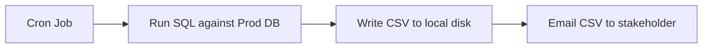

This works... for about a month. Then problems start stacking up:

1. **It hits production DB directly** → one big report query during peak traffic slows down the live site. This is the classic **OLTP vs OLAP collision** — your report queries (heavy scans, aggregations) are fighting your user-facing transactional queries (fast point lookups/writes) for the same resource.
2. **It doesn't scale in variety** → every new report type means a new hardcoded script. No self-service.
3. **It doesn't scale in volume** → what happens when 5,000 employees want reports, and some reports need to scan *billions* of rows (e.g., "total ad impressions last quarter across all of Zeta")?
4. **Single point of failure** → the script lives on someone's laptop or a single VM. It dies, no one notices until someone asks "where's my report?"
5. **No history, no retry, no visibility** → if it fails halfway, there's no way to know, and no way to safely re-run without duplicating data.

This is the "*aha, we need an actual system*" moment. This is genuinely how most large-scale internal reporting platforms (think Google's internal reporting infra, Meta's batch reporting pipelines) came to be — as an evolution away from ad hoc scripts.

### So, what are we actually building? (Scoping the problem)

Before jumping to solutions, in an interview, you always pin down scope. Let's do that here, because everything downstream depends on this.

**Functional requirements** (what the system must do):
- Users can **request a report** (either on-demand or scheduled — e.g., "send me this report every Monday at 9am")
- Reports are generated from large underlying datasets (could be TBs of data)
- Reports can be exported in various formats (CSV, PDF, Excel)
- Users get **notified** when the report is ready (email, in-app, Slack)
- Users can **download** the report once ready
- Support for **filters/parameters** (date range, region, campaign ID, etc.)

**Non-functional requirements** (the "-ilities" — this is where FAANG interviews really dig in):
- **Scalability**: millions of report requests per day, some scanning billions of rows
- **Availability**: system should stay up even if some component fails
- **Durability**: once a report is generated, it shouldn't be lost
- **Latency**: small reports should be fast (seconds); huge reports can take minutes/hours — but users need visibility into progress
- **Isolation**: report generation should **never degrade production systems**
- **Consistency**: reports should reflect a consistent snapshot of data (imagine a report showing revenue that doesn't match between two runs — that's a trust-destroying bug)
- **Cost efficiency**: scanning huge datasets is expensive; can't brute-force every request

This framing — "the org outgrew manual scripts, here's why, here's what we now formally need" — is exactly the kind of narrative that makes an interviewer sit up, because it shows you understand *why* each requirement exists, not just that you memorized a checklist.

---

That's our starting point: the problem, the naive first attempt, why it broke, and a clear scope.

**Take a moment with this.** Once you're comfortable with this framing, say "next" and we'll move into Part 2: the first real architectural decision — **synchronous vs asynchronous report generation**, and why every large-scale reporting system ends up being async (queue-based, job-oriented). That's the foundational fork in the road everything else builds on.

---

## Part 2: The First Big Fork in the Road — Synchronous vs Asynchronous

### Back to the story

So the team scraps the cron-job script and says: "Let's build a real service." The first instinct (and it's a *very* common first instinct, even for senior engineers) is to build it like a normal API:

```
POST /generateReport  →  system runs the query  →  returns the file
```

Simple. RESTful. Feels right. Let's trace what happens when this hits real usage.

### Why the naive synchronous approach collapses

Someone requests "total revenue by region for the last 12 months" — a query that has to scan a few billion rows. The HTTP request comes in, the server starts executing the query... and now:

1. **The HTTP connection has to stay open** the entire time the query runs. If it takes 4 minutes, the client, load balancer, and any proxy in between all need to tolerate a 4-minute-long open connection. Most infra (browsers, LBs, gateways like nginx/ALB) has timeouts around 30s–60s by default. Your request just gets killed.
2. **The server thread/worker is blocked** the whole time. If your API server handles requests with a thread-per-request model, and 500 people request big reports at once, you need 500 threads sitting idle, waiting on the DB. That's a resource explosion for something that isn't even doing active work most of the time — it's just *waiting*.
3. **No resilience** — if the server crashes or gets redeployed mid-query (which happens constantly at scale — deploys happen many times a day), the user's 4-minute report just vanishes. They get an error and have to start over.
4. **No visibility** — the user has no idea if it's 10% done or about to finish. It's just a spinning wheel.

This is the exact same shape of problem you'd hit with video encoding, ML model training jobs, or any "long-running work" system. And the industry's answer is always the same pattern: **decouple request acceptance from work execution.**

### The shift: from Request/Response to Job/Queue

The mental model shift is this:

> Don't treat "generate a report" as a function call. Treat it as a **job** you submit into a system, which you can check on later.

This is the same pattern as: submitting a print job, uploading a video to YouTube (upload finishes immediately, "processing" happens after), or asking Amazon to "place an order" (order is accepted instantly, fulfillment happens over the next few days).

Here's the shape of the new system:

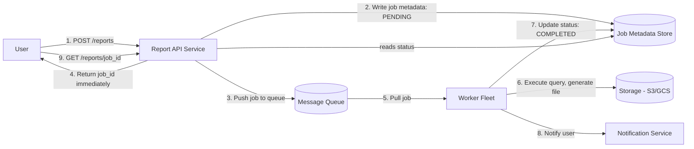

Walking through this flow, step by step:

1. User hits `POST /reports` with parameters (report type, date range, filters).
2. The API server doesn't run the query itself. It just **writes a row** into a job metadata store: `job_id`, `status: PENDING`, `requested_by`, `parameters`, `created_at`.
3. It pushes a lightweight message onto a **queue** (like Kafka, SQS, Pub/Sub) — just enough info to identify the job, not the whole payload.
4. It immediately returns `202 Accepted` with the `job_id` to the user. This request now takes **milliseconds**, not minutes — regardless of how big the underlying report will be.
5. A separate fleet of **worker processes** (decoupled from the API layer, can scale independently) pull jobs off the queue.
6. A worker picks up the job, runs the actual heavy query/aggregation, and writes the resulting file to **blob storage** (S3, GCS) — not a database, since reports are usually large files.
7. Worker updates the job status to `COMPLETED` (or `FAILED`) in the metadata store, along with a pointer (URL) to the file in storage.
8. A notification is fired (email/Slack/push) telling the user their report is ready.
9. Meanwhile, the user's client can **poll** `GET /reports/{job_id}` — or better, use a **webhook/websocket** — to know when it's done.

### Why this solves every problem we listed

| Problem before | How async fixes it |
|---|---|
| Long-held HTTP connections | API call is now sub-second; no long-lived connection needed |
| Blocked server threads | API layer is stateless and free almost instantly; workers do the waiting, and workers are built for that |
| Crash = lost work | Job state lives in a durable store; if a worker dies mid-job, another worker can pick it up (we'll cover exactly how — visibility timeouts, idempotency — later) |
| No progress visibility | Job has an explicit state machine: `PENDING → RUNNING → COMPLETED/FAILED`, and you can even track % progress if needed |
| Can't handle spikes | Queue acts as a buffer/shock-absorber. If 10,000 requests come in at once, they just sit in the queue; workers drain it at whatever pace they can sustain, instead of falling over |

That last point is worth sitting with, because it's a concept interviewers love probing on: **the queue converts a "spike in demand" into a "backlog," which is a much safer failure mode than crashing.** You trade a bit of latency (things wait a little longer) for a massive gain in stability. This is literally why queues exist at the center of almost every large-scale async system.

### The natural follow-up question (and a preview)

At this point, a sharp interviewer will immediately ask: *"Okay, but what does a 'worker' actually do when it runs this heavy query? You said 'scan billions of rows' — walk me through that."* That's the *real* meat of a Report Generating System, and it's where sharding, distributed processing, and data source architecture come in — that's Part 3.

There's also a second thread dangling here: how do we pick between a **queue** vs a **workflow/orchestration engine** (like Airflow, Temporal) for more complex, multi-step reports? We'll touch that once we've covered the core pipeline.

---

Sit with this "sync → async, request → job" shift — it's honestly one of the top 3 most reused ideas across *all* HLD interviews (not just reporting systems), so it's worth being rock solid here.

When ready, say "next" and we'll dig into **Part 3: How a worker actually generates a report at scale** — this is where we get into OLAP vs OLTP data sources, pre-aggregation, and why you basically can never run a "SELECT scan over billions of rows" live.

---

## Part 3: How a Worker Actually Generates a Report at Scale

### The naive worker — and why it immediately breaks

Let's put ourselves in the worker's shoes. It picks up a job: "revenue by region, last 12 months." The simplest possible implementation:

```sql
SELECT region, SUM(revenue) 
FROM transactions 
WHERE date BETWEEN '2025-09-01' AND '2026-09-01'
GROUP BY region;
```

Run this against the **production OLTP database** (the one serving live user traffic), and if `transactions` has a few billion rows, here's what happens:

1. **It's a full/near-full table scan.** OLTP databases (Postgres, MySQL) are optimized for fast point lookups and small writes (`WHERE id = 5`), not massive sequential scans and aggregations. This query could take tens of minutes and hammer disk I/O.
2. **It locks/contends with production traffic.** Even with read replicas, a huge analytical query can starve the connection pool, blow out cache (evicting hot pages that live traffic needs), and cause replication lag to spike.
3. **It doesn't scale as data grows.** This works passably at 10M rows. At 10B rows, it's simply not viable — no single machine's disk/CPU can do it in reasonable time.

This is the classic **OLTP vs OLAP** distinction, and it's a must-know for HLD interviews:

| | OLTP (e.g. Postgres, MySQL) | OLAP (e.g. BigQuery, Redshift, ClickHouse, Snowflake) |
|---|---|---|
| Optimized for | Fast small reads/writes, high concurrency | Large scans, aggregations over huge datasets |
| Storage layout | Row-oriented | Column-oriented |
| Typical query | `WHERE user_id = 123` | `SUM(revenue) GROUP BY region` |
| Use case | Serving live app traffic | Reporting, analytics, BI |

Column-oriented storage matters a lot here — if you only need `region` and `revenue` columns out of a table with 50 columns, a columnar store reads only those two columns off disk, while a row store has to read every row in full. That alone can be a 10-25x difference in I/O for aggregation-heavy queries.

### The fix: never query production directly — use a separate analytical pipeline

So the real architecture inserts a **data pipeline** between production data and the report worker:

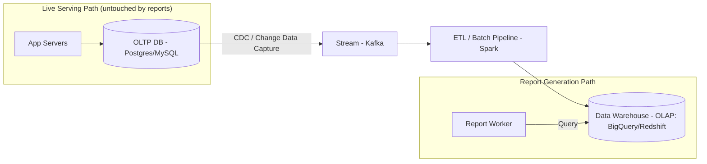

Walking through this:

1. **Change Data Capture (CDC)** tools (like Debezium) tail the OLTP database's write-ahead log (WAL) and stream every insert/update/delete as an event — **without ever running a query against the live DB**. This is the key trick: you get the data out of production *without adding read load to it*.
2. Those change events flow into a stream (Kafka), and an ETL pipeline (Spark, Flink, or managed tools like Google Dataflow) transforms and loads them into a **data warehouse** — a system purpose-built for OLAP queries.
3. The report worker **only ever talks to the data warehouse**, never to production. Production stays completely isolated from reporting load. This is the single most important design decision in the whole system, and it directly satisfies our "Isolation" non-functional requirement from Part 1.

### But billions of rows in a warehouse is still slow if done naively — enter pre-aggregation

Even in a warehouse, "sum revenue for 2 billion rows, live, every time someone requests it" is wasteful if 500 people are requesting variations of the same report every day. This is where **pre-aggregation** (also called rollups or OLAP cubes) comes in.

The idea: instead of computing aggregates at request time, **precompute them on a schedule** and store the much smaller aggregated result.

Example: instead of storing 2 billion raw transaction rows and summing them per request, run a nightly batch job that produces:

```
daily_revenue_by_region_and_campaign
  date | region | campaign_id | total_revenue | total_impressions
```

This table might only have a few million rows instead of billions — because it's already grouped by the dimensions people actually query on. A "monthly revenue by region" report is now just a `SUM()` over a few thousand pre-aggregated rows instead of billions of raw ones.

This is genuinely how systems like Google Analytics or ad-reporting dashboards achieve "instant" reports over unfathomably large datasets — the heavy lifting happened **ahead of time**, in batch, off the critical path.

The tradeoff (always state tradeoffs in interviews!):
- **Pro:** massively faster reads, much cheaper per-query cost
- **Con:** data has some **staleness** — if aggregation runs nightly, "today's" numbers aren't in the rollup yet
- **Con:** you must anticipate the dimensions people will query by. If someone wants a breakdown you didn't pre-aggregate on (e.g., by "device type" and your rollup didn't include that), you fall back to a slower raw scan.

This staleness/flexibility tradeoff is a big deal, and it leads to real systems using a **hybrid (Lambda-style) architecture**: pre-aggregated rollups for common/known report shapes, plus the ability to fall back to scanning raw data (accepted to be slower) for ad-hoc, never-seen-before report queries.

### Quick recap of what the worker's job actually looks like now

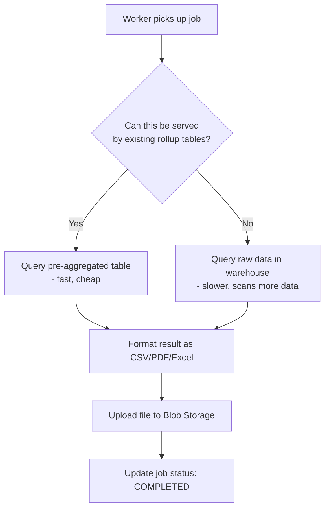

---

**Key concepts to lock in from this part:** OLTP vs OLAP, why production DBs are never touched for reporting, CDC as the mechanism to extract data safely, and pre-aggregation as the core lever for making huge-scale reports fast and cheap — with its staleness tradeoff.

Take your time with this — this part tends to carry a lot of interview weight. When you're ready, say "next" and we'll move to **Part 4: Scaling the Worker Fleet** — how you actually parallelize the generation of *one single massive report* across many machines (think: MapReduce-style processing, partitioning a report job itself, not just having many workers do many different jobs).

---

## Part 4: Scaling a Single Massive Report — Parallelizing Within One Job

### The problem we haven't actually solved yet

Notice something in Part 3: we assumed "a worker" picks up "a job" and runs "a query." That's fine when the query hits a pre-aggregated rollup table with a few thousand rows. But what about the fallback case — the ad-hoc report that has to scan **raw, un-aggregated data**, and that raw dataset is genuinely enormous (say, 5 billion rows, no rollup available for this exact breakdown)?

If one single worker process tries to run that as one query, even against a warehouse, you can still hit real walls:

1. **A single query might still take hours** even on a good OLAP engine, if the scan + shuffle (grouping) is large enough.
2. **A single worker node has finite memory.** If the `GROUP BY` produces a huge number of intermediate groups before finalizing, or a `JOIN` needs to hold data in memory, one machine can simply run out of RAM.
3. **No fault tolerance within the job.** If that one worker crashes 55 minutes into a 60-minute query, you lose all that work and start from zero.

The team hits this wall on a specific incident: a VP requests a "lifetime revenue by every unique (advertiser, campaign, country, device) combination" — a huge cardinality, ad-hoc, never-pre-aggregated report. It runs for 3 hours and then the worker VM gets OOM-killed. The report team realizes: **a single job needs to be split across many machines, the same way the warehouse itself splits its own queries internally.**

### The core idea: MapReduce-style partitioning

This is the same fundamental idea behind MapReduce, Spark, and how modern OLAP engines (BigQuery, Presto/Trino) execute distributed queries. The story here mirrors the original Google MapReduce paper's motivation almost exactly — they hit this same wall trying to build the web index and reporting/log-analysis pipelines internally.

The concept: split a huge job into independent, parallelizable chunks, process each chunk on a different machine, then combine the partial results.

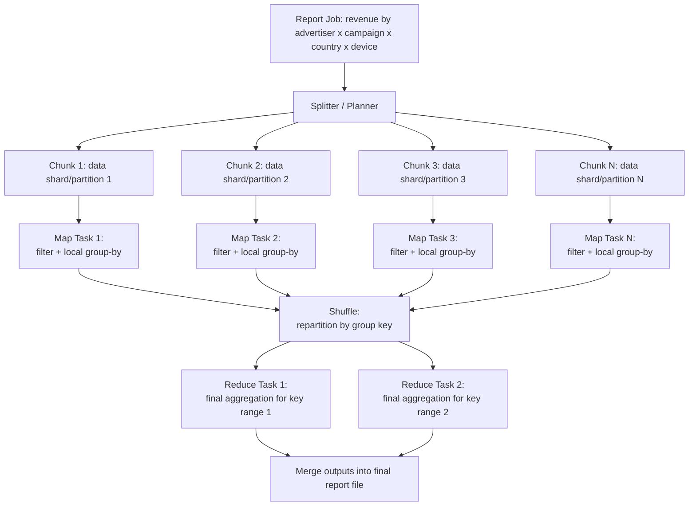

Walking through it with our actual example:

1. **Splitting**: the underlying data (say, partitioned by date in the warehouse — very common) gets divided into chunks. If our table is partitioned by day, and we're querying a year of data, that's a natural 365-way split.
2. **Map phase**: each map task reads its chunk, applies filters (`WHERE`), and does a **local, partial aggregation** — e.g., sums revenue per (advertiser, campaign, country, device) **within that day's data only**.
3. **Shuffle phase**: this is the expensive, important step. All the partial results with the *same group key* need to end up together so they can be finally summed. Data gets redistributed across the network so that, say, all "(Nike, Campaign_X, US, mobile)" partial sums from every day land on the same reduce task.
4. **Reduce phase**: each reduce task takes all partial aggregates for its assigned key range and produces the final, fully-summed value.
5. **Merge**: outputs from all reduce tasks get combined into the final report file.

You don't need to hand-build this MapReduce engine yourself in a real system — this is exactly what **Spark, BigQuery, Presto/Trino** already do internally. The important interview point is: **you understand *why* this pattern is necessary and can describe it**, and in your architecture you'd say "the report worker doesn't itself implement distributed compute — it *delegates* the heavy query to a distributed query engine like Spark/BigQuery, and its own job is just orchestration: submit the query, poll for completion, fetch/stream the result, format it."

### The two failure modes this introduces (and how to handle them)

**1. Partial failure of one task shouldn't kill the whole job.**
If reduce task #47 out of 200 fails (node died, OOM, network blip), a good distributed engine **retries just that task**, re-reading only its assigned input, not the entire job. This is why these systems checkpoint intermediate (map) outputs to disk/storage rather than only holding them in memory — task 47 can be redone without redoing tasks 1-46.

**2. Idempotency — the silent killer of naive retries.**
Say task 47 actually *did* complete, but the coordinator didn't get the success signal in time (network issue) and re-launches it. If the reduce task's output is "append this partial sum to the final result," running it twice **double-counts revenue**. This is a classic, very-commonly-probed interview point.

The fix: task outputs should be **idempotent** — e.g., each task writes its output to a uniquely-named file (`task_47_attempt_2.parquet`), and the final merge step deterministically picks one output per task ID, or tasks **overwrite** a deterministic destination path rather than appending. "Exactly-once" semantics in distributed systems is almost always achieved via "at-least-once execution + idempotent writes," not by magically guaranteeing a task runs exactly once.

### Bringing it back to our job-queue architecture from Part 2

So the full picture now has two layers of "work splitting":
- **Outer layer** (Part 2): many *different* report jobs are distributed across a worker fleet via a queue.
- **Inner layer** (this part): *one* report job, if it's big enough, gets internally distributed across a compute engine (Spark/BigQuery) into many map/reduce tasks.

Your **report worker's** actual code is thin — its job is to:
1. Take the job off the queue
2. Decide: "is this small enough for a direct query, or does it need the full distributed engine?"
3. Submit the query to the engine (Spark cluster / BigQuery), monitor progress
4. On completion, stream/format the result, upload to blob storage, mark job complete

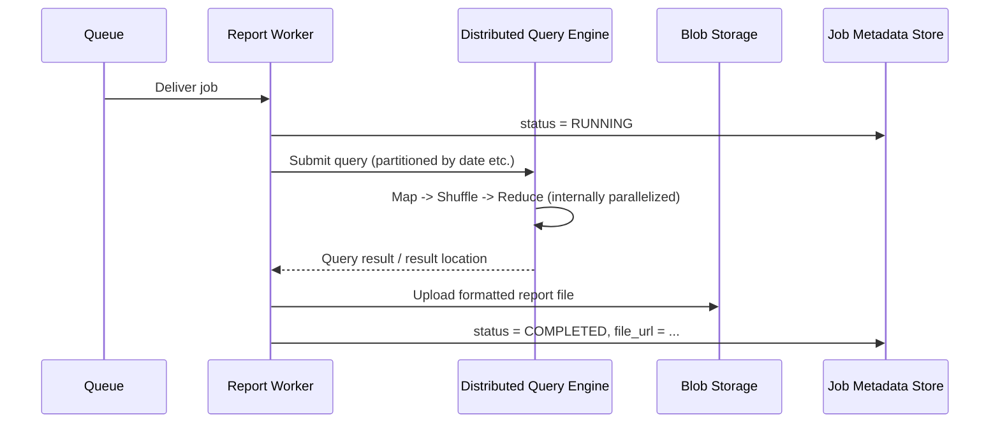

---

**Key concepts to lock in:** why a single query needs to be split across machines at scale, the map → shuffle → reduce pattern, why you delegate this to an existing engine rather than build it yourself, and the idempotency/retry story for partial failures — this last one is a favorite "gotcha" follow-up question in interviews.

When ready, say "next" and we'll move to **Part 5: Sharding and Partitioning the Data Itself** — going one level deeper into *how* the warehouse/storage layer is actually partitioned and sharded to make all of this possible in the first place, plus how this connects to the job metadata store's own scaling story.

---

## Part 5: Sharding & Partitioning — Making the Data Layer Actually Scale

### Two different things need sharding here, and interviews often blur them

So far we've talked about the data warehouse as if it's one big magic box that "just handles" billions of rows. Now let's open that box. There are actually **two separate storage systems** in our architecture that each need their own sharding strategy, and they have very different access patterns:

1. **The Data Warehouse** (raw + pre-aggregated report data) — huge volume, scan-heavy, append-mostly
2. **The Job Metadata Store** (job_id, status, params, timestamps) — smaller volume, but very high read/write QPS, point-lookup-heavy

Conflating these two in an interview is a common mistake — an interviewer will often ask "how would you shard this?" expecting you to say "which part?"

### Sharding the Data Warehouse: partitioning by date (and why)

Let's go back to our earlier example: a `transactions` table with billions of rows. If it's one giant unpartitioned blob, even a smart columnar engine has to at least *scan the metadata of* the whole table to figure out what's relevant.

The near-universal choice for time-series-like reporting data: **partition by date** (often further sub-partitioned).

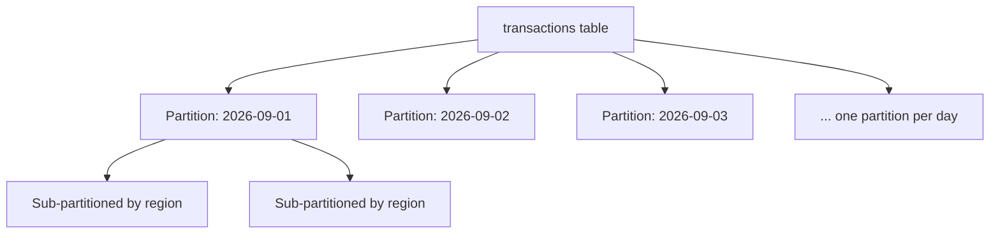

Why date is almost always the top-level partition key for reporting systems specifically:
- **Report queries almost always filter by date range** ("last 12 months," "Q3 report") — this is the single most common `WHERE` clause shape in reporting. Partitioning on it means the engine can **skip entire partitions** it doesn't need (called **partition pruning**), often eliminating 90%+ of the data before a single row is scanned.
- **New data arrives chronologically** — today's data naturally lands in today's partition. This makes ingestion (from Part 3's CDC pipeline) simple: just append to the latest partition, never rewrite old ones.
- **Old partitions are naturally "cooling."** A report for data from 2 years ago is rare and can tolerate being on cheaper, slower storage (this connects to storage tiering — see below).

A **second-level partition/shard key** is then often something high-cardinality and frequently filtered, like `region` or `advertiser_id`, so that within a single day, data is further split — this is what lets multiple machines process a single day's data in parallel (ties directly back to Part 4's map tasks — each map task often = one partition).

**Important interview nuance**: this is technically "partitioning," and true "sharding" (in the classic sense of splitting data across independent database nodes/clusters) also happens under the hood in the warehouse (BigQuery/Redshift distribute partitions across their compute nodes automatically) — but as the system designer, you mostly control it by **choosing the partition key well**; the engine handles physical distribution. Say this explicitly in an interview — it shows you know the difference between "logical partitioning you design" and "physical sharding the engine executes."

### Sharding the Job Metadata Store: a completely different problem

Now the other store: `jobs` table — `job_id`, `user_id`, `status`, `params`, `created_at`, `result_url`. At Google/Meta scale, if you have millions of report requests per day, this table needs:

- **Extremely fast point lookups** (`GET /reports/{job_id}` → single row)
- **Fast writes** (status updates as jobs move `PENDING → RUNNING → COMPLETED`)
- **Fast "list my jobs" queries** (`WHERE user_id = X ORDER BY created_at DESC`)

This is a classic **OLTP sharding problem**, not the OLAP partitioning problem from above. Here, the standard approach is **sharding by a hash of a key** — most naturally `user_id` or `job_id`.

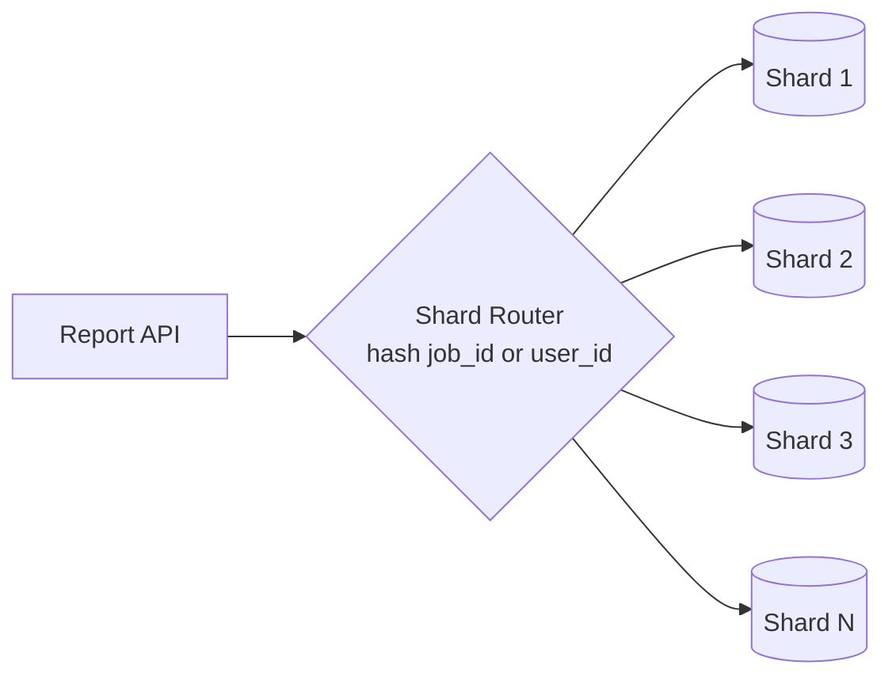

Why hash-based (vs range-based, like the date partitioning above)?
- **Even distribution**: hashing `user_id` spreads users randomly and evenly across shards, avoiding "hot shards" (imagine range-sharding by `user_id` if IDs are assigned sequentially — all *new* users, who are also the most *active* users, would pile onto the last shard).
- The tradeoff: hash sharding makes **range queries harder** ("give me all jobs created between 2pm-3pm across all users" now has to fan out to every shard), but that's a rare query pattern here, so it's an acceptable tradeoff. Point lookups (`job_id`) and per-user queries (`user_id`) — our actual hot paths — work great with hash sharding as long as you shard by whichever key you filter on most (commonly `user_id` here, with `job_id` embedding the shard info or a secondary index).

This "pick the shard key based on your dominant query pattern, then name the tradeoff you're accepting" reasoning is exactly what interviewers want to hear — not just "I'll shard by user_id" with no justification.

### A subtlety: does the metadata store even need to be a traditional sharded SQL DB?

Worth voicing in an interview: given the access pattern is mostly **key-value-like** (`job_id → status/metadata`, occasional `user_id → list`), a lot of real systems would reach for a **NoSQL store like DynamoDB, Bigtable, or Cassandra** here instead of manually sharding Postgres/MySQL — because these systems give you hash-partitioning, replication, and horizontal scaling **out of the box**, which is exactly what this access pattern needs, and you avoid building/operating your own shard router and resharding logic.

This is a great "trade-off discussion" moment in an interview: SQL + manual sharding gives you strong relational guarantees and flexible queries but more operational burden; a managed wide-column/KV store gives you scaling for free but you design your access patterns up front (denormalize, no joins). For a job-tracking table with simple, known access patterns, most real-world systems (and most strong interview answers) lean **NoSQL here**.

### Tying it together: one table, two lifecycles

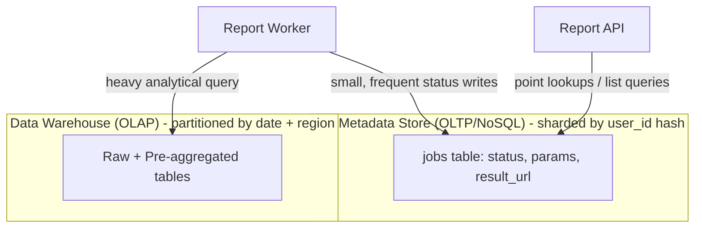

---

**Key concepts to lock in:** the difference between *partitioning* (usually range/date-based, for analytical scan efficiency + pruning) and *sharding* (usually hash-based, for even load distribution on OLTP/KV access patterns), why the two stores in this system need genuinely different strategies, and being ready to justify your shard key choice by naming the dominant query pattern.

When ready, say "next" and we'll move to **Part 6: Caching and CDNs** — once a report is generated, how do you avoid regenerating it for every duplicate request, and how does the actual *file delivery* (someone clicking "download") scale efficiently across the globe.

---

## Part 6: Caching & CDN — Not Regenerating What You Already Made

### The story: the "Monday Morning Stampede"

Picture this: every Monday at 9am, 200 regional managers all request the exact same "Weekly Sales Summary — Region: EMEA" report (same report type, same parameters, same date range — it's a scheduled/templated report everyone subscribes to). With our current design from Parts 1-5, each of those 200 requests becomes **200 separate jobs**, each spinning up a distributed query against the warehouse, each producing an identical file.

This is wasteful in an obvious way once you see it, but it's a very realistic scale problem — it's the reporting-system version of the classic "cache stampede" / "thundering herd" problem.

### Layer 1: Report-level caching (dedupe identical requests)

The fix: before creating a new job, check if an **identical report** (same type + same parameters + same underlying data version) was already generated recently.

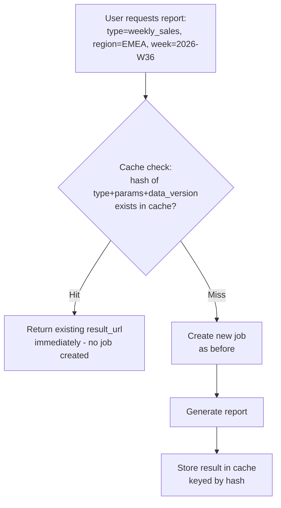

The cache key here is typically something like:
```
hash(report_type + parameters + data_snapshot_version)
```

That `data_snapshot_version` piece matters a lot — it's what tells you the cached result is still valid. If the underlying data warehouse partition for that week hasn't changed since the report was cached, the cached file is still 100% correct to serve. If new data landed (e.g., a late-arriving correction), you'd want to invalidate.

This is usually backed by something like **Redis** (for the "does this exist" lookup — fast key-value check) pointing to the actual file in blob storage. Redis holds the pointer/metadata; the actual (potentially large) file stays in S3/GCS — you never want to shove multi-MB report files into an in-memory cache.

**The interview-favorite follow-up: what about the stampede at the exact moment of a cache miss?** If 200 requests hit within the same 2-second window, all before the first one finishes generating, they'd *all* see a cache miss and *all* trigger duplicate generation — because the report doesn't exist in cache yet. The fix is **request coalescing / a "generating" lock**:

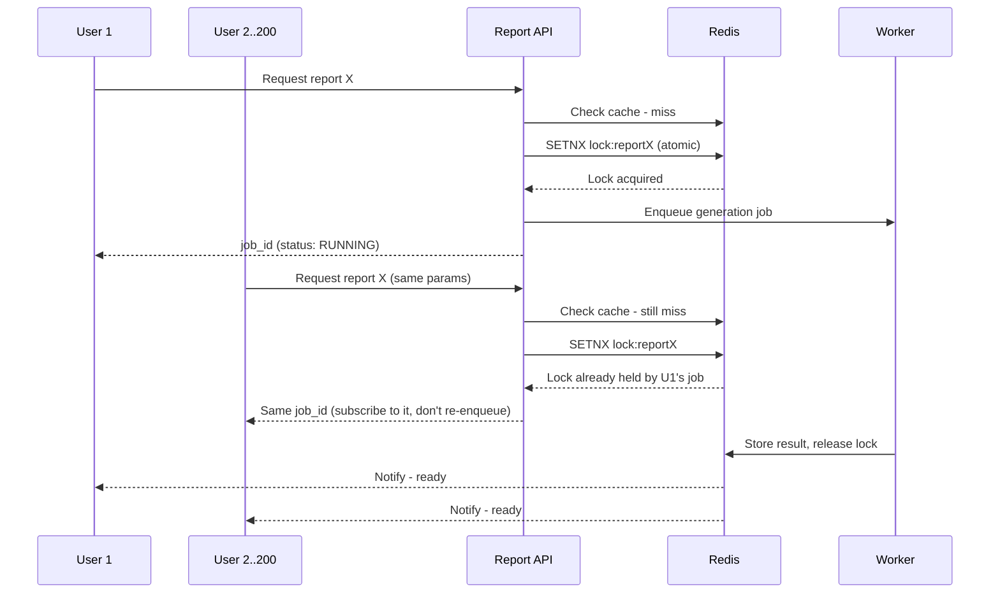

The `SETNX` (set-if-not-exists) is an **atomic** operation in Redis — this atomicity is exactly what prevents a race where two requests both "see" no lock and both proceed. Whoever loses the race just attaches themselves to the in-flight job instead of starting a new one. This single pattern (dedupe + coalescing lock) is worth being able to draw from memory — it comes up constantly, not just for reports (rate limiting, cache stampede protection in general, etc. all use this exact shape).

### Layer 2: CDN — this is about *delivery*, not *generation*

Now the report file exists in blob storage (S3/GCS) with a URL. A completely separate scaling question: **when a user clicks "Download," where does that file actually come from, physically?**

If Zeta is a global company and your blob storage is in `us-east-1`, someone in Singapore downloading a 200MB report file is dragging those bytes across the planet — slow, and it also costs you cross-region egress bandwidth for every single download, even of the exact same file downloaded 500 times.

This is precisely what a **CDN** solves — but it's worth being precise about *why* it's a good fit here versus other scenarios:

- CDNs are excellent for **static, immutable content** — and a generated report file, once created, **never changes**. It's the perfect CDN candidate: write once, read many, from many geographies.
- The flow: instead of giving users a direct S3 URL, you give them a **CDN URL** (CloudFront, Fastly, Akamai) that fronts the storage bucket as its "origin."

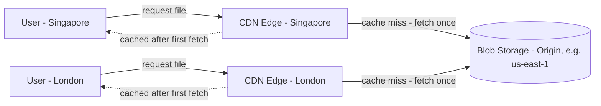

- First request from Singapore: CDN edge node has a cache miss, fetches from the origin bucket once, caches it at the edge, serves the user. Every *subsequent* Singapore-region request for that same file is served straight from the nearby edge — no cross-region trip, no repeated load on your origin storage.
- Since the file is genuinely immutable (a report snapshot for a specific date range), you can set a **very long cache TTL** (even effectively "forever," using a content-addressed or versioned URL) — there's no cache invalidation headache here, unlike caching a user's dynamic profile page. This "immutable content → long/infinite TTL" pattern is a big, reusable interview point: contrast it explicitly with content that changes (where you need TTLs, invalidation, versioning).

### Access control note (worth a sentence in an interview)

One nuance: reports often contain sensitive business data (revenue, ad spend), so you can't just make the CDN URL public. The standard solution: **signed URLs** with short expiry (e.g., a CloudFront/S3 signed URL valid for 1 hour) — the CDN still caches the underlying object, but access to *retrieve* it is gated by a token, so you get CDN speed without making sensitive files world-readable forever.

### Where this leaves our architecture

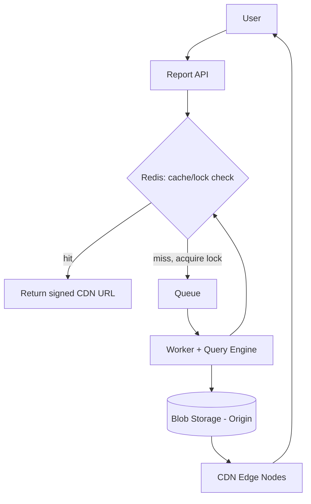

---

**Key concepts to lock in:** deduplication caching keyed by report parameters + data version, the request-coalescing/locking pattern to prevent stampedes on cache misses (the `SETNX`-style atomic lock is a big one), why generated reports are a textbook-perfect CDN use case (immutable, write-once-read-many, geographically dispersed readers), and signed URLs for access control on cached-but-sensitive content.

When ready, say "next" and we'll move to **Part 7: Handling Failures Gracefully** — retries, dead-letter queues, poison messages, and how the system behaves when a worker crashes, a query times out, or the warehouse itself has an outage. This is usually where interviewers spend a lot of time probing "what happens when X breaks."

---

## Part 7: Handling Failures Gracefully — What Happens When Things Break

### Why this part matters so much in interviews

Up to now we've designed the "happy path." But FAANG-level interviews spend a huge chunk of time on **"what happens when X fails?"** — because that's where junior designs and senior designs diverge. Anyone can draw boxes and arrows for the happy path. Knowing exactly what happens when a worker dies mid-task, or a message gets processed twice, is what signals real production experience.

Let's go failure-by-failure, in the order they'd actually bite you.

### Failure 1: A worker crashes mid-job

Say a worker picks up job `X` from the queue, starts processing, and then the machine gets OOM-killed or the pod gets rescheduled (this happens *constantly* at scale — deploys, spot instance reclaims, hardware failures).

**The naive queue behavior is wrong by default.** If the queue considers a message "done" the moment a worker picks it up, that job is now lost forever — no one else will ever retry it, and the user waits forever for a report that will never arrive.

**The fix: visibility timeouts + explicit acknowledgment.**

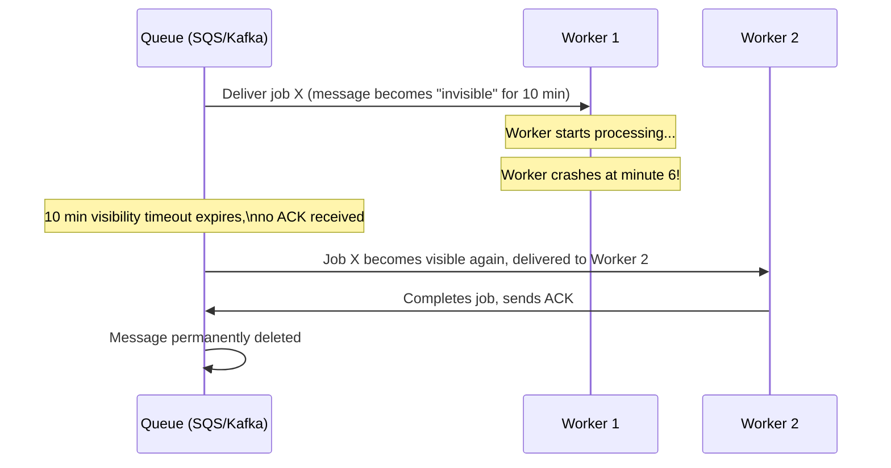

The message isn't deleted from the queue when it's *delivered* — only when the worker explicitly **acknowledges (ACK)** successful completion. If a worker dies before ACKing, the message becomes visible again after a timeout and another worker picks it up. This is the fundamental mechanism behind SQS, RabbitMQ, and (via consumer offset commits) Kafka.

**A crucial follow-up an interviewer will ask: "what if the visibility timeout is shorter than the actual job runtime?"** For long reports (say, 45 minutes), a default 10-minute timeout would cause the *same job* to be picked up by a second worker while the first is still legitimately working — wasteful duplicate work, or worse, a race writing the same output. The fix: **heartbeating** — the worker periodically extends its own visibility timeout ("I'm still alive, still working, give me more time") while it's actively processing. If heartbeats stop (because the worker really did die), the timeout naturally expires and the job gets reclaimed.

### Failure 2: The job runs twice — idempotency, again

We touched this in Part 4 for map/reduce tasks, but it applies at the whole-job level too. If job `X` gets redelivered (as above) and Worker 2 processes it, but actually **Worker 1 hadn't crashed — it was just slow, and its ACK arrived late**, you can end up with two workers both thinking they successfully completed job `X`. If "complete" means "send the user an email," the user gets two emails. If it means "append a row somewhere," you get a duplicate row.

**The fix, reinforced from before: make job completion idempotent.**
- Use the `job_id` as a deterministic key for the output file path (`s3://reports/job_X.csv`) — if two workers both "finish," they both write to the same path, and the second write just overwrites the first harmlessly (assuming deterministic output, which it is here since it's the same query).
- Status transitions should be **conditional writes**: "update status to COMPLETED only if current status is RUNNING" (a compare-and-swap). This means even if Worker 2 finishes after Worker 1 already marked it COMPLETED, Worker 2's update is a no-op instead of causing a second notification to fire.
- Notifications specifically should have their own dedup: e.g., "only send the completion email if we haven't already recorded `email_sent=true` for this job_id" — again a conditional/atomic update.

This "design for at-least-once delivery, achieve exactly-once *effect* via idempotency" framing is the single most reusable phrase in distributed systems interviews. Say it explicitly when this topic comes up.

### Failure 3: A "poison message" — a job that always fails

Some jobs are just broken — malformed parameters, a query that always times out, a bug that always throws. Without protection, this job gets redelivered forever: worker picks it up, crashes/fails, timeout expires, another worker picks it up, fails again... forever, wasting worker capacity and never resolving.

**The fix: bounded retries + a Dead Letter Queue (DLQ).**

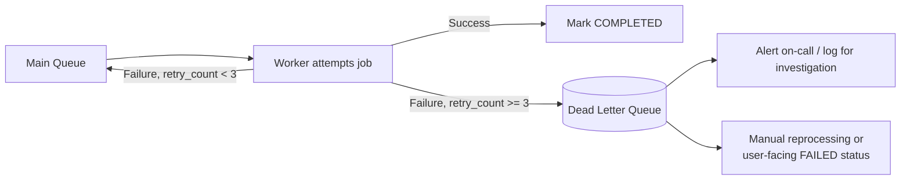

Each message carries a retry count. After N failed attempts (typically 3-5), instead of endlessly recycling, the message gets moved to a separate **dead letter queue** — this stops it from consuming worker capacity, gives engineers a place to go investigate exactly what's failing, and lets you mark the job `FAILED` for the user (with a "try again" option) instead of leaving them hanging forever.

Worth mentioning: retries shouldn't be immediate/rapid-fire — use **exponential backoff** (retry after 1s, then 2s, then 4s, then 8s...) so a transient blip (e.g., the warehouse being briefly overloaded) has time to clear, rather than retrying into the same still-overloaded system instantly.

### Failure 4: The data warehouse itself is degraded or down

This is a dependency failure, not a worker failure. If the warehouse is slow or unavailable, every job that tries to query it will fail or hang.

**The fix: the Circuit Breaker pattern.** Instead of letting every worker independently keep hammering a struggling warehouse with queries that will likely time out anyway (which makes the warehouse's recovery *harder*, not easier — this is a pile-on effect), a circuit breaker tracks the failure rate of calls to the warehouse. Once failures cross a threshold, the circuit "opens" — subsequent calls fail *immediately* without even attempting the query, for a cooldown period. After the cooldown, it lets a few "trial" requests through (half-open state) to check if the dependency has recovered, and only fully "closes" (resumes normal traffic) if those succeed.

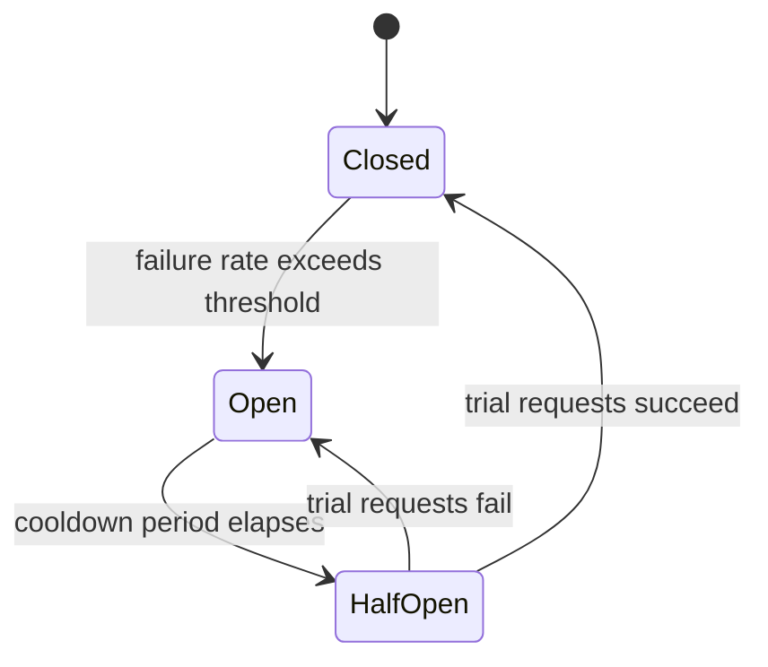

This protects the warehouse from a "thundering herd" of retries during an outage, and gives it room to actually recover — a very standard pattern (Hystrix/resilience4j popularized it) worth naming explicitly, since "circuit breaker" is one of those terms interviewers listen for.

### Failure 5: Partial results — should a report ever be "mostly done"?

A subtler design question: if a distributed query (Part 4) completes 95% of its map/reduce tasks but 5% permanently fail (say, one data partition is corrupted), should the system return a report with a gap, or fail the whole thing?

There's no universally "correct" answer here — this is a genuinely good moment in an interview to **ask a clarifying question or state an assumption explicitly**: for financial/billing reports, correctness usually trumps availability — you'd rather fail loudly than show a manager an incomplete revenue number they might act on. For a "quick trends dashboard" use case, a partial result with a visible "some data may be missing" banner might be perfectly acceptable. Naming this as a product/business tradeoff (not just a technical one) is exactly the kind of judgment senior interviewers are listening for.

### Putting the failure-handling layer into the full picture

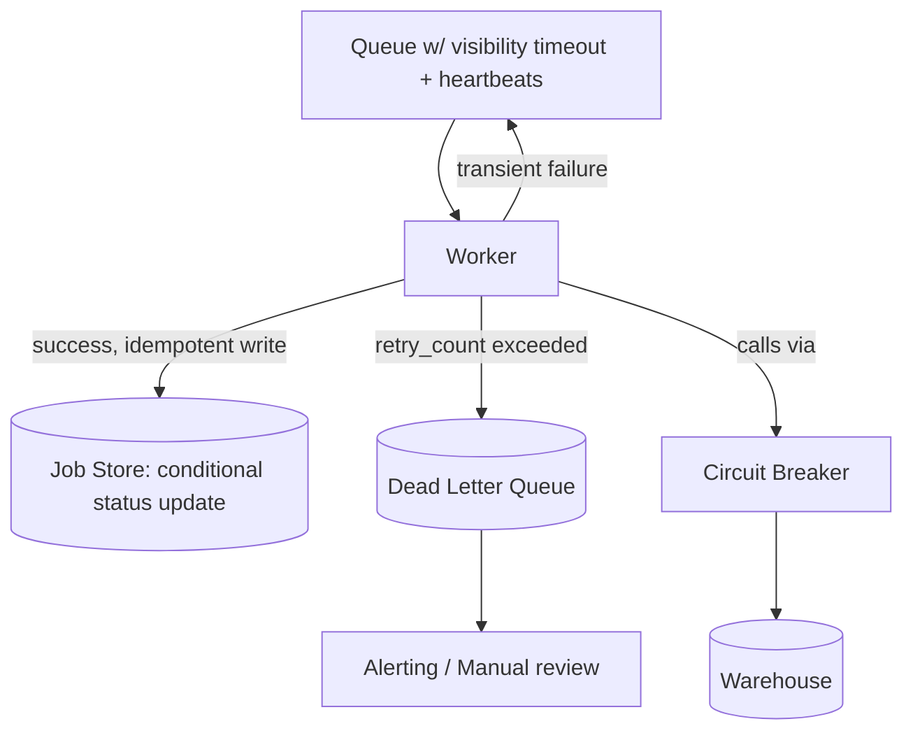

---

**Key concepts to lock in:** visibility timeouts + heartbeating for crash recovery, at-least-once delivery paired with idempotent writes/conditional updates for correctness, dead letter queues + exponential backoff for poison messages, circuit breakers for protecting a struggling downstream dependency, and the judgment call around partial-result semantics being a product decision, not just a technical one.

When ready, say "next" and we'll move to **Part 8: Replication & High Availability** — how the queue, the metadata store, and the warehouse themselves stay up when *individual machines* (not jobs) fail, including leader election and consistency tradeoffs (this is where CAP theorem discussions usually surface).

---

s## Part 8: Replication & High Availability — Surviving Machine (Not Job) Failures

### Reframing the question

Part 7 was about a *job* failing (a worker crashes, a query times out). This part is about something more fundamental: what if the **machine hosting your queue, your database, or your storage** dies — permanently, not just "temporarily unavailable"? If your job metadata store lives on exactly one machine and that disk dies, you don't have a retry problem anymore — you have **permanent data loss**. Replication exists to make sure no single machine's death takes your data or your availability down with it.

### The core idea: multiple copies, one designated writer

Let's use our **Job Metadata Store** as the running example, since it's the piece most people intuitively grasp needing "5 nines" availability (users are actively polling it, and if it's down, the whole product looks broken).

The standard setup: **one primary (leader), multiple replicas (followers)**.

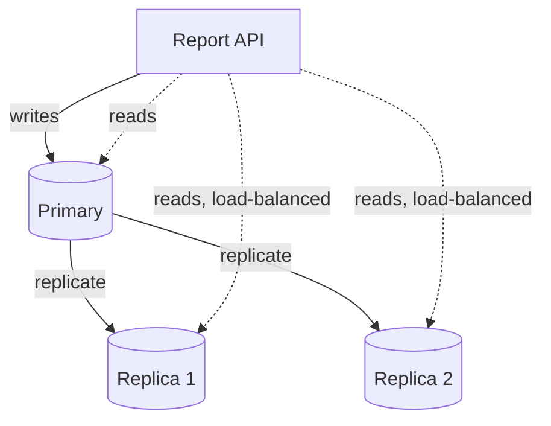

- **Writes** (creating a job, updating status) go to the **primary** only — this avoids conflicting writes landing on different machines simultaneously.
- **Reads** (checking job status, listing jobs) can be spread across replicas — this is a nice side benefit: replication doesn't just give durability, it also gives you **read scalability** for free, since polling ("is my report ready yet?") is a very read-heavy workload.
- If the primary dies, one of the replicas is **promoted** to be the new primary (leader election — more below), and writes resume there.

### Synchronous vs asynchronous replication — the tradeoff that actually matters

This is one of those concepts that sounds simple but has real teeth in an interview follow-up.

**Synchronous replication**: the primary waits for at least one replica to confirm it received the write *before* telling the client "write succeeded."
- Pro: **zero data loss** on primary failure — a replica always has the latest write.
- Con: **higher write latency** (you're waiting on a network round trip to another machine, every single write), and if that replica is temporarily unreachable, your writes can stall entirely.

**Asynchronous replication**: the primary confirms the write to the client immediately, and replicates to followers in the background.
- Pro: **low write latency** — client doesn't wait on replication.
- Con: if the primary dies **before** it finishes replicating the last few writes, those writes are **lost** when a replica gets promoted (this is called "replication lag" turning into actual data loss).

For our job metadata store: given that a "lost write" here typically means "a status update from RUNNING→COMPLETED got lost, and the user's UI shows the job as still running even though the file exists" — that's an annoying-but-recoverable inconsistency (a background reconciliation job or a retry on next check can fix it), not catastrophic data loss (the report file itself is safely in blob storage, which we cover next). So **async replication is a perfectly reasonable choice here**, favoring lower latency, because the *cost* of the rare data loss window is genuinely low. This is exactly the reasoning an interviewer wants — not "always pick sync" or "always pick async," but "here's what's actually lost, and here's why that's tolerable or not for *this* specific data."

Contrast that explicitly with something like a **billing ledger** ("customer was charged $500") — there, losing a write is unacceptable, and you'd justify paying the sync-replication latency cost.

### Leader election: how a replica becomes the new primary

When the primary dies, *something* needs to detect that and promote a replica — and that something needs to avoid a nasty failure mode: **split-brain**, where two nodes both believe they're the primary and both accept writes, causing data to diverge irreconcilably.

The standard solution is a **consensus protocol** (Raft or Paxos are the names to know) run either by the database nodes themselves or by an external coordination service (like ZooKeeper or etcd).

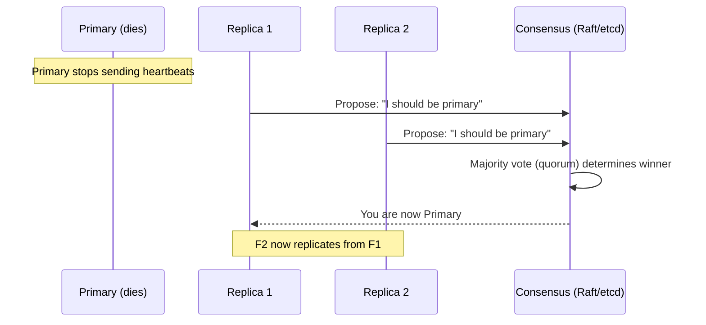

The key idea worth being able to say out loud: **a new leader is only accepted if a majority (quorum) of nodes agree** — this is precisely what prevents split-brain. If the network partitions such that two groups of nodes can each *think* they see a majority, quorum-based systems are designed so that mathematically only one side can actually have a true majority (assuming an odd number of total nodes), so only one leader can ever be legitimately elected at a time.

### CAP theorem — where this naturally surfaces

This is the moment interviewers are waiting for you to bring up CAP theorem, and the trick is doing it **specifically**, not as a memorized definition dump.

CAP says: during a **network partition** (P — which is a "when," not an "if," at large scale — partitions *will* happen), you must choose between:
- **Consistency (C)**: every read sees the latest write, even if it means refusing to serve reads/writes on the minority side of the partition.
- **Availability (A)**: every request gets a response, even if it might be slightly stale.

For our system, different components legitimately make **different** choices:
- **Job metadata store**: leaning **available** (AP-ish) is fine — if there's a brief partition, showing a slightly stale job status ("still RUNNING" when it actually just completed) is a minor UX hiccup, not a correctness disaster.
- **The report file in blob storage**: once written, it's immutable — there's no "which version is correct" ambiguity, so this concern barely applies here; storage systems like S3 are designed for very high durability and availability for immutable objects.
- Somewhere you'd actually want to lean **consistent (CP)**: the **dedup/locking mechanism** from Part 6 (the `SETNX` lock preventing duplicate job creation) — if that lock check is inconsistent across a partition, you could end up back at the "200 duplicate jobs" stampede problem it was built to prevent. So that specific piece of state benefits from stronger consistency guarantees even at some availability cost.

Saying "different parts of my system make different CAP tradeoffs, and here's why, per component" is a dramatically stronger answer than declaring the whole system "AP" or "CP" as one blanket label — real systems are never monolithically one or the other.

### Replication for the Warehouse and the Queue too (briefly, since the same principles apply)

- **Data Warehouse**: managed OLAP systems (BigQuery, Redshift, Snowflake) replicate data across multiple nodes/zones internally as part of the service — you generally don't hand-roll this, but you should know it's happening, and that it's usually **async, eventually consistent for very recent writes**, which is why report generation often tolerates a small delay after data lands before it's "safe" to include in a report (ties back to the `data_snapshot_version` idea from Part 6).
- **Queue (Kafka)**: replicates each partition across multiple brokers (`replication.factor=3` is a common default), with one broker as leader for that partition and others as in-sync replicas (ISRs). If the leader broker dies, a new leader is elected from the ISR set — same leader-election idea, applied to the queue itself.

### Multi-region: the next level of "availability"

One more layer worth a sentence: replication *within* a region protects against machine/rack failures. It doesn't protect against an entire region going down (a real, if rare, occurrence). For a truly global FAANG-scale system, you'd also consider **multi-region deployment** — replicas of the metadata store and read paths in multiple regions, with users routed to their nearest healthy region, and a clear (and honestly stated) tradeoff: multi-region active-active setups massively increase consistency complexity (now you're doing cross-region consensus, which is *slow*), so many systems instead do active-passive (one region is primary, another is a warm standby promoted only during a full regional outage) as a pragmatic middle ground.

---

**Key concepts to lock in:** primary/replica replication and why reads-from-replicas is a nice side benefit, sync vs async replication as a latency-vs-durability tradeoff evaluated per data type (not universally), quorum-based leader election preventing split-brain, and CAP theorem applied **per-component** rather than as one label for the whole system.

When ready, say "next" and we'll move to **Part 9: Putting the Whole System Together** — the full end-to-end architecture diagram, a walkthrough of a request from start to finish incorporating everything from Parts 1-8, plus a rundown of the kind of follow-up "what if we 10x the scale" or "what would you cut for an MVP" questions interviewers love to close with.

---

## Part 9: Putting the Whole System Together

### The full end-to-end architecture

Here's everything from Parts 1-8 assembled into one diagram. This is the diagram you'd actually draw first in an interview whiteboard, then drill into piece by piece as follow-ups come.

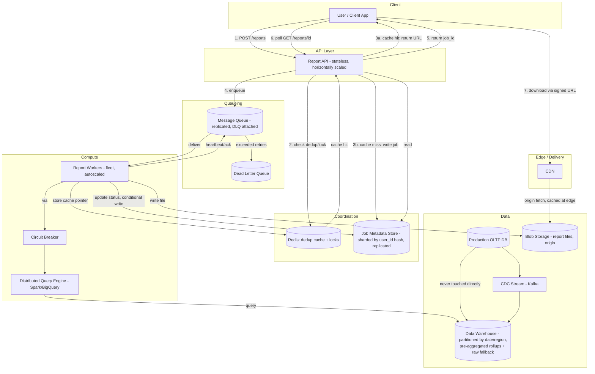

### Walking through one request, start to finish

Let's trace a single user's journey through the *entire* system, tying every part back together:

1. A regional manager clicks "Generate Weekly Sales Report — EMEA" → `POST /reports` hits the stateless **API layer** (Part 2).
2. The API checks **Redis** for a dedup key (`hash(report_type + params + data_version)`) (Part 6). If another manager already requested the identical report minutes ago, and it's cached or in-flight, this request either gets the cached signed URL instantly or is attached to the same in-flight job.
3. On a genuine miss, a job row is written to the **Job Metadata Store** (Part 5 — sharded by `user_id` hash, async-replicated for availability, Part 8) with `status: PENDING`.
4. A lightweight message goes onto the **Queue** (Part 2), which is itself replicated across brokers (Part 8) so a broker failure doesn't lose the job.
5. The API returns `job_id` immediately — sub-second response, regardless of how big the report will be.
6. A **Report Worker** picks up the job (visibility timeout + heartbeating protect against the worker dying mid-job, Part 7). It decides: can this be served from a pre-aggregated rollup table, or does it need a full distributed scan (Part 3)?
7. If it's a big ad-hoc query, the worker delegates to a **distributed query engine** (Spark/BigQuery), which internally does map → shuffle → reduce across many machines (Part 4), reading from the **date-partitioned Data Warehouse** (Part 5) — which itself only ever receives data via **CDC from production**, never a direct query (Part 3), keeping prod isolated.
8. All calls to the warehouse go through a **circuit breaker** (Part 7) so a warehouse hiccup doesn't get hammered by pile-on retries.
9. On success, the worker writes the file to **Blob Storage** with a deterministic path (idempotent, Part 7), does a **conditional status update** to `COMPLETED` in the Job Store (Part 7 — prevents double-notification if redelivered), and populates the Redis cache pointer (Part 6) so the next identical request is instant.
10. The user, who's been polling `GET /reports/{job_id}` (or got a push notification), now downloads the file via a **signed CDN URL** (Part 6) — fast regardless of their geography, and access-controlled despite being cached at edge nodes.

If anything fails along the way — a worker crash, a poison job, a warehouse outage, a primary DB dying — Parts 7 and 8 describe exactly what happens instead of silent data loss or an indefinitely hung request.

### The interview's favorite closing questions — and how to think about them

**"How would you handle 10x the scale?"**
Walk the bottlenecks in order of what breaks first: API layer scales trivially (stateless, just add instances behind a load balancer). The queue and worker fleet scale by adding more consumers/partitions. The real pressure point is the **warehouse** — at 10x, you'd lean harder into pre-aggregation (Part 3), consider more aggressive partition pruning, and possibly pre-compute more report "shapes" proactively (predict popular reports and warm the cache before Monday 9am, rather than reacting to the stampede). The Job Metadata Store scales by adding shards (Part 5) — this is designed to be near-linear since it's hash-sharded.

**"What would you cut for an MVP / a 6-week version of this?"**
This question tests whether you understand what's *load-bearing* versus *scale-optimization*. A good answer: keep the async job/queue architecture (Part 2) and basic isolation from prod (Part 3) — those are correctness/stability fundamentals, not premature optimization. Cut: pre-aggregation (compute rollups later once you know real query patterns), multi-region replication (Part 8 — single-region with solid backups is fine early), and the CDN (serve straight from blob storage until download volume actually justifies it). This shows judgment about **sequencing**, not just knowing every pattern exists.

**"What's the weakest part of this design?"**
Good candidates to raise yourself (better than waiting for the interviewer to find it): the dedup cache (Part 6) has a subtle edge case if `data_snapshot_version` isn't perfectly tracked, you could serve a stale report and not know it. Or: partial-result semantics (Part 7) genuinely need product input, not a purely technical answer. Naming a real weakness unprompted is a strong signal — it shows you're not just presenting a design as flawless, you're actively stress-testing it.

**"How do you monitor this system in production?"**
Worth having ready even if not asked: queue depth (a growing backlog signals workers can't keep up), job latency percentiles (p50/p95/p99 time-to-complete, since a few huge reports shouldn't hide behind a good average), DLQ size (spiking DLQ = something systemically broken, page someone), and warehouse query cost/duration (since these queries can be genuinely expensive — cost is a real production metric here, not just an afterthought).

---

That's the full system, end to end — origin story through failure handling, replication, and the closing questions that tend to wrap up these interviews.

A good next step, if you want to keep going: we could do a **mock interview run** where I play interviewer and throw follow-ups at you cold (no notes), so you can practice articulating this out loud rather than just recognizing it when you read it — that's usually the harder skill. Want to do that, or is there a specific part (sharding, replication, failure handling) you want to go deeper on first?

---

