# RAG System Design, learned as a story

We'll go one chapter at a time. I'll move on only when you tell me you're comfortable.

**Roadmap**

1. **Why RAG exists** (this chapter)
2. Naive RAG end to end, and where it breaks
3. Extraction / ingestion (PDFs, tables, OCR, metadata)
4. Chunking strategies
5. Embeddings
6. Vector indexes and ANN search (HNSW, IVF, PQ)
7. Retrieval: dense vs sparse (BM25) vs hybrid
8. Query understanding and expansion (rewriting, multi-query, HyDE)
9. Reranking
10. Prompt assembly, generation, citations, hallucination control
11. Evaluation
12. Scaling: sharding and replication
13. Caching
14. Freshness, updates, deletes, access control, multi-tenancy
15. Error handling, observability, cost and latency
16. Full mock HLD interview walkthrough

---

## Chapter 1: Why does RAG even exist?

### The story

It's 2023. You work at **Acme Corp**, which has 50,000 internal documents: HR policies, engineering runbooks, legal contracts, and product specs. ChatGPT has just blown everyone's mind, and your CEO says:

> "Build me a chatbot where employees can ask questions about our company and get correct answers."

Let's see how the industry stumbled toward RAG.

---

### Attempt 1: Just ask the LLM

An employee asks: *"How many weeks of parental leave do I get in India?"*

The LLM answers confidently: *"Typically 12 weeks."*

The actual Acme policy, updated last month, says **16 weeks**. Four problems show up:

| Problem | What happened |
|---|---|
| **Knowledge cutoff** | The model was trained before the policy changed |
| **No private data** | It never saw Acme's documents at all |
| **Hallucination** | It generated a plausible-sounding answer instead of saying "I don't know" |
| **No verifiability** | Nothing points to a source, so the employee can't check it |

Hallucination is the dangerous one. A wrong answer delivered confidently is worse than no answer.

**Lesson:** the model's built-in knowledge is frozen, public, and unverifiable.

---

### Attempt 2: Fine-tune the model on company documents

*"Teach the model our documents!"* Train it on all 50,000 documents so the knowledge lives in its weights.

This sounded logical, but the team hit several walls:

- **Updates are painful.** The policy changes next week, so you'd have to retrain. Retraining is slow and expensive, and it can degrade other abilities (catastrophic forgetting).
- **You can't delete.** A confidential document was accidentally included. Removing one fact from billions of weights isn't practical. This matters for compliance such as GDPR's right to erasure.
- **No access control.** If the model learned executive compensation documents, any intern can extract them by asking cleverly. The weights have no concept of "who is asking."
- **Still hallucinates.** Fine-tuning teaches style and behavior well, but it stores facts unreliably. The model may blend two similar policies.
- **No citations.** You still can't point at the source.

**Lesson:** fine-tuning is good for *how* the model behaves (tone, format, domain vocabulary) but bad for *what facts it knows*.

---

### Attempt 3: Stuff everything into the prompt

*"Forget training. Just paste all documents into the prompt with the question!"*

Do the math:

- 50,000 docs × ~4,000 tokens ≈ **200 million tokens**
- 2023 context windows were 4k to 32k tokens
- Even a modern 1M-token window holds only **~0.5%** of the corpus

Say the corpus were small enough to fit anyway. It still breaks:

| Issue | Why it hurts |
|---|---|
| **Cost** | You pay per input token on every query. At roughly $3 per 1M tokens (illustrative), one full-context query is ~$3, so 10,000 queries/day is ~$30k/day |
| **Latency** | Processing a million tokens takes many seconds to minutes |
| **Accuracy** | Research shows models get worse at using information buried in the middle of very long contexts ("lost in the middle") |
| **No access control** | Whatever is in the prompt, the user can potentially see |
| **Doesn't scale** | Corpus grows to billions of tokens and the approach is dead |

**Lesson:** the context window is expensive working memory, not storage.

---

### Attempt 4: The "open-book exam" insight

Someone asked: how do humans answer questions about things they don't memorize?

They **look it up**. A student in an open-book exam doesn't memorize the textbook, and doesn't carry the whole library to their desk either. They use the index, find the 2 or 3 relevant pages, read them, and write the answer.

That is **RAG: Retrieval-Augmented Generation**. The idea was formalized in a 2020 paper from Facebook AI Research (now Meta).

1. **Retrieve**: find the few pieces of text relevant to the question
2. **Augment**: put those pieces into the prompt
3. **Generate**: let the LLM answer using *only* that supplied context

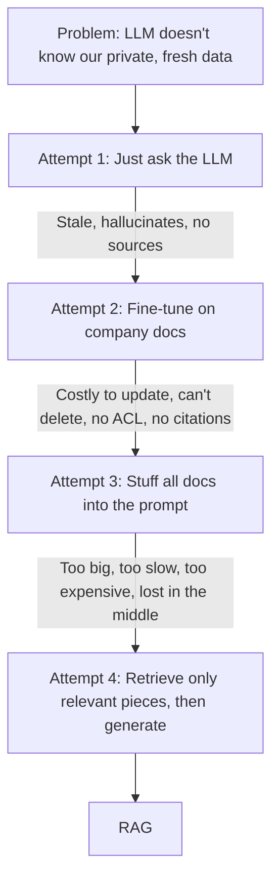

---

### The same parental-leave question, with RAG

1. The system searches Acme's documents and finds the chunk: *"Effective Aug 1, parental leave in India is 16 weeks..."* from `HR_Policy_v7.pdf`, page 12.
2. It builds a prompt: *"Answer using only the context below. Context: [chunk]. Question: How many weeks of parental leave in India?"*
3. The LLM answers: *"16 weeks (HR Policy v7, p.12)."*

Each earlier failure now has an answer:

| Earlier problem | How RAG solves it |
|---|---|
| Stale data | Update the index, not the model |
| Private data | The index holds it; the LLM only sees retrieved chunks |
| Hallucination | The model is grounded in the supplied text |
| No citations | We know exactly which chunk produced the answer |
| Delete / compliance | Delete the chunk from the index and it's gone |
| Access control | Filter retrieval by user permissions *before* the LLM sees anything |
| Cost | Send ~2k tokens per query, not 200M |

---

### The big-picture architecture

Every RAG system has **two pipelines**. Interviewers love it when you separate them right away:

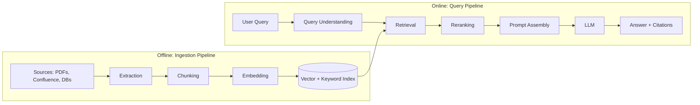

- **Offline (write path):** runs in the background, is throughput-oriented, and can take minutes or hours.
- **Online (read path):** runs per user request, is latency-oriented, and must finish in roughly 1 to 3 seconds.

This is the same read/write separation you already know from other HLD problems, and it shapes every scaling decision later. Ingestion scales for throughput, and querying scales for latency and QPS.

---

### RAG vs Fine-tuning vs Long context: the interview table

| | RAG | Fine-tuning | Long context |
|---|---|---|---|
| **Best for** | Facts, private and changing knowledge | Style, format, behavior | Small, one-off document sets |
| **Update knowledge** | Instant (re-index) | Retrain | Re-paste |
| **Citations** | Natural | Not possible | Possible but weak |
| **Access control** | Filter at retrieval | Not possible | Manual |
| **Cost per query** | Low | Low at inference, high upfront | High |
| **Scales to huge corpora** | Yes | Partially | No |

They aren't mutually exclusive. Many production systems use RAG for knowledge, light fine-tuning for tone and format, and long context for the retrieved chunks. Saying this shows maturity.

---

### Interview soundbite

> "LLMs have frozen, public, unverifiable knowledge. Fine-tuning bakes facts into weights, which makes them hard to update, delete, or permission. Long context is too expensive and degrades in accuracy. RAG keeps knowledge outside the model in a searchable index, retrieves only the relevant pieces per query, and grounds the LLM's answer in them, giving us freshness, citations, access control, and low cost."

---

### Quick self-check

Try answering these in your own words:

1. Why can't fine-tuning satisfy a "delete this document's knowledge" requirement?
2. Why is a 1M-token context window not a replacement for RAG?
3. Why do we split RAG into an offline and an online pipeline?

Answer them if you'd like feedback, or tell me **"next"** and we'll start Chapter 2: **Naive RAG end to end**. There we'll build the simplest working version and watch exactly where it fails, which motivates extraction, chunking, query expansion, and reranking.

---

# Chapter 2: Naive RAG end to end, and where it breaks

## The story

Acme's team is excited about the open-book idea. A small team of two engineers gets one week to build a prototype. They want the **simplest thing that could possibly work**, and that first version is now called **"Naive RAG"** (some people say "Vanilla RAG").

## Building Naive RAG in five steps

**Ingestion (offline):**

1. **Load** all documents as plain text.
2. **Split** every document into fixed-size pieces, say 1,000 characters each. These pieces are called **chunks**.
3. **Embed** each chunk. An embedding model turns text into a list of numbers (a *vector*) so that texts with similar *meaning* get similar vectors.
4. **Store** the vectors, along with the original chunk text, in a vector database.

**Query (online):**

5. Embed the question with the same model. Find the **top-k** (say 3) chunks whose vectors are closest to the question's vector. Paste them into a prompt and ask the LLM.

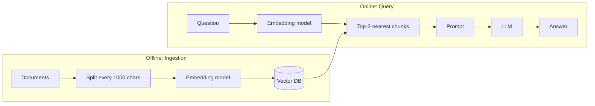

### The runtime flow

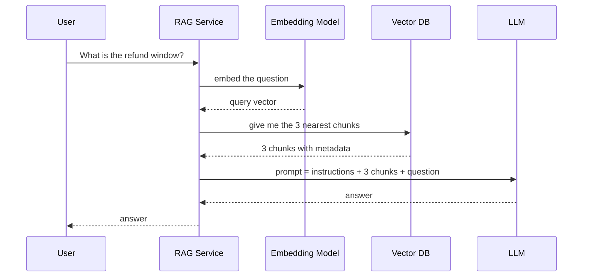

### The whole thing in about 15 lines

```python
# ---------- Offline ----------
chunks = []
for doc in load_documents():
    text = doc.text
    for i in range(0, len(text), 1000):          # fixed-size split
        chunks.append(text[i:i+1000])

vectors = embed_model.encode(chunks)              # e.g. 1024-dim vectors
vector_db.upsert(vectors, payload=chunks)

# ---------- Online ----------
def answer(question):
    q_vec = embed_model.encode([question])[0]
    top_chunks = vector_db.search(q_vec, k=3)     # nearest by cosine similarity
    prompt = f"""Answer ONLY using the context below.
If the answer is not in the context, say "I don't know".

Context:
{top_chunks}

Question: {question}"""
    return llm.generate(prompt)
```

That's the whole system. The interesting part is what happens *inside* `embed_model` and `vector_db.search`.

---

## Intuition: why embeddings work

Suppose we store three chunks:

- **A:** "Refunds are accepted within 30 days of purchase."
- **B:** "Our office is closed on public holidays."
- **C:** "Items may be sent back within a month for a full return."

The user asks: **"How long do I have to get my money back?"**

The question shares almost **no keywords** with A or C. A keyword search (like Ctrl+F) would fail. But the embedding model has learned from huge amounts of text that "get my money back", "refund", and "return" live in the same neighborhood of meaning. So:

```
Similarity(question, A) = 0.82   ← high
Similarity(question, C) = 0.79   ← high
Similarity(question, B) = 0.11   ← low
```

Top-2 gives us A and C, which is what we want. This is **semantic search**, the superpower that made RAG possible. Chapter 5 covers how it works internally.

---

## The demo works, so they ship it

The CEO tries three questions in the demo, and all three work. Everyone celebrates. Then real employees start using it and the complaints roll in. Each failure teaches us something.

### Failure 1: Garbage in, garbage out (extraction)

An employee asks: *"What's the reimbursement limit for a Level 5 manager?"*

The answer lives in a **table** inside a PDF. The naive loader flattened the table into this:

```
Level Meals Travel Lodging L3 $50 $200 $150 L4 $60 $250 $180 L5 $75 $300 $220
```

The row and column structure is gone, so the LLM can't tell which number belongs where. It answers "$75", which is the wrong column.

Other extraction disasters include scanned PDFs (images, so no text at all), page headers and footers repeated in every chunk, multi-column layouts read left-to-right across columns, and slides with text inside images.

**Lesson:** if the text is broken *before* embedding, nothing downstream can fix it. → **Chapter 3: Extraction**

### Failure 2: The answer got cut in half (chunking)

The policy says:

> "...Employees may claim refunds within 30 days. **[← 1000-char boundary]** However, this does not apply to digital goods, which are non-refundable."

The fixed splitter cut it in the middle. Chunk 1 ends with "within 30 days." and Chunk 2 starts with "However, this does not apply...". A question about digital goods retrieves Chunk 2, but Chunk 2 has no idea *what* "this" refers to. The reverse can happen too: the question about the 30-day window retrieves only Chunk 1, and the LLM confidently misses the exception.

Two related problems:

- **Too big:** a 5-topic chunk gets one blurry embedding and matches nothing well.
- **Too small:** a chunk has the fact but not the context ("it is 16 weeks", but *what* is 16 weeks?).

**Lesson:** where you cut the text decides what can be found. → **Chapter 4: Chunking**

### Failure 3: Semantic search misses exact things (embeddings and retrieval)

An engineer asks: *"How do I fix error ERR-4021?"*

Embeddings capture *meaning*, not exact strings. The model sees "ERR-4021" and "ERR-4012" as nearly identical, so it returns the runbook for the wrong error. The same happens with product SKUs, function names, legal clause numbers, and people's names.

**Lesson:** semantic search alone is not enough, and old-school keyword search (BM25) still matters. → **Chapters 5 and 7**

### Failure 4: Users don't ask good questions (query understanding)

A user chats:

> User: "What's the parental leave policy in India?"
> Bot: (good answer)
> User: **"and for adoption?"**

The system embeds "and for adoption?" *literally*. That's vague and has no context, so retrieval returns junk. Other cases include one-word queries ("VPN"), typos, and questions using different vocabulary than the docs ("laptop" vs "endpoint device").

**Lesson:** we need to fix the query before searching. → **Chapter 8: Query Expansion and Rewriting**

### Failure 5: The right chunk is retrieved but ranked 7th (reranking)

The correct chunk exists and the search *does* find it, but at rank 7. We only send the top 3 to the LLM, so the answer never reaches it. Vector search is a fast, rough filter. It's good at "roughly relevant" but bad at "which is the *most* relevant".

We could raise k to 10, but then the prompt gets noisy (more cost, and more distractions for the LLM).

**Lesson:** retrieve broadly and cheaply, then re-score the candidates with a smarter (slower) model. → **Chapter 9: Reranking**

### Failure 6: The LLM misbehaves (generation)

- It ignores the context and answers from its own memory.
- It merges two conflicting policy versions (v6 and v7) into one wrong answer.
- It gives no citations, so users still can't trust it.
- It answers when it should say "I don't know."

**Lesson:** prompt design and guardrails matter. → **Chapter 10**

### Failure 7: It breaks at real scale (systems)

Here's the number that changes how you think about architecture. Let's estimate for Acme:

- 200M tokens ÷ ~500 tokens per chunk ≈ **400,000 chunks**
- One 1024-dim float32 vector = 4 KB → 400k × 4 KB ≈ **1.6 GB**

That fits in RAM on **one machine**, and even brute-force comparison against every vector takes only milliseconds. So for Acme, the naive system is fine on scale.

Now imagine a Google- or Meta-scale corpus: **1 billion chunks**.

- 1B × 4 KB = **4 TB** of vectors, which won't fit on one machine.
- Brute-force comparison per query takes many seconds, not milliseconds.

Now you need **approximate nearest neighbor (ANN) indexes**, **sharding**, **replication**, and **caching**. → **Chapters 6, 12, 13**

> **Interview tip:** always compute the scale numbers *first*. They decide whether the answer is "one Postgres box with pgvector" or "a sharded distributed vector search cluster." Saying "at 400k chunks I wouldn't even need ANN" impresses interviewers more than over-engineering.

### Failure 8: The real world moves (operations)

- The HR policy was updated. Are the old chunks still in the index?
- A document was deleted for legal reasons. Is it *truly* gone?
- An intern asks about executive salaries. Does the retriever filter by permissions?
- How do we know if a change made things better or worse? ("It feels better" is not evidence.)

**Lesson:** freshness, deletion, security, and evaluation are first-class parts of the design. → **Chapters 11 and 14**

---

## The failure map

Every stage of the naive pipeline has a known failure mode, and each chapter of this course fixes one:

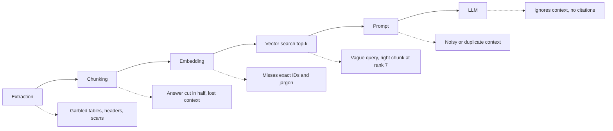

## The four "knobs" of naive RAG

You'll be asked how you'd tune a RAG system, and the answer starts with these knobs:

| Knob | Too low | Too high |
|---|---|---|
| **Chunk size** | Loses context | Blurry embeddings, wasted tokens |
| **Chunk overlap** | Facts split across chunks | Duplicate storage and noisy results |
| **Top-k** | Misses the answer (low recall) | Noisy prompt, higher cost |
| **Embedding model** | Weak semantic match | Slower and pricier |

## Interview soundbite

> "The baseline RAG is: split documents into fixed-size chunks, embed them, store in a vector DB, and at query time embed the question, take the top-k nearest chunks, and stuff them into the LLM prompt. It works for demos but fails in production at every stage: bad extraction from tables and PDFs, chunk boundaries that destroy context, semantic search missing exact identifiers, vague user queries, poor ranking within top-k, and LLMs that ignore or misuse context. Each of these motivates a specific improvement, and I'd decide which ones to invest in based on the corpus, the query patterns, and scale."

## Quick self-check

1. Why did the fixed 1,000-character splitter hurt the "digital goods" question?
2. Why can semantic search fail on a query like "ERR-4021"?
3. At 400k chunks vs 1B chunks, what changes in the design, and why?

Answer any of these if you want feedback, or say **"next"** and we'll start Chapter 3: **Extraction**. That covers how real companies pull clean text, tables, and structure out of messy PDFs, scans, slides, and web pages, and why it's the most under-rated part of RAG.

---

# Chapter 3: Extraction (Ingestion)

## The story

Acme's chatbot is live, and the reimbursement-table failure from last chapter is the top complaint. An engineer, Riya, opens the PDF and does something nobody had done yet: she **looks at what the pipeline actually extracted**.

```
Level Meals Travel Lodging L3 $50 $200 $150 L4 $60 $250 $180 L5 $75 $300 $220
```

Her realization: **the LLM never had a chance.** It was shown garbage and asked to produce gold.

> **Core principle:** RAG quality is capped by extraction quality. Every later stage, whether chunking, embedding, or reranking, can only work with what extraction gave it.

Let's follow how the industry improved this step by step.

---

## Attempt 1: A plain text extractor

The prototype used a simple library that pulls text from a PDF (think `pdftotext` or PyPDF). It reads the PDF's internal "draw this character at this position" instructions and dumps the characters as a stream.

| Problem | Example |
|---|---|
| **Tables flattened** | Rows and columns collapse into one line of numbers |
| **Multi-column layouts** | A two-column research paper is read straight across, so sentence 1 of column A gets glued to sentence 1 of column B |
| **Headers and footers** | "Acme Confidential, Page 12 of 40" gets injected into the middle of paragraphs and repeated in every chunk |
| **Scanned PDFs** | These are just images, so the extractor returns an **empty string**, and 15% of Acme's contracts were silently ignored |
| **Lost structure** | Headings, bullet nesting, and lists all look like plain text |
| **Hyphenation and ligatures** | "reim-\nbursement" becomes two tokens, and "finance" (with a ligature) doesn't match "finance" |

A **PDF is not a document format, it's a drawing format.** It stores where to paint glyphs, not paragraphs or tables. That's why extraction is genuinely hard.

Two-column example:

```
What the page looks like:        What Attempt 1 produced:
┌──────────┬──────────┐
│ Refunds  │ Digital  │          "Refunds are accepted Digital goods are
│ are      │ goods    │           within 30 days of    non-refundable and
│ accepted │ are non- │           purchase for..."
│ ...      │ ...      │
└──────────┴──────────┘          (two unrelated sentences interleaved)
```

---

## Attempt 2: OCR everything

*"Scans have no text? Then treat every page as an image and run OCR (Optical Character Recognition) on all of them."*

OCR converts pixels into characters. It fixed the empty-scan problem, but new issues showed up:

- **Slow and expensive.** OCR on pages that already had perfectly good embedded text is wasted compute.
- **Errors.** "0" vs "O", "1" vs "l", and smudged fax scans produce typos. A wrong digit in a contract amount is a serious bug.
- **Structure still lost.** OCR gives you words and coordinates, not tables or headings.

**Lesson:** OCR is a tool for *some* pages, not a strategy.

---

## Attempt 3: Layout-aware parsing

The insight: **understand the page like a human does.** Look at the page, detect regions, classify each region, and treat each type differently.

A **layout detection model** (an object-detection-style vision model) looks at a page and outputs boxes labeled as:

- Title / Heading
- Paragraph
- Table
- Figure / Image
- List
- Header / Footer / Page number (to be **dropped**)
- Caption, Footnote

Now:

- Reading order is solved per region, so columns are handled properly.
- Headers and footers are identified and removed instead of polluting every chunk.
- Tables are sent to a **specialized table extractor** that recovers rows and columns.
- Headings are kept, so we know the *document hierarchy*.

Existing tools in this space include Unstructured, Docling, cloud document-AI services (AWS Textract, Azure Document Intelligence, Google Document AI), and PyMuPDF-style libraries for the digital-text basics. You don't need to memorize vendors. In an interview, say "a layout-aware parser or a managed document-AI service".

The result is a **typed element list** instead of a blob of text:

```json
[
  {"type": "Title",  "text": "Employee Expense Policy", "page": 1},
  {"type": "Heading","text": "Reimbursement Limits by Level", "page": 4},
  {"type": "Table",  "page": 4, "rows": [
      ["Level","Meals","Travel","Lodging"],
      ["L3","$50","$200","$150"],
      ["L4","$60","$250","$180"],
      ["L5","$75","$300","$220"]]},
  {"type": "Paragraph","text": "Claims must be filed within 30 days...", "page": 5}
]
```

That's a huge upgrade. Chunking (next chapter) can now respect these boundaries.

---

## Handling tables properly

Tables deserve extra attention because they carry the highest-value facts (limits, prices, SLAs) and break the most easily.

**Step 1: Keep the structure.** Convert to Markdown, HTML, or CSV-like text:

```
| Level | Meals | Travel | Lodging |
|-------|-------|--------|---------|
| L5    | $75   | $300   | $220    |
```

Now an LLM can read "L5 → Meals $75" correctly.

**Step 2: The embedding problem.** An embedding model handles a table of pipes and numbers poorly, so a question like "what can a manager claim for hotels?" won't match it well.

**Step 3: The "summary for search, raw for answer" trick.** Have an LLM write a short natural-language description of the table:

> *"Expense reimbursement limits per day by employee level (L3 to L5) for meals, travel, and lodging. L5 limits: meals $75, travel $300, lodging $220."*

We **embed the summary** (good for finding) but **return the original table** to the answering LLM (good for accuracy). This pattern comes back in chunking as the **parent-child** idea: search on one representation, return another.

**Step 4: Big tables.** A 500-row table can't be one chunk. Split by row groups and **repeat the header row in every piece**. Otherwise "$75" floats around with no column name.

---

## Images, charts, diagrams, slides

A PowerPoint slide's key content may be a chart. A runbook's key content may be an architecture diagram. Text extraction sees nothing.

- **Captioning:** send the image to a **vision-language model (VLM)** and ask for a description plus any text or numbers visible. Embed the caption and store a pointer to the image.
- **Slides:** treat each slide as a unit, combining slide text, speaker notes, and image captions.

---

## Attempt 4: Let a vision-language model read the page

Newer approach: skip the parsing stack. Render each page to an image and ask a multimodal LLM to *"transcribe this page to Markdown, preserving tables and headings."* It handles messy layouts, handwriting, and weird forms surprisingly well.

Trade-offs to state in an interview:

| | Classic layout parser | VLM page reading |
|---|---|---|
| **Cost** | Low | High (per page, per token) |
| **Speed** | Fast (CPU) | Slow (GPU or API calls) |
| **Failure mode** | Structural errors | **Hallucination**: it may "fix" or invent text |
| **Best for** | Bulk, clean digital docs | Hard pages, complex tables, scans |

There's also a research-driven alternative: **embed page images directly** (as in ColPali-style models) and skip text extraction altogether. It's promising for visually rich documents but less mature operationally, so mention it as an emerging option, not the default.

---

## The production answer: a tiered router with fallbacks

Nobody uses one method for everything. Real systems **route documents by type and difficulty**, starting cheap and escalating only when needed:

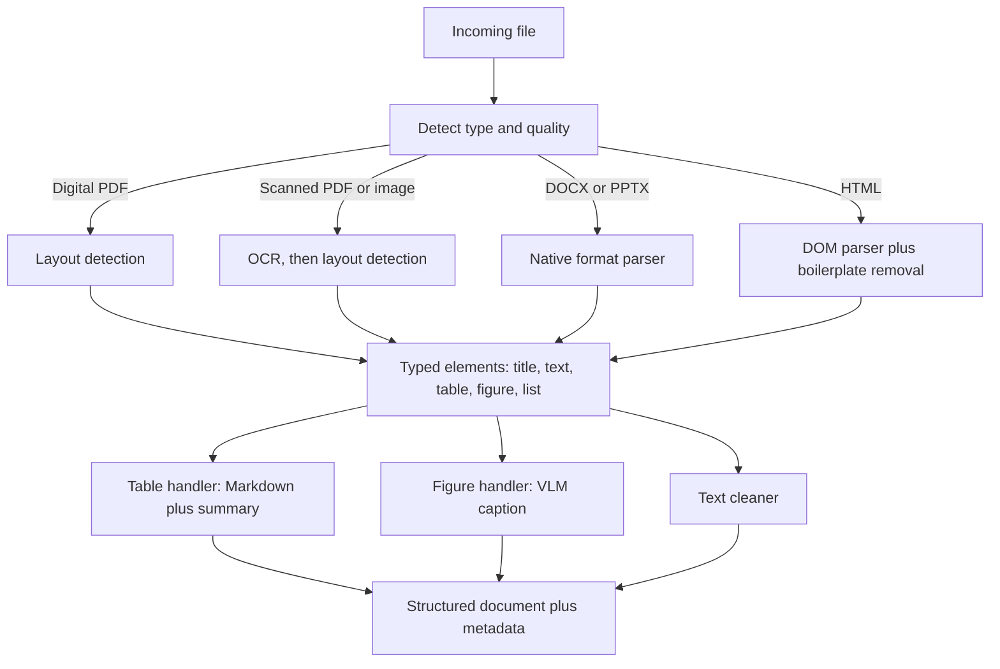

The **escalation ladder** for one problematic PDF:

1. Fast embedded-text extraction. Run a **quality check** on the output.
2. If quality is low (see the heuristics below), fall back to layout parser plus OCR.
3. If still low, or the page contains a complex table, send that **page only** to a VLM.
4. If everything fails, **quarantine** the document and alert. Don't silently drop it.

**Quality heuristics** (cheap signals that extraction went wrong):

- Very few characters per page for a page that looks full of ink means a scan.
- High ratio of non-printable or garbage characters.
- Many single-character "words" (columns interleaved).
- OCR confidence score below a threshold.
- Extracted numbers don't add up (for tables with totals).

Escalating **per page**, not per document, is a good cost-saving detail to mention.

---

## Cleaning and normalization

After parsing, before anything is indexed:

- **Boilerplate removal:** headers, footers, page numbers, cookie banners, nav menus (for HTML), email signatures and legal disclaimers.
- **Text normalization:** unicode normalization, fix hyphenation across line breaks, expand ligatures, collapse whitespace.
- **Deduplication:**
  - *Exact duplicates:* hash the content.
  - *Near duplicates:* the same policy copied into 12 wikis with tiny edits. Use MinHash/SimHash-style fingerprints. Without dedup, your top-k fills with 5 copies of the same paragraph, which wastes prompt space and crowds out other useful chunks.
- **PII handling:** detect and mask or tag sensitive data (SSNs, card numbers) according to policy, *before* it gets into an index.
- **Language detection:** it decides which embedding model or analyzer to use later.

---

## Metadata: the most valuable by-product

Extraction shouldn't only produce text. It should produce **metadata** that powers almost everything downstream:

```json
{
  "doc_id": "hr-policy-2024",
  "version": 7,
  "source": "sharepoint://hr/policies/leave.pdf",
  "page": 12,
  "section_path": "HR Policy > Leave > Parental Leave > India",
  "doc_type": "policy",
  "language": "en",
  "created_at": "2024-08-01",
  "updated_at": "2024-08-01",
  "content_hash": "9f2c...",
  "acl": ["group:hr-all", "group:india-employees"],
  "parser_version": "3.2"
}
```

| Metadata | Enables |
|---|---|
| `page`, `source` | **Citations** ("HR Policy v7, p.12") |
| `section_path` | Adds context to chunks ("this is about India parental leave") |
| `version`, `updated_at` | Preferring the latest version, freshness filtering |
| `acl` | **Permission filtering** at retrieval time |
| `content_hash` | Change detection and dedup |
| `parser_version` | Knowing what to **re-process** when you upgrade the parser |

Don't treat metadata as an afterthought. It's what makes citations, security, and updates possible.

---

## Different sources, different problems

| Source | Typical challenge | Approach |
|---|---|---|
| PDF | Layout, tables, scans | Layout-aware parsing with tiered fallbacks |
| DOCX / PPTX | Nested structure, embedded images | Native parsers (they retain real structure) |
| HTML / web | Boilerplate, JS-rendered pages | DOM parsing, main-content extraction |
| Confluence / Notion / Drive | Permissions, pagination, rate limits | API connectors with incremental sync |
| Slack / email | Threads, noise, privacy | Group by thread, filter noise, strict ACLs |
| Databases | Rows aren't documents | Serialize records to text or use text-to-SQL for structured questions |
| Audio / video | No text at all | Speech-to-text (transcription), keep timestamps |
| Code | Structure matters | Parse by function or class using syntax trees |

---

## The system-design view: an ingestion pipeline at scale

This is where interview answers become "HLD". The extraction stage is a **distributed batch and streaming pipeline**:

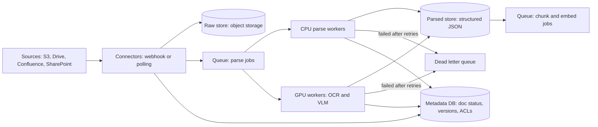

### Key design decisions

**1. Store the raw document forever (source of truth).** Keep the original files in object storage. Parsers improve over time, and when you upgrade you can **re-parse everything** without going back to the source systems. Keep the **parsed output** as a separate, versioned artifact (tagged with `parser_version`).

**2. Queue between stages.** Decoupling connectors, parsers, and embedders means each stage scales independently and absorbs bursts. If someone dumps 2M files into a bucket, the queue absorbs the spike and the workers drain it at their own pace (**backpressure**).

**3. Separate worker pools by cost profile.** Cheap CPU workers handle digital PDFs and Office files. Expensive **GPU workers** handle OCR and VLM. Route by document type so GPUs don't sit idle behind slow CPU jobs, or vice versa.

**4. Parallelism at the page level.** A 2,000-page PDF shouldn't be one 30-minute job. Fan out **per page or per page-range**, then merge in reading order. This also gives partial-failure isolation.

**5. Idempotency.** Jobs may be delivered twice (at-least-once queues). Use a job key like `doc_id + content_hash + parser_version`. Reprocessing the same input then produces the same output and doesn't create duplicates.

**6. Change detection.** Don't re-parse everything on every sync. Use ETag, last-modified, or content hash to detect what really changed. Only changed docs go into the queue.

**7. Deletion and permission changes.** These are events too. If a document is deleted or its ACL changes at the source, the pipeline must propagate that (tombstones and ACL updates) all the way to the index. We'll cover this in Chapter 14.

### Scale estimate (illustrative)

Acme acquires a company and needs to ingest **1M scanned pages**.

- OCR at ~1 second per page per worker → 1,000,000 seconds ≈ **11.6 days** on one worker.
- With 100 parallel workers → ~10,000 seconds ≈ **2.8 hours**.

So the answer is horizontal scaling with page-level fan-out, not a faster single machine.

**Cost control:** VLM calls cost real money. Run them only on pages that failed cheaper methods, cache results by content hash (identical pages never get processed twice), and set per-tenant budgets.

---

## Error handling in ingestion

Real corpora are messy. Expect these:

| Failure | Handling |
|---|---|
| Corrupt or unreadable file | Mark `FAILED`, store the error reason, notify the owner |
| Password-protected file | Quarantine with a clear status |
| Timeout on a huge file | Split into page ranges, retry only the failed range |
| Transient errors (API rate limits, network) | **Retry with exponential backoff and jitter** |
| Repeated failure ("poison message") | Move to **Dead Letter Queue** after N retries, so it doesn't block the queue |
| Parser produced low-quality output | Escalate down the fallback ladder, then quarantine |
| Partial success | Index good pages, flag failed ones, and never silently drop |

Track each document with a state machine so the team can always answer "why isn't my document searchable?":

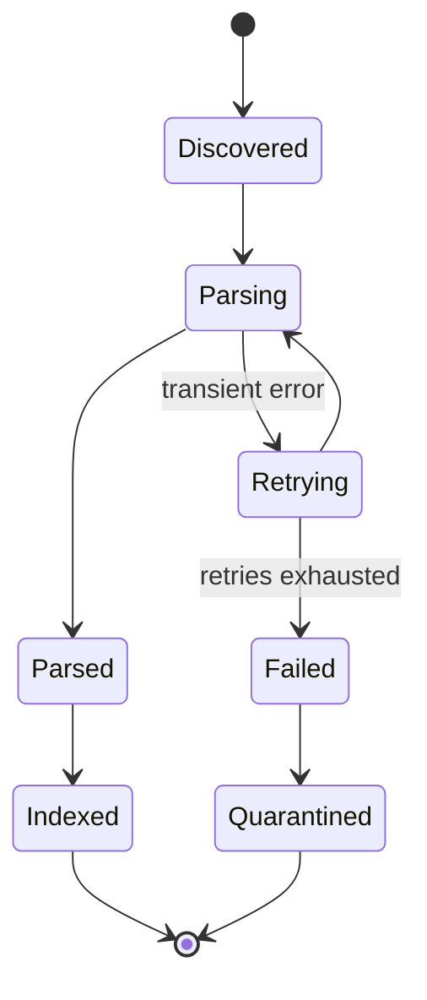

**Observability:** dashboards for parse success rate by file type, queue depth and age of oldest message, per-stage latency, DLQ size, and the fraction of pages that needed escalation to OCR or VLM. A rising escalation rate is an early warning that a source system changed its format.

---

## Measuring extraction quality

Teams often skip this and then blame the LLM. Instead:

- Keep a **golden set** of ~100 tricky documents (tables, scans, multi-column) with human-verified extraction.
- Measure text accuracy and **table structure accuracy** separately.
- Randomly sample production docs for periodic human review.
- Track the *downstream* effect. If a parser upgrade improves retrieval hit rate on your evaluation set, it was worth it (more on this in Chapter 11).

---

## Naive vs improved extraction: the same table

| | Naive | Improved |
|---|---|---|
| Table | `Level Meals Travel Lodging L3 $50...` | Markdown table plus NL summary |
| Headers and footers | In every chunk | Removed |
| Scans | Empty | OCR, with quality check |
| Metadata | None | page, section path, version, ACL |
| Failures | Silent | Tracked, retried, quarantined |
| Upgrade path | Re-crawl everything | Re-parse from raw store |

---

## Interview soundbite

> "Extraction is the foundation of RAG because garbage text can't be fixed downstream. I'd build a tiered pipeline: detect file type, use fast native parsers for clean digital docs, layout-aware parsing for PDFs so tables, columns, and headers are handled properly, OCR for scans, and escalate only hard pages to a vision-language model, with quality checks deciding when to escalate. Tables are preserved as Markdown, with an LLM-generated summary used for embedding. Output is a typed, structured document with rich metadata: page, section path, version, ACLs, content hash. Architecturally it's an asynchronous pipeline: connectors write raw files to object storage, queues feed CPU and GPU worker pools, jobs are idempotent and fanned out per page, failures retry with backoff and land in a dead-letter queue, and I keep the raw files so I can re-parse when the parser improves."

---

## Quick self-check

1. Why is a PDF hard to extract text from, compared with a Word document?
2. Why embed a table's *summary* but return the *original table* to the LLM?
3. Why fan out per page and keep the raw files in object storage?

Answer any of them for feedback, or say **"next"** and we'll move to Chapter 4: **Chunking**. That's where we decide how to cut clean, structured text into pieces, and where the "answer got cut in half" failure gets solved.

---

# Chapter 4: Chunking

## The story

After Riya's extraction fixes, Acme's tables and scans are clean. But the "digital goods" complaint is still open. Here is the refund section, now extracted perfectly:

> *Refunds are accepted within 30 days of purchase. However, this does not apply to digital goods, which are non-refundable. Gift cards can be exchanged but not refunded.*

The fixed 1,000-character splitter still cuts it wherever the 1,000th character happens to fall. Riya says: "We have clean text, but we're slicing it like bread."

**Chunking** is the decision of how to cut extracted text into the units that get embedded, stored, retrieved, and shown to the LLM.

---

## Why chunk at all?

Why not embed each whole document? Four reasons:

| Reason | Explanation |
|---|---|
| **Embedding model input limit** | Models accept a maximum number of tokens (commonly 512 to 8,192). Text beyond it is **silently truncated**, so the tail of a long document becomes unsearchable. |
| **Blurry vectors** | One vector for a 40-page document is an average of 50 topics. It matches none of them sharply. |
| **Precision** | The answer is usually 2 sentences. Returning 40 pages wastes tokens and distracts the LLM. |
| **Cost and latency** | The LLM bills per input token. |

But there's an opposite danger. A chunk that's too small has a sharp embedding but **no context**.

```
Too big:    [Refunds + Shipping + Warranty + Contact info + ...]  → blurry, matches nothing well
Too small:  ["It is 16 weeks."]                                   → sharp but 16 weeks of WHAT?
Just right: [A self-contained idea with enough context to answer]
```

**Chunking is the art of making each chunk a self-contained unit of meaning.** Let's watch how the industry evolved.

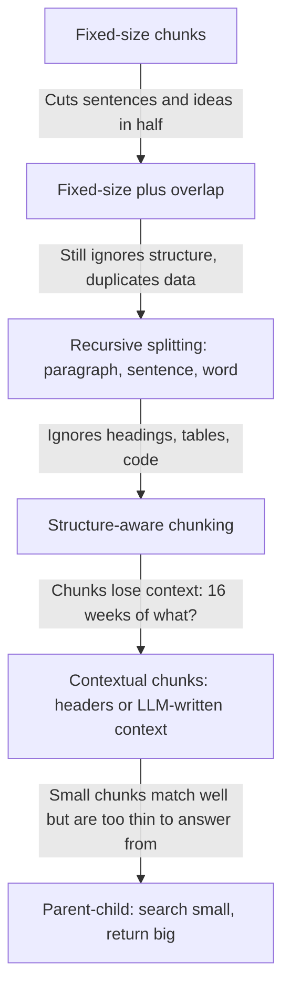

---

## Attempt 1: Fixed-size chunks

Split every N characters (or tokens), ignoring content.

```
Chunk 1: "...Refunds are accepted within 30 days of purchase. Howev"
Chunk 2: "er, this does not apply to digital goods, which are non-ref"
Chunk 3: "undable. Gift cards can be exchanged but..."
```

**Pros:** trivial, fast, and every chunk is a predictable size, which is easy to batch and budget.

**Cons:** it cuts mid-word, mid-sentence, and mid-idea. Chunk 2 says "this does not apply" with no idea what "this" is.

**Lesson:** the size limit is a constraint, not a splitting strategy.

---

## Attempt 2: Fixed-size with overlap

*"If a boundary might cut an idea, let neighboring chunks share some text."* Each chunk repeats the last ~10 to 20% of the previous one.

```
Chunk 1: [ A A A A A A A A A A ]
Chunk 2:                 [ A A | B B B B B B B B ]     ← overlap
Chunk 3:                                 [ B B | C C C C C C C C ]
```

Now a sentence cut at the boundary appears whole in at least one chunk (if the overlap is bigger than the sentence).

**Trade-offs:**

| Benefit | Cost |
|---|---|
| Ideas at boundaries survive | **Storage inflation**: 512-token chunks with 64 overlap store ~12.5% more vectors and text |
| Cheap insurance | **Duplicate hits**: top-k can return two chunks with the same overlapping text, wasting prompt space |
| | Doesn't fix a *long* idea that exceeds the overlap |

**Lesson:** overlap is a band-aid. Better to cut at natural boundaries in the first place.

---

## Attempt 3: Recursive splitting

*"Cut at the biggest natural boundary that fits."* Try separators in order of preference:

1. Section breaks / double newlines (paragraphs)
2. Single newlines
3. Sentence endings
4. Spaces (words)
5. Characters (last resort)

Algorithm: split by paragraphs. If a paragraph fits under the size limit, keep it. If not, split *that* piece by sentences, and so on. Then **merge small neighbors** up to the limit so we don't produce tiny chunks.

Result on our refund text: chunks now break at sentence boundaries. That's a big improvement, and this is the **default in most libraries** (a "recursive character text splitter").

Two practical points:

- **Measure size in tokens, using the embedding model's own tokenizer**, not characters. Characters vary wildly (code, other languages), and the model's limit is in tokens. Leave a safety margin.
- It still knows nothing about *document structure*. A heading can be separated from its paragraph, and a table can be split between rows.

---

## Attempt 4: Structure-aware chunking

This is where Chapter 3 pays off. We now have **typed elements** (title, heading, paragraph, table, list, code), so we chunk along the document's own hierarchy:

- Each **section** (heading plus its content) is a natural chunk. If it's too big, split it recursively *inside* the section, never across sections.
- A heading is always attached to the content beneath it.
- **Tables**: keep whole if small. If large, split by row groups and **repeat the header row** in each piece.
- **Lists**: keep the intro sentence ("The following are not refundable:") together with its items.
- **Code**: split by function or class using the syntax tree, not by lines.

Different content types call for different strategies:

| Content | Best chunk unit |
|---|---|
| Policy / legal | Section or clause, keeping numbering ("§4.2") |
| FAQ | One question + answer pair per chunk |
| Slides | One slide (text + notes + image caption) |
| Chat / Slack / transcripts | A window of turns or a thread, with speaker names |
| Code | Function or class, with docstring and file path |
| Web pages | Content under each heading |
| Tables | Row groups with the header repeated |

**Lesson:** the document already tells you where the ideas are. Use it.

---

## Attempt 5: Semantic chunking

*"Let meaning decide the boundaries."* Embed each sentence, then compare adjacent sentences. Where similarity **drops sharply**, the topic probably changed, so cut there.

```
S1 "Refunds accepted within 30 days."        ┐
S2 "Digital goods are non-refundable."       │ high similarity → same chunk
S3 "Gift cards can be exchanged."            ┘
S4 "Our offices are closed on holidays."       ← big drop → cut here
```

**Pros:** chunks follow topic changes even in unstructured text (transcripts, long prose).

**Cons:**

- Extra embedding cost at ingestion (every sentence gets embedded).
- Chunk sizes become unpredictable. Some are huge and some are tiny, so you need min and max bounds.
- Benchmarks are mixed. Gains over good recursive or structure-aware splitting are often modest, and sometimes negative.

**Honest interview answer:** "I'd try it on unstructured text and measure. I wouldn't default to it."

There are also more exotic options to name-drop: **proposition chunking** (an LLM rewrites text into atomic, self-contained facts, which is great for QA but expensive), **LLM-driven "agentic" chunking**, and **late chunking** (embed the whole long document first with a long-context embedding model, then pool per-chunk vectors so each chunk's embedding "knows" the surrounding document).

---

## The next problem: chunks that have lost their context

Even with perfect boundaries, a chunk pulled out of its document can be ambiguous. Take this chunk from the HR policy:

> *"The entitlement is 16 weeks, extendable by 4 weeks with a medical certificate."*

Which entitlement? Which country? A user asking "parental leave India" may not match it, because the words "parental", "leave", and "India" appear in the **section heading**, not in the chunk.

### Fix A: Contextual headers (cheap)

Prepend the document title and section path (from Chapter 3's metadata) to the chunk text *before embedding*:

```
[Acme HR Policy v7 > Leave > Parental Leave > India]
The entitlement is 16 weeks, extendable by 4 weeks with a medical certificate.
```

Now the embedding carries the topic. This is cheap and very effective.

### Fix B: LLM-generated context per chunk (contextual retrieval)

For each chunk, give an LLM the whole document plus the chunk and ask for a 1 to 2 sentence situating description:

> *"This chunk is from Acme's HR Policy v7, section on India parental leave, describing the length of paid leave and medical extension."*

Prepend that to the chunk before embedding **and** before building the keyword index. Anthropic published this as "Contextual Retrieval" and reported large reductions in failed retrievals, especially when combined with keyword search and reranking.

**The cost problem:** one LLM call per chunk over a large document is expensive. The mitigation is **prompt caching**: the whole document is the same prefix for all its chunks, so it's processed once and reused, and only the chunk-specific part changes. Mention this cost awareness in the interview.

---

## The next trade-off: matching well vs. answering well

Small chunks (about 100 to 200 tokens) have **sharp embeddings**, so they match questions precisely. But a sentence alone may be too thin for the LLM to answer from. Big chunks (about 800+ tokens) give the LLM rich context, but their embeddings are blurrier.

We want both, and the trick is to **decouple what you search from what you return.**

### Parent-child (small-to-big) retrieval

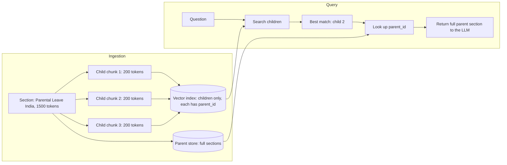

**Walkthrough:** the question "Can leave be extended?" matches child 2 strongly (it mentions the 4-week medical extension). We don't send that snippet alone. We look up its parent and send the **entire section**, so the LLM also sees the base entitlement, eligibility, and exceptions.

Variants:

- **Sentence-window:** embed single sentences, return the sentence plus N neighbors on each side.
- **Multi-representation:** embed a *summary*, or *hypothetical questions the chunk answers*, but return the original chunk (this is the same "search one form, return another" idea you saw with tables).

**Watch out:** if the top 3 children share the same parent, **deduplicate parents** before building the prompt, or you'll send the same section three times.

---

## Worked example: one passage, five strategies

Text: *"Refunds are accepted within 30 days of purchase. However, this does not apply to digital goods, which are non-refundable. Gift cards can be exchanged but not refunded."* (under the heading **Returns Policy > Refunds**)

| Strategy | What the question "Can I get a refund on an e-book?" gets |
|---|---|
| Fixed-size | Chunk starting "er, this does not apply..." → confusing |
| Fixed + overlap | Probably contains the digital-goods sentence, but maybe cut awkwardly |
| Recursive | The sentence "However, this does not apply to digital goods..." alone → "this" is ambiguous |
| Structure-aware + header | Whole Refunds section with the heading → clear and complete |
| Parent-child | Child matches "digital goods"; the LLM receives the full Refunds section |

The failure from Chapter 2 is fixed.

---

## How do you choose chunk size? (the interview question)

There is no universal answer. Use a starting point, then **measure**.

**Typical starting point:** about 200 to 500 tokens, with 10 to 15% overlap (or none, if you split on structure).

| Factor | Pushes toward |
|---|---|
| Factoid questions ("what's the limit for L5?") | Smaller chunks |
| Explanatory / "how does X work" questions | Larger chunks |
| Embedding model with a short input limit | Smaller |
| Long-context LLM and rich documents | Larger (or parent-child) |
| Tight prompt budget or latency | Smaller, with fewer results |
| Highly structured docs | Follow the structure and ignore fixed sizes |

**The experiment:** build an evaluation set of, say, 200 real questions with known correct source passages. Index the corpus with chunk sizes 128, 256, 512, and 1024, and measure **recall@k** (did the right chunk appear in the top k?) and end-to-end answer quality. Pick the winner for *your* data. We'll build this properly in Chapter 11.

---

## System design view: the chunking service

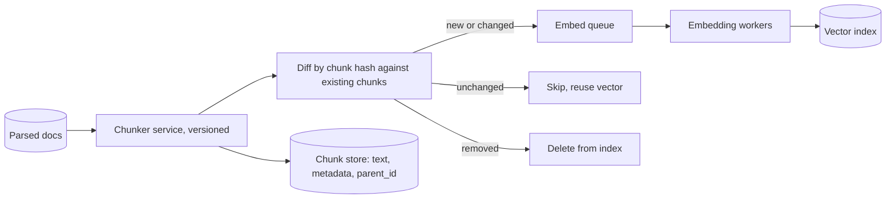

### Key design decisions

**1. Chunking is cheap. Embedding is expensive.** Chunking is pure CPU string work and fast. The costly step after it is embedding (GPU or API). So the design goal is to **avoid unnecessary re-embedding**.

**2. Stable, content-based chunk IDs.**
Suppose a document is edited by inserting one paragraph at the top. With position-based IDs (`doc42_chunk_0`, `doc42_chunk_1`, ...), every chunk shifts, so **everything looks changed** and gets re-embedded. With a **content hash** ID (for example `hash(doc_id + normalized_text)`), only the truly new or edited chunks differ. The diff step above then skips the unchanged ones, saving embedding cost and index churn.

**3. Metadata inheritance.** Every chunk copies the parent document's metadata: `doc_id`, `version`, `page`, `section_path`, and above all the **ACL**. If a chunk loses its ACL, you have a security hole (Chapter 14).

**4. Version the chunker.** Store `chunker_version` (and `parser_version`, `embedding_model_version`) on every chunk. When you improve chunking, you know exactly which chunks are stale.

**5. Changing strategy means re-embedding everything.** Illustrative math:

| Corpus | Tokens to re-embed | Reality |
|---|---|---|
| Acme: 400k chunks × 500 tokens | 200M | Cheap (small dollar amounts), done in hours |
| Web-scale: 1B chunks × 500 tokens | 500B | Real money, days of GPU time |

So you never re-chunk "in place". You build a **shadow index** with the new strategy, evaluate it, and **swap atomically** (blue/green, via an index alias) if it wins. Old and new keep serving until then.

**6. Chunk-store schema (example):**

```json
{
  "chunk_id": "c_9a1f...",
  "doc_id": "hr-policy-2024",
  "doc_version": 7,
  "parent_id": "sec_leave_india",
  "text": "[HR Policy > Leave > Parental Leave > India] The entitlement is 16 weeks...",
  "token_count": 212,
  "position": 3,
  "section_path": "HR Policy > Leave > Parental Leave > India",
  "page": 12,
  "acl": ["group:hr-all"],
  "chunker_version": "2.1",
  "embedding_model": "embed-v3"
}
```

### Scale estimate

- Acme: 200M tokens ÷ ~450 effective tokens per chunk (500 minus overlap) ≈ **~440k chunks**.
- Chunk text is roughly 2 KB each, so ~1 GB of chunk text (small). The vectors (1024-dim float32 = 4 KB each) take about 1.8 GB.
- The numbers tell you chunk *metadata* storage is trivial next to **vector storage**, which is what drives sharding decisions later.

---

## Error handling and edge cases

| Situation | What to do |
|---|---|
| Chunk exceeds the embedding model's token limit (tokenizer mismatch, giant unbreakable text) | Enforce a hard max with a safety margin, and force-split as a last resort |
| Empty or whitespace-only chunk, or only boilerplate | Drop it, and log the count |
| Tiny "orphan" chunk (a lone heading or a one-line remainder) | Merge into the neighbor |
| Very long table row or code block | Split at the nearest logical boundary and repeat context (table header, function signature) |
| Chunker throws on weird input | Catch per document, fall back to the simple recursive splitter, flag for review |
| Chunker crashes midway | Idempotent job keyed by `doc_id + content_hash + chunker_version`, so a retry recreates the same chunks |

**Invariant tests worth mentioning:** no chunk exceeds the max tokens, concatenating chunks (minus overlap) reproduces the section, every chunk has an ACL, and no chunk is empty. Cheap automated checks catch many production bugs.

**Monitoring:** chunk-size histogram (a sudden spike of tiny chunks means a parser change), number of chunks per document, duplicate-chunk ratio, and the fraction hitting a fallback path.

---

## Interview soundbite

> "Chunking decides what's findable. I'd start from the document's own structure, since after extraction I have headings, tables, and lists, and split by section, with recursive splitting inside oversized sections, sized in tokens using the embedding model's tokenizer, at roughly 200 to 500 tokens. I'd prepend the title and section path to each chunk so it carries its context, and use parent-child retrieval so I search small chunks for precision but hand the LLM the full parent section for context. Tables are kept whole or split by row groups with the header repeated. I'd treat chunk size as a tunable, measured through recall@k on a labeled question set, and not guess. Operationally, chunk IDs are content hashes so an edit re-embeds only the changed chunks, the chunker is versioned, every chunk inherits its document's ACL, and if I change strategy I build a shadow index and swap it in."

---

## Quick self-check

1. Why does overlap help, and what are its two costs?
2. Why do we search small chunks but return the parent in parent-child retrieval?
3. Why use content-hash chunk IDs instead of position-based ones?

Answer any of these for feedback, or say **"next"** and we'll go to Chapter 5: **Embeddings**. That's the magic step: how text becomes vectors, why "refund" and "get my money back" end up close together, how to choose an embedding model, and what happens when the model itself needs to change.

---

# Chapter 5: Embeddings

## The story

Acme's team has clean extraction and smart chunking. Now they face the question hiding inside Chapter 2's magic step: **how does the system know that "get my money back" and "refund" mean the same thing?**

Before embeddings, they had to solve it the hard way.

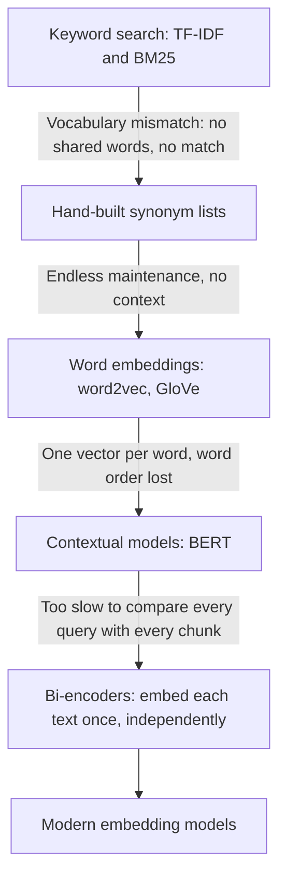

---

## Attempt 1: Keyword search

Classic search engines count words. **TF-IDF** and its successor **BM25** score a document higher when it contains the query's words, especially rare ones.

A user asks: *"How long do I have to get my money back?"*

The policy says: *"Refunds are accepted within 30 days of purchase."*

Shared words: **none**. Keyword search returns nothing useful. This is the **vocabulary mismatch problem**: humans use different words for the same idea.

## Attempt 2: Synonym lists

*"Add 'money back → refund → return → reimbursement' to a thesaurus."* This works for the ten cases someone thought of. Acme's 50,000 documents span HR, legal, and engineering, and every domain has its own jargon. Nobody can maintain that list, and it can't handle context ("bank" of a river vs "bank" for money).

## Attempt 3: Word embeddings (word2vec, GloVe)

The breakthrough idea: **learn from text which words appear in similar contexts, and give each word a vector (a list of numbers)** so that words with similar meanings get nearby vectors.

- "refund" and "reimbursement" appear near "money", "return", "30 days", so their vectors end up close.
- Famous demo: `king − man + woman ≈ queen`. Meaning had become geometry.

For search, people averaged the word vectors of a sentence. Two problems appeared:

| Problem | Example |
|---|---|
| **One vector per word, regardless of context** | "bank" has the same vector in "river bank" and "bank account" |
| **Averaging destroys word order** | "dog bites man" and "man bites dog" get the **same** average |

## Attempt 4: Contextual models (BERT)

BERT-style transformers read the *whole sentence at once*, so the vector for "bank" now depends on its neighbors. Meaning is captured much better.

Now try using it for search. The natural design is a **cross-encoder**: feed the *pair* (question, chunk) into the model together and let it output a relevance score.


It's accurate, but a disaster for search speed. To answer one question over 440k chunks, you'd run **440,000 model passes**, one per chunk, for **every query**. That's minutes per question, and you can't precompute anything because each score depends on the query.

## Attempt 5: Bi-encoders (Sentence-BERT and descendants)

The key move: **encode each text independently into a single vector**. Then compare vectors with cheap math.

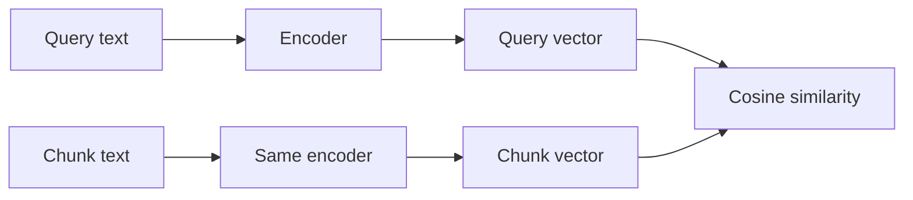

Now the expensive part changes:

- **Offline:** embed all 440k chunks **once** and store the vectors.
- **Online:** embed only the **query** (one model pass, tens of milliseconds), then find the nearest stored vectors, which is fast vector math.

That's the architecture behind every RAG retriever today, and the reason the offline/online split from Chapter 1 works.

> **Interview hook:** the *bi-encoder vs cross-encoder* trade-off comes up again in Chapter 9 (reranking). Bi-encoder = fast, approximate, precomputable. Cross-encoder = slow, accurate, run only on a shortlist.

---

## What an embedding actually is

An embedding is a **fixed-length list of numbers** (commonly 384 to 3072 of them) produced by a neural network for a piece of text. Each individual number means nothing to a human. What matters is **distance**: texts with similar meaning land close together.

A 2D sketch of what is really a 1000+ dimensional space:

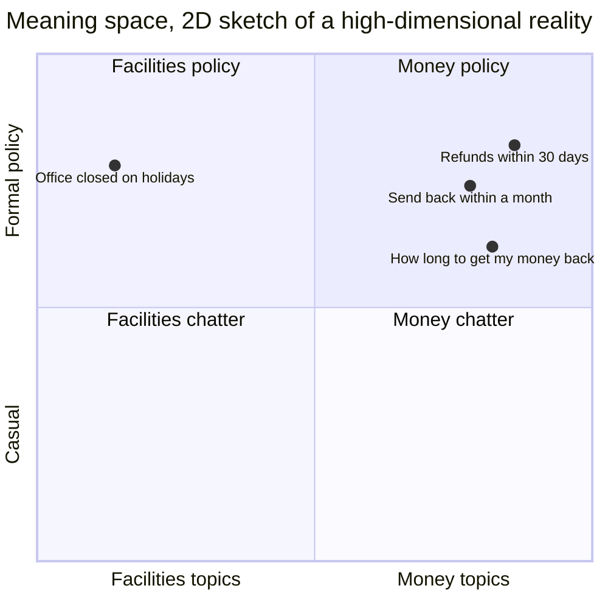

The three refund-related texts cluster together even though they share almost no words. The holiday sentence is far away.

### Measuring "closeness"

Three common measures:

| Metric | What it measures | Note |
|---|---|---|
| **Cosine similarity** | Angle between vectors (ignores length) | Most common for text |
| **Dot product** | Angle *and* length | Fast, and identical to cosine if vectors are normalized |
| **Euclidean (L2) distance** | Straight-line distance | Also equivalent in ranking if vectors are normalized |

A tiny worked example (real vectors have 1000+ dimensions, this one has 2):

```
query  q = (1, 1)
chunk  A = (2, 1)      chunk  B = (-1, 1)

cos(q, A) = (1·2 + 1·1) / (|q|·|A|) = 3 / (1.414 × 2.236) = 0.949   ← very similar
cos(q, B) = (1·-1 + 1·1) / (|q|·|B|) = 0 / ... = 0.0               ← unrelated
```

Cosine ranges from −1 to 1. Similar text typically scores high (roughly 0.6 to 0.9 depending on the model), and unrelated text scores low. **Scores are only comparable within one model.** A 0.75 from model X and a 0.75 from model Y mean different things.

**Practical tip:** normalize all vectors to unit length at write time. Then cosine, dot product, and L2 give the same ranking, so you can use the fastest (dot product) everywhere. **Whatever metric you choose must match how the model was trained and how the index is configured.**

---

## How does the model learn this? (contrastive training)

You don't need the math, but you must explain the idea:

1. Collect millions of **(query, relevant passage) pairs**: search logs, question-answer sites, titles paired with their articles, and so on.
2. Train the model so each pair's vectors move **closer**, and mismatched pairs move **apart**.

This is called **contrastive learning**. A neat trick is **in-batch negatives**: in a batch of 3 pairs, every *other* pair's passage acts as a wrong answer for free.

| | passage 1 | passage 2 | passage 3 |
|---|---|---|---|
| **query 1** | ✅ pull together | push apart | push apart |
| **query 2** | push apart | ✅ pull together | push apart |
| **query 3** | push apart | push apart | ✅ pull together |

The best training data also includes **hard negatives**: passages that *look* relevant but aren't, such as the "refund policy" for a different country. These teach the model fine distinctions and are a big reason modern models beat older ones.

---

## Queries and documents are different animals

A query is short and question-like ("parental leave India?"). A chunk is long and declarative. Many modern models are trained **asymmetrically** and expect a different prefix or instruction for each, something like `query: ...` vs `passage: ...` (the exact format is model-specific).

> **Classic production bug:** embedding queries and documents with the *same* prefix, or forgetting the prefix entirely. Retrieval quality quietly drops, and nothing errors out. **Always follow the model's documentation.**

---

## Choosing an embedding model

| Factor | Why it matters |
|---|---|
| **Max input tokens** | Text beyond the limit is silently cut off. This must be at least as big as your chunk size |
| **Dimensions** | Drives storage cost, RAM, and search speed (details below) |
| **Multilingual?** | Acme has employees in India, Germany, and Brazil. Use a multilingual model, or per-language routing, if queries and docs span languages |
| **Domain fit** | A general model may not understand legal, medical, or code text as well as a specialized one |
| **Hosted API vs self-hosted** | API: zero ops, per-token cost, data leaves your network, rate limits. Self-hosted: GPU ops, fixed cost, data stays in, full control |
| **Latency** | Adds directly to every query |
| **Quality on *your* data** | Public leaderboards like MTEB are a starting shortlist, **not** the decision |

**How to decide:** shortlist 2 or 3 models, then run each on your own labeled question set and compare **recall@k**. Leaderboard winners frequently lose on private data.

---

## Storage math: dimensions matter

Each vector = dimensions × bytes per number.

| Setup | Bytes per vector | 1B vectors |
|---|---|---|
| 1024-d, float32 | 4 KB | **4 TB** |
| 384-d, float32 | 1.5 KB | 1.5 TB |
| 3072-d, float32 | 12 KB | 12 TB |
| 1024-d, **int8** quantized | 1 KB | 1 TB |
| 1024-d, **binary** quantized | 128 B | **128 GB** |

Ways to shrink vectors, each trading a little recall for a lot of memory:

- **Quantization:** store numbers with fewer bits (float32 → int8, or even 1 bit). Often paired with re-scoring the top results using the full-precision vectors.
- **Matryoshka-style embeddings:** some models are trained so the *first N dimensions* are already a good embedding. You can truncate 1024 → 256 dimensions with modest quality loss.
- **Product Quantization (PQ):** compresses vectors inside the index. We'll cover this in Chapter 6.

Because vector storage dominates everything else (recall the chunk metadata was ~1 GB vs ~1.8 GB of vectors for Acme), **this is what will drive sharding and cost decisions at scale.**

---

## Where embeddings fail (and what fixes each)

This list justifies the next several chapters:

| Failure | Example | Fix |
|---|---|---|
| **Exact identifiers** | "ERR-4021" vs "ERR-4012" look alike | Hybrid search with BM25 (Ch. 7) |
| **Negation** | "Refunds are allowed" ≈ "Refunds are not allowed" | Reranker (Ch. 9), and LLM reading the text |
| **Numbers and units** | "30 days" vs "3 days" barely differ | Reranker, metadata filters |
| **Rare or internal jargon** | Company code names the model never saw | Fine-tune the embedder, or add keyword search |
| **Vague queries** | "and for adoption?" | Query rewriting (Ch. 8) |
| **Multi-hop questions** | Needs facts from two separate docs | Query decomposition, agentic retrieval |
| **Question ≠ answer shape** | The query looks like a question, the passage looks like a statement | HyDE, hypothetical questions (Ch. 8) |

Embeddings measure "aboutness", not truth. Never present them as understanding.

### Fine-tuning an embedding model

If a general model consistently fails on your domain:

1. Take your chunks and have an LLM **generate realistic questions** each chunk answers (synthetic queries).
2. Mine **hard negatives**: near-miss chunks that shouldn't match.
3. Fine-tune the embedder on these pairs.
4. **Evaluate on a human-labeled hold-out set**, not on the synthetic data.

The catch: a new model means **re-embedding the entire corpus**. It's worth it when the recall gain is large, and it's not when a reranker or hybrid search would fix the problem more cheaply.

---

## System design: the embedding service

Embedding shows up in **two very different places** with different requirements:

| | Ingestion path (offline) | Query path (online) |
|---|---|---|
| **Goal** | Throughput | Low latency |
| **Batch size** | Large (dozens to hundreds of chunks) | 1 |
| **Hardware** | GPU workers, autoscaled on queue depth | Small always-on pool, sized for QPS |
| **Failure impact** | Delayed searchability | User-facing errors |

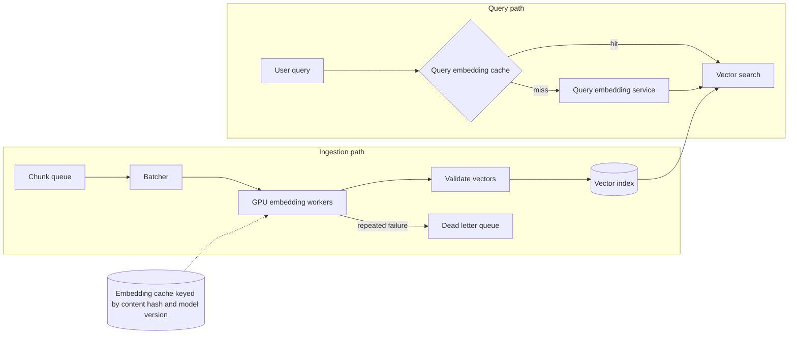

### Key design decisions

**1. Same model for queries and chunks (a hard invariant).** A query vector is only meaningful in the space its chunk vectors live in. Different models (or even different versions of one model) produce *incompatible* spaces, sometimes with different dimensions. Never mix.

**2. Batching for throughput.** GPUs are efficient on large batches. The batcher groups chunks (ideally of similar length, to avoid padding waste) and feeds workers continuously.

**3. Cache by `hash(chunk_text) + model_version`.** Identical or unchanged chunks are never re-embedded. This is the same idea as Chapter 4's content-hash chunk IDs, and it makes re-processing and retries cheap. On the query side, cache embeddings of normalized query strings, since popular questions repeat.

**4. Isolate the pools.** Give the online query embedder its own capacity. Otherwise a giant bulk re-index can starve live user traffic, a classic noisy-neighbor problem.

**5. Rate limits (if you use a hosted API).** Use a client-side rate limiter, exponential backoff with jitter on 429/5xx errors, and a queue to smooth bursts.

**6. Idempotent writes.** Upsert by `chunk_id`, so retries don't create duplicate vectors.

### Scale estimate (illustrative numbers)

*Acme:* 200M tokens. At an assumed hosted price around a few cents per million tokens, that's on the order of **single-digit to tens of dollars**. Trivial.

*Web-scale:* 1B chunks, say 2,000 chunks/sec per GPU (assumed):

- 1B ÷ 2,000 = 500,000 seconds ≈ **5.8 days** on one GPU
- With 50 GPUs ≈ **~2.8 hours**

Same pattern as OCR in Chapter 3: scale horizontally and use the queue as a buffer.

### Query-time latency budget

Embedding the query is usually ~10 to 50 ms (small self-hosted model) or ~50 to 200 ms (network API call), inside a total budget of maybe 1 to 3 seconds including LLM generation. Embedding is rarely the bottleneck, but network-hop variance can hurt the p99.

---

## Changing the embedding model: the migration story

This is a great interview topic because it exposes real operational thinking.

**The situation:** a better model is released, or you fine-tuned one. You can't just start writing new vectors into the old index.

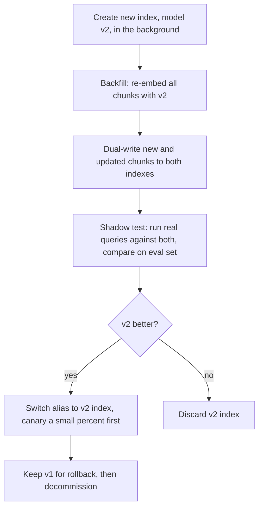

Requirements to state:

- Each vector or index records `embedding_model` and `model_version`.
- Queries must use the model that matches the index they hit.
- **Pin hosted model versions.** If a provider silently updates a model behind a fixed name, you'd get a mixed index and mysteriously degraded search.
- A rollback path (keep the old index until the new one is proven).

---

## Error handling

| Failure | What happens | Handling |
|---|---|---|
| **Chunk exceeds max tokens** | Silent truncation, so the end of the chunk is unsearchable | Enforce token limits in the chunker with a margin, and alert on truncation |
| **Rate limit / timeout** | Batch fails | Retry with backoff and jitter |
| **Partial batch failure** | One bad item poisons the whole batch | Retry per item, and isolate the bad one to the DLQ |
| **Bad vectors** (NaN, all zeros, wrong dimension) | Corrupts search results | Validate before writing: dimension, finite values, non-zero norm |
| **Embedding service down at query time** | Search unavailable | **Degrade gracefully**: fall back to keyword (BM25) retrieval only, which doesn't need embeddings (see Ch. 7). Do *not* fall back to a different embedding model against the same index |
| **Model drift or silent provider update** | Quality drops with no errors | Pin versions, run periodic regression checks against a golden query set |
| **Very long or empty text** | Errors or meaningless vectors | Skip empty text, log it |

**Security note:** embeddings are **not** anonymized data. Research on *embedding inversion* shows that a lot of the original text can sometimes be reconstructed from its vector. Treat vectors with the same access controls and retention rules as the source text, and inherit the ACL from the chunk.

---

## Interview soundbite

> "Keyword search fails on vocabulary mismatch, so we use embeddings: a bi-encoder model maps each chunk, and at query time the question, into a vector so semantically similar text is close together, typically by cosine similarity. Bi-encoders let me precompute chunk vectors offline and only embed the query online, unlike cross-encoders which are too slow to run against every chunk. I'd pick the model by testing a shortlist on our own labeled queries, checking max token length, dimensions, multilingual needs, and hosted vs self-hosted trade-offs. Vectors dominate storage, so at scale I'd consider quantization or Matryoshka truncation. Embeddings are weak on exact IDs, negation, and numbers, which I'd address with hybrid search and reranking. Operationally, ingestion embedding is batched on autoscaled GPU workers behind a queue, with a cache keyed by content hash and model version, the query embedder is a separate low-latency pool with a query cache, and a hard invariant is that queries and chunks use the same pinned model version. Model upgrades need a shadow index, backfill, evaluation, and an alias swap with rollback."

---

## Quick self-check

1. Why can't we use a cross-encoder to search all 440k chunks directly, and what does a bi-encoder change?
2. Why is it dangerous to mix vectors from two different embedding models in one index?
3. Give two things embeddings are bad at, and what you'd add to fix each.

Answer any of these for feedback, or say **"next"** and we'll move to Chapter 6: **Vector Indexes and ANN Search** (HNSW, IVF, PQ). We'll see why brute-force nearest-neighbor search stops working at scale, and how the industry made search over billions of vectors fast enough.

---

# Chapter 6: Vector Indexes and ANN Search

## The story

Acme's internal chatbot runs happily on ~440k chunks. Then the company launches a **customer-facing support assistant** for 5,000 enterprise customers, each uploading their own documentation. Chunk count jumps from 440k to **200 million**, and query latency jumps from milliseconds to seconds.

Riya profiles the system: the LLM isn't the slow part, **the nearest-neighbor search is**. Let's see why, and how the industry fixed it.

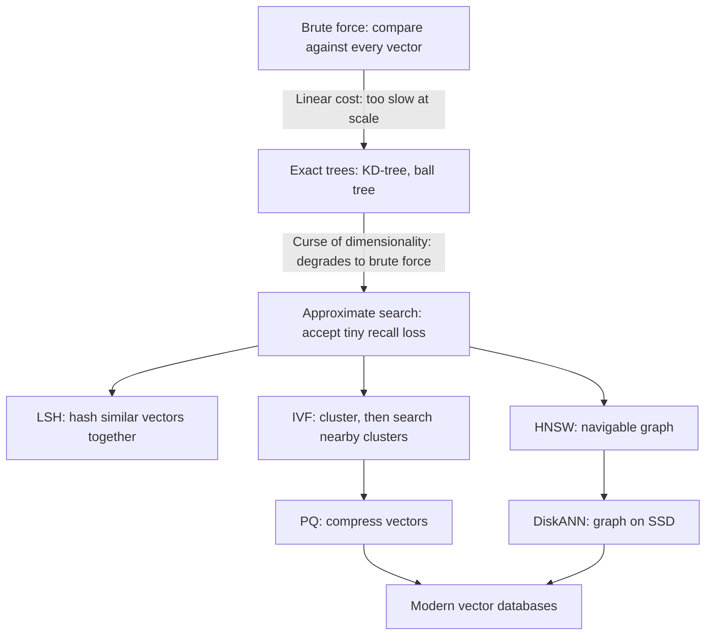

---

## Attempt 1: Brute force (exact "flat" search)

Compare the query vector against **every** stored vector, then keep the top k.

The cost is dominated by **memory bandwidth**: every vector must be read from RAM for every query. The numbers (illustrative, assuming ~100 GB/s of memory bandwidth per server):

| Corpus | Vector data (1024-d float32) | Time to scan once |
|---|---|---|
| 440k chunks (Acme internal) | 1.8 GB | **~18 ms** ✅ |
| 10M chunks | 40 GB | ~400 ms (about 2.5 QPS per machine) |
| 200M chunks (Acme customers) | 800 GB | ~8 s ❌ |
| 1B chunks | 4 TB | ~40 s ❌ |

> **Interview tip:** brute force is *not* wrong. For under ~100k to 1M vectors it's simple, gives 100% exact recall, and needs no index tuning. Saying "I'd start with exact search and only add ANN when the numbers demand it" shows judgment.

Brute force does remain the **ground truth** you measure every approximate index against.

---

## Attempt 2: Exact tree structures (KD-trees, ball trees)

In 2D or 3D, a KD-tree splits space by coordinates, so a query can skip whole regions. Databases and maps use this successfully.

In 1024 dimensions it collapses. This is the **curse of dimensionality**: in very high-dimensional spaces, almost all points are roughly the same distance from each other, so no region can be safely pruned. The tree ends up visiting nearly everything and becomes brute force with extra overhead.

**Lesson:** exact nearest-neighbor search in high dimensions has no known shortcut. We must give something up.

---

## The key insight: approximate is good enough

**Approximate Nearest Neighbor (ANN)** search returns *very likely* the true top-k, much faster. We measure this with **ANN recall@k**: the fraction of the true (brute-force) top-k that the index actually returned.

> Example: exact top-10 = {A,B,C,D,E,F,G,H,I,J}. The ANN index returns {A,B,C,D,E,F,G,H,I,X}. ANN recall@10 = 9/10 = 90%.

Typical production targets are **95 to 99%**. Why not 100%?

- The embedding is already a *lossy proxy* for relevance. The "true nearest neighbor" isn't necessarily the best answer, just the closest in an imperfect space.
- The reranker (Chapter 9) reorders candidates anyway, so a slightly-off top-k rarely changes the final answer.
- Each extra percent of recall costs disproportionately more latency and memory.

Don't confuse this with **retrieval recall** (did the *relevant chunk* appear in the results?). ANN recall measures faithfulness to exact search, and retrieval recall measures usefulness. Interviewers like it when you separate them.

The main ANN families each answer "how do we avoid looking at everything?" differently.

---

## Approach A: LSH (Locality-Sensitive Hashing)

Design hash functions so **similar vectors collide** into the same bucket. At query time, hash the query and check only its bucket.

**Problems:** achieving high recall needs many hash tables (lots of memory), tuning is fiddly, and in practice it lost to the methods below on the recall/speed trade-off. Know the name and why it faded, and don't build on it.

---

## Approach B: IVF (Inverted File Index), "search only the nearby neighborhoods"

**Analogy:** a huge library organized by sections. To find a book about refunds, you don't walk every aisle. You go to the "Business and Law" section and its neighbors.

**Build (offline):**
1. Run **k-means** on the vectors to create `nlist` clusters, each with a **centroid** (its center).
2. Assign every vector to its nearest centroid, so each cluster holds a list of vectors (the "inverted list").

**Query (online):**
1. Compare the query to all `nlist` centroids (cheap, since there are few).
2. Pick the closest `nprobe` clusters.
3. Brute-force scan **only** vectors in those clusters.

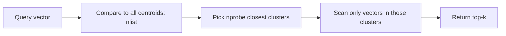

**Worked example:** 100M vectors, `nlist` = 10,000 (a common rule of thumb is around √N), `nprobe` = 50.
- Centroid comparisons: 10,000.
- Vectors scanned: 50/10,000 = 0.5% of the data ≈ **500k vectors**.
- That's ~200× less work than brute force.

**The catch, the boundary problem:** if the query lands near the edge between two clusters, its true nearest neighbor may sit in a cluster you **didn't probe**. The fix is raising `nprobe`, which improves recall and costs latency. `nprobe` is your **recall-vs-speed dial**.

Other notes: IVF needs a **training step** (k-means) and works best when data is reasonably stable. If your data distribution drifts a lot, the centroids go stale and recall degrades, so you must periodically retrain.

---

## Approach C: HNSW (Hierarchical Navigable Small World), "the highway map"

The most widely used index in vector databases today.

**Analogy:** finding a specific house. You don't start on your street. You take a national highway to the right region, a state road to the right city, then local streets to the exact address. **Coarse hops first, fine hops last.**

**Structure:** a multi-layer graph.
- **Layer 0** contains *every* vector, connected to its near neighbors (short local links).
- **Higher layers** contain exponentially fewer, randomly chosen vectors, with longer-range links (the "highways").

**Query:**

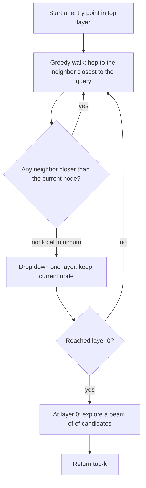

Because the top layers let you skip huge distances, search takes roughly **O(log N)** hops.

**Key parameters:**

| Parameter | Meaning | Turning it up |
|---|---|---|
| `M` | Links per node | Better recall, more memory, slower build |
| `efConstruction` | Beam width while **building** | Better graph quality, slower indexing |
| `efSearch` | Beam width while **querying** | Better recall, higher latency (the query-time dial, like `nprobe`) |

**Why it's popular:** excellent recall/latency, works well without a training step, and supports **incremental inserts** (new vectors are just added to the graph).

**Downsides (know these):**

- **RAM-hungry:** the full vectors and the graph normally live in memory. The graph adds ~`2M × 4` bytes per vector (for M=16: ~128 bytes, small next to a 4 KB float32 vector, but the *vectors themselves* are the real cost).
- **Slow to build:** graph construction is expensive at large scale.
- **Deletes are awkward:** removing a node can break paths. Systems mark it as a **tombstone** (skip it in results) and rebuild the graph later.
- **Filtered search can struggle** (covered below).

---

## Approach D: Product Quantization (PQ), "compress the vectors"

IVF and HNSW reduce *how many* vectors you look at, but you still store 4 KB per vector. At 1B vectors that's 4 TB. **PQ shrinks the vectors themselves.**

**How it works:**

1. Split each 1024-d vector into `m` sub-vectors (say m = 128 pieces of 8 dimensions).
2. For each piece position, learn a **codebook** of 256 representative sub-vectors (via k-means).
3. Replace each piece with the **1-byte ID** of its nearest codebook entry.

```mermaid
flowchart LR
    V["1024-d vector: 4096 bytes"] --> S1["Piece 1: dims 1-8"]
    V --> S2["Piece 2: dims 9-16"]
    V --> S3["... 128 pieces total"]
    S1 --> C1["Nearest of 256 codewords: id 17"]
    S2 --> C2["Nearest of 256 codewords: id 203"]
    S3 --> C3["..."]
    C1 --> CODE["Stored code: 128 bytes"]
    C2 --> CODE
    C3 --> CODE
```

**Result:** 4096 bytes → **128 bytes** (32× smaller). 1B vectors drops from 4 TB to **~128 GB**, which fits in RAM on a single large machine or a small cluster.

**Fast distance:** at query time, precompute a small lookup table of distances from the query's pieces to every codeword, then a stored vector's distance is just **128 table lookups and adds**. No full-vector math.

**Trade-off:** compression is lossy, so distances are approximate. The standard fix is **rescoring**: fetch extra candidates (say 5× k) using compressed codes, then recompute exact distances for just those, using full-precision vectors stored on SSD or in a slower tier.

**IVF-PQ** combines both: IVF narrows the search to a few clusters, and PQ makes each scanned vector cheap and small. It's a classic recipe for billion-scale search.

Also worth naming: **scalar quantization** (float32 → int8, 4× smaller, very little recall loss) and **binary quantization** (1 bit per dimension, 32× smaller, usually needs rescoring). These are simpler than PQ and often the first thing to try.

---

## Approach E: DiskANN, "the graph lives on SSD"

HNSW wants everything in RAM, which gets expensive at billions of vectors. **DiskANN** (Microsoft) builds a graph designed for SSD access:
- Keep **compressed vectors** (PQ codes) in RAM for fast approximate navigation.
- Keep **full vectors and the graph** on SSD, fetching a few SSD blocks per query for rescoring.

Cost drops sharply (SSD is far cheaper per GB than RAM), at the price of higher latency (still typically low tens of milliseconds) and more complex updates. It's the answer to "we have 1B+ vectors and can't afford terabytes of RAM."

---

## Comparison table (the one to memorize)

| Index | Memory | Query speed | Recall | Build cost | Updates | Best for |
|---|---|---|---|---|---|---|
| **Flat (brute force)** | Vectors only | Slow at scale | 100% exact | None | Trivial | < ~1M vectors, ground truth |
| **IVF-Flat** | Vectors + centroids | Good | Good (tune `nprobe`) | Needs training | Okay, retrain if data drifts | Mid-size, batch-ish data |
| **HNSW** | Vectors + graph (RAM) | Excellent | Excellent | Slow | Good inserts, awkward deletes | Low-latency, up to hundreds of millions |
| **IVF-PQ** | Very small (compressed) | Good | Lower (rescore to recover) | Needs training | Moderate | Billion-scale in limited RAM |
| **DiskANN** | Small RAM + SSD | Good | Very good | Slow | Complex | Billion-scale, cost-sensitive |

**A rule of thumb for interviews:**
- Under ~1M vectors: flat search, or `pgvector` inside your existing Postgres.
- Millions to hundreds of millions with tight latency: **HNSW** (add scalar quantization to cut memory).
- Billions, memory-constrained: **IVF-PQ or DiskANN** with rescoring, sharded.

---

## The hidden monster: filtered search

RAG almost never searches *all* vectors. You need to restrict by:
- **Permissions (ACL):** only chunks this user may see (Chapter 3's metadata)
- **Tenant:** only this customer's documents
- **Metadata:** language, doc type, date range, latest version only

**Why it's hard:** ANN indexes are built for "nearest overall", not "nearest among those matching a condition."

Suppose the intern can access only 2% of chunks.

| Strategy | How | Problem |
|---|---|---|
| **Post-filter** | Get top-10 from the index, then drop the ones the user can't see | Expected survivors = 10 × 2% = **0.2 results**. Users get empty or tiny answers, and worse, it can leak existence of data through timing |
| **Over-fetch then filter** | Get top-500, then filter | Wasteful, and still unreliable for very selective filters |
| **Pre-filter** | Compute the allowed set first, then search only within it | Fine when the allowed set is small (brute-force it), but hard to combine with a global graph |
| **Filter-aware traversal** | HNSW walks the graph but only *accepts* matching nodes | Works for mild filters, but if the filter is very selective the walk can hit dead ends because the graph's connections go through non-matching nodes |
| **Partitioning** | Separate index (or shard) per tenant or ACL group | Simple and fast, but many tiny indexes are costly to manage |

```mermaid
flowchart TD
    Q["Query plus filter"] --> SEL{"How selective is the filter?"}
    SEL -->|"Matches a few thousand vectors or fewer"| EX["Exact scan over the filtered subset"]
    SEL -->|"Matches a moderate share"| FA["Filter-aware ANN traversal"]
    SEL -->|"Matches most vectors"| PO["ANN then post-filter with over-fetch"]
    EX --> R["Top-k"]
    FA --> R
    PO --> R
```

This is a **query planner**: pick the strategy from the filter's selectivity. Good vector databases do this internally.

**Big-picture design choice:** for **multi-tenant** systems like Acme's customer assistant, put the **tenant ID at the partition/shard level** and reserve within-index filters for finer-grained rules. This gives both performance and strong isolation (Chapters 12 and 14).

---

## System design: what's inside a vector database

Real vector databases (Milvus, Qdrant, Weaviate, Elasticsearch/OpenSearch, Pinecone, and Postgres's `pgvector` extension) share an architecture borrowed from search engines and LSM-tree databases. Don't memorize vendors, but know this shape:

```mermaid
flowchart LR
    W["Writes: upsert and delete"] --> WAL["Write-ahead log"]
    WAL --> GS["Growing segment: in memory, small, brute-force searchable"]
    GS -->|"flush when full"| SS1["Sealed segment 1: HNSW or IVF built"]
    GS -->|"flush when full"| SS2["Sealed segment 2: HNSW or IVF built"]
    SS1 --> CMP["Background compaction: merge segments, drop tombstones, rebuild"]
    SS2 --> CMP
    CMP --> BIG["Larger merged segment"]
    Q["Query"] --> FAN["Fan out to all segments"]
    GS --> FAN
    SS1 --> FAN
    SS2 --> FAN
    BIG --> FAN
    FAN --> MRG["Merge partial top-k lists"]
    MRG --> RES["Final top-k"]
```

Why this works:

- **Immutable segments:** building an HNSW or IVF index for a fixed batch is simple, and immutability makes concurrent reads safe.
- **Growing segment:** new writes are searchable **immediately** (brute-force over a small in-memory buffer), even before an index exists. This gives near-real-time freshness.
- **Deletes:** a delete marks a **tombstone**. Search skips tombstoned vectors, and **compaction** later physically removes them and rebuilds.
- **An update = delete old + insert new.** Chunk IDs (Chapter 4) make this clean.
- **Query fan-out:** search each segment, then merge the partial top-k lists.
- **Durability:** the **WAL** (write-ahead log) survives crashes. Segments and snapshots are backed up to object storage.

The full **distributed** story (sharding these segments across machines, replication, and scatter-gather across shards) is Chapter 12.

### Source of truth

**The vector index is a derived, rebuildable artifact.** The source of truth is the chunk store plus the raw documents (Chapters 3 and 4). If the index is corrupted, or you switch index type, you rebuild it from the stored chunks and vectors, never by trying to repair it. State this clearly.

### Memory sizing example: Acme's 200M vectors

| Config | Approximate RAM |
|---|---|
| Float32 vectors + HNSW (M=16) | 200M × (4 KB + ~0.13 KB) ≈ **~830 GB** |
| **int8 scalar quantized** + HNSW | 200M × (1 KB + 0.13 KB) ≈ **~230 GB** (full-precision copies on SSD for rescoring) |
| **IVF-PQ** (128 B/vector) | ≈ **~26 GB** plus overhead |

Same corpus, a 30× spread in memory. That's why sizing quantization early is an HLD decision, not a tuning detail.

### Tuning workflow

1. Build a **ground truth** set: take ~1,000 to 10,000 sample queries and compute exact top-k via brute force.
2. Sweep `efSearch` (or `nprobe`) and measure **ANN recall@k**, **p50/p95/p99 latency**, and **QPS per node**.
3. Choose the cheapest setting that hits your recall target (say 97%) within your latency budget.
4. **Re-run this whenever data grows 2 to 3× or the embedding model changes.** Recall silently drifts as the index grows.

Index sizing is also a cost problem: *"what's the cheapest hardware that meets latency at target recall for peak QPS?"*

---

## Error handling and operational pitfalls

| Problem | Symptom | Handling |
|---|---|---|
| **Recall silently degrades** | Answers get worse over weeks, no errors | Continuously compare ANN vs exact search on a sampled set of live queries (**shadow exact search**), alert on drops |
| **Filtered search returns < k results** | Empty or thin context for restricted users | Query planner, exact-scan fallback for selective filters, tenant partitioning |
| **Tombstone bloat** | Latency and memory creep up after mass deletes | Trigger compaction on a tombstone ratio threshold |
| **Index exceeds RAM** | OOM, swapping, latency spikes | Capacity planning, quantization, memory-mapped indexes, add shards, alerts at 70 to 80% memory |
| **Cold start** | After a restart, a node needs minutes to load its index | Readiness probes (don't route traffic until loaded), keep replicas warm, rolling restarts |
| **Index corruption or bad build** | Wrong results | Rebuild from the source of truth, snapshots in object storage |
| **Dimension or metric mismatch** | Errors or garbage results | Validate at write time, and lock `metric` and `dim` in the collection schema (Chapter 5's invariant) |
| **Slow index build blocks freshness** | New docs unsearchable for a long time | Growing segment gives immediate brute-force searchability |
| **Node failure** | Query errors from missing shards | Replication and retries (Chapter 12), and return **partial results with a flag** rather than failing completely |
| **Traffic spike** | Latency climbs | Autoscale read replicas, apply timeouts and load shedding |

**Timeouts:** give the vector search its own strict time budget (say 100 to 200 ms), so one slow shard can't eat the whole request. If it times out, return the partial results you have.

---

## Interview soundbite

> "Exact nearest-neighbor search costs O(N × d) and is memory-bandwidth bound, so at hundreds of millions of vectors it takes seconds per query, and tree-based exact methods fail in high dimensions. So we use approximate nearest neighbor indexes and accept ~95 to 99% recall. HNSW, a layered navigable graph, gives the best latency and recall up to hundreds of millions of vectors but is RAM-hungry and awkward with deletes. IVF partitions vectors into clusters and searches only the nearest `nprobe` of them, and PQ compresses vectors 30× or more, so IVF-PQ or DiskANN handle billion-scale in limited memory, with rescoring on full-precision vectors to recover accuracy. The hardest practical issue is filtered search for ACLs and tenants: post-filtering can return empty results, so I'd use a planner that picks exact scan, filter-aware traversal, or post-filter based on selectivity, and partition by tenant. Internally the database uses immutable segments plus a growing in-memory segment, tombstones and compaction, and fan-out with merged top-k. The index is a derived artifact rebuildable from the chunk store, and I'd tune `efSearch` against a brute-force ground truth set, monitoring recall, p99 latency, and memory over time."

---

## Quick self-check

1. Why does brute-force search get slow at scale, and why do KD-trees not rescue us?
2. Explain the recall-vs-latency dial in IVF and in HNSW. What are the parameter names?
3. Why is post-filtering by ACL dangerous, and what would you do instead for a multi-tenant system?

Answer any of these for feedback, or say **"next"** and we'll move to Chapter 7: **Retrieval, dense vs sparse (BM25) vs hybrid**. That's where the "ERR-4021" failure gets fixed, and where we learn how to combine keyword search and vector search into one ranked list.

---

# Chapter 7: Retrieval — Dense vs Sparse vs Hybrid

## The story

Acme's vector search is now fast at scale (Chapter 6). But a support engineer, Dev, files a bug: he searches *"how to fix error ERR-4021"* and gets back the runbook for **ERR-4012**. Close in embedding space, wrong in reality.

Meanwhile, a lawyer searches for the exact clause number **"Section 12.3(b)"** and gets a *conceptually similar* but wrong clause. And a customer searches for their own product SKU, `ACX-7734-M`, and the embedding model has never seen that string before, so it means almost nothing to it.

Riya's diagnosis: **dense (embedding) search is bad at exactness.** The industry's answer is that we shouldn't have thrown away keyword search in Chapter 5, we should have kept it *alongside* embeddings.

```mermaid
flowchart TD
    A["Dense-only search: great meaning, weak on exact strings"] --> B["Bring back keyword search: BM25"]
    B -->|"Keyword-only misses vocabulary mismatch"| C["Run both in parallel: hybrid search"]
    C -->|"Two different score scales, how do you merge them?"| D["Score fusion: normalize or RRF"]
    D -->|"Static merge misses that some queries need one or the other"| E["Learned or query-aware fusion, plus reranking"]
```

---

## Recap: sparse retrieval (BM25)

BM25 (Best Match 25) is the modern, tuned descendant of TF-IDF from Chapter 5. It scores a document by how well its words match the query's words, weighted by:

- **Term frequency (TF):** how often the query word appears in this document (with diminishing returns, so 10 mentions isn't 10× as relevant as 1).
- **Inverse document frequency (IDF):** rare words count more. "ERR-4021" is rare and highly discriminative; "the" appears everywhere and counts for nothing.
- **Length normalization:** a short document matching a word is more impressive than a long document matching it once, so BM25 penalizes very long documents.

**Why it's exactly what Dev needed:** "ERR-4021" is treated as a token. It either exactly matches a document or it doesn't; there's no "close enough" fuzziness like embeddings have. Same story for SKUs, legal citations, function names, and people's names.

**Why it's not enough alone:** BM25 only matches literal tokens (with light stemming). "get my money back" shares zero words with "refund", so BM25 misses it completely, exactly the Chapter 5 vocabulary-mismatch problem.

| | Dense (embeddings) | Sparse (BM25) |
|---|---|---|
| Good at | Meaning, paraphrase, synonyms | Exact tokens: IDs, names, numbers, jargon |
| Bad at | Exact strings, negation, rare tokens the model never learned well | Vocabulary mismatch, no real "understanding" |
| Index | Vector index (Ch. 6) | **Inverted index**: token → list of documents containing it |
| Precompute cost | Embedding model pass | Cheap: tokenize and count |
| Interpretable? | No (numbers) | Yes (you can see which words matched) |

They fail on **opposite** kinds of queries. That complementary weakness is exactly why hybrid search works.

---

## The inverted index (so you can explain sparse retrieval's internals)

A sparse index looks like this:

```
Token         → [(doc_id, term_frequency), ...]
"refund"      → [(doc_12, 3), (doc_87, 1), (doc_204, 5)]
"ERR-4021"    → [(doc_501, 2)]
"digital"     → [(doc_12, 1), (doc_340, 4)]
```

At query time, tokenize the query, look up each token's posting list, and combine scores across the matching documents (BM25's formula does this combination). This is the same core data structure behind Elasticsearch, OpenSearch, and Lucene, technology that predates embeddings by decades and is still essential.

---

## Attempt 1: Just switch to BM25 wholesale

*"Dense search caused the bug, let's just use BM25."* This regresses immediately: the "how long to get my money back" question from Chapter 5 fails again. **We need both**, not a replacement.

## Attempt 2: Run both, pick whichever "looks better"

Run a dense search and a BM25 search separately, and let a human (or a rough heuristic) decide which list to show. This doesn't scale as a real system and produces inconsistent answers. We need **one merged ranked list**, automatically.

## Attempt 3: Hybrid search — run both, then fuse

```mermaid
flowchart LR
    Q["User query"] --> D["Dense search: vector index"]
    Q --> S["Sparse search: BM25 inverted index"]
    D --> DL["Dense ranked list with cosine scores"]
    S --> SL["Sparse ranked list with BM25 scores"]
    DL --> F["Fusion"]
    SL --> F
    F --> M["One merged ranked list"]
```

The hard part is that **cosine similarity (roughly 0 to 1) and BM25 scores (roughly 0 to 40+, unbounded, corpus-dependent) live on different scales.** You cannot just add them.

### Fix A: Min-max normalization

Rescale each list's scores to 0–1 for *this query* before combining:

```
normalized_score = (score - min_score_in_list) / (max_score_in_list - min_score_in_list)
final_score = α × normalized_dense + (1 − α) × normalized_sparse
```

**Problem:** normalization is per-query and unstable. A query with one dominant BM25 hit and nine near-zero ones produces a very different scale than a query with ten close scores. `α` needs constant re-tuning, and it's sensitive to outliers.

### Fix B: Reciprocal Rank Fusion (RRF) — the industry favorite

Ignore the raw scores entirely and use only **rank position**.

```
RRF_score(doc) = Σ over each retriever   1 / (k + rank_in_that_list)
```

`k` is a constant (commonly 60) that softens the impact of very top ranks.

**Worked example** (k = 60):

| Doc | Dense rank | Sparse rank | RRF score |
|---|---|---|---|
| Chunk A | 1 | 5 | 1/61 + 1/65 = 0.0164 + 0.0154 = **0.0318** |
| Chunk B | 2 | 1 | 1/62 + 1/61 = 0.0161 + 0.0164 = **0.0325** |
| Chunk C | 8 | 2 | 1/68 + 1/62 = 0.0147 + 0.0161 = **0.0308** |

Chunk B wins narrowly, since it ranks well in *both* lists, which is exactly the intuition we want: reward things multiple methods agree on.

**Why RRF is preferred:**

- No score normalization needed. It sidesteps the "different scales" problem entirely.
- No tuning of `α`. One constant, `k`, and it's not very sensitive.
- Robust to outlier scores (a BM25 score of 200 for one lucky exact match doesn't dominate).
- Simple, cheap, well-tested in production across many systems.

**Downside:** it throws away score *magnitude*. A dense score of 0.95 vs 0.55 both just become "rank 1" and "rank 2", losing information about *how much* better rank 1 was. In practice this rarely matters much because the reranker (Chapter 9) will re-score the shortlist properly anyway.

### Fix C: A learned fusion model

Train a small model (even logistic regression) on judged (query, doc, relevant?) data, using dense score, sparse score, and other signals as features, to output a final score. More accurate, but it's another model to train, deploy, and maintain. Most teams start with RRF and only build this if they have enough labeled data and RRF demonstrably falls short.

---

## Should the weighting depend on the query? (query routing)

A short, keyword-heavy, or ID-like query ("ERR-4021", "invoice #88213") should lean sparse. A natural-language question ("how do I request time off for a family emergency") should lean dense.

**Simple heuristics** to detect "probably needs exact match":
- Contains patterns like alphanumeric codes, regexes for IDs/SKUs, quoted phrases
- Very short queries (1 to 3 tokens)
- Contains numbers or all-caps tokens

**More advanced:** a lightweight classifier predicts a query type and adjusts fusion weights, or you simply always run both and let RRF's rank-based nature handle it gracefully without an explicit router. Many production systems skip the router entirely and rely on hybrid RRF plus reranking, adding a router only after data shows it's needed.

---

## Beyond BM25: learned sparse retrieval (name-drop, don't over-invest)

An interesting middle ground: models like **SPLADE** produce a *sparse* vector (mostly zeros, like BM25) but the weights are *learned* by a neural network, which lets it also weight useful related terms, not just literal matches. It uses the same fast inverted-index infrastructure as BM25 but with better recall on vocabulary mismatch. Good to mention as an emerging option; BM25 is still the dominant, safe default.

---

## Multi-vector retrieval (name-drop): ColBERT

Instead of one vector per chunk, **ColBERT-style models** embed *every token* and compute similarity as the sum of each query token's best match against any document token. This captures fine-grained matches (useful for exact-ish phrases) while staying more nuanced than BM25. Cost is much higher (many vectors per chunk instead of one), so it's typically used as a **reranking** step rather than first-stage retrieval. This foreshadows Chapter 9.

---

## Metadata filtering: the third retrieval signal

Real retrieval is rarely "dense + sparse" alone; it's almost always **dense + sparse + filters**:

```
WHERE tenant_id = 'acme'
  AND acl IN (user.groups)
  AND doc_type = 'policy'
  AND language = 'en'
  AND is_latest_version = true
ORDER BY hybrid_score DESC
LIMIT 20
```

This connects straight back to Chapter 6's filtered-search problem: an ACL filter can shrink the candidate pool by 98%, so the retrieval planner must decide exact-scan vs filter-aware ANN vs post-filter *per query*, not just for dense search but for the whole hybrid pipeline.

---

## System design: the retrieval service

```mermaid
flowchart TD
    Q["User query"] --> PRE["Query preprocessing: normalize, detect filters"]
    PRE --> PAR["Fan out in parallel"]
    PAR --> DS["Dense search: vector index, top ~50"]
    PAR --> SS["Sparse search: BM25 inverted index, top ~50"]
    DS --> FUSE["RRF fusion"]
    SS --> FUSE
    FUSE --> DEDUP["Deduplicate: same chunk_id or same parent_id"]
    DEDUP --> TOPN["Top ~20 to 30 candidates"]
    TOPN --> RERANK["Reranker: Chapter 9"]
```

### Key design decisions

**1. Retrieve more than you need at this stage.** First-stage retrieval (dense + sparse) is cheap and imprecise, so pull a generous candidate pool, commonly 20 to 100, and let the reranker (expensive, precise) narrow it to the 3 to 5 that actually go in the prompt. This "cheap and broad, then expensive and narrow" funnel is the central design pattern of modern search, and it recurs throughout the rest of this course.

**2. Run dense and sparse in parallel, not sequentially.** Both hit the same conceptual store (or two co-located stores) and can be issued concurrently; the latency is `max(dense_latency, sparse_latency)`, not the sum.

**3. Deduplicate before reranking.** Chapter 4's parent-child setup means multiple children can map to the same parent. Chapter 3's near-duplicate documents can produce near-identical chunks. Collapse these before spending reranker budget on redundant candidates.

**4. Separate infrastructure, same request path.** The vector index (Chapter 6) and the inverted index (Elasticsearch/OpenSearch/Lucene-based, or a hybrid-native vector DB with built-in BM25) are typically **different systems**. Some vector databases now bundle both, which simplifies operations at the cost of some flexibility; this is a real architecture trade-off worth naming in an interview.

**5. Timeouts per branch.** If BM25 is fast and the vector search times out, don't fail the whole request. Return what you have (graceful degradation, echoing Chapter 6), possibly noting reduced confidence.

### Scale and latency budget

For Acme's 200M-chunk customer system, illustrative per-branch latencies:

| Stage | Latency |
|---|---|
| Query embedding | ~30 ms |
| Dense search (top 50) | ~40 ms |
| Sparse search (top 50) | ~20 ms |
| Fusion + dedup | ~5 ms |
| **Total first-stage retrieval** | **~70 ms** (dense and sparse run in parallel) |

This leaves the rest of a ~1 to 2 second budget for reranking and generation, both more expensive per item.

---

## Error handling

| Failure | Handling |
|---|---|
| Dense search times out | Degrade to sparse-only results, flag reduced confidence |
| Sparse search times out or index is down | Degrade to dense-only results |
| Both fail | Return a clear "search unavailable" error rather than a hallucinated answer; never let the LLM answer with zero retrieved context and pretend otherwise |
| Query has no matches in either | Return "no relevant documents found" rather than forcing top-k of irrelevant chunks into the prompt |
| Fusion produces near-duplicate top results | Post-fusion deduplication by chunk or parent ID |
| One retriever's index is stale (recent reindex failed) | Monitor **index freshness lag** per retriever independently, alert if one falls behind the other |

**Monitoring:** track dense-only recall, sparse-only recall, and hybrid recall separately on your eval set (Chapter 11) so you can prove hybrid is actually earning its complexity. Also track the **overlap rate** between dense and sparse top-k; if they almost always agree, sparse may be adding little for your corpus, and if they almost never agree, your fusion weighting deserves scrutiny.

---

## Interview soundbite

> "Dense and sparse retrieval fail on complementary query types: dense embeddings capture meaning but blur exact identifiers, numbers, and rare jargon, while BM25's inverted index nails exact tokens but misses paraphrases and synonyms. So production RAG runs both in parallel and fuses the ranked lists, typically with Reciprocal Rank Fusion, which combines by rank position rather than raw score, sidestepping the problem that cosine similarity and BM25 scores live on incomparable scales. I'd over-fetch, say top 50 from each branch, deduplicate by chunk and parent ID, and hand a broader candidate pool, maybe 20 to 30, to a reranker rather than trying to get the final ranking right at this stage. Metadata filters for tenant and ACL apply alongside both retrievers, and I'd design for graceful degradation, falling back to whichever retriever is healthy if the other times out, rather than failing the whole request."

---

## Quick self-check

1. Why can't you just add a cosine similarity score and a BM25 score together?
2. Walk through why RRF ranks a document highly if it's decently ranked by *both* retrievers, even if it's not the top-1 in either.
3. Why does the retrieval stage deliberately over-fetch (say top 50) instead of directly returning the final top 3?

Answer any of these for feedback, or say **"next"** and we'll move to Chapter 8: **Query Understanding and Expansion** — rewriting vague follow-ups, multi-query expansion, HyDE, and query decomposition for multi-hop questions.

---

# Chapter 8: Query Understanding and Expansion

## The story

Retrieval is now hybrid and fast. But Priya from Sales opens a chat and types something completely ordinary:

> **Priya:** "What's the parental leave policy in India?"
> **Bot:** (good answer, cites HR Policy v7)
> **Priya:** **"and for adoption?"**
> **Bot:** (returns nonsense about product adoption metrics)

Then two more tickets land:

> **User A:** "VPN" *(one word, wants to know how to set it up)*
> **User B:** "why does my claim keep getting rejected" *(uses none of the policy document's vocabulary: "claim submission", "eligibility criteria", "reimbursement threshold")*

Riya's diagnosis: **retrieval only works if the query is a good query.** We've spent seven chapters making retrieval smart. None of that matters if the query going in is broken. This is **query understanding**, sometimes called **pre-retrieval optimization**.

```mermaid
flowchart TD
    A["Raw user query, as typed"] -->|"Vague follow-ups fail: 'and for adoption?'"| B["Rewrite using conversation history"]
    B -->|"One phrasing may still miss the right chunk"| C["Multi-query expansion: generate several phrasings"]
    C -->|"Query and answer don't 'look' alike in embedding space"| D["HyDE: embed a hypothetical answer instead"]
    D -->|"Some questions need facts from multiple documents"| E["Query decomposition into sub-questions"]
    E -->|"Some questions need external context first"| F["Routing and tool use before retrieval"]
```

---

## Problem 1: Vague or context-dependent follow-ups

**Fix: query rewriting (contextualization).** Before retrieval, pass the conversation history and the latest message to a cheap, fast LLM call and ask it to produce a **standalone question**.

```
System: Rewrite the user's latest message as a standalone question,
using the conversation history for context. Do not answer it.

History:
User: What's the parental leave policy in India?
Assistant: Employees in India get 16 weeks of paid parental leave...

Latest message: "and for adoption?"

Rewritten: "What is the parental leave policy for adoption in India?"
```

Now retrieval has something to work with. This single fix resolves the majority of multi-turn RAG failures, and it's usually the **first** thing worth building, before any fancier expansion technique.

**Watch out for:**
- **Over-rewriting.** If the user's new message is already a complete, independent question, rewriting it can accidentally drag in irrelevant history. Prompt the rewriter to leave already-standalone questions unchanged.
- **Latency cost.** This is an extra LLM call before retrieval even starts. Use a small, fast model here, not your main generation model.
- **Ambiguous pronouns across topics.** "What about the other one?" after discussing three different policies is genuinely hard even for a human; don't expect perfection.

---

## Problem 2: One phrasing of a query might miss the right chunk

Even a clear, standalone question can be phrased in a way that just doesn't match how the document phrases the answer. "Why does my claim keep getting rejected" shares almost no vocabulary with "Eligibility Criteria for Reimbursement Claims."

**Fix: Multi-query expansion.** Ask an LLM to generate several different phrasings or related sub-angles of the same question, retrieve for **each**, and merge the results.

```
Original: "why does my claim keep getting rejected"

Generated variants:
1. "What are the eligibility criteria for expense reimbursement claims?"
2. "Common reasons expense claims are denied"
3. "Expense claim rejection troubleshooting"
```

```mermaid
flowchart TD
    Q["Original query"] --> LLM["LLM generates 3-5 variants"]
    LLM --> V1["Variant 1"]
    LLM --> V2["Variant 2"]
    LLM --> V3["Variant 3"]
    Q --> R0["Retrieve for original"]
    V1 --> R1["Retrieve for variant 1"]
    V2 --> R2["Retrieve for variant 2"]
    V3 --> R3["Retrieve for variant 3"]
    R0 --> FUSE["RRF fusion across all result lists"]
    R1 --> FUSE
    R2 --> FUSE
    R3 --> FUSE
    FUSE --> TOPN["Merged candidate pool"]
```

Notice this reuses **Chapter 7's RRF fusion**, just fusing across query variants instead of across dense/sparse retrievers. The same tool solves both problems.

**Trade-off:** N variants means N times the retrieval calls (though these are cheap and parallelizable, per Chapter 7's latency math), plus one LLM call to generate them. This is a good technique when recall is the pain point and you can afford ~200 to 500 ms extra. It's overkill for simple, well-matched queries, another reason routing matters.

---

## Problem 3: The query "shape" doesn't match the answer "shape"

Here's a subtler issue, separate from vocabulary. A question ("What is the capital of France?") and its answer ("Paris is the capital of France.") *are* similar text, so that one's fine. But a question like "How do I fix error ERR-4021?" is phrased as a *question*, while the runbook text is phrased as a *procedure* ("To resolve ERR-4021, first check..."). Interrogative sentences and declarative/imperative sentences sit in different regions of embedding space even when topically related. This partly explains why relevant chunks sometimes underperform in similarity score compared to less relevant, more "question-shaped" text.

**Fix: HyDE (Hypothetical Document Embeddings).** Instead of embedding the *question*, ask an LLM to write a **hypothetical answer**, and embed *that*. A fabricated answer's phrasing and vocabulary are much closer, in embedding space, to a real answer than the original question was.

```mermaid
flowchart LR
    Q["Question: How do I fix error ERR-4021?"] --> LLM["LLM: write a plausible answer, don't worry if it's factually right"]
    LLM --> HYP["Hypothetical: 'To resolve ERR-4021, restart the auth service and clear the token cache...'"]
    HYP --> EMB["Embed the hypothetical answer"]
    EMB --> SEARCH["Search the vector index with this vector"]
    SEARCH --> REAL["Retrieve the REAL matching chunks"]
```

The critical subtlety: **we never show the user, or the final LLM, the hypothetical answer.** It's purely a retrieval trick, a better "search key". The hypothetical could even be factually wrong (it often is, since the LLM is guessing) — that's fine, because we only use its *embedding*, not its content.

**When HyDE helps:** technical troubleshooting, procedural questions, and domains where the question and answer are phrased very differently.

**When it doesn't:** if the LLM's hallucinated guess is wildly off-topic, the resulting embedding search can chase the wrong subject entirely. Also adds an LLM call before retrieval, so it costs latency, and it works best for **out-of-distribution or specialized domains** where the base embedding model already struggles. Test it, don't assume it always wins. Many teams find plain multi-query expansion gives most of the benefit with less risk.

---

## Problem 4: The question needs facts from more than one place (multi-hop)

A genuinely hard case:

> "Is an employee who joined in March 2023 eligible for the enhanced parental leave introduced in the 2024 policy update, and if so, how many weeks total?"

This needs: (1) the employee's tenure rule for eligibility, (2) what changed in the 2024 update, and (3) the total weeks calculation. **A single retrieval call, however well phrased, is unlikely to pull all three facts into one top-k window,** especially if they live in different sections or documents.

**Fix: Query decomposition.** An LLM breaks the question into sub-questions, each retrieved (and often answered) independently, then a final step combines them.

```mermaid
flowchart TD
    Q["Complex question"] --> LLM["LLM decomposes into sub-questions"]
    LLM --> S1["Sub-Q1: What is the tenure requirement for enhanced parental leave?"]
    LLM --> S2["Sub-Q2: What changed in the 2024 parental leave policy update?"]
    LLM --> S3["Sub-Q3: What is the total leave duration under the enhanced policy?"]
    S1 --> R1["Retrieve + answer"]
    S2 --> R2["Retrieve + answer"]
    S3 --> R3["Retrieve + answer"]
    R1 --> C["Compose final answer from sub-answers"]
    R2 --> C
    R3 --> C
```

This can be a **fixed pipeline** (always decompose, always 3 steps) or **agentic** (the LLM decides dynamically whether to retrieve again based on what it's learned so far, sometimes called iterative or multi-hop RAG). Agentic versions are strictly more powerful but add real latency (multiple sequential LLM calls, not parallel) and are much harder to test and debug reliably. This is a natural bridge into "agentic RAG," worth naming as the frontier, but for most interview-level HLD answers, stating the trade-off (fixed pipeline = predictable and fast, agentic = flexible but slow and harder to evaluate) is exactly the right level of depth.

**Interview framing:** "I'd only pay this decomposition cost when needed" — which leads to the next problem.

---

## Problem 5: Not every query needs (or wants) full RAG

Some incoming messages shouldn't hit the retrieval pipeline at all:

| Message | Right action |
|---|---|
| "hi" / "thanks!" | Respond directly, no retrieval |
| "What's 15% of 340?" | Compute directly (or use a calculator tool), no retrieval |
| "What's the weather in Hyderabad?" | Use a weather tool/API, not the document index |
| "What's our refund policy?" | Full RAG pipeline |
| "Summarize the last 3 messages" | Use conversation history only, no retrieval |

**Fix: Query routing.** A cheap classification step (a small model, or even the same rewriting LLM call, since you're already paying for one) decides: **no retrieval needed / simple retrieval / decompose into sub-questions / call a different tool entirely.**

```mermaid
flowchart TD
    Q["Incoming message"] --> RT{"Router"}
    RT -->|"chit-chat / meta"| DIRECT["Answer directly, no retrieval"]
    RT -->|"needs live/external data"| TOOL["Call a tool: calculator, weather, DB"]
    RT -->|"simple factual question"| SIMPLE["Rewrite if needed, then single retrieval"]
    RT -->|"complex, multi-part"| DECOMP["Decompose into sub-questions"]
```

This is the same principle as Chapter 7's "over-fetch cheaply, refine expensively", applied one level earlier: **don't pay for query expansion, HyDE, or decomposition on queries that don't need it.** A production system typically composes several of this chapter's tools behind one router, not all of them on every request.

---

## Putting it together: the query understanding stage

```mermaid
flowchart TD
    IN["User message + conversation history"] --> RW["Rewrite: resolve to standalone question"]
    RW --> RT{"Router: classify query type"}
    RT -->|"chit-chat"| OUT1["Direct answer"]
    RT -->|"needs a tool"| OUT2["Tool call"]
    RT -->|"simple"| EXP{"Expansion needed?"}
    RT -->|"complex / multi-hop"| DEC["Decompose into sub-questions"]
    EXP -->|"vocabulary mismatch likely"| MQ["Multi-query expansion"]
    EXP -->|"procedural / technical domain"| HYDE["HyDE"]
    EXP -->|"query is already well-matched"| PLAIN["Use as-is"]
    MQ --> RET["Retrieval: Ch. 6-7"]
    HYDE --> RET
    PLAIN --> RET
    DEC --> RET
    RET --> RERANK["Reranking: Ch. 9"]
```

**Important honesty point for interviews:** every box added here is an **extra LLM call and extra latency** before the user sees anything. Real systems are conservative about turning all of these on for every query. A common, pragmatic default: always do rewriting (cheap, high value), route for chit-chat/tool-use, and reserve multi-query/HyDE/decomposition for queries a lightweight classifier flags as ambiguous or complex.

---

## System design view

### Latency budget (illustrative, added on top of Chapter 7's ~70 ms retrieval)

| Stage | Latency | Notes |
|---|---|---|
| Rewrite (small LLM) | ~150–300 ms | Nearly always worth it |
| Router classification | ~20–50 ms | Can be a small classifier, not a full LLM call |
| Multi-query generation (if triggered) | ~200–400 ms | Then retrieval runs N× in parallel, so added latency ≈ the generation call, not N× retrieval |
| HyDE generation (if triggered) | ~200–400 ms | One hypothetical is usually enough |
| Decomposition (if triggered) | ~300–500 ms, plus sequential sub-retrievals | The expensive path; use sparingly |

**Design implication:** put a **fast, cheap model** (small, low-latency, possibly self-hosted) on the rewrite/routing path, and reserve your best model for final generation. Using your most expensive model for a one-line rewrite is a common and avoidable cost mistake.

### Caching

- Cache **rewritten queries** keyed by `(session_id, message, recent_history_hash)`, since users often send similar follow-ups.
- Cache **router decisions** and **multi-query expansions** by normalized query text; identical popular questions ("what's our refund policy") repeat constantly across users and shouldn't regenerate variants every time.
- Don't cache HyDE outputs across different underlying documents/tenants if the hypothetical is meant to reflect domain-specific phrasing.

### Failure handling

| Failure | Handling |
|---|---|
| Rewriter LLM call fails or times out | Fall back to using the raw user query as-is, don't block the whole request |
| Rewriter "over-rewrites" and drifts from user intent | Log rewritten vs original for review; consider showing the rewritten query to power users for transparency |
| Router misclassifies (sends chit-chat into full RAG) | Low cost failure mode, mostly wasted latency; monitor misroute rate against human-labeled samples |
| Multi-query variants are near-duplicates of each other | Wasted retrieval calls; dedupe variants before firing them, or cap at 3-4 |
| HyDE hallucination sends retrieval off-topic | Compare HyDE results against plain-query results; if they diverge heavily, that's a signal to fall back to plain retrieval or blend both |
| Decomposition produces sub-questions that don't actually cover the original question | Have a final LLM pass check whether all parts of the original question were addressed before responding |

---

## Interview soundbite

> "Retrieval quality is capped by query quality, so before hitting the retrieval pipeline I'd add a query understanding stage. First, rewrite the latest message into a standalone question using conversation history, since multi-turn follow-ups are the most common real-world failure. Then route: chit-chat and tool-answerable queries skip retrieval entirely, simple factual queries go straight to retrieval, and only queries flagged as ambiguous or vocabulary-mismatched trigger multi-query expansion, which generates several phrasings and fuses their results with RRF, reusing the same fusion mechanism from hybrid retrieval. For technical or procedural domains where questions and answers are phrased very differently, HyDE embeds a hypothetical answer instead of the literal question. Multi-hop questions needing facts from several places get decomposed into sub-questions, retrieved and answered independently, then composed. Each of these stages costs an extra LLM call and added latency, so I'd only trigger the expensive ones when a cheap classifier or router decides they're actually needed, and I'd put the rewriting and routing on a small, fast model rather than the main generation model."

---

## Quick self-check

1. Why does query rewriting need to know it's talking to a "standalone question," and what breaks if you skip it?
2. Why does HyDE embed a fabricated answer instead of the real question, and why doesn't it matter that the fabricated answer might be factually wrong?
3. Why would a well-designed system route "hi" and "what's 15% of 340" away from the retrieval pipeline entirely?

Answer any of these for feedback, or say **"next"** and we'll move to Chapter 9: **Reranking** — the step where a broad, cheap candidate pool gets precisely reordered by a slower, smarter model, and why that division of labor (fast-and-broad, then slow-and-precise) is the single most important pattern in this whole system.

---

# Chapter 9: Reranking

## The story

Dev, the support engineer from Chapter 7, is back with a new complaint. He asks: *"How do I reset a customer's MFA device?"* The correct runbook chunk **is** in the retrieved candidates, Riya confirms it by checking logs, but it's sitting at **rank 7**. The system only sends the top 3 to the LLM, so the answer never had a chance.

Riya's team tries the obvious fix: raise `top_k` from 3 to 15, so rank 7 gets included.

New problems immediately appear:

- **Cost and latency** balloon: 15 chunks instead of 3 means 5× the prompt tokens on every single query.
- **"Lost in the middle"** (from Chapter 2) gets worse: the LLM now has to find the one needle in a bigger haystack of mildly-relevant text, and accuracy on some questions actually **drops**.
- Several of the 15 chunks are near-duplicates or tangential, actively distracting the model.

So raising k isn't the fix. The real problem is that **retrieval's ranking (dense/sparse/RRF from Chapter 7) is a rough estimate, not a precise judgment.** We need a second pass that looks harder at a smaller set of candidates.

```mermaid
flowchart TD
    A["Trust the retriever's top-3 ranking directly"] -->|"Right chunk buried at rank 7"| B["Just raise top_k to 15"]
    B -->|"Cost balloons, lost-in-the-middle gets worse"| C["Keep top_k small, but re-score the candidates with a smarter model"]
    C --> D["Cross-encoder reranker"]
    C --> E["LLM-as-reranker"]
    D --> F["Two-stage retrieval: retrieve broad and cheap, rerank narrow and precise"]
    E --> F
```

---

## Why the first-stage ranking is inherently rough

Recall from Chapter 5 exactly *why* bi-encoders are fast: the query and the chunk are embedded **independently**, then compared with simple vector math. The model never actually looks at the query and the chunk *together*. It compresses each into a fixed-size vector *in advance*, with no idea what question it will eventually be compared against.

That's the entire reason bi-encoders can be precomputed and searched at scale (Chapter 6's whole index-building story depends on it). But it's also exactly why the ranking is approximate: the vector for "MFA reset" chunk was computed without ever seeing Dev's specific phrasing, and subtle relevance signals, negation, specificity, exact procedure match, get lost in that compression.

## The fix: cross-encoders (bring back Chapter 5's rejected idea, but use it correctly this time)

Chapter 5 introduced the cross-encoder and rejected it **for first-stage retrieval** because running it against every one of 440k+ chunks per query is far too slow. But nothing stops us from running it against a **small shortlist**.

```mermaid
flowchart LR
    Q["Query: How do I reset a customer's MFA device?"] --> PAIR["Pair with each candidate chunk"]
    PAIR --> CE["Cross-encoder: reads query and chunk TOGETHER, token by token"]
    CE --> SC["Precise relevance score, e.g. 0.94"]
```

Because the model reads the query and the chunk **jointly**, it can notice things a bi-encoder's independent vectors cannot: that this chunk names the exact procedure, versus another chunk that only mentions "MFA" in passing while discussing something else.

**The two-stage pattern, stated plainly:**

| Stage | Model | Candidates | Speed | Precision |
|---|---|---|---|---|
| **Retrieval** (Ch. 6-7) | Bi-encoder + BM25 | Millions to billions → ~20-50 | Fast (precomputed) | Rough |
| **Reranking** (this chapter) | Cross-encoder | ~20-50 → top 3-5 | Slow (computed per query) | Precise |

This funnel, cheap-and-broad then expensive-and-narrow, is the single most important architectural pattern in modern search, and it's the same idea you've now seen three times: hybrid retrieval over-fetches before fusing (Ch. 7), IVF narrows clusters before scanning (Ch. 6), and now reranking narrows candidates before the LLM ever sees them. If you remember one sentence from this whole course, it's this one.

---

## Worked example: watch the ranking actually change

Query: *"How do I reset a customer's MFA device?"*

| Rank after retrieval | Chunk | Bi-encoder score | Cross-encoder score | Rank after rerank |
|---|---|---|---|---|
| 1 | "MFA is required for all admin accounts..." (policy, not procedure) | 0.81 | 0.32 | 5 |
| 2 | "Two-factor authentication overview..." (general background) | 0.79 | 0.41 | 4 |
| 3 | "Password reset procedure: navigate to Settings..." (wrong procedure) | 0.77 | 0.55 | 3 |
| **7** | **"To reset a customer's MFA device: 1. Open the admin console 2. Select Security..."** | 0.68 | **0.96** | **1** |

The bi-encoder saw all four chunks as "roughly about MFA/security" and scored them within a narrow band. The cross-encoder, reading query and chunk together, immediately recognized which one actually answers *this specific procedural question* and pulled it from rank 7 to rank 1. This is the exact failure from Chapter 2 (Failure 5) finally resolved.

---

## Cross-encoder vs LLM-as-reranker

Two practical ways to build the reranking step:

**Option A: A dedicated cross-encoder reranker model** (purpose-trained for relevance scoring, e.g. small BERT-style rerankers or commercial reranking APIs).

- Fast (tens of milliseconds for ~20-50 candidates, since it's a small specialized model)
- Cheap
- Only outputs a relevance score, no explanation
- This is the **default choice** for most production systems

**Option B: Prompt a general LLM to rank or score candidates** ("Given this query and these 10 passages, output the passage IDs in relevance order").

- More flexible: can incorporate complex instructions ("prefer newer documents", "ignore deprecated policies")
- Much slower and more expensive per call (a full LLM generation vs a lightweight scoring pass)
- Can reason about *why* something is relevant, useful for debugging
- Risk of the LLM's own biases (e.g. preferring longer or more confidently-worded passages regardless of actual relevance)

**Practical guidance for an interview:** default to a dedicated cross-encoder reranker for cost and latency. Reach for LLM-as-reranker when relevance depends on complex, hard-to-encode business logic, or when you're doing something like agentic multi-hop reasoning (Ch. 8) where the LLM is already in the loop anyway.

---

## Listwise vs pointwise scoring

- **Pointwise** (most common cross-encoders): score each (query, chunk) pair independently, then sort by score. Simple, parallelizable, but can't directly reason about *redundancy between* candidates.
- **Listwise**: the model sees the whole candidate list at once and outputs an ordering, which lets it account for diversity (don't rank two near-duplicate chunks both highly) but costs more and is harder to scale.

Most production systems use pointwise reranking plus a **separate deduplication step** (Chapter 7) rather than paying for listwise complexity, unless diversity is a first-class requirement (see below).

---

## Diversity: sometimes the "most relevant" answer isn't enough

Suppose the query is broad: *"What benefits does Acme offer?"* A pure relevance reranker might return five chunks that are all, technically, the single most relevant paragraph, but all about health insurance, missing that there's also parental leave, retirement matching, and wellness stipends.

**Fix: Maximal Marginal Relevance (MMR).** After getting relevance scores, greedily pick candidates that are relevant **but not too similar to what's already been picked**:

```
MMR_score(candidate) = λ × relevance(candidate) − (1 − λ) × max_similarity(candidate, already_selected)
```

`λ` close to 1 favors pure relevance; `λ` closer to 0.5 favors diversity. This matters most for broad, exploratory queries and matters little for narrow factoid questions ("what's the MFA reset procedure"), where you *want* all top results to converge on the same answer. Some systems detect query breadth (Chapter 8's router is a natural place) and only apply MMR for broad queries.

---

## How many candidates in, how many out?

| Parameter | Typical value | Trade-off |
|---|---|---|
| Candidates into reranker | 20-50 | More = better chance the right chunk is included, but linearly more reranker latency |
| Chunks out to the LLM | 3-5 | More = more context but more cost and "lost in the middle" risk; fewer = risk of missing needed context |

This is tuned the same way Chapter 4 tuned chunk size: build an evaluation set, sweep the values, measure end-to-end answer quality (Chapter 11), and stop guessing.

---

## System design: where reranking sits and how it's served

```mermaid
flowchart LR
    RET["Retrieval: ~20-50 candidates"] --> BATCH["Batch all (query, candidate) pairs"]
    BATCH --> GPU["Cross-encoder reranker, GPU or optimized CPU serving"]
    GPU --> SCORES["Relevance scores"]
    SCORES --> SORT["Sort descending"]
    SORT --> MMR{"Broad/exploratory query?"}
    MMR -->|"yes"| DIV["Apply MMR for diversity"]
    MMR -->|"no"| TOP["Take top 3-5 directly"]
    DIV --> PROMPT["Prompt assembly: Ch. 10"]
    TOP --> PROMPT
```

### Key design decisions

**1. Reranking is on the critical path, so it needs its own low-latency serving.** Unlike embedding models (which can batch heavily in the offline ingestion path, Chapter 5), the reranker runs **synchronously per user query** with 20-50 pairs, every single time. This means: a dedicated, always-warm serving pool (not cold-started), an optimized runtime (quantized models, ONNX/TensorRT-style serving), and horizontal autoscaling on query volume, not queue depth.

**2. Batch the pairs within one request.** All 20-50 (query, candidate) pairs for a single user query should be sent as **one batch** to the reranker, not 20-50 sequential calls. This is a straightforward but easy-to-miss latency win.

**3. Set a strict timeout with a fallback.** If the reranker is slow or down, **fall back to the pre-rerank fused order** from Chapter 7 rather than blocking the whole request. Degraded ranking beats no answer.

**4. Cache reranker scores when queries repeat.** Cache by `hash(query) + candidate_chunk_id`, useful for popular FAQ-style queries where the same question and candidate set recur often. Less useful than embedding caches since the candidate set varies more, but still worth it for high-traffic queries.

### Latency budget (building on Chapters 7 and 8)

| Stage | Latency |
|---|---|
| Query understanding (Ch. 8, when triggered) | 0-500 ms |
| Retrieval, dense + sparse + fusion (Ch. 7) | ~70 ms |
| **Reranking, 30 candidates, batched** | **~50-150 ms** |
| Prompt assembly + LLM generation (Ch. 10) | ~1-3 s |

Reranking is a small slice of the total budget but delivers a disproportionate quality gain, which is why it's considered one of the highest-ROI additions to a naive RAG pipeline.

### Scale estimate

At Acme's customer-facing scale, say 100 queries/sec at peak, each triggering one reranker batch call of ~30 pairs:

- 100 QPS × 30 pairs = 3,000 pairs/sec to score.
- A single optimized reranker instance might handle a few hundred to low thousands of pairs/sec depending on model size and hardware.
- Design implication: **horizontally scale reranker replicas behind a load balancer**, sized on pairs/sec throughput, not just QPS, since batch size varies.

---

## Error handling

| Failure | Handling |
|---|---|
| Reranker times out or is down | Fall back to pre-rerank fused order (Ch. 7); log degraded-mode rate |
| Reranker returns scores for fewer candidates than sent (partial batch failure) | Use the scored subset; don't fail the whole request |
| All candidates score low (nothing is actually relevant) | Below a relevance threshold, return "no relevant documents found" instead of forcing low-relevance chunks into the prompt (echoes Ch. 7) |
| Near-duplicate high scorers crowd out diverse info | Dedup before reranking (Ch. 7) plus MMR after, for broad queries |
| Reranker model version mismatch after an upgrade | Version the reranker like the embedder (Ch. 5); shadow-test before switching, since reranker quality changes shift the "no relevant doc" threshold too |

**Monitoring:** track the **rank-change distribution** (how often does rerank meaningfully reorder vs just confirm the retriever's order — a low reorder rate might mean the reranker isn't earning its latency cost), the relevance-score distribution over time (drift may signal index or query-pattern shifts), and fallback-to-pre-rerank rate.

---

## Interview soundbite

> "First-stage retrieval, dense plus sparse, is fast because it scores query and chunk independently and precomputes everything, but that independence is exactly why the ranking is rough. So rather than raising top_k and paying for lost-in-the-middle effects, I'd add a reranking stage: over-fetch 20 to 50 candidates cheaply, then run a cross-encoder that reads the query and each candidate jointly, which catches relevance signals a bi-encoder's precomputed vectors miss, and take the top 3 to 5 for the prompt. I'd default to a small dedicated cross-encoder over LLM-as-reranker for cost and latency, reserving LLM reranking for cases needing complex business-rule reasoning. For broad exploratory queries I'd add MMR after scoring so results aren't five near-duplicate chunks. Operationally, reranking sits on the synchronous critical path, so it needs an always-warm, batched, horizontally-scaled serving layer with a strict timeout that falls back to the pre-rerank order rather than blocking the request."

---

## Quick self-check

1. Why can a cross-encoder catch relevance signals that a bi-encoder's cosine similarity misses, given they can use similar underlying architectures?
2. Why is "just increase top_k" not a substitute for reranking?
3. When would you reach for MMR, and when would applying it actually hurt result quality?

Answer any of these for feedback, or say **"next"** and we'll move to Chapter 10: **Prompt Assembly, Generation, Citations, and Hallucination Control** — turning the final, precisely-ranked chunks into a prompt that actually produces a grounded, trustworthy, well-cited answer.

---

# Chapter 10: Prompt Assembly, Generation, Citations, and Hallucination Control

## The story

Everything upstream is now solid: clean extraction, smart chunking, hybrid retrieval, precise reranking. Dev's MFA question retrieves the exact right chunk at rank 1. Riya ships it, confident this is finally done.

Then three new complaints arrive in the same week, and they have nothing to do with retrieval at all:

> **Complaint 1:** The right chunk was retrieved, but the bot answered using its own outdated training knowledge instead, contradicting the retrieved policy.
>
> **Complaint 2:** Two versions of the vacation policy (v6 and v7) both got retrieved. The bot blended them into a single, **wrong**, Frankenstein policy.
>
> **Complaint 3:** A user asked something not covered in any document. Instead of saying "I don't know," the bot **confidently made something up**.

Riya's diagnosis: retrieval finding the right context is necessary but **not sufficient**. What you do with that context, how you build the prompt and constrain the LLM, is its own engineering problem.

```mermaid
flowchart TD
    A["Just paste retrieved chunks + question into a prompt"] -->|"LLM ignores context, uses own knowledge"| B["Explicit grounding instructions"]
    B -->|"Conflicting chunks get blended into one wrong answer"| C["Structure and label context, handle conflicts"]
    C -->|"No way to verify the answer"| D["Force inline citations"]
    D -->|"Model still answers when it shouldn't"| E["Abstention and confidence handling"]
```

---

## Problem 1: The LLM ignores the retrieved context

By default, an LLM has two sources of "knowledge" fighting for control of its answer: **parametric knowledge** (facts baked into its weights from training) and **contextual knowledge** (the chunks you just retrieved). Without explicit instruction, it can lean on whichever feels more "confident" internally, which is often the parametric one, especially for well-known-sounding topics.

**Fix: explicit, forceful grounding instructions.** This sounds trivial, but wording matters enormously in practice:

```
You are Acme's internal assistant. Answer the user's question using ONLY
the information in the CONTEXT section below.

Rules:
- If the answer is not contained in the context, say
  "I don't have information on this in our documents."
  Do NOT use your own general knowledge to fill gaps.
- If the context is insufficient or ambiguous, say so explicitly.
- Do not speculate or infer beyond what the context states.

CONTEXT:
{retrieved_chunks}

QUESTION:
{user_question}
```

This is called a **closed-book / context-only** prompting style, as opposed to an **open-book, use-your-judgment** style where the model is allowed to blend context with its own knowledge. Most enterprise RAG (HR, legal, compliance, support) wants closed-book, because a wrong-but-plausible blended answer is worse than an honest "I don't know." Some assistants (general research assistants) deliberately allow blending, but state which one you're building and why in an interview.

---

## Problem 2: Conflicting or duplicate context confuses the model

Two chunks say different things (v6 says 10 days of leave, v7 says 15). The naive prompt just concatenates them with no signal about which is current, so the model guesses, or worse, averages them into a fabricated "12.5 days."

**Fix A: surface the metadata from Chapter 3, don't just paste raw text.**

```
CONTEXT:

[Source 1: HR_Policy_v7.pdf, page 4, effective 2024-08-01]
Employees are entitled to 15 days of annual leave.

[Source 2: HR_Policy_v6.pdf, page 3, effective 2023-01-01, SUPERSEDED]
Employees are entitled to 10 days of annual leave.
```

Now the model has what it needs to reason correctly: prefer the source explicitly marked current, or the more recent `effective` date. This is only possible because Chapter 3 insisted on capturing `version`, `updated_at`, and similar metadata at extraction time. It's a nice moment to point out in an interview: **generation-time quality depends on decisions made all the way back in extraction.**

**Fix B: filter before it ever reaches the prompt.** Better still, don't rely on the LLM to resolve this at all. At retrieval time (Chapter 7), apply a filter like `is_latest_version = true` so superseded documents never make it into the candidate pool in the first place. Prompt-level resolution should be the backstop, not the primary defense, for anything you can filter deterministically.

**Fix C: instruct explicit conflict handling** for cases you can't filter away (e.g. two current, genuinely conflicting sources from different teams):

```
- If sources conflict, state the conflict explicitly rather than
  picking one arbitrarily. Cite both sources.
```

---

## Problem 3: No way to verify the answer (citations)

Even a correct answer is worth less if the user can't check it. Recall the very first success criterion from Chapter 1: verifiability.

**Fix: force inline, structured citations.**

```
Cite every factual claim using [Source N] matching the numbered
context above. If a sentence draws on multiple sources, cite all
of them, e.g. [Source 1][Source 2].
```

Example output:

> Employees get 16 weeks of parental leave in India [Source 1], extendable by 4 weeks with a medical certificate [Source 1]. Note that an earlier version of this policy specified only 12 weeks [Source 2], but that version was superseded in August 2024.

**Two ways to implement citations, with a real trade-off:**

| Approach | How | Trade-off |
|---|---|---|
| **Inline generation** (above) | Ask the LLM to emit `[Source N]` tags as part of its normal generation | Simple, but the LLM can cite the *wrong* source, or cite confidently for a claim it actually hallucinated |
| **Structured/forced output** | Require the LLM to output JSON: `{"claim": "...", "source_ids": [1]}` per sentence or fact | More reliable to parse and render as clickable citations in the UI, but constrains generation style and adds output-parsing complexity |

**Citation faithfulness is a real, measurable failure mode**: models sometimes cite a source that doesn't actually support the claim next to it. This is worth a dedicated evaluation check (Chapter 11): sample answers, and verify each citation's source chunk genuinely supports the cited sentence.

---

## Problem 4: The model answers when it shouldn't (abstention)

This is the highest-stakes failure in enterprise RAG: **confident fabrication** when nothing relevant was actually retrieved.

This connects directly back to Chapter 9's reranker relevance scores. Before even calling the generation LLM, check whether the top reranked chunk clears a relevance threshold:

```mermaid
flowchart TD
    RR["Reranked top chunk + score"] --> CHK{"Score above threshold?"}
    CHK -->|"no"| ABST["Return: 'I don't have information on this.' No LLM generation call needed."]
    CHK -->|"yes"| GEN["Proceed to prompt assembly and generation"]
```

This is a genuine **cost optimization** too: you skip an expensive generation call entirely when you already know the retrieval failed, rather than paying for the LLM to (at best) say "I don't know" itself, or (at worst) hallucinate anyway.

Layer this with **prompt-level abstention instructions** (Problem 1's rules) as a second line of defense, since threshold tuning is never perfect: some genuinely relevant chunks score lower for oddly-phrased queries, and some irrelevant ones score higher than you'd like.

**Calibrating the threshold:** too low and irrelevant context slips through into generation; too high and genuinely answerable questions get an unnecessary "I don't know." Tune this the same way as every other knob in this course: against a labeled evaluation set (Chapter 11), specifically one containing both answerable and deliberately unanswerable questions.

---

## Prompt structure: putting it all together

A production-grade RAG prompt typically has these parts, in this order:

```
[1. SYSTEM / ROLE]
   Who the assistant is, tone, scope of what it should/shouldn't answer.

[2. RULES]
   Grounding constraints, citation format, conflict handling, abstention.

[3. CONTEXT]
   Numbered, labeled retrieved chunks with metadata (source, page, date).

[4. CONVERSATION HISTORY]
   Prior turns, if multi-turn (kept concise — summarized if long).

[5. USER QUESTION]
   The rewritten, standalone question from Chapter 8.

[6. OUTPUT FORMAT INSTRUCTIONS]
   Citation style, length constraints, structured output schema if applicable.
```

**Ordering matters, and this connects back to Chapter 2's "lost in the middle" finding**: LLMs tend to weight the beginning and end of a long context more heavily than the middle. Practical implications:
- Put the most likely-relevant chunk (rank 1 from the reranker) either **first or last** in the context block, not buried in the middle of 5 chunks.
- Keep rules and instructions **outside** the context block (before it), so they don't get "diluted" by surrounding document text.
- If conversation history is long, **summarize** older turns rather than including full raw history, both for lost-in-the-middle reasons and for token budget.

---

## Handling the generation model itself

**Temperature:** for factual RAG, use a **low temperature** (near 0) to minimize creative variation and favor the most likely, most literal grounding in context. Save higher temperature for creative-writing use cases, not fact-lookup ones.

**Streaming:** stream tokens to the user as they're generated rather than waiting for the full response, which matters enormously for *perceived* latency even though it doesn't change total generation time. This is standard practice, but worth mentioning as a UX-latency technique distinct from the backend latency optimizations in earlier chapters.

**Structured output for citations:** many providers support constrained/structured generation (forcing valid JSON matching a schema). This is the more robust way to guarantee parseable citations, at the cost of some generation flexibility, as noted above.

**Context window budget, concretely:** say the LLM has a 128k token context window. That's plenty of room, so the constraint isn't the window, it's **cost and lost-in-the-middle**, per Chapter 2's math. A useful mental model: just because you *can* fit 50 chunks doesn't mean you *should*. The context window being large is not a license to skip reranking and just dump everything in.

---

## System design: the generation service

```mermaid
flowchart LR
    RR["Reranked top chunks + scores"] --> THR{"Above relevance threshold?"}
    THR -->|"no"| ABSTAIN["Return abstention message directly"]
    THR -->|"yes"| DEDUP["Final dedup + order chunks: best first/last"]
    DEDUP --> ASSEMBLE["Prompt assembly: rules + context + history + question"]
    ASSEMBLE --> LLM["LLM generation, streamed"]
    LLM --> PARSE["Parse citations from output"]
    PARSE --> VALIDATE{"Citations reference valid source IDs?"}
    VALIDATE -->|"no"| STRIP["Strip invalid citation, log for review"]
    VALIDATE -->|"yes"| RENDER["Render answer + clickable citations to user"]
    STRIP --> RENDER
```

### Key design decisions

**1. The abstention check happens *before* the expensive LLM call**, not after, for both cost and correctness reasons already discussed.

**2. Citation validation is a cheap, deterministic post-processing step.** After generation, programmatically check that every `[Source N]` tag in the output actually corresponds to a chunk that was in the prompt. If the model hallucinates `[Source 8]` when only 5 chunks were provided, strip it rather than showing the user a broken or misleading citation link.

**3. Prompt template versioning.** Just like chunker and embedder versions (Chapters 4-5), version your prompt templates. A "small" wording tweak to grounding instructions can measurably shift abstention rates and citation accuracy. Changes should go through the same evaluation gate as any other pipeline change (Chapter 11), not get pushed straight to production because it "reads better."

**4. Model fallback for generation.** If the primary LLM provider is down or rate-limited, fall back to a secondary model/provider. This changes answer style slightly but keeps the system available; log which model served each response for debugging and evaluation segmentation.

### Latency and cost budget (completing the picture from Chapters 7-9)

| Stage | Latency |
|---|---|
| Query understanding (Ch. 8) | 0-500 ms |
| Retrieval (Ch. 7) | ~70 ms |
| Reranking (Ch. 9) | ~50-150 ms |
| Abstention check | ~0 ms (just a threshold comparison) |
| Prompt assembly | ~5 ms |
| **LLM generation (streamed)** | **~1-3 s** for a full answer, but **first token in ~200-500 ms** with streaming |
| Citation validation | ~5 ms |

Generation dominates total latency, which is exactly why **streaming matters more here than anywhere else in the pipeline**: the user perceives the first token, not the last.

**Cost note:** generation is typically the single most expensive stage per query (LLM tokens, especially with a large context of 5 chunks plus history), which is precisely why every upstream chapter's effort to keep the final chunk count small (reranking to top 3-5, not top 20) pays off directly on the cost line, not just the quality line.

---

## Error handling

| Failure | Handling |
|---|---|
| LLM ignores grounding instructions despite prompting | Post-hoc check: does the answer contain claims not traceable to any context chunk? (an LLM-judge check, covered in Ch. 11) Flag for review; consider a stricter prompt template or structured output |
| Conflicting current sources (not resolvable by filtering) | Prompt-level instruction to surface the conflict explicitly rather than silently picking one |
| LLM generation times out | Return a graceful error, not a partial garbled answer; retry once with a shorter context if the timeout was context-length-related |
| LLM provider outage | Fall back to secondary model/provider; if all generation fails, still show the user the raw retrieved sources rather than nothing |
| Hallucinated citation (references a source ID not in context) | Strip programmatically post-generation (deterministic check, not another LLM call) |
| Empty or near-empty retrieved context reaches generation despite abstention check | Defense-in-depth: prompt-level abstention rule as backstop |
| User asks something genuinely out of scope (not a knowledge gap, but off-topic entirely) | System-prompt-level scope boundaries, distinct from context-based abstention |

---

## Interview soundbite

> "Good retrieval doesn't guarantee a good answer, generation needs its own guardrails. I'd use closed-book prompting for enterprise RAG: explicit instructions to answer only from context and to say 'I don't know' otherwise, with context chunks labeled with source, page, and version metadata so the model can reason about conflicting or superseded documents, though I'd prefer filtering out superseded versions at retrieval time over relying on the LLM to resolve conflicts. I'd force inline citations and validate them deterministically after generation, stripping any that reference a source not actually in the prompt. Before even calling the LLM, I'd check the reranker's top relevance score against a tuned threshold and abstain immediately if nothing relevant was found, which improves both correctness and cost. Context ordering matters because of lost-in-the-middle effects, so the best chunk goes first or last, not buried in the middle. Generation uses low temperature for factual grounding and streams tokens for perceived latency, since generation is both the slowest and most expensive stage in the whole pipeline."

---

## Quick self-check

1. Why is filtering out superseded document versions at retrieval time better than relying on prompt instructions to handle conflicting sources?
2. Why does the abstention check happen *before* the LLM generation call rather than after?
3. Why is citation validation done as a deterministic post-processing step instead of just trusting the LLM's citations?

Answer any of these for feedback, or say **"next"** and we'll move to Chapter 11: **Evaluation** — how do you actually know if a RAG system (or a change to one) is good, covering retrieval metrics, generation metrics, LLM-as-judge, and building the golden evaluation set that every earlier chapter has been referencing.

---

# Chapter 11: Evaluation

## The story

Acme's RAG system now has clean extraction, smart chunking, hybrid retrieval, reranking, and grounded generation with citations. Riya's manager asks a simple question that stops her cold:

> "You changed the chunk size last week and the reranker model the week before. Is the system actually better now than it was a month ago?"

Riya doesn't know. The team has been shipping changes based on **vibes**: someone tries a few questions in a demo, it "feels better," and it ships. Sometimes a change that felt like an improvement quietly made things worse for a whole category of questions nobody happened to test.

> "It feels better" is not evidence. Every chapter so far has referenced "measure this on your eval set" without building one. This is where we build it.

```mermaid
flowchart TD
    A["Ship changes based on demo vibes"] -->|"No way to know if quality went up or down"| B["Manual spot-checking by the team"]
    B -->|"Doesn't scale, inconsistent, no history"| C["Build a golden evaluation set"]
    C -->|"Need metrics, not just pass/fail"| D["Retrieval metrics + generation metrics"]
    D -->|"Some qualities can't be measured by simple rules"| E["LLM-as-judge"]
    E -->|"Static eval set goes stale, misses real usage"| F["Online evaluation: production monitoring and feedback"]
```

---

## Why evaluation is genuinely hard for RAG

A RAG system has **two very different things to evaluate**, and mixing them up is the most common mistake:

1. **Retrieval quality**: did we find the right chunks?
2. **Generation quality**: given those chunks, did the LLM produce a good, grounded, well-cited answer?

A system can fail at either layer independently. Riya's team needs to know **which one broke** when something goes wrong, not just "the answer was bad." This is why we evaluate them **separately**, then end-to-end.

```mermaid
flowchart LR
    Q["Query"] --> R["Retrieval"] --> C["Retrieved chunks"] --> G["Generation"] --> A["Answer"]
    R -.->|"Evaluate: recall@k, precision@k, MRR, NDCG"| M1["Retrieval metrics"]
    G -.->|"Evaluate: faithfulness, relevance, citation accuracy"| M2["Generation metrics"]
    A -.->|"Evaluate: task success, user satisfaction"| M3["End-to-end metrics"]
```

---

## Step 1: Build the golden evaluation set

Every metric in this chapter depends on having **labeled examples**: a question, paired with the chunk(s) that should be retrieved and/or a reference answer.

### Where labels come from

| Source | How | Trade-off |
|---|---|---|
| **Human-written** | Domain experts write realistic questions and mark the correct source passage | Highest quality, most expensive, slow to scale |
| **Mined from real usage** | Sample real user queries from logs; have experts label the correct chunks | Realistic query distribution, but needs a live system first (chicken-and-egg for a new system) |
| **LLM-generated (synthetic)** | For each chunk, ask an LLM: "write a question this chunk answers" | Cheap, scales to thousands, but synthetic questions tend to be *too* well-matched to the chunk's exact wording, inflating scores optimistically |
| **User feedback signals** | Thumbs up/down, "was this helpful?" | Free, continuous, but noisy and biased toward users who bother to respond |

**Practical approach:** combine them. Start with a small human-written core set (50-100 hard, realistic questions covering known edge cases like Chapter 2's failures), add synthetic questions for broad coverage, and continuously mine real production queries (especially ones that got thumbs-down) to keep the set representative.

### What a golden example looks like

```json
{
  "question": "How many weeks of parental leave for adoption in India?",
  "relevant_chunk_ids": ["c_9a1f...", "c_7b2e..."],
  "reference_answer": "16 weeks, extendable by 4 weeks with a medical certificate.",
  "category": "policy-lookup",
  "difficulty": "medium",
  "should_abstain": false
}
```

**Include deliberately unanswerable questions** (`should_abstain: true`), since Chapter 10's abstention behavior needs its own test cases, not just "can it find the right answer" cases. A good golden set has categories: easy factoid, multi-hop, ambiguous/vague, out-of-scope, and adversarial (trying to trick the model into ignoring context).

**Keep it versioned and growing.** Every production bug that gets reported (like Dev's ERR-4021 mix-up) should become a permanent new entry in the golden set, so it can never silently regress again. This is the same instinct as a regression test suite in normal software engineering.

---

## Step 2: Retrieval metrics

These answer: "given the query, did the retrieval + reranking pipeline surface the right chunk(s), and rank them well?"

### Recall@k

Of the relevant chunks that exist, what fraction appeared in the top k results?

```
Recall@k = (relevant chunks found in top k) / (total relevant chunks)
```

This is the metric referenced constantly in earlier chapters (chunk size tuning in Ch. 4, embedding model choice in Ch. 5, `efSearch`/`nprobe` tuning in Ch. 6). It answers "does the right chunk even make it into the candidate pool at all," which is the precondition for everything downstream.

### Precision@k

Of the k chunks returned, what fraction are actually relevant?

```
Precision@k = (relevant chunks in top k) / k
```

Recall and precision trade off against each other, exactly like the `top_k` knob in Chapter 9: more candidates in generally raises recall but lowers precision (more noise per useful chunk).

### MRR (Mean Reciprocal Rank)

For questions with **one** correct chunk, how high up did it rank?

```
RRfor one query = 1 / rank_of_first_relevant_chunk
MRR = average of RR across all queries
```

Dev's ERR-4021 failure, the right chunk at rank 7, has RR = 1/7 ≈ 0.14 for that query. After reranking fixed it to rank 1, RR = 1.0. **MRR is the single number that would have caught that regression automatically**, instead of waiting for Dev to file a ticket.

### NDCG (Normalized Discounted Cumulative Gain)

For questions with **multiple** relevant chunks of *varying* importance (some highly relevant, some tangentially relevant), NDCG rewards ranking the *most* relevant ones highest, with logarithmically diminishing credit for lower ranks. It's the standard metric in general search/recommendation systems and worth naming, but for most RAG interview discussions, recall@k and MRR carry the conversation; mention NDCG to show breadth.

### Worked comparison

| Metric | Answers | Best for |
|---|---|---|
| Recall@k | Is the answer in the candidate pool at all? | Tuning k, chunk size, embedding model |
| Precision@k | Is the pool clean or noisy? | Tuning k, reranker cutoff |
| MRR | How high does the *first* right answer rank? | Reranker quality, single-answer factoid questions |
| NDCG | Is the *whole ranking* good, with graded relevance? | Broad queries with multiple useful sources |

---

## Step 3: Generation metrics

Retrieval can be perfect and generation can still fail (Chapter 10's three complaints). These metrics evaluate the **answer**, given the context that was actually retrieved.

### Faithfulness / groundedness

**Does every claim in the answer trace back to the provided context?** This is the direct measurement of Chapter 10's Problem 1 (LLM ignoring context) and hallucination generally. Typically measured by breaking the answer into individual claims and checking each against the context (often via LLM-as-judge, covered next).

### Answer relevance

**Does the answer actually address the question asked?** A faithful-but-irrelevant answer is possible: perfectly grounded in context, but answering a slightly different question than what was asked (a subtle failure mode worth specifically testing for).

### Citation accuracy

**Does each cited source actually support the claim next to it?** Directly checks Chapter 10's citation faithfulness concern. Sample answers, and for each `[Source N]` tag, verify the cited chunk genuinely contains that claim.

### Correctness (vs. reference answer)

If you have a reference answer, compare the generated answer against it. Exact string match is almost useless for open-ended text ("16 weeks" vs "16 weeks (extendable by 4 with a medical certificate)" are both correct but don't match exactly), so this is usually done via **semantic similarity** or, better, LLM-as-judge.

### Abstention accuracy

Directly tests Chapter 10's abstention logic using the `should_abstain: true`/`false` labels from the golden set:

```
- False negative: system should have answered but abstained (annoying, but safe)
- False positive: system should have abstained but confidently answered wrong (dangerous)
```

Track these **separately**, since they have very different costs. In most enterprise RAG contexts, a false positive (confident wrong answer) is worse than a false negative (unnecessary "I don't know"), so it's common to explicitly accept a slightly higher false-negative rate as the price of a lower false-positive rate.

---

## Step 4: LLM-as-judge, because some things can't be measured by simple rules

Faithfulness, relevance, and correctness-vs-reference all require *judgment*, not string matching. The industry-standard solution: **use a strong LLM to grade another LLM's output.**

```mermaid
flowchart LR
    Q["Question"] --> J["Judge LLM"]
    CTX["Retrieved context"] --> J
    ANS["Generated answer"] --> J
    REF["Reference answer, if available"] --> J
    J --> SCORE["Score + reasoning: e.g. Faithfulness: 4/5, unsupported claim: ..."]
```

Example judge prompt (faithfulness):

```
You will be given a CONTEXT and an ANSWER. Determine whether every
factual claim in the ANSWER is supported by the CONTEXT.

CONTEXT: {retrieved_chunks}
ANSWER: {generated_answer}

For each claim in the answer, output:
- claim
- supported (yes/no)
- which part of the context supports it (if yes)

Then output an overall faithfulness score from 1-5.
```

**Why this works reasonably well:** judging (checking if a claim is supported by given text) is generally an easier task for an LLM than generating a perfect answer from scratch, similar to how grading an essay is often easier than writing one.

**Why it's not perfect, and what to do about it:**

| Limitation | Mitigation |
|---|---|
| Judge LLM has its own biases (favors longer/more confident-sounding answers) | Calibrate the judge against a small human-labeled sample; measure judge-vs-human agreement before trusting it at scale |
| Judge cost adds up at scale | Use a cheaper/faster model as judge than as generator, run on a sampled subset in production rather than every request |
| Judge itself can be inconsistent run-to-run | Use low temperature for the judge; consider running it multiple times and taking a majority/average for high-stakes evaluations |
| Using the *same* model as both generator and judge can be overly lenient toward its own outputs | Prefer a different, ideally stronger, model as judge when feasible |

**Practical guidance:** use rule-based/deterministic metrics (recall@k, citation validity checks from Chapter 10) wherever possible, since they're free, instant, and perfectly consistent. Reserve LLM-as-judge for the qualities that genuinely need judgment: faithfulness, relevance, correctness against open-ended reference answers.

---

## Step 5: Putting it together — the evaluation pipeline

```mermaid
flowchart TD
    GS[("Golden eval set: growing, versioned")] --> RUN["Run full pipeline on every question"]
    RUN --> RET_M["Compute retrieval metrics: recall@k, MRR"]
    RUN --> GEN_M["Compute generation metrics: faithfulness, relevance via LLM-judge"]
    RUN --> ABST_M["Compute abstention accuracy"]
    RET_M --> REPORT["Aggregate report, sliced by category"]
    GEN_M --> REPORT
    ABST_M --> REPORT
    REPORT --> COMPARE{"Compare against baseline / previous version"}
    COMPARE -->|"regression on any category"| BLOCK["Block the change, investigate"]
    COMPARE -->|"improvement or neutral"| SHIP["Ship, monitor in production"]
```

**Slice results by category, not just an overall average.** An overall score can improve while a specific category (say, multi-hop questions) quietly regresses, exactly the kind of thing "it feels better in the demo" would never catch. This is the direct answer to Riya's manager's question: run the last month's two changes (chunk size, reranker model) independently through this pipeline against the golden set, sliced by category, and get a real before/after comparison instead of a guess.

---

## Online evaluation: the static eval set isn't the whole story

A golden set, however well-maintained, is inherently a **snapshot**. Production traffic will always surface query patterns nobody anticipated. Two complementary approaches:

**A/B testing.** Route a small percentage of live traffic to a new version (new chunk size, new reranker, new prompt template) and compare **implicit and explicit signals**: thumbs up/down rate, follow-up-question rate (a proxy for "the first answer didn't fully satisfy"), session abandonment, and, where feasible, task completion (did the user's underlying problem actually get resolved).

**Continuous production sampling.** Run LLM-as-judge on a random sample of *real* production queries (not just the golden set) on an ongoing basis, and alert on faithfulness or relevance score drops. This catches drift that a static eval set, by definition, cannot: new document types being ingested, embedding model behavior changing subtly, a spike in an unfamiliar question category.

```mermaid
flowchart LR
    OFF["Offline eval: golden set, pre-deployment gate"] --> DEPLOY["Deploy"]
    DEPLOY --> AB["A/B test: canary % of live traffic"]
    DEPLOY --> SAMPLE["Continuous sampling + LLM-judge on production traffic"]
    AB --> DECIDE{"Metrics hold up?"}
    SAMPLE --> DRIFT{"Drift detected?"}
    DECIDE -->|"yes"| FULL["Roll out to 100%"]
    DECIDE -->|"no"| ROLLBACK["Roll back"]
    DRIFT -->|"yes"| INVESTIGATE["Investigate: new doc type? model update?"]
```

This closes the loop back to earlier chapters' migration stories: Chapter 5's embedding model swap and Chapter 6's index rebuild both explicitly relied on "shadow test, then canary, then switch," which is exactly this evaluation pipeline in action, not a separate concept.

---

## System design view: evaluation as infrastructure, not a one-off script

| Component | Purpose |
|---|---|
| **Golden set store** | Versioned, categorized, growing; every production bug becomes a permanent entry |
| **Eval runner** | Executes the full pipeline (or isolated stages) against the golden set on demand and on every significant change (CI-style gate) |
| **Metrics store** | Time-series of metrics per version/commit, so trends are visible, not just single snapshots |
| **Judge service** | A separate, versioned, calibrated LLM-judge pipeline, itself periodically checked against human labels |
| **Production sampler** | Ongoing background job sampling live traffic for continuous monitoring |
| **Feedback ingestion** | Thumbs up/down and other signals flow back into both metrics and the golden-set-growth pipeline |

**Cost note:** running LLM-as-judge over a large golden set on every single change can itself get expensive at scale. Common mitigations: run cheap deterministic metrics (recall@k, citation validity) on every change, and reserve the more expensive LLM-judge pass for release candidates or nightly runs rather than every commit.

---

## Error handling and pitfalls

| Pitfall | Why it's a problem | Fix |
|---|---|---|
| Eval set is all synthetic, LLM-generated questions | Synthetic questions are unrealistically well-matched to chunk wording; scores look great, production doesn't | Anchor with a human-written core set and real mined queries |
| Only measuring an overall average | Hides category-specific regressions | Always slice by category/difficulty |
| No unanswerable questions in the eval set | Abstention behavior (Ch. 10) never gets tested | Explicitly include `should_abstain: true` cases |
| Using the same model as generator and judge | Judge is overly lenient to its own style | Use a different/stronger model as judge where feasible |
| Static eval set never updated | Misses drift and emerging query patterns | Continuous production sampling; feed real failures back into the golden set |
| Treating LLM-judge scores as ground truth without calibration | Judge's own biases go unnoticed | Periodically validate judge-vs-human agreement on a sample |
| Evaluating end-to-end only, never isolating retrieval vs. generation | Can't tell which layer broke when quality drops | Always compute retrieval and generation metrics separately, as this chapter did |

---

## Interview soundbite

> "I'd never trust 'it feels better in the demo.' I'd build a versioned golden evaluation set combining human-written questions, especially for known edge cases, synthetic questions for coverage, and real production queries mined from feedback, including explicitly unanswerable questions to test abstention. I'd evaluate retrieval and generation separately: recall@k and MRR for whether the right chunk was found and ranked well, and faithfulness, answer relevance, and citation accuracy for generation quality, using LLM-as-judge for qualities that need judgment rather than exact string matching, calibrated against human labels since judges have their own biases. Every pipeline change, chunk size, reranker model, prompt template, runs through this eval set as a gate before shipping, sliced by category so a regression in one area, like multi-hop questions, can't hide behind a good overall average. Beyond the static set, I'd run canary A/B tests and continuous LLM-judge sampling on live production traffic, since a golden set is a snapshot and real usage drifts. Every production bug becomes a permanent new eval case so it can never silently regress again."

---

## Quick self-check

1. Why evaluate retrieval and generation as separate metrics instead of only measuring the final answer's quality?
2. Why is a purely synthetic (LLM-generated) golden set risky to rely on alone?
3. Why is a false positive (confidently answering when it should abstain) generally treated as worse than a false negative in enterprise RAG, and how would you weight your metrics accordingly?

Answer any of these for feedback, or say **"next"** and we'll move to Chapter 12: **Scaling — Sharding and Replication**, where we take everything built so far and design it to survive Acme's growth from 440k chunks to billions, across multiple regions, without falling over.

---

# Chapter 12: Scaling — Sharding and Replication

## The story

Acme's customer-facing assistant (from Chapter 6) has taken off. It's now serving **5,000 enterprise customers**, **200 million chunks**, and **2,000 queries per second at peak**. One night, the single vector database node holding everything runs out of memory and crashes. **Every customer's search goes down at once**, for 20 minutes, while ops scrambles to restart it.

Riya's post-mortem has two blunt findings:

1. **Too much data for one machine.** 200M vectors don't fit in one server's RAM (Chapter 6's math: ~830 GB unquantized).
2. **Too much traffic for one machine, and zero redundancy.** One node going down took the whole system down with it.

These are two *different* problems with two different solutions: **sharding** (split the data across machines) and **replication** (duplicate the data across machines). Production systems need both, simultaneously, for different reasons.

```mermaid
flowchart TD
    A["Single node: all data, all traffic"] -->|"Doesn't fit in memory"| B["Sharding: split data across nodes"]
    A -->|"Single point of failure"| C["Replication: copy data across nodes"]
    B --> D["Sharded + replicated cluster"]
    C --> D
    D -->|"How do queries find the right shard(s)?"| E["Routing and scatter-gather"]
    D -->|"How do writes land correctly?"| F["Shard rebalancing and consistency"]
```

---

## Sharding: splitting the data

**Sharding** means partitioning the corpus so each machine (shard) holds only a slice of the total vectors. A query needs to know how to find the right slice(s).

### Sharding strategy 1: By tenant

Each shard holds all the data for one or several customers.

```mermaid
flowchart LR
    Q1["Query from Customer A"] --> R{"Router: which shard has Customer A?"}
    R --> S1[("Shard 1: Customers A, B")]
    Q2["Query from Customer Z"] --> R2{"Router"}
    R2 --> S3[("Shard 3: Customers Y, Z")]
```

**How it works:** maintain a mapping (`tenant_id → shard_id`) in a lightweight metadata service or config. A query for Customer A's documents goes to exactly **one shard**.

**Pros:**
- Perfect for multi-tenant RAG like Acme's customer assistant, since queries are naturally scoped to one tenant anyway.
- **Directly solves Chapter 6's filtered-search-by-ACL problem**: if tenant boundaries are also shard boundaries, you never need to filter a giant shared index by tenant, you just query the right shard. This is the cleanest fix to that chapter's "post-filtering returns almost nothing" issue.
- Strong isolation: a noisy or huge tenant can't degrade another tenant's latency (as much).

**Cons:**
- **Hot shards / the "whale customer" problem**: one huge enterprise customer with 10× the documents and 10× the query volume of anyone else can overload their single shard while others sit idle. Mitigation: give large tenants their own dedicated shard(s), or split one tenant's data across multiple shards if they outgrow one.
- Small tenants waste resources if each gets isolated infrastructure; usually solved by **packing many small tenants per shard** and only isolating the large ones.
- Cross-tenant queries (rare, but e.g. an internal analytics query "search across all customers") require scatter-gather across every shard anyway.

### Sharding strategy 2: By hash (of chunk ID)

`shard_id = hash(chunk_id) % num_shards`. Vectors are spread evenly, regardless of tenant.

**Pros:** naturally balanced load and storage, no whale-customer hot-shard problem.

**Cons:** a single-tenant query must **fan out to every shard** (scatter-gather), since that tenant's chunks are scattered everywhere, then merge results. This reintroduces Chapter 6's filtered-search problem at the cluster level: every shard does a filtered ANN search for just this tenant's slice, which is wasteful when a tenant is tiny relative to shard size.

### Sharding strategy 3: By semantic/topic clustering

Route similar vectors to the same shard (e.g., cluster centroids from an IVF-style build, Chapter 6, assigned to shards). A query can then probe only the shards whose centroids are closest, skipping the rest entirely, similar to IVF's `nprobe` idea but at the shard level instead of within one machine.

**Pros:** can reduce the number of shards queried per request, saving cost at massive scale.

**Cons:** much more complex to build and rebalance; cluster boundaries drift as data grows, requiring periodic re-clustering (like IVF's centroid staleness problem in Ch. 6, but now at the scale of moving vectors between machines). Most teams don't need this until they're well past billion-scale with tight cost constraints. Know it exists; don't over-index on it.

### The interview answer: pick based on query pattern

| Strategy | Best when | Acme's choice |
|---|---|---|
| By tenant | Queries are naturally scoped to one tenant/customer | ✅ Yes, for the customer-facing assistant |
| By hash | Query patterns span all data equally (e.g. one shared knowledge base) | Better for Acme's *internal* HR/eng assistant, one shared corpus |
| By semantic cluster | Extreme scale, cost-sensitive, willing to accept operational complexity | Not yet needed at Acme's scale |

**This is a genuinely good interview moment**: state that Acme actually needs *two different sharding strategies* for its two different products (internal single-corpus assistant vs. external multi-tenant assistant), because they have different query patterns. There's no universal right answer, only "right for this access pattern."

---

## Query routing and scatter-gather

### Single-shard queries (tenant sharding, tenant-scoped query)

```mermaid
sequenceDiagram
    participant U as User
    participant GW as Query Gateway
    participant META as Shard Metadata Service
    participant S as Shard (owns this tenant)
    U->>GW: query, tenant_id=A
    GW->>META: which shard owns tenant A?
    META-->>GW: shard 1
    GW->>S: forward query
    S-->>GW: top-k results
    GW-->>U: results
```

Simple, fast, low overhead: one hop to the right shard.

### Multi-shard queries (hash sharding, or any cross-tenant query)

```mermaid
sequenceDiagram
    participant U as User
    participant GW as Query Gateway
    participant S1 as Shard 1
    participant S2 as Shard 2
    participant S3 as Shard 3
    U->>GW: query
    par fan out to all shards
        GW->>S1: search top-k
        GW->>S2: search top-k
        GW->>S3: search top-k
    end
    S1-->>GW: local top-k (1)
    S2-->>GW: local top-k (2)
    S3-->>GW: local top-k (3)
    GW->>GW: merge all partial results, re-sort, take global top-k
    GW-->>U: final top-k
```

**This is the same "fan-out and merge" pattern Chapter 6 introduced for segments within a single node**, just applied one level up, across machines instead of across segments on one machine. Recognizing that repetition (segments → shards → this) is worth explicitly saying in an interview.

**Key operational details for scatter-gather:**
- **Tail latency risk**: the gateway's response time is bounded by the **slowest** shard, not the average. A single slow or overloaded shard hurts every query that touches it. Set a per-shard timeout and return **partial results with a flag** if one shard doesn't respond in time (echoing Chapter 6's failure handling), rather than blocking the whole request.
- **Over-fetch per shard.** Each shard must return its own top-k (not just top-1), since the globally best results could disproportionately come from one shard. A common pattern: each shard returns its local top-k, the gateway merges and re-sorts to get the true global top-k.

---

## Replication: surviving failure and scaling reads

Sharding solves "too much data for one machine." Replication solves "one machine going down takes data with it" and "one machine can't handle all the read traffic."

**Each shard has multiple copies (replicas)**, typically one **primary** and N **replicas**, spread across different physical machines (and ideally different racks/availability zones).

```mermaid
flowchart TD
    subgraph Shard1["Shard 1 (Customers A, B)"]
        P1["Primary"]
        R1a["Replica"]
        R1b["Replica"]
    end
    W["Writes: new/updated chunks"] --> P1
    P1 -->|"replicate"| R1a
    P1 -->|"replicate"| R1b
    RQ["Read queries"] --> LB{"Load balancer"}
    LB --> P1
    LB --> R1a
    LB --> R1b
```

**Why this helps with both problems from the incident:**
- **Availability**: if the primary dies, a replica is promoted (or reads simply continue hitting healthy replicas) instead of the whole shard going dark.
- **Read scaling**: RAG workloads are extremely **read-heavy** (constant queries, comparatively infrequent writes/ingestion), so spreading read queries across N replicas multiplies query throughput roughly N×.

### Replication consistency: a real trade-off, not a footnote

- **Synchronous replication**: a write isn't acknowledged until it's confirmed on replicas too. Strong consistency (a read right after a write always sees it), but higher write latency.
- **Asynchronous replication**: a write is acknowledged immediately by the primary; replicas catch up shortly after. Lower write latency, but a small window where a replica can serve **stale** results (a just-ingested document might not be searchable yet on every replica).

**For RAG specifically, asynchronous replication is almost always the right choice.** Consider what's actually being replicated: newly ingested or updated document chunks. A few hundred milliseconds to a few seconds of replication lag before a brand-new document is searchable **everywhere** is a perfectly acceptable trade-off for the write-latency and throughput gains, especially since ingestion (Chapter 3) is already an asynchronous background pipeline, not a synchronous user-facing action. State this trade-off explicitly; it's a good sign of understanding CAP-style reasoning applied to a concrete system rather than abstractly.

**The one place synchronous (or read-your-writes) consistency might matter:** a user just deleted a sensitive document for compliance reasons and immediately checks that it's gone. This is why Chapter 14 (coming up) treats **deletion propagation** as a special case, potentially needing stronger guarantees than ordinary ingestion updates.

---

## Combining sharding and replication: the full picture

```mermaid
flowchart TD
    GW["Query Gateway"]
    subgraph S1G["Shard 1"]
        S1P["Primary"] 
        S1R["Replica"]
    end
    subgraph S2G["Shard 2"]
        S2P["Primary"]
        S2R["Replica"]
    end
    subgraph S3G["Shard 3"]
        S3P["Primary"]
        S3R["Replica"]
    end
    GW -->|"tenant-routed or scatter-gather"| S1P
    GW -.-> S1R
    GW -->|"tenant-routed or scatter-gather"| S2P
    GW -.-> S2R
    GW -->|"tenant-routed or scatter-gather"| S3P
    GW -.-> S3R
    ING["Ingestion pipeline (Ch. 3)"] --> S1P
    ING --> S2P
    ING --> S3P
```

Total capacity: `num_shards × per_shard_data_capacity` for storage, and `num_shards × replicas_per_shard × per_replica_QPS` for read throughput. This is the standard way to state capacity math in an interview: **storage scales with shard count, read throughput scales with shard count × replica count.**

### Acme's numbers, worked out

200M vectors, targeting int8-quantized HNSW (Chapter 6: ~230 GB total for vectors + graph). Say each machine comfortably holds 50 GB of index data with headroom:

- Shards needed for storage: 230 GB ÷ 50 GB ≈ **5 shards** minimum.
- Peak load: 2,000 QPS. Say one replica handles ~150 QPS comfortably at target latency.
- Replicas needed for throughput (tenant-sharded, so roughly evenly distributed): 2,000 ÷ 150 ≈ **14 replica-equivalents** total, spread across the 5 shards, so ~3 replicas per shard.
- **Total nodes**: 5 shards × (1 primary + 2 replicas) = **15 nodes**, before accounting for the whale-customer hot-shard adjustment.

This is exactly the kind of back-of-envelope math an HLD interview wants to see: state assumptions explicitly, show the arithmetic, arrive at a concrete node count.

---

## Rebalancing: shards aren't static forever

Acme signs a new enterprise customer with 5 million documents, or an existing shard's tenants collectively grow past capacity. Data must move between shards.

**This is genuinely one of the hardest operational problems in distributed systems, worth naming explicitly:**

- **Consistent hashing** (for hash-based sharding) minimizes data movement when adding/removing shards: only `~1/N` of keys need to move when going from N to N+1 shards, instead of nearly everything remapping (as plain `hash % N` would cause).
- **For tenant sharding**, rebalancing is more like a *migration*: move one tenant's entire data from Shard 2 to a new Shard 6, ideally with **zero downtime** for that tenant (dual-write during migration, verify, cut over, then clean up the old copy — the same pattern as Chapter 5's embedding-model migration and Chapter 6's index-type migration, applied to physical data placement instead of index structure).
- Rebalancing should be **triggered by monitoring** (a shard approaching memory/QPS capacity), not discovered via an outage.

---

## Caching: reducing load before it ever hits a shard

This chapter's sharding/replication work handles the load that *does* arrive at the cluster. **Caching reduces how much load arrives in the first place**, and deserves its own full treatment (Chapter 13, next), but the connection is worth flagging here: a well-designed cache layer in front of this sharded cluster can absorb a large fraction of repeat queries (popular FAQ-style questions) before they ever consume a shard's compute at all, changing the node-count math above substantially.

---

## Multi-region: the next scale threshold (worth naming, briefly)

If Acme expands to serve customers in the US, EU, and India with low-latency requirements everywhere, the next question is **geo-distribution**: replicate shards across regions, route users to their nearest region, and handle data residency requirements (an EU customer's data legally must stay in the EU, which now constrains *both* sharding, that tenant's shard must be EU-hosted, and replication, no replica outside the EU). This adds cross-region consistency questions (usually resolved with "each region is authoritative for its own tenants' writes," avoiding cross-region write conflicts entirely). Good to mention as the natural next step; full multi-region design is its own deep topic beyond RAG specifically.

---

## Error handling specific to sharding and replication

| Failure | Handling |
|---|---|
| A shard's primary goes down | Promote a replica to primary automatically (leader election); route writes to the new primary |
| A shard is completely unreachable (all replicas down) | Return **partial results with a flag** noting some data was unavailable, rather than failing the entire request (critical for hash-sharded scatter-gather, where every shard holds a piece of every tenant's data) |
| Replica falls behind (replication lag spikes) | Monitor lag per replica; route reads away from a lagging replica if lag exceeds a threshold; alert |
| Shard metadata service (tenant → shard mapping) is itself unavailable | This is a single point of failure for tenant-sharded routing — make it highly available itself (replicated, cached at the gateway with a short TTL) |
| Rebalancing in progress and a query arrives for data mid-migration | Dual-read from old and new location during migration window, or route based on a migration-status flag, until cutover is confirmed complete |
| Hot shard (whale customer) degrading others on the same shard | Detect via per-shard/per-tenant latency and QPS monitoring; isolate the large tenant onto dedicated shard(s) |
| Split-brain (two nodes both think they're primary after a network partition) | Use a consensus mechanism (e.g. via the underlying database/coordination layer) for leader election, not ad-hoc failover logic |

---

## Interview soundbite

> "A single vector search node has two separate limits: it runs out of memory as data grows, and it's a single point of failure for both data and traffic. Sharding solves the first by partitioning data across machines, and replication solves the second by duplicating each shard for availability and read throughput, which matters a lot here since RAG is read-heavy. I'd choose the sharding strategy based on query pattern: tenant-based sharding for a multi-tenant product, since it naturally solves ACL filtering too by making tenant boundaries shard boundaries, versus hash-based sharding for a single shared corpus where queries span all the data and need scatter-gather with per-shard timeouts and partial-result handling for tail latency. Replication I'd make asynchronous for normal ingestion, since RAG can tolerate a few seconds of lag before new documents are searchable everywhere, trading strict consistency for lower write latency and higher throughput, though I'd treat deletions, especially compliance-driven ones, as a case that might need stronger guarantees. I'd size the cluster with real math: shards from total index size divided by per-node capacity, replicas from peak QPS divided by per-replica throughput, and I'd watch for hot shards from unevenly large tenants and handle rebalancing as a zero-downtime migration, the same dual-write-then-cutover pattern used for embedding model or index-type migrations."

---

## Quick self-check

1. Why does tenant-based sharding directly help with the ACL filtering problem from Chapter 6?
2. Why is asynchronous replication usually fine for RAG ingestion, but potentially not fine for compliance-driven deletions?
3. In a hash-sharded cluster, why must each shard return its own top-k (not just its single best match) during scatter-gather?

Answer any of these for feedback, or say **"next"** and we'll move to Chapter 13: **Caching** — where in this whole pipeline caching actually pays off (query embeddings, retrieval results, reranker scores, LLM responses), what invalidates each cache, and how caching interacts with the freshness requirements we've touched on throughout.

---

# Chapter 13: Caching

## The story

Acme's sharded, replicated cluster (Chapter 12) is stable now. But the finance team notices the LLM API bill is far higher than projected. Riya digs in and finds something obvious in hindsight: **"What's our expense reimbursement policy?"** has been asked, essentially verbatim, **over 4,000 times this month** by different employees. Each time, the system re-embeds the query, re-runs retrieval, re-runs reranking, and pays for a full LLM generation call, to produce **the same answer**, over and over.

Separately, the on-call engineer notices something else: during a traffic spike, the vector shards and reranker pool both saturate, even though the *underlying question mix* hasn't actually gotten more diverse, just more repetitive at higher volume.

Riya's diagnosis: **we've been treating every query as if it were unique. Most aren't.** Caching is how you stop paying, in cost and latency, for work you've already done.

```mermaid
flowchart TD
    A["Every query does full pipeline work from scratch"] -->|"Repeated queries cost the same as novel ones"| B["Cache at one layer, e.g. final answers"]
    B -->|"Rigid: near-identical phrasings miss the cache entirely"| C["Cache at every layer independently"]
    C -->|"Stale answers after documents update"| D["Cache invalidation tied to content versions"]
```

---

## Where caching pays off: five layers, five different lifetimes

RAG isn't one thing to cache, it's a pipeline (Chapters 5, 7, 8, 9, 10), and **each stage has its own cache with its own key, hit-rate characteristics, and invalidation rules.** Treating "add caching" as one decision is the mistake to avoid in an interview; naming each layer separately is what shows real understanding.

```mermaid
flowchart LR
    Q["User query"] --> C1{"1: Query embedding cache"}
    C1 -->|"miss"| EMB["Embed"]
    C1 -->|"hit"| RET
    EMB --> RET{"2: Retrieval result cache"}
    RET -->|"miss"| SEARCH["Dense + sparse search"]
    RET -->|"hit"| RR
    SEARCH --> RR{"3: Reranker score cache"}
    RR -->|"miss"| RERANK["Cross-encoder rerank"]
    RR -->|"hit"| GEN
    RERANK --> GEN{"4: Full answer cache"}
    GEN -->|"miss"| LLM["LLM generation"]
    GEN -->|"hit"| OUT["Return to user"]
    LLM --> OUT
```

### Layer 1: Query embedding cache

**What:** cache the embedding vector for a given normalized query string (Chapter 5 already introduced this briefly; here's the full picture).

**Key:** `hash(normalized_query_text) + embedding_model_version`

**Why it works:** popular questions repeat, often with only trivial differences (capitalization, whitespace, punctuation) that normalization collapses.

**Hit rate driver:** depends heavily on query diversity. A narrow internal HR bot (limited question space) sees much higher hit rates than an open-ended research assistant.

**Invalidation:** only when the embedding model version changes (Chapter 5's hard invariant: queries and chunks must use matching model versions). Otherwise this cache never goes stale, since a given query string always means the same thing under a fixed model.

**Cost/latency saved:** modest per hit (tens to ~200ms depending on self-hosted vs API), but at high query volume with repetition, it adds up, and it's nearly free to implement.

### Layer 2: Retrieval result cache

**What:** cache the full retrieved-and-fused candidate list (Chapter 7's output) for a given query (plus filters).

**Key:** `hash(normalized_query_text + filters: tenant_id, acl, doc_type...) + index_version`

**Critical subtlety:** the key **must** include the ACL/permission filters, not just the query text. Two users asking the identical question with different permissions must get different cached results, or you've built a data leak. This is worth stating explicitly in an interview, since it's an easy and dangerous mistake.

**Invalidation:** must be invalidated (or given a short TTL) whenever the underlying index changes, since a newly ingested or updated document could now be more relevant than what's cached. This is a much shorter-lived cache than the embedding cache, since ingestion happens continuously (Chapter 3's pipeline never really "finishes").

**Practical approach:** short TTL (minutes, not hours) rather than event-driven invalidation for this layer, since precisely tracking "which cached queries are affected by this one new document" is expensive to compute and rarely worth the precision. A short TTL bounds staleness cheaply.

### Layer 3: Reranker score cache

**What:** cache `(query, candidate_chunk_id) → relevance_score` pairs (Chapter 9).

**Key:** `hash(normalized_query_text) + chunk_id + reranker_model_version`

**Hit rate driver:** lower than the embedding cache, since it requires both the *same query* and the *same candidate* to reappear together, but for high-frequency FAQ-style queries against a relatively stable document set, this recurs often.

**Invalidation:** when the reranker model version changes, or when the specific chunk's content changes (tie to the chunk's content hash from Chapter 4, not just chunk_id, so an edited chunk under the same ID doesn't serve a stale score).

### Layer 4: Full answer cache

**What:** cache the complete generated answer (with citations) for a given query.

**Key:** `hash(normalized_query_text + filters/ACL + retrieved_chunk_ids + generation_prompt_version)`

**This is the highest-value cache when it hits** (skips retrieval, reranking, *and* generation entirely, the most expensive stage per Chapter 10), but also the **riskiest and most narrowly applicable**:

- Must include **ACL in the key** for the same reason as Layer 2, doubly so here since the answer itself might reference content the asker shouldn't see.
- Must be invalidated the moment **any of the underlying chunks change**, not just on a generic TTL, since serving a stale full answer (e.g. the old 12-week parental leave policy after it changed to 16 weeks) is exactly the kind of trust-destroying failure this whole course has been trying to prevent (Chapter 1's original motivation).
- Best suited for **genuinely static, high-frequency questions**: "What's the office WiFi password policy," "How do I set up VPN," rather than personalized or time-sensitive queries ("what's *my* leave balance").

**Practical implementation:** tie the cache entry to the **content hashes of the chunks it was generated from** (not just a TTL). When any of those chunks' content_hash changes (Chapter 3/4's versioning), invalidate that cache entry specifically, rather than either serving stale data past a TTL window or flushing the entire cache on every ingestion update.

### Layer 5: Negative/abstention cache

**What:** a smaller but genuinely useful layer: cache the fact that a query resulted in **abstention** ("I don't have information on this") from Chapter 10.

**Why it's worth a dedicated mention:** repeated out-of-scope questions ("what's the weather," if that's genuinely out of scope for this bot) shouldn't repeatedly pay for a full retrieval + relevance-threshold-check cycle just to re-arrive at "I don't know" every time.

**Caution:** shorter TTL than you'd think, since a question that was unanswerable yesterday might become answerable today (new document ingested). This cache trades a small staleness risk for cost savings on a narrow, well-understood category of query.

---

## The normalization problem: what makes two queries "the same"?

Every layer above depends on recognizing repeated queries, but users rarely type identically:

- "What's the parental leave policy in India?"
- "what is the parental leave policy in india"
- "parental leave policy India?"

**Fix: normalize before hashing for cache keys.** Lowercase, strip punctuation and extra whitespace, and optionally correct common typos. This is separate from, and happens before, Chapter 8's semantic query rewriting; normalization is cheap syntactic cleanup for cache-key matching, not LLM-based rewriting.

**A harder version of this problem:** "How long is parental leave?" and "What's the parental leave policy?" are *semantically* the same query but won't normalize to the same string. A more advanced approach is **semantic caching**: check if the new query's embedding (Layer 1's output) is within a very tight similarity threshold of a recently cached query, and if so, treat it as a cache hit. This trades a small risk of a false-positive cache hit (two subtly-different questions treated as identical) for much higher hit rates than exact-string matching alone. **Set the similarity threshold conservatively** (very high, e.g. >0.97 cosine similarity) since a false-positive hit here means confidently returning a wrong-but-plausible-sounding cached answer, exactly the failure mode Chapter 10 worked hard to prevent.

---

## Cache placement in the system architecture

```mermaid
flowchart TD
    U["User query"] --> GW["API Gateway"]
    GW --> L1{"Embedding cache: Redis"}
    L1 -->|"hit"| L2
    L1 -->|"miss"| EMBSVC["Embedding service"]
    EMBSVC --> L2{"Retrieval cache: Redis, short TTL"}
    L2 -->|"hit"| L4
    L2 -->|"miss"| RETSVC["Retrieval: Ch. 6-7"]
    RETSVC --> L3{"Reranker cache"}
    L3 -->|"hit"| L4
    L3 -->|"miss"| RRSVC["Reranker: Ch. 9"]
    RRSVC --> L4{"Full answer cache: keyed incl. ACL"}
    L4 -->|"hit"| OUT["Return to user, fast path"]
    L4 -->|"miss"| GENSVC["Generation: Ch. 10"]
    GENSVC --> OUT
    INV["Invalidation service"] -.->|"on ingestion update"| L2
    INV -.->|"on chunk content_hash change"| L3
    INV -.->|"on chunk content_hash change"| L4
```

**Where these caches physically live:** an in-memory key-value store (Redis or similar) is the standard choice, since all these lookups need to be very low-latency (single-digit milliseconds) to actually be worth doing before the alternative (a real retrieval or generation call). This is a different infrastructure need from the vector index (Chapter 6) or the chunk store (Chapter 4), purpose-built for fast key lookups, not similarity search or bulk storage.

---

## The central tension: caching vs. freshness

This chapter's core trade-off connects directly back to Chapter 1's founding promise of RAG: **freshness and verifiability**, the exact things fine-tuning and static prompts couldn't offer. Every cache layer above threatens to silently undermine that promise if invalidation isn't taken as seriously as the caching itself.

**The governing principle:** cache lifetime should be inversely proportional to how costly staleness is for that specific layer.

| Layer | Staleness cost if wrong | Appropriate cache lifetime |
|---|---|---|
| Query embedding | None (embedding of fixed text under a fixed model never changes) | Effectively permanent, until model version changes |
| Retrieval results | Medium (might miss a newly relevant document) | Short TTL (minutes) |
| Reranker scores | Medium (tied to specific chunk content) | Until chunk content_hash changes |
| Full answer | **High** (directly shown to user as fact) | Tied to source chunk content_hash, not just TTL |
| Abstention | Low-medium (worst case: unnecessary "I don't know" for one more query cycle) | Short TTL |

**This is the same content-hash-based invalidation idea from Chapter 4 (chunk IDs) and Chapter 5 (embedding cache keys), applied consistently one more time here.** By this point in the course, content-hash-keyed caching/invalidation should feel like a repeating pattern, not a new idea, because it is: it's the single mechanism that makes "did anything actually change?" answerable cheaply throughout this whole system.

---

## System design: sizing and eviction

### What's the hit rate actually worth? (Acme's numbers)

Say Acme's customer-facing assistant sees 2,000 QPS at peak (Chapter 12), and query-log analysis shows the **top 20% of distinct questions account for 60% of total query volume** (a realistic Zipfian/power-law distribution for FAQ-style traffic).

- If the full-answer cache (Layer 4) can safely serve even half of that repeated 60%, that's **30% of all queries** served from a Redis lookup (single-digit ms) instead of the full pipeline (Chapters 7-10, ~1-3 seconds and real LLM cost).
- At 2,000 QPS, that's **600 QPS** of traffic that never touches the vector shards, reranker pool, or LLM API, directly reducing the node counts computed in Chapter 12's sizing math, and directly reducing the LLM API bill that started this chapter's story.

**This is worth stating explicitly in an interview:** caching isn't a nice-to-have bolted on at the end, it materially changes the capacity planning math from earlier chapters.

### Eviction policy

Standard **LRU (Least Recently Used)** works well for most of these layers, since query popularity naturally follows a power-law (some questions are asked constantly, most are asked rarely or once), so keeping "recently used" entries naturally keeps the high-value ones.

**Size the cache to the "head" of the distribution, not the "tail."** You don't need to cache every question ever asked, you need to cache the relatively small set of frequently repeated ones; a cache sized for the top few thousand distinct queries typically captures most of the achievable hit rate for FAQ-heavy traffic, well before diminishing returns set in.

---

## Error handling and pitfalls

| Pitfall | Why it's dangerous | Fix |
|---|---|---|
| Cache key omits ACL/tenant/filters | **Data leak**: User B sees content cached from User A's differently-permissioned query | Always include permission-relevant filters in every cache key from Layer 2 onward |
| Full-answer cache with only a TTL, no content-hash tie | Serves outdated facts (old policy numbers) until TTL expires, silently | Tie invalidation to source chunk content_hash, not just time |
| Caching everything, flat TTL for all layers | Over-caches volatile layers (stale retrieval results) or under-caches stable ones (unnecessary re-embedding) | Differentiate TTL/invalidation strategy per layer, as in the table above |
| Cache stampede: a popular cached entry expires, and a burst of concurrent requests all miss simultaneously and hammer the backend at once | Can cause a latency/load spike right at the moment the cache was supposed to help | Request coalescing (only one request actually recomputes; others wait for that result) or staggered/jittered TTLs |
| Semantic cache threshold set too loosely | False-positive hits return confidently wrong answers for subtly different questions | Set a conservative similarity threshold; monitor false-positive rate via spot-checking |
| Cache infrastructure itself becomes a single point of failure | Redis goes down, and if the code path isn't defensive, the whole pipeline fails instead of just losing its speedup | Treat cache misses/unavailability as the *normal* fallback path (fail open to the full pipeline), never a hard dependency |

---

## Interview soundbite

> "Caching in RAG isn't one decision, it's five separate caches at different pipeline stages, each with its own key and lifetime. Query embeddings can be cached almost permanently since they only depend on the text and a fixed model version. Retrieval results need a short TTL since ingestion is continuous and new documents can become relevant at any time. Reranker scores are tied to a chunk's content hash so an edited chunk doesn't serve a stale score. Full-answer caching gives the biggest cost win, since it skips retrieval, reranking, and generation entirely, but it's also the riskiest: the cache key must include the user's ACL and filters or you leak data across permission boundaries, and invalidation must be tied to the source chunks' content hashes, not just a timer, or you silently serve outdated facts, which undermines the entire freshness promise RAG is supposed to deliver over fine-tuning. I'd size these as in-memory key-value stores like Redis, use LRU eviction since query popularity follows a power law, and treat cache unavailability as a normal fail-open path back to the full pipeline rather than a hard dependency. Done right, caching materially reduces the shard, reranker, and LLM capacity needed at peak load, not just latency for individual repeated queries."

---

## Quick self-check

1. Why must ACL/permission filters be part of the cache key for retrieval and answer caches, and what specifically goes wrong if they aren't?
2. Why does the full-answer cache need content-hash-based invalidation instead of just a TTL, when the embedding cache doesn't need any invalidation at all?
3. What is a cache stampede, and why can a popular, well-designed cache entry expiring actually cause a worse spike than having no cache at all?

Answer any of these for feedback, or say **"next"** and we'll move to Chapter 14: **Freshness, Updates, Deletes, Access Control, and Multi-Tenancy** — the operational lifecycle questions this chapter kept gesturing at (deletion propagation, ACL changes, document versioning) get their full treatment.

