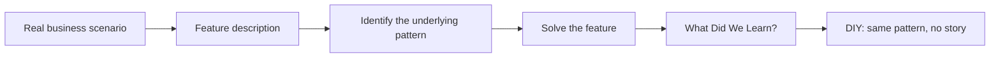

# Course Overview

Companies don't hire engineers to find the *k*th largest number in a list for its own sake. They hire engineers who can take a messy user story, look underneath it, and realize: *"oh, this is actually a `k`th-largest-element problem"* — and then write an efficient solution for it.

That translation step — from a real business problem to a known algorithmic pattern — is the actual skill being tested in a coding interview. It's also the hardest one to practice, because most interview prep jumps straight to the algorithm and skips the translation entirely.

This course is built around that gap.

## How the course is organized

Interview questions repeat the same handful of underlying patterns (sliding window, two pointers, backtracking, union-find, and so on) over and over, just dressed up in different clothing. So the course is organized **by real company scenario**, not by algorithm name:

- Each chapter picks a company or product you already know — Netflix, Uber, Amazon, a search engine, an operating system, a compiler, a network router.
- The chapter opens with a short **project description**: a business scenario at that company, and a list of features the engineering team needs built.
- Each **feature** is then solved step by step, and along the way we name the underlying pattern being used.
- The chapter closes with a **"What Did We Learn?"** recap, followed by a set of **DIY** problems — classic, company-agnostic interview questions (often from LeetCode) that use the exact same pattern you just learned, so you can practice recognizing it without the story to lean on.

The point isn't to memorize "Netflix uses a heap." It's to build the reflex: *given a vague-sounding problem, what pattern is actually hiding inside it?* That reflex is what carries over to a problem you've never seen before — which is exactly what happens in a real interview.

Let's begin.
