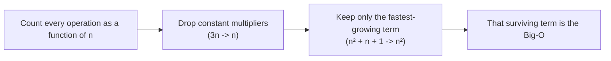
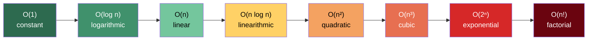
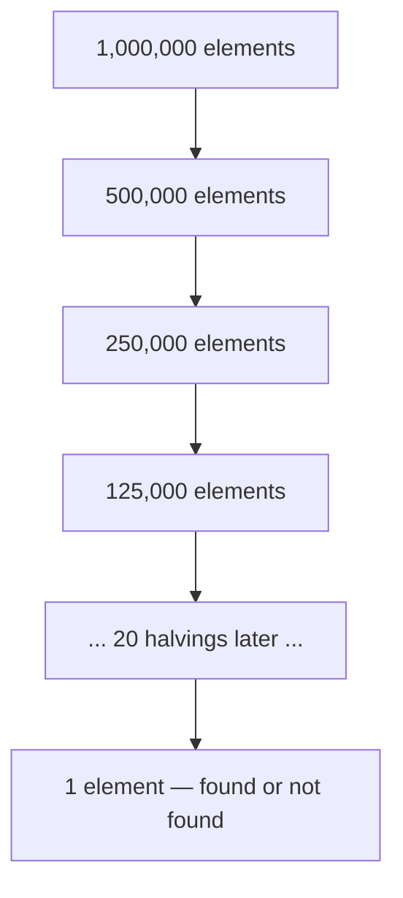
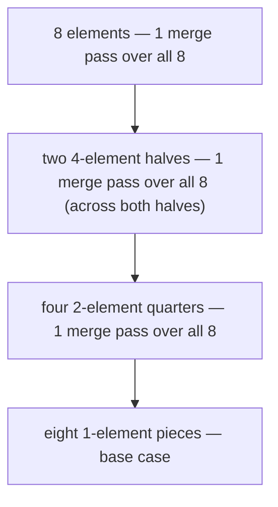
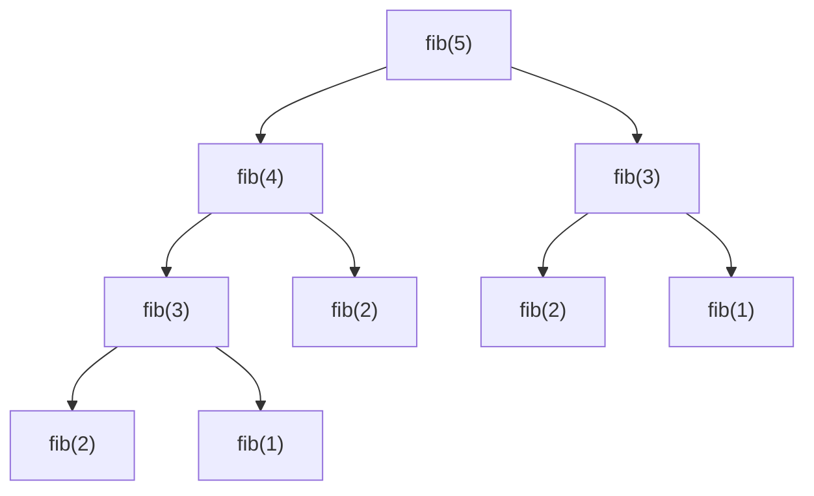
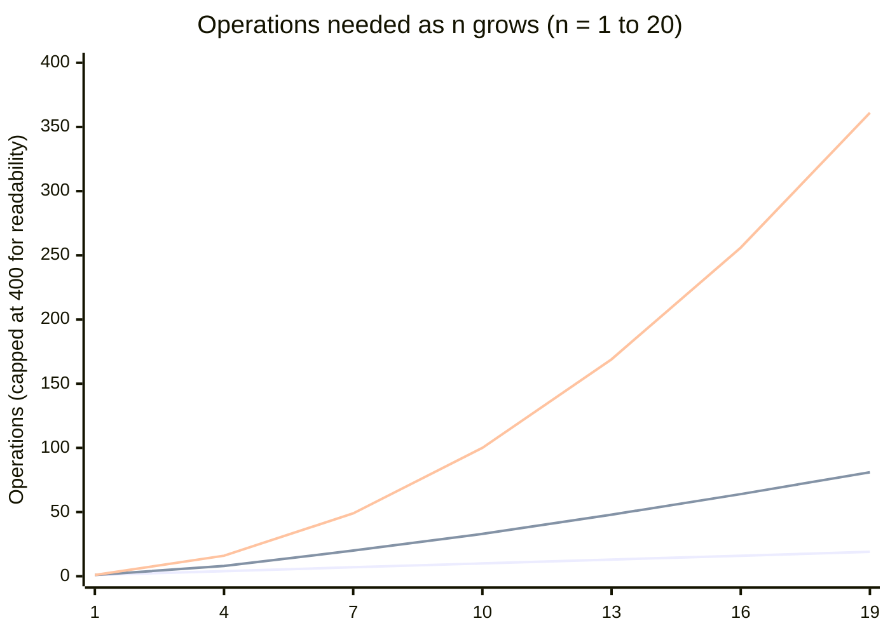
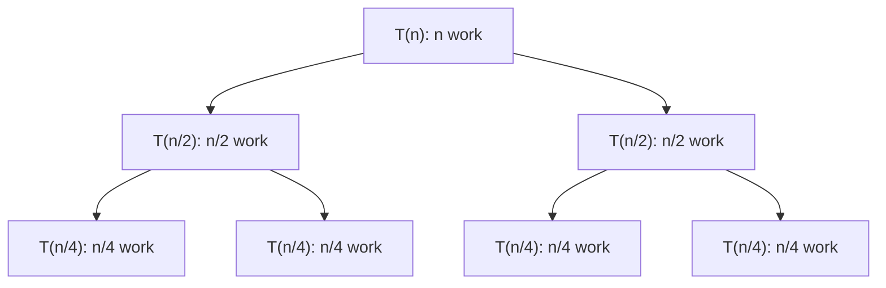
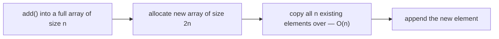
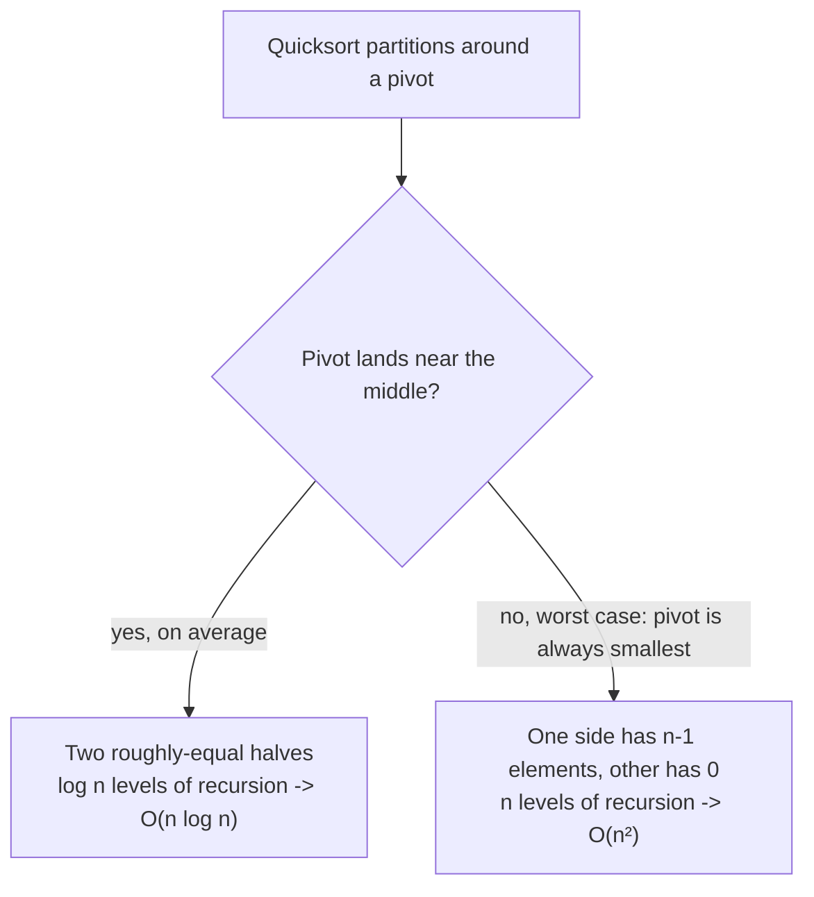

# Big-O Notation: Basics to Mastery

## Why we need it at all

Say you write two functions that both find a value in an array. One takes 3 microseconds on your laptop with 10 items. The other takes 5 microseconds on the same 10 items. Which one is "better"?

Trick question — you can't tell yet. Machine speed, language, and JIT warm-up all leak into a raw timing number. What you actually want to know is: **how does the amount of work grow as the input grows?** If you fed both functions 10,000,000 items instead of 10, would one of them still finish in a blink while the other takes an hour?

Big-O notation answers exactly that question. It describes how an algorithm's running time (or memory use) scales with input size `n`, ignoring machine-specific constants — so you can compare two algorithms on paper, before writing a single benchmark.

## The core idea, in plain English

Big-O describes the **upper bound** on an algorithm's growth rate, using the *dominant* term only.

Two simplification rules do all the work:

1. **Drop constants.** An algorithm that does `2n` operations and one that does `50n` operations are both `O(n)` — the constant factor doesn't change the *shape* of the growth curve as `n` gets large. (It matters a lot in real life for picking between two `O(n)` algorithms, but Big-O is a coarser tool than that — it's for comparing shapes, not exact runtimes.)
2. **Drop lower-order terms.** An algorithm that does `n² + n + 1` operations is `O(n²)` — once `n` is large, the `n²` term completely dwarfs the `n` and the `1`. Say `n = 1000`: `n² = 1,000,000` but `n = 1,000` — the linear term is 0.1% of the total and shrinks further as `n` grows.



### A note on Big-O vs. Big-Ω vs. Big-Θ

You'll see three related symbols in textbooks:

| Symbol | Means | Plain English |
|---|---|---|
| **O**(big-O) | Upper bound | "This algorithm never does *more* work than this, in the worst case" |
| **Ω** (big-omega) | Lower bound | "This algorithm never does *less* work than this, even in the best case" |
| **Θ** (big-theta) | Tight bound | "This algorithm's work is *exactly* this shape, best and worst case alike" |

In interviews and in everyday engineering conversation, "Big-O" is used loosely to mean Θ (the tight, typical-case bound) — when someone says "binary search is O(log n)," they mean it's *always* roughly `log n`, not just "at most" `log n`. This guide follows that common convention.

## The complexity classes, from fastest to slowest

Here's the ladder you'll climb in virtually every interview problem, cheapest to most expensive:



### O(1) — Constant time

The work needed **doesn't depend on `n` at all**. Whether the input has 10 elements or 10 million, this runs in the same amount of time.

```java
// Accessing an array element by index — always exactly one lookup.
int firstElement(int[] arr) {
    return arr[0];
}

// Pushing/popping a stack, checking a HashMap key, arithmetic — all O(1).
boolean hasSeen(Map<Integer, Boolean> seen, int value) {
    return seen.containsKey(value);
}
```

Why: array indexing is direct memory-address arithmetic (`base + index * elementSize`) — no scanning involved. Hash map lookups hash the key straight to a bucket — again, no scanning (on average; see the "average vs. worst case" section below).

### O(log n) — Logarithmic time

The work **shrinks by a constant fraction** (usually half) every step. Doubling the input size only adds *one more step* — this is what makes `log n` algorithms feel almost like magic on huge inputs.

```java
// Binary search: each comparison eliminates half of the remaining candidates.
int binarySearch(int[] sortedArr, int target) {
    int lo = 0, hi = sortedArr.length - 1;
    while (lo <= hi) {
        int mid = lo + (hi - lo) / 2;
        if (sortedArr[mid] == target) return mid;
        if (sortedArr[mid] < target) lo = mid + 1;
        else hi = mid - 1;
    }
    return -1;
}
```

For an array of 1,000,000 sorted elements, binary search needs at most `log₂(1,000,000) ≈ 20` comparisons. Double the array to 2,000,000, and it only needs `21`. That's the defining shape of `O(log n)`.



Other classic `O(log n)` operations: balanced-BST insert/lookup, heap push/pop (the heap's height is `log n`), and any "eliminate half the search space" technique.

### O(n) — Linear time

Work grows **directly proportional** to input size. Touch every element once (or a fixed number of times), and you're here.

```java
// A single pass over the array — one unit of work per element.
int sum(int[] arr) {
    int total = 0;
    for (int x : arr) {
        total += x;
    }
    return total;
}
```

Classic `O(n)` patterns: linear scans, sliding window, two pointers, single-pass hash-map counting (like the anagram-grouping or frequency-count problems throughout this course), and traversing a linked list.

### O(n log n) — Linearithmic time

The sweet spot between "does real comparisons/merging" and "still scales well." You get this whenever an algorithm does `O(log n)` levels of work, each level touching all `n` elements — the classic shape of an efficient comparison-based sort.

```java
// Merge sort: log n levels of splitting, each level does O(n) merging work.
void mergeSort(int[] arr, int lo, int hi) {
    if (lo >= hi) return;
    int mid = lo + (hi - lo) / 2;
    mergeSort(arr, lo, mid);
    mergeSort(arr, mid + 1, hi);
    merge(arr, lo, mid, hi); // O(n) work at this level
}
```



Each of the `log n` levels does `O(n)` total merging work, so the total is `O(n) × O(log n) = O(n log n)`. `Arrays.sort()` on objects, `Collections.sort()`, and most heap-based "top-K" solutions land here too.

### O(n²) — Quadratic time

For **every** element, do **another full pass** over the elements. Nested loops over the same input are the textbook trigger.

```java
// Naive duplicate check: compare every pair.
boolean hasDuplicate(int[] arr) {
    for (int i = 0; i < arr.length; i++) {
        for (int j = i + 1; j < arr.length; j++) {
            if (arr[i] == arr[j]) return true;
        }
    }
    return false;
}
```

For `n = 1,000`, that's up to ~500,000 comparisons. For `n = 100,000`, it's ~5,000,000,000 — this is exactly why so many interview problems reward turning a nested-loop `O(n²)` brute force into an `O(n)` or `O(n log n)` solution using a hash map or sorting (like `hasDuplicate` above collapsing into a single-pass `HashSet` check).

### O(n³) and beyond — Polynomial time

Three nested loops over the input (e.g. brute-force 3Sum, checking every triple) gives `O(n³)`. The pattern generalizes: `k` nested full passes over `n` elements gives `O(n^k)`. These are usually a sign a smarter approach (sorting + two pointers, dynamic programming, etc.) is available.

### O(2ⁿ) — Exponential time

Every element offers a **binary choice** (include it or don't), and you explore **all** combinations. The classic signature: naive recursive branching without memoization.

```java
// Naive Fibonacci: each call spawns 2 more calls, with no caching.
int fib(int n) {
    if (n <= 1) return n;
    return fib(n - 1) + fib(n - 2);
}
```



Notice `fib(3)` gets computed twice, `fib(2)` gets computed three times — this redundant re-exploration is *the* signature of unmemoized exponential recursion, and it's exactly why the DP lessons throughout this course (Decode Ways, Edit Distance, Coin Change) memoize: caching each unique subproblem's answer collapses this tree from `O(2ⁿ)` down to `O(n)`.

The subset-generation pattern (power set, generate all combinations) is genuinely `O(2ⁿ)` — there really are `2ⁿ` subsets, so there's no way around visiting them all if you need every one.

### O(n!) — Factorial time

Every **permutation** of the input is explored. This shows up in "generate all orderings" problems (Permutations, N-Queens' naive brute force, Traveling Salesman brute force).

```java
// Generate all permutations: n choices for position 0, (n-1) for position 1, ...
void permute(List<Integer> current, List<Integer> remaining, List<List<Integer>> result) {
    if (remaining.isEmpty()) {
        result.add(new ArrayList<>(current));
        return;
    }
    for (int i = 0; i < remaining.size(); i++) {
        int chosen = remaining.remove(i);
        current.add(chosen);
        permute(current, remaining, result);
        current.remove(current.size() - 1);
        remaining.add(i, chosen);
    }
}
```

For `n = 10`, that's 3,628,800 permutations. For `n = 15`, it's over a trillion. Factorial and exponential growth are why backtracking problems almost always come with tight constraints in interviews (`n ≤ 12` or so) — the interviewer already knows brute force is the only option and is bounding it deliberately.

## Growth rates, side by side

| n | O(1) | O(log n) | O(n) | O(n log n) | O(n²) | O(2ⁿ) |
|---|---|---|---|---|---|---|
| 1 | 1 | 0 | 1 | 0 | 1 | 2 |
| 10 | 1 | 3 | 10 | 33 | 100 | 1,024 |
| 100 | 1 | 7 | 100 | 664 | 10,000 | ~1.3 × 10³⁰ |
| 1,000 | 1 | 10 | 1,000 | 9,966 | 1,000,000 | astronomically large |
| 100,000 | 1 | 17 | 100,000 | 1,660,964 | 10,000,000,000 | astronomically large |



The takeaway that matters in interviews: an `O(n log n)` solution to a problem the brute force solves in `O(n²)` isn't a minor tweak — at `n = 100,000` it's the difference between ~1.6 million operations and 10 *billion*. That's often "instant" versus "this will time out."

## How to calculate time complexity: the rules

### Rule 1 — Sequential statements add

```java
void process(int[] arr) {
    doA(arr);   // O(n)
    doB(arr);   // O(n)
}
// Total: O(n) + O(n) = O(2n) = O(n)  (drop the constant)
```

### Rule 2 — Nested loops multiply

```java
void process(int[][] grid) {          // grid is n x n
    for (int[] row : grid) {          // n iterations
        for (int cell : row) {        // n iterations, for EACH outer iteration
            visit(cell);
        }
    }
}
// Total: O(n) * O(n) = O(n²)
```

### Rule 3 — Only the dominant term survives when steps are sequential, not nested

```java
void process(int[] arr) {
    for (int x : arr) { ... }              // O(n)
    for (int i = 0; i < arr.length; i++)   // O(n²) — nested loop below
        for (int j = 0; j < arr.length; j++) { ... }
}
// Total: O(n) + O(n²) = O(n²)  (the n term is dwarfed and dropped)
```

### Rule 4 — Different inputs get different variables

A very common mistake: calling everything `n` when two independent inputs are involved.

```java
// Merging two DIFFERENT arrays of sizes m and n is O(m + n), NOT O(n).
// (This is exactly the Feature #2 "Merge Tweets" pattern in this course.)
void merge(int[] a, int m, int[] b, int n) {
    for (int x : a) { ... }   // O(m)
    for (int y : b) { ... }   // O(n)
}
// Total: O(m + n) — collapsing this to O(n) would hide that it's the SUM
// of two independently-sized inputs, which matters if m >> n or vice versa.
```

## Recursive time complexity: the recursion-tree method

For recursive code, ask two questions: **(1) how many subproblems does each call spawn, and (2) how much work does each call do besides recursing?**

### Example: binary search — 1 subproblem, shrinking input

```
T(n) = T(n/2) + O(1)
```

Each level does `O(1)` work and there are `log n` levels (since the input halves each time) → **`O(log n)`**.

### Example: merge sort — 2 subproblems, full-size work per level

```
T(n) = 2T(n/2) + O(n)
```



Every level of this tree, no matter how far down, sums to `O(n)` total work (the pieces get smaller, but there are more of them, exactly cancelling out). There are `log n` levels → **`O(n log n)`**. This is the **Master Theorem** shortcut in action: `T(n) = a·T(n/b) + O(n^d)` resolves to `O(n^d log n)` when `a = b^d` (as it does here: `a=2, b=2, d=1`).

### Example: naive Fibonacci — 2 subproblems, no shrinking guarantee

```
T(n) = T(n-1) + T(n-2) + O(1)
```

Each call spawns 2 more (not shrinking by a fraction, just by a constant) → the tree's node count roughly doubles per level, `n` levels deep → **`O(2ⁿ)`**, exactly matching the recursion-tree diagram earlier.

## Space complexity

The same drop-constants-keep-dominant-term rules apply to **memory** instead of time — but only count *extra* memory the algorithm allocates, not the input itself (unless the problem explicitly asks you to include input size).

```java
// O(1) space: a fixed number of variables, regardless of input size.
int sum(int[] arr) {
    int total = 0;               // one int, always
    for (int x : arr) total += x;
    return total;
}

// O(n) space: the output array/list itself grows with the input.
List<Integer> doubleEach(int[] arr) {
    List<Integer> result = new ArrayList<>();  // grows to size n
    for (int x : arr) result.add(x * 2);
    return result;
}

// O(n) space via the CALL STACK, even with no explicit data structure.
int sumRecursive(int[] arr, int i) {
    if (i == arr.length) return 0;
    return arr[i] + sumRecursive(arr, i + 1);  // n stack frames deep
}
```

That last example is the one people forget most often: recursion depth **is** space usage, since each pending call sits on the call stack until it returns. A recursive solution that "only uses a few variables per call" can still be `O(n)` space if it recurses `n` levels deep — this is exactly why several DIY lessons in this course (e.g. Reverse Nodes in k-Group) are explicitly praised for achieving `O(1)` *auxiliary* space: they solve the problem iteratively, with no recursion, so no call-stack growth.

## Amortized complexity

Some operations are cheap almost every time, but occasionally expensive — and the *average* cost per operation, over a long sequence, is what actually matters. The classic example is a dynamic array (Java's `ArrayList`) doubling its backing array when it fills up.



That single resizing `add()` call costs `O(n)`. But it only happens when the array is exactly full — and doubling means the *next* resize won't happen for another `n` cheap `O(1)` appends. Summed over `n` total appends, the expensive resizes cost `1 + 2 + 4 + 8 + ... + n ≈ 2n` total — spread across `n` operations, that's `O(1)` **amortized** per operation, even though any single call might occasionally be `O(n)`.

This is why `ArrayList.add()` is described as "amortized O(1)," not flatly "O(1)" — a single call's actual cost varies, but averaged over any long sequence of calls, it settles at constant time.

## Best, worst, and average case

The *same* algorithm can have different Big-O bounds depending on the input shape. Quicksort is the textbook example:

| Case | When it happens | Complexity |
|---|---|---|
| Best/average | Pivots roughly split the array in half each time | `O(n log n)` |
| Worst | Pivot is always the smallest/largest remaining element (e.g. an already-sorted array with a naive "always pick the first element" pivot strategy) | `O(n²)` |



Unless a problem statement specifies otherwise, "the complexity of an algorithm" in casual conversation usually means the **worst case** — that's the guarantee you can actually rely on. Hash maps are a notable exception worth knowing by name: `HashMap` operations are `O(1)` *average case* but `O(n)` *worst case* (if every key collides into the same bucket) — in practice, with a decent hash function, you treat it as `O(1)`.

## Cheat sheet: pattern → typical complexity

A quick reference for the pattern families that recur throughout this course:

| Pattern | Typical time | Typical space | Seen in this course as |
|---|---|---|---|
| Single pass / two pointers / sliding window | `O(n)` | `O(1)` extra | Merge Tweets, Trapping Rainwater |
| Binary search on a sorted structure | `O(log n)` | `O(1)` | Search a 2D Matrix II |
| Hashing for lookups/counting | `O(n)` | `O(n)` | Group Anagrams, Two Sum |
| Sorting-based | `O(n log n)` | `O(n)` or `O(log n)` | Merge Intervals |
| Heap / priority queue (top-K, merge-K) | `O(n log k)` | `O(k)` | Merge K Sorted Lists, Top K Frequent Elements |
| BFS/DFS over a graph or grid | `O(V + E)` or `O(rows × cols)` | `O(V)` | Number of Islands, Course Schedule |
| Dynamic programming (1D) | `O(n)` | `O(n)` or `O(1)` with rolling variables | Decode Ways, Coin Change |
| Dynamic programming (2D) | `O(n × m)` | `O(n × m)` or `O(min(n,m))` rolled | Edit Distance |
| Backtracking / subsets / permutations | `O(2ⁿ)` or `O(n!)` | `O(n)` recursion depth | Permutations, Sudoku Solver |

## Practice: read the code, name the complexity

Try each one before checking the answer.

**1.**
```java
void mystery1(int[] arr) {
    int n = arr.length;
    System.out.println(arr[n / 2]);
}
```
<details><summary>Answer</summary>O(1) — one array access, regardless of n.</details>

**2.**
```java
void mystery2(int[] arr) {
    for (int i = 0; i < arr.length; i++) {
        for (int j = i + 1; j < arr.length; j++) {
            if (arr[i] + arr[j] == 0) System.out.println("pair found");
        }
    }
}
```
<details><summary>Answer</summary>O(n²) — a triangular nested loop is still quadratic; dropping the "j starts at i+1 instead of 0" detail doesn't change the growth shape, only the constant factor (roughly half the full n² comparisons).</details>

**3.**
```java
void mystery3(int[] arr) {
    Set<Integer> seen = new HashSet<>();
    for (int x : arr) {
        if (seen.contains(x)) return;
        seen.add(x);
    }
}
```
<details><summary>Answer</summary>O(n) time, O(n) space — one pass, with a hash set that can grow to hold every element.</details>

**4.**
```java
int mystery4(int n) {
    if (n <= 1) return 1;
    return mystery4(n / 2) + mystery4(n / 2);
}
```
<details><summary>Answer</summary>O(n), not O(log n)! Each call spawns 2 subproblems (not 1), each of half the size: T(n) = 2T(n/2) + O(1). By the Master Theorem (a=2, b=2, d=0), since a > b^d, this resolves to O(n^(log_b a)) = O(n^1) = O(n) — the sheer number of calls (which doubles every level, same as the total problem size shrinking by half) dominates. This is a classic "looks logarithmic, isn't" trap.</details>

**5.**
```java
void mystery5(int[][] matrix) {   // n x m matrix
    for (int[] row : matrix) {
        for (int cell : row) {
            process(cell);
        }
    }
}
```
<details><summary>Answer</summary>O(n × m) — NOT O(n²), unless the problem guarantees a square matrix. Naming both dimensions distinctly (Rule 4 above) avoids hiding that this scales with the total cell count, which is n × m, not n².</details>

## Where to go from here

Every feature lesson and DIY problem in this course states its own time and space complexity at the bottom — after working through this guide, try covering that section up and deriving the complexity yourself before checking the stated answer. That's the fastest way to turn this from "notation I can recognize" into "notation I reach for automatically."
