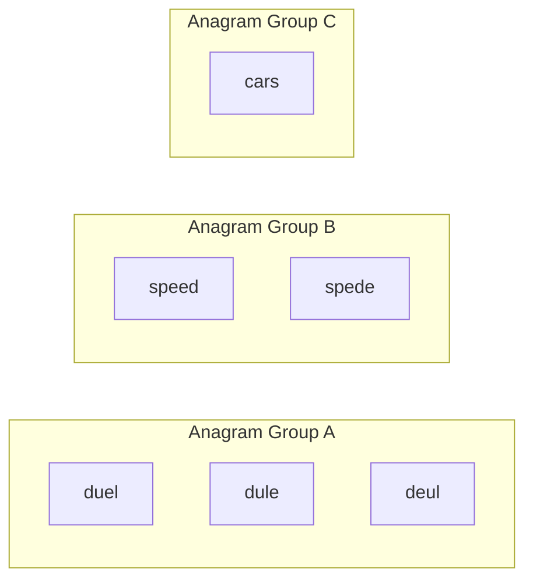
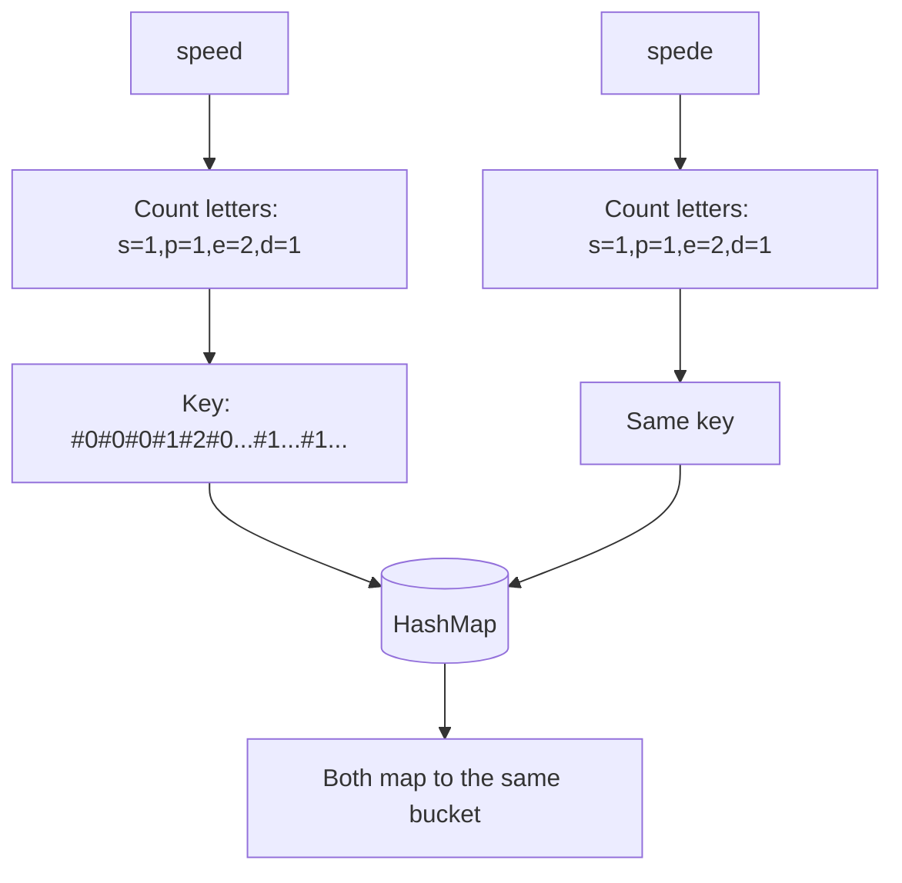

# Feature #1: Group Similar Titles

## The problem

Netflix's catalog has titles like `"duel"`, `"dule"`, `"speed"`, `"spede"`, `"deul"`, `"cars"`. If a user searches for `"spede"` (a typo for `"speed"`), we still want to show them `"speed"`.

Look closely at those titles and a pattern jumps out: `"duel"`, `"dule"`, and `"deul"` are all made of the exact same letters, just shuffled — they're anagrams of each other. So are `"speed"` and `"spede"`. `"cars"` stands alone.

So the titles naturally split into three groups:

```
{"duel", "dule", "deul"}
{"speed", "spede"}
{"cars"}
```

If we pre-compute these groups once, then a search for any misspelled-but-letter-complete variant just needs to find its group and return every title in it — no need to recompute anything at search time.



## Solution

The key insight: two words are anagrams of each other **if and only if they have the same letter-frequency count.** `"speed"` and `"spede"` both have `s:1, p:1, e:2, d:1` — same counts, different order.

So instead of comparing words directly, we turn each word into a **frequency signature** and group by that signature:

1. For each title, build a 26-slot array counting how many times each letter `a`–`z` appears.
2. Turn that array into a single string key, so it can be used as a `HashMap` key — for example `abbccc` becomes `#1#2#3#0#0...#0` (count of `a`, then `b`, then `c`, ... separated by `#`).
3. Anagrams produce the *identical* key. Insert each title into a `Map<String, List<String>>` keyed by this signature.
4. Return `map.values()` — each value is one complete anagram group.



## Code

```java
import java.util.*;

class Solution {
    public static List<List<String>> groupTitles(String[] titles) {
        if (titles.length == 0) {
            return new ArrayList<>();
        }

        // key: 26-letter frequency signature -> value: all titles sharing it
        Map<String, List<String>> groups = new HashMap<>();

        for (String title : titles) {
            int[] count = new int[26];
            for (char c : title.toCharArray()) {
                count[c - 'a']++;
            }

            StringBuilder keyBuilder = new StringBuilder();
            for (int freq : count) {
                keyBuilder.append('#').append(freq);
            }
            String key = keyBuilder.toString();

            groups.computeIfAbsent(key, k -> new ArrayList<>()).add(title);
        }

        return new ArrayList<>(groups.values());
    }

    public static void main(String[] args) {
        String[] titles = {"duel", "dule", "speed", "spede", "deul", "cars"};
        List<List<String>> result = groupTitles(titles);
        for (List<String> group : result) {
            System.out.println(group);
        }
        // {"duel", "dule", "deul"}
        // {"speed", "spede"}
        // {"cars"}
    }
}
```

## Complexity measures

Let **n** be the number of titles, and **k** the length of the longest title.

### Time Complexity

For every title we scan all its characters once to build the frequency signature: `O(n × k)`.

### Space Complexity

Every title is stored once as a value in the map, and every signature key is proportional to a title's length: `O(n × k)`.
