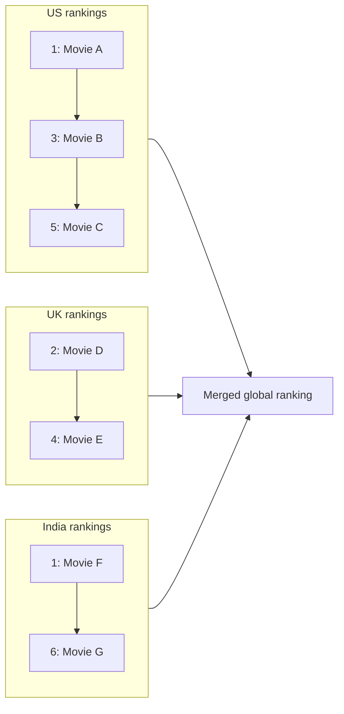
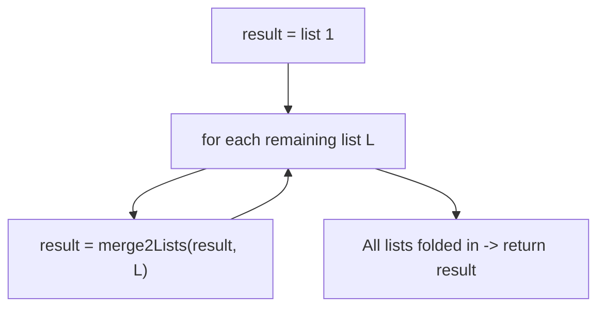

# Feature #2: Fetch Top Movies

## The problem

To scale globally, Netflix ranks movies **per country**, and each country's ranking is produced by a separate machine as its own sorted list (rank `1` = most popular, ranks increasing as popularity drops). We need to merge all of these per-country lists into one global list, sorted by rank.



> Note: ranks are per-country, so the same numeric rank can appear in more than one list — a movie ranked `1` in the US and a different movie ranked `1` in India are both valid.

This is the classic **Merge K Sorted Lists** problem, just with movie rankings standing in for the lists.

## Solution

Instead of trying to merge all `n` lists at once, break it down: merging two sorted lists is easy, and we already know how to do it (it's the merge step from merge sort). So:

1. Start with the first country's list as our running `result`.
2. Walk through the remaining lists one at a time, merging each one into `result`.
3. To merge two lists `l1` and `l2`: keep a `dummy` head node and a `prev` pointer trailing behind. At each step, compare the current nodes of `l1` and `l2`; whichever has the smaller (better) rank gets attached next, and that list advances.
4. When one list runs out, attach whatever remains of the other list directly — it's already sorted.
5. After folding in every list, `result` holds the fully merged, globally ranked list.



## Code

```java
class LinkedListNode {
    int data;
    LinkedListNode next;

    LinkedListNode(int data) {
        this.data = data;
        this.next = null;
    }
}

class MergeSortList {

    // Merges two sorted linked lists into one sorted linked list.
    public static LinkedListNode merge2Lists(LinkedListNode l1, LinkedListNode l2) {
        LinkedListNode dummy = new LinkedListNode(-1);
        LinkedListNode prev = dummy;

        while (l1 != null && l2 != null) {
            if (l1.data <= l2.data) {
                prev.next = l1;
                l1 = l1.next;
            } else {
                prev.next = l2;
                l2 = l2.next;
            }
            prev = prev.next;
        }

        // Attach whatever remains — it's already sorted.
        prev.next = (l1 != null) ? l1 : l2;

        return dummy.next;
    }

    // Folds n sorted lists (one per country) into a single globally sorted list.
    public static LinkedListNode fetchTopMovies(LinkedListNode[] countryLists) {
        if (countryLists == null || countryLists.length == 0) {
            return null;
        }

        LinkedListNode result = countryLists[0];
        for (int i = 1; i < countryLists.length; i++) {
            result = merge2Lists(result, countryLists[i]);
        }
        return result;
    }

    public static void main(String[] args) {
        LinkedListNode us = new LinkedListNode(1);
        us.next = new LinkedListNode(3);
        us.next.next = new LinkedListNode(5);

        LinkedListNode uk = new LinkedListNode(2);
        uk.next = new LinkedListNode(4);

        LinkedListNode india = new LinkedListNode(1);
        india.next = new LinkedListNode(6);

        LinkedListNode merged = fetchTopMovies(new LinkedListNode[]{us, uk, india});

        StringBuilder sb = new StringBuilder();
        for (LinkedListNode node = merged; node != null; node = node.next) {
            sb.append(node.data).append(" ");
        }
        System.out.println(sb.toString().trim()); // 1 1 2 3 4 5 6
    }
}
```

## Complexity measures

Let **k** be the number of country lists and **n** be the maximum length of a single list.

### Time Complexity

Merging the running `result` (which can grow up to `(k-1) × n` elements) with each new list of `n` elements, `k - 1` times, costs `O(n × k²)` in the worst case.

### Space Complexity

`O(1)` — we only rewire existing nodes; no extra list storage is allocated.
