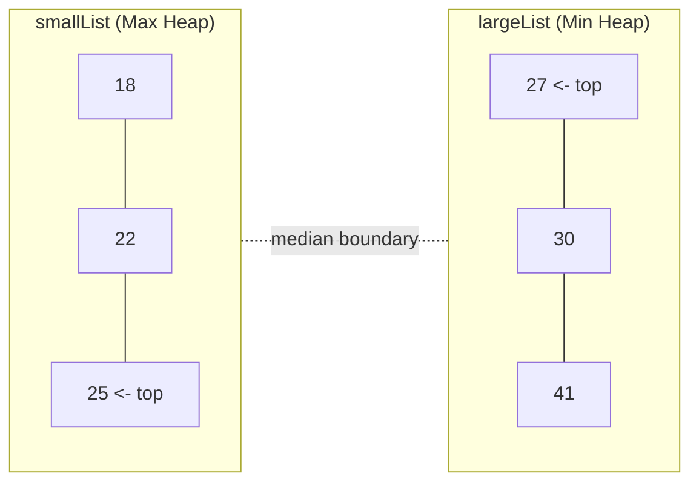
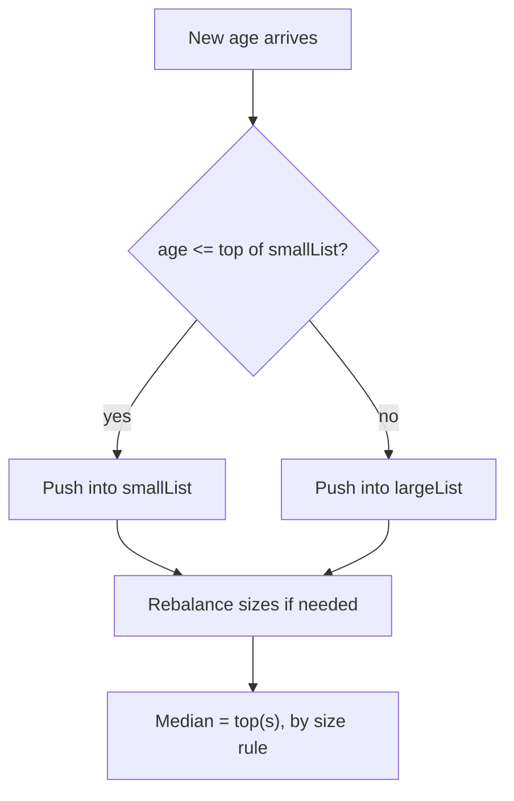

# Feature #3: Find Median Age

## The problem

Netflix wants to recommend content based on the median age of viewers in a region. New users sign up constantly, so the median has to be **recomputed after every single sign-up** — we can't just re-sort the whole list of ages from scratch every time; that would get slower and slower as the user base grows.

We need a structure that supports:
- `insertAge(age)` — add a new user's age.
- `findMedian()` — return the current median, fast, at any point.

This is the classic **"Find Median from a Data Stream"** pattern.

## Solution

Call the median `x`. By definition, half the ages are `≤ x` and half are `≥ x`. So split all ages seen so far into two halves:

- `smallList` — the smaller half of the ages.
- `largeList` — the larger half of the ages.

The median is either the largest value in `smallList`, the smallest value in `largeList`, or (when the count is even) the average of those two — which are always sitting right at the boundary between the two halves.

To grab "the largest of the small half" or "the smallest of the large half" instantly, use **heaps**:

- `smallList` → a **Max Heap** (so its top is the largest of the smaller half).
- `largeList` → a **Min Heap** (so its top is the smallest of the larger half).



Every time a new age comes in:
1. Add it to one of the two heaps.
2. **Rebalance**: if one heap has grown to hold more than one extra element than the other, move its top element over to the other heap. This keeps the two halves within one element of each other in size.
3. To read the median: if the heaps are the same size, average their two tops; otherwise, return the top of whichever heap has one more element.



## Code

```java
import java.util.*;

class MedianOfAges {

    private final PriorityQueue<Integer> smallList; // max heap: smaller half of ages
    private final PriorityQueue<Integer> largeList; // min heap: larger half of ages

    public MedianOfAges() {
        smallList = new PriorityQueue<>(Collections.reverseOrder());
        largeList = new PriorityQueue<>();
    }

    public void insertAge(int age) {
        if (smallList.isEmpty() || age <= smallList.peek()) {
            smallList.offer(age);
        } else {
            largeList.offer(age);
        }

        // Rebalance so the two halves never differ in size by more than 1.
        if (smallList.size() > largeList.size() + 1) {
            largeList.offer(smallList.poll());
        } else if (largeList.size() > smallList.size() + 1) {
            smallList.offer(largeList.poll());
        }
    }

    public double findMedian() {
        if (smallList.size() == largeList.size()) {
            return (smallList.peek() + largeList.peek()) / 2.0;
        }
        return smallList.size() > largeList.size() ? smallList.peek() : largeList.peek();
    }

    public static void main(String[] args) {
        MedianOfAges tracker = new MedianOfAges();
        int[] incomingAges = {25, 18, 30, 22, 41, 27};

        for (int age : incomingAges) {
            tracker.insertAge(age);
            System.out.println("After inserting " + age + ", median = " + tracker.findMedian());
        }
    }
}
```

## Complexity measures

Let **n** be the total number of ages inserted so far.

### Time Complexity

- **Insert Age:** `O(log n)` — heap insertion/removal during rebalancing.
- **Find Median:** `O(1)` — just peek at the top(s) of the heaps.

### Memory Complexity

`O(n)` — every age ever inserted lives in one of the two heaps.
