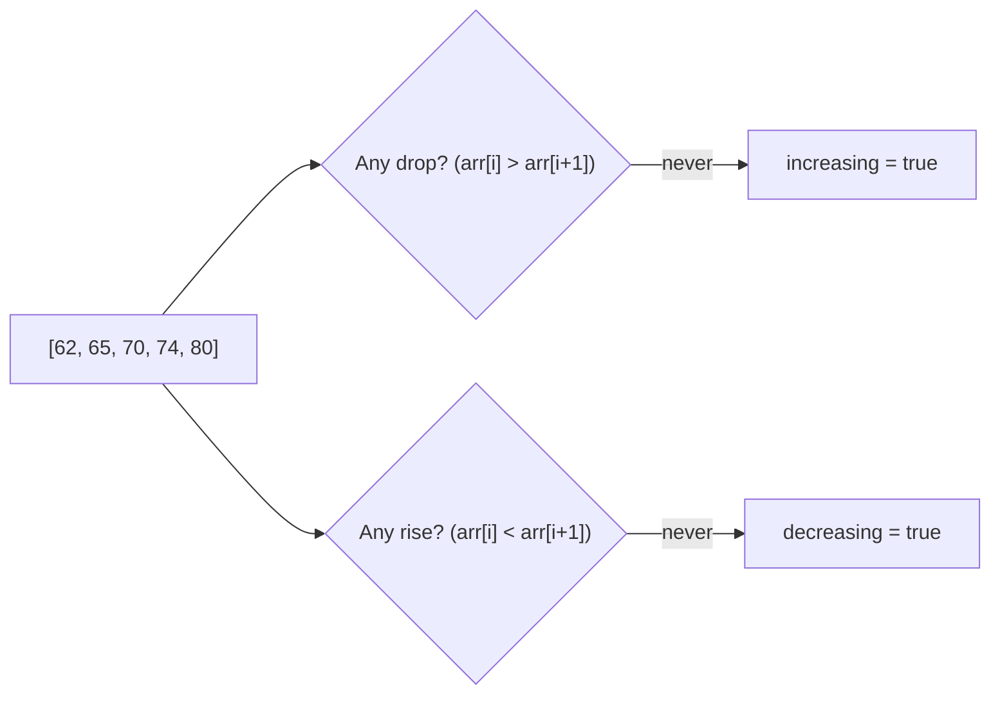

# Feature #4: Popularity Analysis

## The problem

Every title on Netflix has a **popularity score**, updated weekly from likes, dislikes, and viewing behavior. Each week's score gets appended to that title's score history, so over time we build up an array like `[62, 65, 70, 74, 80]`.

Some titles are steadily gaining popularity, some are steadily losing it, some stay flat, and some just bounce around unpredictably. We want to flag titles that are **consistently trending** (up or down) so the recommendation engine can react — a fluctuating title isn't actionable in the same way.

This is the **Monotonic Array** pattern: is this array always non-decreasing, always non-increasing, or neither?

## Solution

An array is **increasing** if `arr[i] <= arr[i+1]` holds for every consecutive pair. It's **decreasing** if `arr[i] >= arr[i+1]` holds for every consecutive pair.

So track two flags while scanning the array once:

- `increasing` — stays `true` as long as we never see a *drop* (`arr[i] > arr[i+1]`).
- `decreasing` — stays `true` as long as we never see a *rise* (`arr[i] < arr[i+1]`).

By the end of the scan:
- If `increasing` is still `true` → the title is steadily gaining popularity.
- If `decreasing` is still `true` → the title is steadily losing popularity.
- If **both** are still `true` → the popularity never changed (flat line — a special case of both).
- If **neither** is `true` → the title is fluctuating.



## Code

```java
class Solution {

    // Returns true if the popularity scores are monotonic
    // (steadily increasing, steadily decreasing, or flat) — i.e. NOT fluctuating.
    public static boolean isTrending(int[] scores) {
        boolean increasing = true;
        boolean decreasing = true;

        for (int i = 0; i < scores.length - 1; i++) {
            if (scores[i] > scores[i + 1]) {
                increasing = false;
            }
            if (scores[i] < scores[i + 1]) {
                decreasing = false;
            }
        }

        return increasing || decreasing;
    }

    public static void main(String[] args) {
        System.out.println(isTrending(new int[]{62, 65, 70, 74, 80})); // true  (gaining)
        System.out.println(isTrending(new int[]{80, 74, 70, 65, 62})); // true  (losing)
        System.out.println(isTrending(new int[]{70, 70, 70, 70}));     // true  (flat)
        System.out.println(isTrending(new int[]{62, 80, 65, 74}));     // false (fluctuating)
    }
}
```

## Complexity measures

Let **n** be the size of the score history.

### Time Complexity

`O(n)` — a single pass over the array.

### Space Complexity

`O(1)` — only two boolean flags are used.
