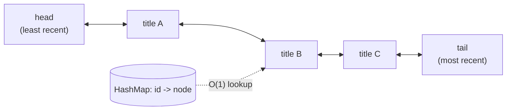

# Feature #5: Fetch Most Recently Watched Titles

## The problem

We want a cache of the last `n` titles a user watched or accessed, with two requirements:

1. It keeps titles ordered by *how recently* they were accessed.
2. Once the cache is full, adding a new title evicts the **least recently accessed** one.

Both `get(id)` and `put(id, title)` need to be fast — this cache is checked on nearly every interaction, so an `O(n)` scan per lookup won't scale.

This is the classic **LRU Cache** (Least Recently Used) design.

## Solution

A doubly linked list is a natural fit for "order by recency": keep the **most recently accessed** item at the **tail**, and the **least recently accessed** item at the **head**. Whenever an item is touched (read or written), unlink it and re-insert it at the tail.

The catch: finding *where* a given item sits in the linked list, just to move it, would normally take `O(n)`. Fix that by keeping a `HashMap<id, node>` alongside the list, so any node can be located in `O(1)` and then unlinked/re-inserted in `O(1)` (since we already have a direct pointer to it — no searching required).



Putting it together:

1. **On access (get or put) of an existing id:** find its node via the map, unlink it from its current position, and re-insert it at the tail.
2. **On insert of a new id, when the cache is full:** remove the node at the **head** (the least recently used one) from both the list and the map, then insert the new node at the tail and add it to the map.
3. **On insert of a new id, when there's room:** just insert the new node at the tail and add it to the map.

## Code

```java
import java.util.HashMap;

class LinkedListNode {
    int key;
    String title;
    LinkedListNode prev;
    LinkedListNode next;

    LinkedListNode(int key, String title) {
        this.key = key;
        this.title = title;
    }
}

// A doubly linked list with O(1) removal of any node and O(1) tail insertion,
// used to track recency order (head = least recent, tail = most recent).
class MyLinkedList {
    private final LinkedListNode head;
    private final LinkedListNode tail;

    MyLinkedList() {
        head = new LinkedListNode(-1, null);
        tail = new LinkedListNode(-1, null);
        head.next = tail;
        tail.prev = head;
    }

    void addToTail(LinkedListNode node) {
        LinkedListNode prevTail = tail.prev;
        prevTail.next = node;
        node.prev = prevTail;
        node.next = tail;
        tail.prev = node;
    }

    void remove(LinkedListNode node) {
        node.prev.next = node.next;
        node.next.prev = node.prev;
    }

    LinkedListNode removeHead() {
        if (head.next == tail) {
            return null;
        }
        LinkedListNode first = head.next;
        remove(first);
        return first;
    }
}

class LRUCache {
    private final int capacity;
    private final HashMap<Integer, LinkedListNode> cache;
    private final MyLinkedList cacheVals;

    public LRUCache(int capacity) {
        this.capacity = capacity;
        cache = new HashMap<>(capacity);
        cacheVals = new MyLinkedList();
    }

    public String get(int titleId) {
        if (!cache.containsKey(titleId)) {
            return null;
        }
        LinkedListNode node = cache.get(titleId);
        cacheVals.remove(node);
        cacheVals.addToTail(node);
        return node.title;
    }

    public void put(int titleId, String title) {
        if (cache.containsKey(titleId)) {
            LinkedListNode node = cache.get(titleId);
            node.title = title;
            cacheVals.remove(node);
            cacheVals.addToTail(node);
            return;
        }

        if (cache.size() == capacity) {
            LinkedListNode evicted = cacheVals.removeHead();
            if (evicted != null) {
                cache.remove(evicted.key);
            }
        }

        LinkedListNode node = new LinkedListNode(titleId, title);
        cacheVals.addToTail(node);
        cache.put(titleId, node);
    }

    public static void main(String[] args) {
        LRUCache recentlyWatched = new LRUCache(2);
        recentlyWatched.put(1, "Stranger Things");
        recentlyWatched.put(2, "The Crown");
        System.out.println(recentlyWatched.get(1)); // "Stranger Things" (now most recent)

        recentlyWatched.put(3, "Money Heist");        // evicts id 2, "The Crown" (least recent)
        System.out.println(recentlyWatched.get(2));   // null
        System.out.println(recentlyWatched.get(3));   // "Money Heist"
    }
}
```

## Complexity measures

Let **k** be the cache's capacity.

### Time Complexity

`O(1)` for both `get` and `put` — HashMap lookups are `O(1)`, and inserting/removing a node at a known position in a doubly linked list is `O(1)`.

### Space Complexity

`O(k)` — the cache holds at most `k` entries, in both the map and the linked list.
