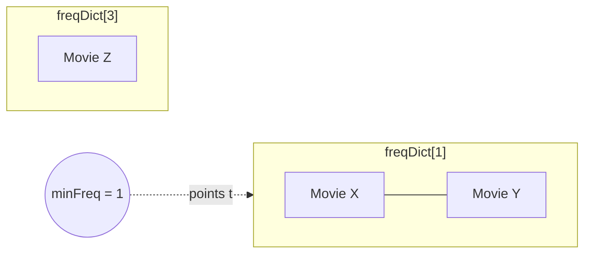

# Feature #6: Fetch Most Frequently Watched Titles

## The problem

Same shape as the last feature, but a different eviction rule: instead of evicting the **least recently** accessed title, evict the **least frequently** accessed one. If two titles are tied on frequency, break the tie by evicting whichever of them was accessed least recently.

This is the **LFU Cache** (Least Frequently Used) design — a step up in complexity from LRU.

## Solution

Build this on top of the LRU cache idea from the previous feature, but bucket entries **by frequency**:

- `keyDict: HashMap<key, node>` — direct `O(1)` access to any cached node by its key (same role as in LRU).
- `freqDict: HashMap<frequency, doubly-linked-list>` — for each frequency count, a doubly linked list of all the nodes currently at that frequency, ordered by recency (most recent at the tail — this is exactly the LRU trick, just scoped to one frequency bucket).
- `minFreq` — tracks the *smallest* frequency currently in use, so eviction never has to search for it.



Operations:

1. **Access an existing key (`get`):** find its node via `keyDict`. Remove it from its current frequency bucket, bump its frequency by 1, and insert it at the **tail** of the new (higher) frequency's list. If the bucket it just left is now empty *and* was the `minFreq` bucket, increment `minFreq`.
2. **Insert a new key when there's room:** create a node with frequency `1`, add it to `freqDict[1]`'s tail, add it to `keyDict`, and reset `minFreq = 1` (a fresh entry is always the new minimum).
3. **Insert a new key when eviction is needed:** look at `freqDict[minFreq]`, remove its **head** node (least frequent, and least recently used among ties) from both maps — then proceed as step 2.
4. **Update an existing key's value:** same traversal as `get`, just also overwrite the stored value.

## Code

```java
import java.util.HashMap;

class LinkedListNode {
    int key;
    String value;
    int freq = 1;
    LinkedListNode prev;
    LinkedListNode next;

    LinkedListNode(int key, String value) {
        this.key = key;
        this.value = value;
    }
}

// Doubly linked list representing all nodes that currently share one frequency count.
class MyLinkedList {
    private final LinkedListNode head;
    private final LinkedListNode tail;
    private int size = 0;

    MyLinkedList() {
        head = new LinkedListNode(-1, null);
        tail = new LinkedListNode(-1, null);
        head.next = tail;
        tail.prev = head;
    }

    void addToTail(LinkedListNode node) {
        LinkedListNode prevTail = tail.prev;
        prevTail.next = node;
        node.prev = prevTail;
        node.next = tail;
        tail.prev = node;
        size++;
    }

    void remove(LinkedListNode node) {
        node.prev.next = node.next;
        node.next.prev = node.prev;
        size--;
    }

    LinkedListNode peekHead() {
        return head.next == tail ? null : head.next;
    }

    boolean isEmpty() {
        return size == 0;
    }
}

class LFUCache {
    private final int capacity;
    private int size;
    private int minFreq;
    private final HashMap<Integer, LinkedListNode> keyDict;
    private final HashMap<Integer, MyLinkedList> freqDict;

    public LFUCache(int capacity) {
        this.capacity = capacity;
        this.size = 0;
        this.minFreq = 0;
        keyDict = new HashMap<>();
        freqDict = new HashMap<>();
    }

    public String get(int key) {
        if (!keyDict.containsKey(key)) {
            return null;
        }
        LinkedListNode node = keyDict.get(key);
        touch(node);
        return node.value;
    }

    public void put(int key, String value) {
        if (capacity == 0) {
            return;
        }

        if (keyDict.containsKey(key)) {
            LinkedListNode node = keyDict.get(key);
            node.value = value;
            touch(node);
            return;
        }

        if (size == capacity) {
            MyLinkedList minBucket = freqDict.get(minFreq);
            LinkedListNode evicted = minBucket.peekHead();
            minBucket.remove(evicted);
            keyDict.remove(evicted.key);
            size--;
        }

        LinkedListNode node = new LinkedListNode(key, value);
        keyDict.put(key, node);
        freqDict.computeIfAbsent(1, f -> new MyLinkedList()).addToTail(node);
        minFreq = 1;
        size++;
    }

    // Bumps a node's frequency by 1 and moves it to the new bucket's tail.
    private void touch(LinkedListNode node) {
        int oldFreq = node.freq;
        MyLinkedList oldBucket = freqDict.get(oldFreq);
        oldBucket.remove(node);

        if (oldBucket.isEmpty() && minFreq == oldFreq) {
            minFreq++;
        }

        node.freq++;
        freqDict.computeIfAbsent(node.freq, f -> new MyLinkedList()).addToTail(node);
    }

    public static void main(String[] args) {
        LFUCache cache = new LFUCache(2);
        cache.put(1, "Stranger Things");
        cache.put(2, "The Crown");
        cache.get(1);                    // freq(1) = 2, freq(2) = 1
        cache.put(3, "Money Heist");     // evicts key 2 (lowest freq)
        System.out.println(cache.get(2)); // null
        System.out.println(cache.get(1)); // "Stranger Things"
        System.out.println(cache.get(3)); // "Money Heist"
    }
}
```

## Complexity measures

Let **n** be the cache's capacity.

### Time Complexity

`O(1)` for both `get` and `put` — every step is a HashMap lookup or a linked-list insert/remove at a known node, none of which scale with the number of entries.

### Space Complexity

`O(n)` — at most `n` entries are tracked across `keyDict` and the frequency buckets in `freqDict`.
