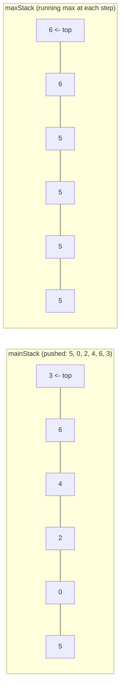

# Feature #7: Browse Ratings

## The problem

A user browsing Netflix hops from title to title, reading summaries and reviews. We want two things, both in **O(1)**:

- A **Back** button that returns to the previously viewed title.
- A way to instantly jump to the **highest-rated** title the user has browsed so far this session.

Assume ratings are unique, and we're fed a sequence of ratings representing titles as the user browses them, one at a time.

## Solution

"Go back to the last thing" screams **stack** (LIFO) — `push` on each new view, `pop` on Back. Both run in `O(1)` naturally.

The wrinkle is the second requirement: a plain stack has no idea what its maximum element is without scanning everything. We need a stack that also supports `getMax()` in `O(1)`.

The trick: keep **two stacks** in lockstep.

- `mainStack` — the real browsing history, exactly like a normal stack.
- `maxStack` — at every position, its top holds *the maximum value seen up to that point in the history.*



How it works:

- **`push(rating)`:** always push onto `mainStack`. For `maxStack`: if it's empty, push `rating`. Otherwise compare `rating` to `maxStack`'s current top — push `rating` if it's bigger, otherwise push the **same top value again** (a duplicate). This way `maxStack` always has exactly as many entries as `mainStack`, and its top is always "the max so far."
- **`pop()`:** pop both stacks at the same time, keeping them in lockstep.
- **`maxRating()`:** just peek the top of `maxStack` — no scanning needed.

Because every push on `mainStack` has a matching push on `maxStack`, the two stacks never get out of sync, and `getMax` never has to look further than the top.

> Curious extension: what if you needed the **minimum** instead? Same trick, just track "smallest so far" instead of "largest so far" — that's exactly the classic **Min Stack** problem.

## Code

```java
import java.util.Stack;

class MaxStack {
    private final Stack<Integer> mainStack;
    private final Stack<Integer> maxStack;

    public MaxStack() {
        mainStack = new Stack<>();
        maxStack = new Stack<>();
    }

    public void push(int rating) {
        mainStack.push(rating);
        if (maxStack.isEmpty() || rating > maxStack.peek()) {
            maxStack.push(rating);
        } else {
            maxStack.push(maxStack.peek());
        }
    }

    public int pop() {
        maxStack.pop();
        return mainStack.pop();
    }

    public int maxRating() {
        return maxStack.peek();
    }
}

class Solution {
    public static void main(String[] args) {
        MaxStack history = new MaxStack();
        history.push(5);
        history.push(0);
        history.push(2);
        history.push(4);
        history.push(6);
        history.push(3);

        System.out.println(history.maxRating()); // 6

        history.pop(); // removes 3, back to title rated 6
        history.pop(); // removes 6
        System.out.println(history.maxRating()); // 5 (max of the remaining {5, 0, 2, 4})
    }
}
```

## Complexity measures

### Time Complexity

`O(1)` for `push`, `pop`, and `maxRating` — each touches only the top of one or both stacks.

### Space Complexity

`O(n)` — in the worst case (a strictly increasing sequence of ratings) `maxStack` stores one entry per `push`, matching `mainStack` one-for-one.
