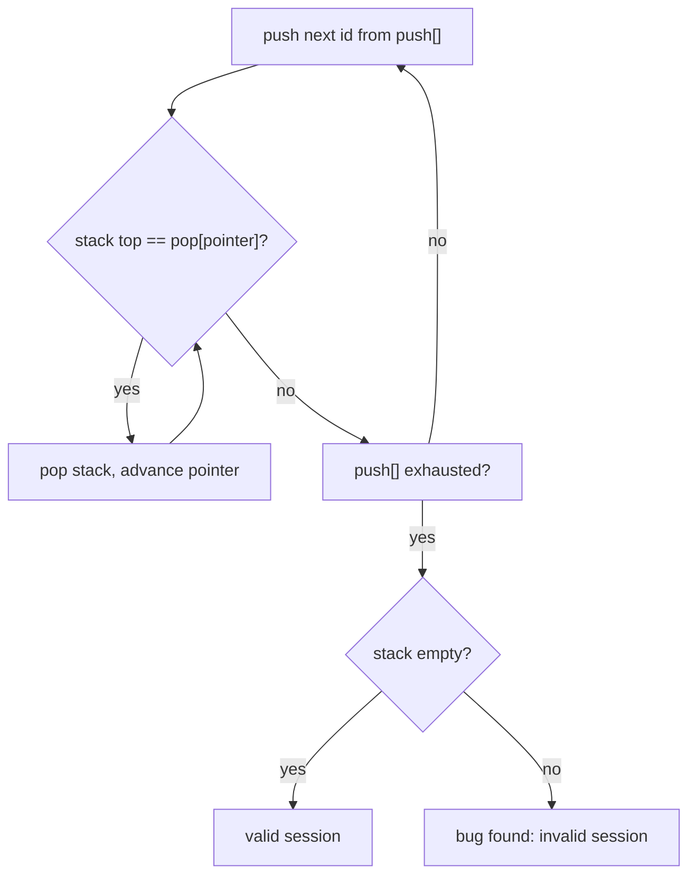

# Feature #8: Verify User Session

## The problem

A user complained that the **Back** button (from the previous feature) showed titles out of order. Digging into the logs, you find two separate arrays — one recording every `push` (title browsed), one recording every `pop` (Back button press) — but **no timestamps** connecting them. The user never browsed the same title twice, and by the end of the session the Back button was fully exhausted (every pushed title was eventually popped).

The question: given just these two arrays, could they have come from a *valid* sequence of stack operations on an initially empty stack? Or does the log prove the stack implementation actually has a bug?

This is the classic **Validate Stack Sequences** problem.

## Solution

Say the logs show:

```
push = {1, 2, 3, 4, 5}
pop  = {4, 5, 3, 2, 1}
```

We don't know *when* each pop happened relative to the pushes, but we know the pushes happened in order `1, 2, 3, 4, 5` (that's a fact — that's the order titles were browsed), and if the log is legitimate, some valid interleaving of pushes and pops reproduces it.

The trick: **simulate it greedily.** Push items from `push` one at a time onto a real stack. After every single push, check: does the top of our stack match the *next* value we're expecting to pop? If yes, pop it immediately (and advance to the next expected pop value) — and keep popping as long as it keeps matching. If a valid interleaving exists, this greedy strategy will always find it, because popping as early as possible never hurts: any pop that could happen later could just as well happen now.

Steps:

1. Start with an empty stack, and a pointer into `pop` starting at index 0.
2. For each value in `push`, push it onto the stack.
3. While the stack isn't empty and its top equals `pop[pointer]`, pop the stack and advance the pointer.
4. After processing every push, if the stack ends up empty, the sequence is **valid**. Otherwise, it's **invalid** — proof of a bug.



## Code

```java
import java.util.Stack;

class Solution {
    public static boolean verifySession(int[] pushOp, int[] popOp) {
        if (pushOp.length != popOp.length) {
            return false;
        }

        Stack<Integer> stack = new Stack<>();
        int popIndex = 0;

        for (int id : pushOp) {
            stack.push(id);
            while (!stack.isEmpty() && stack.peek() == popOp[popIndex]) {
                stack.pop();
                popIndex++;
            }
        }

        return stack.isEmpty();
    }

    public static void main(String[] args) {
        int[] pushOp = {1, 2, 3, 4, 5};
        int[] popOp = {4, 5, 3, 2, 1};
        System.out.println(verifySession(pushOp, popOp)); // true

        int[] badPopOp = {4, 3, 5, 1, 2};
        System.out.println(verifySession(pushOp, badPopOp)); // false
    }
}
```

## Complexity measures

Let **n** be the size of the push (or pop) array.

### Time Complexity

`O(n)` — every id is pushed exactly once and popped at most once across the whole run.

### Space Complexity

`O(n)` — in the worst case (e.g. `pop = {5, 4, 3, 2, 1}`), the stack holds all `n` elements at once before any pop happens.
