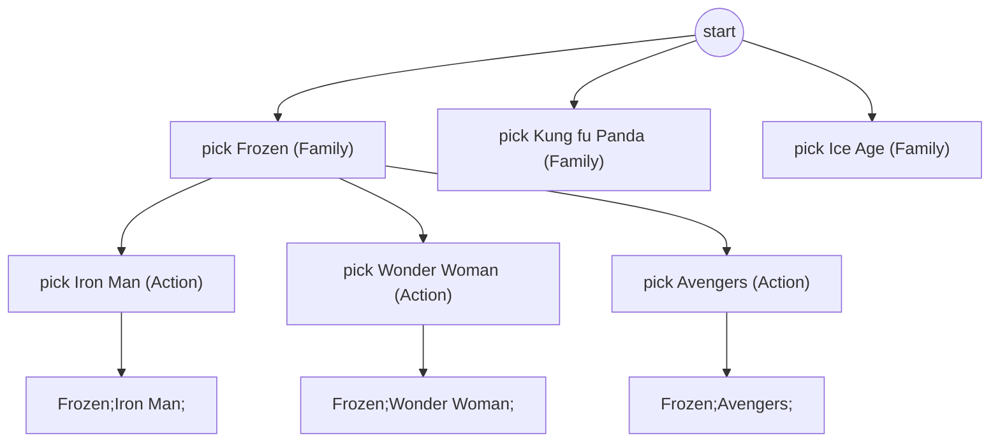

# Feature #9: Movie Combinations of a Genre

## The problem

Given a set of genres, generate every possible movie "marathon" combination that picks exactly one movie from each genre, in genre order.

Say we have:

```
Family:  ["Frozen", "Kung fu Panda", "Ice Age"]
Action:  ["Iron Man", "Wonder Woman", "Avengers"]
```

For the input `["Family", "Action"]`, we want every `Family` movie followed by every `Action` movie:

```java
["Frozen;Iron Man;", "Frozen;Wonder Woman;", "Frozen;Avengers;",
 "Kung fu Panda;Iron Man;", "Kung fu Panda;Wonder Woman;", "Kung fu Panda;Avengers;",
 "Ice Age;Iron Man;", "Ice Age;Wonder Woman;", "Ice Age;Avengers;"]
```

(The semicolon is just a separator between movie names in the combined string.)

## Solution

This is a job for **backtracking**: build a combination one genre at a time, and once you've picked a movie from every genre in the list, record the finished combination.

Break it down:

- **One genre** (e.g. `["Action"]`): trivial — every movie in that genre is its own complete combination: `["Iron Man"], ["Wonder Woman"], ["Avengers"]`.
- **Two genres** (e.g. `["Action", "Family"]`): for each one-genre solution of `Action` (say `"Iron Man"`), append every one-genre solution of `Family` — giving `[Iron Man, Frozen], [Iron Man, Kung fu Panda], [Iron Man, Ice Age]`, then move to the next `Action` movie and repeat.
- **n genres:** the same idea, recursively — pick one movie from the current genre, recurse into the remaining genres, and when there are no genres left, the path built so far *is* a complete combination.



This is the standard backtracking template: at each recursion depth, try every choice available at that depth, recurse one level deeper, then undo the choice (backtrack) and try the next one.

## Code

```java
import java.util.*;

class Solution {

    public static List<String> movieCombinations(Map<String, List<String>> genreMovies, List<String> genres) {
        List<String> combinations = new ArrayList<>();
        backtrack(genreMovies, genres, 0, new StringBuilder(), combinations);
        return combinations;
    }

    private static void backtrack(Map<String, List<String>> genreMovies, List<String> genres,
                                   int genreIndex, StringBuilder current, List<String> combinations) {
        if (genreIndex == genres.size()) {
            combinations.add(current.toString());
            return;
        }

        String genre = genres.get(genreIndex);
        for (String movie : genreMovies.get(genre)) {
            int lengthBefore = current.length();
            current.append(movie).append(";");

            backtrack(genreMovies, genres, genreIndex + 1, current, combinations);

            current.setLength(lengthBefore); // undo — try the next movie in this genre
        }
    }

    public static void main(String[] args) {
        Map<String, List<String>> genreMovies = new HashMap<>();
        genreMovies.put("Family", Arrays.asList("Frozen", "Kung fu Panda", "Ice Age"));
        genreMovies.put("Action", Arrays.asList("Iron Man", "Wonder Woman", "Avengers"));

        List<String> result = movieCombinations(genreMovies, Arrays.asList("Family", "Action"));
        result.forEach(System.out::println);
        // Frozen;Iron Man;
        // Frozen;Wonder Woman;
        // Frozen;Avengers;
        // Kung fu Panda;Iron Man;
        // ...
    }
}
```

## Complexity measures

Let **g** be the number of genres and **m** be the average number of movies per genre.

### Time Complexity

`O(m^g)` — every combination of one movie per genre must be generated; that's `m` choices at each of `g` levels.

### Space Complexity

`O(g)` for the recursion stack (depth = number of genres), plus `O(m^g × g)` to store all the generated combination strings.
