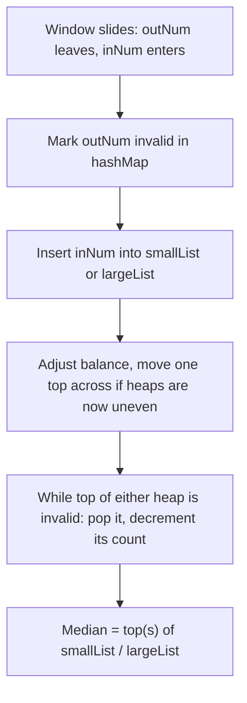

# Feature #10: Calculate Median of Buffering Events

## The problem

Netflix servers get flooded with session-quality reports — packet drops, buffering events — from thousands of concurrent streams. There's too much data to keep it all in memory per session, so only the **last `k` values** are kept (a sliding window); as a new value arrives, the oldest one drops off.

The **average** buffering count is misleading — a short burst of terrible network conditions skews it. The **median** is far more informative, so we need the median of the current `k`-sized window, recomputed as the window slides.

This is the **Sliding Window Median** problem — a direct extension of [Find Median Age](03-feature-3-find-median-age.md), except now old values also need to leave.

## Solution

We reuse the two-heap idea from Find Median Age:

- `smallList` — Max Heap, the smaller half of the current window.
- `largeList` — Min Heap, the larger half.

The new wrinkle: **removing an arbitrary element from a heap costs `O(log n)`, but finding it in the first place isn't `O(1)` like it is for the top.** Since we only ever need the *top* of each heap to compute the median, we don't need to physically remove an outgoing value the instant it leaves the window — we just need it gone **by the time it would reach the top**.

That's the **lazy deletion** trick:

1. Keep a `HashMap<value, count>` of values that have slid out of the window but might still be sitting inside a heap.
2. When the window slides, mark the outgoing value as invalid in the map (don't touch the heap itself yet).
3. Insert the incoming value into whichever heap it belongs to (same rule as before: `<= smallList.peek()` → `smallList`, else `largeList`).
4. Track a `balance` counter: the outgoing value leaving conceptually shrinks whichever heap it *would* belong to; the incoming value entering grows whichever heap it lands in. Use `balance` to know which heap needs to give up its top to the other to keep both halves the correct size.
5. After rebalancing, **prune**: while the top of either heap is marked invalid in the map, pop it and decrement its count in the map. This is where invalidated elements actually get removed — lazily, only once they'd otherwise interfere with the answer.
6. Read the median exactly as before: odd window → top of `smallList`; even window → average of both tops.



## Code

```java
import java.util.*;

class Solution {
    public static double[] medianSlidingWindow(int[] nums, int k) {
        List<Double> medians = new ArrayList<>();
        HashMap<Integer, Integer> invalid = new HashMap<>(); // value -> pending-removal count
        PriorityQueue<Integer> smallList = new PriorityQueue<>(Collections.reverseOrder()); // max heap
        PriorityQueue<Integer> largeList = new PriorityQueue<>(); // min heap

        // Seed the first window: put everything in smallList, then move the larger
        // half over to largeList so the two halves are balanced.
        for (int i = 0; i < k; i++) {
            smallList.offer(nums[i]);
        }
        for (int i = 0; i < k / 2; i++) {
            largeList.offer(smallList.poll());
        }

        for (int i = k; ; i++) {
            medians.add(k % 2 == 1
                    ? (double) smallList.peek()
                    : ((double) smallList.peek() + largeList.peek()) / 2.0);

            if (i >= nums.length) {
                break;
            }

            int outNum = nums[i - k];
            int inNum = nums[i];
            int balance = 0;

            balance += (outNum <= smallList.peek()) ? -1 : 1;
            invalid.merge(outNum, 1, Integer::sum);

            if (inNum <= smallList.peek()) {
                smallList.offer(inNum);
                balance++;
            } else {
                largeList.offer(inNum);
                balance--;
            }

            // Move one element across to restore the size balance between the two halves.
            if (balance < 0) {
                smallList.offer(largeList.poll());
            } else if (balance > 0) {
                largeList.offer(smallList.poll());
            }

            // Lazily drop invalidated values once they'd otherwise sit at the top.
            while (invalid.getOrDefault(smallList.peek(), 0) > 0) {
                invalid.merge(smallList.peek(), -1, Integer::sum);
                smallList.poll();
            }
            while (!largeList.isEmpty() && invalid.getOrDefault(largeList.peek(), 0) > 0) {
                invalid.merge(largeList.peek(), -1, Integer::sum);
                largeList.poll();
            }
        }

        double[] result = new double[medians.size()];
        for (int i = 0; i < result.length; i++) {
            result[i] = medians.get(i);
        }
        return result;
    }

    public static void main(String[] args) {
        int[] bufferingEvents = {1, 3, -1, -3, 5, 3, 6, 7};
        double[] medians = medianSlidingWindow(bufferingEvents, 4);
        System.out.println(Arrays.toString(medians)); // [0.0, 1.0, 1.0, 4.0, 5.5]
    }
}
```

## Complexity measures

Let **n** be the total number of values seen, and **k** be the sliding window size.

### Time Complexity

`O(n log k)` — every value is inserted into a heap of size `~k` once, and each rebalance/prune step is `O(log k)`.

### Space Complexity

`O(n)` — `O(k)` for the two heaps, plus up to `O(n - k)` entries in the invalidation map over the run of the algorithm.
