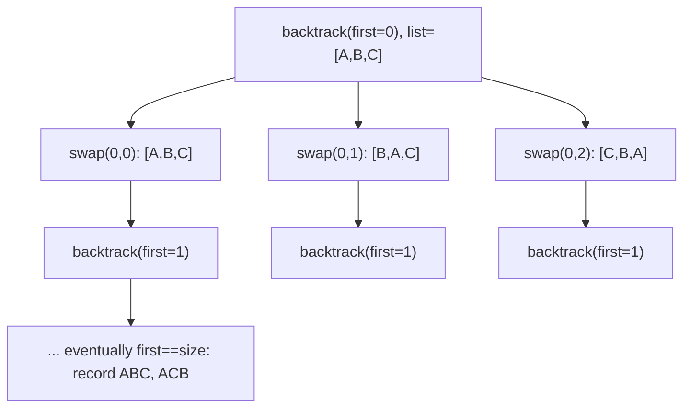

# Feature #11: Generate Movie Viewing Orders

## The problem

Netflix wants to offer curated movie **marathons** — a fixed set of movies for a specific taste. The order the movies are shown in affects how satisfied viewers feel, so the team wants to A/B test different viewing orders for the same marathon.

Given a marathon's list of movies, generate every possible order (permutation) they could be watched in.

For 3 movies `["A", "B", "C"]`, that's 6 orders: `ABC, ACB, BAC, BCA, CAB, CBA`.

## Solution

This is the classic **Permutations** backtracking pattern, using an in-place swap trick to avoid extra bookkeeping.

Think of building a permutation position by position. `backtrack(first)` means "the first `first` positions are already decided — now decide position `first` onward":

- **Base case:** if `first == size`, every position has been fixed — the current arrangement of `moviesList` *is* a complete permutation. Record a copy of it.
- **Recursive case:** for each candidate index `i` from `first` to `size - 1`, swap it into position `first` (`moviesList[first] <-> moviesList[i]`), recurse into `backtrack(first + 1)` to fill in the rest, then **swap back** — undoing the choice so the next candidate `i` gets a clean slate.



Swapping in place means we never need a separate "used" set or a growing "remaining candidates" list — the array itself always holds a valid partial permutation, and undoing the swap restores it exactly for the next branch.

## Code

```java
import java.util.*;

class Solution {

    public static List<List<String>> generateViewingOrders(List<String> movies) {
        List<List<String>> output = new ArrayList<>();
        backtrack(0, movies.size(), movies, output);
        return output;
    }

    private static void backtrack(int first, int size, List<String> moviesList, List<List<String>> output) {
        if (first == size) {
            output.add(new ArrayList<>(moviesList));
            return;
        }

        for (int i = first; i < size; i++) {
            Collections.swap(moviesList, first, i);
            backtrack(first + 1, size, moviesList, output);
            Collections.swap(moviesList, first, i); // undo — restore for the next candidate
        }
    }

    public static void main(String[] args) {
        List<String> marathon = Arrays.asList("Inception", "Interstellar", "Tenet");
        List<List<String>> orders = generateViewingOrders(new ArrayList<>(marathon));
        orders.forEach(System.out::println);
        // [Inception, Interstellar, Tenet]
        // [Inception, Tenet, Interstellar]
        // [Interstellar, Inception, Tenet]
        // [Interstellar, Tenet, Inception]
        // [Tenet, Interstellar, Inception]
        // [Tenet, Inception, Interstellar]
    }
}
```

## Complexity measures

Let **n** be the number of movies in the marathon.

### Time Complexity

`O(n!)` — there are exactly `n! = n × (n-1) × (n-2) × ... × 1` distinct orderings, and the algorithm produces each one exactly once.

### Space Complexity

`O(n)` for the recursion stack — the deepest call chain is `n` levels, one per position being fixed. (This doesn't count the `O(n! × n)` needed to actually store all the output permutations.)
