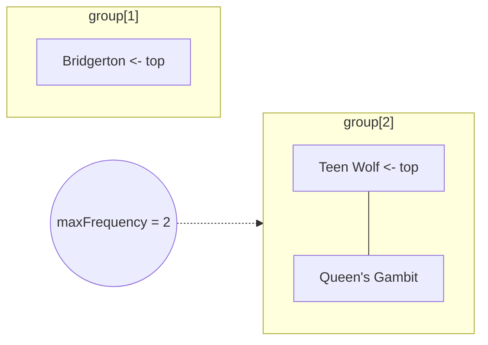

# Feature #12: Maintain Continue Watching Bar

## The problem

Every time a user watches an episode, we record the show's name. The "Continue Watching" bar should suggest the **most-watched show** first. If two shows are tied on watch count, suggest whichever of them was watched **most recently**.

For example, if the user watched episodes in this order:

```java
["Queen's Gambit", "Teen Wolf", "Bridgerton"]
```

...each watched once, they're all tied at frequency 1 — so the most recent one, `"Bridgerton"`, gets suggested. If the user goes on to watch another episode of `"Teen Wolf"`, it jumps to frequency 2 and becomes the top suggestion.

This is a "give me the most frequent, tie-broken by most recent" query — the **Maximum Frequency Stack** pattern.

## Solution

Track two maps and one counter:

- `frequency: Map<showName, count>` — how many times each show has been watched.
- `group: Map<count, Stack<showName>>` — for each frequency value, a stack of the shows currently at that frequency, in the order they reached it. Because it's a *stack*, the top is always the most recently added show at that frequency — which handles the tie-break for free.
- `maxFrequency` — the highest frequency currently in play, so we always know exactly which bucket in `group` to pop from.



Operations:

1. **`watch(showName)` (push):** look up the show's current frequency in `frequency` (0 if new), bump it by 1, store it back, and push `showName` onto `group[newFrequency]`. If `newFrequency` is now bigger than `maxFrequency`, update `maxFrequency`.
2. **`suggest()` (pop):** pop the top of `group[maxFrequency]` — that's the most-watched show, tie-broken by recency. Decrement that show's frequency by 1 in `frequency`. If `group[maxFrequency]` is now empty, decrement `maxFrequency` (the next-most-frequent bucket becomes the new maximum).

Both operations only ever touch the top of a stack and do map lookups — no scanning required.

## Code

```java
import java.util.*;

class FreqStack {
    private final Map<String, Integer> frequency;
    private final Map<Integer, Stack<String>> group;
    private int maxFrequency;

    public FreqStack() {
        frequency = new HashMap<>();
        group = new HashMap<>();
        maxFrequency = 0;
    }

    // Called every time the user watches an episode of showName.
    public void watch(String showName) {
        int newFreq = frequency.getOrDefault(showName, 0) + 1;
        frequency.put(showName, newFreq);

        if (newFreq > maxFrequency) {
            maxFrequency = newFreq;
        }

        group.computeIfAbsent(newFreq, f -> new Stack<>()).push(showName);
    }

    // Returns the show to suggest next on the "Continue Watching" bar.
    public String suggest() {
        Stack<String> topBucket = group.get(maxFrequency);
        String showName = topBucket.pop();

        frequency.put(showName, frequency.get(showName) - 1);
        if (topBucket.isEmpty()) {
            maxFrequency--;
        }

        return showName;
    }

    public static void main(String[] args) {
        FreqStack watchTracker = new FreqStack();
        watchTracker.watch("Queen's Gambit");
        watchTracker.watch("Teen Wolf");
        watchTracker.watch("Bridgerton");

        System.out.println(watchTracker.suggest()); // "Bridgerton" (tie at freq 1, most recent)

        watchTracker.watch("Teen Wolf"); // now freq 2, highest
        System.out.println(watchTracker.suggest()); // "Teen Wolf"
        System.out.println(watchTracker.suggest()); // "Queen's Gambit" (last one left at freq 1)
    }
}
```

## Complexity measures

Let **n** be the number of watch events recorded so far.

### Time Complexity

`O(1)` for both `watch` (push) and `suggest` (pop) — each is a map lookup plus a stack push/pop.

### Space Complexity

`O(n)` — every watch event adds one entry across `frequency` and `group`.
