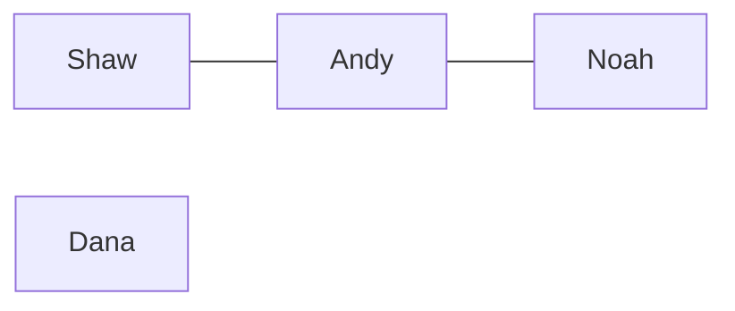

# Feature #1: Friend Circles

## The problem

A **friend circle** is a group of users who are all directly or indirectly connected as friends. Friendship is transitive: if Shaw is friends with Andy, and Andy is friends with Noah, then Shaw and Noah belong to the same friend circle — even though Shaw and Noah aren't direct friends.

We're given an `n x n` matrix where `n` is the number of Facebook users, and `matrix[i][j] == 1` means users `i` and `j` are direct friends. We need to find the total number of friend circles — useful for suggesting connections on Instagram, since everyone in a circle is "close" to everyone else in it.

For example:



Here there are **two** friend circles: `{Shaw, Andy, Noah}` (connected, even though Shaw and Noah aren't direct friends) and `{Dana}` alone.

## Solution

The friendship matrix *is* an adjacency matrix for an undirected graph — users are nodes, friendships are edges. A "friend circle" is exactly a **connected component** of that graph. So the question "how many friend circles are there?" is really "how many connected components does this graph have?"

Count connected components with a straightforward DFS sweep:

1. Keep a `visited[]` array, one entry per user, initially all `false`.
2. For every user `v` from `0` to `n-1`: if `visited[v]` is already `true`, skip them (already counted as part of some earlier circle). Otherwise, this user starts a **new** circle — run a DFS from `v`, marking every user reachable from `v` (direct or indirect friend) as `visited`.
3. Each time a fresh DFS finishes, increment the friend-circle counter by 1 — that whole DFS just walked one complete connected component.

```mermaid
flowchart TD
    A["for each user v"] --> B{visited[v]?}
    B -- yes --> A
    B -- no --> C["DFS from v, mark everyone reachable as visited"]
    C --> D["circles++"]
    D --> A
```

## Code

```java
class Solution {

    public static void dfs(boolean[][] friends, int n, boolean[] visited, int v) {
        for (int i = 0; i < n; i++) {
            if (friends[v][i] && !visited[i] && i != v) {
                visited[i] = true;
                dfs(friends, n, visited, i);
            }
        }
    }

    public static int countFriendCircles(boolean[][] friends) {
        int n = friends.length;
        boolean[] visited = new boolean[n];
        int circles = 0;

        for (int v = 0; v < n; v++) {
            if (!visited[v]) {
                visited[v] = true;
                dfs(friends, n, visited, v);
                circles++;
            }
        }

        return circles;
    }

    public static void main(String[] args) {
        // Shaw=0, Andy=1, Noah=2, Dana=3
        boolean[][] friends = {
                {true,  true,  false, false}, // Shaw - Andy
                {true,  true,  true,  false}, // Andy - Shaw, Noah
                {false, true,  true,  false}, // Noah - Andy
                {false, false, false, true}   // Dana - alone
        };

        System.out.println(countFriendCircles(friends)); // 2
    }
}
```

## Complexity measures

Let **n** be the number of users.

### Time Complexity

`O(n²)` — every cell of the `n x n` matrix is examined at most a constant number of times across all DFS calls combined.

### Space Complexity

`O(n)` — the `visited` array, plus up to `O(n)` recursion depth in the worst case (a chain of friends).
