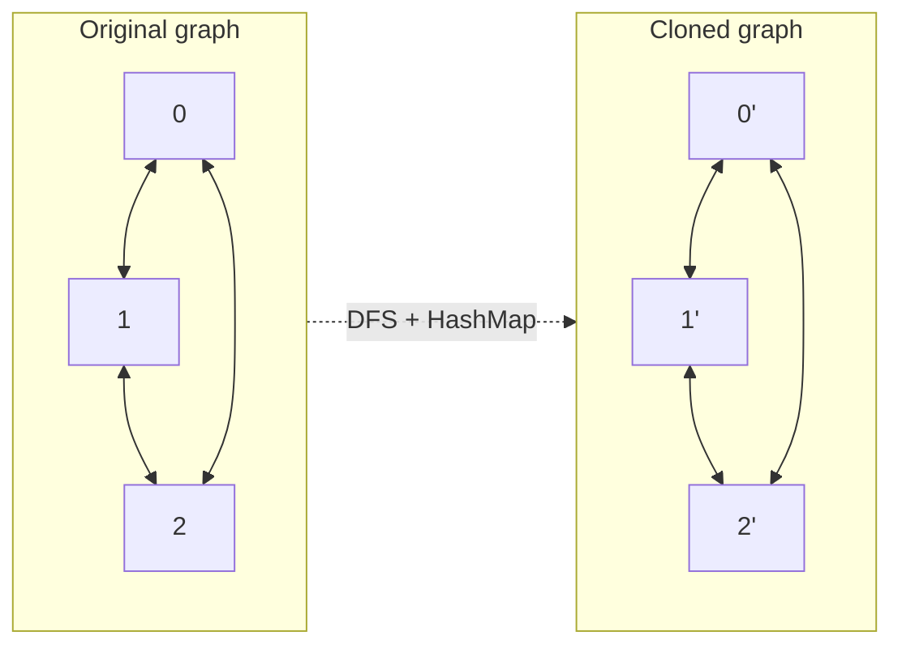

# Feature #2: Copy Connections

## The problem

Once we've identified everyone's friend circles, we need to **duplicate** that connection graph onto Instagram's servers, so Instagram can suggest the same friends independently.

Each Facebook user has a unique id and a graph-like structure of connections: a node pointing to the nodes of its friends. An edge can be bidirectional (both follow each other) or unidirectional (one follows the other). Starting from any one node, we need to walk the whole reachable graph and produce an **exact clone** of it — same nodes, same edges, but entirely new node objects (so Instagram's copy is independent of Facebook's).

This is the classic **Clone Graph** problem.

## Solution

Walk the graph with **DFS**, and every time we visit a node for the first time, create its clone immediately. The tricky part: the graph can have cycles (mutual friendships create loops), so a naive DFS would recurse forever.

Fix that with a `HashMap<originalNode, clonedNode>` that tracks every node we've already started cloning:

1. If the current node is already a key in the map, we've been here before — just return its clone from the map instead of recursing again.
2. Otherwise, create a new clone node, **store it in the map immediately** (before recursing into its friends) — this is what breaks the cycle, since the next time we reach this node via some other path, step 1 catches it.
3. Recurse into each of the original node's friends, cloning them the same way, and add each resulting clone to the new node's friend list.



Because the map is keyed by the *original* node, checking membership is `O(1)`, so each node is only ever cloned once no matter how many cycles pass through it.

## Code

```java
import java.util.*;

class Node {
    public int data;
    public List<Node> friends = new ArrayList<>();

    public Node(int data) {
        this.data = data;
    }
}

class Solution {

    public static Node cloneGraph(Node root) {
        return cloneRec(root, new HashMap<>());
    }

    private static Node cloneRec(Node root, HashMap<Node, Node> completed) {
        if (root == null) {
            return null;
        }

        if (completed.containsKey(root)) {
            return completed.get(root);
        }

        Node clone = new Node(root.data);
        completed.put(root, clone);

        for (Node friend : root.friends) {
            clone.friends.add(cloneRec(friend, completed));
        }

        return clone;
    }

    public static void main(String[] args) {
        // Build a triangle: 0 <-> 1 <-> 2 <-> 0
        Node n0 = new Node(0);
        Node n1 = new Node(1);
        Node n2 = new Node(2);
        n0.friends.addAll(List.of(n1, n2));
        n1.friends.addAll(List.of(n0, n2));
        n2.friends.addAll(List.of(n0, n1));

        Node clonedRoot = cloneGraph(n0);

        System.out.println(clonedRoot != n0);                     // true: new object
        System.out.println(clonedRoot.data);                      // 0
        System.out.println(clonedRoot.friends.size());            // 2
        System.out.println(clonedRoot.friends.get(0) != n1);       // true: cloned, not original
    }
}
```

## Complexity measures

Let **n** be the number of users (nodes) reachable from the starting node.

### Time Complexity

`O(n)` — each node is visited and cloned exactly once, thanks to the map.

### Space Complexity

`O(n)` — the map stores one entry per original node, plus recursion depth up to `O(n)` in the worst case.
