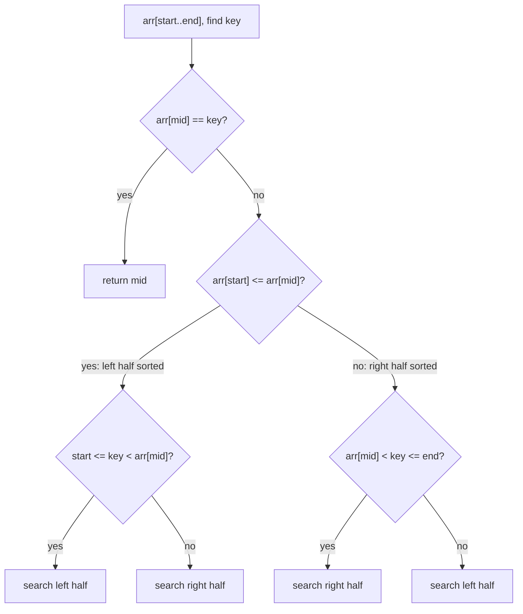

# Feature #3: Find Story ID

## The problem

Every story uploaded on Facebook gets a unique, increasing id. On Instagram, stories are watched one at a time, fetched from Facebook in ascending id order. As stories get watched, the array of story ids **rotates**: watched stories move to the end, unwatched ones stay bunched at the start.

The result is an array that's sorted overall but has been **rotated** at some pivot point — for example, ids `[4, 5, 6, 7, 0, 1, 2]` if `0, 1, 2, 3` have already been watched and moved to the back... except here the watched ones rotate to the *end* rather than getting removed, so we still see the full sorted sequence, just split and swapped at some pivot.

When a user re-watches a story, we need to find its id's index in this rotated array.

This is the classic **Search in Rotated Sorted Array** problem.

## Solution

A plain binary search assumes the whole array is sorted — it isn't, quite. But here's the key insight: **at least one half of a rotated sorted array is always fully sorted**, even though the whole thing isn't.

So at each step of binary search:

1. Compute `mid`. If `arr[mid]` is the target, we're done.
2. Figure out **which half is sorted** — compare `arr[start]` to `arr[mid]`:
   - If `arr[start] <= arr[mid]`, the **left half** (`start` to `mid`) is sorted.
   - Otherwise, the **right half** (`mid` to `end`) is sorted.
3. Check if the target falls **within the sorted half's range**:
   - If yes, recurse into that sorted half (ordinary binary search logic applies there).
   - If no, the target must be in the other half — recurse there instead.

Each step still halves the search space, so we keep binary search's `O(log n)` speed even though the array isn't fully sorted.



## Code

```java
class Solution {
    public static int search(int[] arr, int start, int end, int key) {
        if (start > end) {
            return -1;
        }

        int mid = start + (end - start) / 2;

        if (arr[mid] == key) {
            return mid;
        }

        if (arr[start] <= arr[mid]) {
            // Left half is sorted.
            if (arr[start] <= key && key < arr[mid]) {
                return search(arr, start, mid - 1, key);
            }
            return search(arr, mid + 1, end, key);
        } else {
            // Right half is sorted.
            if (arr[mid] < key && key <= arr[end]) {
                return search(arr, mid + 1, end, key);
            }
            return search(arr, start, mid - 1, key);
        }
    }

    public static void main(String[] args) {
        int[] storyIds = {4, 5, 6, 7, 0, 1, 2};
        System.out.println(search(storyIds, 0, storyIds.length - 1, 6)); // 2
        System.out.println(search(storyIds, 0, storyIds.length - 1, 0)); // 4
        System.out.println(search(storyIds, 0, storyIds.length - 1, 3)); // -1 (not present)
    }
}
```

## Complexity measures

Let **n** be the size of the story array.

### Time Complexity

`O(log n)` — the search space is halved at every step, same as ordinary binary search.

### Space Complexity

`O(1)` — no extra data structures are used (or `O(log n)` if you count the recursion stack; an iterative version avoids even that).
