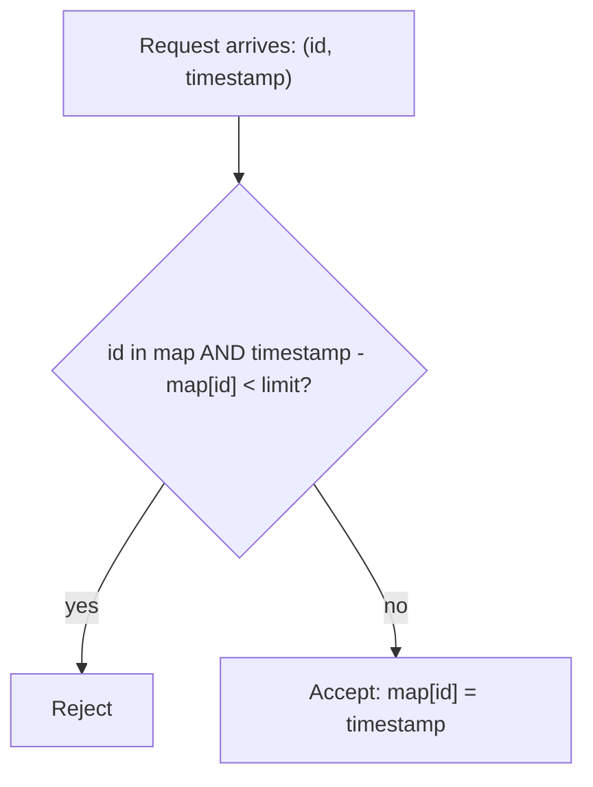

# Feature #4: Request Limiter

## The problem

The Facebook Status API queues requests using a status id and a timestamp. We want to throttle it: **only one request per status id is allowed within a configured time window** (say, 5 days) — any repeat request for the same status id inside that window gets dropped. Different status ids never interfere with each other, and can arrive at any time.

Given a request's name and its arrival timestamp, decide: accept or reject?

This is the classic **Logger Rate Limiter** pattern.

## Solution

A HashMap does exactly the two things we need at once: uniquely identify requests by key, and let us check-and-update in `O(1)`.

- Key: the request name (status id).
- Value: the timestamp of the last **accepted** request for that key.



Steps:

1. Start with an empty map.
2. When a request `(id, timestamp)` arrives: if `id` isn't in the map yet, or it is but the elapsed time since its stored timestamp is **at least** the limit, accept the request and set `map[id] = timestamp`.
3. Otherwise, reject it — leave the map untouched.

For example, if request `#2` was last accepted at `T4`, and a new request for `#2` arrives at `T12` (8 days later, past the 5-day limit), it's accepted and `map[2]` is updated to `T12`.

## Code

```java
import java.util.HashMap;

class RequestLimiter {
    private final HashMap<String, Integer> requests;
    private final int limitInDays;

    public RequestLimiter(int limitInDays) {
        requests = new HashMap<>();
        this.limitInDays = limitInDays;
    }

    // Returns true if the request is accepted, false if it's throttled.
    public boolean shouldAccept(String requestId, int timestamp) {
        if (!requests.containsKey(requestId) || timestamp - requests.get(requestId) >= limitInDays) {
            requests.put(requestId, timestamp);
            return true;
        }
        return false;
    }

    public static void main(String[] args) {
        RequestLimiter limiter = new RequestLimiter(5);

        System.out.println(limiter.shouldAccept("status#2", 4));  // true  (first time)
        System.out.println(limiter.shouldAccept("status#2", 6));  // false (only 2 days later)
        System.out.println(limiter.shouldAccept("status#2", 12)); // true  (8 days since T4)
        System.out.println(limiter.shouldAccept("status#3", 6));  // true  (different id)
    }
}
```

## Complexity measures

Let **r** be the number of distinct request ids seen so far.

### Time Complexity

`O(1)` — a single HashMap lookup and update per request.

### Space Complexity

`O(r)` — one entry per distinct request id tracked.
