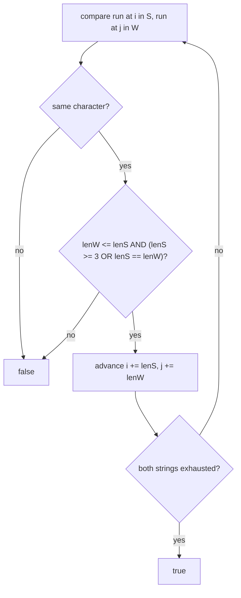

# Feature #5: Flag Words

## The problem

Facebook found that people dodge profanity filters by **stretching** words — repeating letters, like typing `"soooo baaaad"` instead of `"so bad"`. Their survey found the pattern: a stretched character is repeated **at least 3 times**. Runs shorter than 3 don't count as "stretching" (a naturally doubled letter, like the `oo` in `"good"`, shouldn't trigger anything).

Given a suspicious string `S` and the original clean word `W`, determine whether `W` could have been stretched into `S` under these rules.

This is the classic **Expressive Words** pattern.

## Solution

Walk both strings with a **two-pointer** approach, comparing them run by run (a "run" = a maximal sequence of the same repeated character):

1. Pointers `i` (into `S`) and `j` (into `W`) both start at 0.
2. If `S[i] != W[j]`, the words don't match at all — return `false` immediately.
3. Otherwise, measure the length of the repeated-character run starting at `i` in `S`, and the run starting at `j` in `W`. Call these `lenS` and `lenW`.
4. For this run to be a valid "stretch" of the original letter, **both** must hold:
   - `lenW <= lenS` — `S`'s run can't be *shorter* than `W`'s (you can't shrink a word by stretching it).
   - `lenS >= 3` **or** `lenS == lenW` — either `S`'s run is long enough to count as a genuine stretch, or the run wasn't stretched at all (matches exactly).
5. If either condition fails, return `false`. Otherwise, advance `i` by `lenS` and `j` by `lenW`, and continue.
6. If both pointers reach the end of their strings at the same time, return `true`.



## Code

```java
class Solution {

    public static boolean flagWords(String s, String w) {
        if (s == null || w == null) {
            return false;
        }

        int i = 0;
        int j = 0;

        while (i < s.length() && j < w.length()) {
            if (s.charAt(i) != w.charAt(j)) {
                return false;
            }

            int lenS = repeatedLetters(s, i);
            int lenW = repeatedLetters(w, j);

            if (lenW > lenS || (lenS < 3 && lenS != lenW)) {
                return false;
            }

            i += lenS;
            j += lenW;
        }

        return i == s.length() && j == w.length();
    }

    // Returns the length of the run of identical characters starting at `start`.
    private static int repeatedLetters(String str, int start) {
        int end = start;
        while (end < str.length() && str.charAt(end) == str.charAt(start)) {
            end++;
        }
        return end - start;
    }

    public static void main(String[] args) {
        System.out.println(flagWords("soooo", "so"));   // true  (o stretched 4x, >= 3)
        System.out.println(flagWords("soo", "so"));     // false ('o' run of 2 is < 3 and doesn't match W's run of 1 exactly)
        System.out.println(flagWords("hello", "hello")); // true (exact match, no stretching needed)
    }
}
```

## Complexity measures

Let `sl` be the length of `S` and `wl` be the length of `W`.

### Time Complexity

`O(max(sl, wl))` — both pointers advance monotonically to the end of their strings; each character is examined a constant number of times.

### Space Complexity

`O(1)` — only two pointers and run-length counters are used.
