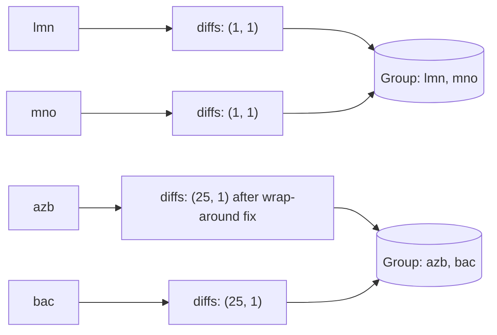

# Feature #6: Combine Similar Messages

## The problem

Someone is posting gibberish on Facebook. Investigation shows a pattern: they take a real word and **shift every letter** by the same fixed offset — like a Caesar cipher. `"hy"` shifted by 1 becomes `"iz"`; shifted by 2 it becomes `"ja"`.

To decode these messages, the first step is grouping together every message that's a shift of the same original word — so each group can be decoded independently.

Given an array of garbled strings, group the ones that differ from each other by a consistent per-character shift.

This is the classic **Group Shifted Strings** problem.

## Solution

Two words are shifted versions of each other exactly when the **differences between consecutive characters** are identical throughout.

Take `"lmn"` and `"mno"`: the gap between each pair of neighboring letters in `"lmn"` is `(1, 1)` (l→m is +1, m→n is +1); the gap in `"mno"` is also `(1, 1)`. Same "shape," so they belong to the same group — regardless of the actual shift amount used.

So build a signature per word: the sequence of `(next_char - current_char)` differences. Words with the *same* signature go in the same group. A HashMap does the grouping: key = signature, value = list of words sharing it.

**Wrap-around wrinkle:** letters cycle from `z` back to `a`. For `"azb"` vs `"bac"`: `z(122) - a(97) = 25`, but `a(97) - b(98) = -1`. Those should be the *same* signature (both are "shift forward by one step wrapping around"), but `-1 != 25` as raw numbers. Fix: whenever a difference is negative, add 26 (`-1 + 26 = 25`) — that's the correct "forward distance" on a 26-letter wheel.



Steps:

1. `generateKey(word)`: walk from the second character onward, computing `(word[i] - word[i-1] + 26) % 26` for each position, and join these into a single string key (e.g. `"1,1"`).
2. For every word, compute its key and append it to `messageGroup.get(key)` (creating the list if it's the first word with that key).
3. Return `messageGroup`'s values — each is one complete group.

## Code

```java
import java.util.*;

class Solution {

    public static Map<String, List<String>> combineMessages(String[] messages) {
        Map<String, List<String>> messageGroup = new HashMap<>();

        for (String message : messages) {
            String key = generateKey(message);
            messageGroup.computeIfAbsent(key, k -> new ArrayList<>()).add(message);
        }

        return messageGroup;
    }

    private static String generateKey(String word) {
        StringBuilder key = new StringBuilder();
        for (int i = 1; i < word.length(); i++) {
            int diff = (word.charAt(i) - word.charAt(i - 1) + 26) % 26;
            key.append(diff).append(",");
        }
        return key.toString();
    }

    public static void main(String[] args) {
        String[] messages = {"lmn", "mno", "azb", "bac", "cars"};
        Map<String, List<String>> groups = combineMessages(messages);
        groups.values().forEach(System.out::println);
        // [lmn, mno]
        // [azb, bac]
        // [cars]
    }
}
```

## Complexity measures

Let **n** be the number of messages and **l** the average message length.

### Time Complexity

`O(n × l)` — every message is scanned once to build its key.

### Space Complexity

`O(n)` — in the worst case, every message ends up in its own group.
