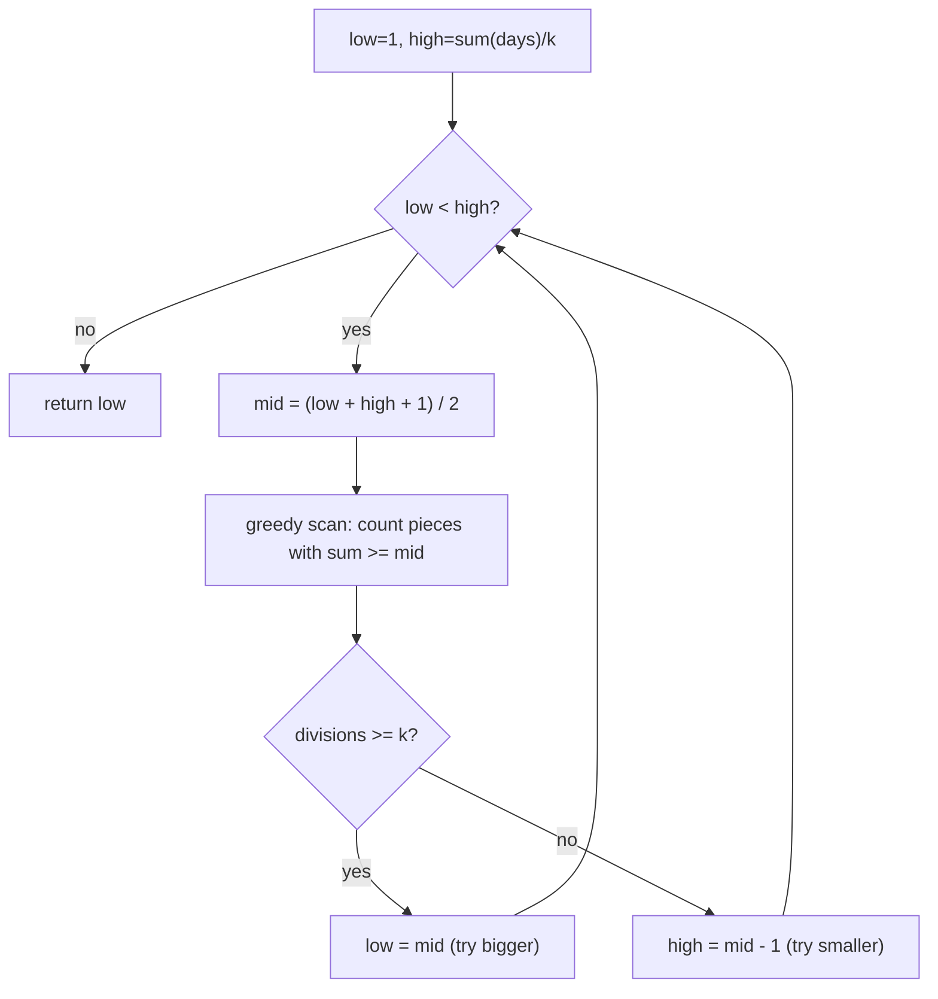

# Feature #7: Divide Posts

## The problem

We have daily post counts for last month, stored as an array (e.g. `[thousands of posts on day 1, day 2, ...]`). We have `k` worker nodes to mine this data. To keep the temporal relationship between consecutive days intact, each worker processes one **contiguous** run of days — so we're splitting the array into `k` contiguous pieces.

One of the `k` nodes is the **master** — it also processes a piece, but it's supposed to get the *smallest* piece (everyone else does more work than it). Given that constraint, we want to choose the split so the master's piece is **as large as possible** — i.e., maximize the minimum piece size across the whole split. That squeezes the most value out of the master node without violating "master gets the least work."

This is the **Divide Chocolate** pattern: split an array into `k` contiguous, non-empty pieces to **maximize the minimum piece sum**.

## Solution

Binary search — but not searching the array directly. We binary search over **candidate answers**: "could the smallest piece be at least `mid`?"

- **Lower bound:** `1` — worst case, the master gets a single post.
- **Upper bound:** `sum(days) / k` — the best any piece could possibly average out to, if all `k` pieces were exactly equal.

For a candidate value `mid`, check feasibility with a greedy scan:

1. Walk the array, accumulating a running `target` sum.
2. Whenever `target >= mid`, that's one complete piece — increment a `divisions` counter and reset `target = 0`.
3. After the scan, if `divisions >= k`, it means we *could* carve out at least `k` pieces each with sum `>= mid` — feasible! Try an even bigger `mid`.
4. If `divisions < k`, `mid` was too ambitious — try smaller.

This is exactly "binary search the answer, verify with a greedy check" — the same recipe as `koko eating bananas` or `capacity to ship packages within d days`.



Note the `+1` in `mid = (low + high + 1) / 2`: without it, when `low` and `high` are adjacent, integer division would always recompute `mid = low`, causing an infinite loop. Rounding up breaks that tie correctly for this "maximize" variant of binary search.

## Code

```java
import java.util.Arrays;

class Solution {

    public static int dividePosts(int[] days, int k) {
        int low = 1;
        int high = Arrays.stream(days).sum() / k;

        while (low < high) {
            int mid = (low + high + 1) / 2;

            int target = 0;
            int divisions = 0;
            for (int posts : days) {
                target += posts;
                if (target >= mid) {
                    divisions++;
                    target = 0;
                }
            }

            if (divisions >= k) {
                low = mid;
            } else {
                high = mid - 1;
            }
        }

        return low;
    }

    public static void main(String[] args) {
        int[] dailyPosts = {1, 2, 4, 3, 2}; // in thousands
        System.out.println(dividePosts(dailyPosts, 3)); // 3 (best split: [1,2]=3, [4]=4, [3,2]=5)
    }
}
```

## Complexity measures

Let **n** be the number of days and **m** be the total sum of posts across all days.

### Time Complexity

`O(n × log m)` — the binary search range is `O(log m)` wide, and each feasibility check does one `O(n)` scan.

### Space Complexity

`O(1)` — only a handful of counters are used.
