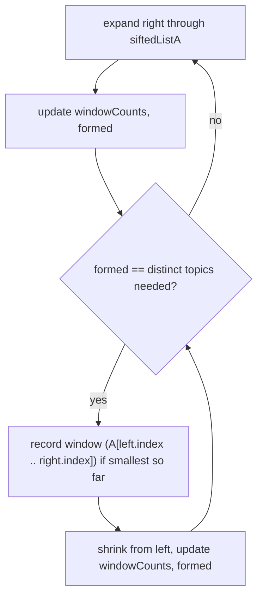

# Feature #8: Overlapping Topics

## The problem

Alice and Bob both post about various "topics." We want the **shortest contiguous stretch of Alice's wall** that mentions every topic Bob has ever posted about (duplicates and order in Bob's list don't matter — case-sensitive matching, though).

Example:

```java
A = ["corona", "petrol", "climate", "cricket", "climate", "corona", "soccer", "music", "submarine", "elections"]
B = ["corona", "climate"]
```

The shortest window of `A` containing both `"corona"` and `"climate"` is `["climate", "corona"]` — positions 4 and 5, right next to each other. (There's also a window at positions 0–2, `["corona", "petrol", "climate"]`, but that's longer.)

This is the **Minimum Window Substring** pattern, applied to arrays of topics instead of characters.

## Solution

Two ideas make this efficient:

**1. Filter out the noise first.** Most of Alice's posts aren't about any topic Bob cares about — comparing against them is wasted work. Build a `siftedListA`: every `(index, topic)` pair from `A` where `topic` is one Bob has posted about. For the example above:

```
siftedListA = [(0, corona), (2, climate), (4, climate), (5, corona)]
```

**2. Slide a window over the sifted list**, tracking whether it currently covers every required topic (with the required count for each, in case `B` has duplicates):

- Keep a `windowCounts` map (topic → count currently in the window) and a `formed` counter (how many *distinct* required topics currently have `windowCounts[topic] >= required[topic]`).
- Expand the window by moving `right` forward through `siftedListA`, updating `windowCounts` and `formed` as topics enter.
- Whenever `formed` equals the number of distinct required topics — the window fully covers `B` — try to **shrink** from the left: record this window (using the *original* indices in `A`, not the sifted list) if it's the smallest seen so far, then remove the leftmost sifted element from the window and advance `left`. Keep shrinking as long as the window still satisfies every requirement.
- Once shrinking breaks the requirement, go back to expanding `right`.



Because the recorded window uses the sifted elements' **original positions in `A`**, the final answer is a real contiguous slice of Alice's wall — it may include a few non-`B` posts sandwiched in between, which is exactly what "a contiguous portion of Alice's wall" should mean.

## Code

```java
import java.util.*;

class Solution {

    public static List<String> smallestOverlappingSequence(String[] a, String[] b) {
        Map<String, Integer> required = new HashMap<>();
        for (String topic : b) {
            required.merge(topic, 1, Integer::sum);
        }

        // (index in A, topic) for every element of A that's relevant to B.
        List<int[]> siftedIndices = new ArrayList<>(); // stores [index] only; topic looked up via a[index]
        for (int i = 0; i < a.length; i++) {
            if (required.containsKey(a[i])) {
                siftedIndices.add(new int[]{i});
            }
        }

        Map<String, Integer> windowCounts = new HashMap<>();
        int formed = 0;
        int distinctRequired = required.size();

        int bestLeftIdx = -1, bestRightIdx = -1;
        int left = 0;

        for (int right = 0; right < siftedIndices.size(); right++) {
            String rightTopic = a[siftedIndices.get(right)[0]];
            windowCounts.merge(rightTopic, 1, Integer::sum);
            if (windowCounts.get(rightTopic).intValue() == required.get(rightTopic).intValue()) {
                formed++;
            }

            while (formed == distinctRequired) {
                int windowStart = siftedIndices.get(left)[0];
                int windowEnd = siftedIndices.get(right)[0];
                if (bestLeftIdx == -1 || (windowEnd - windowStart) < (bestRightIdx - bestLeftIdx)) {
                    bestLeftIdx = windowStart;
                    bestRightIdx = windowEnd;
                }

                String leftTopic = a[siftedIndices.get(left)[0]];
                windowCounts.put(leftTopic, windowCounts.get(leftTopic) - 1);
                if (windowCounts.get(leftTopic) < required.get(leftTopic)) {
                    formed--;
                }
                left++;
            }
        }

        if (bestLeftIdx == -1) {
            return new ArrayList<>();
        }
        return new ArrayList<>(Arrays.asList(a).subList(bestLeftIdx, bestRightIdx + 1));
    }

    public static void main(String[] args) {
        String[] a = {"corona", "petrol", "climate", "cricket", "climate", "corona", "soccer", "music", "submarine", "elections"};
        String[] b = {"corona", "climate"};
        System.out.println(smallestOverlappingSequence(a, b)); // [climate, corona]
    }
}
```

## Complexity measures

Let **n** be the length of `A` and **m** be the length of `B`.

### Time Complexity

`O(n + m)` — building the required map is `O(m)`, filtering `A` is `O(n)`, and the sliding window makes at most two passes over `siftedListA` (which is at most size `n`).

### Space Complexity

`O(n + m)` — the required map is `O(m)`, and the sifted list plus window-tracking map are `O(n)` in the worst case (when most of `A`'s topics also appear in `B`).
