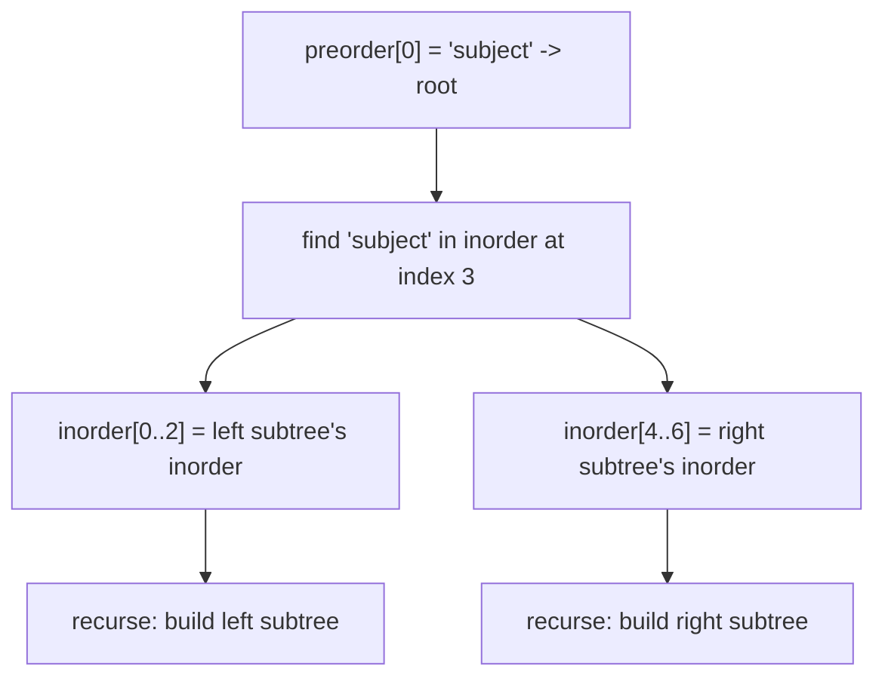
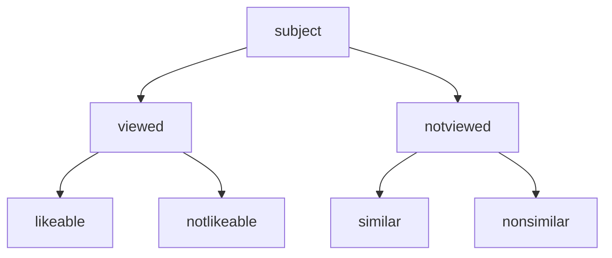

# Feature #9: Recreating the Decision Tree

## The problem

Facebook's ad-recommendation engine runs on a decision tree. To power the same recommendations on Instagram, that tree needs to be replicated onto Instagram's servers. But the tree isn't transmitted as a tree — it's serialized as two arrays: its **preorder** and **inorder** traversals (as strings). Instagram's server needs to rebuild the actual tree structure from just those two traversals.

Example:

```java
preorder = ["subject", "viewed", "likeable", "notlikeable", "notviewed", "similar", "nonsimilar"]
inorder  = ["likeable", "viewed", "notlikeable", "subject", "similar", "notviewed", "nonsimilar"]
```

This is the classic **Construct Binary Tree from Preorder and Inorder Traversal** problem.

## Solution

Two facts about these traversals make reconstruction possible:

- **Preorder** visits `root, left subtree, right subtree` — so the *first* element of any preorder slice is always that subtree's root.
- **Inorder** visits `left subtree, root, right subtree` — so once we know the root, its position in the inorder slice splits everything **before** it into the left subtree's inorder traversal, and everything **after** it into the right subtree's.

So the recursive recipe is:

1. Take the next unused element of `preorder` — that's the root of the current subtree.
2. Find that value's position in the current `inorder` range (this tells us how big the left subtree is).
3. Recursively build the left subtree from the inorder range *before* that position (consuming the next chunk of `preorder`).
4. Recursively build the right subtree from the inorder range *after* that position (consuming the following chunk of `preorder`).

To find a value's position in `inorder` in `O(1)` instead of scanning, precompute a `HashMap<value, index>` once at the start.



For the example above, this produces:



Since `preorder` is consumed strictly left-to-right regardless of which subtree we're in, a single shared index (`preorderIndex`, incremented every time we use an element) tracks "which preorder element is next" across the whole recursion.

## Code

```java
import java.util.HashMap;
import java.util.Map;

class TreeNode {
    String value;
    TreeNode left;
    TreeNode right;

    TreeNode(String value) {
        this.value = value;
    }
}

class Solution {
    private static int preorderIndex;
    private static Map<String, Integer> inorderValueToIndex;
    private static String[] preorder;

    public static TreeNode recreateDecisionTree(String[] preorderArr, String[] inorderArr) {
        preorder = preorderArr;
        preorderIndex = 0;

        inorderValueToIndex = new HashMap<>();
        for (int i = 0; i < inorderArr.length; i++) {
            inorderValueToIndex.put(inorderArr[i], i);
        }

        return buildTree(0, inorderArr.length - 1);
    }

    // Builds the subtree whose inorder traversal spans inorder[left..right].
    private static TreeNode buildTree(int left, int right) {
        if (left > right) {
            return null;
        }

        String rootValue = preorder[preorderIndex++];
        TreeNode root = new TreeNode(rootValue);

        int rootIndexInInorder = inorderValueToIndex.get(rootValue);

        root.left = buildTree(left, rootIndexInInorder - 1);
        root.right = buildTree(rootIndexInInorder + 1, right);

        return root;
    }

    public static void main(String[] args) {
        String[] preorderTraversal = {"subject", "viewed", "likeable", "notlikeable", "notviewed", "similar", "nonsimilar"};
        String[] inorderTraversal = {"likeable", "viewed", "notlikeable", "subject", "similar", "notviewed", "nonsimilar"};

        TreeNode root = recreateDecisionTree(preorderTraversal, inorderTraversal);

        System.out.println(root.value);              // subject
        System.out.println(root.left.value);          // viewed
        System.out.println(root.right.value);          // notviewed
        System.out.println(root.left.left.value);       // likeable
        System.out.println(root.left.right.value);      // notlikeable
        System.out.println(root.right.left.value);      // similar
        System.out.println(root.right.right.value);     // nonsimilar
    }
}
```

## Complexity measures

Let **n** be the number of nodes in the tree.

### Time Complexity

`O(n)` — building the value-to-index map is `O(n)`, and `buildTree` is called exactly once per node, doing `O(1)` work per call.

### Space Complexity

`O(n)` — the map holds `n` entries, plus recursion depth up to `O(n)` for a skewed tree.
