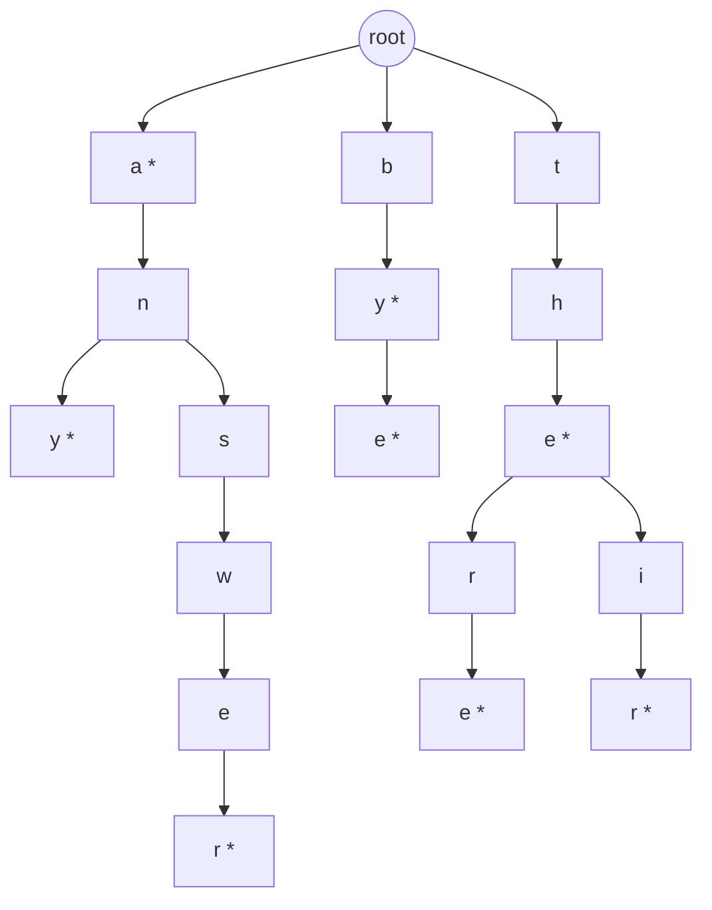

# Feature #1: Store and Fetch Words

## The problem

Design a module that stores words and supports fast lookups — a dictionary with `insertWord()`, `searchWord()`, and `startsWith()` (does any stored word begin with this prefix?).

Insert `the`, `a`, `there`, `answer`, `any`, `by`, `bye`, `their`, `abc`. Then:
- `searchWord("there")` → `true`
- `startsWith("by")` → `true` (matches both `by` and `bye`)

## Solution

A hash table handles `insertWord`/`searchWord` fine, but it's a poor fit for `startsWith` — you'd have to scan every stored word to check which ones start with a given prefix. What we actually want is a structure organized **by shared prefixes**, so a "does this prefix exist" query is as direct as "does this word exist."

That structure is a **trie** (prefix tree): a tree of characters, where each path from the root spells out a prefix, and any node can be flagged as "a real word ends here."



*(`*` marks nodes where a stored word ends.)*

Each node holds a `HashMap<Character, Node>` of its children, plus an `isWord` flag.

- **`insertWord(word)`:** start at the root; for each character, look it up in the current node's children — create a new child node if it's missing — then move into it. After the last character, set `isWord = true` on the node you land on.
- **`searchWord(word)`:** walk the same way. If any character along the way has no matching child, the word isn't stored — return `false`. If you reach the end of the word, only return `true` if that final node's `isWord` is `true` (a word like `"the"` shouldn't make `searchWord("th")` return true).
- **`startsWith(prefix)`:** identical walk to `searchWord`, but skip the `isWord` check at the end — reaching the last character of the prefix at all is enough.

## Code

```java
import java.util.HashMap;

class Node {
    public HashMap<Character, Node> children;
    public boolean isWord;

    public Node() {
        this.children = new HashMap<>();
        this.isWord = false;
    }
}

class WordDictionary {
    private final Node root;

    public WordDictionary() {
        root = new Node();
    }

    public void insertWord(String word) {
        Node current = root;
        for (char c : word.toCharArray()) {
            current.children.putIfAbsent(c, new Node());
            current = current.children.get(c);
        }
        current.isWord = true;
    }

    public boolean searchWord(String word) {
        Node node = walk(word);
        return node != null && node.isWord;
    }

    public boolean startsWith(String prefix) {
        return walk(prefix) != null;
    }

    private Node walk(String s) {
        Node current = root;
        for (char c : s.toCharArray()) {
            if (!current.children.containsKey(c)) {
                return null;
            }
            current = current.children.get(c);
        }
        return current;
    }

    public static void main(String[] args) {
        WordDictionary dict = new WordDictionary();
        for (String w : new String[]{"the", "a", "there", "answer", "any", "by", "bye", "their", "abc"}) {
            dict.insertWord(w);
        }

        System.out.println(dict.searchWord("there"));  // true
        System.out.println(dict.searchWord("the"));    // true
        System.out.println(dict.searchWord("th"));     // false (not a stored word)
        System.out.println(dict.startsWith("by"));     // true
        System.out.println(dict.startsWith("xyz"));    // false
    }
}
```

## Complexity measures

Let **l** be the length of the word or prefix being operated on.

|  | Time Complexity | Space Complexity |
|---|---|---|
| `insertWord()` | `O(l)` | `O(l)` |
| `searchWord()` | `O(l)` | `O(1)` |
| `startsWith()` | `O(l)` | `O(1)` |

`insertWord` may create up to `l` new nodes (space); `searchWord` and `startsWith` only walk existing nodes, no new allocation.
