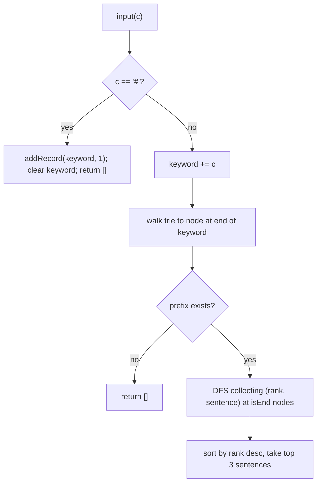

# Feature #2: Design Search Autocomplete System

## The problem

Build the autocomplete you see in every search bar: as the user types, suggest the top 3 previously-searched queries that start with what they've typed so far, ranked by popularity.

Historical data:

```java
queries = {"beautiful", "best quotes", "best friend", "best birthday wishes", "instagram", "internet"}
counts  = {30,           14,            21,            10,                     10,          15}
```

The input arrives **character by character**, as a stream: calling `autoComplete("be")` then `autoComplete("st")` means the user has typed `"best"` so far. A `"#"` marks the end of a query — at that point, the full typed string gets recorded (or its count incremented if it already existed), and the typed-so-far buffer resets.

- `autoComplete("be")` → `{"beautiful", "best friend", "best quotes"}` (ranked by popularity: 30, 21, 14)
- `autoComplete("st")` (now `"best"`) → `{"best friend", "best quotes", "best birthday wishes"}` (21, 14, 10)
- `autoComplete("#")` → `[]`, and `"best"` gets recorded with count 1

## Solution

Same trie idea as [Feature #1](01-feature-1-store-and-fetch-words.md), but now storing whole **queries** instead of dictionary words, and each end-of-query node also remembers its full sentence and how many times it's been searched.

Each node holds: `children`, `isEnd`, `sentence` (the complete query text, stored at the terminal node for convenience), and `rank` (search count).

- **Constructor:** seed the trie with the historical `(query, count)` pairs via `addRecord`.
- **`addRecord(sentence, count)`:** walk/create nodes character by character, same as `insertWord`. At the final node, set `isEnd = true`, store the `sentence`, and add `count` to `rank`.
- **`input(c)`:**
  - If `c == '#'`: call `addRecord(keyword, 1)` with the buffer built up so far, clear the buffer, return `[]`.
  - Otherwise: append `c` to the buffer, then `search(buffer)`.
- **`search(prefix)`:** walk the trie to the node at the end of `prefix`. If the prefix doesn't exist in the trie, return `[]`. Otherwise run a DFS from that node, collecting every `(rank, sentence)` pair at nodes with `isEnd == true`, then sort by rank descending (ties broken alphabetically) and return the top 3 sentences.



## Code

```java
import java.util.*;

class Node {
    HashMap<Character, Node> children = new HashMap<>();
    boolean isEnd = false;
    String sentence;
    int rank = 0;
}

class AutocompleteSystem {
    private final Node root = new Node();
    private final StringBuilder keyword = new StringBuilder();

    public AutocompleteSystem(String[] sentences, int[] times) {
        for (int i = 0; i < sentences.length; i++) {
            addRecord(sentences[i], times[i]);
        }
    }

    private void addRecord(String sentence, int count) {
        Node current = root;
        for (char c : sentence.toCharArray()) {
            current.children.putIfAbsent(c, new Node());
            current = current.children.get(c);
        }
        current.isEnd = true;
        current.sentence = sentence;
        current.rank += count;
    }

    public List<String> input(char c) {
        if (c == '#') {
            addRecord(keyword.toString(), 1);
            keyword.setLength(0);
            return new ArrayList<>();
        }

        keyword.append(c);
        return search(keyword.toString());
    }

    private List<String> search(String prefix) {
        Node current = root;
        for (char c : prefix.toCharArray()) {
            if (!current.children.containsKey(c)) {
                return new ArrayList<>();
            }
            current = current.children.get(c);
        }

        List<Node> matches = new ArrayList<>();
        dfs(current, matches);

        matches.sort((a, b) -> a.rank != b.rank ? b.rank - a.rank : a.sentence.compareTo(b.sentence));

        List<String> result = new ArrayList<>();
        for (int i = 0; i < Math.min(3, matches.size()); i++) {
            result.add(matches.get(i).sentence);
        }
        return result;
    }

    private void dfs(Node node, List<Node> matches) {
        if (node.isEnd) {
            matches.add(node);
        }
        for (Node child : node.children.values()) {
            dfs(child, matches);
        }
    }

    public static void main(String[] args) {
        String[] sentences = {"beautiful", "best quotes", "best friend", "best birthday wishes", "instagram", "internet"};
        int[] times = {30, 14, 21, 10, 10, 15};
        AutocompleteSystem system = new AutocompleteSystem(sentences, times);

        System.out.println(system.input('b'));
        System.out.println(system.input('e'));
        // ^ after "be": [beautiful, best friend, best quotes]

        System.out.println(system.input('s'));
        System.out.println(system.input('t'));
        // ^ after "best": [best friend, best quotes, best birthday wishes]

        System.out.println(system.input('#')); // [] -- records "best" with count 1
    }
}
```

## Complexity measures

Let **n** be the number of historical queries, **l** the average query length, **q** the number of matching queries for a given prefix, and **m** the prefix length.

### Time Complexity

- **Constructor:** `O(n × l)`.
- **`input()` / `search()`:** `O(m + q + q log q)` — `m` to walk down to the prefix node, `q` to DFS-collect matches, `q log q` to sort them.

### Space Complexity

`O(n × l)` — the trie holds every historical query's characters.
