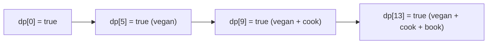

# Feature #3: Add White Spaces to Create Words

## The problem

Users often merge words by accident: `"vegancookbook"` instead of `"vegan cook book"`. When a query gets no results, we want to check whether inserting spaces can turn it into a sequence of valid dictionary words.

Given `query = "vegancookbook"` and dictionary `{"i", "cream", "cook", "scream", "ice", "cat", "book", "icecream", "vegan"}`, `breakQuery` should return `true` — `"vegan" + "cook" + "book"` are all valid words.

This is the classic **Word Break** problem.

## Solution

Dynamic programming: the whole query is breakable if it can be split into a prefix that's a valid word (or breakable itself) followed by a suffix that's also breakable. Build this bottom-up.

- `dp[i]` = true if `query[0..i)` (the first `i` characters) can be fully broken into dictionary words.
- Base case: `dp[0] = true` (the empty prefix trivially "breaks").
- Transition: `dp[i]` is true if there's **some** split point `j < i` where `dp[j]` is already true **and** `query[j..i)` is itself a dictionary word.



For `"vegancookbook"`: `dp[5]` becomes true because `query[0..5) = "vegan"` is a word and `dp[0]` is true. `dp[9]` becomes true because `query[5..9) = "cook"` is a word and `dp[5]` is true. `dp[13]` becomes true because `query[9..13) = "book"` is a word and `dp[9]` is true. The answer is `dp[query.length()]`.

Use a `HashSet` for the dictionary so each word lookup is `O(1)`.

## Code

```java
import java.util.*;

class Solution {
    public static boolean breakQuery(String query, String[] dict) {
        Set<String> dictSet = new HashSet<>(Arrays.asList(dict));

        boolean[] dp = new boolean[query.length() + 1];
        dp[0] = true;

        for (int i = 1; i <= query.length(); i++) {
            for (int j = 0; j < i; j++) {
                if (dp[j] && dictSet.contains(query.substring(j, i))) {
                    dp[i] = true;
                    break;
                }
            }
        }

        return dp[query.length()];
    }

    public static void main(String[] args) {
        String[] dict = {"i", "cream", "cook", "scream", "ice", "cat", "book", "icecream", "vegan"};
        System.out.println(breakQuery("vegancookbook", dict)); // true
        System.out.println(breakQuery("icecreamcat", dict));   // true (ice+cream+cat, or icecream+cat)
        System.out.println(breakQuery("vegandog", dict));      // false
    }
}
```

## Complexity measures

Let **n** be the length of `query`.

### Time Complexity

`O(n³)` — two nested loops over `i` and `j` (`O(n²)`), each iteration doing an `O(n)` substring extraction/hash.

### Space Complexity

`O(n)` for the `dp` array (plus the dictionary's own storage, which doesn't scale with `query`).
