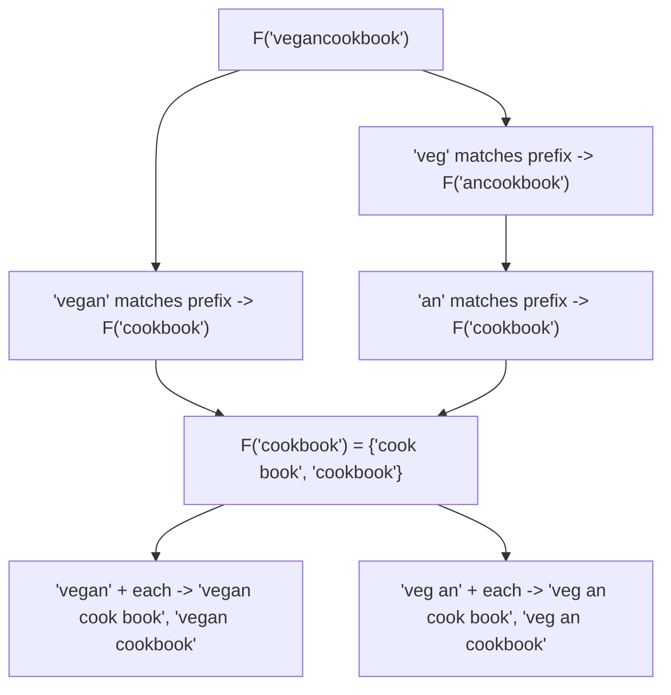

# Feature #4: Suggest Possible Queries After Adding White Spaces

## The problem

An extension of the last feature: instead of just checking *whether* a query can be broken into valid words, return **every possible way** to break it.

```java
query = "vegancookbook"
dict = {"an","book","car","cat","cook","cookbook","crash","cream","high",
        "highway","i","ice","icecream","low","scream","veg","vegan","way"}
```

Expected: `{"vegan cook book", "vegan cookbook", "veg an cook book", "veg an cookbook"}`.

For `"highwaycarcrash"` with the same dictionary: `{"high way car crash", "highway car crash"}`.

This is the classic **Word Break II** problem.

## Solution

Top-down DP (memoized recursion) is the natural fit here, because we need to build up and reuse **lists of sentences**, not just a boolean.

Define `F(q)` = the list of all valid ways to break string `q` into dictionary words. The recursive idea:

> For every word `w` in the dictionary that matches a prefix of `q`, split `q = w + postfix`. Every sentence in `F(postfix)`, with `w` prepended, is a valid sentence for `q`.



To avoid recomputing `F(postfix)` every time it's reached via a different prefix (notice `"cookbook"` is reached from both `"vegan"` and `"veg an"` above), **memoize**: cache `F(substring)` in a `HashMap<String, List<List<String>>>` the first time it's computed, and reuse it on every later call.

- Base case: `F("")` = a list containing one empty sentence (a "seed" so the recursion has something to prepend words onto).
- For a non-empty `q`: try every prefix length; if that prefix is a dictionary word, recursively solve the remaining suffix, and for each of *its* solutions, prepend the prefix word to build a full sentence for `q`.
- Cache and return the result.

## Code

```java
import java.util.*;

class Solution {

    public static List<String> breakQuery(String query, String[] dict) {
        Set<String> dictSet = new HashSet<>(Arrays.asList(dict));
        Map<String, List<String>> memo = new HashMap<>();
        return helper(query, dictSet, memo);
    }

    private static List<String> helper(String query, Set<String> dictSet, Map<String, List<String>> memo) {
        if (memo.containsKey(query)) {
            return memo.get(query);
        }

        List<String> result = new ArrayList<>();
        if (query.isEmpty()) {
            result.add("");
            return result;
        }

        for (int end = 1; end <= query.length(); end++) {
            String prefix = query.substring(0, end);
            if (!dictSet.contains(prefix)) {
                continue;
            }

            String suffix = query.substring(end);
            List<String> suffixSentences = helper(suffix, dictSet, memo);

            for (String suffixSentence : suffixSentences) {
                String sentence = suffixSentence.isEmpty() ? prefix : prefix + " " + suffixSentence;
                result.add(sentence);
            }
        }

        memo.put(query, result);
        return result;
    }

    public static void main(String[] args) {
        String[] dict = {"an", "book", "car", "cat", "cook", "cookbook", "crash", "cream",
                "high", "highway", "i", "ice", "icecream", "low", "scream", "veg", "vegan", "way"};

        System.out.println(breakQuery("vegancookbook", dict));
        // [veg an cook book, veg an cookbook, vegan cook book, vegan cookbook]

        System.out.println(breakQuery("highwaycarcrash", dict));
        // [high way car crash, highway car crash]
    }
}
```

## Complexity measures

Let **n** be the length of `query` and **w** be the total size of the dictionary.

### Time Complexity

`O(n² + 2ⁿ + w)` — in the worst case, the number of distinct sentences is exponential in `n` (every character could be its own one-letter word); memoization keeps each substring's work bounded, but assembling and returning all the sentences is inherently exponential in the worst case, plus `O(w)` to build the dictionary set.

### Space Complexity

`O(n × 2ⁿ + l)` — the memoization table can store up to `2ⁿ` sentences of length up to `n`, plus `l` for the dictionary's own storage.
