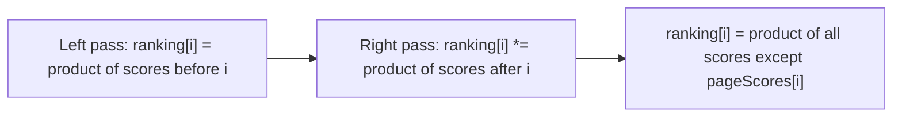

# Feature #5: Calculate the Search Ranking Factor

## The problem

A new ranking experiment: a set of web pages all reference each other, and each page already has a base quality score. A page's **ranking factor** is the product of every *other* page's score in the set (not its own).

For scores `{1, 4, 6, 9}`, the ranking factors are `{216, 54, 36, 24}` — e.g. the first page's factor is `4 × 6 × 9 = 216`.

This is the classic **Product of Array Except Self** problem.

## Solution

The brute-force way — for each page, multiply every *other* score — costs `O(n²)`. There's a neater way: the product of everything except index `i` is just `(product of everything to i's left) × (product of everything to i's right)`.

Compute both halves in two linear passes, without ever storing the "right products" as a separate array (to save space):

1. **Left pass:** `ranking[i]` = product of all scores strictly before index `i`. `ranking[0] = 1` (nothing to the left). Then `ranking[i] = pageScores[i-1] * ranking[i-1]`.
2. **Right pass:** walk from the end backward with a running variable `right` (starting at 1, "nothing to the right of the last index"). At each `i`, multiply `ranking[i] *= right` — this folds in the product of everything to the right. Then update `right *= pageScores[i]` before moving left, so it's ready for the next index.



## Code

```java
class Solution {
    public static int[] searchRanking(int[] pageScores) {
        int length = pageScores.length;
        int[] ranking = new int[length];

        ranking[0] = 1;
        for (int i = 1; i < length; i++) {
            ranking[i] = pageScores[i - 1] * ranking[i - 1];
        }

        int right = 1;
        for (int i = length - 1; i >= 0; i--) {
            ranking[i] *= right;
            right *= pageScores[i];
        }

        return ranking;
    }

    public static void main(String[] args) {
        int[] pageScores = {1, 4, 6, 9};
        System.out.println(java.util.Arrays.toString(searchRanking(pageScores))); // [216, 54, 36, 24]
    }
}
```

## Complexity measures

Let **n** be the number of pages.

### Time Complexity

`O(n)` — two linear passes over the array.

### Space Complexity

`O(n)` for the output `ranking` array (excluding the output, this runs in `O(1)` extra space).
