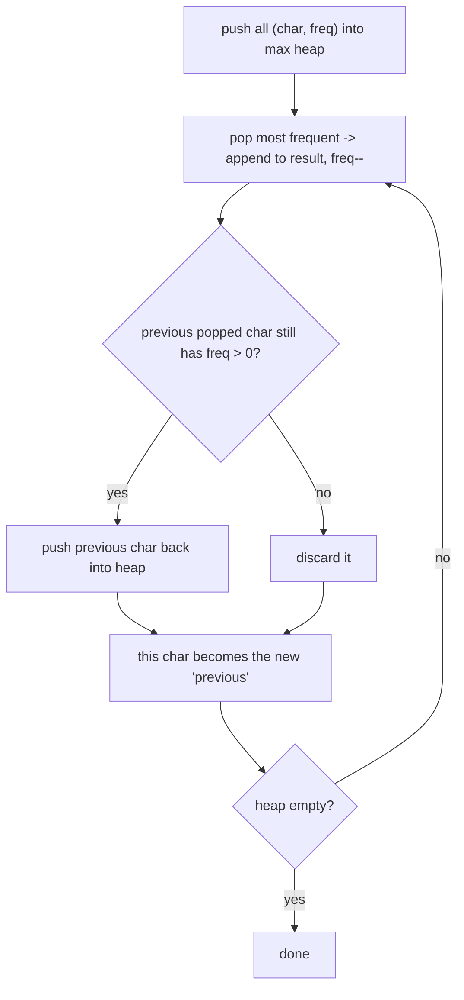

# Feature #6: Reorganizing Search Results

## The problem

A results page shows up to 25 results, and several can come from the same domain. To avoid showing near-duplicate results back-to-back, no two **adjacent** results should be from the same domain.

Represent each domain as a character. Given a string of domain-characters in some initial order, rearrange it so no two adjacent characters are the same. If that's impossible, just show the original order.

Example: `"bbnnc"` → `"bnbnc"` (or any other valid rearrangement).

This is the classic **Reorganize String** problem.

## Solution

Greedy, with a **max heap** keyed by frequency: always place the currently-most-frequent remaining character next, since it's the one at greatest risk of being forced into an adjacent collision later. As long as no character makes up more than `(n+1)/2` of the total, this greedy approach can always succeed.

**Feasibility check first:** if the most frequent character's count exceeds `(n+1)/2`, no valid arrangement exists (there just aren't enough "other" characters to separate its occurrences) — return the original string.

**Building the result:**

1. Count character frequencies; push every `(char, freq)` pair into a max heap ordered by `freq`.
2. Keep a "cooldown" slot — the character most recently placed, which can't be placed again immediately.
3. Repeatedly pop the current most-frequent character, append it to the result, and decrement its frequency. Then, if the *previous* iteration's character still has remaining frequency > 0, push it back into the heap now (it just finished its one-step cooldown).
4. Track the just-used character as the new "cooldown" holder, and repeat until the heap is empty.

This "hold the previous one out for exactly one step" trick guarantees the same character is never placed twice in a row, without needing to explicitly check "is this the same as the last character in the result" — the heap ordering plus the one-step delay handles it structurally.



## Code

```java
import java.util.*;

class Solution {

    public static String reorganizeResults(String domains) {
        Map<Character, Integer> freqMap = new HashMap<>();
        for (char c : domains.toCharArray()) {
            freqMap.merge(c, 1, Integer::sum);
        }

        int n = domains.length();
        int maxFreq = freqMap.values().stream().max(Integer::compareTo).orElse(0);
        if (maxFreq > (n + 1) / 2) {
            return domains; // impossible to rearrange -- show the original order
        }

        PriorityQueue<int[]> maxHeap = new PriorityQueue<>((a, b) -> b[1] - a[1]);
        for (Map.Entry<Character, Integer> entry : freqMap.entrySet()) {
            maxHeap.offer(new int[]{entry.getKey(), entry.getValue()});
        }

        StringBuilder result = new StringBuilder();
        int[] prev = null;

        while (!maxHeap.isEmpty()) {
            int[] current = maxHeap.poll();
            result.append((char) current[0]);
            current[1]--;

            if (prev != null && prev[1] > 0) {
                maxHeap.offer(prev);
            }
            prev = current;
        }

        return result.toString();
    }

    public static void main(String[] args) {
        System.out.println(reorganizeResults("bbnnc")); // e.g. "bnbnc"
        System.out.println(reorganizeResults("aaab"));  // "aaab" (impossible -- 'a' appears too often)
    }
}
```

## Complexity measures

Let **n** be the number of results.

### Time Complexity

`O(n log k)`, where `k` is the number of distinct domains — each of the `n` characters is pushed/popped from a heap of size at most `k`.

### Space Complexity

`O(k)` for the frequency map and heap.
