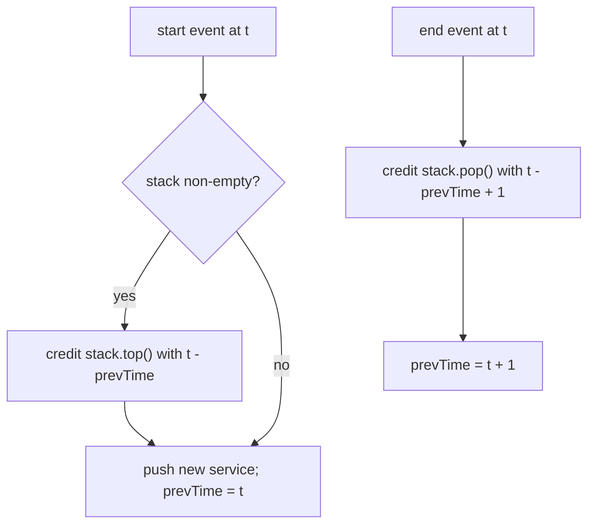

# Feature #7: Find Searching Time

## The problem

A search query fans out into many services (crawling, indexing, stemming, synonym lookup...), and some of these calls are **recursive** — a service can call itself before returning. We want to know how much time each service actually spent doing its *own* work, excluding time spent waiting on nested/recursive calls.

Logs record every start and end of a service invocation as a string: `"{service_id}:{start|end}:{timestamp}"`. Given a log of these events (properly nested, like matching parentheses), compute the exclusive running time of each service id.

This is the classic **Exclusive Time of Functions** problem.

## Solution

This is nested-call bookkeeping — exactly what a **stack** is for. The service currently on top of the stack is the one actively running; when a new service starts, it interrupts the one below it, and when a service ends, control returns to whatever's now on top.

Track a `prevTime` — the timestamp we last "accounted for" — and walk the log:

- **On a `start` event at time `t`:** if the stack isn't empty, the service currently on top has been running since `prevTime`, so credit it with `t - prevTime`. Push the new service onto the stack, and set `prevTime = t` (its clock starts now).
- **On an `end` event at time `t`:** the service on top of the stack finishes now. Credit it with `t - prevTime + 1` (the `+1` because timestamps are inclusive — a service running from tick 2 to tick 5 ran for `5 - 2 + 1 = 4` ticks). Pop it off the stack, and set `prevTime = t + 1` (the next segment starts right after this tick).



## Code

```java
import java.util.*;

class Solution {

    public static int[] findSearchingTime(int serviceCount, List<String> logs) {
        int[] servTimes = new int[serviceCount];
        Deque<Integer> stack = new ArrayDeque<>();
        int prevTime = 0;

        for (String log : logs) {
            String[] parts = log.split(":");
            int id = Integer.parseInt(parts[0]);
            String type = parts[1];
            int time = Integer.parseInt(parts[2]);

            if (type.equals("start")) {
                if (!stack.isEmpty()) {
                    servTimes[stack.peek()] += time - prevTime;
                }
                stack.push(id);
                prevTime = time;
            } else { // "end"
                servTimes[stack.pop()] += time - prevTime + 1;
                prevTime = time + 1;
            }
        }

        return servTimes;
    }

    public static void main(String[] args) {
        List<String> logs = List.of(
                "0:start:0",
                "1:start:2",
                "1:end:5",
                "0:end:6"
        );
        System.out.println(Arrays.toString(findSearchingTime(2, logs))); // [3, 4]
        // Service 0 ran ticks 0-1 and tick 6 = 3 ticks; service 1 ran ticks 2-5 = 4 ticks.
    }
}
```

## Complexity measures

Let **n** be the number of log entries.

### Time Complexity

`O(n)` — a single pass over the log.

### Space Complexity

`O(n)` — the stack can hold up to `n` nested service ids in the worst case (all starts before any end).
